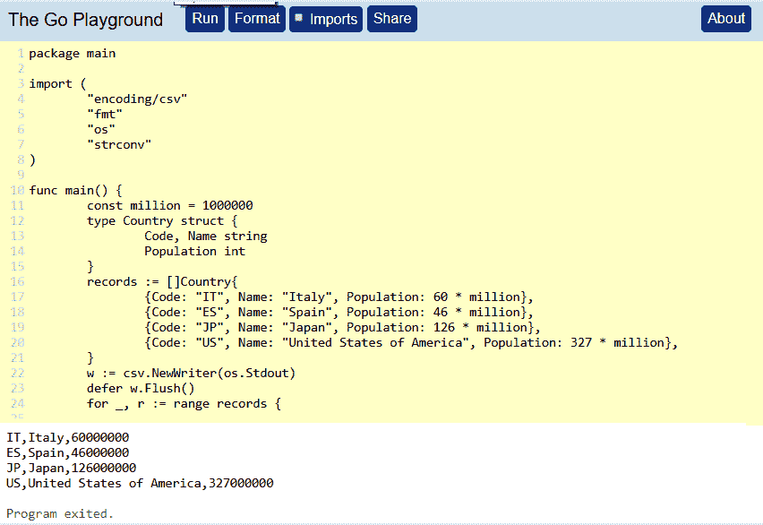

# 前言

本书将提供对各种有趣的 Go 概念的深入解释。它从 Unix 和系统编程开始，这将帮助您了解 Unix 操作系统提供了哪些组件，从内核 API 到文件系统，并让您熟悉系统编程的基本概念。

接下来，它继续涵盖 I/O 操作的应用，重点放在 Unix 操作系统中的文件系统、文件和流上。它涵盖了许多主题，包括从文件中读取和写入等 I/O 操作。

本书还展示了各种进程如何相互通信。它解释了如何在 Go 中使用基于 Unix 管道的通信，如何在应用程序内部处理信号，以及如何使用网络进行有效通信。此外，它还展示了如何对数据进行编码以提高通信速度。

本书最后将帮助您了解 Go 最现代的特性——并发。它将向您介绍语言的工具，包括 sync 和通道，以及如何何时使用每一个。

# 本书适合对象

本书适合希望学习 Go 系统编程的开发人员。虽然不需要 Unix 和 Linux 系统编程的先前知识，但一些中级 Go 知识将有助于您理解本书中涵盖的概念。

# 本书涵盖的内容

第一章，*系统编程简介*，向您介绍了 Go 和系统编程，并提供了一些基本概念以及 Unix 及其资源的概述，包括内核 API。它还定义了本书其余部分中使用的许多概念。

第二章，*Unix 操作系统组件*，重点放在 Unix 操作系统以及您将与之交互的组件上——文件和文件系统、进程、用户和权限、线程等。它还解释了操作系统的各种内存管理技术，以及 Unix 如何处理驻留内存和虚拟内存。

第三章，*Go 概述*，介绍了 Go，从语言的历史开始，然后逐一解释了所有基本概念，从命名空间和类型系统、变量和流程控制，到内置函数和并发模型，同时还解释了 Go 如何交互和管理其内存。

第四章，*使用文件系统*，帮助您了解 Unix 文件系统的工作原理，以及如何掌握 Go 标准库来处理文件路径操作、文件读取和文件写入。

第五章，*处理流*，帮助您了解 Go 用于抽象数据流的输入和输出流的接口。它解释了它们的工作原理，以及如何组合它们并在不泄露信息的情况下最好地使用它们。

第六章，*构建伪终端*，帮助您了解伪终端应用程序的工作原理以及如何创建一个。结果将是一个使用标准流的交互式应用程序，就像命令行一样。

第七章，*处理进程和守护进程*，提供了进程是什么以及如何在 Go 中处理它们的解释，如何从 Go 应用程序启动子进程，以及如何创建一个将保持在后台（守护进程）并与其交互的命令行应用程序。

第八章，“退出代码、信号和管道”，讨论了 Unix 进程间通信。它解释了如何有效地使用退出代码。它向您展示了应用程序内部如何默认处理信号，以及如何使用一些模式来有效地处理信号。此外，它解释了如何使用管道连接不同进程的输出和输入。

第九章，“网络编程”，解释了如何使用网络进行进程通信。它解释了网络通信协议的工作原理。它最初专注于低级套接字通信，如 TCP 和 UDP，然后转向使用众所周知的 HTTP 协议进行 Web 服务器开发。最后，它展示了如何使用 Go 模板引擎。

第十章，“使用 Go 进行数据编码”，解释了如何利用 Go 标准库对复杂数据结构进行编码，以便促进进程通信。它分析了基于文本的协议，如 XML 和 JSON，以及基于二进制的协议，如 GOB。

第十一章，“处理通道和 Goroutines”，解释了并发和通道的基础知识，以及一些通用规则，可以防止在应用程序中创建死锁和资源泄漏。

第十二章，“使用 sync 和 atomic 进行同步”，讨论了`sync`和`sync/atomic`标准库的同步包，以及如何使用它们来轻松实现并发，而不是使用通道。它还专注于避免资源泄漏和回收资源。

第十三章，“使用上下文进行协调”，讨论了`Context`，这是 Go 中一个相对较新的包，提供了一种有效处理异步操作的简单方法。

第十四章，“实现并发模式”，使用前三章的工具，并演示如何有效地使用和组合它们进行通信。它专注于 Go 中最常用的并发模式。

第十五章，“使用反射”，解释了反射是什么，以及是否应该使用它。它展示了标准库中的反射用途，并指导您创建一个实际的例子。它还展示了如何在没有必要使用反射的情况下避免使用它。

第十六章，“使用 CGO”，解释了 CGO 的工作原理，以及为什么以及何时应该使用它。它解释了如何在 Go 应用程序中使用 C 代码，以及如何在 C 代码中使用 Go。

# 充分利用本书

尝试示例和构建现代应用程序需要一些 Go 的基础知识。

每一章都包括一组问题，这些问题将帮助您评估对该章节的理解。这些问题将对您非常有益，因为它们将帮助您快速复习每一章。

此外，每一章都提供了如何运行代码文件的说明，而书的 GitHub 存储库提供了必要的细节。

# 下载示例代码文件

您可以从[www.packt.com](http://www.packt.com)的帐户中下载本书的示例代码文件。如果您在其他地方购买了本书，您可以访问[www.packt.com/support](http://www.packt.com/support)并注册，以便直接通过电子邮件接收文件。

您可以按照以下步骤下载代码文件：

1.  在[www.packt.com](http://www.packt.com)登录或注册。

1.  选择“支持”选项卡。

1.  点击“代码下载和勘误”。

1.  在搜索框中输入书名，并按照屏幕上的说明操作。

下载文件后，请确保使用以下最新版本解压或提取文件夹：

+   WinRAR/7-Zip for Windows

+   Zipeg/iZip/UnRarX for Mac

+   7-Zip/PeaZip for Linux

本书的代码包也托管在 GitHub 上，链接为[`github.com/PacktPublishing/Hands-On-System-Programming-with-Go`](https://github.com/PacktPublishing/Hands-On-System-Programming-with-Go)。如果代码有更新，将在现有的 GitHub 存储库上进行更新。

我们还提供了来自我们丰富书籍和视频目录的其他代码包，可在**[`github.com/PacktPublishing/`](https://github.com/PacktPublishing/)**上找到。快去看看吧！

# 下载彩色图片

我们还提供了一份 PDF 文件，其中包含本书中使用的屏幕截图/图表的彩色图片。您可以在此处下载：[`static.packt-cdn.com/downloads/9781789804072_ColorImages.pdf`](https://static.packt-cdn.com/downloads/9781789804072_ColorImages.pdf)。

# 代码示例

访问以下链接查看代码运行的视频：[`bit.ly/2ZWgJb5`](http://bit.ly/2ZWgJb5)。

# 示例演示

在本书中，您会发现许多代码片段，后面跟着一个链接到[`play.golang.org`](https://play.golang.org)，这是一个允许您以一定限制运行 Go 应用程序的服务。您可以在[`blog.golang.org/playground`](https://blog.golang.org/playground)上了解更多信息。

要查看此类示例的完整源代码，您需要访问 Playground 链接。一旦进入网站，您可以点击运行按钮来执行应用程序。页面底部将显示输出。以下是代码在 Go Playground 中运行的示例：



如果您愿意，您可以通过向示例添加和编辑更多代码，然后运行它们来进行实验。

# 使用的约定

本书中使用了许多文本约定。

`CodeInText`：表示文本中的代码词、数据库表名、文件夹名、文件名、文件扩展名、路径名、虚拟 URL、用户输入和 Twitter 句柄。例如："这种服务包括`load`，它将程序加载到内存并在将控制传递给程序本身之前准备执行程序，或者`execute`，它在现有进程的上下文中运行可执行文件。"

代码块设置如下：

```go
<meta name="go-import" content="package-name vcs repository-url">
```

任何命令行输入或输出都将按如下方式书写：

```go
Enable-WindowsOptionalFeature -Online -FeatureName Microsoft-Windows-Subsystem-Linux
```

**粗体**：表示新术语、重要单词或屏幕上看到的单词。例如，菜单或对话框中的单词会以这种方式出现在文本中。例如："与此同时，系统开始变得分布式，应用程序开始以容器的形式进行交付，并由其他系统软件进行编排，比如**Kubernetes**。"

警告或重要说明会显示为这样。

提示和技巧会显示为这样。
