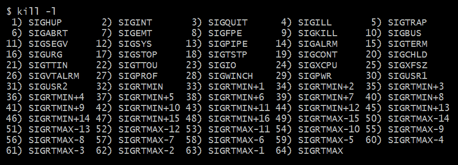

# 第二章：Unix 操作系统组件

本章将重点放在 Unix 操作系统上，以及用户将与之交互的组件：文件和文件系统、进程、用户和权限等。它还将解释一些基本的进程通信以及系统程序错误处理的工作原理。在创建系统应用程序时，我们将与操作系统的所有这些部分进行交互。

本章将涵盖以下主题：

+   内存管理

+   文件和文件系统

+   进程

+   用户、组和权限

+   进程通信

# 技术要求

与上一章类似，本章不需要安装任何软件：任何其他符合 POSIX 标准的 shell 都足够了。

您可以选择，例如，Bash ([`www.gnu.org/software/bash/`](https://www.gnu.org/software/bash/))，这是推荐的，Zsh ([`www.zsh.org/`](http://www.zsh.org/))，或者 fish ([`fishshell.com/`](https://fishshell.com/))。

# 内存管理

操作系统处理应用程序的主要和辅助内存使用。它跟踪内存的使用情况，由哪个进程使用，哪些部分是空闲的。它还处理从进程分配新内存以及进程完成时的内存释放。

# 管理技术

处理内存有不同的技术，包括以下内容：

+   **单一分配**：除了为操作系统保留的部分外，所有内存都可供应用程序使用。这意味着一次只能执行一个应用程序，就像在**Microsoft 磁盘操作系统**（**MS-DOS**）中一样。

+   **分区分配**：这将内存分成不同的块，称为分区。使用其中一个块来执行一个以上的进程是可能的。分区可以重新定位和压缩，以获得下一个进程的更连续的内存空间。

+   **分页内存**：内存被分成称为帧的部分，其大小固定。进程的内存被分成相同大小的部分，称为**页面**。页面和帧之间有映射，使进程看到自己的虚拟内存是连续的。这个过程也被称为**分页**。

# 虚拟内存

Unix 使用分页内存管理技术，将每个应用程序的内存抽象为连续的虚拟内存。它还使用一种称为交换的技术，将虚拟内存扩展到辅助内存（硬盘或固态硬盘（SSD））使用交换文件。

当内存稀缺时，操作系统将处于休眠状态的进程的页面放入交换分区，以为正在请求更多内存的活动进程腾出空间，执行称为**换出**的操作。当执行中的进程需要交换文件中的页面时，它会被加载回主内存以执行。这称为**换入**。

交换的主要问题是与辅助内存交互时的性能下降，但它对于扩展多任务处理能力以及处理比物理内存更大的应用程序非常有用，只需在给定时间加载实际需要的部分。创建内存高效的应用程序是通过避免或减少交换来提高性能的一种方式。

`top`命令显示有关可用内存、交换和每个进程的内存消耗的详细信息：

+   `RES`是进程使用的物理主内存。

+   `VIRT`是进程使用的总内存，包括交换内存，因此它等于或大于`RES`。

+   `SHR`是实际可共享的`VIRT`的部分，例如加载的库。

# 了解文件和文件系统

文件系统是在磁盘中结构化数据的方法，文件是指示自包含信息的抽象。如果文件系统是分层的，这意味着文件是组织在目录树中的，目录是用于安排存储文件的特殊文件。

# 操作系统和文件系统

在过去的 50 年中，已经发明和使用了大量文件系统，每个文件系统都有其自己的特点，包括空间管理、文件名和目录、元数据和访问限制。每个现代操作系统主要使用一种类型的文件系统。

# Linux

Linux 的首选文件系统是**extended filesystem**（**EXT**）家族，但也支持其他文件系统，包括 XFS、**Journaled File System**（**JFS**）和**B-tree File System**（**Btrfs**）。它还兼容旧的**File Allocation Table**（**FAT**）家族（FAT16 和 FAT32）和**New Technology File System**（**NTFS**）。最常用的文件系统仍然是最新版本的 EXT（EXT4），它于 2006 年发布，扩展了其前身的功能，包括对更大磁盘的支持。

# macOS

macOS 使用**Apple File System**（**APFS**），支持 Unix 权限并具有日志记录。它还具有丰富的元数据和保留大小写，同时又是大小写不敏感的文件系统。它支持其他文件系统，包括 HFS+和 FAT32，支持 NTFS 进行只读操作。要向这样的文件系统写入，我们可以使用实验性功能或第三方应用程序。

# Windows

Windows 主要使用的文件系统是 NTFS。除了大小写不敏感外，区分 Windows 文件系统与其他文件系统的特征是在路径中使用字母后跟冒号来表示分区，结合使用反斜杠作为文件夹分隔符，而不是正斜杠。驱动器字母和使用 C 表示主分区来自 MS-DOS，其中 A 和 B 是保留的驱动器字母，用于软盘驱动器。

Windows 还原生支持其他文件系统，如 FAT，这是一个在 70 年代末到 90 年代末非常流行的文件系统家族，以及由 Microsoft 开发的**Extended File Allocation Table**（**exFAT**），用于可移动设备的格式。

# 文件和硬链接和软链接

大多数文件都是常规文件，包含一定数量的数据。例如，文本文件包含一系列由特定编码表示的可读字符，而位图包含有关每个像素的大小和使用的位的一些元数据，然后是每个像素的内容。

文件被安排在目录中，这使得可以有不同的命名空间来重用文件名。这些文件通过名称引用，它们的人类可读标识符，并以树结构组织。路径是表示目录的唯一标识符，由所有父目录的名称通过分隔符（Unix 中为`/`，Windows 中为`\`）连接而成，从根目录到所需的叶子。例如，如果一个名为`a`的目录位于另一个名为`b`的目录下，后者位于名为`c`的目录下，它将从根目录开始并连接所有目录，直到文件：`/c/b/a`。

当多个文件指向相同的内容时，我们有一个**硬链接**，但这在所有文件系统中都不允许（例如 NTFS 和 FAT）。**软链接**是指向另一个软链接或硬链接的文件。硬链接可以被删除或删除而不会破坏原始链接，但对于软链接来说并非如此。**符号链接**是一个具有自己数据的常规文件，它是另一个文件的路径。它还可以链接其他文件系统或不存在的文件和目录（这将是一个损坏的链接）。

在 Unix 中，一些实际上不是文件的资源被表示为文件，并且与这些资源的通信是通过写入或从它们对应的文件中读取来实现的。例如，`/dev/sda`文件代表整个磁盘，而`/dev/stdout`，`dev/stdin`和`/dev/stderr`是标准输出，输入和错误。*一切皆文件*的主要优势是可以使用于文件的相同工具也可以与其他设备（网络和管道）或实体（进程）进行交互。

# Unix 文件系统

本节中包含的原则特定于 Linux 使用的文件系统，如 EXT4。

# 根和 inode

在 Linux 和 macOS 中，每个文件和目录都由一个**inode**表示，这是一种特殊的数据结构，存储有关文件的所有信息，除了其名称和实际数据。

inode `0`用于空值，这意味着没有 inode。inode `1`用于记录磁盘上的任何坏块。文件系统的分层结构的根使用 inode `2`。它由`/`表示。

从最新的 Linux 内核源代码中，我们可以看到保留了第一个 inode。如下所示：

```go
#define EXT4_BAD_INO 1 /* Bad blocks inode */
#define EXT4_ROOT_INO 2 /* Root inode */
#define EXT4_USR_QUOTA_INO 3 /* User quota inode */
#define EXT4_GRP_QUOTA_INO 4 /* Group quota inode */
#define EXT4_BOOT_LOADER_INO 5 /* Boot loader inode */
#define EXT4_UNDEL_DIR_INO 6 /* Undelete directory inode */
#define EXT4_RESIZE_INO 7 /* Reserved group descriptors inode */
#define EXT4_JOURNAL_INO 8 /* Journal inode */
```

此链接是上述代码块的来源：[`elixir.bootlin.com/linux/latest/source/fs/ext4/ext4.h#L212`](https://elixir.bootlin.com/linux/latest/source/fs/ext4/ext4.h#L212)。

# 目录结构

在 Unix 文件系统中，根目录下还有一系列其他目录，每个目录用于特定目的，使得可以在不同操作系统之间保持一定的互操作性，并使得编译的软件可以在不同的操作系统上运行，使得二进制文件具有可移植性。

这是一个包含其范围的目录的全面列表：

| **目录** | **描述** |
| --- | --- |
| `/bin` | 所有用户的可执行文件 |
| `/boot` | 用于引导系统的文件 |
| `/dev` | 设备驱动程序 |
| `/etc` | 应用程序和系统的配置文件 |
| `/home` | 用户的主目录 |
| `/kernel` | 内核文件 |
| `/lib` | 共享库文件和其他与内核相关的文件 |
| `/mnt` | 临时文件系统，从软盘和 CD 到闪存驱动器 |
| `/proc` | 用于活动进程的进程号文件 |
| `/sbin` | 管理员的可执行文件 |
| `/tmp` | 应该安全删除的临时文件 |
| `/usr` | 管理命令，共享文件，库文件等 |
| `/var` | 变长文件（日志和打印文件） |

# 导航和交互

在使用 shell 时，其中一个目录将是**工作目录**，当路径是相对的时（例如，`file.sh`或`dir/subdir/file.txt`）。工作目录用作前缀以获得绝对路径。这通常显示在命令行的提示中，但可以使用`pwd`命令（打印工作目录）打印出来。

`cd`（更改目录）命令可用于更改当前工作目录。要创建新目录，有`mkdir`（创建目录）命令。

要显示目录的文件列表，有`ls`命令，它接受一系列选项，包括更多信息（`-l`），显示隐藏文件和目录（`-a`），以及按时间（`-t`）和大小（`-S`）排序。

还有一系列其他命令可用于与文件交互：`touch`命令创建一个具有给定名称的新空文件，要编辑其内容，可以使用一系列编辑器，包括 vi 和 nano，而`cat`，`more`和`less`是一些可以读取它们的命令。

# 挂载和卸载

操作系统将硬盘分割为称为分区的逻辑单元，每个分区可以是不同的文件系统。当操作系统启动时，它使用`mount`命令使一些分区可用，每行对应`/etc/fstab`文件，看起来更或多是这样：

```go
# device # mount-point # fstype # options # dumpfreq # passno
/dev/sda1     /           ext4    defaults     0            1
```

此配置将`/dev/sda1`挂载到`*/*disk`，使用`ext4`文件系统和默认选项，不备份（`0`），并进行根完整性检查（`1`）。`mount`命令可以随时用于在文件系统中公开分区。它的对应命令`umount`用于从主文件系统中删除这些分区。用于操作的空目录称为**挂载点**，它代表连接文件系统的根目录。

# 进程

当启动应用程序时，它变成一个进程：操作系统提供的特殊实例，包括运行应用程序所使用的所有资源。为了允许操作系统解释其指令，该程序必须是**可执行和可链接格式**（**ELF**）。

# 进程属性

每个进程都是一个五位数的标识符**进程 ID**（**PID**），它代表了进程的整个生命周期。这意味着在同一时间不能有两个具有相同 PID 的进程。它们的唯一性使得可以通过知道其 PID 来访问特定的进程。一旦进程终止，其 PID 可以在需要时被重用于另一个进程。

与 PID 类似，还有其他特性来表征一个进程。它们如下：

+   **P****PID**：启动此进程的进程的父进程 ID

+   **优先级数**：此进程对其他进程的友好程度

+   **终端或 TTY**：进程连接的终端

+   **RUID/EUID**：进程的真实/有效用户 ID，属于进程所有者

+   **RGID/EGID**：进程的真实/有效组所有者

要查看活动进程的列表，有`ps`（进程状态）命令，显示活动用户的当前运行进程列表：

```go
> ps -f
UID    PID  PPID  C  STIME  TTY    TIME      CMD
user   8    4     0  Nov03  pts/0  00:00:00  bash -l -i
user   43   8     0  08:53  pts/0  00:00:00  ps -f
```

# 进程生命周期

创建新进程可以以两种不同的方式发生：

+   使用`fork`：这会复制调用进程。子进程（新进程）是父进程（调用进程）的精确副本（内存），除了以下内容：

+   PID 是不同的。

+   子进程的 PPID 等于父进程的 PID。

+   子进程不会从父进程继承以下内容：

+   内存锁

+   信号量调整

+   未完成的异步 I/O 操作

+   异步 I/O 上下文

+   使用`exec`：这将用新的进程图像替换当前进程，将程序加载到当前进程空间中，并从其入口点运行。

# 前台和后台

当启动进程时，通常处于**前台**，这将阻止与 shell 的通信，直到作业完成或中断。在命令的末尾使用`&`符号启动进程（`cat file.txt &`）将其启动到**后台**，从而可以继续使用 shell。可以使用*C**trl *+ *Z*发送`SIGTSTP`信号，允许用户从 shell 挂起前台进程。可以使用`fg`命令恢复它，或使用`bg`命令将其放到后台。

`jobs`命令报告正在运行的作业及其编号。在输出中，方括号中的数字是进程控制命令使用的作业编号，如`fg`和`bg`。

# 终止作业

前台进程可以使用*C**trl *+ *Z*发送`SIGINT`信号来终止。为了终止后台进程，或向进程发送任何信号，可以使用`kill`命令。

`kill`命令接收一个参数，可以是以下之一：

+   发送到进程的信号

+   PID 或作业号（带有`%`前缀）

更显著使用的信号如下：

+   `SIGINT`：表示由用户输入引起的终止，可以使用`kill`命令发送`-2`值

+   `SIGTERM`：表示由用户生成的通用终止请求，也是`kill`命令的默认信号，值为`-6`

+   `SIGKILL`：由操作系统直接处理的终止，立即终止进程，值为`-9`

# 用户，组和权限

用户和组以及权限是 Unix 操作系统中用于控制对资源访问的主要实体。

# 用户和组

用户和组提供对文件和其他资源的授权。用户具有唯一的用户名，这些用户名是人类友好的标识符，但从操作系统方面来看，每个用户都由唯一的正整数表示：**用户 ID**（**UID**）。组是另一个授权机制，与用户一样，它们有一个名称和一个**组 ID**（**GID**）。在操作系统中，每个进程都与一个用户关联，每个文件和目录都属于一个用户和一个组。

`/etc/passwd`文件包含所有这些信息以及更多信息：

```go
# username : encrypted password : UID : GID : full name : home directory : login shell
root:x:0:0:root:/root:/bin/bash
daemon:x:1:1:daemon:/usr/sbin:/usr/sbin/nologin
bin:x:2:2:bin:/bin:/usr/sbin/nologin
sys:x:3:3:sys:/dev:/usr/sbin/nologin
...
user:x:1000:1000:"User Name":/home/user:/bin/bash
```

用户不直接使用 UID；他们使用用户名和密码的组合来启动他们的第一个进程，即交互式 shell。第一个 shell 的子进程从中继承他们的 UID，因此他们仍然属于同一用户。

UID`0`保留给一个名为 root 的用户，该用户具有特殊权限，并且几乎可以在系统上执行任何操作，例如读取/写入/执行任何文件，终止任何进程，并更改正在运行的进程 UID。

组是用户的逻辑集合，用于在它们之间共享文件和目录。每个组都独立于其他组，它们之间没有特定的关系。要查看当前用户所属的组的列表，可以使用`groups`命令。要更改文件的组所有权，可以使用`chgrp`。

# 所有者，组和其他人

Unix 文件属于用户和组。这创建了三个授权层次：

+   **所有者**：与文件关联的 UID

+   **组**：属于与文件关联的 GID 的 UIDS

+   **其他人**：其他所有人

可以为这些组的每个组指定不同的权限，并且这些权限通常从所有者到其他人递减。文件的所有者具有较少的权限，这是没有意义的，因为它自己的组或该组外的用户。

# 读，写和执行

用户和组被用作访问文件的前两个保护层。拥有文件的用户具有与文件组不同的权限集。不是所有者且不属于该组的人具有不同的权限。这三组权限被称为**所有者**，**组**和**其他**。

对于集合的每个元素，可以执行三个操作：读取，写入和执行。这对于文件来说非常直接，但对于目录来说意味着不同的东西。读取使其可能列出内容，写入用于在内部添加新链接，执行用于导航。

三个权限由八进制值表示，其中第一个位是读取权限，第二个是写入，第三个是执行。它们也可以按顺序用字母`r`，`w`和`x`表示，可能的值如下：

+   `0 或---`：没有权限

+   `1 或--x`：执行权限（执行文件或导航到目录）

+   `2 或-w-`：写权限（写文件或在目录中添加新文件）

+   `3 或-wx`：写和执行

+   `4 或 r--`：读取权限（读取文件或列出目录的内容）

+   `5 或 r-x`：读取和执行

+   `6 或 rw-`：读取和写入

+   `7 或 rwx`：读取，写入和执行

三个八进制值的序列表示用户，组和其他人的权限：

+   `777`：每个人都可以读取，写入和执行。

+   `700`：所有者可以读取，写入和执行。

+   `664`：所有者和组可以读取和写入。

+   `640`：所有者可以读取和写入，组可以读取。

+   `755`：所有者可以读取，写入和执行，而组和其他人可以读取和执行。

带有`-l`标志（或其别名`ll`）的`ls`命令显示当前目录的文件和文件夹列表及其权限。

# 更改权限

`chmod`命令使得可以更改文件或目录的权限。这可以用于覆盖当前权限或修改它们：

+   为了替换权限，必须发出`chmod xxx file`命令。`*xxx*`可以是表示各自层权限的三个八进制值，也可以是指定权限的字符串，例如`u=rwx`，`g=rx`或`o=r`。

+   要添加或删除一个或多个权限，可以使用`chmod +x file`或`chmod -x file`。

有关更多信息，请使用帮助标志（`chmod --help`）的`chmod`命令。

# 进程通信

操作系统负责进程之间的通信，并具有不同的机制来交换信息。这些进程是单向的，例如退出代码、信号和管道，或者是双向的，例如套接字。

# 退出代码

应用程序通过返回称为**退出状态**的值将其结果传达给操作系统。这是在进程结束时传递给父进程的整数值。常见的退出代码列表可以在`/usr/include/sysexits.h`文件中找到，如下所示：

```go
#define EX_OK 0 /* successful termination */
#define EX__BASE 64 /* base value for error messages */
#define EX_USAGE 64 /* command line usage error */
#define EX_DATAERR 65 /* data format error */
#define EX_NOINPUT 66 /* cannot open input */
#define EX_NOUSER 67 /* addressee unknown */
#define EX_NOHOST 68 /* host name unknown */
#define EX_UNAVAILABLE 69 /* service unavailable */
#define EX_SOFTWARE 70 /* internal software error */
#define EX_OSERR 71 /* system error (e.g., can't fork) */
#define EX_OSFILE 72 /* critical OS file missing */
#define EX_CANTCREAT 73 /* can't create (user) output file */
#define EX_IOERR 74 /* input/output error */
#define EX_TEMPFAIL 75 /* temp failure; user is invited to retry */
#define EX_PROTOCOL 76 /* remote error in protocol */
#define EX_NOPERM 77 /* permission denied */
#define EX_CONFIG 78 /* configuration error */
#define EX__MAX 78 /* maximum listed value */
```

此来源如下：[`elixir.bootlin.com/linux/latest/source/fs/ext4/ext4.h#L212`](https://elixir.bootlin.com/linux/latest/source/fs/ext4/ext4.h#L212)。

上一个命令的退出代码存储在`$?`变量中，可以测试它以控制操作的流程。一个常用的运算符是`&&`（双和号），它仅在第一个命令的退出代码为`0`时执行下一个指令，例如`stat file && echo something >> file`，仅在文件存在时向文件附加内容。

# 信号

退出代码连接进程和它们的父进程，但信号使得任何进程与另一个进程进行接口交互成为可能，包括它自己。它们也是异步的和单向的，但它们代表来自进程外部的通信。

最常见的信号是`SIGINT`，它告诉应用程序终止，并且可以通过在 shell 中使用*Ctrl* + *C*组合键将其发送到前台进程。但是，还有许多其他选项，如下表所示：

| **名称** | **编号** | **描述** |
| --- | --- | --- |
| `SIGHUP` | 1 | 控制终端关闭 |
| `SIGINT` | 2 | 中断信号（*Ctrl* + *C*） |
| `SIGQUIT` | 3 | 退出信号（*Ctrl* + *D*） |
| `SIGFPE` | 8 | 尝试非法数学运算 |
| `SIGKILL` | 9 | 立即退出应用程序 |
| `SIGALRM` | 14 | 闹钟信号 |

`kill`命令允许您向任何应用程序发送信号，并可以使用`-l`标志显示可用信号的全面列表：



# 管道

管道是进程之间最后一种单向通信方法。顾名思义，管道连接两端 - 一个进程的输入与另一个进程的输出 - 使得在同一台主机上进行处理以便交换数据成为可能。

这些被分类为匿名或命名：

+   匿名管道将一个进程的标准输出链接到另一个进程的标准输入。可以在 shell 中使用`|`运算符轻松完成，将管道之前的命令的输出链接为管道之后的命令的输入。`ls -l | grep "user"`获取`ls`命令的输出并将其用作`grep`的输入。

+   命名管道使用特定文件来执行重定向。输出可以使用`>`（大于）运算符重定向到文件，而`<`（小于）符号允许您将文件用作另一个进程的输入。`ls -l > file.txt`将命令的输出保存到文件中。`cat < file.txt`将文件的内容发送到命令的标准输入，标准输入将其复制到标准输出。

还可以使用`>>`（双大于）运算符将内容附加到命名管道，这将从文件末尾开始写入。

# 套接字

Unix 域套接字是同一台机器上应用程序之间的双向通信方法。它们是由内核处理并管理数据交换的逻辑端点。

套接字的性质允许将它们用作流导向或数据报导向。流导向协议确保在转移到下一个数据块之前交付消息，以保持消息完整性。相反，消息导向协议忽略未接收的数据，并继续发送下一个消息，使其成为一个更快但不太可靠且延迟非常低的协议。

套接字分为以下几类：

+   `SOCK_STREAM`: 连接导向，有序，可靠地传输数据流

+   `SOCK_SEQPACKET`: 连接导向，有序，可靠地传输具有记录边界的消息数据

+   `SOCK_DGRAM`: 无序且不可靠地传输消息

# 总结

本章概述了主要的 Unix 组件及它们之间的交互。我们从内存管理开始，了解 Unix 中的工作原理，理解诸如**分页**和**交换**等概念。

然后我们分析了文件系统，看了现代操作系统的支持，并解释了现有文件类型之间的区别：文件、目录以及硬链接和软链接。

在了解了 inode 的概念之后，我们看了 Unix 操作系统中目录的结构，并解释了如何浏览和与文件系统交互，以及如何挂载和卸载其他分区。

我们继续讨论了在 Unix 中运行应用程序的进程及其结构和属性。我们分析了进程的生命周期，从通过`fork`或`exec`创建到通过`kill`命令结束或终止。

另一个重要的主题是用户、组和权限。我们了解了用户是什么，什么是组，如何加入组，以及这些概念如何用于将权限分为三组：用户、组和其他。这有助于更好地理解 Unix 权限模型，以及如何更改文件和目录的权限。

最后，我们看到了进程之间的通信是如何工作的，包括单向通道如信号和退出码，或双向通信如套接字。

在下一章中，我们将快速概述 Go 语言。

# 问题

1.  现代操作系统使用哪种文件系统？

1.  什么是 inode？Unix 中的 inode `0`是什么？

1.  PID 和 PPID 之间有什么区别？

1.  如何终止在后台运行的进程？

1.  用户和组之间有什么区别？

1.  Unix 权限模型的范围是什么？

1.  你能解释一下信号和退出码之间的区别吗？

1.  什么是交换文件？
