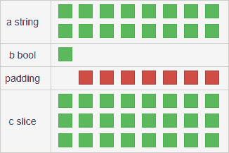
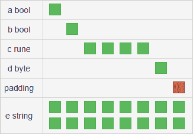
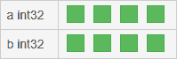
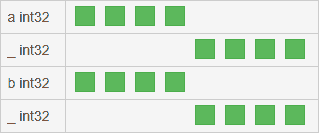

# 第十六章：使用 CGO

本章将向您介绍 CGO，这是一个用于 C 语言的 Go 运行时。它使得可以从 Go 应用程序中调用 C 代码，而由于 C 有大量可用的库，这意味着它们可以在 Go 中被利用。

本章将涵盖以下主题：

+   从 C 和 Go 中使用 CGO

+   理解类型差异

# 技术要求

本章需要安装 Go 并设置您喜欢的编辑器。有关更多信息，请参阅第三章，*Go 概述*。

此外，它需要安装 GCC 编译器在你的机器上。在你的 Unix 机器上可以很容易地使用包管理器来完成这个任务。对于 Ubuntu，命令如下：

```go
 sudo apt install gcc
```

# CGO 简介

CGO 是一种工具，可以让我们在 Go 应用程序中运行 C 代码。这个功能自从 Go 在 2009 年达到 1.0 版本以来就一直存在，当时标准库之外可用的包比现在少，所以我们可以使用现有的 C 库。

C 代码通过 `C` 伪包访问，通过包名和标识符访问和调用，例如 `C.print`。

`import` 声明前面有一系列特殊的注释，指定应用程序应该导入哪个 C 源文件：

```go
package example

// #include <stdio.h>
import "C"
```

这个语句也可以是一个多行注释，可以包含更多的 `include` 指令，就像之前的例子中的那个，甚至可以直接包含实际的 C 代码：

```go
package example

/*
#include <stdio.h>
#include <stdlib.h>
#include <errno.h>

void someFunction(char* s) {
    printf("%s\n", s);
}
*/
import "C"
```

重要的是在 C 注释和 `import` 语句之间避免空行，否则库和代码将被 CGO 导入应用程序。

# 从 Go 调用 C 代码

为了使用我们自己或他人制作的现有 C 代码，我们需要从 Go 中调用 C。让我们进行一个快速的完整示例，使用只有 C 功能打印一个字符串到标准输出：

```go
package main

/*
#include <stdio.h>
#include <stdlib.h>

void customPrint(char* s) {
    printf("%s\n", s);
}
*/
import "C"

import "unsafe"

func main() {
    s := C.CString(`Printing to stdout with CGO
        Using <stdio.h> and <stdlib.h>`)
            defer C.free(unsafe.Pointer(s))
            C.customPrint(s)
}
```

我们在这里导入了两个 C 核心库，它们分别是：

+   `stdio.h`：这包含了输入和输出方法。我们正在使用 `printf`。

+   `stdlib.h`：这包含了一般函数，包括内存管理。

从前面的代码中可以看到，我们注意到我们要打印的变量不是普通的 Go `string`，而是通过 `C.CString` 函数获得的，它接受一个字符串并返回一个 `char` 切片，因为这就是 C 中字符串的处理方式。该函数定义如下：

```go
func C.CString(string) *C.char
```

我们可以观察到的第二件事是，我们在延迟调用 `C.free`，传递了我们定义的 `s` 变量，但转换成了不同的类型。这个函数调用是必要的，因为语言没有垃圾回收，为了释放内存，应用程序需要明确调用 C 的 `free` 函数。这个函数接收一个通用指针，它在 Go 中被表示为 `unsafe.Pointer` 类型。根据 Go 文档，以下内容适用：

"任何类型的指针值都可以转换为指针。"

这正是我们正在做的，因为字符串变量的类型是 `*C.char` 指针。

# 从 C 中调用 Go 代码

我们刚刚看到了如何使用 C 包和 `import` 语句从 Go 应用程序中调用 C 代码。现在，我们将看到如何从 C 中调用 Go 代码，这需要使用另一个特殊的语句叫做 `export`。这是一个需要放在我们想要导出的函数上面的注释，后面跟着那个函数的名称：

```go
//export theAnswer
func theAnswer() C.int {
    return 42
}
```

Go 函数需要在 C 代码中声明为外部函数。这将允许 C 代码使用它：

```go
extern int theAnswer();
```

我们可以通过创建一个导出函数的 Go 应用程序来测试这个功能，这个函数被一个 C 函数使用。这个函数在 Go 的 `main` 函数中被调用：

```go
package main

// extern int goAdd(int, int);
//
// static int cAdd(int a, int b) {
//     return goAdd(a, b);
// }
import "C"
import "fmt"

//export goAdd
func goAdd(a, b C.int) C.int {
    return a + b
}

func main() {
    fmt.Println(C.cAdd(1, 3))
}
```

在前面的示例中，我们有一个 `goAdd` 函数，它使用 `export` 语句导出到 C。导出的名称与函数的名称匹配，注释和函数之间没有空行。

我们可以注意到在导出函数的签名中使用的类型不是常规的 Go 整数，而是`C.int`变量。我们将在下一节中看到 C 和 Go 系统的不同之处。

# C 和 Go 类型系统

为了在 C 和 Go 之间传递数据，我们需要通过执行正确的转换来传递正确的类型。

# 字符串和字节切片

Go 中的基本类型`string`在 C 中不存在。它有`char`类型，表示一个字符，类似于 Go 的`rune`类型，并且字符串由以`\0`结尾的`char`类型的数组表示。

该语言允许直接声明字符数组作为数组或字符串。第二个声明不以`0`值结束以结束字符串：

```go
char lang[7] = {'G', 'o', 'l', 'a', 'n', 'g', '\0'};

char lang[] = "Golang";
```

我们已经看到如何使用以下函数将 Go 字符串转换为 C 字符数组：

```go
func C.CString(string) *C.char
```

此函数将在堆中分配字符串，因此应用程序有责任使用`C.free`函数释放此内存。

为了将字节片转换为名为`*char`的 C 字符指针，我们可以使用以下函数：

```go
func C.CBytes([]byte) unsafe.Pointer
```

对于`C.CString`，应用程序在堆中分配数据，并将释放的责任留给 Go 应用程序。

这两个函数之间的主要区别在于第一个生成`char[]`，而另一个创建`*char`。这两种类型相当于 Go 的`string`和`[]byte`，因为第一种类型的字节不能更改，而第二种类型的字节可以更改。

有一系列函数用于将 C 类型转换回 Go 类型。就字符串而言，有两个函数：`C.GoString`从整个数组创建字符串，`C.GoStringN`允许使用显式长度创建字符串：

```go
func C.GoString(*C.char) string

func C.GoStringN(*C.char, C.int) string
```

要将 C 的`*char`转换回 Go 的`[]byte`，有一个单独的函数：

```go
func C.GoBytes(unsafe.Pointer, C.int) []byte
```

我们可以使用`C.CBytes`函数使用 C 修改字节片并将其转换回 Go 片：

```go
package main

/*
#include <stdio.h>
#include <stdlib.h>
#include <string.h>

char* reverseString(char* s) {
    int l = strlen(s);
    for (int i=0; i < l/2; i++) {
        char a = s[i];
        s[i] = s[l-1-i];
        s[l-1-i] = a;
    }
    return s;
}
*/
import "C"

import (
    "fmt"
    "unsafe"
)

func main() {
    b1 := []byte("A byte slice")
    c1 := C.CBytes(b1)
    fmt.Printf("Go ptr: %p\n", b1)
    fmt.Printf("C ptr: %p\n", c1)
    defer C.free(c1)
    c2 := unsafe.Pointer(C.reverseString((*C.char)(c1)))
    b2 := C.GoBytes(c2, C.int(len(b1)))
    fmt.Printf("Go ptr: %p\n", b2)
    fmt.Printf("%q -> %q", b1, b2)
}
```

执行此应用程序将显示，将字节片`b1`转换为 C 类型作为`c1`变量时，地址将更改。由 C 函数返回的 C 片段`c2`将具有与`c1`相同的地址，因为它是相同的片段。再次转换回 Go 并分配给`b2`时，它将具有与初始 Go 字节片`b1`不同的另一个地址。

我们可以使用 C 字符串函数来实现相同的结果。让我们使用上一个示例中的相同 C 代码并更改其余部分：

```go
package main

/*
#include <stdio.h>
#include <stdlib.h>
#include <string.h>

char* reverseString(char* s) {
    int l = strlen(s);
    for (int i=0; i < l/2; i++) {
        char a = s[i];
        s[i] = s[l-1-i];
        s[l-1-i] = a;
    }
    return s;
}
*/
import "C"

import (
    "fmt"
    "unsafe"
)

func main() {
    s1 := "A byte slice"
    c1 := C.CString(s1)
    defer C.free(unsafe.Pointer(c1))
    c2 := C.reverseString(c1)
    s2 := C.GoString(c2)
    fmt.Printf("%q -> %q", s1, s2)
}
```

重要的是要注意，将 Go 字符串和字节值传输到 C 时，这些值会被复制。因此，C 代码无法直接编辑它们，而是将编辑副本，保持原始 Go 值不变。

# 整数

在 C 中，可用的整数类型与 Go 有许多相似之处，因为两种语言中每种整数类型都有带符号和无符号版本，但它们在名称和字节大小方面有所不同。 C 的`sizeof`函数可以检查每种类型的大小。

以下是 C 中可用的整数类型列表：

**有符号类型**

| **类型** | **大小** | **范围** |
| --- | --- | --- |
| `char` | 1 字节 | [-128, +127] |
| `int` | 2 或 4 字节 | 参见`short`和`long` |
| `short` | 2 字节 | [-32 768, +32 767] |
| `long` | 4 字节 | [-2 147 483 648, +2 147 483 647] |
| `long long` | 8 字节 | [-9 223 372 036 854 775 808, +9 223 372 036 854 775 807] |

**无符号类型**

| **类型** | **大小** | **范围** |
| --- | --- | --- |
| 无符号`char` | 1 字节 | [0, +255] |
| 无符号`int` | 2 或 4 字节 | 参见无符号`short`或无符号`long` |
| 无符号`short` | 2 字节 | [0, +65 535] |
| 无符号`long` | 4 字节 | [0, +4 294 967 295] |
| 无符号`long long` | 8 字节 | [0, +18 446 744 073 709 551 615 ] |

在`C`中，`int`的大小取决于架构-在 16 位处理器上曾经是 2 字节，但在现代处理器（32 位和 64 位）上是 4 字节。

当我们从 Go 的领域移动到 C 的领域，反之亦然，我们失去了所有变量溢出的信息。当我们尝试将一个整数变量适应另一个没有足够大小的整数变量时，编译器不会警告我们。我们可以通过一个简短的例子来看到这一点，如下所示：

```go
package main

import "C"

import "fmt"

func main() {
    a := int64(0x1122334455667788)

    // a fits in 64 bits
    fmt.Println(a)
    // short overflows, it's 16
    fmt.Println(C.short(a), int16(0x7788))
    // long also overflows, it's 32
    fmt.Println(C.long(a), int32(0x55667788))
    // longlong is okay, it's 64
    fmt.Println(C.longlong(a), int64(0x1122334455667788))
}
```

我们可以看到`a`的值是一个确定的数字，但`short`和`long`变量没有足够的字节，所以它们将有不同的值。转换显示了在转换时只有最后的字节被取自变量，其他字节被丢弃。

这是一个有用的 C 类型和可比较的 Go 类型的列表，以及如何在 Go 代码中使用它们：

| **C 类型** | **Go 类型** | **CGO 类型** |
| --- | --- | --- |
| `char` | `int8` | `C.char` |
| `short` | `int16` | `C.short` |
| `long` | `int32, rune` | `C.long` |
| `long long` | `int64` | `C.longlong` |
| `int` | `int` | `C.int` |
| 无符号的`char` | `uint8, byte` | `C.uchar` |
| 无符号的`short` | `uint16` | `C.ushort` |
| 无符号的`long` | `uint32` | `C.ulong` |
| 无符号的`long long` | `uint64` | `C.ulonglong` |
| 无符号的`int` | `uint` | `C.uint` |

在执行转换时，您可以使用此表作为参考，并避免使用错误类型导致的错误，因为在使用 CGO 时没有溢出警告。

# 浮点类型

在 C 中，`float`类型与 Go 中的类型非常相似：

+   C 提供了 32 位的`float`和 64 位的`double`。

+   Go 有`float32`和`float64`。

当从 64 位值转换为 32 位值时，可能会导致四舍五入误差，如下面的代码所示：

```go
package main

import "C"

import (
    "fmt"
    "math"
)

func main() {
    a := float64(math.Pi)

    fmt.Println(a)
    fmt.Println(C.float(a))
    fmt.Println(C.double(a))
    fmt.Println(C.double(C.float(a)) - C.double(a))
}
```

前面的例子显示了`math.Pi`的值从`3.141592653589793`变为`3.1415927`，导致了约`1/10⁷`的错误。

# 不安全的转换

现在我们将看到如何使用`unsafe`包从 C 中直接编辑 Go 变量。

# 直接编辑字节切片

还可以使用一个不正当的技巧直接编辑 Go 字节切片。从 Go 的角度来看，切片是一组值：

+   第一个元素的指针

+   切片的大小

+   切片的容量

在 C 中，字节切片只是一系列字节，字符串是以`\0`结尾的字符切片。

如果我们使用`unsafe`包将指针传递给切片的第一个元素，我们将能够直接编辑现有的字节切片，而无需执行复制和转换。我们可以看到如何在以下应用程序中执行此转换：

```go
package main

/*
#include <stdio.h>
#include <stdlib.h>
#include <string.h>

void reverseString(char* s) {
    int l = strlen(s);
    for (int i=0; i < l/2; i++) {
        char a = s[i];
        s[i] = s[l-1-i];
        s[l-1-i] = a;
    }
}
*/
import "C"

import (
  "fmt"
  "unsafe"
)

func main() {
    b1 := []byte("A byte slice")
    fmt.Printf("Slice: %s\n", b1)
    C.reverseString((*C.char)(unsafe.Pointer(&b1[0])))
    fmt.Printf("Slice: %s\n", b1)
}
```

转换是使用表达式`(*C.char)(unsafe.Pointer(&b1[0]))`执行的，它执行以下操作：

+   获取切片的第一个元素的指针

+   将其转换为不安全的指针

+   将`byte`指针转换为`C.char`指针，共享内存表示

# 数字

使用`unsafe`包，我们还可以将数字变量的指针转换为其 C 对应项。这使我们能够直接在 C 代码中编辑它：

```go
package main

/*
void half(double* f) {
    *f = *f/2;
}
*/
import "C"

import (
    "fmt"
    "math"
    "unsafe"
)

func main() {
    a := float64(math.Pi)
    fmt.Println(a)
    C.half((*C.double)(unsafe.Pointer(&a)))
    fmt.Println(a)
}
```

前面的示例确实做到了这一点；它在 C 函数中将`a`的值减半，而不是在 Go 中复制并分配新值。

# 使用切片

Go 切片和 C 切片在一个基本方面有所不同——Go 版本嵌入了长度和容量，而在 C 中，我们只有指向第一个元素的指针。这意味着在 C 中，长度和容量必须存储在其他地方，比如另一个变量中。

让我们来看看以下的 Go 函数，它计算一系列`float64`数字的平均值：

```go
func mean(l []float64) (m float64) {
    for _, a := range l {
        m += a
    }
    return m / float64(len(l))
}
```

如果我们想在 C 中有一个类似的函数，我们需要传递一个指针以及它的长度。这将避免诸如分段错误之类的错误，当应用程序尝试访问未分配给它的内存时会发生这种错误。如果内存仍然分配给应用程序，结果是它提供对具有未知值的内存区域的访问，导致不可预测的结果：

```go
double mean(int len, double *a) {
    if (a == NULL || len == 0) {
        return 0;
    }
    double m = 0;
    for (int i = 0; i < len; i++) {
        m+=a[i];
    }
    return m / len;
}
```

我们可以尝试使用一个 Go 包装器来使用这个函数，该包装器接受一个切片，并将长度传递给 C 函数：

```go
func mean(a []float64) float64 {
    if len(a) == 0 {
        return 0
    }
    return float64(C.mean(C.int(len(a)), (*C.double)(&a[0])))
}
```

为了验证发生了什么，我们还可以创建一个传递了不正确长度的类似函数：

```go
func mean2(a []float64) float64 {
    if len(a) == 0 {
        return 0
    }
    return float64(C.mean(C.int(len(a)*2), (*C.double)(&a[0])))
}
```

使用这个函数时，我们会看到应用程序不会引发任何分段错误，但得到的结果会有所不同。这是因为第二个将在平均计算中添加一系列额外的值，如下所示：

```go
var a = make([]float64, 10)

func init() {
    for i := range a {
        a[i] = float64(i + 1)
    }
}

func main() {
    cases := [][]float64{a, a[1:4], a[:0], nil}
    for _, slice := range cases {
        fmt.Println(slice, mean(slice))
    }
    for _, slice := range cases {
        fmt.Println(slice, mean2(slice))
    }
}
```

# 使用结构

在了解了切片的工作原理之后，我们将知道如何在 C 和 Go 中使用结构处理复杂的数据。接下来让我们看看以下几节。

# Go 中的结构

Go 结构使用一种称为对齐的技术，它包括向数据结构添加一个或多个字节，以使其更好地适应内存地址。考虑以下数据结构：

```go
struct {
    a string
    b bool
    c []byte
}
```

使用 64 位架构在这个结构上调用`unsafe.Sizeof`，这将给我们一个意外的结果。我们期望的是以下结果：

+   16 字节来自字符串；8 字节用于指向第一个元素，8 字节用于长度

+   布尔值占 1 字节

+   24 用于切片；8 用于地址，8 用于长度，8 用于容量

总数应该是 41，但函数返回 48。这是因为编译器在布尔值之后插入了额外的字节，以达到 8 字节（64 位），并优化 CPU 的操作。该结构可以在内存中表示如下：



我们可以看到布尔变量占用 1 位，并且编译器添加了 7 位额外的位。这非常有帮助，因为它避免了其他变量存储在一个内存槽中的一半，另一半存储在另一个内存槽中。这将导致每次操作需要两次读取和两次写入，性能显著下降。

如果两个或更多字段足够小，可以适应 64 位的一个槽，它们将被顺序存储。我们可以通过以下示例看到这一点：

```go
struct {
    a, b bool
    c rune
    d byte
    e string
}
```

这个结构在 64 位架构上的内存表示如下：



我们可以清楚地看到布尔变量，`rune`和`byte`都在同一个内存地址上，并且在最后一个字段上添加了一个字节的填充以对齐。

# 手动填充

Go 使得可以使用空白标识符手动指定结构中的填充。考虑以下数据结构：

```go
struct{
    a int32
    b int32
}
```

这将有以下表示：



我们可以使用空白标识符手动指定填充，并为 64 位架构优化数据结构：

```go
struct{
    a int32
    _ int32
    b int32
    _ int32
}
```

这将允许应用程序将每个`int32`存储在自己的内存位置，因为空白字段将充当填充：



# C 中的结构

C 中的结构共享与 Go 相同的对齐概念，但它们总是使用 4 字节填充对齐。与 Go 不同的是，可以完全避免填充，这有助于通过减少内存使用量来节省空间。让我们在以下几节中了解更多。

# 未打包的结构

除非另有说明，否则我们定义的每个结构都将是未打包的。我们可以在 C 中定义一个结构如下：

```go
typedef struct{
  unsigned char a;
  char b;
  int c;
  unsigned int d;
  char e[10];
} myStruct;
```

我们可以直接从我们的 Go 代码中使用它并填充它的值，而不会出现任何问题：

```go
func main() {
    v := C.myStruct{
        a: C.uchar('A'),
        b: C.char('Z'),
        c: C.int(100),
        d: C.uint(10),
        e: [10]C.char{'h', 'e', 'l', 'l', 'o'},
    }
    log.Printf("%#v", v)
}
```

这个小测试将给我们以下输出：

```go
main._Ctype_struct___0{
    a:0x41, 
    b:90, 
    c:100, 
    d:0xa, 
    e:[10]main._Ctype_char{104, 101, 108, 108, 111, 0, 0, 0, 0, 0},
     _:[2]uint8{0x0, 0x0},
}
```

这告诉我们有一个额外的空白字段用于填充，因为最后一个字段是 10 字节，比 4 的倍数（即 12 字节）短 2 字节。

# 紧凑结构

我们可以使用`pragma pack`指令在 C 中定义一个紧凑的结构。我们可以将之前的结构打包如下：

```go
#pragma pack(1)
typedef struct{
  unsigned char a;
  char b;
  int c;
  unsigned int d;
  char e[10];
} myStruct;
```

如果我们尝试在我们的 Go 代码中使用 C 结构，如果使用字段`c`和`d`，我们将获得编译错误：

```go
pack := C.myStruct{
    a: C.uchar('A'),
    b: C.char('Z'),
    c: C.int(100),
    d: C.uint(10),
    e: [10]C.char{},
}
```

如果我们尝试像我们对未打包版本所做的那样打印结构，我们将看到原因：

```go
main._Ctype_struct___0{
    a:0x41, 
    b:90, 
    _:[8]uint8{0x0, 0x0, 0x0, 0x0, 0x0, 0x0, 0x0, 0x0}, 
    e:[10]main._Ctype_char{104, 101, 108, 108, 111, 0, 0, 0, 0, 0},
}
```

从输出中我们可以看到，4 字节的`c`和`d`字段被一个 8 字节的空字段替换，Go 无法访问。因此，我们无法从 Go 中填充结构，但可以在应用程序的 C 部分访问这个字段：

```go
myStruct makeStruct(){
  myStruct p;
  p.a = 'A';
  p.b = 'Z';
  p.c = 100;
  p.d = 10;
  p.e[0] = 'h';
  p.e[1] = 'e';
  p.e[2] = 'l';
  p.e[3] = 'l';
  p.e[4] = 'o';
  p.e[5] = '\0';
  p.e[6] = '\0';
  p.e[7] = '\0';
  p.e[8] = '\0';
  p.e[9] = '\0';
  return p;
}
```

这将允许我们返回一个带有正确值的结构。我们可以打印它并看到`_`字段包含`c`和`d`的值：

```go
main._Ctype_struct___0{
    a:0x41, 
    b:90, 
    _:[8]uint8{0x64, 0x0, 0x0, 0x0, 0xa, 0x0, 0x0, 0x0}, 
    e:[10]main._Ctype_char{104, 101, 108, 108, 111, 0, 0, 0, 0, 0}
}
```

现在我们有了数据，我们需要创建一个能够承载它的 Go 结构：

```go
type myStruct struct {
    a uint8
    b int8
    c int32
    d uint32
    e [10]uint8
}
```

现在，我们需要从 C 结构中读取原始字节并手动解包它：

```go
func unpack(i *C.myStruct) (m myStruct) {
    b := bytes.NewBuffer(C.GoBytes(unsafe.Pointer(i), C.sizeof_myStruct))
    for _, v := range []interface{}{&m.a, &m.b, &m.c, &m.d, &m.e} {
        binary.Read(b, binary.LittleEndian, v)
    }
    return
}
```

我们可以使用`C.GoBytes`函数，它适用于任何指针（不仅仅是字节），并指定我们定义的结构的大小，该大小存储在常量`C.sizeof_myStruct`中。然后，我们可以使用`binary.Read`函数按顺序读取每个字段，使用**小端**（**LE**）编码。

我们可以看到生成的结构包含所有正确字段中的数据：

```go
main.myStruct{
    a:0x41, 
    b:90, 
    c:100, 
    d:0xa, 
    e:[10]uint8{0x68, 0x65, 0x6c, 0x6c, 0x6f, 0x0, 0x0, 0x0, 0x0, 0x0},
}
```

# CGO 建议

我们现在已经看到了如何在整数、浮点数、切片和结构体中使用 CGO。这是一个非常强大的工具，可以方便我们在 Go 应用程序中使用大量现有的 C 代码。就像我们在上一章中对反射所做的那样，我们现在要谈谈 CGO 的不太明显的缺点。

# 编译和速度

Go 的一个特点是编译速度非常快。使用 CGO 时，编译所涉及的工作量要大得多，不仅仅是将所有`.go`文件传递给 Go 编译器。编译过程大致如下：

+   CGO 需要创建 C 到 Go 和 Go 到 C 的存根。

+   需要调用`make`命令来编译所有 C 源文件。

+   所有文件都合并在一个`.o`文件中。

+   系统的链接器需要验证 Go 和 C 之间的所有引用是否有效。

如果这个过程顺利进行，您可以启动您的应用程序，但如果遇到任何问题，您需要检查 C 和 Go 之间的错误，这并不像调试纯 Go 应用程序那样容易。

另一个缺点是，并非每个操作系统都自带`make`命令。C 部分可能需要一些额外的标志才能正确编译，这不能由`go install`或`go build`处理。您需要为您的应用程序创建一个编译脚本，比如一个`makefile`脚本。

# 性能

在讨论如何让 C 和 Go 相互通信时，我们看到对于每种类型，都需要执行一个转换操作。这对于数字来说可能很简单，但对于字符串、字节或切片来说可能会更复杂，当涉及到结构时甚至更复杂。这些操作不是免费的，无论是在内存使用还是性能方面。这对许多应用程序来说不是问题，但如果您试图实现高性能，这可能成为瓶颈。

C 代码并不知道其 Go 对应部分发生了什么。当需要调用它时，Go 需要以适合它的格式将有关其堆栈的信息传递给 C。当 C 代码完成执行时，需要将有关堆栈状态和使用的变量的信息从 C 传递回 Go。

# 来自 C 的依赖

使用 CGO 时，您面临着其他语言在创建与 C 代码绑定或包装时面临的相同问题。您完全依赖于它。

Go 应用程序必须处理 C 如何使用内存和其他资源，而 C 应用程序不知道 Go 在做什么，也不使用任何并发，既不是 goroutine 也不是线程。

除此之外，C 代码很难调试、维护和替换，如果您不是 C 开发人员。因此，有时最好从头开始编写一个库，而不是依赖现有的 C 实现。

一个很好的例子是`go-git`（[`github.com/src-d/go-git`](https://github.com/src-d/go-git)），它通过模仿现有的 C 库[libgit2](https://libgit2.org/)，在纯 Go 中实现了 Git 协议功能。

# 总结

在本章中，我们看到了 Go 工具中非常强大的一个工具：CGO。这允许 Go 应用程序运行 C 代码，反过来又可以调用 Go 函数。我们看到它需要一个特殊的`import`语句，`import "C"`，这是一个伪包，其中包含所有可供 Go 使用的 C 代码。要导出 Go 代码并使其可供 C 使用，有一个特殊的注释`//export`，它使 Go 函数在 C 命名空间中可用。

我们看到 C 和 Go 类型系统在某些方面非常相似，但在其他方面非常不同。我们看到字符串和字节数组可以转换为 C 类型，反之亦然。C 和 Go 中的整数也非常相似，主要区别在于`int`类型。在 C 中，这是 4 个字节，而在 Go 中，它是 4 或 8 个字节，取决于架构。浮点数也非常相似，在 C 和 Go 中都有 4 位和 8 位版本，只是名称不同。

还可以直接编辑数字 Go 变量或字节切片，而不创建副本。这是通过使用`unsafe.Pointer`函数来强制进行转换，否则是不允许的。C 中的切片只是指向第一个元素的指针，切片的长度需要存储在另一个变量中。这就是为什么我们创建了接受切片并将两个参数传递给它们的 C 对应函数的 Go 函数。

在谈论数据结构之前，我们必须提到对齐是什么，Go 是如何实现对齐的，以及 C 对齐与 Go 的不同之处。CGO 中的数据结构使用对齐，并且非常容易使用。如果它们没有打包，我们可以轻松地传递它们并提取值。如果结构被打包，我们就无法访问其中的一些字段，需要一种解决方法来手动执行转换到 Go。

最后一个主题集中讨论了 CGO 的缺点，从构建时间较慢到性能下降，因为需要转换，以及由于 C 代码的存在，应用程序将变得更难维护。

希望你迄今为止享受了这段 Go 之旅，并且它将帮助你编写现代、并发和高效的应用程序。

# 问题

1.  CGO 是什么？

1.  如何从 Go 调用 C 代码？

1.  如何在 C 中使用 Go 代码？

1.  Go 和 C 之间的数据类型有什么区别？

1.  如何在 C 代码中编辑 Go 值？

1.  打包数据结构的主要问题是什么？

1.  CGO 的主要缺点是什么？
