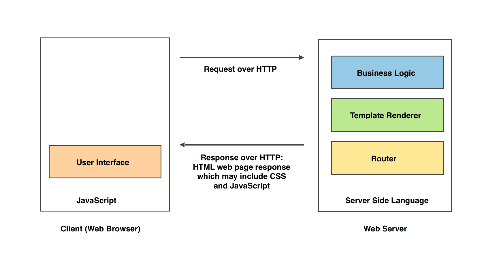
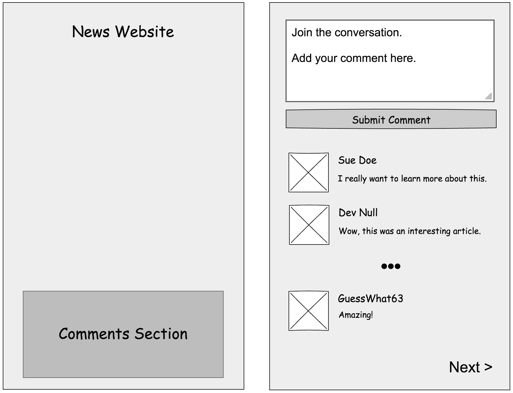
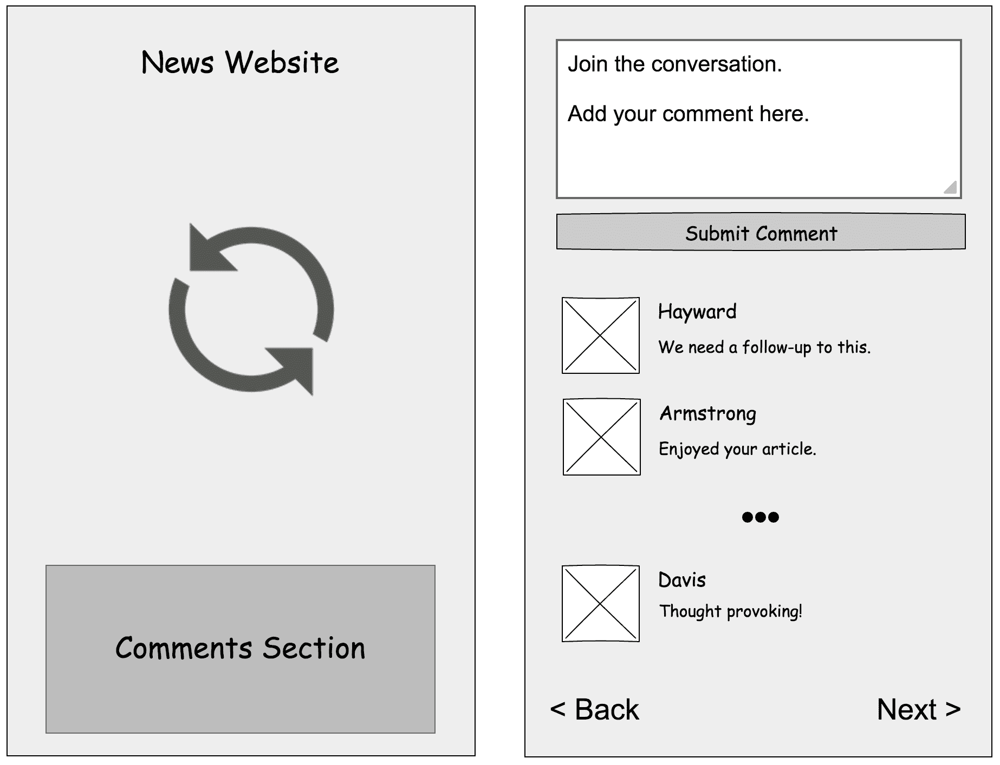
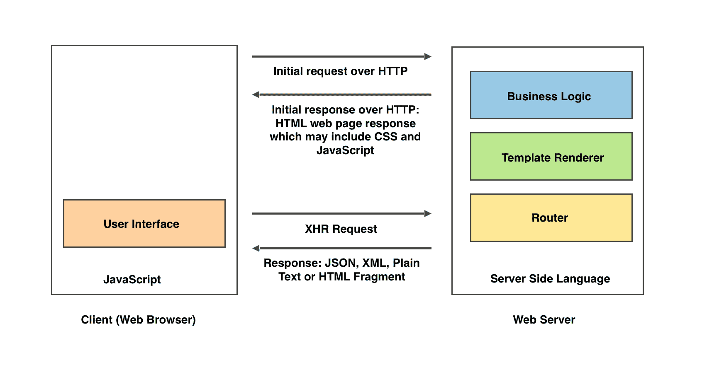
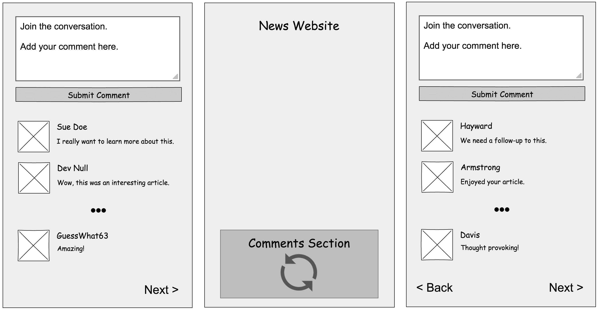
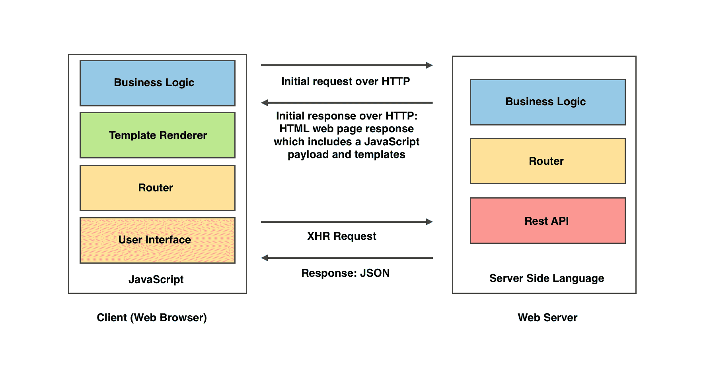
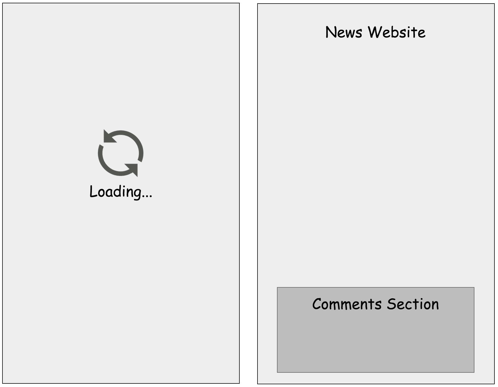
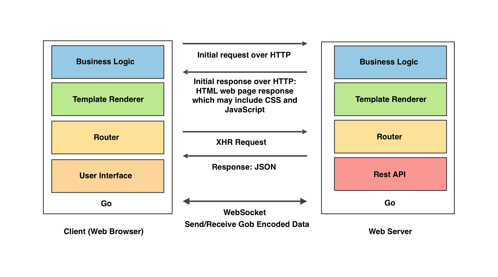
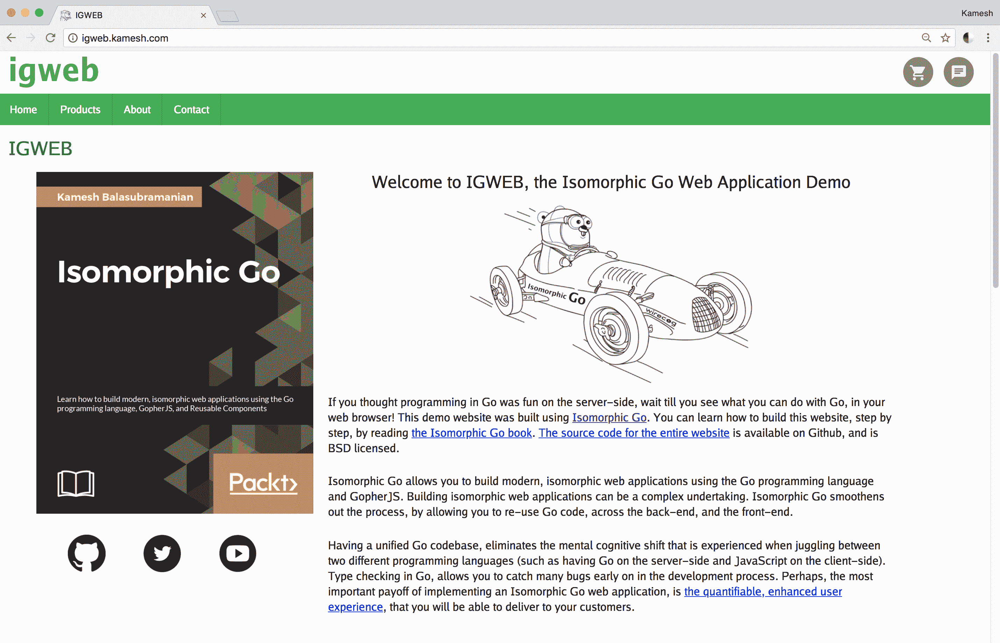
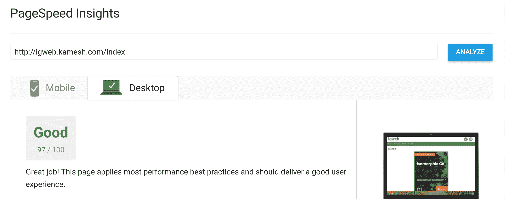

# 使用 Go 创建同构 Web 应用程序

同构 Web 应用程序是指 Web 服务器和 Web 浏览器（客户端）可能共享 Web 应用程序代码的全部或部分。同构 Web 应用程序允许我们从传统 Web 应用程序架构中获得最大的好处。它们提供了更好的用户体验，通过搜索引擎增强了可发现性，并通过在不同环境中共享 Web 应用程序代码的部分来降低运营成本。

成熟的企业，如 Airbnb、彭博社、Capital One、Facebook、谷歌、Netflix 和沃尔玛已经接受了同构 Web 应用程序开发，并且有充分的理由——财务底线。

沃尔玛的一项研究发现，他们每提高 1 秒的速度，就会增加 2%的转化率。此外，他们还发现，每提高 100 毫秒的速度，就会增加 1%的增量收入。来源：网站速度如何影响转化率（http://www.globaldots.com/how-website-speed-affects-conversion-rates/）。

同构 Go 是使用 Go 编程语言创建同构 Web 应用程序的方法论。在本书中，我们将深入探讨使用 Go 创建同构 Web 应用程序的过程。

本章将涵盖以下主题：

+   为什么你应该考虑使用同构 Go 来开发现代 Web 应用程序

+   传统 Web 应用程序架构概述

+   同构 Web 应用程序架构简介

+   何时实现同构 Web 应用程序

+   在学习同构 Go 之前你应该知道的事情

# 为什么选择同构 Go？

毫无疑问，JavaScript 是当前领先的技术，就市场份额和思想份额而言，用于创建同构 Web 应用程序。在客户端，JavaScript 已经包含在所有主要的 Web 浏览器中。由于 Node.js 的出现，JavaScript 现在也可以存在于服务器端。

如果是这样的话，那么为什么我们应该把注意力集中在使用 Go 来创建同构 Web 应用程序呢？这个问题的答案是多方面的。将这里提供的答案列表视为一个初始列表，这是我们讨论的起点：

+   Go 具有类型检查

+   即使是科技巨头也避免使用纯 JavaScript

+   将代码转换为纯 JavaScript 已经被广泛接受

+   Go 对前端 Web 开发有很多好处

# Go 具有类型检查

Go 是一种包含内置静态类型检查的语言。这个事实的直接影响是，许多错误可以在编译时被捕获。

对许多 JavaScript 开发人员来说，最大的痛点是 JavaScript 缺乏静态类型检查。我个人曾在跨越数十万行代码的 JavaScript 代码库中工作过，亲眼看到最微不足道的错误是如何由于缺乏静态类型检查而产生的。

# 通过转换器避免纯 JavaScript

为了避免编写纯 JavaScript，科技巨头微软和谷歌分别创建了 TypeScript 和 Dart 作为语言和转换器。**转换器**是一种源代码到源代码的编译器。

编译器将人类可读的代码，写成一种编程语言，转换成机器代码。转换器用于将源代码从一种编程语言转换为另一种语言。输出可能或可能不可读取，这取决于转换器的意图。

诸如 TypeScript 和 Dart 之类的语言被转换为纯 JavaScript 代码，以便在支持 JavaScript 的 Web 浏览器中运行。在 TypeScript 的情况下，它本质上是 JavaScript 的超集，引入了静态类型检查。AngularJS 框架的创建者选择了 TypeScript 而不是纯 JavaScript 作为开发其框架下一个主要版本的语言。

通过使用另一种编程语言和转译器来规避 JavaScript，为开发人员创造了双赢局面。开发人员可以使用对他们最有效的编程语言进行编程，而最终，开发人员创建的代码将得以在 Web 浏览器中运行——这要归功于转译器。

# 转译代码

将代码转译为 JavaScript 已经成为一种被广泛接受的做法，甚至在 JavaScript 社区内部也是如此。例如，Babel 转译器允许开发人员编写尚未发布的 JavaScript 语言未来标准，将其转译为目前在主要 Web 浏览器中支持的标准 JavaScript 代码。

在这种情况下，在 Web 浏览器中运行被转译为 JavaScript 代码的 Go 程序并不奇怪或牵强。事实上，除了静态类型检查之外，还有许多其他好处可以从能够在前端运行 Go 中获得。

# Go 在前端的好处

在前端使用 Go 具有许多优势，包括以下内容：

+   一个稳健的标准库

+   使用 Go 包进行代码模块化很容易

+   Go 附带了一个隐式构建系统

+   Go 的并发构造允许我们避免回调地狱

+   并发概念内置于 Go 中

+   Go 可用于同构 Web 应用程序开发

# 稳健的标准库

Go 附带了一个稳健的标准库，提供了许多强大的功能。例如，在 Go 中，我们可以渲染内联客户端模板，而无需包含任何第三方模板库或框架。我们将在第三章中考虑如何做到这一点，*使用 GopherJS 在前端上使用 Go*。

# 使用 Go 包促进模块化

Go 具有强大的包实现，促进了模块化，允许更大程度的代码重用和可维护性。此外，Go 工具链包括`go get`命令，允许我们轻松获取官方和第三方 Go 包。

如果你来自 JavaScript 世界，把`go get`想象成一个更简单、更轻量级的`npm`（`npm`是 Node 包管理器，一个第三方 JavaScript 包的存储库）。

# 隐式构建系统

在 JavaScript 生态系统中，现代开发人员仍然流行手动创建和维护项目构建文件。作为一种现代编程语言，Go 附带了一个隐式构建系统。

只要遵循 Go 的约定，并且一旦为 Go 应用程序发出`go build`命令，隐式构建系统就会启动。它将通过检查应用程序 Go 源代码中找到的依赖项，自动构建和编译 Go 项目。这为开发人员提供了重大的生产力提升。

# 避免回调地狱

也许考虑使用 Go 进行同构 Web 开发最具吸引力的原因是避免*回调地狱*。JavaScript 是一种单线程编程语言。当我们想要在异步调用之后延迟执行特定任务时，我们会将这些任务的代码放在回调函数中。

很快，我们要延迟执行的任务列表将增长，嵌套回调函数的数量也将随之增长。这种情况被称为*回调地狱*。

我们可以使用 Go 的内置并发构造来避免回调地狱。

# 并发

Go 是一种现代编程语言，旨在在多核处理器和分布式系统的时代保持相关性。它的设计并不是将并发的重要性作为事后的想法。

事实上，并发对于 Go 的创建者来说非常重要，以至于他们将并发直接构建到语言本身中。在 Go 中，我们可以避免回调地狱，使用 Go 的内置并发构造：goroutines 和 channels。**Goroutines**是廉价、轻量级的线程。**Channels**是允许 goroutines 之间通信的通道。

# 使用 Go 进行等同于 Web 应用程序开发

在等同于 Web 应用程序开发方面，JavaScript 不再是唯一的选择。由于最近的技术进步，特别是**GopherJS**的创建，我们现在可以在前端使用 Go 编程语言；这使我们能够在 Go 中创建等同于 Web 应用程序。

**等同于 Go**是一种新兴技术，它为我们提供了创建等同于 Web 应用程序所需的基本要素，利用了 Go 编程语言提供的强大和高效的功能。在本书中，我们将使用 Go 标准库的功能和 Go 社区的第三方库来实现等同于 Web 应用程序。

# Web 应用程序架构概述

为了理解和充分欣赏等同于 Web 应用程序的架构，有必要了解其前身的 Web 应用程序架构。我们将介绍过去 25 年在行业中流行的主要 Web 应用程序架构。

毕竟，直到我们完全承认我们所在的位置，我们才能真正欣赏到我们所到达的地方。随着多年来 Web 应用程序架构领域发生的重大变化，有很多值得承认的地方。

在介绍等同于 Web 应用程序架构之前，让我们花些时间回顾它之前的三种传统 Web 应用程序架构：

+   经典 Web 应用程序架构

+   AJAX Web 应用程序架构

+   **单页应用程序**（**SPA**）架构

我们将确定考虑的三种架构的优缺点。我们将根据我们为给定架构确定的每个缺点开始一个需求愿望清单。毕竟，缺点实际上是改进的机会。

# 经典 Web 应用程序架构

**经典 Web 应用程序架构**可以追溯到上世纪 90 年代初，当图形 Web 浏览器开始流行起来。当用户使用 Web 浏览器与 Web 服务器进行交互时，每个用户交互都会使用 HTTP 向 Web 服务器发出请求。*图 1.1*描述了经典 Web 应用程序架构。

图 1.1：经典 Web 应用程序架构

该图还描述了一个 HTTP 事务，其中包括用户的 Web 浏览器发送到 Web 服务器的请求。一旦 Web 服务器接受了请求，它将返回相应的响应。

通常，响应是一个 HTML 网页，它可能包含内联 CSS 和/或 JavaScript，或者调用外部 CSS 样式表和/或 JavaScript 源文件。

Web 服务器可以以响应的形式返回两种类型的资源：静态资源和动态资源。

**静态资源**是一个文件。例如，它可以是存储在 Web 服务器上的 HTML、JPEG、PDF 或 MP4 文件。服务器将在其响应主体中返回请求指定的文档。

**动态资源**是服务器动态生成的资源。动态资源的一个例子是搜索引擎的搜索结果页面。通常，动态请求的响应主体将以 HTML 格式进行格式化。

当涉及到 Web 应用程序时，我们处理动态资源。Web 服务器正在提供 Web 应用程序，通常 Web 应用程序包含一个控制器，该控制器包含将用户请求路由到服务器上执行的特定操作的逻辑。一旦 Web 服务器处理完用户的请求，服务器会以 Web 页面响应的形式将响应发送回客户端。

服务器端编程语言（如 Go、Perl、PHP、Python、Ruby 和 Java）用于处理从 Web 浏览器发送的请求。例如，让我们考虑一个用于电子商务网站的服务器端 Web 应用程序。

Web 应用程序可以通过使用服务器端的**路由处理程序**（如*图 1.1*所示）路由请求；`/product-detail/swiss-army-knife`路由可以与产品详细信息控制器相关联，该控制器将提供包含瑞士军刀产品概要页面的 HTML 网页响应。

在经典的 Web 应用程序架构中，用于呈现 Web 页面的代码位于服务器端，通常整合到模板文件中。从一组模板呈现 Web 页面响应是由驻留在服务器上的**模板渲染器**执行的（如*图 1.1*所示）。

通常在这种范式中，JavaScript 可能会包含在呈现的 Web 页面中以增强用户体验。在这种 Web 应用程序架构中，实施 Web 应用程序的责任主要放在服务器端语言上，JavaScript 主要用于用户界面控件或网站的增强用户交互，放在次要位置。

# 优势

经典 Web 应用程序架构具有两个主要优势：

+   更快的初始页面加载

+   更好的搜索引擎可发现性

# 更好的搜索引擎可发现性

经典 Web 应用程序架构的第二个主要优势是这种架构对搜索引擎友好，因为 Web 应用程序提供了可以被搜索引擎机器人轻松消化的 HTML 网页响应。除此之外，服务器端路由处理程序允许创建与特定服务器端控制器相关联的搜索引擎友好的 URL。

使网站对搜索引擎友好的关键因素是可发现性。除了拥有优质内容外，搜索引擎友好的网站还需要永久链接 - 旨在永久保持服务的网页链接。描述性良好的 URL 可以在服务器端的路由器中注册为路由。这些路由最终成为永久链接，搜索引擎机器人爬虫可以在浏览网站时轻松索引。

目标是拥有美观的网站 URL，其中包含有意义的信息，可以轻松被搜索引擎的机器人爬虫索引，例如：`http://igweb.kamesh.com/product-detail/swiss-army-knife`。

上述永久链接比以下链接更容易被搜索引擎索引和人类理解：`http://igweb.kamesh.com/webapp?section=product-detail&amp;product_id=052486`。

# 更快的初始页面加载

经典 Web 应用程序架构的第一个主要优势是用户认为页面加载速度快，因为整个页面一次性呈现。这是由于 Web 服务器在服务器端使用模板渲染器呈现 Web 页面响应的结果。

用户不会感知到缓慢，因为他们立即从服务器接收到呈现的页面。

请记住，如果服务器的响应时间延迟很高，那么用户交互将停滞不前。在这种情况下，快速的初始页面加载优势将丧失，因为用户必须盯着空白屏幕等待服务器完成处理。这种等待将以 Web 页面响应被交付给用户或 HTTP 请求超时而结束，以先到者为准。

# 主要的缺点

我们将在本章中考虑的传统 Web 应用程序架构中检查每种传统 Web 应用程序架构的主要缺点。本章的*同构 Web 应用程序架构*部分将向我们展示同构 Web 应用程序架构如何为每个提出的缺点提供解决方案，并收集每种传统 Web 应用程序架构提供的好处。

经典 Web 应用程序架构的主要缺点是，所有用户交互，甚至最微不足道的交互，都需要完整的页面重新加载。

这意味着**文档对象模型**（**DOM**），表示当前网页状态的树形数据结构以及组成它的元素，在每次用户交互时都会被完全清除，并重新创建：

图 1.2：新闻网站的布局图和评论部分的线框图

例如，让我们假设我们正在阅读新闻网站上的一篇文章。*图 1.2*描述了新闻网站的布局图（左侧的插图），网页底部是网站的评论部分。其他部分可能存在于布局中的负（空）空间中。

*图 1.2*还包括新闻评论部分的线框设计（右侧的插图），其中包含一些示例评论。省略号（...）表示出于简洁起见未列出的多个网站评论。

让我们考虑这样一个情景，这篇特定的新闻文章已经变得非常火爆，包含超过 10,000 条评论。评论是分页的，每页显示 50 条评论：

图 1.3：查看下一组评论需要整个网页刷新

*图 1.3*描述了新闻网站的网页被刷新（左侧的插图）。请注意，用户会感觉刷新很快，因为页面会立即加载（考虑到网络延迟很低）。*图 1.3*还描述了点击下一个链接后（右侧的插图）下一批 50 篇文章。

如果我们点击分页导航控件上的下一个链接，将导致整个页面重新加载，这将销毁 DOM 并重新创建。由于评论位于屏幕底部，在整个页面重新加载时，滚动位置也可能会回到网页顶部，导致用户体验不佳。

我们只想在页面底部看到下一组评论。我们并不打算整个网页重新加载，但它确实重新加载了，这就是经典 Web 应用程序架构的主要局限性。

**愿望清单项目＃1：**为了增强用户体验，点击网站上的链接不应导致整个页面重新加载。

# AJAX Web 应用程序架构

随着**XMLHttpRequest**（**XHR**）对象的出现，**异步 JavaScript 和 XML**（**AJAX**）时代开始了。*图 1.4*说明了 AJAX Web 应用程序架构。

客户端的初始请求后，服务器发送回一个包含 HTML、CSS 和 JavaScript 的网页响应。一旦网页加载完成，客户端的 JavaScript 应用程序可以通过 XHR 对象发起 HTTP 异步请求回到 Web 服务器。

一些观察者将 AJAX 的出现描述为*Web 2.0 时代*，在这个时代，网站变得更加互动，用户体验更加丰富，JavaScript 库的使用开始获得关注。

图 1.4：AJAX Web 应用程序架构

由于 XHR 调用是异步的，它们不会阻塞在 Web 浏览器中运行的单线程 JavaScript 应用程序。一旦从服务器收到给定 XHR 请求的响应，就可以对从服务器返回的数据采取行动。

# 主要优势

AJAX Web 应用程序架构的主要优势是它消除了执行完整页面重新加载的需要。

在我们考虑的新闻文章网页有 10,000 多条评论的情况下，我们可以编写 Web 应用程序，在按下“下一页”按钮时发起 XHR 调用，然后服务器可以发送包含要显示的下一组评论的 HTML 片段。一旦我们收到下一组评论，我们可以使用 JavaScript 动态更新 DOM，完全避免执行完整的页面重新加载！

*图 1.5*说明了这种方法。最左边的插图描述了评论部分中的评论。中间的插图只描述了更新的评论部分。最后，右边的插图描述了加载到评论部分的下一批评论：

图 1.5：当单击“下一页”链接时，只更新新闻网站的评论部分，避免了完整的页面刷新

正如您所看到的，这种方法的主要优势是我们避免了完整的页面重新加载，从而增强了用户体验。请记住，在某些情况下，例如浏览网站的不同部分，仍然可能发生完整的页面重新加载。

# 缺点

AJAX Web 应用程序架构具有以下缺点：

+   处理两种编程语言之间的心理上下文转换

+   通过逐步客户端渲染引入的复杂性

+   工作重复

# 心理上下文转换

当涉及到开发人员的生产力时，我们现在引入了一种心理上下文转换（也称为认知转换），假设后端服务器端语言不是 JavaScript。例如，让我们假设我们的后端应用程序是用 Go 实现的，前端应用程序是用 JavaScript 实现的。现在，开发人员将不得不精通服务器端语言（Go）和客户端语言（JavaScript），除了语法上的差异之外，它们可能具有不同的指导理念和习惯用法。

这对于负责维护代码库的全栈开发人员来说是一种心理上下文转换。组织立即解决心理上下文转换问题的一种方法是动用资金。如果组织有能力这样做，它可以承担增加的运营成本，并至少指定一个开发人员负责前端，一个开发人员负责后端。

**愿望清单项目＃2：**为了增加可维护性，应该有一个单一的、统一的项目代码库，使用单一的编程语言实现。

# 增加的渲染复杂性

除了引入处理两种不同编程语言的心理上下文转换之外，我们现在增加了渲染复杂性的级别。在经典的 Web 应用程序架构中，从服务器响应接收到的渲染的网页从未被改变。事实上，一旦发起新的页面请求，它就被清除了。

现在，我们以逐步方式从客户端重新渲染网页的部分，这要求我们实现更多的逻辑来进行（并跟踪）对网页的后续更新。

**愿望清单项目＃3：**为了增加效率，应该有一种机制来执行分布式模板渲染。

# 工作重复

AJAX Web 应用程序架构在服务器端和客户端之间引入了工作重复。比如，我们想要在新闻文章中添加新评论。填写表单后，为了添加新评论，我们可以发起一个 XHR 调用，将要添加的新评论发送到服务器。服务器端 Web 应用程序随后可以将新评论持久保存到数据库中，其中存储了所有评论。我们可以立即更新评论部分，以包括刚刚添加的新评论，而不是刷新整个网页。

计算机编程的一个基本原则，特别是在 Web 编程中，就是不要相信用户输入。让我们考虑一种情况，用户可能在评论框中输入了一组无效字符。我们将不得不实现一些类型的验证，既在客户端又在服务器端检查用户的评论。这意味着我们将不得不在 JavaScript 中实现客户端表单验证，并在 Go 中实现服务器端表单验证。

在这一点上，我们在两种不同的操作环境中引入了两种编程语言的工作重复。除了我们刚刚考虑的例子，可能还有其他需要在这种架构路径上进行工作重复的情况。这恰好是 AJAX Web 应用程序架构的一个主要缺点。

**愿望清单项目＃4：**为了提高生产力，应该有一种方法在不同环境之间共享和重用代码，以避免工作重复。

# 单页应用程序（SPA）架构

2004 年，**万维网联盟**（**W3C**）开始制定新的 HTML 标准，这将是 HTML5 的前身。2010 年，HTML5 开始加速发展，规范中的功能开始进入主要的 Web 浏览器，HTML5 功能变得非常流行。

HTML5 的主要卖点是引入功能，使 Web 应用程序能够更像本机应用程序。通过 JavaScript 可以访问一组新的 API。这些 API 包括在用户设备上本地存储数据的功能，更好地控制前进和后退按钮（使用 Web 浏览器的历史 API），用于呈现图形的 2D 画布，以及包括比其前身更强大功能的 XHR 对象的第二个版本。

图 1.6：单页应用程序（SPA）架构

在 2010 年代初，开始出现了 JavaScript 框架，这有助于开发一种新型架构，即 SPA 架构。这种架构，如*图 1.6*所示，专注于*fat client*和*thin server*策略。其思想是从服务器端删除任何类型的模板渲染的责任，并将所有**用户界面**（**UI**）渲染分配给客户端。在这种架构中，服务器和客户端的职责有明确的分离。

SPA 架构消除了用户界面责任的工作重复。它通过将所有 UI 代码整合到客户端来实现这一点。这样做消除了服务器端在用户界面方面的工作重复。如*图 1.6*所示，用户界面的责任完全由客户端承担。

服务器最初返回一个包含 JavaScript 和客户端模板的有效负载。JavaScript 有效负载可能会被*聚合*，这意味着组成 Web 应用程序的所有 JavaScript 源文件可以合并成一个 JavaScript 源文件。除此之外，JavaScript 有效负载还可能被**缩小**。

**缩小**是从源代码中删除任何不必要字符的过程，这可能包括在不改变源代码功能的情况下重命名源代码中的标识符，以减少其存储占用空间。

一旦 Web 浏览器完全下载了 JavaScript 负载，JavaScript 代码的首要任务是在客户端上引导 JavaScript 应用程序，渲染用户界面。

# 搜索引擎可发现性降低

使用 SPA 架构可能会降低搜索引擎的可发现性。由于在客户端动态渲染内容的性质，一些 SPA 实现可能无法生成易于搜索引擎爬虫消费的格式良好的 HTML 内容，这些爬虫通常只用于消费初始网页响应。

搜索引擎爬虫可能无法渲染网页，因为它可能没有配备 JavaScript 运行时。没有完全渲染的网页内容，爬虫无法有效地执行其消费网页内容的职责。

除此之外，SPA 实现使用片段标识符处理路由，这种方法对搜索引擎不友好。

让我们回到我们的电子商务 Web 应用程序示例。在经典和 AJAX Web 应用程序架构中，我们的 Web 应用程序可能具有以下 URL：`http://igweb.kamesh.com/product-detail/swiss-army-knife`。

在 SPA 实现的情况下，带有片段标识符的 URL 可能如下所示：

`http://igweb.kamesh.com/#section=product_detail&amp;product=swiss-army-knife`

这个 URL 对于搜索引擎爬虫来说很难索引，因为片段标识符（#符号后面的字符）是用来指定给定网页内的位置的。

片段标识符旨在提供单个网页部分内的链接。片段标识符影响 Web 浏览器的历史，因为我们可以在 URL 上附加唯一标识符。这有效地防止用户遇到完整的页面重新加载。

这种方法的缺点是 HTTP 请求中不包括片段标识符，因此从 Web 服务器的角度来看，URL `http://igweb.kamesh.com/webapp#orange`和 URL `http://igweb.kamesh.com/webapp#apple`指向相同的资源：`http://igweb.kamesh.com/webapp`。

搜索引擎爬虫必须以更复杂的方式实现，以处理包含片段标识符的网站的索引复杂性。尽管谷歌在解决这个问题上取得了相当大的进展，但实现不带片段标识符的 URL 仍然是推荐的最佳实践，以确保网站能够被搜索引擎轻松索引。

值得注意的是，在某些情况下，SPA 架构可能会通过使用更现代的实践来克服这一劣势。例如，更近期的 SPA 实现完全避免了片段标识符，而是使用 Web 浏览器的 History API 来拥有更友好的搜索引擎 URL。

**愿望清单项目＃6：**为了促进可发现性，网站应提供易于搜索引擎爬虫消费的格式良好的 HTML 内容。网站还应包含易于搜索引擎爬虫索引的链接。

# 主要优势

SPA 架构的主要优势在于它提供了客户端路由，防止了整个页面的重新加载。客户端路由涉及拦截给定网页上超链接的点击事件，以便它们不会发起新的 HTTP 请求到 Web 服务器。客户端路由器将给定路由与负责处理路由的客户端路由处理程序相关联。

例如，让我们考虑一个实现了客户端路由的电子商务网站。当用户点击链接到瑞士军刀产品详情页面时，不会启动完全重新加载页面，而是向 Web 服务器的 REST API 端点发出 XHR 调用。端点以 JavaScript 对象表示法（JSON）格式返回有关瑞士军刀的配置数据，客户端应用程序用于呈现瑞士军刀产品详情页面的内容。

从用户的角度来看，体验是无缝的，因为用户不会经历在完全重新加载页面时遇到的突然的白屏。

# 缺点

SPA 架构具有以下缺点：

+   最初的页面加载被认为是较慢的

+   降低搜索引擎的可发现性

# 较慢的初始页面加载

基于 SPA 的 Web 应用程序的初始页面加载可能被认为是缓慢的。这种缓慢可能是由于初始下载聚合 JavaScript 有效载荷所需的时间而导致的。

传输控制协议（TCP）具有缓慢启动机制，其中数据以段的形式发送。JavaScript 有效载荷在完全传递到 Web 浏览器之前，需要在服务器和客户端之间进行多次往返：

图 1.7：由于用户被加载指示器所招呼，初始页面加载被认为是缓慢的，而不是呈现的网页

这导致用户必须等待 JavaScript 有效载荷完全获取，然后网页才能完全呈现。使用加载指示器（如旋转的轮子）是一种常见的用户体验（UX）实践，让用户知道用户界面仍在加载中。

*图 1.7*包括一个插图（左侧）显示加载指示器，以及一个插图（右侧）显示加载的网页布局。重要的是要注意，根据 SPA 的实现方式，可能会在构成网页的各个部分中分布多个加载指示器。

我相信，在您自己的网络浏览中，您可能已经使用过包含这些加载旋转器的 Web 应用程序。从用户的角度来看，我们可以同意，理想情况下，我们宁愿看到呈现的输出，而不是旋转的轮子。

**愿望清单项目＃5：**为了给用户留下最好的第一印象，网站应该能够立即向用户显示内容。

# 同构 Web 应用程序架构

**同构 Web 应用程序架构**包括在服务器端和客户端分别实现两个 Web 应用程序，使用相同的编程语言并在两个环境中重用代码：

图 1.8：同构 Web 应用程序架构

如图 1.8 所示，业务逻辑可以在不同环境中共享。例如，如果我们定义了一个“产品”结构来模拟我们电子商务网站上的产品，服务器端和客户端应用程序都可以知道它。

除此之外，模板渲染器存在于服务器端和客户端，因此模板也可以在不同环境中进行渲染，使模板成为“同构”。

“同构”一词可用于描述可以在不同环境之间共享的任何内容（业务逻辑、模板、模板函数和验证逻辑）。

服务器端路由处理程序负责在服务器端服务路由，客户端路由处理程序负责在客户端服务路由。当用户最初访问使用同构 Web 应用程序架构实现的网站时，服务器端路由处理程序启动并使用服务器端模板渲染器生成网页响应。

网站的后续用户交互是在 SPA 模式下使用客户端路由进行的。客户端路由处理程序负责为给定的客户端路由提供服务，并使用客户端模板渲染器将内容呈现到网页（用户界面）上。

客户端应用程序可以发起 XHR 请求到 Web 服务器上的 Rest API 端点，从服务器的响应中检索数据，并使用客户端模板渲染器在网页上呈现内容。

同构的 Go Web 应用程序可以选择使用 WebSocket 连接，如*图 1.8*所示，用于 Web 服务器和 Web 浏览器之间的持久、双向通信。同构的 Go Web 应用程序还具有以`gob`格式发送和接收数据的额外好处——`gob`是 Go 的二进制编码数据格式。可以使用标准库中的`encoding/gob`包对数据进行编码和解码为`gob`格式。

Gob 编码的数据比 JSON 具有更小的数据存储占用空间。

`gob`格式的主要优势是其较小的存储占用空间。JSON 数据是文本格式，众所周知，文本格式的数据在与二进制编码格式相比需要更大的存储占用空间。通过在客户端和服务器之间交换较小的数据负载，Web 应用程序在传输数据时可以获得更快的响应时间。

# 愿望清单已实现

同构的 Web 应用架构为三种传统 Web 应用架构中发现的所有缺点提供了解决方案。让我们盘点一下我们在愿望清单上放置的项目：

1.  为了**增强用户体验**，在网站上点击链接不应导致全页重新加载。

1.  为了**增加可维护性**，应该有一个单一、统一的项目代码库，使用单一编程语言实现。

1.  为了**提高效率**，应该有一种分布式模板渲染的机制。

1.  为了**提高生产力**，应该有一种方式在不同环境中共享和重用代码，以避免重复劳动。

1.  为了**给出最好的第一印象**，网站应该能够迅速向用户显示内容。

1.  为了**提高可发现性**，网站应提供易于搜索引擎机器人消费的格式良好的 HTML 内容。网站还应包含易于搜索引擎机器人索引的链接。

现在，是时候检查同构的 Web 应用架构如何满足我们愿望清单上的每一项了。

# 1. 提升用户体验

在初始服务器端呈现的网页响应之后，同构的 Web 应用架构通过以 SPA 模式运行来增强用户体验。客户端路由用于网站的后续用户交互，防止全页重新加载，并增强网站的用户体验。

# 2. 增加可维护性

由于同构的 Web 应用架构使用单一编程语言来实现客户端和服务器端的 Web 应用程序，因此项目代码库的可维护性得到了加强。这可以避免在不同环境中处理两种不同编程语言时发生的心理上下文转换。

# 3. 增加效率

同构的 Web 应用架构通过提供分布式模板渲染机制——同构模板渲染器，增加了呈现内容的效率。如*图 1.8*所示，由于服务器端和客户端都有模板渲染器，模板可以在不同环境中轻松重用。

# 4. 增加生产力

同构 Web 应用程序架构的标志是单一统一的代码库，提供了许多机会在不同环境之间共享代码。例如，表单验证逻辑可以在不同环境之间共享，允许在客户端和服务器端使用相同的验证逻辑验证 Web 表单。还可以在客户端和服务器端之间共享模型和模板。

# 6. 促进可发现性

同构 Web 应用程序架构促进了可发现性，因为它可以轻松提供格式良好的 HTML 内容。请记住，Go 模板的渲染输出是 HTML。

使用同构模板渲染器，HTML 内容可以在客户端和服务器端轻松渲染。这意味着我们可以为传统搜索引擎爬虫提供格式良好的 HTML 内容，这些爬虫只是简单地抓取网页内容，以及为可能配备 JavaScript 运行时的现代搜索引擎爬虫提供格式良好的 HTML 内容。

同构 Web 应用程序架构促进可发现性的另一种方式是应用程序的路由处理程序（服务器端和客户端）可以定义格式良好的 URL，并且这些 URL 可以轻松被搜索引擎爬虫索引。

这是可能的，因为客户端实现的路由处理程序利用 Web 浏览器的 History API 来匹配服务器端定义的相同路由。例如，瑞士军刀产品详情页面的`/product-detail/swiss-army-knife`路由可以由服务器端和客户端路由器注册。

# 5. 给出最好的第一印象

同构 Web 应用程序架构使用服务器端渲染初始网页响应，确保用户在访问网站时立即看到内容。对于与用户的第一次接触，同构 Web 应用程序架构借鉴了经典 Web 应用程序架构的方法，提供初始网页响应。

这对用户来说是一个受欢迎的好处，因为内容会立即显示给他们，用户会感知到快速加载页面的结果。这与 SPA 架构形成鲜明对比，因为在 SPA 架构中，用户必须等待客户端应用程序引导完成后才能在屏幕上看到网页内容出现。

# 实时演示

现在是时候看同构 Web 应用程序架构的实际效果了。我们将在本书的过程中实施的网站 IGWEB 的实时演示可在[`igweb.kamesh.com`](http://igweb.kamesh.com)上找到。*图 1.9*是网站首页的截图：

图 1.9：IGWEB：使用同构 Go 实现的网站

请注意，在*以上折叠*区域（在浏览器窗口中可见的区域）中的内容会立即显示。此外，当通过导航菜单中的链接导航到网站的不同部分时，请注意网站的响应性。我们将在下一章为您详细介绍 IGWEB 项目。

在撰写本文时，IGWEB 已经验证可以在以下 Web 浏览器中运行：Google Chrome 版本 62.0，Apple Safari 版本 9.1.1，Mozilla Firefox 57.0 和 Microsoft Edge 15.0。建议您使用与此列表中提供的版本相同或更高版本的 Web 浏览器。

# 可衡量的好处

本书介绍的使用 Go 开发同构 Web 应用程序的方法已经被证明在提供增强用户体验方面具有可衡量的好处。

我们可以使用 Google PageSpeed Insights 工具（[`developers.google.com/speed/pagespeed/insights/`](https://developers.google.com/speed/pagespeed/insights/)）来评估 IGWEB 首页的性能。该工具根据网页内容的组织、静态资产的大小和呈现网页所需的时间等各种标准，评估网页提供良好用户体验的程度，评分从 0 到 100。

图 1.10：通过 Google PageSpeed Insights 工具运行 IGWEB 首页的结果

*图 1.10*是一个屏幕截图，显示了评估 IGWEB 桌面版的结果。在撰写本文时，IGWEB 在桌面浏览体验方面得分为 97/100，在移动浏览体验方面得分为 91/100。根据该工具，桌面和移动版均达到 90+分，表明 IGWEB 首页*应用了大多数性能最佳实践，并应该提供良好的用户体验*。

# 命名

我在**GopherCon India**上的开场演讲中使用了“等同 Go”作为标题，主题是在 Go 中开发等同 Web 应用程序。我的演讲标题是受到“等同 JavaScript”一词的启发。术语“等同 JavaScript”是由 Charlie Robbins 在他 2011 年的博客文章中创造的（[`blog.nodejitsu.com/scaling-isomorphic-javascript-code/`](https://blog.nodejitsu.com/scaling-isomorphic-javascript-code/)），*Scaling Isomorphic JavaScript Code*。

“等同”一词源自数学。在希腊语中，iso 意为相等，morphosis 意为形成或塑造。

JavaScript 社区内存在关于使用术语“等同”的辩论，用来描述一个包含可以在客户端或服务器上运行的代码的 Web 应用程序。JavaScript 社区的一些成员更喜欢使用术语“universal”。

在我看来，术语“等同”更合适，而术语“universal”引入了歧义。这种歧义源于“universal”一词带有一些附加含义。

苹果广泛使用术语“通用二进制”来描述包含多个处理器架构的机器代码的 fat 二进制文件。现代 JavaScript 代码通过即时编译器编译为机器代码。

因此，使用术语“universal”是模棱两可的，并且需要额外的细节来确定其使用的上下文。因此，本书中将使用的首选术语是“等同”。

# 先决条件

本书侧重于教授如何使用 Go 编程语言创建等同 Web 应用程序。由于我们将采用一种以 Go 为重点的成语化方法，因此不需要事先熟悉 JavaScript 生态系统中的库和工具。

我们假设读者在 Go 或其他服务器端编程语言方面具有一定的先前编程经验。

如果您以前从未在 Go 中编程，我建议您参考[`tour.golang.org`](https://tour.golang.org)上提供的《Go 之旅》。

要更深入地学习基本的 Go 概念，我建议您观看我的视频课程《全栈 Web 开发的 Go 基础》，*Packt Publishing*，可在[`www.packtpub.com/web-development/go-essentials-full-stack-web-development-video`](https://www.packtpub.com/web-development/go-essentials-full-stack-web-development-video)上找到。

# 总结

在本章中，我们介绍了等同 Go。我们介绍了 Go 编程语言提供的许多优势，以及为什么它是创建等同 Web 应用程序的一个引人注目的选择。

我们回顾了传统的 Web 应用程序架构，包括经典的 Web 应用程序架构、AJAX 应用程序架构和 SPA 架构。我们确定了每种传统架构的优缺点。我们介绍了同构 Web 应用程序架构，并展示了它是如何解决传统架构的所有缺点的。

我们展示了 IGWEB 的现场演示，这是一个同构 Go 网站，并向您介绍了 Google PageSpeed Insight 工具，用于衡量网页性能。最后，我们为您提供了一些关于术语“同构”以及您需要了解的内容，以便充分理解本书涵盖的材料。

在第二章中，“同构 Go 工具链”，我们将向您介绍开发同构 Go Web 应用程序所使用的关键技术。我们还将向您介绍 IGWEB，这是一个同构 Go 网站，我们将在本书的过程中构建。
