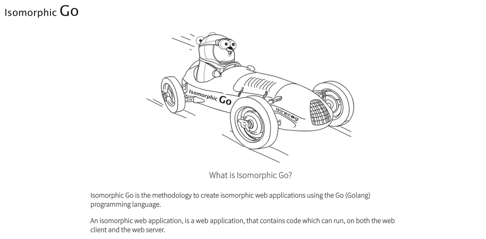

# 第二章：同构 Go 工具链

在上一章中，我们确定了同构网络应用架构提供的许多好处，以及使用 Go 编程语言构建同构网络应用的优势。现在，是时候探索使同构 Go 网络应用成为可能的基本要素了。

在本章中，我们将向您介绍*同构 Go*工具链。我们将研究构成工具链的关键技术——Go、GopherJS、同构 Go 工具包和 UX 工具包。一旦我们确定了如何获取和准备这些工具，我们将安装 IGWEB 演示——本书中将要实现的同构 Go 网络应用。随后，我们将深入研究 IGWEB 演示的解剖，检查项目结构和代码组织。

我们还将向您介绍一些有用和高效的技术，这些技术将贯穿整本书的使用，比如在服务器端实现自定义数据存储来满足我们的网络应用数据持久性需求，并利用依赖注入来提供常用功能。最后，我们将为 IGWEB 应用提供一个项目路线图，以规划我们在构建 Isomorphic Go 网络应用中的旅程。

在本章中，我们将涵盖以下主题：

+   安装同构 Go 工具链

+   设置 IGWEB 演示

+   IGWEB 演示简介

+   项目结构和代码组织

# 安装同构 Go 工具链

在本节中，我们将指导您完成安装和配置同构 Go 工具链的过程，这是一组技术，允许我们创建同构 Go 网络应用。以下是我们将要涵盖的关键技术：

+   Go

+   GopherJS

+   同构 Go 工具包

+   UX 工具包

我们将利用**Go**作为服务器端和客户端的编程语言来创建我们的网络应用。Go 允许我们使用简单易懂的语法创建可靠和高效的软件。它是一种现代的编程语言，设计用于多核处理器、网络系统、大规模计算集群和万维网的时代。由于 Go 是一种通用编程语言，它非常适合创建同构网络应用的理想技术。

**GopherJS**允许我们通过将 Go 代码转译为纯 JavaScript 代码，将 Go 引入客户端，这样可以在所有主要的 Web 浏览器中运行。GopherJS 提供了常见 JavaScript 功能的绑定，包括 DOM API、XHR、内置 JavaScript 函数/操作符和 WebSocket API。

**同构 Go 工具包**为我们提供了构建同构 Go 网络应用所需的技术。使用该项目提供的工具，我们可以实现同构网络应用所需的常见功能，如客户端路由、同构模板渲染和创建同构网络表单。

**UX 工具包**为我们提供了在 Go 中创建可重用组件的能力，这些组件被称为**cogs**。您可以将它们视为自包含的用户界面小部件，促进了可重用性。Cogs 可以作为纯 Go cogs 或混合 cogs 实现，可以利用现有的 JavaScript 功能。Cogs 在服务器端注册，并在客户端部署。

*图 2.1*展示了我们将作为 Venn 图使用的技术堆栈，清楚地指示了技术组件将驻留在哪个环境（或多个环境）中：


图 2.1：同构 Go 工具链：Go、GopherJS、同构 Go 工具包和 UX 工具包

既然我们已经确定了构成我们技术堆栈的关键组件，让我们继续安装/配置它们。

# Go

如果您对 Go 不熟悉，值得花些时间参加 Go 之旅，网址为[`tour.golang.org`](https://tour.golang.org)。

在继续之前，您需要在系统上安装 Go。在本节中，我们将提供安装 Go 和设置 Go 工作区的高级概述。如果您需要进一步帮助，可以访问[`golang.org/doc/install`](https://golang.org/doc/install)获取安装 Go 的详细说明。

让我们前往 Go 网站，网址为[`golang.org`](https://golang.org)：


图 2.2：Go 网站

单击*图 2.2*中显示的下载 Go 链接，以进入下载页面（[`golang.org/dl/`](https://golang.org/dl/)），如*图 2.3*所示：


图 2.3：Go 网站上的下载页面

如您所见，Go 适用于所有主要操作系统。我们将在 Mac 上进行安装和配置过程。有关在其他操作系统上安装 Go 的信息可以在 Go 网站的*入门*文档中找到，网址为[`golang.org/doc/install`](https://golang.org/doc/install)。

在下载页面上，单击链接以下载适用于您操作系统的 Go 分发。我单击了下载 Apple macOS 安装程序的链接。

使您的系统能够运行 Go 将包括以下步骤：

1.  安装 Go

1.  设置您的 Go 工作区

1.  构建和运行程序

# 安装 Go

下载完成后，继续启动安装程序。Go 安装程序显示在*图 2.4*中：


图 2.4：Go 安装程序

按照安装程序的屏幕提示操作，如果安装程序要求您使 Go 对系统上的所有用户可用，请确保选择为系统的所有用户安装 Go。您可能还需要输入系统凭据（以便您可以为系统上的所有用户安装 Go）。再次，继续并提供您的系统凭据。

安装程序完成后，您应该从 Go 安装程序获得以下确认：


图 2.5：Go 安装程序报告安装成功

安装程序完成后，让我们打开命令提示符并检查安装程序安装文件的位置：

```go
$ which go
/usr/local/go/bin/go
```

在 macOS 系统上，Go 分发安装到`/usr/local/go`目录中，Go 分发附带的二进制文件安装在`/usr/local/go/bin`目录中。

如果您是 Go 工具链的新手，您应该使用`go help`命令来熟悉 Go 附带的各种命令：

```go
$ go help
Go is a tool for managing Go source code.

Usage:

 go command [arguments]

The commands are:

 build      compile packages and dependencies
 clean      remove object files
 doc        show documentation for package or symbol
 env        print Go environment information
 bug        start a bug report
 fix        run go tool fix on packages
 fmt        run gofmt on package sources
 generate   generate Go files by processing source
 get        download and install packages and dependencies
 install    compile and install packages and dependencies
 list       list packages
 run        compile and run Go program
 test       test packages
 tool       run specified go tool
 version    print Go version
 vet        run go tool vet on packages

Use "go help [command]" for more information about a command.

Additional help topics:
 c           calling between Go and C
 buildmode   description of build modes
 filetype    file types
 gopath      GOPATH environment variable
 environment environment variables
 importpath  import path syntax
 packages    description of package lists
 testflag    description of testing flags
 testfunc    description of testing functions
Use "go help [topic]" for more information about that topic.
```

要确定系统上安装的 Go 版本，您可以使用`go version`命令：

```go
$ go version
go version go1.9.1 darwin/amd64
```

您应该在系统上安装最新版本的 Go，并且在继续之前，您需要有一个正确配置的 Go 工作区。

# 设置您的 Go 工作区

现在您已成功在系统上安装了 Go，您需要在继续之前拥有一个正确配置的 Go 工作区。我们将提供设置 Go 工作区的高级概述，如果您需要进一步帮助，可以阅读 Go 网站上提供的设置 Go 工作区的详细说明：[`golang.org/doc/code.html`](https://golang.org/doc/code.html)。

使用您喜欢的文本编辑器打开您的主目录中的`.profile`文件。如果您使用 Linux，您需要打开主目录中找到的`.bashrc`文件。

我们将在文件中添加以下行以添加一些非常重要的环境变量：

```go
export GOROOT=/usr/local/go
export GOPATH=/Users/kamesh/go
export GOBIN=${GOPATH}/bin
export PATH=${PATH}:/usr/local/bin:${GOROOT}/bin:${GOBIN}
```

我的用户名是`kamesh`，您显然需要用您的用户名替换它。

`$GOROOT`是一个环境变量，用于指定 Go 分发在系统上的安装位置。

`$GOPATH`是一个环境变量，用于指定包含所有 Go 项目源代码的顶级目录。这个目录被称为我们的 Go 工作空间。我已经在我的家目录的`go`文件夹中创建了我的工作空间：`/Users/kamesh/go`。

让我们继续创建我们的 Go 工作空间，以及其中的三个重要目录：

```go
$ mkdir go
$ mkdir go/src
$ mkdir go/pkg
$ mkdir go/bin
```

`go/src`目录将包含 Go 源文件。`go/pkg`目录将包含编译后的 Go 包。最后，`go/bin`目录将包含编译后的 Go 二进制文件。

`$GOBIN`是一个环境变量，用于指定 Go 应该安装编译后的二进制文件的位置。当我们运行`go install`命令时，Go 会编译我们的源代码，并将新创建的二进制文件存储在`$GOBIN`指定的目录中。

我们向**`$PATH`**环境变量添加了两个额外的条目——`$GOROOT/bin`和`$GOBIN`目录。这告诉我们的 shell 环境在哪里找到与 Go 相关的二进制文件。将`$GOROOT/bin`添加到`$PATH`中，让 shell 环境知道 Go 分发的二进制文件位于何处。添加`$GOBIN`告诉 shell 环境我们创建的 Go 程序的二进制文件位于何处。

# 构建和运行 Go 程序

让我们创建一个简单的“hello world”程序来检查我们的 Go 设置。

我们首先在 Go 工作空间的`src`目录中创建一个新程序的目录，如下所示：

```go
$ cd $GOPATH/src
$ mkdir hellogopher
```

现在，使用您喜欢的文本编辑器，在`hellogopher`目录中创建一个`hellogopher.go`源文件，内容如下：

```go
package main

import "fmt"

func main() {

  fmt.Println("Hello Gopher!")
}
```

要一步构建和运行此程序，您可以发出`go run`命令：

```go
$ go run hellogopher.go
Hello Gopher!
```

要生成一个存在于当前目录中的二进制可执行文件，您可以发出`go build`命令：

```go
$ go build
```

要构建一个二进制可执行文件并自动将其移动到您的`$GOBIN`目录，您可以发出`go install`命令：

```go
$ go install
```

发出`go install`命令后，您只需输入以下命令来运行它（假设`$GOBIN`在您的`$PATH`中已经指定）：

```go
$ hellogopher
Hello Gopher!
```

此时，我们已经成功安装、配置和验证了 Go 安装。现在是时候启动其他工具了，首先是 GopherJS。

# GopherJS

GopherJS 是一个将 Go 代码转换为纯 JavaScript 代码的转换器。使用 GopherJS，我们可以用 Go 编写前端代码，这些代码将在支持 JavaScript 的所有主要 Web 浏览器上运行。这项技术使我们能够在 Web 浏览器中释放 Go 的力量，没有它，同构 Go 将是不可能的。

在本章中，我们将向您展示如何安装 GopherJS。我们将在第三章中更详细地介绍 GopherJS，*使用 GopherJS 进行前端开发*。

开始使用 GopherJS 包括以下步骤：

1.  安装 GopherJS

1.  安装必要的 GopherJS 绑定

1.  在命令行上熟悉 GopherJS

# 安装 GopherJS

我们可以通过发出以下`go get`命令来安装 GopherJS：

```go
$ go get -u github.com/gopherjs/gopherjs
```

要查找系统上安装的`gopherjs`的当前版本，使用`gopherjs version`命令：

```go
$ gopherjs version
GopherJS 1.9-1</strong>
```

Go 和 GopherJS 的主要版本必须在您的系统上匹配。在本书中，我们将使用 Go 的 1.9.1 版本和 GopherJS 的 1.9-1 版本。

您可以输入`gopherjs help`来熟悉 GopherJS 提供的各种命令：

```go
$ gopherjs
GopherJS is a tool for compiling Go source code to JavaScript.

Usage:
 gopherjs [command]

Available Commands:
 build compile packages and dependencies
 doc display documentation for the requested, package, method or symbol
 get download and install packages and dependencies
 install compile and install packages and dependencies
 run compile and run Go program
 serve compile on-the-fly and serve
 test test packages
 version print GopherJS compiler version

Flags:
 --color colored output (default true)
 --localmap use local paths for sourcemap
 -m, --minify minify generated code
 -q, --quiet suppress non-fatal warnings
 --tags string a list of build tags to consider satisfied during the build
 -v, --verbose print the names of packages as they are compiled
 -w, --watch watch for changes to the source files

Use "gopherjs [command] --help" for more information about a command.
```

# 安装必要的 GopherJS 绑定

现在我们已经安装了 GopherJS 并确认它可以工作，我们需要获取以下 GopherJS 绑定，这些绑定是我们前端网页应用开发所需的：

+   dom

+   jsbuiltin

+   xhr

+   websocket

# dom

`dom`包为我们提供了 JavaScript 的 DOM API 的 GopherJS 绑定。

我们可以通过发出以下命令来安装`dom`包：

```go
$ go get honnef.co/go/js/dom
```

# jsbuiltin

`jsbuiltin`包为常见的 JavaScript 运算符和函数提供了绑定。我们可以通过发出以下命令来安装`jsbuiltin`包：

```go
$ go get -u -d -tags=js github.com/gopherjs/jsbuiltin
```

# xhr

`xhr`包为`XMLHttpRequest`对象提供了绑定。我们可以通过以下命令安装`xhr`包：

```go
$ go get -u honnef.co/go/js/xhr
```

# websocket

`websocket`包为 Web 浏览器的 WebSocket API 提供了绑定。我们可以通过以下命令安装`websocket`包：

```go
$ go get -u github.com/gopherjs/websocket
```

# 熟悉命令行上的 GopherJS

`gopherjs`命令与`go`命令非常相似。例如，要将 Go 程序转译为其 JavaScript 表示形式，我们发出以下`gopherjs build`命令：

```go
$ gopherjs build
```

要构建一个 GopherJS 项目并缩小生成的 JavaScript 源文件，我们需要在`gopherjs build`命令中指定`-m`标志：

```go
$ gopherjs build -m
```

当我们执行构建操作时，GopherJS 将创建一个`.js`源文件和一个`.js.map`源文件。

`.js.map`文件称为源映射。当我们使用 Web 浏览器控制台追踪错误时，此功能非常有用，可以将缩小的 JavaScript 源文件映射回其未构建状态。

由 GopherJS 生成的 JavaScript 源文件可以作为外部 JavaScript 源文件导入到 Web 页面中，使用`script`标签。

# 等同 Go 工具包

等同 Go 工具包（[`isomorphicgo.org`](http://isomorphicgo.org)）为我们提供了实现等同 Go Web 应用程序所需的技术。我们将使用等同 Go 工具包中的`isokit`包来实现等同 Web 应用程序：



图 2.6：等同 Go 网站

# 安装 isokit

Isomorphic Go 工具包的`isokit`包提供了通用的等同功能，可以在服务器端或客户端上使用。该软件包提供的一些显着优点包括等同模板渲染、客户端应用程序路由、自动静态资产捆绑以及创建等同 Web 表单的能力。

我们可以通过以下`go get`命令安装`isokit`包：

```go
$ go get -u github.com/isomorphicgo/isokit
```

# UX 工具包

UX 工具包（[`uxtoolkit.io`](http://uxtoolkit.io)）允许我们实现*齿轮*，这些齿轮是用 Go 实现的可重用组件，可以在组成 IGWEB 的网页中使用。我们将在第九章中介绍可重用组件，*齿轮-可重用组件*。

# 安装齿轮包

我们可以通过以下`go get`命令安装`cog`包：

```go
$ go get -u github.com/uxtoolkit/cog
```

现在我们已经安装了等同 Go 工具链，是时候设置 IGWEB 演示了，这是本书中我们将构建的等同 Web 应用程序。

# 设置 IGWEB 演示

您可以通过以下`go get`命令获取本书的源代码示例：

```go
$ go get -u github.com/EngineerKamesh/igb
```

IGWEB 演示网站的完成实现源代码位于`igb/igweb`文件夹中。各章节的源代码清单可以在`igb/individual`文件夹中找到。

# 设置应用程序根环境变量

IGWEB 演示依赖于应用程序根环境变量`$IGWEB_APP_ROOT`的定义。Web 应用程序使用此环境变量来声明其所在位置。通过这样做，Web 应用程序可以确定其他资源的位置，例如静态资产（图像、css 和 javascript）。

您应该通过在 bash 配置文件中添加以下条目来设置`$IGWEB_APP_ROOT`环境变量：

```go
export IGWEB_APP_ROOT=${GOPATH}/src/github.com/EngineerKamesh/igb/igweb
```

要验证环境中是否存在`$IGWEB_APP_ROOT`环境变量，可以使用`echo`命令：

```go
$ echo $IGWEB_APP_ROOT
/Users/kamesh/go/src/github.com/EngineerKamesh/igb/igweb
```

# 转译客户端应用程序

现在我们已经设置了`$IGWEB_APP_ROOT`环境变量，我们可以访问`client`目录，其中包含客户端 Web 应用程序：

```go
$ cd $IGWEB_APP_ROOT/client
```

我们发出以下`go get`命令来安装可能需要的任何其他依赖项，以确保我们的客户端应用程序正常运行：

```go
$ go get ./..
```

最后，我们发出`gopherjs build`命令来转译 IGWEB 客户端 Web 应用程序：

```go
$ gopherjs build
```

运行命令后，应该生成两个文件——`client.js`和`client.js.map`。`client.js`源文件是 IGWEB 客户端 Go 程序的 JavaScript 表示。`client.js.map`文件是源映射文件，将与`client.js`一起在 Web 浏览器中使用，以在 Web 控制台中提供详细信息，这在调试问题时非常方便。

现在我们已经转译了 IGWEB 客户端应用程序的代码，下一个逻辑步骤将是构建和运行 IGWEB 服务器端应用程序。在我们这样做之前，我们必须安装并运行本地 Redis 实例，这是我们将在下一节中做的事情。

# 设置 Redis

Redis 是一种流行的 NoSQL 内存数据库。由于整个数据库都存在于内存中，数据库查询非常快速。Redis 也以支持多种数据类型而闻名，它是一个多用途工具，可以用作数据库、内存缓存，甚至作为消息代理。

在本书中，我们将使用 Redis 来满足 IGWEB 的数据持久化需求。我们将在默认端口 6379 上运行我们的 Redis 实例。

我们发出以下命令来下载和安装 Redis：

```go
$ wget http://download.redis.io/releases/redis-4.0.2.tar.gz
$ tar xzf redis-4.0.2.tar.gz
$ cd redis-4.0.2
$ make
$ sudo make install
```

使用`wget`命令获取 Redis 的替代方法是从 Redis 下载页面获取，如*图 2.7*所示，网址为[`redis.io/download`](https://redis.io/download)：


图 2.7：Redis 网站上的下载部分

下载并安装 Redis 后，您可以通过发出`redis-server`命令启动服务器：

```go
$ redis-server
```

在另一个终端窗口中，我们可以打开 Redis 的**命令行界面**（**CLI**），使用`redis-cli`命令连接到 Redis 服务器实例：

```go
$ redis-cli
```

我们可以使用`set`命令设置`foo`键的`bar`值：

```go
127.0.0.1:6379> set foo bar
OK
```

我们可以使用`get`命令获取`foo`键的值：

```go
127.0.0.1:6379> get foo
"bar"
```

您可以通过访问 Redis 网站的文档部分了解更多关于 Redis 的信息，网址为[`redis.io/documentation.`](https://redis.io/documentation)。阅读 Redis 快速入门文档，网址为[`redis.io/topics/quickstart`](https://redis.io/topics/quickstart)，也是有帮助的。现在我们已经安装了本地 Redis 实例，是时候构建和运行 IGWEB 演示了。

# 运行 IGWEB 演示

您可以通过首先将目录更改为`$IGWEB_APP_ROOT`目录，然后发出`go run`命令来运行 IGWEB Web 服务器实例：

```go
$ cd $IGWEB_APP_ROOT
```

```go
$ go run igweb.go
```

您可以通过访问`http://localhost:8080/index`链接从您的 Web 浏览器访问 IGWEB 网站。您应该能够看到网站的主页，如*图 2.8*所示：


图 2.8：IGWEB 主页

我们安装过程的最后一步是使用示例数据集加载本地 Redis 实例。

# 加载示例数据集

提供的示例数据集用于填充产品列表和关于页面的数据。您可以通过访问`http://localhost:8080/products`在浏览器中查看产品列表页面，您应该会看到*图 2.9*中显示的屏幕：


图 2.9：空产品部分，显示加载示例数据集的消息

继续点击网页上显示的链接以加载示例数据集。当您点击链接时，您应该会看到*图 2.10*中显示的屏幕：


图 2.10：确认已加载示例数据集

现在，如果您返回产品列表页面，您应该会看到页面上显示的产品，如*图 2.11*所示：


图 2.11：填充了产品的产品部分

现在我们已经启动并运行了 IGWEB 演示！

每当我们想要对服务器端的 Go 应用程序进行更改时，我们需要发出 `go build` 命令并重新启动 web 服务器实例。同样，每当我们对客户端的 Go 应用程序进行更改时，我们必须发出 `gopherjs build` 命令。在开发过程中不断发出这些命令可能会很烦人和低效。`kick` 命令为我们提供了一种更高效的方式。

# 使用 kick

`kick` 命令是一种轻量级机制，为 Go web 服务器实例提供了*即时启动*。当应用程序项目目录（或其任何子目录）中的 Go 源文件发生更改时，*即时启动*就会发生。

`kick` 命令为我们提供了一种自动化开发工作流程的手段，通过重新编译我们的 Go 代码并重新启动 web 服务器，每当我们对 Go 源文件进行更改时。

`kick` 提供的工作流程类似于使用动态脚本语言（如 PHP）开发 web 应用程序，每当对 PHP 源文件进行更改时，刷新浏览器中的网页会立即反映出更改。

在这个问题空间中，`kick` 与其他基于 Go 的解决方案的不同之处在于，在执行*即时启动*时，它考虑了 `go` 和 `gopherjs` 命令。它还考虑了对模板文件的更改，使其成为同构 web 应用程序开发的便捷工具。

# 安装 kick

要安装 `kick`，我们只需发出以下 `go get` 命令：

```go
$ go get -u github.com/isomorphicgo/kick
```

# 运行 kick

要了解如何使用 `kick`，可以像这样发出 `help` 命令行标志：

```go
$ kick --help
```

`--appPath` 标志指定 Go 应用程序项目的路径。`--gopherjsAppPath` 标志指定 GopherJS 项目的路径。`--mainSourceFile` 标志指定包含 Go 应用程序项目目录中 `main` 函数实现的 Go 源文件的名称。如果你仍然在终端窗口中使用 `go run` 命令运行 IGWEB，现在是退出程序并使用 `kick` 运行它的时候了。

要使用 `kick` 运行 IGWEB 演示，我们发出以下命令：

```go
$ kick --appPath=$IGWEB_APP_ROOT --gopherjsAppPath=$IGWEB_APP_ROOT/client --mainSourceFile=igweb.go
```

# 验证 kick 是否正常工作

让我们打开关于页面（`http://localhost:8080/about`）以及网络检查器。注意在网络控制台中显示的 IGWEB 客户端应用程序的消息，如 *图 2.12* 所示：


图 2.12：在网络控制台中打印的消息

让我们打开位于 `client` 目录中的 `client.go` 源文件。让我们用以下内容替换 `run` 函数中的第一行：

```go
println("IGWEB Client Application - Kamesh just made an update.")
```

保存文件并查看终端窗口，在那里你正在运行 `kick`，你应该能够看到以下消息出现：

```go
Instant KickStart Applied! (Recompiling and restarting project.)
```

这是来自 `kick` 的确认，它已经检测到文件的更改，并执行了*即时启动*。现在，让我们重新加载网页，你应该能够看到更新后的消息，如 *图 2.13* 所示：


图 2.13：修改后的消息在网络控制台中打印出来

现在你已经成功使用 `kick` 在你的机器上运行 IGWEB 演示，现在是介绍项目的时候了。

# IGWEB 演示简介

IGWEB 是由三个想要使用同构 Go 在网上构建简单商店演示的虚构科技初创公司。这些有进取心的 gopher 的想法是将在车库/庭院销售的常见二手产品在线销售。这个 gopher 团队选择在同构 Go 中实现 IGWEB 演示，不仅提供增强的用户体验，还能获得更大的搜索引擎可发现性。如果你还没有猜到，IGWEB 简单地代表*同构 Go web 应用程序*。

# 从头开始构建 IGWEB

为了理解构建同构 Web 应用程序涉及的基本概念，我们将在创建 IGWEB 时遵循惯用的 Go 方法。我们将利用标准库中的功能以及第三方包中发现的功能。

如果您有使用 Web 框架开发 Web 应用程序的经验，您可能会想知道为什么我们采取这种方法。在撰写本文时，没有基于 Go 的 Web 框架可以提供开箱即用的功能，用于创建符合上一章中介绍的同构 Web 应用程序架构的 Web 应用程序。

此外，Web 框架通常涉及遵循特定的规则和约定，这可能是特定于框架的。我们的重点是概念性的，不与特定的 Web 框架绑定。因此，我们的注意力将集中在创建同构 Web 应用程序涉及的基本概念上。

# IGWEB 路线图

在构建 IGWEB 演示网站的每个部分和功能的过程中，我们将学习更多关于同构 Go 的知识。以下是 IGWEB 主要部分/功能的路线图，以及在书中实现该特定部分或功能的相应章节。

# 首页

除了包含精选产品的图像轮播和多个实时时钟之外，IGWEB 首页还包含一个链接到独立前端编码示例的部分。

独立示例包括各种前端编程示例，使用 GopherJS 进行内联模板渲染的示例，以及本地存储检查器的示例。这些示例将在第三章中进行介绍，*使用 GopherJS 进行前端开发*。图像轮播和实时时钟将在第九章中进行介绍，*齿轮-可重用组件*。

首页的位置：`http://localhost:8080/index`。

# 关于页面

我们的 gopher 团队希望通过在 IGWEB 的关于页面上亮相来向世界展示自己。在实现这一目标的过程中，我们将学习同构模板渲染以及在不同环境中共享模板、模板数据和模板函数的能力。

关于页面将在第四章中进行介绍，*同构模板*。

关于页面的位置：`http://localhost:8080/about`。

# 产品页面

产品列表页面展示了 IGWEB 网站上可供销售的产品。每个产品都有产品标题、图像缩略图预览、产品价格和简短描述。单击产品图像将带用户转到产品详细页面，在那里用户可以了解更多关于该特定产品的信息。通过实现产品列表和产品详细页面，我们将了解同构 Go 中的端到端应用程序路由。

产品页面将在第五章中进行介绍，*端到端路由*。

产品页面的位置：`http://localhost:8080/products`。

# 购物车功能

产品页面中显示的每个产品卡都将包含一个“添加到购物车”按钮。该按钮也将出现在产品的详细页面上。我们将学习如何在执行购物车上的添加和删除操作时维护购物车的状态。

购物车功能将在第六章中进行介绍，*同构交接*。

位置：`http://localhost:8080/shopping-cart`。

# 联系页面

联系页面将提供与 IGWEB 的 gopher 团队联系的方式。在实施联系表单的过程中，我们将了解如何实现一个同构 Web 表单，它在不同环境中共享验证逻辑。此外，我们还将学习 Web 表单如何在 Web 浏览器中禁用 JavaScript 的情况下保持弹性工作。

联系页面将在第七章中介绍，*同构 Web 表单*。联系表单的日期选择器`cog`将在第九章中介绍，*Cogs – 可重复使用的组件*。

联系页面的位置：`http://localhost:8080/contact`。

# 实时聊天功能

在需要更大的用户交互性的情况下，网站用户可以与实时聊天机器人进行交互。在构建实时聊天功能的过程中，我们将了解实时 Web 应用程序功能。实时聊天功能将在第八章中介绍，*实时 Web 应用程序功能*。

单击位于网页右上角的实时聊天图标即可激活实时聊天功能。

# 可重复使用的组件

通过实现各种可重复使用的组件，例如实时时钟和产品轮播图，我们将返回到主页，这些产品在 IGWEB 上可用。我们还将为联系页面构建日期选择器`cog`，以及关于页面的时间组件。时间组件将以人类可读的格式表示时间。我们还将研究实现通知组件，用于向用户显示通知消息。

可重复使用的组件将在第九章中介绍，*Cogs – 可重复使用的组件*。

# 项目结构和代码组织

IGWEB 项目的代码可以在`igweb`文件夹中找到，并且按照以下文件夹进行组织（按字母顺序列出）：

```go
  ⁃ bot

  ⁃ chat

  ⁃ client
    ⁃ carsdemo
    ⁃ chat
    ⁃ common
    ⁃ gopherjsprimer
    ⁃ handlers
    ⁃ localstoragedemo
    ⁃ tests

  ⁃ common
    ⁃ datastore

  ⁃ endpoints

  ⁃ handlers

  ⁃ scripts  

  ⁃ shared
    ⁃ cogs
    ⁃ forms
    ⁃ models
    ⁃ templates
    ⁃ templatedata
    ⁃ templatefuncs
    ⁃ validate

  ⁃ static
    ⁃ css
    ⁃ fonts
    ⁃ images
    ⁃ js
    ⁃ templates

  ⁃ submissions

  ⁃ tests
```

`bot`文件夹包含实现实时聊天功能的聊天机器人的源文件。

`chat`文件夹包含实现实时聊天功能的聊天服务器的服务器端代码。

`client`文件夹包含将使用 GopherJS 转译为 JavaScript 的客户端 Go 程序。

`client/carsdemo`包含一个独立示例，演示使用 GopherJS 进行内联模板渲染。此示例将在第三章中介绍，*使用 GopherJS 进行前端开发*。

`client/chat`文件夹包含实现聊天客户端的客户端代码。

`client/common`文件夹包含实现客户端应用程序中使用的通用功能的客户端代码。

`client/gopherjsprimer`包含独立的 GopherJS 示例，将在第三章中介绍，*使用 GopherJS 进行前端开发*。

`client/handlers`文件夹包含客户端路由/页面处理程序。这些处理程序负责处理客户端页面的路由，防止完整页面重新加载。它们还负责处理给定网页的所有客户端用户交互。

`client/localstoragedemo`包含本地存储检查器的实现，将在第三章中介绍，*使用 GopherJS 进行前端开发*。

`client/tests`文件夹包含对客户端功能进行端到端测试的测试。该文件夹包括这三个文件夹：`client/tests/go`，`client/tests/js`和`client/tests/screenshots`。`go`子文件夹包含 CasperJS 测试，这些测试是模拟用户与使用 Go 实现的网站进行交互的自动化测试。运行`scripts`文件夹中的`build_casper_tests.sh` bash 脚本将每个 Go 源文件转译为其等效的 JavaScript 表示形式，并存储在`js`子文件夹中。运行 CasperJS 测试时，将生成并保存截图在`screenshots`子文件夹中。

`common`文件夹包含实现服务器端应用程序中使用的通用功能的服务器端代码。

`common/datastore`文件夹包含了实现 Redis 数据存储的服务器端代码，以满足应用程序的数据持久化需求。

`endpoints`文件夹包含了负责为 Web 客户端发出的 XHR 调用提供服务的 Rest API 端点的服务器端代码。

`handlers`文件夹包含了服务器端路由处理函数的服务器端代码，负责为特定路由提供服务。这些处理函数的主要责任是向客户端发送网页响应。它们用于初始网页加载，其中网页响应是使用经典的 Web 应用程序架构在服务器端呈现的。

`scripts`文件夹包含了在命令行上运行的方便的 bash shell 脚本。

`shared`文件夹包含了在服务器端和客户端之间共享的等同代码。查看这个文件夹可以让我们了解所有可以在各个环境中共享的 Go 代码。

`shared/cogs`文件夹包含了可重复使用的组件（cogs），这些组件在服务器端注册并在客户端部署。

`shared/forms`文件夹包含了等同 Web 表单。

`shared/models`文件夹包含了我们用来模拟数据的等同类型（结构）在我们的等同 Web 应用程序中使用。

`shared/templates`文件夹包含了可以在各个环境中渲染的等同模板。

`shared/templatedata`文件夹包含了在渲染时要提供给等同模板的等同数据对象。

`shared/templatefuncs`文件夹包含了可以在各个环境中使用的等同模板函数。

`shared/validate`文件夹包含了通用的等同验证逻辑，可以被各个环境中的 Web 表单利用。

`static`文件夹包含了等同 Web 应用程序的所有静态资产。

`static/css`文件夹包含了 CSS 样式表源文件。

`static/fonts`文件夹包含了 Web 应用程序使用的自定义字体。

`static/images`文件夹包含了 Web 应用程序使用的图像。

`static/js`文件夹包含了 Web 应用程序的 JavaScript 源代码。

`submissions`文件夹存在于举例说明的目的。该文件夹包含了`submissions`包，其中包含了在 Web 表单成功通过 Web 表单验证过程后要调用的逻辑。

`tests`文件夹包含了对服务器端功能进行端到端测试的测试。

# MVC 模式

IGWEB 的项目代码库可以被概念化为遵循**模型-视图-控制**（MVC）模式。MVC 模式在 Web 应用程序的创建中被广泛使用，并在*图 2.14*中描述：


图 2.14：模型视图控制器模式

在基于 MVC 的应用程序中有三个主要组件——模型、视图和控制器。模型的主要目的是为应用程序提供数据和业务规则。把模型想象成应用程序数据需求的守门人。IGWEB 的模型可以在`shared/models`文件夹中找到。

视图负责用户所见的输出。视图的重点在于呈现和将模型渲染到用户界面中，以一种对用户有意义的方式。IGWEB 中的视图存在于`shared/templates`文件夹中找到的模板中。

控制器实现系统的应用逻辑，它们基本上告诉应用程序应该如何行为。您可以将控制器概念化为应用程序模型和视图之间的代理。控制器接受来自视图的用户输入，并可以访问或改变模型的状态。控制器还可以改变视图当前呈现的内容。IGWEB 中的服务器端控制器是`handlers`文件夹中的路由处理程序。IGWEB 中的客户端控制器是`client/handlers`目录中的路由/页面处理程序。

当您阅读本书中的示例时，请注意相对提到的所有文件夹都是相对于`igweb`文件夹的。

现在我们已经确定了 IGWEB 项目的代码是如何组织的，我们可以开始实现构成我们 Isomorphic Go web 应用程序的各个部分和功能的旅程。

# 自定义数据存储

为 IGWEB 演示网站实现了自定义数据存储。尽管我们将在本书中仅使用 Redis 作为独占数据库，但事实上，只要您创建一个实现`Datastore`接口的自定义数据存储，您就可以自由地使用几乎任何数据库。

让我们来看看在`common/datastore`文件夹中的`datastore.go`源文件中定义`Datastore`接口的部分：

```go
type Datastore interface {
  CreateGopherTeam(team []*models.Gopher) error
  GetGopherTeam() []*models.Gopher
  CreateProduct(product *models.Product) error
  CreateProductRegistry(products []string) error
  GetProducts() []*models.Product
  GetProductDetail(productTitle string) *models.Product
  GetProductsInShoppingCart(cart *models.ShoppingCart) []*models.Product
  CreateContactRequest(contactRrequest *models.ContactRequest) error
  Close()
}
```

我们将在各自处理特定部分或功能的章节中讨论`Datastore`接口的各个方法，其中使用了该方法。请注意，实现`Datastore`接口所需的最终方法是`Close`方法（以粗体显示）。`Close`方法确定数据存储如何关闭其连接（或清空其连接池）。

在`common/datastore`文件夹中的`redis.go`源文件中检查`RedisDatastore`的实现，将会提供一个创建实现`Datastore`接口的自定义数据存储所需的内容。

在`datastore.go`源文件中进一步定义了`NewDatastore`函数，该函数负责返回一个新的数据存储：

```go
const (
  REDIS = iota
)

func NewDatastore(datastoreType int, dbConnectionString string) (Datastore, error) {

  switch datastoreType {

 case REDIS:
 return NewRedisDatastore(dbConnectionString)

  default:
    return nil, errors.New("Unrecognized Datastore!")

  }
}
```

我们的数据存储解决方案是灵活的，因为我们可以用任何其他数据库替换 Redis 数据存储，只要我们的新自定义数据存储实现了`Datastore`接口。请注意，我们在常量分组中使用`iota`枚举器定义了`REDIS`常量（以粗体显示）。检查`NewDatastore`函数，并注意当在`datastoreType`的`switch`块中遇到`REDIS`情况时，会返回一个新的`RedisDatastore`实例（以粗体显示）。

如果我们想为另一个数据库添加支持，比如 MongoDB，我们只需在常量分组中添加一个新的常量条目`MONGODB`。除此之外，我们还将在`NewDatastore`函数的`switch`块中为 MongoDB 添加一个额外的`case`语句，该语句返回一个`NewMongoDataStore`实例，并将连接字符串作为输入参数传递给该函数。`NewMongoDBDatastore`函数将返回我们自定义数据存储类型`MongoDBDataStore`的实例，该类型将实现`Datastore`接口。

以这种方式实现自定义数据存储的一个巨大好处是，我们可以防止在特定数据库的情况下使我们的 Web 应用程序充斥着数据库驱动程序特定的调用。通过自定义数据存储，我们的 Web 应用程序变得对数据库不可知，并为我们提供了更大的灵活性来处理我们的数据访问和数据存储需求。

GopherFace 网络应用程序，来自使用 Go 视频系列的网络编程，实现了针对 MySQL、MongoDB 和 Redis 的自定义数据存储。使用这些数据库的自定义数据存储的示例可在[`github.com/EngineerKamesh/gofullstack/tree/master/volume2/section5/gopherfacedb/common/datastore`](https://github.com/EngineerKamesh/gofullstack/tree/master/volume2/section5/gopherfacedb/common/datastore)找到。

# 依赖注入

服务器端应用程序的主要入口点是`igweb.go`源文件中定义的`main`函数。客户端应用程序的主要入口点是`client/client.go`源文件中定义的`main`函数。在这两个主要入口点中，我们利用依赖注入技术在整个 Web 应用程序中共享通用功能。通过这样做，我们避免了使用包级全局变量。

在服务器端和客户端，我们在`common`包中实现了自定义的`Env`类型。您可以考虑`Env`代表了从*应用环境*中访问的通用功能。

以下是在服务器端`common/common.go`源文件中找到的`Env`结构的声明：

```go
package common

import (
  "github.com/EngineerKamesh/igb/igweb/common/datastore"
  "github.com/gorilla/sessions"
  "github.com/isomorphicgo/isokit"
)

type Env struct {
 DB datastore.Datastore
 TemplateSet *isokit.TemplateSet
}
```

`DB`字段将用于存储自定义数据存储对象。

`TemplateSet`字段是指向`TemplateSet`对象的指针。模板集允许我们以灵活的方式在各种环境中呈现模板，我们将在第四章中详细介绍它们，*同构模板*。

`Store`字段是指向`sessions.FilesystemStore`对象的指针。我们将使用 Gorilla 工具包中的`sessions`包进行会话管理。

在`igweb.go`源文件的`main`函数中，我们将声明一个`env`变量，一个`common.Env`类型的对象：

```go
  env := common.Env{}
```

我们使用新创建的`RedisDatastore`实例和新创建的`TemplateSet`实例分别为`env`对象的`DB`和`TemplateSet`字段赋值（赋值以粗体显示）。出于说明目的，我们省略了一些代码，并在此处显示了部分代码清单：

```go
  db, err := datastore.NewDatastore(datastore.REDIS, "localhost:6379")
  ts := isokit.NewTemplateSet()

 env.TemplateSet = ts
 env.DB = db
```

我们将使用 Gorilla Mux 路由器来满足我们的服务器端路由需求。注意，我们将`env`对象的引用作为输入参数（以粗体显示）传递给`registerRoutes`函数：

```go
func registerRoutes(env *common.Env, r *mux.Router) {
```

我们通过将`env`对象作为输入参数包含在我们为特定路由注册的路由处理函数中，将`env`对象传播给我们的请求处理程序函数，如下所示：

```go
r.Handle("/index", handlers.IndexHandler(env)).Methods("GET")
```

通过调用 Gorilla Mux 路由器的`Handle`方法，我们已经注册了`/index`路由，并将`handlers`包中的`IndexHandler`函数关联为将为此路由提供服务的函数。我们将`env`对象的引用作为此函数的唯一输入参数提供（以粗体显示）。此时，我们已成功传播了`RedisDatastore`和`TemplateSet`实例，并使它们可用于`IndexHandler`函数。

让我们来检查`handlers/index.go`源文件中定义的`IndexHandler`函数的源代码：

```go
package handlers

import (
  "net/http"

  "github.com/EngineerKamesh/igb/igweb/common"
  "github.com/EngineerKamesh/igb/igweb/shared/templatedata"
  "github.com/isomorphicgo/isokit"
)

func IndexHandler(env *common.Env) http.Handler {
  return http.HandlerFunc(func(w http.ResponseWriter, r *http.Request) {
    templateData := templatedata.Index{PageTitle: "IGWEB"}
    env.TemplateSet.Render("index_page", &isokit.RenderParams{Writer: w, Data: templateData})
  })
}
```

注意，`handler`函数的处理逻辑被放置在一个闭包中，我们已经闭包了`env`变量。这使我们能够满足`handler`函数应该返回`http.Handler`的要求，同时，我们可以提供对`env`对象的访问权限给`handler`函数。

这种方法的好处是，与使用包级全局变量相比，我们可以明确地看到这个处理程序函数需要`env`对象才能正常工作，方法是检查函数的输入参数（以粗体显示）。

我们在客户端也采用类似的依赖注入策略。以下是在`client/common/common.go`源文件中找到的客户端侧`Env`类型的声明：

```go
package common

import (
 "github.com/isomorphicgo/isokit"
 "honnef.co/go/js/dom"
)

type Env struct {
 TemplateSet *isokit.TemplateSet
 Router *isokit.Router
 Window dom.Window
 Document dom.Document
 PrimaryContent dom.Element
 Location *dom.Location
}
```

我们在客户端声明的`Env`类型与我们在服务器端声明的不同。这是可以理解的，因为我们希望在客户端访问一组不同的通用功能。例如，客户端没有`RedisDatastore`。

我们以与服务器端相同的方式声明了`TemplateSet`字段。因为`*isokit.TemplateSet`类型是同构的，它可以存在于服务器端和客户端。

`Router`字段是指向客户端`isokit.Router`实例的指针。

`Window`字段是`Window`对象，`Document`字段是`Document`对象。

`PrimaryContent`字段表示我们将在客户端渲染页面内容的`div`容器。我们将在第四章 *同构模板*中更详细地介绍这些字段的作用。

`Location`字段是`Window`对象的`Location`对象。

在`client.go`源文件中定义的`registerRoutes`函数内部，我们使用`isokit.Router`来处理客户端路由需求。我们将`env`对象传递给客户端处理函数，如下所示：

```go
  r := isokit.NewRouter()
  r.Handle("/index", handlers.IndexHandler(env))
```

让我们来检查在`client/handlers/index.go`源文件中定义的客户端端`IndexHandler`函数的源代码：

```go
func IndexHandler(env *common.Env) isokit.Handler {
  return isokit.HandlerFunc(func(ctx context.Context) {
    templateData := templatedata.Index{PageTitle: "IGWEB"}
    env.TemplateSet.Render("index_content", &isokit.RenderParams{Data: templateData, Disposition: isokit.PlacementReplaceInnerContents, Element: env.PrimaryContent, PageTitle: templateData.PageTitle})
  })
}
```

我们向这个处理函数提供`env`对象的访问方式（以粗体显示）的方式与我们在服务器端所做的方式完全相同。处理函数的处理逻辑被放入闭包中，并且我们已经关闭了`env`变量。这使我们能够满足客户端处理函数应返回`isokit.Handler`的要求，同时我们可以为处理函数提供对`env`对象的访问。

我们在这里使用的依赖注入技术是受 Alex Edwards 在组织数据库访问方面的博客文章的启发：[`www.alexedwards.net/blog/organising-database-access`](http://www.alexedwards.net/blog/organising-database-access)。

# 总结

在本章中，我们向您介绍了安装同构 Go 工具链的过程。我们向您介绍了 IGWEB 项目，这是一个同构 Web 应用程序，我们将在本书中实现。我们还检查了 IGWEB 代码库的项目结构和代码组织。

我们向您展示了如何设置数据存储并将样本数据集加载到 Redis 实例中。我们演示了如何使用`kick`来执行*即时启动*，以加快 Web 应用程序开发周期。我们还为 IGWEB 项目的功能和功能实现提供了路线图，并包括它们将被覆盖的各自章节。最后，我们演示了依赖注入技术，以在服务器端和客户端共享通用功能。

现在我们已经准备就绪，我们需要对在 Web 浏览器中使用 Go 有一个良好的理解。在第三章 *使用 GopherJS 在前端使用 Go*中，我们将更详细地探索 GopherJS，并学习如何使用 GopherJS 执行常见的 DOM 操作。
