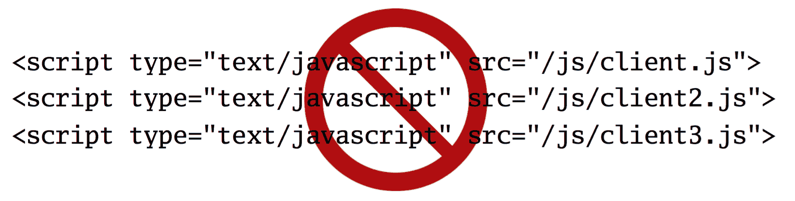
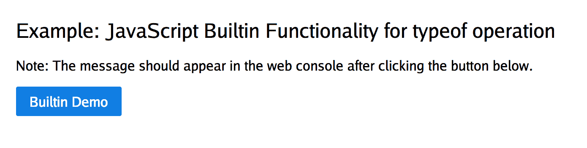
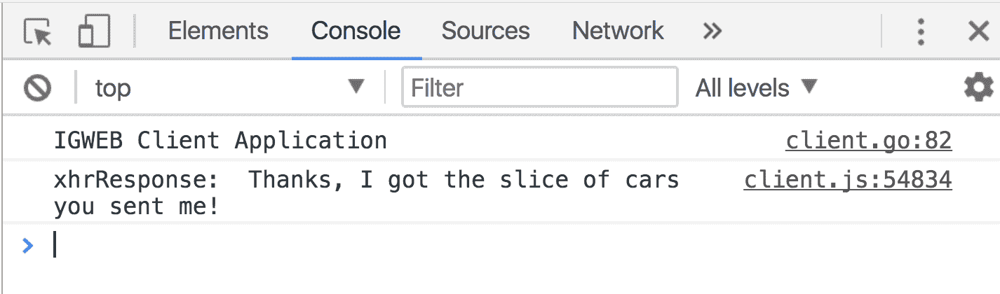

# 第三章：使用 GopherJS 在前端进行 Go 编程

自创建以来，JavaScript 一直是 Web 浏览器的事实标准编程语言。因此，它在前端 Web 开发领域长期占据主导地位。它一直是唯一具备操纵网页的**文档对象模型**（**DOM**）和访问现代 Web 浏览器中实现的各种**应用程序编程接口**（**API**）能力的工具。

由于这种独占性，JavaScript 一直是同构 Web 应用程序开发的唯一可行选项。随着 GopherJS 的推出，我们现在可以在 Web 浏览器中创建 Go 程序，这也使得使用 Go 开发同构 Web 应用程序成为可能。

GopherJS 允许我们使用 Go 编写程序，这些程序会转换为等效的 JavaScript 表示形式，适合在任何支持 JavaScript 的 Web 浏览器中运行。特别是在服务器端使用 Go 时，GopherJS 为我们提供了一种可行且有吸引力的替代方案，尤其是如果我们在前端和后端都使用 Go。有了 Go 覆盖前后端的情况，我们有了新的机会来共享代码，并消除在不同环境中使用不同编程语言时产生的心理上下文转换。

在本章中，我们将涵盖以下主题：

+   文档对象模型

+   基本的 DOM 操作

+   GopherJS 概述

+   GopherJS 示例

+   内联模板渲染

+   本地存储

# 文档对象模型

在我们深入研究 GopherJS 之前，重要的是让我们了解 JavaScript 以及扩展—GopherJS 为我们做了什么。JavaScript 具有的主要功能之一是其能够访问和操作**DOM**（**文档对象模型**的缩写）。DOM 是表示 Web 页面结构及其中存在的所有节点（元素）的树形数据结构。

DOM 的重要性在于它充当 HTML 文档的编程接口，具有访问 Web 页面样式、结构和内容的能力。由于 DOM 树中的每个节点都是一个对象，因此 DOM 可以被视为给定 Web 页面的面向对象表示。因此，可以使用 JavaScript 访问和更改对象及其属性。

*图 3.1*描述了给定 Web 页面的 DOM 层次结构。Web 页面上的所有元素都是**html**节点的子节点，由 Web 页面的 HTML 源代码中的`<html>`标签表示：


图 3.1：Web 页面的 DOM 层次结构

**head**节点是**html**节点的子节点，包含两个子节点—meta（在 HTML 中使用`<meta>`标签定义）和一个脚本节点（用于外部 CSS 或 JavaScript 源文件）。与 head 节点处于同一级别的是 body 节点，使用`<body>`标签定义。

body 节点包含要在 Web 页面上呈现的所有元素。在 body 节点下面，我们有一个子节点，即标题节点（使用`<h1>`标签定义），即 Web 页面的标题。此节点没有子元素。

在标题节点的同一级别，我们还有一个 div 节点（使用`<div>`标签定义）。此节点包含一个 div 子节点，其有两个子节点—一个段落节点（使用`<p>`标签定义），在此节点的同一级别存在一个图像节点（使用``标签定义）。

图像节点没有子元素，段落节点有一个子元素—一个 span 节点（使用`<span>`标签定义）。

Web 浏览器中包含的 JavaScript 运行时为我们提供了访问 DOM 树中各个节点及其相应值的功能。使用 JavaScript 运行时，我们可以访问单个节点，如果给定节点包含子节点，我们还可以访问所有父节点的子节点集合。

由于网页被表示为一组对象，使用 DOM，我们可以访问任何给定 DOM 对象的事件、方法和属性。事实上，`document`对象代表了网页文档本身。

这是 MDN 网站上关于 DOM 的有用介绍：

[`developer.mozilla.org/en-US/docs/Web/API/Document_Object_Model/Introduction`](https://developer.mozilla.org/en-US/docs/Web/API/Document_Object_Model/Introduction)。

# 访问和操作 DOM

如前所述，我们可以使用 JavaScript 来访问和操作给定网页的 DOM。由于 GopherJS 转译为 JavaScript，我们现在有能力在 Go 的范围内访问和操作 DOM。*图 3.2*描述了一个 JavaScript 程序访问/操作 DOM 以及一个 Go 程序也访问/操作 DOM：


图 3.2：DOM 可以被 JavaScript 程序和/或 Go 程序（使用 GopherJS）访问和操作

现在，让我们看一些简单的编程片段，我们可以使用 Go 访问 JavaScript 功能，然后使用 JavaScript 进行一些基本的 DOM 操作，以及它们在 GopherJS 中的等效指令。暂时让我们预览一下使用 GopherJS 编码的样子。这些概念将在本章后面作为完整的例子进行进一步详细解释。

# 基本的 DOM 操作

在本节中，我们将看一些基本的 DOM 操作集合。每个呈现的 DOM 操作都包括在 JavaScript、GopherJS 和使用 DOM 绑定中执行的等效操作。

# 显示警报消息

**JavaScript**

```go
alert("Hello Isomorphic Go!");
```

**GopherJS**

```go
js.Global.Call("alert", "Hello Isomorphic Go!")
```

**DOM 绑定**

```go
dom.GetWindow().Alert("Hello Isomorphic Go!")
```

我们可以执行的最基本的操作之一是在模态对话框中显示`alert`消息。在 JavaScript 中，我们可以使用内置的`alert`函数显示`alert`消息：

```go
alert("Hello Isomorphic Go!");
```

这行代码将在模态窗口对话框中打印出消息`Hello Isomorphic Go!`。`alert`函数会阻止进一步执行，直到用户关闭`alert`对话框。

当我们调用`alert`方法时，实际上是这样调用的：

```go
window.alert("Hello Isomorphic Go!");
```

`window`对象是一个全局对象，代表浏览器中打开的窗口。JavaScript 实现允许我们直接调用`alert`函数以及其他内置函数，而不需要将它们显式地引用为窗口对象的方法，这是一种方便的方式。

我们使用`js`包通过 GopherJS 访问 JavaScript 功能。我们可以将包导入到我们的 Go 程序中，如下所示：

```go
import "github.com/gopherjs/gopherjs/js"
```

`js`包为我们提供了与原生 JavaScript API 交互的功能。对`js`包中的函数的调用直接转换为它们等效的 JavaScript 语法。

我们可以使用 GopherJS 在 Go 中以以下方式显示`alert`消息对话框：

```go
js.Global.Call("alert", "Hello Isomorphic Go!")
```

在前面的代码片段中，我们使用了`js.Global`对象可用的`Call`方法。`js.Global`对象为我们提供了 JavaScript 的全局对象（`window`对象）。

这是`Call`方法的签名：

```go
func (o *Object) Call(name string, args ...interface{}) *Object
```

`Call`方法将调用全局对象的方法，并提供名称。提供给方法的第一个参数是要调用的方法的名称。第二个参数是要传递给全局对象方法的参数列表。`Call`方法被称为可变函数，因为它可以接受`interface{}`类型的可变数量的参数。

您可以通过查看 GopherJS 文档了解更多关于`Call`方法的信息[`godoc.org/github.com/gopherjs/gopherjs/js#Object.Call`](https://godoc.org/github.com/gopherjs/gopherjs/js#Object.Call)。

现在我们已经看到了如何使用`js.Global`对象的`Call`方法来显示`alert`对话框窗口，让我们来看看 DOM 绑定。

`dom`包为我们提供了方便的 GopherJS 绑定到 JavaScript DOM API。使用这个包的想法是，与使用`js.Global`对象执行所有操作相比，DOM 绑定为我们提供了一种惯用的方式来调用常见的 DOM API 功能。

如果您已经熟悉用于访问和操作 DOM 的 JavaScript API，那么使用`dom`包将对您来说感觉自然。我们可以使用`GetWindow`函数访问全局窗口对象，就像这样：

```go
dom.GetWindow()
```

使用`dom`包，我们可以使用以下代码显示警报对话框消息：

```go
dom.GetWindow().Alert("Hello Isomorphic Go!")
```

对这段代码片段的粗略观察表明，这更接近于调用`alert`对话框的 JavaScript 方式：

```go
window.alert("Hello Isomorphic Go!")
```

由于这种相似性，熟悉 JavaScript DOM API 是一个好主意，因为它将使您能够熟悉等效的函数调用，使用`dom`包。

您可以通过查看包的文档来了解更多关于`dom`包的信息</span>[`godoc.org/honnef.co/go/js/dom`](https://godoc.org/honnef.co/go/js/dom)。

# 通过 ID 获取 DOM 元素

我们可以使用`document`对象的`getElementById`方法来访问给定`id`的元素。在这些例子中，我们访问了具有`id`为`"primaryContent"`的主要内容`div`容器。

JavaScript

```go
element = document.getElementById("primaryContent");
```

GopherJS

```go
element := js.Global.Get("document").Call("getElementById", "primaryContent")
```

DOM 绑定

```go
element := dom.GetWindow().Document().GetElementByID("primaryContent")
```

尽管`dom`包的方法调用与 JavaScript 的方法调用非常相似，但可能会出现细微的差异。

例如，注意在 JavaScript 中使用`document`对象的`getElementById`方法调用时的大写，以及使用 DOM 绑定时使用`GetElementByID`方法调用时的大写。

为了在 Go 中导出`GetElementByID`方法，我们必须大写第一个字母，这里是*G*。此外，注意在使用 JavaScript 方式时，*Id*的大小写的微妙差异，与使用 DOM 绑定时*ID*的大小写的微妙差异。

# 查询选择器

`document`对象的`querySelector`方法为我们提供了一种使用 CSS 查询选择器访问 DOM 元素的方法，类似于 jQuery 库。我们可以使用文档对象的`querySelector`方法访问包含欢迎消息的`h2`元素，在 IGWEB 主页上。

JavaScript

```go
element = document.querySelector(".welcomeHeading");
```

GopherJS

```go
element := js.Global.Get("document").Call("querySelector", ".welcomeHeading")
```

DOM 绑定

```go
element := dom.GetWindow().Document().QuerySelector(".welcomeHeading")
```

# 更改元素的 CSS 样式属性

在我们之前涵盖的代码片段中，我们只考虑了访问 DOM 元素的例子。现在，让我们考虑一个例子，我们将改变一个元素的 CSS 样式属性。我们将通过改变`div`元素的`display`属性来隐藏主要内容`div`容器中的内容。

我们可以通过给`js.Global`和`dom`包的调用起别名来节省一些输入，就像这样：

对于 GopherJS：

`JS := js.Global`

对于`dom`包：

`D := dom.GetWindow().Document()`

为了改变主要内容 div 容器的显示属性，我们首先需要访问`div`元素，然后将其`display`属性更改为`none`值。

JavaScript

```go
element = document.GetElementById("primaryContent");
element.style.display = "none"
```

GopherJS

```go
js := js.Global
element := js.Get("document").Call("getElementById"), "primaryContent")
element.Get("style").Set("display", "none")
```

DOM 绑定

```go
d := dom.GetWindow().Document()
element := d.GetElementByID("welcomeMessage")
element.Style().SetProperty("display", "none", "")
```

您可以通过使用 GopherJS Playground 来体验使用 GopherJS，网址为[`gopherjs.github.io/playground/`](https://gopherjs.github.io/playground/)。

# GopherJS 概述

现在我们已经预览了使用 GopherJS，让我们来考虑一下 GopherJS 的工作原理的高级概述。*图 3.3*描述了一个同构的 Go 应用程序，其中包括一个使用 GopherJS 的 Go 前端 Web 应用程序和一个 Go 后端 Web 应用程序：


图 3.3：同构的 Go Web 应用程序包括一个使用 GopherJS 的 Go 前端 Web 应用程序和一个 Go 后端 Web 应用程序

在图 3.3 中，我们将通信方式描述为 HTTP 事务，但重要的是要注意，这不是客户端和 Web 服务器进行通信的唯一方式。我们还可以使用 Web 浏览器的 WebSocket API 建立持久连接，这将在第八章中介绍，即*实时 Web 应用程序功能*。

在前一节中，我们介绍了 GopherJS DOM 绑定的微例子，它们为我们提供了对 DOM API 的访问，这是在 Web 浏览器中实现的 JavaScript API。除了 DOM API 之外，还有其他 API，如 XHR（用于创建和发送 XMLHttpRequests）API 和 WebSocket API（用于与 Web 服务器创建双向持久连接）。XHR 和 WebSocket API 也有 GopherJS 绑定可用。

图 3.4 显示了左侧的常见 JavaScript API，右侧是它们对应的 GopherJS 绑定。有了 GopherJS 绑定，我们可以从 Go 编程语言中访问 JavaScript API 功能：


图 3.4：常见的 JavaScript API 及其等效的 GopherJS 绑定

# GopherJS 转译器

我们使用 GopherJS 转译器将 Go 程序转换为 JavaScript 程序。图 3.5 描述了一个 Go 程序，不仅使用了 Go 标准库的功能，还使用了各种 JavaScript API 的功能，使用了等效的 GopherJS 绑定包：


图 3.5：使用标准库和 GopherJS 绑定转译为等效 JavaScript 程序的 Go 程序

我们使用`gopherjs build`命令将 Go 程序转译为其等效的 JavaScript 表示。生成的 JavaScript 源代码不是供人类修改的。JavaScript 程序可以访问嵌入在 Web 浏览器中的 JavaScript 运行时，以及常见的 JavaScript API。

要了解类型是如何从 Go 转换为 JavaScript 的，请查看[`godoc.org/github.com/gopherjs/gopherjs/js`](https://godoc.org/github.com/gopherjs/gopherjs/js)上的表格。

关于 IGWEB，我们将前端 Go Web 应用程序项目代码组织在`client`文件夹中。这使我们可以将前端 Web 应用程序与后端 Web 应用程序清晰地分开。

图 3.6 显示了包含许多 Go 源文件的客户端项目文件夹：


图 3.6：客户端文件夹包含组成前端 Go Web 应用程序的 Go 源文件。GopherJS 转译器生成一个 JavaScript 程序（client.js）和一个源映射（client.js.map）

在`client`文件夹中运行 GopherJS 转译器对 Go 源文件进行处理时，通过发出`gopherjs build`命令，将创建两个输出文件。第一个输出文件是`client.js`文件，代表等效的 JavaScript 程序。第二个输出文件是`client.js.map`文件，这是用于调试目的的源映射。这个源映射在我们使用 Web 浏览器的控制台追踪错误时，通过提供详细的错误信息来帮助我们。

附录：调试同构 Go 包含了有关调试使用 Go 实现的同构 Web 应用程序的指导和建议。

`gopherjs build`命令在行为上与其`go build`对应命令相同。客户端项目文件夹可以包含任意数量的子文件夹，这些子文件夹也可能包含 Go 源文件。当我们执行`gopherjs build`命令时，将创建一个 JavaScript 源程序和一个源`map`文件。这类似于在发出`go build`命令时创建的单个静态二进制文件。

在`client`文件夹之外，服务器和客户端之间共享的代码可以通过在`import`语句中指定共享包的正确路径来共享。`shared`文件夹将包含要在各个环境中共享的代码，例如模型和模板。

我们可以使用`<script>`标签将 GopherJS 生成的 JavaScript 源文件作为外部`javascript`源文件包含在我们的 Web 页面中，如下所示：

```go
<script type="text/javascript" src="img/client.js"></script>
```

请记住，当我们发出`gopherjs build`命令时，我们不仅创建了我们正在编写的程序的 JavaScript 等效程序，还带来了我们的程序依赖的标准库或第三方包。因此，除了包含我们的前端 Go 程序外，GopherJS 还包括我们的程序依赖的任何依赖包。

并非所有来自 Go 标准库的包都可以在 Web 浏览器中使用。您可以参考 GopherJS 兼容性表，查看 Go 标准库中受支持的包的列表，网址为[`github.com/gopherjs/gopherjs/blob/master/doc/packages.md`](https://github.com/gopherjs/gopherjs/blob/master/doc/packages.md)。

这一事实的后果是，生成的 JavaScript 源代码文件大小将与我们在 Go 程序中引入的依赖关系数量成比例增长。这一事实的另一个后果是，如*图 3.7*所示，在同一个 Web 页面中包含多个 GopherJS 生成的 JavaScript 文件是没有意义的，因为依赖包（例如标准库中的常见包）将被多次包含，不必要地增加我们的总脚本负载，并且没有任何回报价值：



图 3.7：不要在单个 Web 页面中导入多个 GopherJS 生成的源文件

因此，一个 Web 页面最多应包含一个 GopherJS 生成的源文件，如*图 3.8*所示：


图 3.8：Web 页面中应包含一个 GopherJS 生成的源文件

# GopherJS 示例

在本章的前面，我们预览了使用 GopherJS 编码的样子。现在我们将看一些完全充实的示例，以巩固我们对一些基本概念的理解。

如前所述，前端 Web 应用程序的源代码可以在`client`文件夹中找到。

如果要手动转换客户端目录中的 Go 代码，可以在`client`文件夹中发出`gopherjs build`命令：

```go
$ gopherjs build
```

如前所述，将生成两个源文件——`client.js` JavaScript 源文件和`client.js.map`源映射文件。

要手动运行 Web 服务器，可以进入`igweb`文件夹并运行以下命令：

```go
$ go run igweb.go
```

更方便的替代方法是使用`kick`编译 Go 代码和 GopherJS 代码，命令如下：

```go
$ kick --appPath=$IGWEB_APP_ROOT --gopherjsAppPath=$IGWEB_APP_ROOT/client --mainSourceFile=igweb.go
```

使用`kick`的优势在于它将自动监视对 Go 后端 Web 应用程序或 GopherJS 前端 Web 应用程序所做的更改。如前一章所述，当检测到更改时，`kick`将执行*instant kickstart*，这将加快您的迭代开发周期。

一旦您运行了`igweb`程序，可以在以下网址访问 GopherJS 示例：[](http://localhost:8080/front-end-examples-demo) `http://localhost:8080/front-end-examples-demo`

前端示例演示将包含一些基本的 GopherJS 示例。让我们打开`igweb`文件夹中的`igweb.go`源文件，看看一切是如何工作的。

在`registerRoutes`函数中，我们注册以下路由：

```go
r.Handle("/front-end-examples-demo", handlers.FrontEndExamplesHandler(env)).Methods("GET")
r.Handle("/lowercase-text", handlers.LowercaseTextTransformHandler(env)).Methods("POST")
```

`/front-end-examples-demo`路由用于显示我们的前端示例网页。`/lowercase-text`路由用于将文本转换为小写。我们将在稍后更详细地介绍第二个路由；首先，让我们看一下处理`/front-end-examples-demo`路由的处理程序函数（位于`handlers/frontendexamples.go`源文件中）：

```go
package handlers

import (
  "net/http"
  "github.com/EngineerKamesh/igb/igweb/common"
  "github.com/isomorphicgo/isokit"
)

func FrontEndExamplesHandler(env *common.Env) http.Handler {
  return http.HandlerFunc(func(w http.ResponseWriter, r *http.Request) {
    env.TemplateSet.Render("frontend_examples_page", &isokit.RenderParams{Writer: w, Data: nil})
  })
}
```

在这里，我们已经定义了我们的处理程序函数`FrontEndExamplesHandler`，它接受一个`env`对象的指针作为输入参数，并返回一个`http.Handler`函数。我们已经定义了一个闭包来返回`http.HandlerFunc`，它接受`http.ResponseWriter`和`*http.Request`作为输入参数。

我们在`TemplateSet`对象上调用`Render`方法来渲染前端示例页面。方法的第一个输入参数是模板的名称，即`frontend_examples_page`。第二个输入参数是要使用的渲染参数。由于我们是从服务器端渲染模板，我们传递`w`，即`http.ResponseWriter`，负责写出网页响应（渲染的模板）。由于我们没有向模板传递任何数据，我们将`RenderParams`结构体的`Data`字段赋值为`nil`。

在第四章中，*同构模板*，我们将解释模板集是如何工作的，以及我们如何使用`isokit`包提供的同构模板渲染器在服务器端和客户端渲染模板。

在`client.go`源文件中的`initializePage`函数的部分源代码列表中，我们包含了以下代码行来初始化 GopherJS 代码示例（以粗体显示）：

```go
func initializePage(env *common.Env) {

  l := strings.Split(env.Window.Location().Pathname, "/")
  routeName := l[1]

  if routeName == "" {
    routeName = "index"
  }

  if strings.Contains(routeName, "-demo") == false {
    handlers.InitializePageLayoutControls(env)
  }

  switch routeName {

  case "front-end-examples-demo":
    gopherjsprimer.InitializePage()
```

`gopherjsprimer.InitializePage`函数负责向前端示例网页中的元素添加事件侦听器。在注册任何事件之前，我们首先检查页面是否已经访问了`/front-end-examples`路由。如果用户正在访问不同路由的页面，例如`/index`，则无需为前端示例页面设置事件处理程序。如果用户已经访问了`/front-end-examples`路由，那么控制流将到达指定值为`"front-end-examples-demo"`的`case`语句，并且我们将通过调用`gopherjsprimer.InitializePage`函数为网页上的 UI 元素设置所有事件处理程序。

让我们仔细看看`client/gopherjsprimer/initpage.go`源文件中的`InitializePage`函数：

```go
func InitializePage() {

  d := dom.GetWindow().Document()

  messageInput := d.GetElementByID("messageInput").(*dom.HTMLInputElement)

  alertButtonJS := d.GetElementByID("alertMessageJSGlobal").(*dom.HTMLButtonElement)
  alertButtonJS.AddEventListener("click", false, func(event dom.Event) {
 DisplayAlertMessageJSGlobal(messageInput.Value)
 })

  alertButtonDOM := d.GetElementByID("alertMessageDOM").(*dom.HTMLButtonElement)
 alertButtonDOM.AddEventListener("click", false, func(event dom.Event) {
 DisplayAlertMessageDOM(messageInput.Value)
 })

  showGopherButton := d.GetElementByID("showGopher").(*dom.HTMLButtonElement)
 showGopherButton.AddEventListener("click", false, func(event dom.Event) {
 ShowIsomorphicGopher()
 })

  hideGopherButton := d.GetElementByID("hideGopher").(*dom.HTMLButtonElement)
 hideGopherButton.AddEventListener("click", false, func(event dom.Event) {
 HideIsomorphicGopher()
 })

  builtinDemoButton := d.GetElementByID("builtinDemoButton").(*dom.HTMLButtonElement)
 builtinDemoButton.AddEventListener("click", false, func(event dom.Event) {
 builtinDemo(event.Target())
 })

  lowercaseTransformButton := d.GetElementByID("lowercaseTransformButton").(*dom.HTMLButtonElement)
 lowercaseTransformButton.AddEventListener("click", false, func(event dom.Event) {
 go lowercaseTextTransformer()
 })

}
```

`InitializePage`函数负责使用元素的`AddEventListener`方法（以粗体显示）向前端示例网页中的元素添加事件侦听器。

# 显示警报消息

让我们从一个例子开始，显示一个警报对话框。在本章的前面，我们看到了如何使用`js.Global`对象的`Call`方法和 GopherJS DOM 绑定来显示警报对话框。*图 3.9*描述了我们第一个例子的用户界面：


图 3.9：显示警报消息示例

用户界面包括一个输入文本字段，用户可以在其中输入要显示在警报对话框中的自定义消息。文本字段后面是两个按钮：

+   第一个按钮将使用`js.Global`对象上的`Call`方法显示警报对话框

+   第二个按钮将使用 GopherJS DOM 绑定显示警报对话框

前端示例的 HTML 标记可以在位于`shared/templates/frontend_examples_page.tmpl`的模板文件中找到。

以下是警报消息示例的 HTML 标记：

```go
<div class="example">
<form class="pure-form">
  <fieldset class="pure-group">
  <h2>Example: Display Alert Message</h2>
  </fieldset>
  <fieldset class="pure-control-group">
  <label for="messageInput">Alert Message: </label>
  <input id="messageInput" type="text" value="Hello Gopher!" />
  </fieldset>
  <fieldset class="pure-group">
 <button id="alertMessageJSGlobal" type="button" class="pure-button pure-button-primary">Display Alert Message using js.Global</button>
 <button id="alertMessageDOM" type="button" class="pure-button pure-button-primary">Display Alert Message using dom package</button>
</fieldset>
</form>
</div>
```

在这里，我们声明了两个按钮（用粗体显示）并为它们分配了唯一的 id。使用`js.Global.Call`功能显示警报对话框的按钮具有`alertMessageJSGlobal`的 id。使用 GopherJS DOM 绑定显示警报对话框的按钮具有`alertMessageDOM`的 id。

在`initpage.go`源文件中定义的`InitializePage`函数中的以下代码片段负责为在示例中显示的`Display Alert Message`按钮设置事件处理程序：

```go
  alertButtonJS := d.GetElementByID("alertMessageJSGlobal").(*dom.HTMLButtonElement)
  alertButtonJS.AddEventListener("click", false, func(event dom.Event) {
    DisplayAlertMessageJSGlobal(messageInput.Value)
  })

  alertButtonDOM := d.GetElementByID("alertMessageDOM").(*dom.HTMLButtonElement)
  alertButtonDOM.AddEventListener("click", false, func(event dom.Event) {
    DisplayAlertMessageDOM(messageInput.Value)
  })
```

我们通过在`document`对象上调用`GetElementByID`函数来获取第一个按钮，将按钮的`id`作为函数的输入参数传递。然后，我们调用按钮上的`AddEventListener`方法来创建一个新的事件监听器，该监听器将监听点击事件。当第一个按钮被点击时，我们调用`DisplayAlertMessagesJSGlobal`函数，并传递`messageInput`文本字段的值，其中包含用户可以输入的自定义警报消息。

我们以类似的方式为第二个按钮设置了事件监听器，只是当检测到按钮上的点击事件时，我们调用`DisplayAlertMessageDOM`函数，该函数调用使用 GopherJS DOM 绑定显示警报对话框的函数。同样，我们将`messageInput`文本字段的值传递给函数。

现在，如果你点击任何一个按钮，你应该能够看到警报对话框。将警报消息更改为不同的内容，并注意你对警报消息文本字段所做的更改将反映在警报对话框中。*图 3.10*描述了具有自定义消息 Hello Isomorphic Gopher!的警报对话框：


图 3.10：显示具有自定义警报消息的示例

# 更改元素的 CSS 样式属性

现在我们将看一个例子，其中我们实际上通过改变元素的 CSS 样式属性来操作 DOM。这个例子的用户界面由等距地图鼹鼠的图像组成，正下方是两个按钮，如*图 3.11*所示。第一个按钮被点击时，如果它被隐藏，将显示等距地图鼹鼠图像。第二个按钮被点击时，如果它被显示，将隐藏等距地图鼹鼠图像。*图 3.11*显示了等距地图鼹鼠可见时的情况：


图 3.11：当等距地图鼹鼠图像可见时的用户界面

*图 3.12*描述了当等距地图鼹鼠图像不可见时的用户界面：


图 3.12：当等距地图鼹鼠图像不可见时的用户界面

以下是为此示例生成用户界面的 HTML 标记：

```go
<div class="example">
  <form class="pure-form">
  <fieldset class="pure-group">
    <h2>Example: Change An Element's CSS Style Property</h2>
  </fieldset>
  <fieldset class="pure-group">
    <div id="igRacer">
      
    </div>
  </fieldset>
  <fieldset class="pure-group">
 <button id="showGopher" type="button" class="pure-button pure-button-primary">Show Isomorphic Gopher</button>
 <button id="hideGopher" type="button" class="pure-button pure-button-primary">Hide Isomorphic Gopher</button>
  </fieldset>
  </form>
</div>
```

在这里，我们声明了代表等距地图鼹鼠图像的图像标签，并为其分配了`isomorphicGopher`的 id。我们声明了两个按钮（用粗体显示）：

+   第一个按钮，具有`showGopher`的 id，将在点击时显示等距地图鼹鼠图像

+   第二个按钮，具有`hideGopher`的 id，将在点击时隐藏等距地图鼹鼠图像

`InitializePage`函数中的以下代码片段负责为显示和隐藏等距地图鼹鼠图像的两个按钮设置事件处理程序：

```go
  showGopherButton := d.GetElementByID("showGopher").(*dom.HTMLButtonElement)
  showGopherButton.AddEventListener("click", false, func(event dom.Event) {
    ShowIsomorphicGopher()
  })

  hideGopherButton := d.GetElementByID("hideGopher").(*dom.HTMLButtonElement)
  hideGopherButton.AddEventListener("click", false, func(event dom.Event) {
    HideIsomorphicGopher()
  })
```

如果点击显示等距地图鼹鼠按钮，我们调用`ShowIsomorphicGopher`函数。如果点击隐藏等距地图鼹鼠按钮，我们调用`HideIsomorphicGopher`函数。

让我们来看一下`client/gopherjsprimer/cssexample.go`源文件中定义的`ShowIsomorphicGopher`和`HideIsomorphicGopher`函数：

```go
package gopherjsprimer

import "honnef.co/go/js/dom"

func toggleIsomorphicGopher(isVisible bool) {

  d := dom.GetWindow().Document()
  isomorphicGopherImage := d.GetElementByID("isomorphicGopher").(*dom.HTMLImageElement)

  if isVisible == true {
    isomorphicGopherImage.Style().SetProperty("display", "inline", "")
  } else {
    isomorphicGopherImage.Style().SetProperty("display", "none", "")
  }

}

func ShowIsomorphicGopher() {
  toggleIsomorphicGopher(true)
}

func HideIsomorphicGopher() {
  toggleIsomorphicGopher(false)
}
```

`ShowIsomorphicGopher`和`HideIsomorphicGopher`函数都调用`toggleIsomorphicGopher`函数。唯一的区别是，`ShowIsomorphicGopher`函数调用`toggleIsomorphicGopher`函数并传入`true`的输入参数，而`HideIsomorphicGopher`函数调用`toggleIsomorphicGopher`函数并传入`false`的输入参数。

`toggleIsomorphicGopher`函数接受一个布尔变量作为参数，指示是否应显示`IsomorphicGopher`图像。

如果我们向函数传递`true`的值，那么等距地图像将被显示，如*图 3.11*所示。如果我们向函数传递`false`的值，那么等距地图像将不会被显示，如*图 3.12*所示。我们将`Document`对象的值赋给`d`变量。我们调用`Document`对象的`GetElementByID`方法来获取等距地图像。请注意，我们已经执行了类型断言（粗体显示），以断言`d.GetElementByID("isomorphicGopher")`返回的值具有`*dom.HTMLImageElement`的具体类型。

我们声明了一个`if`条件块，检查`isVisible`布尔变量的值是否为`true`，如果是，我们将图像元素的`Style`对象的`display`属性设置为`inline`。这将导致等距地图像出现，如*图 3.11*所示。

如果`isVisible`布尔变量的值为`false`，我们进入`else`块，并将图像元素的`Style`对象的`display`属性设置为`none`，这将防止等距地图像显示，如*图 3.12*所示。

# JavaScript typeof 运算符功能

JavaScript 的`typeof`运算符用于返回给定操作数的类型。例如，让我们考虑以下 JavaScript 代码：

```go
typeof 108 === "number"
```

这个表达式将求值为布尔值`true`。同样，现在考虑这段 JavaScript 代码：

```go
typeof "JavaScript" === "string"
```

这个表达式也将求值为布尔值`true`。

所以你可能会想，我们如何使用 Go 来使用 JavaScript 的`typeof`运算符？答案是，我们将需要`jsbuiltin`包，GopherJS 对内置 JavaScript 功能的绑定，其中包括`typeof`运算符。

在这个例子中，我们将使用`jsbuiltin`包使用 JavaScript 的`typeof`运算符。*图 3.13*展示了这个例子的用户界面：



图 3.13：JavaScript typeof 示例的用户界面

以下是实现此示例用户界面的 HTML 标记：

```go
<div class="example">
  <h2>Example: JavaScript Builtin Functionality for typeof operation</h2>
  <p>Note: The message should appear in the web console after clicking the button below.</p>
 <button id="builtinDemoButton" type="button" class="pure-button pure-button-primary">Builtin Demo</button>
</div>
```

我们声明了一个`id`为`bultinDemoButton`的按钮。现在，让我们在`InitializePage`函数中为内置演示按钮设置一个事件侦听器，以处理点击事件：

```go
  builtinDemoButton := d.GetElementByID("builtinDemoButton").(*dom.HTMLButtonElement)
  builtinDemoButton.AddEventListener("click", false, func(event dom.Event) {
    builtinDemo(event.Target())
  })
```

我们通过在`Document`对象`d`上调用`GetElementID`方法来获取`button`元素。我们将返回的`button`元素赋给`builtinDemoButton`变量。然后我们向`button`元素添加事件侦听器以检测其是否被点击。如果检测到点击事件，我们调用`builtinDemo`函数并传入`button`元素的值，这恰好是事件目标。

让我们检查`client/gopherjsprimer`文件夹中的`builtindemo.go`源文件：

```go
package gopherjsprimer

import (
  "github.com/gopherjs/jsbuiltin"
  "honnef.co/go/js/dom"
)

func builtinDemo(element dom.Element) {

  if jsbuiltin.TypeOf(element) == "object" {
    println("Using the typeof operator, we can see that the element that was clicked, is an object.")
  }

}
```

`bulitindemo`函数接受`dom.Element`类型的输入参数。在这个函数内部，我们通过调用`jsbuiltin`包的`TypeOf`函数（粗体显示）对传入函数的元素执行 JavaScript 的`typeof`操作。我们检查传入的元素是否是对象。如果是对象，我们会在 Web 控制台上打印出一条消息，确认传入函数的元素是一个对象。*图 3.14*展示了在 Web 控制台上打印的消息：


图 3.14：在内置演示按钮被点击后在 Web 控制台上打印的消息

从表面上看，这是一个相当琐碎的例子。然而，它突出了一个非常重要的概念——在 Go 的范围内，我们仍然可以访问内置的 JavaScript 功能。

# 使用 XHR post 将文本转换为小写

现在我们将创建一个简单的小写文本转换器。用户输入的任何文本都将转换为小写。我们的小写文本转换器解决方案的用户界面如*图 3.15*所示。在图像中，输入文本为 GopherJS。当用户点击 Lowercase It!按钮时，文本字段中的文本将被转换为其小写等价物，即 gopherjs：


图 3.15：小写文本转换器示例

实际上，我们可以在客户端上应用文本转换；然而，看到一个示例，我们将输入文本以`XHR Post`的形式发送到 Web 服务器，然后在服务器端执行小写转换会更有趣。一旦服务器完成将文本转换为小写，输入将被发送回客户端，并且文本字段将使用输入文本的小写版本进行更新。

这是用户界面的 HTML 标记：

```go
<div class="example">
  <form class="pure-form">
  <fieldset class="pure-group">
    <h2>Example: XHR Post</h2>
  </fieldset>
  <fieldset class="pure-control-group">
    <label for="textToLowercase">Enter Text to Lowercase: </label>
    <input id="textToLowercase" type="text" placeholder="Enter some text here to lowercase." value="GopherJS" />
  </fieldset>
  <fieldset class="pure-group">
    <button id="lowercaseTransformButton" type="button" class="pure-button pure-button-primary">Lowercase It!</button>
  </fieldset>
  </form>
</div>
```

我们声明一个`input`文本字段，用户可以在其中输入他们想要转换为小写的文本。我们为`input`文本字段分配了一个`id`为`textToLowercase`。然后我们声明一个带有`id`为`lowercaseTransformButton`的按钮。当点击此按钮时，我们将启动一个`XHR Post`到服务器。服务器将转换文本为小写并发送回输入文本的小写版本。

这是`InitializePage`函数中的代码，用于设置按钮的事件监听器：

```go
  lowercaseTransformButton := d.GetElementByID("lowercaseTransformButton").(*dom.HTMLButtonElement)
  lowercaseTransformButton.AddEventListener("click", false, func(event dom.Event) {
    go lowercaseTextTransformer()
  })
```

我们将`button`元素分配给`lowercaseTransformButton`变量。然后我们调用`button`元素上的`AddEventListener`方法来检测点击事件。当检测到点击事件时，我们调用`lowercaseTextTransformer`函数。

这是在`client/gopherjsprimer/xhrpost.go`源文件中定义的`lowercaseTextTransformer`函数：

```go
func lowercaseTextTransformer() {
  d := dom.GetWindow().Document()
  textToLowercase := d.GetElementByID("textToLowercase").(*dom.HTMLInputElement)

  textBytes, err := json.Marshal(textToLowercase.Value)
  if err != nil {
    println("Encountered error while attempting to marshal JSON: ", err)
    println(err)
  }

  data, err := xhr.Send("POST", "/lowercase-text", textBytes)
  if err != nil {
    println("Encountered error while attempting to submit POST request via XHR: ", err)
    println(err)
  }

  var s string
  err = json.Unmarshal(data, &s)

  if err != nil {
    println("Encountered error while attempting to umarshal JSON data: ", err)
  }
  textToLowercase.Set("value", s)
}
```

我们首先通过获取文本输入元素并将其分配给`textToLowercase`变量来开始。然后，我们使用`json`包中的`Marshal`函数将输入到文本输入元素中的文本值编组为其 JSON 表示形式。我们将编组的值分配给`textBytes`变量。

我们使用 GopherJS XHR 绑定来发送`XHR Post`到 Web 服务器。XHR 绑定是通过`xhr`包提供给我们的。我们调用`xhr`包中的`Send`函数来提交`XHR Post`。函数的第一个参数是我们将用于提交数据的 HTTP 方法。这里我们指定`POST`作为 HTTP 方法。第二个输入参数是要将数据提交到的路径。这里我们指定了`/lowercase-text`路由，这是我们在`igweb.go`源文件中设置的。第三个也是最后一个参数是要通过`XHR Post`发送的数据，即`textBytes`——JSON 编组的数据。

来自`XHR Post`的服务器响应将存储在`data`变量中。我们调用`json`包中的`Unmarshal`函数来解组服务器的响应，并将解组的值分配给`string`类型的`s`变量。然后我们使用`textToLowercase`对象的`Set`方法将文本输入元素的值设置为`s`变量的值。

现在，让我们来看看负责在`handlers/lowercasetext.go`源文件中进行小写转换的服务器端处理程序：

```go
package handlers

import (
  "encoding/json"
  "fmt"
  "io/ioutil"
  "log"
  "net/http"
  "strings"

  "github.com/EngineerKamesh/igb/igweb/common"
)

func LowercaseTextTransformHandler(env *common.Env) http.Handler {
  return http.HandlerFunc(func(w http.ResponseWriter, r *http.Request) {
    var s string

    reqBody, err := ioutil.ReadAll(r.Body)
    if err != nil {
      log.Print("Encountered error when attempting to read the request body: ", err)
    }

    reqBodyString := string(reqBody)

    err = json.Unmarshal([]byte(reqBodyString), &s)
    if err != nil {
      log.Print("Encountered error when attempting to unmarshal JSON: ", err)
    }

    textBytes, err := json.Marshal(strings.ToLower(s))
    if err != nil {
      log.Print("Encountered error when attempting ot marshal JSON: ", err)
    }
    fmt.Println("textBytes string: ", string(textBytes))
    w.Write(textBytes)

  })

}
```

在`LowercaseTextTransformHandler`函数中，我们调用`ioutil`包中的`ReadAll`函数来读取请求体。我们将`reqBody`的字符串值保存到`reqBodyString`变量中。然后我们对这个字符串进行 JSON 解组，并将解组后的值存储到`string`类型的`s`变量中。

我们使用`strings`包中的`ToLower`函数将`s`字符串变量的值转换为小写，并将该值编组成 JSON 表示。然后我们在`http.ResponseWriter`的`w`上调用`Write`方法，将字符串的 JSON 编组值写出为小写。

当我们在用户界面中点击 Lowercase It!按钮时，字符串 GopherJS 会被转换为其小写表示 gopherjs，如*图 3.16*所示：


图 3.16：当按钮被点击时，文本“GopherJS”被转换为小写的“gopherjs”

# 内联模板渲染

在这一部分，您将学习如何使用 GopherJS 在 Go 中执行客户端模板渲染。我们可以直接在 Web 浏览器中使用`html/template`包来渲染模板。我们将使用内联模板来渲染汽车表格的各行。

# 汽车列表演示

在汽车列表演示中，我们将使用内联客户端端 Go 模板填充一张表格的行。在我们的示例中，表格将是汽车列表，我们将从汽车切片中获取要显示在表格中的汽车。然后我们使用`gob`编码对汽车切片进行编码，并通过 XHR 调用将数据传输到 Web 服务器实例。

客户端模板渲染有很多好处：

+   Web 服务器上的 CPU 使用率是由服务器端模板渲染引起的

+   不需要完整页面重新加载来渲染客户端模板

+   通过在客户端端渲染模板来减少带宽消耗

让我们在`shared/templates/carsdemo_page.tmpl`目录中打开`cars.html`源文件：

```go
{{ define "pagecontent" }}
<table class="mdl-data-table mdl-js-data-table mdl-shadow--2dp">
  <thead>
    <tr>
      <th class="mdl-data-table__cell--non-numeric">Model Name</th>
      <th class="mdl-data-table__cell--non-numeric">Color</th>
      <th class="mdl-data-table__cell--non-numeric">Manufacturer</th>
    </tr>
  </thead>
 <tbody id="autoTableBody">
 </tbody>
</table>
{{end}}
{{template "layouts/carsdemolayout" . }}
```

这个 HTML 源文件包含了我们示例的网页内容，一个汽车表格，我们将使用内联模板来渲染表格的每一行。

我们使用`table`标签声明了将在网页上显示的表格。我们声明了每一列的标题。由于我们将显示一张汽车表格，每辆车有三列；我们有一个列用于车型名称，一个列用于颜色，一个列用于制造商。

我们将要添加到表格中的每一行都将被追加到`tbody`元素中（以粗体显示）。

请注意，我们使用`carsdemolayout.tmpl`布局模板来布局汽车演示页面。让我们打开位于`shared/templates/layouts`目录中的这个文件：

```go
<html>
  {{ template "partials/carsdemoheader" }}
<body>
    <div class="pageContent" id="primaryContent">
      {{ template "pagecontent" . }}
    </div>
<script src="img/client.js"></script>
</body>
</html>
```

布局模板不仅负责渲染`pagecontent`模板，还负责渲染位于`templates/shared/partials`目录中的头部模板`carsdemoheader.tmpl`。布局模板还负责导入由 GopherJS 生成的`client.js`外部 JavaScript 源文件。

让我们来看一下`carsdemoheader.tmpl`源文件：

```go
<head>
  <link rel="icon" type="image/png" href="/static/images/isomorphic_go_icon.png">
  <link rel="stylesheet" href="https://fonts.googleapis.com/icon?family=Material+Icons">
  <link rel="stylesheet" href="https://code.getmdl.io/1.3.0/material.indigo-pink.min.css">
  <script defer src="img/material.min.js"></script>
</head>
```

在这个头部模板文件中，我们导入了 CSS 样式表和 Material Design Library 的 JavaScript 源文件。我们将使用 Material Design Library 来使用默认的材料设计样式使我们的表格看起来漂亮。

在`client.go`源文件的`initializePage`函数中，我们包含了以下代码行来初始化汽车演示代码示例，当着陆在汽车演示网页上时：

```go
carsdemo.InitializePage()
```

在`client/carsdemo`目录中的`cars.go`源文件中，我们声明了用于渲染给定汽车信息的内联模板：

```go
const CarItemTemplate = `
  <td class="mdl-data-table__cell--non-numeric">{{.ModelName}}</td>
  <td class="mdl-data-table__cell--non-numeric">{{.Color}}</td>
  <td class="mdl-data-table__cell--non-numeric">{{.Manufacturer}}</td>
`
```

我们声明了`CarItemTemplate`常量，这是一个多行字符串，包括我们的内联模板。在模板的第一行中，我们渲染包含型号名称的列。在模板的第二行中，我们渲染汽车的颜色。最后，在模板的第三行中，我们渲染汽车的制造商。

我们声明并初始化了`D`变量，使用了`Document`对象，如下所示：

```go
var D = dom.GetWindow().Document()
```

`InitializePage`函数（在`client/carsdemo/cars.go`源文件中找到）负责调用`cars`函数：

```go
func InitializePage() {
  cars()
}
```

在`cars`函数内部，我们创建了`nano`，`ambassador`和`omni`——`Car`类型的三个实例。就在这之后，我们使用汽车对象来填充`cars`切片：

```go
nano := models.Car{ModelName: "Nano", Color: "Yellow", Manufacturer: "Tata"}
ambassador := models.Car{ModelName: "Ambassador", Color: "White", Manufacturer: "HM"}
omni := models.Car{ModelName: "Omni", Color: "Red", Manufacturer: "Maruti Suzuki"}
cars := []models.Car{nano, ambassador, omni}
```

现在我们有了一个`cars`切片来填充表格，是时候用以下代码生成表格的每一行了：

```go
  autoTableBody := D.GetElementByID("autoTableBody")
  for i := 0; i < len(cars); i++ {
    trElement := D.CreateElement("tr")
    tpl := template.New("template")
    tpl.Parse(CarItemTemplate)
    var buff bytes.Buffer
    tpl.Execute(&buff, cars[i])
    trElement.SetInnerHTML(buff.String())
    autoTableBody.AppendChild(trElement)
  }
```

在这里，我们声明并初始化了`autoTableBody`变量，这是表格的`tbody`元素。这是我们将用来向表格追加新行的元素。我们遍历`cars`切片，对于每个`Car`结构，我们使用`Document`对象的`CreateElement`方法动态创建一个`tr`元素。然后我们创建一个新模板，并解析汽车项目模板的内容。

我们声明了一个名为`buff`的缓冲变量，用于保存执行模板的结果。我们在模板对象`tpl`上调用`Execute`函数，传入`buff`和`cars`切片的`i`索引处的当前`Car`记录，这将是传递给内联模板的数据对象。

然后我们在`tr`元素对象上调用`SetInnerHTML`方法，并传入`buff`变量的字符串值，其中包含我们渲染的模板内容。

这是所有行都填充的汽车表的样子：


图 3.17：汽车表

这个例子对于说明目的是有用的，但在实际情况下并不是很实用。在 Go 源文件中混合使用 HTML 编写的内联模板可能会变得难以维护，因为项目代码库规模扩大。除此之外，如果我们有一种方法可以在客户端访问服务器端所有用户界面的模板，那将是很好的。事实上，我们可以做到，这将是我们在第四章中的重点，*同构模板*。

现在我们已经看到了如何渲染内联模板，让我们考虑如何将`cars`切片作为二进制数据以`gob`格式编码传输到服务器。

# 传输 gob 编码数据

`encoding/gob`包为我们提供了管理 gob 流的功能，这些流是在编码器和解码器之间交换的二进制值。您可以使用编码器将值编码为`gob`编码数据，然后使用解码器解码`gob`编码数据。

通过在服务器端和客户端上使用 Go，我们创建了一个 Go 特定的环境，如*图 3.18*所示。这是使用`encoding/gob`包进行客户端和服务器之间数据交换的理想环境：


图 3.18：Go 特定的环境

我们将要传输的数据包括`cars`切片。`Car`结构可以被认为是同构的，因为我们可以在客户端和服务器端都使用`Car`结构。

请注意，在`cars.go`源文件中，我们已经包含了`encoding/gob`包（以粗体显示）在我们的导入分组中：

```go
import (
  "bytes"
  "encoding/gob"
  "html/template"

  "github.com/EngineerKamesh/igb/igweb/shared/models"

  "honnef.co/go/js/dom"
  "honnef.co/go/js/xhr"
)
```

我们使用以下代码将`cars`切片编码为`gob`格式：

```go
  var carsDataBuffer bytes.Buffer
  enc := gob.NewEncoder(&carsDataBuffer)
  enc.Encode(cars)
```

在这里，我们声明了一个名为`carsDataBuffer`的字节缓冲区，它将包含`gob`编码的数据。我们创建了一个新的`gob`编码器，并指定我们要将编码后的数据存储到`carsDataBuffer`中。然后我们调用了`gob`编码器对象上的`Encode`方法，并传入了`cars`切片。到这一步，我们已经将`cars`切片编码到了`carsDataBuffer`中。

现在我们已经将`cars`切片编码成`gob`格式，我们可以使用`HTTP POST`方法通过 XHR 调用将`gob`编码的数据传输到服务器：

```go
  xhrResponse, err := xhr.Send("POST", "/cars-data", carsDataBuffer.Bytes())

  if err != nil {
    println(err)
  }

  println("xhrResponse: ", string(xhrResponse))
```

我们在`xhr`包中调用`Send`函数，并指定我们要使用`POST`方法，并将数据发送到`/cars-data`URL。我们调用`carsDataBuffer`上的`Bytes`方法，以获取缓冲区的字节切片表示。正是这个字节切片，我们将发送到服务器，并且它是`gob`编码的`car`切片。

服务器的响应将存储在`xhrResponse`变量中，并且我们将在网络控制台中打印出这个变量。

现在我们已经看到了程序的客户端部分，是时候来看看服务端处理程序函数了，它服务于`/cars-data`路由。让我们来看看`carsdata.go`源文件中定义的`CarsDataHandler`函数，它位于 handlers 目录中：

```go
func CarsDataHandler(env *common.Env) http.Handler {
  return http.HandlerFunc(func(w http.ResponseWriter, r *http.Request) {

    var cars []models.Car
    var carsDataBuffer bytes.Buffer

    dec := gob.NewDecoder(&carsDataBuffer)
    body, err := ioutil.ReadAll(r.Body)
    carsDataBuffer = *bytes.NewBuffer(body)
    err = dec.Decode(&cars)

    w.Header().Set("Content-Type", "text/plain")

    if err != nil {
      log.Println(err)
      w.Write([]byte("Something went wrong, look into it"))

    } else {
      fmt.Printf("Cars Data: %#v\n", cars)
      w.Write([]byte("Thanks, I got the slice of cars you sent me!"))
    }

  })
}
```

在`CarsDataHandler`函数内部，我们声明了一个`cars`变量，它是一个`Car`对象的切片。在这之下，我们有`carsDataBuffer`，它将包含从客户端网页应用程序发送的 XHR 调用中接收到的`gob`编码数据。

我们创建了一个新的`gob`解码器，并指定`gob`数据将存储在`carsDataBuffer`中。然后我们使用`ioutil`包中的`ReadAll`函数来读取请求体并将所有内容保存到`body`变量中。

然后我们创建一个新的字节缓冲区，并将`body`变量作为输入参数传递给`NewBuffer`函数。`carsDataBuffer`现在包含了通过 XHR 调用传输的`gob`编码数据。最后，我们调用`dec`对象的`Decode`函数，将`gob`编码的数据转换回`Car`对象的切片。

如果我们没有收到任何错误，我们将`cars`切片打印到标准输出：

```go
Cars Data: []models.Car{models.Car{ModelName:"Nano", Color:"Yellow", Manufacturer:"Tata"}, models.Car{ModelName:"Ambassador", Color:"White", Manufacturer:"HM"}, models.Car{ModelName:"Omni", Color:"Red", Manufacturer:"Maruti Suzuki"}}
```

除了将`cars`切片打印到标准输出之外，我们还向网络客户端发送了一个响应，指示`cars`切片已成功接收。我们可以在网络浏览器控制台中查看这条消息：



图 3.19：服务器对网络客户端的响应

# 本地存储

你知道吗，网络浏览器自带了一个内置的键值数据库吗？这个数据库的名字叫本地存储，在 JavaScript 中，我们可以将`localStorage`对象作为`window`对象的属性来访问。本地存储允许我们在网络浏览器中本地存储数据。本地存储是按域和协议划分的，这意味着来自相同来源的页面可以访问和修改共享数据。

以下是本地存储的一些好处：

+   它提供安全的数据存储

+   它的存储限制比 cookie 大得多（至少 5MB）

+   它提供低延迟的数据访问

+   对于不需要联网的网络应用程序非常有帮助

+   它可以用作本地缓存

# 常见的本地存储操作

我们将向您展示如何使用 JavaScript 代码对`localStorage`对象执行一些常见操作。这些操作包括以下内容：

1.  设置键值对

1.  获取给定键的值

1.  获取所有键值对

1.  清除所有条目

在下一节中，我们将向您展示如何使用 GopherJS 执行相同的操作，以一个完全充实的示例。

# 设置键值对

要将项目存储到本地存储中，我们调用`localStorage`对象的`setItem`方法，并将键和值作为参数传递给该方法：

```go
localStorage.setItem("foo", "bar"); 
```

在这里，我们提供了一个`"foo"`键，带有一个`"bar"`值。

# 获取给定键的值

要从本地存储中获取项目，我们调用`localStorage`对象的`getItem`方法，并将键作为该方法的单个参数传递：

```go
var x = localStorage.getItem("foo");
```

在这里，我们提供了`"foo"`键，并且我们期望`x`变量的值将等于`"bar"`。

# 获取所有键值对

我们可以使用`for`循环从本地存储中检索所有键值对，并使用`localStorage`对象的`key`和`getItem`方法访问键和值的值：

```go
for (var i = 0; i < localStorage.length; i++) {
  console.log(localStorage.key(i)); // prints the key
  console.log(localStorage.getItem(localStorage.key(i))); // prints the value
}
```

我们在`localStorage`对象上使用`key`方法，传入数字索引`i`，以获取存储中的第 i 个键。类似地，我们将`i`数字索引传递给`localStorage`对象的`key`方法，以获取存储中第 i 个位置的键的名称。请注意，键的名称是通过`localStorage.key(i)`方法调用获得的，并传递给`getItem`方法以检索给定键的值。

# 清除所有条目

我们可以通过在`localStorage`对象上调用`clear`方法轻松地删除本地存储中的所有条目：

```go
localStorage.clear();
```

# 构建本地存储检查器

根据上一节中关于如何利用`localStorage`对象的信息，让我们继续构建本地存储检查器。本地存储检查器将允许我们执行以下操作：

+   查看当前存储在本地存储中的所有键值对

+   向本地存储添加新的键值对

+   清除本地存储中的所有键值对

*图 3.20*描述了本地存储检查器的用户界面：


图 3.20：本地存储演示用户界面

直接位于 LocalStorage Demo 标题下方的框是一个`div`容器，负责保存当前存储在本地存储中的键值对列表。键输入文本字段是用户输入键的地方。值输入文本字段是用户输入键值对的值的地方。单击保存按钮将新的键值对条目保存到本地存储中。单击清除所有按钮将清除本地存储中的所有键值对条目。

# 创建用户界面

我们在`shared/templates/layouts`文件夹中找到的`localstorage_layout.tmpl`源文件中定义了本地存储演示页面的布局：

```go
<!doctype html>
<html>
  {{ template "partials/localstorageheader_partial" }}
  <body>
    <div class="pageContent" id="primaryContent">
      {{ template "pagecontent" . }}
    </div>

  <script type="text/javascript" src="img/client.js"></script>

  </body>
</html>
```

此布局模板定义了本地存储演示网页的布局。我们使用模板操作（以粗体显示）来呈现`partials/localstorageheader_partial`头部模板和`pagecontent`页面内容模板。

请注意，在网页底部，我们包含了 JavaScript 源文件`client.js`，这是由 GopherJS 生成的，使用`script`标签（以粗体显示）。

我们在`shared/templates/partials`文件夹中找到的`localstorageheader_partial.tmpl`源文件中定义了本地存储演示页面的头部模板。

```go
<head>
  <title>LocalStorage Demo</title> 
  <link rel="icon" type="image/png" href="/static/images/isomorphic_go_icon.png">
 <link rel="stylesheet" href="https://unpkg.com/purecss@1.0.0/build/pure-min.css" integrity="sha384-nn4HPE8lTHyVtfCBi5yW9d20FjT8BJwUXyWZT9InLYax14RDjBj46LmSztkmNP9w" crossorigin="anonymous">
 <link rel="stylesheet" type="text/css" href="/static/css/igweb.css">
 <link rel="stylesheet" type="text/css" href="/static/css/localstoragedemo.css">
</head>
```

此标题模板旨在呈现`head`标签，我们在其中使用`link`标签（以粗体显示）包含外部 CSS 样式表。

我们在`shared/templates`文件夹中找到的`localstorage_example_page.tmpl`源文件中定义了本地存储演示的用户界面的 HTML 标记：

```go
{{ define "pagecontent" }}

<h1>LocalStorage Demo</h1>

    <div id="inputFormContainer">
      <form class="pure-form">
      <fieldset class="pure-group" style="min-height: 272px">
      <div id="storageContents">
 <dl id="itemList">
 </dl>
 </div>
      </fieldset>

      <fieldset class="pure-control-group">
      <label for="messageInput">Key: </label>
      <input id="itemKey" type="text" value="" />
      <label for="messageInput">Value: </label>
      <input id="itemValue" type="text" value="" />

      </fieldset>

      <fieldset class="pure-control-group">
      </fieldset>

      <fieldset class="pure-group">
        <button id="saveButton" type="button" class="pure-button pure-button-primary">Save</button>
 <button id="clearAllButton" type="button" class="pure-button pure-button-primary">Clear All</button>
      </fieldset>
      </form>
    </div>

{{end}}
{{template "layouts/localstorage_layout" . }}
```

具有`"storageContents"`id 的`div`元素将用于存储本地存储数据库中的项目条目列表。实际上，我们将使用具有`"itemList"`id 的 dl（描述列表）元素来显示所有键值对。

我们为用户定义了一个输入文本字段以输入键，并且我们还为用户定义了一个输入文本字段以输入值。我们还为`Save`按钮定义了标记，并且直接在其下方，我们定义了`Clear All`按钮的标记。

# 设置服务器端路由

我们在`igweb.go`源文件中的`registerRoutes`函数中注册了`/localstorage-demo`路由：

```go
r.Handle("/localstorage-demo", handlers.LocalStorageDemoHandler(env)).Methods("GET")
```

我们已经定义了`LocalStorageDemoHandler`服务器端处理程序函数，用于服务于`localstorage-demo`服务器端路由，在`handlers`文件夹中找到的`localstoragedemo.go`源文件中：

```go
package handlers

import (
  "net/http"

  "github.com/EngineerKamesh/igb/igweb/common"
  "github.com/isomorphicgo/isokit"
)

func LocalStorageDemoHandler(env *common.Env) http.Handler {
  return http.HandlerFunc(func(w http.ResponseWriter, r *http.Request) {
    env.TemplateSet.Render("localstorage_example_page", &isokit.RenderParams{Writer: w, Data: nil})
  })
}
```

`LocalStorageDemoHandler`函数负责向客户端写入网页响应。它调用应用程序的`TemplateSet`对象的`Render`方法，以渲染`localstorage_example_page`模板。您将在第四章中了解更多关于渲染同构模板的内容，*同构模板*。

# 实现客户端功能

实现本地存储检查器的客户端功能包括以下步骤：

1.  初始化本地存储检查器网页

1.  实现本地存储检查器

# 初始化本地存储检查器网页

为了初始化本地存储检查器网页上的事件处理程序，我们需要在`client.go`源文件中的`initializePage`函数内的`localstorage-demo`情况下添加以下代码行：

```go
localstoragedemo.InitializePage()
```

调用`localstoragedemo`包中定义的`InitializePage`函数将为保存和清除所有按钮添加事件监听器。

# 实现本地存储检查器

本地存储检查器的实现可以在`client/localstoragedemo`目录中的`localstorage.go`源文件中找到。

在`import`分组中，我们包括了`js`和`dom`包（以粗体显示）：

```go
package localstoragedemo

import (
 "github.com/gopherjs/gopherjs/js"
 "honnef.co/go/js/dom"
)
```

我们已经定义了`localStorage`变量，并将其赋值为附加到`window`对象的`localStorage`对象的值：

```go
var localStorage = js.Global.Get("localStorage")
```

像往常一样，我们使用`D`变量将`Document`对象进行了别名，以节省一些输入。

```go
var D = dom.GetWindow().Document().(dom.HTMLDocument)
```

`InitializePage`函数负责为保存和清除所有按钮设置事件监听器：

```go
func InitializePage() {
 saveButton := D.GetElementByID("saveButton").(*dom.HTMLButtonElement)
 saveButton.AddEventListener("click", false, func(event dom.Event) {
 Save()
 })

 clearAllButton := D.GetElementByID("clearAllButton").(*dom.HTMLButtonElement)
 clearAllButton.AddEventListener("click", false, func(event dom.Event) {
 ClearAll()
 })

 DisplayStorageContents()
}
```

我们通过调用`Document`对象的`GetElementByID`方法并将`id``saveButton`作为该方法的唯一输入参数来获取`saveButton`元素。紧接着，我们在点击事件上添加一个事件监听器来调用`Save`函数。调用`Save`函数将保存一个新的键值对条目。

我们还通过调用`Document`对象的`GetElementByID`方法并将`id``clearAllButton`作为该方法的唯一输入参数来获取`clearAllButton`元素。紧接着，我们在点击事件上添加一个事件监听器来调用`ClearAll`函数。调用`ClearAll`函数将清除本地存储中当前存储的所有键值对。

`Save`函数负责将键值对保存到 Web 浏览器的本地存储中：

```go
func Save() {

 itemKey := D.GetElementByID("itemKey").(*dom.HTMLInputElement)
 itemValue := D.GetElementByID("itemValue").(*dom.HTMLInputElement)

  if itemKey.Value == "" {
    return
  }

  SetKeyValuePair(itemKey.Value, itemValue.Value)
  itemKey.Value = ""
  itemValue.Value = ""
  DisplayStorageContents()
}
```

我们使用`Document`对象的`GetElementByID`方法获取键和值的文本输入字段（以粗体显示）。在`if`条件块中，我们检查用户是否未为键输入文本字段输入值。如果他们没有输入值，我们就从函数中返回。

如果用户已经在键输入文本字段中输入了值，我们将继续。我们调用`SetKeyValuePair`函数，并将`itemKey`和`itemValue`的值作为输入参数传递给函数。

然后，我们将`itemKey`和`itemValue`的`Value`属性都设置为空字符串，以清除输入文本字段，这样用户可以轻松地在以后添加新条目而无需手动清除这些字段中的文本。

最后，我们调用`DisplayStorageContents`函数，该函数负责显示本地存储中的所有当前条目。

让我们来看看`SetKeyValuePair`函数：

```go
func SetKeyValuePair(itemKey string, itemValue string) {
  localStorage.Call("setItem", itemKey, itemValue)
}
```

在这个函数内部，我们只需调用`localStorage`对象的`setItem`方法，将`itemKey`和`itemValue`作为输入参数传递给函数。此时，键值对条目将保存到 Web 浏览器的本地存储中。

`DisplayStorageContents`函数负责在`itemList`元素（一个`dl`（描述列表）元素）中显示所有本地存储中的键值对。

```go
func DisplayStorageContents() {

  itemList := D.GetElementByID("itemList")
  itemList.SetInnerHTML("")

  for i := 0; i < localStorage.Length(); i++ {

    itemKey := localStorage.Call("key", i)
    itemValue := localStorage.Call("getItem", itemKey)

    dtElement := D.CreateElement("dt")
    dtElement.SetInnerHTML(itemKey.String())

    ddElement := D.CreateElement("dd")
    ddElement.SetInnerHTML(itemValue.String())

    itemList.AppendChild(dtElement)
    itemList.AppendChild(ddElement)
  }

}
```

我们调用`SetInnerHTML`方法并输入空字符串来清除列表的内容。

我们使用`for`循环遍历本地存储中的所有条目。对于每个键值对，我们通过调用`localStorage`对象的`key`和`getItem`方法分别获取`itemKey`和`itemValue`。

我们使用`dt`元素（`dtElement`）来显示键。`dt`元素用于定义描述列表中的术语。我们使用`dd`元素（`ddElement`）来显示值。`dd`元素用于描述描述列表中的术语。使用描述列表及其相关元素来显示键值对，我们使用了一种语义友好的方法来在网页上显示键值对。我们通过调用其`AppendChild`方法将`dt`和`dd`元素附加到`itemList`对象上。

`ClearAll`函数用于删除本地存储中保存的所有键值对：

```go
func ClearAll() {
  localStorage.Call("clear")
  DisplayStorageContents()
}
```

我们调用`localStorage`对象的`clear`方法，然后调用`DisplayStorageContents`函数。如果一切正常，所有项目应该被清除，一旦单击了清除所有按钮，我们应该看不到`itemList`元素中出现任何值。

# 运行本地存储演示

您可以在`http://localhost:8080/localstorage-demo`访问本地存储演示。

让我们向本地存储添加一个新的键值对。在键输入文本字段中，让我们添加`"foo"`键，在值输入文本字段中，让我们添加`"bar"`值。单击保存按钮将新的键值对添加到本地存储中。

图 3.21 显示了单击保存按钮后出现的新创建的键值对：


图 3.21：本地存储检查器显示了一个新添加的键值对

尝试刷新网页，然后尝试重新启动 Web 浏览器并返回网页。请注意，在这些情况下，本地存储仍然保留了保存的键值对。单击清除所有按钮后，您会注意到`itemList`已被清除，如图 3.20 所示，因为本地存储已清空所有键值对。

我们刚刚创建的本地存储检查器特别方便，可以检查由第三方 JavaScript 解决方案填充的键值对，这些解决方案被我们的客户端 Web 应用程序使用。如果您在 IGWEB 主页上查看图像轮播后登陆本地存储演示页面，您会注意到 itemList 中填充了图 3.22 中显示的键值对：


图 3.22：本地存储演示显示了由图像轮播填充的键值对

这些键值对是由图像轮播填充的，我们将在第九章中实现为可重用组件。

# 总结

在本章中，我们向您介绍了使用 GopherJS 在前端进行 Go 编程。我们向您介绍了 DOM，并展示了如何使用 GopherJS 访问和操作 DOM。我们通过几个微例子来让您熟悉使用 GopherJS 编码的样子。然后我们继续展示了完全成熟的例子。

我们向您展示了如何显示警报对话框并显示自定义消息。我们还向您展示了如何更改元素的 CSS 样式属性。我们继续向您展示了如何在 Go 的限制范围内使用`jsbuiltin`包调用 JavaScript 的`typeof`运算符。我们向您展示了如何创建一个简单的小写文本转换器，并演示了如何使用`xhr`包发送`XHR Post`。我们还向您展示了如何渲染内联 Go 模板，最后，我们向您展示了如何构建本地存储检查器。

在第四章中，*同构模板*，我们将介绍同构模板，这些模板可以在服务器端或客户端上进行渲染。
