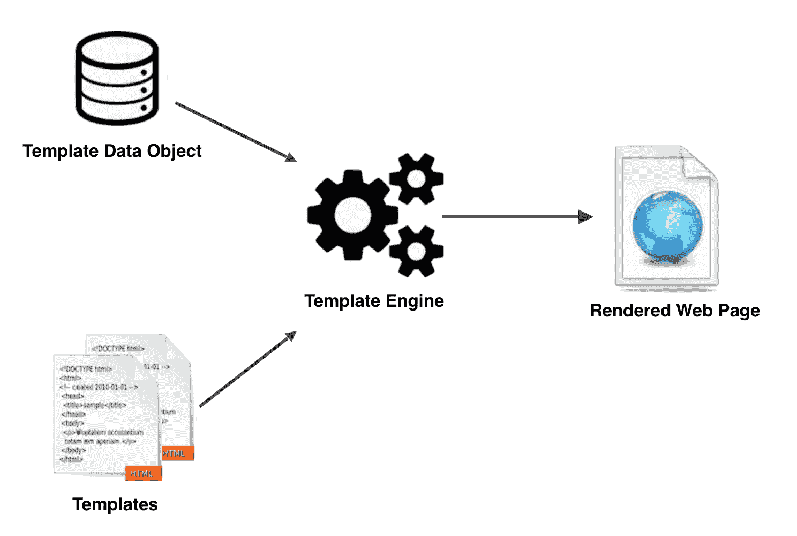
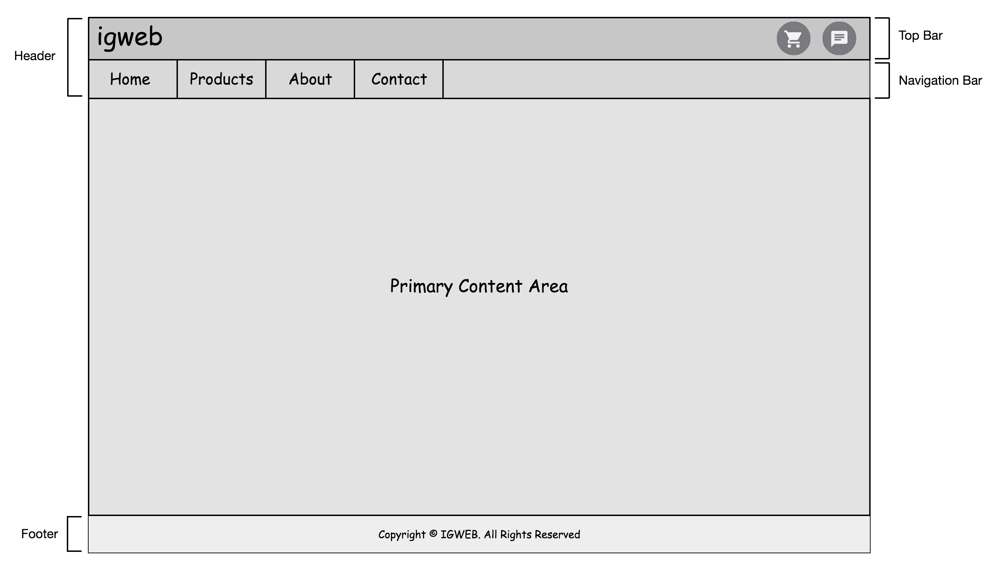
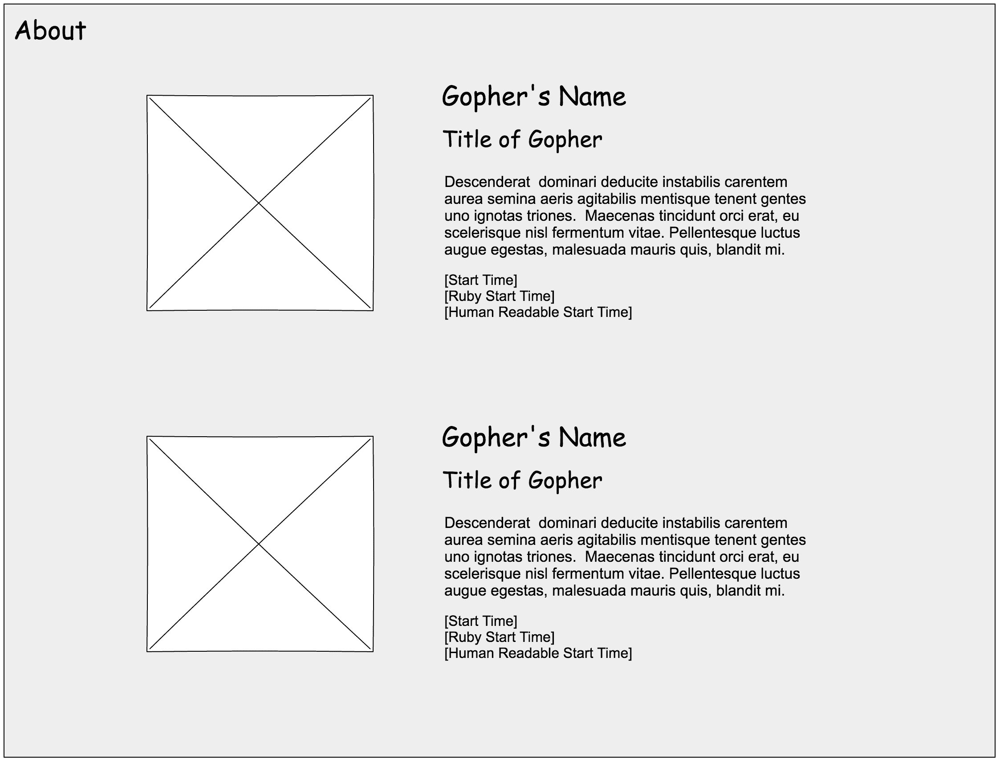
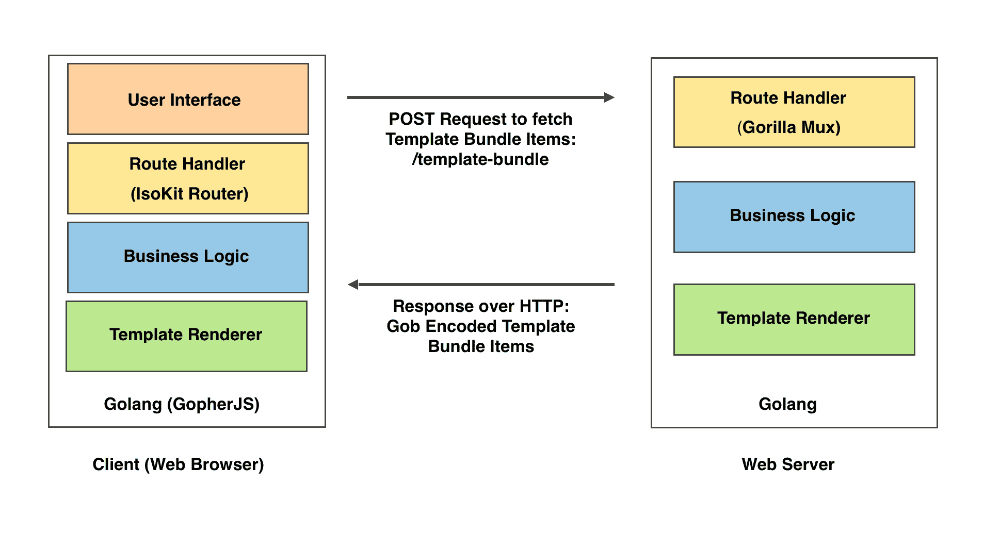
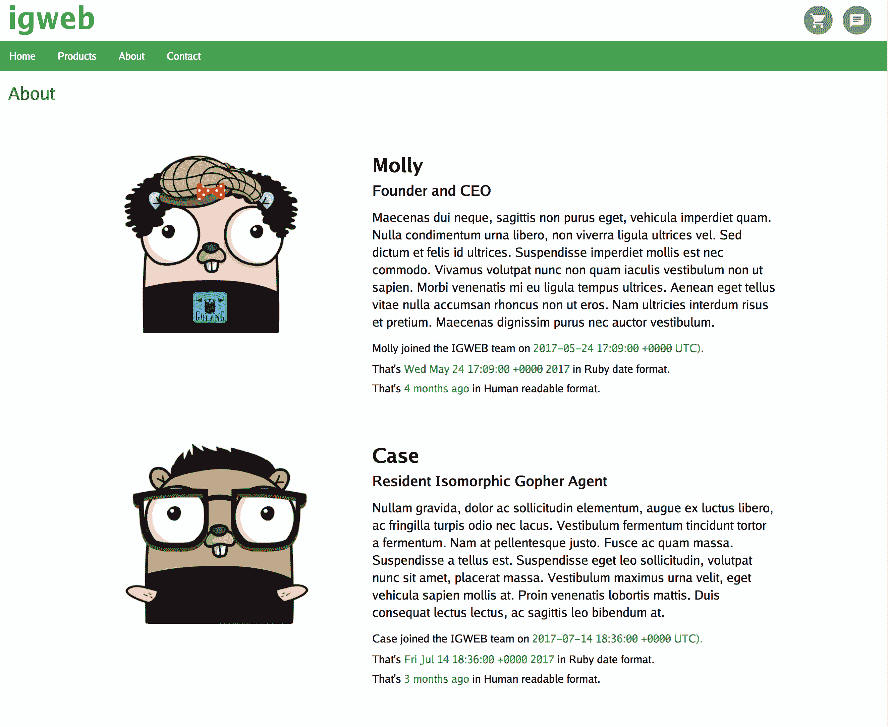
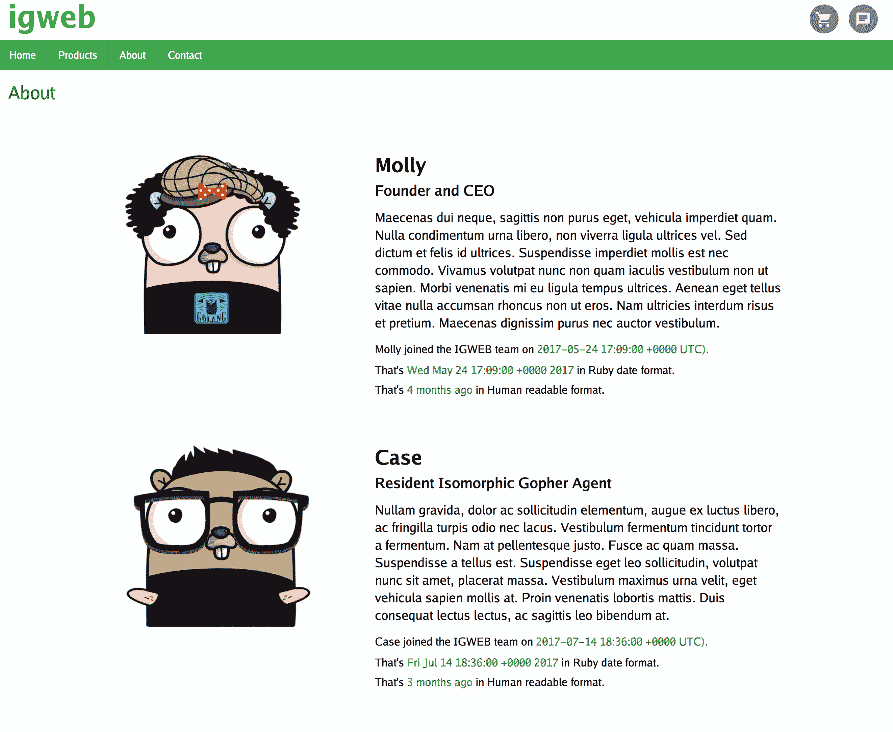

# 同构模板

在上一章中，我们介绍了 GopherJS，并涵盖了执行各种前端操作的代码示例。我们在客户端执行的有趣任务之一是使用内联 Go 模板进行模板渲染。然而，在 Web 浏览器中呈现内联 Go 模板并不是一个可维护的解决方案。首先，将 HTML 代码与 Go 源代码混合在一起，随着项目代码库的增长，可能会变得难以维护。此外，现实世界的 Web 应用程序通常需要具有多个模板文件，这些文件通常以布局层次结构嵌套在一起。除此之外，Go 标准库中的模板包特别设计用于在服务器端呈现模板，因为它依赖于从文件系统访问模板文件。

为了充分发挥模板在各种环境中的功能，我们需要一个解决方案，提供更多灵活性，以在给定项目的一组模板中呈现任何模板。通过使用 Isomorphic Go 工具包中的`isokit`包，可以找到这种灵活性。使用`isokit`包的功能，我们可以在服务器端或客户端呈现属于模板集的模板，并且我们将在本章中向您展示如何实现这一点。

具体来说，本章将涵盖以下主题：

+   网页模板系统

+   IGWEB 页面结构

+   模板类别

+   自定义模板函数

+   向内容模板提供数据

+   同构模板渲染

# 网页模板系统

在 Web 编程中，**网页模板**是描述网页应如何呈现给用户的文本文档。在本书中，我们将专注于 Go 的`html/template`包中的 Web 模板——该包实现了适用于 Web 应用程序的数据驱动模板。

Web 模板（我们将在以后简称为*模板*）是文本文档，通常以 HTML 实现，并可能包含嵌入其中的特殊命令。在 Go 中，我们将这些命令称为*操作*。我们通过将它们放在一对开放和关闭的双大括号中（`{{`和`}}`）来表示模板中的操作。

模板是以直观和可接受的方式向用户呈现数据的手段。实际上，您可以将模板视为我们打扮数据的手段。

在本书中，我们将使用`.tmpl`文件扩展名来指定 Go 模板源文件。您可能会注意到其他一些 Go 项目使用`.html`扩展名。没有硬性规定要优先选择其中一个扩展名，只需记住一旦选择了要使用的文件扩展名，最好坚持使用它，以促进项目代码库的统一性。

模板与**网页模板系统**一起使用。在 Go 中，我们有强大的`html/template`包来呈现模板。当我们使用术语*呈现模板*时，我们指的是通过**模板引擎**处理一个或多个模板以及**数据对象**的过程，生成 HTML 网页输出，如*图 4.1*所示：



图 4.1：网页模板系统如何呈现网页

*图 4.1*中的关键组件，**模板引擎**、**模板数据对象**和**模板**，可以被归类为**网页模板系统**的组成部分。每个组件在呈现网页输出方面都起着重要作用，在接下来的章节中，我们将考虑每个组件在生成要在 Web 浏览器中显示的 HTML 输出过程中所起的作用。在本章中，我们将构建 IGWEB 的关于页面。

# 模板引擎

模板引擎的主要责任是获取一个或多个模板文件以及一个数据对象，并生成文本输出。在我们特定的研究领域，等距网络开发中，这种文本输出是以 HTML 格式的，并且可以被 Web 客户端消耗。在 Go 中，`html/template`包可以被视为我们的模板引擎。

当模板引擎激活时，由路由处理程序激活，当需要提供 HTML 输出时。从等距网络应用程序的角度来看，模板引擎可以由服务器端路由处理程序和客户端路由处理程序激活。

当模板引擎从服务器端路由处理程序激活时，生成的 HTML 网页输出将通过 Web 服务器实例使用`http.ResponseWriter`写入到服务器响应中的 Web 客户端。这种活动通常发生在首次访问网站上的页面时，并且初始页面请求在服务器端得到服务。在这种情况下，从模板引擎返回的 HTML 描述了完整的 HTML 网页文档，并包括开头和结尾的`<html>`和`<body>`标签。

当模板引擎从客户端路由处理程序激活时，生成的 HTML 内容将呈现在完全呈现的网页的指定区域。我们将在 IGWEB 上的特定区域为给定网页的客户端呈现 HTML 内容，该区域称为*主要内容区域*。我们将在本章后面讨论主要内容区域，即`<div>`容器。客户端模板呈现通常发生在用户与网站进行后续交互时，例如当用户单击导航栏中的链接以访问网站上的特定页面时。在这种情况下，从模板引擎返回的 HTML 仅代表 HTML 网页的一部分。

值得注意的是，Go 带有两个模板包。`text/template`包用于生成文本，`html/template`包用于生成 HTML 输出。`html/template`包提供与`text/template`包相同的接口。在本书中，我们特别关注生成 HTML 网页输出，这就是为什么我们将专注于`html/template`包的原因。`html/template`包通过生成安全的 HTML 输出提供了额外的安全性，而常规的`text/template`包则不会这样做。这就是为什么最好使用`html/template`包进行 Web 开发的目的。

# 模板数据对象

模板数据对象（或简称*数据对象*）的主要责任是为给定模板提供要呈现给用户的数据。在我们将要构建的“关于”页面中，有两个需要呈现的数据。第一个需求是微妙的，它是将显示在 Web 浏览器标题栏窗口中的网页标题，或作为包含网页的 Web 浏览器选项卡的标题。第二个数据需求更深刻，它是数据对象，应在“关于”页面上显示的土拨鼠列表。

我们将使用`shared/templatedata/about.go`源文件中定义的`templatedata`包中的以下`About`结构来满足“关于”页面的数据需求：

```go
type About struct {
  PageTitle string
  Gophers []*models.Gopher
}
```

`PageTitle`字段表示应在 Web 浏览器标题栏中显示的网页标题（或作为 Web 浏览器选项卡的标题）。`Gophers`字段是指向`Gopher`结构的指针切片。`Gopher`结构表示应在“关于”页面上显示的土拨鼠，即 IGWEB 团队的成员。

`Gopher`结构的定义可以在`shared/models`文件夹中的`gopher.go`源文件中找到：

```go
type Gopher struct {
  Name string
  Title string
  Biodata string
  ImageURI string
  StartTime time.Time
}
```

`Name`字段代表地鼠的姓名。`Title`字段代表 IGWEB 组织赋予特定地鼠的头衔。`Biodata`字段代表特定地鼠的简要个人资料。我们使用了 loren ipsum 生成器，在这个字段中生成了一些拉丁文的随机胡言乱语。`ImageURI`字段是应该显示的地鼠图片的路径，相对于服务器根目录。地鼠的图片将显示在页面的左侧，地鼠的个人资料将显示在页面的右侧。

最后，`StartTime`字段代表地鼠加入 IGWEB 组织的日期和时间。我们将以标准时间格式显示地鼠的开始时间，本章后面我们将学习如何通过实现自定义模板函数来使用 Ruby 风格格式显示开始时间。在第九章，*齿轮-可重用组件*中，我们将学习如何以人类可读的时间格式显示开始时间。

# 模板

模板负责以直观和易懂的方式向用户呈现信息。模板构成同构 Web 应用的视图层。Go 模板是标准 HTML 标记和轻量级模板语言的组合，它为我们提供了执行标记替换、循环、条件控制流、模板嵌套以及使用管道构造在模板中调用自定义模板函数的手段。所有上述活动都可以使用模板操作来执行，我们将在本书中使用它们。

IGWEB 项目的模板可以在`shared/templates`文件夹中找到。它们被视为同构模板，因为它们可以在服务器端和客户端上使用。现在我们将探索 IGWEB 的网页布局组织，然后直接查看实现 IGWEB 网页结构所需的模板。

# IGWEB 页面结构

*图 4.2*描绘了 IGWEB 网页结构的线框设计。该图为我们提供了网站的基本布局和导航需求的良好想法：



图 4.2：IGWEB 线框设计

通过将网页结构组织成这些个别区域，我们可以划分出每个区域在整个网页结构中所扮演的独特功能。让我们继续检查构成页面结构的每个个别区域。

1.  页眉

1.  主要内容区域

1.  页脚

# 页眉

如*图 4.2*所示，页眉区域出现在网页顶部。它标志着网页的开始，并且对品牌、导航和用户交互很有用。它由顶部栏和导航栏组成。

# 顶部栏

如*图 4.2*所示，顶部栏是存在于页眉内的子区域。在顶部栏的最左侧是 IGWEB 的标志。除了用于品牌目的，标志还作为导航组件，因为用户点击它时，他们将返回到主页。在顶部栏的最右侧是辅助用户控件，用于激活特定功能——购物车和实时聊天功能。

# 导航栏

如*图 4.2*所示，导航栏是存在于页眉内的子区域。导航区域包括指向网站各个页面的链接。

# 主要内容区域

主要内容区域，如*图 4.2*所示，位于页眉区域和页脚区域之间。网页的内容将显示在这里。例如，关于页面将在主要内容区域显示 IGWEB 团队地鼠的图片和简介信息。

# 页脚

如*图 4.2*所示，页脚区域出现在网页底部。它包含网站的版权声明。页脚标志着网页的结束。

现在我们已经为 IGWEB 建立了网页结构，我们将学习如何使用预先计划的 Go 模板层次结构来实现结构。为了提高我们的理解，我们将根据它们的功能目的将模板组织成类别。

# 模板类别

根据功能目的将模板组织成类别，可以让我们在实现网页结构时更加高效。模板可以根据它们在实现网页结构中所起的作用，分为以下三类：

+   布局模板

+   部分模板

+   常规模板

**布局模板**描述整个网页的一般布局。它们为我们提供了页面结构的鸟瞰图，并让我们了解所有其他模板如何适应其中。

**部分模板**只包含网页的一部分，因此它们被称为**部分**。它们是部分性质的，因为它们旨在满足网页区域内的特定需求，比如显示网页的页脚。

**常规模板**包含特定网站部分的内容，并且这些内容应该显示在主要内容区域。在接下来的部分中，我们将检查每个模板类别，并考虑为每个类别执行的相应模板实现。

# 布局模板

页面布局模板，也称为**布局模板**，包含整个网页的结构。由于它们定义了网页的整体结构，它们需要其他模板（部分和常规）来完成。对于同构的网络应用程序，这些类型的模板用于在服务器端呈现网页，用于发送到客户端的初始网页响应。在 IGWEB 项目中，我们将布局模板放在`shared/templates/layouts`文件夹中。

# 网页布局模板

以下是在`shared/templates/layouts`目录中的`webpage_layout.tmpl`源文件中找到的网页布局模板：

```go
<!doctype html>
<html>
  {{ template "partials/header_partial" . }}

    <div id="primaryContent" class="pageContent">
      {{ template "pagecontent" . }}
    </div>

    <div id="chatboxContainer">
    </div>

  {{ template "partials/footer_partial" . }}
</html>
```

请注意，布局模板覆盖了整个网页，从开头的`<html>`标签到结束的`</html>`标签。布局模板发出了渲染`header`部分模板、`pagecontent`常规模板和`footer`部分模板的`template`动作（以粗体显示）。

在`partials/header_partial`模板名称和闭合的一对大括号`}}`之间的点`.`被称为动作。模板引擎认为这是一个命令，应该用在模板执行时传入的数据对象的值来替换。通过在这里放置点，我们确保页眉部分模板可以访问被传入模板的数据对象，这个模板负责显示网站页眉区域的内容。请注意，我们对`pagecontent`模板和`partials/footer_partial`模板也做了同样的操作。

# 部分模板

部分模板，也称为**部分**，通常包含网页特定区域的部分内容。部分模板的示例包括网页的页眉和页脚。当在页面布局模板中包含页眉和页脚时，页眉和页脚部分模板非常有用，因为页眉和页脚将预设在网站的所有网页上。让我们看看页眉和页脚部分模板是如何实现的。在 IGWEB 项目中，我们将部分模板放在`shared/templates/partials`文件夹中。

# 页眉部分模板

以下是在`shared/templates/partials`文件夹中的`header_partial.tmpl`源文件中找到的页眉部分的示例：

```go
<head>
  <title>{{.PageTitle}}</title> 
  <link rel="icon" type="image/png" href="/static/images/isomorphic_go_icon.png">
  <link rel="stylesheet" href="/static/css/pure.css">
  <link rel="stylesheet" type="text/css" href="/static/css/cogimports.css">
  <link rel="stylesheet" type="text/css" href="/static/css/alertify.core.css" />
  <link rel="stylesheet" type="text/css" href="/static/css/alertify.default.css" />
 <link rel="stylesheet" type="text/css" href="/static/css/igweb.css">
  <script type="text/javascript" src="img/alertify.js" type="text/javascript"></script>
  <script src="img/cogimports.js" type="text/javascript"></script>
 <script type="text/javascript" src="img/client.js"></script>
</head>
<body>

<div id="topbar">{{template "partials/topbar_partial"}}</div>
<div id="navbar">{{template "partials/navbar_partial"}}</div>
```

在开头的`<head>`和结尾的`</head>`标签之间，我们包括网站图标以及外部 CSS 样式表和外部 JavaScript 源文件。`igweb.css`样式表定义了 IGWEB 网站的样式（以粗体显示）。`client.js` JavaScript 源文件是客户端 Web 应用程序的 JavaScript 源文件，它通过 GopherJS 转译为 JavaScript（以粗体显示）。

请注意，我们在头部部分模板中使用`template`操作（以粗体显示）来呈现顶部栏和导航栏部分模板。我们在这里不包括点`.`，因为这些部分模板不需要访问数据对象。顶部栏和导航栏的内容都在各自的`<div>`容器中。

# 顶部栏部分模板

以下是在`shared/templates/partials`文件夹中的`topbar_partial.tmpl`源文件中找到的顶部栏部分模板：

```go
<div id="topbar" >
  <div id="logoContainer" class="neon-text"><span><a href="/index">igweb</a></span></div>
  <div id="siteControlsContainer">
    <div id="shoppingCartContainer" class="topcontrol" title="Shopping Cart"><a href="/shopping-cart"></a></div>
    <div id="livechatContainer" class="topcontrol" title="Live Chat"></div>
  </div>
</div>
```

顶部栏部分模板是一个静态模板的很好例子，其中没有动态操作。它没有在其中定义`template`操作，它的主要目的是包含 HTML 标记以呈现网站标志、购物车图标和在线聊天图标。

# 导航栏部分模板

以下是在`shared/templates/partials`文件夹中的`navbar_partial.tmpl`源文件中找到的导航栏部分模板的示例：

```go
<div id="navigationBar">
<ul>
  <li><a href="/index">Home</a></li>
  <li><a href="/products">Products</a></li>
  <li><a href="/about">About</a></li>
  <li><a href="/contact">Contact</a></li>
</ul>
</div>
```

导航栏部分模板也是一个静态模板。它包含一个`div`容器，其中包含组成 IGWEB 导航栏的导航链接列表。这些链接允许用户访问主页、产品、关于和联系页面。

# 页脚部分模板

以下是在`shared/templates/partials`文件夹中的`footer_partial.tmpl`源文件中找到的页脚部分模板的示例：

```go
<footer>
<div id="copyrightNotice">
<p>Copyright &copy; IGWEB. All Rights Reserved</p>
</div>
</footer>
</body>
```

页脚部分模板也是一个静态模板，其当前唯一目的是包含 IGWEB 网站的版权声明的 HTML 标记。

现在我们已经涵盖了构成网页结构的所有部分模板，是时候来看看常规模板从服务器端和客户端的角度看是什么样子了。

# 常规模板

**常规模板**用于保存要在网页上显示的主要内容。例如，在关于页面中，主要内容将是关于 IGWEB 团队地鼹鼠的信息以及他们个人的图片。

在本章中，我们将构建关于页面。通过检查其线框设计（见*图 4.3*），我们可以清楚地看到关于页面主要内容区域中的内容：



图 4.3：关于页面的线框设计

对于 IGWEB 团队中的每只地鼹鼠，我们将显示地鼹鼠的图片、姓名、头衔以及关于其角色的简要描述（随机生成的拉丁文胡言乱语）。我们还将以几种不同的时间格式显示地鼹鼠加入 IGWEB 团队的日期/时间。

我们将以明显不同的方式呈现关于页面，具体取决于呈现是在服务器端还是客户端进行。在服务器端，当我们呈现关于页面时，我们需要一个页面模板，即一个常规模板，其中包含整个网页的布局，以及包含关于页面的内容。在客户端，我们只需要呈现关于页面中包含的内容以填充主要内容区域，因为网页已经在初始页面加载时为我们呈现出来。

在这一点上，我们可以定义常规模板的两个子类别：*页面模板*将满足我们的服务器端渲染需求，*内容模板*将满足我们的客户端渲染需求。在 IGWEB 项目中，我们将把常规模板放在`shared/templates`文件夹中。

# 关于页面的页面模板

以下是关于页面的页面模板示例，来自`shared/templates`文件夹中的`about_page.tmpl`源文件：

```go
{{ define "pagecontent" }}
{{ template "about_content" . }}
{{ end }}
{{ template "layouts/webpage_layout" . }}
```

我们在页面模板中使用`define`操作来定义包含我们声明为`pagecontent`部分的模板部分的区域。我们有一个相应的`end`操作来标记`pagecontent`部分的结束。请注意，在定义和结束操作之间，我们使用模板操作来包含名为`about_content`的模板。还要注意，我们使用点（`.`）操作将数据对象传递给`about_content`模板。

此页面模板是一个很好的示例，显示了我们如何在常规模板中呈现布局模板。在模板的最后一行，我们声明了一个`template`操作，以加载名为`layouts/webpage_layout`的网页布局模板。再次注意，我们使用点（`.`）操作将数据对象传递给网页布局模板。

现在我们已经检查了`about_page`模板，是时候检查`about_content`模板了。

# 关于页面的内容模板

以下是内容模板的示例，该模板被呈现到关于页面中的主要内容区域中，来自`shared/templates`文件夹中的`about_content.tmpl`源文件：

```go
<h1>About</h1>

<div id="gopherTeamContainer">
  {{range .Gophers}}

    <div class="gopherContainer">

      <div class="gopherImageContainer">
        ">
      </div>

      <div class="gopherDetailsContainer">
          <div class="gopherName"><h3><b>{{.Name}}</b></h3></div>
          <div class="gopherTitle"><span>{{.Title}}</span></div> 
          <div class="gopherBiodata"><p>{{.Biodata}}</p></div>
          <div class="gopherStartTime">
            <p class="standardStartTime">{{.Name}} joined the IGWEB team on <span class="starttime">{{.StartTime}}).</p>
            <p class="rubyStartTime">That's <span class="starttime">{{.StartTime | rubyformat}}</span> in Ruby date format.</p>
            <div class="humanReadableGopherTime">That's <div id="Gopher-{{.Name}}" data-starttimeunix="{{.StartTime | unixformat}}" data-component="cog" class="humanReadableDate starttime"></div> in Human readable format.</div>
          </div>
      </div>
    </div>

  {{end}}
</div>
```

我们使用`range`操作来遍历模板提供的数据对象的 Gophers 属性（以粗体显示）。请注意，我们使用点（`.`）操作来访问数据对象的`Gophers`属性。请记住，`Gophers`属性是指向`Gopher`结构的指针切片。我们使用`end`操作来表示`range`循环操作的结束（以粗体显示）。

需要注意的是，内容模板在服务器端和客户端都是必需的。请记住，在服务器端，需要呈现完整的网页布局，以及内容模板。在客户端，我们只需要呈现内容模板。

请注意，在最后两个打印`StartTime`字段的地方，我们使用管道（`|`）运算符使用自定义函数格式化`StartTime`字段。首先，我们使用`rubyformat`函数以 Ruby 日期/时间格式显示`StartTime`值，然后我们使用`unixformat`函数将`"data-starttimeunix"`属性填充为`StartTime`值的 Unix 时间表示。让我们看看这些自定义函数在 IGWEB 项目代码库中是如何定义的。

# 自定义模板函数

我们在`shared/templatefuncs`文件夹中找到的`funcs.go`源文件中定义了我们的自定义模板函数。

```go
package templatefuncs

import (
  "strconv"
  "time"
)

func RubyDate(t time.Time) string {
  layout := time.RubyDate
  return t.Format(layout)
}

func UnixTime(t time.Time) string {
  return strconv.FormatInt(t.Unix(), 10)
}
```

`RubyDate`函数使用`time.RubyDate`常量指定的时间布局显示给定的时间。我们在模板中使用`rubyformat`函数名称调用该函数。

如前所述，在关于内容模板（`shared/templates/about_content.tmpl`）中，我们使用管道（`|`）运算符将`rubyformat`函数应用于`StartTime`，如下所示：

```go
<p class="rubyStartTime">That's <span class="starttime">{{.StartTime | rubyformat}}</span> in Ruby date format.</p>
```

通过这种方式，自定义模板函数为我们提供了灵活性，可以在模板中格式化值，以满足项目可能需要的独特需求。也许你会想，我们如何将`rubyformat`名称映射到`RubyDate`函数。我们创建一个包含此映射的模板函数映射；我们将在本章后面介绍如何在不同环境中使用模板函数映射。

`templates`、`templatedata`和`templatefuncs`这三个子文件夹位于`shared`文件夹中，这意味着这些文件夹中的代码可以在不同环境中使用。实际上，`shared`文件夹及其子文件夹中包含的任何代码都是用于在不同环境中共享的代码。

我们将在第九章中介绍`UnixTime`函数，模板中称为`unixformat`函数，*齿轮-可重用组件*。

# 向内容模板提供数据

我们将要提供给关于内容模板的数据对象是指向代表 IGWEB 团队上每只地鼠的`Gopher`结构体的指针切片。我们的模板数据对象的`Gophers`属性将从 Redis 数据存储中获取地鼠切片，并与数据对象的`PageTitle`属性一起填充到“关于”页面的模板数据对象中。

我们在数据存储对象上调用`GetGopherTeam`方法，以获取属于 IGWEB 团队的地鼠切片。以下是在`common/datastore`文件夹中找到的`redis.go`源文件中`GetGopherTeam`函数的声明：

```go
func (r *RedisDatastore) GetGopherTeam() []*models.Gopher {

  exists, err := r.Cmd("EXISTS", "gopher-team").Int()

  if err != nil {
    log.Println("Encountered error: ", err)
    return nil
  } else if exists == 0 {
    return nil
  }

  var t []*models.Gopher
  jsonData, err := r.Cmd("GET", "gopher-team").Str()

  if err != nil {
    log.Print("Encountered error when attempting to fetch gopher team data from Redis instance: ", err)
    return nil
  }

  if err := json.Unmarshal([]byte(jsonData), &t); err != nil {
    log.Print("Encountered error when attempting to unmarshal JSON gopher team data: ", err)
    return nil
  }

  return t

}
```

`GetGopherTeam`函数检查`Redis`数据库中是否存在`gopher-team`键。地鼠切片以 JSON 编码的数据形式存储在`Redis`数据库中。如果`gopher-team`键存在，我们尝试将 JSON 编码的数据解码为`t`变量，这是指向`Gopher`结构体的指针切片。如果我们成功解码了 JSON 数据，我们将返回`t`变量。

到目前为止，我们已经创建了获取将显示在“关于”页面上的地鼠团队数据的方法。你可能会想，为什么我们不能只是用地鼠的切片作为数据对象，将其传递给关于内容模板，然后就完成了呢？为什么我们需要传递一个类型为`templatedata.About`的数据对象给关于内容模板呢？

对这两个问题的一言以蔽之的答案是*可扩展性*。目前，“关于”部分不仅需要地鼠的切片，还需要一个页面标题，该标题将显示在网页浏览器的标题窗口和/或网页浏览器标签中。因此，对于 IGWEB 的所有部分，我们已经创建了相应的结构体，以在`shared/templatedata`文件夹中为网站的每个页面建模个别数据需求。由于`templatedata`包位于`shared`文件夹中，因此`templatedata`包是同构的，可以在各种环境中访问。

我们在`shared/templatedata`文件夹中的`about.go`源文件中定义了`About`结构：

```go
type About struct {
  PageTitle string
  Gophers []*models.Gopher
}
```

`PageTitle`字段是`string`类型的，是“关于”页面的标题。`Gophers`字段是指向`Gopher`结构体的指针切片。这个切片代表将在关于页面上显示的地鼠团队。正如我们在本章前面看到的，我们将在内容模板中使用`range`操作来遍历切片并显示每只地鼠的个人资料信息。

回到可扩展性的话题，`templatedata`包中定义的结构体字段并不是固定不变的。它们是为了随着时间的推移而改变，以适应特定网页的未来需求。

例如，如果 IGWEB 产品经理决定他们应该有地鼠团队成员在办公室工作、学习和玩耍的照片，以供公共关系用途，他们可以通过向`About`结构体添加名为`OfficeActivityImages`的新字段来轻松满足这一要求。这个新字段可以是一个字符串切片，表示应该在“关于”页面上显示的地鼠图片的服务器相对路径。然后，我们将在模板中添加一个新的部分，通过`range`遍历`OfficeActivityImages`切片，并显示每张图片。

到目前为止，我们已经满足了“关于”页面的数据需求，并且我们已经准备好了所有的模板。现在是时候专注于如何在服务器端和客户端执行模板的渲染了。这就是同构模板渲染发挥作用的地方。

# 同构模板渲染

等同模板渲染允许我们在不同环境中渲染和重用模板。在 Go 中渲染模板的传统程序依赖于通过文件系统访问模板，但这带来了一些限制，阻止我们在客户端上渲染相同的模板。我们需要承认这些限制，以充分理解等同模板渲染为我们带来的好处。

# 基于文件系统的模板渲染的限制

在与客户端共享模板渲染责任时，我们需要承认模板渲染工作流程中的某些限制。首先，模板文件是在 Web 服务器上定义的。

让我们考虑一个例子，遵循经典的 Web 应用程序架构，以充分理解我们面临的限制。以下是一个使用模板文件`edit.html`进行服务器端模板渲染的示例，取自 Go 网站的*编写 Web 应用程序*文章（[`golang.org/doc/articles/wiki/`](https://golang.org/doc/articles/wiki/)）：

```go
func editHandler(w http.ResponseWriter, r *http.Request) {
  title := r.URL.Path[len("/edit/"):]
  p, err := loadPage(title)
  if err != nil {
      p = &Page{Title: title}
  }
 t, _ := template.ParseFiles("edit.html")
 t.Execute(w, p)
}
```

`editHandler`函数负责处理`/edit`路由。最后两行（以粗体显示）特别值得我们考虑。调用`html/template`包中的`ParseFiles`函数来解析`edit.html`模板文件。模板解析后，调用`html/template`包中的`Execute`函数来执行模板以及`p`数据对象，它是一个`Page`结构。生成的网页输出然后使用`http.ResponseWriter` `w`作为网页响应写出到客户端。

Go 网站的*编写 Web 应用程序*文章是一篇了解使用 Go 进行经典的服务器端 Web 应用程序编程的优秀文章。我强烈建议您阅读这篇文章：[`golang.org/doc/articles/wiki/`](https://golang.org/doc/articles/wiki/)。

以这种方式渲染模板的缺点是，我们被锚定在服务器端文件系统上，`edit.html`模板文件所在的地方。我们面临的困境是，客户端需要访问模板文件的内容才能在客户端上渲染模板。在客户端无法调用`ParseFiles`函数，因为我们无法访问本地文件系统上可以读取的任何模板文件。

现代 Web 浏览器中实施的强大安全沙箱阻止客户端从本地文件系统访问模板文件，这是正确的。相比之下，从服务器端调用`ParseFiles`函数是有意义的，因为服务器端应用程序实际上可以访问服务器端文件系统，模板就驻留在那里。

那么我们如何克服这一障碍呢？`isokit`包通过提供我们从服务器端文件系统中收集一组模板，并创建一个内存模板集的能力来拯救我们。

# 内存中的模板集

`isokit`包具有以等同方式渲染模板的功能。为了以等同方式思考，在模板渲染时，我们必须摆脱以往在文件系统中渲染模板的思维方式。相反，我们必须考虑在内存中维护一组模板，我们可以通过给定的名称访问特定模板。

当我们使用术语“内存”时，我们并不是指内存数据库，而是指模板集在运行的应用程序本身中持续存在，无论是在服务器端还是客户端。模板集在应用程序运行时保持驻留在内存中供应用程序利用。

`isokit`包中的`Template`类型表示等同模板，可以在服务器端或客户端上呈现。在`Template`的类型定义中，注意到`*template.Template`类型被嵌入：

```go
type Template struct {
  *template.Template
  templateType int8
}
```

嵌入`*template.Template`类型允许我们利用`html/template`包中定义的`Template`类型的所有功能。`templateType`字段指示我们正在处理的模板类型。以下是带有此字段所有可能值的常量分组声明：

```go
const (
  TemplateRegular = iota
  TemplatePartial
  TemplateLayout
)
```

正如你所看到的，常量分组声明已经考虑到我们将处理的所有模板类别：常规模板、部分模板和布局模板。

让我们看一下`isokit`包中的`TemplateSet`结构是什么样子的：

```go
type TemplateSet struct {
  members map[string]*Template
  Funcs template.FuncMap
  bundle *TemplateBundle
  TemplateFilesPath string
}
```

`members`字段是一个`map`，键的类型是`string`，值是指向`isokit.Template`结构的指针。`Funcs`字段是一个可选的函数映射(`template.FuncMap`)，可以提供给模板集，以在模板内调用自定义函数。`bundle`字段是模板包。`TemplateBundle`是一个`map`，其中键表示模板的名称（`string`类型），值是模板文件的内容（也是`string`类型）。`TemplateFilesPath`字段表示所有 Web 应用程序等同模板所在的路径。

`TemplateBundle`结构如下：

```go
type TemplateBundle struct {
  items map[string]string
}
```

`TemplateBundle`结构的`items`字段只是一个具有`string`类型键和`string`类型值的`map`。`items`映射起着重要作用，它是将在服务器端进行`gob`编码的数据结构，并且我们将通过服务器端路由`/template-bundle`将其暴露给客户端，在那里可以通过 XHR 调用检索并解码，如*图 4.4*所示：



图 4.4 模板包中的项目如何传输到客户端

模板包类型发挥着关键作用，因为我们将其用作在客户端重新创建内存中的模板集的基础。这使我们能够为客户端提供完整的模板集。现在我们已经了解到可以利用模板集的概念来等同地呈现模板，让我们看看实际操作中是如何完成的。

# 在服务器端设置模板集

让我们来看一下`igweb`文件夹中的`igweb.go`源文件开头的变量声明：

```go
var WebAppRoot string
var WebAppMode string
var WebServerPort string
var DBConnectionString string
var StaticAssetsPath string
```

此处声明的变量对于 Web 服务器实例的正常运行至关重要。`WebAppRoot`变量负责指定`igweb`项目文件夹的位置。`WebServerPort`变量负责指定 Web 服务器实例应在哪个端口上运行。`DBConnectionString`变量用于指定到数据库的连接字符串。`StaticAssetsPath`变量用于指定包含项目的所有静态（非动态）资产的目录。这些资产可能包括 CSS 样式表、JavaScript 源文件、图像、字体以及任何不需要是动态的东西。

我们在`init`函数中初始化变量：

```go
func init() {

  WebAppRoot = os.Getenv("IGWEB_APP_ROOT")
  WebAppMode = os.Getenv("IGWEB_MODE")
  WebServerPort = os.Getenv("IGWEB_SERVER_PORT")
  DBConnectionString = os.Getenv("IGWEB_DB_CONNECTION_STRING")

  // Set the default web server port if it hasn't been set already
  if WebServerPort == "" {
    WebServerPort = "8080"
  }

  // Set the default database connection string
  if DBConnectionString == "" {
    DBConnectionString = "localhost:6379"
  }

  StaticAssetsPath = WebAppRoot + "/static"

}
```

`WebAppRoot`和`WebServerPort`变量分别从`IGWEB_APP_ROOT`和`$IGWEB_SERVER_PORT`环境变量中获取。

我们将在第十一章中介绍`WebAppMode`变量和`$IGWEB_MODE`环境变量，*部署等同 Go Web 应用程序*。

如果`$IGWEB_SERVER_PORT`环境变量未设置，默认端口设置为`8080`。

`DBConnectionString`变量被赋予值`"localhost:6379"`, 这是 Redis 数据库实例运行的主机名和端口。

`StaticAssetsPath`变量被分配给`static`文件夹，该文件夹位于`WebAppRoot`文件夹内。

让我们来看看`main`函数的开头：

```go
func main() {

  env := common.Env{}

  if WebAppRoot == "" {
    fmt.Println("The IGWEB_APP_ROOT environment variable must be set before the web server instance can be started.")
    os.Exit(1)
  }

  initializeTemplateSet(&env, false)
  initializeDatastore(&env)
```

在`main`函数的开头，我们检查`WebAppRoot`变量是否已设置，如果没有设置，我们就退出应用程序。设置`$IGWEB_APP_ROOT`环境变量的最大优势之一是，我们可以从系统上的任何文件夹中发出`igweb`命令。

在`main`函数中，我们初始化了`env`对象。在调用`initializeDatastore`函数初始化数据存储之后，我们调用`initializeTemplateSet`函数（以粗体显示），将`env`对象的引用传递给函数。这个函数，正如你从它的名字中猜到的那样，负责初始化模板集。我们将在第十一章中使用传递给函数的`bool`类型的第二个参数，*部署一个同构的 Go Web 应用程序*。

让我们来看看`initializeTemplateSet`函数：

```go
func initializeTemplateSet(env *common.Env, oneTimeStaticAssetsGeneration bool) {
  isokit.WebAppRoot = WebAppRoot
  isokit.TemplateFilesPath = WebAppRoot + "/shared/templates"
  isokit.StaticAssetsPath = StaticAssetsPath
  isokit.StaticTemplateBundleFilePath = StaticAssetsPath + "/templates/igweb.tmplbundle"

  ts := isokit.NewTemplateSet()
  funcMap := template.FuncMap{"rubyformat": templatefuncs.RubyDate, "unixformat": templatefuncs.UnixTime}
  ts.Funcs = funcMap
  ts.GatherTemplates()
  env.TemplateSet = ts
}
```

我们首先初始化`isokit`包的`WebAppRoot`、`TemplateFilesPath`和`StaticAssetsPath`变量的导出变量。通过调用`isokit`包中的`NewTemplateSet`函数，我们创建了一个新的模板集`ts`。

在我们创建模板集对象`ts`之后，我们声明了一个函数映射`funcMap`。我们用两个自定义函数填充了我们的映射，这些函数将暴露给我们的模板。第一个函数的键是`rubyformat`，值是`templatefuncs`包中找到的`RubyDate`函数。这个函数将返回给定时间值的 Ruby 格式。第二个函数的键是`unixformat`，这个函数将返回给定时间值的 Unix 时间戳。我们用我们刚刚创建的`funcMap`对象填充了模板集对象的`Funcs`字段。现在，我们模板集中的所有模板都可以访问这两个自定义函数。

到目前为止，我们已经准备好了模板集，但还没有填充模板集的`bundle`字段。为了做到这一点，我们必须调用`TemplateSet`对象的`GatherTemplate`方法，该方法将收集`isokit.TemplateFilesPath`指定的目录及其所有子目录中找到的所有模板。模板文件的名称（不包括`.tmpl`文件扩展名）将用作 bundle 映射中的键。模板文件的字符串内容将用作 bundle 映射中的值。如果模板是布局或部分，它们各自的目录名称将包含在名称中以引用它们。例如，`partials/footer.tmpl`模板的名称将是`partials/footer`。

现在我们的模板集已经准备好了，我们可以填充`env`对象的`TemplateSet`字段，这样我们的服务器端应用程序就可以访问模板集。这在以后会很方便，因为它允许我们从服务器端 Web 应用程序中定义的任何请求处理程序函数中访问模板集，从而使我们能够渲染模板集中存在的任何模板。

# 注册服务器端处理程序

在`igweb.go`源文件的`main`函数中初始化模板集之后，我们创建了一个新的 Gorilla Mux 路由器，并调用`registerRoutes`函数来注册服务器端 Web 应用程序的所有路由。让我们来看看`registerRoutes`函数中对客户端 Web 应用程序正常运行至关重要的行：

```go
// Register Handlers for Client-Side JavaScript Application
r.Handle("/js/client.js", isokit.GopherjsScriptHandler(WebAppRoot)).Methods("GET")
r.Handle("/js/client.js.map", isokit.GopherjsScriptMapHandler(WebAppRoot)).Methods("GET")

// Register handler for the delivery of the template bundle
r.Handle("/template-bundle", handlers.TemplateBundleHandler(env)).Methods("POST")
```

我们为`/js/client.js`路由注册了一个处理程序，并指定它将由`isokit`包中的`GopherjsScriptHandler`函数处理。这将把路由与通过在`client`目录中运行`gopherjs build`命令构建的`client.js` JavaScript 源文件相关联。

我们以类似的方式处理`client.js.map`的`map`文件。我们注册了一个`/js/client.js.map`路由，并指定它将由`isokit`包中的`GopherjsScriptMapHandler`函数处理。

现在我们已经注册了 JavaScript 源文件和 JavaScript 源`map`文件的路由，这对我们的客户端应用程序的功能至关重要，我们需要注册一个路由来访问模板包。我们将在`r`路由对象上调用`Handle`方法，并指定`/template-bundle`路由将由`handlers`包中的`TemplateBundleHandler`函数处理。客户端将通过 XHR 调用检索此路由，并且服务器将以`gob`编码数据的形式发送模板包。

我们注册的最后一个路由，目前对我们来说特别重要的是`/about`路由。以下是我们注册`/about`路由并将其与`handlers`包中的`AboutHandler`函数关联的代码行：

```go
r.Handle("/about", handlers.AboutHandler(env)).Methods("GET")
```

现在我们已经看到了如何在服务器端 Web 应用程序中设置模板集，以及如何注册对我们在本章中重要的路由，让我们继续查看服务器端处理程序，从`handlers`包中的`TemplateBundleHandler`函数开始。

# 提供模板包项目

以下是`handlers`文件夹中`templatebundle.go`源文件中的`TemplateBundleHandler`函数：

```go
func TemplateBundleHandler(env *common.Env) http.Handler {
  return http.HandlerFunc(func(w http.ResponseWriter, r *http.Request) {
    var templateContentItemsBuffer bytes.Buffer
    enc := gob.NewEncoder(&templateContentItemsBuffer)
    m := env.TemplateSet.Bundle().Items()
    err := enc.Encode(&m)
    if err != nil {
      log.Print("encoding err: ", err)
    }
    w.Header().Set("Content-Type", "application/octet-stream")
    w.Write(templateContentItemsBuffer.Bytes())
  })

}
```

将数据编码为`gob`格式的代码应该看起来很熟悉，就像我们在第三章的*在前端使用 GopherJS*中的*传输 gob 编码数据*部分中对 cars 切片进行 gob 格式编码一样。在`TemplateBundleHandler`函数内部，我们首先声明`templateContentItemsBuffer`，类型为`bytes.Buffer`，它将保存`gob`编码数据。然后我们创建一个新的`gob`编码器`enc`。紧接着，我们将创建一个`m`变量，并将其赋值为模板包映射的值。我们调用`enc`对象的`Encode`方法，并传入对`m`映射的引用。此时，`templateContentItemsBuffer`应该包含代表`m`映射的`gob`编码数据。我们将写出一个内容类型标头，以指定服务器将发送二进制数据(`application/octet-stream`)。然后我们将通过调用其`Bytes`方法写出`templateContentItemsBuffer`的二进制内容。在本章的*在客户端设置模板集*部分，我们将看到客户端 Web 应用程序如何获取模板包项目，并利用它在客户端上创建模板集。

# 从服务器端渲染 about 页面

现在我们已经看到了服务器端应用程序如何将模板包传输到客户端应用程序，让我们来看看`handlers`文件夹中`about.go`源文件中的`AboutHandler`函数。这是负责渲染`About`页面的服务器端处理程序函数：

```go
func AboutHandler(env *common.Env) http.Handler {
  return http.HandlerFunc(func(w http.ResponseWriter, r *http.Request) {
 gophers := env.DB.GetGopherTeam()
 templateData := templatedata.About{PageTitle: "About", Gophers: gophers}
 env.TemplateSet.Render("about_page", &isokit.RenderParams{Writer: w, Data: templateData})
  })
}
```

`AboutHandler`函数有三个职责：

+   从数据存储中获取 gophers

+   创建模板数据对象

+   渲染`About`页面模板

在函数中定义的第一行代码从数据存储中获取 gopher 对象，其中 gopher 对象表示单个 gopher 团队成员。在我们的示例数据集中，有三个 gophers：Molly，Case 和 Wintermute。

第二行代码用于设置`templatedata.About`类型的模板数据对象。这是将被输入模板的数据对象。数据对象的`PageTitle`属性用于显示页面标题，我们将使用对象的`Gophers`属性填充从数据存储中检索到的 gopher 对象的切片。

在处理程序函数的第三行，我们调用模板集的`Render`方法来呈现模板。传递给该方法的第一个参数是要呈现的模板的名称。在这种情况下，我们已经指定要呈现`about_page`模板。请注意，这是一个页面模板，不仅会呈现关于页面内容，还会呈现整个网页布局，除了主要内容区域部分外，还包括网页的页眉、顶部栏、导航栏和页脚区域。

函数的第二个参数是模板渲染参数（`isokit.RenderParams`）。我们已经用`http.ResponseWriter` `w`填充了`Writer`字段。此外，我们已经用我们刚刚创建的`templateData`对象填充了`Data`字段，该对象表示应提供给模板的数据对象。

就是这样。现在我们可以在服务器端呈现此模板。我们现在已经实现了经典的 Web 应用程序架构流程，其中整个网页都是从服务器端呈现的。我们可以在`http://localhost:8080/about`访问关于页面。以下是从服务器端呈现的关于页面的外观：



图 4.5 从服务器端呈现的关于页面

# 在客户端设置模板集

现在我们已经看到了 Web 模板如何在服务器端呈现，是时候关注 Web 模板如何在客户端呈现了。我们客户端 Web 应用程序的主要入口点是`client.go`源文件中`client`文件夹中定义的`main`函数：

```go
func main() {

  var D = dom.GetWindow().Document().(dom.HTMLDocument)
  switch readyState := D.ReadyState(); readyState {
  case "loading":
    D.AddEventListener("DOMContentLoaded", false, func(dom.Event) {
      go run()
    })
  case "interactive", "complete":
    run()
  default:
    println("Encountered unexpected document ready state value!")
  }

}
```

首先，我们将文档对象分配给`D`变量，我们在这里执行了通常的别名操作，以节省一些输入。然后，我们在文档对象的`readyState`属性上声明了一个`switch`块。我们通过在`Document`对象上调用`ReadyState`方法来获取文档对象的`readyState`。

文档的 readyState 属性描述了文档的加载状态。您可以在 Mozilla 开发者网络上阅读有关此属性的更多信息：[`developer.mozilla.org/en-US/docs/Web/API/Document/readyState`](https://developer.mozilla.org/en-US/docs/Web/API/Document/readyState)。

在第一个`case`语句中，我们将检查`readyState`值是否为`"loading"`，如果是，则表示文档仍在加载中。我们设置一个事件侦听器来监听`DOMContentLoaded`事件。`DOMContentLoaded`事件将告诉我们网页已完全加载，此时我们可以调用`run`函数作为 goroutine。我们将`run`函数作为 goroutine 调用，因为我们不希望`run`函数内部的任何操作被阻塞，因为我们是从事件处理程序函数中调用它的。

在第二个`case`语句中，我们将检查`readyState`值是否为`interactive`或`complete`。`interactive`状态表示文档已经完成加载，但可能还有一些资源，如图像或样式表，尚未完全加载。`complete`状态表示文档和所有子资源都已完成加载。如果`readyState`是交互式或完整的，我们将调用`run`函数。

最后，`default`语句处理意外行为。理想情况下，我们永远不应该达到`default`情况，如果我们确实达到了，我们将在 Web 控制台中打印一条消息，指示我们遇到了意外的文档`readyState`值。

我们在`main`函数中创建的功能为我们提供了宝贵的好处，即能够从 HTML 文档的`<head>`部分作为外部 JavaScript 源文件导入我们的 GopherJS 生成的 JavaScript 源文件`client.js`，如下所示（用粗体显示）：

```go
<head>
  <title>{{.PageTitle}}</title> 
  <link rel="icon" type="image/png" href="/static/images/isomorphic_go_icon.png">
  <link rel="stylesheet" href="/static/css/pure.min.css">
  <link rel="stylesheet" type="text/css" href="/static/css/cogimports.css">
  <link rel="stylesheet" type="text/css" href="/static/css/igweb.css">
  <script src="img/cogimports.js" type="text/javascript" async></script>
 <script type="text/javascript" src="img/client.js"></script>
</head>
```

这意味着我们不必在关闭`</body>`标签之前导入外部 JavaScript 源文件，以确保网页已完全加载。在头部声明中包含外部 JavaScript 源文件的过程更加健壮，因为我们的代码特别考虑了`readyState`。另一种更脆弱的方法对`readyState`漠不关心，并且依赖于包含的`<script>`标签在 HTML 文档中的位置才能正常工作。

在`run`函数内，我们将首先在 Web 控制台中打印一条消息，指示我们已成功进入客户端应用程序：

```go
println("IGWEB Client Application")
```

然后，我们将从本章前面设置的服务器端`/template-bundle`路由中获取模板集：

```go
templateSetChannel := make(chan *isokit.TemplateSet)
funcMap := template.FuncMap{"rubyformat": templatefuncs.RubyDate, "unixformat": templatefuncs.UnixTime, "productionmode": templatefuncs.IsProduction}
go isokit.FetchTemplateBundleWithSuppliedFunctionMap(templateSetChannel, funcMap)
ts := <-templateSetChannel
```

我们将创建一个名为`templateSetChannel`的通道，类型为`*isokit.TemplateSet`，我们将在其中接收`TemplateSet`对象。我们将创建一个包含`rubyformat`和`unixformat`自定义函数的函数映射。然后，我们将从`isokit`包中调用`FetchTemplateBundleWithSuppliedFunctionMap`函数，提供我们刚刚创建的`templateSetChannel`以及`funcMap`变量。

`FetchTemplateBundleWithSuppliedFunctionMap`函数负责从服务器端获取模板包项映射，并使用此映射组装模板集。除此之外，接收到的`TemplateSet`对象的`Funcs`属性将使用`funcMap`变量填充，确保自定义函数对模板集中的所有模板都是可访问的。成功调用此方法后，模板集将通过`templateSetChannel`发送。最后，我们将使用从`templateSetChannel`接收到的`*isokit.TemplateSet`值来分配`ts`变量。

我们将创建`Env`对象的新实例，我们将在整个客户端应用程序中使用它：

```go
env := common.Env{}
```

然后，我们将`TemplateSet`属性填充为我们刚刚创建的`Env`实例：

```go
env.TemplateSet = ts
```

为了避免每次需要访问`Window`对象时都要输入`dom.GetWindow()`，以及访问`Document`对象时都要输入`dom.GetWindow().Document()`，我们可以将`env`对象的`Window`和`Document`属性填充为它们各自的值：

```go
env.Window = dom.GetWindow()
env.Document = dom.GetWindow().Document()
```

当用户点击网站的不同部分时，我们将动态替换主要内容`div`容器的内容。我们将填充`env`对象的`PrimaryContent`属性以保存主要内容`div`容器：

```go
env.PrimaryContent = env.Document.GetElementByID("primaryContent")
```

当我们需要从路由处理程序函数内访问此`div`容器时，这将非常方便。它使我们免于每次在路由处理程序中需要时执行 DOM 操作来检索此元素。

我们将调用`registerRoutes`函数，并将`env`对象的引用作为函数的唯一输入参数提供给它：

```go
registerRoutes(&env)
```

此函数负责注册所有客户端路由及其关联的处理程序函数。

我们将调用`initializePage`函数，并将`env`对象的引用提供给它：

```go
initializePage(&env)
```

此函数负责为给定的客户端路由初始化网页上的交互元素和组件。

在`registerRoutes`函数中，有两个特别感兴趣的任务：

1.  创建客户端路由

1.  注册客户端路由

# 创建客户端路由

首先，我们将创建`isokit`路由对象的新实例，并将其分配给`r`变量：

```go
 r := isokit.NewRouter()
```

# 注册客户端路由

第二行代码注册了客户端`/about`路由，以及与之关联的客户端处理函数`AboutHandler`，来自`handlers`包。

```go
 r.Handle("/about", handlers.AboutHandler(env))
```

我们将在第五章中更详细地介绍`registerRoutes`函数的其余部分，*端到端路由*。

# 初始化网页上的交互元素

`initializePage`函数将在网页首次加载时调用一次。它的作用是初始化使用户能够与客户端 Web 应用程序进行交互的功能。这将是给定网页的相应`initialize`函数，负责初始化事件处理程序和可重用组件（齿轮）。

在`initializePage`函数内部，我们将从窗口位置对象的`PathName`属性中提取`routeName`；`http://localhost:8080/about` URL 的路由名称将是`"about"`。

```go
l := strings.Split(env.Window.Location().Pathname, "/")
routeName := l[1]

if routeName == "" {
  routeName = "index"
}
```

如果没有可用的`routeName`，我们将把值赋给`"index"`，即主页的路由名称。

我们将在`routeName`上声明一个`switch`块，以下是处理`routeName`等于`"about"`的情况的相应`case`语句：

```go
case "about":
  handlers.InitializeAboutPage(env)
```

关于页面的指定`initialize`函数是`InitializeAboutPage`函数，它在`handlers`包中定义。此函数负责在`About`页面上启用用户交互。

既然我们已经在客户端设置了模板集，并注册了`/about`路由，让我们继续看看客户端的`About`页面处理函数。

# 从客户端渲染关于页面

以下是在`client/handlers`文件夹中找到的`about.go`源文件中`AboutHandler`函数的定义：

```go
func AboutHandler(env *common.Env) isokit.Handler {
  return isokit.HandlerFunc(func(ctx context.Context) {
    gopherTeamChannel := make(chan []*models.Gopher)
    go FetchGopherTeam(gopherTeamChannel)
    gophers := <-gopherTeamChannel
    templateData := templatedata.About{PageTitle: "About", Gophers: gophers}
    env.TemplateSet.Render("about_content", &isokit.RenderParams{Data: templateData, Disposition: isokit.PlacementReplaceInnerContents, Element: env.PrimaryContent, PageTitle: templateData.PageTitle})
    InitializeAboutPage(env)
  })
}
```

我们首先创建一个名为`gopherTeamChannel`的通道，我们将使用它来检索`Gopher`实例的切片。我们将调用`FetchGopherTeam`函数作为一个 goroutine，并将`gopherTeamChannel`作为函数的唯一输入参数。

然后，我们将接收从`gopherTeamChannel`返回的值，并将其赋给`gophers`变量。

我们将声明并初始化`templateData`变量，即`about_content`模板的数据对象，其类型为`templatedata.About`。我们将设置模板数据对象的`PageTitle`属性，并使用我们刚刚创建的`gophers`变量填充`Gophers`属性。

我们将在模板集对象上调用`Render`方法来渲染关于模板。我们传递给函数的第一个参数是模板的名称，即对应于关于内容模板的`about_content`。在服务器端，我们使用了`about_page`模板，因为我们还需要生成整个网页布局。由于我们是从客户端操作，这不是必要的，因为我们只需要用`about_content`模板的渲染内容填充主要内容区域。

`Render`方法的第二个和最后一个参数是`isokit.RenderParams`类型的渲染参数。让我们检查一下在`RenderParams`对象中设置的每个属性。

`Data`属性指定模板将使用的模板数据对象。

`Disposition`属性指定将相对于相关目标元素呈现的模板内容的处理方式。`isokit.PlacementReplaceInnerContents`处理方式指示渲染器替换相关目标元素的内部内容。

`Element`属性指定渲染器应该考虑的相关目标元素。我们将把模板的渲染内容放在主要内容`div`容器中，因此我们将`env.PrimaryContent`分配给`Element`属性。

`PageTitle`属性指定应该使用的网页标题。模板数据对象的`PageTitle`属性在客户端端和服务器端一样重要，因为客户端渲染器有能力更改网页的标题。

最后，我们调用`InitializeAboutPage`函数来启用需要用户交互的功能。如果“关于”页面是网站上渲染的第一个页面（从服务器端），则`InitalizeAboutPage`函数将从`client.go`源文件中的`initializePage`函数中调用。如果我们随后点击导航栏上的“关于”链接而着陆在“关于”页面上，则请求将由客户端的`AboutHandler`函数处理，并通过调用`InitializeAboutPage`函数来启用需要用户交互的功能。

在“关于”页面的用户交互方面，我们只有一个可重用的组件，用于以人类可读的格式显示时间。我们不设置任何事件处理程序，因为在这个特定页面上没有任何按钮或用户输入字段。在这种情况下，我们将暂时跳过`InitializeAboutPage`函数，并在第九章“齿轮-可重用组件”中返回它。我们将在第五章“端到端路由”中向您展示为特定网页设置事件处理程序的`initialize`函数的示例。

`FetchGopherTeam`函数负责对`/restapi/get-gopher-team` Rest API 端点进行 XHR 调用，并检索出出现在“关于”页面上的地鼠列表。让我们来看看`FetchGopherTeam`函数：

```go
func FetchGopherTeam(gopherTeamChannel chan []*models.Gopher) {
  data, err := xhr.Send("GET", "/restapi/get-gopher-team", nil)
  if err != nil {
    println("Encountered error: ", err)
  }
  var gophers []*models.Gopher
  json.NewDecoder(strings.NewReader(string(data))).Decode(&gophers)
  gopherTeamChannel <- gophers
}
```

我们通过从`xhr`包中调用`Send`函数来进行 XHR 调用，并指定我们将使用`GET` HTTP 方法进行调用。我们还指定调用将被发往`/restapi/get-gopher-team`端点。`Send`函数的最后一个参数是`nil`，因为我们不会从客户端向服务器发送任何数据。

如果 XHR 调用成功，服务器将以 JSON 编码的数据作出响应，表示地鼠的一个切片。我们将创建一个新的 JSON 解码器，将服务器的响应解码为`gophers`变量。最后，我们将通过`gopherTeamChannel`发送`gophers`切片。

现在是时候检查一下负责处理我们的 XHR 调用以获取 IGWEB 团队地鼠的 Rest API 端点了。

# Gopher 团队 Rest API 端点

`/restapi/get-gopher-team`路由由`endpoints`文件夹中的`gopherteam.go`源文件中定义的`GetGopherTeamEndpoint`函数处理：

```go
func GetGopherTeamEndpoint(env *common.Env) http.Handler {
  return http.HandlerFunc(func(w http.ResponseWriter, r *http.Request) {
    gophers := env.DB.GetGopherTeam()
    w.Header().Set("Content-Type", "application/json")
    json.NewEncoder(w).Encode(gophers)
  })
}
```

我们将声明并初始化`gophers`变量，以调用`env.DB`的 Redis 数据存储对象的`GetGopherTeam`方法返回的值。然后，我们将设置一个标头，指示服务器将发送 JSON 响应。最后，我们将使用 JSON 编码器将地鼠的切片编码为 JSON 数据。数据通过`http.ResponseWriter` `w`发送到客户端。

我们现在已经设置好了从客户端渲染“关于”页面所需的一切。我们可以通过在导航栏上点击“关于”链接来查看我们的客户端渲染的“关于”页面。以下是客户端渲染的“关于”页面的样子：



图 4.6 从客户端渲染的“关于”页面

您能看出服务器端渲染的“关于”页面和客户端渲染的页面之间有什么区别吗？你不应该看到任何区别，因为它们实际上是相同的！我们通过简单地在主要内容区域`div`容器中渲染“关于”页面内容，避免了用户必须观看完整页面重新加载。

看一下显示每个地鼠的开始时间。这里呈现的第一个时间遵循 Go 的默认时间格式。第二个时间是使用 Ruby 日期格式的时间。请记住，我们使用自定义函数以这种格式呈现时间。第三个开始时间以人类可读的格式显示。它使用可重用组件来格式化时间，我们将在第九章中介绍，*齿轮-可重用组件*。

现在我们知道如何同构渲染模板，我们将按照相同的流程处理 IGWEB 上的其他页面。

# 总结

在本章中，我们向您介绍了 Web 模板系统以及构成它的各个组件-模板引擎、模板数据对象和模板。我们探讨了 Web 模板系统的每个组件的目的，并为 IGWEB 设计了 Web 页面结构。我们涵盖了三种模板类别：布局模板、部分模板和常规模板。然后，我们将 IGWEB 页面结构的每个部分实现为模板。我们向您展示了如何定义自定义模板函数，以便在各种环境中重用。

然后，我们向您介绍了同构模板渲染的概念。我们确定了标准模板渲染的局限性，基于从文件系统加载模板文件，并介绍了由`isokit`包提供的内存模板集，以同构方式渲染模板。然后，我们演示了如何在服务器端和客户端上设置模板集并渲染“关于”页面。

在本章中，我们简要介绍了路由，只是为了理解如何在服务器端和客户端注册`/about`路由及其关联的处理程序函数。在第五章中，*端到端路由*，我们将更详细地探讨端到端应用程序路由。
