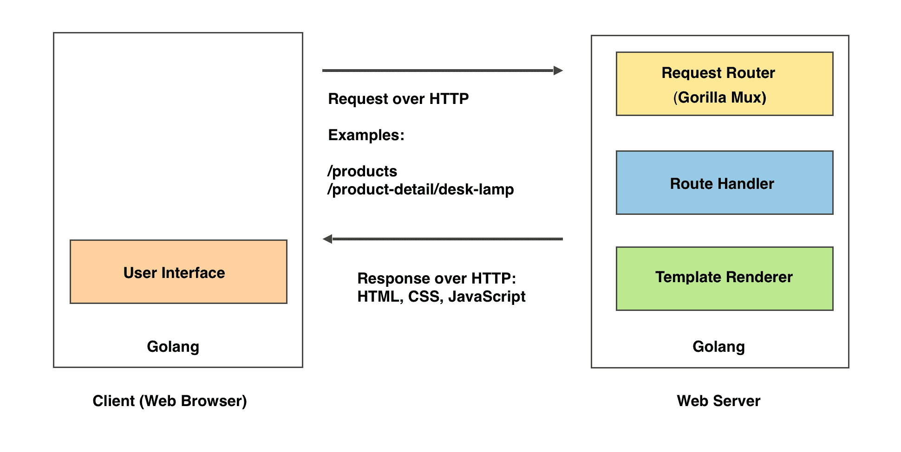
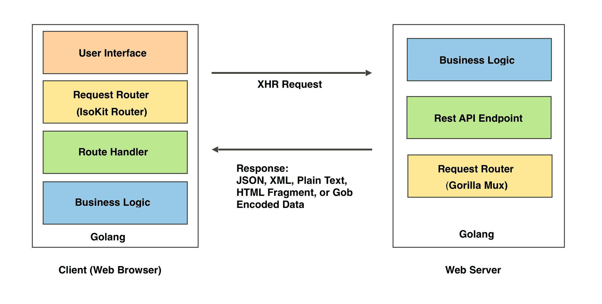
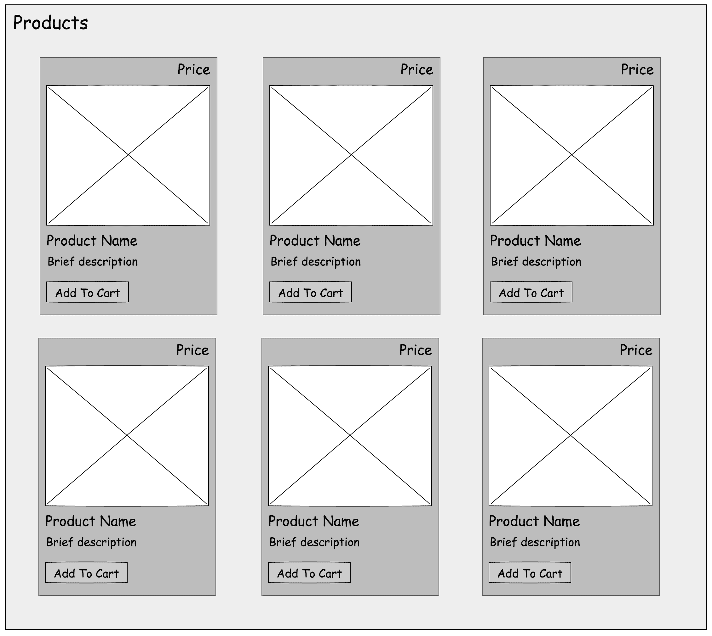
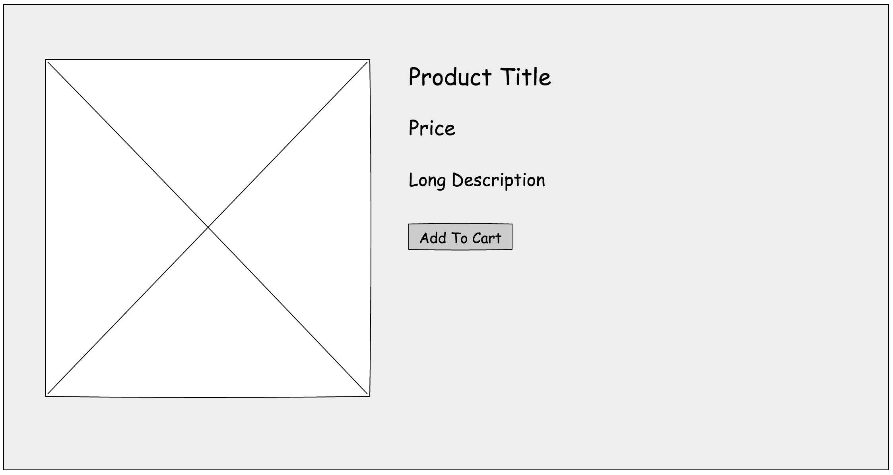
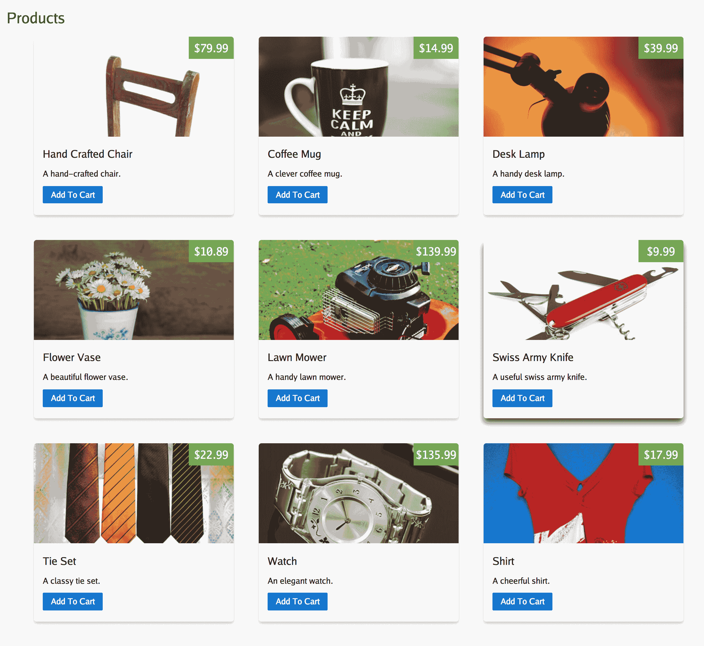
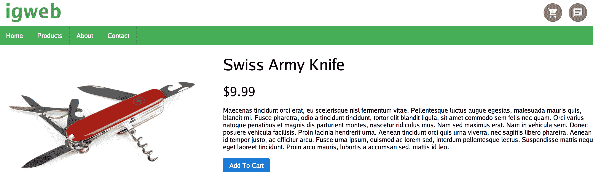
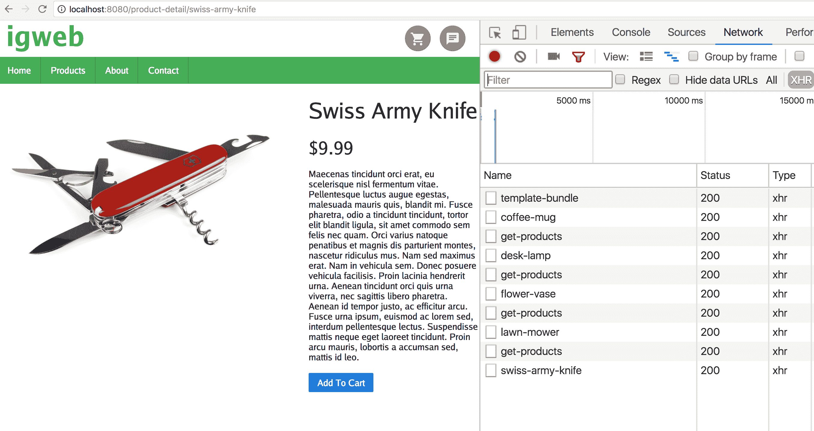

# 端到端路由

**端到端应用程序路由**是使我们能够利用经典 Web 应用程序架构和单页面应用程序架构的优势的魔力。在实现现代 Web 应用程序时，我们必须在满足两个不同受众（人类和机器）的需求之间取得平衡。

首先让我们从人类用户的角度考虑体验。当人类用户直接访问我们在上一章演示的“关于”页面时，模板渲染首先在服务器端执行。这为人类用户提供了一个初始页面加载，因为网页内容是立即可用的，所以被认为是快速的。这是经典的 Web 应用程序架构的特点。对于用户与网站的后续交互采取了不同的方法。当用户从导航菜单点击“关于”页面的链接时，模板渲染在客户端执行，无需进行完整的页面重新加载，从而提供更流畅和流畅的用户体验。这是单页面应用程序架构的特点。

机器用户包括定期访问网站的各种搜索引擎爬虫。正如您在第一章中学到的，*使用 Go 构建同构 Web 应用程序*，单页面应用程序主要不利于搜索引擎，因为绝大多数搜索引擎爬虫没有智能来遍历它们。传统的搜索引擎爬虫习惯于解析已经呈现的格式良好的 HTML 标记。训练这些爬虫解析用于实现单页面应用程序架构的 JavaScript 要困难得多。如果我们希望获得更大的搜索引擎可发现性，我们必须满足我们的机器受众的需求。

在实现 IGWEB 的产品相关页面时，我们将学习如何在本章中实现这一目标，即在满足这两个不同受众的需求之间取得平衡。

在本章中，我们将涵盖以下主题：

+   路由视角

+   产品相关页面的设计

+   实现与产品相关的模板

+   建模产品数据

+   访问产品数据

+   使用 Gorilla Mux 注册服务器端路由

+   服务器端处理程序函数

+   使用 isokit 路由器注册客户端路由

+   客户端处理程序函数

+   Rest API 端点

# 路由视角

让我们从服务器端和客户端的角度考虑 Isomorphic Go Web 应用程序中的路由工作原理。请记住，我们的目标是利用端到端路由为机器用户提供网页内容访问，并为人类用户提供增强的用户体验。

# 服务器端路由

*图 5.1*描述了 Isomorphic Go 应用程序中的初始页面加载，实现了经典的 Web 应用程序架构。客户端可以是通过提供 URL 访问网站的 Web 浏览器或机器（机器）。URL 包含客户端正在访问的路由。例如，`/products`路由将提供产品列表页面。`/product-detail/swiss-army-knife`路由将提供网站上销售的瑞士军刀产品的产品详细页面。请求路由器负责将路由映射到其指定的路由处理程序函数。我们将在服务器端使用的请求路由器是 Gorilla Mux 路由器，它在`mux`包中可用：



图 5.1：Isomorphic Go 应用程序中的初始页面加载

路由处理程序负责服务特定路由。它包含一组逻辑，用于执行给定路由的任务。例如，`/products`路由的路由处理程序负责获取要显示的产品，从相关模板中呈现产品列表网页，并将响应发送回客户端。来自 Web 服务器的响应是一个 HTML 文档，其中包含与关联的 CSS 和 JavaScript 源文件的链接。返回的 Web 页面也可能包含内联的 CSS 或 JavaScript 部分。

请注意，尽管图表描绘了 Golang 在 Web 浏览器内运行，但实际上在 Web 浏览器内运行的是 Go 程序的 JavaScript 表示（使用 GopherJS 转译）。当客户端接收到服务器响应时，Web 页面将在 Web 浏览器内的用户界面中呈现。

# 客户端路由

*图 5.2*描述了从 Isomorphic Go 应用程序的客户端角度实现单页面应用程序架构的路由。

在*图 5.1*中，客户端只是简单地呈现 Web 页面服务器响应的角色。现在，除了显示呈现的 Web 页面外，客户端还包含请求路由器、路由处理程序和应用程序业务逻辑。

我们将使用`isokit`包中的 isokit 路由器执行客户端路由。客户端路由器的工作方式与服务器端路由器类似，只是不是评估 HTTP 请求，而是拦截在网页上定义的超链接的点击，并将其路由到客户端自身定义的特定路由处理程序。服务特定路由的客户端路由处理程序通过 Rest API 端点与服务器交互，通过发出 XHR 请求访问。来自 Web 服务器的响应是可以采用各种格式的数据，如 JSON、XML、纯文本和 HTML 片段，甚至是 Gob 编码的数据。在本章中，我们将使用 JSON 作为数据交换的手段。应用程序的业务逻辑将决定数据的处理方式，并且可以在用户界面中显示。此时，所有渲染操作都可以在客户端上进行，从而可以防止整个页面重新加载：



图 5.2：端到端路由包括两端的路由器

# 产品相关页面的设计

IGWEB 的产品相关页面包括产品列表页面和产品详细页面。产品页面，也可以称为产品列表页面，将显示用户可以从网站购买的商品列表。如*图 5.3*所示的线框图，每个产品都包含产品的缩略图，产品价格，产品名称，产品的简要描述，以及将产品添加到购物车的按钮。点击产品图片将带用户进入给定产品的产品详细页面。访问产品列表页面的路由是`/products`：



图 5.3：产品页面的线框设计

产品详细页面包含有关单个产品的信息。如*图 5.4*所示的线框设计，产品详细页面包括产品的全尺寸图像、产品名称、产品价格、产品的长描述以及将产品添加到购物车的按钮。访问产品详细页面的路由是`/product-detail/{productTitle}`。`{productTitle}`是产品的**SEO**（搜索引擎优化）友好名称，例如，瑞士军刀产品的`{productTitle}`值将是`"swiss-army-knife"`。通过在`/product-detail`路由中定义 SEO 友好的产品名称，我们使搜索引擎机器人更容易索引网站，并从产品详细 URL 集合中推导出语义含义。事实上，搜索引擎友好的 URL 被称为**语义 URL**。



图 5.4：产品详细页面的线框设计

# 实现与产品相关的模板

实现与产品相关的模板包括实现产品列表页面的模板和产品详细页面的模板。产品列表页面如*图 5.3*所示，产品详细页面如*图 5.4*所示。我们将实现模板来实现这些线框设计。

# 实现产品列表页面的模板

让我们来看看`shared/templates`目录中找到的`products_page.tmpl`源文件：

```go
{{ define "pagecontent" }}
{{template "products_content" . }}
{{end}}
{{template "layouts/webpage_layout" . }}
```

这是产品列表页面的页面模板。这个模板的主要目的是呈现`products_content`模板的内容，并将其放置在网页布局中。

让我们来看看`shared/templates`目录中找到的`products_content.tmpl`源文件：

```go
<h1>Products</h1>

<div id="productsContainer">
  {{if .Products}}
  {{range .Products}}
  <div class="productCard">
    <a href="{{.Route}}">
    <div class="pricebox"><span>${{.Price}}</span></div>
    <div class="productCardImageContainer">
      
    </div>
    </a>
    <div class="productContainer">

    <h3><b>{{.Name}}</b></h3> 
    <p>{{.Description}}</p> 

    <div class="pure-controls">
      <button class="addToCartButton pure-button pure-button-primary" data-sku="{{.SKU}}">Add To Cart</button>
    </div>

    </div>
  </div>
  {{end}}
  {{else}}
    <span>If you're not seeing any products listed here, you probably need to load the sample data set into your Redis instance. You can do so by <a target="_blank" href="/config/load-sample-data">clicking this link</a>.</span>
  {{end}}
</div>
```

这是产品列表页面的内容模板。这个模板的目的是显示所有可供销售的产品。在`productsContainer` `div`元素内，我们指定了一个`{{if}}`条件，检查是否有产品可供显示。如果有产品可用，我们使用`{{range}}`模板动作来遍历所有可用的`Product`对象，并生成每个产品卡所需的 HTML 标记。我们定义了一个锚（`<a>`）标签，使图像可点击，这样用户可以直接点击产品图像进入产品详细页面。我们还定义了一个按钮，将产品添加到购物车中。

如果没有产品可供显示，我们会到达`{{else}}`条件，并放置一个有用的消息，指示需要将产品从样本数据集加载到 Redis 数据库实例中。为了方便读者，我们提供了一个可以点击的超链接，点击后将样本数据填充到 Redis 实例中。

# 实现产品详细页面的模板

让我们来看看`shared/templates`目录中找到的`product_detail_page.tmpl`源文件：

```go
{{ define "pagecontent" }}
{{template "product_detail_content" . }}
{{end}}
{{template "layouts/webpage_layout" . }}
```

这是产品详细页面的页面模板。其主要目的是呈现`product_detail_content`模板的内容，并将其放置在网页布局中。

让我们来看看`shared/templates`目录中找到的`product_detail_content.tmpl`源文件：

```go
<div class="productDetailContainer">

  <div class="productDetailImageContainer">
    
  </div>

  <div class="productDetailHeading">
    <h1>{{.Product.Name}}</h1>
  </div>

  <div class="productDetailPrice">
    <span>${{.Product.Price}}</span>
  </div>

  <div class="productSummaryDetail">
    {{.Product.SummaryDetail}}
  </div>

  <div class="pure-controls">
    <button class="addToCartButton pure-button pure-button-primary" data-sku="{{.Product.SKU}}">Add To Cart</button>
  </div>

</div>
```

在这个模板中，我们定义了呈现产品详细页面的产品详细容器所需的 HTML 标记。我们呈现产品图像以及产品名称、产品价格和产品的详细摘要。最后，我们声明了一个按钮，将产品添加到购物车中。

# 对产品数据进行建模

我们在`shared/models/product.go`源文件中定义了`Product`结构来对产品数据进行建模。

```go
package models

type Product struct {
  SKU string
  Name string
  Description string
  ThumbnailPreviewURI string
  ImagePreviewURI string
  Price float64
  Route string
  SummaryDetail string
  Quantity int
}
```

`SKU`字段代表产品的库存单位（`SKU`），这是代表产品的唯一标识。在提供的样本数据集中，我们使用递增的整数值，但是这个字段是`string`类型的，以便将来可以容纳包含字母数字的 SKU，以实现可扩展性。`Name`字段代表产品的名称。`Description`字段代表将包含在产品列表页面中的简短描述。`ThumbnailPreviewURI`字段提供产品缩略图的路径。`Price`字段代表产品的价格，类型为`float64`。`Route`字段是给定产品的服务器相对路径到产品详细页面。`SummaryDetail`字段代表产品的长描述，将显示在产品详细页面中。最后，`Quantity`字段是`int`类型，代表目前在购物车中的特定产品数量。在下一章中，当我们实现购物车功能时，我们将使用这个字段。

# 访问产品数据

对于我们的产品数据访问需求，我们在 Redis 数据存储中定义了两种方法。`GetProducts`方法将返回一个产品切片，并满足产品列表页面的数据需求。`GetProductDetail`方法将返回给定产品的配置信息，满足产品详细页面的数据需求。

# 从数据存储中检索产品

让我们来看看在`common/datastore/redis.go`源文件中定义的`GetProducts`方法：

```go
func (r *RedisDatastore) GetProducts() []*models.Product {

  registryKey := "product-registry"
  exists, err := r.Cmd("EXISTS", registryKey).Int()

  if err != nil {
    log.Println("Encountered error: ", err)
    return nil
  } else if exists == 0 {
    return nil
  }

  var productKeys []string
  jsonData, err := r.Cmd("GET", registryKey).Str()
  if err != nil {
    log.Print("Encountered error when attempting to fetch product registry data from Redis instance: ", err)
    return nil
  }

  if err := json.Unmarshal([]byte(jsonData), &productKeys); err != nil {
    log.Print("Encountered error when attempting to unmarshal JSON product registry data: ", err)
    return nil
  }

  products := make([]*models.Product, 0)

  for i := 0; i < len(productKeys); i++ {

    productTitle := strings.Replace(productKeys[i], "/product-detail/", "", -1)
    product := r.GetProductDetail(productTitle)
    products = append(products, product)

  }
  return products
}
```

在这里，我们首先检查 Redis 数据存储中是否存在产品注册键`"product-registry"`。如果存在，我们声明一个名为`productKeys`的字符串切片，其中包含要显示在产品列表页面上的所有产品的键。我们在 Redis 数据存储对象`r`上使用`Cmd`方法来发出 Redis 的`"GET"`命令，用于检索给定键的记录。我们将`registryKey`作为方法的第二个参数。最后，我们将方法调用链接到`.Str()`方法，将输出转换为字符串类型。

# 从数据存储中检索产品详细信息

Redis 数据存储中的产品注册数据是表示字符串切片的 JSON 数据。我们使用`json`包中的`Unmarshal`函数将 JSON 编码的数据解码为`productKeys`变量。现在，我们已经获得了应该显示在产品列表页面上的所有产品键，是时候为每个键创建一个产品实例了。我们首先声明将成为产品切片的`products`变量。我们遍历产品键并得出`productTitle`值，这是产品的 SEO 友好名称。我们将`productTitle`变量提供给 Redis 数据存储的`GetProductDetail`方法，以获取给定产品标题的产品。我们将获取的产品赋给`product`变量，并将其追加到`products`切片中。一旦`for`循环结束，我们将收集到应该显示在产品列表页面上的所有产品。最后，我们返回`products`切片。

让我们来看看在`common/datastore/redis.go`源文件中定义的`GetProductDetail`方法：

```go
func (r *RedisDatastore) GetProductDetail(productTitle string) *models.Product {

  productKey := "/product-detail/" + productTitle
  exists, err := r.Cmd("EXISTS", productKey).Int()

  if err != nil {
    log.Println("Encountered error: ", err)
    return nil
  } else if exists == 0 {
    return nil
  }

  var p models.Product
  jsonData, err := r.Cmd("GET", productKey).Str()

  if err != nil {
    log.Print("Encountered error when attempting to fetch product data from Redis instance: ", err)
    return nil
  }

  if err := json.Unmarshal([]byte(jsonData), &p); err != nil {
    log.Print("Encountered error when attempting to unmarshal JSON product data: ", err)
    return nil
  }

  return &p

}
```

我们将`productKey`变量声明为`string`类型，并赋予产品详细页面的路由值。这涉及将`"/product-detail"`字符串与给定产品的`productTitle`变量连接起来。我们检查产品键是否存在于 Redis 数据存储中。如果不存在，我们从方法中返回；如果存在，我们继续声明`p`变量为`Product`类型。这将是函数将返回的变量。Redis 数据存储中存储的产品数据是`Product`对象的 JSON 表示。我们将 JSON 编码的数据解码为`p`变量。如果我们没有遇到任何错误，我们将返回`p`，它代表了请求的`productTitle`变量的`Product`对象，该变量被指定为`GetProductDetail`方法的输入参数。

到目前为止，我们已经满足了在`/products`路由上显示产品列表和在`/product-detail/{productTitle}`路由上显示产品概要页面的数据需求。现在是时候注册与产品相关页面的服务器端路由了。

# 使用 Gorilla Mux 注册服务器端路由

我们将使用 Gorilla Mux 路由器来处理服务器端应用程序的路由需求。这个路由器非常灵活，因为它不仅可以处理简单的路由，比如`/products`，还可以处理带有嵌入变量的路由。回想一下，`/product-detail`路由包含嵌入的`{productTitle}`变量。

我们将首先创建一个 Gorilla Mux 路由器的新实例，并将其分配给`r`变量，如下所示：

```go
  r := mux.NewRouter()
```

以下是在`igweb.go`源文件中定义的`registerRoutes`函数中的代码部分，我们在这里注册路由以及它们关联的处理函数：

```go
r.Handle("/", handlers.IndexHandler(env)).Methods("GET")
r.Handle("/index", handlers.IndexHandler(env)).Methods("GET")
r.Handle("/products", handlers.ProductsHandler(env)).Methods("GET")
r.Handle("/product-detail/{productTitle}", handlers.ProductDetailHandler(env)).Methods("GET")
r.Handle("/about", handlers.AboutHandler(env)).Methods("GET")
r.Handle("/contact", handlers.ContactHandler(env)).Methods("GET", "POST")

```

我们使用`Handle`方法将路由与负责处理该路由的处理函数关联起来。例如，当遇到`/products`路由时，它将由`handlers`包中定义的`ProductsHandler`函数处理。`ProductsHandler`函数将负责从数据存储中获取产品，使用产品记录从模板中呈现产品列表页面，并将网页响应发送回网页客户端。类似地，`/product-detail/{productTitle}`路由将由`ProductDetailHandler`函数处理。这个处理函数将负责获取单个产品的产品记录，使用产品记录从模板中呈现产品详细页面，并将网页响应发送回网页客户端。

# 服务器端处理函数

现在我们已经为与产品相关的页面注册了服务器端路由，是时候来检查负责处理这些路由的服务器端处理函数了。

# 产品列表页面的处理函数

让我们来看一下`handlers`目录中找到的`products.go`源文件：

```go
package handlers

import (
  "net/http"

  "github.com/EngineerKamesh/igb/igweb/common"
  "github.com/EngineerKamesh/igb/igweb/shared/templatedata"
  "github.com/isomorphicgo/isokit"
)

func ProductsHandler(env *common.Env) http.Handler {
  return http.HandlerFunc(func(w http.ResponseWriter, r *http.Request) {
    products := env.DB.GetProducts()
    templateData := &templatedata.Products{PageTitle: "Products", Products: products}
    env.TemplateSet.Render("products_page", &isokit.RenderParams{Writer: w, Data: templateData})
  })
}
```

在这里，我们通过在 Redis 数据存储对象`env.DB`上调用`GetProducts`方法来获取产品切片，该产品切片在产品页面上展示。我们声明了`templatedata.Products`类型的`templateData`变量，它代表将传递给模板引擎的数据对象，以及`products_page`模板，以渲染产品页面。`PageTitle`字段代表网页标题，`Products`字段是要在产品页面上显示的产品切片。

在`ProductsHandler`函数内部，我们调用数据存储对象的`GetProducts`方法，从数据存储中获取可供显示的产品。然后，我们创建一个模板数据实例，其`PageTitle`字段值为`"Products"`，并将从数据存储中获取的产品分配给`Products`字段。最后，我们从模板集中渲染`products_page`模板。关于我们传递给`env.TemplateSet`对象的`Render`方法的`RenderParams`对象，我们将`Writer`属性设置为`w`变量，即`http.ResponseWriter`，并将`Data`属性设置为`templateData`变量，即将提供给模板的数据对象。此时，渲染的网页将作为服务器响应发送回 Web 客户端。

图 5.5 显示了在访问`/products`路由后生成的产品页面，方法是访问以下链接：`http://localhost:8080/products`：



图 5.5：产品页面

现在我们能够显示产品页面，让我们来看一下产品详细页面的处理函数。

# 产品详细页面的处理函数

让我们检查`handlers`目录中找到的`productdetail.go`源文件：

```go
package handlers

import (
  "net/http"

  "github.com/EngineerKamesh/igb/igweb/common"
  "github.com/EngineerKamesh/igb/igweb/shared/templatedata"
  "github.com/gorilla/mux"
  "github.com/isomorphicgo/isokit"
)

func ProductDetailHandler(env *common.Env) http.Handler {
  return http.HandlerFunc(func(w http.ResponseWriter, r *http.Request) {
    vars := mux.Vars(r)
    productTitle := vars["productTitle"]
    product := env.DB.GetProductDetail(productTitle)
    templateData := &templatedata.ProductDetail{PageTitle: product.Name, Product: product}
    env.TemplateSet.Render("product_detail_page", &isokit.RenderParams{Writer: w, Data: templateData})
  })
}
```

这是处理`/product/{productTitle}`路由的处理函数。请记住，这是嵌入变量的路由。在`ProductDetailHandler`函数内部，我们首先通过调用`mux`包的`Vars`函数来收集路由中定义的变量。我们将`r`，即`http.Request`的指针，作为`Vars`函数的输入参数。该函数的结果是`map[string]string`类型的映射，其中键是路由中变量的名称，值是该特定变量的值。例如，如果我们访问`/product-detail/swiss-army-knife`路由，键将是`"productTitle"`，值将是`"swiss-army-knife"`。

我们获取路由中提供的`productTitle`变量的值，并将其赋给`productTitle`变量。然后，我们通过向数据存储对象的`GetProductDetail`方法提供`productTitle`变量来获取产品对象。然后，我们设置我们的模板数据对象，设置页面标题和产品记录的字段。最后，我们在模板集上调用渲染方法，指示我们要渲染`product_detail_page`模板。我们将`http`响应写入对象和模板数据对象分配给渲染`params`对象的相应字段，该对象作为模板集的渲染方法的第二个参数传入。

此时，我们已经准备好渲染产品详细页面所需的一切。让我们访问`http://localhost:8080/products/swiss-army-knife`上的瑞士军刀产品详细页面。以下是在 Web 浏览器中呈现的产品详细页面：



图 5.6：瑞士军刀的产品详细页面

现在我们已经使`/products`和`/product-title/{productTitle}`路由对人类和机器都可用，并且我们已经实现了经典的 Web 应用程序架构。我们的机器用户（搜索引擎机器人）将会满意，因为他们可以轻松地索引产品列表页面上所有产品的链接，并且可以轻松解析每个产品详细页面上的 HTML 标记。

然而，我们还没有完全满足我们的人类观众。您可能已经注意到，从产品列表页面点击单个产品会导致整个页面重新加载。在短暂的瞬间，屏幕可能会在离开一个页面并在 Web 浏览器中呈现下一个页面的过渡中变白。当我们从产品详细页面点击导航菜单中的产品链接返回到产品列表页面时，同样会发生完整的页面重新加载。我们可以通过在初始页面加载后实现单页面架构来增强用户在网页之间的过渡体验。为了做到这一点，我们需要定义客户端路由以及它们相关的客户端路由处理程序函数。

# 使用 isokit 路由器注册客户端路由

在客户端，我们使用 isokit 路由器来处理路由。isokit 路由器通过拦截超链接的单击事件并检查超链接是否包含在其路由表中定义的路由来工作。

我们可以使用 isokit 路由器对象的`Handle`方法在路由表中注册路由。`Handle`方法接受两个参数——第一个参数是路由，第二个参数是应该服务该路由的处理程序函数。请注意，声明和注册路由的代码与服务器端的 Gorilla Mux 路由器非常相似。由于这种相似性，使用 isokit 路由器在客户端注册路由是直接的，感觉像是第二天性。

以下是在`client`文件夹中找到的`client.go`源文件中定义的`registerRoutes`函数的代码部分，该函数负责注册路由：

```go
  r := isokit.NewRouter()
  r.Handle("/index", handlers.IndexHandler(env))
 r.Handle("/products", handlers.ProductsHandler(env))
 r.Handle("/product-detail/{productTitle}", handlers.ProductDetailHandler(env))
  r.Handle("/about", handlers.AboutHandler(env))
  r.Handle("/contact", handlers.ContactHandler(env))
  r.Listen()
  env.Router = r
```

在这里，我们首先通过从`isokit`包中调用`NewRouter`函数创建一个新的 isokit 路由器，并将其分配给`r`变量。我们已经为产品列表页面定义了`/products`路由，以及为产品详细页面定义了`/product-data/{productTitle}`路由。在定义所有路由之后，我们调用路由器对象`r`的`Listen`方法。`Listen`方法负责为所有超链接添加事件侦听器，以侦听单击事件。在路由器的路由表中定义的链接将在单击事件发生时被拦截，并且它们相关的客户端路由处理程序函数将为它们提供服务。最后，我们将`r`路由器分配给`env`对象的`Router`字段，以便我们可以在客户端 Web 应用程序中访问路由器。

# 客户端处理程序函数

现在我们已经在客户端注册了与产品相关的页面的路由，让我们来看看负责服务这些路由的客户端路由处理程序函数。

# 产品列表页面的处理程序函数

让我们来看看`client/handlers`目录中`products.go`源文件中的`ProductsHandler`函数：

```go
func ProductsHandler(env *common.Env) isokit.Handler {
  return isokit.HandlerFunc(func(ctx context.Context) {

    productsChannel := make(chan []*models.Product)
    go FetchProducts(productsChannel)
    products := <-productsChannel
    templateData := &templatedata.Products{PageTitle: "Products", Products: products}
    env.TemplateSet.Render("products_content", &isokit.RenderParams{Data: templateData, Disposition: isokit.PlacementReplaceInnerContents, Element: env.PrimaryContent, PageTitle: templateData.PageTitle})
    InitializeProductsPage(env)
    env.Router.RegisterLinks("#primaryContent a")
  })
}
```

回想一下，在*图 5.2*中描述的图表中，客户端 Web 应用通过对 Rest API 端点的 XHR 调用访问服务器端功能。在这里，我们创建`productsChannel`通道来检索`Product`对象的切片。我们调用`FetchProducts`函数，该函数将对服务器上负责检索要在产品页面上显示的可用产品列表的 Rest API 端点进行 XHR 调用。请注意，我们将`FetchProducts`函数作为 goroutine 调用。我们必须这样做以确保 XHR 调用不会阻塞。我们将`productsChannel`通道作为`FetchProducts`函数的唯一输入参数。然后，我们通过`productsChannel`通道检索产品列表并将其分配给`products`变量。

我们创建一个新的模板数据对象实例`templateData`，并设置`PageTitle`和`Products`字段的相应字段。之后，我们在`env.TemplateSet`对象上调用`Render`方法，指定我们要渲染`products_content`模板。在我们提供给`Render`函数的`RenderParams`对象中，我们使用模板数据对象`templateData`设置`Data`字段。我们将`Disposition`字段设置为`isokit.PlacementReplaceInnerContents`，以指定渲染的位置应替换相关元素的内部 HTML 内容。我们将`Element`字段设置为主要内容`div`容器，其中主页面内容被渲染。我们调用`InitializeProductsEventHandlers`函数来设置产品页面中找到的事件处理程序。对于产品页面，唯一需要事件处理程序的 DOM 元素是“添加到购物车”按钮，我们将在第六章 *同构交接*中介绍。

就客户端路由而言，`ProductsHandler`函数中的最后一行代码是最重要的一行代码。当模板渲染器渲染每个产品卡时，我们需要拦截每个产品项的链接。我们可以通过提供一个查询选择器来告诉 isokit 路由器拦截这些链接，该查询选择器将定位主要内容`div`容器中的链接。我们通过调用 isokit 路由器对象的`RegisterLinks`方法并指定查询选择器应为`"#primaryContent a"`来实现这一点。这将确保拦截所有产品项的链接，并且当我们单击产品项时，客户端路由处理程序将启动并服务请求，而不是执行完整的页面重新加载以到达`/product-detail/{productTitle}`路由。

# 获取产品列表

现在我们已经看到了客户端路由处理程序函数的工作原理，让我们来看看`FetchProducts`函数，该函数用于对服务器进行 XHR 调用并收集要在页面上显示的产品列表：

```go
func FetchProducts(productsChannel chan []*models.Product) {

  data, err := xhr.Send("GET", "/restapi/get-products", nil)
  if err != nil {
    println("Encountered error: ", err)
    return
  }
  var products []*models.Product
  json.NewDecoder(strings.NewReader(string(data))).Decode(&products)

  productsChannel <- products
}
```

在这里，我们使用`xhr`包来对服务器进行 XHR 调用。我们从`xhr`包中调用`Send`函数，并指定我们的请求将使用`GET`方法，并且我们将对`/restapi/get-products`端点进行请求。对于函数的第三个参数，我们传递了一个值`nil`，以指示我们在 XHR 调用中不发送数据。如果 XHR 调用成功，我们将从服务器接收 JSON 数据，该数据将表示`Product`对象的切片。我们创建一个新的 JSON 解码器来解码数据并将其存储在`products`变量中，然后将其发送到`productsChannel`。我们将在*用于服务此 XHR 调用的 Rest API 端点*部分中检查服务此 XHR 调用的 Rest API 端点。

此时，我们的 Web 应用程序已经实现了能够在与网站的后续交互中渲染产品页面而不引起完整页面重新加载的目标。例如，如果我们访问`http://localhost:8080/about`上的关于页面，初始页面加载将在服务器端进行。如果我们通过单击导航菜单中的产品链接来启动后续交互，客户端路由将启动，并且产品页面将加载，而不会发生完整的页面重新加载。

在*验证客户端路由功能*部分，我们将向您展示如何使用 Web 浏览器的检查器验证客户端路由是否正常运行。现在是时候实现产品详细页面的客户端路由处理程序了。

# 产品详细页面的处理程序函数

让我们来看看`client/handlers`目录中的`productdetail.go`源文件中定义的`ProductDetailHandler`函数：

```go
func ProductDetailHandler(env *common.Env) isokit.Handler {
  return isokit.HandlerFunc(func(ctx context.Context) {
    routeVars := ctx.Value(isokit.RouteVarsKey("Vars")).(map[string]string)
    productTitle := routeVars[`product-detail/{productTitle}`]
    productChannel := make(chan *models.Product)
    go FetchProductDetail(productChannel, productTitle)
    product := <-productChannel
    templateData := &templatedata.ProductDetail{PageTitle: product.Name, Product: product}
    env.TemplateSet.Render("product_detail_content", &isokit.RenderParams{Data: templateData, Disposition: isokit.PlacementReplaceInnerContents, Element: env.PrimaryContent, PageTitle: templateData.PageTitle})
    InitializeProductDetailPage(env)
  })
}
```

`ProductDetailHandler`函数返回一个`isokit.Handler`值。请注意，我们将`isokit.HandlerFunc`指定为闭包，以便我们可以对我们的客户端处理程序函数执行依赖注入`env`对象。请注意，`isokit.HandlerFunc`的输入参数是`context.Context`类型。这个上下文对象很重要，因为它包含嵌入在路由中的变量信息。通过在`ctx`上下文对象上调用`Value`方法，我们可以通过将`"Vars"`键指定给上下文对象来获取路由变量。请注意，我们执行类型断言以指定从上下文对象获取的值是`map[string]string`类型。我们可以通过提供`product-detail/{productTitle}`键从路由中提取`productTitle`的值。`productTitle`的值很重要，因为我们将在向服务器发出 XHR 调用以获取产品对象时将其作为路由变量发送。

我们创建一个产品渠道`productChannel`，用于发送和接收`Product`对象。我们调用`FetchProductDetail`函数，提供`productChannel`和`productTitle`作为函数的输入参数。请注意，我们将函数作为 goroutine 调用，成功运行函数后，我们将通过`productChannel`发送一个产品对象。

我们设置模板数据对象，为`PageTitle`和`Product`字段指定值。然后我们将页面标题设置为产品名称。完成后，我们调用模板集对象的`Render`方法，并指定要渲染`product_detail_content`模板。我们设置渲染参数对象的字段，填充模板数据对象、位置和模板将被渲染到的相关元素的字段，这是主要内容`<div>`容器。最后，我们调用`InitializeProductDetailEventHanders`函数，该函数负责设置产品详情页面的事件处理程序。这个页面唯一需要处理程序的元素是“添加到购物车”按钮，我们将在下一章中介绍。

# 获取产品详情

让我们来看看`client/handlers`文件夹中`productdetail.go`源文件中定义的`FetchProductDetail`函数：

```go
func FetchProductDetail(productChannel chan *models.Product, productTitle string) {

  data, err := xhr.Send("GET", "/restapi/get-product-detail"+"/"+productTitle, nil)
  if err != nil {
    println("Encountered error: ", err)
    println(err)
  }
  var product *models.Product
  json.NewDecoder(strings.NewReader(string(data))).Decode(&product)

  productChannel <- product
}
```

这个函数负责向服务器端的 Rest API 端点发出 XHR 调用，以提供产品数据。该函数接受产品渠道和产品标题作为输入参数。我们通过调用`xhr`包的`Send`函数来进行 XHR 调用。请注意，在函数的第二个输入参数（我们发出请求的目的地）中，我们将`productTitle`变量连接到`/restapi/get-product-detail`路由。因此，例如，如果我们想请求瑞士军刀的产品对象，我们将指定路由为`/restapi/get-product-detail/swiss-army-knife`，在这种情况下，`productTitle`变量将等于`"swiss-army-knife"`。

如果 XHR 调用成功，服务器将返回 JSON 编码的产品对象。我们使用 JSON 解码器解码从服务器返回的 JSON 数据，并将`product`变量设置为解码的`Product`对象。最后，我们通过`productChannel`传递`product`。

# Rest API 端点

服务器端的 Rest API 端点非常方便。它们是在幕后向客户端 Web 应用程序提供数据的手段，我们将这些数据应用到相应的模板上，以显示页面内容，而无需进行完整的页面重新加载。

现在，我们将考虑创建这些 Rest API 端点所需的内容。我们首先必须在服务器端为它们注册路由。我们将遵循本章开头为产品列表页面和产品详细页面所做的相同过程。唯一的区别是我们的处理程序函数将在`endpoints`包中而不是在`handlers`包中。这里的根本区别在于`handlers`包包含将完整网页响应返回给 Web 客户端的处理程序函数。另一方面，`endpoints`包包含将数据返回给 Web 客户端的处理程序函数，很可能是以 JSON 格式返回。

以下是`igweb.go`源文件中的代码部分，我们在其中注册了我们的 Rest API 端点：

```go
r.Handle("/restapi/get-products", endpoints.GetProductsEndpoint(env)).Methods("GET")
r.Handle("/restapi/get-product-detail/{productTitle}", endpoints.GetProductDetailEndpoint(env)).Methods("GET")
```

请注意，驱动客户端产品页面的数据需求的`/restapi/get-products`路由由`endpoints`包中的`GetProductsEndpoint`函数提供服务。

同样，驱动客户端产品详细页面的`/restapi/get-product-detail/{productTitle}`路由由`endpoints`包中的`GetProductDetailEndpoint`函数提供服务。

# 获取产品列表的端点

让我们来看一下端点文件夹中的`products.go`源文件：

```go
package endpoints

import (
  "encoding/json"
  "net/http"

  "github.com/EngineerKamesh/igb/igweb/common"
)

func GetProductsEndpoint(env *common.Env) http.Handler {
  return http.HandlerFunc(func(w http.ResponseWriter, r *http.Request) {
    products := env.DB.GetProducts()
    w.Header().Set("Content-Type", "application/json")
    json.NewEncoder(w).Encode(products)
  })
}
```

在`GetProductsEndpoint`函数内部，我们首先通过调用数据存储对象`env.DB`的`GetProducts`方法来获取将在客户端产品页面上显示的产品切片。然后，我们设置一个标头来指示服务器响应将以 JSON 格式返回。最后，我们使用 JSON 编码器将产品切片编码为 JSON 数据，并使用`http.ResponseWriter` `w`将其写出。

# 获取产品详细信息的端点

让我们来看一下端点文件夹中的`productdetail.go`源文件：

```go
package endpoints

import (
  "encoding/json"
  "net/http"

  "github.com/EngineerKamesh/igb/igweb/common"
  "github.com/gorilla/mux"
)

func GetProductDetailEndpoint(env *common.Env) http.Handler {
  return http.HandlerFunc(func(w http.ResponseWriter, r *http.Request) {

    vars := mux.Vars(r)
    productTitle := vars["productTitle"]
    products := env.DB.GetProductDetail(productTitle)
    w.Header().Set("Content-Type", "application/json")
    json.NewEncoder(w).Encode(products)
  })
}
```

在`GetProductDetailEndpoint`函数内部，我们通过调用`mux`包中的`Vars`函数并将路由对象`r`作为唯一输入参数来获取嵌入的路由变量。然后，我们获取`{productTitle}`嵌入式路由变量的值并将其分配给变量`productTitle`。我们将`productTitle`提供给数据存储对象`env.DB`的`GetProductDetail`方法，以从数据存储中检索相应的`Product`对象。我们设置一个标头来指示服务器响应将以 JSON 格式返回，并使用 JSON 编码器将`Product`对象编码为 JSON 数据，然后使用`http.ResponseWriter` `w`将其发送到 Web 客户端。

我们现在已经达到了一个重要的里程碑。我们以一种对人类和机器都友好的方式实现了与产品相关的页面。当用户最初访问产品列表页面时，通过在 Web 浏览器中输入 URL（`http://localhost:8080/products`），页面在服务器端呈现，并将 Web 页面响应发送回客户端。用户能够立即看到网页，因为网页响应是预先呈现的。这种行为展现了经典 Web 应用程序架构的期望特征。

当人类用户发起后续交互时，通过单击产品项目，产品详细页面将从客户端呈现，并且用户无需经历完整页面重新加载。这种行为展现了 SPA 架构的期望特征。

机器用户（搜索引擎爬虫）也满意，因为他们可以遍历产品页面上的每个产品项目的链接并轻松索引网站，因为我们使用了语义化的 URL 以及搜索引擎爬虫可以理解的良好形式的 HTML 标记。

# 验证客户端路由功能

为了确保客户端路由正常运行，您可以执行以下过程：

1.  在您的 Web 浏览器中访问产品页面并打开 Web 浏览器的检查器。

1.  点击网络选项卡以查看网络流量，并确保过滤 XHR 调用。现在，点击产品项目以进入产品的详细页面。

1.  通过点击导航菜单上的“产品”链接返回产品页面。

重复此过程多次，您应该能够看到后台进行的所有 XHR 调用。*图 5.7*包括此过程的屏幕截图，以验证客户端路由是否正常运行：



图 5.7：Web 控制台中的 XHR 调用确认客户端路由正常运行

# 总结

在本章中，我们在构建与产品相关的页面时为 IGWEB 实现了端到端的应用程序路由。我们首先使用 Gorilla Mux 路由器注册了服务器端路由。我们将每个路由与相应的服务器端路由处理程序函数关联起来，该函数将为服务器端路由提供服务。然后，我们检查了产品相关页面的服务器端路由处理程序函数的实现。

在满足了实现初始页面加载的经典 Web 应用程序架构的需求后，我们通过首先在客户端注册与产品相关的页面的路由，使用 isokit 路由器，转向了客户端。就像我们在服务器端所做的那样，我们将每个客户端路由与相应的客户端路由处理程序函数关联起来，该函数将为客户端路由提供服务。您学会了如何实现客户端路由处理程序以及如何从中对服务器端 Rest API 端点进行 XHR 调用。最后，您学会了如何创建处理 XHR 请求并向客户端返回 JSON 数据的服务器端 Rest API 端点。

与数据存储的内容驱动的可用产品列表一样，与产品相关的页面具有持久状态。在用户与网站的交互改变了给定状态的情况下，我们如何维护状态？例如，如果用户向购物车中添加商品，我们如何维护购物车的状态并在服务器端和客户端之间进行同步？您将在第六章中了解*同构交接*，即在服务器端和客户端之间交接状态的过程。在此过程中，我们将为网站实现购物车功能。
