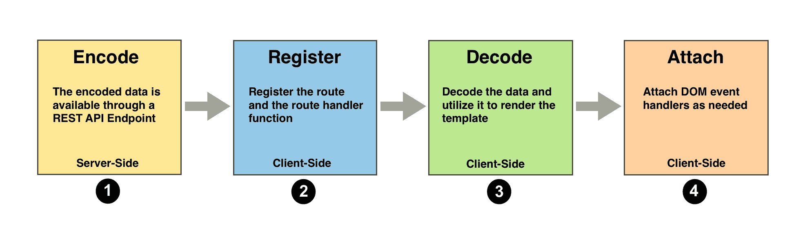
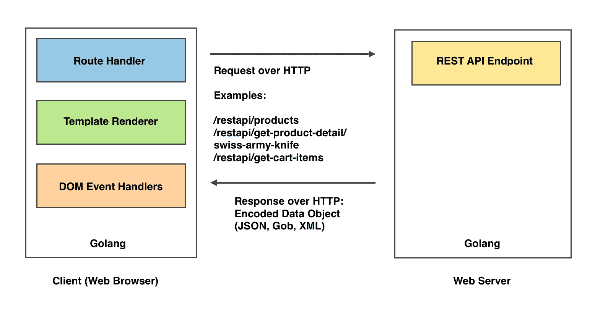
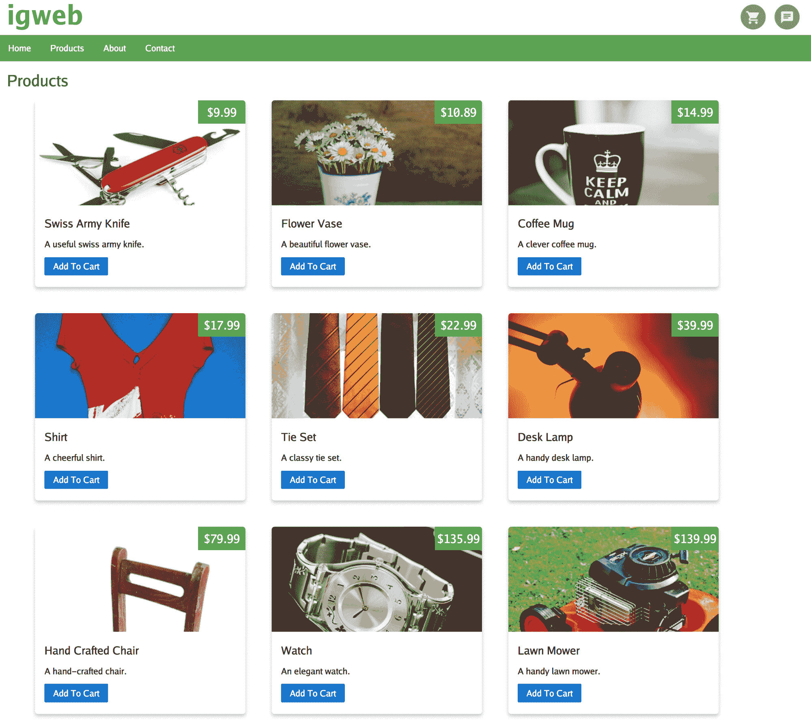
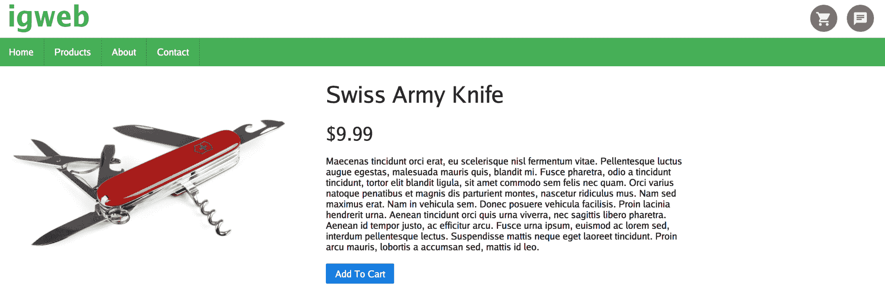
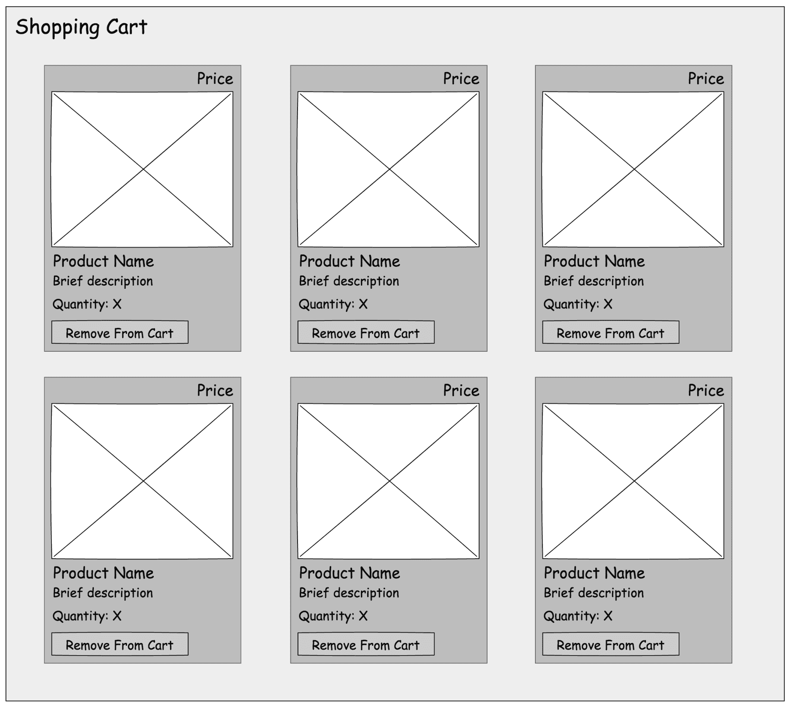
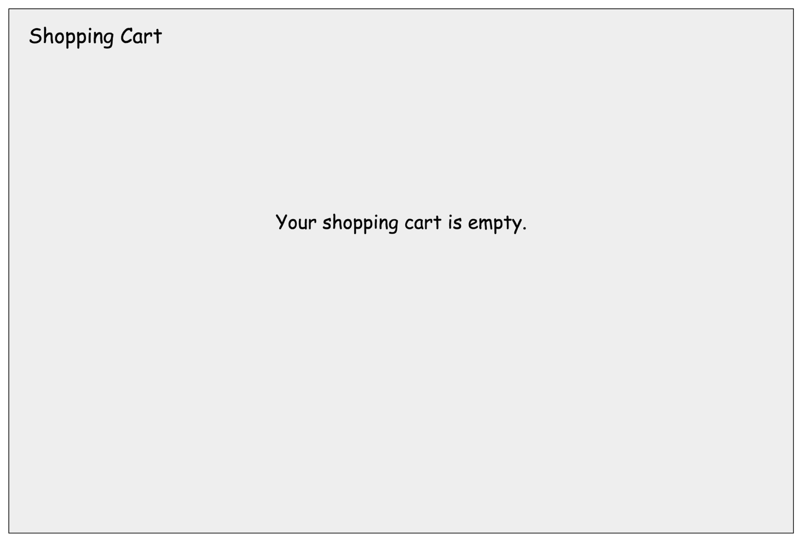
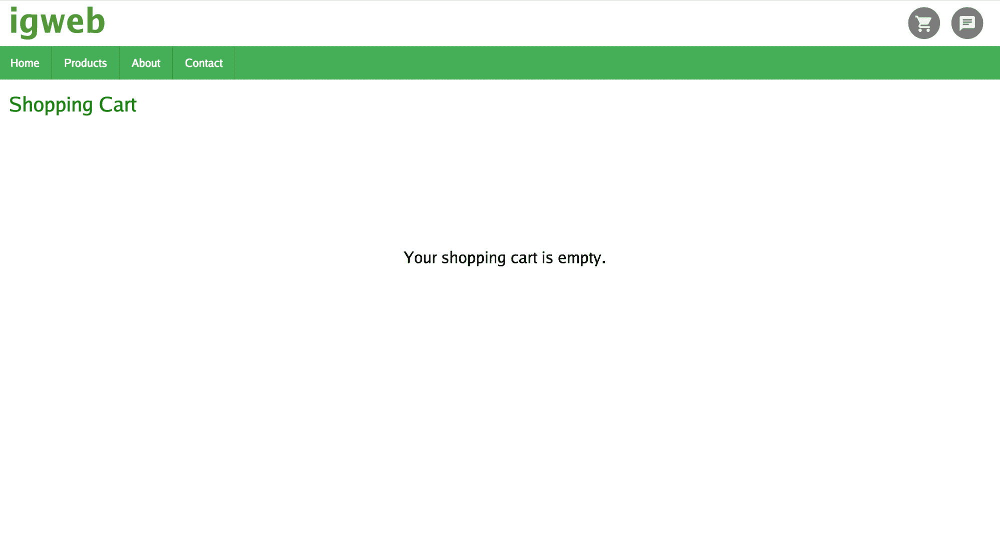
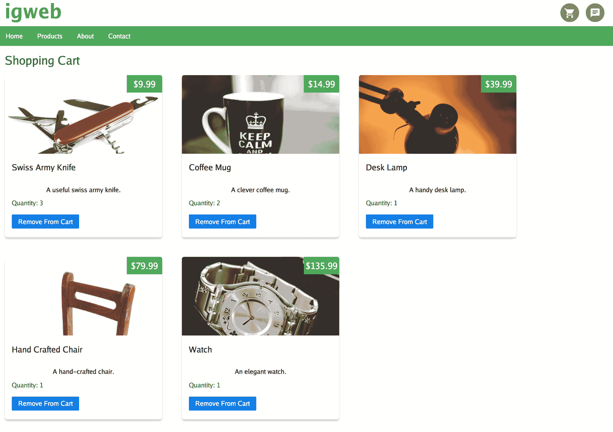
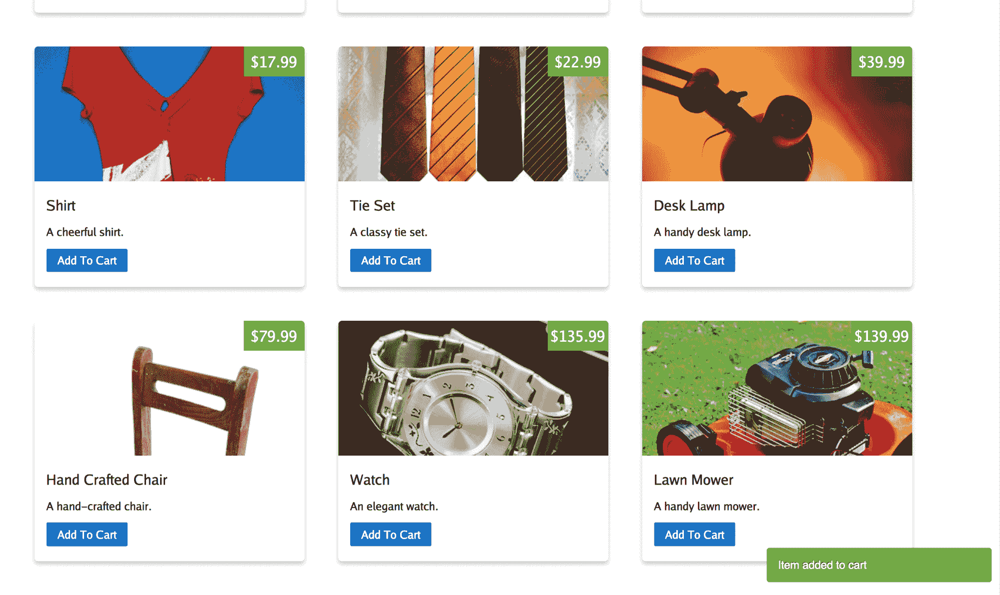

# 第六章：同构交接

在同构 Go web 应用的开发中，前两章介绍了两个关键技术。首先，您学习了如何利用内存模板集在各种环境中呈现模板。其次，您学习了如何在客户端和服务器端执行端到端路由。客户端路由是使客户端 Web 应用程序以单页面模式运行的魔法。

上述技术现在为我们提供了在客户端本身导航到网站的不同部分并在各种环境中呈现任何给定模板的能力。作为同构 Go web 应用的实施者，我们的责任是确保在客户端和服务器之间维护状态。例如，在呈现产品页面时，如果产品列表在客户端和服务器端呈现方式不同，那就没有意义。客户端需要与服务器紧密合作，以确保状态（在这种情况下是产品列表）得到维护，这就是*同构交接*发挥作用的地方。

**同构交接**是指服务器将状态交接给客户端，客户端使用传递的状态在客户端呈现网页的过程。请记住，服务器传递给客户端的状态必须包括用于呈现服务器端网页响应的完全相同的状态。同构交接本质上允许客户端无缝地在服务器端中断的地方继续进行。在本章中，我们将重新访问与产品相关的页面，以了解状态如何从服务器端维护到客户端。此外，我们还将通过为这些页面中的“添加到购物车”按钮添加事件处理程序来完成产品相关页面的实施。

IGWEB 网站的购物车功能将在本章中实施，它将允许我们考虑用户可以通过向购物车中添加和删除商品来改变购物车状态的情景。我们将使用同构交接来确保购物车的当前状态在服务器和客户端之间无缝地维护。通过正确维护购物车的状态，我们可以保证从服务器端呈现的购物车页面始终与从客户端呈现的购物车页面匹配。

在本章中，我们将涵盖以下主题：

+   同构交接程序

+   为产品相关页面实现同构交接程序

+   为购物车实现同构交接

# 同构交接程序

同构 Web 应用程序开发中的一个重要主题是在服务器和客户端之间共享的能力。在同构 Web 应用程序中，服务器和客户端必须协同工作，以无缝地维护应用程序中特定工作流程的状态。为了做到这一点，服务器必须与客户端共享用于在服务器端呈现 Web 页面输出的当前状态。

# ERDA 策略

同构交接程序包括以下四个步骤：

1.  编码

1.  注册

1.  解码

1.  附加

我们可以使用缩写**ERDA**（**编码-注册-解码-附加**）来轻松回忆每个步骤。事实上，我们可以将实施同构交接程序的步骤统称为**ERDA 策略**。

通过实施同构交接程序的四个步骤，如*图 6.1*所示，我们可以确保状态在服务器和客户端之间成功持久化：



图 6.1：实现同构交接的 ERDA 策略

第一步，编码，涉及将代表我们希望保留到客户端的状态的数据对象编码为数据交换格式（JSON、Gob、XML 等）。随后的步骤都在客户端上执行。第二步，注册，涉及注册客户端路由及其相应的处理程序函数。第三步，解码，涉及解码从服务器检索到的编码数据，通过 Rest API 端点，并利用它在客户端呈现网页的模板。第四步，附加，涉及将任何需要的事件处理程序附加到呈现的网页上，以实现用户交互。

*图 6.2*描述了在服务器端和客户端上涉及的关键模块，用于实现等同手 off 过程：



图 6.2：实现等同手 off 过程的关键模块

编码步骤是在服务器端 Web 应用程序中存在的 Rest API 端点内执行的。注册步骤是在客户端 Web 应用程序中存在的路由处理程序内执行的。解码步骤是在调用客户端模板渲染器之前执行的。附加步骤是通过在客户端实现 DOM 事件处理程序来执行的。

现在我们已经介绍了 ERDA 策略中的每个步骤，让我们详细探讨每个步骤。

# 编码步骤

我们的目标是在客户端重新生成状态，首先要识别代表我们希望保留的状态的数据对象，以便在特定网页中保持状态。要识别对象，我们只需要查看生成渲染的网页输出的服务器端处理程序函数。例如，在产品列表页面中，`Product`对象的片段将是我们希望保留到客户端的数据对象，以便客户端呈现的网页呈现相同的产品列表。

我们可以通过实现 Rest API 端点（在*图 6.2*中描述）将`Product`对象的片段暴露给客户端。编码步骤（在*图 6.1*中描述）包括将`Product`对象的片段编码为通用数据交换格式。对于本章，我们将使用 JSON（JavaScript 对象表示）格式对对象进行编码。客户端 Web 应用程序可以通过向 Rest API 端点发出 XHR 调用来访问编码对象。

现在编码状态对象可用，实现等同手 off 过程的其余步骤发生在客户端。

# 注册步骤

为了完成注册步骤（在*图 6.1*中描述），我们必须首先注册客户端路由及其相应的处理程序函数（在*图 6.2*中的路由处理程序框中描述）。例如，对于产品页面，我们将注册`/products`路由及其关联的处理程序函数`ProductsHandler`。当用户从导航栏点击产品链接时，点击事件将被 isokit 路由拦截，并且与处理`/products`路由的处理程序函数`ProductsHandler`相关联的处理程序函数将被调用。路由处理程序函数扮演着执行等同手 off 过程的最后两个步骤——解码和附加的角色。

请记住，如果用户首先通过在 Web 浏览器中输入 URL 直接访问网页而着陆在`/products`路由上，服务器端处理程序函数将启动，并且产品页面将在服务器端呈现。这使我们能够立即呈现网页，为用户提供被认为是快速的页面加载。

# 解码步骤

在路由处理程序函数中，我们发起一个 XHR 调用到 Rest API 端点，该端点将返回编码数据，表示我们希望在客户端保持的状态。一旦获取到编码数据，我们将执行等同交接过程的第三步**解码**（在*图 6.1*中描述）。在这一步中，我们将编码数据解码回对象实例。然后利用对象实例填充模板数据对象的相应字段，传递给模板渲染器（在*图 6.2*中描述），以便网页可以在客户端成功渲染，与在服务器端渲染的方式相同。

# 附加步骤

第四步也是最后一步，附加（在*图 6.1*中描述），负责将事件处理程序（在*图 6.2*中描述）附加到渲染的网页中存在的 DOM 元素上。例如，在产品页面中，我们需要将事件处理程序附加到网页上找到的所有“添加到购物车”按钮上。当按下“添加到购物车”按钮时，相应的产品将被添加到用户的购物车中。

到目前为止，我们已经铺设了实现给定网页的等同交接过程所需的基础工作。为了巩固我们对等同交接的理解，让我们考虑两个具体的例子，在这两个例子中我们实现了该过程的所有四个步骤。首先，我们将在产品相关页面实现等同交接过程，包括产品列表页面(`/products`)和产品详情页面(`/product-detail/{productTitle}`)。其次，我们将为购物车页面实现等同交接过程。第二个例子将更加动态，因为用户可以改变状态，用户可以随意添加和删除购物车中的商品。这种能力允许用户对购物车的当前状态施加控制。

# 为产品相关页面实现等同交接

如前所述，与产品相关的页面包括产品列表页面和产品详情页面。我们将遵循 ERDA 策略，为这些页面实现等同交接过程。

# 为产品模型实现排序接口

在开始之前，我们将在`shared/models/product.go`源文件中定义一个名为`Products`的新类型，它将是`Product`对象的切片：

```go
type Products []*Product
```

我们将`Products`类型实现`sort`接口，定义以下方法：

```go
func (p Products) Len() int { return len(p) }
func (p Products) Less(i, j int) bool { return p[i].Price &lt; p[j].Price }
func (p Products) Swap(i, j int) { p[i], p[j] = p[j], p[i] }
```

通过检查`Less`方法，您将能够看到我们将按照产品价格升序（从低到高）对产品列表页面上显示的产品进行排序。

乍一看，我们可能会认为从 Redis 数据库获取的产品已经按照某种预定顺序排序。然而，如果我们希望等同交接成功，我们不能凭假设操作；我们必须凭事实操作。为了做到这一点，我们需要一个可预测的产品排序标准。

这就是为什么我们要为`Products`类型实现`sort`接口的额外工作，以便我们有一个可预测的标准，按照这个标准在产品列表页面上列出产品。这为我们提供了一个基准，用于验证等同交接的成功，因为我们只需要确认客户端渲染的产品列表页面与服务器端渲染的产品列表页面相同即可。确实很有帮助，我们有一个共同的、可预测的标准，产品按价格升序排序。

我们在`redis.go`源文件的`GetProducts`方法中添加以下行（以粗体显示）以对产品进行排序：

```go
func (r *RedisDatastore) GetProducts() []*models.Product {

  registryKey := "product-registry"
  exists, err := r.Cmd("EXISTS", registryKey).Int()

  if err != nil {
    log.Println("Encountered error: ", err)
    return nil
  } else if exists == 0 {
    return nil
  }

  var productKeys []string
  jsonData, err := r.Cmd("GET", registryKey).Str()
  if err != nil {
    log.Print("Encountered error when attempting to fetch product registry data from Redis instance: ", err)
    return nil
  }

  if err := json.Unmarshal([]byte(jsonData), &productKeys); err != nil {
    log.Print("Encountered error when attempting to unmarshal JSON product registry data: ", err)
    return nil
  }

  products := make(models.Products, 0)

  for i := 0; i &lt; len(productKeys); i++ {

    productTitle := strings.Replace(productKeys[i], "/product-detail/", "", -1)
    product := r.GetProductDetail(productTitle)
    products = append(products, product)

  }
 sort.Sort(products)
  return products
}
```

# 为产品列表页面实现等同交接

首先，我们必须实现**编码**步骤。为此，我们需要决定必须持久化到客户端的数据。通过检查负责渲染产品列表网页的服务器端处理函数`ProductsHandler`，我们可以轻松识别必须持久化到客户端的数据：

```go
func ProductsHandler(env *common.Env) http.Handler {
  return http.HandlerFunc(func(w http.ResponseWriter, r *http.Request) {
    products := env.DB.GetProducts()
    templateData := &templatedata.Products{PageTitle: "Products", Products: products}
    env.TemplateSet.Render("products_page", &isokit.RenderParams{Writer: w, Data: templateData})
  })
}
```

产品列表页面负责显示产品列表，因此，必须将`products`变量（加粗显示）持久化到客户端，这是`Product`对象的切片。

现在我们已经确定了需要持久化到客户端以维护状态的数据，我们可以创建一个 Rest API 端点`GetProductsEndpoint`，负责以 JSON 编码形式将产品切片传递给客户端：

```go
func GetProductsEndpoint(env *common.Env) http.Handler {
  return http.HandlerFunc(func(w http.ResponseWriter, r *http.Request) {
    products := env.DB.GetProducts()
    w.Header().Set("Content-Type", "application/json")
    json.NewEncoder(w).Encode(products)
  })
}
```

我们在服务器端完成了实现同构交接的工作，现在是时候转向客户端了。

要实现**注册**步骤，我们在`client.go`源文件中的`registerRoutes`函数中添加以下行，以注册`/products`路由及其关联的处理函数`ProductsHandler`：

```go
  r.Handle("/products", handlers.ProductsHandler(env))
```

**解码**和**附加**步骤在`ProductsHandler`函数内执行：

```go
func ProductsHandler(env *common.Env) isokit.Handler {
  return isokit.HandlerFunc(func(ctx context.Context) {

    productsChannel := make(chan []*models.Product)
    go FetchProducts(productsChannel)
    products := &lt;-productsChannel
    templateData := &templatedata.Products{PageTitle: "Products", Products: products}
    env.TemplateSet.Render("products_content", &isokit.RenderParams{Data: templateData, Disposition: isokit.PlacementReplaceInnerContents, Element: env.PrimaryContent, PageTitle: templateData.PageTitle})
    InitializeProductsPage(env)
    env.Router.RegisterLinks("#primaryContent a")
  })
}
```

首先，我们调用`FetchProducts`函数的 goroutine 来从服务器端的端点获取产品列表。**解码**步骤（加粗显示）在`FetchProducts`函数内执行：

```go
func FetchProducts(productsChannel chan []*models.Product) {

  data, err := xhr.Send("GET", "/restapi/get-products", nil)
  if err != nil {
    println("Encountered error: ", err)
    return
  }
  var products []*models.Product
  json.NewDecoder(strings.NewReader(string(data))).Decode(&products)

  productsChannel &lt;- products
}
```

从 Rest API 端点获取编码数据后，我们使用 JSON 解码器将编码数据解码回`Product`对象的切片。然后我们将结果发送到`productsChannel`，在`ProductsHandler`函数内接收。

现在我们有了用于填充产品列表页面上产品列表的数据对象，我们可以填充`templatedata.Products`结构的`Products`字段。回想一下，`templateData`是将传递到`env.TemplateSet`对象的`Render`方法中的数据对象：

```go
  templateData := &templatedata.Products{PageTitle: "Products", Products: products}
    env.TemplateSet.Render("products_content", &isokit.RenderParams{Data: templateData, Disposition: isokit.PlacementReplaceInnerContents, Element: env.PrimaryContent, PageTitle: templateData.PageTitle})
```

到目前为止，我们已经完成了同构交接过程的第三步，这意味着我们可以有效地在客户端上渲染产品列表页面。但是，我们还没有完成，因为我们必须完成最后一步，即将 DOM 事件处理程序附加到渲染的网页上。

在`ProductsHandler`函数内，有两个调用对执行**附加**步骤至关重要：

```go
    InitializeProductsPage(env)
    env.Router.RegisterLinks("#primaryContent a")
```

首先，我们调用`InitializeProductsPage`函数添加必要的事件处理程序，以启用产品列表页面的用户交互：

```go
func InitializeProductsPage(env *common.Env) {

  buttons := env.Document.GetElementsByClassName("addToCartButton")
  for _, button := range buttons {
    button.AddEventListener("click", false, handleAddToCartButtonClickEvent)
  }

}
```

我们通过在`env.Document`对象上调用`GetElementsByClassName`方法，并指定`"addToCartButton"`类名，来检索产品列表页面上存在的所有加入购物车按钮。

当单击“加入购物车”按钮时，将调用`handleAddToCartButtonClickEvent`函数。在实现购物车功能时，我们将介绍这个函数。

让我们回到`ProductsHandler`函数。我们将在 Isokit 路由器对象上调用`RegisterLinks`方法，并指定 CSS 查询选择器`"#primaryContent a"`：

```go
env.Router.RegisterLinks("#primaryContent a")
```

这样可以确保在客户端渲染网页时，所有产品项链接的点击事件都将被客户端路由拦截。这将允许我们在客户端自身渲染产品详细页面，而无需执行完整的页面重新加载。

到目前为止，我们已经为产品列表页面实现了同构交接过程。要在客户端渲染产品列表页面，请在导航栏中单击产品链接。要在服务器端渲染产品列表页面，请直接在 Web 浏览器中输入以下 URL：`http://localhost:8080/products`。*图 6.3*显示了在客户端上渲染的产品列表页面：



图 6.3：在客户端上渲染的产品列表页面

您还可以刷新网页以强制在服务器端呈现页面。我们可以通过比较在客户端加载的网页和在服务器端加载的网页来验证等同手交接程序是否正确实现。由于两个网页都是相同的，我们可以确定等同手交接程序已成功实现。

# 为产品详细页面实现等同手交接

成功在产品列表页面上使用 ERDA 策略实现了等同手交接程序后，让我们专注于为产品详细页面实现等同手交接。

要实现**编码**步骤，我们首先需要确定表示我们希望保存到客户端的状态的数据对象。我们通过检查`handlers/productdetail.go`源文件中找到的`ProductDetailHandler`函数来识别数据对象。这是负责服务`/product-detail`路由的服务器端处理程序函数：

```go
func ProductDetailHandler(env *common.Env) http.Handler {
  return http.HandlerFunc(func(w http.ResponseWriter, r *http.Request) {
    vars := mux.Vars(r)
    productTitle := vars["productTitle"]
    product := env.DB.GetProductDetail(productTitle)
    templateData := &templatedata.ProductDetail{PageTitle: product.Name, Product: product}
    env.TemplateSet.Render("product_detail_page", &isokit.RenderParams{Writer: w, Data: templateData})
  })
}
```

从 Redis 数据存储中获取产品对象（以粗体显示）。该对象包含将显示在产品页面上的产品数据；因此，这是我们需要保存到客户端的对象。

`endpoints/productdetail.go`源文件中的`GetProductDetailEndpoint`函数是负责向客户端提供 JSON 编码的`Product`数据的 Rest API 端点：

```go
func GetProductDetailEndpoint(env *common.Env) http.Handler {
  return http.HandlerFunc(func(w http.ResponseWriter, r *http.Request) {

    vars := mux.Vars(r)
    productTitle := vars["productTitle"]
    product := env.DB.GetProductDetail(productTitle)
    w.Header().Set("Content-Type", "application/json")
    json.NewEncoder(w).Encode(product)
  })
}
```

在`GetProductDetailEndpoint`函数内部，我们从 Redis 数据存储中获取产品对象，并将其编码为 JSON 格式数据。

现在我们已经处理了**编码**步骤，我们可以在客户端上实现接下来的三个步骤。

要实现**注册**步骤，我们在`client.go`源文件中添加以下行，以注册`/product-detail`路由及其关联的处理程序函数：

```go
r.Handle("/product-detail/{productTitle}", handlers.ProductDetailHandler(env))
```

**解码**和**附加**步骤由`ProductDetailHandler`函数执行：

```go
func ProductDetailHandler(env *common.Env) isokit.Handler {
  return isokit.HandlerFunc(func(ctx context.Context) {
    routeVars := ctx.Value(isokit.RouteVarsKey("Vars")).(map[string]string)
    productTitle := routeVars[`product-detail/{productTitle}`]
    productChannel := make(chan *models.Product)
 go FetchProductDetail(productChannel, productTitle)
    product := &lt;-productChannel
    templateData := &templatedata.ProductDetail{PageTitle: product.Name, Product: product}
    env.TemplateSet.Render("product_detail_content", &isokit.RenderParams{Data: templateData, Disposition: isokit.PlacementReplaceInnerContents, Element: env.PrimaryContent, PageTitle: templateData.PageTitle})
    InitializeProductDetailPage(env)
  })
}
```

在`ProductDetailHandler`函数内部，我们调用`FetchProductDetail`函数作为一个 goroutine 来获取产品对象。**解码**步骤（以粗体显示）是在`FetchProductDetail`函数内部实现的：

```go
func FetchProductDetail(productChannel chan *models.Product, productTitle string) {

  data, err := xhr.Send("GET", "/restapi/get-product-detail"+"/"+productTitle, nil)
  if err != nil {
    println("Encountered error: ", err)
    println(err)
  }
  var product *models.Product
  json.NewDecoder(strings.NewReader(string(data))).Decode(&product)

  productChannel &lt;- product
}
```

我们发出 XHR 调用到 Rest API 端点，以获取编码的`Product`数据。我们使用 JSON 解码器将编码数据解码回`Product`对象。我们将`Product`对象发送到`productChannel`，在那里它会在`ProductDetailHandler`函数中接收到。

回到`ProductDetailHandler`函数，我们使用产品数据对象来填充产品详细页面上的产品信息。我们通过填充`templatedata.ProductDetail`对象的 Product 字段来实现这一点。再次回想一下，`templateData`变量是将传递到`env.TemplateSet`对象的`Render`方法中的数据对象：

```go
    templateData := &templatedata.ProductDetail{PageTitle: product.Name, Product: product}
    env.TemplateSet.Render("product_detail_content", &isokit.RenderParams{Data: templateData, Disposition: isokit.PlacementReplaceInnerContents, Element: env.PrimaryContent, PageTitle: templateData.PageTitle})
```

到目前为止，我们已经完成了等同手交接程序的第三步，这意味着我们现在可以在客户端上呈现产品详细页面。现在，是时候完成程序的最后一步**附加**，通过将 DOM 事件处理程序附加到呈现的网页上的各自 UI 元素上。

我们调用`InitializeProductDetailPage`函数来添加必要的事件处理程序，以启用产品列表页面的用户交互：

```go
func InitializeProductDetailPage(env *common.Env) {

  buttons := env.Document.GetElementsByClassName("addToCartButton")
  for _, button := range buttons {
    button.AddEventListener("click", false, handleAddToCartButtonClickEvent)
  }
}
```

与`InitializeProductsPage`函数类似，我们检索网页上的所有“Add To Cart”按钮，并指定事件处理程序函数`handleAddToCartButtonClickEvent`，当单击“Add To Cart”按钮时将调用该函数。

到目前为止，我们已经为产品详细页面实现了等同手递手的过程。要在客户端渲染产品详细页面，请点击产品列表页面中的产品图片。要在服务器端渲染产品详细页面，请在网页浏览器中输入产品的 URL。例如，瑞士军刀的产品详细页面的 URL 是`http://localhost:8080/product-detail/swiss-army-knife`。*图 6.4*描述了在客户端渲染的瑞士军刀产品详细页面：



图 6.4：在客户端渲染的产品详细页面

同样，我们可以通过确认在客户端渲染的网页与在服务器端渲染的网页相同来验证等同手递手过程是否正常运行。由于两个网页是相同的，我们可以得出结论，我们已经成功实现了产品详细页面的等同手递手过程。

# 实现购物车的等同手递手

现在我们已经为与产品相关的网页实现了等同手递手，是时候开始实现 IGWEB 的购物车功能了。我们将从设计购物车网页开始。

# 设计购物车页面

购物车页面的设计，如*图 6.5*中的线框设计所示，与产品列表页面非常相似。每个产品项目将包含产品的缩略图大小的图片，产品价格，产品名称和产品的简要描述，就像产品列表页面一样。除了这些字段，购物车页面还将有一个字段来显示数量，即购物车中特定产品的数量，以及一个“从购物车中移除”按钮，点击该按钮将从购物车中移除产品：



图 6.5：显示购物车中有产品的购物车页面的线框设计

请记住，第一个线框设计涵盖了购物车已经填充了物品的情况。我们还必须考虑当购物车为空时页面的设计。购物车可能在用户首次访问 IGWEB 网站时为空，或者当用户完全清空购物车时。*图 6.6*是购物车页面的线框设计，描述了购物车为空的情况：



图 6.6：当购物车为空时，购物车页面的线框设计

现在我们已经确定了购物车页面的设计，是时候实现模板来实现设计了。

# 实现购物车模板

我们将使用购物车页面模板来在服务器端渲染购物车。以下是购物车页面模板的内容，定义在`shared/templates/shopping_cart_page.tmpl`源文件中：

```go
{{ define "pagecontent" }}
{{template "shopping_cart_content" . }}
{{end}}
{{template "layouts/webpage_layout" . }}
```

正如您可能已经注意到的，购物车页面模板调用了一个`shopping_cart_content`子模板，负责渲染购物车本身。

以下是购物车内容模板的内容，定义在`shared/templates/shopping_cart_content.tmpl`源文件中：

```go
&lt;h1&gt;Shopping Cart&lt;/h1&gt;

{{if .Products }}
{{range .Products}}
  &lt;div class="productCard"&gt;
    &lt;a href="{{.Route}}"&gt;
    &lt;div class="pricebox"&gt;&lt;span&gt;${{.Price}}&lt;/span&gt;&lt;/div&gt;
    &lt;div class="productCardImageContainer"&gt;
      &lt;img src="img/{{.ThumbnailPreviewURI}}"&gt;
    &lt;/div&gt;
    &lt;/a&gt;
    &lt;div class="productContainer"&gt;

    &lt;h3&gt;&lt;b&gt;{{.Name}}&lt;/b&gt;&lt;/h3&gt; 

    &lt;p&gt;{{.Description}}&lt;/p&gt; 

    &lt;div class="productQuantity"&gt;&lt;span&gt;Quantity: {{.Quantity}}&lt;/span&gt;&lt;/div&gt;

    &lt;div class="pure-controls"&gt;
      &lt;button class="removeFromCartButton pure-button pure-button-primary" data-sku="{{.SKU}}"&gt;Remove From Cart&lt;/button&gt;
    &lt;/div&gt;

    &lt;/div&gt;
  &lt;/div&gt;

{{end}}
{{else}}
&lt;h2&gt;Your shopping cart is empty.&lt;/h2&gt;
{{end}}
```

使用 `if` 操作，我们检查是否有任何商品要在购物车中显示。如果有，我们使用 `range` 操作来渲染每个购物车商品。我们渲染模板的名称、缩略图预览和描述，以及数量。最后，我们渲染一个按钮，以从购物车中移除产品。请注意，我们嵌入了一个名为 `data-sku` 的数据属性，将产品的唯一 `SKU` 代码与按钮元素一起包含在内。稍后，当我们通过单击此按钮调用 Rest API 端点来移除购物车商品时，这个值会派上用场。

如果购物车中没有要显示的商品，控制流将到达 `else` 操作。在这种情况下，我们将显示购物车为空的消息。

最后，我们将使用结束模板操作来表示 `if-else` 条件块的结束。

# 模板数据对象

将传递给模板渲染器的模板数据对象将是一个 `templatedata.ShoppingCart` 结构体（在 `shared/templatedata/shoppingcart.go` 源文件中定义）：

```go
type ShoppingCart struct {
  PageTitle string
  Products []*models.Product
}
```

`PageTitle` 字段将用于显示网页标题，`Products` 字段是 `Product` 对象的切片，将用于显示当前在购物车中的产品。

现在我们已经有了模板，让我们来看看如何对购物车进行建模。

# 对购物车进行建模

`ShoppingCartItem` 结构体在 `shared/models/shoppingcart.go` 源文件中定义，表示购物车中的商品：

```go
type ShoppingCartItem struct {
  ProductSKU string `json:"productSKU"`
  Quantity int `json:"quantity"`
}
```

`ProductSKU` 字段保存产品的 `SKU` 代码（用于区分产品的唯一代码），`Quantity` 字段保存用户希望购买的特定产品的数量。每当用户在产品列表或产品详细页面上点击“添加到购物车”按钮时，该特定产品的数量值将在购物车中递增。

`ShoppingCart` 结构体，也在 `shoppingcart.go` 源文件中定义，表示购物车：

```go
type ShoppingCart struct {
  Items map[string]*ShoppingCartItem `json:"items"`
}
```

`Items` 字段是一个项目的映射，其键为 `string` 类型（将是产品 `SKU` 代码），值将是指向 `ShoppingCartItem` 结构体的指针。

`NewShoppingCart` 函数是一个构造函数，用于创建 `ShoppingCart` 的新实例：

```go
func NewShoppingCart() *ShoppingCart {
  items := make(map[string]*ShoppingCartItem)
  return &ShoppingCart{Items: items}
}
```

`ShoppingCart` 类型的 `ItemTotal` 方法负责返回当前购物车中的商品数量：

```go
func (s *ShoppingCart) ItemTotal() int {
  return len(s.Items)
}
```

`ShoppingCart` 类型的 `IsEmpty` 方法负责告诉我们购物车是否为空：

```go
func (s *ShoppingCart) IsEmpty() bool {

  if len(s.Items) &gt; 0 {
    return false
  } else {
    return true
  }

}
```

`ShoppingCart` 类型的 `AddItem` 方法负责向购物车中添加商品：

```go
func (s *ShoppingCart) AddItem(sku string) {

  if s.Items == nil {
    s.Items = make(map[string]*ShoppingCartItem)
  }

  _, ok := s.Items[sku]
  if ok {
    s.Items[sku].Quantity += 1

  } else {
    item := ShoppingCartItem{ProductSKU: sku, Quantity: 1}
    s.Items[sku] = &item
  }

}
```

如果特定产品商品已经存在于购物车中，每次新请求添加产品商品时，`Quantity` 字段将递增一次。

同样，`ShoppingCart` 类型的 `RemoveItem` 方法负责从购物车中删除特定产品类型的所有商品：

```go
func (s *ShoppingCart) RemoveItem(sku string) bool {

  _, ok := s.Items[sku]
  if ok {
    delete(s.Items, sku)
    return true
  } else {
    return false
  }

}
```

`ShoppingCart` 类型的 `UpdateItemQuantity` 方法负责更新购物车中特定产品的数量：

```go
func (s *ShoppingCart) UpdateItemQuantity(sku string, quantity int) bool {

  _, ok := s.Items[sku]
  if ok {
    s.Items[sku].Quantity += 1
    return true
  } else {

    return false
  }

}
```

# 购物车路由

通过实现 `ShoppingCart` 类型，我们现在已经有了业务逻辑，可以驱动购物车功能。现在是时候注册服务器端路由，以实现购物车。

我们在 `igweb.go` 源文件中的 `registerRoutes` 函数中注册了 `/shopping-cart` 路由及其关联的处理程序函数 `ShoppingCartHandler`：

```go
r.Handle("/shopping-cart", handlers.ShoppingCartHandler(env))
```

路由处理程序函数 `ShoppingCartHandler` 负责在服务器端生成购物车页面的网页。

我们还注册了以下 Rest API 端点：

+   获取商品列表（`/restapi/get-cart-items`）

+   添加商品（`/restapi/add-item-to-cart`）

+   移除商品（`/restapi/remove-item-from-cart`）

# 获取商品列表

用于获取购物车中物品列表的，我们将注册`/restapi/get-cart-items`端点：

```go
r.Handle("/restapi/get-cart-items", endpoints.GetShoppingCartItemsEndpoint(env)).Methods("GET")
```

这个端点将由`GetShoppingCartItemsEndpoint`处理函数处理。这个端点负责将购物车编码为 JSON 编码数据，并提供给客户端应用程序。请注意，我们使用 HTTP 的`GET`方法来调用这个端点。

# 添加物品

用于将物品添加到购物车的，我们将注册`/restapi/add-item-to-cart`端点：

```go
r.Handle("/restapi/add-item-to-cart", endpoints.AddItemToShoppingCartEndpoint(env)).Methods("PUT")
```

这个路由将由`AddItemToShoppingCartEndpoint`处理函数处理。请注意，由于我们在 web 服务器上执行了一个改变操作（添加购物车物品），所以在调用这个端点时，我们使用 HTTP 的`PUT`方法。

# 移除物品

用于从购物车中移除特定产品类型的物品及其所有数量的，我们将注册`/restapi/remove-item-from-cart`端点：

```go
r.Handle("/restapi/remove-item-from-cart", endpoints.RemoveItemFromShoppingCartEndpoint(env)).Methods("DELETE")
```

这个端点将由`RemoveItemFromShoppingCartEndpoint`处理函数处理。再次请注意，由于我们在 web 服务器上执行了一个改变操作（移除购物车物品），所以在调用这个端点时，我们使用 HTTP 的`DELETE`方法。

# 会话存储

与产品记录存储在 Redis 数据库中不同，用户选择放入购物车的物品是瞬时的，并且是针对个人定制的。在这种情况下，将购物车的状态存储在会话中比存储在数据库中更有意义。

我们将使用 Gorilla 的`sessions`包来创建会话并将数据存储到会话中。我们将利用`session.NewFileSystemStore`类型将会话数据保存到服务器的文件系统中。

首先，我们将在`common/common.go`源文件中的`common.Env`结构体中添加一个新字段（以粗体显示），该字段将保存`FileSystemStore`实例，以便在整个服务器端 web 应用程序中访问：

```go
type Env struct {
  DB datastore.Datastore
  TemplateSet *isokit.TemplateSet
  Store *sessions.FilesystemStore
}
```

在`igweb.go`源文件中定义的`main`函数内，我们将调用`initializeSessionstore`函数并传入`env`对象：

```go
initializeSessionstore(&env)
```

`initializeSessionstore`函数负责在服务器端创建会话存储：

```go
func initializeSessionstore(env *common.Env) {
  if _, err := os.Stat("/tmp/igweb-sessions"); os.IsNotExist(err) {
    os.Mkdir("/tmp/igweb-sessions", 711)
  }
  env.Store = sessions.NewFilesystemStore("/tmp/igweb-sessions", []byte(os.Getenv("IGWEB_HASH_KEY")))
}
```

在`if`条件中，我们首先检查会话数据将被存储的指定路径`/tmp/igweb-sessions`是否存在。如果路径不存在，我们将调用`os`包中的`Mkdir`函数来创建文件夹。

我们将调用`sessions`包中的`NewFileSystemStore`函数来初始化一个新的文件系统会话存储，传入会话将被保存的路径和会话的身份验证密钥。我们将用新创建的`FileSystemStore`实例填充`env`对象的`Store`属性。

现在我们已经准备好了会话存储，让我们实现服务器端的`ShoppingCartHandler`函数。

# 服务器端购物车处理函数

在`handlers/shoppingcart.go`中定义的`ShoppingCartHandler`函数负责为`/shopping-cart`路由提供服务。

```go
func ShoppingCartHandler(env *common.Env) http.Handler {
  return http.HandlerFunc(func(w http.ResponseWriter, r *http.Request) {
```

服务器端购物车处理函数的主要目的是为购物车网页生成输出。

回想一下，与产品相关页面的处理函数是从 Redis 数据存储中检索产品列表的。另一方面，购物车处理函数是从服务器端会话中获取购物车中物品列表的。

我们将声明`templateData`对象和购物车的变量：

```go
    var templateData *templatedata.ShoppingCart
    var cart *models.ShoppingCart
```

我们已经定义并初始化了`gorilla.SessionStore`类型的`igwSession`变量，它将保存我们的服务器端会话：

```go
    igwSession, _ := env.Store.Get(r, "igweb-session")
```

回想一下，我们可以通过访问`env`对象的`Store`属性来访问`FileSystemStore`对象。我们调用会话存储对象的`Get`方法，传入`http.Request`的指针`r`和会话的名称`"igweb-session"`。

如果会话不存在，将自动为我们创建一个名为`"igweb-session"`的新会话。

要访问会话中的值，我们使用`igwSession`对象的`Values`属性，它是一个键值对的映射。键是字符串，值是空接口`interface{}`类型，因此它们可以保存任何类型（因为 Go 中的所有类型都实现了空接口）。

在`if`条件块中，我们检查`Values`映射中是否存在`"shoppingCart"`会话键的值：

```go
if _, ok := igwSession.Values["shoppingCart"]; ok == true {
      // Shopping cart exists in session
      decoder := json.NewDecoder(strings.NewReader(string(igwSession.Values["shoppingCart"].([]byte))))
      err := decoder.Decode(&cart)
      if err != nil {
        log.Print("Encountered error when attempting to decode json data from session: ", err)
      }
```

使用`"shoppingCart"`键访问购物车对象的 JSON 编码值。如果会话中存在购物车，我们使用 JSON 解码器对象的`Decode`方法解码 JSON 对象。如果成功解码 JSON 对象，则将解码后的对象存储在`cart`变量中。

现在我们从会话中有了购物车对象，我们需要获取购物车中每个商品的产品信息。我们通过调用数据存储对象的`GetProductsInShoppingCart`方法，并将`cart`变量作为输入参数提供给该方法来实现。

```go
products := env.DB.GetProductsInShoppingCart(cart)
```

该函数将返回要在购物车页面上显示的产品切片。请注意，我们使用从数据存储获取的产品切片来填充`templatedata.ShoppingCart`对象的`Products`字段：

```go
templateData = &templatedata.ShoppingCart{PageTitle: "Shopping Cart", Products: products}
```

由于我们将利用这个产品切片来呈现服务器端的购物车模板页面，从`GetProductsInShoppingCart`方法返回的产品切片是我们在实现同构交接时需要持久保存到客户端的状态数据。

如果会话中不存在`"shoppingCart"`键，则控制流会进入`else`块：

```go
    } else {
      // Shopping cart doesn't exist in session
      templateData = &templatedata.ShoppingCart{PageTitle: "Shopping Cart", Products: nil}
    }
```

在这种情况下，我们将`templatedata.ShoppingCart`结构体的`Products`字段设置为`nil`，以表示购物车中没有产品，因为购物车在会话中不存在。

最后，我们通过在模板集对象上调用`Render`方法，传入我们希望呈现的模板的名称（`shopping_cart_page`模板）以及呈现参数来呈现购物车页面：

```go
  env.TemplateSet.Render("shopping_cart_page", &isokit.RenderParams{Writer: w, Data: templateData})
  })
}
```

请注意，我们已将`RenderParams`对象的`Writer`属性设置为`http.ResponseWriter`，`w`，并将`Data`属性设置为`templateData`变量。

让我们来看看在 Redis 数据存储中定义的`GetProductsInShoppingCart`方法（在`common/datastore/redis.go`源文件中找到）：

```go
func (r *RedisDatastore) GetProductsInShoppingCart(cart *models.ShoppingCart) []*models.Product {

  products := r.GetProducts()
  productsMap := r.GenerateProductsMap(products)

  result := make(models.Products, 0)
  for _, v := range cart.Items {
    product := &models.Product{}
    product = productsMap[v.ProductSKU]
    product.Quantity = v.Quantity
    result = append(result, product)
  }
  sort.Sort(result)
  return result

}
```

该方法的作用是返回购物车中所有产品的`Product`对象切片。`ShoppingCart`结构体简单地跟踪产品的类型（通过其`SKU`代码）以及购物车中该产品的`Quantity`。

我们声明一个`result`变量，它是`Product`对象的切片。我们循环遍历每个购物车项目，并从`productsMap`中检索`Product`对象，提供产品的`SKU`代码作为键。我们填充`Product`对象的`Quantity`字段，并将`Product`对象追加到`result`切片中。

我们调用 sort 包中的`Sort`方法，传入`result`切片。由于我们已经为`Products`类型实现了排序接口，`result`切片中的`Product`对象将按价格升序排序。最后，我们返回`result`切片。

# 购物车端点

此时，当我们完成服务器端功能以实现购物车功能时，我们也准备开始实现同构交接程序，遵循 ERDA 策略。

# 获取购物车中商品的端点

让我们来看看购物车的 Rest API 端点，这些端点帮助服务于客户端 Web 应用程序所依赖的操作。让我们从负责获取购物车中商品的端点函数`GetShoppingCartItemsEndpoint`开始，这个端点函数执行了等同交接过程中的**编码**步骤。

以下是`GetShoppingCartItemsEndpoint`函数的源代码列表：

```go
func GetShoppingCartItemsEndpoint(env *common.Env) http.Handler {
  return http.HandlerFunc(func(w http.ResponseWriter, r *http.Request) {

    var cart *models.ShoppingCart
    igwSession, _ := env.Store.Get(r, "igweb-session")

    if _, ok := igwSession.Values["shoppingCart"]; ok == true {
      // Shopping cart exists in session
      decoder := json.NewDecoder(strings.NewReader(string(igwSession.Values["shoppingCart"].([]byte))))
      err := decoder.Decode(&cart)
      if err != nil {
        log.Print("Encountered error when attempting to decode json data from session: ", err)
      }

      products := env.DB.GetProductsInShoppingCart(cart)
      w.Header().Set("Content-Type", "application/json")
      json.NewEncoder(w).Encode(products)

    } else {
      // Shopping cart doesn't exist in session
      cart = nil
      w.Header().Set("Content-Type", "application/json")
      json.NewEncoder(w).Encode(cart)
      return
    }

  })
}
```

在这个函数中，我们从会话中获取购物车。如果我们能够成功地从会话中获取购物车，我们就使用 JSON 编码器对`ShoppingCart`对象进行编码，并使用`http.ResponseWriter` `w`进行写入。

如果会话中不存在购物车，我们就简单地对`nil`的值进行 JSON 编码（在客户端等同于 JavaScript 的`null`），并使用`http.ResponseWriter` `w`在响应中写出。

有了这段代码，我们已经完成了等同交接过程中的编码步骤。

# 添加商品到购物车的端点

我们在`AddItemToShoppingCartEndpoint`中声明了一个`m`变量（加粗显示），类型为`map[string]string`，这是负责向购物车添加新商品的端点函数：

```go
func AddItemToShoppingCartEndpoint(env *common.Env) http.Handler {
  return http.HandlerFunc(func(w http.ResponseWriter, r *http.Request) {

    igwSession, _ := env.Store.Get(r, "igweb-session")
    decoder := json.NewDecoder(r.Body)
    var m map[string]string
    err := decoder.Decode(&m)
    if err != nil {
      log.Print("Encountered error when attempting to decode json data from request body: ", err)
    }
    defer r.Body.Close()

    var cart *models.ShoppingCart
```

我们使用 JSON 解码器来解码请求体，其中包含从客户端发送的 JSON 编码的映射。该映射将包含要添加到购物车的产品的`SKU`值，给定`"productSKU"`键。

我们将检查会话中是否存在购物车。如果存在，我们将把购物车的 JSON 数据解码回`ShoppingCart`对象：

```go
if _, ok := igwSession.Values["shoppingCart"]; ok == true {
      // Shopping Cart Exists in Session
      decoder := json.NewDecoder(strings.NewReader(string(igwSession.Values["shoppingCart"].([]byte))))
      err := decoder.Decode(&cart)
      if err != nil {
        log.Print("Encountered error when attempting to decode json data from session: ", err)
      }
```

如果购物车不存在，控制流将到达`else`块，我们将创建一个新的购物车：

```go
} else {
      // Shopping Cart Doesn't Exist in Session, Create a New One
      cart = models.NewShoppingCart()
    }
```

然后我们将调用`ShoppingCart`对象的`AddItem`方法来添加产品项：

```go
cart.AddItem(m["productSKU"])
```

要向购物车添加商品，我们只需提供产品的`SKU`值，这个值可以从`m`映射变量中获取，通过访问`productSKU`键的映射值。

我们将把购物车对象编码为其 JSON 表示形式，并保存到会话中，会话键为`"shoppingCart"`：

```go
    b := new(bytes.Buffer)
    w.Header().Set("Content-Type", "application/json")
    err = json.NewEncoder(b).Encode(cart)
    if err != nil {
      log.Print("Encountered error when attempting to encode cart struct as json data: ", err)
    }
 igwSession.Values["shoppingCart"] = b.Bytes()
 igwSession.Save(r, w)
    w.Write([]byte("OK"))
  })
```

然后我们将响应`"OK"`写回客户端，以表明成功执行了向购物车添加新商品的操作。

# 从购物车中移除商品的端点

以下是`RemoveItemFromShoppingCartEndpoint`的源代码列表，这个端点负责从购物车中移除特定产品的所有商品：

```go
func RemoveItemFromShoppingCartEndpoint(env *common.Env) http.Handler {
  return http.HandlerFunc(func(w http.ResponseWriter, r *http.Request) {

    igwSession, _ := env.Store.Get(r, "igweb-session")
    decoder := json.NewDecoder(r.Body)
    var m map[string]string
    err := decoder.Decode(&m)
    if err != nil {
      log.Print("Encountered error when attempting to decode json data from request body: ", err)
    }
    defer r.Body.Close()

    var cart *models.ShoppingCart
    if _, ok := igwSession.Values["shoppingCart"]; ok == true {
      // Shopping Cart Exists in Session
      decoder := json.NewDecoder(strings.NewReader(string(igwSession.Values["shoppingCart"].([]byte))))
      err := decoder.Decode(&cart)
      if err != nil {
        log.Print("Encountered error when attempting to decode json data from session: ", err)
      }
    } else {
      // Shopping Cart Doesn't Exist in Session, Create a New One
      cart = models.NewShoppingCart()
    }

    for k, v := range cart.Items {
      if v.ProductSKU == m["productSKU"] {
        delete(cart.Items, k)
      }
    }

    b := new(bytes.Buffer)
    w.Header().Set("Content-Type", "application/json")
    err = json.NewEncoder(b).Encode(cart)
    if err != nil {
      log.Print("Encountered error when attempting to encode cart struct as json data: ", err)
    }
    igwSession.Values["shoppingCart"] = b.Bytes()
    igwSession.Save(r, w)

    w.Write([]byte("OK"))

  })
}
```

请记住，对于给定的产品，我们可以有多个数量。在当前的购物车实现中，如果用户点击“从购物车中移除”按钮，那么该产品（以及所有数量）将从购物车中移除。

我们首先从会话中获取 JSON 编码的购物车数据。如果存在，我们将 JSON 对象解码为一个新的`ShoppingCart`对象。如果会话中不存在购物车，我们就简单地创建一个新的购物车。

我们遍历购物车中的商品，如果我们能够在购物车中找到包含与从客户端 Web 应用程序获取的`m`映射变量中提供的相同产品`SKU`代码的产品，我们将通过调用内置的`delete`函数（加粗显示）从购物车对象的`Items`映射中删除该元素。最后，我们将向客户端写出一个 JSON 编码的响应，表示操作已成功完成。

现在我们已经在服务器端设置了端点，是时候看看客户端需要实现购物车功能的最后部分了。

# 在客户端实现购物车功能

为了完成 ERDA 策略的**注册**步骤，我们将在`client/client.go`源文件中的`registerRoutes`函数中注册`/shopping-cart`路由及其关联的处理函数`ShoppingCartHandler`：

```go
r.Handle("/shopping-cart", handlers.ShoppingCartHandler(env))
```

请记住，当用户点击导航栏中的购物车图标访问购物车时，将会触发此路由。点击购物车图标后，将调用`ShoppingCartHandler`函数。

让我们来看一下`ShoppingCartHandler`函数：

```go
func ShoppingCartHandler(env *common.Env) isokit.Handler {
  return isokit.HandlerFunc(func(ctx context.Context) {
    renderShoppingCartItems(env)
  })
}
```

这个函数的主要目的是调用`renderShoppingCartItems`函数在客户端上渲染购物车。我们已经将渲染购物车及其内容的逻辑整合到`renderShoppingCartItems`函数中，以便在用户从购物车中移除商品时重新渲染购物车页面。

# 渲染购物车

`renderShoppingCartItems`函数负责执行 ERDA 策略的最后两个步骤，即**解码**和**附加**步骤。以下是`renderShoppingCartItems`函数的源代码清单：

```go
func renderShoppingCartItems(env *common.Env) {

  productsChannel := make(chan []*models.Product)
  go fetchProductsInShoppingCart(productsChannel)
  products := &lt;-productsChannel
  templateData := &templatedata.ShoppingCart{PageTitle: "Shopping Cart", Products: products}
  env.TemplateSet.Render("shopping_cart_content", &isokit.RenderParams{Data: templateData, Disposition: isokit.PlacementReplaceInnerContents, Element: env.PrimaryContent, PageTitle: templateData.PageTitle})
  InitializeShoppingCartPage(env)
  env.Router.RegisterLinks("#primaryContent a")
}
```

在这个函数中，我们创建了一个名为`productsChannel`的新通道，这是一个我们将用来发送和接收产品切片的通道。我们调用`fetchProductsInShoppingCart`函数作为一个 goroutine，并将`productsChannel`作为函数的输入参数。该函数负责通过执行 XHR 调用从服务器获取购物车中的产品项目。

以下是`fetchProductsInShoppingCart`函数的源代码清单：

```go
func fetchProductsInShoppingCart(productsChannel chan []*models.Product) {

 data, err := xhr.Send("GET", "/restapi/get-cart-items", nil)
 if err != nil {
 println("Encountered error: ", err)
 println(err)
 }
 var products []*models.Product
 json.NewDecoder(strings.NewReader(string(data))).Decode(&products)

 productsChannel &lt;- products
}
```

在这个函数中，我们只是对 Rest API 端点`/restapi/get-cart-items`进行 XHR 调用，该端点负责返回表示产品切片的 JSON 编码数据。我们使用 JSON 解码器将编码的产品切片解码到`products`变量中。最后，我们通过`productsChannel`发送`products`变量。

让我们回到`renderShoppingCartItems`函数，并从`productsChannel`接收产品切片，然后我们将使用接收到的产品设置`templateData`对象的`Products`属性：

```go
templateData := &templatedata.ShoppingCart{PageTitle: "Shopping Cart", Products: products}
```

然后我们将在客户端上渲染购物车模板：

```go
env.TemplateSet.Render("shopping_cart_content", &isokit.RenderParams{Data: templateData, Disposition: isokit.PlacementReplaceInnerContents, Element: env.PrimaryContent, PageTitle: templateData.PageTitle})
```

到目前为止，我们已经完成了 ERDA 策略的**解码**步骤。

为了完成 ERDA 策略的**附加**步骤，我们将调用`InitializeShoppingCartEventHandlers`函数，以便将任何所需的事件监听器附加到购物车网页上。

以下是`InitializeShoppingCartEventHandlers`函数的源代码清单：

```go
func InitializeShoppingCartPage(env *common.Env) {

  buttons := env.Document.GetElementsByClassName("removeFromCartButton")
  for _, button := range buttons {
    button.AddEventListener("click", false,
      func(event dom.Event) {
        handleRemoveFromCartButtonClickEvent(env, event)

      })
  }

}
```

这个函数负责在购物车网页上的每个产品容器中找到的所有“从购物车中移除”按钮上附加点击事件。当点击“从购物车中移除”按钮时，调用的事件处理函数是`handleRemoveFromCartButtonClickEvent`函数。

通过在购物车网页上的“从购物车中移除”按钮上附加事件监听器，我们已经完成了 ERDA 策略的第四步，也是最后一步。购物车功能的同构交接实现已经完成。

# 从购物车中移除商品

让我们来看一下`handleRemoveFromCartButtonClickEvent`函数，当点击“从购物车中移除”按钮时会调用该函数：

```go
func handleRemoveFromCartButtonClickEvent(env *common.Env, event dom.Event) {
  productSKU := event.Target().GetAttribute("data-sku")
  go removeFromCart(env, productSKU)
}
```

在这个函数中，我们从事件目标元素的`data-sku`属性中获取产品的`SKU`代码。然后我们调用`removeFromCart`函数作为一个 goroutine，传入`env`对象和`productSKU`。

以下是`removeFromCart`函数的源代码清单：

```go
func removeFromCart(env *common.Env, productSKU string) {

  m := make(map[string]string)
  m["productSKU"] = productSKU
  jsonData, _ := json.Marshal(m)

  data, err := xhr.Send("DELETE", "/restapi/remove-item-from-cart", jsonData)
  if err != nil {
    println("Encountered error: ", err)
    notify.Error("Failed to remove item from cart!")
    return
  }
  var products []*models.Product
  json.NewDecoder(strings.NewReader(string(data))).Decode(&products)
  renderShoppingCartItems(env)
  notify.Success("Item removed from cart")
}
```

在`removeFromCart`函数中，我们创建一个新地图`m`，用于存储`productSKU`。我们可以通过提供`"productSKU"`键从`m`地图中访问产品的`SKU`值。我们打算通过请求主体将此地图发送到 Web 服务器。我们选择`map`类型的原因是，我们希望使我们的解决方案具有可扩展性。将来，如果有任何其他信息应发送到服务器，我们可以将该值作为地图中的附加键值对的一部分包含进来。

我们将地图编码为其 JSON 表示，并对 Web 服务器进行 XHR 调用，发送地图 JSON 数据。最后，我们调用`renderShoppingCartItems`函数来渲染购物车商品。请记住，通过调用此函数，我们将执行 XHR 调用以获取购物车中最新的产品（代表购物车的当前状态）。这确保了我们将拥有购物车的最新状态，因为我们再次使用服务器端会话（购物车状态存储在其中）作为我们的唯一真相来源。

# 将商品添加到购物车

“添加到购物车”按钮的功能以类似的方式实现。请记住，在与产品相关的页面上，如果单击任何“添加到购物车”按钮，将调用`handleAddToCarButton`函数。以下是该函数的源代码列表：

```go
func handleAddToCartButtonClickEvent(event dom.Event) {
  productSKU := event.Target().GetAttribute("data-sku")
  go addToCart(productSKU)
}
```

与`handleRemoveFromCartButtonClickEvent`函数类似，在`handleAddToCart`函数内，我们通过获取带有`“data-sku”`键的数据属性，从事件目标元素中获取产品的`SKU`代码。然后我们调用`addToCart`函数作为一个 goroutine，并将`productSKU`作为输入参数提供给函数。

以下是`addToCart`函数的源代码列表：

```go
func addToCart(productSKU string) {

  m := make(map[string]string)
  m["productSKU"] = productSKU
  jsonData, _ := json.Marshal(m)

  data, err := xhr.Send("PUT", "/restapi/add-item-to-cart", jsonData)
  if err != nil {
    println("Encountered error: ", err)
    notify.Error("Failed to add item to cart!")
    return
  }
  var products []*models.Product
  json.NewDecoder(strings.NewReader(string(data))).Decode(&products)
  notify.Success("Item added to cart")
}
```

在`addToCart`函数中，我们对 Web 服务器上负责向购物车添加项目的 Rest API 端点进行 XHR 调用。在进行 XHR 调用之前，我们创建一个包含`productSKU`的地图，然后将地图编码为其 JSON 表示。我们使用 XHR 调用将 JSON 数据发送到服务器端点。

我们现在可以在客户端显示购物车，还可以适应用户与购物车的交互，特别是将产品添加到购物车和从购物车中删除产品。

本章介绍的购物车实现仅用于说明目的。读者可以自行实现进一步的功能。

# 验证购物车功能

现在是时候验证购物车的状态是否从服务器到客户端保持不变，因为用户向购物车中添加和删除项目。

验证等价交接是否成功实施非常简单。我们只需要验证服务器端生成的购物车页面是否与客户端生成的购物车页面相同。通过单击购物车图标，我们可以看到客户端生成的网页。在购物车页面上单击刷新按钮，我们可以看到服务器端生成的网页。

一开始，购物车中没有放置任何物品。*图 6.7*是一个截图，描述了购物车处于空状态时的情况：



图 6.7：购物车为空时的购物车页面

在客户端渲染的购物车页面与服务器端渲染的页面匹配，表明购物车的空状态得到了正确维护。

现在，让我们通过点击导航栏上的产品链接来访问产品列表页面。通过点击“添加到购物车”按钮，向购物车中添加一些商品。然后点击网站顶部栏中的购物车图标返回到购物车页面。*图 6.8*是一个截图，显示了购物车中添加了一些商品：



图 6.8：购物车页面中有一些商品在购物车中

在检查客户端渲染的购物车页面与服务器端渲染的页面是否匹配后，我们可以确定购物车的状态已成功维护。

现在，通过点击每个产品上的“从购物车中移除”按钮，从购物车中移除所有商品。一旦购物车为空，我们可以执行相同的验证步骤，检查客户端渲染的页面与服务器端渲染的页面是否相同，以确定购物车状态是否成功维护。

在这一点上，我们可以确认等同手交程序已成功实现了购物车功能。

您可能已经注意到，当我们向购物车添加商品时，屏幕右下角会显示通知，如*图 6.9*所示。请注意，通知显示在网页的右下角，并指示产品已成功添加到购物车中。



图 6.9：当商品被添加到购物车时，通知出现在页面的右下角

请注意，当从购物车中移除商品时，也会出现类似的通知。我们利用了一个可重用的组件“齿轮”来生成这个通知。我们将在第九章中介绍负责生成这些通知的齿轮的实现，*齿轮-可重用组件*。

# 总结

在本章中，我们向您介绍了*等同手交*，即服务器将状态传递给客户端的方式。这是一个重要的过程，允许客户端在等同的网络应用程序中继续服务器中断的工作。我们演示了 ERDA 策略，以实现产品相关网页和购物车网页的等同手交。在实现购物车功能时，我们创建了一个服务器端会话存储，它充当了用户购物车当前状态的真相来源。我们实现了服务器端端点来实现从购物车获取商品、向购物车添加商品和从购物车删除商品的功能。最后，我们通过确认客户端渲染的网页与服务器端渲染的网页完全相同来验证等同手交是否成功实现。

我们还依赖服务器端的真相来源来维护与客户端的状态。对于与产品相关的页面，真相来源是 Redis 数据存储，对于购物车页面，唯一的真相来源是服务器端的会话存储。在第七章中，*等同网络表单*，我们将考虑如何处理超出基本用户交互的情况。您将学习如何接受客户端生成的数据，通过等同网络表单提交。您将学习如何验证和处理用户提交的数据，通过在 IGWEB 的联系网页上实现联系表单。
