# 等同态网络表单

在上一章中，我们专注于如何使服务器端应用程序将数据移交给客户端应用程序，以无缝地维护状态，同时实现购物车功能。在[第六章]（5759cf7a-e435-431d-b7ca-24a846d6165a.xhtml）*等同态移交*中，我们将服务器视为唯一的真相来源。服务器向客户端指示当前购物车状态。在本章中，我们将超越迄今为止考虑的简单用户交互，并步入接受通过等同态网络表单提交的用户生成数据的领域。

这意味着现在客户端有了发言权，可以决定应该存储在服务器上的用户生成数据，当然前提是有充分的理由（验证用户提交的数据）。使用等同态网络表单，验证逻辑可以在各个环境中共享。客户端应用程序可以参与并通知用户在提交表单数据到服务器之前已经犯了一个错误。服务器端应用程序拥有最终否决权，因为它将在服务器端重新运行验证逻辑（在那里，验证逻辑显然无法被篡改），并仅在成功验证结果时处理用户生成的数据。

除了提供共享验证逻辑和表单结构的能力外，等同态网络表单还提供了一种使表单更易访问的方法。我们必须解决网页客户端的可访问性问题，这些客户端可能没有 JavaScript 运行时，或者可能已禁用 JavaScript 运行时。为了实现这一目标，我们将为 IGWEB 的联系部分构建一个等同态网络表单，并考虑渐进增强。这意味着只有在实现了满足最低要求的表单功能，以满足禁用 JavaScript 的网页客户端场景后，我们才会继续实现在 JavaScript 配备的网页浏览器中直接运行的客户端表单验证。

到本章结束时，我们将拥有一个强大的等同态网络表单，使用单一语言（Go）实现，它将在各种环境中重用通用代码。最重要的是，等同态网络表单将对终端窗口中运行的最简化的网页客户端和具有最新 JavaScript 运行时的基于 GUI 的网页客户端都是可访问的。

在本章中，我们将涵盖以下主题：

+   了解表单流程

+   设计联系表单

+   验证电子邮件地址语法

+   表单界面

+   实现联系表单

+   可访问的联系表单

+   客户端考虑

+   联系表单 Rest API 端点

+   检查客户端验证

# 了解表单流程

*图 7.1*显示了一个图像，显示了仅具有服务器端验证的网页表单。表单通过 HTTP Post 请求提交到 Web 服务器。服务器提供完全呈现的网页响应。如果用户没有正确填写表单，错误将在网页响应中显示。如果用户正确填写了表单，将进行 HTTP 重定向到确认网页：

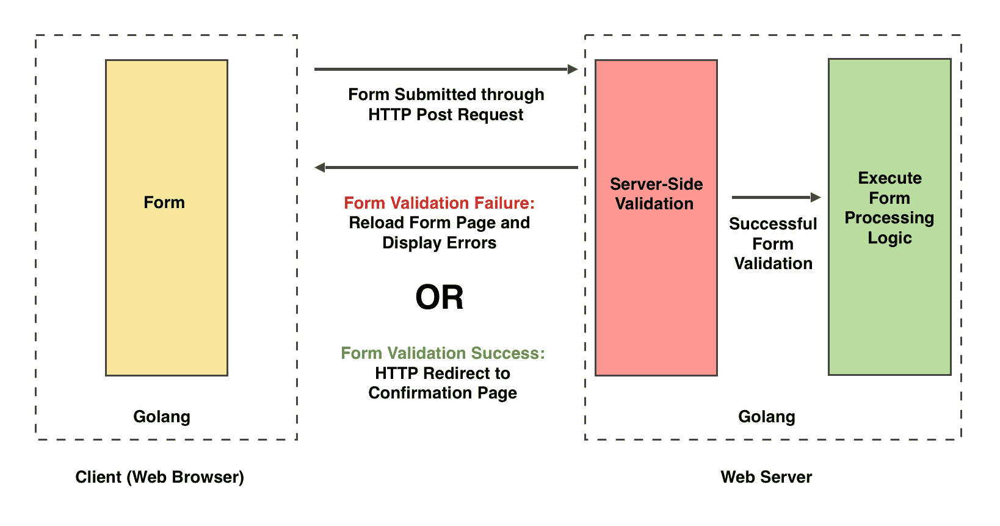

图 7.1：仅具有服务器端验证的网页表单

*图 7.2*显示了一个图像，显示了具有客户端和服务器端验证的 Web 表单。当用户提交 Web 表单时，表单中的数据将使用客户端验证进行验证。仅在成功的客户端验证结果时，表单数据将通过 XHR 调用提交到 Web 服务器的 Rest API 端点。一旦表单数据提交到服务器，它将经历第二轮服务器端验证。这确保了即使在客户端验证可能被篡改的情况下，表单数据的质量。客户端应用程序将检查从服务器返回的表单验证结果，并在成功提交表单时显示确认页面，或在提交表单不成功时显示联系表单错误：

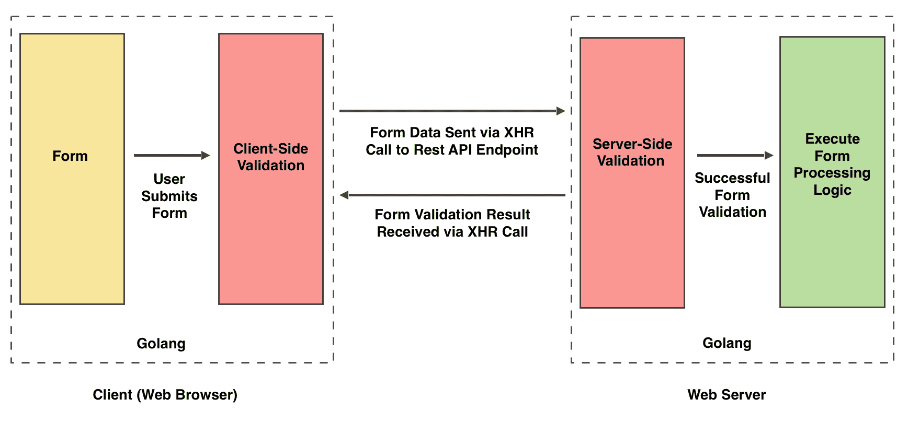

图 7.2：在客户端和服务器端验证的 Web 表单

# 设计联系表单

联系表单将允许网站用户与 IGWEB 团队取得联系。成功完成联系表单将导致包含用户生成的表单数据的联系表单提交被持久化在 Redis 数据库中。*图 7.3*是描述联系表单的线框图：

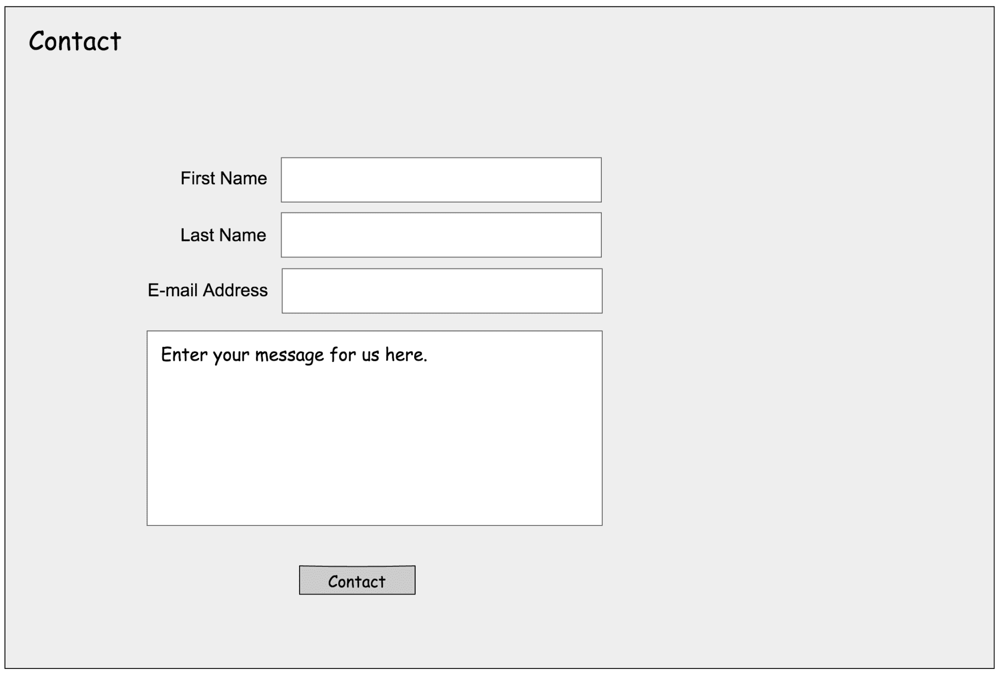

图 7.3：联系表单的线框设计

*图 7.4*是线框图，描述了当用户未正确填写表单时显示表单错误的联系表单：

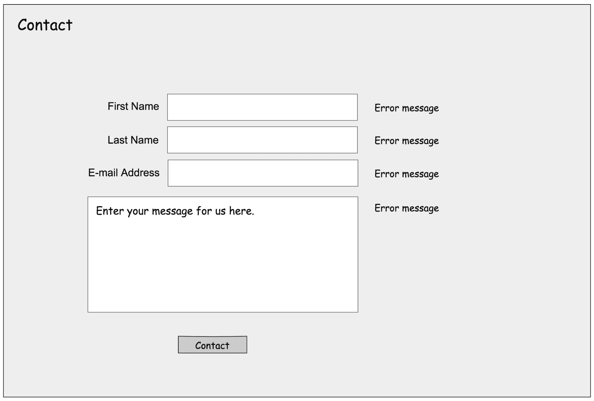

图 7.4：联系表单的线框设计，显示了错误消息

*图 7.5*是线框图，描述了成功提交联系表单后将显示给用户的确认页面：

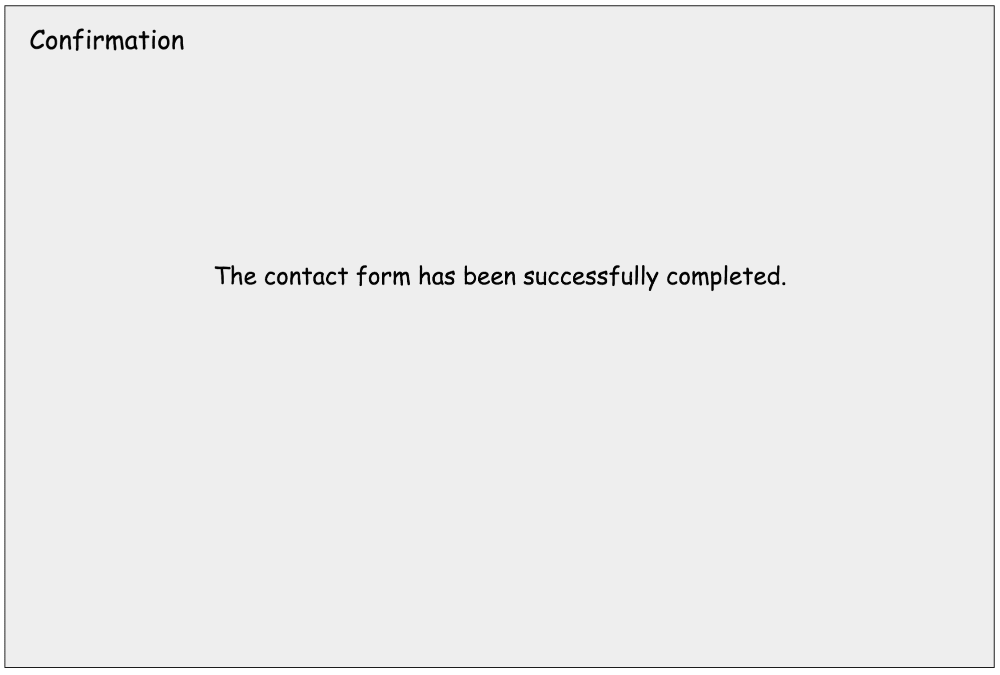

图 7.5：确认页面的线框设计

联系表单将从用户那里征求以下必要信息：他们的名字，姓氏，电子邮件地址和给团队的消息。如果用户没有填写这些字段中的任何一个，点击表单上的联系按钮后，用户将收到特定于字段的错误消息，指示未填写的字段。

# 实施模板

在服务器端呈现联系页面时，我们将使用`contact_page`模板（在`shared/templates/contact_page.tmpl`文件中找到）：

```go
{{ define "pagecontent" }}
{{template "contact_content" . }}
{{end}}
{{template "layouts/webpage_layout" . }}
```

请记住，因为我们包含了`layouts/webpage_layout`模板，这将打印生成页面的`doctype`，`html`和`body`标记的标记。这个模板将专门在服务器端使用。

使用`define`模板操作，我们划定了`"pagecontent"`块，其中将呈现联系页面的内容。联系页面的内容在`contact_content`模板内定义（在`shared/template/contact_content.tmpl`文件中找到）：

```go
<h1>Contact</h1>

{{template "partials/contactform_partial" .}}
```

请记住，除了服务器端应用程序之外，客户端应用程序将使用`contact_content`模板在主要内容区域呈现联系表单。

在`contact_content`模板内，我们包含了包含联系表单标记的联系表单部分模板（`partials/contactform_partial`）：

```go
<div class="formContainer">
<form id="contactForm" name="contactForm" action="/contact" method="POST" class="pure-form pure-form-aligned">
  <fieldset>
{{if .Form }}
    <div class="pure-control-group">
      <label for="firstName">First Name</label>
      <input id="firstName" type="text" placeholder="First Name" name="firstName" value="{{.Form.Fields.firstName}}">
      <span id="firstNameError" class="formError pure-form-message-inline">{{.Form.Errors.firstName}}</span>
    </div>

    <div class="pure-control-group">
      <label for="lastName">Last Name</label>
      <input id="lastName" type="text" placeholder="Last Name" name="lastName" value="{{.Form.Fields.lastName}}">
      <span id="lastNameError" class="formError pure-form-message-inline">{{.Form.Errors.lastName}}</span>
    </div>

    <div class="pure-control-group">
      <label for="email">E-mail Address</label>
      <input id="email" type="text" placeholder="E-mail Address" name="email" value="{{.Form.Fields.email}}">
      <span id="emailError" class="formError pure-form-message-inline">{{.Form.Errors.email}}</span>
    </div>

    <fieldset class="pure-control-group">
      <textarea id="messageBody" class="pure-input-1-2" placeholder="Enter your message for us here." name="messageBody">{{.Form.Fields.messageBody}}</textarea>
      <span id="messageBodyError" class="formError pure-form-message-inline">{{.Form.Errors.messageBody}}</span>
    </fieldset>

    <div class="pure-controls">
      <input id="contactButton" name="contactButton" class="pure-button pure-button-primary" type="submit" value="Contact" />
    </div>
{{end}}
  </fieldset>
</form>
</div>
```

这个部分模板包含了实现*图 7.3*所示线框设计所需的 HTML 标记。访问表单字段值及其对应错误的模板操作以粗体显示。我们为给定的`input`字段填充`value`属性的原因是，如果用户在填写表单时出错，这些值将被预先填充为用户在上一次表单提交尝试中输入的值。每个`input`字段后面直接跟着一个`<span>`标记，其中将包含该特定字段的相应错误消息。

最后的`<input>`标签是一个`submit`按钮。点击此按钮，用户将能够将表单内容提交到 Web 服务器。

# 验证电子邮件地址语法

除了所有字段必须填写的基本要求之外，电子邮件地址字段必须是格式正确的电子邮件地址。如果用户未能提供格式正确的电子邮件地址，字段特定的错误消息将通知用户电子邮件地址语法不正确。

我们将使用`shared`文件夹中的`validate`包中的`EmailSyntax`函数。

```go
const EmailRegex = `(?i)^[_a-z0-9-]+(\.[_a-z0-9-]+)*@[a-z0-9-]+(\.[a-z0-9-]+)*(\.[a-z]{2,3})+$`

func EmailSyntax(email string) bool {
  validationResult := false
  r, err := regexp.Compile(EmailRegex)
  if err != nil {
    log.Fatal(err)
  }
  validationResult = r.MatchString(email)
  return validationResult
}
```

请记住，因为`validate`包被策略性地放置在`shared`文件夹中，该包旨在是等距的（跨环境使用）。`EmailSyntax`函数的工作是确定输入字符串是否是有效的电子邮件地址。如果电子邮件地址有效，函数将返回`true`，如果输入字符串不是有效的电子邮件地址，则函数将返回`false`。

# 表单接口

等距网络表单实现了`isokit`包中找到的`Form`接口：

```go
type Form interface {
 Validate() bool
 Fields() map[string]string
 Errors() map[string]string
 FormParams() *FormParams
 PrefillFields()
 SetFields(fields map[string]string)
 SetErrors(errors map[string]string)
 SetFormParams(formParams *FormParams)
 SetPrefillFields(prefillFields []string)
}
```

`Validate`方法确定表单是否已正确填写，如果表单已正确填写，则返回`true`的布尔值，如果表单未正确填写，则返回`false`的布尔值。

`Fields`方法返回了所有表单字段的`map`，其中键是表单字段的名称，值是表单字段的字符串值。

`Errors`方法包含了在表单验证时填充的所有错误的`map`。键是表单字段的名称，值是描述性错误消息。

`FormParams`方法返回表单的等距表单参数对象。表单参数对象很重要，因为它确定了可以获取表单字段的用户输入值的来源。在服务器端，表单字段值是从`*http.Request`获取的，在客户端，表单字段是从`FormElement`对象获取的。

这是`FormParams`结构的样子：

```go
type FormParams struct {
  FormElement *dom.HTMLFormElement
  ResponseWriter http.ResponseWriter
  Request *http.Request
  UseFormFieldsForValidation bool
  FormFields map[string]string
}
```

`PrefillFields`方法返回一个字符串切片，其中包含表单字段的所有名称，如果用户在提交表单时出错，应保留其值。

考虑到最后四个 getter 方法，`Fields`、`Errors`、`FormParams`和`PrefillFields`，都有相应的 setter 方法，`SetFields`、`SetErrors`、`SetFormParams`和`SetPrefillFields`。

# 实现联系表单

现在我们知道表单接口的样子，让我们开始实现联系表单。在我们的导入分组中，请注意我们包括了验证包和`isokit`包：

```go
import (
  "github.com/EngineerKamesh/igb/igweb/shared/validate"
  "github.com/isomorphicgo/isokit"
)
```

请记住，我们需要导入验证包，以便使用包中定义的`EmailSyntax`函数进行电子邮件地址验证功能。

我们之前介绍的实现`Form`接口所需的大部分功能都由`isokit`包中的`BasicForm`类型提供。我们将类型`BasicForm`嵌入到我们的`ContactForm`结构的类型定义中：

```go
type ContactForm struct {
  isokit.BasicForm
}
```

通过这样做，我们大部分实现`Form`接口的功能都是免费提供给我们的。但是，我们必须实现`Validate`方法，因为`BasicForm`类型中找到的默认`Validate`方法实现将始终返回`false`。

联系表单的构造函数接受一个`FormParams`结构，并返回一个新创建的`ContactForm`结构的指针：

```go
func NewContactForm(formParams *isokit.FormParams) *ContactForm {
  prefillFields := []string{"firstName", "lastName", "email", "messageBody", "byDateInput"}
  fields := make(map[string]string)
  errors := make(map[string]string)
  c := &ContactForm{}
  c.SetPrefillFields(prefillFields)
  c.SetFields(fields)
  c.SetErrors(errors)
  c.SetFormParams(formParams)
  return c
}
```

我们创建一个字符串切片，其中包含应保留其值的字段的名称，在`prefillFields`变量中。我们为`fields`变量和`errors`变量分别创建了`map[string]string`类型的实例。我们创建了一个新的`ContactForm`实例的引用，并将其分配给变量`c`。我们调用`ContactForm`实例`c`的`SetFields`方法，并传递`fields`变量。

我们调用`SetFields`和`SetErrors`方法，并分别传入`fields`和`errors`变量。我们调用`c`的`SetFormParams`方法来设置传入构造函数的表单参数。最后，我们返回新的`ContactForm`实例。

正如前面所述，`BasicForm`类型中的默认`Validate`方法实现总是返回`false`。因为我们正在实现自己的自定义表单，联系表单，我们有责任定义成功验证是什么，并通过实现`Validate`方法来实现。

```go
func (c *ContactForm) Validate() bool {
  c.RegenerateErrors()
  c.PopulateFields()

  // Check if first name was filled out
  if isokit.FormValue(c.FormParams(), "firstName") == "" {
    c.SetError("firstName", "The first name field is required.")
  }

  // Check if last name was filled out
  if isokit.FormValue(c.FormParams(), "lastName") == "" {
    c.SetError("lastName", "The last name field is required.")
  }

  // Check if message body was filled out
  if isokit.FormValue(c.FormParams(), "messageBody") == "" {
    c.SetError("messageBody", "The message area must be filled.")
  }

  // Check if e-mail address was filled out
  if isokit.FormValue(c.FormParams(), "email") == "" {
    c.SetError("email", "The e-mail address field is required.")
  } else if validate.EmailSyntax(isokit.FormValue(c.FormParams(), "email")) == false {
    // Check e-mail address syntax
    c.SetError("email", "The e-mail address entered has an improper syntax.")

  }

  if len(c.Errors()) > 0 {
    return false

  } else {
    return true
  }
}
```

我们首先调用`RegenerateErrors`方法来清除当前显示给用户的错误。这个方法的功能只适用于客户端应用程序。当我们在客户端实现联系表单功能时，我们将更详细地介绍这个方法。

我们调用`PopulateFields`方法来填充`ContactForm`实例的字段`map`。如果用户在填写表单时出现错误，这个方法负责预先填充用户已经输入的值，以免他们不得不再次输入这些值来重新提交表单。

在这一点上，我们可以开始进行表单验证。我们首先检查用户是否已经填写了名字字段。我们使用`isokit`包中的`FormValue`函数来获取表单字段`firstName`的用户输入值。我们传递给`FormValue`函数的第一个参数是联系表单的表单参数对象，第二个值是我们希望获取的表单字段的名称，即`"firstName"`。通过检查用户输入的值是否为空字符串，我们可以确定用户是否已经在字段中输入了值。如果没有，我们调用`SetError`方法，传递表单字段的名称，以及一个描述性错误消息。

我们执行完全相同的检查，以查看用户是否已经填写了必要的值，包括姓氏字段、消息正文和电子邮件地址。如果他们没有填写这些字段中的任何一个，我们将调用`SetError`方法，提供字段的名称和一个描述性错误消息。

对于电子邮件地址，如果用户已经输入了电子邮件表单字段的值，我们将对用户提供的电子邮件地址的语法进行额外检查。我们将用户输入的电子邮件值传递给验证包中的`EmailSyntax`函数。如果电子邮件不是有效的语法，我们调用`SetError`方法，传入表单字段名称`"email"`，以及一个描述性错误消息。

正如我们之前所述，`Validate`函数基于表单是否包含错误返回一个布尔值。我们使用 if 条件来确定错误的数量是否大于零，如果是，表示表单有错误，我们返回一个布尔值`false`。如果错误的数量为零，控制流将到达 else 块，我们返回一个布尔值`true`。

现在我们已经添加了联系表单，是时候实现服务器端的路由处理程序了。

# 注册联系路由

我们首先添加联系表单页面和联系确认页面的路由：

```go
  r.Handle("/contact", handlers.ContactHandler(env)).Methods("GET", "POST")
  r.Handle("/contact-confirmation", handlers.ContactConfirmationHandler(env)).Methods("GET")
```

请注意，我们注册的`/contact`路由将由`ContactHandler`函数处理，将接受使用`GET`和`POST`方法的 HTTP 请求。当首次访问联系表单时，将通过`GET`请求到`/contact`路由。当用户提交联系表单时，他们将发起一个`POST`请求到`/contact`路由。这解释了为什么这个路由接受这两种 HTTP 方法。

成功填写联系表单后，用户将被重定向到`/contact-confirmation`路由。这是有意为之，以避免重新提交表单错误，当用户尝试刷新网页时，如果我们仅仅使用`/contact`路由本身打印出表单确认消息。

# 联系路由处理程序

`ContactHandler`负责在 IGWEB 上呈现联系页面，联系表单将驻留在此处：

```go
func ContactHandler(env *common.Env) http.Handler {
  return http.HandlerFunc(func(w http.ResponseWriter, r *http.Request) {
```

我们声明并初始化`formParams`变量为新初始化的`FormParams`实例，提供`ResponseWriter`和`Request`字段的值：

```go
    formParams := isokit.FormParams{ResponseWriter: w, Request: r}
```

然后我们声明并初始化`contactForm`变量，通过调用`NewContactForm`函数并传入对`formParams`结构的引用，使用新创建的`ContactForm`实例。

```go
    contactForm := forms.NewContactForm(&formParams)
```

我们根据 HTTP 请求方法的类型进行`switch`：

```go
    switch r.Method {

    case "GET":
      DisplayContactForm(env, contactForm)
    case "POST":
      validationResult := contactForm.Validate()
      if validationResult == true {
        submissions.ProcessContactForm(env, contactForm)
        DisplayConfirmation(env, w, r)
      } else {
        DisplayContactForm(env, contactForm)
      }
    default:
      DisplayContactForm(env, contactForm)
    }

  })
}
```

如果 HTTP 请求方法是`GET`，我们调用`DisplayContactForm`函数，传入`env`对象和`contactForm`对象。`DisplayContactForm`函数将在联系页面上呈现联系表单。

如果 HTTP 请求方法是`POST`，我们验证联系表单。请记住，如果使用`POST`方法访问`/contact`路由，这表明用户已经向路由提交了联系表单。我们声明并初始化`validationResult`变量，将其设置为调用`ContactForm`对象`contactForm`的`Validate`方法的结果的值。

如果`validationResult`的值为 true，表单验证成功。我们调用`submissions`包中的`ProcessContactForm`函数，传入`env`对象和`ContactForm`对象。`ProcessContactForm`函数负责处理成功的联系表单提交。然后我们调用`DisplayConfirmation`函数，传入`env`对象，`http.ResponseWriter`，`w`和`*http.Request`，`r`。

如果`validationResult`的值为`false`，控制流进入`else`块，我们调用`DisplayContactForm`函数，传入`env`对象和`ContactForm`对象`contactForm`。这将再次呈现联系表单，这次用户将看到与未填写或未正确填写的字段相关的错误消息。

如果 HTTP 请求方法既不是`GET`也不是`POST`，我们达到默认条件，简单地调用`DisplayContactForm`函数来显示联系表单。

这是`DisplayContactForm`函数：

```go
func DisplayContactForm(env *common.Env, contactForm *forms.ContactForm) {
  templateData := &templatedata.Contact{PageTitle: "Contact", Form: contactForm}
  env.TemplateSet.Render("contact_page", &isokit.RenderParams{Writer: contactForm.FormParams().ResponseWriter, Data: templateData})
}
```

该函数接受`env`对象和`ContactForm`对象作为输入参数。我们首先声明并初始化`templateData`变量，它将作为我们将要提供给`contact_page`模板的数据对象。我们创建一个新的`templatedata.Contact`结构的实例，并将其`PageTitle`字段填充为`"Contact"`，将其`Form`字段填充为传入函数的`ContactForm`对象。

这是`templatedata`包中的`Contact`结构的样子：

```go
type Contact struct {
  PageTitle string
  Form *forms.ContactForm
}
```

`PageTitle`字段代表网页的页面标题，`Form`字段代表`ContactForm`对象。

然后我们在`env.TemplateSet`对象上调用`Render`方法，并传入我们希望呈现的模板名称`contact_page`，以及等同模板呈现参数（`RenderParams`）对象。我们已经将`RenderParams`对象的`Writer`字段分配为与`ContactForm`对象相关联的`ResponseWriter`，并将`Data`字段分配为`templateData`变量。

这是`DisplayConfirmation`函数：

```go
func DisplayConfirmation(env *common.Env, w http.ResponseWriter, r *http.Request) {
  http.Redirect(w, r, "/contact-confirmation", 302)
}
```

这个函数负责执行重定向到确认页面。在这个函数中，我们简单地调用`http`包中可用的`Redirect`函数，并执行`302`状态重定向到`/contact-confirmation`路由。

现在我们已经介绍了联系页面的路由处理程序，是时候看看联系表单确认网页的路由处理程序了。

# 联系确认路由处理程序

`ContactConfirmationHandler`函数的唯一目的是呈现联系确认页面：

```go
func ContactConfirmationHandler(env *common.Env) http.Handler {
  return http.HandlerFunc(func(w http.ResponseWriter, r *http.Request) {

    env.TemplateSet.Render("contact_confirmation_page", &isokit.RenderParams{Writer: w, Data: nil})
  })
}
```

我们调用`TemplateSet`对象的`Render`方法，并指定要呈现`contact_confirmation_page`模板，以及传入的`RenderParams`结构。我们已经将结构的`Writer`字段填充为`http.ResponseWriter`，并将`Data`对象的值分配为`nil`，以指示没有要传递给模板的数据对象。

# 处理联系表单提交

在联系表单成功完成后，我们在`submission`包中调用`ProcessContactForm`函数。如果填写联系表单的工作流程就像打棒球一样，那么对`ProcessContactForm`函数的调用可以被认为是到达本垒并得分。正如我们将在*联系表单 Rest API 端点*部分中看到的那样，这个函数也将被联系表单的 Rest API 端点调用。既然我们已经确定了这个函数的重要性，让我们继续并检查它：

```go
func ProcessContactForm(env *common.Env, form *forms.ContactForm) {

  log.Println("Successfully reached process content form function, indicating that the contact form was filled out properly resulting in a positive validation.")

  contactRequest := &models.ContactRequest{FirstName: form.GetFieldValue("firstName"), LastName: form.GetFieldValue("lastName"), Email: form.GetFieldValue("email"), Message: form.GetFieldValue("messageBody")}

  env.DB.CreateContactRequest(contactRequest)
}
```

我们首先打印出一个日志消息，指示我们已成功到达该函数，表明用户已正确填写了联系表单，并且用户输入的数据值得被处理。然后我们声明并初始化`contactRequest`变量，使用新创建的`ContactRequest`实例。

`ContactRequest`结构的目的是对从联系表单收集的数据进行建模。以下是`ContactRequest`结构的外观：

```go
type ContactRequest struct {
  FirstName string
  LastName string
  Email string
  Message string
}
```

正如您所看到的，`ContactRequest`结构中的每个字段对应于联系表单中存在的表单字段。我们通过在联系表单对象上调用`GetFieldValue`方法并提供表单字段的名称，将`ContactRequest`结构中的每个字段填充为其对应的用户输入值。

如前所述，成功的联系表单提交包括将联系请求信息存储在 Redis 数据库中：

```go
env.DB.CreateContactRequest(contactRequest)
```

我们调用我们自定义 Redis 数据存储对象`env.DB`的`CreateContactRequest`方法，并将`ContactRequest`对象`contactRequest`传递给该方法。这个方法将联系请求信息保存到 Redis 数据库中：

```go
func (r *RedisDatastore) CreateContactRequest(contactRequest *models.ContactRequest) error {

  now := time.Now()
  nowFormatted := now.Format(time.RFC822Z)

  jsonData, err := json.Marshal(contactRequest)
  if err != nil {
    return err
  }

  if r.Cmd("SET", "contact-request|"+contactRequest.Email+"|"+nowFormatted, string(jsonData)).Err != nil {
    return errors.New("Failed to execute Redis SET command")
  }

  return nil

}
```

`CreateContactRequest`方法接受`ContactRequest`对象作为唯一输入参数。我们对`ContactRequest`值进行 JSON 编组，并将其存储到 Redis 数据库中。如果 JSON 编组过程失败或保存到数据库失败，则返回错误对象。如果没有遇到错误，我们返回`nil`。

# 可访问的联系表单

此时，我们已经准备好测试联系表单了。但是，我们不是首先在基于 GUI 的网页浏览器中打开联系表单，而是首先看看使用 Lynx 网页浏览器对视障用户来说联系表单的可访问性如何。

乍一看，我们使用一个 25 年历史的纯文本网页浏览器来测试联系表单可能看起来有些奇怪。然而，Lynx 具有提供可刷新的盲文显示以及文本到语音功能的能力，这使得它成为了一个值得称赞的供视障人士使用的网页浏览技术。因为 Lynx 不支持显示图像和运行 JavaScript，我们可以很好地了解联系表单对于需要更大可访问性的用户来说的表现。

如果您在 Mac 上使用 Homebrew，可以轻松安装 Lynx，方法如下：

```go
$ brew install lynx
```

如果您使用 Ubuntu，可以通过发出以下命令安装 Lynx：

```go
$ sudo apt-get install lynx
```

如果您使用 Windows，可以从这个网页下载 Lynx：[`lynx.invisible-island.net/lynx2.8.8/index.html`](http://lynx.invisible-island.net/lynx2.8.8/index.html)。

您可以在维基百科上阅读有关 Lynx Web 浏览器的更多信息[`en.wikipedia.org/wiki/Lynx_(web_browser)`](https://en.wikipedia.org/wiki/Lynx_(web_browser))。

使用`--nocolor`选项启动 lynx 时，我们启动`igweb` Web 服务器实例：

```go
$ lynx --nocolor localhost:8080/contact
```

*图 7.6*显示了 Lynx Web 浏览器中联系表格的外观：

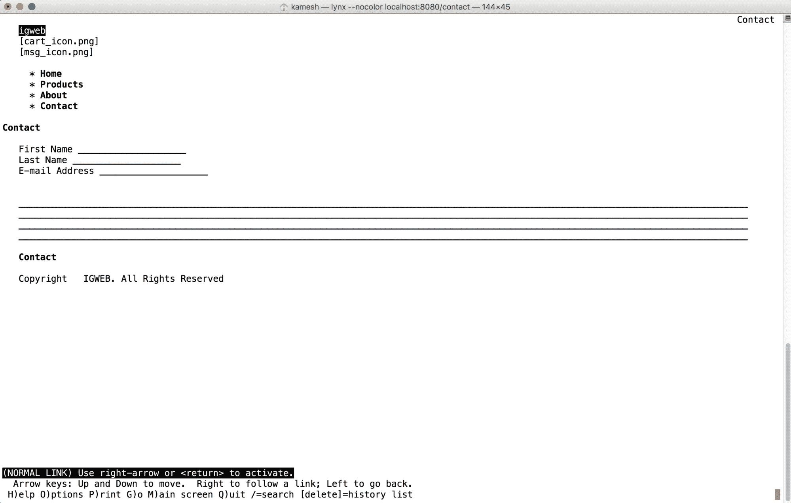

图 7.6：Lynx Web 浏览器中的联系表格

现在，我们将部分填写联系表格，目的是测试表单验证逻辑是否有效。在电子邮件字段的情况下，我们将提供一个格式不正确的电子邮件地址，如*图 7.7*所示：

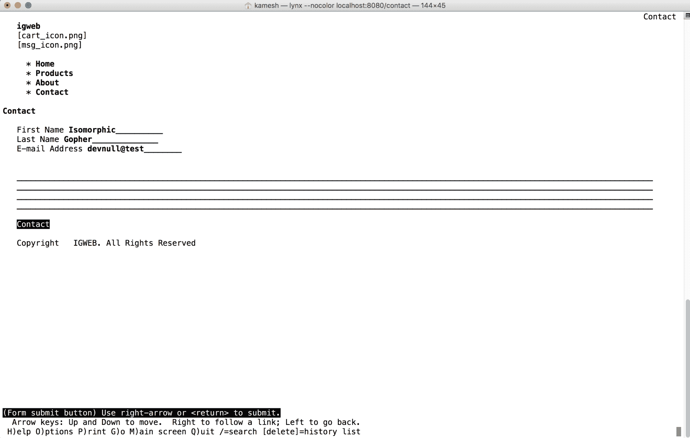

图 7.7：联系表格填写不正确

点击“联系”按钮后，请注意我们收到有关未正确填写的字段的错误消息，如*图 7.8*所示：

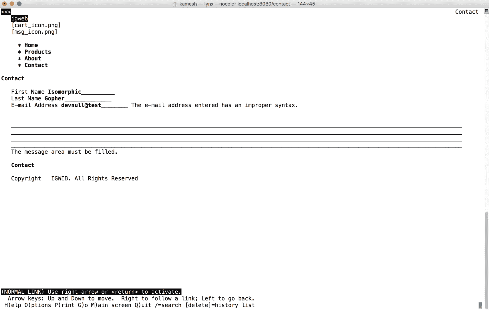

图 7.8：电子邮件地址字段和消息文本区域显示的错误消息

还要注意，我们收到了错误消息，告诉我们电子邮件地址格式不正确。

*图 7.9*显示了我们纠正所有错误后联系表格的外观：

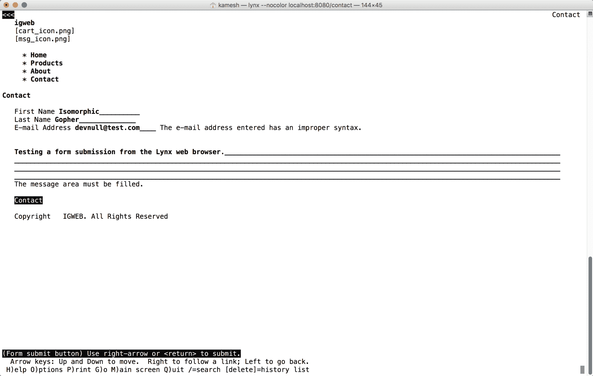

图 7.9：联系表格填写正确

提交更正的联系表格后，我们看到确认消息，通知我们已成功填写联系表格，如*图 7.10*所示：

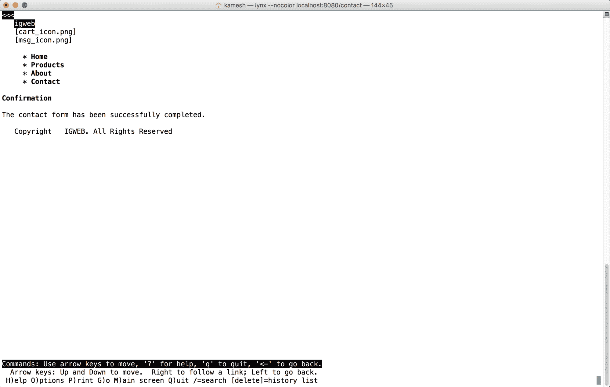

图 7.10：确认页面

使用 redis-cli 命令检查 Redis 数据库，我们可以验证我们收到了表单提交，如*图 7.11*所示：

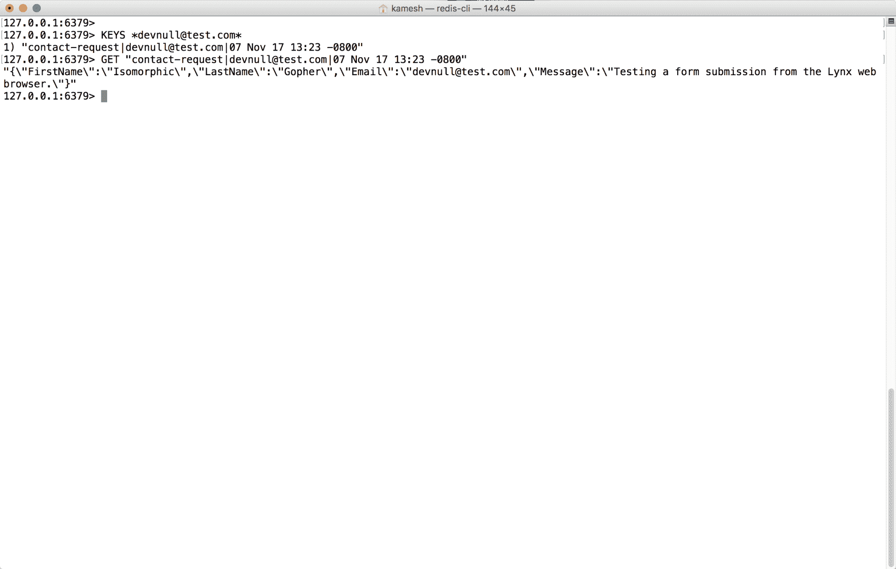

图 7.11：在 Redis 数据库中验证新存储的联系请求条目

在这一点上，我们可以满意地知道我们已经使我们的联系表格对视力受损用户可访问，并且我们的努力并不多。让我们看看在禁用 JavaScript 的 GUI 型 Web 浏览器中联系表格的外观。

# 联系表格可以在没有 JavaScript 的情况下运行

在 Safari Web 浏览器中，我们可以通过在 Safari 的开发菜单中选择禁用 JavaScript 选项来禁用 JavaScript：

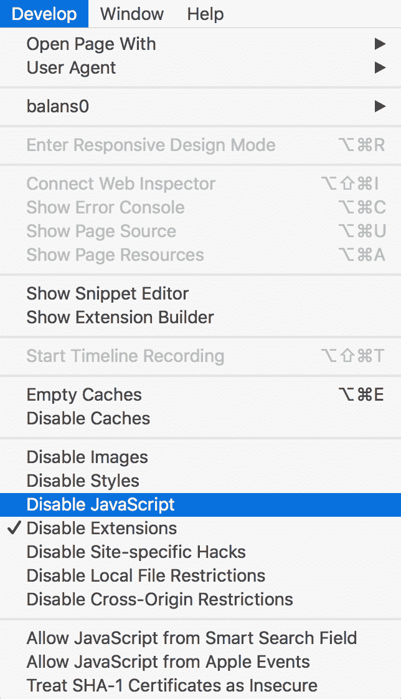

图 7.12：使用 Safari 的开发菜单禁用 JavaScript

*图 7.13*显示了**图形用户界面**（**GUI**）-基于 Web 浏览器的联系表格的外观：

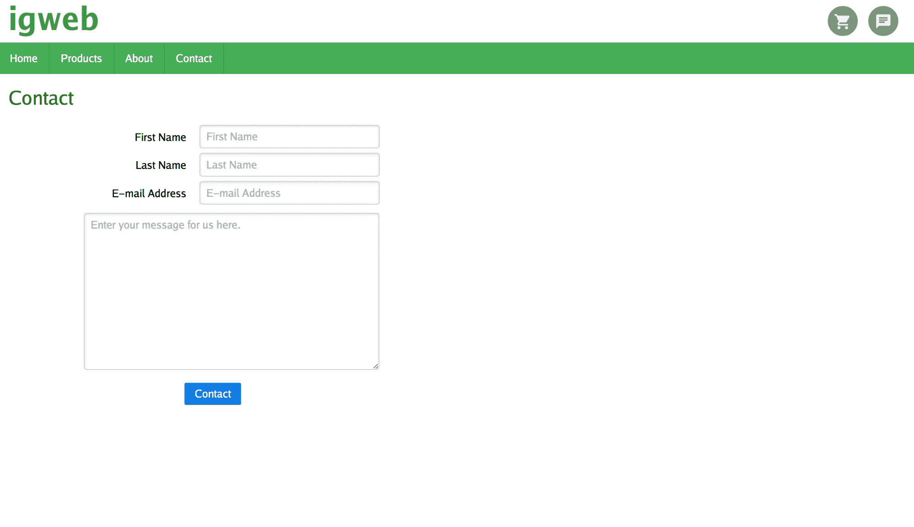

图 7.13：GUI 型 Web 浏览器中的联系表格

我们遵循与 Lynx Web 浏览器上执行的相同的测试策略。我们部分填写表格并提供一个无效的电子邮件地址，如*图 7.14*所示：

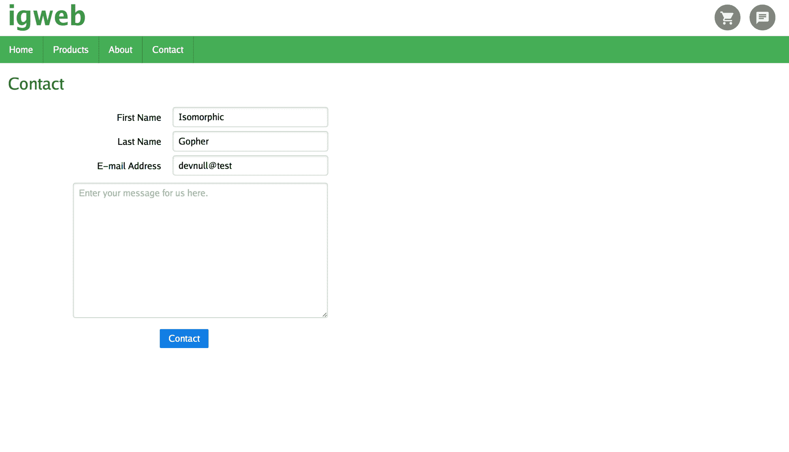

图 7.14：联系表格填写不正确

点击“联系”按钮后，错误消息显示在有问题的字段旁边，如*图 7.15*所示：

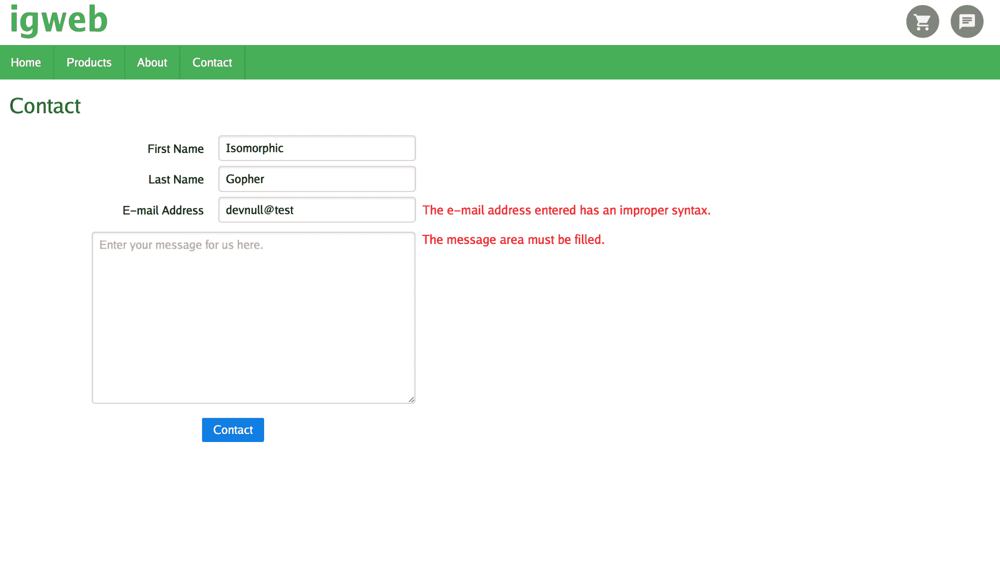

图 7.15：错误消息显示在有问题的字段旁边

提交联系表格后，请注意我们收到有关填写不正确的字段的错误。纠正错误后，我们现在准备再次点击“联系”按钮提交表格，如*图 7.16*所示：

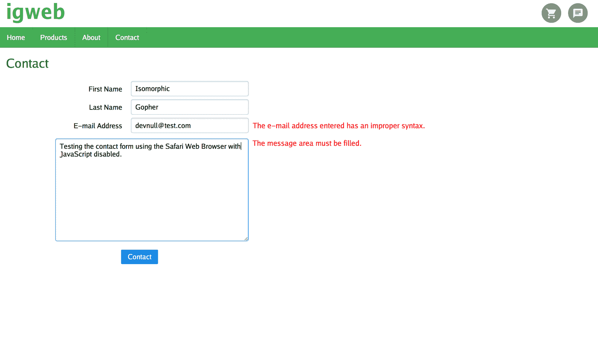

图 7.16：准备重新提交的正确填写的联系表格

提交联系表格后，我们被转发到`/contact-confirmation`路由，并收到确认消息，联系表格已正确填写，如*图 7.17*所示：

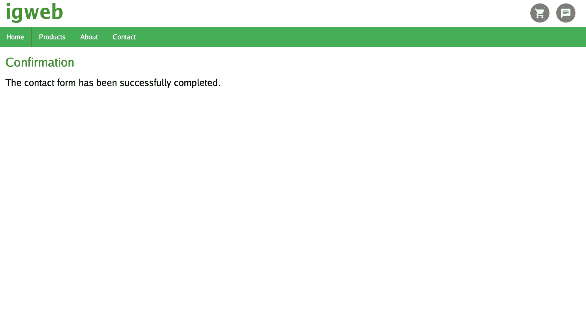

图 7.17：确认页面

我们已经实现的基于服务器端的联系表单即使在启用 JavaScript 的情况下也将继续运行。您可能会想为什么我们需要在客户端实现联系表单？我们不能只使用基于服务器端的联系表单并结束吗？

答案归结为为用户提供增强的用户体验。仅使用基于服务器端的联系表单，我们会破坏用户正在体验的单页应用架构。敏锐的读者会意识到，提交表单和重新提交表单都需要完整的页面重新加载。HTTP 重定向到`/contact-confirmation`路由也会破坏用户体验，因为它也会导致完整的页面重新加载。

为了在客户端实现联系表单，需要实现以下两个目标：

+   提供一致、无缝的单页应用体验

+   在客户端提供验证联系表单的能力

第一个目标，提供一致、无缝的单页应用体验，可以通过使用同构模板集来轻松实现，以将内容呈现到主要内容区域的`div`容器中，就像我们在之前的章节中展示的那样。

第二个目标是在客户端验证联系表单的能力，由于 Web 浏览器启用了 JavaScript，这是可能的。有了这个能力，我们可以在客户端验证联系表单本身。考虑这样一种情况，我们有一个用户，在填写联系表单时不断犯错。我们可以减少向 Web 服务器发出的不必要的网络调用。只有在用户通过第一轮验证（在客户端）之后，表单才会通过网络提交到 Web 服务器，在那里进行最终的验证（在服务器端）。

# 客户端考虑

令人惊讶的是，在客户端上启用联系表单并不需要我们做太多工作。让我们逐节检查`client/handlers`文件夹中找到的`contact.go`源文件：

```go
func ContactHandler(env *common.Env) isokit.Handler {
  return isokit.HandlerFunc(func(ctx context.Context) {
    contactForm := forms.NewContactForm(nil)
    DisplayContactForm(env, contactForm)
  })
}
```

这是我们的`ContactHandler`函数，它将为客户端上的`/contact`路由提供服务。我们首先声明并初始化`contactForm`变量，将其分配给通过调用`NewContactForm`构造函数返回的`ContactForm`实例。

请注意，当我们通常应该传递一个`FormParams`结构时，我们将`nil`传递给构造函数。在客户端，我们将填充`FormParams`结构的`FormElement`字段，以将网页上的表单元素与`contactForm`对象关联起来。然而，在呈现网页之前，我们遇到了一个“先有鸡还是先有蛋”的情况。我们无法填充`FormParams`结构的`FormElement`字段，因为网页上还不存在表单元素。因此，我们的首要任务是呈现联系表单，目前，我们将联系表单的`FormParams`结构设置为`nil`以实现这一点。稍后，我们将使用`contactForm`对象的`SetFormParams`方法设置`contactForm`对象的`FormParams`结构。

为了在网页上显示联系表单，我们调用`DisplayContactForm`函数，传入`env`对象和`contactForm`对象。这个函数对于我们保持无缝的单页应用用户体验是至关重要的。`DisplayContactForm`函数如下所示：

```go
func DisplayContactForm(env *common.Env, contactForm *forms.ContactForm) {
  templateData := &templatedata.Contact{PageTitle: "Contact", Form: contactForm}
  env.TemplateSet.Render("contact_content", &isokit.RenderParams{Data: templateData, Disposition: isokit.PlacementReplaceInnerContents, Element: env.PrimaryContent, PageTitle: templateData.PageTitle})
  InitializeContactPage(env, contactForm)
}
```

我们声明并初始化`templateData`变量，这将是我们传递给模板的数据对象。`templateData`变量被分配一个新创建的`templatedata`包中的`Contact`实例，其`PageTitle`属性设置为“联系”，`Form`属性设置为`contactForm`对象。

我们调用`env.TemplateSet`对象的`Render`方法，并指定我们希望渲染`"contact_content"`模板。我们还向`Render`方法提供了等同渲染参数（`RenderParams`），将`Data`字段设置为`templateData`变量，并将`Disposition`字段设置为`isokit.PlacementReplaceInnerContents`，声明了我们将如何相对于关联元素渲染模板内容。通过将`Element`字段设置为`env.PrimaryContent`，我们指定主要内容`div`容器将是模板将要渲染到的关联元素。最后，我们将`PageTitle`属性设置为动态更改网页标题，当用户从客户端着陆在`/contact`路由时。

我们调用`InitializeContactPage`函数，提供`env`对象和`contactForm`对象。回想一下，`InitializeContactPage`函数负责为联系页面设置用户交互相关的代码（事件处理程序）。让我们检查`InitializeContactPage`函数：

```go
func InitializeContactPage(env *common.Env, contactForm *forms.ContactForm) {

  formElement := env.Document.GetElementByID("contactForm").(*dom.HTMLFormElement)
  contactForm.SetFormParams(&isokit.FormParams{FormElement: formElement})
  contactButton := env.Document.GetElementByID("contactButton").(*dom.HTMLInputElement)
  contactButton.AddEventListener("click", false, func(event dom.Event) {
    handleContactButtonClickEvent(env, event, contactForm)
  })
}
```

我们调用`env.Document`对象的`GetElementByID`方法来获取联系表单元素，并将其赋值给变量`formElement`。我们调用`SetFormParams`方法，提供一个`FormParams`结构，并用`formElement`变量填充其`FormElement`字段。此时，我们已经为`contactForm`对象设置了表单参数。我们通过调用`env.Document`对象的`GetElementByID`方法并提供`id`为`"contactButton"`来获取联系表单的`button`元素。

我们在联系`button`的点击事件上添加了一个事件监听器，它将调用`handleContactButtonClickEvent`函数，并传递`env`对象、`event`对象和`contactForm`对象。`handleContactButtonClickEvent`函数非常重要，因为它将在客户端运行表单验证，如果验证成功，它将在服务器端发起 XHR 调用到 Rest API 端点。以下是`handleContactButtonClickEvent`函数的代码：

```go
func handleContactButtonClickEvent(env *common.Env, event dom.Event, contactForm *forms.ContactForm) {

  event.PreventDefault()
  clientSideValidationResult := contactForm.Validate()

  if clientSideValidationResult == true {

    contactFormErrorsChannel := make(chan map[string]string)
    go ContactFormSubmissionRequest(contactFormErrorsChannel, contactForm)
```

我们首先抑制点击联系按钮的默认行为，这将提交整个网页表单。这种默认行为源于联系`button`元素是一个`input`类型为`submit`的元素，当点击时默认行为是提交网页表单。

然后我们声明并初始化`clientSideValidationResult`，一个布尔变量，赋值为调用`contactForm`对象的`Validate`方法的结果。如果`clientSideValidationResult`的值为`false`，我们进入`else`块，在那里调用`contactForm`对象的`DisplayErrors`方法。`DisplayErrors`方法是从`isokit`包中的`BasicForm`类型提供给我们的。

如果`clientSideValidationResult`的值为 true，这意味着表单在客户端成功验证。此时，联系表单提交已经通过了客户端的第一轮验证。

为了开始第二（也是最后）一轮验证，我们需要调用服务器端的 Rest API 端点，负责验证表单内容并重新运行相同的验证。我们创建了一个名为`contactFormErrorsChannel`的通道，这是一个我们将通过其发送`map[string]string`值的通道。我们将`ContactFormSubmissionRequest`函数作为一个 goroutine 调用，传入通道`contactFormErrorsChannel`和`contactForm`对象。`ContactFormSubmissionRequest`函数将在服务器端发起 XHR 调用，验证服务器端的联系表单。一组错误将通过`contactFormErrorsChannel`发送。

让我们在返回`handleContactButtonClickEvent`函数之前快速查看`ContactFormSubmissionRequest`函数：

```go
func ContactFormSubmissionRequest(contactFormErrorsChannel chan map[string]string, contactForm *forms.ContactForm) {

  jsonData, err := json.Marshal(contactForm.Fields())
  if err != nil {
    println("Encountered error: ", err)
    return
  }

  data, err := xhr.Send("POST", "/restapi/contact-form", jsonData)
  if err != nil {
    println("Encountered error: ", err)
    return
  }

  var contactFormErrors map[string]string
  json.NewDecoder(strings.NewReader(string(data))).Decode(&contactFormErrors)

  contactFormErrorsChannel <- contactFormErrors
}
```

在`ContactFormSubmissionRequest`函数中，我们对`contactForm`对象的字段进行 JSON 编组，并通过调用`xhr`包中的`Send`函数向 Web 服务器发出 XHR 调用。我们指定 XHR 调用将使用`POST` HTTP 方法，并将发布到`/restapi/contact-form`端点。我们将联系表单字段的 JSON 编码数据作为`Send`函数的最后一个参数传入。

如果在 JSON 编组过程中或在进行 XHR 调用时没有错误，我们获取从服务器检索到的数据，并尝试将其从 JSON 格式解码为`contactFormErrors`变量。然后我们通过通道`contactFormErrorsChannel`发送`contactFormErrors`变量。

现在，让我们回到`handleContactButtonClickEvent`函数：

```go
    go func() {

      serverContactFormErrors := <-contactFormErrorsChannel
      serverSideValidationResult := len(serverContactFormErrors) == 0

      if serverSideValidationResult == true {
        env.TemplateSet.Render("contact_confirmation_content", &isokit.RenderParams{Data: nil, Disposition: isokit.PlacementReplaceInnerContents, Element: env.PrimaryContent})
      } else {
        contactForm.SetErrors(serverContactFormErrors)
        contactForm.DisplayErrors()
      }

    }()

  } else {
    contactForm.DisplayErrors()
  }
}
```

为了防止在事件处理程序中发生阻塞，我们创建并运行一个匿名的 goroutine 函数。我们将错误的`map`接收到`serverContactFormErrors`变量中，从`contactFormErrorsChannel`中。`serverSideValidationResult`布尔变量负责通过检查错误`map`的长度来确定联系表单中是否存在错误。如果错误的长度为零，表示联系表单提交中没有错误。如果长度大于零，表示联系表单提交中存在错误。

如果`severSideValidationResult`布尔变量的值为`true`，我们在等同模板集上调用`Render`方法，渲染`contact_confirmation_content`模板，并传入等同模板渲染参数。在`RenderParams`对象中，我们将`Data`字段设置为`nil`，因为我们不会向模板传递任何数据对象。我们为`Disposition`字段指定值`isokit.PlacementReplaceInnerContents`，表示我们将对关联元素执行替换内部 HTML 操作。我们将`Element`字段设置为关联元素，即主要内容`div`容器，因为这是模板将要渲染到的位置。

如果`serverSideValidationResult`布尔变量的值为`false`，这意味着表单仍然包含需要纠正的错误。我们在`contactForm`对象上调用`SetErrors`方法，传入`serverContactFormErrors`变量。然后我们在`contactForm`对象上调用`DisplayErrors`方法，将错误显示给用户。

我们几乎完成了，我们在客户端实现联系表单的唯一剩下的事项是实现服务器端的 Rest API 端点，对联系表单提交进行第二轮验证。

# 联系表单 Rest API 端点

在`igweb.go`源文件中，我们已经注册了`/restapi/contact-form`端点及其关联的处理函数`ContactFormEndpoint`：

```go
r.Handle("/restapi/contact-form", endpoints.ContactFormEndpoint(env)).Methods("POST")
```

`ContactFormEndpoint`函数负责为`/restapi/contact-form`端点提供服务：

```go
func ContactFormEndpoint(env *common.Env) http.Handler {
  return http.HandlerFunc(func(w http.ResponseWriter, r *http.Request) {

    var fields map[string]string

    reqBody, err := ioutil.ReadAll(r.Body)
    if err != nil {
      log.Print("Encountered error when attempting to read the request body: ", err)
    }

    err = json.Unmarshal(reqBody, &fields)
    if err != nil {
      log.Print("Encountered error when attempting to unmarshal json data: ", err)
    }

    formParams := isokit.FormParams{ResponseWriter: w, Request: r, UseFormFieldsForValidation: true, FormFields: fields}
    contactForm := forms.NewContactForm(&formParams)
    validationResult := contactForm.Validate()

    if validationResult == true {
      submissions.ProcessContactForm(env, contactForm)
    }
    w.Header().Set("Content-Type", "application/json")
    json.NewEncoder(w).Encode(contactForm.Errors())
  })
}
```

该函数的目的是提供联系表单的服务器端验证，并返回 JSON 编码的错误`map`。我们创建一个`fields`变量，类型为`map[string]string`，表示联系表单中的字段。我们读取请求体，其中包含 JSON 编码的字段`map`。然后我们将 JSON 编码的字段`map`解封到`fields`变量中。

我们创建一个新的`FormParams`实例，并将其分配给变量`formParams`。在`FormParams`结构中，我们为`ResponseWriter`字段指定了`http.ResponseWriter` `w`的值，为`Request`字段指定了`*http.Request` `r`的值。我们将`UseFormFieldsForValidation`字段设置为`true`。这样做将改变默认行为，从请求中获取特定字段的表单值，而是从联系表单的`formFields` `map`中获取表单字段的值。最后，我们将`FormFields`字段设置为`fields`变量，即我们从请求体中 JSON 解组得到的字段`map`。

我们通过调用`NewContactForm`函数并传入`formParams`对象的引用来创建一个新的`contactForm`对象。为了进行服务器端验证，我们只需在`contactForm`对象上调用`Validate`方法，并将方法调用的结果分配给`validationResult`变量。请记住，客户端上存在的相同验证代码也存在于服务器端，并且我们在这里并没有做什么特别的，只是从服务器端调用验证逻辑，假设它不会被篡改。

如果`validationResult`的值为`true`，这意味着联系表单已经通过了服务器端的第二轮表单验证，我们可以调用`submissions`包中的`ProcessContactForm`函数，传入`env`对象和`contactForm`对象。请记住，当成功验证联系表单时，调用`ProcessContactForm`函数意味着我们已经到达了本垒并得分。

如果`validationResult`的值为`false`，我们无需做任何特别的事情。在调用对象的`Validate`方法后，`contactForm`对象的`Errors`字段将被填充。如果没有错误，`Errors`字段将只是一个空的`map`。

我们向客户端发送一个头部，指示服务器将发送 JSON 对象响应。然后，我们将`contactForm`对象的`map`错误编码为其 JSON 表示，并使用`http.ResponseWriter` `w`将其写入客户端。

# 检查客户端验证

现在我们已经准备好联系表单的客户端验证。让我们打开启用了 JavaScript 的网络浏览器。同时打开网络检查器以检查网络调用，如*图 7.18*所示：

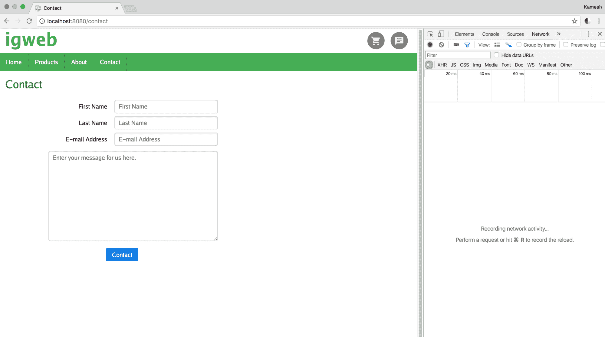

图 7.18：打开网络检查器的联系表单

首先，我们将部分填写联系表单，如*图 7.19*所示：


图 7.19：填写不正确的联系表单

点击联系按钮后，我们将在客户端触发表单验证错误，如*图 7.20*所示。请注意，当我们这样做时，无论我们点击联系按钮多少次，都不会向服务器发出网络调用：

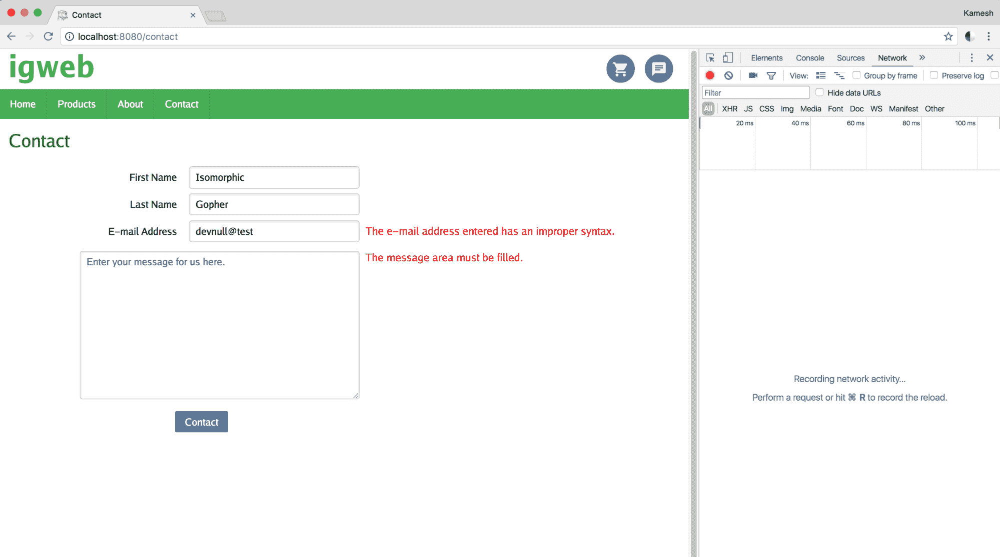

图 7.20：执行客户端验证后显示错误消息。请注意，没有向服务器发出网络调用

现在，让我们纠正联系表单中的错误（如*图 7.21*所示）并准备重新提交：


图 7.21：填写完整的联系表单，准备重新提交

重新提交表单后，我们收到确认消息，如*图 7.22*所示：

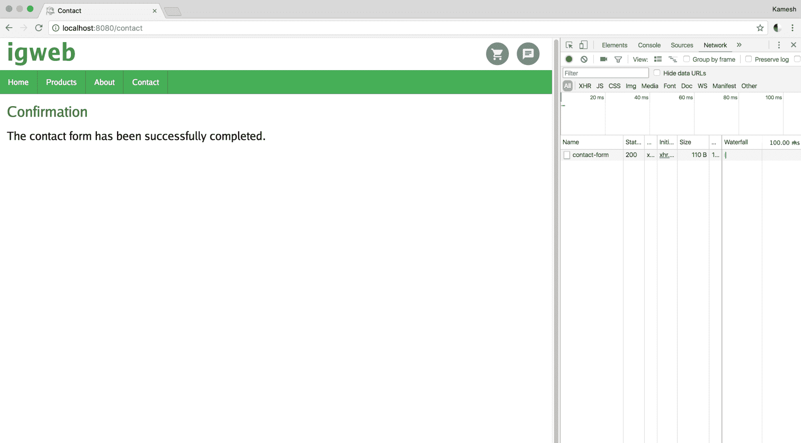

图 7.22：进行 XHR 调用，包含表单数据，并在成功的服务器端表单验证后呈现确认消息

请注意，如*图 7.23*所示，发起了一个 XHR 调用到 Web 服务器。检查调用的响应，我们可以看到从端点响应返回的空对象（`{}`）表示`errors` `map`为空，表明表单提交成功：

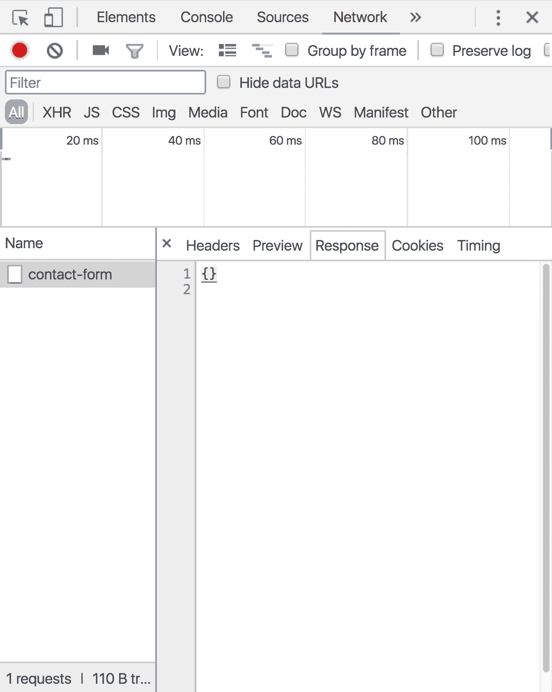

图 7.23：XHR 调用返回了一个空的错误映射，表明表单成功通过了服务器端的表单验证

现在我们已经验证了客户端验证逻辑在联系表单上的工作，我们必须强调一个重要的观点，即在接受来自客户端的数据时非常重要的一点。服务器必须始终拥有否决权，当涉及到验证用户输入的数据时。在服务器端执行的第二轮验证应该是一个强制性的步骤。让我们看看为什么我们总是需要服务器端验证。

# 篡改客户端验证结果

让我们考虑这样一种情况，即我们有一个邪恶（而且聪明）的用户，他知道如何绕过我们的客户端验证逻辑。毕竟，这是 JavaScript，在 Web 浏览器中运行。没有什么能阻止一个恶意用户将我们的客户端验证逻辑抛到脑后。为了模拟这样的篡改事件，我们只需要在`contact.go`源文件中将`clientSideValidationResult`变量的布尔值赋值为`true`。

```go
func handleContactButtonClickEvent(env *common.Env, event dom.Event, contactForm *forms.ContactForm) {

  event.PreventDefault()
  clientSideValidationResult := contactForm.Validate()

  clientSideValidationResult = true

  if clientSideValidationResult == true {

    contactFormErrorsChannel := make(chan map[string]string)
    go ContactFormSubmissionRequest(contactFormErrorsChannel, contactForm)

    go func() {

      serverContactFormErrors := <-contactFormErrorsChannel
      serverSideValidationResult := len(serverContactFormErrors) == 0

      if serverSideValidationResult == true {
        env.TemplateSet.Render("contact_confirmation_content", &isokit.RenderParams{Data: nil, Disposition: isokit.PlacementReplaceInnerContents, Element: env.PrimaryContent})
      } else {
        contactForm.SetErrors(serverContactFormErrors)
        contactForm.DisplayErrors()
      }

    }()

  } else {
    contactForm.DisplayErrors()
  }
}
```

在这一点上，我们已经绕过了客户端验证的真正结果，强制客户端网络应用程序始终通过客户端进行的联系表单验证。如果我们仅在客户端执行表单验证，这将使我们陷入非常糟糕的境地。这正是为什么我们需要在服务器端进行第二轮验证的原因。

让我们再次打开 Web 浏览器，部分填写表单，如*图 7.24*所示：

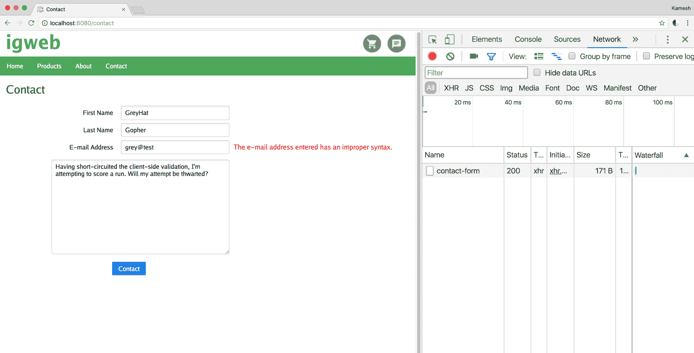

图 7.24：即使禁用了客户端表单验证，服务器端表单验证也阻止了填写不正确的联系表单被提交

请注意，这一次，当单击联系按钮时，将发起 XHR 调用到服务器端的 Rest API 端点，返回联系表单中的错误`map`，如*图 7.25*所示：

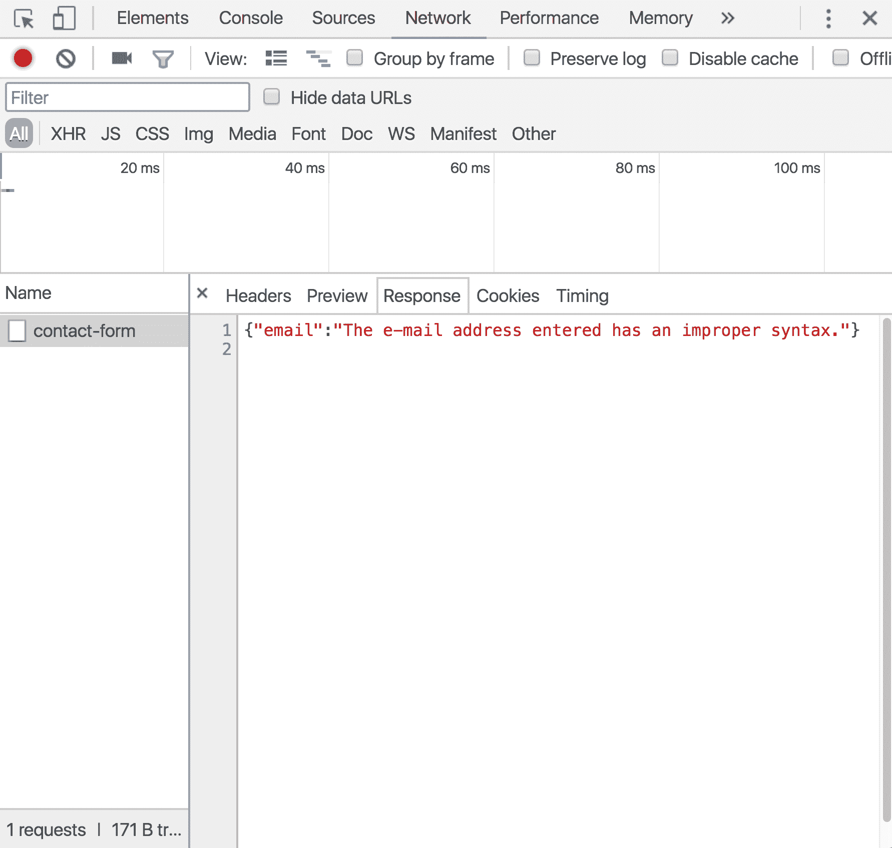

图 7.25：服务器响应中的错误映射填充了一个错误，指示电子邮件地址字段中输入的值具有不正确的语法

在服务器端执行的第二轮验证已经启动，并阻止了恶意用户能够到达本垒并得分。如果客户端验证无法正常工作，服务器端验证将捕获到不完整或格式不正确的表单字段。这是为什么您应该始终为您的网络表单实现服务器端表单验证的一个重要原因。

# 总结

在本章中，我们演示了构建一个可访问的、同构的网络表单的过程。首先，我们演示了同构网络表单在禁用 JavaScript 和启用 JavaScript 的情况下的流程。

我们向您展示了如何创建一个同构的网络表单，它具有在各种环境中共享表单代码和验证逻辑的能力。在表单包含错误的情况下，我们向您展示了如何以有意义的方式向用户显示错误。创建的同构网络表单非常健壮，并能够在 Web 浏览器中禁用 JavaScript 或 JavaScript 运行时不存在的情况下（例如 Lynx Web 浏览器），以及在启用 JavaScript 的 Web 浏览器中运行。

我们演示了使用 Lynx 网络浏览器测试可访问的同构网络表单，以验证该表单对需要更大可访问性的用户是否可用。我们还验证了即使在一个配备了 JavaScript 运行时的网络浏览器中，该表单也能正常运行，即使 JavaScript 被禁用。

在 JavaScript 启用的情况下，我们向您展示了如何在客户端验证表单并在执行客户端验证后将数据提交到 Rest API 端点。即使在方便且具有更高能力的客户端验证表单的情况下，我们强调了始终在服务器端验证表单的重要性，通过演示服务器端表单验证启动的情景，即使在潜在的情况下，客户端验证结果被篡改。

用户与联系表单之间的交互非常简单。用户必须正确填写表单才能将数据提交到服务器，最终表单数据将被处理。在下一章中，我们将超越这种简单的交互，考虑用户和网络应用程序以一种几乎类似对话的方式进行交流的情景。在第八章中，《实时网络应用功能》，我们将实现 IGWEB 的实时聊天功能，允许网站用户与聊天机器人进行简单的问答对话。
