# 实时 Web 应用功能

在上一章中，我们考虑了如何通过 Web 表单验证和处理用户生成的数据。当用户正确填写联系表单时，它成功通过了两轮验证，并且用户会收到确认消息。一旦表单被提交，工作流程就完成了。如果我们想考虑一个更有吸引力的工作流程，一个用户可以以对话的方式与服务器端应用程序进行交互的工作流程呢？

今天的 Web 与蒂姆·伯纳斯-李（Tim Berners-Lee）在 1990 年代初设计的起步阶段的 Web 大不相同。当时，Web 的重点是超链接连接的文档。客户端和服务器之间的 HTTP 事务一直意味着短暂存在。

在 21 世纪初，这种情况开始发生变化。研究人员展示了服务器如何能够与客户端保持持久连接的手段。客户端的早期原型是使用 Adobe Flash 创建的，这是当时唯一可用的技术之一，用于在 Web 服务器和 Web 客户端之间建立持久连接。

与这些早期尝试并行的是，一种效率低下的时代诞生了，即 AJAX（XHR）长轮询。客户端将继续向服务器发出调用（类似于心跳检查），并检查客户端感兴趣的某些状态是否发生了变化。服务器将返回相同的、疲惫的响应，直到客户端感兴趣的状态发生变化，然后可以将其报告给客户端。这种方法的主要低效性在于 Web 客户端和 Web 服务器之间必须进行的网络调用数量。不幸的是，AJAX 长轮询的低效做法变得如此流行，以至于今天仍被许多网站广泛使用。

实时 Web 应用功能的理念是通过几乎实时地提供信息来提供更好的用户体验。请记住，由于网络延迟和物理定律对信号的限制，没有任何通信是真正的“实时”，而是“几乎实时”。

实现实时 Web 应用功能的主要组成部分是 WebSocket，这是一种允许 Web 服务器和 Web 客户端之间进行双向通信的协议。由于 Go 具有用于网络和 Web 编程的内置功能，因此 Go 是实现实时 Web 应用程序的理想编程语言。

在本章中，我们将构建一个实时 Web 应用程序功能的实时聊天应用程序，这将允许网站用户与一个基本的聊天机器人进行对话。当用户向机器人提问时，机器人将实时回复，并且用户与机器人之间的所有通信都将通过 Web 浏览器和 Web 服务器之间的 WebSocket 连接进行。

在本章中，我们将涵盖以下主题：

+   实时聊天功能

+   实现实时聊天的服务器端功能

+   实现实时聊天的客户端功能

+   与代理进行对话

# 实时聊天功能

当今，很常见看到聊天机器人（也称为代理）为网站用户提供各种目的的服务，从决定购买什么鞋子到提供有关哪些股票适合客户投资组合的建议。我们将构建一个基本的聊天机器人，为 IGWEB 用户提供有关同构 Go 的友好提示。

一旦激活了实时聊天功能，用户可以继续访问网站的不同部分，而不会因为使用网站上的导航菜单或链接而中断与机器人的对话。在现实世界的场景中，这种功能对于产品销售和技术支持的使用场景都是一个有吸引力的选择。例如，如果用户对网站上列出的某个产品有疑问，用户可以自由浏览网站，而不必担心失去与代理人的当前聊天对话。

请记住，我们将构建的代理具有较低的智能水平。这里仅用于说明目的，并且在生产需求中应该使用更健壮的**人工智能**（**AI**）解决方案。通过本章您将获得的知识，应该可以相当轻松地用更健壮的代理的大脑替换当前的代理，以满足实时聊天功能中的特定需求。

# 设计实时聊天框

以下图是 IGWEB 顶部栏的线框设计。最右边的图标在点击时将激活实时聊天功能：

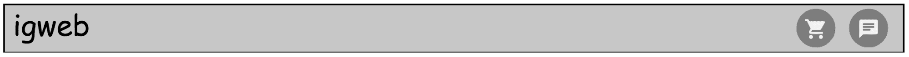

图 8.1：IGWEB 顶部栏的线框设计

以下图是实时聊天框的线框设计。聊天框包括代理人“Case”的头像图像以及其姓名和职称。关闭按钮包括在聊天框的右上角。用户可以在底部文本区域输入他们的消息，该区域具有占位文本“在此输入您的消息”。与人类和机器人的对话将显示在聊天框的中间区域：

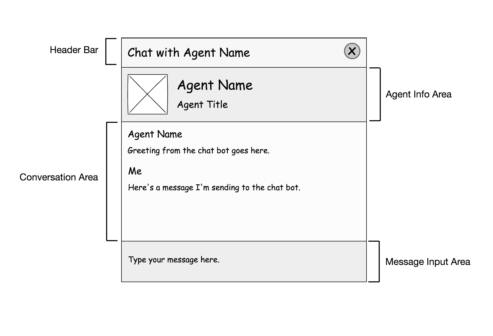

图 8.2：实时聊天框的线框设计

# 实现实时聊天框模板

为了在网站的所有部分中都有聊天框，我们需要将聊天框`div`容器放置在网页布局模板（`layouts/webpage_layout.tmpl`）中主要内容`div`容器的正下方：

```go
<!doctype html>
<html>
  {{ template "partials/header_partial" . }}

    <div id="primaryContent" class="pageContent">
      {{ template "pagecontent" . }}
    </div>

 <div id="chatboxContainer" class="containerPulse">
 </div>

  {{ template "partials/footer_partial" . }}
</html>
```

聊天框将作为`shared/templates/partials`文件夹中的`chatbox_partial.tmpl`源文件中的部分模板来实现：

```go
<div id="chatbox">
  <div id="chatboxHeaderBar" class="chatboxHeader">
    <div id="chatboxTitle" class="chatboxHeaderTitle"><span>Chat with {{.AgentName}}</span></div>
    <div id="chatboxCloseControl">X</div>
  </div>

  <div class="chatboxAgentInfo">
    <div class="chatboxAgentThumbnail"></div>
    <div class="chatboxAgentName">{{.AgentName}}</div>
    <div class="chatboxAgentTitle">{{.AgentTitle}}</div>
  </div>

  <div id="chatboxConversationContainer">

  </div>

  <div id="chatboxMsgInputContainer">
 <input type="text" id="chatboxInputField" placeholder="Type your message here...">

 </input>
  </div>

  <div class="chatboxFooter">
    <a href="http://www.isomorphicgo.org" target="_blank">Powered by Isomorphic Go</a>
  </div>
</div>
```

这是实现实时聊天框*图 8.2*中所示线框设计所需的 HTML 标记。请注意，`input`文本字段具有 id`"chatboxInputField"`。这是用户将能够输入其消息的`input`字段。创建的每条消息，无论是用户编写的消息还是机器人编写的消息，都将使用`livechatmsg_partial.tmpl`模板：

```go
<div class="chatboxMessage">
 <div class="chatSenderName">{{.Name}}</div>
 <div class="chatSenderMsg">{{.Message}}</div>
</div>
```

每条消息都在自己的`div`容器中，其中有两个`div`容器（以粗体显示），分别包含消息发送者的姓名和消息本身。

在实时聊天功能中不需要按钮，因为我们将添加一个事件侦听器来监听按下 Enter 键以通过 WebSocket 连接将用户的消息提交到服务器。

现在我们已经实现了用于呈现聊天框的 HTML 标记，让我们来检查在服务器端实现实时聊天功能所需的功能。

# 实现实时聊天的服务器端功能

当实时聊天功能激活时，我们将在 Web 客户端和 Web 服务器之间创建一个持久的 WebSocket 连接。Gorilla Web Toolkit 在其`websocket`包中提供了对 WebSocket 协议的出色实现，该包可以在[`github.com/gorilla/websocket`](http://github.com/gorilla/websocket)找到。要获取`websocket`包，可以发出以下命令：

```go
$ go get github.com/gorilla/websocket
```

Gorilla Web Toolkit 还提供了一个有用的示例 Web 聊天应用程序：

[`github.com/gorilla/websocket/tree/master/examples/chat`](https://github.com/gorilla/websocket/tree/master/examples/chat)。

我们将重新利用大猩猩的示例网络聊天应用程序，而不是重新发明轮子，以实现实时聊天功能。从网络聊天示例中需要的源文件已经复制到`chat`文件夹中。

我们需要进行三个重大改变，以利用大猩猩提供的示例聊天应用程序实现实时聊天功能：

+   聊天机器人（代理）的回复应该针对特定用户，而不是发送给所有连接的用户

+   我们需要创建功能，允许聊天机器人向用户发送消息

+   我们需要在 Go 中实现聊天应用程序的前端部分

让我们更详细地考虑这三点。

首先，大猩猩的网络聊天示例是一个自由聊天室。任何用户都可以进来，输入消息，所有连接到聊天服务器的其他用户都能看到消息。实时聊天功能的一个主要要求是，聊天机器人和人之间的每次对话都应该是独占的。代理的回复必须针对特定用户，而不是所有连接的用户。

其次，大猩猩网络工具包中的示例网络聊天应用程序不会向用户发送任何消息。这就是自定义聊天机器人出现的地方。代理将直接通过已建立的 WebSocket 连接与用户通信。

第三，示例网络聊天应用程序的前端部分是作为包含内联 CSS 和 JavaScript 的 HTML 文档实现的。正如你可能已经猜到的那样，我们将在 Go 中实现实时聊天功能的前端部分，代码将驻留在`client/chat`文件夹中。

既然我们已经制定了使用大猩猩网络聊天示例作为起点来实现实时聊天功能的行动计划，让我们开始实施吧。

我们将创建的修改后的网络聊天应用程序包含两种主要类型：`Hub`和`Client`。

# 中心类型

聊天中心负责维护客户端连接列表，并指示聊天机器人向相关客户端广播消息。例如，如果 Alice 问了“什么是同构 Go?*”，聊天机器人的答案应该发给 Alice，而不是 Bob（他可能还没有问问题）。

`Hub`结构如下：

```go
type Hub struct {
  chatbot bot.Bot
  clients map[*Client]bool
  broadcastmsg chan *ClientMessage
  register chan *Client
  unregister chan *Client
}
```

`chatbot`是一个实现`Bot`接口的聊天机器人（代理）。这是将回答从客户端收到的问题的大脑。

`clients`映射用于注册客户端。存储在`map`中的键值对包括键，指向`Client`实例的指针，值包括一个布尔值，设置为`true`，表示客户端已连接。客户端通过`broadcastmsg`、`register`和`unregister`通道与中心通信。`register`通道向中心注册客户端。`unregister`通道向中心注销客户端。客户端通过`broadcastmsg`通道发送用户输入的消息，这是一个`ClientMessage`类型的通道。这是我们引入的`ClientMessage`结构：

```go
type ClientMessage struct {
  client *Client
  message []byte
}
```

为了实现我们之前提出的第一个重大变化，即代理和用户之间的对话的独占性，我们使用`ClientMessage`结构来存储`Client`实例的指针，以及用户的消息本身（一个`byte`切片）。

构造函数`NewHub`接受实现`Bot`接口的`chatbot`，并返回一个新的`Hub`实例：

```go
func NewHub(chatbot bot.Bot) *Hub {
  return &Hub{
    chatbot: chatbot,
    broadcastmsg: make(chan *ClientMessage),
    register: make(chan *Client),
    unregister: make(chan *Client),
    clients: make(map[*Client]bool),
  }
}
```

我们实现了一个导出的获取方法`ChatBot`，以便从`Hub`对象中访问`chatbot`：

```go
func (h *Hub) ChatBot() bot.Bot {
  return h.chatbot
}
```

当我们实现一个 Rest API 端点来将机器人的详细信息（名称、标题和头像图像）发送给客户端时，这个行动将是重要的。

`SendMessage`方法负责向特定客户端广播消息：

```go
func (h *Hub) SendMessage(client *Client, message []byte) {
  client.send <- message
}
```

该方法接受一个指向`Client`的指针和`message`，这是应该发送给特定客户端的`byte`切片。消息将通过客户端的`send`通道发送。

调用`Run`方法启动聊天 hub：

```go
func (h *Hub) Run() {
  for {
    select {
    case client := <-h.register:
      h.clients[client] = true
      greeting := h.chatbot.Greeting()
      h.SendMessage(client, []byte(greeting))

    case client := <-h.unregister:
      if _, ok := h.clients[client]; ok {
        delete(h.clients, client)
        close(client.send)
      }
    case clientmsg := <-h.broadcastmsg:
      client := clientmsg.client
      reply := h.chatbot.Reply(string(clientmsg.message))
      h.SendMessage(client, []byte(reply))
    }
  }
}
```

我们在`for`循环内使用`select`语句等待多个客户端操作。

如果通过 hub 的`register`通道传入了一个`Client`的指针，hub 将通过将`client`指针（作为键）添加到客户端`map`中并为其设置一个值为`true`来注册新客户端。我们将调用`chatbot`的`Greeting`方法获取要返回给客户端的`greeting`消息。一旦我们得到了问候语（字符串值），我们调用`SendMessage`方法，传入`client`和转换为`byte`切片的`greeting`。

如果通过 hub 的`unregister`通道传入了一个`Client`的指针，hub 将删除给定`client`的`map`中的条目，并关闭客户端的`send`通道，这表示该`client`不会再向服务器发送任何消息。

如果通过 hub 的`broadcastmsg`通道传入了一个`ClientMessage`的指针，hub 将把客户端的`message`（作为字符串值）传递给`chatbot`对象的`Reply`方法。一旦我们得到了来自代理的`reply`（字符串值），我们调用`SendMessage`方法，传入`client`和转换为`byte`切片的`reply`。

# 客户端类型

`Client`类型充当`Hub`和`websocket`连接之间的代理。

以下是`Client`结构的样子：

```go
type Client struct {
  hub *Hub
  conn *websocket.Conn
  send chan []byte
}
```

每个`Client`值都包含指向`Hub`的指针，指向`websocket`连接的指针以及用于出站消息的缓冲通道`send`。

`readPump`方法负责将通过`websocket`连接传入的入站消息中继到 hub：

```go
func (c *Client) readPump() {
  defer func() {
    c.hub.unregister <- c
    c.conn.Close()
  }()
  c.conn.SetReadLimit(maxMessageSize)
  c.conn.SetReadDeadline(time.Now().Add(pongWait))
  c.conn.SetPongHandler(func(string) error { c.conn.SetReadDeadline(time.Now().Add(pongWait)); return nil })
  for {
    _, message, err := c.conn.ReadMessage()
    if err != nil {
      if websocket.IsUnexpectedCloseError(err, websocket.CloseGoingAway) {
        log.Printf("error: %v", err)
      }
      break
    }
    message = bytes.TrimSpace(bytes.Replace(message, newline, space, -1))
    // c.hub.broadcast <- message

    clientmsg := &ClientMessage{client: c, message: message}
 c.hub.broadcastmsg <- clientmsg

  }
}
```

我们不得不对这个函数进行轻微的更改，以满足实时聊天功能的要求。在 Gorilla Web 聊天示例中，仅仅是将消息中继到`Hub`。由于我们正在将聊天机器人的响应发送回发送它们的客户端，我们不仅需要将消息发送到 hub，还需要将发送消息的客户端也发送到 hub。我们通过创建一个`ClientMessage`结构来实现这一点：

```go
type ClientMessage struct {
  client *Client
  message []byte
}
```

`ClientMessage`结构包含字段，用于保存客户端的指针以及`message`，一个`byte`切片。

回到`client.go`源文件中的`readPump`函数，以下两行对于`Hub`知道哪个客户端发送了消息至关重要。

```go
    clientmsg := &ClientMessage{client: c, message: message}
    c.hub.broadcastmsg <- clientmsg
```

`writePump`方法负责从客户端的`send`通道中中继出站消息到`websocket`连接：

```go
func (c *Client) writePump() {
  ticker := time.NewTicker(pingPeriod)
  defer func() {
    ticker.Stop()
    c.conn.Close()
  }()
  for {
    select {
    case message, ok := <-c.send:
      c.conn.SetWriteDeadline(time.Now().Add(writeWait))
      if !ok {
        // The hub closed the channel.
        c.conn.WriteMessage(websocket.CloseMessage, []byte{})
        return
      }

      w, err := c.conn.NextWriter(websocket.TextMessage)
      if err != nil {
        return
      }
      w.Write(message)

      // Add queued chat messages to the current websocket message.
      n := len(c.send)
      for i := 0; i < n; i++ {
        w.Write(newline)
        w.Write(<-c.send)
      }

      if err := w.Close(); err != nil {
        return
      }
    case <-ticker.C:
      c.conn.SetWriteDeadline(time.Now().Add(writeWait))
      if err := c.conn.WriteMessage(websocket.PingMessage, []byte{}); err != nil {
        return
      }
    }
  }
}
```

`ServeWS`方法旨在由 Web 应用程序注册为 HTTP 处理程序：

```go
func ServeWs(hub *Hub) http.Handler {
  return http.HandlerFunc(func(w http.ResponseWriter, r *http.Request) {
    conn, err := upgrader.Upgrade(w, r, nil)
    if err != nil {
      log.Println(err)
      return
    }
    client := &Client{hub: hub, conn: conn, send: make(chan []byte, 256)}
    client.hub.register <- client
    go client.writePump()
    client.readPump()
  })
}
```

该方法执行两个重要任务。该方法将普通的 HTTP 连接升级为`websocket`连接，并将客户端注册到 hub。

现在我们已经为我们的 Web 聊天服务器设置了代码，是时候在我们的 Web 应用程序中激活它了。

# 激活聊天服务器

在`igweb.go`源文件中，我们包含了一个名为`startChatHub`的函数，它负责启动`Hub`：

```go
func startChatHub(hub *chat.Hub) {
  go hub.Run()
}
```

我们在`main`函数中添加以下代码来创建一个新的 chatbot，将其与`Hub`关联并启动`Hub`：

```go
  chatbot := bot.NewAgentCase()
  hub := chat.NewHub(chatbot)
  startChatHub(hub)
```

当我们调用`registerRoutes`函数为服务器端 Web 应用程序注册所有路由时，请注意我们还向函数传递了`hub`值：

```go
  r := mux.NewRouter()
  registerRoutes(&env, r, hub)
```

在`registerRoutes`函数中，我们需要`hub`来为返回代理信息的 Rest API 端点注册路由处理程序：

```go
r.Handle("/restapi/get-agent-info", endpoints.GetAgentInfoEndpoint(env, hub.ChatBot()))
```

我们将在*向客户端公开代理信息*部分介绍这个端点。

`hub`还用于注册 WebSocket 路由`/ws`的路由处理程序。我们注册`ServeWS`处理程序函数，传入`hub`：

```go
  r.Handle("/ws", chat.ServeWs(hub))
```

现在我们已经准备好激活聊天服务器，是时候专注于实时聊天功能的明星——聊天代理了。

# 代理的大脑

我们将用于实现实时聊天功能的聊天机器人类型`AgentCase`将实现以下`Bot 接口`：

```go
type Bot interface {
  Greeting() string
  Reply(string) string
  Name() string
  Title() string
  ThumbnailPath() string
  SetName(string)
  SetTitle(string)
  SetThumbnailPath(string)
}
```

`Greeting`方法将用于向用户发送初始问候，诱使他们与聊天机器人互动。

`Reply`方法接受一个问题（字符串），并返回给定问题的回复（也是一个字符串）。

其余实现的方法纯粹是出于心理原因，让人类产生与某人交流而不是某物的错觉。

`Name`方法是一个 getter 方法，返回聊天机器人的名称。

`Title`方法是一个 getter 方法，返回聊天机器人的标题。

`ThumbnailPath`方法是一个 getter 方法，返回聊天机器人的头像图像的路径。

每个 getter 方法都有一个对应的 setter 方法：`SetName`、`SetTitle`和`SetThumbnailPath`。

通过定义`Bot`接口，我们清楚地说明了聊天机器人的期望。这使我们能够在将来使聊天机器人解决方案具有可扩展性。例如，`Case`展示的智能可能过于基础和限制。在不久的将来，我们可能希望实现一个名为 Molly 的机器人，其智能可能使用更强大的算法实现。只要 Molly 聊天机器人实现了`Bot`接口，新的聊天机器人就可以轻松地插入到我们的 Web 应用程序中。

实际上，从服务器端 Web 应用程序的角度来看，这只是一行代码的更改。我们将实例化一个`AgentMolly`实例，而不是实例化一个`AgentCase`实例。除了智能上的差异，新的聊天机器人 Molly 将具有自己的名称、标题和头像图像，因此人类可以将其与`Case`区分开来。

以下是`AgentCase`结构：

```go
type AgentCase struct {
 Bot
 name string
 title string
 thumbnailPath string
 knowledgeBase map[string]string
 knowledgeCorpus []string
 sampleQuestions []string
}
```

我们已经将`Bot`接口嵌入到`struct`定义中，表明`AgentCase`类型将实现`Bot`接口。`name`字段是代理的名称。`title`字段是代理的标题。`thumbnailPath`字段用于指定聊天机器人头像图像的路径。

`knowledgeBase`字段是`map`类型的`map[string]string`。这本质上是代理的大脑。`map`中的键是特定问题中发现的常见术语。`map`中的值是问题的答案。

`knowledgeCorpus`字段是一个字符串`byte`切片，是机器人可能被问到的问题中存在的术语的知识语料库。我们使用`knowledgeBase`映射的键来构建`knowledgeCorpus`。语料库是用于进行语言分析的文本集合。在我们的情况下，我们将根据人类用户提供给机器人的问题（查询）进行语言分析。

`sampleQuestions`字段是一个字符串`byte`切片，其中包含用户可能向聊天机器人提出的示例问题列表。聊天机器人在问候用户时将向用户提供一个示例问题，以诱使人类用户进行对话。人类用户可以根据自己的喜好自由地改写示例问题或提出完全不同的问题。

`initializeIntelligence`方法用于初始化 Case 的大脑：

```go
func (a *AgentCase) initializeIntelligence() {

  a.knowledgeBase = map[string]string{
    "isomorphic go isomorphic go web applications": "Isomorphic Go is the methodology to create isomorphic web applications using the Go (Golang) programming language. An isomorphic web application, is a web application, that contains code which can run, on both the web client and the web server.",
    "kick recompile code restart web server instance instant kickstart lightweight mechanism": "Kick is a lightweight mechanism to provide an instant kickstart to a Go web server instance, upon the modification of a Go source file within a particular project directory (including any subdirectories). An instant kickstart consists of a recompilation of the Go code and a restart of the web server instance. Kick comes with the ability to take both the go and gopherjs commands into consideration when performing the instant kickstart. This makes it a really handy tool for isomorphic golang projects.",
    "starter code starter kit": "The isogoapp, is a basic, barebones web app, intended to be used as a starting point for developing an Isomorphic Go application. Here's the link to the github page: https://github.com/isomorphicgo/isogoapp",
    "lack intelligence idiot stupid dumb dummy don't know anything": "Please don't question my intelligence, it's artificial after all!",
    "find talk topic presentation lecture subject": "Watch the Isomorphic Go talk by Kamesh Balasubramanian at GopherCon India: https://youtu.be/zrsuxZEoTcs",
    "benefits of the technology significance of the technology importance of the technology": "Here are some benefits of Isomorphic Go: Unlike JavaScript, Go provides type safety, allowing us to find and eliminate many bugs at compile time itself. Eliminates mental context-shifts between back-end and front-end coding. Page loading prompts are not necessary.",
    "perform routing web app register routes define routes": "You can implement client-side routing in your web application using the isokit Router preventing the dreaded full page reload.",
    "render templates perform template rendering": "Use template sets, a set of project templates that are persisted in memory and are available on both the server-side and the client-side",
    "cogs reusable components react-like react": "Cogs are reuseable components in an Isomorphic Go web application.",
  }

  a.knowledgeCorpus = make([]string, 1)
  for k, _ := range a.knowledgeBase {
    a.knowledgeCorpus = append(a.knowledgeCorpus, k)
  }

  a.sampleQuestions = []string{"What is isomorphic go?", "What are the benefits of this technology?", "Does isomorphic go offer anything react-like?", "How can I recompile code instantly?", "How can I perform routing in my web app?", "Where can I get starter code?", "Where can I find a talk on this topic?"}

}
```

在这个方法中有三个重要的任务：

+   首先，我们设置 Case 的知识库。

+   其次，我们设置 Case 的知识语料库。

+   第三，我们设置 Case 将在问候人类用户时使用的示例问题。

我们必须处理的第一个任务是设置 Case 的知识库。这包括设置`AgentCase`实例的`knowledgeBase`属性。如前所述，`map`中的键指的是问题中的术语，`map`中的值是问题的答案。例如，`"同构 go 同构 go web 应用程序"`键可以处理以下问题：

+   什么是同构 Go？

+   你能告诉我关于同构 Go 的情况吗？

它还可以处理不是问题的陈述：

+   介绍一下同构 Go

+   给我一个关于同构 Go 的概述

由于`knowledgeBase`映射的地图文字声明中包含大量文本，我建议您在计算机上查看源文件`agentcase.go`。

我们必须处理的第二个任务是设置 Case 的语料库，这是用于针对用户问题进行语言分析的文本集合。语料库是从`knowledgeBase`映射的键构造的。我们将`AgentCase`实例的`knowledgeCorpus`字段属性设置为使用内置的`make`函数创建的新的字符串`byte`切片。使用`for`循环，我们遍历`knowledgeBase map`中的所有条目，并将每个键附加到`knowledgeCorpus`字段切片中。

我们必须处理的第三个也是最后一个任务是设置`Case`将呈现给人类用户的示例问题。我们简单地填充`AgentCase`实例的`sampleQuestions`属性。我们使用字符串文字声明来填充包含在字符串`byte`切片中的所有示例问题。

这是`AgentCase`类型的 getter 和 setter 方法：

```go
func (a *AgentCase) Name() string {
  return a.name
}

func (a *AgentCase) Title() string {
  return a.title
}

func (a *AgentCase) ThumbnailPath() string {
  return a.thumbnailPath
}

func (a *AgentCase) SetName(name string) {
  a.name = name
}

func (a *AgentCase) SetTitle(title string) {
  a.title = title
}

func (a *AgentCase) SetThumbnailPath(thumbnailPath string) {
  a.thumbnailPath = thumbnailPath
}
```

这些方法用于获取和设置`AgentCase`对象的`name`，`title`和`thumbnailPath`字段。

这是用于创建新的`AgentCase`实例的构造函数：

```go
func NewAgentCase() *AgentCase {
  agentCase := &AgentCase{name: "Case", title: "Resident Isomorphic Gopher Agent", thumbnailPath: "/static/images/chat/Case.png"}
  agentCase.initializeIntelligence()
  return agentCase
}
```

我们声明并初始化`agentCase`变量为一个新的`AgentCase`实例，设置`name`，`title`和`thumbnailPath`字段。然后我们调用`initializeIntelligence`方法来初始化 Case 的大脑。最后，我们返回新创建和初始化的`AgentCase`实例。

# 问候人类

`Greeting`方法用于在激活实时聊天功能时向用户提供首次问候：

```go
func (a *AgentCase) Greeting() string {

  sampleQuestionIndex := randomNumber(0, len(a.sampleQuestions))
  greeting := "Hi there! I'm Case. You can ask me a question on Isomorphic Go. Such as...\"" + a.sampleQuestions[sampleQuestionIndex] + "\""
  return greeting

}
```

由于问候将包括一个可以问 Case 的随机选择的示例问题，因此调用`randomNumber`函数来获取示例问题的索引号。我们将最小值和最大值传递给`randomNumber`函数，以指定生成的随机数应该在的范围内。

这是`randomNumber`函数用于生成给定范围内的随机数：

```go
func randomNumber(min, max int) int {
  rand.Seed(time.Now().UTC().UnixNano())
  return min + rand.Intn(max-min)
}
```

回到`Greeting`方法，我们使用随机索引从`sampleQuestions`字符串切片中检索示例问题。然后我们将示例问题分配给`greeting`变量并返回`greeting`。

# 回答人类的问题

现在我们已经初始化了聊天机器人的智能，并准备好迎接人类用户，是时候指导聊天机器人如何思考用户的问题，以便聊天机器人可以提供明智的回答了。

聊天机器人将发送给人类用户的回复仅限于`AgentCase`结构的`knowledgeBase`映射中的值。如果人类用户问的问题超出了聊天机器人所知道的范围（知识语料库），它将简单地回复消息“我不知道答案。”

为了分析用户的问题并为其提供最佳回复，我们将使用`nlp`包，其中包含一系列可用于基本自然语言处理的机器学习算法。

您可以通过发出以下`go get`命令来安装`nlp`包：

```go
$ go get github.com/james-bowman/nlp
```

让我们逐步了解`Reply`方法，从方法声明开始：

```go
func (a *AgentCase) Reply(query string) string {
```

该函数接收一个问题字符串，并返回给定问题的答案字符串。

我们声明`result`变量，表示用户问题的答案：

```go
  var result string
```

`result`变量将由`Reply`方法返回。

使用`nlp`包，我们创建一个新的`vectoriser`和一个新的`transformer`：

```go
  vectoriser := nlp.NewCountVectoriser(true)
  transformer := nlp.NewTfidfTransformer()
```

**`vectoriser`**将用于将知识语料库中的查询术语编码为术语文档矩阵，其中每列代表语料库中的一个文档，每行代表一个术语。它用于跟踪在特定文档中找到的术语的频率。对于我们的使用场景，您可以将文档视为在`knowledgeCorpus`字符串切片中找到的唯一条目。

`transformer`将用于消除`knowledgeCorpus`中频繁出现术语的偏差。例如，`knowledgeCorpus`中重复出现的单词，如*the*、*and*和*web*，将具有较小的权重。转换器是**TFIDF（词频逆文档频率）**转换器。

然后我们继续创建`reducer`，这是一个新的`TruncatedSVD`实例：

```go
  reducer := nlp.NewTruncatedSVD(4)
```

我们刚刚声明的`reducer`很重要，因为我们将执行**潜在语义分析**（**LSA**），也称为**潜在语义索引**（**LSI**），以搜索和检索与用户查询术语相匹配的正确文档。LSA 帮助我们根据术语的共现来找到语料库中存在的语义属性。它假设频繁一起出现的单词必须具有一定的语义关系。

`reducer`用于查找可能隐藏在文档特征向量中的术语频率下的语义含义。

以下代码是一个将语料库转换为潜在语义索引的管道，该索引适合于文档的模型：

```go
  matrix, _ := vectoriser.FitTransform(a.knowledgeCorpus...)
  matrix, _ = transformer.FitTransform(matrix)
  lsi, _ := reducer.FitTransform(matrix)
```

我们必须通过相同的管道运行用户的查询，以便它在相同的维度空间中被投影：

```go
  matrix, _ = vectoriser.Transform(query)
  matrix, _ = transformer.Transform(matrix)
  queryVector, _ := reducer.Transform(matrix)
```

现在我们已经准备好了`lsi`和`queryVector`，是时候找到最匹配查询术语的文档了。我们通过计算我们语料库中每个文档与查询的余弦相似度来实现这一点：

```go
  highestSimilarity := -1.0
  var matched int
  _, docs := lsi.Dims()
  for i := 0; i < docs; i++ {
    similarity := nlp.CosineSimilarity(queryVector.(mat.ColViewer).ColView(0), lsi.(mat.ColViewer).ColView(i))
    if similarity > highestSimilarity {
      matched = i
      highestSimilarity = similarity
    }
  }
```

**余弦相似度**计算两个数值向量之间的角度差异。

与用户查询具有最高相似度的语料库中的文档将被匹配为最能反映用户问题的最佳文档。余弦相似度的可能值可以在 0 到 1 的范围内。0 值表示完全正交，1 值表示完全匹配。余弦相似度值也可以是**NaN（不是数字）**值。NaN 值表明根本没有匹配。

如果没有找到匹配，`highestSimilarity`值将为`-1`；否则，它将是 0 到 1 之间的值：

```go
  if highestSimilarity == -1 {
    result = "I don't know the answer to that one."
  } else {
    result = a.knowledgeBase[a.knowledgeCorpus[matched]]
  }

  return result
```

在`if`条件块中，我们检查`highestSimilarity`值是否为`-1`；如果是，用户的答案将是`"I don't know the answer to that one."`。

如果我们到达`else`块，表示`highestSimilarity`是 0 到 1 之间的值，表示找到了匹配。回想一下，我们`knowledgeCorpus`中的文档在`knowledgeBase` `map`中有对应的键。用户问题的答案是`knowledgeBase` `map`中提供的键的值，我们将`result`字符串设置为这个值。在方法的最后一行代码中，我们返回`result`变量。

实现聊天机器人智能的逻辑是受到 James Bowman 的文章《在 Go 中使用机器学习进行网页的语义分析》的启发（[`www.jamesbowman.me/post/semantic-analysis-of-webpages-with-machine-learning-in-go/`](http://www.jamesbowman.me/post/semantic-analysis-of-webpages-with-machine-learning-in-go/)）。

# 向客户端公开代理的信息

现在我们已经实现了聊天代理`AgentCase`，我们需要一种方法将 Case 的信息暴露给客户端，特别是其名称、标题和头像图像的路径。

我们创建一个新的 Rest API 端点`GetAgentInfoEndpoint`，以向客户端 Web 应用程序公开聊天代理的信息：

```go
func GetAgentInfoEndpoint(env *common.Env, chatbot bot.Bot) http.Handler {
  return http.HandlerFunc(func(w http.ResponseWriter, r *http.Request) {

    m := make(map[string]string)
    m["AgentName"] = chatbot.Name()
    m["AgentTitle"] = chatbot.Title()
    m["AgentThumbImagePath"] = chatbot.ThumbnailPath()
    w.Header().Set("Content-Type", "application/json")
    json.NewEncoder(w).Encode(m)
  })
```

请注意，在`GetAgentInfoEndpoint`函数的签名中，我们接受`env`对象和`chatbot`对象。请注意，`chatbot`是`bot.Bot`类型的接口类型，而不是`AgentCase`类型。这使我们能够轻松地在将来将另一个机器人（例如`AgentMolly`）替换为`AgentCase`。

我们简单地创建一个`map[string]string`类型的映射`m`，其中包含机器人的姓名、职称和头像路径。我们设置一个标头以指示服务器响应将以 JSON 格式返回。最后，我们使用`http.ResponseWriter` `w`编写 JSON 编码的`map`。

# 实现实时聊天的客户端功能

现在我们已经介绍了实现聊天机器人所需的服务器端功能，是时候从客户端 Web 应用程序的角度关注实时聊天功能了。

在`InitialPageLayoutControls`函数内，我们在顶部栏中的实时聊天图标上添加了一个`click`事件的`event`监听器：

```go
  liveChatIcon := env.Document.GetElementByID("liveChatIcon").(*dom.HTMLImageElement)
  liveChatIcon.AddEventListener("click", false, func(event dom.Event) {

    chatbox := env.Document.GetElementByID("chatbox")
    if chatbox != nil {
      return
    }
    go chat.StartLiveChat(env)
  })
```

如果实时聊天功能已经激活，则`chatbox` div 元素将已经存在，即它将是一个非 nil 值。在这种情况下，我们从函数中返回。

然而，在实时聊天功能尚未激活的情况下，我们将调用位于`chat`包中的`StartLiveChat`函数作为 goroutine，传入`env`对象。调用此函数将激活实时聊天功能。

# 创建实时聊天客户端

我们将使用`gopherjs/websocket/websocketjs`包来创建一个 WebSocket 连接，该连接将用于连接到 Web 服务器实例。

您可以使用以下`go get`命令安装此包：

```go
$ go get -u github.com/gopherjs/websocket
```

实时聊天功能的客户端实现可以在`client/chat/chat.go`源文件中找到。我们定义了类型为`websocketjs.WebSocket`的`ws`变量和类型为`map[string]string`的`agentInfo`变量：

```go
var ws *websocketjs.WebSocket
var agentInfo map[string]string
```

我们还声明了一个代表 Enter 键的键码的常量：

```go
const ENTERKEY int = 13
```

`GetAgentInfoRequest`函数用于从`/restapi/get-agent-info`端点获取代理信息：

```go
func GetAgentInfoRequest(agentInfoChannel chan map[string]string) {
  data, err := xhr.Send("GET", "/restapi/get-agent-info", nil)
  if err != nil {
    println("Encountered error: ", err)
  }
  var agentInfo map[string]string
  json.NewDecoder(strings.NewReader(string(data))).Decode(&agentInfo)
  agentInfoChannel <- agentInfo
}
```

一旦我们从服务器检索到 JSON 编码的数据，我们将其解码为`map[string]string`类型的`map`。然后我们通过通道`agentInfoChannel`发送`agentInfo map`。

`getServerPort`函数是一个辅助函数，用于获取服务器运行的端口：

```go
func getServerPort(env *common.Env) string {

  if env.Location.Port != "" {
    return env.Location.Port
  }

  if env.Location.Protocol == "https" {
    return "443"
  } else {
    return "80"
  }

}
```

此函数用于在`StartLiveChat`函数内构造`serverEndpoint`字符串变量，该变量表示我们将要建立 WebSocket 连接的服务器端点。

当用户点击顶部栏中的实时聊天图标时，`StartLiveChat`函数将作为 goroutine 被调用：

```go
func StartLiveChat(env *common.Env) {

  agentInfoChannel := make(chan map[string]string)
  go GetAgentInfoRequest(agentInfoChannel)
  agentInfo = <-agentInfoChannel
```

首先，我们通过调用`GetAgentInfoRequest`函数作为一个 goroutine 来获取代理的信息。代理的信息将作为`map[string]string`类型的映射通过`agentInfoChannel`通道发送。`agentInfo` `map`将被用作传递给`partials/chatbox_partial`模板以显示代理的详细信息（姓名、职称和头像）的数据对象。

然后，我们继续创建一个新的 WebSocket 连接并连接到服务器端点：

```go
  var err error
  serverEndpoint := "ws://" + env.Location.Hostname + ":" + getServerPort(env) + "/ws"
  ws, err = websocketjs.New(serverEndpoint)
  if err != nil {
    println("Encountered error when attempting to connect to the websocket: ", err)
  }
```

我们使用辅助函数`getServerPort`来获取服务器运行的端口。服务器端口值用于构造`serverEndpoint`字符串变量，该变量表示我们将连接到的服务器端点的 WebSocket 地址。

我们使用`env.Document`对象的`GetElementByID`方法来获取聊天容器`div`元素，通过提供 ID 为`"chatboxContainer"`。我们还添加了 CSS 动画样式，使聊天框容器在聊天机器人可以回答问题时产生戏剧性的脉动效果：

```go
  chatContainer := env.Document.GetElementByID("chatboxContainer").(*dom.HTMLDivElement)
  chatContainer.SetClass("containerPulse")

  env.TemplateSet.Render("partials/chatbox_partial", &isokit.RenderParams{Data: agentInfo, Disposition: isokit.PlacementReplaceInnerContents, Element: chatContainer})
```

我们调用模板集对象的`Render`方法，渲染`"partials/chatbox_partial"`模板并提供模板渲染参数。我们指定要提供给模板的数据对象将是`agentInfo`映射。我们指定渲染的方式应该是用渲染模板输出替换相关元素的内部 HTML 内容。最后，我们指定要渲染到的相关元素是`chatContainer`元素。

当实时聊天功能可用且与服务器的 WebSocket 连接已连接时，聊天框标题栏，包含聊天框标题的条纹，`chatboxHeaderBar`，将被着绿色。如果 WebSocket 连接已断开或出现错误，则条纹将被着红色。默认情况下，当我们将`chatboxHeaderBar`的默认 CSS 类设置为`"chatboxHeader"`时，条纹将被着绿色：

```go
  chatboxHeaderBar := env.Document.GetElementByID("chatboxHeaderBar").(*dom.HTMLDivElement)
  chatboxHeaderBar.SetClass("chatboxHeader")
```

# 初始化事件监听器

最后，我们调用`InitializeChatEventHandlers`函数，传入`env`对象，初始化实时聊天功能的事件处理程序：

```go
  InitializeChatEventHandlers(env)
```

`InitializeChatEventHandlers`函数负责设置实时聊天功能所需的所有事件监听器。有两个需要用户交互的控件。第一个是消息`input`字段，用户通过按下 Enter 键输入并发送问题。第二个是关闭按钮，即 X，位于聊天框右上角，用于关闭实时聊天功能。

为了处理用户与消息`input`字段的交互，我们设置了`keypress`事件监听器，它将检测消息`input`文本字段内的`keypress`事件：

```go
func InitializeChatEventHandlers(env *common.Env) {

  msgInput := env.Document.GetElementByID("chatboxInputField").(*dom.HTMLInputElement)
  msgInput.AddEventListener("keypress", false, func(event dom.Event) {
    if event.Underlying().Get("keyCode").Int() == ENTERKEY {
      event.PreventDefault()
      go ChatSendMessage(env, msgInput.Value)
      msgInput.Value = ""
    }

  })
```

我们通过在`env.Document`对象上调用`GetElementByID`方法获取`input`消息文本字段元素。然后我们为该元素附加了一个`keypress`事件监听器函数。如果用户按下的键是 Enter 键，我们将阻止`keypress`事件的默认行为，并调用`ChatSendMessage`函数，作为一个 goroutine，传入`env`对象和`msgInput`元素的`Value`属性。最后，我们通过将消息输入字段的`Value`属性设置为空字符串值来清除文本。

# 关闭聊天控件

为了处理用户点击 X 控件关闭实时聊天功能时的交互，我们设置了一个事件监听器来处理关闭控件的点击事件：

```go
  closeControl := env.Document.GetElementByID("chatboxCloseControl").(*dom.HTMLDivElement)
  closeControl.AddEventListener("click", false, func(event dom.Event) {
    CloseChat(env)
  })
```

我们通过在`env.Document`对象上调用`GetElementByID`方法，指定 ID 为`"chatboxCloseControl"`，获取代表关闭控件的`div`元素。我们在`click`事件上为关闭控件附加一个事件监听器，该事件监听器将调用`CloseChat`函数。

# 为 WebSocket 对象设置事件监听器

现在我们已经为用户交互设置了事件监听器，我们必须在 WebSocket 对象`ws`上设置事件监听器。我们首先在`message`事件上添加一个事件监听器：

```go
  ws.AddEventListener("message", false, func(ev *js.Object) {
    go HandleOnMessage(env, ev)
  })
```

当 WebSocket 连接上有新消息时，将触发`message`事件监听器。这表明代理向用户发送消息。在这种情况下，我们调用`HandleOnMessage`函数，将`env`对象和事件对象`ev`传递给函数。

WebSocket 对象中我们需要监听的另一个事件是`close`事件。这个事件可能会在正常操作场景下触发，比如用户使用关闭控件关闭实时聊天功能。这个事件也可能在异常操作场景下触发，比如 Web 服务器实例突然宕机，中断 WebSocket 连接。我们的代码必须足够智能，只在异常连接关闭的情况下触发：

```go
  ws.AddEventListener("close", false, func(ev *js.Object) {6

    chatboxContainer := env.Document.GetElementByID("chatboxContainer").(*dom.HTMLDivElement)
    if len(chatboxContainer.ChildNodes()) > 0 {
      go HandleDisconnection(env)
    }
  })
```

我们首先获取聊天框容器`div`元素。如果聊天框容器中的子节点数量大于零，则意味着在用户使用实时聊天功能时连接异常关闭，我们必须调用`HandleDisconnection`函数，作为一个 goroutine，将`env`对象传递给该函数。

可能会有一些情况，关闭事件不会触发，比如当我们失去互联网连接时。WebSocket 连接正在通信的 TCP 连接可能仍然被视为活动的，即使互联网连接已经断开。为了使我们的实时聊天功能能够处理这种情况，我们需要监听`env.Window`对象的`offline`事件，当网络连接丢失时会触发该事件：

```go
  env.Window.AddEventListener("offline", false, func(event dom.Event) {
    go HandleDisconnection(env)
  })

}
```

我们执行与之前处理此事件相同的操作。我们调用`HandleDisconnection`函数，作为一个 goroutine，将`env`对象传递给该函数。请注意，最后的闭括号`}`表示`InitializeChatEventHandlers`函数的结束。

现在我们已经为实时聊天功能设置了所有必要的事件监听器，是时候检查刚刚设置的事件监听器调用的每个函数了。

在用户在消息`input`文本字段中按下 Enter 键后，将调用`ChatSendMessage`函数：

```go
func ChatSendMessage(env *common.Env, message string) {
  ws.Send([]byte(message))
  UpdateChatBox(env, message, "Me")
}
```

我们调用 WebSocket 对象`ws`的`Send`方法，将用户的问题发送到 Web 服务器。然后调用`UpdateChatBox`函数将用户的消息呈现到聊天框的对话容器中。我们将`env`对象、用户编写的`message`和`sender`字符串作为输入值传递给`UpdateChatBox`函数。`sender`字符串是发送消息的人；在这种情况下，由于用户发送了消息，`sender`字符串将是`"Me"`。`sender`字符串帮助用户区分用户发送的消息和聊天机器人回复的消息。

`UpdateChatBox`函数用于更新聊天框对话容器区域：

```go
func UpdateChatBox(env *common.Env, message string, sender string) {

  m := make(map[string]string)
  m["Name"] = sender
  m["Message"] = message
  conversationContainer := env.Document.GetElementByID("chatboxConversationContainer").(*dom.HTMLDivElement)
  env.TemplateSet.Render("partials/livechatmsg_partial", &isokit.RenderParams{Data: m, Disposition: isokit.PlacementAppendTo, Element: conversationContainer})
  scrollHeight := conversationContainer.Underlying().Get("scrollHeight")
  conversationContainer.Underlying().Set("scrollTop", scrollHeight)
}
```

我们创建一个新的`map[string]string`类型的映射，它将被用作传递给`partials/livechatmsg_partial`模板的数据对象。该映射包括一个带有键`"Name"`的条目，表示`sender`，以及一个带有键`"Message"`的条目，表示`message`。`"Name"`和`"Message"`的值都将显示在聊天框的对话容器区域中。

我们通过调用`env.Document`对象的`GetElementByID`方法并指定`id`值为`"chatboxConversationContainer"`来获取`conversationContainer`元素。

我们调用`env.TemplateSet`对象的`Render`方法，并指定要渲染`partials/livechatmsg_partial`模板。在渲染参数（`RenderParams`）对象中，我们将`Data`字段设置为`map` `m`。我们将`Disposition`字段设置为`isokit.PlacementAppendTo`，以指定该操作将是一个*append to*操作，相对于关联元素。我们将`Element`字段设置为`conversationContainer`，因为这是将聊天消息追加到的元素。

函数中的最后两行将在渲染新消息时自动将`conversationContainer`滚动到底部，以便始终显示最近的消息给用户。

除了`ChatSendMessage`函数之外，`UpdateChatBox`函数的另一个使用者是`HandleOnMessage`函数：

```go
func HandleOnMessage(env *common.Env, ev *js.Object) {

  response := ev.Get("data").String()
  UpdateChatBox(env, response, agentInfo["AgentName"])
}
```

请记住，此功能将在从 WebSocket 连接触发`"message"`事件时调用。我们通过获取`event`对象的`data`属性的字符串值，从通过 WebSocket 连接传递的聊天机器人获取响应。然后我们调用`UpdateChatBox`函数，传入`env`对象、`response`字符串和`sender`字符串`agentInfo["AgentName"]`。请注意，我们已经传递了代理的名称，即使用`"AgentName"`键获取的`agentInfo` `map`中的值，作为`sender`字符串。

`CloseChat`函数用于关闭网络套接字连接并从用户界面中解除聊天框：

```go
func CloseChat(env *common.Env) {
  ws.Close()
  chatboxContainer := env.Document.GetElementByID("chatboxContainer").(*dom.HTMLDivElement)
  chatboxContainer.RemoveChild(chatboxContainer.ChildNodes()[0])

}
```

我们首先在 WebSocket 对象上调用`Close`方法。我们获取`chatboxContainer`元素并移除其第一个子节点，这将随后移除第一个子节点的所有子节点。

请记住，此功能将在用户点击聊天框中的 X 控件时调用，或者在打开实时聊天功能时遇到异常的 WebSocket 连接终止的情况下调用。

# 处理断开连接事件

这将引导我们到最后一个函数`HandleDisconnection`，它在异常的 WebSocket 连接关闭事件或互联网连接断开时被调用，即当`wenv.Window`对象触发`offline`事件时：

```go
func HandleDisconnection(env *common.Env) {

  chatContainer := env.Document.GetElementByID("chatboxContainer").(*dom.HTMLDivElement)
  chatContainer.SetClass("")

  chatboxHeaderBar := env.Document.GetElementByID("chatboxHeaderBar").(*dom.HTMLDivElement)
  chatboxHeaderBar.SetClass("chatboxHeader disconnected")

  chatboxTitleDiv := env.Document.GetElementByID("chatboxTitle").(*dom.HTMLDivElement)
  if chatboxTitleDiv != nil {
    titleSpan := chatboxTitleDiv.ChildNodes()[0].(*dom.HTMLSpanElement)
    if titleSpan != nil {
      var countdown uint64 = 6
      tickerForCountdown := time.NewTicker(1 * time.Second)
      timerToCloseChat := time.NewTimer(6 * time.Second)
      go func() {
        for _ = range tickerForCountdown.C {
          atomic.AddUint64(&countdown, ^uint64(0))
          safeCountdownValue := atomic.LoadUint64(&countdown)
          titleSpan.SetInnerHTML("Disconnected! - Closing LiveChat in " + strconv.FormatUint(safeCountdownValue, 10) + " seconds.")
        }
      }()
      go func() {
        <-timerToCloseChat.C
        tickerForCountdown.Stop()
        CloseChat(env)
      }()
    }
  }
}
```

我们首先使用`SetClass`方法将`chatContainer`的 CSS`classname`值设置为空字符串，以禁用`chatContainer`元素的脉动效果，以指示连接已中断。

然后，我们通过使用`SetClass`方法将`chatboxHeaderBar`元素的 CSS`classname`值设置为`"chatboxHeader disconnected"`，将`chatboxHeaderBar`的背景颜色更改为红色。

剩下的代码将向用户显示一条消息，指示连接已断开，并且实时聊天功能将自动启动倒计时。`chatboxHeaderBar`将按秒显示倒计时 5-4-3-2-1，当实时聊天功能关闭时。我们使用两个 goroutine，一个用于倒计时计时器，另一个用于倒计时计时器。当倒计时计时器到期时，表示倒计时结束，我们调用`CloseChat`函数，传入`env`对象来关闭实时聊天功能。

# 与代理人交谈

此时，我们已经实现了服务器端和客户端功能，实现了实时聊天功能，展示了实时 Web 应用程序功能。现在是时候开始与聊天代理进行对话（问题和答案会话）了。

在网站顶部栏找到实时聊天图标后，我们会在网页的右下角看到聊天框。以下截图显示了带有聊天代理问候语的聊天框：

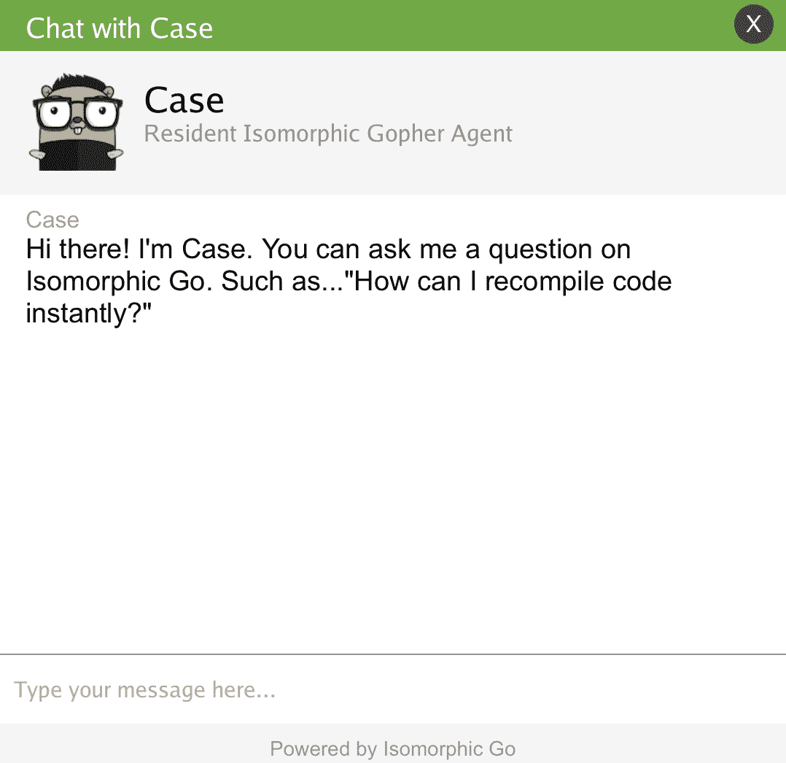

图 8.3：聊天框打开并显示聊天代理的问候

我们可以使用聊天框右上角的 X 控件关闭实时聊天框。我们可以通过再次点击顶部栏中的实时聊天图标来重新激活实时聊天功能。我们可以提供一个陈述，例如告诉我更多关于同构 Go，而不是向聊天代理提问，就像我们在以下截图中所示的那样：

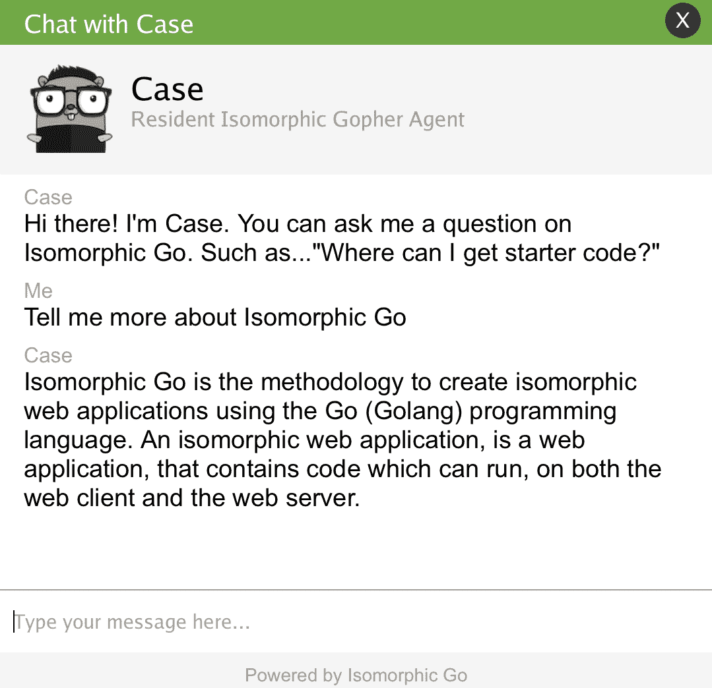

图 8.4：即使不是问题，聊天代理也能理解信息请求

人类用户和聊天代理之间的问答会话可以持续多长时间，如下一张截图所示。这也许是聊天代理的最大优势——在与人类打交道时具有无限的耐心。

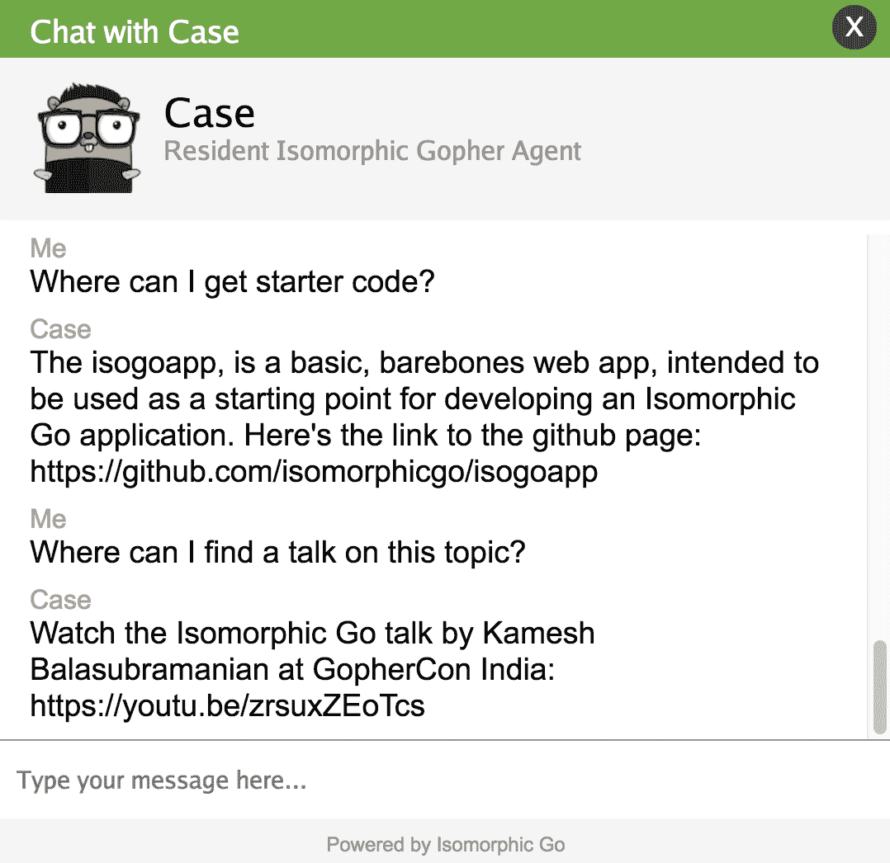

图 8.5：问题和答案会话可以持续多长时间取决于人类的意愿。

我们实现的聊天代理具有极其狭窄和有限的智能范围。当人类用户提出超出其智能范围的问题时，聊天代理将承认自己不知道答案，如下所示：

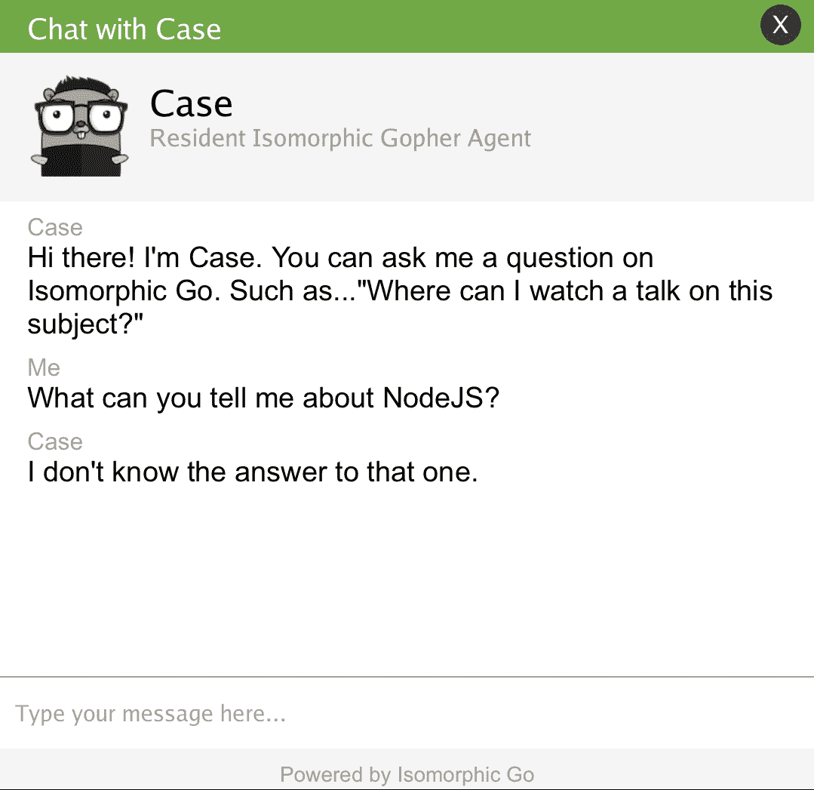

图 8.6：聊天代理对超出其智能范围的问题没有答案

一些人类用户可能对聊天代理粗鲁。这是聊天代理所服务的公共角色所带来的。如果我们调整语料库得当，我们的聊天代理可以展示一个风趣的回复。

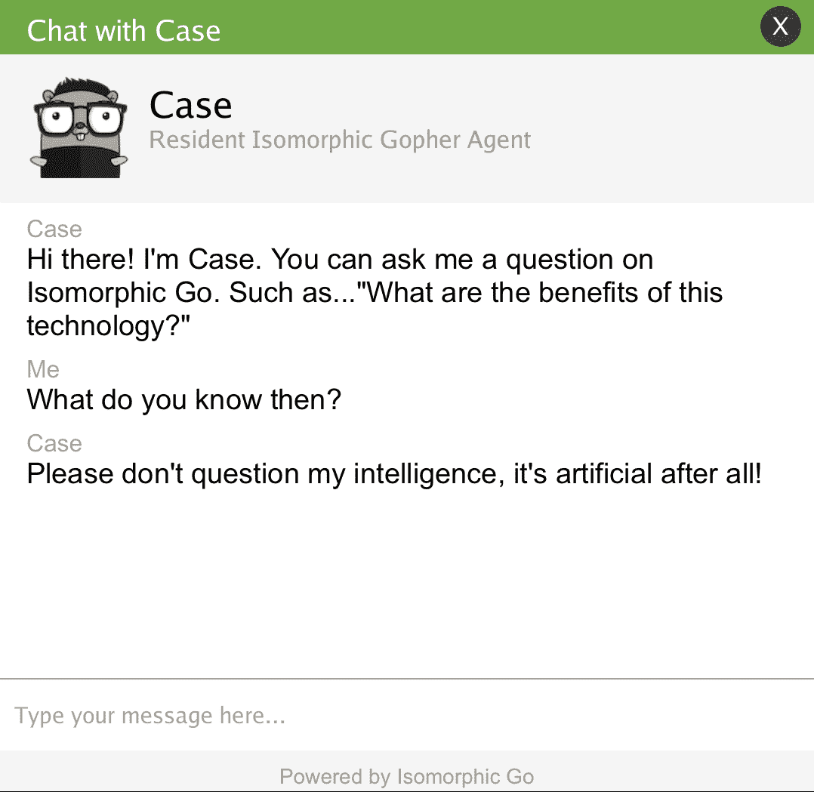

图 8.7：聊天代理展示一个风趣的回复

正如前面所述，我们已经有策略地将聊天框容器放在网页布局的主要内容区域之外。这样做后，聊天框和与聊天代理的对话可以在我们自由导航 IGWEB 的链接时继续，如下所示：

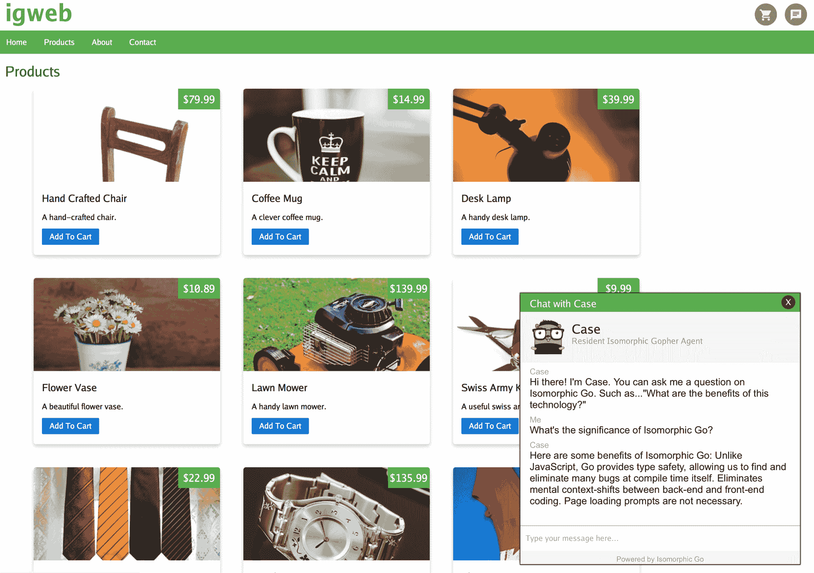

图 8.8：用户在 IGWEB 中导航时，聊天对话将被保留

例如，如下所示，即使在单击咖啡杯产品图像以进入产品详细页面后，聊天对话仍在继续：

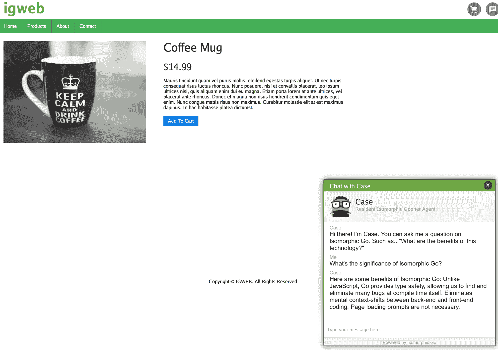

图 8.9：用户访问咖啡杯产品详细页面时，聊天对话已保留

实时网络应用取决于对互联网的持续连接。让我们看看实时聊天功能如何优雅地处理断开互联网连接的情况，如下所示：

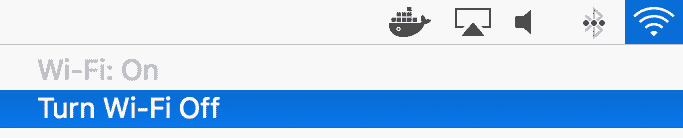

图 8.10：关闭互联网连接

一旦网络连接被关闭，我们立即在聊天框的标题栏中得到断开连接的通知，如*图 8.11*所示。聊天框标题栏的背景颜色变为红色，并启动关闭实时聊天功能的倒计时。倒计时完成后，实时聊天功能将自动关闭：

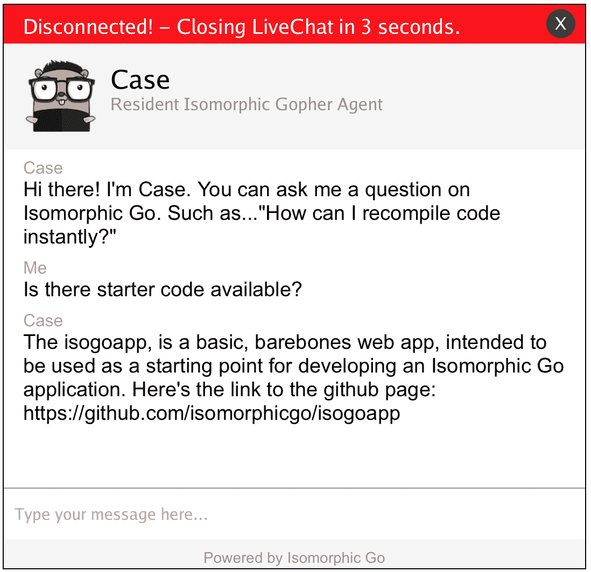

图 8.11：关闭实时聊天功能的倒计时出现在聊天框的标题栏中

在实现实时网络应用功能时，始终重要考虑持久 WebSocket 连接中断的情况。当 Web 客户端和 Web 服务器之间的持久连接中断时，通过优雅地关闭实时聊天，我们有一种方式向用户提供*提示*，让用户与聊天代理解除联系。

# 总结

在本章中，我们以 IGWEB 的实时网络应用功能的形式实现了实时聊天功能。您学会了如何使用 WebSocket 在 Web 服务器和 Web 客户端之间建立持久连接。在服务器端，我们向您介绍了 Gorilla 工具包项目中的`websocket`包。在客户端，我们向您介绍了 GopherJS 项目中的`gopherjs/websocket/websocketjs`包。

我们创建了一个简单的初级聊天机器人，实时回答用户提出的问题，人类和机器人之间的对话通过建立的 WebSocket 连接进行中继。由于实时网络应用功能取决于持续连接，我们还添加了代码，以便在互联网连接中断的情况下自动关闭实时聊天功能。

我们使用`nlp`包来实现初级聊天代理的大脑，以便它可以回答一些与同构 Go 相关的问题。我们使我们的聊天代理解决方案可扩展，未来可以通过定义`Bot`接口来添加具有不同智能的新机器人。

在第九章中，*Cogs– 可重复使用的组件*，我们将探讨如何在整个 IGWEB 中实现可重复使用的接口小部件。可重复使用的组件提供了促进更大重用性的手段，它们可以以即插即用的方式使用。正如您将了解的那样，齿轮也是高效的，利用虚拟 DOM 根据需要重新渲染其内容。
