# 第九章：Cogs - 可重用组件

在本书的前五章中，我们专注于为 IGWEB 上的特定网页或特定功能开发功能，例如我们在上一章中实现的实时聊天功能。到目前为止，我们所做的解决方案都为特定的个人目的服务。并没有考虑为特定的用户界面功能促进代码重用，因为我们没有需要创建多个实例。

可重用组件是用户界面小部件，提供了促进更大重用性的手段。它们可以以即插即用的方式使用，因为每个组件都是一个独立的用户界面小部件，包含自己的一组 Go 源文件和静态资产，例如 Go 模板文件，以及 CSS 和 JavaScript 源文件。

在本章中，我们将专注于创建可在同构 Go web 应用程序中使用的**cogs**——可重用组件。术语`cog`代表**Go 中的组件对象**。Cogs 是可重用的用户界面小部件，可以纯粹由 Go 实现（**纯齿轮**），也可以使用 Go 和 JavaScript 实现（**混合齿轮**）。

我们可以创建多个`cog`的实例，并通过提供输入参数（以键值对的形式）给`cog`，即**props**，来控制 cog 的行为。当对 props 进行后续更改时，`cog`是**响应式**的，这意味着它可以自动重新渲染自己。因此，cogs 具有根据其 props 的更改而改变外观的能力。

也许，cogs 最吸引人的特点是它们是可以立即重用的。Cogs 被实现为独立的 Go 包，包含一个或多个 Go 源文件以及 cog 实现所需的任何静态资产。

在本章中，我们将涵盖以下主题：

+   基本的`cog`概念

+   实现纯齿轮

+   实现混合齿轮

# 基本 cog 概念

**Cogs**（Go 中的组件对象）是在 Go 中实现的可重用组件。cogs 背后的指导理念是允许开发人员以成熟的方式在前端创建可重用组件。Cogs 是自包含的，定义为自己的 Go 包，这使得重用和维护它们变得容易。由于它们的自包含性质，cogs 可以用于创建可组合的用户界面。

Cogs 遵循关注点的清晰分离，其中`cog`的表示层使用一个或多个 Go 模板实现，`cog`的控制器逻辑在一个或多个 Go 源文件中实现，这些文件包含在一个 Go 包中。这些 Go 源文件可能导入标准库或第三方库的 Go 包。当我们在本章的*实现纯齿轮*部分实现时间之前的齿轮时，我们将看到一个例子。

Cogs 也可能有与之相关的 CSS 样式表和 JavaScript 代码，允许`cog`开发者/维护者根据需要利用预构建的 JavaScript 解决方案，而不是直接将 JavaScript 小部件移植到 Go。这使得 cogs 与现有的 JavaScript 解决方案具有互操作性，并防止开发人员重复发明轮子，从而节省宝贵的时间。例如，Pikaday（[`github.com/dbushell/Pikaday`](https://github.com/dbushell/Pikaday)）是一个成熟的日历日期选择器 JavaScript 小部件。在本章的*实现混合齿轮*部分，我们将学习如何实现一个使用 Pikaday JavaScript 小部件提供的功能的日期选择器`cog`。使用日期选择器`cog`的 Go 开发人员不需要了解 JavaScript，并且可以仅使用他们对 Go 的知识来使用它。

每个`cog`都带有一个**虚拟 DOM 树**，这是其实际 DOM 树的内存表示。操作`cog`的内存虚拟 DOM 树要比操作实际 DOM 树本身更有效率。*图 9.1*是一个 Venn 图，描述了`cog`的虚拟 DOM 树、两个树之间的差异以及实际 DOM 树：

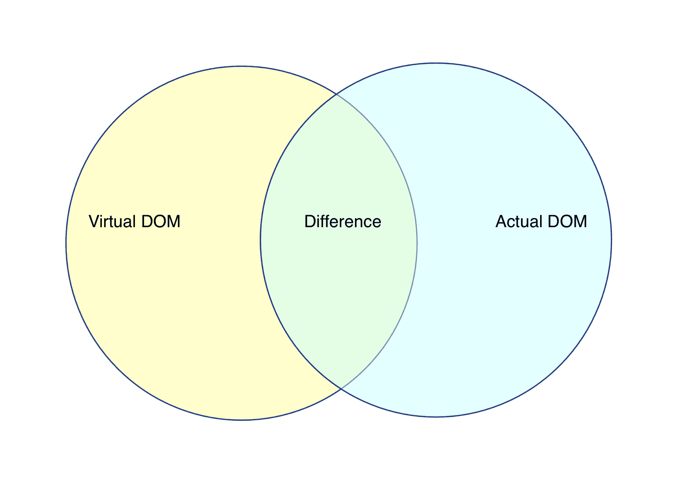

图 9.1：显示虚拟 DOM、差异和实际 DOM 的 Venn 图

当对`cog`的属性（*props*）进行更改时，`cog`的渲染引擎将利用其虚拟 DOM 树来确定更改，然后将更改与实际 DOM 树进行协调。这允许`cog`是*reactive*，意味着`cog`可以在其 props 更新时自动重新渲染自身。通过这种方式，cogs 减少了更新用户界面时涉及的复杂性。

# UX 工具包

UX 工具包提供了在`cog`包中实现 cogs 的功能，可以使用以下`go get`命令进行安装：

```go
$ go get -u github.com/uxtoolkit/cog
```

所有 cogs 必须实现`Cog`接口：

```go
type Cog interface {
  Render() error
  Start() error
}
```

`Render`方法负责在网页上渲染`cog`。如果在渲染过程中出现任何错误，该方法将返回一个`error`对象。

`Start`方法负责激活`cog`。如果`cog`无法启动，该方法将返回一个`error`对象。

`cog`包含两个重要的导出变量，`ReactivityEnabled`和`VDOMEnabled`。这两个导出变量都是`bool`类型，默认情况下都设置为`true`。

当变量`ReactivityEnabled`设置为`true`时，cogs 将在其 props 更改时重新渲染。如果`ReactivityEnabled`设置为`false`，则必须显式调用`cog`的`Render`方法来重新渲染`cog`。

当变量`VDOMEnabled`设置为`true`时，cogs 将利用`cog`的虚拟 DOM 树进行渲染。如果`VDOMEnabled`设置为`false`，则将通过替换内部 HTML 操作使用实际 DOM 树来渲染`cog`。这可能是一个昂贵的操作，可以通过利用`cog`的虚拟 DOM 树来避免。

`UXCog`类型实现了`Cog`接口的`Render`方法。以下是`UXCog struct`的样子：

```go
type UXCog struct {
  Cog
  cogType reflect.Type
  cogPrefixName string
  cogPackagePath string
  cogTemplatePath string
  templateSet *isokit.TemplateSet
  Props map[string]interface{}
  element *dom.Element
  id string
  hasBeenRendered bool
  parseTree *reconcile.ParseTree
  cleanupFunc func()
}
```

`UXCog`类型提供了使 cogs 工作的基本功能。这意味着为了实现我们自己的 cogs，我们必须在我们创建的所有 cogs 的类型定义中嵌入`UXCog`。`UXCog`类型的以下方法（为简洁起见，仅呈现方法签名）对我们来说特别重要：

```go
func (u *UXCog) ID() string

func (u *UXCog) SetID(id string) 

func (u *UXCog) CogInit(ts *isokit.TemplateSet)

func (u *UXCog) SetCogType(cogType reflect.Type)

func (u *UXCog) SetProp(key string, value interface{})

func (u *UXCog) Render() error
```

`ID`方法是一个 getter 方法，返回`cog`在 DOM 中的`div`容器的 ID。`cog`的`div`容器被称为其**挂载点**。

`SetID`方法是一个 setter 方法，用于设置 DOM 中`cog`的`div`容器的 ID。

`CogInit`方法用于将`cog`与应用程序的`TemplateSet`对象关联起来。该方法有两个重要目的。首先，该方法用于在服务器端注册`cog`，以便所有给定`cog`的模板都包含在由`isokit`内置的静态资产捆绑系统生成的模板包中。其次，在客户端调用`cog`的`CogInit`方法允许`cog`访问客户端应用程序的`TemplateSet`对象，从而允许`cog`在网页上进行渲染。

`SetCogType`方法允许我们通过对新实例化的`cog`执行运行时反射来动态设置`cog`的类型。这为 isokit 的静态资产捆绑系统提供了所需的钩子，以捆绑与给定`cog`相关的模板文件、CSS 源文件和 JavaScript 源文件。

`SetProp` 方法用于在 cog 的 `Props` 映射中设置键值对，该映射的类型为 `map[string]interface{}`。映射的 `key` 表示 prop 的名称，值表示 prop 的值。

`Render` 方法负责将 `cog` 渲染到 DOM。如果在渲染后对 `cog` 进行更改（其 prop 值已更新），则将重新渲染 `cog`。

您可以访问 UX 工具包网站，了解有关 cogs 的更多信息：[`uxtoolkit.io`](http://uxtoolkit.io)。

现在我们已经了解了 `UXCog` 类型，是时候来检查 `cog` 的解剖学了。

# cog 的解剖学

对于 IGWEB 项目，我们将在 `$IGWEB_APP_ROOT/shared/cogs` 文件夹中创建 cogs。当您阅读本节时，您可以查看 `$IGWEB_APP_ROOT/shared/cogs/timeago` 文件夹中找到的 time ago `cog` 的实现，以查看所述概念的具体实现。

仅用于说明的目的，我们将带您了解创建一个名为 `widget` 的简单 `cog` 的过程。

`widget` 文件夹中包含的小部件 `cog` 的项目结构以以下方式组织：

```go
  ⁃ widget
    ⁃ widget.go
    ⁃ templates
    ⁃ widget.tmpl
```

`widget.go` 源文件将包含小部件 `cog` 的实现。

`templates` 文件夹包含用于实现 `cog` 的模板源文件。如果要在网页上呈现 `cog`，至少必须存在一个模板源文件。模板源文件的名称必须与 `cog` 的包名称匹配。例如，对于 `cog` 包 `widget`，模板源文件的名称必须是 `widget.tmpl`。

在命名包名称和源文件时，cogs 遵循 *约定优于配置* 策略。由于我们选择了名称 `widget`，因此我们必须在 `widget.go` 源文件中也声明一个名为 `widget` 的 Go 包：

```go
package widget
```

所有 cogs 都需要在其导入分组中包含 `errors` 包、`reflect` 包和 `cog` 包：

```go
import (
  "errors"
  "reflect"
  "github.com/uxtoolkit/cog"
)
```

我们必须声明一个未导出的、包范围的变量，名为 `cogType`：

```go
var cogType reflect.Type
```

此变量表示 `cog` 的类型。我们在 `cog` 包的 `init` 函数中调用 `reflect` 包中的 `TypeOf` 函数，传入一个新创建的 `cog` 实例，以动态设置 `cog` 的类型：

```go
func init() {
  cogType = reflect.TypeOf(Widget{})
}
```

这为 isokit 的静态捆绑系统提供了一个钩子，以了解在哪里获取所需的静态资源来使 `cog` 函数正常运行。

`cog` 实现了特定类型。对于小部件，我们实现了 `Widget` 类型。这是 `Widget struct`：

```go
type Widget struct {
  cog.UXCog
}
```

我们必须将 `cog.UXCog` 类型嵌入到 `cog` 中，以从 `cog.UxCog` 类型中获取所需的所有功能，以实现 `cog`。

`struct` 可能包含其他字段定义，这些字段定义是实现 `cog` 所需的，具体取决于 `cog` 的用途。

每个 `cog` 实现都应包含一个构造函数：

```go
func NewWidget() *Widget {
  w := &Widget{}
  w.SetCogType(cogType)
  return f
}
```

与任何典型的构造函数一样，目的是创建 `Widget` 的新实例。

cog 的构造函数必须包含调用 `SetCogType` 方法的行（以粗体显示）。这是 isokit 的自动静态资源捆绑系统用作钩子，以捆绑 `cog` 所需的静态资源。

可以设置 `Widget` 类型的其他字段以初始化 `cog`，这取决于 `cog` 的实现。

为了实现 `Cog` 接口的实现，所有 cogs 必须实现一个 `Start` 方法：

```go
func (w *Widget) Start() error {

  var allRequiredConditionsHaveBeenMet bool = true
```

`Start` 方法负责激活 `cog`，包括将 `cog` 初始渲染到网页上。如果 `cog` 启动失败，`Start` 方法将返回一个 `error` 对象，否则将返回一个 `nil` 值。

仅用于说明，我们定义了一个包含名为 `allRequiredConditionsHaveBeenMet` 的布尔变量的 `if` 条件块：

```go
  if allRequiredConditionsHaveBeenMet == false {
    return errors.New("Failed to meet all requirements, cog failed to start!")
  }
```

如果满足了启动`cog`的所有条件，这个变量将等于`true`。否则，它将等于`false`。如果它是`false`，那么我们将返回一个新的`error`对象，表示`cog`由于未满足所有要求而无法启动。

我们可以通过调用`SetProp`方法在 cog 的`Props`映射中设置键值对：

```go
  w.SetProp("foo", "bar")
```

在这种情况下，我们已将名为`foo`的 prop 设置为值`bar`。`Props`映射将自动用作传入 cog 模板的数据对象。这意味着`Props`映射中定义的所有 prop 都可以被 cog 的模板访问。

按照惯例，cog 的模板源文件名称必须命名为`widget.tmpl`，以匹配 cog 的包名称`widget`，并且模板文件应该位于 cog 的文件夹`widget`中的`templates`文件夹中。

让我们快速看一下`widget.tmpl`源文件可能是什么样子：

```go
<p>Value of Foo is: {{.foo}}</p>
```

请注意，我们能够打印出模板中具有键`foo`的 prop 的值。

让我们回到 widget cog 的`Start`方法。我们调用 cog 的`Render`方法来在 web 浏览器中渲染`cog`：

```go
  err := w.Render()
  if err != nil {
    return err
  }
```

如果在渲染`cog`时遇到错误，`Render`方法将返回一个`error`对象，否则将返回一个值为`nil`，表示`cog`已成功渲染。

如果`cog`成功渲染，cog 的`Start`方法会返回一个值为`nil`，表示`cog`已成功启动：

```go
return nil
```

为了将我们的`cog`渲染到真实的 DOM 中，我们需要一个地方来渲染`cog`。包含`cog`渲染内容的`div`容器被称为其**挂载点**。挂载点是`cog`在 DOM 中渲染的位置。要在主页上渲染 widget `cog`，我们需要将以下标记添加到主页的内容模板中：

```go
<div data-component="cog" id="widgetContainer"></div>
```

通过将`data-component`属性设置为`"cog"`，我们表明`div`元素将用作 cog 的挂载点，并且 cog 的渲染内容将包含在此元素内。

在客户端应用程序中，widget `cog`可以这样实例化：

```go
w := widget.NewWidget()
w.CogInit(env.TemplateSet)
w.SetID("widgetContainer")
w.Start()
w.SetProp("foo", "bar2")
```

我们创建一个新的`Widget`实例，并将其分配给变量`w`。我们必须调用`cog`的`CogInit`方法，将应用程序的`TemplateSet`对象与`cog`关联起来。`cog`利用`TemplateSet`来获取其关联的模板，这些模板是渲染`cog`所需的。我们调用 cog 的`SetID`方法，将`id`传递给充当 cog 挂载点的`div`元素。我们调用 cog 的`Start`方法来激活`cog`。由于`Start`方法调用了 cog 的`Render`方法，因此 cog 将在指定的挂载点`div`元素中渲染，即`"widgetContainer"`的 id。最后，当我们调用`SetProp`方法并将`"foo"` prop 的值更改为`"bar2"`时，`cog`将自动重新渲染。

现在我们已经检查了`cog`的基本结构，让我们考虑如何使用虚拟 DOM 来渲染 cog。

# 虚拟 DOM 树

每个`cog`实例都有一个与之关联的虚拟 DOM 树。这个虚拟 DOM 树是由 cog 的`div`容器的所有子元素组成的解析树。

*图 9.2*是一个流程图，描述了将`cog`渲染和重新渲染（通过协调应用）到 DOM 的过程：

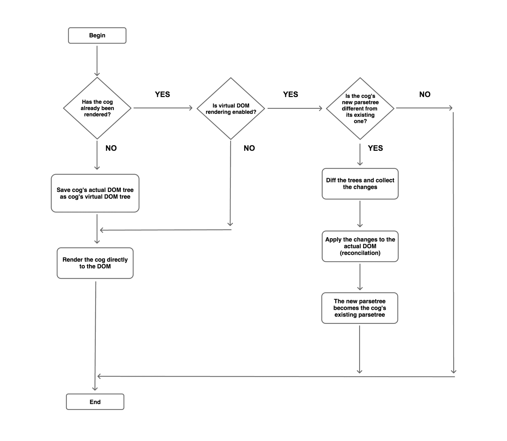

图 9.2：描述了渲染和重新渲染 cog 的流程图

当`cog`首次在 DOM 中渲染时，会执行替换内部 HTML 操作。在 DOM 中替换元素的内部 HTML 内容是一个昂贵的操作。因此，在`cog`的后续渲染中不会执行此操作。

齿轮的`Render`方法的所有后续调用将利用齿轮的虚拟 DOM 树。齿轮的虚拟 DOM 树用于跟踪齿轮当前虚拟 DOM 树与齿轮新虚拟 DOM 树之间的变化。当齿轮的 prop 值已更新时，`cog`将有一个新的虚拟 DOM 树与其当前虚拟 DOM 树进行比较。

让我们考虑一个小部件齿轮的示例场景。调用小部件齿轮的`Start`方法将执行`cog`的初始渲染（因为`Start`方法内部调用了`Render`方法）。`cog`将具有一个虚拟 DOM 树，该树将是包含`cog`渲染内容的`div`容器的解析树。如果我们通过调用`cog`的`SetProp`方法更新了`"foo"`prop（该 prop 在`cog`的模板中呈现），那么将自动调用`Render`方法，因为`cog`是响应式的。在对`cog`执行后续渲染操作时，齿轮的当前虚拟 DOM 树将与齿轮的新虚拟 DOM 树（更新齿轮 prop 后创建的虚拟 DOM 树）进行差异比较。

如果当前虚拟 DOM 树和新虚拟 DOM 树之间没有变化，则无需执行任何操作。但是，如果当前虚拟 DOM 树和新虚拟 DOM 树之间存在差异，则必须将构成差异的更改应用于实际的 DOM。应用这些更改的过程称为**协调**。执行协调允许我们避免执行昂贵的替换内部 HTML 操作。成功应用协调后，齿轮的新虚拟 DOM 树将被视为齿轮的当前虚拟 DOM 树，以准备`cog`进行下一个渲染周期：

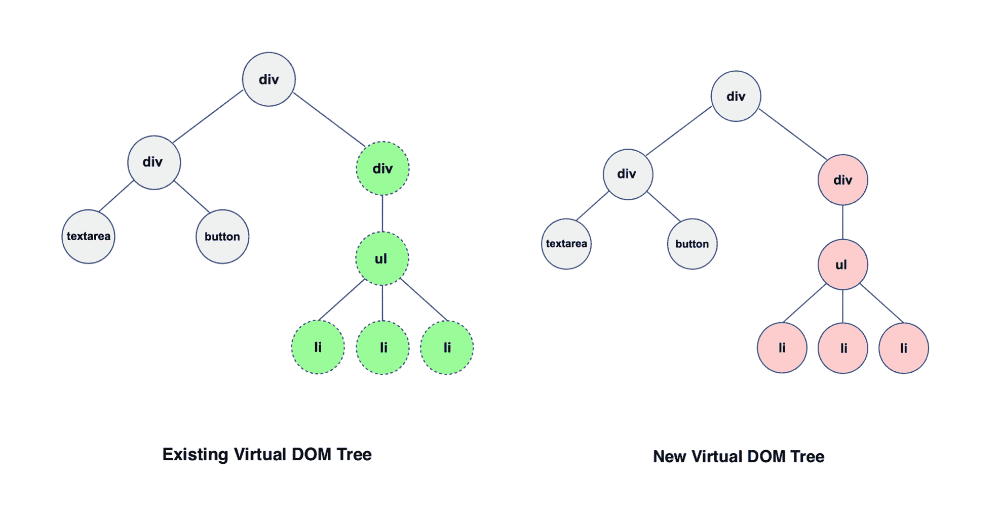

图 9.3：齿轮的现有虚拟 DOM 树（左）和齿轮的新虚拟 DOM 树（右）

*图 9.3*在左侧描述了齿轮的现有虚拟 DOM 树，右侧描述了齿轮的新虚拟 DOM 树。在对两个虚拟 DOM 树（新的和现有的）进行`diff`操作后，确定右侧的`div`元素（包含`ul`元素）及其子元素已更改，并且协调操作将仅更新实际 DOM 中的`div`元素及其子元素。

# 齿轮的生命周期

*图 9.4*描述了`cog`的生命周期，该生命周期始于服务器端，在那里我们首先注册`cog`。必须在服务器端注册`cog`的类型，以便`cog`的关联模板以及其他静态资产可以自动捆绑并提供给客户端应用程序：

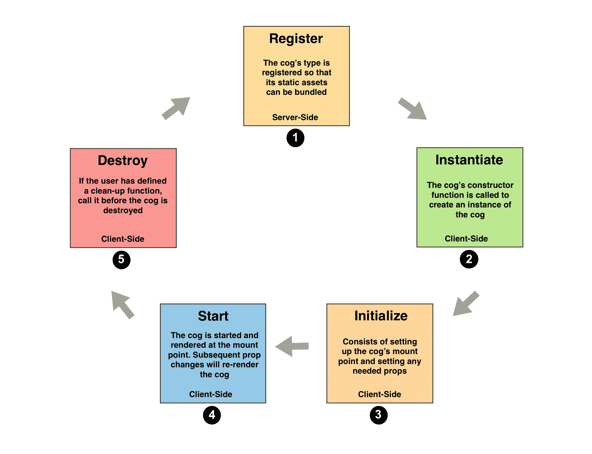

图 9.4：齿轮的生命周期

`cog`生命周期中的后续步骤发生在客户端。我们通过引入一个`div`元素，其 data-component 属性等于`"cog"`，来声明`cog`的挂载点，以指示该`div`元素是`cog`的挂载点。

下一步是通过调用其构造函数创建`cog`的新实例。我们通过调用其`CogInit`方法并传递客户端应用程序的`TemplateSet`对象来初始化`cog`。初始化`cog`还包括通过调用其`SetID`方法将挂载点与`cog`关联起来（以便`cog`知道在哪里进行渲染）。`Cog`初始化还包括在调用`Start`方法之前通过调用其`SetProp`方法在`cog`的`Props map`中设置 prop。

请注意，在调用齿轮的`Start`方法之前调用齿轮的`SetProp`方法将不会渲染`cog`。只有在通过调用其`Start`方法将`cog`呈现到挂载点后，才会在调用其`SetProp`方法后重新呈现`cog`。

调用`Cog`的`Start`方法将激活`cog`并将`cog`的内容呈现到指定的挂载点。

任何后续对齿轮的`SetProp`方法的调用都将导致齿轮的重新渲染。

当用户在网站上导航到不同的页面时，包含`cog`的容器将被移除，从而有效地销毁`cog`。用户可以指定一个清理函数，在销毁`cog`之前应该调用该函数。这可以帮助在`cog`被销毁之前以负责任的方式释放资源。我们将在本章后面看到实现清理函数的示例。

# 实现纯 cogs

现在我们对 cogs 有了基本的了解，是时候在实践中实现一些 cogs 了。尽管 cogs 在客户端操作，但重要的是要注意，服务器端应用程序需要通过注册来承认它们的存在。出于这个原因，cogs 的代码被策略性地放置在`shared/cogs`文件夹中。

纯 cogs 是专门用 Go 实现的。正如你将看到的，我们可以利用现有的 Go 包的功能来实现 cogs。

在`igweb.go`源文件的主函数中，我们调用`initailizeCogs`函数，传入应用程序的模板集：

```go
initializeCogs(env.TemplateSet)
```

`initializeCogs`函数负责初始化 Isomorphic Go web 应用程序中要使用的所有 cogs：

```go
func initializeCogs(ts *isokit.TemplateSet) {
  timeago.NewTimeAgo().CogInit(ts)
  liveclock.NewLiveClock().CogInit(ts)
  datepicker.NewDatePicker().CogInit(ts)
  carousel.NewCarousel().CogInit(ts)
  notify.NewNotify().CogInit(ts)
  isokit.BundleStaticAssets()
}
```

请注意，`initializeCogs`函数接受一个唯一的输入参数`ts`，即`TemplateSet`对象。我们调用齿轮的构造函数来创建一个新的`cog`实例，并立即调用`cog`的`CogInit`方法，将`TemplateSet`对象`ts`作为输入参数传递给该方法。这允许`cog`将其模板包含到应用程序的模板集中，以便随后要生成的模板包将包括与`cog`相关的模板。

我们调用`BundleStaticAssets`方法来生成每个`cog`所需的静态资源（CSS 和 JavaScript 源文件）。将生成两个文件。第一个文件是`cogimports.css`，其中包含所有 cogs 所需的 CSS 源代码，第二个文件是`cogimports.js`，其中包含所有 cogs 所需的 JavaScript 源代码。

# 时间差 cog

现在我们已经看到了如何在服务器端初始化 cogs，是时候来看看制作`cog`需要做些什么了。我们将从制作一个非常简单的`cog`开始，即时间差`cog`，它以人类可理解的格式显示时间。

是时候重新查看关于页面上的 Gopher 简介了。在第三章中的*自定义模板函数*部分，*Go on the Front-End with GopherJS*，我们学习了如何使用自定义模板函数以 Ruby 格式显示 Gopher 的开始日期时间。

我们将进一步展示开始日期时间的人类可理解格式，通过实现一个时间差`cog`。*图 9.5*是一个示例，显示了 Molly 在默认 Go 格式、Ruby 格式和人类可理解格式的开始日期：


图 9.5：描绘时间差 cog 的插图，最后一行显示了人类可读格式的时间

Molly 于 2017 年 5 月 24 日加入了 IGWEB 团队，以人类可读的格式，即 6 个月前（在撰写时的当前时间）。

在`about_content.tmpl`模板源文件中，我们为时间差`cog`引入了一个`div`容器：

```go
<h1>About</h1>

<div id="gopherTeamContainer">
  {{range .Gophers}}

    <div class="gopherContainer">

      <div class="gopherImageContainer">
        
      </div>

      <div class="gopherDetailsContainer">
          <div class="gopherName"><h3><b>{{.Name}}</b></h3></div>
          <div class="gopherTitle"><span>{{.Title}}</span></div> 
          <div class="gopherBiodata"><p>{{.Biodata}}</p></div>
          <div class="gopherStartTime">
            <p class="standardStartTime">{{.Name}} joined the IGWEB team on <span class="starttime">{{.StartTime}}.</p>
            <p class="rubyStartTime">That's <span class="starttime">{{.StartTime | rubyformat}}</span> in Ruby date format.</p>
            <div class="humanReadableGopherTime">That's
 <div id="Gopher-{{.Name}}" data-starttimeunix="{{.StartTime | unixformat}}" data-component="cog" class="humanReadableDate starttime"></div>
 in Human readable format.
 </div>
          </div>
      </div>
    </div>

  {{end}}
</div>
```

请注意，我们已经分配了名为`data-component`的属性，其值为`cog`。这是为了表明这个`div`容器将作为一个装载点，容纳`cog`的渲染内容。我们将容器的`id`属性设置为带有前缀`"Gopher-"`的 Gopher 的名字。

稍后您将看到，当我们实例化一个`cog`时，我们必须为`cog`的`div`容器提供一个 ID，以便`cog`实例知道它的挂载点是`cog`应该将其输出呈现到的位置。我们定义了另一个自定义数据属性`starttimeunix`，并将其设置为 Gopher 开始为 IGWEB 工作时的 Unix 时间戳值。

请记住，该值是通过调用模板操作获得的，该操作将`StartTime`属性通过管道传输到自定义模板函数`unixformat`中获得的值。

`unixformat`自定义模板函数是`shared/templatefuncs/funcs.go`源文件中定义的`UnixTime`函数的别名：

```go
func UnixTime(t time.Time) string {
  return strconv.FormatInt(t.Unix(), 10)
}
```

此函数将返回给定`Time`实例的 Unix 格式的时间作为`string`值。

回到`about_content.tmpl`源文件，注意提供给`div`容器的`humanReadableDate` CSS `className`。我们稍后将使用这个 CSS `className`来获取关于页面上所有`timeago` `cog`的`div`容器。

现在我们已经看到了如何在关于页面上声明`cog`的`div`容器，让我们来看看如何实现时间过去的`cog`。

时间过去的`cog`是一个纯 Go `cog`。这意味着它仅使用 Go 实现。Go 包`go-humanize`为我们提供了显示时间的功能。我们将利用这个包来实现时间过去的`cog`。这是`go-humanize`包的 GitHub 页面的 URL：[`github.com/dustin/go-humanize`](https://github.com/dustin/go-humanize)。

让我们检查`shared/cogs/timeago/timeago.go`源文件。我们首先声明包名为`timeago`：

```go
package timeago
```

在我们的导入分组中，我们包括`github.com/uxtoolkit/cog`，这个包为我们提供了实现`cog`的功能（以粗体显示）。我们在导入分组中包括`go-humanize`分组，并用名称`"humanize"`进行别名（以粗体显示）：

```go
import (
  "errors"
  "reflect"
  "time"

 humanize "github.com/dustin/go-humanize"
  "github.com/uxtoolkit/cog"
)
```

所有的齿轮都必须声明一个名为`cogType`的未导出变量，其类型为`reflect.Type`：

```go
var cogType reflect.Type
```

在`init`函数内，我们使用`reflect.TypeOf`函数对新创建的`TimeAgo`实例调用，将返回的值赋给`cogType`变量：

```go
func init() {
  cogType = reflect.TypeOf(TimeAgo{})
}
```

对于我们实现的每个`cog`，也需要初始化`cogType`变量。正确设置`cogType`允许静态资产捆绑系统考虑到齿轮在 Web 应用程序中的静态资产依赖关系。`cogType`将被用于收集所有模板和静态资产，这些资产是使`cog`函数正常运行所需的。

这是我们用来定义`TimeAgo cog`的`struct`：

```go
type TimeAgo struct {
  cog.UXCog
  timeInstance time.Time
}
```

请注意，我们在`struct`定义中嵌入了`ux.UXCog`。正如前面所述，`cog.UXCog`类型将为我们提供必要的功能，以允许我们呈现`cog`。除了嵌入`ux.UXCog`，我们还声明了一个未导出字段，名为`timeInstance`，类型为`time.Time`。这将包含我们将转换为人类可读格式的`time.Time`实例。

我们创建一个名为`NewTimeAgo`的构造函数，它返回一个新的`TimeAgo cog`实例：

```go
func NewTimeAgo() *TimeAgo {
  t := &TimeAgo{}
  t.SetCogType(cogType)
  return t
}
```

我们在这里拥有的构造函数遵循 Go 中实现的任何其他构造函数的相同模式。请注意，我们将`cogType`传递给新创建的`TimeAgo`实例的`SetCogType`方法。这是必需的，以便`cog`的静态资产包含在 isokit 的静态资产捆绑系统生成的静态资产捆绑中。

我们为`TimeAgo`结构的`timeInstance`字段创建了一个 setter 方法，名为`SetTime`：

```go
func (t *TimeAgo) SetTime(timeInstance time.Time) {
  t.timeInstance = timeInstance
}
```

客户端应用程序将使用此 setter 方法为`TimeAgo` `cog`设置时间。我们将使用`SetTime`方法来设置 Gopher 加入 IGWEB 团队的开始日期。

为了实现`Cog`接口，`cog`必须定义一个`Start`方法。`Start`方法是`cog`中操作发生的地方。通过阅读其`Start`方法，您应该能够对`cog`的功能有一个大致的了解。以下是`TimeAgo` cog 的`Start`方法：

```go
func (t *TimeAgo) Start() error {

  if t.timeInstance.IsZero() == true {
    return errors.New("The time instance value has not been set!")
  }

  t.SetProp("timeAgoValue", humanize.Time(t.timeInstance))

  err := t.Render()
  if err != nil {
    return err
  }

  return nil
}
```

`Start`方法返回一个错误对象，通知调用者`cog`是否正确启动。在执行任何活动之前，会检查`timeInstance`值是否已设置。我们使用`if`条件语句来检查`timeInstance`值是否为其零值，表示它尚未设置。如果发生这种情况，该方法将返回一个新创建的`error`对象，指示时间值尚未设置。如果`timeInstance`值已设置，我们将继续向前。

我们调用 cog 的`SetProp`方法，使用人类可理解的时间值设置`timeAgoValue`属性。我们通过调用`go-humanize`包（别名为`humanize`）中的`Time`函数，并传递 cog 的`timeInstance`值来获取人类可理解的时间值。

我们调用 cog 的`Render`方法来渲染`cog`。如果在尝试渲染`cog`时发生错误，则`Start`方法将返回`error`对象。否则，将返回`nil`值，表示启动`cog`时没有错误。

此时，我们已经实现了`timeago` cog 的 Go 部分。为了使人类可读的时间出现在网页上，我们必须实现 cog 的模板。

`timeago.tmpl`文件（位于`shared/cogs/timeago/templates`目录中）是一个简单的单行模板。我们声明以下`span`元素，并且有一个模板动作来渲染`timeAgoValue`属性：

```go
<span class="timeagoSpan">{{.timeAgoValue}}</span>
```

按照惯例，`cog`包中的主要模板的名称必须与`cog`包的相同。例如，对于`timeago`包，`cog`的主要模板将是`timeago.tmpl`。您可以自由定义和使用已在应用程序模板集中注册的任何自定义模板函数，以及`cog`模板。您还可以创建任意数量的子模板，这些子模板将由`cog`的主要模板调用。

现在我们已经准备好在关于页面上实例化`cog`的模板。

让我们来看看`client/handlers/about.go`源文件中的`InitializeAboutPage`函数：

```go
func InitializeAboutPage(env *common.Env) {
  humanReadableDivs := env.Document.GetElementsByClassName("humanReadableDate")
  for _, div := range humanReadableDivs {
    unixTimestamp, err := strconv.ParseInt(div.GetAttribute("data-starttimeunix"), 10, 64)
    if err != nil {
      log.Println("Encountered error when attempting to parse int64 from string:", err)
    }
    t := time.Unix(unixTimestamp, 0)
 humanTime := timeago.NewTimeAgo()
 humanTime.CogInit(env.TemplateSet)
 humanTime.SetID(div.ID())
 humanTime.SetTime(t)
 err = humanTime.Start()
    if err != nil {
      println("Encountered the following error when attempting to start the timeago cog: ", err)
    }
  }
}
```

由于关于页面上列出了三个地鼠，页面上将运行总共三个`TimeAgo` cog 实例。我们使用`env.Document`对象上的`GetElementByClassName`方法，提供`humanReadableDate`类名，来收集 cog 的`div`容器。然后我们循环遍历每个`div`元素，这就是实例化`cog`的所有操作发生的地方。

首先，我们从`div`容器中包含的自定义数据属性中提取 Unix 时间戳值。回想一下，我们使用自定义模板函数`unixformat`将`starttimeunix`自定义数据属性填充为地鼠的开始时间的 Unix 时间戳。

然后我们使用`time`包中可用的`Unix`函数创建一个新的`time.Time`对象，并提供我们从`div`容器的自定义数据属性中提取的`unixTimestamp`。用粗体显示了实例化和设置`TimeAgo` cog 的代码。我们首先通过调用构造函数`NewTimeAgo`来实例化一个新的`TimeAgo` cog，并将其分配给`humanTime`变量。

然后我们在`humanTime`对象上调用`CogInit`方法，并提供`env.TemplateSet`对象。我们调用`SetID`方法来注册`div`容器的`id`属性，以将其与`cog`实例关联起来。然后我们在`TimeAgo` cog 上调用`SetTime`方法，传入我们从`div`容器中提取的`unixTimestamp`创建的`time.Time`对象`t`。

现在我们已经准备好通过调用其`Start`方法启动`cog`。我们将`Start`方法返回的`error`对象分配给`err`。如果`err`不等于`nil`，则表示在启动`cog`时发生了错误，在这种情况下，我们将在网页控制台中打印出有意义的消息。如果没有错误，`cog`将呈现在网页上。*图 9.6*显示了 Molly 的启动时间的屏幕截图。

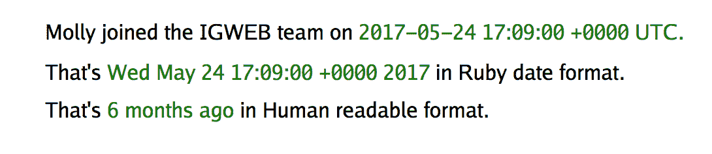

图 9.6：时间前`cog`的操作

# 实时时钟`cog`

当我们在时间前调用`Start`方法时，时间将使用虚拟 DOM 呈现在网页上，而不是进行替换内部 HTML 操作。由于时间前`cog`只更新一次时间，即在调用`cog`的`Start`方法时，很难欣赏到`cog`的虚拟 DOM 的作用。

在这个例子中，我们将构建一个实时时钟`Cog`，它具有显示世界上任何地方的当前时间的能力。由于我们将显示到秒的时间，我们将每秒执行一次`SetProp`操作以重新呈现实时时钟`Cog`。

*图 9.7*是实时时钟的插图：


图 9.7：描绘实时时钟`cog`的插图

我们将为四个地方渲染当前时间：您目前所在的地方、金奈、新加坡和夏威夷。在`shared/templates/index_content.tmpl`模板源文件中，我们声明了四个`div`容器，它们作为我们将实例化的四个实时时钟`cog`的安装点。

```go
 <div data-component="cog" id="myLiveClock" class="liveclockTime"></div>
 <div data-component="cog" id="chennaiLiveClock" class="liveclockTime"></div>
 <div data-component="cog" id="singaporeLiveClock" class="liveclockTime"></div>
 <div data-component="cog" id="hawaiiLiveClock" class="liveclockTime"></div>
```

再次注意，我们通过声明包含属性`"data-component"`的`div`容器来定义实时时钟的安装点，并将其值设置为`"cog"`。我们为所有四个`cog`容器分配了唯一的 ID。我们在`div`容器中声明的类名`liveclockTime`是用于样式目的。

现在我们已经为四个实时时钟`cog`设置了安装点，让我们来看看如何实现实时时钟`cog`。

实时时钟`Cog`的实现可以在`shared/cogs/liveclock`文件夹中的`liveclock.go`源文件中找到。

我们为`cog`的包名称声明了名称`liveclock`：

```go
package liveclock
```

请注意，在我们的导入分组中，我们包含了`github.com/uxtoolkit/cog`包：

```go
import (
  "errors"
  "reflect"
  "time"
 "github.com/uxtoolkit/cog"
)
```

我们定义了未导出的包变量`cogType`：

```go
var cogType reflect.Type
```

在`init`函数内，我们将`cogType`变量赋值为调用`reflect.TypeOf`函数在新创建的`LiveClock`实例上返回的值：

```go
func init() {
  cogType = reflect.TypeOf(LiveClock{})
}
```

这是实现`cog`的必要步骤。

到目前为止，我们已经确定了声明和初始化`cogType`是实现`cog`的基本要求的一部分。

以下是`LiveClock` cog 的结构：

```go
type LiveClock struct {
  cog.UXCog
  ticker *time.Ticker
}
```

我们在`cog`的结构定义中嵌入了`cog.UXCog`类型。我们引入了一个`ticker`字段，它是指向`time.Ticker`的指针。我们将使用这个`ticker`每秒进行一次实时时钟的滴答。

以下是`LiveClock` cog 的构造函数：

```go
func NewLiveClock() *LiveClock {
  liveClock := &LiveClock{}
 liveClock.SetCogType(cogType)
  liveClock.SetCleanupFunc(liveClock.Cleanup)
  return liveClock
}
```

`NewLiveClock`函数充当实时时钟`cog`的构造函数。我们声明并初始化`liveClock`变量为一个新的`LiveClock`实例。我们调用`liveClock`对象的`SetCogType`方法并传递`cogType`。请记住，这是构造函数中必须存在的步骤（以粗体显示）。

然后我们调用`liveClock`对象的`SetCleanupFunc`方法，并提供一个清理函数`liveClock.Cleanup`。`SetCleanUp`方法包含在`cog.UXCog`类型中。它允许我们指定一个在`cog`从 DOM 中移除之前应该调用的清理函数。最后，我们返回`LiveClock cog`的新实例。

让我们来看一下`Cleanup`函数：

```go
func (lc *LiveClock) Cleanup() {
  lc.ticker.Stop()
}
```

这个函数非常简单。我们只需在 cog 的`ticker`对象上调用`Stop`方法来停止`ticker`。

这是 cog 的`Start`方法，其中`ticker`将被启动：

```go
func (lc *LiveClock) Start() error {
```

我们首先声明时间布局常量`layout`，并将其设置为`RFC1123Z`时间格式。我们声明一个`location`变量，指向`time.Location`类型：

```go
  const layout = time.RFC1123
  var location *time.Location
```

在启动`LiveClock` cog 之前，`cog`的用户必须设置两个重要的属性，即`"timezoneName"`和`"timezoneOffset"`：

```go
  if lc.Props["timezoneName"] != nil && lc.Props["timezoneOffset"] != nil {
    location = time.FixedZone(lc.Props["timezoneName"].(string), lc.Props["timezoneOffset"].(int))
  } else {
    return errors.New("The timezoneName and timezoneOffset props need to be set!")
  }
```

这些值用于初始化位置变量。如果这些属性中的任何一个未提供，将返回一个错误。

如果这两个属性都存在，我们继续将实时时钟`cog`的`ticker`属性分配给一个新创建的`time.Ticker`实例，它将每秒进行滴答：

```go
lc.ticker = time.NewTicker(time.Millisecond * 1000)
```

我们在 ticker 的通道上使用`range`来迭代每一秒，当值到达时，我们设置`currentTime`属性，为其提供格式化的时间值（以粗体显示）：

```go
  go func() {
    for t := range lc.ticker.C {
 lc.SetProp("currentTime", t.In(location).Format(layout))
    }
  }()
```

请注意，我们同时使用了位置和时间布局来格式化时间。一旦 cog 被渲染，每秒将自动调用`SetProp`来调用`Render`方法重新渲染 cog。

我们调用 cog 的`Render`方法来将 cog 渲染到网页上：

```go
  err := lc.Render()
  if err != nil {
    return err
  }
```

在方法的最后一行，我们返回一个`nil`值，表示没有发生错误：

```go
 return nil
```

我们已经在`liveclock.tmpl`源文件中定义了`cog`的模板：

```go
<p>{{.timeLabel}}: {{.currentTime}}</p>
```

我们打印出时间标签，以及当前时间。`timeLabel`属性用于向`cog`提供时间标签，并且将是我们想要知道当前时间的地方的名称。

现在我们已经看到了制作实时时钟`cog`所需的内容，以及它如何显示时间，让我们继续在主页上添加一些实时时钟 cogs。

这是`index.go`源文件中`InitializeIndexPage`函数内部的代码部分，我们在其中为本地时区实例化实时时钟 cog：

```go
  // Localtime Live Clock Cog
  localZonename, localOffset := time.Now().In(time.Local).Zone()
  lc := liveclock.NewLiveClock()
  lc.CogInit(env.TemplateSet)
  lc.SetID("myLiveClock")
  lc.SetProp("timeLabel", "Local Time")
  lc.SetProp("timezoneName", localZonename)
  lc.SetProp("timezoneOffset", localOffset)
  err = lc.Start()
  if err != nil {
    println("Encountered the following error when attempting to start the local liveclock cog: ", err)
  }
```

为了实例化本地时间的 cog，我们首先获取本地区域名称和本地时区偏移量。然后我们创建一个名为`lc`的`LiveClock cog`的新实例。我们调用`CogInit`方法来初始化 cog。我们调用`SetID`方法来注册 cog 的挂载点的`id`，即`div`容器，`cog`将把其输出渲染到其中。我们调用`SetProp`方法来设置`"timeLabel"`、`"timezoneName"`和`"timezoneOffset"`属性。最后，我们调用`Start`方法来启动`LiveClock` cog。和往常一样，我们检查`cog`是否正常启动，如果没有，我们在 web 控制台中打印出`error`对象。

类似地，我们以与本地时间相同的方式实例化了 Chennai、新加坡和夏威夷的`LiveClock` cogs，除了一件事。对于其他地方，我们明确提供了每个地方的时区名称和 GMT 时区偏移量：

```go
  // Chennai Live Clock Cog
  chennai := liveclock.NewLiveClock()
  chennai.CogInit(env.TemplateSet)
  chennai.SetID("chennaiLiveClock")
  chennai.SetProp("timeLabel", "Chennai")
  chennai.SetProp("timezoneName", "IST")
  chennai.SetProp("timezoneOffset", int(+5.5*3600))
  err = chennai.Start()
  if err != nil {
    println("Encountered the following error when attempting to start the chennai liveclock cog: ", err)
  }

  // Singapore Live Clock Cog
  singapore := liveclock.NewLiveClock()
  singapore.CogInit(env.TemplateSet)
  singapore.SetID("singaporeLiveClock")
  singapore.SetProp("timeLabel", "Singapore")
  singapore.SetProp("timezoneName", "SST")
  singapore.SetProp("timezoneOffset", int(+8.0*3600))
  err = singapore.Start()
  if err != nil {
    println("Encountered the following error when attempting to start the singapore liveclock cog: ", err)
  }

  // Hawaii Live Clock Cog
  hawaii := liveclock.NewLiveClock()
  hawaii.CogInit(env.TemplateSet)
  hawaii.SetID("hawaiiLiveClock")
  hawaii.SetProp("timeLabel", "Hawaii")
  hawaii.SetProp("timezoneName", "HDT")
  hawaii.SetProp("timezoneOffset", int(-10.0*3600))
  err = hawaii.Start()
  if err != nil {
    println("Encountered the following error when attempting to start the hawaii liveclock cog: ", err)
  }
```

现在，我们将能够看到实时时钟 cogs 的运行情况。*图 9.8*是主页上显示的实时时钟的屏幕截图。

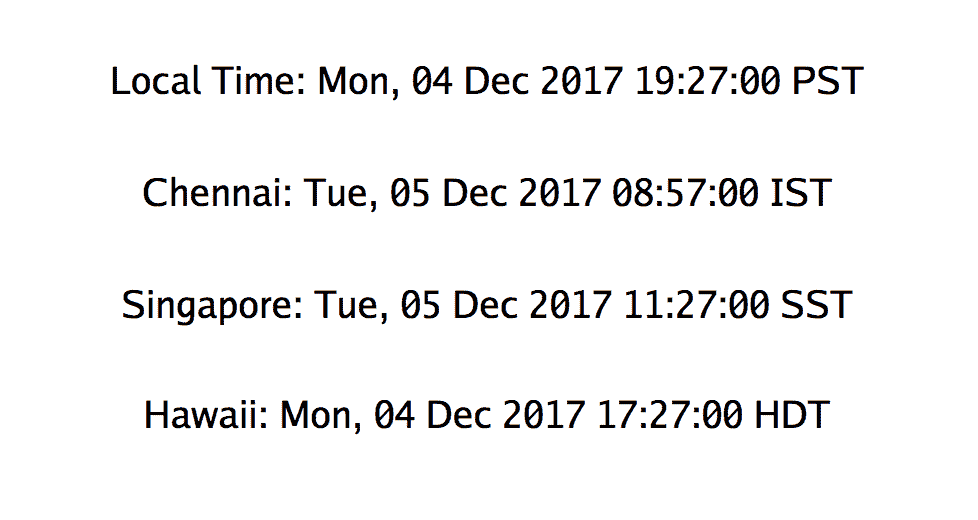

图 9.8：实时时钟 cog 的运行情况

随着每一秒的流逝，每个实时时钟都会更新新的时间值。虚拟 DOM 会渲染出变化的部分，有效地在每秒重新渲染实时时钟。

到目前为止，我们实现的前两个 cogs 都是完全由 Go 实现的纯 cogs。如果我们想利用现有的 JavaScript 解决方案来提供特定功能，该怎么办？这将是需要实现混合 cog 的情况，一个由 Go 和 JavaScript 实现的`cog`。

# 实现混合 cogs

JavaScript 已经存在了二十多年。在这段时间内，使用这种语言创建了许多强大的、可用于生产的解决方案。同构 Go 不能独立存在，我们必须承认 JavaScript 生态系统中有许多有用的现成解决方案。在许多情况下，我们可以通过利用现有的 JavaScript 解决方案来节省大量时间和精力，而不是以纯 Go 的方式重新实现整个解决方案。

混合 cogs 是使用 Go 和 JavaScript 实现的。混合 cogs 的主要目的是利用现有的 JavaScript 解决方案的功能，并将该功能公开为`cog`。这意味着`cog`实现者需要了解 Go 和 JavaScript 来实现混合 cogs。请记住，混合 cogs 的用户只需要了解 Go，因为 JavaScript 的使用是`cog`的内部实现细节。这使得那些可能不熟悉 JavaScript 的 Go 开发人员可以方便地使用 cogs。

# 日期选择器 cog

让我们考虑一种需要实现混合`cog`的情况。Molly，IGWEB 的事实产品经理，提出了一个提供更好客户支持的绝佳主意。她向技术团队提出的功能请求是允许网站用户在联系表单上提供一个可选的优先日期，通过这个日期，用户应该在 IGWEB 团队的 gopher 回复。

Molly 找到了一个独立的日期选择器小部件，使用纯 JavaScript 实现（没有框架/库依赖），名为 Pikaday：[`github.com/dbushell/Pikaday`](https://github.com/dbushell/Pikaday)。

Pikaday，JavaScript 日期选择器小部件，突出了本节开头提到的事实。JavaScript 不会消失，已经有许多有用的解决方案是用它创建的。这意味着，我们必须有能力在有意义的时候利用现有的 JavaScript 解决方案。Pikaday 日期选择器是一个特定的用例，更有利于利用现有的 JavaScript 日期选择器小部件，而不是将其作为纯`cog`实现。

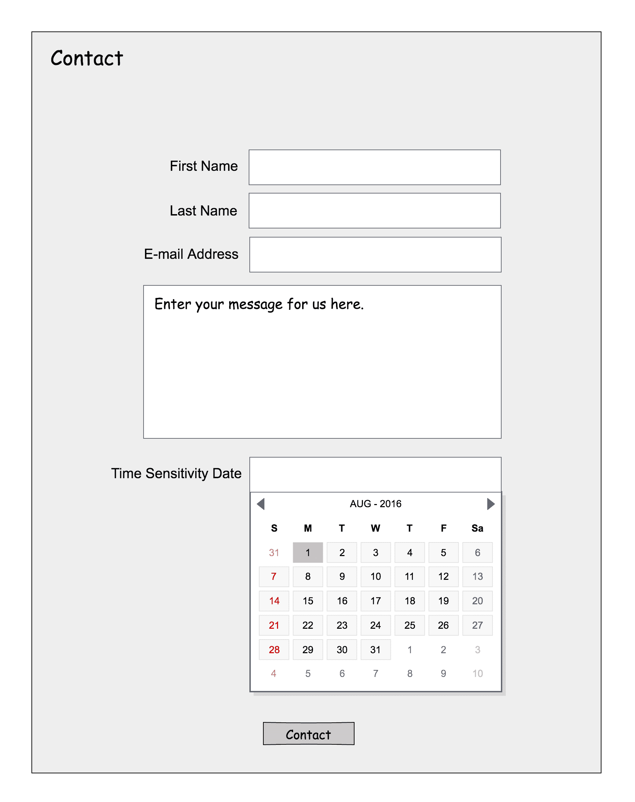

图 9.9：描述时间敏感日期输入字段和日历日期选择器小部件的线框设计

*图 9.9*是一个线框设计，描述了带有时间敏感输入字段的联系表单，当点击时，将显示一个日历日期选择器。让我们看看通过使用 Go 和 JavaScript 实现的日期选择器 cog 来满足 Molly 的请求需要做些什么。

我们首先将 Pikaday 日期选择器所需的 JavaScript 和 CSS 源文件放在`cog`的`static`文件夹中的`js`和`css`文件夹中（分别）。

在`shared/templates/partials/contactform_partial.tmpl`源文件中，我们声明了日期选择器 cog 的挂载点（以粗体显示）：

```go
    <fieldset class="pure-control-group">
      <div data-component="cog" id="sensitivityDate"></div>
    </fieldset>
```

`div`容器满足所有`cog`挂载点的两个基本要求：我们已经设置了属性`"data-component"`，值为`"cog"`，并为`cog`容器指定了一个`id`为`"sensitivityDate"`。

让我们逐节检查日期选择器 cog 的实现，定义在`shared/cogs/datepicker/datepicker.go`源文件中。首先，我们从声明包名开始：

```go
package datepicker
```

这是 cog 的导入分组：

```go
import (
  "errors"
  "reflect"
  "time"

  "github.com/gopherjs/gopherjs/js"
  "github.com/uxtoolkit/cog"
)
```

注意我们在导入分组中包含了`gopherjs`包（以粗体显示）。我们将需要`gopherjs`的功能来查询 DOM。

在我们声明`cogType`之后，我们将`JS`变量初始化为`js.Global`：

```go
var cogType reflect.Type
var JS = js.Global
```

正如您可能还记得的那样，这为我们节省了一点输入。我们可以直接将`js.Global`称为`JS`。

从 Pikaday 项目网页[`github.com/dbushell/Pikaday`](https://github.com/dbushell/Pikaday)，我们可以了解日期选择器小部件接受的所有输入参数。输入参数作为单个 JavaScript 对象提供。日期选择器`cog`将公开这些输入参数的子集，足以满足 Molly 的功能请求。我们创建了一个名为`DatePickerParams`的`struct`，它作为日期选择器小部件的输入参数：

```go
type DatePickerParams struct {
  *js.Object
  Field *js.Object `js:"field"`
  FirstDay int `js:"firstDay"`
  MinDate *js.Object `js:"minDate"`
  MaxDate *js.Object `js:"maxDate"`
  YearRange []int `js:"yearRange"`
}
```

我们嵌入`*js.Object`以指示这是一个 JavaScript 对象。然后我们为 JavaScript 输入对象的相应属性的`struct`声明相应的 Go 字段。例如，名为`Field`的字段是为`field`属性而声明的。我们为每个字段提供的`"js"` `struct`标签允许 GopherJS 将`struct`及其字段从其指定的 Go 名称转换为其等效的 JavaScript 名称。正如我们声明了名为 Field 的字段一样，我们还为`FirstDay`（`firstDay`）、`MinDate`（`minDate`）、`MaxDate`（`maxDate`）和`YearRange`（`yearRange`）声明了字段。

阅读 Pikaday 文档，[`github.com/dbushell/Pikaday`](https://github.com/dbushell/Pikaday)，我们可以了解每个输入参数的作用：

+   `Field` - 用于将日期选择器绑定到表单字段。

+   `FirstDay` - 用于指定一周的第一天。（0 代表星期日，1 代表星期一，依此类推）。

+   `MinDate` - 可以在日期选择器小部件中选择的最早日期。

+   `MaxDate` - 可以在日期选择器小部件中选择的最晚日期。

+   `YearRange` - 要显示的年份范围。

现在我们已经定义了日期选择器的输入参数结构`DatePickerParams`，是时候实现日期选择器`cog`了。我们首先声明`DatePicker`结构：

```go
type DatePicker struct {
  cog.UXCog
  picker *js.Object
}
```

像往常一样，我们嵌入`cog.UXCog`来带来我们需要的所有 UXCog 功能。我们还声明了一个字段`picker`，它是指向`js.Object`的指针。`picker`属性将用于引用 Pikaday 日期选择器 JavaScript 对象。

然后我们为日期选择器`cog`实现了一个名为`NewDatePicker`的构造函数：

```go
func NewDatePicker() *DatePicker {
  d := &DatePicker{}
  d.SetCogType(cogType)
  return d
}
```

到目前为止，cog 构造函数对您来说应该很熟悉。它的职责是返回`DatePicker`的新实例，并设置 cog 的`cogType`。

现在我们的构造函数已经就位，是时候来检查日期选择器 cog 的`Start`方法了：

```go
func (d *DatePicker) Start() error {

  if d.Props["datepickerInputID"] == nil {
    return errors.New("Warning: The datePickerInputID prop need to be set!")
  }

  err := d.Render()
  if err != nil {
    return err
  }
```

我们首先检查是否已设置`"datepickerInputID"`属性。这是输入字段元素的`id`，将用作`DatePickerParams` `struct`中的`Field`值。在开始`cog`之前，调用者必须设置此属性，这是一个硬性要求。未设置此属性将导致错误。

如果已设置`"datepickerInputID"`属性，我们调用 cog 的`Render`方法来渲染 cog。这将为日期选择器 JavaScript 小部件依赖的输入字段渲染 HTML 标记。

然后我们声明并实例化`params`，这是一个 JavaScript 对象，将被传递给日期选择器 JavaScript 小部件：

```go
params := &DatePickerParams{Object: js.Global.Get("Object").New()}
```

日期选择器输入参数对象`params`是一个 JavaScript 对象。Pikaday JavaScript 对象将使用`params`对象进行初始配置。

我们使用 cog 的`Props`属性来遍历 cog 的属性。对于每次迭代，我们获取属性的名称（`propName`）和属性的值（`propValue`）：

```go
 for propName, propValue := range d.Props {
```

我们声明的`switch`块对于可读性很重要：

```go
 switch propName {

    case "datepickerInputID":
      inputFieldID := propValue.(string)
      dateInputField := JS.Get("document").Call("getElementById", inputFieldID)
      params.Field = dateInputField

    case "datepickerLabel":
      // Do nothing

    case "datepickerMinDate":
      datepickerMinDate := propValue.(time.Time)
      minDateUnix := datepickerMinDate.Unix()
      params.MinDate = JS.Get("Date").New(minDateUnix * 1000)

    case "datepickerMaxDate":
      datepickerMaxDate := propValue.(time.Time)
      maxDateUnix := datepickerMaxDate.Unix()
      params.MaxDate = JS.Get("Date").New(maxDateUnix * 1000)

    case "datepickerYearRange":
      yearRange := propValue.([]int)
      params.YearRange = yearRange

    default:
      println("Warning: Unknown prop name provided: ", propName)
    }
  }
```

`switch`块内的每个`case`语句告诉我们日期选择器`cog`接受的所有属性作为输入参数，这些参数将被传递到 Pikaday JavaScript 小部件。如果未识别属性名称，则在 Web 控制台中打印警告，说明该属性未知。

第一种情况处理了`"datepickerInputID"`属性。它将用于指定激活 Pikaday 小部件的输入元素的`id`。在这种情况下，我们通过在`document`对象上调用`getElementById`方法并将`inputFieldID`传递给该方法来获取输入元素字段。我们将输入`params`属性`Field`设置为从`getElementById`方法调用中获取的输入字段元素。

第二种情况处理了`"datepickerLabel"`属性。`"datepickerLabel"`属性的值将在 cog 的模板源文件中使用。因此，不需要处理这种特殊情况。

第三种情况处理了`"datepickerMinDate"`属性。它将用于获取 Pikaday 小部件应显示的最小日期。我们将调用者提供的`type time.Time`的`"datepickerMinDate"`值转换为其 Unix 时间戳表示。然后，我们使用 Unix 时间戳创建一个新的 JavaScript `date`对象，适用于`minDate`输入参数。

第四种情况处理了`"datepickerMaxDate"`属性。它将用于获取日期选择器小部件应显示的最大日期。我们在这里采用了与`minDate`参数相同的策略。

第五种情况处理了`"datepickerYearRange"`属性。它将用于指定显示的日历将覆盖的年份范围。年份范围是一个切片，我们使用属性的值填充输入参数对象的`YearRange`属性。

如前所述，`default` `case`处理了调用者提供未知属性名称的情况。如果我们到达`default` `case`，我们将在 Web 控制台中打印警告消息。

现在我们可以实例化 Pikaday 小部件，并将输入参数对象`params`提供给它：

```go
d.picker = JS.Get("Pikaday").New(params)
```

最后，我们通过返回`nil`值表示启动`cog`时没有错误：

```go
return nil
```

现在我们已经实现了日期选择器 cog，让我们来看看 cog 的主要模板，定义在`shared/cogs/datepicker/templates/datepicker.tmpl`源文件中，是什么样子：

```go
 <label class="datepickerLabel" for="datepicker">{{.datepickerLabel}}</label>
 <input class="datepickerInput" type="text" id="{{.datepickerInputID}}" name="{{.datepickerInputID}}">
```

我们声明一个`label`元素，使用属性`"datepickerLabel"`显示日期选择器 cog 的标签。我们声明一个`input`元素，它将作为与 Pikaday 小部件一起使用的输入元素字段。我们使用`"datepickerInputID"`属性指定输入元素字段的`id`属性。

现在我们已经实现了日期选择器 cog，是时候开始使用它了。我们在`client/handlers/contact.go`源文件中的`InitializeContactPage`函数中实例化`cog`：

```go
  byDate := datepicker.NewDatePicker()
  byDate.CogInit(env.TemplateSet)
  byDate.SetID("sensitivityDate")
  byDate.SetProp("datepickerLabel", "Time Sensitivity Date:")
  byDate.SetProp("datepickerInputID", "byDateInput")
  byDate.SetProp("datepickerMinDate", time.Now())
  byDate.SetProp("datepickerMaxDate", time.Date(2027, 12, 31, 23, 59, 0, 0, time.UTC))
  err := byDate.Start()
  if err != nil {
    println("Encountered the following error when attempting to start the datepicker cog: ", err)
  }
```

首先，我们创建一个`DatePicker cog`的新实例。然后，我们调用 cog 的`CogInit`方法，注册应用程序的模板集。我们调用`SetID`方法设置 cog 的挂载点。我们调用 cog 的`SetProp`方法设置`datePickerLabel`、`datepickerInputID`、`datepickerMinDate`和`datepickerMaxDate`属性。我们调用 cog 的`Start`方法来激活它。如果启动`cog`时出现任何错误，我们将错误消息打印到 Web 控制台。

这就是全部内容了！我们可以利用日期选择器混合`cog`从 Pikaday 小部件中获取所需的功能。这种方法的优势在于，使用日期选择器`cog`的 Go 开发人员不需要了解 Pikaday 小部件的内部工作（JavaScript），就可以使用它。相反，他们可以在 Go 的范围内使用日期选择器`cog`向他们公开的功能。

*图 9.10*显示了日期选择器`cog`的操作截图：

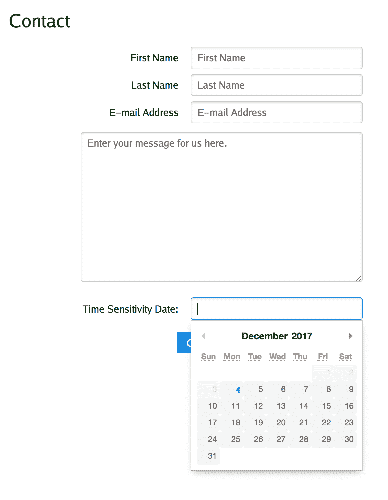

图 9.10：日历日期选择器小部件的操作

即使齿轮用户除了必需的`datepickerInputID`之外没有提供任何自定义配置日期选择器`cog`的 props，Pikaday 小部件也可以正常启动。但是，如果我们需要为`cog`提供一组默认参数怎么办？在下一个示例中，我们将构建另一个混合`cog`，一个轮播图（图像滑块）`cog`，在其中我们将定义默认参数。

# 轮播图齿轮

在本示例中，我们将创建一个图像轮播图齿轮，如*图 9.11*中的线框设计所示。

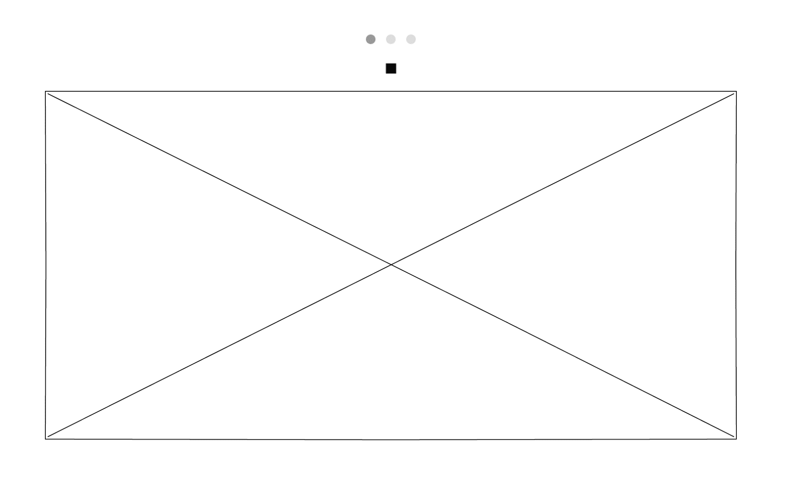

图 9.11：描述轮播图齿轮的线框设计

轮播图齿轮将由 vanilla JavaScript 中实现的 tiny-slider 小部件提供动力。以下是 tiny-slider 项目的 URL：[`github.com/ganlanyuan/tiny-slider`](https://github.com/ganlanyuan/tiny-slider)。

我们将 tiny-slider 小部件的 JavaScript 源文件`tiny-slider.min.js`放在齿轮的`static/js`文件夹中。我们将与 tiny-slider 小部件相关的 CSS 文件`tiny-slider.css`和`styles.css`放在`static/css`文件夹中。

我们将构建的轮播图齿轮将公开由 tiny-slider 小部件提供的以下输入参数：

```go
container Node | String Default: document.querySelector('.slider').
```

`container`参数表示滑块容器元素或选择器：

```go
items Integer Default: 1.
```

`items`参数表示正在显示的幻灯片数量：

```go
slideBy Integer | 'page' Default: 1.
```

`slideBy`参数表示一次“点击”要进行的幻灯片数量：

```go
autoplay Boolean Default: false.
```

`autoplay`参数用于切换幻灯片的自动更改：

```go
autoplayText Array (Text | Markup) Default: ['start', 'stop'].
```

`autoplayText`参数控制自动播放开始/停止按钮中显示的文本或标记。

```go
controls Boolean Default: true.
```

`controls`参数用于切换控件（上一个/下一个按钮）的显示和功能。

图像轮播图将显示 IGWEB 上可用的一组特色产品。我们在`shared/templates/index_content.tmpl`源文件中声明了齿轮的挂载点：

```go
<div data-component="cog" id="carousel"></div>
```

我们声明了作为轮播图齿轮挂载点的`div`容器。我们声明了属性`"data-component"`，并将其赋值为`"cog"`。我们还声明了一个`id`属性为`"carousel"`。

轮播图齿轮实现在`shared/cogs/carousel`文件夹中的`carousel.go`源文件中。以下是包声明和导入分组：

```go
package carousel

import (
  "errors"
  "reflect"

  "github.com/gopherjs/gopherjs/js"
  "github.com/uxtoolkit/cog"
)
```

tiny-slider 小部件使用输入参数 JavaScript 对象进行实例化。我们将使用`CarouselParams struct`来建模输入参数对象：

```go
type CarouselParams struct {
  *js.Object
  Container string `js:"container"`
  Items int `js:"items"`
  SlideBy string `js:"slideBy"`
  Autoplay bool `js:"autoplay"`
  AutoplayText []string `js:"autoplayText"`
  Controls bool `js:"controls"`
}
```

在嵌入指向`js.Object`的指针之后，我们在`struct`中定义的每个字段都对应于其等效的 JavaScript 参数对象属性。例如，`Container`字段映射到输入参数对象的`container`属性。

以下是定义`carousel`齿轮的`struct`：

```go
type Carousel struct {
  cog.UXCog
  carousel *js.Object
}
```

像往常一样，我们嵌入了`cog.UXCog`类型，以借用`UXCog`的功能。`carousel`字段将用于引用 JavaScript 对象的 tiny-slider 小部件。

到目前为止，您应该能够猜到轮播图齿轮的构造函数是什么样子的：

```go
func NewCarousel() *Carousel {
  c := &Carousel{}
  c.SetCogType(cogType)
  return c
}
```

除了创建对`Carousel`实例的新引用之外，构造函数还设置了齿轮的`cogType`。

现在是时候检查轮播图齿轮实现的大部分内容了，这些内容可以在齿轮的`Start`方法中找到：

```go
func (c *Carousel) Start() error {
```

我们首先检查`cog`的用户是否设置了`contentItems`和`carouselContentID`props。`contentItems`prop 是应该出现在轮播图中的图像的服务器相对路径的字符串切片。`carouselContentID`prop 是包含轮播图内容的`div`容器的`id`属性的值。

如果这些 props 中的任何一个都没有设置，我们将返回一个指示这两个 props 都必须设置的`error`。如果这两个 props 已经设置，我们将继续渲染齿轮：

```go
  if c.Props["contentItems"] == nil || c.Props["carouselContentID"] == nil {
    return errors.New("The contentItems and carouselContentID props need to be set!")
  }

  err := c.Render()
  if err != nil {
    return err
  }
```

在这一时刻我们渲染`cog`，因为网页上需要存在 HTML 标记才能使`cog`正常工作。值得注意的是，包含轮播内容的`div`容器，我们使用必需的`carouselContentID`属性提供其`id`。如果渲染`cog`时出现错误，我们返回错误以表示无法启动`cog`。如果在渲染`cog`时没有遇到错误，我们继续实例化输入参数对象：

```go
 params := &CarouselParams{Object: js.Global.Get("Object").New()}
```

这个`struct`代表了我们将在实例化时提供给 tiny-slider 对象的输入参数。

接下来的代码部分很重要，因为这是我们定义默认参数的地方：

```go
  // Set the default parameter values
  params.Items = 1
  params.SlideBy = "page"
  params.Autoplay = true
  params.AutoplayText = []string{PLAYTEXT, STOPTEXT}
  params.Controls = false
```

当齿轮维护者查看这一段代码时，他们可以很容易地确定齿轮的默认行为。通过查看默认参数，可以知道滑块一次只会显示一个项目。滑块设置为按页模式滑动，并且滑块将自动开始幻灯片放映。我们为`AutoplayText`属性提供了一个字符串切片，使用`PLAYTEXT`和`STOPTEXT`常量分别表示播放和停止按钮的文本符号。我们将`Controls`属性设置为`false`，这样默认情况下图像轮播中将不会出现上一个和下一个按钮。

我们继续迭代`cog`的用户提供的所有属性，访问每个属性，包括`propName`（`string`）和`propValue`（`interface{}`）：

```go
 for propName, propValue := range c.Props {
```

我们在`propName`上声明了一个`switch`块：

```go
 switch propName {

    case "carouselContentID":
      if propValue != nil {
        params.Container = "#" + c.Props["carouselContentID"].(string)
      }

    case "contentItems":
      // Do nothing

    case "items":
      if propValue != nil {
        params.Items = propValue.(int)
      }

    case "slideBy":
      if propValue != nil {
        params.SlideBy = c.Props["slideBy"].(string)
      }

    case "autoplay":
      if propValue != nil {
        params.Autoplay = c.Props["autoplay"].(bool)
      }

    case "autoplayText":
      if propValue != nil {
        params.AutoplayText = c.Props["autoplayText"].([]string)
      }

    case "controls":
      if propValue != nil {
        params.Controls = c.Props["controls"].(bool)
      }

    default:
      println("Warning: Unknown prop name provided: ", propName)
    }
  }
```

使用`switch`块可以轻松看到每个`case`语句中所有有效属性的名称。如果属性名称未知，则会进入`default`情况，在那里我们会在 Web 控制台中打印警告消息。

第一个`case`处理了必需的`"carouselContentID"`属性。它用于指定将包含轮播内容项目的`div`容器。

第二个`case`处理了必需的`"contentItems"`属性。这个属性是一个`string`切片，用于在 cog 的模板中使用，因此我们不需要执行任何操作。

第三个`case`处理了`"items"`属性。这是处理 tns-slider 对象的`items`参数的属性，它显示在同一时间显示的幻灯片数量。如果属性值不是`nil`，我们将属性值的`int`值分配给`params.Items`属性。

第四个`case`处理了`slideBy`属性。如果属性值不是`nil`，我们将属性值（断言为`string`类型）分配给`params`对象的`SlideBy`属性。

第五个`case`处理了`"autoplay"`属性。如果属性值不是`nil`，我们将属性值（断言为`bool`类型）分配给`params`对象的`Autoplay`属性。

第六个`case`处理了`"autoplayText"`属性。如果属性值不是`nil`，我们将属性值（断言为`[]string`类型）分配给`params`对象的`AutoplayText`属性。

第七个`case`处理了`"controls"`属性。如果属性值不是`nil`，我们将属性值（断言为`bool`类型）分配给`params`对象的`Controls`属性。

如果属性名称不属于前面七个情况之一，它将由`default case`处理。请记住，如果我们到达这个`case`，这表示`cog`的用户提供了一个未知的属性名称。

现在我们可以实例化 tiny-slider 小部件并将其分配给齿轮的`carousel`属性：

```go
c.carousel = JS.Get("tns").New(params)
```

`Start`方法返回`nil`值，表示启动`cog`时没有遇到错误：

```go
return nil
```

`shared/cogs/carousel/templates/carousel.tmpl`源文件定义了 carousel `cog`的模板：

```go
<div id="{{.carouselContentID}}" class="carousel">
{{range .contentItems}}
  <div>"></div>
{{end}}
</div>
```

我们声明一个`div`容器来存放轮播图像。`contentItems`中的每个项目都是到图像的服务器相对路径。我们使用`range`模板操作来迭代`contentItems`属性（一个`string`切片），以打印出每个图像的地址，这些地址位于自己的`div`容器内。请注意，我们将点（`.`）模板操作作为`img`元素的`src`属性的值。点模板操作表示在迭代`contentItems`切片时的当前值。

现在我们已经实现了轮播`cog`并创建了其模板，是时候在主页上实例化和启动`cog`了。我们将添加轮播`cog`的代码到`client/handlers/index.go`源文件的`InitializeIndexPage`函数的开头。

```go
  c := carousel.NewCarousel()
  c.CogInit(env.TemplateSet)
  c.SetID("carousel")
  contentItems := []string{"/static/images/products/watch.jpg", "/static/images/products/shirt.jpg", "/static/images/products/coffeemug.jpg"}
  c.SetProp("contentItems", contentItems)
  c.SetProp("carouselContentID", "gophersContent")
  err := c.Start()
  if err != nil {
    println("Encountered the following error when attempting to start the carousel cog: ", err)
  }
```

我们首先通过调用构造函数`NewCarousel`创建一个新的轮播`cog`，`c`。我们调用`CogInit`方法将应用程序的模板集与`cog`关联起来。我们调用`SetID`方法将`cog`与其挂载点关联起来，即`div`容器，`cog`将在其中呈现其输出。我们使用`string`切片文字将路径设置为图像文件的路径。我们调用`SetProp`方法设置所需的`contentItems`和所需的`carouselContent`属性。我们不设置任何其他属性，因为我们对轮播`cog`的默认行为感到满意。我们启动`cog`并检查是否在此过程中遇到任何错误。如果遇到任何错误，我们将在 Web 控制台中打印错误消息。

*图 9.12*是渲染的轮播`cog`的屏幕截图：


图 9.12：轮播`cog`的运行情况

现在我们已经完成了轮播`cog`，接下来我们将在下一节中创建一个通知`cog`，用于在网页上显示动画通知消息。

# 通知`cog`

到目前为止，我们考虑的所有`cog`实现都已将输出呈现到网页上。让我们考虑实现一个不将任何输出呈现到网页上的`cog`。我们将要实现的通知`cog`将利用 Alertify JavaScript 库在网页上显示动画通知消息。

*图 9.13*是一个插图，描述了当用户将商品添加到购物车时，出现在网页右下角的通知消息：

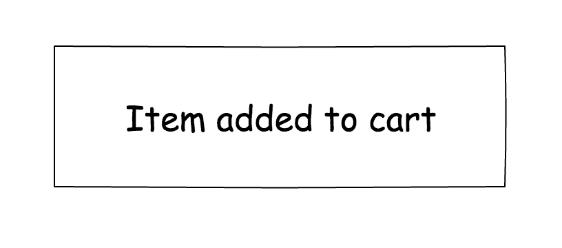

图 9.13：插图描述了一个通知

由于`cog`将完全依赖 JavaScript 库进行渲染，因此我们不必为`cog`实现模板，也不必为`cog`声明挂载点。

我们将利用 Alertify JavaScript 库的功能来显示通知。以下是 Alertify 项目的 URL：[`github.com/MohammadYounes/AlertifyJS`](https://github.com/MohammadYounes/AlertifyJS)。

查看`shared/cogs/notify`文件夹，注意没有模板文件夹存在。我们已将 Alertify 的 CSS 和 JavaScript 源文件的静态资产放在`shared/cogs/notify/static/css`和`shared/cogs/notify/static/js`文件夹中。

通知`cog`实现在`shared/cogs/notify`文件夹中的`notify.go`源文件中。由于对于客户端 Web 应用程序来说只有一个通知系统是有意义的，即由通知`cog`提供的通知系统，因此只能启动一个`cog`实例。为了跟踪并确保只能启动一个通知`cog`实例，我们将声明`alreadyStarted`布尔变量：

```go
var alreadyStarted bool
```

`Notify`结构定义了通知`cog`的字段：

```go
type Notify struct {
  cog.UXCog
  alertify *js.Object
  successNotificationEventListener func(*js.Object)
  errorNotificationEventListener func(*js.Object)
}
```

我们在这里输入`cog.UXCog`以便带入实现`Cog`接口所需的功能。`alertify`字段用于引用`alertify` JavaScript 对象。

我们正在构建的通知`cog`是事件驱动的。例如，当从客户端应用程序的任何页面触发自定义成功通知事件时，将显示成功通知。我们定义了两个字段，`successNotificationEventListener`和`errorNotificationEventListener`，它们都是函数，以 JavaScript 对象指针作为输入变量。我们定义了这些字段，以便我们可以跟踪设置用于监听成功和错误通知的自定义事件监听器函数。当需要移除事件监听器时，因为它们是通知`cog`实例的属性，所以很容易访问它们。

`NewNotify`函数充当构造函数：

```go
func NewNotify() *Notify {
  n := &Notify{}
  n.SetCogType(cogType)
  n.SetCleanupFunc(n.Cleanup)
  return n
}
```

请注意，我们已注册了一个清理函数（以粗体显示），该函数将在销毁`cog`之前调用。

让我们来看一下`Start`方法：

```go
func (n *Notify) Start() error {
  if alreadyStarted == true {
    return errors.New("The notification cog can be instantiated only once.")
  }
```

我们首先检查`alreadyStarted`布尔变量的值，以查看是否已经启动了通知`cog`实例。如果`alreadyStarted`的值为`true`，则表示先前已经启动了通知`cog`实例，因此我们返回一个指示无法启动通知`cog`的`error`。

如果`cog`尚未启动，我们继续实例化 Alertify JavaScript 对象：

```go
 n.alertify = js.Global.Get("alertify")
```

我们调用`StartListening`方法来设置监听自定义成功和错误通知消息事件的事件监听器：

```go
  n.StartListening()
  return nil
```

这是`StartListening`方法：

```go
func (n *Notify) StartListening() {

  alreadyStarted = true
  D := dom.GetWindow()
  n.successNotificationEventListener = D.AddEventListener("displaySuccessNotification", false, func(event dom.Event) {
    message := event.Underlying().Get("detail").String()
    n.notifySuccess(message)
  })

  n.errorNotificationEventListener = D.AddEventListener("displayErrorNotification", false, func(event dom.Event) {
    message := event.Underlying().Get("detail").String()
    n.notifyError(message)
  })
}
```

如果我们已经到达这个方法，这表明`cog`已经成功启动，所以我们将`alreadyStarted`布尔变量设置为`true`。我们设置一个事件监听器，用于监听`displaySuccessNotification`自定义事件。我们通过将其赋值给`cog`实例的`successNotificationEventListener`属性来跟踪我们正在创建的事件监听器函数。我们声明并实例化`message`变量，并将其设置为`event`对象的`detail`属性，该属性将包含应在网页上显示给用户的`string` `message`。然后我们调用`cog`的`notifySuccess`方法来在网页上显示成功通知消息。

我们遵循类似的程序来设置`displayErrorNotification`的事件监听器。我们将事件监听器函数分配给`cog`的`errorNotificationEventListener`属性。我们从`event`对象中提取`detail`属性，并将其分配给`message`变量。我们调用`cog`的`notifyError`方法来在网页上显示错误通知消息。

`notifySuccess`方法负责在网页上显示成功通知消息：

```go
func (n *Notify) notifySuccess(message string) {
  n.alertify.Call("success", message)
}
```

我们调用 alertify 对象的`success`方法来显示成功通知消息。

`notifyError`方法负责在网页上显示错误通知消息：

```go
func (n *Notify) notifyError(message string) {
  n.alertify.Call("error", message)
}
```

我们调用 alertify 对象的`error`方法来显示错误通知消息。

`CleanUp`方法只是调用`StopListening`方法：

```go
func (n *Notify) Cleanup() {
  n.StopListening()
}
```

`StopListening`方法用于在销毁`cog`之前移除事件监听器：

```go
func (n *Notify) StopListening() {
  D := dom.GetWindow()
  if n.successNotificationEventListener != nil {
    D.RemoveEventListener("displaySuccessNotification", false, n.successNotificationEventListener)
  }

  if n.errorNotificationEventListener != nil {
    D.RemoveEventListener("displayErrorNotification", false, n.errorNotificationEventListener)
  }

}
```

我们调用 DOM 对象的`RemoveEventListener`方法来移除处理`displaySuccessNotification`和`displayErrorNotification`自定义事件的事件监听函数。

`notify`包的导出`Success`函数用于广播自定义成功事件通知消息：

```go
func Success(message string) {
  var eventDetail = js.Global.Get("Object").New()
  eventDetail.Set("detail", message)
  customEvent := js.Global.Get("window").Get("CustomEvent").New("displaySuccessNotification", eventDetail)
  js.Global.Get("window").Call("dispatchEvent", customEvent)
}
```

在函数内部，我们创建了一个名为`eventDetail`的新 JavaScript 对象。我们将应该在网页上显示的`string` `message`分配给`eventDetail`对象的`detail`属性。然后，我们创建了一个名为`customEvent`的新自定义`event`对象。我们将自定义事件的名称`displaySuccessNotification`以及`eventDetail`对象作为输入参数传递给`CustomEvent`类型的构造函数。最后，为了分发事件，我们在`window`对象上调用`dispatchEvent`方法，并提供`customEvent`。

notify 包的导出`Error`函数用于广播自定义错误事件通知消息：

```go
func Error(message string) {
  var eventDetail = js.Global.Get("Object").New()
  eventDetail.Set("detail", message)
  customEvent := js.Global.Get("window").Get("CustomEvent").New("displayErrorNotification", eventDetail)
  js.Global.Get("window").Call("dispatchEvent", customEvent)
}
```

这个函数的实现几乎与`Success`函数完全相同。唯一的区别是我们分发了一个`displayErrorNotification`自定义事件。

我们在`client/handlers/initpagelayoutcontrols.go`源文件中的`InitializePageLayoutControls`函数中实例化和启动通知`cog`（以粗体显示）：

```go
func InitializePageLayoutControls(env *common.Env) {

 n := notify.NewNotify()
 err := n.Start()
 if err != nil {
 println("Error encountered when attempting to start the notify cog: ", err)
 }

  liveChatIcon := env.Document.GetElementByID("liveChatIcon").(*dom.HTMLImageElement)
  liveChatIcon.AddEventListener("click", false, func(event dom.Event) {

    chatbox := env.Document.GetElementByID("chatbox")
    if chatbox != nil {
      return
    }
    go chat.StartLiveChat(env)
  })

}
```

将添加商品到购物车的通知消息（成功或错误）放在`client/handlers/shoppingcart.go`源文件中的`addToCart`函数中：

```go
func addToCart(productSKU string) {

  m := make(map[string]string)
  m["productSKU"] = productSKU
  jsonData, _ := json.Marshal(m)

  data, err := xhr.Send("PUT", "/restapi/add-item-to-cart", jsonData)
  if err != nil {
    println("Encountered error: ", err)
    notify.Error("Failed to add item to cart!")
    return
  }
  var products []*models.Product
  json.NewDecoder(strings.NewReader(string(data))).Decode(&products)
  notify.Success("Item added to cart")
}
```

如果商品无法添加到购物车，则调用`notify.Error`函数（以粗体显示）。如果商品成功添加到购物车，则调用`notify.Success`函数（以粗体显示）。

从`client/handlers/shoppingcart.go`源文件中的`removeFromCart`函数中找到从购物车中移除商品的通知消息：

```go
func removeFromCart(env *common.Env, productSKU string) {

  m := make(map[string]string)
  m["productSKU"] = productSKU
  jsonData, _ := json.Marshal(m)

  data, err := xhr.Send("DELETE", "/restapi/remove-item-from-cart", jsonData)
  if err != nil {
    println("Encountered error: ", err)
    notify.Error("Failed to remove item from cart!")
    return
  }
  var products []*models.Product
  json.NewDecoder(strings.NewReader(string(data))).Decode(&products)
  renderShoppingCartItems(env)
  notify.Success("Item removed from cart")
}
```

如果商品无法从购物车中移除，则调用`notify.Error`函数（以粗体显示）。如果商品成功从购物车中移除，则调用`notify.Success`函数（以粗体显示）。

*图 9.14*是通知 cog 在操作时的裁剪截图，当我们向购物车中添加产品时：

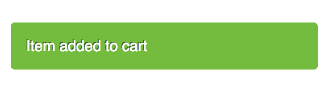

图 9.14：通知 cog 在操作中

# 摘要

在本章中，我们介绍了 cogs——可重复使用的组件，可以纯粹使用 Go（纯 cogs）实现，也可以使用 Go 和 JavaScript（混合 cogs）实现。Cogs 带来了许多好处。我们可以以即插即用的方式使用它们，创建它们的多个实例，由于它们的自包含性质，可以轻松地维护它们，并且可以轻松地重用它们，因为它们可以作为自己的 Go 包以及它们所需的静态资产（模板文件、CSS 和 JavaScript 源文件）存在。

我们向您介绍了 UX 工具包，它为我们提供了实现 cogs 的技术。我们研究了 cog 的解剖结构，并探讨了关于 Go、CSS、JavaScript 和模板文件放置的 cog 文件结构可能是什么样子。我们考虑了 cogs 如何利用虚拟 DOM 来呈现其内容，而不是执行昂贵的替换内部 HTML 操作。我们介绍了 cog 生命周期的各个阶段。我们向您展示了如何在 IGWEB 中实现各种 cogs，其中包括纯 cogs 和混合 cogs。

在第十章中，*测试同构 Go Web 应用程序*，我们将学习如何对 IGWEB 进行自动化的端到端测试。这将包括实现测试来在服务器端和客户端上执行功能。
