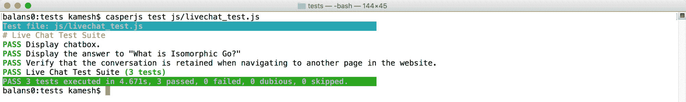
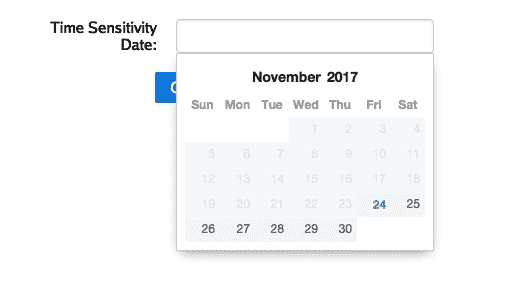

# 第十章：测试同构 Go Web 应用

通过在上一章中对网站进行可重用组件（齿轮）的点缀，我们已经达到了一个项目里程碑——我们完成了第二章《同构 Go 工具链》中规划的 IGWEB 功能集。然而，我们还不能立即启动 IGWEB。在启动之前，我们必须通过验证它是否满足一定的基本功能要求来确保同构 Web 应用的质量。为此，我们必须实施端到端测试，跨环境（服务器端和客户端）测试同构 Web 应用的功能。

在本章中，您将学习如何为 IGWEB 提供端到端的测试覆盖。我们将使用 Go 的内置测试框架测试服务器端功能，并使用 CasperJS 测试客户端功能。通过实施一套端到端测试，我们不仅可以进行自动化测试，而且在编写的每个测试中还有一个有价值的项目工件，因为每个测试都传达了同构 Web 应用中预期功能的意图。到本章结束时，我们将创建一个端到端测试套件，为稳固的测试策略奠定基础，读者可以进一步构建。

在本章中，我们将涵盖以下主题：

+   使用 Go 的测试框架测试服务器端功能

+   使用 CasperJS 测试客户端功能

# 测试服务器端功能

正如我们在第一章《使用 Go 构建同构 Web 应用》中所学到的，同构 Web 应用架构利用了经典的 Web 应用架构，这意味着 Web 页面响应将在服务器端呈现。这意味着 Web 客户端无需启用 JavaScript 即可消费从服务器响应接收到的内容。这对于机器用户（如搜索引擎爬虫）尤为重要，他们需要爬行网站上找到的各种链接并对其进行索引。通常情况下，搜索引擎蜘蛛是不启用 JavaScript 的。这意味着我们必须确保服务器端路由正常运行，并且 Web 页面响应也正确呈现。

除此之外，我们在第七章《同构 Web 表单》中，付出了很大的努力，创建了一个可访问的、同构的 Web 表单，可以被有更高辅助功能需求的用户访问。我们需要确保联系表单的验证功能正常运行，并且我们可以成功发送有效的联系表单提交。

因此，在服务器端，我们将测试的基本功能包括以下项目：

1.  验证服务器端路由和模板呈现

1.  验证联系表单的验证功能

1.  验证成功的联系表单提交

# Go 的测试框架

我们将使用 Go 的内置测试框架编写一组测试，测试 IGWEB 的服务器端功能。所有服务器端测试都存储在`tests`文件夹中。

如果您对 Go 内置的测试框架还不熟悉，可以通过此链接了解更多：[`golang.org/pkg/testing/`](https://golang.org/pkg/testing/)。

在运行`go test`命令执行所有测试之前，您必须启动 Redis 服务器实例和 IGWEB（最好分别在它们自己的专用终端窗口或选项卡中）。

您可以使用以下命令启动 Redis 服务器实例：

```go
$ redis-server
```

您可以使用以下命令在`$IGWEB_APP_ROOT`文件夹中启动 IGWEB 实例：

```go
$ go run igweb.go
```

要运行套件中的所有测试，我们只需在`tests`文件夹中运行`go test`命令：

```go
$ go test
```

# 验证服务器端路由和模板呈现

我们创建了一个测试来验证 IGWEB 应用程序的所有服务器端路由。我们测试的每个路由都将与一个预期的字符串令牌相关联，该令牌在页面响应中呈现，特别是在主要内容`div`容器中。因此，我们不仅能够验证服务器端路由是否正常运行，还能知道服务器端模板呈现是否正常运行。

以下是在`tests`文件夹中找到的`routes_test.go`源文件的内容：

```go
package tests

import (
  "io/ioutil"
  "net/http"
  "strings"
  "testing"
)

func checkRoute(t *testing.T, route string, expectedToken string) {

  testURL := testHost + route
  response, err := http.Get(testURL)
  if err != nil {
    t.Errorf("Could not connect to URL: %s. Failed with error: %s",     
    testURL, err)
  } else {
    defer response.Body.Close()
    contents, err := ioutil.ReadAll(response.Body)
    if err != nil {
      t.Errorf("Could not read response body. Failed with error: %s",   
      err)
    }
    if strings.Contains(string(contents), expectedToken) == false {
      t.Errorf("Could not find expected string token: \"%s\", in 
      response body for URL: %s", expectedToken, testURL)
    }
  }
}

func TestServerSideRoutes(t *testing.T) {

  routesTokenMap := map[string]string{"": "IGWEB", "/": "IGWEB",   
  "/index": "IGWEB", "/products": "Add To Cart", "/product-  
  detail/swiss-army-knife": "Swiss Army Knife", "/about": "Molly",   
  "/contact": "Enter your message for us here"}

  for route, expectedString := range routesTokenMap {
    checkRoute(t, route, expectedString)
  }
}
```

我们定义的`testHost`变量用于指定运行 IGWEB 实例的主机名和端口。

`TestServerSideRoutes`函数负责测试服务器端路由，并验证预期的令牌字符串是否存在于响应正文中。在函数内部，我们声明并初始化了`routesTokenMap`变量，类型为`map[string]string`。此`map`中的键表示我们正在测试的服务器端路由，给定键的值表示应该存在于从服务器返回的网页响应中的预期`string`令牌。因此，这个测试不仅会告诉我们服务器端路由是否正常运行，还会让我们对模板呈现的健康状况有一个很好的了解，因为我们提供的预期`string`令牌都是应该在网页正文中找到的字符串。然后，我们通过`routesTokenMap`进行`range`，对于每次迭代，我们将`route`和`expectedString`传递给`checkRoute`函数。

`checkRoute`函数负责访问给定路由，读取其响应正文并验证`expectedString`是否存在于响应正文中。有三种情况可能导致测试失败：

1.  当无法连接到路由 URL 时

1.  如果无法读取从服务器检索到的响应正文

1.  如果从服务器返回的网页响应中不存在预期的字符串令牌

如果发生这三种错误中的任何一种，测试将失败。否则函数将正常返回。

我们可以通过发出以下`go test`命令来运行此测试：

```go
$ go test -run TestServerSideRoutes
```

检查运行测试的输出显示测试已通过：

```go
$ go test -run TestServerSideRoutes
PASS
ok github.com/EngineerKamesh/igb/igweb/tests 0.014s
```

我们现在已成功验证了访问服务器端路由并确保每个路由中的预期字符串在网页响应中正确呈现。现在，让我们开始验证联系表单功能，从表单验证功能开始。

# 验证联系表单的验证功能

我们将要实现的下一个测试将测试联系表单的服务器端表单验证功能。我们将测试两种类型的验证：

+   当未填写必填表单字段时显示的错误消息

+   当在电子邮件字段中提供格式不正确的电子邮件地址值时显示的错误消息

以下是在`tests`文件夹中找到的`contactvalidation_test.go`源文件的内容：

```go
package tests

import (
  "io/ioutil"
  "net/http"
  "net/url"
  "strconv"
  "strings"
  "testing"
)

func TestContactFormValidation(t *testing.T) {

  testURL := testHost + "/contact"
  expectedTokenMap := map[string]string{"firstName": "The first name 
  field is required.", "/": "The last name field is required.",   
  "email": "The e-mail address entered has an improper syntax.",   
  "messageBody": "The message area must be filled."}

  form := url.Values{}
  form.Add("firstName", "")
  form.Add("lastName", "")
  form.Add("email", "devnull@g@o")
  form.Add("messageBody", "")

  req, err := http.NewRequest("POST", testURL,   
  strings.NewReader(form.Encode()))

  if err != nil {
    t.Errorf("Failed to create new POST request to URL: %s, with error:   
    %s", testURL, err)
  }

  req.Header.Add("Content-Type", "application/x-www-form-urlencoded")
  req.Header.Add("Content-Length", strconv.Itoa(len(form.Encode())))

  hc := http.Client{}
  response, err := hc.Do(req)

  if err != nil {
    t.Errorf("Failed to make POST request to URL: %s, with error: %s", 
    testURL, err)
  }

  defer response.Body.Close()
  contents, err := ioutil.ReadAll(response.Body)

  if err != nil {
    t.Errorf("Failed to read response body contents with error: %s",         
    err)
  }

  for k, v := range expectedTokenMap {
    if strings.Contains(string(contents), v) == false {
      t.Errorf("Could not find expected string token: \"%s\" for field 
      \"%s\"", v, k)
    }
  }

}
```

`TestContactFormValidation`函数负责测试联系表单的服务器端表单验证功能。我们声明并初始化了`testURL`变量，该变量是 IGWEB 联系部分的 URL。

我们声明并初始化了`expectedTokenMap`变量，类型为`map[string]string`，其中`map`中的键是表单字段的名称，每个键的值表示在提交表单时应返回的预期错误消息。

我们创建一个新表单，并使用表单对象的`Add`方法填充表单字段值。请注意，我们为`firstName`、`lastName`和`messageBody`字段提供了空的`string`值。我们还为`email`字段提供了格式不正确的电子邮件地址。

我们使用`http`包中找到的`NewRequest`函数使用 HTTP POST 请求提交表单。

我们创建一个`http.Client`，`hc`，并通过调用它的`Do`方法提交 POST 请求。我们使用`ioutil`包中的`ReadAll`函数获取响应正文的内容。我们通过`expectedTokenMap`进行`range`，在每次迭代中，我们检查响应正文中是否包含预期的错误消息。

这些是可能导致此测试失败的四种可能条件：

+   如果无法创建 POST 请求

+   如果由于与 Web 服务器的连接问题而导致 POST 请求失败

+   如果网页客户端无法读取从 Web 服务器返回的网页响应的响应正文

+   如果在网页正文中找不到预期的错误消息

如果遇到任何这些错误中的一个，这个测试将失败。

我们可以通过发出以下命令来运行这个测试：

```go
$ go test -run TestContactFormValidation
```

运行测试的输出显示测试已经通过：

```go
$ go test -run TestContactFormValidation
PASS
ok github.com/EngineerKamesh/igb/igweb/tests 0.009s
```

# 验证成功的联系表单提交

我们将要实现的下一个测试将测试成功的联系表单提交。这个测试将与上一个测试非常相似，唯一的区别是我们将填写所有表单字段，并在`email`表单字段中提供一个格式正确的电子邮件地址。

以下是`tests`文件夹中`contact_test.go`源文件的内容：

```go
package tests

import (
  "io/ioutil"
  "net/http"
  "net/url"
  "strconv"
  "strings"
  "testing"
)

func TestContactForm(t *testing.T) {

  testURL := testHost + "/contact"
  expectedTokenString := "The contact form has been successfully   
  completed."

  form := url.Values{}
  form.Add("firstName", "Isomorphic")
  form.Add("lastName", "Gopher")
  form.Add("email", "devnull@test.com")
  form.Add("messageBody", "This is a message sent from the automated   
  contact form test.")

  req, err := http.NewRequest("POST", testURL,   
  strings.NewReader(form.Encode()))

  if err != nil {
    t.Errorf("Failed to create new POST request to URL: %s, with error: 
    %s", testURL, err)
  }

  req.Header.Add("Content-Type", "application/x-www-form-urlencoded")
  req.Header.Add("Content-Length", strconv.Itoa(len(form.Encode())))

  hc := http.Client{}
  response, err := hc.Do(req)

  if err != nil {
    t.Errorf("Failed to make POST request to URL: %s, with error: %s", 
    testURL, err)
  }

  defer response.Body.Close()
  contents, err := ioutil.ReadAll(response.Body)

  if err != nil {
    t.Errorf("Failed to read response body contents with error: %s", 
    err)
  }

  if strings.Contains(string(contents), expectedTokenString) == false {
    t.Errorf("Could not find expected string token: \"%s\"", 
    expectedTokenString)
  }
}
```

再次，这个测试与我们之前实现的测试非常相似，只是我们填充了所有表单字段并提供了一个格式正确的电子邮件地址。我们声明并初始化`expectedTokenString`变量，以确认我们期望在成功提交表单后在响应正文中打印出的确认字符串。函数的最后一个`if`条件块检查响应正文是否包含`expectedTokenString`。如果没有，那么测试将失败。

这些是可能导致此测试失败的四种可能条件：

+   如果无法创建 POST 请求

+   如果由于与 Web 服务器的连接问题而导致 POST 请求失败

+   如果网页客户端无法读取从 Web 服务器返回的网页响应的响应正文

+   如果在网页正文中找不到预期的确认消息

同样，如果遇到任何这些错误中的一个，这个测试将失败。

我们可以通过发出以下命令来运行测试：

```go
$ go test - run TestContactForm
```

通过检查运行测试后的输出，我们可以看到测试已经通过：

```go
$ go test - run TestContactForm
PASS
ok github.com/EngineerKamesh/igb/igweb/tests 0.012s
```

您可以通过在`tests`目录中简单地发出`go test`命令来运行测试套件中的所有测试：

```go
$ go test
PASS
ok github.com/EngineerKamesh/igb/igweb/tests 0.011s
```

到目前为止，我们已经编写了测试来覆盖测试服务器端 Web 应用程序的基线功能集。现在，是时候专注于测试客户端应用程序了。

# 测试客户端功能

正如[第一章](https://cdp.packtpub.com/isomorphic_go/wp-admin/post.php?post=616&action=edit#post_26)中所述，《使用 Go 构建同构 Web 应用程序》，在初始页面加载后，网站上的后续导航使用单页面应用程序架构提供。这意味着会发起 XHR 调用到 Rest API 端点，以提供渲染内容所需的数据，这些内容将显示在网页上。例如，当客户端处理程序显示产品列表页面时，会利用 Rest API 端点来获取要显示的产品列表。在某些情况下，甚至不需要 Rest API 端点，因为页面内容只需要渲染模板。一个这样的例子是当用户通过点击导航栏中的联系链接访问联系表单时。在这种情况下，我们只需渲染联系表单模板，并在主要内容区域显示内容。

让我们花点时间思考一下我们需要在客户端测试的所有基本功能。我们需要验证客户端路由是否正常运行，并且对于每个路由都会呈现正确的页面，类似于我们在上一节中验证服务器端路由的方式。除此之外，我们还需要确认客户端表单验证对联系表单是否有效，并测试有效表单提交的情况。目前，添加和移除购物车中物品的功能仅在客户端实现。这意味着我们必须编写测试来验证此功能是否按预期工作。目前仅在客户端可用的另一个功能是实时聊天功能。我们必须验证用户能否与实时聊天机器人进行通信，机器人是否回复，并且在用户导航到网站的不同部分时，对话是否保持。

最后，我们必须测试我们的齿轮集合。我们必须确保时间齿轮以人类可理解的格式显示时间实例。我们必须验证实时时钟齿轮是否正常运行。我们必须验证当点击时间敏感日期字段时，日期选择器齿轮是否出现。我们必须验证主页上是否出现了轮播齿轮。最后，我们必须验证当向购物车中添加和移除物品时，通知齿轮是否正确显示通知。

因此，在客户端，我们将测试的基线功能包括以下项目：

1.  验证客户端路由和模板呈现

1.  验证联系表单

1.  验证购物车功能

1.  验证实时聊天功能

1.  验证时间齿轮

1.  验证实时时钟齿轮

1.  验证日期选择器齿轮

1.  验证轮播齿轮

1.  验证通知齿轮

为了在客户端执行自动化测试，包括用户交互，我们需要一个内置 JavaScript 运行时的工具。因此，在测试客户端功能时，我们不能使用`go test`。

我们将使用 CasperJS 在客户端执行自动化测试。

# CasperJS

CasperJS 是一个自动化测试工具，它建立在 PhantomJS 之上，后者是用于自动化用户交互的无头浏览器。CasperJS 允许我们使用断言编写测试，并组织测试，以便它们可以按顺序一起运行。测试运行后，我们可以收到有关通过的测试数量与失败的测试数量的摘要。除此之外，CasperJS 可以利用 PhantomJS 内部的功能，在进行测试时获取网页截图。这使人类用户可以视觉评估测试运行。

为了安装 CasperJS，我们必须先安装 NodeJS 和 PhantomJS。

您可以通过从此链接下载适用于您操作系统的 NodeJS 安装程序来安装 NodeJS：[`nodejs.org/en/download/`](https://nodejs.org/en/download/)。

安装 NodeJS 后，您可以通过发出以下命令来安装 PhantomJS：

```go
$ npm install -g phantomjs
```

您可以通过发出以下命令来查看系统上安装的 PhantomJS 版本号，以验证`phantomjs`是否已正确安装：

```go
$ phantomjs --version
2.1.1
```

一旦您验证了系统上安装了 PhantomJS，您可以发出以下命令来安装 CasperJS：

```go
$ npm install -g casperjs
```

要验证`casperjs`是否已正确安装，您可以发出以下命令来查看系统上安装的 CasperJS 版本号：

```go
$ casperjs --version
1.1.4
```

我们的客户端 CasperJS 测试将存放在`client/tests`目录中。请注意`client/tests`文件夹内的子文件夹：

```go
 ⁃ tests
    ⁃ go
    ⁃ js
    ⁃ screenshots
```

我们将在 Go 中编写所有的 CasperJS 测试，并将它们放在`go`文件夹中。我们将使用`scripts`目录中的`build_casper_tests.sh` bash 脚本来将在 Go 中实现的 CasperJS 测试转换为它们相应的 JavaScript 表示。生成的 JavaScript 源文件将放在`js`文件夹中。我们将创建许多测试，这些测试将生成正在进行的测试运行的屏幕截图，并且这些屏幕截图图像将存储在`screenshots`文件夹中。

你应该运行以下命令，使`build_casper_tests.sh` bash 脚本可执行：

```go
$ chmod +x $IGWEB_APP_ROOT/scripts/build_casper_tests.sh
```

每当我们在 Go 中编写 CasperJS 测试或对其进行更改时，都必须执行`build_casper_tests.sh` bash 脚本。

```go
$ $IGWEB_APP_ROOT/scripts/build_casper_tests.sh 
```

在开始编写 CasperJS 测试之前，让我们看一下`client/tests/go/caspertest`目录中的`caspertest.go`源文件：

```go
package caspertest

import "github.com/gopherjs/gopherjs/js"

type ViewportParams struct {
  *js.Object
  Width int `js:"width"`
  Height int `js:"height"`
}
```

`ViewportParams`结构将用于定义 Web 浏览器的视口尺寸。我们将使用 1440×960 的尺寸来模拟所有客户端测试的桌面浏览体验。设置视口尺寸的影响可以通过运行生成一个或多个屏幕截图的 CasperJS 测试后立即查看到。

现在，让我们开始使用 CasperJS 编写客户端测试。

# 验证客户端路由和模板渲染

我们在 Go 中实现的用于测试客户端路由的 CasperJS 测试可以在`client/tests/go`目录中的`routes_test.go`源文件中找到。

在导入分组中，请注意我们包含了`caspertestjs`包，其中我们定义了`ViewportParams` `struct`，并且我们包含了`js`包：

```go
package main

import (
  "strings"

  "github.com/EngineerKamesh/igb/igweb/client/tests/go/caspertest"
 "github.com/gopherjs/gopherjs/js"
)
```

我们将广泛使用`js`包中的功能来利用 CasperJS 功能，因为目前尚无 GopherJS 绑定可用于 CasperJS。

我们将定义一个名为`wait`的 JavaScript 函数，它负责等待，直到远程 DOM 中的主要内容`div`容器加载完成：

```go
var wait = js.MakeFunc(func(this *js.Object, arguments []*js.Object) interface{} {
  this.Call("waitForSelector", "#primaryContent")
  return nil
})
```

我们声明并初始化`casper`变量为`casper`实例，这是一个 JavaScript 对象，在执行 CasperJS 时已经在远程 DOM 中填充：

```go
var casper = js.Global.Get("casper")
```

我们在`main`函数中实现了客户端路由测试。我们首先声明了一个`routesTokenMap`（类似于我们在服务器端路由测试中所做的），类型为`map[string]string`：

```go
func main() {

  routesTokenMap := map[string]string{"/": "IGWEB", "/index": "IGWEB",   
  "/products": "Add To Cart", "/product-detail/swiss-army-knife":   
  "Swiss Army Knife", "/about": "Molly", "/contact": "Contact",  
  "/shopping-cart": "Shopping Cart"}
```

键表示客户端路由，给定键的值表示在访问给定客户端路由时应在网页上呈现的预期字符串标记。

使用以下代码，我们设置了 Web 浏览器的视口大小：

```go
viewportParams := &caspertest.ViewportParams{Object: js.Global.Get("Object").New()}
  viewportParams.Width = 1440
  viewportParams.Height = 960
  casper.Get("options").Set("viewportSize", viewportParams)
```

请注意，PhantomJS 使用默认视口为 400×300。由于我们将模拟桌面浏览体验，因此我们必须覆盖此值。

在编写测试时，我们将使用 CasperJS 的`tester`模块。`Tester`类提供了一个 API，用于单元测试和功能测试，并且可以通过`casper`实例的`test`属性访问。`tester`模块的完整文档可在此链接找到：[`docs.casperjs.org/en/latest/modules/tester.html`](http://docs.casperjs.org/en/latest/modules/tester.html)。

我们调用`test`对象的`begin`方法来启动一系列计划测试：

```go
  casper.Get("test").Call("begin", "Client-Side Routes Test Suite", 7, func(test *js.Object) {
    casper.Call("start", "http://localhost:8080", wait)
  })
```

提供给`begin`方法的第一个参数是测试套件的描述。我们提供了一个描述为`"客户端路由测试套件"`。

第二个参数表示计划测试的数量。在这里，我们指定将进行总共七项测试，因为我们将测试七个客户端路由。如果计划测试的数量与实际执行的测试数量不匹配，那么 CasperJS 将认为这是一个*可疑*错误，因此始终要确保正确设置计划测试的数量是一个良好的做法。我们将向您展示如何在此示例中计算执行的测试数量。

第三个参数是一个包含将执行的测试套件的 JavaScript 回调函数。请注意，回调函数将`test`实例作为输入参数。在此函数内部，我们调用`casper`对象的`start`方法。这将启动 Casper 并打开方法中指定的 URL。`start`方法的第二个输入参数被认为是下一步，一个 JavaScript 回调函数，将在访问 URL 后立即运行。我们指定的下一步是我们之前创建的`wait`函数。这将导致访问 IGWEB 主页的 URL，并等待直到远程 DOM 中的主要内容`div`容器可用。

此时，我们可以开始我们的测试。我们通过`routesTokenMap`中的每个路由和`expectedString`进行`range`：

```go
  for route, expectedString := range routesTokenMap {
    func(route, expectedString string) {
```

我们调用`casper`对象的`then`方法向堆栈添加一个新的导航步骤：

```go
      casper.Call("then", func() {
        casper.Call("click", "a[href^='"+route+"']")
      })
```

在代表导航步骤的函数内部，我们调用了`casper`对象的`click`方法。`click`方法将在与提供的 CSS 选择器匹配的元素上触发鼠标点击事件。我们为每个路由创建了一个 CSS 选择器，它将匹配网页正文中的链接。CSS 选择器允许我们模拟用户点击导航链接的情景。

不属于导航链接的两个路由是`/`和`/product-detail/swiss-army-knife`路由。`/`路由的 CSS 选择器将匹配网页左上角标志的链接。当测试这种情况时，相当于用户点击网站标志。在瑞士军刀产品详情页面的链接`/product-detail/swiss-army-knife`的情况下，一旦产品页面的内容被渲染，它将在主要内容区域 div 中找到。当测试这种情况时，相当于用户点击产品列表页面上的瑞士军刀图片。

在下一个导航步骤中，我们将生成测试用例的屏幕截图，并检查网页正文中是否找到了`expectedString`：

```go
      casper.Call("then", func() {
        casper.Call("wait", 1800, func() {
          routeName := strings.Replace(route, `/`, "", -1)
          screenshotName := "route_render_test_" + routeName + ".png"
          casper.Call("capture", "screenshots/"+screenshotName)
          casper.Get("test").Call("assertTextExists", expectedString,  
          "Expected text \""+expectedString+"\", in body of web page, 
          when accessing route: "+route)
        })
      })
    }(route, expectedString)
  }
```

在这里，我们调用`casper`对象的`capture`方法来提供生成的屏幕截图图像的路径。我们将为我们测试的每个路由生成一个屏幕截图，因此我们将从此测试中生成总共七个屏幕截图图像。

请注意，我们调用 casper 的`wait`方法引入了 1800 毫秒的延迟，并提供了一个`then`回调函数。在对话式英语中，我们可以解释这个调用为“等待 1800 毫秒，然后执行此操作。”在我们提供的`then`回调函数中，我们调用了 casper 的`test`对象（`tester`模块）上的`assertTextExists`方法。在`assertTextExists`方法调用中，我们提供了应该存在于网页正文中的`expectedString`，第二个参数是描述测试的消息。我们添加了 1800 毫秒的延迟，以便页面内容有足够的时间显示在网页上。

请注意，每当调用`casper`的`tester`模块中`assert`方法系列中的任何一种`assert`方法时，都算作一个单独的测试。回想一下，当我们调用测试模块的`begin`方法时，我们提供了一个值为`7`，表示预计将在此测试套件中进行 7 个预期测试。因此，您在测试中使用的`assert`方法调用的数量必须与将进行的预期测试数量相匹配，否则在运行测试套件时将会出现可疑的错误。

我们调用`casper`对象的`run`方法来运行测试套件：

```go
  casper.Call("run", func() {
    casper.Get("test").Call("done")
  })
```

请注意，我们向 run 方法提供了一个回调函数。当所有步骤完成运行时，将调用此回调函数。在回调函数内部，我们调用 tester 模块的 done 方法来表示测试套件的结束。请记住，在 CasperJS 测试中，每当我们在 tester 模块上调用 begin 方法时，测试中必须有一个相应的地方调用 tester 模块的 done 方法。如果我们忘记留下对 done 方法的调用，程序将挂起，我们将不得不中断程序（使用 Ctrl + C 按键）。

我们必须将测试转换为其 JavaScript 等效形式，可以通过运行 build_casper_tests.sh bash 脚本来实现：

```go
$ $IGWEB_APP_ROOT/scripts/build_casper_tests.sh
```

bash 脚本将转换位于 client/tests/go 目录中的 Go 中编写的所有 CasperJS 测试，并将生成的 JavaScript 源文件放在 client/tests/js 目录中。我们将在后续的测试运行中省略此步骤。只需记住，如果对任何测试进行更改，需要重新运行此脚本，以便更改生效，下次运行测试套件时。

我们可以通过发出以下命令来运行测试以检查客户端路由：

```go
$ cd $IGWEB_APP_ROOT/client/tests
$ casperjs test js/routes_test.js
```

*图 10.1*显示了运行客户端路由测试套件的屏幕截图：

！[](img/41dfb567-3a37-4b6c-8814-5928926b71ef.png)

图 10.1：运行客户端路由测试套件

测试生成的屏幕截图可以在 client/tests/screenshots 文件夹中找到。屏幕截图非常有用，因为它们允许人类用户直观地查看测试结果。

*图 10.2*显示了测试/路由的屏幕截图：

！[](img/fb2e82c8-a64f-4f2b-9f2b-014b2f11dccf.jpg)

图 10.2：测试/路由

*图 10.3*显示了测试/index 路由的屏幕截图。请注意，页面渲染与*图 10.2*相同，这是应该的：

！[](img/1eaa6278-ca2f-4f14-bb58-48db34218b0c.jpg)

图 10.3：测试/index 路由

请注意，通过提供 1800 毫秒的延迟时间，我们为轮播齿轮和实时时钟齿轮提供了足够的时间来加载。在本章后面，您将学习如何测试这些齿轮。

*图 10.4*显示了测试/products 路由的屏幕截图：

！[](img/4bd932f1-20ee-4f35-943b-54e3a4e13f07.jpg)

图 10.4：测试/products 路由

通过此测试，我们可以直观确认产品列表页面已经成功加载。下一步测试将点击瑞士军刀的图像，以导航到其产品详细信息页面。

*图 10.5*显示了测试/product-detail/swiss-army-knife 路由的屏幕截图：

！[](img/6cc75f81-3bfe-46f3-8191-244984eea02c.jpg)

图 10.5：测试/product-detail 路由

*图 10.6*显示了测试/about 路由的屏幕截图：

！[](img/0ea50626-d930-4c4b-a750-adab177c1edd.jpg)

图 10.6：测试/about 路由

请注意，时间已经为所有三只地鼠正确渲染。

*图 10.7*显示了测试/contact 路由的屏幕截图：

！[](img/24d218b2-ecb9-4a99-8aab-ad4490824fff.jpg)

图 10.7：测试/contact 路由

*图 10.8*显示了测试/shopping-cart 路由的屏幕截图。

！[](img/7d93df9f-ec48-4fdd-bbde-00e75c0dfce5.jpg)

图 10.8：测试/shopping-cart 路由

通过屏幕截图提供的视觉确认，我们现在可以确信客户端路由正在按预期工作。除此之外，生成的屏幕截图帮助我们在视觉上确认模板渲染正常运作。现在让我们来验证联系表单功能。

# 验证联系表单

我们实施的用于验证联系表单功能的测试可以在 client/tests/go 目录中的 contactform_test.go 源文件中找到。

在此测试中，我们定义了`FormParams`结构，该结构表示在进行测试步骤时应填充联系表单的表单参数：

```go
type FormParams struct {
  *js.Object
  FirstName string `js:"firstName"`
  LastName string `js:"lastName"`
  Email string `js:"email"`
  MessageBody string `js:"messageBody"`
}
```

我们创建了一个 JavaScript 的`wait`函数，以确保测试运行程序在运行其他步骤之前等待主要内容`div`容器加载完成：

```go
var wait = js.MakeFunc(func(this *js.Object, arguments []*js.Object) interface{} {
  this.Call("waitForSelector", "#primaryContent")
  return nil
})
```

我们将引入以下三个 JavaScript 函数来填充联系表单的字段，具体取决于我们正在进行的测试类型：

+   `fillOutContactFormWithPoorlyFormattedEmailAddress`

+   `fillOutContactFormPartially`

+   `filloutContactFormCompletely`

`fillOutContactFormWithPoorlyFormattedEmailAddress`函数将向`email`字段提供一个无效的电子邮件地址，正如其名称所示：

```go
var fillOutContactFormWithPoorlyFormattedEmailAddress = js.MakeFunc(func(this *js.Object, arguments []*js.Object) interface{} {
  params := &FormParams{Object: js.Global.Get("Object").New()}
  params.FirstName = "Isomorphic"
  params.LastName = "Gopher"
  params.Email = "dev@null@test@test.com"
  params.MessageBody = "Sending a contact form submission using CasperJS and PhantomJS"
  this.Call("fill", "#contactForm", params, true)
  return nil
})
```

请注意，我们创建了一个新的`FormParams`实例，并填充了`FirstName`、`LastName`、`Email`和`MessageBody`字段。特别注意，我们为`Email`字段提供了一个无效的电子邮件地址。

在这个函数的上下文中，`this`变量代表`tester`模块。我们调用`tester`模块的`fill`方法，提供联系表单的 CSS 选择器、`params`对象，以及一个布尔值`true`来指示应该提交表单。

在填写并提交表单后，我们期望客户端表单验证向我们呈现一个错误消息，指示我们提供了一个无效的电子邮件地址。

`fillOutContactFormPartially`函数将部分填写联系表单，留下一些必填字段未填写，导致表单不完整。

```go
var fillOutContactFormPartially = js.MakeFunc(func(this *js.Object, arguments []*js.Object) interface{} {
  params := &FormParams{Object: js.Global.Get("Object").New()}
  params.FirstName = "Isomorphic"
  params.LastName = ""
  params.Email = "devnull@test.com"
  params.MessageBody = ""
  this.Call("fill", "#contactForm", params, true)
  return nil
})
```

在这里，我们创建一个新的`FormParams`实例，并注意到我们为`LastName`和`MessageBody`字段提供了空的`string`值。

在填写并提交表单后，我们期望客户端表单验证向我们呈现一个错误消息，指示我们没有填写这两个必填字段。

`fillOutContactFormCompletely`函数将填写联系表单的所有字段，并包括一个格式正确的电子邮件地址：

```go
var fillOutContactFormCompletely = js.MakeFunc(func(this *js.Object, arguments []*js.Object) interface{} {
  params := &FormParams{Object: js.Global.Get("Object").New()}
  params.FirstName = "Isomorphic"
  params.LastName = "Gopher"
  params.Email = "devnull@test.com"
  params.MessageBody = "Sending a contact form submission using CasperJS and PhantomJS"
  this.Call("fill", "#contactForm", params, true)
  return nil
})
```

在这里，我们创建一个新的`FormParams`实例，并填充了联系表单的所有字段。在`Email`字段的情况下，我们确保提供了一个格式正确的电子邮件地址。

在填写并提交表单后，我们期望客户端表单验证通过，这在后台将启动一个 XHR 调用到 REST API 端点，以验证联系表单已经通过服务器端表单验证正确填写。我们期望服务器端验证也通过，结果是一个确认消息。如果我们能成功验证已获得确认消息，我们的测试将通过。

与前面的例子一样，我们首先声明视口参数，并设置 Web 浏览器的视口大小：

```go
func main() {

  viewportParams := &caspertest.ViewportParams{Object: 
  js.Global.Get("Object").New()}
  viewportParams.Width = 1440
  viewportParams.Height = 960
  casper.Get("options").Set("viewportSize", viewportParams)
```

请注意，我们调用`tester`模块的`begin`方法来启动联系表单测试套件中的测试：

```go
  casper.Get("test").Call("begin", "Contact Form Test Suite", 4, 
  func(test *js.Object) {
    casper.Call("start", "http://localhost:8080/contact", wait)
  })
```

我们向`begin`方法提供了测试的描述，“联系表单测试套件”。然后我们提供了这个套件中预期的测试数量，即`4`。请记住，这个值对应于我们进行的测试数量。进行的测试数量可以通过我们对`tester`模块的`assert`系列方法之一进行调用的次数来确定。我们提供了`then`回调函数，在其中我们调用`casper`对象的`start`方法，提供联系页面的 URL，并提供`wait`函数以指示我们应该在进行任何测试步骤之前等待主要内容`div`容器加载。

我们测试的第一个场景是在提供格式不正确的电子邮件地址时检查客户端验证：

```go
  casper.Call("then", 
  fillOutContactFormWithPoorlyFormattedEmailAddress)
  casper.Call("wait", 450, func() {
    casper.Call("capture", 
    "screenshots/contactform_test_invalid_email_error_message.png")
    casper.Get("test").Call("assertSelectorHasText", "#emailError", 
    "The e-mail address entered has an improper syntax", "Display e-
    mail address syntax error when poorly formatted e-mail entered.")
  })
```

我们调用`casper`对象的`then`方法，提供`fillOutContactFormWithPoorlyFormattedEmailAddress` JavaScript 函数作为`then`回调函数。我们等待`450`毫秒以获取结果，捕获测试运行的截图（显示在*图 10.10*中），然后在`tester`模块上调用`assertSelectorHasText`方法，提供了包含错误消息的元素的 CSS 选择器，以及错误消息应该显示的预期文本，然后是我们正在进行的测试的描述。

我们测试的第二个场景是在提交不完整的表单时检查客户端验证：

```go
  casper.Call("then", fillOutContactFormPartially)
  casper.Call("wait", 450, func() {
    casper.Call("capture", 
    "screenshots/contactform_test_partially_filled_form_errors.png")
    casper.Get("test").Call("assertSelectorHasText", "#lastNameError", 
    "The last name field is required.", "Display error message when the 
    last name field has not been filled out.")
    casper.Get("test").Call("assertSelectorHasText",  
    "#messageBodyError", "The message area must be filled.", "Display 
    error message when the message body text area has not been filled 
    out.")
  })
```

我们调用`casper`对象的`then`方法，提供`fillOutContactFormPartially` JavaScript 函数作为`then`回调函数。我们等待`450`毫秒以获取结果，捕获测试运行的截图（显示在*图 10.11*中），并在此场景中进行了两个测试。

在第一个测试中，我们在`tester`模块上调用`assertSelectorHasText`方法，提供了包含姓氏字段错误消息的元素的 CSS 选择器，以及预期文本，错误消息应该有的，然后是测试的描述。在第二个测试中，我们在`tester`模块上调用`assertSelectorHasText`方法，提供了包含消息正文文本区域错误消息的元素的 CSS 选择器，错误消息应该有的预期文本，然后是测试的描述。

我们测试的第三个场景是检查在正确填写联系表单后是否显示了确认消息：

```go
  casper.Call("then", fillOutContactFormCompletely)
  casper.Call("wait", 450, func() {
    casper.Call("capture", 
    "screenshots/contactform_confirmation_message.png")
    casper.Get("test").Call("assertSelectorHasText", "#primaryContent 
    h1", "Confirmation", "Display confirmation message after submitting 
    contact form.")
  })
```

我们调用`casper`对象的`then`方法，提供`fillOutContactFormCompletely` JavaScript 函数作为`then`回调函数。我们等待`450`毫秒以获取结果，捕获测试运行的截图（显示在*图 10.12*中），并调用`casper`对象的`assertSelectorHasText`方法。我们提供 CSS 选择器`"#primaryContent h1"`，因为确认消息将在`<h1>`标签内。我们提供确认消息应包含的预期文本，即`"Confirmation"`。最后，我们为`assertSelectorHasText`方法的最后一个参数提供了测试的描述。

为了表示测试套件的结束，我们调用`casper`对象的`run`方法，并在`then`回调函数内调用 tester 模块的`done`方法：

```go
  casper.Call("run", func() {
    casper.Get("test").Call("done")
  })
```

假设您在`client/tests`文件夹中，您可以发出以下命令来运行联系表单测试套件：

```go
$ casperjs test js/contactform_test.js
```

*图 10.9*显示了运行联系表单测试套件的截图图像：


图 10.9：运行联系表单测试套件

*图 10.10*显示了运行第一个测试生成的截图图像，该测试检查客户端端表单验证是否正确检测到格式不正确的电子邮件地址：


图 10.10：测试电子邮件验证语法

*图 10.11*显示了运行第二个和第三个测试生成的截图图像，该测试检查客户端端表单验证是否正确检测到姓氏字段和消息正文文本区域是否未填写：


图 10.11：验证表单验证是否检测到未填写必填字段的测试

*图 10.12*显示了运行第四个测试生成的截图图像，该测试检查成功填写并提交联系表单后是否显示了确认消息：


图 10.12：验证确认消息的测试

现在我们已经验证了联系表单的客户端验证功能，让我们来研究为购物车功能实施 CasperJS 测试套件。

# 验证购物车功能

为了验证购物车功能，我们必须能够多次向购物车中添加产品，检查产品是否以正确的数量显示在购物车中，并且能够从购物车中移除产品。因此，我们需要购物车测试套件中的 3 个预期测试。

位于`client/tests/go`目录中的`shoppingcart_test.go`源文件中的`main`函数实现了购物车测试套件：

```go
func main() {

  viewportParams := &caspertest.ViewportParams{Object: 
  js.Global.Get("Object").New()}
  viewportParams.Width = 1440
  viewportParams.Height = 960
  casper.Get("options").Set("viewportSize", viewportParams)

  casper.Get("test").Call("begin", "Shopping Cart Test Suite", 3, 
  func(test *js.Object) {
    casper.Call("start", "http://localhost:8080/products", wait)
  })
```

在`main`函数内，我们设置了网页浏览器的视口大小。我们通过在`casper`对象上调用`begin`方法来启动一个新的测试套件。请注意，我们已经指示在这个测试套件中有 3 个预期测试。在`begin`方法的最后一个参数中构成的`then`回调函数内，我们调用`casper`对象的`start`方法，提供产品列表页面的 URL，并提供 JavaScript 的`wait`函数作为`then`回调函数。这将导致程序在进行任何测试之前等待，直到 DOM 中加载了主要内容`div`容器。

通过以下代码，我们向购物车中添加了三把瑞士军刀：

```go
  for i := 0; i < 3; i++ {
    casper.Call("then", func() {
      casper.Call("click", ".addToCartButton:first-child")
    })
  }
```

请注意，我们已经通过`casper`对象的`click`方法传递了 CSS 选择器`".addToCartButton:first-child"`，以确保点击瑞士军刀产品，因为它是产品列表页面上显示的第一个产品。

为了验证瑞士军刀是否正确放置在购物车中，我们需要导航到购物车页面：

```go
  casper.Call("then", func() {
    casper.Call("click", "a[href^='/shopping-cart']")
  })
```

我们的第一个测试包括验证购物车中存在正确的产品类型：

```go
  casper.Call("wait", 207, func() {
    casper.Get("test").Call("assertTextExists", "Swiss Army Knife", "Display correct product in shopping cart.")
  })
```

我们通过在`tester`模块对象上调用`assertTextExists`方法并提供预期文本值`"Swiss Army Knife"`来检查购物车页面上是否存在`"Swiss Army Knife"`文本。

我们的第二个测试包括验证购物车页面上存在正确的产品数量：

```go
  casper.Call("wait", 93, func() {
    casper.Get("test").Call("assertTextExists", "Quantity: 3", "Display 
    correct product quantity in shopping cart.")
  })
```

同样，我们调用`tester`模块对象的`assertTextExists`方法，传入预期文本`"Quantity: 3"`。

我们生成了一个购物车的截图，这个截图（显示在*图 10.14*中）应该显示瑞士军刀的数量值为`3`：

```go
  casper.Call("wait", 450, func() {
    casper.Call("capture", "screenshots/shoppingcart_test_add_item.png")
  })
```

我们的最后一个测试包括从购物车中移除一个项目。我们使用以下代码从购物车中移除产品：

```go
  casper.Call("then", func() {
    casper.Call("click", ".removeFromCartButton:first-child")
  })
```

为了验证产品是否成功从购物车中移除，我们需要检查购物车页面上是否存在指示购物车为空的消息：

```go
  casper.Call("wait", 5004, func() {
    casper.Call("capture", "screenshots/shoppingcart_test_empty.png")
    casper.Get("test").Call("assertTextExists", "Your shopping cart is   
    empty.", "Empty the shopping cart.")
  })
```

请注意，在我们对`tester`模块对象的`assertTextExists`方法进行调用时，我们检查网页上是否存在`"Your shopping cart is empty."`文本。在此之前，我们还生成了一个截图（显示在*图 10.15*中），它将显示购物车处于空状态。

最后，我们将用以下代码表示购物车测试套件的结束：

```go
  casper.Call("run", func() {
    casper.Get("test").Call("done")
  })
```

我们可以通过发出以下命令来运行购物车测试套件的 CasperJS 测试：

```go
$ casperjs test js/shoppingcart_test.js
```

*图 10.13*显示了运行购物车测试套件的结果的截图：


图 10.13：运行购物车测试套件

*图 10.14*显示了生成的截图，显示了测试用例，其中`3`把瑞士军刀已成功添加到购物车中：


图 10.14：将产品多次添加到购物车的测试用例

*图 10.15*显示了生成的截图，显示了测试用例，其中瑞士军刀产品已被移除，因此购物车为空：


图 10.15：验证清空购物车的测试

现在我们已经验证了购物车的功能，让我们来测试一下实时聊天功能。

# 验证实时聊天功能

实时聊天测试套件包括三个测试。首先，我们必须确保单击顶部栏上的实时聊天图标时，聊天框会打开。其次，我们必须确保当我们向它提问时，聊天机器人会回应我们。第三，我们必须确保在导航到网站的另一部分时，对话会被保留。

实时聊天测试套件实现在`client/tests/go`目录中的`livechat_test.go`源文件中。

`waitChat` JavaScript 函数将用于等待聊天框打开：

```go
var waitChat = js.MakeFunc(func(this *js.Object, arguments []*js.Object) interface{} {
  this.Call("waitForSelector", "#chatbox")
  return nil
})
```

`askQuestion` JavaScript 函数将用于向聊天机器人发送问题：

```go
var askQuestion = js.MakeFunc(func(this *js.Object, arguments []*js.Object) interface{} {
  this.Call("sendKeys", "input#chatboxInputField", "What is Isomorphic 
  Go?")
  this.Call("sendKeys", "input#chatboxInputField", 
  casper.Get("page").Get("event").Get("key").Get("Enter"))
  return nil
})
```

请注意，我们使用`tester`模块对象的`sendKeys`方法（`this`变量绑定到`tester`模块对象）来输入“什么是同构 Go”问题，然后再次调用`sendKeys`方法来发送`enter`键（相当于在键盘上按下`enter`键）。

在`main`函数中，我们设置了 Web 浏览器的视口大小并开始测试套件：

```go
func main() {

  viewportParams := &caspertest.ViewportParams{Object: 
  js.Global.Get("Object").New()}
  viewportParams.Width = 1440
  viewportParams.Height = 960
  casper.Get("options").Set("viewportSize", viewportParams)

  casper.Get("test").Call("begin", "Live Chat Test Suite", 3, func(test 
  *js.Object) {
    casper.Call("start", "http://localhost:8080/index", wait)
  })
```

以下代码将通过模拟用户单击顶部栏上的实时聊天图标来激活实时聊天功能：

```go
  casper.Call("then", func() {
    casper.Call("click", "#livechatContainer img")
  })
```

以下代码将等待聊天框打开后再继续：

```go
casper.Call("then", waitChat)
```

打开聊天框后，我们可以使用以下代码验证聊天框是否可见：

```go
  casper.Call("wait", 1800, func() {
    casper.Call("capture", 
    "screenshots/livechat_test_chatbox_open.png")
    casper.Get("test").Call("assertSelectorHasText", "#chatboxTitle 
    span", "Chat with", "Display chatbox.")
  })
```

请注意，我们调用`tester`模块对象的`assertSelectorHasText`方法，提供 CSS 选择器`"#chatboxTitle span"`来定位聊天框的标题`span`元素。然后我们检查`span`元素内是否存在`"Chat with"`文本，以验证聊天框是否可见。

请注意，我们已生成了一个屏幕截图图像，应该显示聊天框已打开，并且聊天机器人提供了问候消息（*图 10.17*中显示）。

以下代码用于验证当我们向聊天机器人提问时，它是否会给出答案：

```go
  casper.Call("then", askQuestion)
  casper.Call("wait", 450, func() {
    casper.Call("capture", 
    "screenshots/livechat_test_answer_question.png")
    casper.Get("test").Call("assertSelectorHasText", 
    "#chatboxConversationContainer", "Isomorphic Go is the methodology 
    to create isomorphic web applications", "Display the answer to 
    \"What is Isomorphic Go?\"")
  })
```

我们调用`askQuestion`函数来模拟用户输入“什么是同构 Go”问题并按下`enter`键。我们等待 450 毫秒，然后生成一个屏幕截图，应该显示实时聊天机器人回答我们的问题（*图 10.18*中显示）。我们通过调用`tester`模块对象的`assertSelectorHasText`方法并向其提供 CSS 选择器来验证聊天机器人是否已经给出答案，该选择器用于访问包含对话和预期答案子字符串的`div`容器。

目前，我们在主页上。为了测试在导航到网站的不同部分时对话是否保留，我们使用以下代码：

```go
  casper.Call("then", func() {
    casper.Call("click", "a[href^='/about']")
  })

  casper.Call("then", wait)
```

在这里，我们指定导航到关于页面，然后等待直到主要内容`div`容器加载完成。

我们等待 450 毫秒，拍摄一个屏幕截图（*图 10.19*中显示），然后进行我们测试套件中的最后一个测试：

```go
  casper.Call("wait", 450, func() {
    casper.Call("capture", 
    "screenshots/livechat_test_conversation_retained.png")
    casper.Get("test").Call("assertSelectorHasText", 
    "#chatboxConversationContainer", "Isomorphic Go is the methodology 
    to create isomorphic web applications", "Verify that the 
    conversation is retained when navigating to another page in the 
    website.")
  })
```

这里的最后一个测试是前面进行的测试的重复。由于我们正在测试对话是否已保留，我们期望在上一个测试之后，聊天机器人给出的答案会保留在包含对话的`div`容器中。

我们将通过模拟用户点击关闭控件（聊天框右上角的Χ）来关闭聊天框，以便正常关闭 websocket 连接：

```go
  casper.Call("then", func() {
    casper.Call("click", "#chatboxCloseControl")
  })
```

最后，我们将使用以下代码表示实时聊天测试套件的结束：

```go
  casper.Call("run", func() {
    casper.Get("test").Call("done")
  })
```

我们可以通过发出以下命令来运行实时聊天测试套件的 CasperJS 测试：

```go
$ casperjs test js/livechat_test.js
```

*图 10.16*显示了运行实时聊天测试套件的结果的屏幕截图：



图 10.16：运行实时聊天测试套件

*图 10.17*显示了生成的屏幕截图，显示了测试用例，我们检查聊天框是否已打开：


图 10.17：验证聊天框是否出现的测试

*图 10.18*显示了生成的屏幕截图，显示了测试用例，我们在其中检查了聊天机器人是否回答了给定的问题：


图 10.18：验证聊天机器人是否回答问题

*图 10.19*显示了生成的屏幕截图，显示了测试用例，我们在其中检查了在网站上导航到不同页面后是否保留了聊天对话：


图 10.19：测试在导航到网站的不同部分后是否保留了聊天对话

现在我们已经验证了实时聊天功能，让我们来测试差齿轮，从时间差齿轮开始。

为了简洁起见，图 10.17、10.18、10.19、10.21、10.23、10.25、10.27 和 10.29 中显示的生成的屏幕截图已被裁剪。

# 验证时间差齿轮

测试时间差齿轮包括确定地鼠加入 IGWEB 团队的已知日期。我们将确定 2017 年 5 月 24 日为 Molly 的开始日期，并将其用作在关于页面上 Molly 的生物数据下显示的人类可理解时间的测试基础。

以下是时间差齿轮的测试套件，实现在`client/tests/go`目录中的`humantimecog_test.go`源文件中：

```go
package main

import (
  "time"

  "github.com/EngineerKamesh/igb/igweb/client/tests/go/caspertest"
  humanize "github.com/dustin/go-humanize"
  "github.com/gopherjs/gopherjs/js"
)

var wait = js.MakeFunc(func(this *js.Object, arguments []*js.Object) interface{} {
  this.Call("waitForSelector", "#primaryContent")
  return nil
})

var casper = js.Global.Get("casper")

func main() {

  viewportParams := &caspertest.ViewportParams{Object: 
  js.Global.Get("Object").New()}
  viewportParams.Width = 1440
  viewportParams.Height = 960
  casper.Get("options").Set("viewportSize", viewportParams)

  casper.Get("test").Call("begin", "Time Ago Cog Test Suite", 1, 
  func(test *js.Object) {
    casper.Call("start", "http://localhost:8080/about", wait)
  })

  // Verify the human time representation of Molly's start date
  casper.Call("then", func() {
    mollysStartDate := time.Date(2017, 5, 24, 17, 9, 0, 0, time.UTC)
    mollysStartDateInHumanTime := humanize.Time(mollysStartDate)
    casper.Call("capture", "screenshots/timeago_cog_test.png")
    casper.Get("test").Call("assertSelectorHasText", "#Gopher-Molly 
    .timeagoSpan", mollysStartDateInHumanTime, "Verify human time of 
    Molly's start date produced by the Time Ago Cog.")
  })

  casper.Call("run", func() {
    casper.Get("test").Call("done")
  })

}
```

在`main`函数内，我们设置了视口大小并开始测试套件后，创建了一个名为`mollysStartDate`的新`time`实例，表示 Molly 加入 IGWEB 团队的时间。然后，我们将`mollyStartDate`传递给`go-humanize`包的`Time`函数（请注意，我们已将此包别名为`"humanize"`），并将开始日期的人类可理解值存储在`mollysStartDateHumanTime`变量中。

我们生成了测试运行的屏幕截图（显示在*图 10.21*中）。然后，我们调用`tester`模块对象的`assertSelectorHasText`方法，传入包含 Molly 开始日期的`div`容器的 CSS 选择器。我们还传入`mollysStartDateInHumanTime`变量，因为这是应该存在于选择器中的预期文本。

我们将通过在`tester`模块对象上调用`done`方法来表示时间差齿轮测试套件的结束。

我们可以通过发出以下命令来运行时间差齿轮测试套件的 CasperJS 测试：

```go
$ casperjs test js/humantimecog_test.js
```

*图 10.20*显示了运行时间差齿轮测试套件的结果的屏幕截图：


图 10.20：运行时间差齿轮测试套件

*图 10.21*显示了生成的屏幕截图，显示了关于页面，其中 Molly 的开始日期以人类可读的时间格式打印出来：


图 10.21：验证时间差齿轮

现在我们已经验证了时间差齿轮的功能，让我们来测试实时时钟差齿轮的功能。

# 验证实时时钟差齿轮

验证用户本地时间的实时时钟差齿轮的功能包括创建一个新的`time`实例，根据本地区域名称和本地时区偏移量格式化的当前时间，并将其与主页上显示的`myLiveClock` `div`容器中的值进行比较。

以下是实时时钟差齿轮的测试套件，实现在`client/tests/go`目录中的`liveclockcog_test.go`源文件中：

```go
package main

import (
  "time"

  "github.com/EngineerKamesh/igb/igweb/client/tests/go/caspertest"
  "github.com/gopherjs/gopherjs/js"
)

var wait = js.MakeFunc(func(this *js.Object, arguments []*js.Object) interface{} {
  this.Call("waitForSelector", "#myLiveClock div")
  return nil
})

var casper = js.Global.Get("casper")

func main() {

  viewportParams := &caspertest.ViewportParams{Object: 
  js.Global.Get("Object").New()}
  viewportParams.Width = 1440
  viewportParams.Height = 960
  casper.Get("options").Set("viewportSize", viewportParams)

  casper.Get("test").Call("begin", "Live Clock Cog Test Suite", 1, 
  func(test *js.Object) {
    casper.Call("start", "http://localhost:8080/index", wait)
  })

  // Verify that the live clock shows the current time for the local 
  time zone
  casper.Call("then", func() {
    casper.Call("wait", 900, func() {

      localZonename, localOffset := time.Now().In(time.Local).Zone()
      const layout = time.RFC1123
      var location *time.Location
      location = time.FixedZone(localZonename, localOffset)
      casper.Call("wait", 10, func() {
        t := time.Now()
        currentTime := t.In(location).Format(layout)
        casper.Get("test").Call("assertSelectorHasText", "#myLiveClock 
        div", currentTime, "Display live clock for local timezone.")
      })

    })
  })

  casper.Call("then", func() {
    casper.Call("capture", "screenshots/liveclock_cog_test.png")
  })

  casper.Call("run", func() {
    casper.Get("test").Call("done")
  })

}
```

设置了 Web 浏览器的视口大小并通过访问主页启动测试套件后，我们等待`900ms`，然后收集用户的本地时区名称和本地时区偏移量。我们将根据 RFC1123 布局格式化时间。这恰好是实时时钟差齿轮用于显示时间的相同布局。

我们从`time`包中调用`FixedZone`函数，传入`localZonename`和`localOffset`来获取位置。我们创建一个新的时区实例，并使用`location`和 RFC1123`layout`对其进行格式化。我们使用`tester`模块对象的`assertSelectorHasText`方法来查看当前时间是否使用 RFC1123`layout`和用户当前`location`格式化，是否存在于指定给`assertSelectorHasText`方法的选择器中。

我们生成测试运行的截图（显示在*图 10.23*中），然后在`tester`模块对象上调用`done`方法，表示测试套件的结束。

我们可以通过发出以下命令来运行实时时钟齿轮测试套件的 CasperJS 测试：

```go
$ casperjs test js/liveclockcog_test.js
```

*图 10.22*显示了运行实时时钟齿轮测试套件的结果的截图：


图 10.22：运行实时时钟齿轮测试套件

*图 10.23*显示了在主页上显示实时时钟齿轮的生成截图：


图 10.23：在主页上测试实时时钟齿轮

现在我们已经验证了实时时钟齿轮的功能，让我们来测试日期选择器齿轮的功能。

# 验证日期选择器齿轮

验证日期选择器齿轮的功能包括导航到联系人页面，并单击时间敏感日期输入字段。这应该触发日历小部件的显示。

这是日期选择器齿轮的测试套件，它是在`datepickercog_test.go`源文件中实现的，位于`client/tests/go`目录中：

```go
package main

import (
  "github.com/EngineerKamesh/igb/igweb/client/tests/go/caspertest"
  "github.com/gopherjs/gopherjs/js"
)

var wait = js.MakeFunc(func(this *js.Object, arguments []*js.Object) interface{} {
  this.Call("waitForSelector", "#primaryContent")
  return nil
})

var casper = js.Global.Get("casper")

func main() {

  viewportParams := &caspertest.ViewportParams{Object: 
  js.Global.Get("Object").New()}
  viewportParams.Width = 1440
  viewportParams.Height = 960
  casper.Get("options").Set("viewportSize", viewportParams)

  casper.Get("test").Call("begin", "Date Picker Cog Test Suite", 1, 
  func(test *js.Object) {
    casper.Call("start", "http://localhost:8080/contact", wait)
  })

  // Verify that the date picker is activated upon clicking the date 
  input field
  casper.Call("then", func() {
    casper.Call("click", "#byDateInput")
    casper.Call("capture", "screenshots/datepicker_cog_test.png")
    casper.Get("test").Call("assertVisible", ".pika-single", "Display 
    Datepicker Cog.")
  })

  casper.Call("run", func() {
    casper.Get("test").Call("done")
  })
}
```

在`main`函数中，我们设置了 Web 浏览器的视口大小，并通过导航到联系人页面来启动测试套件。

然后，我们调用`casper`对象的`click`方法，并提供 CSS 选择器`"#byDateInput"`，这将向时间敏感日期输入字段发送鼠标单击事件，这应该会显示日历小部件。

我们对测试运行进行截图（显示在*图 10.25*中），然后调用`tester`模块对象的`assertVisible`方法，将`".pika-single"`选择器和测试名称作为输入参数传递给该方法。`assertVisible`方法将断言至少有一个与提供的选择器表达式匹配的元素是可见的。

最后，我们在`tester`模块对象上调用`done`方法，表示测试套件的结束。

我们可以通过发出以下命令来运行日期选择器齿轮测试套件的 CasperJS 测试：

```go
$ casperjs test js/datepickercog_test.js
```

*图 10.24*显示了运行日期选择器齿轮测试套件的结果的截图：


图 10.24：运行日期选择器齿轮测试套件

*图 10.25*显示了单击时间敏感日期输入字段后显示日历小部件的生成截图：



图 10.25：验证日期选择器是否出现

现在我们已经验证了日期选择器齿轮的功能，让我们来测试旋转齿轮的功能。

# 验证旋转齿轮

验证旋转齿轮的功能包括提供足够的时间来加载旋转齿轮的图像，并且第一张图像，即`watch.jpg`图像文件出现在网页上。

这是旋转齿轮的测试套件，它是在`carouselcog_test.go`源文件中实现的，位于`client/tests/go`目录中：

```go
package main

import (
  "github.com/EngineerKamesh/igb/igweb/client/tests/go/caspertest"
  "github.com/gopherjs/gopherjs/js"
)

var wait = js.MakeFunc(func(this *js.Object, arguments []*js.Object) interface{} {
  this.Call("waitForSelector", "#carousel")
  return nil
})

var casper = js.Global.Get("casper")

func main() {

  viewportParams := &caspertest.ViewportParams{Object: 
  js.Global.Get("Object").New()}
  viewportParams.Width = 1440
  viewportParams.Height = 960
  casper.Get("options").Set("viewportSize", viewportParams)

  casper.Get("test").Call("begin", "Carousel Cog Test Suite", 1, 
  func(test *js.Object) {
    casper.Call("start", "http://localhost:8080/index", wait)
  })

  // Verify that the carousel cog has been loaded.
  casper.Call("wait", 1800, func() {
    casper.Get("test").Call("assertResourceExists", "watch.jpg", 
    "Display carousel cog.")
  })

  casper.Call("then", func() {
    casper.Call("capture", "screenshots/carousel_cog_test.png")
  })

  casper.Call("run", func() {
    casper.Get("test").Call("done")
  })

}
```

设置 Web 浏览器的视口大小并启动测试套件后，通过导航到主页，我们等待`1800`毫秒，然后在`tester`模块对象上调用`assetResourceExists`方法，提供要检查的资源的名称，这恰好是`"watch.jpg"`图像文件，以及测试的描述。`assertResourceExists`函数检查`"watch.jpg"`图像文件是否存在于加载在网页上的资源集中。

我们拍摄了测试运行的屏幕截图（如图 10.27 所示），然后在`casper`对象上调用`done`方法，表示测试套件的结束。

我们可以通过发出以下命令来运行旋转木马齿轮测试套件的 CasperJS 测试：

```go
$ casperjs test js/carouselcog_test.js
```

图 10.26 显示了运行旋转木马齿轮测试套件的结果的屏幕截图：


图 10.26：运行旋转木马齿轮测试套件

图 10.27 显示了生成的屏幕截图，显示了旋转木马齿轮：


图 10.27：验证旋转木马齿轮是否出现的测试

现在我们已经验证了旋转木马齿轮的功能，让我们来测试通知齿轮的功能。

# 验证通知齿轮

验证通知齿轮的功能包括导航到产品列表页面，通过单击列出产品的“添加到购物车”按钮将商品添加到购物车，然后验证通知是否出现在网页上。

这是通知齿轮的测试套件，它是在`client/test/go`目录中的`notifycog_test.go`源文件中实现的：

```go
package main

import (
  "github.com/EngineerKamesh/igb/igweb/client/tests/go/caspertest"
  "github.com/gopherjs/gopherjs/js"
)

var wait = js.MakeFunc(func(this *js.Object, arguments []*js.Object) interface{} {
  this.Call("waitForSelector", "#primaryContent")
  return nil
})

var casper = js.Global.Get("casper")

func main() {

  viewportParams := &caspertest.ViewportParams{Object: 
  js.Global.Get("Object").New()}
  viewportParams.Width = 1440
  viewportParams.Height = 960
  casper.Get("options").Set("viewportSize", viewportParams)

  casper.Get("test").Call("begin", "Notify Cog Test Suite", 1, 
  func(test *js.Object) {
    casper.Call("start", "http://localhost:8080/products", wait)
  })

  // Add an item to the shopping cart
  casper.Call("then", func() {
    casper.Call("click", ".addToCartButton:nth-child(1)")
  })

  // Verify that the notification has been displayed
  casper.Call("wait", 450, func() {
    casper.Get("test").Call("assertSelectorHasText", "#alertify-logs 
    .alertify-log-success", "Item added to cart", "Display Notify Cog 
    when item added to shopping cart.")
  })

  casper.Call("wait", 450, func() {
    casper.Call("capture", "screenshots/notify_cog_test.png")
  })

  // Navigate to Shopping Cart page
  casper.Call("then", func() {
    casper.Call("click", "a[href^='/shopping-cart']")

  })

  // Remove product from shopping cart
  casper.Call("wait", 450, func() {
    casper.Call("click", ".removeFromCartButton:first-child")
  })

  casper.Call("run", func() {
    casper.Get("test").Call("done")
  })
}
```

设置了网页浏览器的视口并通过导航到产品列表页面开始测试套件后，我们调用`casper`对象的`click`方法，提供`".addToCartButton:nth-child(1)"`选择器。这会向网页上的第一个“添加到购物车”按钮发送鼠标单击事件。

我们等待`450`毫秒，然后调用`tester`模块的`assertSelectorHasText`方法，提供 CSS 选择器、应该存在于从选择器返回的元素中的文本，以及测试描述作为输入参数。

我们拍摄了测试运行的屏幕截图（如图 10.29 所示）。然后我们导航到购物车页面，并从购物车中移除该商品。

最后，我们在`tester`模块对象上调用`done`方法，表示测试套件的结束。

我们可以通过发出以下命令来运行通知齿轮测试套件的 CasperJS 测试：

```go
$ casperjs test js/notifycog_test.js
```

图 10.28 显示了运行通知齿轮测试套件的结果的屏幕截图：


图 10.28：运行通知齿轮测试套件

图 10.29 显示了生成的屏幕截图，显示了通知消息如预期般显示在网页右下角：


图 10.29：运行测试以验证是否显示了通知消息

我们现在已经验证了通知齿轮的功能是否符合预期，这结束了我们对 IGWEB 客户端功能的测试。

图 10.30 显示了运行整个测试套件的屏幕截图，方法是运行以下命令：

```go
$ casperjs test js/*.js
```


图 10.30：运行整个 CasperJS 测试套件

# 摘要

在本章中，您学习了如何执行端到端测试，以验证同构 Go Web 应用程序的功能。为了确保 IGWEB 的质量，在网站上线之前，我们首先收集了要测试的基线功能集。

为了验证服务器端功能，我们使用 Go 的标准库中的`testing`包实现了测试。我们实现了验证服务器端路由/模板渲染、联系表单的验证功能以及成功的联系表单提交场景的测试。

为了验证客户端功能，我们使用 CasperJS 实施了测试，验证了多个用户交互场景。我们能够使用 CasperJS 执行自动化用户交互测试，因为它建立在 PhantomJS 之上，后者是一个配备 JavaScript 运行时的无头浏览器。我们实施了 CasperJS 测试来验证客户端路由/模板渲染、联系表单的客户端验证功能、客户端成功提交联系表单的场景、购物车功能以及实时聊天功能。我们还实施了 CasperJS 测试，验证了我们在第九章“齿轮-可重用组件”中实施的齿轮集合的功能。

在第十一章“部署同构 Go Web 应用”中，您将学习如何将 IGWEB 部署到云端。我们将首先探讨将网站发布到独立服务器的过程。之后，您将学习如何利用 Docker 将网站发布为多容器 Docker 应用程序。
