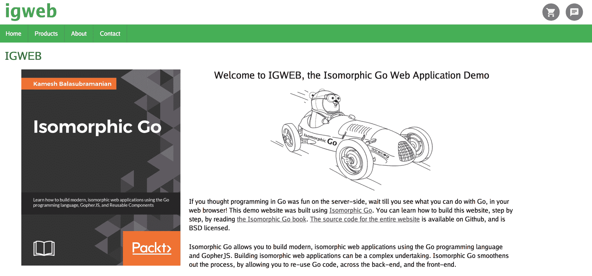

# 第十一章：部署同构 Go Web 应用程序

通过我们在上一章中实施的自动化端到端测试，IGWEB 演示网站现在满足了一组预期功能的基线。现在是时候将我们的同构 Go Web 应用程序释放到网络中了。是时候专注于将 IGWEB 部署到生产环境了。

我们对同构 Go 生产部署的探索将包括将 IGWEB 作为静态二进制可执行文件以及静态资产部署到独立服务器（真实或虚拟）上，以及将 IGWEB 作为多 Docker 容器应用程序部署。

部署 Web 应用程序是一个广阔的主题，一个值得专门讨论的海洋，有许多专门讨论这个主题的书籍。现实世界的 Web 应用程序部署可能包括持续集成、配置管理、自动化测试、部署自动化工具和敏捷团队管理。这些部署可能还包括多个团队成员，在部署过程中扮演各种角色。

本章的重点将仅仅是通过单个个体部署同构 Go Web 应用程序。为了说明，部署过程将手动执行。

需要考虑一些特定的因素，以成功地准备一个用于生产的同构 Go web 应用程序，例如，对由 GopherJS 生成的 JavaScript 源文件进行缩小，并确保静态资产以启用 GZIP 压缩的方式传输到 Web 客户端。通过将本章中呈现的材料重点放在同构 Go 上，读者可以根据自己特定的部署需求来调整本章中呈现的概念和技术。

在本章中，我们将涵盖以下主题：

+   IGWEB 在生产模式下的运行方式

+   将同构 Go Web 应用程序部署到独立服务器。

+   使用 Docker 部署同构 Go Web 应用程序

# IGWEB 在生产模式下的运行方式

在进行生产部署之前，我们需要了解当将服务器端 Web 应用程序`igweb`放入生产模式时，它是如何运行的。可以通过在启动`igweb`服务器端应用程序之前设置`IGWEB_MODE`环境变量的值为`"production"`来打开生产模式。

```go
$ export IGWEB_MODE=production
```

IGWEB 在生产模式下运行时将发生三种重要的行为：

1.  在头部部分模板中包含客户端应用程序的 JavaScript 外部`<script>`标签将请求位于`$IGWEB_APP_ROOT/static/js/client.min.js`的缩小 JavaScript 源文件。

1.  当 Web 服务器实例启动时，cogs（`cogimport.css`和`cogimport.js`）的静态资产将不会自动生成。相反，包含捆绑静态资产的缩小源文件将分别位于`$IGWEB_APP_ROOT/static/css/cogimports.min.css`和`$IGWEB_APP_ROOT/static/js/cogimports.min.js`。

1.  与依赖于`$IGWEB_APP_ROOT/shared/templates`文件夹中的模板不同，模板将从单个、gob 编码的模板捆绑文件中读取，该文件将持久保存在磁盘上。

我们将考虑服务器端 Web 应用程序如何响应这些行为。

# 由 GopherJS 生成的 JavaScript 源文件

在`funcs.go`源文件中定义我们的模板函数的地方，我们引入了一个名为`IsProduction`的新函数：

```go
func IsProduction() bool {
  if isokit.OperatingEnvironment() == isokit.ServerEnvironment {
    return os.Getenv("IGWEB_MODE") == "production"
  } else {
    return false
  }
}
```

这个函数是用于在服务器端使用的，如果当前操作模式是生产模式，则返回`true`，否则返回`false`。我们可以在模板中使用这个自定义函数来确定客户端 JavaScript 应用程序应该从哪里获取。

在非生产模式下运行时，`client.js`源文件将从服务器相对路径`/js/client.js`获取。在生产模式下，缩小的 JavaScript 源文件将从服务器相对路径`/static/js/client.min.js`获取。

在头部部分模板中，我们调用`productionmode`自定义函数来确定从哪个路径提供客户端 JavaScript 源文件，如下所示：

```go
<head>
  <meta name="viewport" content="initial-scale=1.0, maximum-scale=1.0, user-scalable=no">
  <title>{{.PageTitle}}</title> 
  <link rel="icon" type="image/png" href="/static/images/isomorphic_go_icon.png">
  <link rel="stylesheet" href="/static/css/pure.min.css">
 {{if productionmode}}
  <link rel="stylesheet" type="text/css" href="/static/css/cogimports.min.css">
  <link rel="stylesheet" type="text/css" href="/static/css/igweb.min.css">
  <script type="text/javascript" src="img/client.min.js" async></script>
  <script src="img/cogimports.min.js" type="text/javascript" async></script>
 {{else}}
  <link rel="stylesheet" type="text/css" href="/static/css/cogimports.css">
  <link rel="stylesheet" type="text/css" href="/static/css/igweb.css">
  <script src="img/cogimports.js" type="text/javascript" async></script>
  <script type="text/javascript" src="img/client.js" async></script>
  {{end}}
</head>
```

你可能会想为什么在非生产模式和生产模式之间包含不同的 JavaScript 源文件（`client.js`与`client.min.js`）。回想一下，在运行`kick`的开发环境中，`client.js`和`client.js.map`源文件会在`$IGWEB_APP_ROOT/client`文件夹中生成。在`igweb.go`中，我们注册了路由处理函数，将`/js/client.js`路径和`/js/client.js.map`路径映射到`$IGWEB_APP_ROOT/client`文件夹中的相应源文件：

```go
  // Register Handlers for Client-Side JavaScript Application
  if WebAppMode != "production" {
    r.Handle("/js/client.js", isokit.GopherjsScriptHandler(WebAppRoot)).Methods("GET")
    r.Handle("/js/client.js.map", isokit.GopherjsScriptMapHandler(WebAppRoot)).Methods("GET")
  }
```

这为我们提供了便利，我们可以让`kick`在我们对应用程序代码进行更改时自动转换 JavaScript 代码。在非生产模式下，我们更喜欢不缩小 JavaScript 源文件，以便通过 Web 控制台获得更详细的调试信息，例如恐慌堆栈跟踪（在附录中介绍，*调试同构 Go*）。

在生产模式下，无需使用`kick`。如果你检查`client.js`源文件的文件大小，你会注意到它大约有 8.1MB！这确实是一个严重的震惊！在下一节中，我们将学习如何将这个笨重的文件大小缩小。

# 驯服 GopherJS 生成的 JavaScript 文件大小

在生产部署过程中，我们必须发出`gopherjs build`命令，指定选项来缩小生成的 JavaScript 源文件，并将 JavaScript 源文件的输出保存到指定的目标位置。

我们必须缩小生成的 JavaScript 代码以减小文件大小。如前所述，未缩小的 JavaScript 源文件为 8.1MB！通过缩小它，使用`gopherjs build`命令运行`-m`选项，并指定`--tags`选项值为`clientonly`，我们可以将源文件的大小进一步减小到 2.9MB，如下所示：

```go
$ gopherjs build -m --verbose --tags clientonly -o $IGWEB_APP_ROOT/static/js/client.min.js
```

`clientonly`标签告诉 isokit 避免转换客户端应用程序未使用的源文件。`-o`选项将把生成的输出 JavaScript 源文件放在指定的目标位置。

在运行`gopherjs build`命令之前，执行`$IGWEB_APP_ROOT/scripts`目录中找到的`clear_gopherjs_cache.sh` bash 脚本总是一个好主意。它将清除从先前的`gopherjs build`运行中缓存的项目构件。

提供一个将近 3MB 大的 JavaScript 源文件仍然是一个不可行的方案。通过启用 GZIP 压缩，我们可以进一步减小传输文件的大小。一旦使用 GZIP 压缩发送源文件，传输文件大小将约为 510KB。我们将在*启用 GZIP 压缩*部分学习如何在 Web 服务器上启用 GZIP 压缩。

# 生成静态资产

在部署服务器端 Go Web 应用程序时，通常不仅会推送 Web 服务器实例的二进制可执行文件，还会推送静态资产文件（CSS、JavaScript、模板文件、图像、字体等）和模板文件。在传统的 Go Web 应用程序中，我们必须将单独的模板文件推送到生产系统，因为传统的 Go Web 应用程序依赖于每个单独的文件可用以在服务器端呈现给定的模板。

由于我们利用了在运行应用程序中通过内存持久化的模板集的概念，因此无需将单独的模板文件带到生产环境中。这是因为我们生成内存模板集所需的一切只是一个`gob`编码的模板捆绑文件，它被持久化在`$IGWEB_APP_ROOT/static/templates`文件夹中。

通过在`isokit`包中设置导出的`StaticTemplateBundleFilePath`变量，我们指示 isokit 在我们提供的文件路径生成静态模板捆绑文件。以下是在`igweb.go`源文件中的`initializeTemplateSet`函数中设置变量的行：

```go
 isokit.StaticTemplateBundleFilePath = StaticAssetsPath + "/templates/igweb.tmplbundle"
```

在第九章中，*Cogs-可重用组件*，我们了解到当首次启动`igweb`应用程序时，isokit 将所有 cogs 的 JavaScript 源文件捆绑到单个`cogimports.js`源文件中。类似地，所有 cogs 的 CSS 样式表都捆绑到单个`cogimports.css`源文件中。在非生产模式下运行 IGWEB 时，通过在`igweb.go`源文件中的`initailizeCogs`函数中调用`isokit.BundleStaticAssets`函数（以粗体显示）自动捆绑静态资产：

```go
func initializeCogs(ts *isokit.TemplateSet) {
  timeago.NewTimeAgo().CogInit(ts)
  liveclock.NewLiveClock().CogInit(ts)
  datepicker.NewDatePicker().CogInit(ts)
  carousel.NewCarousel().CogInit(ts)
  notify.NewNotify().CogInit(ts)
  isokit.BundleStaticAssets()
}
```

不应在生产环境中使用自动静态资产捆绑，因为捆绑 JavaScript 和 CSS 的动态功能取决于服务器上安装了配置了 Go 工作区的 Go 发行版，并且该 Go 工作区中必须存在 cogs 的源文件。

这立即消除了 Go 默认的优势之一。由于 Go 生成静态链接的二进制可执行文件，我们不需要在生产服务器上安装 Go 运行时即可部署我们的应用程序。

当我们以生产模式运行 IGWEB 时，可以通过在`igweb.go`源文件中的`initializeTemplateSet`函数中引入以下代码来阻止自动静态资产捆绑：

```go
  if WebAppMode == "production" && oneTimeStaticAssetsGeneration == false {
    isokit.UseStaticTemplateBundleFile = true
    isokit.ShouldBundleStaticAssets = false
  }
```

我们指示 isokit 使用静态模板捆绑文件，并指示 isokit 不自动捆绑静态资产。

为了生成我们的同构 Go Web 应用程序所需的静态资产（CSS、JavaScript 和模板捆绑），我们可以在非生产系统上使用`igweb`运行`--generate-static-assets`标志：

```go
$ igweb --generate-static-assets
```

此命令将生成必要的静态资产，然后退出`igweb`程序。此功能的实现可以在`igweb.go`源文件中定义的`generateStaticAssetsAndExit`函数中找到：

```go
func generateStaticAssetsAndExit(env *common.Env) {
  fmt.Print("Generating static assets...")
  isokit.ShouldMinifyStaticAssets = true
  isokit.ShouldBundleStaticAssets = true
  initializeTemplateSet(env, true)
  initializeCogs(env.TemplateSet)
  fmt.Println("Done")
  os.Exit(0)
}
```

在指示`igweb`生成静态资产后，将创建三个文件：

+   `$IGWEB_APP_ROOT/static/templates/igweb.tmplbundle`（模板捆绑）

+   `$IGWEB_APP_ROOT/static/css/cogimports.min.css`（压缩的 CSS 捆绑包）

+   `$IGWEB_APP_ROOT/static/js/cogimports.min.js`（压缩的 JavaScript 捆绑包）

在执行生产部署时，可以将整个`$IGWEB_APP_ROOT/static`文件夹复制到生产系统，确保三个前述的静态资产将在生产系统上提供。

此时，我们已经建立了 IGWEB 在生产模式下的操作方式。现在，是时候执行最简单的部署了-将同构 Go Web 应用程序部署到独立服务器。

# 将同构 Go Web 应用程序部署到独立服务器

为了演示独立的同构 Go 部署，我们将使用 Linode（[`www.linode.com`](http://www.linode.com)）托管的虚拟专用服务器（VPS）。此处提出的程序适用于任何其他云提供商，以及独立服务器恰好是位于服务器室中的真实服务器的情况。我们将概述的独立部署过程是手动执行的，以说明每个步骤。

# 为服务器提供服务

在本演示中的服务器，以及本章后续演示中提到的服务器将在 Linode 上运行 Ubuntu Linux 16.04 LTS 版本，Linode 是**虚拟专用服务器（VPS）**实例的提供商。我们将运行 Linode 的默认 Ubuntu 16.04 存储映像，而不进行任何内核修改。

当我们在本章中发出任何以`sudo`为前缀的命令时，我们假设您的用户帐户是 sudoers 组的一部分。如果您使用服务器的 root 帐户，则无需在命令前加上`sudo`。

我们将通过发出以下命令创建一个名为`igweb`的权限较低的用户：

```go
$ sudo adduser igweb
```

运行`adduser`命令后，您将被提示为`igweb`用户和密码输入附加信息。如果您没有提示输入用户密码，您可以通过发出以下命令来设置密码：

```go
$ sudo passwd igweb
```

`igweb`应用程序依赖于两个组件才能正常运行。首先，我们需要安装 Redis 数据库。其次，我们需要安装`nginx`。我们将使用`nginx`作为反向代理服务器，这将允许我们在为 Web 客户端提供静态资产时启用 GZIP 压缩。正如您将看到的，这在 GopherJS 生成的 JavaScript 源文件的文件大小方面有很大的区别（510 KB 与 3MB）。*图 11.1*描述了 Linode VPS 实例与三个关键组件`igweb`、`nginx`和`redis-server`：


图 11.1：运行 igweb、nginx 和 redis-server 的 Linode VPS 实例

# 设置 Redis 数据库实例

您可以按照第二章中演示的相同过程来安装 Redis 数据库。在这之前，您应该发出以下命令来安装必要的构建工具：

```go
$ sudo apt-get install build-essential tcl
```

安装了 Redis 数据库后，您应该通过发出以下命令来启动 Redis 服务器：

```go
$ sudo redis-server --daemonize yes
```

`--daemonize`命令行参数允许我们在后台运行 Redis 服务器。即使我们的会话结束后，服务器也将继续运行。

您应该通过添加足够的防火墙规则来保护 Redis 安装，以防止外部流量访问端口 6379，Redis 服务器实例的默认端口。

# 设置 NGINX 反向代理

虽然`igweb` Web 服务器实例，一个 Go 应用程序，可以独自满足服务 IGWEB 的主要需求，但将`igweb` Web 服务器实例置于反向代理之后更有利。

反向代理服务器是一种代理服务器类型，它将通过将请求分派到指定的目标服务器（在本例中为`igweb`）来为客户端请求提供服务，从`igweb`服务器实例获取响应，并将响应发送回客户端。

反向代理有几个方面的便利。释放 IGWEB 的即时好处最重要的原因是我们可以在出站静态资产上启用 GZIP 压缩。除此之外，反向代理还允许我们在需要时轻松添加重定向规则来控制流量。

NGINX 是一种流行的高性能 Web 服务器。我们将使用`nginx`作为`igweb` Web 服务器实例前面的反向代理。*图 11.2*描述了一个典型的反向代理配置，其中 Web 客户端将通过端口 80 发出 HTTP 请求，`nginx`将通过端口 8080 将 HTTP 请求发送到`igweb`服务器实例，从`igweb`服务器检索响应，并通过端口 80 将响应发送回 Web 客户端：


图 11.2：反向代理配置

以下是我们将用于运行`nginx`作为反向代理的`nginx.conf`配置文件清单：

```go
user igweb;
worker_processes 1;

error_log /var/log/nginx/error.log warn;
pid /var/run/nginx.pid;

events {
    worker_connections 1024;
}

http {
    include /etc/nginx/mime.types;
    default_type application/octet-stream;

    log_format main '$remote_addr - $remote_user [$time_local] "$request" '
                    '$status $body_bytes_sent "$http_referer" '
                    '"$http_user_agent" "$http_x_forwarded_for"';

    sendfile on;
    keepalive_timeout 65;

 gzip on;
 gzip_min_length 1100;
 gzip_buffers 16 8k;
 gzip_types text/plain application/javascript text/css;
 gzip_vary on;
 gzip_comp_level 9;

    server_tokens off;

    server {
        listen 80;
        access_log /var/log/nginx/access.log main;
        location / {
 proxy_pass http://192.168.1.207:8080/;
 proxy_set_header X-Forwarded-For $remote_addr;
 proxy_http_version 1.1;
 proxy_set_header Upgrade $http_upgrade;
 proxy_set_header Connection "upgrade";
 proxy_set_header Host $host;
        }
    }
}
```

我们对我们感兴趣的两个设置部分，即启用 GZIP 压缩的部分和代理设置的部分。

# 启用 GZIP 压缩

让我们检查与启用 GZIP 压缩相关的`nginx`配置设置。

我们将`gzip`指令设置为`on`以启用服务器响应的压缩。

`gzip_min_length`指令允许我们指定将进行 gzip 压缩的响应的最小长度。

`gzip_buffers`指令设置用于压缩响应的缓冲区的数量和大小。我们指定将使用 16 个缓冲区，内存页大小为 8K。

`gzip_types`指令允许我们指定应在其上启用 GZIP 压缩的 MIME 类型，除了*text/HTML*之外。我们已指定纯文本文件、JavaScript 源文件和 CSS 源文件的 MIME 类型。

`gzip_vary`指令用于启用或禁用*Vary: Accept-Encoding*响应头。*Vary: Accept-Encoding*响应头指示缓存存储网页的不同版本，如果头部有变化，则特别重要。对于不支持 GZIP 编码的 Web 浏览器，这个设置特别重要，以便正确接收文件的未压缩版本。

`gzip_comp_level`指令指定将使用的 GZIP 压缩级别。我们指定了一个值为 9 的最大 GZIP 压缩级别。

# 代理设置

`nginx`配置设置中的第二部分是反向代理设置。

我们在`location`块内包括`proxy_pass`指令，值为 web 服务器的地址和端口。这指定所有请求应发送到指定的代理服务器（`igweb`），位于`http://192.168.1.207:8080`。

请记住，将此示例中显示的 IP 地址 192.168.1.207 替换为运行您的`igweb`实例的机器的 IP 地址。

反向代理将从`igweb`服务器实例获取响应并将其发送回 Web 客户端。

`proxy_set_header`指令允许我们重新定义（或追加）传递给代理服务器的请求头字段。我们已经包括了*X-Forwaded-For*头，以便代理服务器可以识别发起请求的 Web 客户端的原始 IP 地址。

为了支持 websockets 的正常运行（这是实时聊天功能所依赖的），我们包括以下代理设置。首先，我们指定使用`proxy_http_version`指令，服务器将使用 HTTP 版本 1.1。默认情况下，`"Upgrade"`和`"Connection"`头不会传递给代理服务器。因此，我们必须使用`proxy_set_header`指令将这些头发送到代理服务器。

我们可以通过以下命令安装`nginx`：

```go
$ sudo apt-get install nginx
```

安装`nginx`后，Web 服务器通常会默认启动。但是如果没有启动，我们可以通过以下命令启动`nginx`：

```go
$ sudo systemctl start nginx
```

`$IGWEB_APP_ROOT/deployments-config/standalone-setup`文件夹中找到的`nginx.conf`文件可以放置在生产服务器的`/etc/nginx`文件夹中。

*图 11.3*描述了当我们尝试访问`igweb.kamesh.com` URL 时遇到的 502 Bad Gateway 错误：


图 11.3：502 Bad Gateway 错误

我们遇到了这个服务器错误，因为我们还没有启动`igweb`。要让`igweb`运行起来，我们首先需要在服务器上设置一个位置，用于存放`igweb`二进制可执行文件和静态资产。

# 设置 IGWEB 根文件夹

IGWEB 根文件夹是生产服务器上`igweb`可执行文件和静态资产所驻留的地方。我们使用以下命令在生产服务器上成为`igweb`用户：

```go
$ su - igweb
```

我们在`igweb`用户的主目录中创建一个`igweb`文件夹，如下所示：

```go
mkdir ~/igweb
```

这是包含`igweb` Web 服务器实例的二进制可执行文件和 IGWEB 演示网站所需的静态资产的目录。请注意，静态资产将驻留在`~/igweb/static`文件夹中。

# 交叉编译 IGWEB

使用 `go build` 命令，我们实际上可以为不同的目标操作系统构建二进制文件，这种技术称为**交叉编译**。例如，在我的 macOS 机器上，我可以构建一个 64 位 Linux 二进制文件，然后将其推送到运行 Ubuntu Linux 的独立生产服务器上。在构建我们的二进制文件之前，我们通过设置 `GOOS` 环境变量来指定我们要构建的目标操作系统：

```go
$ export GOOS=linux
```

通过将 `GOOS` 环境变量设置为 `linux`，我们已经指定我们希望为 Linux 生成一个二进制文件。

为了指定我们希望二进制文件是 64 位二进制文件，我们设置 `GOARCH` 环境变量来指定目标架构：

```go
$ export GOARCH=amd64
```

通过将 `GOARCH` 变量设置为 `amd64`，我们已经指定我们需要一个 64 位二进制文件。

通过发出 `mkdir` 命令，在 `igweb` 文件夹内创建一个 `builds` 目录：

```go
$ mkdir $IGWEB/builds
```

这个目录将作为包含各种操作系统的 `igweb` 二进制可执行文件的仓库。在本章中，我们只考虑构建 64 位 Linux 二进制文件，但在将来，我们可以在此目录中适应其他操作系统的构建，比如 Windows。

我们发出 `go build` 命令，并提供 `-o` 参数来指定生成的二进制文件应该位于哪里：

```go
$ go build -o $IGWEB_APP_ROOT/builds/igweb-linux64
```

我们已经指示生成的 64 位 Linux 二进制文件应该创建在 `$IGWEB_APP_ROOT/builds` 文件夹中，并且可执行文件的名称将是 `igweb-linux64`。

您可以通过发出 `file` 命令来验证生成的二进制文件是否为 Linux 二进制文件：

```go
$ file builds/igweb-linux64
builds/igweb-linux64: ELF 64-bit LSB executable, x86-64, version 1 (SYSV), statically linked, not stripped
```

从结果中，我们可以看到 `go build` 命令生成了一个 `64 位 LSB`（Linux 标准基础）可执行文件。

如果您有兴趣为 Linux 以外的其他操作系统构建 Go 二进制文件，此链接将为您提供所有可能的 `GOOS` 和 `GOARCH` 值的完整列表：[`golang.org/doc/install/source#environment`](https://golang.org/doc/install/source#environment)。

# 准备部署包

除了发布 `igweb` 可执行文件，我们还需要发布存放所有 IGWEB 静态资产的静态文件夹的内容。

准备部署包的静态资产包括以下步骤：

1.  转换客户端应用程序

1.  生成静态资产包（模板包、CSS 和 JavaScript）

1.  缩小 IGWEB 的 CSS 样式表

首先，我们转换客户端应用程序：

```go
$ cd $IGWEB_APP_ROOT/client
$ $IGWEB_APP_ROOT/scripts/clear_gopherjs_cache.sh
$ gopherjs build --verbose -m --tags clientonly -o  $IGWEB_APP_ROOT/static/js/client.min.js
```

其次，我们需要生成静态资产包：

```go
$ $IGWEB_APP_ROOT/igweb --generate-static-assets
Generating static assets...Done
```

准备部署包的第三个也是最后一个步骤是压缩 CSS 样式表。

首先，我们需要通过发出以下命令来安装基于 Go 的缩小器：

```go
$ go get -u github.com/tdewolff/minify/cmd/minify
$ go install github.com/tdewolff/minify
```

现在，我们可以压缩 IGWEB 的 CSS 样式表：

```go
$ minify --mime="text/css" $IGWEB_APP_ROOT/static/css/igweb.css > $IGWEB_APP_ROOT/static/css/igweb.min.css
```

有了这些项目，我们现在准备创建一个部署包，一个 tarball，其中包括 `igweb` Linux 二进制文件以及 `static` 文件夹。我们通过发出以下命令来创建 tarball：

```go
$ cd $IGWEB_APP_ROOT
$ tar zcvf /tmp/bundle.tgz builds/igweb-linux64 static
```

我们将使用 `scp` 命令将包发送到远程服务器：

```go
$ scp /tmp/bundle.tgz igweb@targetserver:/tmp/.
```

`scp` 命令将 tarball `bundle.tgz` 复制到具有主机名 `targetserver` 的服务器上的 `/tmp` 目录。现在部署包已放置在服务器上，是时候让 `igweb` 运行起来了。

# 部署包并启动 IGWEB

我们将安全复制到 `/tmp` 文件夹的模板包移动到 `~/igweb` 文件夹，并提取 tarball 的内容：

```go
 $ cd ~/igweb
 $ mv /tmp/bundle.tgz .
 $ tar zxvf bundle.tgz
```

在我们提取 `bundle.tgz` 压缩包的内容后，通过发出 `rm` 命令来删除压缩包文件。

```go
$ rm bundle.tgz
```

我们可以使用 `mv` 命令将二进制文件重新命名为 `igweb`：

```go
$ mv igweb-linux64 igweb
```

我们在本地机器上将 `-linux64` 附加到二进制文件的名称上，以便我们可以将其与其他操作系统/架构组合的构建区分开。

此时我们已经将包部署到生产服务器。现在是运行 `igweb` 的时候了。

# 运行 IGWEB

在运行`igweb`可执行文件之前，我们必须在生产服务器上设置`$IGWEB_APP_ROOT`和`$IGWEB_MODE`环境变量：

```go
 $ export IGWEB_APP_ROOT=/home/igweb/igweb
 $ export IGWEB_MODE=production
```

设置`$IGWEB_APP_ROOT`环境变量允许`igweb`应用程序知道指定的`igweb`目录，该目录将包含依赖资源，如静态资产。

将`$IGWEB_MODE`环境变量设置为`production`允许我们以生产模式运行`igweb`应用程序。

您应该在`igweb`用户的`.bashrc`配置文件中为这两个环境变量添加条目：

```go
export IGWEB_APP_ROOT=/home/igweb/igweb
export IGWEB_MODE=production
```

在生产服务器上注销并重新登录，以使对`.bashrc`所做的更改生效。

# 在前台运行 IGWEB

让我们启动`igweb` Web 服务器实例：

```go
$ cd $IGWEB_APP_ROOT
$ ./igweb
```

*图 11.4*显示了 IGWEB 在地址[`igweb.kamesh.com`](http://igweb.kamesh.com)上运行的独立服务器实例的屏幕截图：



图 11.4：IGWEB 在独立服务器实例上运行

当我们按下*Ctrl* + *C*组合键退出`igweb`程序时，我们的 Web 服务器实例会因为一直在前台运行而停止。NGINX 将为任何客户端请求返回 502 Bad Gateway 服务器错误。我们需要一种方法来使`igweb`以守护进程方式运行，以便在后台运行。

# 在后台运行 IGWEB

`igweb` Web 服务器实例可以使用`nohup`命令在后台运行：

```go
$ nohup ./igweb 2>&1 &
```

`nohup`命令用于在当前会话终止后继续运行`igweb`程序。在类 Unix 系统上，`2>&1`构造意味着将标准错误（`stderr`）重定向到与标准输出（`stdout`）相同的位置。`igweb`程序的日志消息将通过尾随`/var/log/syslog`文件进行查看。最后，命令中的最后一个`&`表示在后台运行该程序。

我们可以通过首先获取**PID**（进程 ID）来停止`igweb`进程：

```go
$ ps -ef | grep igweb | grep -v grep
```

从运行此命令返回的输出中，PID 值将紧邻可执行文件`igweb`的名称。一旦确定了进程的 PID，我们可以使用`kill`命令并指定 PID 的值来停止`igweb`进程：

```go
$ kill PID
```

请注意，我们在前述`kill`命令中放置了名称`PID`，仅用于说明目的。您将需要使用从运行`ps`命令返回的 PID 的数字值来为`kill`命令提供 PID。

# 使用 systemd 在后台运行 IGWEB

这种运行`igweb`的方法暂时有效，但是如果服务器重新启动会怎么样？我们需要一种方法使`igweb`程序更具弹性。它必须能够在服务器重新上线后再次启动，并且`nohup`不是实现此目标的合适选择。

我们真正需要的是将`igweb`转换为系统服务的方法。我们可以使用`sysytemd`来实现这一点，`sysytemd`是一个可用于 Ubuntu 16.04 LTS 的初始化系统。使用`systemd`，我们可以初始化、管理和跟踪系统服务。它可以在系统启动时或系统运行时使用。

您需要以`root`用户身份运行以下命令，因为您需要成为`root`用户才能添加新的系统服务。

为了将`igweb`转换为服务，我们创建一个名为`igweb.service`的单元文件，并将其放在`/etc/systemd/system`目录中。以下是单元文件的内容：

```go
[Unit]
Description=IGWEB

[Service]
USER=igweb
GROUP=igweb
Environment=IGWEB_APP_ROOT=/home/igweb/igweb
Environment=IGWEB_MODE=production
WorkingDirectory=/home/igweb/igweb
ExecStart=/home/igweb/igweb/igweb
Restart=always

[Install]
WantedBy=multi-user.target
```

指定`.service`文件扩展名表示我们正在创建一个服务单元，描述如何在服务器上管理应用程序。这包括执行诸如启动或停止服务的操作，以及服务是否应在系统启动时启动。

单元文件分为多个部分，每个部分的开头用一对方括号*[*和*]*标示，括号之间包含部分的名称。

单元文件中的部分名称区分大小写！

第一部分是`[Unit]`部分。这用于定义单元的元数据以及该单元与其他单元的关系。在`[Unit]`部分中，我们已经为`Description`指定了一个值，用于描述单元的名称。例如，我们运行以下命令：

```go
$ systemctl status nginx
```

当我们运行它时，我们在`nginx`的描述中看到的是使用`Description`指令指定的描述。

`[Service]`部分用于指定服务的配置。`USER`和`GROUP`指令指定命令应该以什么用户和组身份运行。我们使用`Environment`指令来设置`$IGWEB_APP_ROOT`环境变量，并再次使用它来设置`$IGWEB_MODE`环境变量。

`WorkingDirectory`指令设置了执行命令的工作目录。`ExecStart`指令指定了要执行的命令的完整路径；在这种情况下，我们提供了`igweb`可执行文件的完整路径。

`Restart`指令用于指定`systemd`将尝试重新启动服务的情况。通过提供*always*的值，我们指定服务应始终运行，如果出现某种原因停止，应该再次启动。

我们定义的最后一个部分是`[Install]`部分。这个部分允许我们指定单元在启用或禁用时的行为。

在这个部分声明的`WantedBy`指令告诉`systemd`如何启用一个单元，也就是说，当启用服务时，该服务应该在什么系统运行级别下运行。通过将此指令的值设置为`multi-user.target`，我们指定该服务在系统运行级别 3（多用户模式）下运行。

每当我们引入新的`systemd`服务脚本或对现有脚本进行更改时，我们必须重新加载`systemd`守护程序。我们可以通过发出以下命令来实现：

```go
$ systemctl daemon-reload
```

我们可以指定，我们希望`igweb`服务在启动时自动启动，方法是发出以下命令：

```go
$ systemctl enable igweb
```

如果我们不希望`igweb`服务在启动时自动启动，我们可以发出以下命令：

```go
$ systemctl disable igweb
```

我们可以通过发出以下命令来启动`igweb`服务：

```go
$ systemctl start igweb
```

我们可以通过发出以下命令来停止`igweb`服务：

```go
$ systemctl stop igweb
```

我们现在已经完成了`igweb`的独立部署。令人惊讶的是，我们可以在目标生产系统上运行`igweb`应用程序，而无需安装 Go。

然而，这种方法对于负责保持 IGWEB 运行的 DevOps 团队来说相当不透明。我所说的*不透明*是指 DevOps 工程师无法通过检查静态二进制可执行文件和一堆静态资产来确定太多信息。

我们需要一种更简化的方式来部署 IGWEB，一种程序可以显示从头开始启动`igweb`实例所需的所有依赖关系。为了实现这个目标，我们需要将 IGWEB 放入 Docker 容器中。

# 使用 Docker 部署同构 Go Web 应用程序

本节概述了在 Linode 云上将`igweb`部署为多容器 Docker 应用程序的过程。Docker 是一种技术和平台，允许我们在单台机器上运行和管理多个 Docker 容器。您可以将 Docker 容器视为模块化、轻量级的虚拟机。我们可以通过将应用程序（如`igweb`）打包为 Docker 容器，使其立即可移植。无论在哪个环境中运行，应用程序都保证在容器内以相同的方式运行。

您可以在以下链接了解有关 Docker 的更多信息：[`www.docker.com`](https://www.docker.com)。

大多数云提供商都支持 Docker，使其成为云部署的非常方便的工具。正如您将在本章后面看到的，将多容器 Docker 应用程序部署到 Linode 云上相对容易。

# 安装 Docker

在生产系统上安装 Docker 之前，我们首先需要安装一些先决条件：

```go
$ sudo apt-get install dmsetup && dmsetup mknodes
```

现在，我们可以发出以下命令来安装 Docker：

```go
$ sudo apt-get install docker-ce
```

要验证 Docker 是否已经在生产系统上正确安装，您可以发出以下命令：

```go
$ docker --version
Docker version 17.09.0-ce, build afdb6d4
```

运行命令后，您应该看到安装的 Docker 版本。

# Docker 化 IGWEB

docker 化`igweb`的过程首先涉及创建一个`Dockerfile`，该文件指定了如何创建 Docker 镜像的指令。然后将使用 Docker 镜像来创建 Docker 容器。

创建了 Dockerfile 之后，我们将使用`docker-compose`工具来定义和运行多个容器，以支持 IGWEB 网站的运行。

将`igweb`部署为多容器 Docker 应用程序是一个三步过程：

1.  从中可以创建一个 IGWEB docker 镜像的`Dockerfile`

1.  在`docker-compose.yml`文件中定义组成 IGWEB 的服务

1.  运行`docker-compose up`来启动多容器应用程序

# Dockerfile

`Dockerfile`描述了应该由`igweb` docker 镜像制作的内容。该文件位于`deployments-config/docker-single-setup`文件夹中。让我们检查`Dockerfile`以了解它的工作原理。

`FROM`指令指定了当前镜像派生的基本父镜像：

```go
FROM golang
```

在这里，我们指定将使用基本的`golang` docker 镜像。

有关`golang` docker 镜像的更多信息可以在[`hub.docker.com/_/golang/`](https://hub.docker.com/_/golang/)找到。

`MAINTAINER`指令指定了`Dockerfile`的维护者姓名以及他们的电子邮件地址：

```go
MAINTAINER Kamesh Balasubramanian kamesh@kamesh.com
```

我们已经指定了一组`ENV`指令，允许我们定义和设置所有必需的环境变量：

```go
ENV IGWEB_APP_ROOT=/go/src/github.com/EngineerKamesh/igb/igweb
ENV IGWEB_DB_CONNECTION_STRING="database:6379"
ENV IGWEB_MODE=production
ENV GOPATH=/go
```

为了使`igweb`应用程序正常运行，我们设置了`$IGWEB_APP_ROOT`、`$IGWEB_DB_CONNECTION`、`$IGWEB_MODE`和`$GOPATH`环境变量。

在这个块中，我们使用`RUN`指令来获取`igweb`应用程序所需的 Go 包：

```go
RUN go get -u github.com/gopherjs/gopherjs
RUN go get -u honnef.co/go/js/dom
RUN go get -u -d -tags=js github.com/gopherjs/jsbuiltin
RUN go get -u honnef.co/go/js/xhr
RUN go get -u github.com/gopherjs/websocket
RUN go get -u github.com/tdewolff/minify/cmd/minify
RUN go get -u github.com/isomorphicgo/isokit 
RUN go get -u github.com/uxtoolkit/cog
RUN go get -u github.com/EngineerKamesh/igb
```

这基本上是运行`igweb`所需的 Go 包列表。

以下`RUN`命令安装了一个基于 Go 的 CSS/JavaScript 缩小器：

```go
RUN go install github.com/tdewolff/minify
```

我们使用另一个`RUN`指令来转译客户端 Go 程序：

```go
RUN cd $IGWEB_APP_ROOT/client; go get ./..; /go/bin/gopherjs build -m --verbose --tags clientonly -o $IGWEB_APP_ROOT/static/js/client.min.js
```

这个命令实际上是三个连续命令的组合，每个命令使用分号分隔。

第一个命令将目录更改为`$IGWEB_APP_ROOT/client`目录。在第二个命令中，我们在当前目录和所有子目录中获取任何剩余所需的 Go 包。第三个命令将 Go 代码转译为一个缩小的 JavaScript 源文件`client.min.js`，并将其放置在`$IGWEB_APP_ROOT/static/js`目录中。

接下来的`RUN`指令构建并安装服务器端 Go 程序：

```go
>RUN go install github.com/EngineerKamesh/igb/igweb
```

请注意，`go install`命令不仅会通过执行构建操作生成`igweb`二进制可执行文件，还会将生成的可执行文件移动到`$GOPATH/bin`。

我们发出以下`RUN`指令来生成静态资产：

```go
RUN /go/bin/igweb --generate-static-assets
```

这个`RUN`指令缩小了 IGWEB 的 CSS 样式表：

```go
RUN /go/bin/minify --mime="text/css" $IGWEB_APP_ROOT/static/css/igweb.css > $IGWEB_APP_ROOT/static/css/igweb.min.css
```

`ENTRYPOINT`指令允许我们设置容器的主要命令：

```go
# Specify the entrypoint
ENTRYPOINT /go/bin/igweb
```

这使我们能够像运行命令一样运行镜像。我们将`ENTRYPOINT`设置为`igweb`可执行文件的路径：`/go/bin/igweb`。

我们使用`EXPOSE`指令来通知 Docker 容器在运行时应监听的网络端口：

```go
EXPOSE 8080
```

我们已经暴露了容器的端口`8080`。

除了能够使用`Dockerfile`构建 docker 镜像之外，该文件最重要的好处之一是它传达了意义和意图。它可以被视为一个一流的项目配置工件，以确切了解构建同构 Web 应用程序的过程，该应用程序由服务器端`igweb`应用程序和客户端应用程序`client.min.js`组成。通过查看`Dockerfile`，DevOps 工程师可以轻松地确定成功从头开始构建整个同构 Web 应用程序的过程。

# 闭源项目的 Dockerfile

我们提出的`Dockerfile`非常适合开源项目，但如果你的特定同构 Go 项目是闭源的，你该怎么办呢？你如何能够利用在云中运行 Docker 并同时保护源代码不被查看？我们需要对`Dockerfile`进行轻微修改以适应闭源项目。

让我们考虑一个场景，`igweb`的代码分发是闭源的。假设我们无法使用`go get`命令获取它。

假设您已经在项目目录的根目录下创建了一个闭源友好的`Dockerfile`，并且已经将闭源`igweb`项目的 tarball 捆绑包从本地机器安全地复制到目标机器，并且已经解压了 tarball。

以下是我们需要对`Dockerfile`进行的更改。首先，我们注释掉使用`go get`命令获取`igb`分发的相应`RUN`指令：

```go
# Get the required Go packages
RUN go get -u github.com/gopherjs/gopherjs
RUN go get -u honnef.co/go/js/dom
RUN go get -u -d -tags=js github.com/gopherjs/jsbuiltin
RUN go get -u honnef.co/go/js/xhr
RUN go get -u github.com/gopherjs/websocket
RUN go get -u github.com/tdewolff/minify/cmd/minify
RUN go get -u github.com/isomorphicgo/isokit 
RUN go get -u github.com/uxtoolkit/cog
# RUN go get -u github.com/EngineerKamesh/igb
```

在一系列`RUN`指令之后，我们立即引入了一个`COPY`指令：

```go
COPY . $IGWEB_APP_ROOT/.
```

这个`COPY`指令将递归地将当前目录中的所有文件和文件夹复制到由`$IGWEB_APP_ROOT/.`指定的目的地。就是这样。

现在我们已经深入研究了 IGWEB 的`Dockerfile`的结构，我们必须承认`igweb` web 服务器实例本身无法为 IGWEB 网站提供服务。它有一定的服务依赖性，我们必须考虑，比如 Redis 数据库用于数据持久性需求，以及 NGINX 反向代理以合理的 gzip 方式提供大型静态资产。

我们需要一个 Redis 的 Docker 容器，以及另一个 NGINX 的 Docker 容器。`igweb`正在成为一个多容器的 Docker 应用程序。现在是时候把注意力转向`docker-compose`，这是一个方便的工具，用于定义和运行多容器应用程序。

# Docker compose

`docker-compose`工具允许我们定义一个多容器的 Docker 应用程序，并使用单个命令`docker-compose up`来运行它。

`docker-compose`通过读取包含特定指令的`docker-compose.yml`文件来工作，这些指令不仅描述了应用程序中的容器，还描述了它们各自的依赖关系。让我们来检查`docker-compose.yml`文件中多容器`igweb`应用程序的每个部分。

在文件的第一行，我们指示将使用 Docker Compose 配置文件格式的第 2 版：

```go
version: '2'
```

我们在`services`部分内声明了应用程序的服务。每个服务（以粗体显示）都被赋予一个名称，以指示它在多容器应用程序中的角色：

```go
services:
  database:
    image: "redis"
  webapp:
    depends_on:
        - database 
    build: .
    ports:
        - "8080:8080"
  reverseproxy:
    depends_on:
        - webapp
    image: "nginx"
    volumes:
   - ./deployments-config/docker-single setup/nginx.conf:/etc/nginx/nginx.conf
    ports:
        - "80:80"
```

我们已经定义了一个名为`database`的服务，它将成为 Redis 数据库实例的容器。我们将 image 选项设置为`redis`，以告诉`docker-compose`基于 Redis 镜像运行一个容器。

紧接着，我们定义了一个名为`webapp`的服务，它将成为`igweb`应用程序的容器。我们使用`depends_on`选项明确说明`webapp`服务需要`database`服务才能运行。如果没有`database`服务，`webapp`服务就无法启动。

我们指定`build`选项告诉`docker-compose`根据指定路径中的`Dockerfile`构建镜像。通过指定相对路径`.`，我们指示应使用当前目录中存在的`Dockerfile`构建基础镜像。

在`ports`部分，我们指定了`8080:8080`（HOST:CONTAINER）的值，表示我们要在主机上打开端口`8080`并将连接转发到 Docker 容器的端口`8080`。

我们已经定义了名为`reverseproxy`的服务，它将作为`nginx`反向代理服务器的容器。我们将`depends_on`选项设置为`webapp`，以表示`reverseproxy`服务在`webapp`服务启动之前不能启动。我们将 image 选项设置为`nginx`，告诉`docker-compose`基于`nginx`镜像运行容器。

在`volumes`部分，我们可以定义我们的挂载路径，格式为 HOST:CONTAINER。我们定义了一个挂载路径，将位于`./deployments-config/docker-single-setup`目录中的`nginx.conf`配置文件挂载到容器内部的`/etc/nginx/nginx.conf`路径。

由于`reverseproxy`服务将为 HTTP 客户端请求提供服务，我们在`ports`部分指定了值为`80:80`，表示我们要在主机上打开端口`80`（默认 HTTP 端口）并将连接转发到 Docker 容器的端口`80`。

现在我们已经完成了 Docker Compose 配置文件，是时候使用`docker-compose up`命令启动`igweb`作为多容器 Docker 应用程序了。

# 运行 Docker Compose

我们发出以下命令来构建服务：

```go
$ docker-compose build
```

运行`docker-compose build`命令的输出如下（为了简洁起见，部分输出已省略）：

```go
database uses an image, skipping
Building webapp
Step 1/22 : FROM golang
 ---> 99e596fc807e
Step 2/22 : MAINTAINER Kamesh Balasubramanian kamesh@kamesh.com
 ---> Running in 107a99d5c4ee
 ---> 6facac83509e
Removing intermediate container 107a99d5c4ee
Step 3/22 : ENV IGWEB_APP_ROOT /go/src/github.com/EngineerKamesh/igb/igweb
 ---> Running in f009d8391fc4
 ---> ec1b1d15c6c3
Removing intermediate container f009d8391fc4
Step 4/22 : ENV IGWEB_DB_CONNECTION_STRING "database:6379"
 ---> Running in 2af5e98c71e2
 ---> 6748f0f5bc4d
Removing intermediate container 2af5e98c71e2
Step 5/22 : ENV IGWEB_MODE production
 ---> Running in 1a87b871f761
 ---> 9871fc511e80
Removing intermediate container 1a87b871f761
Step 6/22 : ENV GOPATH /go
 ---> Running in c6c2eff0ded2
 ---> 4dc456357dc9
Removing intermediate container c6c2eff0ded2
Step 7/22 : RUN go get -u github.com/gopherjs/gopherjs
 ---> Running in c8996108bd96
 ---> 6ae68fb84178
Removing intermediate container c8996108bd96
Step 8/22 : RUN go get -u honnef.co/go/js/dom
 ---> Running in a1ad103c4c10
 ---> abd1f7f3b8b7
Removing intermediate container a1ad103c4c10
Step 9/22 : RUN go get -u -d -tags=js github.com/gopherjs/jsbuiltin
 ---> Running in d7dc4ec21ee1
 ---> cd5829fb609f
Removing intermediate container d7dc4ec21ee1
Step 10/22 : RUN go get -u honnef.co/go/js/xhr
 ---> Running in b4e88d0233fb
 ---> 3fe4d470799e
Removing intermediate container b4e88d0233fb
Step 11/22 : RUN go get -u github.com/gopherjs/websocket
 ---> Running in 9cebc021cb34
 ---> 20cd1c09d6cd
Removing intermediate container 9cebc021cb34
Step 12/22 : RUN go get -u github.com/tdewolff/minify/cmd/minify
 ---> Running in 9875889cc267
 ---> 3c60c2de51b0
Removing intermediate container 9875889cc267
Step 13/22 : RUN go get -u github.com/isomorphicgo/isokit
 ---> Running in eb839d91588e
 ---> e952d6e6cbe2
Removing intermediate container eb839d91588e
Step 14/22 : RUN go get -u github.com/uxtoolkit/cog
 ---> Running in 3e6853ff7196
 ---> 3b00f78e5acf
Removing intermediate container 3e6853ff7196
Step 15/22 : RUN go get -u github.com/EngineerKamesh/igb
 ---> Running in f5082861ca8a
 ---> 93506a92526c
Removing intermediate container f5082861ca8a
Step 16/22 : RUN go install github.com/tdewolff/minify
 ---> Running in b0a72d9e9807
 ---> e3e49d9c2898
Removing intermediate container b0a72d9e9807
Step 17/22 : RUN cd $IGWEB_APP_ROOT/client; go get ./..; /go/bin/gopherjs build -m --verbose --tags clientonly -o $IGWEB_APP_ROOT/static/js/client.min.js
 ---> Running in 6f6684209cfd
Step 18/22 : RUN go install github.com/EngineerKamesh/igb/igweb
 ---> Running in 17ed6a871db7
 ---> 103f12e38c04
Removing intermediate container 17ed6a871db7
Step 19/22 : RUN /go/bin/igweb --generate-static-assets
 ---> Running in d6fb5ff48a08
Generating static assets...Done
 ---> cc7434fbb94d
Removing intermediate container d6fb5ff48a08
Step 20/22 : RUN /go/bin/minify --mime="text/css" $IGWEB_APP_ROOT/static/css/igweb.css > $IGWEB_APP_ROOT/static/css/igweb.min.css
 ---> Running in e1920eb49cc2
 ---> adbf78450b9c
Removing intermediate container e1920eb49cc2
Step 21/22 : ENTRYPOINT /go/bin/igweb
 ---> Running in 20246e214462
 ---> a5f1d978060d
Removing intermediate container 20246e214462
Step 22/22 : EXPOSE 8080
 ---> Running in 6e12e970dfe2
 ---> 4c7f474b2704
Removing intermediate container 6e12e970dfe2
Successfully built 4c7f474b2704
reverseproxy uses an image, skipping
```

构建完成后，我们可以通过以下命令运行多容器`igweb`应用：

```go
$ docker-compose up
```

*图 11.5*是 IGWEB 作为多容器应用程序运行的截图：


图 11.5：IGWEB 作为多容器应用程序运行

当我们运行`docker-compose up`命令时，该命令会提供所有运行容器的实时活动输出。要退出程序，可以使用*Ctrl* + *C*组合键。请注意，这将终止`docker-compose`程序，从而以一种优雅的方式关闭运行的容器。

另外，在启动多容器`igweb`应用程序时，可以指定`-d`选项以在后台运行，如下所示：

```go
$ docker-compose up -d
```

如果要关闭多容器应用程序，可以发出以下命令：

```go
$ docker-compose down
```

如果对`Dockerfile`或`docker-compose.yml`文件进行进一步更改，必须再次运行`docker-compose build`命令来重建服务：

```go
$ docker-compose build
```

在后台运行容器的`docker-compose up -d`非常方便，但现在我们知道最好将多容器 Docker 应用程序转换为`systemd`服务。

# 设置 docker 化的 IGWEB 服务

设置 docker 化的`igweb`的`systemd`服务非常简单。以下是`igweb-docker.service`文件的内容，应放置在生产系统的`/etc/systemd/system`目录中：

```go
[Unit]
Description=Dockerized IGWEB
After=docker.service
Requires=docker.service

[Service]
Type=oneshot
RemainAfterExit=yes
WorkingDirectory=/opt/igb/igweb
ExecStart=/usr/bin/docker-compose -f /opt/igb/igweb/docker-compose.yml up -d
ExecStop=/usr/bin/docker-compose -f /opt/igb/igweb/docker-compose.yml down

[Install]
WantedBy=multi-user.target
```

在`[Unit]`部分，我们使用`After`指令设置了值为`docker.service`。这表示`docker`单元必须在`igweb-docker`单元之前启动。`Requires`指令也设置为值为`docker.service`。这表示`igweb-docker`单元依赖于`docker`单元成功运行。如果无法启动`docker`单元，将导致无法启动`igweb-docker`单元。

在`[Service]`部分，我们将`Type`指令设置为`oneshot`。这表明我们正在启动的可执行文件是短暂的。使用它是有道理的，因为我们将使用`-d`标志指定（分离模式）运行`docker-compose up`，以便容器在后台运行。

我们已经在`RemainAfterExit`指令中指定了`Type`指令。通过将`RemainAfterExit`指令设置为`yes`，我们表明`igweb-docker`服务即使在`docker-compose`进程退出后也应被视为活动状态。

使用`ExecStart`指令，我们以分离模式启动`docker-compose`进程。我们已经指定了`ExecStop`指令，以指示停止服务所需的命令。

在`[Install]`部分，通过将`WantedBy`指令的值设置为`multi-user.target`，我们指定了该服务在系统运行级别 3（多用户模式）下运行。

请记住，在将`igweb-docker.service`文件放置在`/etc/systemd/system`目录后，我们必须像这样重新加载`systemd`守护程序：

```go
$ systemctl daemon-reload
```

现在，我们可以启动 docker 化的`igweb`应用程序：

```go
$ systemctl start igweb-docker
```

您可以使用`systemctl enable`命令指定`igweb-docker`应该在系统启动时启动。

通过发出以下命令，我们可以关闭服务：

```go
$ systemctl stop igweb-docker
```

到目前为止，我们已经演示了如何将`igweb`应用程序作为托管在 Linode 云上的多容器 Docker 应用程序运行。再次强调，虽然我们使用的是 Linode，但我们演示的过程可以在您选择的首选云提供商上复制。

# 总结

在本章中，我们学习了如何将等同构 Web 应用程序部署到云上。我们介绍了`igweb`服务器端应用程序在生产模式下的运行方式，向您展示了应用程序如何包含外部 CSS 和 JavaScript 源文件。我们还向您展示了如何控制 GopherJS 生成的 JavaScript 程序的文件大小。我们向您展示了如何为应用程序的模板包生成静态资产，以及要部署的齿轮使用的 JavaScript 和 CSS。

我们首先考虑了将等跨服务器部署等同构 Web 应用程序。这包括向服务器添加`igweb`用户，设置`redis-server`实例，使用启用了 GZIP 压缩的`nginx`作为反向代理，并设置`igweb`根文件夹。我们还向您展示了如何从开发系统（64 位 macOS）交叉编译 Go 代码到运行在生产系统上的操作系统（64 位 Linux）。我们指导您准备部署包的过程，然后部署包到生产系统。最后，我们向您展示了如何将`igweb`设置为`systemd`服务，以便可以轻松地启动、停止、重新启动，并在系统启动时自动启动。

然后，我们将注意力集中在将等同构 Web 应用程序部署为多容器 Docker 应用程序。我们向您展示了如何在生产系统上安装 Docker。我们带您完成了 dockerizing `igweb`的过程，其中包括创建`Dockerfile`，在`docker-compose.yml`文件中定义组成 IGWEB 的服务，并运行`docker-compose up`命令以将 IGWEB 作为多容器 Docker 应用程序启动。最后，我们向您展示了如何设置`igweb-docker systemd`脚本来管理`igweb`作为系统服务。
