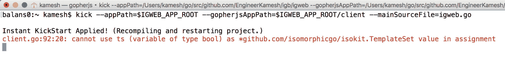
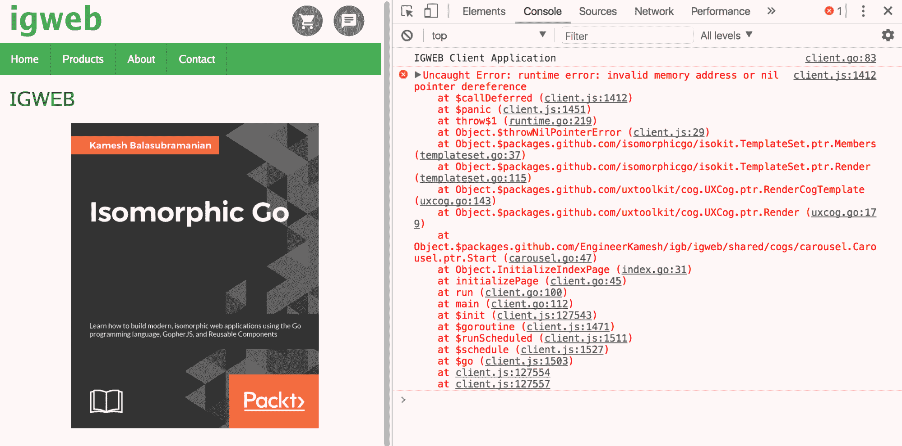
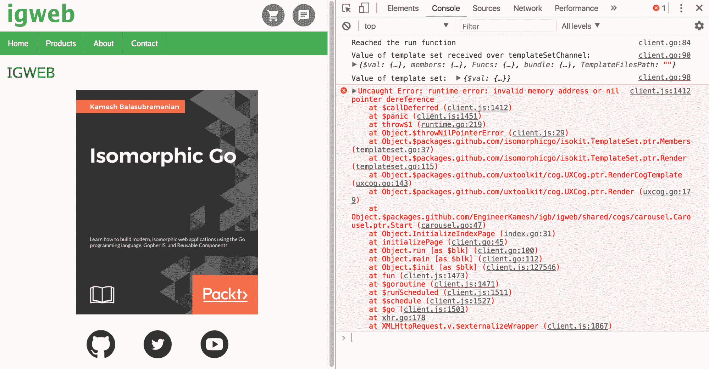

# 第十二章：调试同构 Go

调试同构 Go Web 应用程序包括以下内容：

+   识别编译器/转译器错误

+   检查恐慌堆栈跟踪

+   追踪代码以准确定位问题的来源

# 识别编译器/转译器错误

我们可以将编程看作是您（程序员）和机器（编译器/转译器）之间的对话。由于 Go 是一种类型化语言，我们可以在编译/转译时发现许多错误。这是编写纯 JavaScript 的明显优势，因为问题（由于缺乏类型检查而引起）可能隐藏并在最不合适的时候出现。编译器错误是机器向我们传达程序出现基本问题的手段，无论是纯粹的语法问题还是类型的不当使用。

`kick`非常方便地用于显示编译器错误，因为它会显示 Go 编译器和 GopherJS 转译器的错误。一旦引入错误（编译器/转译器可以识别的错误）并保存源文件，您将在运行`kick`的终端窗口中看到错误显示。

例如，让我们打开`client/client.go`源文件。在`run`函数中，让我们注释掉设置`ts`变量为通过`templateSetChannel`接收到的`TemplateSet`对象的那一行：

```go
//ts := <-templateSetChannel
```

我们知道`ts`变量将在稍后用于填充`env`对象的`TemplateSet`字段。让我们通过引入以下代码将`ts`变量设置为`false`的布尔值：

```go
ts := false
```

我们保存`client.go`源文件的同时，`kick`将立即给我们一个*踢*（双关语），关于我们刚刚引入的错误，如*图 A1*所示：



图 A1：保存 Go 源文件后，kick 命令立即显示给我们转译器错误

收到的编译器错误向我们显示了问题发生的确切行，从中我们可以诊断和纠正问题。从这个例子中可以学到的教训是，在开发同构 Go Web 应用程序时，同时在后台运行`kick`的终端窗口非常方便。通过这样做，您将能够在引入错误时立即看到编译器/转译器错误。

# 检查恐慌堆栈跟踪

对于在*转译时*无法由转译器找到的运行时错误，通常会有一个有用的**恐慌堆栈跟踪**，它显示在 Web 浏览器的控制台中，并为我们提供了有价值的信息来诊断问题。GopherJS 生成的 JavaScript 源映射文件帮助 Web 浏览器将 JavaScript 指令映射到 Go 源文件中的相应行。

让我们引入一个运行时错误，即我们的客户端程序在语法上是正确的（它将通过转译器检查），但是代码在运行时会出现问题。

回到`client/client.go`源文件中的`run`函数，注意我们对`ts`变量所做的以下代码更改：

```go
func run() {
  println("IGWEB Client Application")

  // Fetch the template set
  templateSetChannel := make(chan *isokit.TemplateSet)
  funcMap := template.FuncMap{"rubyformat": templatefuncs.RubyDate, "unixformat": templatefuncs.UnixTime, "productionmode": templatefuncs.IsProduction}
  go isokit.FetchTemplateBundleWithSuppliedFunctionMap(templateSetChannel, funcMap)
  // ts := <-templateSetChannel

  env := common.Env{}
 // env.TemplateSet = ts
 env.TemplateSet = nil
  env.Window = dom.GetWindow()
  env.Document = dom.GetWindow().Document()
  env.PrimaryContent = env.Document.GetElementByID("primaryContent")
  env.Location = env.Window.Location()

  registerRoutes(&env)
  initializePage(&env)
}
```

我们已经注释掉了`ts`变量的声明和初始化，并且还注释掉了将`ts`变量分配给`env`对象的`TemplateSet`字段的赋值。我们引入了一行代码，将`nil`值赋给`env`对象的`TemplateSet`字段。通过采取这种行动，我们基本上禁用了客户端模板集，这将阻止我们能够在客户端渲染任何模板。这也阻止了任何齿轮的渲染，因为齿轮依赖于模板集来正常运行。

加载 IGWEB 主页后，会生成一个恐慌堆栈跟踪，并在 Web 浏览器的控制台中显示，如*图 A2*所示：



图 A2：Web 浏览器控制台中显示的恐慌堆栈跟踪

在您的前端调试过程中，您经常会遇到以下错误消息：

```go
client.js:1412 Uncaught Error: runtime error: invalid memory address or nil pointer dereference
```

运行时错误：无效的内存地址或空指针解引用通常意味着我们试图对一个值（例如访问或改变属性）执行操作，该值等于 JavaScript 的`null`值。

检查产生的 panic 堆栈跟踪有助于我们准确定位问题：

```go
Uncaught Error: runtime error: invalid memory address or nil pointer dereference
 at $callDeferred (client.js:1412)
 at $panic (client.js:1451)
 at throw$1 (runtime.go:219)
 at Object.$throwNilPointerError (client.js:29)
 at Object.$packages.github.com/isomorphicgo/isokit.TemplateSet.ptr.Members (templateset.go:37)
 at Object.$packages.github.com/isomorphicgo/isokit.TemplateSet.ptr.Render (templateset.go:115)
 at Object.$packages.github.com/uxtoolkit/cog.UXCog.ptr.RenderCogTemplate (uxcog.go:143)
 at Object.$packages.github.com/uxtoolkit/cog.UXCog.ptr.Render (uxcog.go:179)
 at Object.$packages.github.com/EngineerKamesh/igb/igweb/shared/cogs/carousel.Carousel.ptr.Start (carousel.go:47)
 at Object.InitializeIndexPage (index.go:31)
 at initializePage (client.go:45)
 at run (client.go:100)
 at main (client.go:112)
 at $init (client.js:127543)
 at $goroutine (client.js:1471)
 at $runScheduled (client.js:1511)
 at $schedule (client.js:1527)
 at $go (client.js:1503)
 at client.js:127554
 at client.js:127557
```

panic 堆栈跟踪中感兴趣的区域以粗体显示。从 panic 堆栈跟踪中，我们可以确定轮播齿轮未能渲染，因为`TemplateSet`似乎出了问题。通过进一步检查 panic 堆栈跟踪，我们可以确定在`client.go`源文件的第 112 行调用了`run`函数。`run`函数是我们通过将`env`对象的`TemplateSet`字段设置为`nil`而引入错误的地方。通过这次调试练习，我们可以看到在这种情况下，panic 堆栈跟踪没有揭示问题的确切行，但它为我们提供了足够的线索来纠正问题。

在客户端开发时要遵循的一个好习惯是始终保持网页浏览器的控制台打开，这样您就可以在问题发生时看到问题。

# 追踪代码以准确定位问题的来源

另一个良好的客户端调试实践是**追踪**，即在程序流程中打印关键步骤的实践。在调试场景中，这将包括在疑似有问题的代码区域周围有策略地调用`println`（或`fmt.Println`）函数。您可以使用网页浏览器的控制台验证是否达到了这些打印语句，这将让您更好地了解客户端程序在运行时的运行情况。

例如，在调试上一节中引入的问题时，我们可以在`run`函数中放置以下`println`调用：

```go
func run() {
  //println("IGWEB Client Application")
  println("Reached the run function")
  // Fetch the template set
  templateSetChannel := make(chan *isokit.TemplateSet)
  funcMap := template.FuncMap{"rubyformat": templatefuncs.RubyDate, "unixformat": templatefuncs.UnixTime, "productionmode": templatefuncs.IsProduction}
  go isokit.FetchTemplateBundleWithSuppliedFunctionMap(templateSetChannel, funcMap)
  // ts := <-templateSetChannel
  println("Value of template set received over templateSetChannel: ", <-templateSetChannel)
  env := common.Env{}
  // env.TemplateSet = ts
  env.TemplateSet = nil
  env.Window = dom.GetWindow()
  env.Document = dom.GetWindow().Document()
  env.PrimaryContent = env.Document.GetElementByID("primaryContent")
  env.Location = env.Window.Location()
  println("Value of template set: ", env.TemplateSet)
  registerRoutes(&env)
  initializePage(&env)
}
```

我们通过在程序流程中打印关键步骤，通过进行策略性的`println`函数调用来进行追踪。第一个`println`调用用于验证我们是否到达了`run`函数。第二个`println`调用用于检查从模板集通道返回给我们的模板集的健康状况。第三个，也是最后一个`println`调用，用于检查我们填充`env`对象的字段后模板集的健康状况。

*图 A3*显示了网页控制台显示的打印语句，以及在`client.go`源文件中进行`println`调用的相应行号：



图 A3：网页控制台显示的打印语句

通过追踪练习，我们首先可以验证我们已成功到达`run`函数。其次，我们可以通过注意对象的属性是否出现（例如`members`，`Funcs`和`bundle`）来验证通过`templateSetChannel`接收到的`TemplateSet`对象的健康状况。第三个，也是最后一个打印语句，还验证了`env`对象准备就绪后`TemplateSet`对象的健康状况。此打印语句通过显示`TemplateSet`对象未初始化的情况，揭示了问题的来源，因为我们在打印语句中看不到对象的任何属性。
