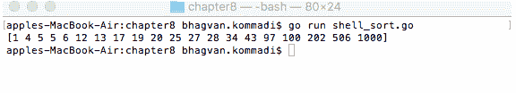

# 第八章：经典算法

经典算法在数据搜索和密码学领域得到应用。排序、搜索、递归和哈希算法是经典算法的好例子。排序算法用于将元素按升序或降序排列。这些算法通常用于规范化数据和创建可读内容。搜索算法用于在集合中查找元素。递归算法是一种调用自身输入项的算法。哈希算法是一种加密哈希技术。它是一种将具有主观大小的数据映射到具有固定大小的哈希的科学计算。它旨在是一个单向函数，你不能改变它。

在本章中，我们将介绍不同的经典算法，并通过合适的示例进行解释。

本章涵盖了以下算法：

+   排序：

    +   冒泡

    +   选择

    +   插入

    +   希尔

    +   归并

    +   快速

+   搜索：

    +   线性

    +   顺序

    +   二进制

    +   插值

+   递归

+   哈希

# 技术要求

为您的操作系统安装 Go 版本 1.10，请访问[`golang.org/doc/install`](https://golang.org/doc/install)。

本章中代码的 GitHub URL 如下：[`github.com/PacktPublishing/Learn-Data-Structures-and-Algorithms-with-Golang/tree/master/Chapter08`](https://github.com/PacktPublishing/Learn-Data-Structures-and-Algorithms-with-Golang/tree/master/Chapter08)。

# 排序

排序算法将集合中的元素按升序或降序排列。字典序可以应用于字符和字符串的集合。这些算法的效率在于将输入数据排序成有序集合的性能。最佳排序算法的时间复杂度是*O*(n log n)。排序算法根据以下标准进行分类：

+   计算复杂度

+   内存使用

+   稳定性

+   排序类型：串行/并行

+   适应性

+   排序方法

在以下章节中，我们将探讨不同的排序算法，即冒泡、选择、插入、希尔、归并和快速排序。

# 气泡

冒泡排序算法是一种排序算法，它比较相邻的两个元素，如果它们顺序错误则交换它们。该算法的复杂度为*O*(n²)，其中 n 是要排序的元素数量。最小或最大的值会冒泡到集合的顶部，或者最小或最大的值会沉到集合的底部（取决于你是按升序还是降序排序）。

以下代码片段展示了冒泡排序算法的实现。`bubbleSorter`函数接收一个整数数组，并按升序对数组元素进行排序。

`main`方法初始化数组整数并调用`bubbleSorter`函数，如下所示：

```go
//main package has examples shown
// in Go Data Structures and algorithms book
package main

// importing fmt and bytes package
import (
  "fmt"
)

//bubble Sorter method
func bubbleSorter(integers [11]int) {

  var num int
  num = 11
  var isSwapped bool
  isSwapped = true
  for isSwapped {
    isSwapped = false
    var i int
    for i = 1; i < num; i++ {
      if integers[i-1] > integers[i] {

        var temp = integers[i]
        integers[i] = integers[i-1]
        integers[i-1] = temp
        isSwapped = true
      }
    }
  }
  fmt.Println(integers)
}

// main method
func main() {
  var integers [11]int = [11]int{31, 13, 12, 4, 18, 16, 7, 2, 3, 0, 10}
  fmt.Println("Bubble Sorter")
  bubbleSorter(integers)

}
```

执行以下命令以运行`bubble_sort.go`文件：

```go
go run bubble_sort.go
```

输出如下：


让我们在下一节中看看选择排序算法。

# 选择

选择排序是一种将输入集合分成两个片段的算法。通过从列表的左侧交换最小或最大的元素到右侧，对这个元素子列表进行排序。该算法的时间复杂度为*O*(n²)。对于大型集合，此算法效率低下，性能不如插入排序算法。

以下代码显示了`SelectionSorter`函数的实现，该函数接受要排序的集合：

```go
//main package has examples shown
// in Go Data Structures and algorithms book
package main

// importing fmt package
import (
  "fmt"
)

// Selection Sorter method
func SelectionSorter(elements []int) {

  var i int
  for i = 0; i < len(elements)-1; i++ {
    var min int
    min = i
    var j int
    for j = i + 1; j <= len(elements)-1; j++ {
      if elements[j] < elements[min] {
        min = j
      }
    }
    swap(elements, i, min)
  }
}
```

让我们在下一节中看看不同的选择方法。

# 交换方法

`swap`方法接受元素数组以及`i`和`j`索引作为参数。该方法将位置`i`的元素与位置`j`的元素进行交换，如下所示：

```go
// swap method
func swap(elements []int, i int, j int) {
  var temp int
  temp = elements[j]
  elements[j] = elements[i]
  elements[i] = temp
}
```

# `main`方法

`main`方法初始化`elements`数组。在以下代码片段中，`elements`在排序前后被打印出来：

```go
//main method
func main() {
  var elements []int
  elements = []int{11, 4, 18, 6, 19, 21, 71, 13, 15, 2}
  fmt.Println("Before Sorting ", elements)
  SelectionSorter(elements)
  fmt.Println("After Sorting", elements)
}
```

运行以下命令以执行`selection_sort.go`文件：

```go
go run selection_sort.go
```

输出如下：


让我们在下一节中看看插入排序算法。

# 插入

插入排序是一种一次创建一个最终排序数组的算法。该算法的性能时间复杂度为*O*(n²)。与其他算法（如快速排序、堆排序和归并排序）相比，在大型集合上效率较低。在现实生活中，桥牌游戏中玩家手动排序牌的例子是插入排序的一个很好的例子。

希尔排序算法的实现如下所示。`RandomSequence`函数接受元素数量作为参数并返回一个随机整数数组：

```go
//main package has examples shown
// in Go Data Structures and algorithms book
package main

// importing fmt and bytes package
import (
  "fmt"
  "math/rand"
  "time"
)

// randomSequence method
func randomSequence(num int) []int {

    var sequence []int
    sequence = make([]int, num,num)
    rand.Seed(time.Now().UnixNano())
    var i int
    for i= 0; i < num; i++ {
        sequence[i] = rand.Intn(999) - rand.Intn(999)
    }
    return sequence
}
```

让我们在下一节中看看不同的插入方法。

# InsertionSorter 方法

`InsertionSorter`方法的实现如下所示。此方法接受整数数组作为参数并对其进行排序：

```go
//InsertionSorter method
func InsertionSorter(elements []int) {
    var n = len(elements)
    var i int

    for i = 1; i < n; i++ {
        var j int
        j = i
        for j > 0 {
            if elements[j-1] > elements[j] {
                elements[j-1], elements[j] = elements[j], elements[j-1]
            }
            j = j - 1
        }
    }
}
```

# `main`方法

`main`方法通过调用`randomSequence`函数初始化`sequence`，如下面的代码所示。`InsertionSorter`函数接受`sequence`并按升序对其进行排序：

```go
//main method
func main() {

    var sequence []int
    sequence = randomSequence(24)
    fmt.Println("\n^^^^^^ Before Sorting ^^^ \n\n", sequence)
    InsertionSorter(sequence)
    fmt.Println("\n--- After Sorting ---\n\n", sequence, "\n")
}
```

运行以下命令以执行`insertion_sort.go`文件：

```go
go run insertion_sort.go
```

输出如下：


让我们在下一节中看看希尔排序算法。

# 希尔

希尔排序算法对集合中顺序不正确的元素对进行排序。要比较的元素之间的距离依次减小。此算法比快速排序算法执行更多操作，具有更高的缓存未命中率。

在下面的代码中，我们可以看到希尔排序算法的实现。`ShellSorter`函数接受一个整数数组作为参数并对其进行排序：

```go
//main package has examples shown
// in Go Data Structures and algorithms book
package main

// importing fmt and bytes package
import (
  "fmt"
)

// shell sorter method
func ShellSorter(elements []int) {
  var (
    n = len(elements)
    intervals = []int{1}
    k = 1

  )

  for {
    var interval int
    interval = power(2, k) + 1
    if interval > n-1 {
      break
    }
    intervals = append([]int{interval}, intervals...)
    k++
  }
  var interval int
  for _, interval = range intervals {
    var i int
    for i = interval; i < n; i += interval {
      var j int
      j = i
      for j > 0 {
        if elements[j-interval] > elements[j] {
          elements[j-interval], elements[j] = elements[j], elements[j-interval]
        }
        j = j - interval
      }
    }
  }
}
```

让我们在下一节中看看不同的希尔方法。

# 功率方法

`power`方法接受`exponent`和`index`作为参数，并返回指数的指数次幂，如下所示：

```go
//power function
func power(exponent int, index int) int {
  var power int
  power = 1
  for index > 0 {
    if index&1 != 0 {
      power *= exponent
    }
    index >>= 1
    exponent *= exponent
  }
  return power
}

```

# `main`方法

`main`方法初始化`elements`整数数组并调用`ShellSorter`方法，如下所示：

```go
// main method
func main() {
  var elements []int
  elements = []int{34, 202, 13, 19, 6, 5, 1, 43, 506, 12, 20, 28, 17, 100, 25, 4, 5, 97, 1000, 27}
  ShellSorter(elements)
  fmt.Println(elements)
}
```

运行以下命令以执行`shell_sort.go`文件：

```go
go run shell_sort.go
```

输出如下：



让我们看一下下一节中的归并排序算法。

# 归并

归并排序算法是一种基于比较的方法，由约翰·冯·诺伊曼发明。相邻列表中的每个元素都会进行比较以进行排序。算法的性能是*O*(*n* *log n*)。此算法是排序链表的最佳算法。

以下代码片段演示了归并排序算法。`createArray`函数接受`num int`作为参数，并返回一个由随机元素组成的整数`array`：

```go
//main package has examples shown
// in Go Data Structures and algorithms book
package main

// importing fmt and bytes package
import (
  "fmt"
  "math/rand"
  "time"
)

// create array
func createArray(num int) []int {
  var array []int
  array = make([]int, num, num)
  rand.Seed(time.Now().UnixNano())
  var i int
  for i = 0; i < num; i++ {
    array[i] = rand.Intn(99999) - rand.Intn(99999)
  }
  return array
}
```

让我们看一下以下章节中不同的归并方法。

# `MergeSorter`方法

`MergeSorter`方法接受一个整数元素数组作为参数，并将两个元素子数组递归地传递给`MergeSorter`方法。结果数组被连接并返回作为集合，如下所示：

```go
// MergeSorter algorithm
func MergeSorter(array []int) []int {

  if len(array) < 2 {
    return array
  }
  var middle int
  middle = (len(array)) / 2
  return JoinArrays(MergeSorter(array[:middle]), MergeSorter(array[middle:]))
}
```

# `JoinArrays`方法

`JoinArrays`函数接受`leftArr`和`rightArr`整数数组作为参数。以下代码返回合并后的数组：

```go
// Join Arrays method
func JoinArrays(leftArr []int, rightArr []int) []int {

  var num int
  var i int
  var j int
  num, i, j = len(leftArr)+len(rightArr), 0, 0
  var array []int
  array = make([]int, num, num)

  var k int
  for k = 0; k < num; k++ {
    if i > len(leftArr)-1 && j <= len(rightArr)-1 {
      array[k] = rightArr[j]
      j++
    } else if j > len(rightArr)-1 && i <= len(leftArr)-1 {
      array[k] = leftArr[i]
      i++
    } else if leftArr[i] < rightArr[j] {
      array[k] = leftArr[i]
      i++
    } else {
      array[k] = rightArr[j]
      j++
    }
  }
  return array
}
```

# `main`方法

`main`方法初始化一个包含`40`个元素的整数数组，并在排序前后打印元素，如下所示：

```go
// main method
func main() {

  var elements []int
  elements = createArray(40)
  fmt.Println("\n Before Sorting \n\n", elements)
  fmt.Println("\n-After Sorting\n\n", MergeSorter(elements), "\n")
}
```

运行以下命令以执行`merge_sort.go`文件：

```go
go run merge_sort.go
```

输出如下：


让我们看一下以下章节中的快速排序算法。

# 快速

快速排序是一种对集合中的元素进行有序排序的算法。并行化后的快速排序比归并排序和堆排序快两到三倍。算法的性能是*O*(*n log n*)。此算法是二叉树排序算法的空间优化版本。

在以下代码片段中，实现了快速排序算法。`QuickSorter`函数接受一个整数`elements`数组，以及`upper int`和`below int`作为参数。函数将数组分成部分，这些部分被递归地分割和排序：

```go
//main package has examples shown
// in Go Data Structures and algorithms book
package main

// importing fmt package
import (
  "fmt"
)

//Quick Sorter method
func QuickSorter(elements []int, below int, upper int) {
  if below < upper {
    var part int
    part = divideParts(elements, below, upper)
    QuickSorter(elements, below, part-1)
    QuickSorter(elements, part+1, upper)
  }
}
```

让我们看一下以下章节中不同的快速方法。

# `divideParts`方法

`divideParts`方法接受一个整数`elements`数组，`upper int`和`below int`作为参数。该方法按升序排序元素，如下所示：

```go
// divideParts method
func divideParts(elements []int, below int, upper int) int {
  var center int
  center = elements[upper]
  var i int
  i = below
  var j int
  for j = below; j < upper; j++ {
    if elements[j] <= center {
      swap(&elements[i], &elements[j])
      i += 1
    }
  }
  swap(&elements[i], &elements[upper])
  return i
}
```

# 交换方法

在以下代码片段中，`swap`方法通过交换值来交换元素：

```go
//swap method
func swap(element1 *int, element2 *int) {
  var val int
  val = *element1
  *element1 = *element2
  *element2 = val
}
```

# `main`方法

`main`方法要求用户输入元素的个数和要`read`的元素。在排序前后，`array`被初始化并打印，如下所示：

```go
// main method
func main() {
  var num int

  fmt.Print("Enter Number of Elements: ")
  fmt.Scan(&num)

  var array = make([]int, num)

  var i int
  for i = 0; i < num; i++ {
    fmt.Print("array[", i, "]: ")
    fmt.Scan(&array[i])
  }

  fmt.Print("Elements: ", array, "\n")
  QuickSorter(array, 0, num-1)
  fmt.Print("Sorted Elements: ", array, "\n")
}
```

执行以下命令以运行`quick_sort.go`文件：

```go
go run quick_sort.go
```

输出如下：


现在我们已经完成了排序算法，让我们在下一节中看看搜索算法。

# 搜索

搜索算法用于检索存储在数据源或集合中的信息。算法被赋予待查元素的键，并将找到相关值。搜索算法根据信息的可用性返回布尔值 true 或 false。它们可以被增强以显示与搜索标准相关的多个值。不同的搜索算法类型包括线性、二分和插值。这些算法根据搜索类型进行分类。搜索算法包括暴力法和启发式方法。算法的选择基于其效率。选择这些算法的不同因素如下：

+   输入类型

+   输出类型

+   明确性

+   正确性

+   完整性

+   有效性

+   通用性

在本节中，我们将讨论不同类型的搜索算法。

# 线性

线性搜索方法通过依次检查集合中的每个元素来在集合中查找给定的值。线性搜索算法的时间复杂度是*O*(*n*)。二分搜索算法和哈希表的性能优于此搜索算法。

以下代码片段展示了线性搜索方法的实现。`LinearSearch`函数接受一个整数数组`elements`和`findElement int`作为参数。如果找到`findElement`，函数返回布尔值`true`；否则，返回`false`：

```go
//main package has examples shown
// in Go Data Structures and algorithms book
package main

// importing fmt package
import (
  "fmt"
)

// Linear Search method
func LinearSearch(elements []int, findElement int) bool {
  var element int
  for _, element = range elements {
    if element == findElement {
      return true
    }
  }
  return false
}
```

`main`方法初始化整数数组`elements`，并通过传递需要找到的整数调用`LinearSearch`方法，如下所示：

```go
// main method
func main() {
  var elements []int
  elements = []int{15, 48, 26, 18, 41, 86, 29, 51, 20}
  fmt.Println(LinearSearch(elements, 48))
}
```

执行以下命令以运行`linear_search.go`文件：

```go
go run linear_search.go
```

输出如下：


让我们看一下以下章节中的二分搜索算法。

# 二分

二分搜索算法将输入值与排序集合的中间元素进行比较。如果不相等，则消除未找到元素的半部分。搜索继续在集合的剩余半部分进行。此算法的时间复杂度为*O*(*log n*)。

以下代码片段展示了使用`sort`包中的`sort.Search`函数实现的二分搜索算法。`main`方法初始化`elements`数组，并调用`sort.Search`函数以查找整数元素：

```go
//main package has examples shown
// in Go Data Structures and algorithms book
package main

// importing fmt package
import (
  "fmt"
  "sort"
)

// main method
func main() {
  var elements []int
  elements = []int{1, 3, 16, 10, 45, 31, 28, 36, 45, 75}
  var element int
  element = 36

  var i int

  i = sort.Search(len(elements), func(i int) bool { return elements[i] >= element })
  if i < len(elements) && elements[i] == element {
    fmt.Printf("found element %d at index %d in %v\n", element, i, elements)
  } else {
    fmt.Printf("element %d not found in %v\n", element, elements)
  }
}
```

执行以下命令以运行`binary_search.go`文件：

```go
go run binary_search.go
```

输出如下：


让我们看一下以下章节中的插值搜索算法。

# 插值

插值搜索算法在有序集合中搜索元素。该算法通过在估计位置之前或之后减小搜索空间来找到输入元素。搜索算法的时间复杂度为 *O*(*log log n*)。

以下代码片段实现了插值搜索算法。`InterpolationSearch` 函数接受整数元素数组和要查找的整数元素作为参数。该函数在集合中找到元素，并返回找到的元素的布尔值和索引：

```go
//main package has examples shown
// in Go Data Structures and algorithms book
package main

// importing fmt package
import (
  "fmt"
)

//interpolation search method
func InterpolationSearch(elements []int, element int) (bool, int) {
  var mid int
  var low int
  low = 0
  var high int
  high = len(elements) - 1

  for elements[low] < element && elements[high] > element {
    mid = low + ((element-elements[low])*(high-low))/(elements[high]-elements[low])

    if elements[mid] < element {
      low = mid + 1
    } else if elements[mid] > element {
      high = mid - 1
    } else {
      return true, mid
    }
  }

  if elements[low] == element {
    return true, low
  } else if elements[high] == element {
    return true, high
  } else {
    return false, -1
  }

  return false, -1
}
```

`main` 方法初始化整数元素数组，并使用 `elements` 数组和 `element` 参数调用 `InterpolationSearch` 方法，如下所示：

```go
// main method
func main() {
  var elements []int
  elements = []int{2, 3, 5, 7, 9}
  var element int
  element = 7
  var found bool
  var index int
  found, index = InterpolationSearch(elements, element)
  fmt.Println(found, "found at", index)
}
```

运行以下命令以执行 `interpolation_search.go` 文件：

```go
go run interpolation_search.go
```

输出如下：


现在我们已经完成了搜索算法，接下来让我们看看下一节中的递归算法。

# 递归

递归是一种算法，其中一个步骤会调用当前正在运行的方法或函数。该算法通过应用基本任务并返回值来获取输入的结果。这种方法在第一章，*数据结构与算法*的*分而治之算法*部分中简要讨论过。在递归过程中，如果未达到基本条件，则可能会出现栈溢出条件。

以下代码片段实现了递归算法。`Factor` 方法将 `num` 作为参数，并返回 `num` 的阶乘。该方法使用递归来计算数字的阶乘：

```go
//main package has examples shown
// in Go Data Structures and algorithms book
package main

// importing fmt and bytes package
import (
  "fmt"
)

//factorial method
func Factor(num int) int {
  if num <= 1 {
    return 1
  }
  return num * Factor(num-1)
}
```

`main` 方法定义了一个值为 `12` 的整数并调用 `Factor` 方法。打印出数字 `12` 的阶乘，如下所示：

```go
//main method
func main() {
  var num int = 12
  fmt.Println("Factorial: %d is %d", num, Factor(num))
}
```

运行以下命令以执行 `recurse_factorial.go` 文件：

```go
go run recurse_factorial.go
```

输出如下：


现在我们已经完成了递归算法，接下来让我们看看下一节中的哈希算法。

# 哈希

在第四章，*非线性数据结构*中介绍了哈希函数。Go 中的哈希实现有 `crc32` 和 `sha256` 实现。以下代码片段展示了使用 XOR 变换实现的具有多个值的哈希算法。`CreateHash` 函数接受一个 `byte` 数组，`byteStr`，作为参数，并返回该字节数组的 `sha256` 校验和：

```go
//main package has examples shown
// in Go Data Structures and algorithms book
package main

// importing fmt package
import (
  "fmt"
  "crypto/sha1"
  "hash"
)

//CreateHash method
func CreateHash(byteStr []byte) []byte {
  var hashVal hash.Hash
  hashVal = sha1.New()
  hashVal.Write(byteStr)

  var bytes []byte

  bytes = hashVal.Sum(nil)
  return bytes
}
```

在以下章节中，我们将讨论哈希算法的不同方法。

# The CreateHashMutliple method

`CreateHashMutliple` 方法接受 `byteStr1` 和 `byteStr2` 字节数组作为参数，并返回 XOR 变换后的字节数值，如下所示：

```go
// Create hash for Multiple Values method
func CreateHashMultiple(byteStr1 []byte, byteStr2 []byte) []byte {
  return xor(CreateHash(byteStr1), CreateHash(byteStr2))
}
```

# XOR 方法

`xor`方法接受`byteStr1`和`byteStr2`字节数组作为参数，并返回 XOR 变换结果，如下所示：

```go
// XOR method
func xor(byteStr1 []byte, byteStr2 []byte) []byte {
  var xorbytes []byte
  xorbytes = make([]byte, len(byteStr1))
  var i int
  for i = 0; i < len(byteStr1); i++ {
    xorbytes[i] = byteStr1[i] ^ byteStr2[i]
  }
  return xorbytes
}
```

# 主要方法

`main`方法调用`createHashMutliple`方法，传递`Check`和`Hash`作为字符串参数，并打印字符串的哈希值，如下所示：

```go
// main method
func main() {

  var bytes []byte
  bytes = CreateHashMultiple([]byte("Check"), []byte("Hash"))

  fmt.Printf("%x\n", bytes)
}
```

运行以下命令来执行`hash.go`文件：

```go
go run hash.go
```

输出如下：


# 摘要

本章介绍了冒泡排序、选择排序、插入排序、希尔排序、归并排序和快速排序等排序算法。讨论了线性搜索、二分搜索和插值搜索等搜索算法。最后，通过代码片段解释了递归和哈希算法。所有算法都伴随着代码示例和性能分析。

在下一章中，将介绍使用图表示网络和使用列表表示稀疏矩阵，以及相应的示例。

# 问题

1.  冒泡排序的复杂度顺序是什么？

1.  哪种排序算法一次取一个元素来创建一个最终排序的集合？

1.  哪种排序方法可以排序彼此距离较远的元素对？

1.  使用归并排序算法的复杂度是多少？

1.  哪个算法更好：快速排序、归并排序还是堆排序算法？

1.  有哪些不同类型的搜索算法？

1.  提供一个递归算法的代码示例。

1.  谁是第一个描述插值搜索的人？

1.  哪种排序算法是基于相邻元素列表的比较方法？

1.  谁发表了希尔排序算法？

# 进一步阅读

如果你想了解更多关于排序、选择、搜索和哈希等算法的信息，以下书籍推荐：

+   《设计模式》，作者：艾里克·伽玛、理查德·赫尔姆、拉尔夫·约翰逊和约翰·弗利斯

+   《算法导论 第 3 版》，作者：托马斯·H·科门、查尔斯·E·莱伊森、罗纳德·L·里维斯和克利福德·斯坦

+   《数据结构和算法：简单入门》，作者：鲁道夫·拉塞尔
