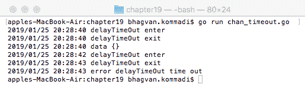
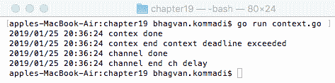
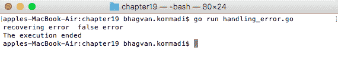
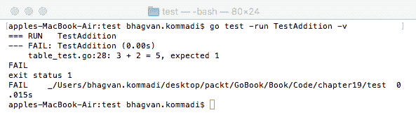

# 第十一章：下一步

在本附录中，我们分享了读者的学习成果。展示了代码仓库链接和关键要点。包括最新数据结构和算法的参考文献。提供提示和技术，帮助你跟上数据结构和算法的最新动态。

# 技术要求

从[`golang.org/doc/install`](https://golang.org/doc/install)安装 Go 版本 1.10，确保选择适合您操作系统的正确版本。

本附录中的代码 GitHub 仓库可在此找到：[`github.com/PacktPublishing/Learn-Data-Structures-and-Algorithms-with-Golang/tree/master/Appendix`](https://github.com/PacktPublishing/Learn-Data-Structures-and-Algorithms-with-Golang/tree/master/Appendix)。

# 成果

本书的成果如下：

+   使用正确的数据结构和算法提高网络或移动应用程序的性能。

+   理解算法如何解决问题，以及如何为问题选择正确的数据结构。

+   列举问题的各种解决方案，并在进行成本/效益分析后识别算法和数据结构。

+   掌握编写算法伪代码的各种技巧，让你在白板会议和面试任务中脱颖而出。

+   通过预测算法或数据结构的速度和效率来预测选择数据结构和算法的陷阱。

在下一节中，讨论了关键要点、参考文献、文章以及提示和技术。

# 关键要点

读者的关键要点如下：

+   如何为问题选择正确的算法和数据结构。

+   如何比较不同算法的复杂性和数据结构，以评估代码性能和效率。

+   如何应用最佳实践来提高和增强应用程序的性能。

+   书中提供了与网络和移动软件解决方案相关的现实世界问题、解决方案和最佳实践，作为代码示例。

# 下一步

在本节中，为每一章提供了进一步阅读的论文和文章。

# 第一章 – 数据结构与算法

以下文章与数据结构和算法相关：

+   *Go 数据结构完整指南* ([`flaviocopes.com/golang-data-structures/`](https://flaviocopes.com/golang-data-structures/))

+   *数据结构与算法* ([`www.golangprograms.com/data-structure-and-algorithms.html`](http://www.golangprograms.com/data-structure-and-algorithms.html))

+   *Go 中的数据结构：栈和队列* ([`ieftimov.com/golang-datastructures-stacks-queues`](https://ieftimov.com/golang-datastructures-stacks-queues))

以下论文与数据结构和算法相关：

+   *算法表示 – DTIC ([`apps.dtic.mil/dtic/tr/fulltext/u2/697026.pdf`](https://apps.dtic.mil/dtic/tr/fulltext/u2/697026.pdf))

+   *算法的计算复杂性 ([`fi.ort.edu.uy/innovaportal/file/20124/1/60-hartmanis_stearns_complexity_of_algorithms.pdf`](https://fi.ort.edu.uy/innovaportal/file/20124/1/60-hartmanis_stearns_complexity_of_algorithms.pdf))

+   *分而治之方法的分析与性能 ([`ijarcet.org/wp-content/uploads/IJARCET-VOL-6-ISSUE-8-1295-1298.pdf`](http://ijarcet.org/wp-content/uploads/IJARCET-VOL-6-ISSUE-8-1295-1298.pdf))

# 第二章 – Go 数据结构与算法入门

以下文章与本章内容相关：

+   *Go – 数据结构 ([`golanglibs.com/category/data-structures`](https://golanglibs.com/category/data-structures))

+   *应用 – Go 算法和数据结构 ([`appliedgo.net/domains/algorithms-and-data-structures/`](https://appliedgo.net/domains/algorithms-and-data-structures/))

+   *Effective Go ([`golang.org/doc/effective_go.html`](https://golang.org/doc/effective_go.html))

# 第三章 – 线性数据结构

以下文章与线性数据结构相关：

+   *初学者数据结构：数组、HashMaps 和列表 ([`adrianmejia.com/blog/2018/04/28/data-structures-time-complexity-for-beginners-arrays-hashmaps-linked-lists-stacks-queues-tutorial/`](https://adrianmejia.com/blog/2018/04/28/data-structures-time-complexity-for-beginners-arrays-hashmaps-linked-lists-stacks-queues-tutorial/))

+   *栈 - 数组实现 ([`www.cs.bu.edu/teaching/c/stack/array/`](https://www.cs.bu.edu/teaching/c/stack/array/))

以下论文与线性数据结构相关：

+   *数组范围模式查询的线性空间数据结构 ([`cs.au.dk/~larsen/papers/linear_mode.pdf`](https://cs.au.dk/~larsen/papers/linear_mode.pdf))

+   *关于栈和队列的研究论文 ([`www.ijirt.org/master/publishedpaper/IJIRT101357_PAPER.pdf`](http://www.ijirt.org/master/publishedpaper/IJIRT101357_PAPER.pdf))

+   *在凸多面体中快速射线的线性数据结构 ([`www.cs.tau.ac.il/~haimk/papers/ray.pdf`](http://www.cs.tau.ac.il/~haimk/papers/ray.pdf))

# 第四章 – 非线性数据结构

以下文章与非线性数据结构相关：

+   *非线性数据结构的概述 ([`medium.com/@ankitkulhari/overview-of-non-linear-data-structures-40cb441f6d7`](https://medium.com/@ankitkulhari/overview-of-non-linear-data-structures-40cb441f6d7))

+   *非线性数据结构 ([`euler.vcsu.edu:7000/9647/`](http://euler.vcsu.edu:7000/9647/))

+   *什么是森林数据结构？ ([`magoosh.com/data-science/what-is-forest-data-structure/`](https://magoosh.com/data-science/what-is-forest-data-structure/))

+   *树形数据结构* ([`www.cs.cmu.edu/~clo/www/CMU/DataStructures/Lessons/lesson4_1.htm`](http://www.cs.cmu.edu/~clo/www/CMU/DataStructures/Lessons/lesson4_1.htm))

以下论文与非线性数据结构相关：

+   *Y-Trees：一种扩展的非线性数据结构，用于更好地组织大型数据* ([`ieeexplore.ieee.org/document/8234528`](https://ieeexplore.ieee.org/document/8234528))

+   *非线性数据结构的形状分析* ([`link.springer.com/chapter/10.1007/978-3-642-15769-1_13`](https://link.springer.com/chapter/10.1007/978-3-642-15769-1_13))

+   *非线性数据表面的表示* ([`www.semanticscholar.org/paper/Representation-of-Nonlinear-Data-Surfaces-Olsen-Fukunaga/f4f4812532ba427658ecc83d772637c076780acf`](https://www.semanticscholar.org/paper/Representation-of-Nonlinear-Data-Surfaces-Olsen-Fukunaga/f4f4812532ba427658ecc83d772637c076780acf))

# 第五章 – 同质数据结构

以下文章与同质数据结构相关：

+   *在 GO(LANG)中使用矩阵* ([`connor-johnson.com/2014/06/21/using-matrices-in-golang/`](http://connor-johnson.com/2014/06/21/using-matrices-in-golang/))

+   *Golang：线性代数和矩阵计算示例* ([`www.socketloop.com/tutorials/golang-linear-algebra-and-matrix-calculation-example`](https://www.socketloop.com/tutorials/golang-linear-algebra-and-matrix-calculation-example))

+   *Gonum 教程：Go 中的线性代数* ([`medium.com/wireless-registry-engineering/gonum-tutorial-linear-algebra-in-go-21ef136fc2d7`](https://medium.com/wireless-registry-engineering/gonum-tutorial-linear-algebra-in-go-21ef136fc2d7))

+   *Golang 中的矩阵乘法（3x3 矩阵）* ([`repl.it/@hygull/Matrix-multiplication-in-Golang2-matrices-of-order-3x3`](https://repl.it/@hygull/Matrix-multiplication-in-Golang2-matrices-of-order-3x3))

# 第六章 – 异质数据结构

以下文章与异质数据结构相关：

+   异质数组 ([`gist.github.com/cslarsen/5256744`](https://gist.github.com/cslarsen/5256744))

+   *OL（有序列表）* ([`www.w3.org/MarkUp/html3/seqlists.html`](https://www.w3.org/MarkUp/html3/seqlists.html))

+   *大型有序列表* ([`www.aerospike.com/docs/guide/llist.html`](https://www.aerospike.com/docs/guide/llist.html))

+   *实现有序列表* ([`bradfieldcs.com/algos/lists/implementing-an-ordered-list/`](https://bradfieldcs.com/algos/lists/implementing-an-ordered-list/))

# 第七章 – 动态数据结构

以下文章与动态数据结构相关：

+   *Go 数据结构完整指南* ([`flaviocopes.com/golang-data-structures/`](https://flaviocopes.com/golang-data-structures/))

+   *数据结构与算法* ([`www.golangprograms.com/data-structure-and-algorithms.html`](http://www.golangprograms.com/data-structure-and-algorithms.html))

+   *Go 语言中的数据结构：栈和队列* ([`ieftimov.com/golang-datastructures-stacks-queues`](https://ieftimov.com/golang-datastructures-stacks-queues))

以下论文与动态数据结构相关：

+   *算法表示 – DTIC* ([`apps.dtic.mil/dtic/tr/fulltext/u2/697026.pdf`](https://apps.dtic.mil/dtic/tr/fulltext/u2/697026.pdf))

+   *算法的计算复杂性* ([`fi.ort.edu.uy/innovaportal/file/20124/1/60-hartmanis_stearns_complexity_of_algorithms.pdf`](https://fi.ort.edu.uy/innovaportal/file/20124/1/60-hartmanis_stearns_complexity_of_algorithms.pdf))

+   *分治方法的分析与性能* ([`ijarcet.org/wp-content/uploads/IJARCET-VOL-6-ISSUE-8-1295-1298.pdf`](http://ijarcet.org/wp-content/uploads/IJARCET-VOL-6-ISSUE-8-1295-1298.pdf))

# 第八章 – 经典算法

以下文章与经典算法相关：

+   *排序算法入门* ([`hackernoon.com/sorting-algorithms-primer-374b83f3ba09`](https://hackernoon.com/sorting-algorithms-primer-374b83f3ba09))

+   *深度优先搜索* ([`medium.com/@g789872001darren/gogoalgorithm-1-depth-first-search-582eeb58f23a`](https://medium.com/@g789872001darren/gogoalgorithm-1-depth-first-search-582eeb58f23a))

+   *Go 语言中的哈希（Golang vs Python）* ([`medium.com/@vworri/hashing-in-go-golang-vs-python-b7bc1194e967`](https://medium.com/@vworri/hashing-in-go-golang-vs-python-b7bc1194e967))

+   *Golang 中的迭代、递归和尾递归对比* ([`medium.com/@felipedutratine/iterative-vs-recursive-vs-tail-recursive-in-golang-c196ca5fd489`](https://medium.com/@felipedutratine/iterative-vs-recursive-vs-tail-recursive-in-golang-c196ca5fd489))

以下论文与经典算法相关：

+   *纯递归算法的数学建模* ([`www.researchgate.net/publication/220810107_A_Mathematical_Modeling_of_Pure_Recursive_Algorithms`](https://www.researchgate.net/publication/220810107_A_Mathematical_Modeling_of_Pure_Recursive_Algorithms))

+   *用于估计隐马尔可夫模型和具有马尔可夫状态的自回归模型的递归算法* ([`ieeexplore.ieee.org/document/979322`](https://ieeexplore.ieee.org/document/979322))

+   *用于图形模型中概率近似的递归算法* ([`papers.nips.cc/paper/1316-recursive-algorithms-for-approximating-probabilities-in-graphical-models.pdf`](https://papers.nips.cc/paper/1316-recursive-algorithms-for-approximating-probabilities-in-graphical-models.pdf))

# 第九章 – 网络和稀疏矩阵表示

以下文章与网络和稀疏矩阵表示相关：

+   *方程是图* ([`gopherdata.io/post/deeplearning_in_go_part_1/`](http://gopherdata.io/post/deeplearning_in_go_part_1/))

+   *从理论到实践：表示图* ([`medium.com/basecs/from-theory-to-practice-representing-graphs-cfd782c5be38`](https://medium.com/basecs/from-theory-to-practice-representing-graphs-cfd782c5be38))

+   *Go 数据结构：图* ([`flaviocopes.com/golang-data-structure-graph/`](https://flaviocopes.com/golang-data-structure-graph/))

以下论文与网络和稀疏矩阵表示相关：

+   *图上的表示学习：方法和应用* ([`www-cs.stanford.edu/people/jure/pubs/graphrepresentation-ieee17.pdf`](https://www-cs.stanford.edu/people/jure/pubs/graphrepresentation-ieee17.pdf))

+   *网络图概述：基于图的表示* ([`www.researchgate.net/publication/308049492_An_overview_on_network_diagrams_Graph-based_representation`](https://www.researchgate.net/publication/308049492_An_overview_on_network_diagrams_Graph-based_representation))

+   *设计原点-目的地流量图的原理* ([`pdfs.semanticscholar.org/587a/730b11a4b3878142bd4995f80dc969bc5982.pdf`](https://pdfs.semanticscholar.org/587a/730b11a4b3878142bd4995f80dc969bc5982.pdf))

在第九章，*网络和稀疏矩阵表示*中，展示了来自实际应用的用例。了解网络数据结构和稀疏矩阵在不同领域（如航空公司、银行、医疗、制药、电信和供应链）中的应用，对于读者来说是一个很好的下一步。

# 第十章 – 内存管理

以下文章与内存管理相关：

+   *走向 Go：Go 的垃圾回收器的旅程* ([`blog.golang.org/ismmkeynote`](https://blog.golang.org/ismmkeynote))

+   *现代垃圾回收* ([`blog.plan99.net/modern-garbage-collection-911ef4f8bd8e`](https://blog.plan99.net/modern-garbage-collection-911ef4f8bd8e))

+   *Go 语言：内存管理和垃圾回收* ([`vikash1976.wordpress.com/2017/03/26/go-lang-memory-management-and-garbage-collection/`](https://vikash1976.wordpress.com/2017/03/26/go-lang-memory-management-and-garbage-collection/))

以下论文与内存管理相关：

+   *Go 运行时调度器的分析* ([`www.cs.columbia.edu/~aho/cs6998/reports/12-12-11_DeshpandeSponslerWeiss_GO.pdf`](http://www.cs.columbia.edu/~aho/cs6998/reports/12-12-11_DeshpandeSponslerWeiss_GO.pdf))

+   *简单的代际垃圾回收和快速分配* ([`www.cs.ucsb.edu/~ckrintz/racelab/gc/papers/appel88simplegen.pdf`](http://www.cs.ucsb.edu/~ckrintz/racelab/gc/papers/appel88simplegen.pdf))

+   *时间和空间高效的垃圾压缩算法* ([`www.cs.ucsb.edu/~ckrintz/racelab/gc/papers/morris-compaction.pdf`](http://www.cs.ucsb.edu/~ckrintz/racelab/gc/papers/morris-compaction.pdf))

下一个章节将讨论在 Go 数据结构和算法中使用的不同技巧和技术。

# 技巧和技术

要保持对 Go 的关注，可以订阅这些论坛和博客：

+   Gopherize：[`gopherize.me/?fromhttp=true`](https://gopherize.me/?fromhttp=true)

+   Golang Weekly：[`golangweekly.com/issues/240 `](https://golangweekly.com/issues/240)

+   Gopher 会议：[`www.gophercon.com/ `](https://www.gophercon.com/)

+   Google 群组：[`groups.google.com/forum/m/#!newtopic/golang-dev `](https://groups.google.com/forum/m/#!newtopic/golang-dev)

+   Slack 群组：[`techbeacon.com/46-slack-groups-developers `](https://techbeacon.com/46-slack-groups-developers)

+   Stack Overflow：[`stackoverflow.com/questions/tagged/go `](http://stackoverflow.com/questions/tagged/go)

+   Dave Cheney 为新 Go 程序员提供的资源：[`dave.cheney.net/resources-for-new-go-programmers `](https://dave.cheney.net/resources-for-new-go-programmers)

以下部分包含编写 Go 代码的技巧。

# 使用具有超时间隔的通道

连接到资源的软件程序可以设置超时。通道用于实现超时。你可以按照以下方式配置具有超时间隔的通道：

```go
//main package has examples shown
// in Go Data Structures and algorithms book
package main

// importing errors, log and time packages
import (
    "errors"
    "log"
    "time"
)

// delayTimeOut method
func delayTimeOut(channel chan interface{}, timeOut time.Duration) (interface{}, error) {
    log.Printf("delayTimeOut enter")
    defer log.Printf("delayTimeOut exit")
    var data interface{}
    select {
        case <-time.After(timeOut):
        return nil, errors.New("delayTimeOut time out")
        case data = <-channel:
        return data, nil
    }
}

//main method
func main() {
    channel := make(chan interface{})
    go func() {
        var err error
        var data interface{}
        data, err = delayTimeOut(channel, time.Second)
        if err != nil {
            log.Printf("error %v", err)
            return
        }
        log.Printf("data %v", data)
    }()
    channel <- struct{}{}
    time.Sleep(time.Second * 2)
    go func() {
        var err error
        var data interface{}
        data, err = delayTimeOut(channel, time.Second)
        if err != nil {
            log.Printf("error %v", err)
            return
        }
        log.Printf("data %v", data)
    }()
    time.Sleep(time.Second * 2)
}
```

执行以下命令以运行前面的代码片段：

```go
go run chan_timeout.go
```

输出如下：



# 使用上下文而不是通道

在 Go 线程中执行的功能可以实现上下文。上下文用于在代码中传递进程间信息，而不是使用通道。以下代码片段展示了上下文的用法：

```go
//main package has examples shown
// in Go Data Structures and algorithms book
package main

// importing errors,context,log and time packages

import (
  "errors"
  "golang.org/x/net/context"
  "log"
  "time"
)

// main method
func main() {

  var delay time.Duration

  delay = time.Millisecond

  var cancel context.CancelFunc

  var contex context.Context

  contex, cancel = context.WithTimeout(context.Background(), delay)

  go func(context.Context) {
    <-contex.Done()
    log.Printf("contex done")
  }(contex)

  _ = cancel

  time.Sleep(delay * 2)

  log.Printf("contex end %v", contex.Err())

  channel := make(chan struct{})

  var err error
  go func(chan struct{}) {
    select {
    case <-time.After(delay):
      err = errors.New("ch delay")
    case <-channel:
    }
    log.Printf("channel done")
  }(channel)

  time.Sleep(delay * 2)

  log.Printf("channel end %v", err)
}
```

执行以下命令以运行前面的代码片段：

```go
go run context.go
```

输出如下：



# Panic、defer 和 recover

Panic、defer 和 recover 用于处理复杂错误。函数中最后返回的变量用作错误。以下代码片段是示例：

```go
//main package has examples shown
// in Go Data Structures and algorithms book
package main

// importing fmt and errors packages

import(
  "fmt"
  "errors"

)

//First Func method
func FirstFunc(v interface{}) (interface{}, error) {
  var ok bool

  if !ok {
    return nil, errors.New("false error")
  }
  return v, nil
}

//SecondFunc method
func SecondFunc() {
  defer func() {
    var err interface{}
    if err = recover(); err != nil {
      fmt.Println("recovering error ", err)
    }
  }()
  var v interface{}
  v = struct{}{}
  var err error
  if _, err = FirstFunc(v); err != nil {
    panic(err)
  }

  fmt.Println("The error never happen")
}

//main method
func main() {
  SecondFunc()
  fmt.Println("The execution ended")
}
```

执行以下命令以运行前面的代码片段：

```go
go run handling_error.go
```

输出如下：



以下链接包含一些关于编写 Go 代码的有用技巧和技术：[`golang.org/doc/effective_go.html`](https://golang.org/doc/effective_go.html)。

# 使用行号进行日志记录

在记录日志时，你可以使用行号和方法名称进行记录。以下代码片段展示了如何使用行号和方法名称来执行日志记录：

```go
//main package has examples shown
//in Go Data Structures and algorithms book
package main

//importing path, runtime, fmt, log and time packages

import(
  "path"
  "runtime"
  "fmt"
  "log"
  "time"
)

//checkPoint method
func checkPoint() string {
    pc, file, line, _ := runtime.Caller(1)
    return fmt.Sprintf("\03331m%v %s %s %d\x1b[0m", time.Now(),
      runtime.FuncForPC(pc).Name(), path.Base(file), line)
}

//method1
func method1(){
  fmt.Println(checkPoint())
}

//main method
func main() {

  log.SetFlags(log.LstdFlags | log.Lshortfile)

  log.Println("logging the time and flags")

  method1()

}
```

执行以下命令以运行前面的代码片段：

```go
go run log_linenumber.go
```

输出如下：

![

# Go 工具使用

可以使用以下命令调用 Go 工具编译器：

```go
go build -gcflags="-S -N" 

```

列表选项命令语法如下：

```go
go build -x 
```

要测试竞争条件，可以使用以下命令：

```go
go test -race 
```

通过名称运行测试方法可以使用以下语法：

```go
go test -run=method1 
```

要更新你的 Go 版本，可以使用以下命令：

```go
go get -u 
```

可以使用以下命令进行复制：

```go
go get -d 
```

要获取深度，可以使用以下命令：

```go
go get -t 
```

要获取软件列表，可以使用以下命令：

```go
go list -f 
```

# Go 环境变量

可以使用以下命令将`GOROOT`变量配置为环境变量：

```go
export GOROOT=/opt/go1.7.1
```

可以使用以下命令将`PATH`变量配置为环境变量：

```go
export PATH=$GOROOT/bin:$PATH
```

可以使用以下命令将`GOPATH`变量配置为环境变量：

```go
export GOPATH=$HOME/go
```

可以使用以下命令在`PATH`变量中配置`GOPATH`变量：

```go
export PATH=$GOPATH/bin:$PATH
```

# 测试表

测试是由测试表驱动的。以下代码片段展示了如何使用测试表：

```go
//main package has examples shown
// in Go Data Structures and algorithms book
package main

// importing testing packages

import (
  "testing"
)

func TestAddition(test *testing.T) {

  cases := []struct{ integer1 , integer2 , resultSum int }{
    {1, 1, 2},
    {1, -1, 0},
    {1, 0, 1},
    {0, 0, 0},
    {3, 2, 1},
  }

  for _, cas := range cases {
    var sum int
    var expected int
    sum = cas.integer1 + cas.integer2
    expected = cas.resultSum
    if sum != expected {
      test.Errorf("%d + %d = %d, expected %d", cas.integer1, cas.integer2, sum, expected)
    }
  }

}
```

执行以下命令以运行前面的代码片段：

```go
go test -run TestAddition -v
```

输出如下：



# 导入包

您可以使用以下语句导入包。在此，我们展示了三种不同的语法选项：

```go
import "fmt"
import ft "fmt"
import . "fmt"
```
