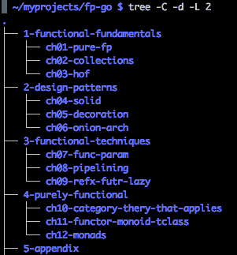
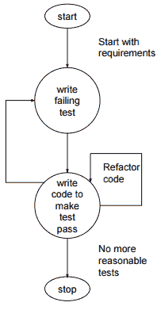
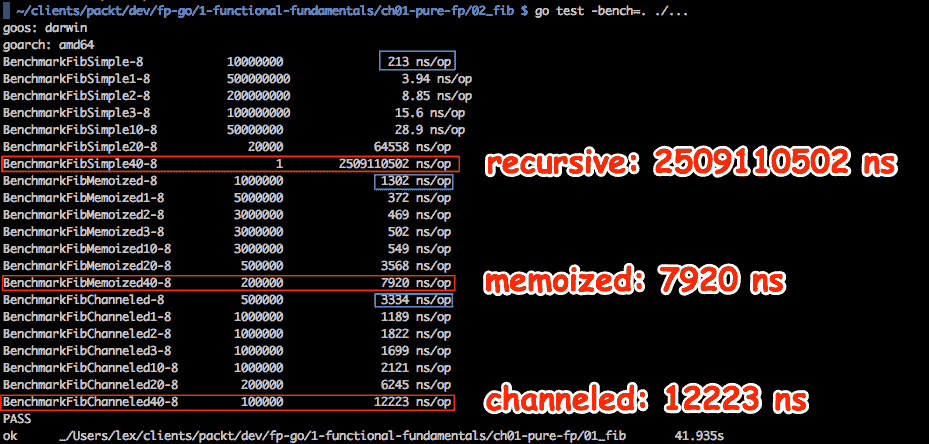

# 在 Go 中进行纯函数式编程

Go 是一种尝试将静态类型语言的安全性和性能与动态类型解释语言的便利性和乐趣相结合的语言。

- Rob Pike

您喜欢 Go 吗？如果是，为什么？它可以更好吗？您今天能写出更好的代码吗？

是的！因为 Go 简单而强大；Go 不让我等待；它的编译器快速且跨平台；Go 使并发编程变得容易；Go 还提供了有用的工具，并且拥有一个伟大的开发社区。也许。是的，这本书就是关于这个的：使用**函数式编程**（**FP**）编码风格。

在本章中，我将通过处理斐波那契数列代码示例，分享纯 FP 的好处以及在 Go 中的性能影响。从简单的命令式实现开始，您将探索函数式实现，并学习一些测试驱动开发和基准测试技术。

本章的目标是：

+   扎根于 FP 的理论

+   学习如何实现函数式解决方案

+   确定哪种 FP 最适合您的业务需求

## 使用 FP 的动机

函数式编程风格可以帮助您以更简洁和表达力更强的方式编写更少的代码，减少错误。这是怎么可能的呢？嗯，函数式编程将计算视为数学函数的评估。函数式编程利用这种计算模型（以及一些杰出的数学家和逻辑学家的工作）来实现优化和性能增益，这是使用传统的命令式编码技术根本不可能的。

开发软件并不容易。您必须首先处理众多的**非功能性需求**（**NFRs**），例如：

+   复杂性

+   可扩展性

+   可维护性

+   可靠性

+   并发

+   可扩展性

软件变得越来越复杂。您的典型应用程序中平均有多少第三方依赖项？5 年前是什么样子？我们的应用程序通常必须与我们自己公司内部的其他服务以及与我们的合作伙伴以及外部客户集成。我们如何管理这种不断增长的复杂性？

应用程序过去通常在被赋予宠物名字的服务器上运行，例如 Apollo、Gemini 等。似乎每个客户都有不同的命名方案。如今，大多数应用程序都部署在云环境中，例如 AWS 或 Google Cloud Platform。您是否有很多软件应用程序在许多服务器上运行？如果是的话，您应该更多地像对待牲畜一样对待您的服务器；它们太多了。此外，由于您已经实现了自动扩展，重要的不是单个服务器，而是整个群体。只要您的集群中始终至少有一台服务器为会计部门运行，那就是真正重要的。

随着数字的增加，复杂性也随之增加。您能否将应用程序组合在一起，像乐高积木一样，编写运行速度非常快的有用测试？或者，您是否经常觉得自己的代码中有太多的脚手架/`for`循环？您是否喜欢频繁处理`err != nil`的条件？您是否希望看到更简单、更清晰的方法来做同样的事情？您的应用程序有全局变量吗？您是否有代码来始终正确管理其状态并防止所有可能的副作用？曾经出现过竞争条件问题吗？

您是否了解应用程序中所有可能的错误条件，并且是否有代码来处理它们？您是否可以查看代码中任何函数的函数签名，并立即对其功能有直观的理解？

您是否有兴趣了解更好的方法来实现您的 NFR，并且比现在更享受开发 Go 软件？在寻找银弹吗？如果是的话，请继续阅读。（请注意，本书的其余部分将以第一人称复数形式撰写，因为我们将一起学习。）

## 获取源代码

这本书的源代码的 GitHub 存储库是[`github.com/l3x/fp-go`](https://github.com/l3x/fp-go)。

如果您将 Go 项目存储在`~/myprojects`目录中，那么运行`cd ~/myprojects; git clone https://github.com/l3x/fp-go.git`。

接下来，运行`cd`命令进入第一个项目目录：`cd ~/myprojects/fp-go/1-functional-fundamentals/ch01-pure-fp/01_oop`。

### 源文件的目录结构

目录对应于书的单元和章节：



每一章都分成按顺序编号的目录，按照它们在书中出现的顺序。

### 如何运行我们的第一个 Go 应用程序

首先，让我们确保我们已经安装了 Go，我们的`GOPATH`已经正确设置，并且我们可以运行一个 Go 应用程序。

如果您使用的是 macOS，那么请查看附录中如何使用`brew`命令安装 Go 的说明；否则，要安装 Go，请访问：[`golang.org/doc/install`](http://golang.org/doc/install)。要设置您的`GOPATH`，请访问：[`github.com/golang/go/wiki/Setting-GOPATH`](https://github.com/golang/go/wiki/Setting-GOPATH)。

许多人使用全局`GOPATH`来存储所有 Go 应用程序的源代码，或者经常手动重置他们的`GOPATH`。我发现这种做法在处理多个客户的多个 Go 项目时很麻烦，每个项目都有不同的 Go 版本和第三方依赖关系。

本章中我们将使用的示例 Go 应用程序没有依赖关系；也就是说，我们不需要导入任何第三方包。因此，我们要做的就是运行我们的第一个`app--cars.go--`，验证 Go 是否已安装，设置我们的`GOPATH`，然后输入`go run cars.go`：


对于本章中的示例这样非常简单的项目来说，使用全局`GOPATH`是很容易的。

在第二章 *操作集合*中，我们的 Go 应用程序将变得更加复杂，我们将介绍一种简单、更一致的方式来管理我们的 Go 开发环境。

## 命令式与声明式编程

让我们看看为什么函数式编程风格比命令式编程风格更有助于我们提高生产力。

“我们不是历史的创造者。我们是历史的产物。”

- 马丁·路德·金

几乎所有的计算机硬件都是设计用来执行机器代码的，这是计算机本地的，以命令式风格编写的。程序状态由内存内容定义，语句是机器语言中的指令，其中每个语句都推进计算状态向前，朝着最终结果。命令式程序随着时间逐步改变它们的状态。高级命令式语言，如 C 和 Go，使用变量和更复杂的语句，但它们仍然遵循相同的范式。由于命令式编程中的基本思想在概念上与直接在计算机硬件上操作的低级代码非常相似，大多数计算机语言--如 Go，也被称为 21 世纪的 C--在很大程度上是命令式的。

**命令式编程**是一种使用改变程序状态的语句的编程范式。它侧重于程序操作的逐步机制。

这个术语通常与**声明式编程**相对使用。在声明式编程中，我们声明我们想要的结果。我们描述我们想要的，而不是如何得到它的详细说明。

这是一个典型的命令式查找`Blazer`在汽车切片中的方法：

```go
var found bool 
carToLookFor := "Blazer" 
cars := []string{"Accord", "IS250", "Blazer" }
for _, car := range cars {
   if car == carToLookFor {
      found = true; // set flag
   }
}
fmt.Printf("Found? %v", found)
```

这是完成相同任务的函数式方法：

```go
cars := []string{"Accord", "IS250", "Blazer" }
fmt.Printf("Found? %v", cars.contains("Blazer"))
```

这是九行命令式代码，而在**函数式编程**（**FP**）风格中只有两行。

在这种情况下，函数式构造通常比 for 循环更清晰地表达我们的意图，并且在我们想要过滤、转换或聚合数据集中的元素时特别有用。

在命令式示例中，我们必须编写*如何*。我们必须：

+   声明一个布尔标志

+   声明并设置变量值

+   创建一个循环结构

+   比较每个迭代值

+   设置标志

在函数式示例中，我们声明了我们想要做什么。我们能够专注于我们想要实现的目标，而不是用循环结构、设置变量值等来膨胀我们的代码。

在 FP 中，迭代是通过库函数`contains()`来实现的。利用库函数意味着我们编写的代码更少，并且允许库开发人员专注于高效的实现，这些实现通常经过经验丰富的专业人员的审查和性能增强。我们不必为重复的逻辑编写、调试或测试这样高质量的代码。

现在，让我们看看如何使用面向对象编程范式查找`Blazer`：

```go
type Car struct {
   Model string
}
accord := &Car{"Accord"}; is250 := &Car{"IS250"}; blazer := &Car{"Blazer"}
cars := []*Car{is250, accord, blazer}
var found bool
carToLookFor := is250
for _, car := range cars {
   if car == carToLookFor {
     found = true;
   }
}
fmt.Printf("Found? %v", found)
```

首先，我们声明我们的对象类型：

```go
type Car struct {
   Model string
}
type Cars []Car
```

接下来，我们添加我们的方法：

```go
func (cars *Cars) Add(car Car) {
   myCars = append(myCars, car)
}

func (cars *Cars) Find(model string) (*Car, error) {
   for _, car := range *cars {
      if car.Model == model {
         return &car, nil
      }
   }
   return nil, errors.New("car not found")
}
```

在这里，我们声明了一个全局变量，即`myCars`，我们将在其中保持状态，即我们将构建的汽车列表：

```go
var myCars Cars
```

向列表中添加三辆车。`Car`对象封装了每个对象的数据，而`cars`对象封装了我们的汽车列表：

```go
func main() {
   myCars.Add(Car{"IS250"})
   myCars.Add(Car{"Blazer"})
   myCars.Add(Car{"Highlander"})
```

查找`Highlander`并打印结果：

```go
    car, err := myCars.Find("Highlander")
   if err != nil {
      fmt.Printf("ERROR: %v", car)
   } else {
      fmt.Printf("Found %v", car)
   }
}
```

我们使用`car`对象，但实质上我们正在执行与简单的命令式代码示例中相同的操作。我们有状态的对象，可以向其添加方法，但底层机制是相同的。我们给对象属性分配状态，通过进行方法调用修改内部状态，并推进执行状态直到达到期望的结果。这就是命令式编程。

## 纯函数

“疯狂就是一遍又一遍地做同样的事情，却期待不同的结果。”

- 阿尔伯特·爱因斯坦

我们可以利用这种纯函数的原则来获益。

在命令式函数的执行过程中给变量赋值可能会导致在其运行的环境中修改变量。如果我们再次运行相同的命令式函数，使用相同的输入，结果可能会有所不同。

对于命令式函数的结果，给定相同的输入，每次运行时可能返回不同的结果。这不是疯狂吗？

**纯函数**：

+   将函数视为一等公民

+   在给定相同的输入时，始终返回相同的结果

+   在其运行的环境中没有副作用

+   不允许外部状态影响它们的结果

+   不允许变量值随时间改变

纯函数的两个特征包括引用透明性和幂等性：

+   **引用透明性**：这是指函数调用可以替换为其相应的值，而不会改变程序的行为

+   **幂等性**：这是指函数调用可以重复调用并每次产生相同的结果

引用透明的程序更容易优化。让我们看看是否可以使用缓存技术和 Go 的并发特性进行优化。

## 斐波那契数列 - 一个简单的递归和两个性能改进

斐波那契数列是一个数列，其中每个数字等于前两个数字相加。这是一个例子：

```go
 1  1  2  3  5  8  13  21  34
```

所以，1 加 1 等于 2，2 加 3 等于 5，5 加 8 等于 13，依此类推。

让我们使用斐波那契数列来帮助说明一些概念。

**递归函数**是指调用自身以将复杂输入分解为更简单的输入的函数。每次递归调用时，输入问题必须以一种简化的方式简化，以便最终达到基本情况。

斐波那契数列可以很容易地实现为一个递归函数：

```go
func Fibonacci(x int) int {
    if x == 0 {
        return 0
 } else if x <= 2 {
        return 1
 } else {
        return Fibonacci(x-2) + Fibonacci(x-1)
    }
}
```

在前面的递归函数（`Fibonacci`）中，如果输入是简单情况的`0`，则返回**0**。同样，如果输入是`1`或`2`，则返回**1**。

0、1 或 2 的输入被称为**基本情况**或**停止条件**；否则，`fib`将调用自身两次，将序列中的前一个值加到前一个值上：


Fibonacci(5)计算图

在上图*Fibonacci(5)计算图*中，我们可以直观地看到如何计算斐波那契数列中的第五个元素。我们看到**f(3)**被计算了两次，**f(2)**被计算了三次。只有**1**的最终叶节点被加在一起来计算**8**的总和：

```go
func main() {
   fib := Fibonacci
   fmt.Printf("%vn", fib(5))
}
```

运行该代码，你会得到`8`。递归函数一遍又一遍地执行相同的计算；**f(3)**被计算了两次，**f(2)**被计算了三次。图形越深，冗余计算就越多。这是非常低效的。你自己试试吧。将一个大于 50 的值传递给`fib`，看看你要等多久才能得到最终结果。

Go 提供了许多提高性能的方法。我们将看两个选项：备忘录和并发。

备忘录是一种优化技术，通过存储昂贵的函数调用的结果并在再次出现相同输入时返回缓存的结果来提高性能。

备忘录的工作效果很好，因为纯函数具有以下两个属性：

+   它们在给定相同的输入时总是返回相同的结果

+   它们在其运行的环境中没有副作用

### 备忘录

让我们利用备忘录技术来加速我们的斐波那契计算。

首先，让我们创建一个名为`Memoized()`的函数类型，并将我们的斐波那契变量定义为该类型：

```go
type Memoized func(int) int
var fibMem Memoized
```

接下来，让我们实现`Memoize()`函数。在这里要意识到的关键是，当我们的应用程序启动时，甚至在我们的`main()`函数执行之前，我们的`fibMem`变量就已经被*连接*起来了。如果我们逐步执行我们的代码，我们会看到我们的`Memoize`函数被调用。缓存变量被赋值，并且我们的匿名函数被返回并赋值给我们的`fibMem`函数文字变量。

```go
func Memoize(mf Memoized) Memoized {
       cache := make(map[int]int)
       return func(key int) int {
 if val, found := cache[key]; found {
 return val
 }
 temp := mf(key)
 cache[key] = temp
 return temp
 }
}
```

备忘录接受一个`Memoized()`函数类型作为输入，并返回一个`Memoized()`函数。

在 Memoize 的第一行，我们创建了一个`map`类型的变量，作为我们的缓存，以保存计算的斐波那契数。

接下来，我们创建一个闭包，它是由`Memoized()`类型*返回*的`Memoize()`函数。请注意，**闭包**是一个内部函数，它关闭或者访问其外部作用域中的变量。

在闭包内，如果我们找到了传递整数的计算，我们就从缓存中返回它的值；否则，我们调用递归的斐波那契函数`mf`，参数为整数（`key`），其返回值将存储在`cache[key]`中。下次请求相同的键时，它的值将直接从缓存中返回。

匿名函数是没有名称定义的函数。当匿名函数包含可以访问其作用域中定义的变量的逻辑，例如`cache`，并且如果该匿名函数可以作为参数传递或作为函数调用的返回值返回，这在这种情况下是正确的，那么我们可以将这个匿名函数称为 lambda 表达式。

我们将在名为`fib`的函数中实现斐波那契数列的逻辑：

```go
func fib(x int) int {
   if x == 0 {
      return 0
 } else if x <= 2 {
      return 1
 } else {
      return fib(x-2) + fib(x-1)
   }
}
```

在我们的`memoize.go`文件中，我们要做的最后一件事是创建以下函数：

```go
func FibMemoized(n int) int {
   return fibMem(n)
}
```

现在，是时候看看我们的连线是否正常工作了。在我们的`main()`函数中，当我们执行`println`语句时，我们得到了正确的输出。

```go
println(fibonacci.FibMemoized(5))
```

以下是输出：

```go
5
```

我们可以通过回顾本章前面显示的`Fibonacci(5)`*计算图*来验证 5 是否是正确答案。

如果我们使用调试器逐步执行我们的代码，我们会看到`fibonacci.FibMemoized(5)`调用了以下内容

```go
func FibMemoized(n int) int {
   return fibMem(n)
}
```

`n`变量的值为 5。由于`fibMem`已经预先连接，我们从`return`语句开始执行（并且我们可以访问已经初始化的`cache`变量）。因此，我们从以下代码中的`return`语句开始执行（从`Memoize`函数）：

```go
return func(key int) int {
   if val, found := cache[key]; found {
      return val
   }
   temp := mf(key)
   cache[key] = temp
   return temp
}
```

由于这是第一次执行，缓存中没有条目，我们跳过 if 块的主体并运行`temp := mf(key)`

调用`fib`函数：

```go
func fib(x int) int {
   if x == 0 {
      return 0
 } else if x <= 2 {
      return 1
 } else {
      return fib(x-2) + fib(x-1)
   }
}
```

由于`x`大于 2，我们运行最后的 else 语句，递归调用`fib`两次。对`fib`的递归调用会一直持续，直到达到基本条件，然后计算并返回最终结果。

## 匿名函数和闭包之间的区别

让我们看一些简单的代码示例，以了解匿名函数和闭包之间的区别。

这是一个典型的命名函数：

```go
func namedGreeting(name string) {
   fmt.Printf("Hey %s!n", name)
}
```

以下是匿名函数的示例：

```go
func anonymousGreeting() func(string) {
     return func(name string) {
            fmt.Printf("Hey %s!n", name)
     }
}
```

现在，让我们同时调用它们，并调用一个匿名内联函数对 Cindy 说“嘿”：

```go
func main() {
   namedGreeting("Alice")

   greet := anonymousGreeting()
   greet("Bob")

   func(name string) {
      fmt.Printf("Hello %s!n", name)
   }("Cindy")
}
```

输出如下：

```go
Hello Alice!
Hello Bob!
Hello Cindy!
```

现在，让我们看一个名为`greeting`的闭包，并看看它与`anonymousGreeting()`函数的区别。

由于闭包函数在与`msg`变量相同的作用域中声明，所以闭包可以访问它。`msg`变量被称为与闭包在同一环境中；稍后，我们将看到闭包的环境变量和数据可以在程序执行期间传递和引用：

```go
func greeting(name string) {
     msg := name + fmt.Sprintf(" (at %v)", time.Now().String())

     closure := func() {
            fmt.Printf("Hey %s!n", msg)
     }
     closure()
}

func main() {
     greeting("alice")
}
```

输出如下：

```go
Hey alice (at 2017-01-29 12:29:30.164830641 -0500 EST)!
```

在下一个示例中，我们将闭包返回而不是在`greeting()`函数中执行它，并将其返回值分配给`main`函数中的`hey`变量：

```go
func greeting(name string) func() {
     msg := name + fmt.Sprintf(" (at %v)", time.Now().String())
     closure := func() {
            fmt.Printf("Hey %s!n", msg)
     }
     return closure
}

func main() {
     fmt.Println(time.Now())
     hey := greeting("bob")
     time.Sleep(time.Second * 10)
     hey()
}
```

输出如下：

```go
2017-01-29 12:42:09.767187225 -0500 EST
Hey bob (at 2017-01-29 12:42:09.767323847 -0500 EST)!
```

请注意，时间戳是在初始化`msg`变量时计算的，在将`greeting("bob")`的值分配给`hey`变量时。

所以，10 秒后，当调用`greeting`并执行闭包时，它将引用 10 秒前创建的消息。

这个例子展示了闭包如何保留状态。闭包允许创建、传递和随后引用状态，而不是在外部环境中操作状态。

使用函数式编程，你仍然有一个状态，但它只是通过每个函数传递，并且即使外部作用域已经退出，它仍然是可访问的。

在本书的后面，我们将看到一个更现实的例子，说明闭包如何被利用来维护 API 所需的应用程序资源的上下文。

加速我们的递归斐波那契函数的另一种方法是使用 Go 的并发构造。

### 使用 Go 的并发构造的 FP

给定表达式`result := function1() + function2()`，并行化意味着我们可以在不同的 CPU 核心上运行每个函数，并且总时间将大约等于最昂贵函数返回其结果所需的时间。考虑以下关于并行化和并发性的解释：

+   **并行化**：同时执行多个函数（在不同的 CPU 核心上）

+   **并发**：将程序分解成可以独立执行的部分

我建议你观看 Rob Pike 的视频*并发不等于并行*，网址为[`player.vimeo.com/video/49718712`](https://player.vimeo.com/video/49718712)。在视频中，他解释了并发是将复杂问题分解为更小的组件，这些组件可以同时运行，从而提高性能，前提是它们之间的通信得到管理。

Go 通过使用通道增强了 Goroutines 的并发执行，使用`Select`语句提供了多路并发控制。

以下语言构造为 Go 提供了一个易于理解、使用和推理的并发软件构建模型：

+   **Goroutine**：由 Go 运行时管理的轻量级线程。

+   **Go 语句**：`go`指令启动函数调用的执行，作为独立的并发控制线程，或 Goroutine，在与调用代码相同的地址空间中。

+   **通道**：一种类型的导管，通过它可以使用通道操作符`<-`发送和接收值。

在下面的代码中，`data`在第一行发送到`channel`。在第二行，`data`被赋予从`channel`接收到的值：

```go
channel <- data
data := <-channel
```

由于 Go 通道的行为类似于 FIFO 队列，先进先出，而斐波那契序列中下一个数的计算是一个小组件，因此我们的斐波那契序列函数计算似乎是并发实现的一个很好的候选。

让我们试一试。首先，让我们定义一个使用通道执行斐波那契计算的`Channel`函数：

```go
func Channel(ch chan int, counter int) {
       n1, n2 := 0, 1
 for i := 0; i < counter; i++ {
              ch <- n1
              n1, n2 = n2, n1 + n2
       }
       close(ch)
}
```

首先，我们声明变量`n1`和`n2`来保存我们的初始序列值`0`和`1`。

然后，我们创建一个循环，循环次数为给定的总次数。在每个循环中，我们将下一个顺序数发送到通道，并计算序列中的下一个数，直到达到我们的计数器值，即序列中的最后一个顺序数。

`FibChanneled`函数创建一个通道，即`ch`，使用`make()`函数并将其定义为包含整数的通道：

```go
func FibChanneled(n int) int {
       n += 2
 ch := make(chan int)
       go Channel(ch, n)
       i := 0; var result int
       for num := range ch {
              result = num
              i++
       }
       return result
}
```

我们将我们的`Channel`（斐波那契）函数作为 Goroutine 运行，并传递给它`ch`通道和`8`数字，告诉`Channel`生成斐波那契序列的前八个数字。

接下来，我们遍历通道并打印通道产生的任何值，只要通道尚未关闭。

现在，让我们休息一下，检查一下我们在斐波那契序列示例中取得的成就。

## 使用测试驱动开发测试 FP

让我们编写一些测试来验证每种技术（简单递归，记忆化和通道）是否正常工作。我们将使用 TDD 来帮助我们设计和编写更好的代码。

TDD 是一种软件开发方法，开发人员从需求开始，首先编写一个简单的测试，然后编写足够的代码使其通过。它重复这种单元测试模式，直到没有更多合理的测试来验证代码是否满足要求。这个概念是*立即让它工作，然后稍后完善*。每次测试后，都会执行重构以实现更多的功能需求。

相同或类似的测试将再次执行，同时引入新的测试代码来测试功能的下一部分。该过程将根据需要重复多次，直到每个单元根据所需的规格进行操作。



TDD 工作流程图

我们可以开始使用输入值和相应结果值的表格来验证被测试的函数是否正常工作：

```go
// File: chapter1/_01_fib/ex1_test.go
package fib

import "testing"

var fibTests = []struct {
   a int
   expected int
}{
   {1, 1},
   {2, 2},
   {3, 3},
   {4, 5},
   {20, 10946},
   {42, 433494437},
}

func TestSimple(t *testing.T) {
   for _, ft := range fibTests {
      if v := FibSimple(ft.a); v != ft.expected {
        t.Errorf("FibSimple(%d) returned %d, expected %d", ft.a, v, ft.expected)
      }
   }
}
```

回想一下，斐波那契序列看起来是这样的：`1  1  2  3  5  8  13  21  34`。这里，第一个元素是`1 {1, 1}`，第二个元素是`2 {2, 2}`，依此类推。

我们使用 range 语句逐行遍历表格，并检查每个计算结果（`v := FibSimple(ft.a)`）与该行的预期值（`ft.expected`）是否一致。

只有在出现不匹配时，我们才报告错误。

稍后在`ex1_test.go`文件中，我们发现基准测试设施正在运行，这使我们能够检查我们的 Go 代码的性能：

```go
func BenchmarkFibSimple(b *testing.B) {
     fn := FibSimple
     for i := 0; i < b.N; i++ {
            _ = fn(8)
     }
}
```

让我们打开一个终端窗口，并写入`cd`命令到第一组 Go 代码，即我们书籍的源代码存储库。对我来说，该目录是`~/clients/packt/dev/fp-go/1-functional-fundamentals/ch01-pure-fp/01_fib`。

### 关于路径的说明

在第一个示例中，我使用了`~/myprojects/fp-go`路径。我实际用于创建本书中代码的路径是`~/clients/packt/dev/fp-go`。所以，请不要被这些路径所困扰。它们是同一个东西。

此外，在本书的后面，当我们开始使用 KISS-Glide 时，屏幕截图可能会引用`~/dev`目录。这来自初始化脚本，即`MY_DEV_DIR=~/dev`。

在该目录中有一些链接：

```go
01_duck@ -> /Users/lex/clients/packt/dev/fp-go/2-design-patterns/ch04-solid/01_duck
01_hof@ -> /Users/lex/clients/packt/dev/fp-go/1-functional-fundamentals/ch03-hof/01_hof
04_onion@ -> /Users/lex/clients/packt/dev/fp-go/2-design-patterns/ch07-onion-arch/04_onion
```

有关 KISS-Glide 的更多信息，请参阅附录。

### 如何运行我们的测试

在第一个基准测试中，我们检查了计算斐波那契数列中第八个数字的性能。请注意，我们传入了`-bench=.`参数，这意味着运行所有基准测试。`./...`参数表示运行此目录及所有子目录中的所有测试：



当我们请求数列中的第八个数字时，简单的递归实现比记忆化和通道化（优化）版本运行得更快，分别为`213 ns/op`，`1302 ns/op`和`2224 ns/op`。

实际上，当简单版本执行一次时，只需要`3.94 ns/op`。

Go 基准测试设施的一个非常酷的特性是，它足够聪明，可以找出要执行被测试函数的次数。`b.N`的值将每次增加，直到基准测试运行器对基准测试的稳定性感到满意。函数在测试下运行得越快，基准测试设施就会运行得越多。基准测试设施运行函数的次数越多，性能指标就越准确，例如`3.94 ns/op`。

以`FibSimple`测试为例。当传入`1`时，意味着只需要执行一次。由于每次执行只需要`3.94 ns/op`，我们看到它被执行了 10,000,000 次。然而，当`FibSimple`传入`40`时，我们发现完成一次操作需要 2,509,110,502 ns，并且基准测试设施足够智能，只运行一次。这样，我们可以确保运行基准测试尽可能准确，并且在合理的时间内运行。多好啊？

由于`FibSimple`实现是递归的，并且没有被优化，我们可以测试我们的假设，即计算数列中每个后续数字所需的时间将呈指数增长。我们可以通过调用私有函数`benchmarkFibSimple`来使用一种常见的测试技术来做到这一点，该函数避免直接调用测试驱动程序：

```go
func benchmarkFibSimple(i int, b *testing.B) {
     for n := 0; n < b.N; n++ {
            FibSimple(i)
     }
}

func BenchmarkFibSimple1(b *testing.B)  { benchmarkFibSimple(1, b) }
func BenchmarkFibSimple2(b *testing.B)  { benchmarkFibSimple(2, b) }
func BenchmarkFibSimple3(b *testing.B)  { benchmarkFibSimple(3, b) }
func BenchmarkFibSimple10(b *testing.B) { benchmarkFibSimple(4, b) }
func BenchmarkFibSimple20(b *testing.B) { benchmarkFibSimple(20, b) }
func BenchmarkFibSimple40(b *testing.B) { benchmarkFibSimple(42, b) }
```

我们测试了数列中的前四个数字，`20`和`42`。由于我的计算机计算数列中的第 42 个数字大约需要 3 秒，我决定不再继续。当我们可以轻松看到指数增长模式时，就没有必要等待更长的时间来获取结果了。

我们的基准测试已经证明，我们对斐波那契数列的简单递归实现表现如预期。这种行为等同于性能不佳。

让我们看看一些提高性能的方法。

我们观察到我们的`FibSimple`实现总是返回相同的结果，给定相同的输入，并且在其运行环境中没有副作用。例如，如果我们传入`FibSimple`一个`8`值，我们知道每次结果都将是`13`。我们利用了这一事实来利用一种称为记忆化的缓存技术来创建`FibMemoized`函数。

现在，让我们编写一些测试，看看`MemoizeFcn`有多有效。

由于我们的`fibTests`结构已在包中的另一个测试中定义，即`chapter1/_01_fib/ex1_test.go`，我们不需要重新定义它。这样，我们只需定义一次测试表，就能够在后续的斐波那契函数实现中重复使用它，以获得合理的苹果对苹果的比较。

这是`FibMemoized`函数的基本单元测试：

```go
func TestMemoized(t *testing.T) {
   for _, ft := range fibTests {
      if v := FibMemoized(ft.a); v != ft.expected {
         t.Errorf("FibMemoized(%d) returned %d, expected %d", ft.a, v, ft.expected)
      }
   }
}
```

除非我们的代码中有错误，否则它不会返回错误。

这就是运行单元测试的好处之一。除非出现问题，否则您不会听到它们。

我们应该编写单元测试以便：

+   确保您实现的内容符合您的功能要求

+   利用测试来帮助您考虑如何最好地实施您的解决方案

+   生成可以在您的持续集成过程中使用的高质量测试

+   验证您的实现是否符合应用程序其他部分的接口要求

+   使开发集成测试更容易

+   保护您的工作免受其他开发人员的影响，他们可能会实现一个可能在生产中破坏您代码的组件

以下是基准测试的结果：

```go
func BenchmarkFibMemoized(b *testing.B) {
     fn := FibMemoized
     for i := 0; i < b.N; i++ {
            _ = fn(8)
     }
}
```

与以前一样，在`FibSimple`示例中，我们检查了计算斐波那契数列中第八个数字的性能：

```go
func BenchmarkFibMemoized(b *testing.B) {
     fn := FibMemoized
     for i := 0; i < b.N; i++ {
            _ = fn(8)
     }
}

func benchmarkFibMemoized(i int, b *testing.B) {
     for n := 0; n < b.N; n++ {
            FibMemoized(i)
     }
}

func BenchmarkFibMemoized1(b *testing.B)  { 
    benchmarkFibMemoized(1, b) }
func BenchmarkFibMemoized2(b *testing.B)  { 
    benchmarkFibMemoized(2, b) }
func BenchmarkFibMemoized3(b *testing.B)  { 
    benchmarkFibMemoized(3, b) }
func BenchmarkFibMemoized10(b *testing.B) { 
    benchmarkFibMemoized(4, b) }
func BenchmarkFibMemoized20(b *testing.B) { 
    benchmarkFibMemoized(20, b) }
func BenchmarkFibMemoized40(b *testing.B) { 
    benchmarkFibMemoized(42, b) }
```

与以前一样，我们进行了一项测试，使用`1`、`2`、`3`、`4`、`20`和`42`作为输入调用`FibMemoized`。

以下是`FibChanelled`函数的完整列表：

```go
package fib

import "testing"

func TestChanneled(t *testing.T) {
     for _, ft := range fibTests {
            if v := FibChanneled(ft.a); v != ft.expected {
                   t.Errorf("FibChanneled(%d) returned %d, expected %d", ft.a, v, ft.expected)
            }
     }
}

func BenchmarkFibChanneled(b *testing.B) {
     fn := FibChanneled
     for i := 0; i < b.N; i++ {
            _ = fn(8)
     }
}

func benchmarkFibChanneled(i int, b *testing.B) {
     for n := 0; n < b.N; n++ {
            FibChanneled(i)
     }
}

func BenchmarkFibChanneled1(b *testing.B)  { 
    benchmarkFibChanneled(1, b) }
func BenchmarkFibChanneled2(b *testing.B)  { 
    benchmarkFibChanneled(2, b) }
func BenchmarkFibChanneled3(b *testing.B)  { 
    benchmarkFibChanneled(3, b) }
func BenchmarkFibChanneled10(b *testing.B) { 
    benchmarkFibChanneled(4, b) }
func BenchmarkFibChanneled20(b *testing.B) { 
    benchmarkFibChanneled(20, b) }
func BenchmarkFibChanneled40(b *testing.B) { 
    benchmarkFibChanneled(42, b) }
```

我们对原始斐波那契数列逻辑进行了两次优化，使用了缓存技术和 Go 的并发特性。我们编写了这两种优化实现。还有更多的优化可能。在某些情况下，可以将优化技术结合起来产生更快的代码。

如果我们只需要编写一个简单的递归版本，然后在编译 Go 代码时，Go 编译器会自动生成带有性能优化的目标代码，那该有多好？

**惰性求值**：一种延迟对表达式进行求值直到需要其值的求值策略，通过避免不必要的计算来提高性能。

## 从命令式编程到纯 FP 和启示的旅程

让我们从命令式编程`sum`函数转向纯函数式编程的旅程。首先，让我们看看命令式的`sum`函数：

```go
func SumLoop(nums []int) int {
       sum := 0
 for _, num := range nums {
              sum += num
       }
       return sum
}
```

整数变量`sum`会随时间改变或变异；`sum`是不可变的。在纯 FP 中没有 for 循环或变异变量。

那么，我们如何使用纯 FP 来迭代一系列元素呢？我们可以使用递归来实现这一点。

**不可变变量**：在运行时分配值并且不能被修改的变量。

请注意，Go 确实有常量，但它们与不可变变量不同，常量的值是在编译时分配的，而不是在运行时分配的：

```go
func SumRecursive(nums []int) int {
       if len(nums) == 0 {
              return 0
 }
       return nums[0] + SumRecursive(nums[1:])
}
```

请注意前面的`SumRecursive`函数的最后一行调用了自身：`SumRecursive(nums[1:])`。这就是递归。

### SumLoop 函数的基准测试

我们听说 Go 中的递归可能很慢。因此，让我们编写一些基准测试来检查一下。首先，让我们测试基本命令式函数`SumLoop`的性能：

```go
func benchmarkSumLoop(s []int, b *testing.B) {
       for n := 0; n < b.N; n++ {
              SumLoop(s)
       }
}

func BenchmarkSumLoop40(b *testing.B) { benchmarkSumLoop([]int{1, 2, 3, 4, 5, 6, 7, 8, 9, 10, 11, 12, 13, 14, 15, 16, 17, 18, 19, 20, 21, 22, 23, 24, 25, 26, 27, 28, 29, 30, 31, 32, 33, 34, 35, 36, 37, 38, 39, 40}, b) }
```

**结果**：每次操作耗时`46.1 ns`。

### SumRecursive 函数的基准测试

现在我们知道了命令式函数`SumLoop`需要多长时间，让我们编写一个基准测试来看看我们的递归版本，即`SumRecursive`需要多长时间：

```go
func benchmarkSumRecursive(s []int, b *testing.B) {
       for n := 0; n < b.N; n++ {
              SumRecursive(s)
       }
}

func BenchmarkSumRecursive40(b *testing.B) { benchmarkSumRecursive([]int{1, 2, 3, 4, 5, 6, 7, 8, 9, 10, 11, 12, 13, 14, 15, 16, 17, 18, 19, 20, 21, 22, 23, 24, 25, 26, 27, 28, 29, 30, 31, 32, 33, 34, 35, 36, 37, 38, 39, 40}, b) }
```

**结果**：每次操作耗时`178 ns`。

在 Prolog、Scheme、Lua 和 Elixir 等语言中，尾调用递归速度更快，而符合 ECMAScript 6.0 标准的 JavaScript 引擎采用了纯函数式编程风格。因此，让我们试一试：

```go
func SumTailCall(vs []int) int {
       if len(vs) == 0 {
              return 0
 }
       return vs[0] + SumTailCall(vs[1:])
}
```

**基准测试结果**：每次操作耗时`192 ns`。

**TCO**：尾调用是指函数的最后一条语句是一个函数调用。优化的尾调用已经被有效地替换为`GoTo`语句，它消除了在函数调用之前设置调用堆栈和在函数调用之后恢复调用堆栈所需的工作。

我们甚至可以使用`GoTo`语句来进一步加速尾递归，但它仍然比命令式版本慢三倍。

为什么？这是因为 Go 不支持纯 FP。例如，Go 不执行 TCO，也不提供不可变变量。

### 一次清算

为什么我们想在 Go 中使用纯 FP？如果编写表达力强、易于维护和富有洞察力的代码比性能更重要，那或许可以考虑。

我们有哪些替代方案？稍后，我们将看一些纯 FP 库，它们已经为我们做了大量工作，并且在更高性能方面取得了进展。

在 Go 中的函数式编程就是这些吗？不，远远不止这些。我们在 Go 中可以做的 FP 目前受到 Go 编译器目前不支持 TCO 的限制；然而，这可能很快会改变。有关详细信息，请参阅附录中的*如何提出 Go 更改*部分。

函数式编程的另一个方面是 Go 完全支持的：函数文字。事实证明，这是支持 FP 所必须具有的最重要特征。

**函数文字**：这些函数被视为语言的一等公民，例如，任何变量类型，如 int 和 string。在 Go 中，函数可以声明为一种类型，分配给变量和结构的字段，作为参数传递给其他函数，并从其他函数中作为值返回。函数文字是闭包，使它们可以访问其声明的范围。当函数文字在运行时分配给变量时，例如，`val := func(x int) int { return x + 2}(5)`，我们可以称该**匿名函数**为**函数表达式**。函数文字用于 lambda 表达式以及柯里化。 （有关 lambda 表达式的详细信息，请参见第十章，*函子、幺半群和泛型*。）

#### 函数文字的一个快速示例

请注意，`{ret = n + 2}`是我们的匿名函数/函数文字/闭包/lambda 表达式。

我们的函数文字：

+   像函数声明一样编写，但在`func`关键字后没有函数名称

+   是一个表达式

+   可以访问其词法范围中的所有变量（在我们的例子中为`n`）

```go
package main

func curryAddTwo(n int) (ret int) {
   defer func(){ret = n + 2}()
   return n
}

func main()  {
   println(curryAddTwo(1))
}
```

输出如下：

```go
3
```

请注意，我们使用`defer`语句延迟执行我们的函数文字，直到其周围的函数（`curryAddTwo`）返回。由于我们的匿名函数可以访问其范围内的所有变量（`n`），它可以修改`n`。修改后的值就是打印出来的值。

## 总结

在测试纯函数时，我们只需传递输入参数并验证结果。无需设置环境或上下文。不需要存根或模拟。没有副作用。测试再也不容易了。

纯函数可以在水平扩展的多 CPU 环境中并行化以获得性能增益。然而，鉴于 Go 尚未经过优化以支持纯函数式编程，Go 中的纯 FP 实现可能无法满足我们的性能要求。我们不会让这妨碍我们利用 Go 的许多有效的非纯函数式编程技术。我们已经看到了通过添加缓存逻辑和利用 Go 的并发功能来提高性能。有许多我们可以使用的功能模式，我们很快就会看到。我们还将看到我们如何利用它们来满足严格的性能要求。

在下一章中，您将学习高阶函数，因为我们探索使用 FP 编程技术来操作集合的不同方式。
