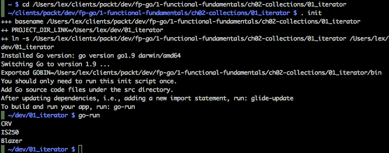
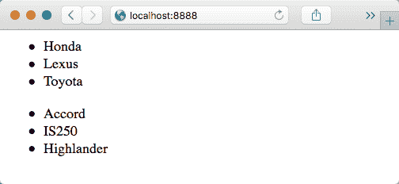
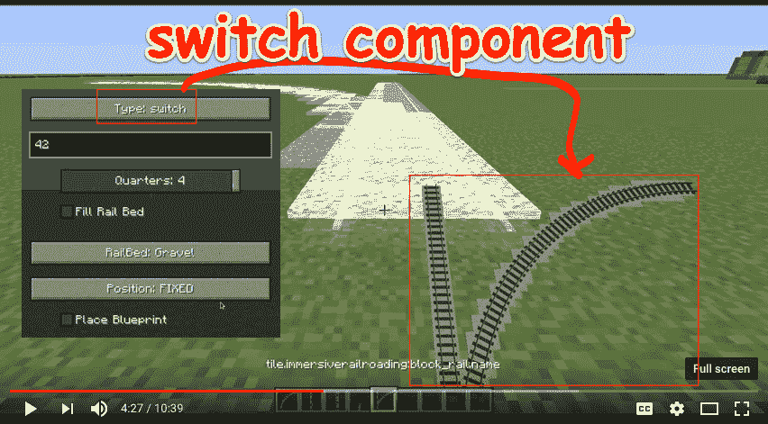
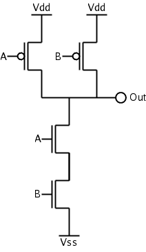
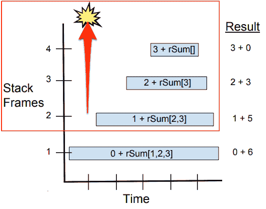
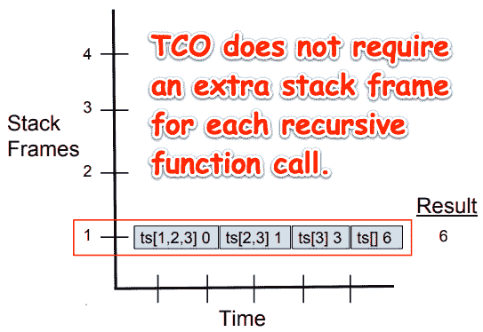
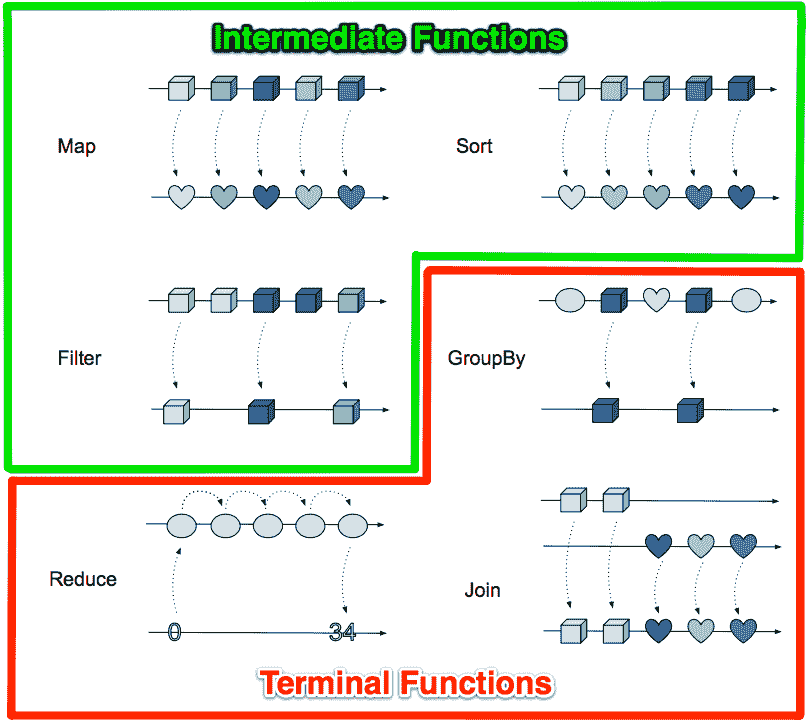
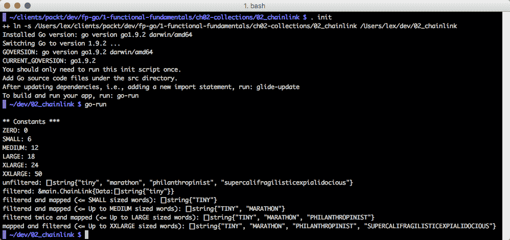

# 操作集合

处理项目列表在生活中以及编程语言中是常见的。当一个列表有相关的函数帮助我们操作列表中的项目时，我们通常称该对象为集合。

在这一章中，我们将看到如何使用高阶函数来极大地简化操作集合的任务。我们将看到如何使用函数式编程技术和开源的函数式包来创建优雅的解决方案，这些解决方案不仅富有洞察力，而且在当今的分布式处理环境中也具有高性能。

本章的目标是：

+   遍历集合

+   了解中间和终端函子

+   使用谓词来过滤集合中的项目

+   使用类似 Mocha 的 BDD 库进行测试

+   专注于 Map 函数

+   掌握 Itertools 中操作集合的函数的广度

+   利用例程和通道来遍历集合

+   看看我们如何使用 Go 处理大数据集合

## 遍历集合

为了实现一个集合，我们必须提供一种访问集合中每个元素的方式，可以使用下面代码中显示的 int 索引值来实现。我们将实现一个**先进先出**（**FIFO**）顺序队列。我们将提供一种使用切片数据结构来存储元素的方法。最后，我们将实现一个`Next()`方法来提供一种遍历集合中元素的方式。

在下面的代码中，我们为`Iterator`对象定义了一个接口。它有一个`Next()`方法，它将返回集合中的下一个元素和一个布尔标志，指示是否可以继续迭代：

```go
type CarIterator interface {
     Next() (value string, ok bool)
}
const INVALID_INT_VAL = -1
const INVALID_STRING_VAL = ""
```

接下来，我们定义一个具有两个属性的集合对象：用于访问当前元素的`int`索引和一个字符串切片，即集合中的实际数据：

```go
type Collection struct {
       index int
       List  []string
}
```

现在，我们实现集合的`Next()`方法，以满足`IntIterator`接口的规范：

```go
func (collection *Collection) Next() (value string, ok bool) {
       collection.index++
       if collection.index >= len(collection.List) {
              return INVALID_STRING_VAL, false
       }
       return collection.List[collection.index], true
}
```

`newSlice`函数是可迭代集合`intCollection`的构造函数：

```go
func newSlice(s []string) *Collection {
        return &Collection{INVALID_INT_VAL, s}
}
```

最后，我们实现`main()`函数来测试我们的`Collection`。

让我们打开一个终端窗口，并使用`.init`工具集来运行我们简单的 Go 应用程序：



`.init`（"Dot Init"）工具集确保我们已经安装了 Go，并且我们的`GOPATH`和`GOBIN`目录已经正确配置。首先，我们通过输入`.init`来源化初始化脚本。由于我们没有导入语句，因此无需运行 glide-update。要运行我们的应用程序，我们输入`go-run`。有关`Dot Init`的更多详细信息，请参见[附录](https://cdp.packtpub.com/learning_functional_programming_in_go/wp-admin/post.php?post=99&action=edit#post_7)，*其他信息和操作方法*。

这种实现的问题在于我们混合了我们想要做的事情和我们如何做的事情。我们实现了一个显式的`for`循环来执行迭代的机制。我们定义并改变了索引值的值，以便遍历元素。我们可以立即看到这是一种命令式的实现。

在函数式编程中，我们声明要做什么，而不是命令式地实现每个操作的每个细节。我们还避免了`for`循环的顺序性质，这些循环很难适应并发编程模型。

Go 不是一种函数式编程语言，但它具有许多函数式特性，我们可以利用这些特性来编写简洁、表达力强、并且希望是无错误的代码。

纯函数式语言不维护状态。函数调用经常被链接在一起，其中输入从一个函数传递到另一个函数。每个函数调用以某种方式转换其输入。这些函数不需要关心外部状态，也不会产生副作用。每个函数调用在其所做的事情上都可以非常高效。这种编程风格适合进行高效的测试。

接下来，我们将看到函数链式调用非常类似于通过 Bash 命令传递输出。

## Bash 命令传递

执行函数的组合或链非常类似于执行一系列 Bash 命令，其中一个命令的输出被传送到下一个命令。例如，我们可能在`awk`命令中输入一个包含时间戳和 IP 地址列表的文件。`awk`命令删除除第七列之外的所有内容。接下来，我们按降序对列表进行排序，最后，我们按唯一的 IP 地址对数据进行分组。

考虑以下 Bash 命令：

```go
$ cat ips.log | awk '{print $7}' | sort | uniq -c
```

让我们给这个命令以下输入：

```go
Sun Feb 12 20:27:32 EST 2017 74.125.196.101
Sun Feb 12 20:27:33 EST 2017 98.139.183.24
Sun Feb 12 20:27:34 EST 2017 151.101.0.73
Sun Feb 12 20:27:35 EST 2017 98.139.183.24
Sun Feb 12 20:27:36 EST 2017 151.101.0.73
>Sun Feb 12 20:27:37 EST 2017 74.125.196.101
Sun Feb 12 20:27:38 EST 2017 98.139.183.24
Sun Feb 12 20:27:39 EST 2017 151.101.0.73
Sun Feb 12 20:27:40 EST 2017 98.139.183.24
Sun Feb 12 20:27:41 EST 2017 151.101.0.73
Sun Feb 12 20:27:42 EST 2017 151.101.0.73
Sun Feb 12 20:27:43 EST 2017 151.101.0.73
```

我们将得到以下输出：

```go
6 151.101.0.73
2 74.125.196.101
4 98.139.183.24
```

这是函数式编程中非常常见的模式。我们经常将数据集输入到函数或一系列函数调用中，并获得以某种方式转换的结果。

集合经常被使用。当我们以简洁的方式实现它们时，通过链式函数调用明确声明我们想要实现的目标，我们大大减少了代码的繁文缛节。结果是，我们的代码更具表现力、简洁，并且更易于阅读。

## 函子

Go 有三种预声明/原始数据类型：`bool`、`string`、数值（`float`、`int64`等）。Go 中的其他数据类型需要类型声明，也就是说，它们需要我们使用`type`关键字。函数属于后一类数据类型，与数组、结构、指针、接口、切片、映射和通道类型一起。在 Go 中，函数是头等数据类型，这意味着它们可以作为参数传递并作为值返回。可以接受函数作为参数并返回函数的函数称为高阶函数。

我们可以编写函数工厂--返回函数的函数--甚至函数工厂工厂。我们还可以编写修改函数或为特定目的创建函数的函数。

**函子**：函子是一个包含`X`变量的集合，可以将函数`f`应用于自身，以创建一个`Y`的集合，即`f(X) → Y`。（要了解我们在这里谈论的是什么，请快速查看第九章中的*Fingers times 10 functor*示例，*函子、幺半群和泛型*）

请注意，Prolog 软件语言将函子定义为简单的函数。前面的定义来自于函数式编程对*范畴论*的影响。（有关更多详细信息，请参见第十一章，*适用的范畴论*。）

### 修改函数的函数

在我们探索中间和终端函数之前，让我们通过一些例子澄清短语*修改函数的函数*。

#### 函数修改函数的编码示例

以下是我们可能编写的代码片段，用于构建一个页面部分，其中包含两个下拉列表，一个用于汽车制造商，另一个用于汽车型号：

```go
// http.Get :: String -> JSON
var renderPage = curry(func(makes, models) { /* render page */ })
// return two divs: one with makes and the other with models HTML/ULs
Task.Of(renderPage).Ap(http.Get("/makes")).Ap(http.Get("/models"))
```

请注意，每个 http.Get 都是一个单独的 API 调用。每个 API 调用都是部分应用。为了使 renderPage 等待每个调用完成，我们必须对我们的 API 调用进行柯里化。

以下是生成的 HTML 可能看起来像：



#### 函数修改函数的视觉示例

在上一个例子中，我们组成了 HTML 网页的一部分。在这个例子中，让我们沉浸在一个铁路世界中，使用函数组合铺设一些火车轨道。


沉浸式铁路世界

以下是我们的可重用组件工具箱。我们通过从工具箱中添加项目来修改我们的世界。因此，我们沉浸式铁路*世界*函数通过添加和连接一堆较小的*组件*函数来修改。


这是 Christian 铺设铁路开关的一个例子：



##### Mindcraft 中的组合

我们可以在[`github.com/cam72cam/ImmersiveRailroading`](https://github.com/cam72cam/ImmersiveRailroading)找到这个 Immersive Railroad 应用的源代码。

Minecraft 可以选择通过柯里化部分应用来专门使用 FP 技术实现其世界构建 UI，但当我们仔细观察时，我们发现更多的是命令式实现。尽管使用了泛型：

```go
// cam72cam.immersiverailroading.render.TileSteamHammerRender
public class TileSteamHammerRender extends TileEntitySpecialRenderer<TileSteamHammer> {   
   private List<String> hammer;
   private List<String> rest;
```

### Tacit 编程

Tacit 编程是一种编程风格，其中函数定义组合其他函数，组合器操作参数。组合器是一个高阶函数，它仅使用函数应用程序和预定义的组合器来定义其参数的结果。有关更多详细信息，请参见第十一章中的 Moses Schonfinkel 部分，*适用的范畴论*。

#### 使用 Unix 管道的 Tacit 编程

管道中的以下组合器是函数，例如`head`，`awk`，`grep`等。每个组合器都是一个将输出发送到标准输出并从标准输入读取输入的函数。请注意，命令中没有提到参数。

```go
$ cat access10k.log | head -n 1 | awk '{print $7}' | grep "\.json" | uniq -c | sort -nr 
```

#### 使用 Unix 管道编程 CMOS

Unix 管道也可以用来模拟 CMOS 设备的 NAND 门的流程控制。

假设 nil 代表电子，那么`/dev/zero`（又名 VSS）提供了无限的电子供应，`/dev/null`（又名 VDD）将消耗发送到它的每个电子。



CMOS NAND 门

在我们的模型中，UNIX 管道就像一根导线。当管道连接到 Vss 时，其缓冲区填满了空字节，管道就像一个带负电荷的金属板。当它连接到 Vdd 时，管道的缓冲区被排空，管道就像一个带正电荷的金属板。Unix 管道用于模拟我们的 NAND 逻辑门中的流程控制。

有关更多详细信息，请参见[`www.linusakesson.net/programming/pipelogic/index.php`](http://www.linusakesson.net/programming/pipelogic/index.php)。

#### 使用 FP 的 Tacit 编程

我们将使用 Haskell 来演示一个对整数列表求和的程序。两者都是递归的，第二个受益于**尾调用优化**（**TCO**）。我们可以使用 Go，但目前 Go 不支持 TCO。

我们循环遍历数字列表以累积总和。在命令式编程中，我们将使用循环索引来存储累积和值。在函数式编程中，我们使用递归来实现循环，其中累积和作为参数传递给下一个递归调用。在命令式语言中作为循环索引变量/累加器变量的东西在尾递归版本中成为*参数*。

##### 非 TCO 递归示例

首先，我们来看看命令式的例子：

```go
rSum :: [Integer] -> Integer
rSum (x:xs) = x + (rSum xs)
rSum [] = 0

```

请注意，x:xs 表示我们将列表的头存储在 x 中，列表的其余部分存储在 xs 中。



每次调用`rSum`都需要获取递归调用的返回值，并将其添加到其 x 参数中，然后才能返回。这意味着每个函数必须比其调用的任何函数的帧在堆栈上停留更长的时间。我们必须创建四个堆栈帧来对三个数字求和。想象一下，当我们处理具有大量值的列表时，这种实现将需要多少 RAM 存储空间。没有 TCO，我们的实现将需要**O**(n)的 RAM 存储空间，根据列表中的项目数。（请参阅第十章中的大 O 符号表示法，*单子，类型类和泛型*）

##### TCO 递归示例

在我们的尾递归函数中，我们的堆栈帧不需要被保留。

```go
tSum :: [Integer] -> Integer
tSum lst = tSum lst 0 where
 tSum (x:xs) i = tSum xs (i+x)
    tSum [] i = i
```

以下图表说明了与先前的例子（`rSum`）不同，`tSum`在进行递归调用后不需要在帧的上下文中执行任何操作。`rSum`为列表的每个成员创建了一个堆栈帧。`tSum`只需要创建一个堆栈帧，然后重用它。



TCO 在递归的最后调用是函数本身时避免创建新的堆栈帧。Go 目前不支持 TCO。这意味着什么？没有 TCO，我们应该避免使用递归来处理具有大量元素的列表，也就是说，超过几千个；否则，我们的程序很可能会耗尽内存并崩溃。为什么不用实现命令式循环的函数替换递归函数？换句话说，递归在函数式编程中的重要性是什么？

### 递归的重要性

首先，让我们确保我们理解递归是什么。让我们想想如何拆开俄罗斯娃娃。


递归的工作原理就像寻找最小的娃娃的过程。我们重复相同的过程，即，拆开娃娃，直到找到一个实心的娃娃。虽然我们的问题变得更小，但问题解决的过程与之前相同，因为嵌套娃娃的结构是相同的。每个娃娃都比前一个小。最终，我们找到了一个太小而无法再放置娃娃的娃娃，我们完成了。这就是递归背后的基本思想。

我们还需要了解如何编写尾递归函数，因为这是 TCO 的候选递归类型。当我们的递归函数在最后一个动作调用自身时，我们可以重用该函数的堆栈帧。上一节中的 tSum 函数就是尾递归的一个例子。

理解递归标志着我们从程序员转变为计算机科学家。递归需要一些数学知识来理解，但一旦我们掌握了它，我们会发现它为解决重要问题打开了大量的方式。

一个足球教练不会让他的球员练习将球踢下山到目标处；这种情况在比赛中永远不会发生。同样，我们也不会花费大量时间追求在 Go 中的递归实现。

尾递归函数是循环的函数形式，通过 TCO 执行效率与循环一样高。没有递归，我们必须使用命令式编程技术来实现大多数循环。因此，在 Go 中具有 TCO 实际上对 FP 比泛型更有益。我们将在第九章 *函子、幺半群和泛型*和第十章 *单子、类型类和泛型*中了解更多关于泛型的知识。请参阅附录中的*如何提出对 Go 的更改*部分，或直接跳转到有关在 Go 中添加 TCO 的讨论[`github.com/golang/go/issues/22624`](https://github.com/golang/go/issues/22624)。

### 各种中间和终端函数

看看以下函子图中的各种中间和终端函数。它们都是函子。例如，当函数`Map`提供一组值作为输入时，它将对元素应用转换，并产生一个不同的值集作为输出。

在函数式编程中，对于相同的输入，给定函数将始终返回相同的结果集。



在前面的函子的第一行中，`Map`和`Sort`，接受一个集合，以某种方式对其进行转换，并返回一个相同大小的集合。

在函子图的第二行中，`Filter`和`GroupBy`，接受一个集合，并将其转换为另一个较小的集合。

在第三行中，`Reduce`接受一个集合，对其元素执行计算，并返回单个结果值。

### 减少的例子

以下是使用`alediaferia/go-collections`包来减少集合以找到最大值的实现：

```go
numbers := []interface{}{
 1,
 5,
 3,
 2,
}

coll := collections.NewFromSlice(numbers)
min := collections.Reduce(0, func(a, b interface{}) interface{} {
 if a > b { return a } else { return b }
})
```

`Join`函数接受两个不同的集合，并将它们合并成一个更大的集合。

函数式编程中有两种基本类型的函子：中间函数和终端函数。它们一起工作，将传入的集合转换为另一个集合或单个值。任意数量的中间函数可以链接在一起，然后是终端函数。

### 中间函数

中间函数在终端函数被处理之前不会被评估。

**惰性评估**是一种延迟处理中间函数的评估策略，直到需要其值为止。它可以与**记忆化**结合使用，其中首先对评估进行缓存，以便对该值的后续请求立即返回缓存的值，而无需重新评估最初创建它的表达式。

一些更流行的中间函数包括`map`、`filter`和`sort`。

我们可以创建许多其他高阶函数来处理传入的流，通常是一个集合。我们很快将看到提供这些基本函数类型各种变体的函数式编程库。

#### 常见的中间函数

这是一个描述一些常见的中间函数的表格：

| **函数** | **Gleam** | **保留类型** | **保留计数** | **保留顺序** | **描述** |
| --- | --- | --- | --- | --- | --- |
| `map` | 是 | 否 | 是 | 是 | 这将列表中的每个元素转换为结果列表中大小相同的另一个元素。 |
| `filter` | 是 | 是 | 否 | 是 | 这调用一个谓词函数。如果为真，则当前项目将被跳过，不会出现在结果列表中。 |
| `sort` | 是 | 是 | 是 | 是 | 这按照标准对结果集进行排序。 |

##### 映射示例

这是使用`alediaferia/go-collections`包对集合进行映射的示例：

```go
names := []interface{}{
 "Alice",
 "Bob",
 "Cindy",
}
collection := collections.NewFromSlice(planets)
collection = collection.Map(func(v interface{}) interface{} {
 return strings.Join([]string{ "Hey ", v.(string) })
})
println(collection)
```

输出如下：

```go
Hey Alice
Hey Bob
Hey Cindy
```

### 终端函数

终端函数会被急切地执行。它们立即执行，一旦执行，它们会执行调用链中的所有先前的中间、惰性函数。终端函数要么返回单个值，要么产生副作用。前面我们看到的 reduce 示例返回一个单个值：`1`。`ForEach`函数不返回值，但可以产生副作用，比如打印出每个项目。`Collect`、`Join`和`GroupBy`函数将集合中的项目分组。

#### 常见的终端函数

这是一个描述一些更流行的终端函数的表格：

| **函数** | **Gleam** | **分组项目** | **创建副作用** | **收集结果** | **描述** |
| --- | --- | --- | --- | --- | --- |
| `Collect`、`Join`和`GroupBy` | 是 | 是 |  |  | 产生另一个集合 |
| `ForEach` | 是 |  | 是 |  | 用于处理单个项目 |
| `Reduce` | 是 |  |  | 是 | 强制要求延迟表达式触发并产生结果 |

##### Join 示例

以下代码显示了`Join()`函数的示例：

```go
 // left collection:
 0001, "alice", "bob"
 0001, "cindy", "dan"
 0002, "evelyn", "frank"
 // right collection:
 0001, "greg", "izzy"
 0002, "jenny", "alice"

left.Join(right)
```

输出如下：

```go
 0001, "alice", "bob", "greg", "izzy"
 0001, "cindy", "dan", "greg", "izzy"
 0002, "evelyn", "frank", "jenny", "alice"
```

##### GroupBy 示例

以下代码显示了`GroupBy()`函数的示例：

```go
// input collection:
 0001, "alice", 0002
 0001, "bob", 0002
 0003, "cindy", 0002

 GroupBy(1,3)
```

输出如下：

```go
 0001, 0002, ["alice", "bob"]
 0003, 0002, ["cindy"]
```

##### Reduce 示例

这是使用`alediaferia/go-collections`包来减少集合以找到最大值的实现：

```go
numbers := []interface{}{
 1,
 5,
 3,
 2,
}
collection := collections.NewFromSlice(numbers)
min := collection.Reduce(0, func(a, b interface{}) interface{} {
 if a > b { return a } else { return b }
})
```

## 谓词

我们可以使用谓词对输入数据执行操作。谓词可用于实现我们应用于集合以将输入数据转换为结果集合或值的许多函数。

`predicate`函数是一个接受一个项目作为输入并根据项目是否满足某些条件返回 true 或 false 的函数。它们通常被条件地使用，以确定是否在执行链中应用某些操作。

让我们创建一些谓词函数，以便我们可以用来操作一组汽车。

`All()`函数仅在集合中的所有值都满足`predicate`条件时返回`true`：

```go
package predicate

func All(vals []string, predicate func(string) bool) bool {
       for _, val := range vals {
              if !predicate(val) {
                     return false
              }
       }
       return true
}
```

`Any()`函数只要集合中的任何一个值满足`predicate`条件就返回`true`：

```go
func Any(vs []string, predicate func(string) bool) bool {
       for _, val := range vs {
              if predicate(val) {
                     return true
              }
       }
       return false
}
```

`Filter()` 函数返回一个新的、更小的或大小相等的集合，其中包含满足 `predicate` 条件的集合中的所有字符串：

```go
func Filter(vals []string, predicate func(string) bool) []string {
       filteredVals := make([]string, 0)
       for _, v := range vals {
              if predicate(v) {
                     filteredVals = append(filteredVals, v)
              }
       }
       return filteredVals
}
```

`Count()` 函数是一个辅助函数：

```go
func Count(vals []string) int {
       return len(vals)
}
```

现在，让我们使用一个名为 `goblin` 的类似 Mocha 的 BDD Go 测试框架来测试我们的谓词。

声明包并定义基本导入。我们只需要定义一个函数。让我们称之为 `TestPredicateSucceed`：

```go
package predicate

import (
       "testing"
 "strings"
 . "github.com/franela/goblin"
)

func TestPredicateSucceed(t *testing.T) {
       fakeTest := testing.T{}
       g := Goblin(&fakeTest)
```

让我们用一个名为 `Predicate Tests` 的 `Describe` 块包装所有我们的单元测试，其中我们定义 `cars` 变量来保存我们的汽车型号列表：

```go
     g.Describe("Predicate Tests", func() {
          cars := []string{"CRV", "IS250", "Highlander"}
```

这是我们的第一个测试。它以一个 `Describe` 块开始，并包含一个 `It` 块。在我们的 `It` 块内，我们将我们的一等函数 `bs` 赋值为调用 `Any()` 函数的返回值。我们的谓词函数是调用 `strings.HasPrefix()` 函数的函数文本。我们的单元测试的最后一行断言 `bs` 是 `true`：

```go
g.Describe("Starts High", func() {
       g.It("Should be true", func() {
              bs := Any(cars, func(v string) bool {
                     return strings.HasPrefix(v, "High")
              })
              g.Assert(bs).Equal(true)
       })
})
```

我们的下一个单元测试说 `Highlander should be High` 并断言它应该为真。我们将 `strings.Contains()` 函数作为我们的谓词传递给 `Filter()` 函数，以仅返回列表中包含 `High` 子字符串的项目：

```go
g.Describe("Highlander should be High", func() {
       high := Filter(cars, func(v string) bool {
              return strings.Contains(v, "High")
       })
       highlander := []string{"Highlander"}
       g.It("Should be true", func() {
              g.Assert(high).Equal(highlander)
       })
})
```

这个测试计算包含 `High` 子字符串的汽车数量，并断言计数应该为 1：

```go
g.Describe("One is High", func() {
       high := Count(Filter(cars, func(v string) bool {
              return strings.Contains(v, "High")
       }))
       g.It("Should be true", func() {
              g.Assert(high).Equal(1)
       })
})
```

我们的最后一个测试断言并非所有汽车都包含 `High` 子字符串：

```go
g.Describe("All are High", func() {
       high := All(cars, func(v string) bool {
              return strings.Contains(v, "High")
       })
       g.It("Should be false", func() {
              g.Assert(high).Equal(false)
       })
})
```

让我们花点时间来反思这个实现。

### 反射

我们的谓词实现是高效的但是有限制的。以 `Any()` 函数签名为例：

```go
func Any(vs []string, predicate func(string) bool) bool
```

`Any` 函数仅适用于 `string` 切片。如果我们想要迭代树或映射结构怎么办？我们将不得不为每个写单独的函数。这是请求 Go 支持泛型的一个有效论点。如果 Go 支持泛型，我们的实现可能需要的代码量会少得多。

另一种替代实现可以使用空接口。这将解决我们需要为要处理的每种数据类型实现单独的函数的问题，因为空接口可以接受任何类型的值。要使用 `interface{}` 类型的值，必须使用反射或类型断言或类型开关来确定值的类型，并且任何这些方法都会导致性能损失。

另一种替代实现可以使用 Goroutines 和通道。Itertools 使用空接口、Goroutines 和通道。

`github.com/ahl5esoft/golang-underscore` 是一个使用大量反射和空接口来提供类似下划线的高阶函数实现的包。

### 组合器模式

由于 Go 支持将函数作为值传递，我们可以创建谓词组合器，从更简单的谓词构建更复杂的谓词。

**组合器模式**：通过将更原始的函数组合成更复杂的函数来创建系统。

我们将在本书的后面更深入地探讨组合和组合器模式。现在，让我们更仔细地看一下 `map` 和 `filter` 函数。

## 映射和过滤

下一个代码示例演示了几个标准中间函数的使用：`map` 和 `filter`。

这个例子中的代码可以复制/粘贴到 Go playground 中，这是一个服务，它接受您的 Go 程序，编译，链接，并在沙箱中使用最新版本的 Go 运行您的程序，然后将输出返回到屏幕上。您可以在 [`play.golang.org/`](https://play.golang.org/) 找到它。

可执行命令必须始终使用 `package main`。我们可以将每个导入语句分开放在单独的行上以提高可读性。

可以使用其远程 GitHub 存储库路径引用外部包。我们可以用更短的别名前缀长包名。`go_utils` 包现在可以用 `u` 字母引用。请注意，如果我们用 `_` 给包名取别名，它的导出函数可以直接在我们的 Go 代码中引用，而不需要指示它来自哪个包：

```go
package main
import (
   "fmt"
   "log"
   "strings"
   "errors"
   u "github.com/go-goodies/go_utils"
)
```

`iota`：Go 中用于`const`声明的标识符，表示连续的无类型整数常量。每当保留字`const`出现时，它都会重置为 0：

`const (`

`   SMALL = iota // 0`

`   MEDIUM // 1`

`   LARGE // 2`

`)`

我们可以对`iota`应用表达式来设置大于`1`的增量值。我们将在下一节中讨论这个问题。

让我们定义一个名为`WordSize`的 int 类型，并使用`iota`表达式从我们的常量中创建一个枚举。前`iota`元素被分配的值从 0 开始，然后递增 1。由于我们将`iota`元素乘以`6`，所以序列看起来像`0`，`6`，`12`，`18`等。我们明确将值`50`分配给枚举中的最后一个元素：

```go
type WordSize int
const (
     ZERO WordSize = 6 * iota
     SMALL
     MEDIUM
     LARGE
     XLARGE
     XXLARGE  WordSize = 50
     SEPARATOR = ", "
)
```

`ChainLink`类型允许我们链接函数/方法调用。它还将数据保持在`ChainLink`内部，避免了数据变异的副作用：

```go
type ChainLink struct {
     Data []string
}
```

`Value()`方法将返回链中引用元素或链接的值：

```go
func (v *ChainLink) Value() []string {
     return v.Data
}
```

让我们将`stringFunc`定义为一个函数类型。这个一级方法在以下代码中作为`Map`函数的参数使用：

```go
type stringFunc func(s string) (result string)
```

`Map`函数使用`stringFunc`来转换（大写）切片中的每个字符串：

```go
func (v *ChainLink)Map(fn stringFunc) *ChainLink {
     var mapped []string
     orig := *v
     for _, s := range orig.Data {
            mapped = append(mapped, fn(s))
     }
     v.Data = mapped
     return v
}
```

这一行值得重复：

```go
mapped = append(mapped, fn(s))
```

我们对切片中的每个元素执行`fn()`函数参数

`Filter`函数使用嵌入逻辑来过滤字符串切片。我们本可以选择使用一级函数，但这个实现更快：

```go
func (v *ChainLink)Filter(max WordSize) *ChainLink {
     filtered := []string{}
     orig := *v
     for _, s := range orig.Data {
            if len(s) <= int(max) {             // embedded logic
                   filtered = append(filtered, s)
            }
     }
     v.Data = filtered
     return v
}
```

从纯函数式的角度来看，前面代码中的过滤函数有什么问题？

+   我们正在使用命令式循环

+   我们将过滤后的结果保存到`ChainLink`结构中的`Data`字段

为什么不使用递归？我们之前讨论过这个问题。简短的版本是，直到 Go 获得 TCO，如果我们正在处理的元素列表可能超过几千个元素，我们需要避免递归。

为什么我们要存储过滤后的数据而不是返回它呢？好问题。这个过滤函数的实现作为一个学习课程。它向我们展示了如何以非纯函数式的方式链接函数。我们将在下一章中看到一个改进的过滤实现。这里是一个预览：

```go
func (cars Collection) Filter(fn FilterFunc) Collection {
   filteredCars := make(Collection, 0)
   for _, car := range cars {
      if fn(car) {
         filteredCars = append(filteredCars, car)
      }
   }
   return filteredCars
}
```

让我们使用插值的方式显示我们的常量。请注意，`fmt.Printf`语句的第一个参数是我们的插值文档`constants`，其余参数被插入到`constants`中。

```go
func main() {
   constants := `
** Constants ***
ZERO: %v
SMALL: %d
MEDIUM: %d
LARGE: %d
XLARGE: %d
XXLARGE: %d
`
 fmt.Printf(constants, ZERO, SMALL, MEDIUM, LARGE, XLARGE, XXLARGE)
```

输出将如下所示：

```go
** Constants ***
ZERO: 0
SMALL: 6
MEDIUM: 12
LARGE: 18
XLARGE: 24
XXLARGE: 50
```

让我们用我们的单词切片初始化`ChainLink`：

```go
words := []string{
   "tiny",
   "marathon",
   "philanthropinist",
   "supercalifragilisticexpialidocious"}

data := ChainLink{words};
fmt.Printf("unfiltered: %#v\n", data.Value())
```

输出将如下所示：

```go
unfiltered: []string{"tiny", "marathon", "philanthropinist", "supercalifragilisticexpialidocious"}
```

现在，让我们过滤我们的单词列表：

```go
  filtered := data.Filter(SMALL)
  fmt.Printf("filtered: %#vn", filtered)
```

输出将如下所示：

```go
filtered: &main.ChainLink{Data:[]string{"tiny"}}
```

接下来，让我们将`ToUpper`映射应用到我们的小型单词上：

```go
     fmt.Printf("filtered and mapped (<= SMALL sized words): %#vn",
          filtered.Map(strings.ToUpper).Value())
```

输出将如下所示：

```go
filtered and mapped (<= SMALL sized words): []string{"TINY"}
```

让我们应用一个`MEDIUM`过滤器和`ToUpper`过滤器：

```go
     data = ChainLink{words}
     fmt.Printf("filtered and mapped (<= MEDIUM and smaller sized words): %#vn",
          data.Filter(MEDIUM).Map(strings.ToUpper).Value())
```

输出将如下所示：

```go
filtered and mapped (<= MEDIUM and smaller sized words): []string{"TINY", "MARATHON"}
```

接下来，让我们应用我们的`XLARGE`过滤器并映射然后`ToUpper`：

```go
     data = ChainLink{words}
     fmt.Printf("filtered twice and mapped (<= LARGE and smaller sized words): 
     %#vn",
          data.Filter(XLARGE).Map(strings.ToUpper).Filter(LARGE).Value())
```

输出将如下所示：

```go
filtered twice and mapped (<= LARGE and smaller sized words): []string{"TINY", "MARATHON", "PHILANTHROPINIST"}
```

现在，让我们应用我们的`XXLARGE`过滤器并映射`ToUpper`：

```go
     data = ChainLink{words}
     val := data.Map(strings.ToUpper).Filter(XXLARGE).Value()
     fmt.Printf("mapped and filtered (<= XXLARGE and smaller sized words): %#vn", 
     val)
```

输出将如下所示：

```go
mapped and filtered (<= XXLARGE and smaller sized words): []string{"TINY", "MARATHON", "PHILANTHROPINIST", "SUPERCALIFRAGILISTICEXPIALIDOCIOUS"}
```

输出将如下所示：

```go
** Constants ***
ZERO: 0
SMALL: 6
MEDIUM: 12
LARGE: 18
XLARGE: 24
XXLARGE: 50
```

在这里，我们使用`Join()`函数来连接列表中的项目，以帮助格式化我们的输出：

```go
     fmt.Printf("norig_data : %vn", u.Join(orig_data, SEPARATOR))
     fmt.Printf("data: %vnn", u.Join(data.Value(), SEPARATOR))
```

输出将如下所示：

```go
 orig_data : tiny, marathon, philanthropinist, supercalifragilisticexpialidocious
 data: TINY, MARATHON, PHILANTHROPINIST, SUPERCALIFRAGILISTICEXPIALIDOCIOUS
```

现在，让我们比较我们原始的单词集合与我们通过函数链传递的值，看看是否有副作用：

这是你的终端控制台应该看起来的样子：



## 包含

让我们考虑另一个常见的集合操作：`contains`。

在 Go 中，事物的列表通常存储在切片中。如果 Go 提供了一个`contains`方法来告诉我们我们正在寻找的项目是否包含在切片中，那不是很好吗？由于 Go 中没有用于处理项目列表的通用`contains`方法，让我们实现一个来迭代一组汽车对象。

### 迭代一组汽车

首先，让我们创建一个`Car`结构，用来定义`Cars`集合作为`Car`切片。稍后，我们将创建一个`Contains()`方法来尝试在我们的集合上使用：

```go
package main
type Car struct {
     Make string
     Model string
}
type Cars []*Car
```

这是我们的`Contains()`实现。`Contains()`是`Cars`的一个方法。它接受一个`modelName`字符串，例如`Highlander`，如果在`Cars`的切片中找到了它，就返回`true`：

```go
func (cars Cars) Contains(modelName string) bool {
     for _, a := range cars {
            if a.Model == modelName {
                   return true
            }
     }
     return false
}
```

这似乎很容易实现，但是当我们得到一个要迭代的船只或箱子列表时会发生什么？没错，我们将不得不为每一个重新实现`Contains()`方法。这太丑陋了！

这又是一个情况，如果有泛型将会很好。

#### 空接口

另一种选择是这样使用空接口：

```go
type Object interface{}
type Collection []Object
func (list Collection) Contains(e string) bool {
     for _, t := range list { if t == e { return true } }
     return false
}
```

然而，这将需要反射或类型转换，这将再次对性能产生不利影响。

#### Contains()方法

现在，让我们来使用我们的`Contains()`方法：

```go
func main() {
     crv := &Car{"Honda", "CRV"}
     is250 := &Car{"Lexus", "IS250"}
     highlander := &Car{"Toyota", "Highlander"}
     cars := Cars{crv, is250, highlander}
     if cars.Contains("Highlander") {
            println("Found Highlander")
     }
     if !cars.Contains("Hummer") {
            println("Did NOT find a Hummer")
     }
}
```

输出将如下所示：

```go
Found Highlander
Did NOT find a Hummer
```

为了理解如何从命令式编程转向函数式编程，让我们看看纯函数式编程语言以及如何实现`Map()`这样的高阶函数来操作集合。

使用纯函数类型，你有一个函数`f`，它接受一个立方体并返回一个心形，如下图所示：


如果你给`f`传递一个立方体列表，你可以使用`f`来返回一个心形列表。

为了在 Go 语言中实现这一点，我们可以用一个字符串替换立方体，用一个`bool`值替换心形：

```go
func Map(f func(v string) bool, vs [] string) []bool {
     if len(vs) == 0 {
            return nil
     }
     return append(
            []bool{f(vs[0])},
            Map(f, vs[1:])...)
}
```

首先，我们定义了一个元音字母的映射，然后测试一个不检索值的键，使用下划线代替第一个值：

```go
func main() {
     vowels := map[string]bool{
            "a": true,
            "e": true,
            "i": true,
            "o": true,
            "u": true,
     }
     isVowel := func(v string) bool { _, ok := vowels[v]; return ok }
     letters := []string{"a", "b", "c", "d", "e"}
     fmt.Println(Map(isVowel, letters))
}
```

我们定义`isVowel`为一个取一个字符串并返回一个`bool`结果的文字函数。我们定义 letters 为一个字符串切片（`a`、`b`、... `e`），然后调用我们的`Map`函数，传递我们的`isVowel`函数和要检查的字符串列表。

这很有效，但问题是我们必须为每种数据类型重新编写我们的逻辑。如果我们想要检查一个特定的符文字符是否存在于符文列表中，我们将不得不编写一个新的`Map`函数。我们将不得不关心这样的事情：`len()`是否像它在字符串中那样与符文一起工作？如果不是，我们将不得不替换这个逻辑。这将包括大量的工作和代码，执行类似的操作，这不是一个好的风格。

这是另一个例子，说明了在 Go 语言中拥有泛型将是一种乐趣。

## 如果 Go 语言有泛型

如果 Go 语言有泛型，我们可以编写一个函数签名，用以下内容替换字符串中的符文，而不必重写内部逻辑：

```go
func Map(f func(v <string>) <bool>, vs [] <string>) []<bool> 
```

然而，Go 语言没有泛型，所以我们可以使用空接口和反射来实现相同的结果。

### Map 函数

让我们创建一个`Map`函数来转换集合的内容。

首先，让我们定义`Object`为空接口类型，并创建一个`Collection`类型作为对象的切片：

```go
package main
import "fmt"
type Object interface{}
type Collection []Object
func NewCollection(size int) Collection {
     return make(Collection, size)
}
```

`NewCollection`函数创建一个给定大小的集合的新实例：

```go
type Callback func(current, currentKey, src Object) Object
```

`Callback`类型是一个一流函数类型，返回计算结果：

```go
func Map(c Collection, cb Callback) Collection {
     if c == nil {
          return Collection{}
     } else if cb == nil {
          return c
     }
     result := NewCollection(len(c))
     for index, val := range c {
          result[index] = cb(val, index, c)
     }
     return result
}
```

`Map`函数返回一个新的集合，其中每个元素都是调用`Callback`函数的结果。

### 测试我们基于空接口的`Map`函数

我们将通过定义一个变换函数来测试我们的新的基于空接口的`Map`函数。这个函数将把集合中的每个项目乘以 10：

```go
func main() {
     transformation10 := func(curVal, _, _ Object) Object {
     return curVal.(int) * 10 }
     result := Map(Collection{1, 2, 3, 4}, transformation10)
     fmt.Printf("result: %vn", result)
```

我们传递了数字`1`、`2`、`3`和`4`的集合以及变换函数。

输出将如下所示：

```go
result: [10 20 30 40]
```

现在，让我们把我们的`Map`函数传递给一个字符串集合：

```go
     transformationUpper := func(curVal, _, _ Object) Object { return strings.ToUpper(curVal.(string)) }
     result = Map(Collection{"alice", "bob", "cindy"}, transformationUpper)
     fmt.Printf("result: %vn", result)
}
```

这次我们传递了一个字符串集合，并通过调用`ToUpper`来转换每个字符串。

输出如下：

```go
result: [ALICE BOB CINDY]
```

注意在每种情况下，我们都必须转换每个`curVal`？使用`transformation10`，我们可以将集合中的每个项目转换为一个`int`变量；使用`transformationUpper`，我们可以将每个项目转换为一个`string`变量。我们可以选择使用反射来避免显式转换，但这对性能来说甚至更糟。

与我们之前的例子一样，我们可以将集合传递给一系列转换函数，以得到结果，结果可以是另一个集合或单个终端值。

不要每次都重新发明轮子，我们需要另一个高阶函数；让我们使用 Go 中可用的许多包中的任何一个，这些包可以轻松地实现 Go 中的函数式编程风格。

## Itertools

Itertools 是一个 Go 包，它提供了与 Python 标准库中相同的许多高阶函数。

接下来，我们看到 Itertools 提供的不同类型的高阶函数。高阶函数为声明性编码风格提供了词汇。

无限迭代器创建者：

+   `Count(i)`: 从`i`开始的无限计数

+   `Cycle(iter)`: 对`iter`进行无限循环（需要内存）

+   `Repeat(element [, n])`: 重复元素`n`次（或无限次）

迭代器销毁者：

+   `Reduce(iter, reducer, memo)`: 在迭代器上进行减少（或 Foldl）

+   `List(iter)`: 从迭代器创建一个列表

迭代器修改器：

+   `Chain(iters...)`: 将多个迭代器链接在一起。

+   `DropWhile(predicate, iter)`: 删除元素，直到 predicate(el) == false。

+   `TakeWhile(predicate, iter)`: 当 predicate(el) == false 时取元素。

+   `Filter(predicate, iter)`: 当 predicate(el) == false 时过滤掉元素。

+   `FilterFalse(predicate, iter)`: 当 predicate(el) == true 时过滤掉元素。

+   `Slice(iter, start[, stop[, step]])`: 删除元素，直到开始（从零开始的索引）。停止在停止时（独占），除非没有给出。步长为 1，除非给出。

更多的迭代器修改器：

+   `Map(mapper func(interface{}) interface{}, iter)`: 将每个元素映射到 mapper(el)。

+   `MultiMap(multiMapper func(interface{}...)interface{}, iters...)`: 将所有迭代器作为可变参数映射到`multiMaper(elements...)`；在最短的迭代器处停止。

+   `MultiMapLongest(multiMapper func(interface{}...)interface{}, iters...)`: 与`MultiMap`相同，只是这里需要在最长的迭代器处停止。较短的迭代器在耗尽后填充为 nil。

+   `Starmap(multiMapper func(interface{}...)interface{}, iter)`: 如果`iter`是`[]interface{}`的迭代器，则将其扩展为`multiMapper`。

+   `Zip(iters...)`: 将多个迭代器一起压缩。

+   `ZipLongest(iters...)`: 将多个迭代器一起压缩。取最长的；较短的追加为 nil。

+   `Tee(iter, n)`: 将迭代器分成 n 个相等的版本。

+   `Tee2(iter)`: 将迭代器分成两个相等的版本。

### New 函数使用的 Go 通道

在`itertools.go`文件中，我们看到迭代器使用 Go 通道来遍历集合中的每个元素：

```go
type Iter chan interface{}
func New(els ... interface{}) Iter {
     c := make(Iter)
     go func () {
            for _, el := range els {
                   c <- el
            }
            close(c)
     }()
     return c
}
```

`New`函数可以按以下方式使用，将值列表转换为新的可迭代集合：

```go
New(3,5,6)
```

### 测试 itertool 的 Map 函数

让我们通过传递各种长度的单词集合和一个操作每个单词返回其长度的文字函数来测试 itertool 的`Map`函数：

```go
package itertools
import (
     "testing"
     "reflect"
     . "github.com/yanatan16/itertools"
)
```

不要忘记运行`go get -u github.com/yanatan16/itertools`来下载`itertools`包以及它的依赖项。

### 测试迭代器的元素相等性

首先，让我们创建`testIterEq`函数来测试两个集合是否等价：

```go
func testIterEq(t *testing.T, it1, it2 Iter) {
     t.Log("Start")
     for el1 := range it1 {
            if el2, ok := <- it2; !ok {
                   t.Error("it2 shorter than it1!", el1)
                   return
            } else if !reflect.DeepEqual(el1, el2) {
                   t.Error("Elements are not equal", el1, el2)
            } else {
                   t.Log(el1, el2)
            }
     }
     if el2, ok := <- it2; ok {
            t.Error("it1 shorter than it2!", el2)
     }
     t.Log("Stop")
}
```

在我们的测试函数`TestMap`中，我们定义了一个`mapper`函数文字，它被传递给我们的`Map`函数来执行转换。`mapper`函数返回传递给它的每个字符串的长度：

```go
func TestMap(t *testing.T) {
     mapper := func (i interface{}) interface{} {
            return len(i.(string))
     }
     testIterEq(t, New(3,5,10), Map(mapper, New("CRV", "IS250", "Highlander")))
}
```

让我们转到具有此测试文件的目录，并运行以下内容，以验证`Map`函数是否按我们的期望工作。这是我的控制台输出的样子：

```go
~/clients/packt/dev/go/src/bitbucket.org/lsheehan/fp-in-go-work/chapter2/itertools $ go test
PASS
ok bitbucket.org/lsheehan/fp-in-go-work/chapter2/itertools 0.008s
```

## 功能包

还有许多其他 Go 包提供了我们在编写用于操作集合的声明代码时所期望的高阶函数（HOF）。它们通常使用空接口和反射，这对性能有负面影响。一个众所周知的 HOF 实现是 Rob Pike 的`Reduce`包（参见[`github.com/robpike/filter`](https://github.com/robpike/filter)），他在那里表明了他对使用 for 循环的偏好，并明确表示，*不要使用这个*。

## 另一次反思

我们是否感到沮丧了？我们学会了如何以简洁、声明式的函数式编程风格编码，却发现它可能运行得太慢，无法在生产中使用。我们尝试了各种技术来加快速度，但迄今为止，我们所做的一切纯函数式编程都无法与老式的命令式编程的性能相匹敌。

我们的目标是找到一种在 Go 中使用声明式函数式编程风格的编程方式，并且性能指标达到或超过预期。

### Go 很棒

Go 是我们喜欢的语言，原因有很多，包括：

+   性能

+   快速且易于部署

+   跨平台支持

+   受保护的源代码

+   并发处理

### Go 很棒，但是

由于 Go 并不是为了成为纯函数式语言而设计的，并且缺乏泛型，我们必须承受性能损失，以将 Go 强制转换为函数式编程风格，对吗？（保持信念！希望就在拐角处。）

我们已经涵盖了实现和使用集合的核心原则。您学到了在函数式编程中，单个函数可以接受输入并返回结果，并且在函数内部发生的对集合的转换。您学到了我们可以通过将它们链接在一起来组合函数。

如果 Go 具有泛型，那将简化我们的实现任务，但更重要的是，如果 Go 被设计为执行**尾递归优化**（**TCO**）和其他提高性能的优化，那么选择在 Go 中以函数式风格编程将是一个容易的决定。

Go 最好的特性之一是其性能，如果我们正在开发一个在单个服务器上运行且性能比简洁、直观和声明式代码更重要的解决方案，那么很可能我们不会以函数式风格编程 Go。

## 解决方法

然而，如果我们想要使用 Go 来实现分布式计算解决方案，那么我们很幸运。

让我们快速看一下一个新的 Go 包的特性，用于在规模上进行数据处理的分布式**MapReduce**。

### Gleam - 用于 Golang 的分布式 MapReduce

“首先，我们需要泛型。当然，我们可以使用反射。但明显要慢得多，以至于我不想展示性能数字。其次，如果我们想要在运行时动态调整执行计划，还需要动态远程代码执行。我们可以预先构建所有执行 DAG，然后在运行时选择其中一个。但这非常有限。和这里的每个人一样，我享受 Go 的美。如何使其适用于大数据？”

- Chris Lu

这就是正确的问题。

Chris 使用了一个名为 LuaJIT 的脚本语言来解决反射和泛型缺失的性能问题。与其在运行时构建整个**有向无环图**（**DAG**），然后选择一个分支，不如使用 LuaJIT 的脚本性质允许动态远程代码执行，允许我们在运行时动态调整执行计划。

#### LuaJIT 的 FFI 库

LuaJIT 的 FFI 库通过解析 C 声明，使调用 C 函数和 C 数据结构变得容易：

```go
local ffi = require("ffi")
Load LuaJIT's FF library
ffi.cdef[[
int printf(const char *fmt, ...);
]]
Add a C declaration for the function.
ffi.C.printf("Hello %s!", "world")
```

调用命名的 C 函数。简单！

#### Unix 管道工具

Gleam 还利用了 Unix 管道工具。

Gleam = Go + LuaJIT + Unix 管道

让我们看看如何使用 Gleam 处理集合。

### 处理 Gleam 集合

让我们看看 Gleam 如何处理集合。我们将使用的输入是`/etc/paths`文件中包含单词的行集合：

```go
$ cat /etc/paths
/usr/local/bin
/usr/bin
/bin
/usr/sbin
/sbin
```

Gleam 将文件内容作为行读取，并将每一行输入到流中。从这里，它创建了一个流，通过这个流调用`Map`和`Reduce`函数来计算每个单词的出现次数：

```go
package main
import (
     "os"
     "github.com/chrislusf/gleam/flow"
)
func main() {
     flow.New().TextFile("/etc/paths").Partition(2).FlatMap(`
            function(line)
                   return line:gmatch("%w+")
            end
     `).Map(`
            function(word)
                   return word, 1
            end
     `).ReduceBy(`
            function(x, y)
                   return x + y
            end
     `).Fprintf(os.Stdout, "%s,%dn").Run()
}
```

这是输出结果：

```go
bin,3
local,1
sbin,2
usr,3
```

失望了吗？你是不是希望在纯 Go 中有纯函数式编程的实际用途？（在这里，实际意味着使用递归的性能不是问题，你可以以声明式风格编写业务逻辑和控制流逻辑，摆脱空接口、向下转型/拆箱和那些繁琐的 if err != nil 代码块？）继续阅读本书，你会在最后一个单元中找到一个解决方案。

## 总结

我们在代码中不断地操作集合。我们经常从一系列项目开始，需要将我们的初始列表转换为另一个不同项目的列表。有时，我们希望将我们的列表映射到另一个相同大小的列表。有时，我们希望对我们的列表进行分组和排序。其他时候，我们需要得到一个单一的结果值。

在本章中，我们探讨了不同类型（中间和终端）的集合函子。我们深入研究了集合操作的几个关键领域，包括迭代器、`map`函数、`contains`方法和函数的链接。

我们看了一些 Go 包，它们提供了一系列高阶函数，可以在我们的新函数式编程风格中使用。

我们对 Unix 管道有了更深的了解，并发现一个名为 Gleam 的新的分布式处理 Go 包，利用管道提供了一个基于 Go 的轻量级函数式解决方案。

在下一章中，我们将深入探讨流水线技术，看看它如何提高性能。
