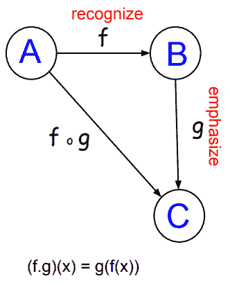
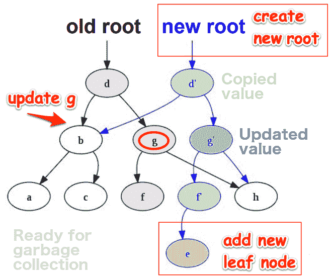
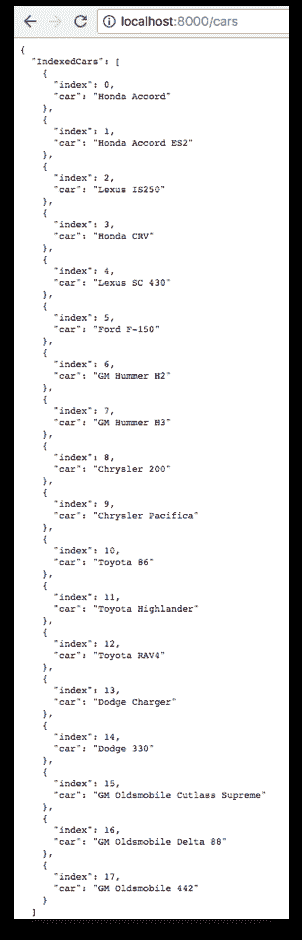
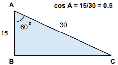

# 第三章：使用高阶函数

我们经常遇到诸如“只是好奇，将纯函数式编程概念应用于命令式语言的好处是什么（除了使代码难以阅读）？”这样的问题。

在本章中，我们将使用高阶函数来解决这个常见的误解。

我们在本章的目标是：

+   了解**函数式编程**（**FP**）的特点

+   了解泛型的目的

+   了解 FP 如何提高性能

+   了解柯里化

+   实现`Map`，`Filter`和`Reduce`函数

+   使用 Goroutines 和 Go 通道实现惰性评估

## FP 的特点

让我们首先看看纯 FP 语言的要求。纯 FP 语言必须支持诸如：

+   头等函数

+   **尾递归优化**（**TCO**）

+   高阶函数

+   纯函数

+   不可变数据

为了实现纯 FP，语言必须像对待任何其他变量类型一样对待函数。在不可变的语言中如何有变化的变量？我们以 FP 的方式实现这一点的方法是创建新变量，而不是修改现有变量。我们将在本章后面看到如何实现这一点，当我们看`Map`函数时。

Go 是一种支持命令式、面向对象和 FP 风格的多维语言。我们可以在 Go 中编写纯粹的命令式或函数式程序。这取决于我们选择的编程风格。这是 Go 和 FP 的伟大之处之一。这不是一个全是或全不是的问题。我们可以在合适的时候和地方将我们的代码迁移到 FP。

Go 需要**尾递归优化**（**TCO**）来处理生产性能要求。每次递归函数调用自身时，都会向堆栈帧添加一个新块；我们很快就会感受到这种 Go 编译器遗漏的迟缓效果。当我们实现`Reduce`函数时，我们将看到如何缓解这个问题。

最后一个要求是支持**高阶函数**（**HOF**）。高阶函数将函数作为参数并/或返回函数作为它们的结果。HOF 允许我们以更少的代码以可读的方式链接我们的函数。

HOFs 可以说是任何 FP 语言的焦点，经过对 FP 特性的快速了解后，我们将研究如何在 Go 中利用它们：

| **特点** | **Go 中支持？** | **描述** |
| --- | --- | --- |

| **匿名函数** | 是 | 一个没有名称的函数。例如，这个函数调用一个打印消息的匿名函数。

```go
func anonymousGreeting() func(string) {
   return func(name string) {
      fmt.Printf("Hey %s!n", name)
   } 
}
```

|

| **闭包** | 是 | 闭包是一个内部函数，它关闭（即访问）其外部范围的变量。换句话说，闭包是一个由对该函数的引用保持活动的函数范围。 |
| --- | --- | --- |
| **组合** | 是 | 组合是允许我们将简单函数组合成更复杂函数的方法。柯里化和管道是组合概念的示例实现。 |

| **延续** | 是 | 延续类似于带参数的 GOTO 语句。延续是我们传递给函数（`factorial`）的函数参数（`next`），它指定函数应该返回的位置。阶乘函数不定义返回值。它是一个接受 int 和另一个传递其当前状态的函数。

```go
func factorial(x int, next func(int)) {
   if x == 0 {
      next(1)
   } else {
      factorial(x-1, func(y int) {
         next(x * y)
      })
   }
}
```

调用继续直到满足基本条件（`x == 0`），然后堆栈上的所有部分执行的下一个函数都被弹出并评估。我们可以这样调用`factorial`：

```go
factorial(4, func(result int) {
   fmt.Println("result", result)
})
```

它将打印：**result: 24**使用单子进行编程是**延续传递风格**（**CPS**）的一种形式，它给了我们更多的控制；使用词法工作流解决方案，当遇到错误时，我们可以将执行定向到错误路径（绕过后续的链式函数调用）到我们工作流的单一惯用 Go 错误处理程序。CPS 也可以使用 Goroutines 和通道进行编程。|

| **柯里化** | 是 | 柯里化是指我们得到一个接受 x 个参数的函数，并返回 x 个函数的组合，每个函数接受 1 个参数。在 FP 中，每个函数都是一个参数的函数。 |
| --- | --- | --- |

| **声明式** | 是 | 声明式风格，与命令式风格相对，意味着我们写表达式而不是逐步说明。命令式函数不用作数据；相反，它用于其副作用，即打印“Hello”。

```go
Info.Println("Hello")
```

|

| **Either 数据类型** | 是 | Either 是一个接受两个参数的类型构造函数。它允许我们说一个值是两种类型中的一种。例如，`Either Car Truck`。我们可以使用 Either 来创建一个错误处理系统，如果我们将我们的结果类型定义为`Either Success Failure`。比 Maybe 数据类型稍微复杂一些。

```go
data Either a b = Left a &#124; Right b
```

|

| **一级函数** | 是！ | 一级函数可以作为参数传递并作为值返回。 |
| --- | --- | --- |
| **函数组合** | 是 | 函数组合意味着我们将单片应用程序分解为最小的计算单元。然后，我们可以以新的方式重新组合我们的函数，通过链接我们的函数调用来创建新的功能。 |

| **Hindley-Milner 类型系统** | 否 | HM 推断类型而不需要任何类型定义。HM 类型系统支持多态类型，其中列表可以包含不同类型的项目。如果 Go 使用了 HM，那么 b 的类型将被推断为`float64`（而不是抛出运行时错误，*常量 1.8 被截断为整数*）

```go
a := 1
b := a + 1.8
```

|

| **幂等性** | 是 | 幂等性意味着我们可以重复调用我们的函数，每次都会产生相同的结果。 |
| --- | --- | --- |
| **不可变数据** | 是 | 不可变的数据结构一旦创建就不会改变。数据不能被添加、移除或重新排序。为了进行*更新*，我们需要创建一个带有我们的更改的副本。不可变性是 FP 的核心原则，因为没有它，我们应用程序中的数据流会变得不稳定和不一致。FP 中真正的常数（如生活中）是变化。变异隐藏了变化。更多原因请参见下面的*不可变数据*部分。 |

| **不可变变量** | 是 | Go 有 const 关键字，但只适用于 int 和字符串。为了拥有不可变对象，我们可以这样写：

```go
type Car struct {
   const Make, Model string
}
```

或者只允许通过方法调用访问字段，这可以编码以防止变异。 |

| **Lambda 表达式** | 是 | Lambda 表达式是匿名函数，通常用作数据，作为参数传递，并作为数据返回，并用于调用另一个函数。请注意，lambda 表达式在它们出现的上下文中执行，也就是说，它们只能访问它们的词法范围内的变量，并且只接受一个参数。要查看 lambda 表达式的示例和非 lambda 表达式的示例，请查看：`2-design-patterns/ch04-solid/01_lambda/main.go`**提示 1**：如果我们可以调用一个函数而不使用它的返回值，那么它是不纯的。**提示 2**：如果我们需要传递多个参数，请使用部分应用的函数。**提示 3**：当我们看到像下面这样的代码时，我们可能正在看一个 Lambda 表达式：

```go
return f(func(x int) int {
   return r(r)(x)
})
```

|

| **列表单子** | 是 | 列表单子用于模拟可以返回任意数量结果的非确定性计算。列表单子可以返回零个或多个结果。return 函数将一个值插入到列表中，如下所示：

```go
return a = [a]
```

bind 函数从列表中提取值，对它们应用函数，并生成一个新的列表，如下所示：

```go
[a] -> (a -> [b]) -> [b]
```

给定以下函数定义：

```go
f :: String -> [String]
f a = [a, prevChar a, nextChar a]
```

```go
g :: String -> [String]
g a = [lower a, upper a]
```

列表单子允许我们将**f**和**g**组合如下：

```go
           g   &#124; w
      &#124; W ---> &#124;
      &#124;        &#124; W
      &#124; 
    f &#124;    g   &#124; x
X --> &#124; X ---> &#124;
      &#124;        &#124; X
      &#124; 
      &#124;    g   &#124; y
      &#124; Y ---> &#124;
               &#124; Y
```

f 看起来像这样：`f "X" --> ["W", "X", "Y"]`g 看起来像这样：

`map g (f "X") --> [["w", "W"], ["x", "X"], ["y", "Y"]]`当我们组合 f 和 g 时，我们得到`["w", "W","x", "X","y", "Y"]`使用组合运算符"."，我们可以将 List monad 组合写成如下形式：`f >=> g = concat . map g . f` |

| **Maybe 数据类型** | 是 | Maybe 表示可能不返回结果的计算，即可选值。`Maybe a`是一个值，它要么包含类型为 a 的值（表示为 Just a），要么为空（表示为 Nothing）。以下是 Maybe 的定义：

```go
data Maybe a = Nothing &#124; Just a
```

说，`Maybe` a 要么不存在，要么存在。如果不存在，它是`Nothing`；如果存在，它是 Just a，其中 a 是一个值。Maybe 是一种多态类型，可以用来定义一个可以产生另一种类型的值或根本没有值的函数。

```go
f :: a -> Maybe b
```

|

| **Maybe Monad** | 是 | Maybe Monad 是一种错误单子，其中所有错误都由`Nothing`表示。（Either 类型提供了更多功能。）鉴于`Maybe`的多态性和结合性，我们可以说。

```go
f :: a -> Maybe b 
g :: b -> Maybe c 
h :: a -> Maybe c 
h = f >=> g 
```

**h**是**f**和**g**的单子组合。`Maybe`单子的定义如下：

```go
instance Monad Maybe where
   return x = Just x

   Nothing >>= f = Nothing
   Just x >>= f = f x
```

|

| **单子错误处理** | 是 | `Maybe`帮助我们处理错误。它表示一些预期的东西，而不是意外的错误。Either 就像一个`Maybe`，它还允许我们返回一个任意值而不是`Nothing`。与担心从函数调用中接收到 null 并可能导致空指针异常不同，我们的类型系统将强制以类型安全的方式处理错误条件。使用 Either 作为我们的返回类型，我们可以运行一个任务，获取一个结果，检查该值：

```go
func runTask(success bool) maybe.Either {
```

即使任务失败，我们也会得到一个非空的结果。

```go
func (e either) Succeeded() StringOption {
   if e.err == nil {
      return SomeString(e.val)
   }
   return EmptyString()
}
```

有关详情，请参阅`2-design-patterns/ch04-solid/02_maybe` |

| **无副作用** | 是 | *无副作用*意味着当我们调用纯函数时，唯一发生的事情是：

+   我们传入参数

+   我们得到一个结果；没有其他事情发生。

**提示 1：**如果我们的函数打印输出，那么它是不纯的。**提示 2：**如果在我们系统的任何其他地方调用我们的函数导致任何状态/数据的更改，那么我们的函数是不纯的。**提示 3：**如果我们的函数没有返回值，那么它要么是不纯的，要么是完全无用的。 |

| **运算符重载** | 否 | 运算符重载，也称为*特定多态性*，是多态性的一个特例，其中不同的运算符如+、=或==被视为多态函数，并且根据其参数的类型具有不同的行为。 |
| --- | --- | --- |

| **Option 类型** | 是 | 我们可以在 Go 中创建一个 Option 类型类：

```go
fmt.Println("Has value:", option.SomeString("Hi"))
fmt.Println("Is empty :", option.Empty())
```

以下是输出：

```go
Has value: Hi
Is empty : <EMPTY>
```

|

| **参数多态性** | 否 | 参数多态性意味着**泛型**。这是一种使用非特定数据类型编写函数的数据类型通用编程风格。例如，我们可以实现适用于非特定类型集合的通用算法。泛型提供了代码重用、类型安全和易于阅读的代码。请参阅以下泛型部分以获取一个简单的示例。 |
| --- | --- | --- |
| **部分函数应用** | 是 | 给予一个函数比它所期望的更少的参数被称为部分函数应用。在这里，我们的函数接受一个具有多个参数的函数，并返回一个参数较少的函数。 |

| **纯函数** | 是 | 纯函数将输入映射到输出。给定相同的输入，纯函数将始终返回相同的输出（也称为*确定性*），并且不会有任何可观察的副作用。纯函数的确定性意味着我们的函数式编程程序的正确性可以得到正式证明，这对于关键任务应用程序是一个巨大的好处。就像数学函数一样，我们函数的输出完全取决于其输入，而与其他因素无关。例如，下面的函数的输出将始终比传递给它的值（x）多两个：

```go
func addTwo(x int) int {
   return x + 2
}
```

|

| **模式匹配** | 否 | 模式匹配使编译器能够根据一些模式匹配一个值，以选择代码的一个分支。

```go
type ErrorMessage =
&#124; YourNameInvalid
&#124; YourPhoneInvalid
&#124; NoTicketsMustBeGreaterThan0
&#124; CreditCardNoInvalid
&#124; CreditCardExpDateInvalid
```

在上述代码中，我们的`ErrorMessage`的值将是五种不同的错误选择之一（`YourNameInvalid`、`YourPhoneInvalid`等）在 Go 中，我们可以在运行时使用联合类型来实现这一点。 |

| **管道** | 是 | 管道允许我们将一个函数的输出作为另一个函数的输入。函数调用可以链接在一起以实现工作流程。管道鼓励代码重用和并行执行。 |
| --- | --- | --- |
| **递归** | 是 | 递归在 FP 语言中用于代替循环，其中一个函数调用自身直到达到结束条件。在 Go 中，每次递归调用都会创建一个调用堆栈。TCO 通过使递归中的最后一次调用成为函数本身来避免创建新的堆栈。尽管我们可以在 Go 中使用递归编码而不使用 TCO，但由于性能差，这并不实用。请注意，纯 FP 语言中的递归是通过 HOFs 从视线中抽象出来的。 |

| **引用透明性** | 是 | 引用透明性是纯函数的属性，其中我们的函数总是为相同的输入返回相同的输出。我们的函数表达式 f(x)和评估我们的函数的结果是可以互换的。例如，1 + 1 总是等于 2。正如我们在第二章中看到的，*操作集合*，这意味着我们可以缓存第一次函数调用的结果并提高性能。

**提示：**如果我们可以缓存先前函数调用的结果，那么我们就具有引用完整性。

| **和类型或联合类型** | 是 | 我们可以使用具有`Success()`和`Failure()`方法的接口来实现联合类型，该方法将返回 Success 或 Failure。有关详细信息，请参见`2-design-patterns/ch04-solid/02_maybe`

```go
package maybe

type SuccessOrFailure interface {
   Success() bool
   Failure() bool
}
```

|

| **尾调用优化** | 否 | 尾调用优化使递归函数调用更高效。尾调用发生在一个函数调用另一个函数作为最后一个动作时。TCO 的作用类似于 GOTO 语句。例如：

```go
 func f(x) {// some code;return g(x)}
```

当被调用的函数 g(x)结束时，程序不需要返回到调用函数，因为在最后一行之后没有可执行代码。在尾调用之后，程序不需要关于 g 的任何调用堆栈信息。没有 TCO，程序将为 g 创建一个不必要的调用堆栈；大量递归调用将导致堆栈溢出。有了 TCO，递归程序将更快，消耗的资源也会少得多。

| **类型类** | 是 | 类型类允许我们定义可以在不同类型上使用的函数，每种类型可能有不同的实现。每个类代表一组类型，并与特定的成员函数集相关联。例如，类型类 Eq 表示所有相等类型的集合，这正是可以使用(==)运算符的类型集合。 |
| --- | --- | --- |
| **单元类型** | 是 | 单元类型恰好有一个值。它也被称为身份。乘法的单位是 1，加法的单位是 0，字符串连接的单位是空字符串。定义为 int 类型的元组类型可以包含多少个值？无限。(-∞, …, 0, 1, 2... ∞)定义为空元组的类型可以包含多少个值？单元类型的值在于可以在我们可能返回 nil（或 null）的地方使用它。当我们不关心值是什么时，我们返回一个单元。我们不返回 nil，我们返回一个值；单元值。所有函数都返回值；不再有空指针异常！单元类型在需要空值的地方也很有用。例如，在 F#中，可能会创建副作用但不返回值的异步操作是类型 Async<unit>的实例。 |

这些并非纯 FP 的所有特征，只是其中一些更重要的特征。可能最重要的是对一级函数的支持。

上表介绍了我们将在本书后面更详细地介绍的许多概念。如果你太好奇，可以随意跳过；否则，跟着流程走，我们最终会涉及到它。

在上表中的*Go 支持？*列中：

+   **是！**：表示 FP 特性存在于 Go 中。

+   **是**：表示 Go 中可以通过一些努力实现该特性或要求。

+   **否**：表示缺少此 FP 特性或要求，并且在不进行 Go 编译器的重大升级或在与 Go 并用其他技术的情况下，难以实现或不可能实现。

### 函数组合

函数组合是当我们组合函数时发生的情况。一个函数的输出是下一个函数的输入。我们可以使用范畴论的对象和态射来帮助我们得到正确的顺序。例如，看下面的图表...

>

我们看到我们可以组合我们的函数 f 和 g 从 A 到 B 到 C。请注意顺序很重要。我们必须先通过 f 从 A 到 B，然后通过 g 从 B 到 C。

我们用以下符号表示（f.g)(x)。这读作*f-compose-g with input x*。这个表达式等于 g(f(x))，读作*f of x of g*。所以*(f.g)(x) == g(f(x))*。

这是 Go 中`compose`函数的样子：

```go
func Compose(f StrFunc, g StrFunc) StrFunc {
   return func(s string) string {
      return g(f(s))
   }
}
```

其中`StrFunc`的定义如下：

```go
type StrFunc func(string) string
```

在我们的`main.go`中，我们定义了我们的`f`和`g`函数，分别识别和强调：

```go
func main() {
   var recognize = func(name string) string {
         return fmt.Sprintf("Hey %s", name)
      }
   var emphasize = func(statement string) string {
      return fmt.Sprintf(strings.ToUpper(statement) + "!")
      }
```

我们将`f`和`g`组合如下：

```go
var greetFoG = Compose(recognize, emphasize)
fmt.Println(greetFoG("Gopher"))
```

以下是输出：

```go
HEY GOPHER!
```

请注意顺序很重要。如果我们交换`f`和`g`的顺序，然后组合会发生什么？

```go
var greetGoF = Compose(emphasize, recognize)
fmt.Println(greetGoF("Gopher"))
```

以下是输出：

```go
Hey GOPHER!
```

### 单子允许我们链接连续

链接连续意味着我们可以执行一系列函数，其中一个函数的输出是下一个函数的输入。查看以下链接高阶函数的示例：

```go
cars := LoadCars()
for _, car := range cars.Filter(ByHasNumber()).
       Filter(ByForeign()).
       Map(Upgrade()).
       Reduce(JsonReducer(cars), Collection{}) {
       log.Println(car)
}
```

您将看到以下输出：

```go
{"car": {"make": "Honda", "model": " Accord ES2 LX"}}
{"car": {"make": "Lexus", "model": " IS250 LS"}}
{"car": {"make": "Lexus", "model": " SC 430 LS"}}
{"car": {"make": "Toyota", "model": " RAV4 EV"}}
```

如果我们要实现`for`循环、错误检查和其他通常在 Go 中编写典型命令式编程时所需的支撑，需要多少代码？

我们不是告诉 Go 如何过滤、映射和减少我们的集合，而是声明我们想要实现的目标。在本章后面，我们确实实现了`Filter`、`Map`和`Reduce`函数，但如果 Go 标准库已经为我们提供了这些函数呢？

我们如何期望 Go 为汽车提供 HOF 实现？那是不合理的，对吧？缺少什么？答案是*泛型*。

本章中的 ChainLink 实现有点像穷人的单子。我们将在本书的最后一章中探讨一个真正的单子，并发现涉及更多操作（Bind，Return，单子错误处理）。真正的单子也不依赖全局变量。相似的是它们都允许我们按顺序执行操作，其中一个函数的输出是下一个函数的输入。这是一个要记住的关键概念。

### 泛型

参数多态意味着泛型。泛型函数或数据类型可以编写为使用相同逻辑处理任何数据值，而无需将该值转换为特定数据类型。这大大提高了代码的重用性。

以下是一个泛型`IsEqual`实现的 C#代码示例。泛型`IsEqual`函数将接受任何类型（实现`Equals`）。我们通过在运行时简单地指定类型`T`来传递`IsEqual`整数和字符串，在`IsEqual`执行时：

```go
namespace Generics
{
   private static void Main() {
      if(Compute<int>.IsEqual(2, 2)) {
            Console.WriteLine("2 isEqualTo 2");
         }
      if(!Compute<String>.IsEqual("A", "B")) {
            Console.WriteLine("A is_NOT_EqualTo B");
         }
   }
    public class Compute<T> {
        public static bool IsEqual(T Val1, T Val2) {
            return Val1.Equals(Val2);
        }
    }
}
```

目前，在 Go 中，我们将不得不使用空接口并执行类型转换来执行此操作。正是类型转换导致了通常使 Go 中的泛型处理变得不切实际的性能损失。

### 头等函数

头等函数允许我们通过为基本函数提供函数参数来创建新函数。在下面的代码中，我们的基本函数是`Filter`。通过将`ByMake("Toyota")`传递给`Filter`，我们从集合中删除了大多数汽车项目，只留下了丰田汽车：

```go
cars := Filter(ByMake("Toyota"))
```

我们还有能力将作用于单个元素的任何函数转换为作用于列表的函数，方法是用`Map`函数包装它。如果没有我们新的函数式编程风格，我们可能会尝试实现一个`for`循环，并对每辆汽车应用`fmt.Sprintf`转换，如下所示：

```go
// cars: Honda Accord, Honda Accord ES2, Lexus IS250, Honda CR-V, Lexus SC 430,...
for _, car := range cars {
       thisCar := fmt.Sprintf("%s %s", car, map[string]string{
              "Honda": "LX",
              "Lexus": "LS",
              "Toyota": "EV",
              "Ford": "XL",
              "GM": "X",
       }[GetMake(car)])
       // upgrade a car by appending "LX" ... to the end of the model name
       mappedCars = append(mappedCars, thisCar)
}
// mappedCars: Honda Accord LX, Honda Accord ES2 LX, Lexus IS250 LS...
```

相反，我们可以将`Upgrade`函数简单地传递给`Map`，因为我们组合我们的数据转换：

```go
Filter(ByMake("Toyota")).Map(Upgrade())
```

我们不再需要编写操纵数组的`for`循环，因为我们可以直接调用`Map`。

HOFs 可以大大减少开发复杂逻辑所需的时间。我们可以快速将较小的、特定任务的函数组合成更快的复杂业务逻辑解决方案，减少了更少的脚手架代码，这意味着我们将有更少的错误需要修复。我们的函数本质上是可重用的构建模块。

HOFs 是独立的，这使它们易于在我们的代码库中重用、重构和重新组织。这使我们的程序更加灵活，更能抵御未来的代码更改。

更易读的代码，更快的实现，更少的错误。函数式编程的好处正在累积！

### 闭包

闭包是一个在其外部范围内关闭变量的函数。我们真的需要一个例子来理解这个说法！这是一个很好的例子：

```go
func addTwo() func() int {
       sum := 0
 return func() int { // anonymous function
 sum += 2
 return sum
 }
}

func main() {
       twoMore := addTwo()
       fmt.Println(twoMore())
       fmt.Println(twoMore())
}
```

您将看到以下输出：

```go
2
4
```

前面的闭包是由`addTwo`函数形成的。在`addTwo`内部，`sum`和匿名函数都在同一个词法范围内声明。由于`addTwo`闭合了`sum`和匿名函数，并且因为 sum 是在匿名函数之前声明的，匿名函数总是可以访问并修改`sum`变量。一旦`addTwo`被赋值给`twoMore`，`addTwo`函数的匿名函数就可以访问`sum`变量，并在应用程序继续运行时保持对其的控制。

#### 动态作用域

如果我们在外部范围意外地初始化了`sum`，而我们定义了我们的函数呢？请注意，在与我们的匿名函数相同的范围内没有 sum 变量初始化：

```go
func addTwoDynamic() func() int {
    return func() int { 
        sum += 2
 return sum
    }
}
```

当我们在`main()`函数中运行这个时：

```go
twoMoreDynamic := addTwoDynamic()
fmt.Println(twoMoreDynamic())
fmt.Println(twoMoreDynamic())
```

我们的 Go 运行时查找匿名函数被调用的环境，而不是它被定义的地方（这是词法作用域的情况）。如果`addTwoDynamic`嵌套了几个堆栈帧，我们的 Go 运行时会在`addTwoDynamic`被定义的地方查找 sum。如果在那里找不到，它将继续向上查找堆栈，直到找到 sum。因此，我们看到动态作用域增加了复杂性，并可能导致 sum 的值以不可预测的方式改变，或者至少以更难以调试的方式改变。

以下是输出：

```go
7
9
```

发生了什么？由于 sum 没有在我们定义匿名函数的范围内定义，Go 在全局范围内找到了它。它的值是 5。`addTwoDynamic`将 2 加到 5 得到 7。`addTwoDynamic`再次这样做，得到 9。可能不是我们想要的。

能够传递词法上下文是强大的，并且保证我们不会出现动态作用域可能发生的副作用。我们将看一个实际的例子，我们在应用程序启动时创建一个应用程序上下文，例如数据库连接、记录器等，并在整个应用程序中需要时传递该上下文。

### 纯函数

纯函数是指当给定相同的输入时，将始终返回相同的输出，并且不会有任何可观察的副作用。这有什么好处？让我们看看。我们可以并行运行任何纯函数，因为我们的函数不需要访问共享内存。由于纯函数不可能出现由于副作用而导致的竞争条件。在多核上并发运行我们的代码的性能收益是函数式编程的另一个令人惊叹的好处。

### 不可变数据

不可变数据结构：

+   拥有一个状态并且永远不改变

+   更容易构建、调试、测试和推理

+   没有副作用

+   提高性能并且更具可扩展性，因为它们更容易缓存

+   更安全，因为它们防止空指针引用

+   线程安全

+   总是处于稳定状态

由于不可变数据结构永远不会更改，这意味着在数据修改操作期间永远不会发生故障。当初始化不可变数据结构时，它将失败或成功，返回一个永远不会更改的有效数据结构。

为了对不可变数据结构进行更改，我们必须创建一个新的树。假设我们想要更新现有树数据结构（*先前的根*）中 g 的值。首先，我们将创建 g'节点，并通过遍历与 g 连接的节点并仅复制重建树所需的那些值来构建新树。可以创建对其他节点的引用而不创建新节点（这些是白色节点）。有了新的根，新的叶节点被添加到新的树结构中。

一旦创建了新的根，先前/旧的根可以被保留，也可以被标记为删除。



这可能看起来很费力，但最大的好处之一是我们不再需要担心我们的数据意外更改。例如，如果一个 Goroutine 正在循环遍历我们的数据结构，而另一个 Goroutine 正在从中删除元素，我们不再需要担心处理竞争条件并验证我们的前提条件是否仍然有效。当我们使用不可变数据结构时，我们的代码变得更加健壮，更容易理解。

您是否能想到今天使用不可变数据结构的任何解决方案？

曾经想知道 git 是如何工作的吗？

对全栈开发感兴趣吗？ReactJS 如何更新其模型？

在足球比赛中，我们可能输给一个具有特定技能的球员的球队。当我们再次面对这支球队时，我们可能会忘记过去，但这并不会改变历史；改变过去是不可能的。当过去没有被保留时，我们无法从中学习，历史将重演。可变性隐藏了变化。

#### Go 的持久数据结构

查看[`godoc.org/github.com/mndrix/ps`](https://github.com/mndrix/ps)

来自它的文档：

完全持久的数据结构。持久数据结构是一种数据结构，当修改时总是保留其先前版本。这样的数据结构实际上是不可变的，因为它们的操作不会在原地更新结构，而是总是产生一个新的结构。

持久数据结构通常彼此共享结构。这使得操作可以避免复制整个数据结构。

ps 具有用于操作数据列表和映射的小而有效的 API：

```go
type List interface {
   Cons(val interface{}) List
   ForEach(f func(interface{}))
   Head() interface{}
   IsNil() bool
   Reverse() List
   Size() int
   Tail() List
}
func NewList() List
type Map interface {
   Delete(key string) Map
   ForEach(f func(key string, val interface{}))
   IsNil() bool
   Keys() []string
   Lookup(key string) (interface{}, bool)
   Set(key string, value interface{}) Map
   Size() int
   String() string
   UnsafeMutableSet(key string, value interface{}) Map
}
func NewMap() Map
```

有关更多详细信息，请参见[`godoc.org/github.com/mndrix/ps`](https://godoc.org/github.com/mndrix/ps)

### 使用表达式

使用表达式（而不是语句）意味着在 FP 中，我们将一个值传递给一个函数，通常以某种方式对其进行转换，然后返回一个新值。由于 FP 函数没有副作用，一个不返回值的 FP 函数是无用的，也是代码异味的标志。在第一章中，*Go 中的纯函数式编程*，我们看到命令式编程关注程序操作的逐步机制，而在声明式编程中，我们声明了我们希望结果是什么。

这是命令式编程的一个例子：

```go
var found bool
car_to_look_for := "Blazer"
cars := []string{"Accord", "IS250", "Blazer" }

for _, car := range cars {
       if car == car_to_look_for {
              found = true;
       }
}
fmt.Printf("Found? %v", found)
```

这是声明式编程的一个例子：

```go
fmt.Printf("Found? %v", cars.contains("Blazer"))
```

我们有更少、更易于阅读的声明性 FP 代码。

## 样本 HOF 应用程序

让我们构建一个示例应用程序，演示将函数式编程概念应用于 Go 的好处。

我们的应用程序将从以下`cars.csv`文件中读取：

```go
"Honda Accord"
"Honda Accord ES2"
"Lexus IS250"
"Honda CR-V"
"Lexus SC 430"
"Ford F-150"
"Toyota Highlander"
"Toyota RAV4"
"GM Hummer H2"
"GM Hummer H3"
```

我们将应用高阶函数和各种函数式编程构造到汽车列表中，以过滤、映射、减少和转换它。

我们的项目结构如下：

```go
$ tree
.
├── README.md
└── chapter4
 ├── 01_hof
 │ ├── cars.csv
 │ ├── cars.go
 │ ├── generator.go
 │ ├── more_cars.csv
 │ ├── restful.go
 │ ├── types.go
 │ └── utils.go
 └── main.go
```

在`chapter4`目录的根目录是我们的`main.go`文件。由于我们计划从`main.go`构建一个 Go 可执行文件并运行它，我们使用`main`包名并包括一个`main()`函数。

其他文件将位于名为`01_hof`的子目录中，其中`hof`代表高阶函数。

### 第四章应用程序代码

让我们从`main.go`开始检查我们的`chapter4`实现：

```go
package main

import (
       . "github.com/l3x/learn-fp-in-go/chapter4/01_hof"
 "log"
 "os"
 "github.com/julienschmidt/httprouter"
 "net/http"
)
```

在` . "github.com/l3x/learn-fp-in-go/chapter4/01_hof"`导入中的点(`.`)使我们不必在该目录中的函数前加上`hof`，这是该目录中所有 Go 文件使用的包名称：

```go
func init() {
       log.SetFlags(0)
       log.SetOutput(os.Stdout)
}
```

我们将使用`log`包将输出记录到`stdout`。将 0 值传递给`log.SetFlags`告诉记录器在不添加时间戳的情况下打印。我们还告诉记录器打印到`stdout`，而不是默认的`stderr`，因为我们希望所有输出都能一致地显示，以便阅读。对于生产应用程序，我们可能不会将任何信息输出到`stdout`，因为除了命令帮助和使用信息之外，程序没有任何有用的信息要发送到`stdout`。 

`log`函数可以很容易地配置为在时间戳和行号之前添加。`log.SetFlags(log.Lshortfile | log.Ldate)`设置将输出打印到`stdout`：`2017/04/07 utils.go:17: car: Honda Accord`。

#### 构建和运行时指令

在验证我们的 Go 环境是否正确配置之后，我们可以切换到项目目录并使用以下命令启动 RESTful web 服务器：

```go
$ RUN_HTTP_SERVER=TRUE ./chapter4
```

有关我如何管理我的 Go 环境的详细信息，请参阅附录中的*My Go build and runtime process*部分，*Miscellaneous Information and How-Tos*。

我们需要打开另一个终端窗口来运行我们的`chapter4`可执行文件。让我们构建和运行我们的`chapter4`应用程序，以使用以下命令来运行我们的 HOFs：

```go
$ go build && ./chapter4
```

输出的前几行应该如下所示：

```go
ByMake - Honda
-----------------------
car: Honda Accord
car: Honda Accord ES2
. . .
```

#### 更多应用程序代码

在`main()`函数中，我们首先检查`RUN_HTTP_SERVER`环境变量。如果它被设置为`true`，那么程序将设置两个路由。第一个路由`/cars`返回显示从`.csv`文件中加载的所有汽车的索引页面。第二个路由`/cars/:id`检索单个汽车对象并返回其 JSON 表示：

```go
func main() {
       if os.Getenv("RUN_HTTP_SERVER") == "TRUE" {
              router := httprouter.New()
              router.GET("/cars", CarsIndexHandler)
              router.GET("/cars/:id", CarHandler)
              log.Println("Listening on port 8000")
              log.Fatal(http.ListenAndServe(":8000", router))
```

`IndexedCars`变量在`types.go`中定义如下：

```go
IndexedCar struct {
       Index int `json:"index"`
 Car   string` json:"car"`
}
```

在我们查看 else 逻辑之前，让我们来看一下以下`cars.go`文件。我们声明了一个导出的包级变量`CarsDB`，它被赋予了一个`IndexedCars`的切片：

```go
package hof

import (
       "fmt"
 s "strings"
 "regexp"
 "log"
 "encoding/json"
)

var CarsDB = initCarsDB()

func initCarsDB() []IndexedCar {
       var indexedCars []IndexedCar
       for i, car := range LoadCars() {
              indexedCars = append(indexedCars, IndexedCar{i, car})
       }
       lenCars := len(indexedCars)
       for i, car := range LoadMoreCars() {
              indexedCars = append(indexedCars, IndexedCar{i + lenCars, car})
       }
       return indexedCars
}

func LoadCars() Collection {
       return CsvToStruct("cars.csv")
}
```

请注意，我们`01_hof`目录中的每个 Go 源文件都使用包名称`hof`。

我们用`s`来引用`strings`包，这样我们就可以很容易地使用`s`来引用字符串实用函数，比如`s.Contains(car, make)`，而不是`strings.Contains(car, make)`。

由于`var CarsDB = initCarsDB()`是在包级别定义的，所以当我们启动`chapter4`可执行文件时，它将被评估。`initCarsDB()`函数只需要在这个`cars.go`文件中引用，所以我们不需要将其首字母大写。

另一方面，`LoadCars()`函数被主包引用，因此我们需要将其首字母大写以使其可访问。

现在，让我们把注意力转向 else 块中的 FP 好东西。

#### Filter 函数

我们利用的第一个 HOF 是`Filter`函数：

```go
} else {
       cars := LoadCars()

       PrintCars("ByMake - Honda", cars.Filter(ByMake("Honda")))
```

您将看到以下输出：

```go
ByMake - Honda
-----------------------
car: Honda Accord
car: Honda Accord ES2
car: Honda CR-V
```

`Filter`函数在`cars.go`文件中。观察`fn`参数。它被传递到`Filter`函数中，稍后会用`car`参数调用。如果`fn(car)`——也就是`ByMake("Honda")`——返回`true`，那么这辆车就会被添加到集合中：

```go
func (cars Collection) Filter(fn FilterFunc) Collection {
       filteredCars := make(Collection, 0)
       for _, car := range cars {
              if fn(car) {
                     filteredCars = append(filteredCars, car)
              }
       }
       return filteredCars
}
```

当我们在`cars collection`类型上定义`Filter`函数时，它被称为方法。Go 方法是带有特殊接收器参数的函数。在我们的`Filter`函数中，`cars`集合是接收器。请注意，`cars`在第一组参数中，位于`func`关键字和`Filter`名称之间。注意`cars`是具有`Filter`行为的数据结构。`Filter`方法接受`FilterFun`作为其参数，并返回一个过滤后的集合。

##### 现实检查

什么？一个`for`循环？一个可变的`car`变量？怎么回事？我们必须面对现实。Go 编译器不提供 TCO，因此递归实现根本不现实。也许 Go 2.0 将提供一个纯函数库，其中包括我们所有喜爱的高阶函数以及泛型。在那之前，我们将尽可能地使用函数式编程风格，必要时使用一些命令式编程。我们稍后将探讨的另一个选项是一个名为**Gleam**的执行系统，它提供了纯 Go 映射器和减速器，提供了高性能和并发性。

数据转换是如此常见，以至于有一个简写方式是很好的。高阶函数简化了执行数据转换的代码的编写和阅读，这是 FP 最大的好处之一。

#### FilterFunc

在`types.go`文件中，我们看到了它的定义：

```go
FilterFunc func(string) bool
```

回顾一下`main.go`中的那一行，我们看到我们使用了`ByMake`过滤函数：

```go
PrintCars("ByMake - Honda", cars.Filter(ByMake("Honda")))
```

`ByMake`函数在`cars.go`文件中定义：

```go
func ByMake(make string) FilterFunc {
       return func(car string) bool {
 return s.Contains(car, make)
 }
}
```

`ByMake`函数是一个高阶函数，因为它返回一个函数。回想一下，`Filter`是一个高阶函数，因为它接受一个函数。在这种情况下，`ByMake`就是那个函数`fn`，我们将在下一节中看到。

##### 过滤函数

`Filter`函数是一个高阶函数，它接受另一个高阶函数，即`ByMake`，并执行数据转换。

```go
func (cars Collection) Filter(fn FilterFunc) Collection {
   filteredCars := make(Collection, 0)
   for _, car := range cars {
      if fn(car) {
         filteredCars = append(filteredCars, car)
      }
   }
   return filteredCars
}
```

### RESTful 资源

让我们打开`http://localhost:8000/cars`，看看来自`cars.csv`和`more_cars.csv`的所有汽车的完整列表：



让我们看看`main.go`中下一个`Filter`函数的运行情况：

```go
PrintCars("Numeric", cars.Filter(ByHasNumber()))
```

您将看到以下输出：

```go
Numeric
-----------------------
car: Honda Accord ES2
car: Lexus IS250
car: Lexus SC 430
car: Ford F-150
car: Toyota 86
car: Toyota RAV4
car: GM Hummer H2
car: GM Hummer H3
```

在这种情况下使用的`FilterFunc`方法是`ByHasNumber()`。它的操作方式类似于`ByMake FilterFunc`，并使用 Go 的 regexp `MatchString`函数来返回`true`，如果汽车中有数字的话：

```go
func ByHasNumber() FilterFunc {
       return func(car string) bool {
 match, _ := regexp.MatchString(".+[0-9].*", car)
 return match
 }
}
```

#### 链接函数

既然我们已经掌握了，让我们将几个过滤器链接在一起：

```go
PrintCars("Foreign, Numeric, Toyota",
       cars.Filter(ByForeign()).
              Filter(ByHasNumber()).
              Filter(ByMake("Toyota")))
```

您将看到以下输出：

```go
Foreign, Numeric, Toyota
-----------------------
car: Toyota 86
car: Toyota RAV4
```

#### 更多的汽车

是时候添加更多的汽车了：

```go
moreCars := LoadMoreCars()

PrintCars("More Cars, Domestic, Numeric, GM",
       cars.AddCars(moreCars).
              Filter(ByDomestic()).
              Filter(ByHasNumber()).
              Filter(ByMake("GM")))
```

这是输出：

```go
More Cars, Domestic, Numeric, GM
-----------------------
car: GM Hummer H2
car: GM Hummer H3
car: GM Oldsmobile Delta 88
car: GM Oldsmobile 442
```

等等，什么？ `AddCars`？那怎么成为高阶函数了？ `AddCars`既不接受函数，也不返回函数。更糟糕的是，它改变了`cars`集合。

##### 现实检验

汽车集合保持*纯粹*并不重要；坦率地说，这是不可行的，因为 Go 编译器目前不提供 TCO。重要的是，我们的代码通过使用函数式编程技术得到改进。诚然，这个`AddCars`距离纯粹的函数最远，但它是有用的，它确实提高了我们程序的可读性。当我们使用非纯函数时，尤其是那些改变其状态的函数时，我们需要小心，但对于我们的目的来说，这种用法是完全可以的。

我们在`cars.go`中找到了`AddCars`：

```go
func (cars Collection) AddCars(carsToAdd Collection) Collection {
       return append(cars, carsToAdd...)
}
```

#### Map 函数

回到`main.go`。这一次，您将介绍`Map`高阶函数。而`Filter`的作用是减少结果集合中的项目数量，`Map`将返回与接收到的项目数量相同的项目。`Map`函数将集合转换为一个新的集合，其中每个项目都以某种方式改变：

```go
PrintCars("Numeric, Foreign, Map Upgraded",
       cars.Filter(ByHasNumber()).
              Filter(ByForeign()).
              Map(Upgrade()))
```

这是输出：

```go
Numeric, Foreign, Map Upgraded
-----------------------
car: Honda Accord ES2 LX
car: Lexus IS250 LS
car: Lexus SC 430 LS
car: Toyota 86 EV
car: Toyota RAV4 EV
```

我们将一个名为`Upgrade`的`MapFunc`函数传递给`Map`：

```go
func Upgrade() MapFunc {
       return func(car string) string {
 return fmt.Sprintf("%s %s", car, UpgradeLabel(car))
 }
}
```

`Upgrade`调用`UpgradeLabel`函数，以便在汽车的型号名称末尾添加适当的升级标签：

```go
func UpgradeLabel(car string) string {
       return map[string]string{
 "Honda": "LX",
 "Lexus": "LS",
 "Toyota": "EV",
 "Ford": "XL",
 "GM": "X",
 }[GetMake(car)]
}
```

##### Map 函数的性能提高

FP 的最大好处之一是性能。

如今的程序主要通过使用多个 CPU 核心同时执行多个操作来实现更好的性能。

这意味着并行运行代码，为了做到这一点，我们的代码必须是线程安全的。具有共享可变状态的程序是不安全的。这些程序将在一个核心中成为瓶颈。

FP 通过返回变量的新实例而不是改变原始实例来解决了这个瓶颈/线程安全问题。


让我们看看`Map`函数，看看我们如何使用 FP 实现这一点：

```go
func (cars Collection) Map(fn MapFunc) Collection {
       mappedCars := make(Collection, 0, len(cars))
       for _, car := range cars {
              mappedCars = append(mappedCars, fn(car))
       }
       return mappedCars
}
```

`Map`不是将内容附加到汽车集合，而是接收一个新变量`mappedCars`。`mappedCars`集合被改变，而不是原始汽车集合。

当我们调用`Map(Upgrade())`时，我们在战术上所做的是将我们的数据更改的时刻推迟到最后一刻--在这个例子中，是在`mappedCars`被填充之后。

我们一直在我们的整个职业生涯中编写 FP 概念。本章的部分内容是识别这些 FP 模式，以及我们应该如何以及为什么要利用它们。

#### Reduce 函数

接下来，让我们看看`Reduce`函数。`Reduce`是 HOF 的瑞士军刀。有了`Reduce`函数，我们可以做任何可以用`Filter`或`Map`完成的事情。

`Reduce`函数，也称为`fold`、`accumulate`、`aggregate`、`compress`或`inject`，接受一个种子值，并将 reducer 函数的逻辑应用于种子，并可能多次调用自身以得到结果。通常，reduce 函数将组合数据元素以返回单个聚合值，因此称为`fold`。因此，我们将所有数据折叠成一个结果。

回到`main.go`，我们应用`ByMake`过滤器来过滤掉所有不是本田产品的汽车。然后，我们调用`Reduce`函数将本田车辆的集合转换为 JSON 字符串的集合：

```go
PrintCars("Filter Honda, Reduce JSON",
       cars.Filter(ByMake("Honda")).
              Reduce(JsonReducer(cars), Collection{}))
```

这将产生以下输出：

```go
Filter Honda, Reduce JSON
-----------------------
car: {"car": {"make": "Honda", "model": " Accord"}}
car: {"car": {"make": "Honda", "model": " Accord ES2"}}
car: {"car": {"make": "Honda", "model": " CR-V"}}
```

`Reduce`函数是汽车集合的一个方法，接受一个`Reducer`函数。再次看到一个`for`循环，并回想起，“没有尾调用优化，没有递归”。没关系。所以，我们的`Reduce`函数的核心部分不是*纯*的。没关系。它仍然是可读的，高效的，安全的；符合 Go 编程的精神，它完成了工作：

```go
func (cars Collection) Reduce(fn ReducerFunc, accumulator Collection) Collection {
       var result = accumulator
       for _, car := range cars {
              result = append(fn(car, result))
       }
       return result
}
```

第二个参数`Collection{}`是累加器，是分配给结果的初始值。`Reducer`函数从累加器值开始，在集合中的每个项目上执行转换，并返回结果。这个`Reduce`函数提供了执行减少的框架，但是真正的工作是由 reducer 函数（`fn`）完成的。请注意，我们可以将任何有效的 reducer 函数（`fn`）传递到`Reduce`框架中，以获得截然不同的结果。

我们的`JsonReducer`函数真正地将汽车集合中的每个项目转换为 JSON 字符串：

```go
func JsonReducer(cars Collection) ReducerFunc  {
       return func(car string, cars Collection) Collection {
 carJson := fmt.Sprintf("{"car": {"make": "%s", "model": "%s"}}", GetMake(car), GetModel(car))
 cars = append(cars, carJson)
 return cars
 }
}
```

Reduce 是一个接受函数的 HOF 函数。`JsonReducer`是一个返回函数的 HOF 函数。

#### 更多高阶函数

现在，让我们返回`main.go`，看看更多 HOF 的实际应用。

我们应用我们的`ByMake`过滤器和一种新类型的 reducer。这个 reducer，`Reducer2`，将返回一个`CarTypes`的切片，而不是 JSON：

```go
PrintCars2("Reduce - Lexus",
       cars.Filter(ByMake("Lexus")).
              Reduce2(CarTypeReducer(cars), []CarType{}))
```

以下是这个的输出：

```go
Reduce - Lexus
-----------------------
car: {Lexus IS250}
car: {Lexus SC 430}
```

以下是另一个示例，展示了链式调用（也称为函数组合）有多么容易：

```go
PrintCars("ByModel - Accord up/downgraded",
       cars.Filter(ByModel("Accord")).
              Map(Upgrade()).
              Map(Downgrade()))
```

以下是这个的输出：

```go
ByModel - Accord up/downgraded
-----------------------
car: Honda Accord 
car: Honda Accord ES2
```

我们看到`Upgrade`映射函数如何在汽车型号末尾添加适当的标签。通过在`Upgrade`之后应用`Downgrade`，我们有效地撤消了`Upgrade`。

#### 生成器

是时候检查生成器了。生成器很有用，因为它们允许我们延迟表达式的评估。我们只在需要时计算我们需要的表达式。生成器还节省内存，因为使用生成器，我们只创建和使用我们需要的，不多不少：

```go
PrintCars("GenerateCars(1, 3)",
       cars.GenerateCars(1, 3))
```

我们将在`generate.go`文件中找到`GenerateCars`的实现：

```go
package hof

import (
       "sync"
 "log"
)

func carGenerator(iterator func(int) int, lower int, upper int) func() (int, bool) {
       return func() (int, bool) {
              lower = iterator(lower)
              return lower, lower > upper
       }
}

func iterator(i int) int {
       i += 1
 return i
}
```

我们定义我们的导入。`sync`导入是一个线索，表明我们需要同步我们的 Goroutines。`iterator`函数将被传递给`carGenerator`函数，并将跟踪我们生成了多少辆汽车。我们将根据需要创建汽车。

#### RESTful 服务器

如果我们的 RESTful 服务器在端口`8000`上运行，我们可以在网页浏览器中打开`http://localhost:8000/cars/1`，看到以下内容：

```go
{
  "index": 1,
  "car": "Honda Accord ES2"
}
```

这是`IndexedCar`结构的表示。它有一个索引和一个汽车制造商和型号字符串。

这是`types.go`中实际的`IndexedCar`结构：

```go
IndexedCar struct {
       Index int `json:"index"`
 Car   string` json:"car"`
}
```

#### 生成汽车函数

以下是实际的生成器函数：

```go
func (cars Collection) GenerateCars(start, limit int) Collection {
       carChannel := make(chan *IndexedCar)
```

`GenerateCars`是`cars`集合中的另一个方法，它使得与其他 HOFs 组合数据变换变得容易。`GenerateCars`接受一个起始索引和限制，即我们想要返回的汽车数量。我们创建指向`IndexedCars`的`carChannel`：

```go
var waitGroup sync.WaitGroup
```

我们使用`sync.WaitGroup`作为计数信号量来等待我们的一系列 Goroutines 完成：

```go
numCarsToGenerate := start + limit - 1
generatedCars := Collection{}
waitGroup.Add(numCarsToGenerate)
```

我们计算要生成的汽车数量，并将该数字传递给`waitGroup.Add`函数：

```go
next := carGenerator(iterator, start -1, numCarsToGenerate)
```

我们的`carGenerator`函数返回一个我们分配给变量`next`的函数：

```go
carIndex, done := next()
```

`next`变量返回两个变量：`carIndex`和`done`。只要还有更多的汽车要生成，`done`就会是`false`。因此，我们可以使用`done`来控制一个`for`循环，为要生成的每辆汽车启动一个 Goroutine：

```go
for !done {
       go func(carIndex int) {
              thisCar, err := GetThisCar(carIndex)
              if err != nil {
                     panic(err)
              }
              carChannel <- thisCar
              generatedCars = append(generatedCars, thisCar.Car)
              waitGroup.Done()
       }(carIndex)

       carIndex, done = next()
}
```

`next`变量在代码块中返回两个变量`GetThisCar(carIndex)`；在此之后，前面的代码调用 RESTful 汽车服务，返回所请求的汽车。

如果遇到错误，我们使用内置函数`panic`来停止当前 Goroutine 的执行。由于我们使用了延迟函数，即`csvfile.Close()`，在调用堆栈中，如果发生 panic，它将被执行。请注意，我们本可以使用内置的 recover 函数更好地控制终止序列。

`thisCar`变量被发送到`carChannel`，并且`Car`字段被附加到`generatedCars`集合中。

##### 柯里化 Goroutine

注意`generatedCars`集合有什么特别之处吗？（提示：我们的 Goroutine 是一个匿名函数）。

没错。我们正在对`generatedCars`集合进行柯里化。我们的 Goroutine 覆盖了`generatedCars`集合。这使我们能够从 Goroutine 中引用并附加到它，而不管它运行在哪个核心上。

我们站在巨人的肩膀上。我们使用 Go 通道和 Goroutines 来模拟 FP 生成器和其他 HOFs。我们的代码可读性强，而且不需要太多的代码就能使其全部工作。

##### 对柯里化的更近距离观察

在我们继续之前，让我们看一下以下柯里化与非柯里化代码示例，以提高我们对柯里化的理解：

```go
package main

import "fmt"

// numberIs numberIs a simple function taking an integer and returning boolean
type numberIs func(int) bool

func lessThanTwo(i int) bool { return i < 2 }

// No curried parameters
func lessThan(x int, y int) (bool) {
   return x < y
}

func main() {
   fmt.Println("NonCurried - lessThan(1,2):", lessThan(1, 2))
   fmt.Println("Curried - LessThanTwo(1):", lessThanTwo(1))
}
```

您会立即看到，柯里化示例只需要一个参数，而非柯里化示例需要两个参数。柯里化的想法是通过部分应用来从更小、更一般的函数中创建新的、更具体的函数。我们将在第八章 *函数参数*中看到更多内容。

另一个收获是函数类型的使用。`numberIs`是一个数据类型，是一个接受 int 并返回 bool 的函数。没错，在 FP 中，我们不害怕函数。我们将它们视为常规的数据类型。在 FP 中，一切都是数据，数据永远不会改变。它只是被传递、创建和返回。

角度*x*的值等于(*A*)邻边的长度除以(*H*)斜边的长度([`www.mathopenref.com/cosine.html`](http://www.mathopenref.com/cosine.html))：

*cos x = A / H*



在命令式编程中，我们被引导相信函数和数据是不同的东西。在 FP 中，我们看到函数没有副作用。一个很好的 FP 示例是几何余弦函数。对于直角三角形，如果我们将 15 作为(*A*)邻边和 30 作为(*H*)斜边传递，那么我们得到角 A 的余弦值为 0.5。由于我们可以依赖这个事实——每次传递 15 和 30 都会得到 0.5——即使我们戴着命令式编程的帽子，我们也知道我们可以将这些值放入查找表中。想象一下一个电子表格，其中行号代表 A，列代表 H。在第 15 行，第 30 列的单元格将具有值 0.5。

看，函数就是数据！然而，我们并不总是想要在每种情况下存储每个可能参数组合的每个计算值，只有在有意义的情况下才这样做。

想象一下，每个函数调用都是一个表查找。现在想象一下我们的重用潜力，应用程序的评估部分是通用的。如果你的头脑还完整，等到第九章，*适用的范畴论*，我们将讨论范畴论和类型类的应用。

##### 扩展我们的柯里化示例

但等等，还有更多！让我们在`func main()`上面添加以下内容：

```go
func (f numberIs) apply(s ...int) (ret []bool) {
   for _, i := range s {
      ret = append(ret, f(i))
   }
   return ret
}
```

`apply`函数是绑定到函数类型的方法，即`numberIs`。我们的 apply 函数将`numberIs`函数应用于每个参数。每个计算出的值都附加到新创建的布尔数组中，然后返回给调用者。

接下来，我们将`main()`更新如下：

```go
func main() {
   fmt.Println("NonCurried - lessThan(1,2):", lessThan(1,2))
   fmt.Println("Curried - LessThanTwo(1):", lessThanTwo(1))
   // use anonymous function
 isLessThanOne := numberIs(func(i int) bool { return i < 1 }).apply 
 isLessThanTwo := numberIs(lessThanTwo).apply // use named function
 s := []int{0, 1, 2}
   fmt.Println("Curried, given:", s, "...")
   fmt.Println("isLessThanOne:", isLessThanOne(s...))
   fmt.Println("isLessThanTwo:", isLessThanTwo(s...))
}
```

这是它的输出：

```go
NonCurried - lessThan(1,2): true
Curried - LessThanTwo(1): true
Curried, given: [0 1 2]...
isLessThanOne: [true false false]
isLessThanTwo: [true true false]
```

在纯 FP 中，每个函数都是一个参数的函数。我们可以使用 Go 中的柯里化来实现这一点。

现在，回到汽车。

##### 使用 WaitGroup 变量来管理并发

在将`thisCar`附加到`generatedCars`集合后，我们执行`waitGroup.Done()`。这会减少`WaitGroup`变量的计数。这个计数对应于我们分配给 lower 变量的迭代器值，并应用于分配给 done `return`变量的`lower > upper`表达式：

```go
func carGenerator(iterator func(int) int, lower int, upper int) func() (int, bool) {
       return func() (int, bool) {
 lower = iterator(lower)
 return lower, lower > upper
 }
}
```

我们使用迭代器来知道要启动多少个 Goroutines：

```go
func iterator(i int) int {
       i += 1
 return i
}
```

##### 完成 GenerateCars 函数

在我们的`GenerateCars`函数的末尾，我们执行另一个匿名 Goroutine。这个 Goroutine 的目的是等待所有先前启动的 Goroutine 生成器完成。我们使用`waitGroup.Wait`来知道最后一个生成器何时完成。然后，安全地关闭`carChannel`：

```go
        go func() {
              waitGroup.Wait()
              println("close channel")
              close(carChannel)
       }()

 for thisCar := range carChannel {
              generatedCars = append(generatedCars, thisCar.Car)
       }
       return generatedCars
}
```

`carChannel`将阻塞，直到接收到新的汽车；这是调用`GetThisCar(carIndex)`的结果。回想一下，`WaitGroup.Add(numCarsToGenerate)`告诉`WaitGroup`我们要处理多少辆汽车。`waitGroup.Done()`函数将该数字减少到 0，此时执行`waitGroup.Wait()`，并关闭`carChannel`。

在返回`generatedCars`集合之前，我们等待所有的 Goroutines 从 RESTful HTTP 服务器中获取数据。这是 FP 中的一种常见模式：我们尽可能地消除数据转换操作中的状态更改。我们等到所有的数据收集处理都完成，然后最终返回最终结果。

我们的 FP 工作很像电工的工作。电工关闭电源，连接建筑物中的所有电线，当一切就绪时，他们打开电源开关，所有灯都亮了起来。数据就是力量。不要让你的数据飞出去，直到最后一刻。

在`main.go`文件中，添加以下代码：

```go
PrintCars("GenerateCars(1, 3)",
       cars.GenerateCars(1, 3))
```

以下是它的输出：

```go
GenerateCars(1, 3)
-----------------------
car: Honda CR-V
car: Honda Accord ES2
car: Lexus IS250
```

#### 处理并发

我们通过计算我们启动了多少个`GetThisCar` Goroutines 来管理它们，并利用`WaitGroup`变量在它们完成时递减该计数。虽然我们的许多`GetThisCar` Goroutines 确实并行执行，但重要的是我们处理它们的并发的方式。使用下一个迭代器和`waitGroup`变量，我们能够简单有效地处理它们的生命周期：从每个 Goroutine 开始，接收它们的结果，并在我们的计数表明所有 Goroutines 都完成时关闭`carChannel`。曾经尝试使用 Java 或 C++管理多个操作线程吗？注意我们不必处理管理互斥锁和难以调试的竞争条件？并发实现的便利是 Go 的许多优势之一。

**并发**：系统的属性，其中多个进程同时执行并可能相互交互。并发是处理许多事情的能力。

**并行性**：这是一种计算类型，许多计算同时进行，其原则是大问题通常可以分解为较小的问题，然后并行解决。并行性是同时做很多事情的能力。

请查看 Rob Pike 的史诗级视频，“并发不等于并行”，网址为[`www.youtube.com/watch?v=cN_DpYBzKso`](https://www.youtube.com/watch?v=cN_DpYBzKso)。

#### 最终的 HOF 示例

我们最终的 HOF 示例非常棘手。我们生成了 14 辆汽车，用`ByDomestic`进行筛选，用`Upgrade`函数进行映射，用`ByHasNumber`进行筛选，然后将它们减少为一组 JSON 字符串：

```go
PrintCars("GenerateCars(1, 14), Domestic, Numeric, JSON",
       cars.GenerateCars(1, 14).
              Filter(ByDomestic()).
              Map(Upgrade()).
              Filter(ByHasNumber()).
              Reduce(JsonReducer(cars), Collection{}))
```

其输出如下：

```go
GenerateCars(1, 14), Domestic, Numeric, JSON
-----------------------
car: {"car": {"make": "Ford", "model": " F-150 XL"}}
car: {"car": {"make": "GM", "model": " Hummer H2 X"}}
car: {"car": {"make": "GM", "model": " Hummer H3 X"}}
```

这是六行代码。你认为使用命令式编程风格需要多少行代码来完成这个任务？

“这个程序已经太臃肿了，再多一点臃肿也没关系。” 不，最终会有问题的。然后就来不及修复了。”

- Rob Pike

“问题在于，添加更多的臃肿通常比正确集成要容易得多，后者需要思考、时间和艰难的决定。”

- Roger Peppe

## 总结

FP 是一种声明式的编程风格。它更易读，通常需要比我们的命令式或面向对象的实现选项少得多的代码。

在本章中，我们实现了`Map`，`Filter`和`Reduce`高阶函数。我们研究了闭包，并看了看柯里化如何实现函数组合。

我们的`Reduce`实现演示了如何使用 Goroutines 和 Go 通道执行惰性评估。我们使用`WaitGroup`变量和一些常识来管理其并发性。

在下一章中，我们将考虑 API 软件设计。我们将看看如何使用接口和闭包构建可组合的系统，以强制执行单一责任原则和开闭原则。
