# Go 中的 SOLID 设计

曾经看到过这样的评论吗：*如果你喜欢设计模式，就用 Java，不要用 Go*？

在本章中，我们将解决关于软件设计模式的常见看法，以及它们如何与开发高质量的 Go 应用程序相适应。

本章的目标是理解以下主题：

+   为什么许多 Gophers 讨厌 Java

+   为什么 Go 不支持继承

+   良好软件设计原则

+   如何在 Go 中应用单一职责原则

+   开闭原则

+   Go 中的鸭子类型

+   如何使用接口在 Go 中建模行为

+   如何使用接口隔离原则来组合软件

+   内部类型提升以及如何嵌入接口

## 为什么许多 Gophers 讨厌 Java

*如果你喜欢设计模式，就用 Java，不要用 Go。*

让我们思考这种思维是从哪里来的。Java（以及 C++）倾向于关注类型层次和类型分类。

以 Spring Framework 中的`ObjectRetrievalFailureException`类为例：

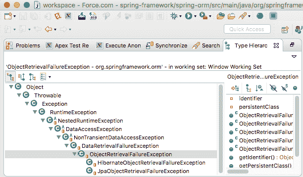

这看起来太复杂和过于抽象了，对吧？

与 Java 不同，Go 被设计为一种务实的语言，我们不会迷失在无限的继承层次和类型层次中。

当我们在一种非常强调类型层次、抽象层次和类继承的语言中实现解决方案时，我们的代码重构往往需要花费更多的时间。最好在开始编码之前就设计好。在实现 Java 解决方案时，利用设计模式可以节省大量时间。

继承在面向对象编程中创建了高耦合。在前面的例子中，`DataAccessException`类的更改可能会导致其上层的每个类中产生意想不到的副作用。

很容易理解为什么有人会认为在 Go 中没有设计模式的位置。

"如果 C++和 Java 关注类型层次和类型分类，那么 Go 关注组合。"

- Rob Pike

然而，通过谨慎使用抽象，软件设计模式可以完全与 Go 的可组合简单设计理念兼容。

### 讨厌 Java 的更多原因

考虑以下表格：

|  | **Java** | **Golang** |
| --- | --- | --- |
| **语言规范** (PDF) | 788 页 ([`docs.oracle.com/javase/specs/jls/se8/jls8.pdf`](https://docs.oracle.com/javase/specs/jls/se8/jls8.pdf)) | 89 页 ([`golang.org/ref/spec`](https://golang.org/ref/spec)) |
| **Java JDK 与 Go SDK** (压缩) | 279.59 MB ([`jdk.java.net/9/`](http://jdk.java.net/9/)) | 13 MB |
| **并发实现复杂性** | 困难 | 简单 |

以下是一个比较 Java 和 Go 技术栈的高层次图表：

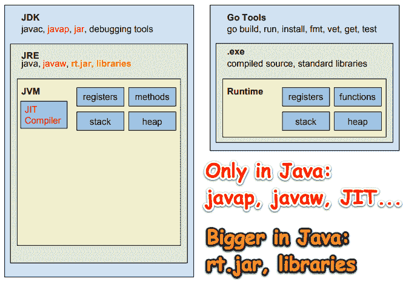

Java/JVM 的替代方案占用的空间更大；JVM 做了更多的事情（其中一些是你的应用程序会使用的），并且需要更多的 RAM。此外，由于 Java/JVM 解决方案的原始源代码比 Go 更多，这意味着对黑客进行攻击的攻击面更大。性能？JIT 编译器将应用程序的源代码转换为可执行二进制代码比 Go 需要更多的时间，因为 Go 是本地编译的。

Go 更小更简单。Java 是为了盈利而创建的，并且一直在积极营销。Go 没有市场营销。对于提出对 Go 语言的更改有一个简化的流程。请参见附录中的"How to Propose Changes To Go"。（我没有找到提出对 Java 或 JVM 的更改的流程，但我只能想象这需要更多的时间和精力）。

鉴于前面对 Go 和 Java 的比较，似乎可以归结为简单与复杂。Gophers 倾向于更喜欢简单。

"少即是多。"

- Rob Pike

### 深入挖掘错误处理

在 Java 中，当方法中发生异常时，创建异常对象并将其交给运行时环境的过程称为抛出异常。

当这种情况发生时，程序的正常流程会停止，JRE 会尝试在调用堆栈中找到一个可以处理引发异常的处理程序。

异常对象包含了大量的调试信息，比如异常发生的行号、异常类型、方法层次结构、调用堆栈等等。

由于对 Java 类型层次结构的设计和误解，Java 中存在着许多常见的异常处理反模式。

"不要只是检查错误，要优雅地处理它们。"

- Dave Cheney

与其断言错误是特定类型或值并传递到上一行，我们可以断言错误实现了特定的行为：

```go
type errorBehavior interface {
       Retryable() bool
}

func IsRetryable(err error) bool {
       eb, ok := err.(errorBehavior)
       return ok && eb.Retryable()
}
```

如果发生`IsRetryable`错误，那么调用者会知道他们可以重试生成错误的操作。调用者不需要导入实现抛出错误的库，并尝试理解其类型层次结构的复杂性来正确处理错误。

`github.com/pkg/errors`包允许您使用上下文包装错误，以便以后可以像这样恢复原因：

`func IsRetryable(err error) bool {`

`eb, ok := errors.Cause(err).(errorBehavior)`

`return ok && eb.Retryable()`

} 

一旦检查了错误值，就应该处理一次。在 Go 中，重新打包错误并将其抛出以供另一个处理程序处理并不被认为是最佳实践。

#### 一段对话- Java 开发者，惯用 Go 开发者，FP 开发者

Java 开发者：我讨厌到处写`if err != nil`。

Go 开发者：习惯就好了。

Java 开发者：为什么不直接抛出异常，让调用链上的处理程序处理呢？

Go 开发者：所有优秀的程序员都是懒惰的，那是额外的打字。

| **开发者** | **对话** |
| --- | --- |
| Java | 我讨厌到处写`if err != nil`。 |
| Go | 习惯就好了。 |
| Java | 为什么不直接抛出异常，让调用链上的处理程序处理呢？这样打字更少，所有优秀的程序员都是懒惰的，对吧？ |

| Go | 错误应该立即处理。如果我们的`buggyCode`函数返回错误，但我们继续处理会怎样？你能看出这是多么脆弱和错误吗？

```go
val, err := buggyCode()
// more code
return val, err
```

|

| FP | 关于抛出 Java 异常，最让我困扰的是，当我们将错误抛出给另一个函数处理时，我们刚刚创建了一个副作用。我们的函数不是纯的。我们在应用程序中引入了不确定性。由于调用堆栈中的任何调用者都可以处理异常，我们怎么知道哪个处理程序处理它？由于我们编写了最接近错误的代码，我们应该比任何其他开发人员更了解发生了什么以及如何最好地处理它。 |
| --- | --- |
| Java | 好的。我明白了，但我不仅懒惰，而且所有额外的`if err != nil`代码看起来像是我代码中的脚手架，让我想要呕吐。让我用几张照片澄清我的感受。 |

我们的代码：


| Java | 你能看出区别吗？ |
| --- | --- |
| Go | 理解了！但你需要意识到，我主要对编写后端系统感兴趣，正确性胜过美观。你可以拿你漂亮的 J2EE 企业业务应用程序，然后用尽可能多的异常处理程序包装它们。 |
| Java | 真的吗？你说你喜欢简单，但对我来说，更多的代码看起来更复杂。这意味着更多的代码需要维护。这意味着，我不能在一个地方处理所有的错误处理，而是必须在整个应用程序中插入一小段错误处理代码？该死！我非常喜欢 Go 的快速编译时间，Go 的小占用空间，编写并发应用程序的简易性等等。我非常沮丧。Go 中没有更好的错误处理解决方案吗？ |
| FP | 很高兴你问。根据你想要实现什么，有更好的方法。这种方式不仅可以让您在一个地方处理所有错误，而且还可以以纯 FP 的确定性处理。 |
| Go | 胡说八道。我现在会停止阅读这本书，因为这根本行不通。 |
| Java | 是的！有什么陷阱吗？ |
| FP | 该解决方案需要思考、时间和艰难的决定，但就像学骑自行车一样。一旦你上手了，你就会继续做。这很有趣，可以更有效地带你到达目的地，对你有好处。 |
| Java | 它叫什么？ |
| FP | 词法工作流解决方案 |
| Go | 你抓住我了。我还在阅读。只是足够长的时间来说，这是一个荒谬的说法，名字更是如此。 |
| FP | 我知道这听起来像魔术，而且确实是。它建立在更荒谬的名字上：Y-Combinator 和 Monad。但在讨论细节之前，我们还有很长的路要走。这需要思考、时间和决策能力。 |
| Java | 有什么需要决定的吗？如果它有效，我会使用它。 |
| FP | 词法工作流解决方案的最佳用例是您有要转换的数据。您是否有任何工作流程，其中您输入数据，以某种方式进行转换，然后产生输出？这涵盖了许多业务用例场景，也包括一些系统级别的用例。 |
| Java | 听起来不错。它是做什么的，又不是做什么的？ |
| FP | 它处理您遇到错误时的典型工作流用例，该错误被处理并且在该工作流程中不会发生进一步处理。如果您希望即使出现错误也要继续处理，那么最好使用 applicative functors。如果 Go 支持 TCO，那将为许多 FP 可能性打开大门。目前，我们需要保持现实（不用担心递归的堆栈溢出或性能影响）。如果/当 Go 支持 TCO 时，我们 FP 编码人员将能够释放大量强大、富有表现力和高性能的 FP 解决方案。 |

## 软件设计方法论

软件设计是我们：

+   收集需求

+   从需求创建规格说明

+   根据规格说明实施解决方案

+   审查结果并迭代改进解决方案

传统的瀑布式开发依赖于对产品需求的完美理解以及在每个阶段执行最小的错误。来源：[`scrumreferencecard.com/scrum-reference-card/`](http://scrumreferencecard.com/scrum-reference-card/)

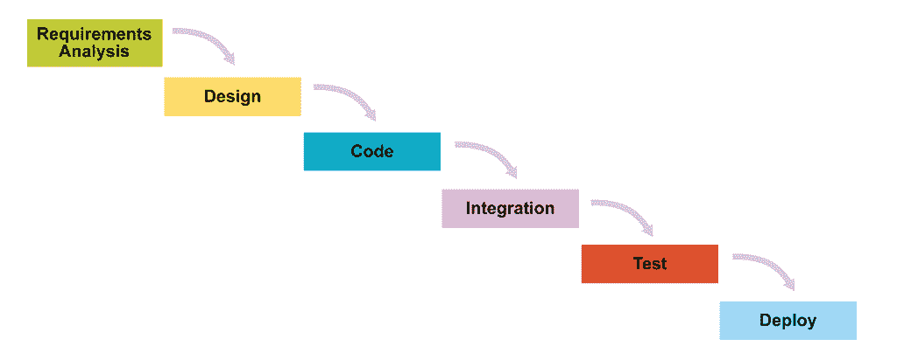

Scrum 将所有开发活动融合到每个迭代中，以适应在固定间隔内发现的现实情况：

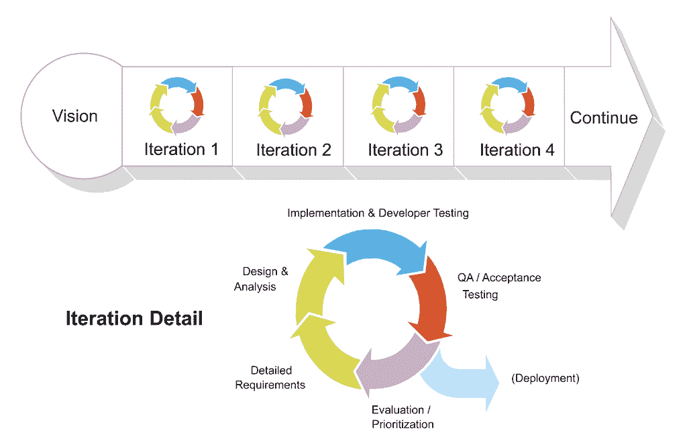

来源：[`scrumreferencecard.com/scrum-reference-card/`](http://scrumreferencecard.com/scrum-reference-card/)

在创建规格说明的过程中，通常会创建诸如**统一标记语言**（**UML**）图表之类的工件，以帮助我们思考问题并制定可行的解决方案。

分析是我们对现实世界操作进行建模，将部分分解为组件。设计是我们根据分析工作、我们的 IT 环境以及我们可以使用的框架/技术堆栈来制定软件解决方案的地方。

我们抽象出所有与问题无关的问题。因此，在分析和设计过程中，我们将问题分解成简单的组件。

实施是当我们将这些简单的事情重新组合在一起时。

### 良好的设计

良好的设计在长期节省资金。

如果我们的项目很小，上市时间的价值很高，那么我们可以跳过设计过程。否则，我们应该努力进行适当的软件设计。这是一个普遍的真理，无论技术如何（Java、Go 等）。

### 糟糕的设计

如果我们的应用架构图看起来像下面的图表，那么我们设计应用程序失败了：

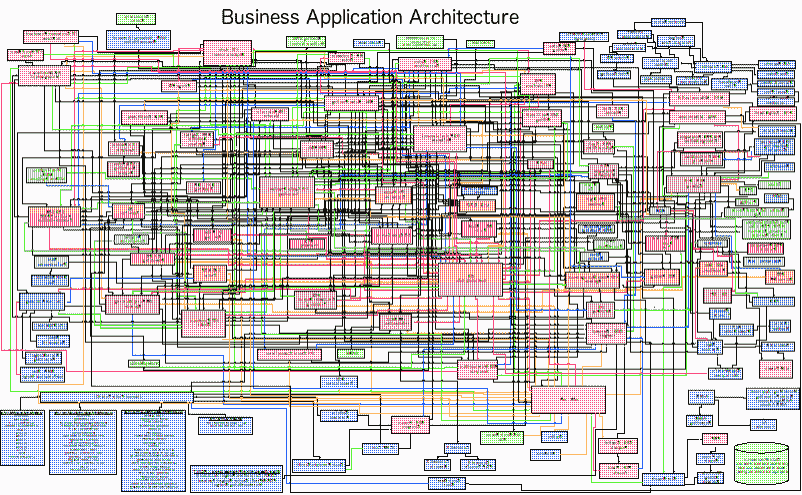

简单并不容易，但值得努力。

我们给已经复杂的系统添加功能，它就会变得更加复杂。

在这样的系统中，我们不能一次只考虑一件事；我们必须一起考虑所有可能破坏我们系统的奇怪交互。

#### 随着时间的推移，好的设计与坏的设计

以下图表描述了随着时间的推移，良好设计的价值。与大多数图表一样，*x*轴表示时间的推移。我们在*y*轴上走得越高，我们的应用程序的功能和特性就越丰富。在**设计回报线**以下，没有设计或设计不良的应用程序可以迅速产生结果。

然而，缺乏设计会使应用程序变得脆弱、不可扩展且难以理解：

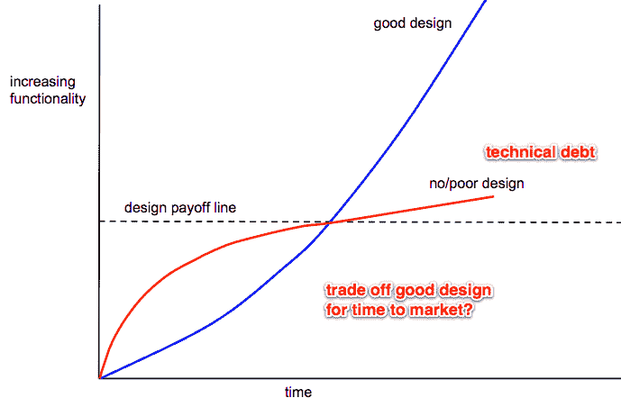

经过适当设计的应用程序可以轻松扩展，并且从长远来看更易于维护。

“超过 90%的软件成本发生在维护阶段。”

- 弗雷德·布鲁克斯，《神话般的程序员月度》

## SOLID 设计原则

**面向对象编程**（**OOP**）的 SOLID 设计原则适用于设计 Go 软件解决方案。

### 单一职责原则

单一职责原则说，*只做一件事，并且做得很好*。我们在 Go 标准库中看到了 SRP 的运作。以下是一些例子：

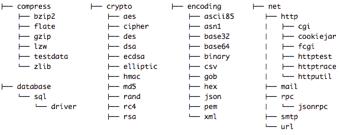

如果一个拉取请求增强了`aes/crypto`包，你会期望那段代码合并会影响`database/sql/driver`包（或任何包）的功能吗？不会。当然不会。每个包都有明确定义的名称空间和高度内聚；它们执行特定的任务，不会涉及其他问题。

“一个类应该只有一个原因来进行更改。”

- 罗伯特 C·马丁

当马丁先生说一个类只应该有一个更改原因时，显然他是在谈论 OOP 设计，但同样的原则也适用于我们的 Go 应用程序。税收计算更新是否会影响用户界面或任何报告的布局，而不仅仅是显示不同的金额？不会。为什么？因为一个是化妆品的性质，另一个不是。这是两个应该由不同的、松散耦合的类/模块处理的不同责任。

我们的类/模块应该高度内聚，尽可能扮演特定的角色。具有单一职责的代码可以更好地处理变化的需求，而不会对应用程序的其他部分产生不利影响。如果我们有一个更改类/模块的请求，由于它只做一件事情，那么更改的原因只能与它的一个责任有关。

SRP 的应用将使我们的设计朝着越来越小的接口发展。最终，我们将到达最终接口。只有一个方法的接口。例如，在第五章中，*使用装饰添加功能*，我们将看到 Go 的互补 Reader 和 Writer 接口：

```go
type Reader interface {
   Read(p []byte) (n int, err error)
}
type Writer interface {
   Write(p []byte) (n int, err error)
}
```

SRP 对 FP 的意义与 Unix 哲学一致。

“尽管这种哲学无法用一句话写出来，但它的核心思想是系统的力量更多来自程序之间的关系，而不是程序本身。许多 UNIX 程序在孤立状态下做的事情相当琐碎，但与其他程序结合起来，成为通用且有用的工具。”

- 罗布·派克

在λ演算中，每个函数都只有一个参数。它可能看起来像我们的纯函数接受多个参数，但实际上它只是对参数进行柯里化。我们的函数接受列表中的第一个参数，并返回一个接受其余参数的函数；它继续处理每个参数，直到它们全部被消耗。函数组合仅在每个函数只接受一个参数时有效。

```go
three := add(1, 2)
func add1 := + 1
three == add1(2)
```

这是当我们进行柯里化时发生的伪代码。它将一个两个参数的调用转换为一个参数的调用。柯里化存储数据（数字 1）和操作（加法运算符）以供以后使用。这与 OOP 中的对象有什么相似之处？

#### 函数组合

函数组合是将两个较小的函数组合成一个新函数的过程，以实现与两个较小函数相同目标的新函数。两种方式都可以将我们从`a`到`c`。下面，`f[1]`接受`a`并返回`b`。`f[2]`接受`b`并返回`c`。我们可以组合/合并这两个函数，并得到一个接受`a`并返回`c`的单个函数：

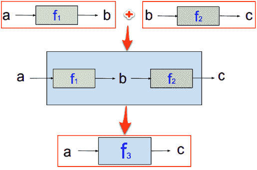

函数组合是纯 FP 的基石；它允许我们从较小的抽象中构建更大的抽象。

### 开放/封闭原则

软件应该对扩展开放，但对修改关闭。在结构体中嵌入字段允许我们用另一个类型扩展一个类型。嵌入其他类型（`Car`）的对象（`CarWithSpare`）可以访问其字段和方法。`CarWithSpare`对象可以调用`Car`方法，但不能修改`Car`对象的方法。因此，Go 的类型虽然是*对扩展开放*，但是*对修改关闭*。让我们看一个例子：

```go
package car

import "fmt"

type Car struct {
   Make string
   Model string
}
func (c Car) Tires() int { return 4 }
func (c Car) PrintInfo() {
   fmt.Printf("%v has %d tires\n", c, c.Tires())
}
```

我们定义了我们的`Car`类型和两种方法，`Tires`和`PrintInfo`。接下来，我们将定义我们的`CarWithSpare`类型，并将`Car`类型作为未命名字段嵌入其中：

```go
type CarWithSpare struct {
   Car
}
func (o CarWithSpare) Tires() int { return 5 }
```

在我们的`main.go`文件中，我们创建了一辆本田雅阁，并调用了它的`PrintInfo`方法。预期返回`4`个轮胎。

接下来，我们创建了一辆丰田高地人，但当我们打印它的信息时，它打印出`4`个轮胎，而不是`5`。为什么？

```go
package main

import (
   . "car"
 "fmt"
)

func main() {
   accord := Car{"Honda", "Accord"}
   accord.PrintInfo()
   highlander := CarWithSpare{Car{"Toyota", "Highlander"}}
   highlander.PrintInfo()
   fmt.Printf("%v has %d tires", highlander.Car, highlander.Tires())
}
```

以下是输出：

```go
{Honda Accord} has 4 tires
{Toyota Highlander} has 4 tires
{Toyota Highlander} has 5 tires
```

这是因为`PrintInfo`是`Car`的一个方法，但由于`CarWithSpare`缺少该方法，当我们调用`highlander.PrintInfo`时，实际上执行的是`Car`的方法（而不是`CarWithSpare`）。

为了打印出我们的高地人实际的轮胎数量，我们必须通过在`fmt.Printf`语句中直接执行`highlander.Tires`来手动委托调用。

我们有其他选择吗？有。我们可以覆盖`PrintInfo`方法。换句话说，我们可以为我们的`CarWithSpare`定义一个`PrintInfo`方法，如下所示：

```go
func (c CarWithSpare) PrintInfo() {
   fmt.Printf("%v has %d tires\n", c, c.Tires())
}
```

以下是输出：

```go
{Honda Accord} has 4 tires
{Toyota Highlander} has 5 tires
{Toyota Highlander} has 5 tires
```

如果我们再次调用`accord.PrintInfo()`会发生什么？我们会得到以下输出：

```go
{Honda Accord} has 4 tires
```

因此，Go 允许我们：

+   隐式调用嵌入对象的方法（如果未定义）

+   手动委托调用我们对象的方法

+   覆盖嵌入对象的方法

方法重载呢？

不允许。如果我们尝试创建另一个具有不同参数签名的`PrintInfo`方法，Go 将抛出编译器错误：

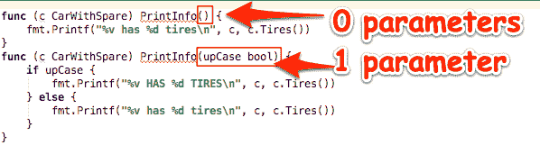

在下一章中使用装饰器模式，我们将看到如何在不修改现有代码的情况下扩展功能。

#### 函数式编程中的开放/封闭原则

与我们之前的 Go 示例类似，在基本类型（`Car`）中添加了一个新方法（`PrintInfo`），纯函数式编程语言也可以在不重新编译现有代码的情况下向现有数据类型添加新函数，并保持静态类型安全性。

*表达式问题*，也称为*可扩展性问题*，解决了软件语言能够以类型安全的方式向程序添加新方法和类型的能力。有关详细信息，请参见**特征导向软件开发**（**FOSD**）程序立方体，其中基本程序（在称为**软件产品线**的相关程序系列中）（[`softwareproductlines.com/`](http://softwareproductlines.com/)）逐步增加功能，以生成复杂程序。

以下图表显示了如何通过组合特性中的模型，然后将这些模型转换为可执行文件来构建程序：

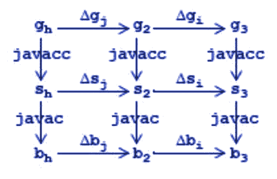

FOSD 方法论主张，复杂系统可以通过逐步添加特性来构建，其中领域模型是函数和常量，程序则表示为表达式，可以生成执行特定任务的程序。

#### FantasyLand JavaScript 规范

`FantasyLand`项目规定了常见代数结构的互操作性：

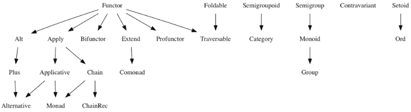

层次图中的每个数据类型都称为代数数据类型，因为每个都由代数组成，即一组值、一组它所闭合的运算符以及它必须遵守的规则。

让我们来看一个简单的例子，Setoid。

##### Setoid 代数

以下是 Setoid 的规则：

| **规则名称** | **描述** |
| --- | --- |
| 自反性 | `a.equals(a) === true` |
| 对称性 | `a.equals(b) === b.equals(a)` |
| 传递性 | 如果`a.equals(b)`和`b.equals(c)`，那么`a.equals(c)` |
|  | 如果`b`不是相同的`Ord`，`lte`的行为是未指定的（建议返回 false）。`lte`必须返回一个布尔值（`true`或`false`）。 |

规则中使用的值是`a`、`b`和`c`。具有`Ord`的值必须提供一个`lte`方法。equals 方法是这个代数的运算符，它接受一个参数。

就是这样。就是这么简单！

##### Ord 代数

以下是`Ord`的规则：

| **规则名称** | **描述** |
| --- | --- |
| 全面性 | `a.lte(b)`或`b.lte(a)` |
| 反对称性 | 如果`a.lte(b)`和`b.lte(a)`，那么`a.equals(b)` |
| 传递性 | 如果`a.lte(b)`和`b.lte(c)`，那么`a.lte(c)` |
|  | `b`必须是与`a`相同的`Ord`的值。如果`b`不是相同的 Setoid，则 equals 的行为是未指定的（建议返回 false）。`equals`变量必须返回一个布尔值（`true`或`false`）。 |

规则中使用的值是`a`、`b`和`c`。具有 Setoid 的值必须提供一个`lte`方法。`lte`方法是这个代数的运算符，它接受一个参数。

从前面的图表中，我们可以看到`Ord`是一个 Setoid，所以`Ord`有一个`Equals`运算符，`Ord`必须遵守 Setoid 的规则，以及它自己的规则。

在我们的书中，我们将探讨 Haskell 的类型类层次结构，并研究 Functor、Monoid 和 Monad 代数。

#### 表达式问题

不同的语言以不同的方式解决表达式问题：

+   开放类

+   多方法

+   函子的余积

+   类型类

+   对象代数

它们解决的问题与我们在`CarWithSpare`示例中看到的问题相同；它关于如何在不必重新编译现有代码的情况下对现有数据类型添加新函数，并保持静态类型安全。

Go 对表达式问题有基本的支持。类型类、对象代数等不是 Go 标准库的一部分，但我们可以构建任何上述解决方案。这是一个很好的开始：[`github.com/SimonRichardson/wishful`](https://github.com/SimonRichardson/wishful)。

### Liskov 替换原则

用面向对象的术语来说，*Liskov 替换原则*表示相同类型或子类型的对象应该可以被替换，而不影响调用者。换句话说，当我们实现一个接口时，我们的类应该实现接口中定义的所有方法，并满足所有接口要求。简而言之，*满足接口契约*。

编译器将强制执行我们的方法具有正确的签名。LSP 更进一步要求我们的实现也应该具有与超类或接口的文档中陈述或暗示的相同的不变量、后置条件和其他属性。

#### 这个面向对象的方法很糟糕

这就是面向对象编程世界中方法契约的样子：

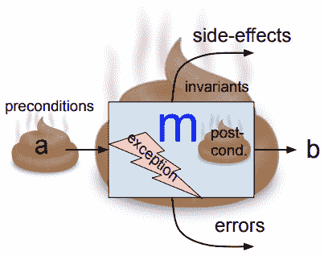

我们的方法`m`接收一个`a`，进行一些处理并返回`b`。可能会发生异常，可能会被捕获和处理，也可能会返回错误。此外，为了使方法正确满足其契约，我们需要阅读文档（当然，文档总是完全准确和最新的……不是！）希望我们涵盖所有的前置条件、不变量和后置条件。

**不变量** 是方法的整个生命周期中必须始终为真的东西。例如，如果我们的类有一个持续时间成员变量，那个值必须始终是一个正浮点数。另一个例子可能是，我们的内部纬度和经度值必须始终在北半球。我们可以进一步编写不变量验证器私有方法，以确保我们的不变量符合其可接受值范围。

**前置条件** 是我们的方法在调用时必须为真的东西。例如，在执行我们的 `consummateMarriage` 方法之前，我们应该确保我们选择的 `wouldBeSpouse` 没有已经与他人结婚；否则，我们很可能会违反我们州的反多配偶制度。我们可能会通过执行另一个 `verifyPersonIsSingle` 方法来进行检查。

别忘了 **后置条件**。一个例子可能是：在执行我们的 `consummateMarriage` 方法之后，我们应该确保我们与之完婚的人实际上是我们结婚证书上的同一个人。与错误的人结婚可能会引发各种问题。

最后要处理的问题是 *副作用*。副作用是指当我们的方法改变除了它输出的 **b**（或错误）之外的东西时发生的情况。例如，如果我们的后置条件检查导致了私人调查公司的信用卡扣款，那么这个扣款就是一个副作用。

#### 我们的函数式编程函数闻起来像玫瑰

这是我们在函数式编程世界中的函数契约是什么样子的：

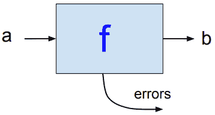

看到区别了吗？我们几乎能闻到区别！嘿，等一下！（面向对象的程序员可能会想...）

这个纯函数缺少一些东西！这是一个不公平的比较！

没错。这不公平，但这是现实。

而使它变得真实的是我们的输入类型。

#### 在函数式编程中，契约不会说谎

让我们看一个命令式代码的例子：

```go
type Dividend struct {
   Val int
}
func (n Dividend) Divide(divisor int) int {
   return n.Val/divisor
}

func main() {
   d := Dividend{2}
   fmt.Printf("%d", d.Divide(0))
}
```

在上述代码中，我们的契约是什么？

契约就是我们方法的签名：`func (n Dividend) Divide(divisor int) int`

我们的契约必须回答哪三个问题？

1.  我们的契约期望什么？

+   答案：它期望以下内容：

+   `Dividend.Val` 要填充一个 `int`

+   被除数是一个 `int`

1.  我们的契约保证了什么？

+   答案：它承诺返回一个整数

1.  契约维护什么？

+   答案：在这种简单情况下不适用

当我们运行上述代码时会发生什么？

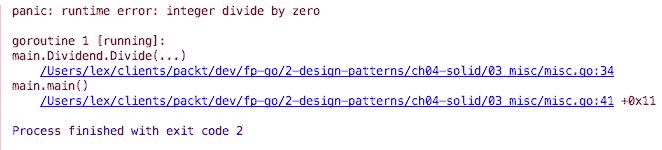

我们得到了一个运行时恐慌！我们的契约是否成立，还是对我们说谎了？


在纯函数式编程中，我们不依赖于像 int、char 或者 string 这样低级的类型。我们利用了一个令人惊叹的类型类系统的全部威力。

在像 Haskell 这样的纯函数式语言中，我们可以定义一个 `PostiveInt` 类型。因此，我们不需要编写一个验证输入参数是否为正数的方法，而是定义一个名为 `PostiveInt` 的类型，它保证只有正整数会被输入：

```go
PositiveInt :: Int -> Maybe Positive
PositiveInt n = if (n < 0) then Nothing else Just (Positive n)
```

在函数式编程术语中，LSP 表示，*契约不会说谎*；


在函数式编程中，我们不必依赖于我们的测试套件来验证我们的应用程序是否正确地执行了它的要求。在函数式编程中，假设我们已经正确地设计了我们的软件，如果它编译通过，那么它就是正确的。我们让我们的类型系统来执行我们的要求。

在面向对象的追求关系中，输入（候选配偶）只被验证为女性。当我们后来发现她不是合适的类型的女人时，也就是说，她已经结婚了，那将使婚姻契约无效。

这就是当我们没有正确地对输入进行类型检查时会发生的情况：

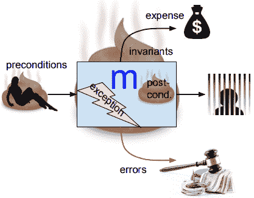

这是我们使用纯函数式编程时的情况：

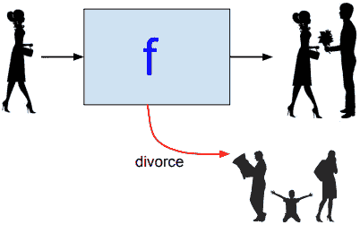

看起来很简单，但是外部交互在哪里，比如可能导致离婚的姻亲？孩子呢？他们不就是我们可能称之为婚姻的副作用吗？

单子提供了一种让我们的夫妇与外部世界互动的方式；处理可能有害的影响并产生美丽的副作用。它看起来像这样：

！[](img/388f97d1-8e42-4bc1-800d-eaab913cdd74.png)

单子的诀窍在于所有外部交互都被包含在内（在盒子里）。我们将在最后一章深入讨论单子。

这本书是关于在 Go 中学习*函数*编程的。因此，我们将全面理解术语*函数*的含义。函数不仅意味着*纯*。如果我们使用函数，我们就是在进行函数式编程。Go 是一种多范式语言，不强迫我们完全纯粹或完全命令式。如今绝大多数 Go 代码都是命令式的...以标准库为例。实现纯函数式编程技术有其时机和场合。我们越了解 Go 的所有函数能力和纯函数式编程概念，我们就越能够谨慎地应用适当的编码风格来满足我们的应用开发需求。

让我们看看鸭子类型示例中的 LSP 的工作。

#### 鸭子类型

Go 没有继承或子类型，但我们有接口。实现接口方法的函数隐式满足接口合同。

Go 支持所谓的**鸭子类型**。如果它走起来像鸭子，叫起来像鸭子，那么它就是鸭子。换句话说，如果我们有一个具有实现 Duck 接口的方法的 Go 结构体，也就是说，如果它有`Walk()`和`Quack()`方法，那么在所有意图和目的上，我们的结构体就是一只鸭子。

在面向对象的语言中，比如 Java，我们会被诱惑设计我们的鸭子如下。

#### 继承可能出现什么问题？

我们被告知鸭子可以走路和呱呱叫。因此，我们在我们的父类中实现了这些行为，即`Duck`：

！[](img/d8043e18-a4e1-416a-99e9-0f5f89fae01a.png)！[](img/77ddb2f7-0c9e-41a0-841c-725d1269d4b5.png)

我们从`Mallard`和`BlueBilled`鸭子开始。我们能够通过继承重用`walk()`和`quack()`方法。

接下来，我们听说鸭子可以飞。因此，我们在我们的`Duck`类中实现飞行行为，所有子类都继承了这种新行为：

！[](img/66326981-6c3b-4519-8e8a-bf44d140669b.png)

一切都很好，直到我们将`Pekins`鸭子加入我们的群体。

我们在原始设计中没有考虑到的问题是，大多数国内饲养的鸭子不能飞行：

！[](img/1035156e-db0e-485e-b1a2-cd2fc956fd05.png)！[](img/28bc566a-6b96-490f-8641-8b909a4c9c82.png)

对我们来说，这种设计缺陷甚至在 Go 中都不可能发生！

我们通过使用接口来模拟 Go 中的行为（Go 不支持继承）。

#### 接口隔离原则

最好有很多单一用途的接口，而不是一个通用接口。我们的 API 不应该接受它不需要的结构的引用，反之亦然，我们的客户端实现不应该依赖于它不使用的代码。

我们很快就会在我们的 Viva La Duck 代码示例中看到这一点，以独立的`EatBehavior`和`StrokeBehavior`接口的形式。

当我们严格应用集成隔离原则时，我们最终得到了只有一个方法的接口。这样的对象代表了具有行为的数据，但它也可以被建模为具有数据的行为，这就是 FP 中闭包的作用。

这是另一个地方，如果 Go 支持泛型将会很好。为什么要创建处理`Int`类型、`Customers`或`AvailableWomen`切片的样板代码，当一个`T`的枚举就可以工作（代码更少）？

#### 依赖反转原则

**依赖反转原则**（**DIP**）指出我们应该依赖于抽象，而不是具体实现。DIP 是关于从我们的代码中移除硬编码的依赖关系。

例如，以下代码违反了 DIP：

```go
import "theirpkg"

func MyFunction(t *theirpkg.AType)

func MyOtherFunction(i theirpkg.AnInterface)
```

`MyOtherFunction`函数并不像`MyFunction`函数那样糟糕，但两种实现都将我们的实现与另一个包的类型和接口耦合在一起。

一般来说，良好的软件设计依赖于高内聚性，我们编写的函数只做一件事，并且做得很好，并且松散耦合。

在纯函数式编程中，通过传递部分应用的函数来实现依赖注入。有些人称之为*好莱坞原则*，就像是，“不要打电话给我们，我们会打电话给你”。在 JavaScript 中，这通常是使用回调来实现的。

请注意，回调和继续之间存在微妙的区别。回调函数可能在应用程序的流程中被多次调用，每次它们都会返回一个结果，处理会继续进行。当一个函数调用另一个函数作为其最后一件事时，第二个函数被称为第一个函数的继续。

## 大揭示

单子链继续。

还记得本章前面*Fantasy Land*代数的层次图中的单子吗？

我们将在本书的最后一个单元中更多地讨论单子，但现在让我们来看一下整体情况。

之前我们看到了函数的组合：

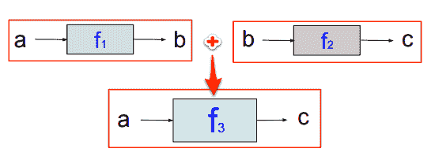

这实际上是一个问题，因为这不是一个单子。单子看起来像这样：


这就是大揭示。单子是紫色的！

哈。抓住你了！

除了颜色，你还能看到单子函数和上面的函数之间的不同之处吗？

那么**a**进入和**a**出来怎么办？这意味着如果单子接受类型为**A**的参数（按照惯例，小写**a**变量是类型 A 的值），那么它将产生另一个**a**值。

猜猜那叫什么？当我们的函数返回与其输入相同的类型时？我们称之为*端态*，其中*en*表示*相同*，*morphism*表示*函数*；因此，它从**a**变为**a**。简单。

在*单子链继续*语句中使用的*链*一词是什么意思？

一个漂亮的单子紫色链函数呢？

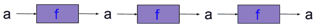

这个紫色单子链还有什么其他信息？

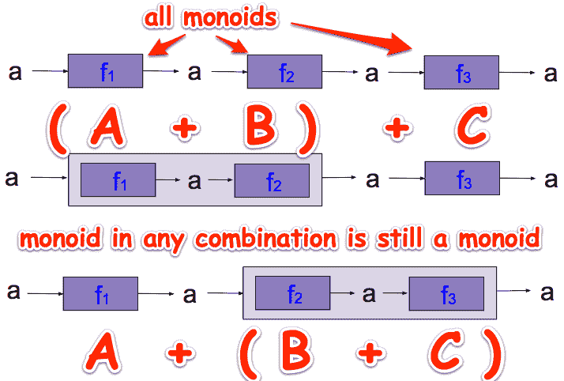

如果所有函数都是单子，那么我们可以以任何顺序组合它们（结合律规则）。

很好，但是我们可以用单子链做些什么？我们可以并行运行这些进程吗？

并行运行？嗯，这取决于我们正在处理什么。许多事情可以并行运行。

理论上是可以的，但在实践中，我们需要处理与其他 Map/Reduce 解决方案（如 Hadoop）相同的考虑。

### MapReduce

**MapReduce**是一种将大型数据集拆分为许多较小数据集的技术。每个小数据集都在不同的服务器上分别进行处理，然后将结果收集和聚合以产生最终结果。

它是如何工作的？

假设我们有很多网络服务器，我们想要确定它们所有的顶部请求页面。我们可以分析网络服务器访问日志，找到所有请求的 URL，对其进行计数，并对结果进行排序。

以下是 MapReduce 的良好用例：

+   从服务器收集统计信息，例如前 10 个用户，前 10 个请求的 URL

+   计算数据中所有关键字的频率

以下是不适合 MapReduce 的用例：

+   需要共享状态的作业

+   查找单个记录

+   小数据

#### MapReduce 示例

假设我们有一个 Apache 网络服务器访问日志文件，其中的条目看起来像这样：

```go
198.0.200.105 - - [14/Jan/2014:09:36:51 -0800] "GET /example.com/music/js/main.js HTTP/1.1" 200 614 "http://www.example.com/music/" "Mozilla/5.0 (Macintosh; Intel Mac OS X 10_9_1) AppleWebKit/537.36 (KHTML, like Gecko) Chrome/31.0.1650.63 Safari/537.36"
```

如果我们想知道前 5 个最常访问的 JSON 文件呢？

我们可以直接从终端使用标准的 Unix 字符串处理命令执行 MapReduce：

```go
$ cat access10k.log | while read line; do echo "$line" | awk '{print $7}' | grep "\.json";done | sort | uniq -c | sort -nr
 234 /example.com/music/data/artist.json
 232 /example.com/music/data/songs.json
 227 /example.com/music/data/influencers.json
  28 /example.com/music-no-links/data/songs.json
  28 /example.com/music-no-links/data/influencers.json
  28 /example.com/music-no-links/data/artist.json
   8 /example.com/music/data/influencers2.json
```

这对几千行来说效果很好。如果我们在最后一个命令前面输入`time`，我们会得到以下类似的结果：

```go
real 1m3.932s
user 0m38.125s
sys 0m42.863s
```

但是如果每个服务器有数百万行代码，而我们有很多服务器呢？

是时候进行 MapReduce 了！

在每个服务器上，我们可以执行我们的映射；将日志文件条目作为输入，产生一组键值对：

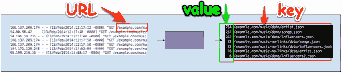

接下来，我们将从每个服务器的每个中间结果中提取数据，并将它们馈送到我们的`reduce`函数中，然后输出结果：

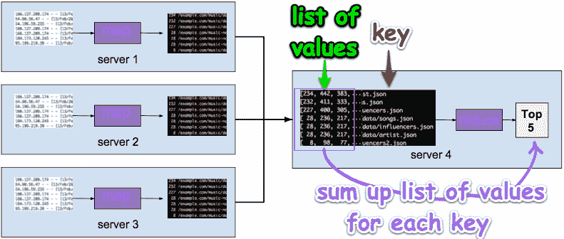

我们的前 5 个最常请求的 JSON 文件可能是这样的：

```go
85733 /example.com/music/data/artist.json
71938 /example.com/music/data/songs.json
57837 /example.com/music/data/influencers.json
17500 /example.com/music-no-links/data/songs.json
17500 /example.com/music-no-links/data/influencers.json
```

我们可以从这个例子中得到什么？看起来 MapReduce 的好候选包括以下用例：

+   我们有如此多的数据，如果在一个服务器上顺序运行所有数据将花费太长时间

+   我们的输出，来自`map`阶段，包括一系列键值对

+   我们可以独立运行每个`map`或`reduce`函数，知道我们函数的输出仅依赖于其输入

但这里还有什么其他可能不太明显的事情？

还有什么使 Map/Reduce 工作的过程？

FP 模式在阴影中潜伏着什么？（提示：我们已经看到了它，它与数据类型有关。）

### Monad 还能做什么？

Monad 可以用来清晰地传达我们的业务逻辑，并管理我们应用程序的处理流程等。


你知道我在说什么。考虑以下代码片段：

```go
if err != nil {
   return nil, fmt.Errorf("%s:%d: %v", sourceFile, sourceLine, err)
}
```

那些`if err != nil`块遍布我们的代码，并且遮蔽了我们代码的原始意图。如果这是我们的正常路径代码：

```go
happy path code
```

在我们添加错误检查之后，它看起来是这样的：

```go
add error checking
```

猜猜我们的 FP 代码在包含错误处理后会是什么样子？

```go
FP code including error handling
```

这怎么可能？没有内联错误检查？我们将在第九章中涵盖这个主题，*函子、单子和泛型*。

## Viva La Duck

我们的下一个代码示例将说明我们的 Go 实现应用了几个 SOLID 设计原则。

在我们的 Viva La Duck 应用程序中，我们的鸭子必须访问许多池塘寻找要吃的虫子。为了保持简单，我们假设每一次划水都需要鸭子吃一只虫子。每次鸭子划动脚（一次划水），鸭子的划水次数就会减少一次。

我们不关心鸭子如何从一个池塘到另一个池塘，而是鸭子必须划多少次才能穿过池塘的长度。如果池塘有虫子吃，它们将在池塘的另一边找到。如果鸭子耗尽了能量，它就会死去。

我们的程序是一个独立的可运行的 Go 源文件。它的包名是`main`，并且有一个`main()`函数。我们将在以后使用`DASHES`常量，用于打印每个池塘中鸭子遇到的统计信息。

`Pond`结构包含了每个池塘的状态，即鸭子要吃的虫子数量以及穿过池塘所需的划水次数：

```go
package main

import (
       "fmt"
 "errors"
 "log"
)
const DASHES = "----------------------"

type Pond struct {
       BugSupply       int
       StrokesRequired int
}
```

我们应该做的第一件事之一是以简单接口的形式定义我们系统的行为。我们应该考虑如何将我们的接口嵌入到更大的一组接口中，因为我们组合我们系统的行为模式。按照能力对事物进行分类是有意义的，因为事物是由其行为定义的。

由于这是一本关于函数式编程的书，现在是时候提到使用接口的一个主要好处了，那就是它们允许我们将应用程序的函数分组，以模拟现实生活中的行为：

```go
type StrokeBehavior interface {
       PaddleFoot(strokeSupply *int)
}

type EatBehavior interface {
       EatBug(strokeSupply *int)
}
```

每个接口（`StrokeBehavior`和`EatBehavior`）代表了一个细粒度、明确定义的行为。将系统分解成小部分将使我们的应用程序更加灵活和更容易组合：

```go
type SurvivalBehaviors interface {
       StrokeBehavior
       EatBehavior
}
```

通过声明小而单一目的的接口，我们现在可以自由地将它们嵌入到新的、更丰富功能的接口中。

将接口分组是我们可以在 Go 标准库中找到的常见模式。例如，在`httputil`包中，我们找到以下内容：

`type writeFlusher interface {`

`io.Writer`

`http.Flusher`

`}`

接下来，我们定义我们的鸭子。我们的鸭子是无状态的，没有字段：

```go
type Duck struct{}
```

我们为我们的鸭子定义了两种方法。接收器`Duck`必须在与我们的方法`Stroke`相同的包中定义。由于我们只使用了一个主包，这不是问题。

在模拟现实世界之后，我们定义了一个`Foot`结构和一个`PaddleFoot`方法。每当我们的鸭子划动它的脚时，我们都会减少我们鸭子的“划水次数”类型：

```go
type Foot struct{}
func (Foot) PaddleFoot(strokeSupply *int) {
       fmt.Println("- Foot, paddle!")
       *strokeSupply--
}
```

类似地，我们定义了一个`Bill`类型及其`EatBug`方法，它增加了我们鸭子的“划水次数”类型。

```go
type Bill struct{}
func (Bill) EatBug(strokeSupply *int) {
       *strokeSupply++
       fmt.Println("- Bill, eat a bug!")
}
```

对于每一次划水，我们的鸭子都会划动它的脚。

如果鸭子耗尽能量并被困在池塘中，我们的`Stroke`方法将返回一个错误：

```go
func (Duck) Stroke(s StrokeBehavior, strokeSupply *int, p Pond) (err error) {
       for i := 0; i < p.StrokesRequired; i++ {
              if *strokeSupply < p.StrokesRequired - i {
                     err = errors.New("Our duck died!")
              }
              s.PaddleFoot(strokeSupply)
       }
       return err
}
```

现在，我们定义我们鸭子的吃东西行为。当我们的鸭子到达池塘的尽头时，它可以吃掉池塘里的所有虫子：

```go
func (Duck) Eat(e EatBehavior, strokeSupply *int, p Pond) {
       for i := 0; i < p.BugSupply; i++ {
              e.EatBug(strokeSupply)
       }
}
```

`SwimAndEat`方法的签名与`Eat`和`Stroke`方法略有不同。注意到了吗？

所有三种方法都有一个`Duck`作为它们的接收器，但是`SwimAndEat`方法定义了变量`d`。这是因为我们需要在`SwimAndEat`方法中引用`Stroke`和`Eat`方法。

此外，它们都将一个接口作为它们的第一个参数，但是`SwimAndEat`将一个组合的接口集合，即`StrokeAndEatBehaviors`，作为它的第一个参数，它在`Stroke`和`Eat`中使用多态：

```go
func (d Duck) SwimAndEat(se SurvivalBehaviors, strokeSupply *int, ponds []Pond) {
       for i := range ponds {
              pond := &ponds[i]
              err := d.Stroke(se, strokeSupply, *pond)
              if err != nil {
                     log.Fatal(err)  // the duck died!
 }
              d.Eat(se, strokeSupply, *pond)
       }
}
```

### 通过值传递还是引用传递？

这是一个经验法则——如果你想共享一个状态，那么通过引用传递，也就是使用指针类型；否则，通过值传递。由于我们需要在这个“划水”方法中更新我们鸭子的“划水次数”类型，我们将其作为`int`指针（*int）传递。因此，只有在绝对必要时才传递指针参数。我们应该开始进行防御性编码，假设有人可能尝试同时运行我们的代码。当我们通过值传递参数时，可以安全地进行并发使用。当我们通过引用传递时，可能需要添加`sync.mutex`或一些通道来协调并发。

我们的鸭子通过吃更多从池塘中获得的虫子来恢复能量：

```go
func (Duck) Eat(e EatBehavior, strokeSupply *int, p Pond) {
       for i := 0; i < p.BugSupply; i++ {
              e.EatBug(strokeSupply)
       }
}
```

由于我们正在设计我们的软件应用程序来模拟现实世界，鸭脚和鸭嘴等事物是代表真实物体的结构名称的自然候选者。脚用于划水，鸭嘴用于吃虫子。每一次划水，也就是“划”，都会减少我们鸭子的可能划水次数。每只虫子值一次划水。

我们告诉我们鸭子的脚划水。只要鸭子有能量，也就是说，它的“划水次数”类型大于零，鸭子就会服从。但是，如果“划水次数”为零，那么我们的鸭子在到达下一批要吃的虫子之前将被困在池塘中：

```go
type Foot struct{}
func (Foot) PaddleFoot(strokeSupply *int) {
       fmt.Println("- Foot, paddle!")
       *strokeSupply--
}
```

注意，我们正在传递一个指向我们划水次数的指针。这意味着我们的应用程序正在维护一个状态。我们知道纯函数式编程不允许变量突变。这没关系，因为本章是关于使用 Go 进行良好软件设计的。Go 中的纯函数式编程在第一章中有介绍，“Go 中的纯函数式编程”：

```go
type Bill struct{}
func (Bill) EatBug(strokeSupply *int) {
       *strokeSupply++
       fmt.Println("- Bill, eat a bug!")
}
```

对于我们的鸭子遇到的每一个池塘，它都必须游泳并吃虫子才能生存。

由于我们的鸭子的`SwimAndEat`方法需要`StrokeBehavior`和`EatBehavior`，我们将`SurvivalEatBehaviors`接口集合作为它的第一个参数传递：

```go
func (d Duck) SwimAndEat(se SurvivalBehaviors, strokeSupply *int, ponds []Pond) {
       for i := range ponds {
              pond := &ponds[i]
              err := d.Stroke(se, strokeSupply, pond)
              if err != nil {
                     log.Fatal(err)  // the duck died!
 }
              d.Eat(se, strokeSupply, pond)
       }
}
```

回想一下，鸭子的`Stroke`方法接受的是`StrokeBehavior`，而不是`StrokeEatBehavior`！这怎么可能？这是类型嵌入的魔力的一部分。

### 使用 Go 接口进行类型嵌入

Go 允许我们在另一个类型内部声明一个类型。在我们的`SurvivalBehaviors`接口中，我们声明了两个类型接口的字段。通过内部类型提升，Go 编译器执行接口转换，内部接口成为外部接口的一部分。

```go
type SurvivalBehaviors interface {
       StrokeBehavior
       EatBehavior
}
```

`d.Stroke`函数接受`SurvivalBehaviors`类型，就好像它接收了`StrokeBehavior`，`d.Eat`函数接受`SurvivalBehaviors`类型，就好像它接收了`EatBehavior`。

这意味着外部类型`SurvivalBehaviors`现在实现了`StrokeBehavior`和`EatBehavior`的接口。

#### 嵌入接口以添加次要功能

这是另一个使用接口嵌入的例子：

```go
type BytesReadConn struct {
   net.Conn
   BytesRead uint64
}

func (brc *BytesReadConn) Read(p []byte) (int, error) {
   n, err := brc.Conn.Read(p)
   brc.BytesRead += uint64(n)
   return n, err
}
```

通过在我们的`BytesReadConn`中嵌入`net.Conn`，我们能够重写它的`Read`方法，不仅执行`Conn.Read`操作，还能计算读取的字节数。

现在我脑中响起了一首 ELO 的歌。


### Go 错误处理习惯

我们的代码中还有另一个常见的 Go 模式：

```go
err := d.Stroke(se, strokeSupply, pond)
if err != nil {
       log.Fatal(err)  // the duck died!
}
```

错误应该尽快处理一次。

有些人认为这是一种在代码中充斥着`if err != nil`块的反模式。我们暂时忽略这种情绪，而更看重它的简单和实用性。

接下来，我们将定义一个`Capabilities`结构，其中嵌入了行为接口和所有重要的力量字段。`Capabilities`类型定义了鸭子能做什么。它有一些力量，可以用来穿过每个池塘，还有两种行为——一种增加它的力量计数，另一种减少计数但帮助它接近下一个食物来源：

```go
type Capabilities struct {
       StrokeBehavior
       EatBehavior
       strokes int
}
```

在 Go 中，嵌入/内部接口的任何方法或字段都可以被外部接口访问。请注意，我们并不是说父类或子类，因为那可能会暗示继承。我们所拥有的是内部类型提升，而不是继承。只要内部字段或方法的名称以大写字母开头，它就可以被外部对象访问。

### 现在是运行我们的程序的时候了

现在，是时候为鸭子提供它的起始资源和一系列要游过的池塘，看看我们的鸭子是否能活下来了。

假设我们的鸭子肚子里有五只虫子，价值五个力量（我们让我们的池塘和虫子非常小，以简化我们的模型）：

```go
func main() {
       var duck Duck
       capabilities := Capabilities{
              StrokeBehavior: Foot{},
              EatBehavior:    Bill{},
              strokes:        5,
       }
```

我们鸭子的第一组池塘将包括两个池塘。每个池塘只提供一种虫子。第一个池塘需要三个力量才能到达另一边。第二个池塘需要两个力量：

```go
ponds := []Pond{
       {BugSupply: 1, StrokesRequired: 3},
       {BugSupply: 1, StrokesRequired: 2},
}
duck.SwimAndEat(&capabilities, &capabilities.strokes, ponds)
displayDuckStats(&capabilities, ponds)
```

对鸭子的`SwimAndEat`方法的调用使用了其能力的地址，因为我们希望在鸭子从一个池塘到另一个池塘时共享鸭子的`Capabilities`对象。

在每天结束时，鸭子穿过每个池塘并吃到它找到的虫子后，我们会显示鸭子的统计数据：

```go
func displayDuckStats(c *Capabilities, ponds []Pond) {
       fmt.Printf("%s\n", DASHES)
       fmt.Printf("Ponds Processed:")
       for _, pond := range ponds {
              fmt.Printf("\n\t%+v", pond)
       }
       fmt.Printf("\nStrokes remaining: %+v\n", c.strokes)
       fmt.Printf("%s\n\n", DASHES)
}
```

这是输出：

```go
- Foot, paddle!
- Foot, paddle!
- Foot, paddle!
- Bill, eat a bug!
- Foot, paddle!
- Foot, paddle!
- Bill, eat a bug!
----------------------
Ponds Processed:
{BugSupply:1 StrokesRequired:3}
{BugSupply:1 StrokesRequired:2}
Strokes remaining: 2
----------------------
```

第一天结束时，鸭子穿过了两个池塘，并有两个力量储备来开始新的一天。

第二天，我们的鸭子只有一个池塘要游过。我们的鸭子肚子里有两只虫子。这个池塘里有两只虫子。让我们看看我们的鸭子是否能到达另一边：

```go
ponds = []Pond{
       {BugSupply: 2, StrokesRequired: 3},
}
duck.SwimAndEat(&capabilities, &capabilities.strokes, ponds)
displayDuckStats(&capabilities, ponds)
```

这是输出：

```go
- Foot, paddle!
- Foot, paddle!
- Foot, paddle!

2017/05/12 19:11:51 Our duck died!
exit status 1
```

不幸的是，我们的鸭子没有足够的力量穿过池塘。真遗憾！


我们故事的寓意如下：

+   以有意义的方式（如真实世界）对应用进行建模

+   首先，创建一组行为，作为单一职责接口类型

+   将简单的接口类型组合成更大、更一致的行为集

+   确保每个函数只接受它所需的行为类型

+   不要成为一只鸭子

## 摘要

在本章中，我们看到了如何在 Java 中使用继承的不良设计，并将该解决方案与在 Go 中使用组合进行了对比。

**四人帮**（GoF）的史诗之作，*设计模式：可复用面向对象软件的基本元素*，讨论了解决像 Java 这样的面向对象语言中的设计缺陷的设计模式。例如，在*将重用机制投入实际*一节中，GoF 书中指出，*更偏爱对象组合而不是类继承*。

这个设计原则甚至不适用于 Go。Go 不支持继承。Go 开发人员不需要额外的思考或工作。Go 默认支持组合。

“这些组合技术赋予了 Go 其特色，这与 C++或 Java 程序的特色截然不同。”

- Rob Pike

组合是一种软件设计模式，我们应该用它来构建更好的 API。

我们首先将系统分解为小部分：单一职责接口。然后我们可以将这些部分重新组合在一起。当我们使用组合来设计我们的 API 时，我们的应用程序有更好的机会适应随时间可能发生变化的需求。我们的应用程序变得更容易理解和维护。

在下一章中，我们将坚持追求良好的设计，并将专注于装饰器模式。我们将研究 Go 语言的`Reader`和`Writer`接口，并看到为什么“少即是多”。我们将实现通道以控制并发程序的生命周期等等。
