# 第五章：使用装饰添加功能

在本章中，我们将继续解决这一说法：*如果你喜欢设计模式，使用 Java，而不是 Go*。我们将借助装饰器和策略模式来做到这一点。

本章的目标是理解：

+   Go 的 Reader 和 Writer 接口

+   为什么使用接口组合进行设计比类型层次结构设计更好

+   如何使用和实现装饰器模式

+   通过实现 IoC 框架实现控制反转（IoC）

+   如何使用代理设置请求超时

+   如何在负载均衡请求时应用策略模式

+   如何理解 easy-metrics 图表

+   如何使用标准库接口实现一个简单而有效的日志记录器

+   如何使用依赖注入为 HTTP 请求添加日志记录

+   如何使用通道来控制并发程序中事件的流动

+   扩展我们应用功能的更好方法

## 接口组合

就像作家从一组章节中组成一本书或从一组部分中组成一章一样，作为 Go 程序员，我们可以使用功能组合来组成我们的软件应用程序。


我们可以采用功能组合方法来设计一个软件解决方案，使我们能够从一组较小的解决方案设计复杂的 API。

例如，在上一章的 Viva La Duck 示例中，我们从两个较小的接口组成了`SurvivalBehaviors`接口：

```go
type SurvivalBehaviors interface {
       StrokeBehavior
       EatBehavior
}
```

没有什么是困难的。复杂的东西只是建立在更小、更简单的东西之上！当我们从这个角度来解决所有软件设计问题时，我们能够更容易地对现实世界进行建模——我们的应用程序变得更容易阅读和推理。

### Go 的互补 Reader 和 Writer 接口

为了帮助我们欣赏 Go 如何鼓励组合，让我们看看 Go 的互补`Reader`和`Writer`接口：

```go
type Reader interface {
       Read(p []byte) (n int, err error)
}

type Writer interface {
       Write(p []byte) (n int, err error)
}
```

我们从这些接口声明中可以观察到什么？简单。

它们都有一个接受单个参数并返回单个结果（以及必需的错误值）的单个方法。

这给我们带来了什么？首先，我们可以通过简单地添加更简单的接口来组合广泛的接口。

#### 读者和作者接口的示例用法

来自 Go 标准库的`Hash`接口由`io.Writer`接口和其他四个接口组成。因此，`Hash`可以在需要`io.Writer`接口的任何地方使用：

```go
type Hash interface {
       io.Writer
       Sum(b []byte) []byte
       Reset()
       Size() int
       BlockSize() int
}
```

##### 使用鸭子类型进行设计

如前一章所述，这被称为鸭子类型。这是一个强大的设计模式。一件事不是由其类型层次结构定义的，而是由其行为定义的。

这是来自`github.com/couchbase/moss`包的`File`接口的一个例子：

```go
// The File interface is implemented by os.File. App specific
// implementations may add concurrency, caching, stats, fuzzing, etc.
type File interface {
       io.ReaderAt
       io.WriterAt
       io.Closer
       Stat() (os.FileInfo, error)
       Sync() error
       Truncate(size int64) error
}
```

这里有另一个来自 Go 的`mime/multipart`项目的例子：

```go
// File is an interface to access the file part of a multipart message.
// Its contents may be either stored in memory or on disk.
type File interface {
       io.Reader
       io.ReaderAt
       io.Seeker
       io.Closer
}
```

在使用接口进行组合时，保持事情尽可能简单。同样，函数签名应设计为仅接受完成工作所需的最小可能接口。

注意单一职责原则和开闭原则的应用：我们的软件应该对扩展开放，但对修改关闭。

#### 使用接口进行设计的更多理由

好像这还不足以使用接口进行设计的理由。

我们还可以获得大量功能。例如，当使用读者和写者时，我们可以免费获得以下内容：

| **免费功能** | **描述** |
| --- | --- |
| `io.Copy` |

```go
// Copy copies from src to dst until either EOF is reached
// on src or an error occurs. It returns the number of bytes
// copied and the first error encountered while copying, if any.
func Copy(dst Writer, src Reader) (written int64, err error) {
    return copyBuffer(dst, src, nil)
}
```

|

| `io.LimitReader` |
| --- |

```go
// A LimitedReader reads from R but limits the amount of
// data returned to just N bytes. Each call to Read
// updates N to reflect the new amount remaining.
// Read returns EOF when N <= 0 or when the underlying R returns EOF.
type LimitedReader struct {
   R Reader // underlying reader
   N int64 // max bytes remaining
}
```

|

| `io.MultiReader` |
| --- |

```go
// MultiReader returns a Reader that's the logical concatenation of
// the provided input readers. They're read sequentially. Once all
// inputs have returned EOF, Read will return EOF. If any of the readers
// return a non-nil, non-EOF error, Read will return that error.
func MultiReader(readers ...Reader) Reader {
     r := make([]Reader, len(readers))
     copy(r, readers)
  return &multiReader{r}
 }
```

|

| `io.RuneReader` |
| --- |

```go
// ReadRune reads a single UTF-8 encoded Unicode character
// and returns the rune and its size in bytes. If no character is
// available, err will be set.
type RuneReader interface {
     ReadRune() (r rune, size int, err error) }
```

|

| `io.ReadSeeker` |
| --- |

```go
// WriteSeeker is the interface that groups the basic Write and Seek methods.
type WriteSeeker interface {
     Writer
     Seeker
 }
```

|

| `io.MultiWriter` |
| --- |

```go
// MultiWriter creates a writer that duplicates its writes to all the
// provided writers, similar to the Unix tee(1) command.
func MultiWriter(writers ...Writer) Writer {
     w := make([]Writer, len(writers))
     copy(w, writers)
  return &multiWriter{w}
 }
```

|

| `bufio.ScanBytes` | `ScanBytes`是 Scanner 的一个分割函数，它将每个字节作为一个标记返回。 |
| --- | --- |
| `bufio.ScanLines` | `ScanLines`是一个 Scanner 的分割函数，它返回文本的每一行，去除任何尾随的行尾标记。返回的行可能为空。行尾标记是一个可选的回车符，后面跟着一个必需的换行符。在正则表达式表示中，它是`\r?\n`。即使没有换行符，输入的最后一个非空行也将被返回。 |
| `bufio.ScanRunes` | `ScanRunes`是一个 Scanner 的分割函数，它将每个 UTF-8 编码的符文作为一个标记返回。返回的符文序列等同于对输入的字符串进行范围循环，这意味着错误的 UTF-8 编码会转换为`U+FFFD = "\xef\xbf\xbd"`。由于`Scan`接口，这使得客户端无法区分正确编码的替换符文和编码错误。 |
| `ioutil.ReadDir` | `ReadDir`读取名为`dirname`的目录，并返回按文件名排序的目录条目列表。 |
| `ioutil.ReadFile` | `addKeyFromFileToConfigMap`将具有给定名称的键添加到`ConfigMap`，并使用给定文件路径的内容填充值；或者，它会返回一个错误。 |

这是很多开箱即用的功能，我们不需要测试和编码。重用 Go 标准库的接口和函数几乎总是一个胜利！

### 使用`Reader`和`Writer`接口

让我们练习一下关于`io.Reader`和`io.Writer`接口的知识：

```go
package main

import (
       "io"
 "strings"
 "os"
)

type titlizeReader struct {
       src io.Reader
}

func NewTitlizeReader(source io.Reader) *titlizeReader {
       return &titlizeReader{source}
}
```

回想一下，`Reader`接口看起来是这样的：

```go
type Reader interface {
       Read(p []byte) (n int, err error)
}
```

当我们实现`Read`方法时，我们的`titlizeReader`结构现在满足了`Reader`接口：

```go
func (t *titlizeReader) Read(p []byte) (int, error) {
       count, err := t.src.Read(p)
       if err != nil {
              return count, err
       }
       for i := 0; i < len(p); i++ {
              if i == 0 {
                     if (p[i] >= 't' && p[i] <= 'z') {
                            p[i] = p[i] - 32
 }
              } else {
                     if (p[i] >= 'A' && p[i] <= 'Z') {
                            p[i] = p[i] + 32
 }
              }
       }
       return count, io.EOF
}
```

我们的`titlizeReader`类型将大写第一个单词，并将所有后续字母改为小写。当我们迭代每个字节时，我们检查它的 ASCII 值。`A`的 ASCII 值是`97`。`a`的十进制值是`65`。所以 97 减去 65 等于 32。

在这里，我们使用字符串的`NewReader`方法从字符串创建了一个`io.Reader`接口，即`"this IS a tEsT"`：

```go
func main() {
       var r io.Reader
       r = strings.NewReader("this IS a tEsT")
       r = io.LimitReader(r, 12)
       r = NewTitlizeReader(r)
```

我们在每一行上分别分配了读取器的值。我们本可以在一行中执行这个操作：

```go
r := NewTitlizeReader(io.LimitReader(strings.NewReader("this IS a tEsT", 12))
```

我们使用了三个读取器：一个来自字符串包，另一个是免费的，用于将我们的字符串截断为 12 个字符，还有一个是我们自己编写的。

鉴于我们已将逻辑分离为单独的函数调用，Go 的并发构造使我们能够独立处理它们以提高性能：

```go
        var w io.Writer
       w = os.Stdout
       io.Copy(w, r)
}
```

我们使用`os.Stdout`写入器将结果输出到标准输出（我们的终端控制台）。

由于我们正在使用`Reader`和`Writer`接口，我们可以免费使用`io.Copy`接口。

有了`Reader`和`Writer`接口，我们能够逐块处理流。尽管我们的示例只使用了一个 14 个字符的字符串，但我们可以处理比 RAM 中能够同时容纳的更多数据。

**四人帮**（**GOF**）指的是写了*设计模式：可复用的面向对象软件元素*（[`en.wikipedia.org/wiki/Design_Patterns`](https://en.wikipedia.org/wiki/Design_Patterns)）一书的四位作者。尽管书中的例子是用 SmallTalk 和 C++编写的，但这本书经常被许多富有资源的开发人员引用，因为他们构建面向对象的软件。像支持继承的 Java 这样的语言可以从 GOF 书中的所有模式中受益良多。并非所有模式对 Go 都同样重要。尽管如此，正如我们在前一章中看到的，我们绝对可以从结构装饰者模式和行为策略模式中受益。

## 装饰者模式

尽管不理解 GOF 设计模式，编写高质量的 Go 代码比编写高质量的 Java 代码更容易，但这并不意味着我们作为 Go 开发人员不能从 GOF 的见解中受益。

我们很快就会看到如何在 Go 中充分利用装饰者模式。

### 类型层次结构 UML

这是我们在设计装饰者模式时可能创建的类型层次结构 UML，当时我们使用面向对象的语言：

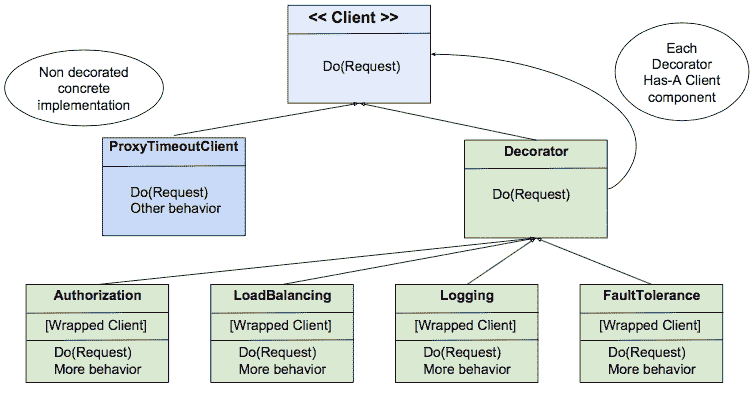

这是使用 Go 表示相同装饰器模式所需的设计工作：

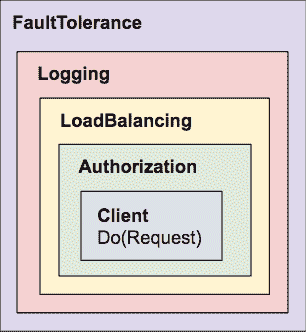

"少即是多"

- Rob Pike

### 过程式设计与功能 IoC 的比较

客户端请求由`Authorization`、`LoadBalancing`、`Logging`和`FaultTolerance`装饰器包装。当客户端请求执行时，这些装饰器中的功能将通过我们的装饰器框架注入到流程中，如下图所示：

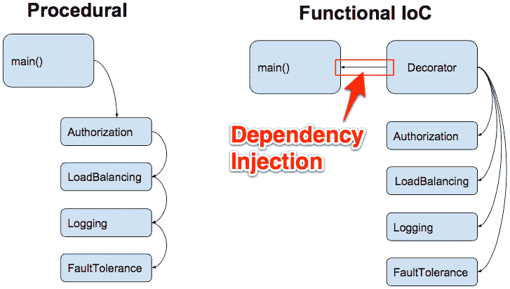

在过程式编程中，`main()`函数将控制逻辑流。代码将是单片的并且紧密耦合的。例如，要实现`Authorization`，程序员会在请求执行之前的某个地方插入以下行：

```go
request.Header.Add("Authorization", token)
```

`FaultTolerance`和`LoadBalancing`的逻辑可能看起来像意大利面代码。

通过编程装饰器函数，我们遵循客户端接口如下：

```go
type Client interface {
       Do(*http.Request) (*http.Response, error)
}
```

每个装饰器将是一个单独的函数特定组件。

#### 过程式设计示例

过程式编程就像在终端中与 Bash 脚本交互：

```go
Pick a Product Type:
(1) Appliance
(2) Book
(3) Clothing
3

Pick a Clothing Type:
(1) Men
(2) Women
(3) Children
2
```

在过程式设计中，用户交互是预定义的并且是顺序性的。

#### IoC 功能示例

将基于文本的 Bash 脚本示例与用户控制的 Web 应用程序进行对比：


在 GUI 应用程序中，控制被倒置了。程序不再强制下一个用户交互，用户大多控制接下来发生的事情。IoC 容器是一个运行事件循环并在用户点击控件时处理回调的 Web 应用程序框架，例如下拉列表中的项目或提交按钮。

对于一些 J2EE 应用程序，IoC 也可以以注入到 Spring 框架中的 XML 配置文件的形式出现。

在产品购物示例中，依赖关系将是诸如选择产品或输入送货地址之类的事物。在我们的装饰器实现中，依赖关系包括`Authorization`、`LoadBalancing`等，每个都装饰了请求。我们的 IoC 容器是装饰器框架，其中像`Authorization`和`LoadBalancing`这样的函数实现了客户端接口。

## 装饰器实现

我们的装饰器模式示例将是可运行的，因此我们将其放在`main`包中并定义一个`main()`函数。

我们使用 easy-metrics 包来记录和显示我们的指标。它自带一个漂亮的 GUI 用于显示统计信息。

我们还导入装饰器包，并在本地文件块中使用点（.）作为前缀，以便在不使用限定符的情况下访问装饰器包中的标识符。

### main.go 文件

让我们看一下`main.go`的内容：

```go
package main

import (
   "crypto/tls"
 "flag"
 "fmt"
 "io/ioutil"
 "log"
 "net/http"
 "net/url"
 "os"
 "os/signal"
 "time"
 "easy_metrics"
 . "decorator"
)

const (
   host = "127.0.0.1"
 protocol = "http://"
)
var (
   serverUrl string
   proxyUrl string
)
```

这是在使用 init 脚本及其别名（和 glide）之前导入的样子：

`import (`

`. . .`

`"time"`

`"github.com/l3x/fp-in-go/chapter5/02_decorator/easy_metrics"`

`. "github.com/l3x/fp-in-go/chapter5/02_decorator"`

`)`

我从来不喜欢在我的导入中使用长的存储库路径。我想现在是给这个技术起个名字的时候了。让我们称之为**保持简单愚蠢-滑翔**（**KISS-Glide**）。

我们将主机定义为常量，因为我们将始终在本地工作站上运行此示例代码。我们将保持简单，并使用 HTTP 协议（不使用 SSL）。

我们的示例使用代理服务器，并且还使用 Go 的标准库 HTTP 服务器实现来监听处理请求：

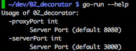

任何名为`init()`的函数都将在`main()`函数之前执行。我们为两个服务器定义默认端口号，并允许用户使用`flag`包在运行时指定不同的端口，该包实现了命令行标志解析：

```go
func init() {
       serverPort := 3000
 proxyPort := 8080
 flag.IntVar(&serverPort, "serverPort", serverPort, "Server Port")
       flag.IntVar(&proxyPort, "proxyPort", proxyPort, "Server Port")
       flag.Parse()
       serverUrl = fmt.Sprintf("%s:%d", host, serverPort)
       proxyUrl = fmt.Sprintf("%s:%d", host, proxyPort)
}

Simple Logger
```

我们将实现一个简单的记录器，它将：

+   提供日志文件跟踪

+   提供`Debug`、`Info`和`Error`日志级别

+   允许我们指定我们想要的日志级别

+   使我们更容易地替换底层的日志框架

### 装饰器/simple_log.go 文件

我们的日志记录器利用了 Go 的`Logger`包，如下所示：

```go
package decorator

import (
       "io"
 "log"
 "os"
)

var (
       Debug   *log.Logger
       Info    *log.Logger
       Error   *log.Logger
       InfoHandler io.Writer
)
```

一个简单的日志记录器导出一个函数，即`InitLog`，调用包使用它来启用日志记录功能：

```go
func InitLog(
       traceFileName string,
       debugHandler io.Writer,
       infoHandler io.Writer,
       errorHandler io.Writer,
) {
```

#### 示例 InitLog 调用

在这里，我们传递了我们的跟踪文件的名称，称为`trace-log.txt`，它将接收所有的日志输出。我们不需要`Debug`信息，但我们需要 Info 和 Error 输出：

```go
InitLog("trace-log.txt", ioutil.Discard, os.Stdout, os.Stderr)
```

这次我们将跟踪日志文件的名称传递为 nil，这告诉我们的日志记录器不要创建跟踪日志文件。我们确实希望在终端控制台上显示`Debug`、`Info`和`Error`数据。

```go
InitLog(nil, os.Stdout, os.Stdout, os.Stderr)
```

当我们指定`traceFileName`时，我们需要创建一个`io.MultiWriter`接口，同时将输出发送到两个位置：

```go
if len(traceFileName) > 0 {
      _ = os.Remove(traceFileName)
      file, err := os.OpenFile(traceFileName,
      os.O_CREATE|os.O_APPEND|os.O_WRONLY, 0666)
      if err != nil {
             log.Fatalf("Failed to create log file: %s", traceFileName)
      }
      debugHandler = io.MultiWriter(file, debugHandler)
      infoHandler = io.MultiWriter(file, infoHandler)
      errorHandler = io.MultiWriter(file, errorHandler)
}

InfoHandler = infoHandler

Debug = log.New(debugHandler, "DEBUG : ",
        log.Ldate|log.Ltime|log.Lshortfile)

Info = log.New(infoHandler, "INFO : ",
       log.Ltime)

Error = log.New(errorHandler, "ERROR : ",
        log.Ldate|log.Ltime|log.Lshortfile)
}
```

我们将在每个日志行之前加上`DEBUG`、`INFO`或`ERROR`，以指示其日志级别。

#### 回到我们的主包

我们的`main`块的第一行调用了我们的`InitLog`函数：

```go
func main() {
       InitLog("trace-log.txt", 
              ioutil.Discard, os.Stdout, os.Stderr)
```

我们使用`INFO`级别来指示我们的服务器正在侦听。

我们使用 Goroutine 启动我们的服务器，由于这是`main()`函数，我们使用`log.Fatal`方法，它相当于带有 panic 的`println`。这是因为如果我们在这一点上未能启动我们的服务器，就没有缓冲区要刷新，没有未完成的延迟语句，也没有临时文件要处理。我们还等待 1 秒，以便给我们的服务器时间启动：

```go
Info.Printf("Metrics server listening on %s", serverUrl)
go func() {
       log.Fatal(easy_metrics.Serve(serverUrl))
}()
time.Sleep(1 * time.Second)
```

接下来，我们使用`req`声明了我们的请求，稍后将执行`NumRequests`次：

```go
req, err := http.NewRequest(http.MethodGet, protocol + serverUrl, nil)
if err != nil {
       log.Fatalln(err)
}
```

在我们的示例中，我们使用代理服务器来传递所有请求。这使我们能够处理每个调用的代理级处理。我们的简单示例不进行此类处理，但我们确实指定了 1 秒的代理超时：

```go
Info.Printf("Proxy listening on %s", proxyUrl)
proxyURL, _ := url.Parse(proxyUrl)
tr := &http.Transport{
       Proxy: http.ProxyURL(proxyURL),
       TLSClientConfig: &tls.Config{
              InsecureSkipVerify: true,
       },
}
```

我们的客户端使用装饰器模式将我们的`proxyTimeoutClient`客户端与`Authorization`、`LoadBalancing`、`Logging`和`FaultTolerance`功能包装起来：

```go
tr.TLSNextProto = make(map[string]func(string, *tls.Conn) http.RoundTripper)
proxyTimeoutClient := &http.Client{Transport: tr, Timeout: 1 * time.Second}
```

我们不修改我们的客户端实现，而是扩展其功能（记得开闭原则吗？）：

```go
client := Decorate(proxyTimeoutClient,
       Authorization("mysecretpassword"),
       LoadBalancing(RoundRobin(0, "web01:3000", "web02:3000", "web03:3000")),
       Logging(log.New(InfoHandler, "client: ", log.Ltime)),
       FaultTolerance(2, time.Second),
)
```

这是一种声明式的编程形式。没有代码仪式。我们链接我们的函数调用，只传递最少量的信息来配置其行为。

要在本地使负载均衡工作，您可以将以下行添加到您的`/etc/hosts`文件中：

```go
127.0.0.1 localhost web01 web02 web03
```

接下来，我们定义我们的作业。我们传递我们的客户端、请求、要处理的请求数以及在处理每个请求之前等待的时间：

```go
job := &Job{
       Client:       client,
       Request:      req,
       NumRequests:  10,
       IntervalSecs: 10,
}
```

为了更好地理解统计数据，在 easy-metrics web 应用程序中，我们将`IntervalSecs`值设置为 10。每个 10 个请求处理尝试之间将间隔 10 秒。

我们设置了开始时间，并使用`job.Run()`启动了作业处理。`Run`函数使用`sync`包等待所有运行的作业完成后才返回控制权，此时我们打印出请求处理所花费的时间：

```go
start := time.Now()
job.Run()
Info.Printf("\n>> It took %s", time.Since(start))
```

一旦我们的处理完成，我们就从`easy_metrics`包中调用`DisplayResults`，它会显示如下消息：

```go
INFO  : 12:48:30 Go to http://127.0.0.1:3000/easy-metrics?show=Stats
Info.Printf("metrics")
err = easy_metrics.DisplayResults(serverUrl)
if err != nil {
       log.Fatalln(err)
}
```

我们的服务器需要保持运行，以便我们可以访问 easy-metrics URL，使用用户友好的 easy-metrics web 应用程序查看我们的统计数据。

我们创建一个通道来捕获*Ctrl* + *C*键序列，这将信号我们的程序停止：

```go
        Info.Printf("CTRL+C to exit")
       c := make(chan os.Signal, 1)
       signal.Notify(c, os.Interrupt)
       <-c
}
```

#### 使用 easy-metrics GUI 理解我们的统计数据

接下来的几个屏幕截图将显示我们的终端控制台和我们的 Web 浏览器在执行 Go 的`main.go`命令后立即访问`http://127.0.0.1:3000/easy-metrics?show=Stats`：

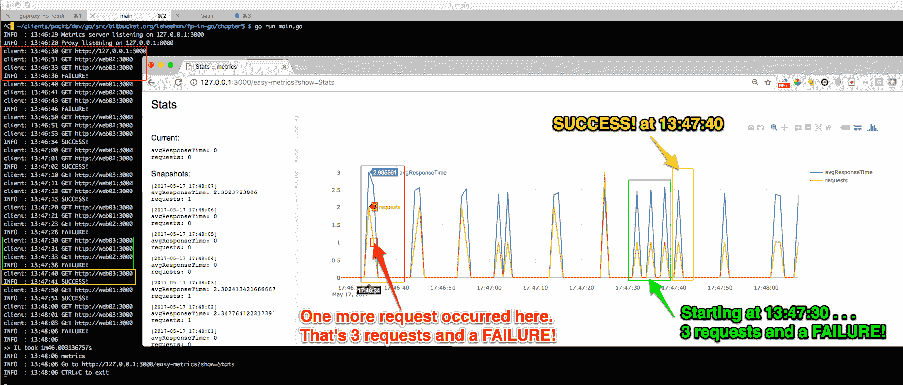

在接下来的几节中，我们将把这个图像分成三个部分。

##### 快速查看 Dot Init 更新

这是我们使用 KISS-Glide 工具集的终端外观：

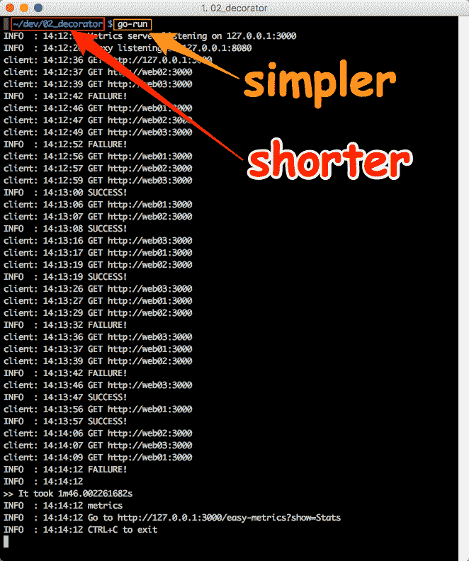

KISS-Glide 使得实现相同结果更简单，打字更少。这是双赢的局面。

当我最初写这一章时，我使用了标准的`go get`、`go build`和`go run main.go`命令。随着项目变得更加复杂（需要更多的第三方依赖），我发现创建 KISS-Glide 工具很有帮助。后来，我回到所有的项目中，使用 KISS-Glide 工具简化了它们。随意使用任何依赖管理工具，并按照自己的喜好构建和运行 Go 应用程序。这就是 Go 的伟大之处。只要工具制作者遵守标准的 Go 约定，比如使用`GOPATH`，并且不破坏其他 Go 工具，比如`go test`、`go doc`和`go vet`，就都没问题。我更喜欢简单而强大的（KISS-Glide）。

##### Easy-metrics - 1 of 3

这第一张截图更多地展示了我们终端控制台中的内容，而不是 easy-metrics GUI 中的内容：

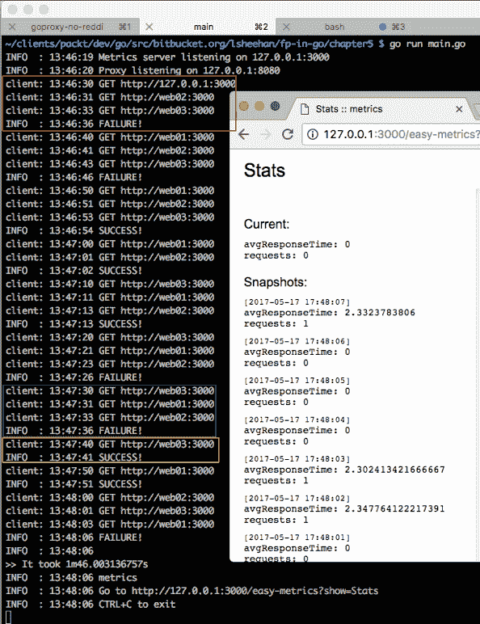

输出的前两行来自我们的`main.go`文件。接下来的三行来自这个装饰器：`Logging(log.New(InfoHandler, "client: ", log.Ltime)),`。

每行都以`INFO`或`client`开头。`client`行表示单个请求尝试。`INFO`行表示初始请求是否成功或失败（可能尝试了两次）。

### 装饰器/decorator.go 文件

让我们来看看我们的`decorator.go`实现。它位于`02_decorator`目录中，包名为`decorator`：

```go
package decorator

import (
       "log"
 "net/http"
 "sync/atomic"
 "time"
)

type Client interface {
       Do(*http.Request) (*http.Response, error)
}

// ClientFunc is a function type that implements the client interface.
type ClientFunc func(*http.Request) (*http.Response, error)

func (f ClientFunc) Do(r *http.Request) (*http.Response, error) {
       return f(r)
}
```

`ClientFunc`函数是一个实现`Client`接口的函数类型。

我们还定义了两个额外的方法，作为`ratelimitDuration`值的 getter 和 setter：

```go
var ratelimitDuration time.Duration

func (f ClientFunc) SetRatelimit(duration time.Duration) (error) {
       ratelimitDuration = duration
       return nil
}

func (f ClientFunc) GetRatelimit() (time.Duration, error) {
       return ratelimitDuration, nil
}
```

接下来，我们定义`Decorator`函数类型来包装我们的`Client`以添加额外的行为：

```go
type Decorator func(Client) Client
```

#### 一个注入依赖的框架

接下来，我们将更仔细地看一下我们的 IoC 容器框架的实现。

我们将看到，通过在核心客户端调用周围包装实现`Client`接口的装饰器，并使用装饰器模式，我们的框架能够以一种模块化和易于理解的方式扩展我们的应用功能。

`Decorator`表示这是一个可变参数，可以接受任意数量的值。还记得我们在`main`中传入装饰器的调用吗？

##### 使用装饰器包装客户端请求（在主函数中）

```go
client := Decorate(proxyTimeoutClient,
       Authorization("mysecretpassword"),
       LoadBalancing(RoundRobin(0, "web01:3000", "web02:3000", "web03:3000")),
       Logging(log.New(InfoHandler, "client: ", log.Ltime)),
       FaultTolerance(2, time.Second),
)
```

我们的`Decorate`函数通过迭代每个装饰器来扩展我们客户端的功能。

请注意，有几种方法可以实现这种包装功能。我们可以使用递归、逐行包装或者像本章前面所做的那样使用内联包装：

```go
r := NewTitlizeReader(io.LimitReader(strings.NewReader("this IS a tEsT", 12))
```

在不确定需要包装的装饰器数量时，使用可变参数结合 range 结构可能是最好的选择：

```go
func Decorate(c Client, ds ...Decorator) Client {
       decorated := c
       for _, decorate := range ds {
              decorated = decorate(decorated)
       }
       return decorated
}
```

#### 授权装饰器

我们的第一个装饰器是`Authorization`。我们调用`Header`辅助函数，在运行时为每个请求添加带有给定令牌的`Authorization`标头：

```go
func Authorization(token string) Decorator {
       return Header("Authorization", token)
}

func Header(name, value string) Decorator {
       return func(c Client) Client {
              return ClientFunc(func(r *http.Request)(*http.Response, error) {
                     r.Header.Add(name, value)
                     return c.Do(r)
              })
       }
}
```

# 日志装饰器

`Logging`装饰器接受来自 Go 标准库中的`Logger`包的日志指针。请注意，我们能够传递我们自定义的`InfoHandler`，因为我们选择使用`io.Writer`接口来实现它：

```go
Logging(log.New(InfoHandler, "client: ", log.Ltime)),
func Logging(l *log.Logger) Decorator {
       return func(c Client) Client {
 return ClientFunc(func(r *http.Request) (*http.Response, error ) {
 l.Printf("%s %s", r.Method, r.URL)
 return c.Do(r)
 })
 }
}
```

我们在运行客户端的`Do`方法之前执行`Printf`命令。

#### 负载均衡装饰器

我们利用策略模式来实现我们的负载均衡装饰器。

`LoadBalancing`装饰器应用了策略模式来应用决定哪个后端服务器将接收下一个传入的客户端请求的逻辑。

##### 策略模式

策略模式使用组合而不是继承来选择执行哪种行为。我们示例中的行为实现了一个负载均衡算法。策略模式的生产实现通常有一个管理应用程序，在运行时用于选择选择了哪种策略。


与使用请求或来自管理应用程序的配置指令的上下文来选择我们的负载均衡策略不同，我们将我们的示例硬编码为使用`RoundRobin`行为。

这是调用：

```go
LoadBalancing(RoundRobin(0, "web01:3000", "web02:3000", "web03:3000")),
```

第一个参数`RoundRobin`是所选的策略。我们传递`RoundRobin`函数，以便按顺序传递给后端服务器的主机地址。它们通过可变参数 backends 传递。

我们不是使用请求来收集上下文以确定要使用的策略，而是定义了一个接受请求的`Director`函数类型。我们选择了`RoundRobin`策略，并修改了请求的嵌入式 URL 成员以指定要连接的服务器：

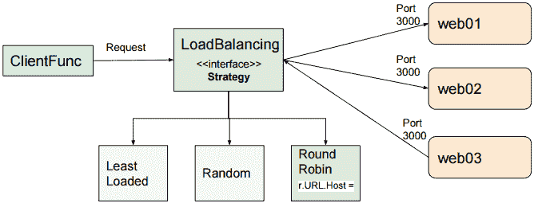

以下是`RoundRobin`函数，我们在其中进行`r.URL.Host`的赋值：

```go
func RoundRobin(robin int64, backends ...string) Director {
       return func(r *http.Request) {
 if len(backends) > 0 {
 r.URL.Host = backends[atomic.AddInt64(&robin, 1) % int64(len(backends))]
 }
 }
}
```

或者，如果我们定义了其他负载均衡策略，比如**最小负载**或**随机**，我们只需要实现该函数并将其传递给我们的`LoadBalancing`函数作为其指导者。

`LoadBalancing`函数返回一个装饰器，根据给定的指导者（例如我们的例子中的`RoundRobin`）将客户端请求分布到多个后端服务器上：

```go
func LoadBalancing(dir Director) Decorator {
       return func(c Client) Client {
 return ClientFunc(func(r *http.Request)(*http.Response, error) {
 dir(r)
 return c.Do(r)
 })
 }
}
```

`Director`修改每个 HTTP 请求以遵循所选的负载均衡策略：

```go
type Director func(*http.Request)
```

最后，我们有一个`FaultTolerance`装饰器，根据给定的尝试次数和退避时间持续时间，扩展了客户端的容错能力：

```go
func FaultTolerance(attempts int, backoff time.Duration) Decorator {
       return func(c Client) Client {
 return ClientFunc(func(r *http.Request) (*http.Response, error) {
 var res *http.Response
 var err error
 for i := 0; i <= attempts; i++ {
 if res, err = c.Do(r); err == nil {
 Info.Println("SUCCESS!")
 break
 }
 Debug.Println("backing off...")
 time.Sleep(backoff * time.Duration(i))
 }
 if err != nil { Info.Println("FAILURE!") }
 return res, err
 })
 }
}
```

我们只希望将`backing off`信息输出到我们的跟踪文件中，因此我们使用我们的`Debug.Println`函数。

注意每个装饰器有什么共同之处？它们提供额外的功能，并最终调用`c.Do(r)`。有些在调用`c.Do(r)`之前提供额外的功能；有些可能在调用之前和之后都这样做。

##### 控制反转和依赖注入

这是一种**依赖注入**（**DI**）的形式。DI 是指将一个服务（例如`FaultTolerance`）传递给一个依赖对象，例如客户端，在那里使用它。

这也可以被认为是**控制反转**（**IoC**）（DI 是 IoC 的一个子集）。我们传递给`LoadBalancing`函数的指导函数提供了控制流。这决定了将请求定向到哪个后端服务器。

IoC 是一个设计原则，其中框架确定控制流。与过程式编程相对，过程式编程中自定义代码以预定的方式确定应用程序的控制流。

##### 我们的第一次失败

我们的第一次失败包括三个请求：

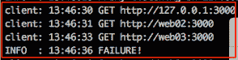

##### Easy metrics - 2 of 3

我们的 easy-metrics 图显示了请求发生的时间以及它们的平均响应时间：


当您打开 easy-metrics web 应用程序时，将鼠标指针移动到行上以获取更多上下文信息。例如，当您将鼠标移动到前面截图中红色箭头指向的位置时，您会看到在那个点发生了另一个请求。

##### Groking 我们的跟踪日志文件

为了更深入地了解我们的尝试失败的原因，我们可以查看我们的跟踪文件。

Groking 是一个古老的苏格兰术语，意思是看着别人吃饭，希望他们会给你一些食物。在我们的情况下，我们将专注地查看跟踪日志文件，希望能够获得一些理解的线索：

```go
INFO : 13:46:19 Metrics server listening on 127.0.0.1:3000
INFO : 13:46:20 Proxy listening on 127.0.0.1:8080
DEBUG : 2017/05/17 13:46:30 requester.go:114: makeRequest:
client: 13:46:30 GET http://127.0.0.1:3000
DEBUG : 2017/05/17 13:46:30 metrics.go:66: - randInt: 3081
DEBUG : 2017/05/17 13:46:31 decorator.go:107: backing off...
client: 13:46:31 GET http://web02:3000
DEBUG : 2017/05/17 13:46:31 metrics.go:66: - randInt: 2887
DEBUG : 2017/05/17 13:46:32 decorator.go:107: backing off...
client: 13:46:33 GET http://web03:3000
DEBUG : 2017/05/17 13:46:33 metrics.go:66: - randInt: 1847
DEBUG : 2017/05/17 13:46:34 decorator.go:107: backing off...
INFO : 13:46:36 FAILURE! 
```

这是我们对`FaultTolerance`函数的调用：

```go
FaultTolerance(2, time.Second),
```

我们的`FaultTolerance`装饰器的关键行如下：

```go
func FaultTolerance(attempts int, backoff time.Duration) Decorator
   . . .
       for i := 0; i <= attempts; i++ {
              if res, err = c.Do(r); err == nil {
                     Info.Println("SUCCESS!")
                     break
 }
              Debug.Println("backing off...")
              time.Sleep(backoff * time.Duration(i))
       }
       if err != nil { Info.Println("FAILURE!") }
       return res, err
   . . .
```

这表明，如果我们第一次失败，我们将再尝试两次，并在每次尝试之间等待一秒钟。

工作是在`metrics.go`文件中执行的。请注意，工作可能需要 0 到 5000 毫秒不等：

```go
func work() {
       randInt := rand.Intn(5000)
       decorator.Debug.Printf("- randInt: %v", randInt)
       workTime := time.Duration(randInt) * time.Millisecond
 time.Sleep(workTime)
}
```

最后，回想一下，当我们定义`proxyTimeoutClient`时，我们将每个请求的超时时间设置为 1 秒：

```go
proxyTimeoutClient := &http.Client{Transport: tr, Timeout: 1 * time.Second}
```

我们尝试了三次，没有一次尝试少于一秒，所以我们的第一组请求失败了。

#### 图的其余部分

图的其余部分显示了多个请求。我们将关注以下两个：

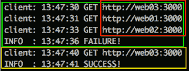

请注意，在第一组请求中，以绿色显示，我们进行了三次尝试。还要注意，在红色显示的请求中，请求是在`web03`、`web01`和`web02`之间以循环方式进行负载平衡的。`INFO`表示`FAILURE!`。

下一组请求的第一个请求在 10 秒后开始，并发送到`web03`后端服务器。`INFO`表示`SUCCESS!`

##### 简单的指标-3/3

我们可以在以下 easy-metrics 图中看到`FAILURE!`和`SUCCESS!`请求：

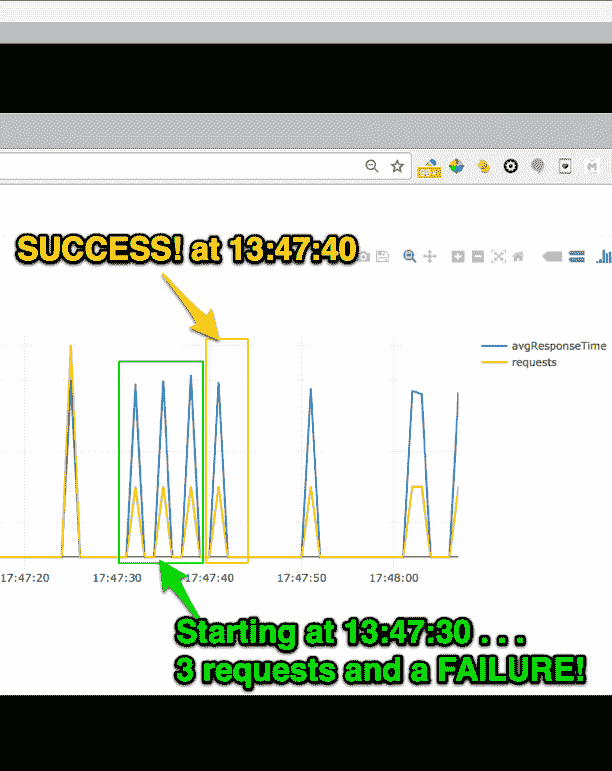

#### 检查跟踪日志

与我们之前看到的失败尝试类似，三个请求都没有在一秒内完成。因此，它们失败了。

然而，下一个请求将只花费 0.495 秒，并且将立即成功：

```go
DEBUG : 2017/05/17 13:47:30 requester.go:114: makeRequest:
client: 13:47:30 GET http://web03:3000
DEBUG : 2017/05/17 13:47:30 metrics.go:66: - randInt: 1445
DEBUG : 2017/05/17 13:47:31 decorator.go:107: backing off...
client: 13:47:31 GET http://web01:3000
DEBUG : 2017/05/17 13:47:31 metrics.go:66: - randInt: 3237
DEBUG : 2017/05/17 13:47:32 decorator.go:107: backing off...
client: 13:47:33 GET http://web02:3000
DEBUG : 2017/05/17 13:47:33 metrics.go:66: - randInt: 4106
DEBUG : 2017/05/17 13:47:34 decorator.go:107: backing off...
INFO : 13:47:36 FAILURE!
DEBUG : 2017/05/17 13:47:36 requester.go:65: > 7 requests done.
DEBUG : 2017/05/17 13:47:40 requester.go:114: makeRequest:
client: 13:47:40 GET http://web03:3000
DEBUG : 2017/05/17 13:47:40 metrics.go:66: - randInt: 495
INFO : 13:47:41 SUCCESS!
DEBUG : 2017/05/17 13:47:41 requester.go:65: > 8 requests done.
```

在此跟踪输出中要观察的最后一件事是指示已执行多少请求的两行：`> 8 requests done`。

由于这是`DEBUG`输出，我们不需要猜测这个输出来自哪个文件和行。

### 装饰器/requestor.go 文件

`DEBUG`输出将我们带到最后一个 go 源文件，即`requestor.go`：

```go
package decorator

import (
       "io"
 "io/ioutil"
 "net/http"
 "os"
 "os/signal"
 "sync"
 "syscall"
 "time"
)

type response struct {
       duration      time.Duration
       err           error
}
```

响应结构用于记录运行我们的请求的持续时间和任何错误。当我们大写符号的名称时，例如以下代码中名为`Job`的结构中的“J”，我们告诉 Go 导出它。当我们导入一个包时，我们只能访问导出的符号。

```go
type Job struct {
       Client       Client
       NumRequests  int
       Request      *http.Request
       IntervalSecs int
       responseChan chan *response
}
```

私有字段`responses`是一个响应指针的通道，其缓冲区大小等于`NumRequests`。

#### 在 main()中声明的 job 变量

它以大写的`J`开头以进行导出。我们在主函数中使用它来声明我们要运行的总请求数，以及每个请求之间的等待时间：

```go
job := &Job{
       Client:       client,
       Request:      req,
       NumRequests:  10,
       IntervalSecs: 10,
}
```

#### 回到 requestor.go 文件

在`Job`结构定义之后是`displayProgress`方法：

```go
func (b *Job) displayProgress(stopChan chan struct{}) {
       var prevResponseCount int
       for {
              select {
              case <-time.Tick(time.Millisecond * 500):
                     responseCount := len(b.responseChan)
                     if prevResponseCount < responseCount {
                            prevResponseCount = responseCount
                            Debug.Printf("> %d requests done.", responseCount)
                     }
              case <-stopChan:
                     return
 }
       }
}
```

每 500 毫秒，`displayProgress`检查是否已处理新的响应。它通过检查作业的响应通道的大小来实现。如果找到新的响应，它会打印出类似以下的一行：

```go
DEBUG : 2017/05/17 19:04:36 requestor.go:38: > 3 requests done.
```

它将继续循环，直到在`stopChan`通道上收到一个值。

#### 使用通道管理生命周期

我们使用三个通道来管理我们请求器组件的生命周期：

+   `responseChan chan *response`

+   `stopChan chan struct{}`

+   `interruptChan := make(chan os.Signal, 1)`

每 5000 毫秒，我们检查`responseChan`，看看是否收到了新的响应。如果是，我们打印一条消息，指示请求已完成。

首先，`stopChan`用于停止运行`displayProgress`函数。

然后，当用户按下*Ctrl* + *C*时，使用`interruptChan`来发出关闭一切的信号。

`Job`的`Run`方法执行所有请求，显示摘要结果，并阻塞直到收到所有响应：

```go
func (j *Job) Run() {
       j.responseChan = make(chan *response, j.NumRequests)
       stopChan := make(chan struct{})
       go j.displayProgress(stopChan)
```

我们首先将`responseChan`创建为一个带有与要处理的请求数相等的大小的缓冲通道。接下来，我们将`stopChan`创建为一个空结构体的通道。我们使用空结构体是因为它不占用空间。我们在`displayProgress`中看到，我们不关心通道中的值。只要接收到`stopChan`上的任何东西，即使是空结构体，都足以表示是时候停止处理了。我们启动`j.displayProgress(stopChan)`作为一个 Goroutine。

我们以无缓冲的方式创建`interruptChan`（大小为 1）。因为我们想要捕获`SIGTERM`，这是`kill`命令发送的默认信号（*Ctrl* + *C*），并且我们希望它适用于 Unix 和 Windows 系统，所以我们使用`syscall.SIGTERM`作为`signal.Notify`的第三个参数：

```go
interruptChan := make(chan os.Signal, 1)
signal.Notify(interruptChan, os.Interrupt, syscall.SIGTERM)
go func() {
       <-interruptChan
       stopChan <- struct{}{}
       close(j.responseChan)
       os.Exit(130)
}()
```

我们的 Goroutine 阻塞等待来自`interruptChan`的信号。如果收到信号，它将向`stopChan`发送一个空的结构实例，然后关闭`j.responseChan`，最后运行`os.Exit(130)`，表示由*Ctrl* + *C*引起的致命错误。

每隔`intervalSecs`，我们向`WaitGroup`添加 1 并启动下一个请求。一旦我们迭代了`j.NumRequests`次，我们就跳出循环并运行`wg.Wait()`。这会阻塞，直到所有请求都完成处理。请注意，每个请求处理的 Goroutine 的最后一行是`wg.Done()`函数，用于减少`WaitGroup`计数器：

```go
var wg sync.WaitGroup
intervalSecs := time.Duration(j.IntervalSecs)
requestsPerformed := 0
for range time.Tick(intervalSecs * time.Second)  {
       wg.Add(1)
       go func() {
              client := j.Client
              j.makeRequest(client)
              wg.Done()
       }()
       requestsPerformed++
       if requestsPerformed >= j.NumRequests {
              break
 }
}
wg.Wait()
```

#### 所有请求完成

当`WaitGroup`计数器达到零时，`wg.Wait()`解除阻塞，处理继续到下一行，在那里我们将空结构的实例传递给`stopChan`。正如我们之前看到的那样，`stopChan`向`Job`的`displayProgress`方法发出信号停止处理：

```go
        stopChan <- struct{}{}
       Debug.Printf("All requests done.")
       close(j.responseChan)
}
```

最后，我们使用我们的`Debug`记录器打印`All requests done.`并关闭`Job`的`responseChan`。

#### 启动我们的 makeRequest 协程

我们的`Run`方法启动了`j.NumRequests`次 Goroutine。每个 Goroutine 运行以下代码：

```go
go func() {
       client := j.Client
       j.makeRequest(client)
       wg.Done()
}()
```

`makeRequest`函数在一个 goroutine 中被调用并传递给客户端。我们使用我们的`Debug`记录器指示我们即将发出请求并记录开始时间：

```go
func (j *Job) makeRequest(c Client) {
       Debug.Printf("makeRequest: ")
       start := time.Now()
       resp, err := c.Do(j.Request)
       if err == nil {
              io.Copy(ioutil.Discard, resp.Body)
              resp.Body.Close()
       }
       t := time.Now()
       finish := t.Sub(start)
       j.responseChan <- &response{
              duration:   finish,
              err:        err,
       }
}
```

关键行是`resp, err := c.Do(j.Request)`。

#### 我们的 DI 框架在运行中

这是我们实际执行请求的时候。这是所有装饰器被执行的时候：

```go
client := Decorate(proxyTimeoutClient,
       Authorization("mysecretpassword"),
       LoadBalancing(RoundRobin(0, "web01:3000", "web02:3000", "web03:3000")),
       Logging(log.New(InfoHandler, "client: ", log.Ltime)),
       FaultTolerance(2, time.Second),
)
```

装饰器按顺序执行。`Authorization`首先执行，然后是`LoadBalancing`，`Logging`和`FaultTolerance`。

我们通过定义具有单个`Do`方法的客户端接口来创建我们的 IoC 框架：

```go
type Client interface {
       Do(*http.Request) (*http.Response, error)
}
```

将每个装饰器包装在一个返回`c.Do(r)`语句周围，该语句在`Job`的`makeRequest`方法中执行以下行后触发：

```go
resp, err := c.Do(j.Request)
```

我们创建了一个简单的框架来控制执行并使用装饰器包装客户端接口的每个 HTTP 请求。这就是 IoC，正如我们所看到的，它并不太复杂。


## 总结

在本章中，我们了解了没有设计或糟糕的设计使用类型层次结构可能导致技术债务。我们学习了装饰器模式，并学会了使用 IoC 来扩展应用程序功能的好方法。

我们看到了多个单方法接口的示例，并学会了欣赏少即是多以及良好设计是值得的这一事实。

希望在本章结束时，我们都能同意我们可以利用设计模式来编写更好的 Go 代码。

在下一章中，我们将使用适配器设计模式和其他函数式编程技术来设计和构建更好的 API。
