# 第六章：在架构级别应用 FP

大多数函数式编程（FP）书籍只谈论代码级别的好处，但是在架构级别应用 FP 原则会带来更好的回报。

在本章中，我们将讨论一些基于 FP 相同思想和理念的架构风格。

我们还将构建一个分层应用程序，通过控制反转（IoC）来解决循环依赖的问题，以控制逻辑流程。我们构建的应用程序允许管理员在两个云存储服务提供商帐户之间移动文件。

本章的目标如下：

+   了解系统工程和应用架构的基础知识

+   讨论承载 FP 相同思想的架构风格

+   防止循环依赖错误

+   了解如何应用好莱坞原则

+   了解观察者模式和依赖注入之间的区别

+   使用 IoC 来控制逻辑流程

+   构建分层应用程序架构

+   创建一个有效的表驱动框架来测试我们的 API

+   讨论 FP 和 Go 如何适用于微服务架构

## 应用程序架构

四年前，我发表了一篇名为*应用架构考虑*的文章。

考虑以下图表：

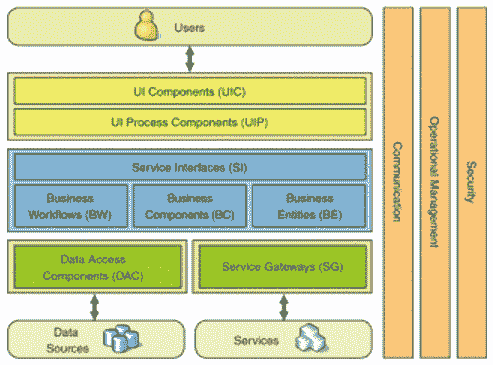

我曾谈到评估应用程序架构时要考虑的事项。

有关设计应用程序架构时要考虑的事项清单，请参阅[`lexsheehan.blogspot.com/2013/05/application-architecture-considerations.html`](http://lexsheehan.blogspot.com/2013/05/application-architecture-considerations.html)。

以下是一些列出的事项：

+   **功能性**：应用程序是否满足其业务需求？

+   **性能**：应用程序运行速度是否足够快？例如，如果有任何视图显示时间超过 7 秒，那么您需要重新设计某些东西。

+   **可扩展性**：您的应用程序的扩展性如何？您能否轻松添加和删除组件而不影响应用程序的性能或可靠性？您的应用程序代码有多松散（或紧密）耦合？

这主要是高层次的讨论，主要涉及非功能性需求和横切关注点，例如安全性、错误处理和日志记录。

如果您只对纯函数式编程技术感兴趣，可以放心跳过本章。但是，如果您想构建一个应用程序框架，其中可以放置纯函数式编程组件，那么这将是一个很好的章节。

### 什么是软件架构？

设计软件架构是定义一个结构化解决方案来满足我们应用程序的用户、业务和系统需求的过程。在每种情况下，我们必须问，“*你需要什么？*”即需求，“*你为什么需要它？*”并以业务利益相关者理解的方式记录我们的理解。最后，我们必须实施“*如何？*”：

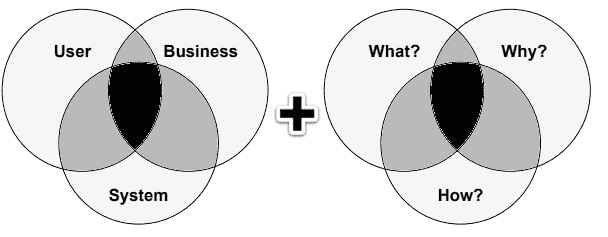

软件架构的艺术在于理解什么是重要的，做出关于构建应用程序组件及其接口的关键决策，并对难以更改的事物做出正确的决策。

而*应用架构考虑*文章主要关注“*什么？*”，本章则着重于使用 Go 语言的“*如何？*”。

### 客户端-服务器架构

客户端-服务器模型可以按照以下图表实现：

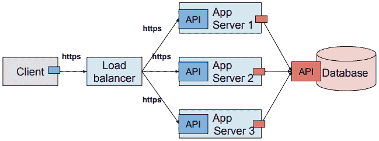

在我们的示例中，客户通过负载均衡器与应用程序服务器的 API 通信。每个应用程序服务器使用数据库 API 客户端与数据库进行交互。小的、未标记的方框代表 API 客户端。有些客户端直接与其服务器通信，例如我们的数据库客户端。其他客户端，如我们的应用程序服务器客户端，通过提供服务的中介进行通信，例如负载均衡。

### 云架构

API 公开了可用的功能，并定义了应用程序或服务之间如何通信的要求。

随着我们进入基于云的架构，我们的系统开始看起来更像这样：

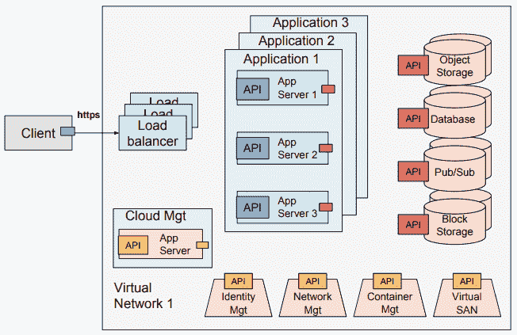

客户端/服务器和云架构最常见的共同点是什么？

看看所有公开底层资源功能的 API？

Go 非常适合服务器端应用程序，也就是虚拟网络中的一切（大灰色框）。这几乎涵盖了整个云基础架构和其中运行的所有内容。

这对于整体来说很好，但是构建应用程序呢？在构建单个 Go 应用程序时，API 有多大作用？

这取决于。我们是在谈论小型实用程序还是企业 CRM 应用程序？

小型实用程序的界面可以简单地通过它接受的命令行参数来定义。

大型客户关系管理（CRM）应用程序将由多层功能组成，与之前看到的虚拟网络图类似。例如，机会管理系统将需要与报价生成和电子签名组件的 API 进行交互。服务和供应系统将需要 API 访问计费和发票系统。

如果我们打算构建大型、复杂的应用程序，我们必须努力设计我们的解决方案。

### 架构为什么重要？

就像大型建筑物一样，复杂的软件应用程序必须建立在坚实的基础上。在软件中，我们有时称之为应用程序框架。

如果我们不考虑我文章中提到的功能、安全性、可扩展性、可测试性和性能等因素，那么我们可能会对我们缺乏预见的后果毫无准备。

随着时间的推移，我们的应用程序变得更加昂贵，测试、部署和维护的成本也会增加，我们面临的风险也会增加。

设计需要一些时间和精力，但不久之后这些努力就会得到回报。

## 系统工程的角色

系统工程是一门专注于整个系统的设计和应用的学科，该系统可能由许多部分组成。

### 真实系统

真实系统包括诸如：

+   产品

+   流程

+   人员

+   信息

+   技术

+   资源

+   服务

### IT 系统专业组

系统工程专注于在开发生命周期的早期识别需求。它考虑整个问题空间。考虑所有方面和变量，并将社会与技术方面联系起来。然后进行设计综合，整合所有专业组，如：

|

+   成本

+   开发

+   处置

+   制造

+   运营

+   性能

+   流程改进

|

+   风险评估

+   时间表

+   支持

+   测试

+   培训

+   验证

|

进入一个团队努力的结构化开发过程，从概念、设计综合、验证、部署到生产和运营。

### 系统工程是精益的

系统工程的目标是用更少的资源为我们的客户创造更多的价值。

精简的 IT 部门了解其客户的业务以及客户价值意味着什么，并专注于不断增加价值。目标是通过完美的价值创造过程为客户提供最大价值，而且没有浪费。

例如，如果您的客户向消费者销售鸡肉，那么每个新项目都必须从这个问题开始：这个项目是否能帮助我们的客户销售更多的鸡肉？

为了实现这一点，精益思维将管理的重点从优化单独的技术和垂直部门转变为优化产品和服务通过整个价值流水线的流动，这些价值流水线横跨技术和部门，流向客户。

消除整个价值流水线上的浪费，而不是在孤立的点上，创造出需要更少的人力、更少的资本和更少的时间来制造产品和服务的流程，成本要远低于传统的商业系统，并且缺陷要少得多。精益公司能够以高品种、高质量、低成本和快速的吞吐时间来响应不断变化的客户需求。信息管理变得更简单和更准确。

### 要求、范围和术语

每次我们开发软件时，我们都要满足客户的业务和技术需求，目标是提供满足用户需求的高质量产品。

一些要求是特定于任务的。例如，如果我们需要编写一个脚本将特定的日志文件从一个服务器移动到另一个服务器。其他时候，我们可能需要编写一个命令行输入工具，解析用户在控制台输入的文本并计算他们输入的字符、单词或行数。本章不涉及这些类型的应用程序。本章只考虑系统级要求。

#### 定义术语

让我们从定义一些术语开始。

##### 软件要求

我们的客户需要实现目标/解决问题的条件或能力。

##### 系统

实现定义目标的一组集成子系统和/或元素。

##### 系统架构

系统在其环境中体现的基本属性，包括其子系统、元素、关系以及其设计和演变的原则。

##### 系统元素

原子：不能进一步分解的元素

可分解的：可以分解为更小的元素

##### 系统边界

定义了系统的范围，创造了系统与系统存在的环境之间的区别。

## 管理复杂性

作为系统工程师，我们必须构建和集成元素和子系统以实现预期的目标。可能会有很多移动的部分：各种 API 和通信协议，各种数据模式，各种安全接口需要穿越。我们面临的最大挑战是，我们如何管理所有这些复杂性？

### 最适合工作的工具

我们用来管理复杂性的最好工具就是组合。函数式编程来拯救！


我们的工作是将系统的元素分解为原子部分，将它们重新组合成子系统，并在分布式、微服务的环境中将它们连接在一起。

我们如何知道我们已经充分分解了一个元素？

A：当我们可以将元素视为黑匣子时，即当我们不需要了解其功能就能理解它的作用时。

### 分而治之

FP 为我们提供了将我们的单片应用程序分解为微服务所需的工具和技术。


在[第四章](https://cdp.packtpub.com/learning_functional_programming_in_go/wp-admin/post.php?post=220&action=edit)中，*Go 中的 SOLID 设计*，我们学到我们的应用程序应该由遵循 Unix 哲学的组件构建，即做一件事情很好。我们在构建微服务时遵循相同的原则。此外，遵循**单一责任原则**（**SRP**），我们将每个微服务视为一个单独的实体，其整个生命周期都在其预定义的边界内保持分离。我们微服务的解耦是允许我们创建、移动和重新启动我们的微服务，使其与周围环境隔离的关键。

“这就是 Unix 哲学：编写只做一件事并且做得很好的程序。编写可以一起工作的程序。”- Doug McIlroy

### 为状态管理设计

通常，我们发现应用程序 API 被正确设计，给人一种应用服务是无状态的错觉。然而，仔细检查后，我们发现他们的架构存在问题。

#### 添加一个微服务

当他们添加一个微服务时，看起来是这样的：

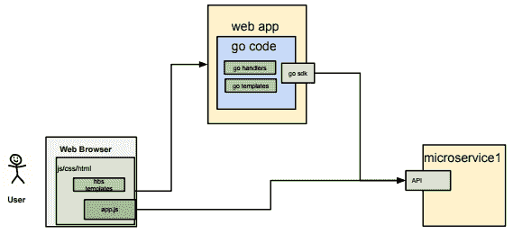

当他们再添加两个时，看起来是这样的：

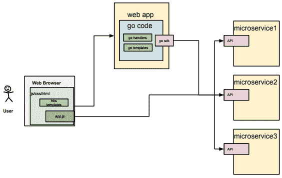

他们对他们的架构感到满意，直到他们推出应用程序并吸引用户。

问题开始出现：

+   可扩展性

+   可用性

+   状态管理

+   数据完整性问题

他们并没有创建无状态的架构，实际上他们是将应用程序状态推送到单个数据库中，这只会使问题更加复杂。

他们所有所谓无状态的微服务现在都与单个共享的单体数据库耦合在一起。

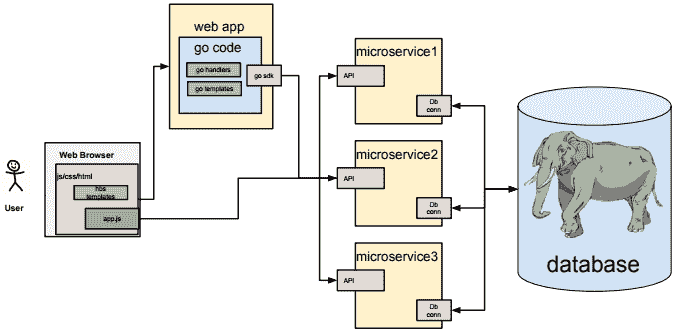

这就是他们应该设计的东西...

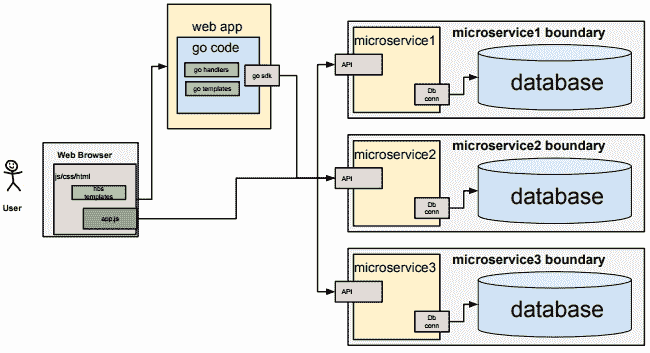

...其中每个微服务都拥有自己的数据。查找表可以共享并通过数据库复制进行管理，但其领域中的数据保持隔离。

## 受 FP 影响的架构

让我们讨论一些从 FP 借鉴思想的流行架构。

+   领域驱动设计（DDD）

+   基于事件的架构

+   CQRS

+   功能反应式架构

让我们从 DDD 开始。

DDD 的其他名称包括六边形架构、清洁架构、端口和适配器、洋葱架构和应用风格架构。我们将其称为 DDD 或分层架构。

## 领域驱动设计

为了创建优秀的软件，我们必须了解客户的业务。除非我们对销售管道的工作原理有很好的理解，否则我们无法创建潜在客户管理软件应用程序；我们必须了解销售领域。这就是**领域驱动设计**（**DDD**）的意义。稍后在本章中查找分层应用程序架构图。中心是什么？

对我们的业务领域和需求有深刻理解是成功工程系统解决方案的关键。

在这个模型中，我们考虑两个主要层。内部是应用用例处理程序和业务领域逻辑，外部是所有基础设施代码，包括数据库连接和消息传递。

将这个模型与依赖反转原则相结合，该原则规定高级模块不应依赖于低级模块。我们看到我们的依赖关系应始终指向领域层内部。

这两个领域之间的交互是通过端口和适配器实现的。客户端的请求或事件从外部世界到达 API 端口，技术特定的适配器将其转换为可以传递到应用层的函数调用或消息。

### 依赖规则

在构建大型 Go 应用程序时，我们很快面临的一个问题是如何管理我们的依赖关系。随着 Go 应用程序的规模越来越大，除非我们的设计考虑到依赖规则，否则我们很可能会遇到循环依赖错误。

什么是依赖规则，为什么 Go 编译器认为它如此重要？

依赖规则表示，低级层中的源代码可以使用高级层中的代码，但高级层不能使用低级层中的代码。依赖关系只能指向一个方向。

低级和高级层之间有什么区别？

考虑以下图表：

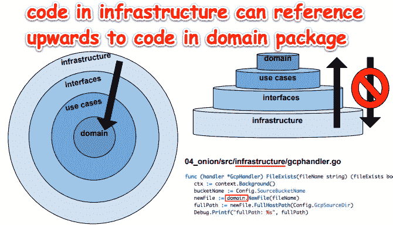

我们将在本章后面看到上面的代码运行。

在功能术语中，依赖规则表示，如果函数`A`（来自包`A`）调用函数`B`（来自包`B`），那么函数`B`不能调用来自包`A`的任何函数。

然而，应用程序控制的流程可以几乎朝任何方向（在包之间）进行。

在实际操作中，当编写 CRM 应用程序时，我们可能会发现我们的营销活动组件可能需要引用我们的机会组件中的一个函数。如果我们的机会组件需要引用我们的营销活动组件中的一个函数，那么我们可能会遇到循环依赖错误。

#### 循环依赖

循环依赖是 Go 中的一个编译错误。它表明我们的代码违反了依赖规则。当一个包导入另一个包，而另一个包又导入原始包时，就会发生这种情况。这可以从包`A`到`B`到`A`或任何导致包`A`在调用链中的任何地方被导入的组合中发生。

##### 工作代码

让我们看一些示例代码来说明这个概念。首先，让我们看一下工作代码。`packageb`包有一个简单的公共函数，没有导入：

`dependency-rule-good/src/packagea/featurea.go`

```go
package packageb

func Btask() {
   println("B")
}
```

`packagea`包有一个简单的公共函数，并导入了`packageb`：

```go
// dependency-rule-good/src/packageb/featureb.go

package packagea

import b "packageb"

func Atask() {
   println("A")
   b.Btask()
}
```

这是我们的主要函数，我们从`packagea`运行`Atask`：

```go
// dependency-rule-good/main.go

package main

import a "packagea"

func main() {
   a.Atask()
}
```

输出：

```go
A
B
```

##### 具有循环依赖错误的代码

这次，我们将在`featureb.go`中导入`packagea`：

```go
// circulardep/src/packageb/featureb.go

package packageb

import a "packagea"

func Btask() {
   println("B")
   a.Atask()
}
```

`featurea.go`文件保持不变：

```go
package packagea

import b "packageb"

func Atask() {
   println("A")
   b.Btask()
}
```

`main.go`文件也保持不变：

```go
package main

import a "packagea"

func main() {
   a.Atask()
}
```

以下是输出：

```go
import cycle not allowed
package main
imports packagea
imports packageb
imports packagea
```

当我们将`packagea`导入到`featureb.go`中时，我们违反了依赖规则。

##### Golang 的区别

如果你大部分时间都在其他语言（如 Ruby）中编程，当你遇到循环依赖错误时，你可能会感到惊讶。

为什么在像 Ruby 这样的语言中没有循环依赖错误？

首先，Ruby 是一种解释性语言，所以我们永远不会得到编译错误。此外，Ruby 通过命名空间确定作用域。只要 Ruby 对代码块有唯一的引用，并且该代码已加载到内存中，就不应该有依赖引用错误。

这是否意味着 Ruby 在这方面比 Go 更好？

这取决于我们是否想尽快开发，而不用担心依赖规则？我们是否期望我们的应用程序随着时间的推移变得复杂？我们是否想在项目开始时花更多时间进行设计？

Go 不仅鼓励我们编写更好的代码，就像这个例子一样，Go 让我们编写更好的代码。

#### 循环依赖的解决方案

我们如何编写符合依赖规则的 Go 代码，同时反映我们在业务应用逻辑中经常遇到的多方向控制流？

我们可以通过使用分层架构、面向接口的开发和一种称为依赖注入的好莱坞原则来实现这一点。

让我们一步一步来。

## 领域驱动设计

我们可以使用分层领域驱动架构作为工具，以模块化和可组合的方式构建我们的大规模功能程序。这种架构帮助我们可视化独立的应用程序关注点，并使我们能够编写 Go 代码，其源代码依赖只指向内部。

所有引用，即导入语句必须指向内部。在所有其他包中都可以找到导入**领域**语句。在**接口**和**基础设施**包中可以找到导入**用例**。在**基础设施**包中可以找到导入**接口**，而且除了`import_test`包（我们稍后会介绍）之外，不允许任何包导入**基础设施**包：

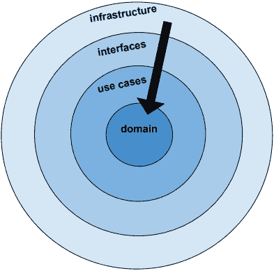

前面的图表有点矛盾。我们越往内部移动，我们的软件就变得越高级。**领域**实体是高级概念。而我们越往外移动，我们的软件就变得越低级。**基础设施**是我们与文件系统、云提供商或其他数据存储库（例如数据库或云存储）进行交互的地方。

当我们遵循依赖规则时，我们的源代码依赖只指向内部。我们的系统变得高度内聚，即具有密切相关责任的组件被分离到适当的层中，从而增加了内聚性。通过编程到接口和利用依赖注入，我们创建了一种松耦合，使我们能够在不影响其他组件的情况下替换系统的部分。

### 基于接口的开发

还记得第四章中的这句话吗？*Go 中的 SOLID 设计*？

“按照其能力对事物进行分类是有道理的，因为一切都是由其行为来定义的。”

由于这是一本关于函数式编程的书，现在是一个好时机提到使用接口的一个主要好处，即它们允许我们将应用程序的函数分组以建模真实生活中的行为。

在上一章中，我们对鸭子的行为进行了建模：

```go
type StrokeBehavior interface {
       PaddleFoot(strokeSupply *int)
}

type EatBehavior interface {
       EatBug(strokeSupply *int)
}
```

在本章中，我们将研究如何在**Google Cloud Platform**（**GCP**）中操作文件。我们的接口定义了四个感兴趣的行为：

```go
type GcpHandler interface {
   ListBuckets(flowType domain.FlowType, projectId string) (buckets []domain.Bucket, err error)
   FileExists(fileName string) (fileExists bool, err error)
   DownloadFile(fileName string) (success bool, err error)
   UploadFile(fileName string) (success bool, err error)
}
```

让我们不要混淆“接口”术语。我们刚刚谈到了 Go 接口，而当我们谈论分层架构中的接口层时，这是一种将应用程序分成单独的、内聚的关注点的方式。

本章将重点介绍我们如何使用 Go 来完成这项任务的机制。

我们之间高级和低级层之间解耦依赖的最佳选择是什么？

我们将在接下来的章节中看两种候选解决方案，观察者模式和依赖注入。

### 好莱坞原则

演员们在努力攀登好莱坞的阶层时，经历了屈辱的打击。是谁决定演员最终成为舞台助手还是布拉德·皮特？是选角导演。

演员试镜参加电影角色的试镜，并被告知不要问自己是否得到了角色。事实是，如果导演想要你，他会找到你。这就是好莱坞的原则：“*别打电话给我们，我们会打电话给你*”。

在传统编程中，演员会试镜，然后问导演是否得到了角色。这不是好莱坞原则的工作方式。

这需要什么样的控制反转？

我们需要一个公开函数的 API 和一个在运行时将依赖组件绑定到主题的框架。

我们的框架选项是什么？

#### 观察者模式

观察者模式是一个选择。它通过将一个回调对象（观察者）注入到要观察的主题中来工作。当主题的状态发生变化时，主题只是在所有观察者中引发一个事件。

观察者对事件的反应超出了主题的范围或关心。

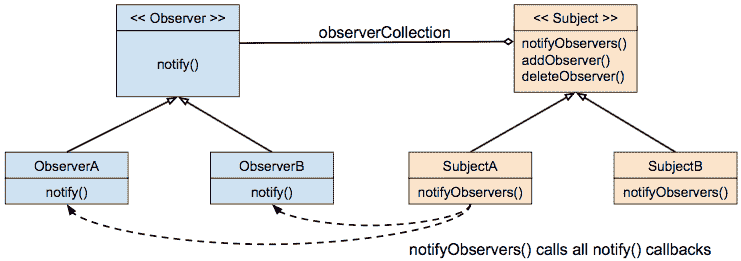

以下是该模式的实现：

```go
//main.go

package main

import (
   . "observer"
)

func main() {

   subject := Subject{}
   oa := Observable{Name: "A"}
   ob := Observable{Name: "B"}
   subject.AddObserver(&Observer{})
   subject.NotifyObservers(oa, ob)

   oc := Observable{Name: "C"}
   subject.NotifyObservers(oa, ob, oc)

   subject.DeleteObserver(&Observer{})
   subject.NotifyObservers(oa, ob, oc)

   od := Observable{Name: "D"}
   subject.NotifyObservers(oa, ob, oc, od)
}
```

观察者实现了`Callback`接口。我们为观察者接收器实现了一个`Notify`方法。`Notify`是观察者的回调函数：

```go
// src/observer.go

package observer

type Observable struct {
   Name string
}

type Observer struct {
}

func (ob *Observer) Notify(o *Observable) {
   println(o.Name)
}

type Callback interface {
   Notify(o *Observable)
}
```

主题实现了三个方法：`AddObserver`、`DeleteObserver`和`NotifyObservers`：

```go
// src/subject.go

package observer

type Subject struct {
   callbacks []Callback
}

func (o *Subject) AddObserver(c Callback) {
   o.callbacks = append(o.callbacks, c)
}
func (o *Subject) DeleteObserver(c Callback) {
   o.callbacks = append(o.callbacks, c)

   newCallbacks := []Callback{}
   for _, cb := range o.callbacks {
      if cb != c {
         newCallbacks = append(newCallbacks, cb)
      }
   }
   o.callbacks = newCallbacks
}

func (o *Subject) NotifyObservers(oes ...Observable) {
   for _, oe := range oes {
      for _, c := range o.callbacks {
         c.Notify(&oe)
      }
   }
}
```

`AddObserver`方法是订阅的地方，即观察者和主题之间的关系发生的地方。

`NotifyObservers`方法充当简单的服务定位器。它遍历其订阅的观察者列表并执行其回调。

以下是输出：

```go
A
B
A
B
C
```

当我们通过执行`subject.DeleteObserver(&Observer{})`从我们的服务定位器中移除观察者时，所有后续通知都不起作用，因为没有观察者订阅以响应发布的事件。

#### 依赖注入

**依赖注入**（**DI**）是一种控制反转的形式，也影响应用程序中的控制流。虽然观察者模式的回调机制可以在应用程序中的许多时间和许多地方修改流程，但 DI 通常在应用程序初始化期间执行控制流配置。

由于本章主要讨论分层架构和管理依赖关系以防止循环依赖错误，我们不会探讨发布/订阅架构和观察者模式。相反，我们将选择 DI 来在我们的主函数中协调我们的依赖关系。

## 云存储桶应用程序

图片说话，对吧？让我们使用一些图表来帮助描述我们基本的应用程序架构。

接下来，我们将看到我们的应用程序的高层架构，我们将称之为`onion`。（洋葱有层，所以我们将使用这个比喻来提醒我们层。）它将文件从**SOURCE Cloud Bucket**移动到本地文件系统，然后移动到**SINK Cloud Bucket**。

以下图表中的紫色 API 框代表我们的`onion.go`应用程序为管理用户公开的 Web 服务 API。红色 API 代表 Google Cloud 平台存储 API：

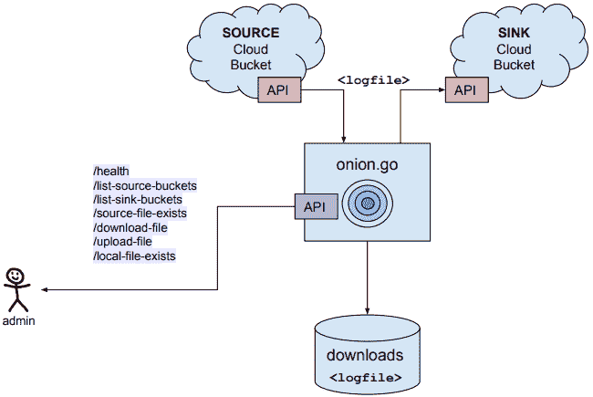

管理员将指示`onion.go`应用程序从**SOURCE Cloud Bucket**下载日志文件到本地文件系统。管理员随后可以告诉`onion.go`将文件上传到**SINK Cloud Bucket**。

例如，紫色路径`/health`、`/list-source-buckets`和`/list-sink-buckets`是我们洋葱应用程序向管理用户公开的 Web 服务 API。

### 目录结构

我们应用程序的目录结构如下：

```go
├── downloads
├── keys
│   └── google-cloud-storage
├── pkg
│   └── darwin_amd64
├── src
│   ├── domain
│   ├── infrastructure
│   ├── interfaces
│   ├── usecases
│   └── utils
└── vendors
    ├── pkg
    └── src
```

我们项目的源代码是`main.go`，位于项目根目录。我们的应用程序的其余部分分为与应用程序架构层（领域、用例、接口和基础设施）对应的目录。

在深入了解其他层的细节之前，让我们看看如何将它们联系在一起。这项工作在我们的`main.go`文件中完成。我们首先通过`GetOptions()`初始化我们的配置选项。

#### 主要.go

让我们来看看`main.go`的内容：

```go
func init() {
   GetOptions()
   if Config.LogDebugInfo {
      InitLog("trace-debug-log.txt", os.Stdout, os.Stdout, os.Stderr)
   } else {
      InitLog("trace-log.txt", ioutil.Discard, os.Stdout, os.Stderr)
   }
   // use a filename in a downloads subdirectory
 fileName = os.Getenv("TEST_FILENAME")
   if len(fileName) == 0 {
      fileName = defaultFileName // CloudflareLogFilename(time.Now())
 }
   // . . .
   HandlePanic(os.Chdir(Config.ProjectRoot))
}
```

如果我们的`log_debug_info`设置为 true，我们将`Debug`语句定向到标准输出；否则，我们将丢弃它们。为简单起见，我们硬编码了日志文件的名称，但我们可以使用配置值或函数调用来动态生成文件名。

我们在我们的`init`函数中做的最后一件事是将我们的应用程序的工作目录更改为我们的项目根目录。如果这样做时出现错误，我们的`utils`包中的`HandlePanic()`函数将为调试目的显示堆栈跟踪。

我们在我们的 utils 包中找到`HandlePanic()`函数。与大多数函数不同，我们不会从`HandlePanic()`返回错误。我们通过添加错误来源的源代码文件的文件名和行号来处理它并发出警报。

#### func HandlePanic

这是我们的`HandlePanic()`函数：

```go
func HandlePanic(err error) {
   if err != nil {
      _, filePath, lineNo, _ := runtime.Caller(1)
      _, fileName := path.Split(filePath)
      msg := fmt.Sprintf("[file:%s line:%d]: %s", fileName, lineNo, err.Error())
      panic(msg)
   }
}
```

值得注意的是，我们通过在前面加上一个句点来导入我们的 utils 包，就像这样：

```go
import . "utils"
```

这使我们能够引用公共函数（以大写字母开头）而不包括`utils`包名称。

### 依赖注入

在装饰器章节中，我们看到了控制反转。我们看到了如何通过依赖注入，装饰器（例如**FaultTolerance**）可以被注入到（主函数的）流中。

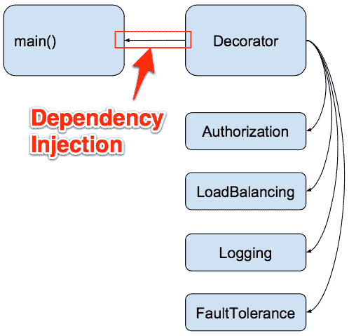

我们将使用相同的依赖注入概念来连接我们的应用程序，并控制函数调用和数据在接口之间的流动。

还记得我们的电工类比吗？现在是重新审视这个概念的好时机。我们的工作很像电工首先关闭房子的电源：铺设电线，然后打开电源。电源打开后，我们的电工可以测试开关，以验证家庭的电气系统是否已正确接线。

我们创建连接应用程序各层的接口。在主函数中，我们实例化我们的交互器。我们的交互器使用接口，通过这些接口我们调用函数，从而控制我们松散耦合系统各部分之间的数据流。

我们有两个交互器--一个用于与谷歌云平台交互，`GcpInteractor`，另一个`LocalInteractor`，用于读写本地文件系统中的文件。

#### func main()

现在，让我们来看一下`main()`函数：

```go
func main() {
   gcpi, err := infrastructure.GetGcpInteractor()
   HandlePanic(errors.Wrap(err, "unable to get gcp interactor"))
   li, err := infrastructure.GetLocalInteractor()
   HandlePanic(errors.Wrap(err, "unable to get local interactor"))

   wsh = WebserviceHandler{}
   wsh.GcpInteractor = gcpi
   wsh.LocalInteractor = li
```

我们将两个交互器注入到我们的 Web 服务处理程序中，这允许我们的管理员用户通过我们的公共 Web 服务 API 来操作我们的存储库，例如`/list-source-buckets`。

请注意，依赖注入发生在对象创建时。将依赖注入与参数化函数或使用上下文进行对比--上下文包含了单个函数调用所需的所有相关信息，可以通过一系列函数调用传递。

依赖注入通常在应用程序的生命周期中只发生一次。参数化函数和传递上下文，会发生多次。

### 架构中的层

我们正在构建一个基于分层架构的应用程序框架，这将使我们能够更轻松地扩展我们的应用程序。

在构建了基于分层架构的坚实应用程序框架之后，我们将在后续章节中回到纯函数式编程主题和技术。

我们将把我们的洋葱应用程序分成四层：

+   领域

+   用例

+   接口

+   基础设施

我们将在接下来的章节中详细讨论它们。

#### 领域层

以下图表说明了我们分层架构中的各层。箭头表示我们只在一个方向上导入包。领域永远不会从用例、接口或基础设施中导入。**领域**层中的红色背景表示我们在本节中正在研究该层：

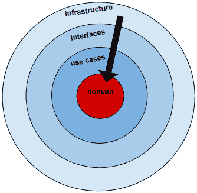

**领域**层是我们定义业务实体的地方。这些是我们在定义应用程序的本质时最初会考虑的核心业务对象。

从以下类型定义中，我们很快就可以得出结论，我们的应用程序将文件移动到云存储提供商的存储桶中：

```go
type (
   HostProvider int
   FlowType  int
)

type CloudStorage struct {
   HostProvider HostProvider //Host location for log files, e.g., google cloud bucket
 ProjectId    string       //Project Id for this GCP storage account
 FlowType     FlowType     //source or sink
}

type LocalRepository interface {
   FileExists(fileName string) (fileExists bool, err error)
}

type BucketRepository interface {
   List(projectId string) (buckets []Bucket, err error)
   FileExists(fileName string) (fileExists bool, err error)
   DownloadFile(fileName string) (success bool, err error)
   UploadFile(fileName string) (success bool, err error)
}

type FileRepository interface {
   Store(file File)
   FindById(id int) File
}

type Bucket struct {
   Name    string `json:"name"`
}
type Buckets struct {
   Buckets []Bucket `json:"buckets"`
}
```

`LocalRepository`和`BucketRepository`并不指代特定的实现。**领域**层不关心存储桶是谷歌存储桶还是 AWS 存储桶。术语存储库被使用。对于**领域**层来说，存储库只是一个文件被持久化和检索的地方。

在继续之前，让我们看一下我们正在移动的日志文件的内容：

```go
// downloads/eventset1.jsonl

{"eventId":1000,"timestamp":1500321544026000125,"description":"something bad happened","userId":997776,"country":"AF","deviceType":"UD10","ip":"19.123.3.22","srcPort":80}{"eventId":1001,"timestamp":1500321544026000126,"description":"something pretty bad happened","userId":429444,"country":"AL","deviceType":"KG90","ip":"44.74.43.30","srcPort":80}{"eventId":1002,"timestamp":1500321544026000127,"description":"something super bad happened","userId":458696,"country":"NZ","deviceType":"VM30","ip":"101.4.66.210","srcPort":8000}
```

这个`.jsonl`文件包含三个 JSON 对象。

每行的格式在我们的`domain/log_file.go`文件中定义：

```go
// domain/log_file.go

type User struct {
   UserId int `json:"userId"`
 Country string `json:"country"`
 DeviceType string `json:"deviceType"`
 IP string `json:"ip"`
 SrcPort int `json:"srcPort"`
}

type LogFile struct {
   EventId     int `json:"eventId"`
 Timestamp   int64 `json:"timestamp"`
 Description string `json:"description"`
 User
}
```

我们定义一个函数来将我们的 JSON 文本转换为 Go 结构：

```go
func NewLogFile(logfileJson string) (logFile *LogFile, err error) {
   err = json.Unmarshal([]byte(logfileJson), &logFile)
   if err != nil {
      return nil, errors.Wrap(err, "unable to unmarshal json")
   }
   return
}
```

我们定义了一个方法来操作`LogFile`对象，将其转换为 JSON 文本表示：

```go
func (lf *LogFile) ToJson() (logFileJson string, err error) {
   logFileBytes, err := json.Marshal(lf)
   if err != nil {
      return "", errors.Wrap(err, "unable to marshal json")
   }
   logFileJson = string(logFileBytes)
   return
}
```

值得注意的是，在这两种情况下，我们在将错误返回给函数的调用者之前，用我们自己更具体的错误消息包装了底层错误。

我们的应用程序引用的包越少，维护应用程序的工作就越容易。第三方包可能会经常更新，这通常是一件好事，例如，如果它们修复了安全问题，但如果它们以某种方式更改其公共接口以破坏我们的应用程序，那就可能是一件坏事。

`github.com/pkg/errors`包是少数值得麻烦的包之一。它允许我们在不更改或隐藏原始错误消息的情况下为错误消息添加上下文。

Package errors ([`github.com/pkg/errors`](https://github.com/pkg/errors))提供了简单的错误处理原语。您也可以参考：[`dave.cheney.net/2016/04/27/dont-just-check-errors-handle-them-gracefully`](https://dave.cheney.net/2016/04/27/dont-just-check-errors-handle-them-gracefully)。

`Write`方法允许我们将`LogFile`对象的内容写入磁盘：

```go
func (lf *LogFile) Write(logFilename, contents string) (err error) {
   overwrite := true
 flag := os.O_WRONLY | os.O_CREATE
 if overwrite {
      flag |= os.O_TRUNC
 } else {
      flag |= os.O_EXCL
 }
   osFile, err := os.OpenFile(logFilename, flag, 0666)
   if err != nil {
      return errors.Wrapf(err, "unable to open %s", logFilename)
   }
   bytes := []byte(contents)
   n, err := osFile.Write(bytes)
   if err == nil && n < len(bytes) {
      err = io.ErrShortWrite
      return errors.Wrapf(io.ErrShortWrite, "not all bytes written for %s", logFilename)
   }
   if err1 := osFile.Close(); err1 != nil {
      return errors.Wrapf(err, "unable to close %s", logFilename)
   }
   return
}
```

在`file.go`中，我们定义了我们的`File`结构，其中包括文件属性。例如，文件名和字节。它还将`LogFile`定义为嵌入字段。

```go
// domain/file.go

type File struct {
   Id         int
   Name       string `json:"name"`
 ErrorMsg   string `json:"error"`
 Contents   LogFile `json:"logFile"`
 Bytes      []byte  `json:"bytes"`
}
```

我们还为操作从（和发送到）GCP 存储桶的`.jsonl`文件定义了结构：

```go
type CloudFile struct {
   Name       string `json:"name"`
}
type CloudFiles struct {
   Names       []CloudFile
}

type CloudPath struct {
   Path       string `json:"path"`
}
type CloudPaths struct {
   Paths  []CloudPath
}
```

`file.go`文件还包含以下用于操作文件的函数：

+   `NewFile`

+   `NameOnly`

+   `Exists`

+   `Path`

+   `Read`

+   `Write`

+   `Parse`

我们的`api.go`文件定义了我们用于通信文件是否存在或我们对文件执行的操作是否成功的结构：

```go
// domain/api.go

type Existence struct {
   Exists    bool `json:"exists"`
}

type Outcome struct {
   Success    bool `json:"success"`
}

type OutcomeAndMsg struct {
   Success    bool `json:"success"`
 Message    string `json:"message"`
}

type MultiStatus struct {
   OutcomeAndMsgs []OutcomeAndMsg
}
```

#### 用例层

现在让我们来看看用例层：

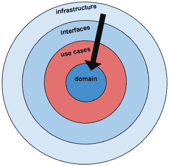

用例层与用户想要做什么有关，也就是说，他们使用此应用程序的用例。

它引用了存储库、本地文件系统以及云中的源和接收桶。

我们可以直接引用领域实体，也可以通过本地和 GCP 交互器引用接口实体。

如果我们以任何方式引用基础设施实体，那么我们的设计就是有问题的。例如，我们应该能够在不改变用例层的情况下，用 AWS S3 存储桶 API 替换 Google Cloud Platform 存储 API。

在我们的应用程序中，用户可能希望检查本地文件是否存在或获取文件，以便将其上传到 GCP 的存储桶中。

`LocalInteractor`结构控制着与本地文件系统的流动：

```go
// usecases/usecases.go
type LocalInteractor struct {
   LocalRepository domain.LocalRepository
}

func (interactor *LocalInteractor) LocalFileExists(fileName string) (fileExists bool, err error) {
   return interactor.LocalRepository.FileExists(fileName)
}
```

`GcpInteractor`结构控制云存储桶中文件和文件信息的流动。与存储桶一起*做事*包括列出存储桶中的文件，检查文件是否存在，上传和下载文件：

```go
type GcpInteractor struct {
   SourceBucketRepository domain.BucketRepository
   SinkBucketRepository domain.BucketRepository
}
```

有两种类型的存储桶。一个充当文件的来源，另一个充当文件的接收（或目的地）。

请注意，我们可以从`usecases`包中引用`BucketRepository`结构，但在`domain`包中的任何文件中都不会引用`usecases`。

```go
func (interactor *GcpInteractor) ListSinkBuckets(projectId string) (buckets []domain.Bucket, err error) {
   return interactor.SinkBucketRepository.List(projectId)
}
```

`usecases.go`中的`GcpInteractor`方法定义了在我们的 Google Cloud 帐户中操作文件的用例：

```go
func (interactor *GcpInteractor) SourceFileExists(fileName string) (fileExists bool, err error) {
   return interactor.SourceBucketRepository.FileExists(fileName)
}
```

`DownloadFile`和`UploadFile`方法可以说是我们最重要的方法：

```go
func (interactor *GcpInteractor) DownloadFile(fileName string) (success bool, err error) {
   return interactor.SourceBucketRepository.DownloadFile(fileName)
}

func (interactor *GcpInteractor) UploadFile(fileName string) (success bool, err error) {
   return interactor.SinkBucketRepository.UploadFile(fileName)
}
```

这一层的逻辑非常简洁。当我们开发更复杂的应用程序并需要执行业务规则时，这些用例可能是最好的放置位置。

例如，如果我们在应用程序中实现了安全性，我们可以定义以下规则：

+   只有接收组或以上的用户才能列出接收存储桶中的文件

+   只有“源下载”组中的用户可以下载文件

+   只有“超级管理员”组中的用户可以上传文件

然后我们可能会在这里放置我们的授权逻辑在用例层。

##### 兼容的接口

为了使依赖注入起作用，我们的应用程序必须具有兼容的接口，例如，在`domain.go`和`gcphandler.go`中的`FileExists(fileName string) (fileExists bool, err error)`。

行`return interactor.SourceBucketRepository.FileExists(fileName)`将`FileExists`行为委托给接口，该接口由`gcphandler.go`实现，然后注入到 interactor 中。下面，我们为 BucketRepository 定义接口：

```go
// domain/domain.go

type BucketRepository interface {
   List(projectId string) (buckets []Bucket, err error)
   FileExists(fileName string) (fileExists bool, err error)
   DownloadFile(fileName string) (success bool, err error)
   UploadFile(fileName string) (success bool, err error)
}
```

`BucketRepository`接口与`GcpHandler`接口兼容：

```go
// interfaces/gcpstorage.go

type GcpHandler interface {
   ListBuckets(flowType domain.FlowType, projectId string) (buckets []domain.Bucket, err error)
   FileExists(fileName string) (fileExists bool, err error)
   DownloadFile(fileName string) (success bool, err error)
   UploadFile(fileName string) (success bool, err error)
}
// infrastructure/gcphandler.go
func (handler *GcpHandler) FileExists(fileName string) (fileExists bool, err error) {
   . . .
   br, err := handler.Client.Bucket(bucketName).Object(fullPath).NewReader(ctx)
   . . .
   return true, err
}
```

让我们不要忘记在主函数中进行的连接，将`/source-file-extsts` URL 端点与`GcpInteractor`关联起来：

`main.go`

```go
func main() {
   gcpi, err := infrastructure.GetGcpInteractor()
   . . .
   wsh = WebserviceHandler{}
   wsh.GcpInteractor = gcpi 
   . . .

    {Api{wsh.SourceFileExists, "/source-file-exists"}, "fileName="+fileName}
```

这是执行依赖注入并允许我们编写跨应用程序层的代码的框架的关键。

#### 接口层

在本节中，我们将查看接口层：

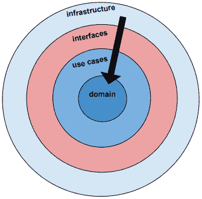

接口层提供了一种与外部存储库通信的方式，例如云存储桶或本地文件存储。如果我们的外部存储库需要向我们的应用程序通信事件，例如磁盘空间不足，这些事件将通过这个接口层流动。

我们首先定义我们的接口，也就是我们的接口层支持的功能。

该文件包含了与**Google Cloud Platform**（**GCP**）存储 API 进行接口的处理程序：

```go
// interfaces/gcpstorage.go

type GcpHandler interface {
   ListBuckets(flowType domain.FlowType, projectId string) (buckets []domain.Bucket, err error)
   FileExists(fileName string) (fileExists bool, err error)
   DownloadFile(fileName string) (success bool, err error)
   UploadFile(fileName string) (success bool, err error)
}
```

为了简化我们的实现，我们将只为源存储桶和接收存储桶定义一个`GcpHandler`接口。其结果是`DownloadFile`将可用，但对于接收存储桶来说并不有用，而`UploadFile`对于源存储桶来说也不有用。

接下来，我们定义一个结构，可以在其中注册我们的接口处理程序：

```go
type GcpRepo struct {
   gcpHandlers map[string]GcpHandler
   gcpHandler  GcpHandler
}

type SourceBucketRepo GcpRepo
type SinkBucketRepo GcpRepo
```

我们有两种类型的 GCP 存储库。源存储桶和接收存储桶。

早些时候，我们提供了满足用例需求的接口。在下面的代码中，我们实现了在运行时注入实际实现的代码：

```go
func NewSourceBucketRepo(gcpHandlers map[string]GcpHandler) *SourceBucketRepo {
   bucketRepo := new(SourceBucketRepo)
   bucketRepo.gcpHandlers = gcpHandlers
   bucketRepo.gcpHandler = gcpHandlers["SourceBucketRepo"]
   return bucketRepo
}

func (repo *SourceBucketRepo) List(projectId string) (buckets []domain.Bucket, err error) {
   return repo.gcpHandler.ListBuckets(domain.SourceFlow, projectId)
}

func (repo *SourceBucketRepo) FileExists(fileName string) (fileExists bool, err error) {
   return repo.gcpHandler.FileExists(fileName)
}

func (repo *SourceBucketRepo) DownloadFile(fileName string) (success bool, err error) {
   return repo.gcpHandler.DownloadFile(fileName)
}
// UploadFile is not operational for a source bucket
func (repo *SourceBucketRepo) UploadFile(fileName string) (success bool, err error) {
   return false, nil
}
```

以上的代码如何改进？

我们的 NewSinkBucketRepo 函数可以重写如下：

```go
func NewSourceBucketRepo(gcpHandlers map[string]GcpHandler) *SourceBucketRepo {
   return &SourceBucketRepo{
      gcpHandlers: gcpHandlers,
      gcpHandler: gcpHandlers["SourceBucketRepo"],
      }
}
```

看到区别了吗？请注意，与 C 语言不同，返回我们的局部变量`SourceBucketRepo`的地址是完全可以的。当我们返回我们的`SourceBucketRepo`组合文本时，表达式会被评估，Go 将分配一个新的`SourceBucketRepo`实例。因此，我们的`SourceBucketRepo`变量关联的存储将在`NewSourceBucketRepo`函数返回后继续存在。

处理接收存储桶依赖的注入连接代码与源存储桶代码非常相似：

```go
func NewSinkBucketRepo(gcpHandlers map[string]GcpHandler) *SinkBucketRepo {
   return &SinkBucketRepo{
      gcpHandlers: gcpHandlers,
      gcpHandler: gcpHandlers["SinkBucketRepo"],
   }
}

func (repo *SinkBucketRepo) List(projectId string) (buckets []domain.Bucket, err error) {
   return repo.gcpHandler.ListBuckets(domain.SinkFlow, projectId)
}

func (repo *SinkBucketRepo) FileExists(fileName string) (fileExists bool, err error) {
   return repo.gcpHandler.FileExists(fileName)
}

func (repo *SinkBucketRepo) DownloadFile(fileName string) (success bool, err error) {
   return false, nil
}

func (repo *SinkBucketRepo) UploadFile(fileName string) (success bool, err error) {
   return repo.gcpHandler.UploadFile(fileName)
}

func (repo *SinkBucketRepo) ListFileNamesToFetch(fileName string) (cloudFiles domain.CloudFiles, err error) {
   return cloudFiles, err
}
```

本地存储接口类似于 GCP 存储桶接口。两者都有一种方法来检查文件是否存在并检索文件。我们添加了一些逻辑，表明这将是实现缓存机制以提高性能的好地方（以额外的 RAM 要求为代价）：

```go
// interfaces/localstorage.go

type LocalHandler interface {
   FileExists(fileName string) (fileExists bool, err error)
}

var FileCache map[string][]string  //slice of json values, one for each LogFile

type LocalRepo struct {
   localHandlers map[string]LocalHandler
   localHandler  LocalHandler
   fileCache map[string]domain.File
}

type LocalFileSystemRepo LocalRepo
```

我们在`NewLocalRepo()`函数中看到了相同的依赖注入逻辑：

```go
func NewLocalRepo(localHandlers map[string]LocalHandler) *LocalFileSystemRepo {
   localRepo := new(LocalFileSystemRepo)
   localRepo.localHandlers = localHandlers
   localRepo.localHandler = localHandlers["LocalFileSystemRepo"]
   return localRepo
}
```

接下来，我们实现`FileExists()`函数：

```go
func (repo *LocalFileSystemRepo) FileExists(fileName string) (fileExists bool, err error) {
   return repo.localHandler.FileExists(fileName)
}
```

如果我们想要实现文件缓存，我们可以在接口层创建一个`FileCache`全局变量，如下所示：

```go
var FileCache map[string][]string  //slice of json values, one for each LogFile

```

我们可以在`init()`函数中初始化它：

```go
func init() {
 FileCache = make(map[string][]string)
}
```

但如果我们这样做了，我们还应该做什么呢？

如果两个请求同时发生上传文件会发生什么？

如果我们实现了`DeleteFile`函数会怎样？

需要某种资源锁定和竞争条件的缓解。

对我们来说最大的收获是现在我们有一个放置缓存逻辑的地方。当扩展我们应用程序功能的时候，分层有所帮助。

现在我们来看一下`interfaces/webservice.go`文件。

首先，让我们定义一个`Api`结构：

```go
type Api struct {
   Handler func(res http.ResponseWriter, req *http.Request)
   Url     string
}
```

我们已经看到了如何使用`Api`结构将我们的应用程序端点与其相应的网络服务实现关联起来。

`main.go`文件定义了一个嵌入了`Api`结构的`enpoint`结构：

```go
type endpoint struct {
   Api
   uriExample  string
}
```

在主函数中，我们使用我们的网络服务端点（处理程序和 URL）初始化`endpoints`切片：

```go
var endpoints = []endpoint{
   {Api{wsh.Health, "/health"}, ""},
   {Api{wsh.ListSourceBuckets, "/list-source-buckets"}, "projectId="+Config.GcpSourceProjectId},
   {Api{wsh.ListSinkBuckets, "/list-sink-buckets"}, "projectId="+Config.GcpSinkProjectId},
   {Api{wsh.SourceFileExists, "/source-file-exists"}, "fileName="+fileName},
   {Api{wsh.DownloadFile, "/download-file"}, "fileName="+fileName},
   {Api{wsh.UploadFile, "/upload-file"}, "fileName="+fileName},
   {Api{wsh.LocalFileExists, "/local-file-exists"}, "fileName="+fileName},
}
```

稍后在主函数中，我们遍历我们的端点，并将我们的 URL 与它们各自的处理程序关联起来：

```go
Info.Println("Example API endpoints:")
{
   for _, ep := range endpoints {
      http.HandleFunc(ep.Api.Url, ep.Api.Handler)
      printApiExample(ep.Api.Url, ep.uriExample)
   }
}
```

我们创建了一个`printApiExample()`辅助函数，在控制台中打印以下内容：

```go
Example API endpoints:
http://localhost:8080/health
http://localhost:8080/list-source-buckets?projectId=rdbx-168418
http://localhost:8080/list-sink-buckets?projectId=rdbx-168418
http://localhost:8080/source-file-exists?fileName=eventset1.jsonl
http://localhost:8080/download-file?fileName=eventset1.jsonl
http://localhost:8080/upload-file?fileName=eventset1.jsonl
http://localhost:8080/local-file-exists?fileName=eventset1.jsonl
http://localhost:8080/get-local-file?fileName=eventset1.jsonl
```

接下来，我们定义我们的交互接口。我们的本地文件系统只有一个接口：

```go
type LocalInteractor interface {
   LocalFileExists(fileName string) (fileExists bool, err error)
}
```

我们为我们的 GCP 存储桶定义了五个接口：

```go
type GcpInteractor interface {
   ListSourceBuckets(projectId string) (buckets []domain.Bucket, err error)
   ListSinkBuckets(projectId string) (buckets []domain.Bucket, err error)
   SourceFileExists(fileName string) (fileExists bool, err error)
   DownloadFile(fileName string) (success bool, err error)
   UploadFile(fileName string) (success bool, err error)
}
```

我们创建了一个`WebserviceHandler`结构，以便访问本地文件和云存储桶文件：

```go
type WebserviceHandler struct {
   LocalInteractor LocalInteractor
   GcpInteractor   GcpInteractor
}
```

健康 API

Health 是一个有用的、简单的实用网络服务，定义如下：

```go
func (handler WebserviceHandler) Health(res http.ResponseWriter, req *http.Request) {
   res.WriteHeader(http.StatusOK)
   res.Header().Set("Content-Type", "application/json")
   io.WriteString(res, `{"alive": true}`)
}
```

如果我们想要 JSON 结果，它的定义如下：

```go
$ curl http://localhost:8080/health
{"alive": true}
```

如果我们只需要 HTTP 头状态码，它的定义如下：

```go
$ curl -s -I http://localhost:8080/health
HTTP/1.1 200 OK
Date: Sun, 23 Jul 2017 22:19:03 GMT
Content-Length: 15
Content-Type: text/plain; charset=utf-8
```

文件存在的 API

这是一个用于检查本地文件是否存在的网络服务方法：

```go
func (handler WebserviceHandler) LocalFileExists(res http.ResponseWriter, req *http.Request) {
   fileName := req.FormValue("fileName")
   exists, err := handler.LocalInteractor.LocalFileExists(fileName)
   handleExists(sf("Running LocalFileExists for fileName: %s...", fileName), "find file", req, res, err, exists)
}
```

这是一个用于检查源云存储桶中文件是否存在的方法：

```go
func (handler WebserviceHandler) SourceFileExists(res http.ResponseWriter, req *http.Request) {
   fileName := req.FormValue("fileName")
   exists, err := handler.GcpInteractor.SourceFileExists(fileName)
   handleExists(sf("Running SourceFileExists for fileName: %s...", fileName), "file exists", req, res, err, exists)
}
```

扩展功能

我们可以通过添加`WebserviceHandler`方法来轻松扩展我们的应用，这些方法可以访问源和接收存储桶以及本地文件系统，都在同一个函数调用中。

我们使用接口的设计在其他方面也很灵活。例如，在启动我们的应用时使用测试配置设置，我们可以指示我们应用的主函数在连接交互器时使用测试模拟实现。这可以使我们的测试与一个快速的测试存根存储桶接口进行交互，该接口提供了预定义的响应，以测试应用程序内的控制流，而不是花时间初始化连接和处理网络的延迟。

现在我们来看`interfaces/webservice_helpers.go`文件。

首先，我们定义`sf`变量为`fmt.Sprintf`函数。这使我们能够缩写我们的代码，用`fmt.Sprintf`替换`sf`：

```go
var sf = fmt.Sprintf
```

接下来，我们定义了我们应用中为数不多的全局变量之一。这是我们在遇到错误时向 Web 客户端返回的标准响应。这个值永远不会改变。因此，它实际上是一个常量：

```go
var ErrorResponse = []byte("Error")
```

在下面的代码中，我们实现了一个函数来确定要返回给用户的数据格式：

```go
func getFormat(r *http.Request) (format string) {
   //format = r.URL.Query()["format"][0]
 // Hard code json for now
 format = "json"
 return
}
```

诚然，我们已经将值硬编码为`json`，但我们也可以轻松地从查询参数中获取该值。要记住的是，我们使用一个函数来返回这个值。从函数返回的值可以在下一个请求中改变。我们不需要编写代码来同步结果，以确保每个返回的格式与每个请求正确对应。我们也不需要数据修改锁定逻辑，也不需要编写代码来防止竞争条件。

如果我们将格式定义为全局字符串会怎样？那可能会引起什么错误？我们能用它来横向扩展这个应用吗？

一般规则是，只有数值是常量时，才使用全局引用。否则，我们应该通过函数调用返回所有结果。为什么？因为使用会改变的全局变量会使我们的应用状态变得不可预测。

##### 为什么全局变量是不好的

在第一章中，*在 Go 中进行纯函数式编程*，我们简要讨论了不可变变量，但并没有深入探讨它们为何如此糟糕。现在我们有了一个具体的例子，让我们来做一下。

功能不纯

同样在[第一章](https://cdp.packtpub.com/learning_functional_programming_in_go/wp-admin/post.php?post=362&action=edit#post_47)中也有，*在 Go 中进行纯函数式编程*，纯函数总是在给定相同的输入时返回相同的结果，从不产生副作用。全局变量会导致引用它的任何函数都变得不纯。

代码复杂性和错误

全局变量根据定义可供多个函数使用。当一个函数根据其值以及其他函数正在改变的全局值而表现不同的时候，很快就会变得难以理解程序流的因果关系方面。

性能和竞争条件

可变的全局变量需要一个锁定机制，以允许一次只有一个函数更新其值。这通常很难编程，并经常导致竞争条件，即一些想要更新全局变量的函数必须排队等待。

**测试困难**

测试必须考虑全局变量的值。这通常意味着每个测试人员必须知道全局变量的存在、允许的值，并在运行每个测试之前初始化全局变量的值。

##### 格式化响应

在每个网络服务请求处理程序中，我们使用`setFormat`函数与`getFormat`函数结合使用来格式化响应数据。在我们的示例代码中，我们只是使用 JSON，很容易看出我们如何扩展我们的实现以包括 XML 和 CSV 等格式。

（我们仍然在`interfaces/webservice_helpers.go`中。）：

```go
func setFormat(format string, data interface{}) ([]byte, error) {
   var apiOutput []byte
   if format == "json" {
      output, err := json.Marshal(data)
      if err != nil {
         return nil, errors.Wrap(err, "unable to marshal data to json")
      }
      apiOutput = output
   } else {
      Error.Printf("invalid data format encountered")
      apiOutput = ErrorResponse
   }
   return apiOutput, nil
}
```

处理程序助手的格式相似。首先让我们看看如何处理成功或失败。

我们的函数签名包含七个参数。这很多，这使得它成为重构的一个可能候选。在下一章中，我们将学习如何通过传递函数而不是简单值来简化复杂的 API。

由于`debugMsg`和`msg`都是字符串，它们共享一个`string`声明。同样，`err`、`error`和`success`都是`bool`类型；在 bool 参数列表之后，`bool`只需要被输入一次。这是 Go 的成语。这是一种独特于 Go 的编程风格，它帮助我们编写更简单、更易于理解的代码。

让我们检查`handleSuccess()`函数：

```go
func handleSuccess(debugMsg, msg string, req *http.Request, res http.ResponseWriter, err error, success bool) {
   Debug.Printf(debugMsg)
   response := domain.Outcome{}
   response.Success = success
   if err != nil {
      Error.Printf("Failed to %s. %v", msg, err)
   }
   output, err := setFormat(getFormat(req), response)
   if err != nil {
      output = ErrorResponse
      Error.Printf("Failed to setFormat. %v",  err)
   }
   Debug.Printf("string(output): %s", string(output))
   fmt.Fprintln(res, string(output))
}
```

`handleSuccess()`函数由`webservices.go`中的`SourceFileExists()`函数调用：

```go
func (handler WebserviceHandler) SourceFileExists(res http.ResponseWriter, req *http.Request) {
   fileName := req.FormValue("fileName")
   exists, err := handler.GcpInteractor.SourceFileExists(fileName)
   handleExists(sf("Running SourceFileExists for fileName: %s...", fileName), "file exists", req, res, err, exists)
}
```

我们从`Debug.Printf`语句开始。它从网络服务处理程序方法（如`SourceFileExists`）中获取第一个参数：

```go
sf("Running SourceFileExists for fileName: %s...", fileName)
```

值得注意的是，`sf`函数被定义为`webservice_helpers.go`文件顶部的函数变量：

```go
var sf = fmt.Sprintf
```

在调用我们的`handleExists`助手函数之前，我们从查询参数中提取`fileName`值。

当我们调用`exists, err := handler.GcpInteractor.SourceFileExists(fileName)`时会发生什么？

让我们看看最终将返回我们结果的一系列函数调用。

首先，我们访问`usecases`层中的`usecases.go`。`SourceFileExists`是一个`GcpInteractor`方法，链接到`SourceBucketRepository`：

```go
func (interactor *GcpInteractor) SourceFileExists(fileName string) (fileExists bool, err error) {
   return interactor.SourceBucketRepository.FileExists(fileName)
}
```

对`FileExists`的调用将我们带回接口层，并在基础设施层中调用`FileExists`方法：

```go
func (repo *SourceBucketRepo) FileExists(fileName string) (fileExists bool, err error) {
   return repo.gcpHandler.FileExists(fileName)
}
```

**/source-file-exists API 控制流**

以下图表和即将出现的图表显示了从 main 开始的调用堆栈，其中调用了`SourceExists` API：

| **控制流从 main.go 到** |  | **层** |
| --- | --- | --- |
| `webservices.go` (`SourceFileExists`) | 到 | 接口（到用户） |
| `usecases.go` (`SourceFileExists`) | 到 **1** | 用例 |
| `gcpstorage.go` (`FileExists`) | 到 **2** | 接口（到 GCP） |
| `gcphandler.go` (`FileExists`) | 到 **3** | 基础设施 |
| `file.go` (`NewFile`) | 到 **4** | 领域 |

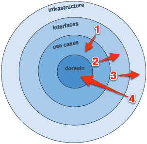

请注意，在此 API 调用过程中，接口层被遍历两次。在`webservices.go`中对`SourceFileExists`的函数调用提供了用户请求`/source-file-exists`端点和用例层中类似的`SourceFileExists`函数之间的编程接口，该函数定义了用户想要做什么。此调用堆栈中的下一个接口与 Google Cloud Platform 进行交互。

**/source-file-exists API 调用堆栈**

以下截图显示了对`/source-file-exists`网络服务的单个 API 调用。调用起始于 main，在那里网络服务端点与`webservices.go`中的`SourceFileExists`函数相关联。

看到控制流是如何从用户请求网络服务端点（在主程序中）向上流动，从层到层的吗？--`interfaces` | `use cases` | `interfaces` | `interfaces` | `infrastructure` | `domain`。

这是一种强大的流程控制形式，它允许我们构建复杂的应用程序，具有许多多向逻辑流，并且仍然遵守依赖规则，即我们只在一个方向上导入包：

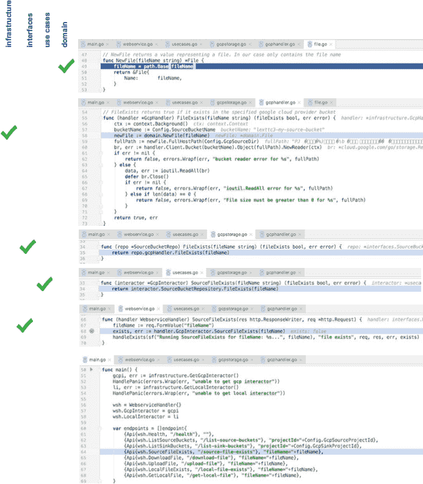

##### 测试我们的接口

为了测试我们的应用程序，我们将在我们的`interfaces`目录内创建一个`interfaces_test`目录。

由于`interfaces_test`是一个不同于`interfaces`的包，我们无法访问`interfaces`包内的私有函数和其他符号。我们能够更改我们的网络服务内部而不破坏任何测试。这也帮助我们专注于 API。当部署时，我们只看到我们的 API 的任何其他客户端将看到的内容，这简化了我们创建测试的任务。

我们使用 Go 标准库中的`testing`包：

```go
package interfaces_test

import (
   . "interfaces"
 . "utils"
 "infrastructure"
 "github.com/pkg/errors"
 "io/ioutil"
 "net/http"
 "net/http/httptest"
 "os"
 "strings"
 "testing"
)

const failure = "\u2717"
const defaultFileName = "eventset1.jsonl"

var fileName               string
var wsh                    WebserviceHandler
```

我们声明了`fileName`和`WebserviceHandler`，我们在接下来的`init()`函数中填充：

```go
func init() {
   GetOptions()
   if Config.LogDebugInfoForTests {
      InitLog("trace-debug-log.txt", os.Stdout, os.Stdout, os.Stderr)
   } else {
      InitLog("trace-debug-log.txt", ioutil.Discard, os.Stdout, os.Stderr)
   }
   HandlePanic(os.Chdir(Config.ProjectRoot))
   Debug.Printf("Config: %+v\n", Config)
   // use a filename in a downloads subdirectory
 fileName = os.Getenv("TEST_FILENAME")
   if len(fileName) == 0 {
      fileName = defaultFileName
 }
   // instantiate interactors
 gcpi, err := infrastructure.GetGcpInteractor()
   HandlePanic(errors.Wrap(err, "unable to get gcp interactor"))
   li, err := infrastructure.GetLocalInteractor()
   HandlePanic(errors.Wrap(err, "unable to get local interactor"))
   // wire up interactors to webservice handler
 wsh = WebserviceHandler{}
   wsh.GcpInteractor = gcpi
   wsh.LocalInteractor = li
}
```

我们重用了我们在主程序中使用的`Api`结构。我们将我们的 API 与`expectedBody`关联起来，而不是与示例 URL 关联：

```go
type endpoint struct {
   Api
   expectedBody   string
}
```

我们只需要一个函数来测试我们的端点。我们使用匿名结构和一组复合文字来创建一个组，以简单、可读的格式一起测试我们的数据：

```go
func TestEndpoints(t *testing.T) {
   Debug.Printf("fileName: %s", fileName)

   var endpoints = []endpoint{
      {Api{wsh.Health, 
         "/health"}, 
         `{"alive": true}`},
      {Api{wsh.ListSourceBuckets, 
         "/list-source-buckets?projectId="+Config.GcpSourceProjectId}, 
         `{"buckets":[{"name":"my-backup-bucket"},{"name":"my-source-bucket"}]}`},
      {Api{wsh.ListSinkBuckets, 
         "/list-sink-buckets?projectId="+Config.GcpSinkProjectId}, 
         `{"buckets":[{"name":"my-backup-bucket"},{"name":"my-source-bucket"}]}`},
      {Api{wsh.SourceFileExists, 
         "/source-file-exists?fileName="+fileName}, 
         `{"exists":true}`},
      {Api{wsh.UploadFile, 
         "/upload-file?fileName="+fileName}, 
         `{"success":true}`},
      {Api{wsh.DownloadFile, 
         "/download-file?fileName="+fileName}, 
         `{"success":true}`},
      {Api{wsh.LocalFileExists, 
         "/local-file-exists?fileName="+fileName}, 
         `{"exists":true}`},
   }
```

当我们迭代我们的端点切片时，我们调用每个`Api.Url`：

```go
t.Log("Testing API endpoints...")
{
   for _, ep := range endpoints {
      {
         req, err := http.NewRequest("GET", ep.Api.Url, nil)
         if err != nil {
            t.Fatal(err)
         }
```

我们创建了一个`ResponseRecorder`类型，满足`http.ResponseWriter`接口以记录响应：

```go
 rr := httptest.NewRecorder()
            handler := http.HandlerFunc(ep.Api.Handler)
```

由于我们的处理程序实现了`http.Handler`，我们可以直接调用它们的`ServeHTTP`方法，并在状态码不正确时失败测试：

```go
 handler.ServeHTTP(rr, req)
            t.Logf("\tChecking \"%s\" for status code \"%d\"",
               ep.Api.Url, http.StatusOK)
            if status := rr.Code; status != http.StatusOK {
               t.Errorf("\t\t%v handler returned wrong status code: got 
 %v want %v", failure, status, http.StatusOK)
            }
```

最后，我们将返回的响应与端点（`ep`）的`expectedBody`字段中存储的值进行比较：

```go
            t.Logf("\tChecking \"%s\" for expected body", ep.Api.Url)
            Debug.Println("rr.Body.String(): ", rr.Body.String())
            if strings.TrimSpace(rr.Body.String()) != ep.expectedBody {
               t.Errorf("\t\t%v handler returned unexpected body: got 
 %v want %v", failure, rr.Body.String(), ep.expectedBody)
            }
         }
      }
   }
}
```

输出应该是这样的：

```go
$ go test interfaces/interfaces_test -config ../../../config.toml
webservice_test.go:79: Testing API endpoints...
webservice_test.go:93: Checking "/health" for status code "200"
webservice_test.go:98: Checking "/health" for expected body
webservice_test.go:93: Checking "/list-source-buckets?projectId=rdbx-168418" for status code "200"
webservice_test.go:98: Checking "/list-source-buckets?projectId=rdbx-168418" for expected body
webservice_test.go:93: Checking "/list-sink-buckets?projectId=rdbx-168418" for status code "200"
webservice_test.go:98: Checking "/list-sink-buckets?projectId=rdbx-168418" for expected body
webservice_test.go:93: Checking "/upload-file?fileName=eventset1.jsonl" for status code "200"
webservice_test.go:98: Checking "/upload-file?fileName=eventset1.jsonl" for expected body
webservice_test.go:93: Checking "/download-file?fileName=eventset1.jsonl" for status code "200"
webservice_test.go:98: Checking "/download-file?fileName=eventset1.jsonl" for expected body
webservice_test.go:93: Checking "/source-file-exists?fileName=eventset1.jsonl" for status code "200"
webservice_test.go:98: Checking "/source-file-exists?fileName=eventset1.jsonl" for expected body
webservice_test.go:93: Checking "/local-file-exists?fileName=eventset1.jsonl" for status code "200"
webservice_test.go:98: Checking "/local-file-exists?fileName=eventset1.jsonl" for expected body
```

如果有任何错误，输出将看起来像这样：

```go
$ go test interfaces/interfaces_test -config ../../../config.toml
Failed to file exists. bucket reader error for source-events/eventset1.jsonl: storage: object doesn't exist
Failed to upload file. unable to get file (eventset1.jsonl) from bucket(lexttc3-my-source-bucket): storage: object doesn't exist
--- FAIL: TestEndpoints (1.45s)
webservice_test.go:79: Testing API endpoints...
webservice_test.go:93: Checking "/health" for status code "200"
webservice_test.go:98: Checking "/health" for expected body
webservice_test.go:93: Checking "/list-source-buckets?projectId=rdbx-168418" for status code "200"
webservice_test.go:98: Checking "/list-source-buckets?projectId=rdbx-168418" for expected body
webservice_test.go:93: Checking "/list-sink-buckets?projectId=rdbx-168418" for status code "200"
webservice_test.go:98: Checking "/list-sink-buckets?projectId=rdbx-168418" for expected body
webservice_test.go:93: Checking "/source-file-exists?fileName=eventset1.jsonl" for status code "200"
webservice_test.go:98: Checking "/source-file-exists?fileName=eventset1.jsonl" for expected body
webservice_test.go:102: X handler returned unexpected body: got {"exists":false}
want {"exists":true}
webservice_test.go:93: Checking "/upload-file?fileName=eventset1.jsonl" for status code "200"
webservice_test.go:98: Checking "/upload-file?fileName=eventset1.jsonl" for expected body
webservice_test.go:93: Checking "/download-file?fileName=eventset1.jsonl" for status code "200"
webservice_test.go:98: Checking "/download-file?fileName=eventset1.jsonl" for expected body
webservice_test.go:102: X handler returned unexpected body: got {"success":false}
want {"success":true}
webservice_test.go:93: Checking "/local-file-exists?fileName=eventset1.jsonl" for status code "200"
webservice_test.go:98: Checking "/local-file-exists?fileName=eventset1.jsonl" for expected body
FAIL
FAIL interfaces/interfaces_test 1.475s
```

#### 基础架构层

这一部分现在将讨论基础架构层：

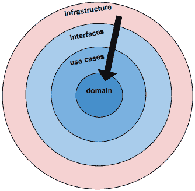

基础架构层是与外部服务通信的代码所在的地方，例如数据库、云存储，甚至本地文件系统。

由于我们的代码分为不同的层，我们应该能够将一个层中的所有函数并在不同的应用程序中使用它们。我们基础架构层中的函数与我们当前的问题域关系最小，使它们更适用于需要与 Google Cloud Platform 交互的其他应用程序。

虽然我们接口层中的`source`和`sink`函数可能只对我们的业务和我们想要实现的内容有意义，但基础架构层中的函数，如`FileExists`和`ListBuckets`，则不太具体，因此更具有重用性。

在 Go 标准库中找到的许多内容，如下列表所示，都属于基础架构层：

+   `database/sql`

+   `log/syslog`

+   `net/http`

+   `net/rpc`

+   `net/snmp`

+   `net/textproto`

如果一个包可能处理与外部系统的交互，那么它很可能属于基础架构层。

这个函数签名也是 Go 的惯用法。它接受一个参数并返回两个值。第一个是结果，第二个是错误：

```go
func (handler *GcpHandler) FileExists(fileName string) (fileExists bool, err error) {
   ctx := context.Background()
   bucketName := Config.SourceBucketName
   newFile := domain.NewFile(fileName)
   fullPath := newFile.FullHostPath(Config.GcpSourceDir)
```

`FileExists()`函数如果文件存在于指定的 Google Cloud 提供商存储桶中，则返回`true`。我们构建一个函数调用链来检索存储桶读取器。按照 Go 的惯例，它返回两个值--一个用于存储桶读取器，另一个用于潜在的错误。

##### 上下文对象

我们必须传递一个上下文对象，该对象传递给一个`withContext`函数，该函数基于上下文创建一个新的请求对象。然而，由于上下文为空，这就是我们可能称之为**代码仪式**。请注意，在下一章关于功能 API 的章节中，我们将更深入地讨论传递请求上下文的问题。在这种情况下，`ctx`是我们必须传递的内容，以便我们的代码能够编译：

```go
 ctx := context.Background()
 . . .
 br, err := handler.Client.Bucket(bucketName).Object(fullPath).NewReader(ctx)
```

我们的`errors`包允许我们用特定的错误消息包装我们的错误，并且不会丢失来自 GCP 的错误消息：

```go
if err != nil {
   return false, errors.Wrapf(err, "bucket reader error for %s", fullPath)
} else {
```

同样，我们看到了两个值的成语返回——结果和错误。

我们使用另一个典型的 Go 构造，使用`defer`调用来关闭我们的存储桶读取器。这是 Go 如何帮助我们编写更好的代码的又一个例子，因为它使得做正确的事情变得容易。在没有`defer`语句的语言中，我们必须记住在完成工作后关闭连接。而在 Go 中，我们可以立即获取数据读取器的句柄，并在函数退出时立即告诉应用程序关闭连接：

```go
       data, err := ioutil.ReadAll(br)
      defer br.Close()
      if err != nil {
         return false, errors.Wrapf(err, "ioutil.ReadAll error for %s", 
         fullPath)
      } else if len(data) == 0 {
         return false, errors.Wrapf(err, "File size must be greater 
 than 0 for %s", fullPath)
      }
   }
   return true, err
}
```

通常，当我们遇到错误时，最佳做法是用上下文有意义的消息包装错误，并立即返回错误和对结果值有意义的内容。在这种情况下，由于这是对`FileExists`的调用，如果遇到任何错误，我们将返回`false`。

如果我们到达最后的返回语句，那么所讨论的文件存在且长度非零。如果 GCP API 有一个公共的`FileExists`函数，我们可以调用它，但是这个方法对我们的目的已经足够了。

我们设计每一层尽可能简单和简洁。接口层的工作是在用例和基础设施之间流动和可能转换数据。

现在，我们来看一下`infrastructure/localhandler.go`文件。由于我们的示例中只有一个本地文件系统，我们不需要提供一个键来注册`NewLocalHandler`：

```go
type LocalHandler struct {}

var LocalInteractor *usecases.LocalInteractor

func NewLocalHandler() *LocalHandler {
   gcpHandler := new(LocalHandler)
   return gcpHandler
}
```

`FileExists()`函数调用标准库`os.Stat`函数。我们示例应用程序中的所有文件都将存储在`download`目录中。由于在`FileExists()`函数签名中已定义了两个返回值的名称，因此我们只需要在适当的位置设置它们的值并执行一个简单的返回语句。

```go
func (handler *LocalHandler) FileExists(fileName string) (fileExists bool, err error) {
   _, err = os.Stat(fmt.Sprintf("%s/%s", Config.DownloadDir, fileName))
   if !os.IsNotExist(err) {
      fileExists = true
 }
   return
}
```

`GetLocalInteractor`函数将其存储库（本地文件系统）与其接口绑定。我们的小例子只有一个方法，`FileExists`：

```go
func GetLocalInteractor() (localInteractor *usecases.LocalInteractor, err error) {
   if LocalInteractor == nil {
      localHandler := NewLocalHandler()
      localHandlers := make(map[string] interfaces.LocalHandler)
      localHandlers["LocalFileSystemRepo"] = localHandler
      localInteractor = new(usecases.LocalInteractor)
      localInteractor.LocalRepository = interfaces.NewLocalRepo(localHandlers)
      LocalInteractor = localInteractor
   }
   return LocalInteractor, nil
}
```

诚然，这是为了连接一个方法而编写的大量代码，但是典型的企业应用程序具有外部持久性依赖关系，每个依赖关系可能有大量的方法。我们的分层架构提供了扩展大型应用程序所需的结构，而只需付出最少的努力。

简而言之，分层架构：

+   提供了扩展大型应用程序所需的结构，而只需付出最少的努力

+   基于分层方法，强制高内聚

+   通过管理函数引用来保持组件松散耦合

+   遵循依赖规则

+   使用好莱坞原则，在应用程序初始化期间注入依赖项

如果您的应用程序正在不断增长，并且出现循环依赖的问题，分层架构值得您考虑。

### DDD 的好处

DDD 技术的好处如下：

#### 适应性

DDD 使得添加新的与应用程序交互的方式变得容易。我们只需向我们的`WebServiceHandler`添加一个新的交互器，也就是我们的端口/适配器。在我们的 onion.go 应用程序中，我们有两种不同的方式与我们的应用程序进行通信：本地文件系统和 Google Cloud Platform。

#### 可持续性

通过将应用程序业务逻辑与我们正在使用的工具（例如 Google Cloud Platform）解耦，我们使其不太容易受到供应商锁定和服务变得过时或失效的影响。

#### 可测试性

使用交互器可以简化我们应用服务和领域代码的测试，以便在决定使用哪种技术（REST、消息传递等）与其相应的端口/适配器连接之前，可以为我们的应用服务层编写测试。

#### 可理解性

应用用例层清楚地表明了我们应用的功能意图。

### 坚实的架构基础

这种分层架构可以成为支持其他架构模式的基础，包括 REST、CQRS、事件驱动架构和事件溯源。这就是为什么我们专注于 DDD。

## FP 和微服务

让我们在微服务和相关架构中寻找 FP 哲学的线索，如事件驱动架构、CQRS、Lambda 架构和函数式响应式编程。

我们将考虑的架构以不同的方式利用 FP 哲学来实现其可扩展性和响应性的目标：

+   事件驱动

+   可扩展

+   响应

+   弹性

### 消息传递

这些架构经常采用扇出策略来提高性能。例如，一个应用程序可能有一系列请求，在执行每个请求时会阻塞，如下所示：

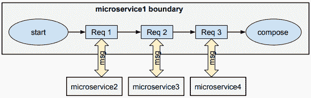

如果每个请求需要 1 秒，发送、接收和组合所有响应所需的总时间将为 3 秒。

在可能的情况下，我们应该选择通过扇出请求来异步执行每个请求，如下所示：

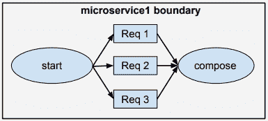

这将把处理所有请求所需的时间从 3 秒减少到 1 秒。

异步处理所需的时间较短，可以更快地释放资源。这最小化了延迟，并减少了对共享资源的争用。我们刚刚解决了可扩展性的最大障碍之一，并提高了整体吞吐量和性能。

#### 所有参与方必须参与

为了充分利用非阻塞执行的所有优势，请求/响应链中的所有部分都需要参与非阻塞异步调用。如果服务边界内外的任何资源都阻塞，那么我们就有问题。

阻塞有什么问题？

通常资源通过处理线程提供访问。线程是有限的。如果所有线程都忙碌，后续请求必须等待直到有一个可用。

异步消息传递帮助我们专注于服务之间的工作流程和交互模式。

### 跨界通信

在我们独立、隔离的服务之间通信时，我们只能请求其状态。每个服务都以不可变数据响应请求，反映其当前状态。

#### 多语言持久性

每个服务可能使用不同的存储库技术，例如：

+   事件日志

+   图形数据库

+   NoSQL

+   关系型数据库管理系统

+   时间序列数据库

存储技术并不重要。重要的是每个服务对其状态负责，只通过其 API 提供对不可变数据的访问。

### Lambda 架构

Lambda 架构是一种通用的、可扩展的、容错的数据处理架构，处理静态数据和动态数据。它由三层组成：

#### 速度

这一层用于实时处理。实时视图可能不如批处理层最终产生的视图准确或完整，但它们在接收数据后立即可用，并且可以在批处理层的相同数据的视图可用时进行替换。

#### 批处理

这一层可以存储大量数据。输出通常存储在只读数据库中。任何错误都可以通过基于完整数据集的重新计算来修复，此时视图可以更新。Apache Hadoop 是大多数高吞吐架构中使用的事实标准批处理系统。响应时间可以用分钟甚至小时来衡量。

#### 服务化

批处理层和速度层的输出存储在服务层中，通过返回预先计算的视图或从处理过的数据构建视图来响应临时查询。

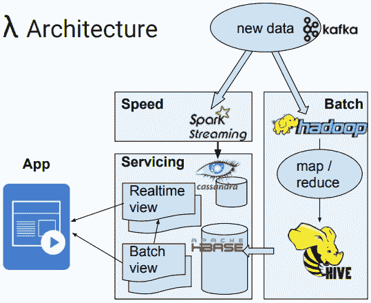

一些 Lambda 实现有各种存储和技术决策，但它们都有批处理和实时组件，两者都使用相同的数据，并且实时视图可以通过批处理的纠正数据进行更新。

这种架构的问题在于相同的数据同时被 Speed 层和 Batch 层摄取，并且通常存储在两个单独的数据库中，例如上面的 Cassandra 和 HBASE。此外，当批处理作业返回需要合并到相关实时视图中的修复批处理视图数据时，会发生额外的处理。

#### 下一代大数据架构

下一代大数据架构已完全放弃了批处理层。纯实时系统直接将流处理带入了服务架构，数据通过事件日志存储。最新的数据存储在数据库中，事件的历史存储在事件日志中。

### CQRS

**命令和查询责任分离**（CQRS）是一种将读操作与写操作分离的架构风格。

传统上，相同的数据模型用于查询和更新数据库。然而，对于更复杂的应用程序，共享数据模型会出现问题。例如，为了满足写入要求，我们的数据模型需要包含复杂的验证和业务逻辑。我们的读取要求不需要额外的逻辑。相反，它可能需要执行许多不同的查询，使用写入组件所需的数据结构。复杂性在两方面都增加了。

CQRS 通过将读取和写入分离到单独的模型中，使用命令更新数据，使用查询读取数据来解决这些问题。

基于任务的命令，而不是特定的创建或更新命令。例如，*升级汽车*，而不是将*append LX*添加到`model_name`字段。命令被放置在队列中进行异步处理。

查询返回没有行为或领域知识的纯数据对象。

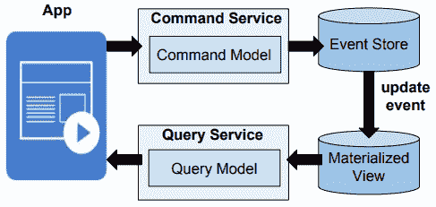

#### CQRS 的好处

CQRS **优化性能**。命令服务/事件存储端可以针对更新进行优化，而查询服务/物化视图端可以针对查询进行优化。

CQRS 通过在读取数据库中存储物化视图来**简化查询**。可以避免复杂的连接并提高性能。

CQRS **分离**了写入和读取，大大简化了查询模型中的业务逻辑，并将复杂的验证和业务逻辑放在命令模型中。

CQRS 允许读取和写入**独立扩展**。

CQRS 依赖于消息传递，这非常适合基于消息的微服务。

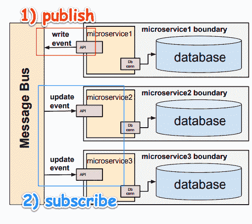

上面，微服务 1 写入其数据库，然后发布写入事件。微服务 2 和微服务 3 订阅微服务 1 的写入事件，并在每次发生该事件时得到更新。

### 基础架构架构

与设计、开发和配置基础架构相比，开发独立的微服务非常容易。基础架构包括诸如：

+   访问和摄取日志

+   平衡负载

+   检查应用程序健康状况

+   数据库复制

+   调试应用程序

+   分发秘钥

+   集成其他服务

+   监控资源

+   挂载存储系统

+   命名和发现

+   编排/协调

+   提供身份验证和授权

+   复制应用程序实例

+   滚动更新

+   使用水平自动缩放

### 共享无架构

共享无架构（SN）是一种分布式计算架构，其中每个节点都是独立和自给自足的。节点不共享数据存储，系统中没有单一的争用点。听起来很像微服务，对吧？

SN 架构的问题在于节点之间的连接操作可能耗时。

SN 消除了共享的可变状态，最小化了资源争用，并增加了可扩展性。

### 集成服务

微服务在外部或内部对其他微服务没有控制。我们的微服务数字化结构就必须就可接受的通信协议达成一致。

#### 协商一致的协议

协议应该强制执行有关安全性、数据流的方向和速度以及流量控制的政策。

#### 断路器

为了防止级联故障，应该有一些机制，比如快速失败断路器。对于失败的请求的重试管理应该考虑以下事项：

+   我们应该等多久才能重试？

+   我们应该监视端点并等待它恢复在线，然后再尝试吗？

+   我们什么时候通知运维部门有关故障？

### 函数式响应式架构

函数式响应式架构（FRP）与其他架构类似，它包含了许多 FP 概念，如不可变数据结构、事件流和数据转换，但不同之处在于它是一个前端架构。

响应式函数式编程（RFP）结合了响应式编程（RP）和函数式编程（FP）的方面。

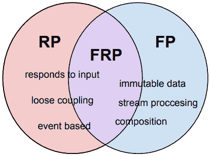

让我们看一个例子，更好地理解 FRP 和 FP 之间的联系。

假设我们有一个用户界面（UI）应用程序，可以对两个数字求和：

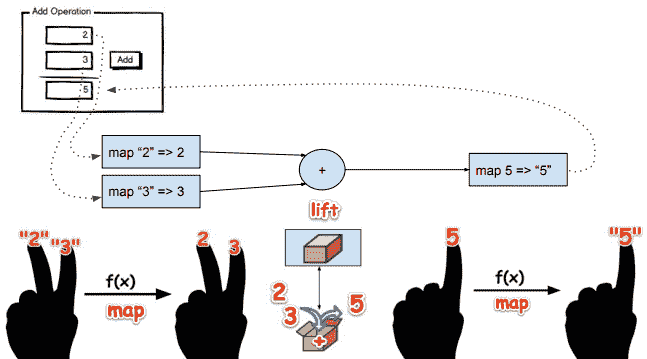

RFP 还有很多内容（不可变数据结构、记忆化、状态和事件管理等）。由于这是一个前端技术，逻辑不会是 Go，而是 JavaScript（这是我的专长之一）。

因此，如果你喜欢我的写作风格，并希望我写一本结合 Go、ReactJS 和一些分布式数据存储技术的书，请让我知道。请在这里发表你的反馈意见：[`www.amazon.com/Learning-Functional-Programming-Lex-Sheehan-ebook/dp/B0725B8MYW`](https://www.amazon.com/Learning-Functional-Programming-Lex-Sheehan-ebook/dp/B0725B8MYW)

### Go 非常适合构建微服务

分布式计算涉及水平扩展我们的微服务。我们已经看到，通过并行运行任务，我们可以显著提高性能。为了管理、排序和编排我们的工作负载，我们需要一个简单的机制。还有什么更简单的解决方案可以用于并发创建和运行应用程序？（答案：没有。）

以下是一些使 Go 成为微服务环境理想选择的功能：

+   简单

+   并发

+   编译速度

+   运行时速度

+   安全

+   网络/gRPC/协议缓冲区

+   系统编程

+   小的占用空间

Go 建立在简单的哲学之上。编写 go 代码就是编写实用的代码。

并发已经内置到 Go 语言中，以 goroutines 和通道的形式。

有关使用 goroutines 和通道的编码示例，请参见第五章，*使用装饰添加功能*。

Go 的编译时间非常快。一旦编译完成，Go 二进制文件就是本机可执行文件。

没有虚拟环境需要安装、配置、导入依赖项、部署和管理。唯一的占用空间是一个小的本机可执行文件。这对攻击者来说是更小的攻击面。

#### 大小很重要

让我们面对现实吧。大小很重要。如果你正在为资源（CPU、存储、网络等）付费，你更愿意为哪种资源付费：

1000 个这样的？


还是 1000 个这样的？

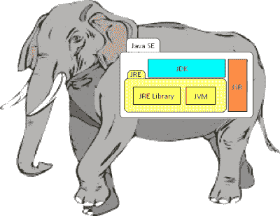

#### gRPC 的好处

如果需要使用请求/响应架构，使用 gRPC 和协议缓冲区是一个好方法。gRPC 使我们能够轻松发布 SDK。现在集成只是要求其他开发人员复制粘贴用他们的语言编写的示例代码。这对于希望与我们的产品集成的公司来说是一个巨大的胜利，而不需要我们在所有各种语言中实现整个 SDK。

gRPC 建立在 HTTP/2 之上，HTTP/2 的客户端端和/或服务器端流允许更快的响应时间，并支持批量摄入和双向流。我们可以异步地流式传输请求/响应；服务器会流回状态消息，从而实现简单的检查点操作。这使我们能够尽可能快地处理上传，而不会因为确认而阻塞。

通过使用 gRPC 和协议缓冲区，我们将提高序列化和反序列化性能。客户端接收的是类型化的对象，而不是自由形式的 JSON。这使得我们的客户端可以享受类型安全、IDE 中的自动完成和改进的版本管理的好处。

gRPC 使我们能够为 API 的客户端和服务器端编写一个接口定义，格式为 proto。接口驱动的开发使得两个开发团队可以并行工作。这使我们更加精简，更快地提供更多价值。

#### 谁在使用 Go？

一些正在使用 Go 构建的系统和基础设施工具的简短列表包括：

+   Docker

+   Kubernetes

+   Packer

+   CoreOS

+   InfluxDB

+   Etcd

+   NSQ，

## 摘要

在本章中，我们了解了依赖规则的重要性。我们了解到我们只能单向导入包。我们学会了如何将复杂的应用程序分成层。

我们学会了如何使用依赖注入来在应用程序层之间进行交互，并实现了一个使用分层架构的应用程序。

选择正确的架构的关键是深入了解我们系统的要求、现有组件和可用技术选择的能力。最终，系统工程师的工作是确保整个系统正常运行。

在下一章中，我们将学习有关函子、单子、类型类和其他函数式编程问题的内容。
