# 功能参数

在写这一章的时候，我的思绪回到了几年前，当我还在 FoxPro 中编程时。我记得我在 FoxPro 中写了很多函数。我写的函数通常都是单一用途的，很少需要超过四个参数。在微软收购 Fox Software 之后，FoxPro 的新版本开始变得不那么实用。UI 构建器变得更像 Visual Basic。函数开始被类所取代。曾经容易访问的逻辑被隐藏在按钮和 GUI 对象后面。代码行数增加，测试需要更多时间，开发周期变得更长。我感到缺乏生产力，无法充分解释我的感受。

“不理解数学的最高确定性的人陷入了困惑。”

- 莱昂纳多·达·芬奇

当我发现 Go 时，就像天堂重新获得；回归简单，同时具有并发性、网络、出色的开发工具、一流的函数以及面向对象编程的最佳部分。

我们在本章的目标是做以下事情：

+   学习重构长参数列表的更好方法

+   认识死数据对象和功能参数之间的区别

+   学习柯里化和部分应用之间的区别

+   学习如何应用部分应用程序来创建另一个具有较小 arity 的函数

+   使用上下文来优雅地关闭我们的服务器

+   使用上下文来取消和回滚长时间运行的数据库事务

+   实现功能选项以改进我们的 API

如果您认为通过将指针传递给可变数据对象或调用隐藏在函数中的其他函数来简化长参数列表是可以接受的，请以开放的心态阅读本章。

## 重构长参数列表

长参数列表通常被认为是代码异味。

太长了吗？

当我们看着参数列表而无法跟踪它们时，那么它很可能太长了。

**发现大脑的极限 - 一次 4 件事**

工作记忆与我们可以关注和理解的信息有关。保持我们的参数列表简短有助于他人轻松理解我们函数的目的。

[`www.livescience.com/2493-mind-limit-4.html`](https://www.livescience.com/2493-mind-limit-4.html)

四个参数或更少是最佳选择，但七个是最大值。

考虑一下我们的电话号码。有多少位数字？七位。例如：867-5309

你认为为什么七个数字被分成两组数字，其中最大的一组有四个数字？

### 函数签名中超过七个参数有什么问题？

函数签名不应该太长和复杂，以至于我们无法理解。保持简单。使用周到、合理和有意义的参数名称。

是否注意到具有长参数列表的函数通常是某种类型的构造函数？并且这些函数往往会随着时间的推移而获得更多的参数？


软件工程师希望减少函数的参数列表是很自然的。这是我们重构应用程序时所做的一部分。只要我们牢记可理解性的目标，我们就会没问题。有时，我们可能有一个具有十个参数的函数签名。如果其他替代方案会使我们的函数签名模糊不清，那就去做吧。清晰胜过模糊。我们应该使用多少参数？这取决于情况。

重构代码是改变代码结构而不改变其行为的过程。我们不是在添加功能。相反，我们是使我们的代码更易读和更易维护。通常，我们会将大型函数（超过 200 行代码）分解为更小、更易理解的代码单元。

有些方法比其他方法更好。

### 重构 - 这本书

读过《重构》这本书吗？它涵盖了重构长参数列表的主题。

提出了以下观点：

+   方法可以在内部查询其他对象的方法以获取做出决策所需的数据

+   方法应该依赖于它们所在的类来获取所需的数据

+   我们应该传递一个或多个对象来简化我们的调用签名

+   我们应该使用一种叫做*用方法替换参数*的技术来减少所需参数的数量

+   传递一个具有所需属性的整个对象以减少所需参数的数量

+   当我们有不相关的数据元素要传递时，请使用参数对象

+   当我们不想在一个更大的参数对象上创建依赖关系时，我们可以发送单独的参数；这是一个例外，我们可能不应该这样做

+   长参数列表会随时间改变，并且本质上很难理解

这个建议与纯面向对象的语言设计方法一致。然而，作为优秀的 Go 程序员，我们应该只同意最后一点。为什么？

为什么会有这样一个几乎持续了 20 年的建议会如此糟糕？

### 艾兹格·W·迪科斯彻说面向对象编程是一个糟糕的想法

荷兰计算机科学家迪科斯彻对面向对象编程提供了以下见解：

“面向对象编程是一个只能在加利福尼亚州产生的极其糟糕的想法。”

- 艾兹格·W·迪科斯彻

什么？面向对象编程是一个*极其糟糕的想法*？为什么？

首先，让我们更多地了解一下艾兹格·W·迪科斯彻。

#### 艾兹格·W·迪科斯彻还说了什么？

迪科斯彻说了一些诸如：

“胜任的程序员完全意识到自己头脑的严格有限大小；因此他怀着完全的谦卑态度对待编程任务，而且他避免像瘟疫一样的聪明技巧。”

- 艾兹格·W·迪科斯彻

他还说了以下的话：

“简单是可靠的前提。”

- 艾兹格·W·迪科斯彻


莫扎特的作曲

“智力的高度或想象力的高度或两者结合在一起并不能造就天才。爱，爱，爱，那是天才的灵魂。”

- 沃尔夫冈·阿马德乌斯·莫扎特

迪科斯彻分享了他对软件开发中不同编程风格的看法。迪科斯彻比较了莫扎特和贝多芬作曲音乐的方式。迪科斯彻解释说，莫扎特开始时就有整个作曲的构思。而贝多芬则会在作曲未完成时写下音乐的部分，并且会用胶水粘贴修正来创作最终的作品。

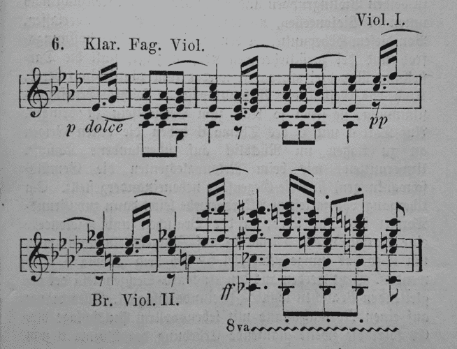

贝多芬的作曲

迪科斯彻似乎更喜欢莫扎特的编程风格。他自己的编程方法表明，程序应该被设计和正确组合，而不仅仅是被修改和调试到正确。

莫扎特之所以能在实施之前进行详细设计，是因为他是音乐作曲艺术的大师，并且有丰富的经验。有时，在开发软件时，我们可能没有这样的奢侈条件。当我们无法确定适合我们项目的框架时，将会有更多的试错式编程。

就我个人而言，当我没有严格的截止日期时，我更喜欢贝多芬式的开发。我把它看作是娱乐性编程。它本质上是自我探索的。对我来说，莫扎特式的开发需要更多的纪律。通常，最终结果是一样的。莫扎特式的开发需要更少的时间来完成，但贝多芬式的开发更加愉快。我想这就是为什么开发人员如此喜欢研发项目。 

#### 面向对象编程的根本问题

正如在第四章中所指出的，*Go 中的 SOLID 设计*，你学到了 Java（和面向对象编程语言）如何强调类型层次结构。面向对象编程的设计者关注的是名词而不是动词。一切都是对象。一个对象有属性（数据）并且可以执行动作（方法）。


一个不活跃的名词

面向对象编程的一个潜在问题是它促进了在对象的属性/属性中存储和隐藏数据。假设我们的应用程序最终会在执行一个或多个对象的方法时想要访问该对象的数据。

#### OOP 的不一致性

面向对象编程应用可以调用其隐藏的信息并对其进行改变。在应用程序的生命周期内，可以多次调用对象的方法。每次以相同的调用签名调用相同的方法都可能产生不同的结果。其行为特性使得面向对象编程不可靠且难以有效测试。

面向对象编程与基本数学不一致。在面向对象编程中，由于对象的可变状态，我们不能总是以相同的参数调用方法并始终获得相同的结果。面向对象编程没有数学模型。例如，如果我们调用`myMethod(1,2)`，第一次得到 3，下一次得到 4，由于可变状态和对其他对象的内部调用，那么面向对象编程程序的正确性无法定义。

#### 函数式编程和云计算

函数式程序的本质与面向对象编程非常不同。给定相同的输入参数，函数式程序将始终产生相同的结果。我们可以轻松地并行运行它们。我们可以以更快的方式链接/组合它们，这是面向对象编程所不可能的。

我们的部署模型已经从内部服务器改变，管理员会花费大量时间配置和优化它们，以至于给服务器取了宠物名字。我们过去看到的名字遵循了希腊神的模式。有*宙斯*，我们的数据库服务器，还有*阿波罗*，我们的人力资源服务器。

现在我们的服务器部署在云中，我们的管理员可以通过点击按钮添加新服务器或设置自动扩展：如果平均 CPU 超过 80％，则添加新服务器。看起来是这样的：

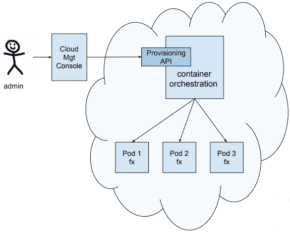

上图中的 Pod 代表一个服务器，可能有几个相关的容器。Pod 中的一个容器将运行我们的`f(x)`函数。如果服务器崩溃，我们容器编排器中运行的自动扩展逻辑将被通知，并将自动启动另一台服务器来替换它。Pod 可以根据我们的云部署配置文件和网站的流量模式快速进行配置，并根据需要停用。由于服务器这些天来来去去如此容易和迅速，我们称它们为牲畜而不是宠物。我们更关心我们的服务器群的健康状况，而不是任何一个特定的宠物服务器。

术语*Pod*取自 Kubernetes。请参阅[`kubernetes.io/docs/concepts/workloads/pods/pod-overview/`](https://kubernetes.io/docs/concepts/workloads/pods/pod-overview/)了解更多信息。

Pods 大致相当于 OpenShift v2 的齿轮，并在逻辑上代表一个*逻辑主机*，所有服务容器都可以通过 localhost 相互通信。

其他容器编排器包括 Docker Swarm、Mesos、Marathon 和 Nomad。请参阅[`github.com/KaivoAnastetiks/container-orchestration-comparison`](https://github.com/KaivoAnastetiks/container-orchestration-comparison)。 

具有 FP 特征的应用在我们的云环境中表现可靠；然而，具有可变状态的 OOP 特征的应用则不会如此。

##### 深入了解 f(x)

让我们来看一个基本的函数定义，其中**f**是函数名，**x**是输入值。**x**的另一个名称是输入参数。

整个表达式**f(x)**代表输出值：

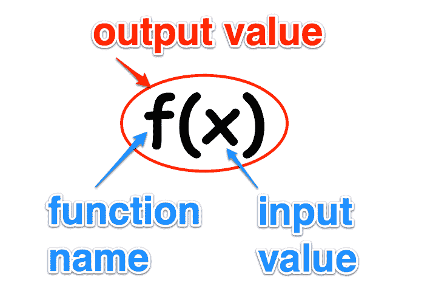

如果*f(x) = x + 1*，那么我们知道每次输入值 2 时，输出值总是 3。

这种纯粹和简单的特性是使函数式编程如此强大的原因。

另一方面，如果我们有一个带有`AddOne`方法的对象，有时会在给定值为 2 时返回 3，那么我们如何可靠地扩展我们的`object.AddOne`方法呢？我们不能，这就是为什么在云计算的背景下，以下等式成立的主要原因：*FP > OOP*。

### 重构的更近距离观察

让我们根据函数式编程的观点审视《重构》一书中提出的每一点。

#### 传递函数所需的每个参数并不是一个好主意

为什么我们不希望我们的函数签名指示它需要做出决策的值（参数）？

我们如何减少函数需要的参数？

#### 方法可以在内部查询其他对象的方法以获取做出决策所需的数据

因此，与其调用`GetTravelTime(startLocation, endLocation)`方法，最好调用`GetTravelTime()`？

我们从哪里获取`startLocation`和`endLocation`的值？

我们如何确保没有其他值，比如`modeOfTransportation`，会影响我们的旅行时间结果？

这是否会创建内部的、未记录的依赖关系（假设我们记录了我们的外部 API）？

#### 方法应该依赖于它们所属的类来获取所需的数据

这是否意味着我们依赖于可变数据，这些数据在我们的函数调用之前和期间可能会被更新？

如果我们想要在我们的函数运行时阻止数据更新，我们需要写什么额外的代码来确保数据一致性？我们需要实现什么样的锁定机制？

这会阻止我们编写并行运行的代码吗？

并发编程是否可能？

#### 传递一个带有所需属性的完整对象以减少所需参数的数量

因此，我们的调用应该像这样：`GetTravelTime(info)`，而不是`GetTravelTime(startLocation, endLocation, speed)`。

有时像这样的函数调用`Initialize(Config)`是有意义的，这取决于我们的用例。

然而，也许我们应该努力简化我们的函数，以便自然地需要更少的参数，而不是找到将更多参数值塞入单个输入参数对象的方法。

#### 用方法替换参数技术来减少所需参数的数量

这种技术指导我们删除参数，让接收者调用方法。

##### 在应用*用方法替换参数*技术之前

我们从一个`getDiscountedPrice`函数开始，它需要两个参数：`lineItemPrice`和 discount：

```go
 lineItemPrice := quantity * itemPrice;
 discount := getDiscount();
 totalPrice := getDiscountedPrice(lineItemPrice, discount);
```

*用方法替换参数*积极努力减少参数的数量。

在这种情况下，我们有两个参数。这显然比四个参数少。为什么要减少这么少的参数？

##### 应用*用方法替换参数*技术后

根据我们的指示重构我们的代码后，我们已经删除了一个参数。现在我们只有一个参数：

```go
 lineItemPrice := quantity * itemPrice;
 totalPrice := getDiscountedPrice(lineItemPrice);
```

代码维护者如何知道`totalPrice`可以通过折扣减少？

隐藏折扣参数是否提高了可理解性，还是实际上增加了代码复杂性？

#### 当我们有不相关的数据元素需要传递时，使用参数对象

参数对象只包含字段和用于访问它们的简单方法（getter 和 setter）。它是一个死数据结构，仅用于传输数据。

如果我们将许多不相关的数据项传递到一个函数中，那么我们的函数失败单一职责原则的几率有多大？

如果我们想要添加可以根据我们的运行时上下文修改数据值的逻辑，该怎么办？

然而，如果我们有一组描述新客户的参数，我们可以考虑将它们分组到一个数据对象中。以下内容可能被认为是一个合理的做法：

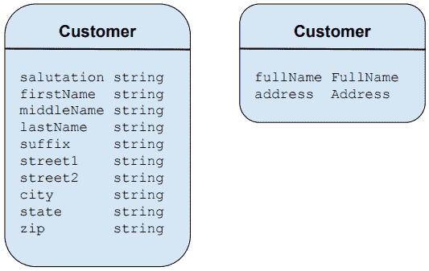

我们将`FullName`属性（称谓，`firstName`，`middleName`，`lastName`，后缀）分组在一起，形成`FullName`数据对象。我们还分组地址属性以创建`Address`数据对象。现在，我们可以调用`CreateCustomer`只传递两个属性：

```go
CreateCustomer(fullName, address)
```

具有两个参数的调用比具有八个参数的调用更好：

```go
CreateCustomer(salutation, firstName, middleName, lastName, suffix, street1, street2, city, state, zip)
```

因此，就像世界上的大多数事情一样，正确的做法取决于我们的情况。

你能想到这种方法的问题吗？

这样做不会在`fullName`和地址对象上创建依赖关系吗？

如果在执行`CreateCustomer`函数之后但在完成之前，要么`fullName`要么地址数据对象发生了变化，那么我们会有什么数据不一致？

#### 长参数列表会随时间改变，并且本质上很难理解

这个陈述很有道理。本章的其余部分将阐述这个陈述。我们将探讨如何管理一个可能随时间变化并且可能需要多个参数来获取完成任务所需信息的 API。

如果我们像贝多芬一样构建我们的应用程序，从我们想要实现的一般想法开始，并将我们的程序打磨成形，那么我们可能一开始不知道 API 将需要什么参数。

！[](img/98cbeafd-7c81-410c-8526-bda0051b3f8f.png)

一个动作动词

我们如何设计一个需要多个参数的 API，但具有以下特点？

+   提供合理的默认值

+   指示哪些参数是必需的/可选的

+   提供了语言的全部功能来初始化复杂值，而不是通过死结构传递

+   可以随着时间增长

+   安全

+   可发现

+   自我记录

+   高度可配置

传递配置结构怎么样？

就像我们之前看到的`fullName`和地址数据对象一样，传递配置数据对象会创建一个依赖关系。配置对象由“调用者”和函数“被调用者”保留。

如果我们传递指向我们的配置对象的指针，那么如果发生任何变化，无论是调用者还是被调用者，都会使问题复杂化。

### 解决方案

我们正在寻找的解决方案将允许新的构造函数接受可变数量的参数，并具有以下特点：

+   预定义默认值（在没有为特定设置传递参数的情况下）

+   只传递有意义的值

+   利用 Go 编程语言的强大功能来自定义传递的参数值

这种设计的很多思想来自 Rob Pike 的一篇博客文章。

参考 Rob Pike 在他的博客文章中关于自引用函数和选项设计的内容[`commandcenter.blogspot.com/2014/01/self-referential-functions-and-design.html`](https://commandcenter.blogspot.com/2014/01/self-referential-functions-and-design.html)。

为分享返回函数文字的闭包技术点赞，其中我们设置了服务器设置的值。稍后我们将看到这是如何工作的。

！[](img/899209bd-10b1-409e-b6d9-4cef3d91a999.jpg)

#### 传递多个参数的三种方法

让我们记住，有三种方法可以将多个参数传递给函数。我们将在接下来的章节中讨论它们。

##### 简单地传递多个参数

在这里，我们向`InitLog`函数传递了四个参数：

```go
func InitLog (
   traceFileName string,
   debugHandler io.Writer,
   infoHandler io.Writer,
   errorHandler io.Writer,
) {
// . . .
}
```

##### 传递包含多个属性的配置对象/结构

在这里，我们传递了`ClientConfig`配置数据对象并打印其值：

```go
func printClientConfig(config *ClientConfig) {
   Info.Printf(" - security params: %v", config.SecurityParams)
   Info.Printf(" - core limit: %v", config.CoreLimit)
   Info.Printf(" - payload config: %v", config.PayloadConfig)
   Info.Printf(" - channel number: %v", config.ClientChannels)
   Info.Printf(" - load params: %v", config.LoadParams)
   // . . .
```

这种方法的一个缺点是我们在调用者和被调用者之间创建了一个依赖关系。如果调用者或调用者系统的其他部分在我们的函数处理时修改了配置对象会怎么样？

有时，就像前面提供的示例一样，可以相当安全地假设配置对象不会改变。在这种情况下，传递配置对象是正确的做法。这样做简单有效，几乎没有变异导致不一致状态的可能性。

但是，如果由于所调用函数内部的额外复杂性而需要修改参数怎么办？来自死结构的静态值无法帮助。

##### 部分应用

我们的第三个选项称为**部分应用**。我们可以通过柯里化来实现这一点。

柯里化的思想是通过部分应用来从其他更一般的函数创建新的更具体的函数。

考虑一下，我们有一个接受两个数字的`add`函数：

```go
func add(x, y int) int {
   return x + y
}
```

我们可以创建另一个函数，它返回带有一个参数预插入的`add`函数。我们将以将任何其他数字加一的简单示例为例：

```go
func addOnePartialFn() func(int) int {
   return func(y int) int {
      return add(1, y)
   }
}
```

调用`add(1,2)`的结果将与调用`addOne(2)`相同：

```go
func main() {
   fmt.Printf("add(1, 2): %d\n", add(1, 2))
   addOne := addOnePartialFn()
   fmt.Printf("addOne(2): %d\n", addOne(2))
}
```

以下是前面代码的输出：

```go
add(1, 2): 3
addOne(2): 3
```

**柯里化**是函数返回一个新的单参数函数，直到原始函数接收到所有参数的能力。

只使用某些参数调用柯里化函数称为**部分应用**。

函数柯里化是一种技术，我们可以使用它将复杂的功能分解成更容易理解的小部分。逻辑的较小单元也更容易测试。我们的应用程序变成了较小部分的清晰组合。

然而，在本章中我们将追求的解决方案将是第一种，也就是，我们将传递所有必需的参数。但是，我们只需要传递必需的参数，并且我们将为未提供的参数使用合理的默认值。

我们如何实现这一点？通过使用函数参数！

## 函数参数

我们将使用`GetOptions()`实用函数，就像我们在之前的章节中使用的那样，并且我们将在我们的 init 函数中调用`GetOptions`和`InitLog`，以便在运行`main`包中的任何命令之前设置我们的配置值和记录器：

```go
package main

import (
   "server"
 . "utils"
 "context"
 "io/ioutil"
 "net/http"
 "os"
 "os/signal"
 "time"
 "fmt"
)

func init() {
   GetOptions()
   InitLog("trace-log.txt", ioutil.Discard, os.Stdout, os.Stderr)
}
```

让我们使用信号`Notify`订阅`SIGINT`信号。现在，我们可以在程序突然停止之前捕获*Ctrl* + *C*事件。我们将创建一个退出通道来保存我们的信号。它只需要有一个大小为 1 的缓冲区。

当我们的`quit`通道接收到`SIGINT`信号时，我们可以开始我们的优雅、有序的关闭过程：

```go
func main() {
   quit := make(chan os.Signal, 1)
   signal.Notify(quit, os.Interrupt)
```

请仔细注意以下代码。这是我们传递函数参数的地方！

```go
newServer, err := server.New(
   server.MaxConcurrentConnections(4),
   server.MaxNumber(256), // Config.MaxNumber
 server.UseNumberHandler(true),
   server.FormatNumber(func(x int) (string, error) { return fmt.Sprintf("%x", x), nil }), 
 //server.FormatNumber(func(x int) (string, error) { return "", errors.New("FormatNumber error") }), // anonymous fcn
)
```

在我们的示例中，我们选择为服务器的`New`构造函数提供四个参数（`MaxConcurrentConnections`、`MaxNumber`、`FormatNumber`和`UseNumberHandler`）。

请注意，参数名称是不言自明的。我们为前三个参数传递了实际的标量值（4、256、true）。我们可以选择使用配置值（`Config.MaxConcurrentConnections`、`Config.MaxNumber`和`Config.UseNumberHandler`）或使用环境变量。我们也可以使用环境变量。我们可能不会为`UseNumberHandler`使用环境变量。大多数情况下，环境变量用于设置可能会在开发、测试、QA 和生产环境中变化的设置，例如`IPADDRESS`和`PORT`。

这是一个处理 Go 环境变量的方便库：

[`github.com/caarlos0/env`](https://github.com/caarlos0/env)

最后一个参数`FormatNumber`接受一个匿名函数来改变数字的显示格式：

```go
server.FormatNumber(func(x int) (string, error) { return fmt.Sprintf("%x", x), nil }) 
```

`fmt.Sprintf`语句中的`%x`参数指示我们的处理程序以二进制格式显示输入的数字。

当用户在其请求中输入数字**2**时，将显示如下内容：

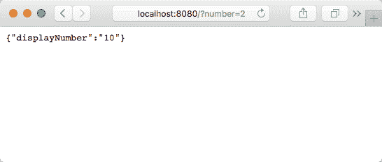

如果调用`Server.New`失败，则记录错误并退出程序：

```go
if err != nil {
   Error.Printf("unable to initialize server: %v", err)
   os.Exit(1)
}
```

接下来，我们提供运行 HTTP 服务器所需的参数。`Addr`参数是服务器监听的地址。

与其让`http.Server`默认使用`http.DefaultServeMux`来处理请求，我们将我们的`newServer`函数类型变量传递给接受我们自定义的`ServerOption`函数参数的`http.Server`，以自定义其行为：

```go
srv := &http.Server{
   Addr:    ":"+Config.Port,
   Handler: newServer,
}
```

接下来，我们将为匿名函数调用创建一个 Goroutine。

我们的 Goroutine 将等待，直到用户触发`SIGINT`中断（通过在启动服务器的终端会话中按下*Ctrl* + *C*）。此时，“quit”通道将接收到信号。

尽管“上下文”可以用于传递请求范围的变量，但我们只会用它来传递取消信号。我们将在下一节更详细地介绍“上下文”。

当 2 秒截止日期到期或调用返回的`cancel`函数时，`quit`通道将关闭。只要服务器关闭逻辑花费的时间不超过两秒，延迟`cancel()`将被调用；否则，截止日期将关闭`quit`通道。

```go
go func() {
   <-quit
   ctx, cancel := context.WithDeadline(context.Background(), time.Now().Add(2 * time.Second))
   defer cancel()
   Info.Println("shutting down server...")
   if err := srv.Shutdown( ctx ); err != nil {
      Error.Printf("unable to shutdown server: %v", err)
   }
}()
```

对`Shutdown`的调用将停止服务器而不会中断任何活动连接。首先，`Shutdown`关闭打开的监听器，然后关闭空闲连接。如果没有截止日期，它可能会无限期地等待连接返回到空闲状态，然后再关闭它们。

`ListenAndServe`函数在本地主机端口`Config.Port`上监听，并调用 serve 来处理传入连接的请求：

```go
Error.Println("server started at localhost:"+Config.Port)
err = srv.ListenAndServe()
```

此时，我们的服务器将监听请求，我们的终端将如下所示：

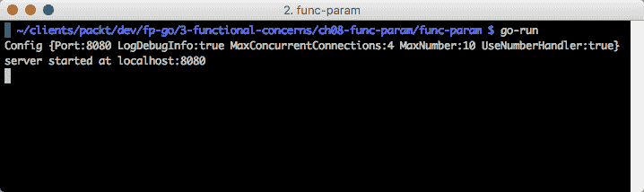

请注意，我们可以通过将以下内容插入到我们的`main`函数的第一行来将配置信息打印到我们的终端：

```go
Info.Printf("Config %+v", Config)
```

“％+v”中的`+`告诉`Printf`函数打印字段名称以及值。

当我们按下*Ctrl* + *C*时，以下行中的代码会在`quit`通道上向我们的 Goroutine 发出信号：

```go
signal.Notify(quit, os.Interrupt)
```

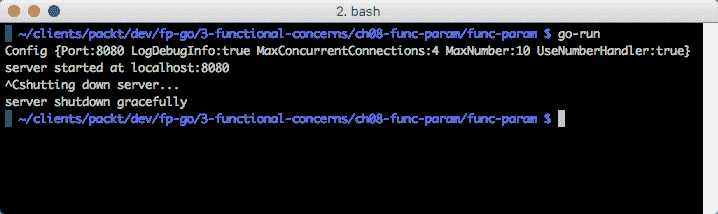

`srv.Shutdown`方法运行，然后`main`中的最后一行执行以打印`server shutdown gracefully`。

在深入了解更多关于我们的`func-param`项目代码之前，让我们更仔细地看看 Go 的`Context`包功能。

## 上下文

上下文主要用于跨多个进程和 API 边界的请求。上下文有助于在对象的不同生命周期阶段穿越各种 API 边界进程时维护有关对象状态的背景信息。

这是一个传递“上下文”参数的示例（来自[`blog.golang.org/context`](https://blog.golang.org/context)）：

```go
func httpDo(ctx context.Context, req *http.Request, f func(*http.Response, error) error) error {
    // Run the HTTP request in a goroutine and pass the response to f.
    tr := &http.Transport{}
    client := &http.Client{Transport: tr}
    c := make(chan error, 1)
    go func() { c <- f(client.Do(req)) }()
    select {
    case <-ctx.Done():
        tr.CancelRequest(req)
        <-c // Wait for f to return.
        return ctx.Err()
    case err := <-c:
        return err
    }
 }
```

将“上下文”参数传递给每个请求中的每个函数可以控制跨 API 和进程边界的请求的超时和取消。此外，它有助于确保诸如安全凭据之类的关键值不会在传输中停留的时间超过必要的时间。

第三方库和框架，例如 Gorilla 的（[`github.com/gorilla/context`](http://github.com/gorilla/context)）包，提供了它们的包和接受上下文请求范围参数的其他包之间的桥梁。这提高了在构建可扩展服务时异构包之间的互操作性。

我们将使用应用程序上下文来控制停止我们的服务器。截止日期确保我们的关闭过程不会超过合理的时间（在我们的示例中为 2 秒）。此外，通过发送取消信号，我们为服务器提供了在关闭之前运行其清理过程的机会。

以下是关于我们的“上下文”参数正在发生的情况的说明：

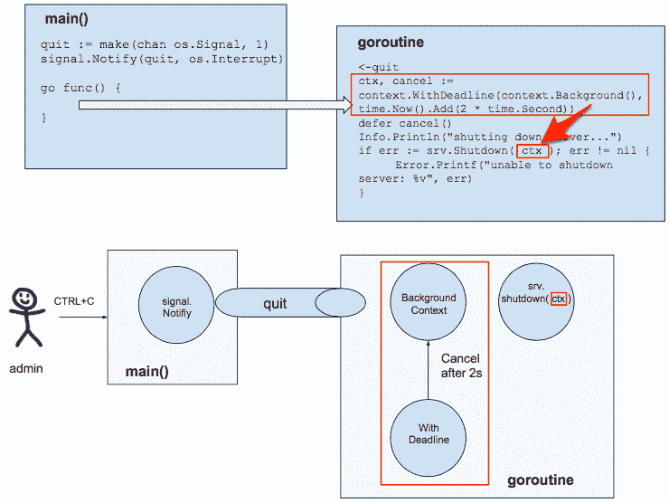

当管理员用户按下*Ctrl* + *C*时，`os.interrupt`会向`quit`（缓冲）通道发出信号。创建了一个截止日期为 2 秒的上下文（ctx）。该上下文参数被发送到`srv.Shutdown`函数，其中执行服务器的清理代码。如果超过 2 秒，那么我们的 Goroutine 将被取消。结果是我们的服务器会优雅地关闭，我们可以确保它不会花费超过 2 秒的时间。

我们可以构建像这样复杂的“上下文”树：

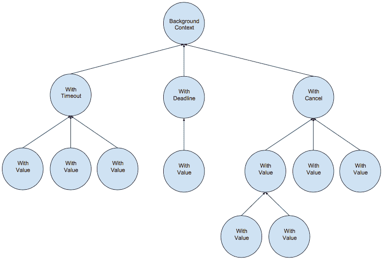

然而，在这样做之前，我们应该意识到我们的`Context`限制，接下来我们将讨论这一点。

### 上下文限制

树可以向上遍历，即从子节点到父节点（而不是相反）。

我们应该只使用建议的值，例如，这个用户的本地名称是`en_US`。`en_US`可以用来增强用户体验，但不能改变应用程序的流程。我们不应该存储可能影响`Context`包中控制流的值。

#### 报告示例

作为在`Context`中存储控制流值所导致的影响的一个例子，让我们考虑以下情况：

```go
func Report(ctx context.Context)  {
   reportName, _ := ctx.Value("reportName").(string)
   filter, _ := ctx.Value("filter").(string)
   RunReport(reportName, filter)
}
```

在前面的例子中，我们只传递了上下文作为参数。在我们的`Report`函数内部，我们提取了修改值`reportName`和 filter 的控制流。现在，我们有了`Report`函数需要完成其工作的格式。

为什么有些人认为在内部查询其他对象的方法以获取做出决策所需的数据或养成传递一个充满数据的大模糊对象的习惯，然后在我们的函数内部提取以知道接下来该做什么是一个好主意？

通常最佳实践是传递函数所需的所有参数。这种编码风格创建了自我说明的 API。如果我们发现我们的参数列表变得很大，即超过六个参数，那么我们应该考虑是否应该重构我们的函数。我们的大函数中是否有可重用的代码？也许我们可以创建一个辅助函数并减少我们的参数印记？

不要忘记我们在第四章中讨论的内容，*Go 中的 SOLID 设计*。*(S)ingle Responsibility principle*表明一个类应该只有一个责任。

如果我们传递了大量参数，我们的函数是否可能执行了多个任务？

### 编写良好的代码与踢好一场足球并无二致

简单地进行。传球要干脆而短。有意识地。控制好球。始终保持对球的关注。

观看业余球员，然后观看一位**精英球员**（**EP**）踢球。主要区别是什么？EP 接球有多好？EP 传球有多好？EP 是否将球传到队友的空间中，还是朝着对手球门的方向踢长传球？

移动（到开放空间），接球，然后传球。做得好的球队一直能赢。我们在谈论什么？接口。能够有效地从一个球员传球到另一个球员的球队赢得更多比赛。

我们可以从中学到东西。如果我们努力编写自我说明的 API（移动到开放空间），那么我们的 API 对我们的客户更加可访问。当我们调用的 API 设计类似（尽可能简单，只需要强制参数，具有合理的默认值）时，我们的系统将具有高度的互操作性和效率。


皇家马德里，一个了不起的球队，进行组合和传球。我们的 API 应该像视频中的皇家马德里队一样进行互操作[`www.youtube.com/watch?v=b6_IUVBAJJ0`](https://www.youtube.com/watch?v=b6_IUVBAJJ0)。

这是一个典型的用例吗？假设足球是我们的数据/消息，我们何时想要传递消息，避开对手，将 API 端点移动并将其不变地存入目标？

#### 功能参数 - Rowe

观看罗的掷界外球。Kelyn Rowe 对球的处理就像调用者中的功能参数可以做的事情一样。将这种魔术与我们在业余足球中看到的传球或在`Context`中传递死值进行比较。


Dom Dwyer 在美国队以 1-0 击败巴拿马；请参考此视频[`www.youtube.com/watch?v=CVXPeGhPXkE`](https://www.youtube.com/watch?v=CVXPeGhPXkE)。

#### 报告示例

`Context`中的值会影响应用程序的控制流。让我们重构一下：

```go
RunReport(reportName, filter)
```

在这种情况下，使用`Context`传递值只会混淆我们的意图，并使我们的代码不太可读。在现实世界的应用程序中，我们很难找到`Context`值的一个好用例。

### 一个更实际的上下文使用案例

一个更实际的`Context`使用案例是向长时间运行的函数发送`Cancel`消息。

在处理数据库事务时，会想到几种用例。

在某些情况下，一个请求可能会生成多个子请求，每个请求运行的时间和消耗的资源各不相同。如果在我们的数据库事务期间，其中一个子请求发生恐慌，我们可以使用`Context`来发出取消所有例程的信号，并释放所有与事务相关的资源：

```go
import (
   "database/sql"
 "github.com/pkg/errors"
)
```

提供对`sql.DB`提交和回滚的访问：

```go
type Transaction interface {
   Commit() error
   Rollback() error
}
```

`TxFunc`参数是提供给`db.WithTransaction`函数的一个功能参数。它将在数据库事务的上下文中执行给定的函数。如果发生错误，则事务将被回滚：

```go
type TxFunc func(tx Transaction) error
```

Db 使用`sql.DB`实现来访问`Begin`和`Commit`事务：

```go
type Dbms struct {
   db *sql.DB
}
```

`WithTransaction`函数是一个提供`Transaction`接口的函数，可以用于在事务中执行 SQL 操作。如果函数返回错误，则事务将被回滚：

```go
func (s Dbms) WithTransaction(fn TxFunc) error {
   var tx         Transaction
   var isCommitted bool
   var err        error
```

开始事务：

```go
tx, err = s.db.Begin()
if err != nil {
   return errors.Wrap(err, "error starting transaction")
}
```

如果事务期间发生错误，则回滚：

```go
defer func() {
   if isCommitted != true {
      tx.Rollback()
   }
}()
```

执行在事务中执行 SQL 操作的函数。

看到`fn(tx)`函数了吗？

这就是我们的函数参数被执行的地方。这就是真正的工作执行的地方。这是执行执行 SQL 查询的逻辑的地方。它在事务的上下文中执行。因此，如果任何查询或子查询失败，整个事务将被回滚：

```go
if err = fn(tx); err != nil {
   return errors.Wrap(err, "error in TxFunc")
}
```

提交事务并将`isCommitted`设置为 true 以指示成功：

```go
    if err = tx.Commit(); err != nil {
      return errors.Wrap(err, "error committing transaction")
   }
   isCommitted = true
 return nil
}
```

我们已经完成了对上下文的查看。现在，回到功能参数解决方案...

#### src/server/server.go

我们可以浏览导入以了解我们将在这个文件中做些什么。我们将处理一些 HTTP 请求，将一些 JSON 转换字符串转换为整数，处理错误，并为我们的服务器实现一个日志记录器：

```go
package server

import (
   "encoding/json"
 "fmt"
 "github.com/pkg/errors"
 "log"
 "net/http"
 "os"
 "strconv"
)
```

我们将定义三个常量，并在定义默认值时使用它们：

```go
const (
   defaultServerMaxMessageSize = 1024 * 1024 * 4
 defaultMaxNumber = 30
 defaultMaxConcurrentConnections = 2
)

var defaultServerOptions = options {
   maxMessageSize:          defaultServerMaxMessageSize,
   maxNumber:               defaultMaxNumber,
   maxConcurrentConnections:  defaultMaxConcurrentConnections,
}
```

我们的`Server`结构有三个字段：

```go
type Server struct {
   logger  Logger
   opts options
   handler http.Handler
}
```

这是`Logger`类型：

```go
type Logger interface {
   Printf(format string, v ...interface{})
}
```

我们使用处理程序提供`ServeHTTP`，这是一个响应 HTTP 请求的`Handler`：

```go
func (s *Server) ServeHTTP(w http.ResponseWriter, r *http.Request) {
   s.handler.ServeHTTP(w, r)
}
```

新的是我们的服务器构造函数。`New`是一个可变函数，接收类型为`ServerOption`的任意数量的功能参数。

请注意，`opt`参数是`ServerOption`类型的可变参数。

我们返回一个指向我们新创建的`Server`对象的指针和惯用的`error`值：

```go
func New(opt ...ServerOption) (*Server, error) {
```

首先，我们使用默认值预填充我们的选项：

```go
   opts := defaultServerOptions
```

然后，我们遍历每个`ServerOption`。以下是`ServerOption`的签名。我们看到我们使用它来定义接受指向选项的函数类型变量：

```go
type ServerOption func(*options) error
```

如果发现错误，我们会将错误包装起来返回并退出这个函数：

```go
   for _, f := range opt {
      err := f(&opts)
      if err != nil {
         return nil, errors.Wrap(err, "error setting option")
      }
   }   
```

在这里，我们创建了我们的`Server`变量，并用功能参数(`opts`)以及一个`logger`填充它：

```go
   s := &Server{
      opts:  opts,
      logger: log.New(os.Stdout, "", 0),
   }
   s.register()
   return s, nil
}
```

在返回调用之前，我们的服务器的`register`方法与我们的 HTTP 多路复用器（mux）一起。mux 将传入的 URL 请求与注册的模式进行匹配，并调用最接近请求的 URL 的模式的处理程序。

这是`register`方法：

```go
func (s *Server) register() {
   mux := http.NewServeMux()
   if s.opts.useNumberHandler {
      mux.Handle("/", http.HandlerFunc(s.displayNumber))
   } else {
      mux.Handle("/", http.FileServer(http.Dir("./")))
   }
   s.handler = mux
}
```

请注意，我们使用`useNumberHandler`选项来确定与我们的根路径"`/`"关联的处理程序。

这是一个虚构的 mux 示例，用于说明服务器选项的用法。在生产中，您可能更好地使用诸如[`github.com/gorilla/mux`](https://github.com/gorilla/mux)和[`github.com/justinas/alice`](https://github.com/justinas/alice)这样的包，以及[`golang.org/pkg/net/http/`](https://golang.org/pkg/net/http/)。

如果`s.opts.useNumberHandler`为`true`，那么 mux 将调用`http.HandlerFunc`函数，并将`displayNumber`函数作为其唯一的函数参数传递。

`displayNumber`函数在一个 HTTP 中使用了一些服务器选项来确定如何处理`request:handler`：

```go
func (s *Server) displayNumber(w http.ResponseWriter, r *http.Request) {
   s.logger.Printf("displayNumber called with number=%s\n", r.URL.Query().Get("number"))
   if numberParam := r.URL.Query().Get("number"); numberParam != "" {
      number, err := strconv.Atoi(numberParam)
      if err != nil {
         writeJSON(w, map[string]interface{}{
            "error": fmt.Sprintf("invalid number (%v)", numberParam),
         }, http.StatusBadRequest)
      }
```

在以下代码块中，我们将用户输入的数字与`maxNumber`服务器选项值进行比较。如果输入值大于最大值，我们显示错误消息；否则，我们继续处理：

```go
      if number > s.opts.maxNumber {
         writeJSON(w, map[string]interface{}{
            "error": fmt.Sprintf("number (%d) too big. Max number: %d", number, s.opts.maxNumber),
         }, http.StatusBadRequest)
      } else {
```

如果没有转换函数（`convertFn`），那么我们将要显示的数字（`displayNumber`）设置为用户输入的值。

但是，如果定义了`convertFn`，我们将数字传递给它，执行它，并将返回值赋给`displayNumber`：

```go
         var displayNumber string
         if s.opts.convertFn == nil {
            displayNumber = numberParam
         } else {
            displayNumber, err = s.opts.convertFn(number)
         }        
```

看看我们如何在`main()`中使用函数文字与`fmt.Sprintf`命令来影响显示的数字？

```go
server.FormatNumber(func(x int) (string, error) { return fmt.Sprintf("%x", x), nil }),
```

要以十六进制格式查看我们的数字，我们将在浏览器中输入以下内容到地址栏：`http://localhost:8080/?number=255`：

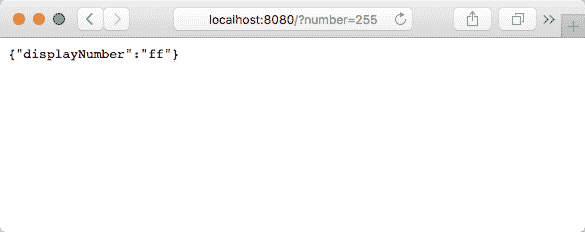

想以不同的格式看`displayNumber`吗？如果是：在终端控制台中输入*Ctrl* + *C*停止应用程序。在`main.go`中，将`fmt.Sprintf("%x", x)`更改为`fmt.Sprintf("%b", x)`，然后输入`go-run`命令重新启动应用程序。

```go
server.FormatNumber(func(x int) (string, error) { return fmt.Sprintf("%b", x), nil }),
```

当我们回到我们的网络浏览器并刷新时，我们会看到我们的数字 255 以二进制格式显示：

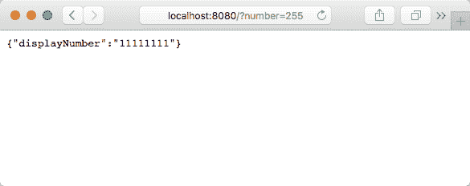

如果我们注释掉`server.FormatNumber`参数，我们将得到用户输入的未经格式化的数字：

```go
//server.FormatNumber . . .  <= comment out FormatNumber parameter
```

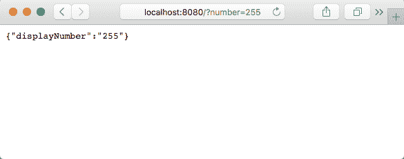

参考以下资源以获取更多的`Sprintf`选项 [`lexsheehan.blogspot.com/search?q=octal+hex+printf`](http://lexsheehan.blogspot.com/2015/02/fmtprintf-format-reference.html)。

如果有错误，我们将显示它。如果没有错误，我们将显示我们的（可能经过格式化的）数字：

```go
         if err != nil {
            writeJSON(w, map[string]interface{}{
               "error": "error running convertFn number",
            }, http.StatusBadRequest)
         } else {
            writeJSON(w, map[string]interface{}{
               "displayNumber": displayNumber,
            })
         }
      }
   } else {
      writeJSON(w, map[string]interface{}{
         "error": "missing number",
      }, http.StatusBadRequest)
   }
}
```

我们将要检查的最后一个项目文件包含我们的`ServerOption`函数。

#### src/server/server_options.go 文件

我们将使用 Go 标准库的 errors 包，因为我们只是想创建一个错误对象：

```go
package server

import (
   . "utils"
 "errors"
)
```

我们定义了一个`ServerOption`类型来简化我们的函数签名：

```go
type ServerOption func(*options) error
```

柯里化允许函数产生新的函数作为它们的返回值。`MaxNumber`正在这样做吗？`MaxNumber`是一个函数，并返回一个`ServerOption`。`SeverOption`是一个函数。所以，是的。我们在这里进行了柯里化。

我们的第一个`ServerOption`函数是`MaxNumber`。它有一个简单的职责：将其参数（`n`）的值分配给我们选项的`maxNumber`字段：

```go
func MaxNumber(n int) ServerOption {
   return func(o *options) error {
      o.maxNumber = n
      return nil
   }
}
```

请注意，`MaxNumber`是一个返回错误的函数。由于在此函数中不可能发生错误，我们只是返回 nil。

其他`ServerOption`函数可能更复杂，我们可能会在其中一些非平凡的函数中遇到错误条件，并且需要返回一个错误。

`MaxConcurrenConnections`函数有一个条件语句，如下所示：

```go
func MaxConcurrentConnections(n int) ServerOption {
   return func(o *options) error {
      if n > Config.MaxConcurrentConnections {
         return errors.New("error setting MaxConcurrentConnections")
      }
      o.maxConcurrentConnections = n
      return nil
   }
}
```

接下来的两个函数提供了格式化我们输入数字的能力。

`convert`类型是一个接受 int 并返回 string 和可能的错误的函数类型：

```go
type convert func(int) (string, error)
```

`FormatNumber`函数是另一个`ServerOption`。与其他接受标量输入值的函数不同，`FormatNumber`接受类型为`convert`的函数参数：

```go
func FormatNumber(fn convert) ServerOption {
   return func(o *options) (err error) {
      o.convertFn = fn
      return
 }
}
```

让我们再看一下`main()`，在那里调用了`FormatNumber`：

```go
server.FormatNumber(func(x int) (string, error) { return fmt.Sprintf("%x", x), nil }),
```

`FormatNumber`函数的参数作为函数参数传递。它是一个满足转换函数类型签名的匿名函数：

```go
type convert func(int) (string, error)
```

该函数接受一个`int`并返回一个字符串和一个错误。

`FormatNumber`只有一个语句——返回语句。它在执行转换函数（fn）后返回一个`ServerOption`函数。

不要被这样一个事实所困惑，即我们知道转换函数接收一个 int，但在匿名返回函数中我们看不到它：`o.convertFn = fn`。

代码行`o.convertFn = fn`由`main()`执行；当它运行时，创建了`newServer`值：

```go
newServer, err := server.New( . . .
```

它所做的是将`fn`函数分配给`convertFn`函数的`SeverOption`值：

```go
func New(opt ...ServerOption) (*Server, error) {
   opts := defaultServerOptions
   for _, f := range opt {
      err := f(&opts)
```

直到用户提交请求并且该请求由`displayNumber`函数处理时，才执行以下行：

```go
displayNumber, err = s.opts.convertFn(number)
```

这就是`int`数字实际传递给`convertFn`函数的地方。

最后一个`ServerOption`函数是`UserNumberHandler`。它很简单，很像`MaxNumber`：

```go
func UseNumberHandler(b bool) ServerOption {
   return func(o *options) error  {
      o.useNumberHandler = b
      return nil
   }
}
```

## 总结

Go 是使用函数式编程和面向对象编程世界中的好思想设计的。例如，Go 从面向对象编程世界借鉴了接口、鸭子类型和组合优于继承的概念，从函数式编程世界借鉴了函数作为一等公民的概念。

Go 是实用主义的完美例子。Go 吸收了面向对象编程和函数式编程范式中更好的原则，同时明显地忽略了许多思想。也许，这种完美平衡的设计是使 Go 如此特别的原因？从这个角度看，Go 是软件语言的完美比例。

有关黄金比例的讨论，请参阅第十一章，*适用的范畴论*。

在下一章中，我们将更深入地探讨纯函数式编程。我们将看到如何利用范畴论和类类型来抽象细节以获得新的见解。我们将研究函子以及稍微更强大和更有用的函子的版本，称为应用函子。您还将学习如何使用单子和幺半群控制副作用世界。
