# 第八章：使用管道提高性能

通常，我们感到需要处理一些数据并将其传递到一系列步骤中，在到达目的地之前沿途对其进行转换。我们经常在现实生活场景中遇到这种过程，特别是在工厂装配线环境中。

在本章中，我们将看到如何使用管道模式来构建基于组件的应用程序。我们将看到如何使用函数组合数据流编程技术来创建灵活的解决方案，这些解决方案不仅健壮，而且在当今的分布式处理环境中也具有高性能。

我们在本章的目标是：

+   能够确定何时使用管道模式

+   学习如何构建管道

+   了解如何利用缓冲来增加吞吐量

+   使用 Goroutines 和通道更快地处理数据

+   使用接口提高 API 可读性

+   实现有用的过滤器

+   构建灵活的管道

+   查看更改过滤器顺序并提交无效数据时会发生什么

## 介绍管道模式

管道软件设计模式用于数据流经过一系列阶段的情况，其中前一阶段的输出是下一阶段的输入。每个步骤都可以被视为一种过滤操作，以某种方式转换数据。在过滤器之间经常实现缓冲，以防止死锁或当一个过滤器比连接到它的另一个过滤器运行得更快时发生数据丢失。将过滤器连接到管道中类似于函数组合。

以下图表描述了数据从数据源（例如文件）流过滤器直到最终在控制台上的标准输出中显示的流程：

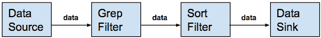

### Grep 排序示例

`/etc/group`文件是数据源。Grep 是第一个过滤器，其输入是来自`/etc/group`文件的所有行。`grep`命令删除所有不以`"com"`开头的行，然后将其输出发送到 Unix 管道，该管道将数据发送到`sort`命令：

```go
$ grep "^com" /etc/group | sort com.apple.access_disabled:*:396: com.apple.access_ftp:*:395: com.apple.access_screensharing:*:398: com.apple.access_sessionkey:*:397: com.apple.access_ssh:*:399:
```

让我们明确一点。我们在本章中涵盖的行为类似于 Unix 管道，但我们将研究的是使用 Go 实现的管道，主要使用 Go 通道和 Goroutines。同样，我们不会讨论 Go Pipes（[`golang.org/pkg/os/#Pipe`](https://golang.org/pkg/os/#Pipe)），除了它们是无缓冲的、无结构的字节流。

### 管道特性

管道模式提供了许多有价值的优点，这些优点在正确设计的应用程序中是可取的；这些优点如下：

+   提供了一个处理数据的系统结构

+   将任务分解为顺序步骤

+   封装每个步骤的过滤器

+   独立的过滤器（独立运行）具有一组输入和输出

+   数据通过管道单向传递

+   可配置的模块化（读取、写入、拆分和合并操作）

+   高内聚，过滤器逻辑是自包含的

+   低耦合，过滤器通过连接管道进行通信

+   批处理和在线处理之间的区别消失

管道模式具有许多特点，使其在各种用例中都很有吸引力。我们看到它在技术中的应用范围从持续集成和部署管道到批处理和流数据处理。如果需要以装配线方式处理数据流，那么我们应该考虑使用这种管道模式。

让我们来看看优势：

+   **可扩展性**：向管道添加另一个过滤器

+   **灵活性**：通过连接过滤器进行函数组合

+   **性能**：利用多处理器系统

+   **可测试性**：易于分析、评估和测试管道过滤器系统

与任何模式一样，我们必须考虑其潜在问题。

以下是一些缺点：

+   潜在的数据转换开销

+   潜在的死锁和缓冲区溢出

+   如果基础设施丢失了过滤器之间流动的数据，可能会出现潜在的可靠性问题

+   如果过滤器在向下游发送结果后失败，但在成功完成处理之前指示失败，则可能需要重新处理数据（在管道中设计过滤器为幂等）

+   潜在的大上下文，因为每个过滤器必须提供足够的上下文来执行其工作

以下是一些高级用例，如果适用，使得这种管道模式成为一个有吸引力的设计解决方案候选：

+   处理要求可以分解为一组独立的步骤

+   过滤器操作可以利用多核处理器或分布式计算

+   每个过滤器都有不同的可扩展性要求

+   必须容纳处理步骤的重新排序的系统

### 示例

现在，让我们看一些示例，以帮助理解这种管道模式的价值和适用性。

#### 网站订单处理

以下图示了订单从网站显示订单表单到用户的流程。沿途的过滤器执行各种任务，如解密请求有效载荷，验证用户凭据，向客户信用卡收费，发送确认电子邮件给客户，最后显示感谢页面。


#### 老板工人模式

在老板工人模式中，**老板**过滤器将数据推送到处理数据并将结果合并到**产品**中的工作人员：

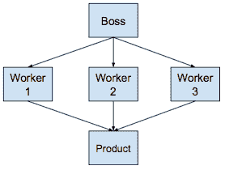

#### 负载均衡器

以下示例显示了一个**负载均衡器**，它接收来自客户端的请求并将其发送到具有最小积压和最可用于处理请求信息包的服务器：

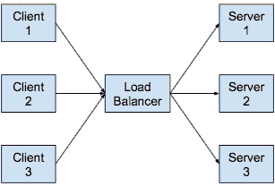

#### 数据流类型

数据流类型可以被视为**读取**、**分割**、**合并**和**写入**操作：

| **过滤器类型** | **图像** | **接收** | **发送** | **描述** |
| --- | --- | --- | --- | --- |
| **读取** | 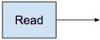 |  |  | **读取**过滤器从数据源读取数据并将信息包发送到下游。 |
| **分割** | 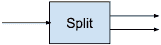 |  |  | 多个函数从同一通道读取，直到该通道关闭。通过将工作分配给一组工作人员以并行化 CPU 使用，可以提高性能。 |
| **转换** | 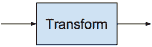 |  |  | 这个过滤器从上游接收数据，对其进行转换，然后发送到下游。 |
| **合并** | 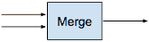 |  |  | 这个函数从多个输入通道读取数据，然后将其发送到一个通道，当所有输入都关闭时，该通道也关闭。工作可以分配给多个 Goroutines，它们都从同一个输入通道读取。 |
| **写入** |  |  |  | 这个过滤器从上游接收数据并将其写入到汇聚处。 |

##### 基本构建块

这些是基于流的编程系统的基本构建块。有了这些基本操作，我们可以构建任何基于组件的系统：

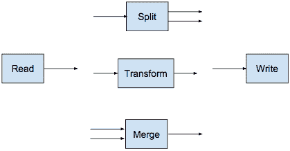

基于流的编程是一种组件化的编程模型，它将应用程序定义为一组异步处理操作（又名过滤器）的网络，这些操作交换具有定义的生命周期、命名端口和连接的结构化信息包流（[`en.wikipedia.org/wiki/Stream_(computing)`](https://en.wikipedia.org/wiki/Stream_(computing))）。

#### 通用业务应用程序设计

以下图表描述了一个通用业务应用程序的组件组成图，该应用程序处理输入请求并将请求路由到后端服务器。随后处理、处理和返回服务器的响应。存在一些需要重新路由或重新处理的响应的备用数据流：

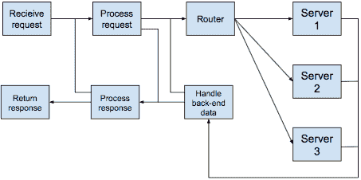

请注意，只要其输入和输出集相同，每个操作都可以被交换，而不会影响数据流或应用程序的整体操作。

## 示例实现

既然我们看到了管道模式的价值，让我们开始规划一个 Go 实现。

在 Go 中，管道是使用一系列通过 Go 通道连接的阶段实现的。Go 管道以数据源（又名生产者）开始，具有通过通道连接的阶段，并以数据接收端（又名消费者）结束。

数据源可以是一个生成器函数，它将数据发送到第一个阶段，然后关闭初始出站通道。

管道中的每个过滤器（步骤或阶段）：

+   由一个或多个 Goroutines 组成，运行相同的函数（又名过滤器）

+   通过一个或多个入站通道接收上游数据

+   以某种方式转换数据

+   通过一个或多个出站通道向下游发送数据

+   当所有发送操作完成时，关闭其出站通道

+   保持从入站通道接收值，直到这些通道关闭

示例转换函数包括以下内容：

+   累加器

+   聚合器

+   Delta（用于计算资源的两个样本数据点之间的变化）

+   算术

示例数据接收端包括以下内容：

+   文件存储（例如，NFS 和 CIFS/SMB 协议访问 NAS 或 DAS）

+   消息代理（例如，Kafka、NATS 和 RabbitMQ）

+   数据库（例如，PostgreSQL、MongoDB 和 DynamoDB）

+   云存储（例如，S3、OpenStack Swift 和 Ceph）

### 命令式实现

让我们从管道的最简单形式开始我们的编码示例，当然，这是使用命令式编程风格实现的。

#### 解密、认证、收费流程图

我们将基于以下流程图进行编码示例：

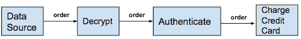

我们将从阶段到阶段传递订单数据，直到整个过程完成。订单数据可以在途中进行转换，例如，当**解密**步骤将信用卡号转换为明文时。我们将把每个阶段或步骤称为过滤器。在我们的示例中，每个过滤器将从上游接收一个订单并将一个订单发送到下游。流是单向的。它从数据源开始，经过**解密**过滤器，然后到**认证**过滤器，最后到**收费信用卡**过滤器：

```go
package main

import (
       "fmt"  gc "github.com/go-goodies/go_currency" )
```

我们将导入`go_currency`包，它将帮助我们处理订单行项目中的价格：

```go
type Order struct {
       OrderNumber int
       IsAuthenticated bool
       IsDecrypted bool
       Credentials string
       CCardNumber string
       CCardExpDate string
       LineItems []LineItem
}
type LineItem struct {
       Description string
       Count       int
       PriceUSD    gc.USD
}
```

`GetOrders()`函数将是我们的订单生成数据源。请注意，信用卡号以加密格式存储。我们需要稍后解密它们以便收取信用卡费用：

```go
func GetOrders() []*Order {

       order1 := &Order{
              10001,
              false,
              false,
              "alice,secret",
              "7b/HWvtIB9a16AYk+Yv6WWwer3GFbxpjoR+GO9iHIYY=",
              "0922",
              []LineItem{
              LineItem{"Apples", 1, gc.USD{4, 50}},
              LineItem{"Oranges", 4, gc.USD{12, 00}},
              },
       }
```

请注意，我们的信用卡号已加密，最后一个字段是`LineItem`结构的切片：

```go
        order2 := &Order{
              10002,
              false,
              false,
              "bob,secret",
              "EOc3kF/OmxY+dRCaYRrey8h24QoGzVU0/T2QKVCHb1Q=",
              "0123",
              []LineItem{
                     LineItem{"Milk", 2, gc.USD{8, 00}},
                     LineItem{"Sugar", 1, gc.USD{2, 25}},
                     LineItem{"Salt", 3, gc.USD{3, 75}},
              },
       }
       orders := []*Order{order1, order2}
       return orders
}
```

在我们的示例中，我们只处理两个订单。我们将它们作为`Order`结构的切片从`GetOrders()`函数返回。

我们调用`GetOrder()`函数来生成我们的订单。接下来，我们遍历我们的订单，依次通过我们的订单处理管道运行每个订单：

```go
func main() {
       orders := GetOrders()
       for _, order := range orders {
              fmt.Printf("Processed order: %v\n", Pipeline(*order))
       }
}
```

我们的管道有三个步骤。每个步骤都是一个我们将称之为过滤器的函数。我们的订单通过三个顺序过滤器进行处理：

```go
func Pipeline(o Order) Order {
       o = Authenticate(o)
       o = Decrypt(o)
       o = Charge(o)
       return o
}
```

以下是输出：

```go
Order 10001 is Authenticated
Order 10001 is Decrypted
Order 10001 is Charged
Processed order: {10001 true alice,secret 7b/HWvtIB9a16AYk+Yv6WWwer3GFbxpjoR+GO9iHIYY= 0922 [{Apples 1 4.50} {Oranges 4 12.00}]}
Order 10002 is Authenticated
Order 10002 is Decrypted
Order 10002 is Charged
Processed order: {10002 true bob,secret EOc3kF/OmxY+dRCaYRrey8h24QoGzVU0/T2QKVCHb1Q= 0123 [{Milk 2 8.00} {Sugar 1 2.25} {Salt 3 3.75}]}
```

由于我们从最简单的示例开始，在每个过滤器中都输出了正在发生的过滤器动作，并且我们在这个简单的示例中将订单传递了下去，而没有以任何方式对其进行转换：

```go
func Authenticate(o Order) Order  {
       fmt.Printf("Order %d is Authenticated\n", o.OrderNumber)
       return o
}

func Decrypt(o Order) Order {
       fmt.Printf("Order %d is Decrypted\n", o.OrderNumber)
       return o
}

func Charge(o Order) Order {
       fmt.Printf("Order %d is Charged\n", o.OrderNumber)
       return o
}
```

这是管道的基本思想。我们接收一个数据包，例如一个订单，并将其从一步传递到另一步，其中每一步都是具有特定专业性的过滤器函数。数据可以在途中进行转换，并且沿着一条方向从数据源到终点，即结束处理的地方。

### 并发实现

为了提高性能，我们应该考虑并发运行。Go 语言有一些并发构造，我们可以使用：Goroutines 和 channels。让我们试试：

```go
func main() {
       input := make(chan Order)
       output := make(chan Order)

       go func() {
              for order := range input {
                     output <- Pipeline(order)
              }
       }()

       orders := GetOrders()
       for _, order := range orders {
              fmt.Printf("Processed order: %v\n", Pipeline(*order))
       }
       close(input)
}
```

我们为我们的管道创建了一个输入通道和一个输出通道。

接下来，我们创建了一个立即可执行的 Goroutine 函数。请注意 Goroutine 块末尾的括号：`}()`。直到我们在主函数的最后一行关闭输入通道之前，这个 Goroutine 不会退出。

我们生成一个订单，就像在我们的命令式示例中一样。然后，我们通过将下一个订单传递给管道来处理每个订单。

输出与命令式示例相同，但运行速度较慢。因此，我们降低了性能并增加了代码复杂性。我们可以做得更好。

### 缓冲实现

让我们尝试使用输入/输出缓冲区。

在下图中，管道的每个阶段都从其输入缓冲区读取并写入其输出缓冲区。例如，**解密**过滤器从其输入缓冲区读取，来自数据源，并写入其输出缓冲区：

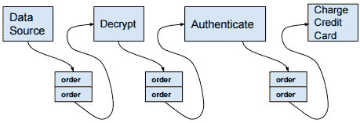

由于有两个订单，缓冲区大小为两。由于并发队列的缓冲区共享输入和输出，如果有四个订单，那么管道中的所有过滤器都可以同时执行。如果有四个 CPU 核心可用，那么所有过滤器都可以并发运行。

只要其输出缓冲区有空间，管道的一个阶段就可以将其产生的值添加到其输出队列中。如果输出缓冲区已满，新值的生产者将等待直到空间可用。

过滤器可以阻塞，等待订单到达其输入缓冲区，或者直到其输入通道被关闭。

缓冲区可以有效地用于一次容纳多个订单，这可以弥补每个过滤器处理每个订单所需时间的变化。

在最理想的情况下，管道沿线的每个过滤器将以大致相同的时间处理其输入订单。然而，如果**解密**过滤器处理订单的时间远远长于**认证**过滤器，**认证**过滤器将被阻塞，等待**解密**将解密后的订单发送到其输入缓冲区。

以下是我们如何修改我们的程序以包含缓冲通道：

```go
func main() {
       orders := GetOrders()
       numberOfOrders := len(orders)
       input := make(chan Order, numberOfOrders)
       output := make(chan Order, numberOfOrders)
       for i := 0; i < numberOfOrders; i++ {
              go func() {
                     for order := range input {
                            output <- Pipeline(order)
                     }
              }()
       }
       for _, order := range orders {
              input <- *order
       }
       close(input)
       for i := 0; i < numberOfOrders; i++ {
              fmt.Println("The result is:", <-output)
       }
}
```

以下是输出：

```go
Order 10001 is Authenticated
Order 10001 is Decrypted
Order 10001 is Charged
Order 10002 is Authenticated
Order 10002 is Decrypted
Order 10002 is Charged
The result is: {10001 true alice,secret 7b/HWvtIB9a16AYk+Yv6WWwer3GFbxpjoR+GO9iHIYY= 0922 [{Apples 1 4.50} {Oranges 4 12.00}]}
The result is: {10002 true bob,secret EOc3kF/OmxY+dRCaYRrey8h24QoGzVU0/T2QKVCHb1Q= 0123 [{Milk 2 8.00} {Sugar 1 2.25} {Salt 3 3.75}]}
```

这很棒，对吧？通过添加缓冲通道，我们提高了性能。我们的解决方案可以同时在多个核心上并发运行过滤器。

这很好，但如果我们处理大量订单怎么办？

#### 利用所有 CPU 核心

我们可以通过可用的 CPU 核心数量增加缓冲区的数量：

```go
func main() {
       orders := GetOrders()
       numberOfOrders := len(orders)
       cpus := runtime.NumCPU()
       runtime.GOMAXPROCS(cpus)
       input := make(chan Order, cpus)
       output := make(chan Order, cpus)
       for i := 0; i < numberOfOrders; i++ {
              go func() {
                     for order := range input {
                            output <- Pipeline(order)
                     }
              }()
       }
       for _, order := range orders {
              input <- *order
       }
       close(input)
       for i := 0; i < numberOfOrders; i++ {
              fmt.Println("The result is:", <-output)
       }
}
```

使用 I/O 缓冲区是对我们设计的改进，但实际上有更好的解决方案。

### 改进的实现

让我们再次看看我们的订单处理管道：


现在，让我们使用更接近实际生活的例子来实现**解密，认证**和**信用卡扣款**过滤器。

`Order`和`LineItem`结构将保持不变，`GetOrders()`生成器也将保持不变。

#### 导入

我们有更多的导入。我们将使用`go_utils`的`Dashes`函数来对信用卡号进行匿名化。此外，我们将导入许多`crypto`包来解密信用卡号：

```go
package main

import (
       "log"  "fmt"  gc "github.com/go-goodies/go_currency"  gu "github.com/go-goodies/go_utils"  "strings"  "crypto/aes"  "crypto/cipher"  "crypto/rand"  "encoding/base64"  "errors"  "io"  "bytes" )
```

#### BuildPipeline

我们有一个新的函数`BuildPipeline()`，它接受一系列过滤器，并使用每个过滤器的输入和输出通道将它们连接起来。`BuildPipeline()`函数铺设了管道，从数据源开始，到终点，也就是`Charge`过滤器：

```go
func main() {
       pipeline := BuildPipeline(Authenticate{}, Decrypt{}, Charge{})
```

#### 立即可执行的 Goroutine

接下来，是立即可执行的 Goroutine，它迭代生成的订单，并将每个订单发送到该过滤器的输入：

```go
go func(){
       orders := GetOrders()
       for _, order := range orders {
              fmt.Printf("order: %v\n", order)
              pipeline.Send(*order)
       }
       log.Println("Close Pipeline")
       pipeline.Close()
}()
```

当所有订单都被发送到管道中时，是时候关闭管道的输入通道了。

#### 接收订单

接下来，我们执行管道的`Receive()`函数，等待订单到达输出通道，然后打印订单：

```go
        pipeline.Receive(func(o Order){
              log.Printf("Received: %v", o)
       })
}
```

以下是输出：

```go
order: &{10001 true alice,secret 7b/HWvtIB9a16AYk+Yv6WWwer3GFbxpjoR+GO9iHIYY= 0922 [{Apples 1 4.50} {Oranges 4 12.00}]}
order: &{10002 true bob,secret EOc3kF/OmxY+dRCaYRrey8h24QoGzVU0/T2QKVCHb1Q= 0123 [{Milk 2 8.00} {Sugar 1 2.25} {Salt 3 3.75}]}
Credit card XXXXXXXXXXXX1111 charged 16.50
Credit card XXXXXXXXXXXX5100 charged 14.00
2017/03/08 03:05:36 Close Pipeline
2017/03/08 03:05:36 Received: {10001 true alice,secret 4111111111111111 0922 [{Apples 1 4.50} {Oranges 4 12.00}]}
2017/03/08 03:05:36 Received: {10002 true bob,secret 5105105105105100 0123 [{Milk 2 8.00} {Sugar 1 2.25} {Salt 3 3.75}]}
```

#### Filterer 接口

我们的管道 API 是围绕`Filterer`接口构建的：

```go
type Filterer interface {
       Filter(input chan Order) chan Order
}
```

#### Filterer 对象

Filterer 对象有一个方法`Filter`，它具有类型为`Order`的输入通道，并返回类型为`Order`的输出通道：

！[](img/524bf1d3-8f54-4431-acd1-da49e4472a9b.png)

我们定义类型来充当`Filter`执行的接收器。在管道中遇到的第一个过滤器是 Authenticate 过滤器。以下 Authenticate 过滤器有一个输入参数，类型为`Order`通道，并返回一个类型为`Order`通道的单个值。

#### 认证过滤器

我们的认证逻辑是硬编码的和简单的，即不是我所说的生产就绪。密码`secret`对于任何用户名都有效。如果`Authenticate`在`Credentials`字段中遇到`secret`，订单将不变地流向管道中的下一步。但是，如果密码不是`secret`，那么订单的`isValid`字段将被设置为`false`。管道中后续过滤器的行为可能会受到这个值的影响：

```go
type Authenticate struct {}
func (a Authenticate) Filter(input chan Order) chan Order {
       output := make(chan Order)
       go func(){
              for order := range input {
                     usernamePwd := strings.Split(order.Credentials, ",")
                     if usernamePwd[1] == "secret" {
                            order.IsAuthenticated = true
                            output <- order
                     } else {
                            order.IsAuthenticated = false
                            errMsg := fmt.Sprintf("Error: Invalid password for order Id: %d", order.OrderNumber)
                            log.Println("Error:", errors.New(errMsg))
                            output <- order
                     }
              }
              close(output)
       }()
       return output
}
```

#### 解密过滤器

以下`Decrypt`过滤器有一个输入参数，类型为`Order`通道，并返回一个类型为`Order`通道的单个值：

```go
type Decrypt struct {}
func (d Decrypt) Filter(input chan Order) chan Order {
       output := make(chan Order)
       go func(){
              for order := range input {
                     creditCardNo, err := decrypt(order.CCardNumber)
                     if err != nil {
                            order.IsDecrypted = false
                            log.Println("Error:", err.Error())
                     } else {
                            order.IsDecrypted = true
                            order.CCardNumber = creditCardNo
                            output <- order
                     }
              }
```

请注意，我们通过记录错误来处理错误。即使我们被告知当它从源头到达时，`IsDecrypted`字段值总是 false，如果我们遇到错误，我们也会安全地设置`order.IsDecrypted = false`。

只有在订单有效时我们才处理此订单。如果解密函数失败，订单可能无效，请参考前面的代码。订单也可能在流程的前一步中无效，例如，如果订单的`Authenticate`过滤器失败。

##### 完整处理

当此过滤器的处理完成时，我们关闭其输出通道：

```go
               close(output)
       }()
       return output
}
```

##### ChargeCard 辅助函数

`ChargeCard`函数是`Charge`过滤器使用的辅助函数，用于收取订单中的信用卡号。这个实现只是简单地打印信用卡已经被收取。这是一个真实的信用卡收费逻辑的良好占位符：

```go
func ChargeCard(ccardNo string, amount gc.USD) {
       fmt.Printf("Credit card %v%v charged %v\n", gu.Dashes(len(ccardNo)-4, "X"), ccardNo[len(ccardNo)-4:], amount)
}
```

#### 收费过滤器

与 API 中的所有其他过滤器一样，`Charge`接受类型为`Order`的输入通道，并返回类型为`Order`的输出通道。

如果订单有效，我们使用`total := gc.USD{0, 0}`语句将总额初始化为$0.00，并迭代订单的行项目，执行`Add`函数以得到订单的总金额。然后我们将该金额传递给`ChargeCard`辅助函数来收取我们的钱：

```go
type Charge struct {}
func (c Charge) Filter(input chan Order) chan Order {
       output := make(chan Order)
       go func(){
              for order := range input {
                     if order.IsAuthenticated && order.IsDecrypted {
                            total := gc.USD{0, 0}
                            for _, li := range order.LineItems {
                                   total, _ = total.Add(li.PriceUSD)
                            }
                            ChargeCard(order.CCardNumber, total)
                            output <- order
                     } else {
                            errMsg := fmt.Sprintf("Error: Unable to charge order Id: %d", order.OrderNumber)
                            log.Println("Error:", errors.New(errMsg))
                     }
              }
              close(output)
       }()
       return output
}
```

#### 加密和解密辅助函数

以下代码中的`decrypt`辅助函数被`Decrypt`过滤器使用。我们还有`encrypt`辅助函数，虽然不在我们的管道中，但可以很好地加密纯文本和用于测试目的。

`decrypt`函数接受加密的字符串值。`aes.NewCipher`接受我们的 32 字节长 AES 加密密钥并返回一个 AES-256 密码块，该密码块传递给`NewCBCDecrypter`。`NewCBCDecrypter`函数还接受一个初始化向量（`iv`），它用于在密码块链接模式下解密块。它的`CryptBlocks`函数用于解密值，`RightTrim`用于切掉尾随的`\x00`。哇！我们得到了我们的解密字符串值：

```go
var AESEncryptionKey = "a very very very very secret key"  func encrypt(rawString string) (string, error) {
       rawBytes := []byte(rawString)
       block, err := aes.NewCipher([]byte(AESEncryptionKey))
       if err != nil {
              return "", err
       }
       if len(rawBytes)%aes.BlockSize != 0 {
              padding := aes.BlockSize - len(rawBytes)%aes.BlockSize  padText := bytes.Repeat([]byte{byte(0)}, padding)
              rawBytes = append(rawBytes, padText...)
       }
       ciphertext := make([]byte, aes.BlockSize+len(rawBytes))
       iv := ciphertext[:aes.BlockSize]
       if _, err := io.ReadFull(rand.Reader, iv); err != nil {
              return "", err
       }
       mode := cipher.NewCBCEncrypter(block, iv)
       mode.CryptBlocks(ciphertext[aes.BlockSize:], rawBytes)
       return base64.StdEncoding.EncodeToString(ciphertext), nil
}
func decrypt(encodedValue string) (string, error) {
       block, err := aes.NewCipher([]byte(AESEncryptionKey))
       if err != nil {
              return "", err
       }
       b, err := base64.StdEncoding.DecodeString(encodedValue)
       if err != nil {
              return "", err
       }
       if len(b) < aes.BlockSize {
              return "", errors.New("ciphertext too short")
       }
       iv := b[:aes.BlockSize]
       b = b[aes.BlockSize:]
       if len(b)%aes.BlockSize != 0 {
              return "", errors.New("ciphertext is not a multiple of the block size")
       }
       mode := cipher.NewCBCDecrypter(block, iv)
       mode.CryptBlocks(b, b)
       b = bytes.TrimRight(b, "\x00")
       return string(b), nil
}
```

### 测试应用程序如何处理无效数据

让我们看看我们的应用程序如何处理坏数据。

#### 无效信用卡密文

请注意已附加到加密信用卡号值的 XXX：

```go
func GetOrders() []*Order {

       order1 := &Order{
              10001,
              true,
              "alice,secret",
              "7b/HWvtIB9a16AYk+Yv6WWwer3GFbxpjoR+GO9iHIYY=XXX",
              "0922",
              []LineItem{
                     LineItem{"Apples", 1, gc.USD{4, 50}},
                     LineItem{"Oranges", 4, gc.USD{12, 00}},
              },
       }
```

以下是输出：

```go
2017/03/08 04:23:03 Error: illegal base64 data at input byte 44
2017/03/08 04:23:03 Close Pipeline
2017/03/08 04:23:03 Received: {10002 true bob,secret 5105105105105100 0123 [{Milk 2 8.00} {Sugar 1 2.25} {Salt 3 3.75}]}
order: &{10001 true alice,secret 7b/HWvtIB9a16AYk+Yv6WWwer3GFbxpjoR+GO9iHIYY=XXX 0922 [{Apples 1 4.50} {Oranges 4 12.00}]}
order: &{10002 true bob,secret EOc3kF/OmxY+dRCaYRrey8h24QoGzVU0/T2QKVCHb1Q= 0123 [{Milk 2 8.00} {Sugar 1 2.25} {Salt 3 3.75}]}
Credit card XXXXXXXXXXXX5100 charged 14.00
```

具有无效信用卡号的订单未完全处理。请注意日志中的错误消息。

#### 无效密码

请注意已附加到凭据字段值的 XXX：

```go
func GetOrders() []*Order {

       order1 := &Order{
              10001,
              false,
              "alice,secretXXX",
              "7b/HWvtIB9a16AYk+Yv6WWwer3GFbxpjoR+GO9iHIYY=",
              "0922",
              []LineItem{
                     LineItem{"Apples", 1, gc.USD{4, 50}},
                     LineItem{"Oranges", 4, gc.USD{12, 00}},
              },
       }
```

以下是输出：

```go
order: &{10001 false alice,secretXXX 7b/HWvtIB9a16AYk+Yv6WWwer3GFbxpjoR+GO9iHIYY= 0922 [{Apples 1 4.50} {Oranges 4 12.00}]}
2017/03/08 04:49:30 Close Pipeline
order: &{10002 false bob,secret EOc3kF/OmxY+dRCaYRrey8h24QoGzVU0/T2QKVCHb1Q= 0123 [{Milk 2 8.00} {Sugar 1 2.25} {Salt 3 3.75}]}
2017/03/08 04:49:30 Error: Error: Invalid password for order Id: 10001
Credit card XXXXXXXXXXXX5100 charged 14.00
2017/03/08 04:49:30 Received: {10002 true bob,secret 5105105105105100 0123 [{Milk 2 8.00} {Sugar 1 2.25} {Salt 3 3.75}]}
```

具有无效密码的订单未完全处理。请注意日志中的错误消息。

#### 更改身份验证和解密过滤器的顺序

以前，订单是`Decrypt{}，Authenticate{}，Charge{}`：

```go
func main() {
       pipeline := BuildPipeline(Authenticate{}, Decrypt{}, Charge{})
```

以下是输出：

```go
order: &{10001 false alice,secret 7b/HWvtIB9a16AYk+Yv6WWwer3GFbxpjoR+GO9iHIYY= 0922 [{Apples 1 4.50} {Oranges 4 12.00}]}
2017/03/08 04:52:46 Close Pipeline
order: &{10002 false bob,secret EOc3kF/OmxY+dRCaYRrey8h24QoGzVU0/T2QKVCHb1Q= 0123 [{Milk 2 8.00} {Sugar 1 2.25} {Salt 3 3.75}]}
2017/03/08 04:52:46 Received: {10001 true alice,secret 4111111111111111 0922 [{Apples 1 4.50} {Oranges 4 12.00}]}
Credit card XXXXXXXXXXXX1111 charged 16.50
2017/03/08 04:52:46 Received: {10002 true bob,secret 5105105105105100 0123 [{Milk 2 8.00} {Sugar 1 2.25} {Salt 3 3.75}]}
Credit card XXXXXXXXXXXX5100 charged 14.00
```

有所不同。在这两种情况下，两张发票都已完全处理。

#### 在解密信用卡号和身份验证之前尝试收费

我们首先构建了我们的函数管道：Charge，Decrypt 和 Authenticate。

```go
func main() {
       pipeline := BuildPipeline(Charge{}, Decrypt{}, Authenticate{})
```

以下是输出：

```go
order: &{10001 false alice,secret 7b/HWvtIB9a16AYk+Yv6WWwer3GFbxpjoR+GO9iHIYY= 0922 [{Apples 1 4.50} {Oranges 4 12.00}]}
order: &{10002 false bob,secret EOc3kF/OmxY+dRCaYRrey8h24QoGzVU0/T2QKVCHb1Q= 0123 [{Milk 2 8.00} {Sugar 1 2.25} {Salt 3 3.75}]}
2017/03/08 04:58:27 Error: Error: Unable to charge order Id: 10001
2017/03/08 04:58:27 Error: Error: Unable to charge order Id: 10002
2017/03/08 04:58:27 Close Pipeline
```

#### 在身份验证之前尝试收费

这里也没有什么意外。如果我们在身份验证请求之前尝试收费信用卡，收费将不会被处理：

```go
func main() {
       pipeline := BuildPipeline(Decrypt{}, Charge{}, Authenticate{})
```

以下是输出：

```go
2017/03/08 05:10:32 Close Pipeline
2017/03/08 05:10:32 Error: Error: Unable to charge order Id: 10001
2017/03/08 05:10:32 Error: Error: Unable to charge order Id: 10002
order: &{10001 false false alice,secret 7b/HWvtIB9a16AYk+Yv6WWwer3GFbxpjoR+GO9iHIYY= 0922 [{Apples 1 4.50} {Oranges 4 12.00}]}
order: &{10002 false false bob,secret EOc3kF/OmxY+dRCaYRrey8h24QoGzVU0/T2QKVCHb1Q= 0123 [{Milk 2 8.00} {Sugar 1 2.25} {Salt 3 3.75}]}
```

### 进一步阅读

整本书都可以写关于管道模式的主题。

本章未涵盖的一些主题，但您应该自行研究的包括以下内容：

+   设计和实现`Split`和`Merge`过滤器

+   了解`sync.WaitGroup`类型如何帮助您管理通道通信的同步

+   将分支和条件工作流模式添加到管道中

好的阅读：*Go 并发模式：管道和取消*（[`blog.golang.org/pipelines`](https://blog.golang.org/pipelines)）和*Go 示例：通道*（[`gobyexample.com/channels`](https://gobyexample.com/channels)）

## 总结

构建具有高内聚性和低耦合性的应用程序是软件工程的主要目标。在本章中，我们探讨了管道模式，并学习了如何使用**基于流的编程**（**FPB**）技术构建基于组件的系统。我们研究了适用于应用管道模式的 FPB 模式和用例。

我们研究了一个订单处理流程的示例。我们从命令式实现逐步过渡到使用 Goroutines 和通道的并发实现。我们学习了如何有效地使用 I/O 缓冲区来同时保存多个订单，以及如何弥补每个过滤器处理每个订单所需时间的变化。

我们的最后一个实现是对之前尝试的改进。我们基于`Filterer`接口创建了一个优雅的 API。我们能够使用这个命令定义和控制整个订单处理流程：

```go
pipeline := BuildPipeline(Decrypt{}, Charge{}, Authenticate{})
```

最后，我们实施了各种 FPB 错误处理技术并测试了它们的有效性。

在下一章中，我们将看到另一种用于提高性能的技术：懒惰。
