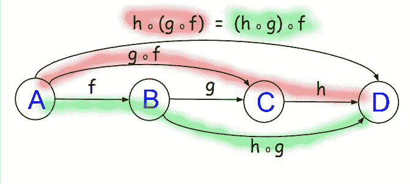

# 第九章：函数对象，幺半群和泛型

"这是我在 Go 中尝试函数式编程。我认为这是一个好主意，但我真的不确定。"

我在超过十几篇博客文章上看到了这样的评论。我希望在阅读完本章并完成示例后，你会对函数式编程（FP）有一种新的热爱。不是因为它是如此纯净，以至于你担心有副作用的编程会把你送到地狱，而是因为你对构成纯 FP 基础的概念感到舒适，并且你看到它的好处超过了学习如何使用它的成本。

本章的目标如下：

+   欣赏 Go 中泛型支持的缺失可能是一件好事

+   学习如何使用泛型代码生成工具来解决样板问题

+   深入理解函数组合是如何工作的

+   构建一些函数对象，并了解如何在不同领域之间进行映射

+   构建一些幺半群，并学习如何编写自己的 reduce 函数

## 理解函数对象

函数对象是范畴之间保持结构的变换。换句话说，函数对象是可映射的类型。让我们通过一个例子来看看这意味着什么。

### 命令式与纯函数式的例子

假设我们从一个 int 切片开始，`ints := []int{1,2,3}`。

在命令式编程中，我们编写所有的脚手架代码来准确实现如何处理这个 int 切片。然而，在纯函数式编程中，我们告诉我们的函数对象我们希望循环做什么：


这是输出：

```go
imperative loop: [2 3 4]
fp map: [2 3 4]
```

让我们看看这是如何工作的。

#### 那个 Map 函数为我们做了什么？

`Map`函数抽象了循环。我们不必再写相同的 range/for 循环代码。我们只需传入我们原始的`ints`列表，并告诉我们的函数对象将该切片映射为一个每个元素比以前大一的切片。这很像 SQL，我们声明我们想要的数据，让数据库引擎去担心如何获取数据。

#### 这能给我们带来什么可能的好处？

我们是否必须更改我们的 SQL 查询代码以从数据库引擎更新中受益，从而提高查询性能？答案是否定的，对于我们的纯函数式编程代码也是一样的。

如果我们只需要编写`Functor(list).Map(add1)`并定义我们自定义的`add1`函数呢？如果`Functor`是 Go 标准库的一部分（或者是另一个非常稳定的第三方包），并且如果 Go 的下一个版本发布了，并且它知道如何根据我们传递的列表的大小来优化性能，那不是仅仅编译使用最新版本的 Go（或者其他非常稳定的第三方包）就能获得的自动的显著的好处吗？

从代码行数或者清晰度来看，这可能并不是一个巨大的胜利。在这种情况下，以及在较小的实用程序或管理程序中，它可能并不会带来很大的好处。在我看来，使用 FP 风格提供最大好处的地方是业务用例逻辑。我们寻找需要小心谨慎地不要用嘈杂的代码（如 for 循环脚手架和错误检查代码块）混淆业务意图的地方。这些都是 FP 风格编程的绝佳场所。其他好的地方是我们希望在不担心竞态条件或副作用的情况下横向扩展我们的应用程序。

### 一个神奇的结构

函数对象可以被看作是一个神奇的结构，可以被映射，其中神奇的结构可以被看作是一个形状，带有一组恒定的元素，并伴随着对每个元素应用变换操作的能力。

让我们看一些例子。

#### 颜色块函数对象

一个函数对象由一个结构组成，通常是 Go 中的一个切片，以及一个变换操作，即映射函数：

| **结构** | 八个块，每个填充有不同的颜色 |
| --- | --- |
| **变换操作** | `f(x) = x - 30`，其中`x`是色调 |

下面是一个函子，它将八个彩色块映射到八个相应的块，其颜色经过上面的转换操作调整色调。


前面的图表显示了一个单个**f(x)**箭头，以保持最小的混乱，但更准确的表示应该显示从每个原始元素到其相应的新转换元素的箭头。这实际上是发生的--每个元素在结构内被处理，并转换为一个新值，该值返回到结构内：


#### 手指乘以 10 的函子

如前所述，函子由结构和转换操作组成：

| **结构** | 五个手指，每个手指代表一个整数 |
| --- | --- |
| **转换操作** | `f(x) = x * 10` |


从上一章我们知道，一个类别包括以下内容：

+   对象的分组

+   **对象**：点/点/没有属性和结构的原始物体

+   **态射（箭头）**：连接两个对象/元素的东西

你能看到对象（每个手指上的数字）吗？

你能看到映射关系吗（1 对应 10，2 对应 20，3 对应 30，依此类推）？

我们的类别在乘法下是封闭的，有一个单位元，并且有一个映射函数（乘以 10），这意味着我们有一个函子。看到了吗？

这是一个保持形状的映射，从一个类别映射到另一个类别；因此，函子被称为类别同态。**f(x)**说明了函子是两个类别之间的函数。

数手指（函子）更多地证明了我们真正需要知道的一切都是在幼儿园里教的！

### Haskell 中函子的定义

在上一章的类型类层次结构图中，我们已经看到了一个**函子**。函子只有一个类型类方法，`fmap`，它的类型是`fmap :: (a -> b) -> f a -> f b`。它说--给我一个接受`a`并返回`b`的函数，一个包含`a`的结构，我会给你一个包含`b`的结构。该函数应用于结构内的每个元素。`fmap`函数转换结构内的值。

我们可以互换使用以下术语：

+   结构

+   容器

+   盒子

要记住的重要一点是，函子作用于结构/容器/盒子内部的元素，并返回具有转换值的结构（而不是原始值）。

### 类型的种类

Haskell 中的函子必须具有 kind `* -> *`。Kinds 是 Haskell 中具体类型之上的另一层类型。Kinds 允许我们定义类型的行为能力，然后将它们与适当的类型类连接起来。例如，一个**Int**可以像可显示的、可读的、有序的或可枚举的东西一样。Haskell 中的值可以根据它们的类型进行分类。让我们使用 Haskell 的简洁语法来看一些例子：

| **类型（类）** | **__ 种 __  ** | **描述** |
| --- | --- | --- |
| **Int** | `*` | `*`代表具体类型（如 Bool、Char 或 Int）。 |
| **Char** | `*` | `*`代表具体类型（如 Bool、Char 或 Int）。 |
| **[]** | `* -> *` | []接受一种类型的 kind `*`，并返回一种新的 kind `*`的类型。 |
| **Maybe** | `* -> *` | 一种高级类型，接受一种 kind `*`的类型，并返回一种新的 kind `*`的类型。 |
| **Either** | `* -> * -> *` | 一种高级类型，接受一种 kind `*`的类型，并返回一种新的 kind `*`的类型，或者返回一种新的 kind `*`的类型。 |
| **函子** | `(* -> *) ->` 约束 | 函子是一个类型类，而不是一种类型。我们定义了作为函子的高阶类型的行为，它接受一种`*`并将其映射到另一种`*`。约束指的是函子必须遵守其代数中定义的规则。约束强制执行某种限制。例如，数值约束可能限制所有数值类型的值都是数值的。123 通过，但"ABC"对于数值约束失败。 |

#### 也许

**Maybe**是一个函子，将每种类型映射到具有额外的`Nothing`值的相同类型。`Maybe`就像一个可选值（注意，类型是我们类别中的对象）：

`data Maybe a = Just a | Nothing`

`Maybe Int`的值可以是一个数字，比如`Just 2`，也可以是`Nothing`。

`Maybe`类型将类型映射到类型。例如，它将**Char**映射到**Maybe Char**。在下面的代码片段中定义的`fmap`显示了每个`a -> b`函数都有一个对应的版本，`Maybe a -> Maybe b`，当给定`Nothing`时只返回`Nothing`，否则正常运行：

```go
instance Functor Maybe where
fmap f Nothing = Nothing
fmap f (Just x) = Just (f x)
```

### 更高级别的多态性

Haskell 丰富的类型特性（类型类、参数化代数数据类型、递归数据类型等）使我们能够在比 Go 当前可能的更高级别上实现多态性。

在 Go 中实现多态行为是可能的。但是，由于语言限制（缺乏泛型），需要额外的代码来指定实现所需行为的每种类型。

有关 Golang 代码示例，演示如何利用结构和方法来获得多态行为，请参阅[`l3x.github.io/golang-code-examples/2014/07/15/polymorphic-shapes.html`](http://l3x.github.io/golang-code-examples/2014/07/15/polymorphic-shapes.html)。

### 没有泛型会导致大量的样板代码

没有泛型的支持，当我们为应用程序需要的每种类型实现列表函数时，我们必须为每种类型都实现它。这是大量重复的样板代码。例如，如果我们必须为`int8`、`int32`、`float64`和`complex128`实现`Sum`函数，它可能看起来像这样：

```go
package main

import (
   "fmt"
)

func int8Sum(list []int8) (int8) {
   var result int8 = 0
 for x := 0; x < len(list); x++ {
      result += list[x]
   }
   return result
}

func int32Sum(list []int32) (int32) {
   var result int32 = 0
 for x := 0; x < len(list); x++ {
      result += list[x]
   }
   return result
}

func float64Sum(list []float64) (float64) {
   var result float64 = 0
 for x := 0; x < len(list); x++ {
      result += list[x]
   }
   return result
}

func complex128Sum(list []complex128) (complex128) {
   var result complex128 = 0
 for x := 0; x < len(list); x++ {
      result += list[x]
   }
   return result
}

func main() {
   fmt.Println("int8Sum:", int8Sum([]int8 {1, 2, 3}))
   fmt.Println("int32Sum:", int32Sum([]int32{1, 2, 3}))
   fmt.Println("float64Sum:", float64Sum([]float64{1, 2, 3}))
   fmt.Println("complex128Sum:", complex128Sum([]complex128{1, 2, 3}))
}
```

以下是输出：

```go
int8Sum: 6
int32Sum: 6
float64Sum: 6
complex128Sum: (6+0i)
```

使用泛型，我们只需要实现一个类似以下的`Sum`函数。`<T>`是我们传递给`Sum`的任何类型的占位符，支持`+`运算符：

```go
func Sum(list []<T>) (<T>) {
   var ret <T> = 0
   for item := range list {
      ret += item
   }
   return ret
}
```

不用编写所有那些重复的样板代码会很好。还有其他选择吗？

是的。我们可以在任何地方使用空的`interface{}`，并执行反射和类型转换来从列表结构中提取数据并将其放回通用的`interface{}`，但这不是高性能的，而且会增加很多额外的代码。

## 用元编程解决泛型缺失问题

**元编程**（**MP**）是关于编写编写代码的代码。在 MP 中，我们编写将程序视为输入数据的程序。我们的 MP 将读取、分析、转换和生成代码。

也许我们可以使用 MP 来修复 Go 中由于不支持泛型而缺失的部分？

也许。首先，让我们更好地了解 MP 是关于什么的。

以下是一些示例：

+   词法分析器、解析器、解释器和编译器

+   **领域特定语言**（**DSL**）

+   **面向方面的编程**（**AOP**）

+   属性（.NET）

+   注解（Java）

+   泛型（.NET，Java）

+   模板（C++）

+   宏（C）

+   method_missing（Ruby）

+   反射（Go，C#，Ruby）

有几种类型的 MP。

支持`eval`函数的程序可以通过连接表示可执行命令的字符串来生成新代码。注意：这可能会带来安全风险，通常不是最佳实践。

一些语言，如 LISP，可以根据状态信息更改其自己的应用程序代码，这提供了在运行时做出新决策的灵活性。

其他静态类型的语言，比如 C++，有能力评估表达式并做出编译时决策，生成可以静态编译到最终可执行文件中的代码。这是我们将在下一节中看到的 MP 类型。

反射是一种 MP 形式，程序可以观察和修改自己的结构和行为，比如确定指针引用的数据类型或返回对象的所有属性列表。

Go 语言不支持宏或泛型，因此看起来我们必须使用反射。反射允许我们的程序操作那些在编译时类型未知的对象。

例如，我们可以使用空的`interface{}`创建一个项目的链表。这将允许我们在列表中放入任何类型的数据。当我们从列表中取出一个项目时，我们必须使用类型断言为其分配一个数据类型以便使用它。问题在于这不是一个类型安全的操作，它使用起来很麻烦，而且速度很慢。使用反射通常不是最佳实践。一些可能的用例包括以下内容（这些都不能帮助我们实现泛型）：

+   调用函数

+   识别接口

+   验证字段

有关 Go 语言中反射的更多信息，请参阅以下信息：

[golang.org/pkg/reflect/](http://golang.org/pkg/reflect/)

[blog.golang.org/laws-of-reflection](http://blog.golang.org/laws-of-reflection)

[blog.ralch.com/tutorial/golang-reflection/](http://blog.ralch.com/tutorial/golang-reflection/)

[blog.gopheracademy.com/birthday-bash-2014/advanced-reflection-with-go-at-hashicorp/](http://blog.gopheracademy.com/birthday-bash-2014/advanced-reflection-with-go-at-hashicorp/)

如果我们不应该使用反射，那么我们如何解决这种重复的样板代码问题呢？

## 泛型代码生成工具

我们如何不写所有那些重复的代码，又不会受到性能损失，也不会失去我们强类型语言的类型安全性呢？

让我们看看使用 Go 工具来为我们生成样板代码。我们将用它来用<T>替换我们代码中的`interface{}`。这里，<T>代表在其被发现的上下文中工作的任何类型。

由于我们将使用真实类型，我们将获得编译时类型安全性。

### clipperhouse/gen 工具

尽管有几种泛型代码生成工具可用，让我们来看看我个人最喜欢的 clipperhouse/gen。

我们可以使用 clipperhouse/gen 工具免费获得以下函数：

| **聚合** | **过滤** | **映射** | **其他** |
| --- | --- | --- | --- |
| [Aggregate[T]](https://clipperhouse.github.io/gen/slice/#aggregatet) | [All](https://clipperhouse.github.io/gen/slice/#all) | [Select[T]](https://clipperhouse.github.io/gen/slice/#selectt) | [List](https://clipperhouse.github.io/gen/optional/#list) |
| [Average](https://clipperhouse.github.io/gen/slice/#average) | [Any](https://clipperhouse.github.io/gen/slice/#any) | [Where](https://clipperhouse.github.io/gen/slice/#where) | [Ring](https://clipperhouse.github.io/gen/optional/#ring) |
| [Average[T]](https://clipperhouse.github.io/gen/slice/#averaget) | [Distinct](https://clipperhouse.github.io/gen/slice/#distinct) |  | [Set](https://clipperhouse.github.io/gen/optional/#set) |
| [Count](https://clipperhouse.github.io/gen/slice/#count) | [DistinctBy](https://clipperhouse.github.io/gen/slice/#distinctby) |  | [stringer](https://clipperhouse.github.io/gen/stringer/#) |
| [Max](https://clipperhouse.github.io/gen/slice/#max) | [First](https://clipperhouse.github.io/gen/slice/#first) |  |  |
| [Max[T]](https://clipperhouse.github.io/gen/slice/#maxt) | [GroupBy[T]](https://clipperhouse.github.io/gen/slice/#groupbyt) |  |  |
| [MaxBy](https://clipperhouse.github.io/gen/slice/#maxby) | [Shuffle](https://clipperhouse.github.io/gen/slice/#shuffle) |  |  |
| [Min](https://clipperhouse.github.io/gen/slice/#min) | [Sort](https://clipperhouse.github.io/gen/slice/#sort) |  |  |
| [Min[T]](https://clipperhouse.github.io/gen/slice/#mint) | [SortBy](https://clipperhouse.github.io/gen/slice/#sortby) |  |  |
| [MinBy](https://clipperhouse.github.io/gen/slice/#minby) |  |  |  |

`gen`是一个用于 Go 的代码生成工具。它旨在为您的类型提供类似泛型的功能。开箱即用，它提供了 LINQ/underscore 风格的方法。

+   [`github.com/clipperhouse/gen`](https://github.com/clipperhouse/gen)

+   [`en.wikipedia.org/wiki/Language_Integrated_Query`](https://en.wikipedia.org/wiki/Language_Integrated_Query)

+   [`en.wikipedia.org/wiki/Underscore.js`](https://en.wikipedia.org/wiki/Underscore.js)

使用 gen 工具，我们将获得大部分泛型的好处，而不会受到反射或类型断言的性能损失。

泛型为我们做的事情很像代码生成。在运行时，当我们将类型为`A`的`a`传递给函数时，我们的函数可以接受`a`并执行正确的操作，这似乎是神奇的。大多数情况下在运行时（由 JIT 或常规 Go 编译器，取决于情况），Go 进行代码生成替换操作。在运行时发生的是我们的`a`在我们的代码中被换入/换出 A 形状的空白。这是我们的泛型代码生成工具将用来为我们生成通用代码的相同模式：

```go
"List <A>".Replace("<A>", a)
```

我们将使用我们的泛型生成工具来替换适合 T 形空白的任何类型：

```go
"List <T>".Replace("<T>", "Foo")
"List <T>".Replace("<T>", "Bar")
```

我们可以使用我们的 gen 工具在开发时生成代码。它为我们生成代码，就像 IDE 可能会做的那样。

我们使用**注释**中的**注释**标记我们的类型，以便我们想要为其生成代码。

让我们通过一个例子来工作。首先，让我们进入正确的目录，并通过源 init 脚本，运行 glide-update，并将 gen 拉入我们的 vendors 目录来初始化我们的 Go 环境。

这是我们使用的命令列表：

```go
cd <DEVDIR>/fp-go/4-purely-functional/ch11-functor-monoid/03_generics_cars
. init
glide-update
go get github.com/clipperhouse/gen
```

这是我们在运行`gen`之前的目录结构：


这是我们运行`gen`后的目录结构：


现在，让我们看看我们项目中的代码在`src/car/types.go`中：

```go
package car

// +gen slice:"Where,Sum[Dollars],GroupBy[string],Select[Dollars]"
type Car struct {
   Make string
   Model string
   Price Dollars
}

type Dollars int
```

你看到了`// +gen slice:"Where,Sum[Dollars],GroupBy[string],Select[Dollars]`的注释吗？它告诉我们的 gen 工具生成一个`Car`的切片，并为我们提供以下方法：

+   `CarSlice.Where`

+   `CarSlice.SelectDollars`

+   `CarSlice.SumDollars`

当我们在带有`types.go`的目录中运行 gen 时，gen 将生成一个名为**src/cars/car_slice.go**的文件，其中包含以下内容：

```go
// Generated by: gen
// TypeWriter: slice
// Directive: +gen on Car

package car

// CarSlice is a slice of type Car. Use it where you would use []Car.
type CarSlice []Car

// Where returns a new CarSlice whose elements return true for func. See: http://clipperhouse.github.io/gen/#Where
func (rcv CarSlice) Where(fn func(Car) bool) (result CarSlice) {
   for _, v := range rcv {
      if fn(v) {
         result = append(result, v)
      }
   }
   return result
}

// SumDollars sums Car over elements in CarSlice. See: http://clipperhouse.github.io/gen/#Sum
func (rcv CarSlice) SumDollars(fn func(Car) Dollars) (result Dollars) {
   for _, v := range rcv {
      result += fn(v)
   }
   return
}

// GroupByString groups elements into a map keyed by string. See: http://clipperhouse.github.io/gen/#GroupBy
func (rcv CarSlice) GroupByString(fn func(Car) string) map[string]CarSlice {
   result := make(map[string]CarSlice)
   for _, v := range rcv {
      key := fn(v)
      result[key] = append(result[key], v)
   }
   return result
}

// SelectDollars projects a slice of Dollars from CarSlice, typically called a map in other frameworks. See: http://clipperhouse.github.io/gen/#Select
func (rcv CarSlice) SelectDollars(fn func(Car) Dollars) (result []Dollars) {
   for _, v := range rcv {
      result = append(result, fn(v))
   }
   return
}
```

因此，gen 为我们生成了所有那些样板代码。这使我们的源文件保持整洁。如果 Go 支持泛型，我们的代码将类似于与 gen 一起使用的代码。有多相似？让我们看看。

这是我们的`main.go`文件：

```go
package main

import (
   "fmt"
 . "car"
)

func main() {
   var cars = CarSlice{
      Car{"Honda", "Accord", 3000},
      Car{"Lexus", "IS250", 40000},
      Car{"Toyota", "Highlander", 3500},
      Car{"Honda", "Accord ES", 3500},
   }
   fmt.Println("cars:", cars)
```

以下是输出：

```go
Output:cars: [{honda accord 3000} {lexus is250 40000} {toyota highlander 3500} {honda accord es 3500}]
```

看到`CarSlice`类型了吗？那是 gen 为我们创建的。我们必须键入实际的结构类型，比如`Car`，gen 将为我们创建`CarSlice`类型和我们在注释中告诉它为我们生成的所有方法（就在类型定义的上面）。

#### 如果 Go 支持泛型

如果 Go 支持泛型，同一段代码块可能会如下所示：

```go

   var cars = Slice<Car>{
      Car{"Honda", "Accord", 3000},
      Car{"Lexus", "IS250", 40000},
      Car{"Toyota", "Highlander", 3500},
      Car{"Honda", "Accord ES", 3500},
   }
   fmt.Println("cars:", cars)
```

从懒惰程序员的角度来看，如果 Go 支持泛型，我们将不得不键入两个额外的字符，`<`和`>`。

看起来泛型代码支持的最大特性刚刚被中和了。当我们考虑这些信息以及我们通过 gen 免费获得的函数，以及性能损失保证会在编译时发生（而不是运行时），这使得 Go 对泛型的直接支持看起来像是一个好处，或者至少是一个不那么严重的问题。

##### 添加新方法

如果我们想要为我们的`CarSlice`添加 gen 不提供的方法，我们可以将这些方法放在一个单独的文件中。我们需要记住的是不要将我们的任何源代码键入 gen 生成的文件中。这是因为我们的代码将在下次我们告诉 gen 运行时被覆盖。

##### 定义一个`filter`函数

在我们的`main.go`文件中的几行下面，让我们定义一个`filter`函数，它将返回`Make`为`Honda`的汽车。我们使用我们的新`Where`方法，并将其传递给我们的`honda`文字函数：

```go
honda := func (c Car) bool {
   return c.Make == "Honda"
}
fmt.Println("filter cars by 'Honda':", cars.Where(honda))
```

这是输出：

```go
filter cars by 'honda': [{honda accord 3000} {honda accord es 3500}]
```

很酷。接下来，让我们创建一个映射函数来返回价格字段：

```go
price := func (c Car) Dollars {
   return c.Price
}
fmt.Println("Hondas prices:", cars.Where(honda).SelectDollars(price))
```

这是输出：

```go
hondas prices: [3000 3500]
```

由于我们已经按照本田进行了筛选，结果只包含本田汽车的价格。

聚合？当然，我们可以进行聚合。让我们调用我们在注释中免费获得的`SumDollars`函数：

```go
fmt.Println("Hondas sum(prices):", cars.Where(honda).SumDollars(price))
```

这是输出：

```go
hondas sum(prices): 6500
```

### Nums 重访

还记得我们为四种数字类型实现了`Sum`方法而不使用泛型吗？让我们重新访问一下那段代码，看看我们是否可以改进我们的代码库，现在我们知道了 gen：

```go
cd <DEVDIR>/fp-go/4-purely-functional/ch11-functor-monoid/04_generics_nums
. init
glide-update
```

请注意，我们需要运行 glide-update，以便为我们创建供应商目录。它将首先放在我们的 GOPATH 中，这样当我们运行下一个命令时，gen 包及其依赖项将放在我们的供应商目录中，而不是我们项目的 src 目录中：

```go
go get github.com/clipperhouse/gen
```

现在，让我们 cd 到**~/dev/04_generics_nums/src/num**并运行 gen：

```go
cd src/num;gen;cd -
```

我们可以看到 gen 创建了四个文件，每个文件都有一个切片类型：


我们必须定义每种类型，并注释我们希望 gen 为每个切片创建一个`Sum`方法。请注意，我们从不需要为切片创建类型，只需要类型。Gen 为我们创建每种类型的切片，以及我们在 gen 切片注释中请求的方法。

这是来自`src/num/types.go`的代码：

```go
package num

// +gen slice:"Sum[Int8]"
type Int8 int8

// +gen slice:"Sum[Int32]"
type Int32 int32

// +gen slice:"Sum[Float64]"
type Float64 float64

// +gen slice:"Sum[Complex128]"
type Complex128 complex128
```

这是一个生成的文件（`src/num/int8_slice.go`）的片段，看起来像这样：

```go
// Generated by: gen
// TypeWriter: slice
// Directive: +gen on Int8

package num

// Int8Slice is a slice of type Int8\. Use it where you would use []Int8.
type Int8Slice []Int8

// SumInt8 sums Int8 over elements in Int8Slice. See: http://clipperhouse.github.io/gen/#Sum
func (rcv Int8Slice) SumInt8(fn func(Int8) Int8) (result Int8) {
   for _, v := range rcv {
      result += fn(v)
   }
   return
}
```

还记得我们在之前的汽车示例中将价格函数传递给`Select<T>`函数吗？让我们来看看：

```go
price := func (c Car) Dollars {
   return c.Price
}
fmt.Println("Hondas prices:", cars.Where(honda).SelectDollars(price))
```

这是我们将在`src/num/vars.go`文件中创建的函数类型：

```go
package num

var (
   Int8fn = func (n Int8) Int8 { return n }
   Int32fn = func (n Int32) Int32 { return n }
   Float64fn = func (n Float64) Float64 { return n }
   Complex128fn = func (n Complex128) Complex128 { return n }
)
```

我们将简单地返回传递给我们的文字函数定义的值在我们的`fmt.Println`语句中：

```go
package main

import (
   "fmt"
 . "num"
)

func main() {
   fmt.Println("int8Sum:", Int8Slice{1, 2, 3}.SumInt8(Int8fn))
   fmt.Println("int32Sum:", Int32Slice{1, 2, 3}.SumInt32(Int32fn))
   fmt.Println("float64Sum:", Float64Slice{1, 2, 3}.SumFloat64(Float64fn))
   fmt.Println("complex128Sum:", Complex128Slice{1, 2, 3}.SumComplex128(Complex128fn))
}
```

这是输出：

```go
int8Sum: 6
int32Sum: 6
float64Sum: 6
complex128Sum: (6+0i)
```

即使在这个简单的求和数字示例中，我们也看到我们的 gen 工具使我们免于输入繁琐的循环结构来求和数字。

我们只使用了`Sum`方法，但还有大约两打其他方法可供选择。

可以在[`clipperhouse.github.io/gen/slice/#`](https://clipperhouse.github.io/gen/slice/#)找到描述`Aggregate`方法的文档片段。

#### 切片打字机

切片打字机默认内置到 gen 中。它生成功能便利方法，这些方法对于使用 C#的 LINQ 或 JavaScript 的数组方法的用户来说会很熟悉。它旨在为您节省一些循环，使用传递函数模式。它提供更容易的特定多态排序。

注释看起来像这样：

```go
// +gen slice:"Where,GroupBy[int],Any"
 type Example struct {}
```

在这里，`Example`被用作您的类型的占位符。

生成了一个新类型`ExampleSlice`，并成为以下方法的接收者：

##### 聚合[T]

`AggregateT`遍历切片，将每个元素聚合成单个结果。`AggregateT`类似于 LINQ 的 Aggregate 和下划线 reduce 函数。

这是签名：

```go
func (ExampleSlice) AggregateT(func(T, Example) T) T
```

在下面的示例中，我们在我们的注释注释中指定我们希望 gen 创建一个在字符串切片上操作的`Aggregate`函数。我们定义了一个`join`函数，将其传递给`AggregateString`，执行连接操作：

```go
// +gen slice:"Aggregate[string]"
 type Employee struct{
 Name   string
 Department string
 }

 employees := EmployeeSlice {
 {"Alice", "Accounting"},
 {"Bob", "Back Office"},
 {"Carly", "Containers"},
 }

 join := func(state string, e Employee) string {
    if state != "" {
        state += ", "
    }
    return state + e.Name
 }

 employees.AggregateString(join) // => "Alice, Bob, Carly"
```

## 泛型实现选项

以下是一个决策矩阵，可用于评估哪种泛型实现最好。


当我们考虑如何实现泛型时，有许多方面需要考虑。例如，让我们考虑 Haskell 的参数多态性和 C++的特定多态性之间的区别。

在 Haskell 中，多态函数对所有类型都是统一定义的。我们可以称之为编译时多态。

在 C++中，通过替换、虚函数和接口实现动态多态行为，但我们的实现是否适用于任何特定类型是在运行时决定的，当具体类型替换其参数时。

C++模板提供了类似的功能，而没有动态多态性的运行时开销。这种权衡是灵活性在编译时固定的事实。

Haskell 中的类型类允许我们为不同类型的相同函数定义不同的行为。在 C++中，我们使用模板特化和函数重载来实现这一点。

请注意，我们只是触及了问题的表面，并且只讨论了两种语言（C++和 Haskell）。还有很多边缘情况需要考虑。例如，Go 编译器是否应该执行激进的优化？如果是这样，那将意味着为所有使用它们的类型专门化多态函数，这将开启另一层需要管理的复杂性。

如果 Go 添加了泛型支持，将会涉及成本和风险。成本将会在编译时或运行时提前产生。在所有情况下，每种方法的利弊都应该仔细评估，我们应该谨慎地提出要求。我们将在下一章更多地讨论泛型。

有关泛型和 Go 的更多信息，包括像 gen 这样的更多工具，您可以参考[docs.google.com/document/d/1vrAy9gMpMoS3uaVphB32uVXX4pi-HnNjkMEgyAHX4N4](https://docs.google.com/document/d/1vrAy9gMpMoS3uaVphB32uVXX4pi-HnNjkMEgyAHX4N4)。另一个资源是[golang.org/doc/faq#generics.](https://golang.org/doc/faq#generics)

### 我们使用了 gen 工具。

我们使用了 gen 工具，这更符合 C++/模板的方法。虽然使用 gen 导致我们编写了更多的代码，但我们掌控了局面，并且得到了一些类似 LINQ 的功能，这使我们不必为处理切片编写大量样板代码。不错！

那么，Go 支持泛型吗？不支持。但是我们可以使用像 gen 这样的工具来解决重复样板代码的大问题。我们仍然拥有我们的类型安全，并且不需要为使用反射付出性能代价。

## 函子的形状

函子是一种代数类型，它接受一个值（或通常是一系列值），并具有一个 map 函数，该函数应用于列表中的每个元素，以产生相同形状的新函子。形状是什么？

让我们看一个命令式的例子：

```go
ints := []int{1,2,3}
impInts := []int{}
for _, v := range ints {
   impInts = append(impInts, v + 2)
}
fmt.Println("imperative loop:", impInts)
```

这是输出：

```go
imperative loop: [3 4 5]
```

在这个例子中，形状意味着一个包含三个整数的切片。我们从一个包含三个整数的切片开始，运行我们的命令式代码，最终得到一个包含三个整数的切片。

函子得到相同的结果（三个元素进入，三个元素出去），但是函子以不同的方式实现。

我们给我们的函子相同的三个整数切片。函子对每个整数执行`add2`并返回一个包含三个整数的切片（每个整数比以前大两个）：

```go
add2 := func(i int) int { return i + 2 }
fpInts := Functor(ints).Map(add2)
fmt.Println("fp map:", fpInts)
```

这是输出：

```go
fp map: [3 4 5]
```

函子肯定不止这些，对吧？

是的。魔鬼就在细节中。所以，让我们来揭开一些细节。

### 函子实现

让我们来看看我们的 ints 函子实现。

#### ints 函子

作为优秀的程序员，我们在文件顶部声明了我们的接口。我们的接口，也就是我们的契约，只有一个函数`Map`。我们的`IntFunctor`类型接受一个`func(int) int`函数，并返回另一个`IntFunctor`。

什么？它返回一个`IntFunctor`？那是什么，它是如何正确打印的？

让我们来看看`src/functor/ints.go`：

```go
package functor

import (
   "fmt"
)

type IntFunctor interface {
   Map(f func(int) int) IntFunctor
}
```

函子的一个特性是它在其容器内应用`f`函数。那么，什么是容器？

```go
type intBox struct {
   ints []int
}
```

那是我们函子的容器。我们将其称为`box`，因为盒子是一个容器，而且由于我们是优秀的懒惰程序员，我们更喜欢简短的名称。

好的。我看到了盒子。我们的神奇`box`里发生了什么？

```go
func (box intBox) Map(f func(int) int) IntFunctor {
   for i, el := range box.ints {
      box.ints[i] = f(el)
   }
   return box
}
```

首先，我们注意到`Map`是一个方法，`box`是接收者。`Map`接受一个函数并返回另一个`IntFunctor`。啊，所以我们从一个`IntFunctor`映射到另一个`IntFunctor`？是的，确实是这样。

由于一个函数器需要将一个结构映射到另一个结构，并且可能有多个元素需要映射（当我们说映射时，我们指的是逐个元素/三个输入，三个输出的转换）。可以肯定地假设我们将映射元素的列表。

Go 中列表形状通常是如何实现的？用一个切片，对吧？我们不应该感到惊讶，我们的`Map`方法的接收者是一个切片。每个切片都可以使用`range`进行迭代，这就是我们用来迭代我们的元素列表并将我们的函数（`f`）应用于每个元素并返回我们传入的`box`的方法。不同之处在于`box`现在包含了转换后的元素。

等一下，一个带有迭代变量`i`和`el`的`range`是如何在我们纯函数式编程的世界中进行变异的？更令人不安的是我们正在变异我们盒子的内容。没错，变异确实发生了，但只发生在盒子里。这是神奇的，记住吗？在这个盒子里的东西可以改变而不影响我们纯函数式编程的世界。

我们如何区分纯和不纯？这就是我们做的地方：

```go
func Functor(ints []int) IntFunctor {
   return intBox{ints: ints}
}
```

就是这样。这就是我们允许我们的执行降到变异的下水道的地方：

```go
fpInts := Functor(ints).Map(add2)
```

看到前一行的`Functor(ints)`部分了吗？那就是我们将我们的`ints`包装在神奇的盒子里的地方，也是我们允许淘气的`add2`变异函数应用于我们切片中的每个整数的地方。

将元素降低到变异的下水道的这种行为通常被称为 lifting。我认为，根据即将到来的类比，lifting 是一个误称。降低更适合它的名字。更多信息，请参见[`en.wikipedia.org/wiki/Lambda_lifting`](https://en.wikipedia.org/wiki/Lambda_lifting)。

函数器盒子中发生的事情与一个人沉溺于不纯洁的思想时发生的事情并无二致。结构将是在一个人的脑海中穿着圆点连衣裙的三头可爱奶牛的列表。不纯洁的人会让他们的思想降低到一个地方，他们会应用`Undress<T>`的文字函数，其中在这种情况下`T`类型将是一头奶牛：


纯函数式编程走向地狱

当一个人知道他们的思想是允许各种不纯的变异的神奇盒子时，他们可能会感到安全。当这种情况发生时，一个人会使用`Undress`函数器，将可爱的、穿着衣服的奶牛从一个世界映射到另一个世界。

当你妈妈说：“别想那些下流的事！”时，这正是她所说的。

在`src/functor.ints.go`中我们做的最后一件事是创建一个`String()`方法：

```go
func (box intBox) String() string {
   return fmt.Sprintf("%+v", box.ints)
}
```

由于我们实现了这个`String()`方法，根据 Go 的鸭子类型规则，我们的`IntFunctor`是一个`Stringer`：

```go
type Stringer interface {
    String() string
}
```

这是一个美丽的、单方法接口。`fmt`寻找这个接口来打印值。

Go 标准库非常易于访问，是了解事物真正工作原理的好地方。在我们的例子中，我们看到我们将`v`作为动词传递（当我们返回`fmt.Sprintf("%+v", box.ints)`时）在`print.go`文件的*第 577 行*。这是`print.go`中从*第 577 行*开始的片段：

```go
// /usr/local/Cellar/go/1.9/libexec/src/fmt/print.go
// If a string is acceptable according to the format, see if
// the value satisfies one of the string-valued interfaces.
// Println etc. set verb to %v, which is "stringable".
switch verb {
case 'v', 's', 'x', 'X', 'q':
   // Is it an error or Stringer?
 // The duplication in the bodies is necessary:
 // setting handled and deferring catchPanic
 // must happen before calling the method.
 switch v := p.arg.(type) {
   case error:
      handled = true
 defer p.catchPanic(p.arg, verb)
      p.fmtString(v.Error(), verb)
      return

 case Stringer:
      handled = true
 defer p.catchPanic(p.arg, verb)
      p.fmtString(v.String(), verb)
      return
 }
}
```

### 函数器定义

函数器([`hackage.haskell.org/package/base-4.8.1.0/docs/Data-Functor.html#t:Functor`](https://hackage.haskell.org/package/base-4.8.1.0/docs/Data-Functor.html#t:Functor))类用于可以进行映射的类型。

我们将使用 Haskell 语法，因为它清晰地定义了 FP 代数数据类型，包括它们的结构、规则和逻辑。`fmap`是映射函数。句号`.`表示`compose`运算符。

函数器的实例应满足以下的身份和结合律：

```go
fmap id  ==  id
fmap (f . g)  ==  fmap f . fmap g
```

我们应该从第十一章中认识到这两条规则，*适用的范畴论*。

#### 身份运算

我们的范畴的恒等律说，**A**的恒等态射是**A**：


如果我们的操作是一个映射，列表中的元素是数字，那么恒等态射是+0。如果我们将 0 添加到输入列表的每个元素，我们的转换列表将由相同的元素组成。

注意！我们将强调组合的概念。您对组合是什么以及它是如何工作的理解对于您能够在纯函数式编程中提高生产力至关重要。如果您只读了本书的几页，那么您的阅读现在就开始吧。

## 组合操作

组合操作**g.f**或**g**在**f**之后，将函数**f**应用于 x（将我们从**A**到**B**），并将结果传递给**g**（将我们从**B**到**C**），这个嵌套的操作等同于**g.f**的组合操作。

在 Haskell 中，我们在第一行定义我们的组合操作，并在第二行请求查看我们组合操作的类型定义。第三行是组合的含义：

```go
> (.) g f = \x -> g (f x)
> :t (.)
(.) :: (b -> c) -> (a -> b) -> a -> c
```

上面的`a`，`b`和`c`对应于以下图表中的**A**，**B**和**C**。

它说，当我们将**A**到**B**函数（**f**）传递给**B**到**C**函数（**g**）时，我们得到**A**到**C**函数（**g.f**）。

这是基本的组合。假设我们从**A**开始，这个图表表示我们可以通过**B**（**A**到**B**到**C**）的方式或者直接从**A**到**C**的方式到达**C**。当我们选择短路线（**A**到**C**）或**g.f**时，我们以嵌套的方式组合**g**和**f**，就像 g(f(x))，其中 x 是我们从**A**得到的值：


还不太明白？坚持一下。经过几个例子，你就会明白了。

### Go 中的组合示例

我们将创建两个函数，`Humanize`和`Emphasize`（代表 f 和 g），以及`Emphasize(Humanize(true))`的组合函数，以说明从**A**到**B**到**C**的路径：


`src/compose/compose.go`文件包含以下代码：

```go
package compose

func Humanize(b bool) string {
   if b { return "yes" } else { return "no" }
}

func Emphasize(s string) string {
   return s + "!!"
}

func EmphasizeHumanize(b bool) string {
   return Emphasize(Humanize(b))
}
```

`main.go`看起来是这样的：

```go
package main

import (
   "fmt"
 . "compose"
)

func main() {
   fmt.Println("A to B - Humanize(true):", Humanize(true))
   fmt.Println("B to C - Emphasize(\"yes\"):", Emphasize("yes"))
   fmt.Println("A to C - EmphasizeHumanizeFG(true)", EmphasizeHumanizeFG(true))
}
```

如果您使用 init 脚本，则您的终端应如下所示：


如果这是一个包括外部包的更复杂的示例，那么您将按照以下顺序运行：

`. init`，`glide-update`和`go-run`

### compose 的 Haskell 版本

我们将介绍组合 Humanize 和 Emphasize 的 Haskell 版本：

```go
humanize b = if b then "yes" else "no"
emphasize str = str ++ "!"
compose g f = \x -> g (f x)
emphasizeHumanize = compose emphasize humanize
emphasizeHumanize True
```

就是这样！这五行等同于 25 行 Go 代码！

我绝不主张任何 Gophers 转换到 Haskell——有太多原因要保持编写和部署 Go 解决方案，这里无法一一列举。我包含 Haskell 代码是出于信息目的。正如本书前面提到的，范畴论直接从数学家的大脑中滴入 Haskell。因此，如果我们想成为优秀的纯函数式编程 Gophers，那么我们应该学习 Haskell。

以下是我们会话的 REPL 终端日志：


让我们更仔细地看一些行。

我们可以要求 Haskell REPL 告诉我们我们定义的内容的类型使用`:t <symbol>`。

例如，`:t humanize`告诉我们它是一个函数（`->`），它接受一个`Bool`并返回一个字符列表：

```go
:t humanize
humanize :: Bool -> [Char]
```

`\x`告诉 Haskell，compose 是一个 lambda 表达式。我们将我们的 lambda 命名为`compose`，并将`g`和`f`函数作为参数传递。

`g (f x)`表示，应用`f`到`x`，取得结果，并将其传递给`g`：

```go
compose g f = \x -> g (f x)
```

现在，让我们看看 compose 的类型是什么：

```go
:t compose
 compose :: (t2 -> t1) -> (t -> t2) -> t -> t1
```

这有点难以理解。因此，让我们看看 Haskell 如何说它的默认实现的 compose 运算符的类型是什么：

```go
:t (.)
 (.) :: (b -> c) -> (a -> b) -> a -> c
```

我们以前见过这个：


太棒了！现在我们正在取得进展。是时候定义我们的`emphasizeHumanize`组合 lambda 了：

```go
emphasizeHumanize = compose emphasize humanize
```

`compose`是我们的函数，我们传递了两个参数--`emphasize`和`humanize`。作为优秀、细心的程序员，我们将检查我们函数文字的类型：

```go
:t emphasizeHumanize
 emphasizeHumanize :: Bool -> [Char]
```

非常稳固！它接受一个布尔值并返回一个字符串。

到目前为止，一切都很好。现在是时候运行这个 Haskell 的`compose`函数，看看我们是否得到了与 Go 中相同的结果：

```go
emphasizeHumanize True
 "yes!"
```

哇！

鉴于许多 Haskeller 是数学家，我们知道他们喜欢使用符号而不是单词。此外，我们知道他们喜欢他们的代码看起来像数学方程式。因此，让我们像优秀的、数学思维的程序员一样思考，为语法增添一些调味。

让我们用`.`符号重新定义组合函数名称（注意我们必须将`.`放在括号中；否则，Haskell 会抱怨）：

```go
(.) g f = \x -> g (f x)
```

现在让我们检查它的类型：

```go
:t (.)
(.) :: (t2 -> t1) -> (t -> t2) -> t -> t1
```

好的，现在我们可以理解了...这是基本的组合。我们可以用句号代替 compose：

```go
emphasizeHumanize = (.) emphasize humanize
emphasizeHumanize True
 "yes!" 
```

但这还不够。我们可以做得更好。让我们使用中缀表示法，将（.）放在我们的两个参数之间，就像这样：

```go
emphasizeHumanize = emphasize . humanize
```

让我们验证一下它是否有效：

```go
emphasizeHumanize True
 "yes!"
emphasizeHumanize False
 "no!"
```

### (g.f)(x) = g(f(x)) Go 中的组合

这是我们在 Go 中最终的组合示例的图形表示：

>

不要忽视那个图表。仔细研究它。让它深入你的心灵。

这就是组合，函数式编程的基本原则。

那个**(g.f)(x) = g(f(x))**方程非常字面。它说我们可以执行**f**函数，**Humanize(true)**，然后将值**"yes"**传递给**g**...**Emphasize**(**"yes"**)以获得**"yes!!"**。

那个**(g.f)(x) = g(f(x))**方程还说了一件事。它说我们可以嵌套我们的函数，**g(f(x))**，就像从**A**到**B**，然后从**B**到**C**，或者我们可以直接执行**EmphasizeHumanize(true)**从**A**到**C**。

因此，根据左侧图表，**(g.f)(x) == g(f(x))**，同样地，根据右侧图表，**EmphasizeHumanize(true) ==  Emphasize(Humanize(true))**。


嘭！

#### (g.f)(x) = g(f(x))的实现

现在让我们来看一下代码。

这是前面图表中的**f**和**g**函数：

```go
package compose

func Humanize(b bool) string {
   if b { return "yes" } else { return "no" }
}

func Emphasize(s string) string {
   return s + "!!"
}

func EmphasizeHumanize(b bool) string {
   return Emphasize(Humanize(b))
}
```

现在是新东西的时间。

我们将创建两种类型。Fbs 代表**f**（或**A**到**B**），它接受一个布尔值（true），并返回一个字符串，`"yes"`。Fss 代表**g**（或**B**到**C**）。`Fss`接受一个字符串，`"yes"`，并返回一个字符串，`"yes!!"`：

```go
type Fbs func(bool) string
type Fss func(string) string
```

这是我们的`Compose`函数：

```go
func Compose(g Fss, f Fbs) Fbs {
   return func(x bool) string {
      return g(f(x))
   }
}
```

在我们的`Compose`函数内部嵌套着一个匿名函数。这是我们的 Lambda。在 Haskell 中，它看起来像`\x -> g (f x)`。

Lambda 是表达式，我们可以在任何地方传递它们。我们需要一个接受布尔值并返回一个`"yes!!"`或`"no!!"`的函数。

最后，我们定义我们的`g.f`函数文字：

```go
var Emphasize_Humanize = Compose(Emphasize, Humanize)
```

#### 关于 Go 中组合命名约定的说明

在 Go 中，我们没有将函数名重命名为`.`符号的奢侈，也没有一种简单地将看起来像**compose(f, g)**的函数调用转换为看起来像**g compose f**，更不用说看起来像**g . f**的方法。但别担心！我们只需使用以下命名约定来表示一个组合函数：`Emphasize_Humanize`（读作`g . f`，其中`g`是`Emphasize`，`f`是`Humanize`）。通常，驼峰式符号看起来像`EmphasizeHumanize`，但用下划线分隔驼峰，很明显这是一个特殊符号。

这是 main.go：

```go
package main

import (
   "fmt"
 . "compose"
)

func main() {
   fmt.Println("A to B - Humanize(true):", Humanize(true))
   fmt.Println("B to C - Emphasize(\"yes\"):", Emphasize("yes"))
   fmt.Println("A to C - EmphasizeHumanize(true):", EmphasizeHumanize(true))
   fmt.Println("A to C - Emphasize_Humanize(true):", Emphasize_Humanize(true))
}
```

这是我们运行它时的样子：


### 箭头的方向是重要的

在上一章中，我们使用以下图表来解决*f(x) = x + 2:*


还记得我们将*f(x) = x + 2*与*g(x) = x2 + 1*组合时吗？我们解决了**g(f(1)) = 10**：


我们还证明了**f(g(1)) = 4**，显然不是**10**。因此，我们知道函数组合不是可交换的。箭头只能单向移动。

#### 强调人性化排序不正确

当我们尝试颠倒操作顺序时，我们正在尝试做什么：


这不符合逻辑。

我们首先将布尔值**true**传递给**Emphasize**，但这是什么意思？我们试图做什么？我们没有改变箭头的方向，但我们试图改变调用它们的顺序。鉴于我们从布尔值开始，试图得到一个“是！”或“不是！”的结果，只有在一个方向上应用我们的`Humanize`和`Emphasize`函数才有意义。实际上，我们试图向后组合：

```go
func Compose(f Fss, g Fbs) Fbs {
   return func(n bool) string {
      return g(f(n))
   }
}
```

请注意，其余的代码与以前完全相同。我们只交换了返回语句中**f**和**g**的嵌套顺序。

调用我们的`Compose`函数的函数文字看起来像这样：

```go
var EmphasizeHumanizeFoG = Compose(Emphasize, Humanize)
```

这意味着，“强调真实，然后使结果人性化”，显然行不通（见前面的图表）。

这段代码甚至无法编译：


### 函数组合是结合的

因此，函数组合不是交换的，但是它是结合的：



该图表表示我们可以通过选择上方（**A****→C**→**D**）路径或下方（**A**→**B**→**D**）路径来组合我们的函数从**A**到**D**。

函子的概念是，它将我们可以在一个范畴中绘制的图表转换为另一个范畴中的图表。这通常让我们将一个范畴中的思想和定理转换为另一个范畴。

让我们看一个特定函子的例子，遗忘函子，以更好地理解将事物从一个范畴转换为另一个范畴的含义。

## 在法律义务的背景下的功能组合

假设拉里同意在 10 月 1 日之前支付给露西 5000 美元，那个日期已经过去了。露西想要得到 5000 美元的报酬，拉里也想支付她，但他没有钱。

露西应该起诉拉里让他付款吗？

以下的范畴图描述了他们的情况：


范畴状态如下：

+   **A** = 我们今天的位置（10 月 12 日）

+   **B** = 露西要求提起诉讼

+   **C** = 露西得到报酬

范畴态射如下：

+   **f** = 法律费用（对于两者，2000 美元以上）

+   **g** = 拉里支付露西 5000 美元

+   **h** = 拉里支付露西 5000 美元

### 决定决定状态转换

如果拉里以诚意向露西传达以下内容，露西会选择哪条路？

为了明确，我只是要求更多时间付款，或者你允许我直接向你支付预定的付款，而不需要通过法院系统。

你的想法是什么？

拉里

很明显，这两个路径最终都会从**A**到**C**，但哪条路径最短？哪条路径在时间和财务开支方面更昂贵？

### 范畴论复习

我们连接两个箭头从**A**到**B**和**B**到**C**，以及另一个等价的箭头从**A**到**C**。**A**，**B**和**C**被称为对象。它们可以代表任何东西。在这个例子中，它们代表状态--开始（**A**），中间（**B**）和最终（**C**）状态。在下一个例子中，域和范围代表不同的法院案件，不同的世界。每个案件的事实构成了每个案件的结构，两个世界之间的箭头是律师进行的映射，以证明他们的案件。

#### 范畴规则

只有两条规则必须遵循：

+   身份

+   结合性

#### 结果导向

范畴论是结果导向的。它的重点是从**A**到**C**。箭头是单向的。当我们组合两条路径（**A** → **B**和**B** → **C**）时，我们得到一个等效的路径（**A** → **C**）。这就是我们组合函数时所做的。我们可以调用一个`Compose`函数（如下面的代码片段中所示），而不是两个函数（`f`和`g`）： 

```go
func Compose(g Fss, f Fbs) Fbs {
   return func(x bool) string {
      return g(f(x))
   }
}
```

### 遗忘函子和法律

假设 Lucy 选择了更长的路径；Lucy 的律师们将如何为他们的客户辩护？

让我们假设这个故事还有更多内容。假设 Lucy 在过去某种方式上伤害了 Larry，现在 Lucy 正在强迫 Larry 提起诉讼，他将选择向他的律师传达这些新信息，以提起反诉。

#### 法律规则

他们上法庭时法律将如何运作？律师们研究法律，寻找以前的法院案例，可能会为他们的客户带来有利的结果。然后，他们使用该案例的裁决作为先例来为他们的客户赢得当前的案件。

要证明他们的观点，不可能参考整个案件历史。因此，双方的律师将使用一种修辞手法，范畴论者称之为健忘函子。健忘函子必然会留下一些结构。很难找到一个在每个方面都与手头案件相同的过去案例。

每个律师都会努力说服他人，他们提出的结构，即如果选择的话，将为他们的客户带来最佳结果的一个法院案件，应该被应用。

事实是，过去有很多法院裁决可能适用，但每个律师都会试图说服法官和/或陪审团，他们选择的案件才是实际情况。

获胜的一方将有效地从一个包括不同当事人（原告、被告和案件事实）的世界中映射出先前的法院裁决到当前案件。一些细节会有所不同，但获胜的律师是最好地传达他们已经确定了最相关和适用的案例来在今天的法庭上应用。

每个律师都会确定一个旧案件与最有助于他们客户的现行法庭案件之间的双边对称性，并尽力说服他人应用该案件。我们可能会听到这样的论点开始，*“女士们，先生们，您需要应用的基本结构是这样的**”。*

#### Lucy 的健忘函子

鉴于 G 是他们当前的案件，以及它当前的事实，Lucy 的律师将案件（**E**）中对 Lucy 最有帮助的事实进行映射：


**f[Lucy]**是来自案件**E**的事实的映射函数，优先考虑 Lucy。

#### Larry 的健忘函子

Larry 的律师将案件（**F**）中对 Larry 最有帮助的事实进行映射：


由法官和/或陪审团决定哪种映射最适合当前审查的案件。拥有最佳映射的一方获胜。

是时候编写另一个函子了（这是双关语）。

## 构建一个 12 小时时钟函子

我们将构建一个类似这样的 12 小时时钟函子：

| **结构** | 一个有 12 个小时位置的时钟 |
| --- | --- |
| **转换操作** | *f(x) = x + 12*，其中*x*是小时 |


首先，让我们来看一下函子的实现：

```go
// src/functor/clock.go

package functor

import (
   "fmt"
)
```

定义我们的`ClockFunctor`接口以包括一个函数（`Map`）：

```go
type ClockFunctor interface {
   Map(f func(int) int) ClockFunctor
}
```

创建一个容器来保存我们的 12 小时列表：

```go
type hourContainer struct {
   hours []int
}
```

当调用时，`Map`将被执行/应用到容器中的每个元素：

```go
func (box hourContainer) Map(f func(int) int) ClockFunctor {
   for i, el := range box.hours {
      box.hours[i] = f(el)
   }
   return box
}
```

`Map`的实现可以是不纯的，只要副作用限于变量，比如循环变量，作用域在`Map`函数中。注意返回容器，我们称之为`box`，其元素已经以某种方式被映射函数**f**转换。

接下来，我们创建一个名为 Functor 的函数，它将我们的 12 小时列表包装到魔法盒中进行转换。这是我们将价值降低到低谷的地方。有些人称这个过程为 lifting，其中从一个世界到另一个世界的映射转换发生（有关详情，请参见本章前面的*Pure FP goes to Hell*）：

```go
func Functor(hours []int) ClockFunctor {
   return hourContainer{hours: hours}
}
```

### 时钟函子助手

在我们的`clock.go`文件末尾，我们将添加一些辅助函数，如下面的部分所讨论的。

#### 单元函数

我们的`Unit`函数是我们的身份函数。当应用于切片中的元素时，它不会产生任何效果。这很琐碎，但它是满足函子代数法则的要求：

```go
var Unit = func(i int) int {
   return (i)
}
```

#### AmPmMapper 函数

这是我们在想要从上午小时变成下午小时时应用的映射器。它将被传递给`Map`方法，并应用于盒子中包含的每个小时。它将把上午小时（1、2...12）转换为相应的下午小时（13、14..0）。

```go
var AmPmMapper = func(i int) int {
   return (i + 12) % 24
}
```

#### AmHoursFn 辅助函数

我们可以随时调用这个方便的函数，以获取上午小时的列表。请注意，如果我们创建一个`AmHours`变量传递给我们时钟的函子，它的值是可以改变的。因此，这就像是一个上午小时的切片常量：

```go
func AmHoursFn()  []int {
   return []int{1, 2, 3, 4, 5, 6, 7, 8, 9, 10, 11, 12}
}
```

在现实世界的场景中，我们将按照预期使用函子，也就是说，我们将传入一组初始值的切片，并允许每个函子在调用新的函子的`Map`函数时转换这组值的切片。在我们的`main.go`文件中，我们想要重置学习目的的小时集。

#### 字符串辅助函数

创建一个字符串辅助函数，用于在打印函子内容时使用：

```go
func (box hourContainer) String() string {
   return fmt.Sprintf("%+v", box.hours)
}
```

#### main.go

我们从典型的`package main`和`import`语句以及“main（）”函数开始：

```go
package main

import (
   . "functor"
 "fmt"
)

func main() {
```

请注意，我们在内部的`functor`包（在`src`目录中找到）前面加上一个点。这样可以让我们引用它导出的符号，比如`Functor`和“Map”。

首先，我们调用我们的`Functor`方法，并传入我们的`AmHours`切片。`Functor`将我们的小时结构包装在类型为“ClockFunctor”的函数中：

```go
fmt.Println("initial state :", Functor(AmHoursFn()))
```

这是输出：

```go
initial state : [1 2 3 4 5 6 7 8 9 10 11 12]
```

`Functor`函数是连接我们两个世界的东西：上午小时的世界和下午小时的世界（或者反之亦然）。我们可以说，`Functor`将我们的小时数降低到一个神奇的盒子中，在这个盒子中，变换映射函数`amPmMapper`被应用到每个元素上，将其转换为相应的下午（或上午）小时。

请注意，映射函数必须不产生任何副作用：

```go
fmt.Println("unit application :", Functor(AmHoursFn()).Map(Unit))
```

这是输出：

```go
unit application : [1 2 3 4 5 6 7 8 9 10 11 12]
```

我们可以看到，当我们将我们的函子的身份函数“unit”传递给它的`Map`方法时，它会返回我们传递的内容，也就是上午小时。

现在是有趣的部分。让我们将我们的映射函数传递给我们的函子：

```go
fmt.Println("1st application :", Functor(AmHoursFn()).Map(AmPmMapper))
```

这是输出：

```go
1st application : [13 14 15 16 17 18 19 20 21 22 23 0]
```

太棒了！我们的上午小时列表已经转换为下午小时列表。

现在，让我们炫耀一下，并链接两个`Map`调用：

```go
fmt.Println("chain applications:", Functor(AmHoursFn()).Map(AmPmMapper).Map(AmPmMapper))
```

这是输出：

```go
chain applications: [1 2 3 4 5 6 7 8 9 10 11 12]
```

为什么那样炫耀呢？看起来好像什么都没变。无聊。对吧？

错误。我们正在链接我们的函子。


输出看起来没有改变的原因是因为它从上午小时变成下午小时，然后又变回上午小时。

#### 终端输出日志

这是我们终端上的样子：


#### 函子总结

我们的时钟函子包括一个结构（一个整数切片），其中包含 12 小时和一个`Map`方法，该方法接受一个映射函数，用于将 12 小时中的每个小时转换为随后的 12 小时（上午/下午）。每次执行`Map`方法时，它都会返回一个新的函子；由于这个特性，我们可以链接我们的`Map`方法调用。

换句话说，看看以下示例：

```go
Functor([]int{1, 2, 3}).Map(mapperFn).Map(mapperFn))
```

我们看到，使用函子，我们包装并`Map`（并且可以链接我们的映射）。

## 汽车函子

让我们使用一个函子来升级（和降级）一些汽车！我们将首先打开我们`functor`包中的`car.go`文件。

### 函子包

让我们看看`src/functor/car.go`：

```go
package functor

import (
   "fmt"
 "strings"
)

type (
   Car struct {
      Make string `json:"make"`
 Model string `json:"model"`
 }
)
```

在顶部定义我们的类型是一个好习惯。将它们放在一个类型块中有助于保持我们的代码整洁。另一个好习惯是为结构体的每个字段添加 JSON 注释，以便轻松地将 JSON（解）编组为我们的`Car`结构。

如果您想从结构中省略空字段，可以在字段注释的末尾添加`omitempty`子句。例如，如果`Make`是可选的或有时不包括在内，我们不希望从`Car`结构创建的`json`包含空的`Make`字段，我们的结构定义将如下所示：

`Car struct {`

` Make string `json:"make"``

` Model string `json:"model,omitempty"``

`}`

接下来是我们的接口定义，其中包括单个`Map`方法：

```go
type CarFunctor interface {
   Map(f func(Car) Car) CarFunctor
}
```

这是我们的神奇盒子，其中包含我们将要转换的切片：

```go
type carContainer struct {
   cars []Car
}
```

这是我们的`Map`方法实现，我们在其中遍历我们神奇盒子中的汽车切片的元素，将映射函数`f`应用于每个元素：

```go
func (box carContainer) Map(f func(Car) Car) CarFunctor {
   for i, el := range box.cars {
      box.cars[i] = f(el)
   }
   return box
}
```

这是我们的`Wrap`方法，用于将我们的汽车切片降低到神奇盒子进行转换：

```go
func Wrap(cars []Car) CarFunctor {
   return carContainer{cars: cars}
}
```

在这里，我们定义了我们的辅助函数。`Unit`我们以前见过--它是我们的身份态射。另外两个是`Upgrade`和`Downgrade`。我们将保持简单，当我们升级或删除汽车时，我们将简单地在模型名称的末尾附加“LX”：

```go
var (
   Unit = func(i Car) Car {
      return (i)
   }

   Upgrade = func(car Car) Car {
      if !strings.Contains(car.Model, " LX") {
         car.Model += " LX"
 } else if !strings.Contains(car.Model, " Limited") {
         car.Model += " Limited"
 }
      return car
   }

   Downgrade = func(car Car) Car {
      if strings.Contains(car.Model, " Limited") {
         car.Model = strings.Replace(car.Model, " Limited", "", -1)
      } else if strings.Contains(car.Model, " LX") {
         car.Model = strings.Replace(car.Model, " LX", "", -1)
      }
      return car
   }
)
```

最后，我们包括一个`String`方法，以便我们的`fmt`包知道如何打印我们的汽车：

```go
func (box carContainer) String() string {
   return fmt.Sprintf("%+v", box.cars)
}
```

### main.go

我们将操作字符串和一些 JSON，以及一个`car`函子：

```go
package main

import (
   "encoding/json"
 "fmt"
 "functor"
 "strings"
)
```

创建一个`cars`变量来保存`Car`类型，并用两辆车进行初始化。由于我们用`'json'`注释了我们的`Make`和`Model`字段，我们可以轻松地将`Toyota Highlander`解组为一辆车：

```go
func main() {

   cars := []functor.Car{
      {"Honda", "Accord"},
      {"Lexus", "IS250"}}

   str := `{"make": "Toyota", "model": "Highlander"}`
 highlander := functor.Car{}
   json.Unmarshal([]byte(str), &highlander)
   cars = append(cars, highlander)
```

现在，让我们练习一下我们的`car`函子，并验证它是否正常工作：

```go
fmt.Println("initial state :", functor.Wrap(cars))
fmt.Println("unit application:", functor.Wrap(cars).Map(functor.Unit))
fmt.Println("one upgrade :", functor.Wrap(cars).Map(functor.Upgrade))
fmt.Println("chain upgrades :", functor.Wrap(cars).Map(functor.Upgrade).Map(functor.Upgrade))
fmt.Println("one downgrade :", functor.Wrap([]functor.Car{{"Honda", "Accord"}, {"Lexus", "IS250 LX"}, {"Toyota", "Highlander LX Limited"}}).Map(functor.Downgrade))
```

#### 将 FP 的一行与大量的命令式行进行比较

应用升级和降级到汽车只需要一行 FP 风格的代码。当然，`Upgrade`和`Downgrade`映射函数是在`functor`包中定义的，但这是一个很大的好处。我们可以将循环遍历汽车切片的样板实现与我们的业务用例逻辑分开。

使用命令式实现风格，我们首先将`for...range`迭代块实现到其中，然后插入我们的升级/降级逻辑：

```go
// FUNCTIONAL STYLE
fmt.Println("up and downgrade:", functor.Wrap(cars).Map(functor.Upgrade).Map(functor.Downgrade))

// IMPERATIVE STYLE
cars2 := []functor.Car{}
for _, car := range cars {
   // upgrade
 if !strings.Contains(car.Model, " LX") {
      car.Model += " LX"
 } else if !strings.Contains(car.Model, " Limited") {
      car.Model += " Limited"
 }
   cars2 = append(cars2, car)
}
cars3 := []functor.Car{}
for _, car := range cars2 {
   // downgrade
 if strings.Contains(car.Model, " Limited") {
      car.Model = strings.Replace(car.Model, " Limited", "", -1)
   } else if strings.Contains(car.Model, " LX") {
      car.Model = strings.Replace(car.Model, " LX", "", -1)
   }
   cars3 = append(cars3, car)
}
fmt.Println("up and downgrade:", cars3)
```

看到区别了吗？

哪种编码风格更容易维护？

#### Car 函子终端会话

让我们运行我们的 car 函子示例：


## 幺半群

幺半群是组合任何值的最基本方式。幺半群是代数，它在一个可结合的二元运算下是封闭的，并且具有一个身份元素。

我们可以将幺半群看作是一种设计模式，它允许我们以并行方式快速减少（或折叠）单一类型的集合。

### 幺半群规则

幺半群是满足以下规则的任何东西：

+   闭包规则

+   结合律规则

+   身份规则

让我们简要讨论这些规则。

#### 闭包规则

“如果你组合两个相同类型的值，你会得到另一个相同类型的值。”

给定相同类型的两个输入，幺半群返回相同类型的一个值。

##### 闭包规则示例

1 + 2 = 3，3 是一个整数。

1 + 2 + 3 也等于一个整数。

1 + 2 + 3 + 4 也等于一个整数。

我们的二元运算已经扩展为适用于列表的运算！

##### 闭包公理

如果 a，b ∈ S，则 a + b ∈ S。

这意味着，如果 a 和 b 是整数集合 S 中的任意两个值，并且如果我们将二元运算+应用于任意两个值，那么该加法运算的结果也将是整数集合中的一个值。

#### 结合律规则

“如果你组合了更多的值，组合的顺序并不重要”

```go
( 1 + 2 ) + 3 == 1 + ( 2 + 3 )   // left and right associativity
```

所以，如果我们有 1 + 2 + 3 + 4，我们可以将其转换为（1 + 2）+（3 + 4）。

请注意，结合性适用于加法和乘法以及字符串连接，但不适用于减法和除法。

#### 身份规则

“有一个不做任何事情的身份元素。”

- 身份规则

幺半群将取两个相同类型的值，并返回一个相同类型的值。

##### 身份规则示例

在+运算符下，整数集合的身份是 0。

| 规则 | 示例 |
| --- | --- |
| 左身份 | 0 + 1 == 1 |
| 右单位 | 1 + 0 == 1 |

请注意，运算符是二元的，即它接受两个输入，并且这些输入必须是相同的类型。

将身份元素（有时称为空或零）与 x 组合的结果始终是 x。

##### 0 的身份

在*运算符下，整数集合具有 1 的身份。

```go
1 * 0 == 0
1 * 2 == 2
```

### 编写一个缩减函数

根据前面的三条规则，我们可以编写一个缩减函数。当我们使用加法对整数数组进行缩减时，我们的操作以 0（身份元素）为种子。

当我们使用乘法对整数数组进行缩减时，我们的操作以 1（身份元素）为种子。

这就是想法。以下表格总结了许多可能的缩减：

| **类型** | **操作** | **单位/零/中性值** |
| --- | --- | --- |
| 整数 | + | 0 |
| 整数 | * | 1 |
| 字符串 | +（连接字符串） | “” |
| 布尔 | && | true |
| 布尔 | &#124;&#124; | false |
| 列表 | <<（连接列表） | [] |
|  |  |  |

### 半群是缺少中性值

如果我们缺少单位/零/中性值，那么我们就没有幺半群，而是半群。请注意，半群可以转换为幺半群。

这是一个关于幺半群代数的非常有趣的讨论，但是它们有什么用呢，我们为什么要关心呢？

以下是幺半群的几个很好的用途。

#### 将二进制运算转换为在列表上工作的运算

考虑以下操作：

```go
1 + 2 + 3   ⇒   [1,2,3] |> List.reduce(+)
```

我们不必编写所有那些代码，其中我们输入一个数字，输入一个`+`，再输入另一个数字，我们可以将数字列表输入到我们的缩减函数中，该函数对每个项目应用`+`操作并累积总和。

这是一个字符串附加的例子：

```go
"a" + "b" + "c"   ⇒   ["a", "b", "c] |> List.reduce(+)
```

在前面的例子中，使用了哪个中性/身份元素？

前面的代码是 F#代码。`|>`符号只是一个管道符号，就像我们在 Unix 终端中使用的一样。它允许我们将整数列表`[1,2,3]`或字符串列表`["a", "b", "c"]`传递到`List.reduce(+)`中。大于符号只是数据流的方向指示，即从左到右。

#### 将幺半群与分治算法一起使用

幺半群经常用于解决大型计算问题。幺半群帮助我们将计算分解成片段。我们可以在单独的核心或单独的服务器上运行较小的计算，并将结果重新组合/缩减/折叠成单一结果。我们经常使用并行或并发技术以及递增积累我们的结果。

作为一个非常简单的例子，如果我们需要添加这些数字：1 + 2 + 3 + 4。

我们可以在一个 CPU/核心上添加（1 + 2），在另一个 CPU/核心上添加（3 + 4）：

3 + 7 = 10

当结合律成立时，我们可以并行计算。

### 引用透明性

使用幺半群可以帮助我们做影响性能的设计决策。

在第一天，我们被要求添加 1 + 2 + 3。然后，在第二天，我们被要求再添加 1。我们不必再次添加 1 + 2 + 3。我们只需存储它并将新的 1 加到它上：6 + 1 = 7。

考虑到没有什么是免费的，我们为了获得不必再次添加 1 + 2 + 3 的性能提升付出了什么代价？存储。问题是，哪个更昂贵？这个答案将告诉我们是否利用引用透明性。仅仅因为我们可以做某事，并不意味着我们总是应该这样做。 

### 处理没有数据

如果我们没有数据，但被要求对其进行缩减呢？同样，如果我们没有数据，但被要求逐步添加到它呢？

这就是身份元素派上用场的时候！它可以是缺失数据的初始值。

### 幺半群的更多例子

列表是幺半群。将它们组合的操作只是连接。许多类型的容器也是幺半群，包括单子。

### 什么不是幺半群？

整数不是幺半群，但加法下的整数（一种组合方式）是幺半群。

整数（从 1 开始的整数），甚至加法下的整数都不是幺半群。加法的中性元素是什么？答案是零。

发票不是幂等性：


我们如何组合两张发票？


添加发票意味着什么？我们要合并颜色还是以某种方式将它们混合在一起？如果我们堆叠它们，除了从列表中取出顶部的那个之外，我们怎么能对它们做任何事情？我们如何组合客户地址？当然，我们可以添加工作订单号，1,000 + 1,000 = 2,000，但对我们有什么价值呢？

我们怎么可能添加发票？也许如果我们选择一些具有统计性质的字段？

## 幂等性示例

我们将在这里涵盖三种类型的幂等性：

+   名字幂等性

+   Int 切片幂等性

+   行项目幂等性

没错。我们要把那张发票变成一个幂等性！

### 名字幂等性

让我们看看我们可以用一个名字做些什么。首先，我们定义一个具有两种方法`Append`和`Zero`的接口。我们将我们的名字包装在`nameContainer`中。

我们的`nameContainer`是一个结构体，有一个字符串字段`name`。我们的`Append`方法将给定的名字附加到长名字字符串中，该字符串存储在神奇的`nameContainer`中。我们名字的零态射是一个空字符串。

`src/monoid/name_monoid.go`的内容如下：

```go
package monoid

type NameMonoid interface {
   Append(s string) NameMonoid
   Zero() string
}

func WrapName(s string) NameMonoid {
   return nameContainer{name: s}
}

type nameContainer struct {
   name string
}

func (s nameContainer) Append(name string) NameMonoid {
   s.name = s.name + name
   return s
}

func (nameContainer) Zero() string {
   return ""
}

func (s nameContainer) String() string {
   return s.name
}
```

`main.go`看起来是这样的：

```go
package main

import (
   "monoid"
 "fmt"
)

func main() {

   const name = "Alice"
 stringMonoid := monoid.WrapName(name)
   fmt.Println("NameMonoid")
   fmt.Println("Initial state:", stringMonoid)
   fmt.Println("Zero:", stringMonoid.Zero())
   fmt.Println("1st application:", stringMonoid.Append(name))
   fmt.Println("Chain applications:", stringMonoid.Append(name).Append(name))
```

#### 名字幂等性终端会话

让我们运行我们的幂等性：


在这里，我们运行了我们的应用程序并获得了良好的结果。初始状态是 Alice，**Zero**值是空字符串；在第一次附加后，我们得到**AliceAlice**，当我们再附加一次时，我们得到**AliceAliceAlice**。

##### Int 切片幂等性

让我们看看我们可以用一些整数做些什么。

首先，我们定义一个具有两种方法`Append`和`Zero`的接口。我们将我们的整数包装在`intContainer`中。`intContainer`是一个结构体，有一个整数字段`ints`。我们的`Append`方法将给定的整数切片附加到它正在构建的`ints`切片中，该切片存储在神奇的`intContainer`中。切片的`Zero`态射是`nil`。

以下是`src/monoid/int_monoid.go`的内容：

```go
package monoid

type IntMonoid interface {
   Zero() []int
   Append(i ...int) IntMonoid
   Reduce() int
}

func WrapInt(ints []int) IntMonoid {
return intContainer{ints: ints}
}

type intContainer struct {
   ints []int
}

func (intContainer) Zero() []int {
return nil
}

func (i intContainer) Append(ints ...int) IntMonoid {
   i.ints = append(i.ints, ints...)
return i
}

func (i intContainer) Reduce() int {
   total := 0
 for _, item := range i.ints {
      total += item
   }
return total
}

```

这与名字幂等性的逻辑几乎相同，只是`Reduce`方法不同。`Reduce`方法将允许我们使用我们的二进制运算符，加法，将所有整数与我们的`intMonoid`容器中的所有整数相结合，并得到一个总和。

`main.go`的内容如下：

```go
ints := []int{1, 2, 3}
intMonoid := monoid.WrapInt(ints)
fmt.Println("\nIntMonoid")
fmt.Println("Initial state:", intMonoid)
fmt.Println("Zero:", intMonoid.Zero())
fmt.Println("1st application:", intMonoid.Append(ints...))
fmt.Println("Chain applications:", intMonoid.Append(ints...).Append(ints...))
fmt.Println("Reduce chain:", intMonoid.Append(ints...).Append(ints...).Reduce())
```

我们调用了与`nameMonoid`相同的方法列表，并获得了正确的结果。有趣的一行是最后一行，我们在其中链式调用我们的附加方法，然后调用 Reduce 来总结我们的整数：


Int 切片幂等性终端会话

##### 行项目切片幂等性

让我们看看我们可以用一些行项目做些什么。

首先，我们定义一个具有三种方法`Append`，`Zero`和`Reduce`的接口。我们将我们的行项目包装在`lineitemContainer`中。我们的`lineitemContainer`是一个结构体，有三个字段对应于我们发票的行项目：

```go
type Lineitem struct {
   Quantity   int
   Price     int
   ListPrice  int
}
```

我们的`Append`方法将给定的行项目附加到正在构建的行项目切片中，该切片存储在神奇的`lineitemContainer`中。

切片的`Zero`态射是`nil`。

`src/monoid/lineitem_monoid.go`文件将包含以下代码：

```go
package monoid

type LineitemMonoid interface {
   Zero() []int
   Append(i ...int) LineitemMonoid
   Reduce() int
}

func WrapLineitem(lineitems []Lineitem) lineitemContainer {
return lineitemContainer{lineitems: lineitems}
}

type Lineitem struct {
   Quantity   int
   Price     int
   ListPrice  int
}

type lineitemContainer struct {
   lineitems []Lineitem
}

func (lineitemContainer) Zero() []Lineitem {
return nil
}

func (i lineitemContainer) Append(lineitems ...Lineitem) lineitemContainer {
   i.lineitems = append(i.lineitems, lineitems...)
return i
}

func (i lineitemContainer) Reduce() Lineitem {
   totalQuantity := 0
 totalPrice := 0
 totalListPrice := 0
 for _, item := range i.lineitems {
      totalQuantity += item.Quantity
      totalPrice += item.Price
      totalListPrice += item.ListPrice
   }
return Lineitem{totalQuantity, totalPrice, totalListPrice}
}
```

这与`Int`切片幂等性的逻辑几乎相同，只是`Reduce`方法不同。`Reduce`方法将允许我们使用我们的二进制运算符，加法，将所有行项目字段与我们的`lineitemMonoid`容器中的所有行项目相结合，并得到一个总和。

`main.go`文件将包含以下代码：

```go
lineitems := []monoid.Lineitem{
   {1, 12978, 22330},
   {2, 530, 786},
   {5, 270, 507},
}
lineitemMonoid := monoid.WrapLineitem(lineitems)
fmt.Println("\nLineItemMonoid")
fmt.Println("Initial state:", lineitemMonoid)
fmt.Println("Zero:", lineitemMonoid.Zero())
fmt.Println("1st application:", lineitemMonoid.Append(lineitems...))
fmt.Println("Chain applications:", lineitemMonoid.Append(lineitems...).Append(lineitems...))
fmt.Println("Reduce chain:", lineitemMonoid.Append(lineitems...).Append(lineitems...).Reduce())
```

这与我们验证其他幂等性的内容相同。我们的输入值，行项目，是一个包含三个行项目元组的切片。验证`Reduce`的数学是否正确。

##### Int 切片幂等性终端会话

看着输出的最后一行，我们可以看到我们已经调用了我们的`Reduce`函数来求和我们的总数（`totalQuantity`，`totalPrice`和`totalListPrice`）：


为了快速手动验证，让我们看一下`totalQuantity`--*1+2+5+1+2+5+1+2+5 = 24*。看起来不错！

## 总结

在这一章中，我们学会了如何使用工具来解决 Go 语言中由于其不支持泛型而引起的问题。我们能够使用这些工具来通过从正确定义的基本类型开始，在我们的 Go 代码中生成类似下划线的特性。不再担心潜在的泛型支持会减慢我们的运行时可执行文件（就像 Java 一样），我们因意外的生产力提升而欢欣鼓舞。

我们继续前进进入纯函数式编程的领域，我们解决了函数组合的概念。有了`g.f(x) == g(f(x))`在我们的工具箱中，我们研究了函子，并学会了如何转换项目列表。我们链接了我们的映射，甚至学会了律师如何使用遗忘函子为他们的客户在法庭上赢得案件。

我们用单子结束了这一章。我们不仅学习了单子的代数定律，还实现了它们。我们链接了`Append`方法，甚至写了一些规约。

在下一章中，我们将继续走向纯粹的启蒙之路，保持对更简单的代码和改进的错误处理的追求。
