# 单子、类型类和泛型

Go 中的函数式编程：

“不确定这是否是一个好主意，但无论如何让我们试试。”

“思考很有趣；不确定如何使用它。”

“Y-组合器是一个没有实际价值的理论概念。”

“谁能理解这个单子包中的代码。Lambda 是什么？泛型？”

请把你的偏见放在一边，通过本章，然后问问自己，函数式编程在 Go 中有多相关？

本章的目标如下：

+   了解单子的工作原理

+   学会使用`bind`操作组合函数

+   了解`Success`和`Failure`路径的工作原理

+   了解单子如何处理不纯操作

+   通过 Go 中的单子工作流程实现

+   了解 Lambda 演算是什么，以及它与单子有什么关系

+   看看 Lambda 演算如何实现递归

+   学会 Y-组合器的工作原理

+   使用 Y-组合器来控制工作流程

+   学会编写简洁的工作流程代码，并在最后处理所有错误

+   了解`Type`类如何工作，并在 Go 中实现一些

+   审查泛型的优缺点

## 特蕾莎修女单子

你是谁？你是一个好人还是一个坏人？其他人会怎么说？你是如何成为现在的这个人的？

思考这些问题几分钟。

什么是单子？

解释就像回答这个问题：你是如何被养育成为一个孩子的，你现在变成了什么样子？

在下图中，我们探讨了一个单子：

！[](img/85062f95-936f-4bd1-9029-605db3113f17.png)

蓝色框的链条代表了特蕾莎修女生活中的时刻。

封闭的蓝色框代表她从出生到死亡的私人时间。开放的框代表她向周围世界开放互动的事件。

假设她在婴儿时期得到了良好的培养和积极的输入（蓝色的传入箭头）。还假设在她成长过程中，她接触到了一些负面的输入（黑色的传入箭头）以及积极的输入。她的生活（数据）在每次互动中以某种方式被转化。随着她的成长，她的行为就成了她的副作用（从开放框中发出的出箭头）。

成功可能被定义为在死后进入天堂（或者失败的话是地狱）。

那么，什么是单子？它是一个机制，数据流进入其中，与不纯净的环境进行交互，被转化，最终从另一端出来；它是一种在与外部端点（如日志文件、外部 API、通知等）进行接口的真实应用程序中结构化和控制工作流程的方式。

前面的图表应该引发一些问题。

！[](img/aaa61d9a-9347-43d8-a1b3-6a28798f1dca.png)

在第四章*，Go 中的 SOLID 设计*中，我们看到函数**f**接收**a**并返回**b**，但我们也意识到在现实世界中，连接可能失败，RAM 和磁盘空间可能会填满，错误可能会发生：

！[](img/f240bdf3-e10c-4774-8809-4ab6fd3db71b.png)

为了保持我们的图表看起来整洁，我们将把错误箭头向上移动，并将其射出右侧，而不是在下面。我们还将把输入和输出箭头涂成蓝色。这是我们的纯净、快乐的路径。看到了吗？没有副作用：

！[](img/6861edad-2f1c-4bc4-a1ab-51bf44b9e134.png)

但是真实的程序可能会有副作用，对吧？真实的程序与外部 API 进行接口，接受用户输入，打印发票，发送电子邮件，对吧？真实的东西在哪里？

！[](img/626d32fa-3ca4-4221-a3fc-d1e29374fd4a.png)

我们有两个与我们的两个输出匹配的输入，这样我们就可以轻松地将我们的蓝色框链接成一个链条。还记得我们讨论有限状态机的分解吗？我们拆开了我们应用程序的部分（**C1**、**C2**和**C5**）。这些是我们的*可重用组件*。

！[](img/b9da2dd7-73a6-4bad-8b2d-109d381446cb.png)

这样做是为了用个别组件填充我们的工具箱，随后我们可以重新组合我们的应用程序：

！[](img/7a11dbf4-f3ea-454d-8777-b7d90703bc0e.png)

你是否想知道我们的部分将如何重新拼合在一起？

如果我们所有的部分都是这样，它是行不通的：

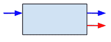

然而，考虑如果这些部分看起来像这样：


然后它们将像乐高积木一样拼合在一起！看它们如何拼合在一起？

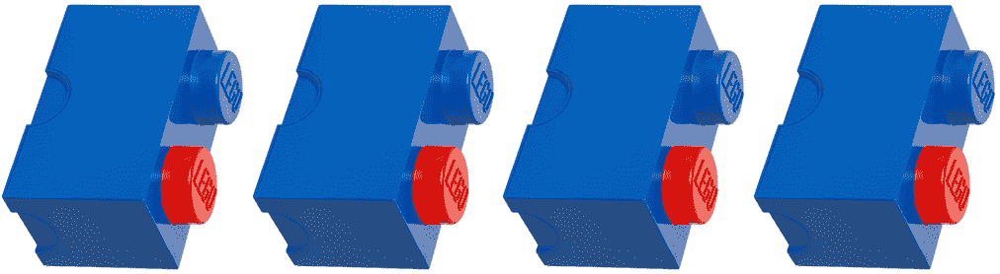

我们如何从一个输入转换为两个输入？

### 绑定操作

我们使用单子的绑定操作来实现这一壮举：

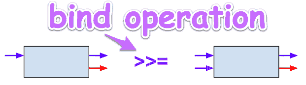

在 Haskell 中，它被称为`bind`操作。`bind`的其他名称包括`flatMap`、`flatten`、`andThen`、`collect`和`SelectMany`。（这就是函数式编程令人困惑的地方之一--不同的语言对同一件事使用不同的名称。）词法工作流称其为`Next`。

更具描述性的名称可能是 adapt、link，甚至是 hard shove。（在我们的代码示例中，我们将使用名称`Next`，因为在移动到`Next`步骤的上下文中，这是最有意义的名称。）绑定是一种模式，它将一个输入、两个输出的块适应为一个输入、两个输出的块。

现在，让我们谈谈两条路径--顶部蓝色路径是`Success`路径。只要一切顺利，这就是我们的*Happy Path*，我们的数据就会流过这条路径。底部红色路径是错误发生的地方。


### 提升操作

让我们来看看当在链中的第二个组件的提升操作发生错误时会发生什么：

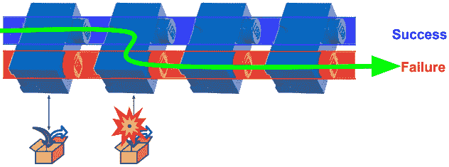

将函数提升到*包装*类型中。提升将我们的函数从一个世界连接到另一个世界。

一个函子提升单参数函数。一个应用函子提升第二个多参数函数。

这是 Haskell 中提升操作的类型定义：

`liftA2 :: Applicative f => (a -> b -> c) -> f a -> f b -> f c`

请看下面的终端控制台，这是使用提升操作（`liftA2`）将`replicate`函数转换为包装类型的示例。我们使用*applicative style*，因为我们正在使用任意数量的参数进行提升。

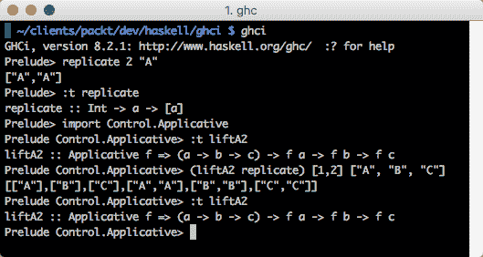

请注意，我们不会抛出异常（或恐慌）；相反，我们将我们的应用程序流从`Success`路径移动到`Failure`路径。实际上，这意味着在执行可能在我们的代码中失败的每个命令后，我们不再需要检查错误。使用单子模式，我们能够将程序流重定向到`Failure`路径，并在尾端处理这个执行链中的所有错误。

现在我们明白了为什么以及如何得到了两个输入和两个输出，让我们来看看在我们的一系列蓝色框下发生了什么：

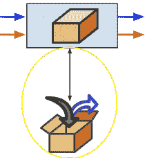

看到那个打开的盒子，箭头进来和出去？那些是不纯的箭头。

还记得我们在第九章 *函子、单子和泛型*中关于将元素降低到突变的行为的讨论吗？

这就是我们的单子允许我们在纯函数式编程之外打开我们的盒子的地方。我们的单子是一个函子，在这里，我们使用了提升的函子操作。

有关提升的详细信息，请参阅上一章。

输入箭头表示与外部世界的交互。诸如：

+   管理状态

+   读取日志文件

+   从外部 API 接收输入

+   并行处理

输出箭头表示与外部世界的交互。诸如：

+   管理状态

+   写入日志文件

+   将输出发送到外部 API

+   并行处理

记住，在纯函数式编程中，如果程序接收到某个输入值，那么它将始终返回相同的输出。然而，当程序写入日志文件时，它怎么可能每次都有相同的时间戳？单子允许纯 FP 程序保持纯净，同时与不纯净的世界进行交互。


这是将映射/数据转换函数应用于数据的地方。

在我们的特蕾莎修女生活的 monad 示例中，这（在盒子里）是积极互动发生的地方，也许是与她充满爱心的母亲，这些互动帮助她朝着积极的方向发展。还可能发生了哪些其他互动来改变她的生活？

任何有用的应用程序怎么可能不管理状态？一个 FP 应用程序如何管理状态并保持纯净？Monad。（请参见即将出现的表中的状态 monad。）

为什么使用 Monad 来管理状态？Monad 允许以一种优雅、类型安全、受限、推迟和受控的方式操纵状态。

优雅？Monad 有什么优雅之处？优雅在于观察者的眼中。优雅不会妨碍。它简单、明显、直接，并且使我们几乎不费什么智力就能立即理解我们代码的目的：

```go
step := Get(lineBase64)
step = Next(step, Base64ToBytes)
step = Next(step, BytesToData)
step = Next(step, TimestampData)
step = Next(step, DataToJson)
```

这就是一个 Monad。它没有杂乱，很容易看出工作流程是什么。

推迟？我们在谈论什么？为什么不直接将所有控制流逻辑一开始就写入？我们知道在所有用例中应该发生什么。为什么不将所有的 if/then/else 逻辑和 for 循环都写入并将它们全部编译成一个可执行文件呢？

使用 Monad，我们尽量使用尽可能多的纯净、无副作用的函数来编写我们的应用程序。这种编程风格大多将有关何时以及如何改变状态的决策推迟到需要它们的时刻。这就是当我们打开盒子时会发生的事情。

受限？什么受限？嗯，这是一个多义词。从框架的角度来看，我们正在将引起副作用和真实世界接口的代码限制/隔离到这个小而有目的的盒子中。它的工作是执行特定的数据映射转换功能。如果发生任何错误，框架将捕获它们并为我们打包错误，并确保它们迅速通过“失败”路径传递，直到它们被排出执行管道的末端，在那里处理此执行链的所有错误。从数据的角度来看，我们使用我们的类型系统来限制输入为有效的数据类型。（如果我们有一个除法操作，我们可以将输入类型限制为`PositiveNumbers`，以确保永远不会发生除以零的异常。）从类型类的角度来看，我们的操作受 Monad 的法则约束。

什么操作？什么法律？操作是我们将任务链在一起以对数据执行各种操作的序列。如果我们从一辆车的列表开始，我们可能想通过应用以下转换来转换我们的列表：

```go
Filter(ByDomestic()).Map(Upgrade()).Reduce(JsonReducer())
```

最后，我们所说的控制是什么意思？这就是 Monad 的优势所在。Monad 提供了链接转换操作的结构。它提供了“成功”和“失败”的路径。现在，我们不再需要在代码中到处散布`if err != nil`错误检查块，我们可以将所有错误处理逻辑放在我们需要为特定用例执行的所有步骤的末尾。

再说一遍：Monad 是什么？Monad 是一种设计模式，提供了一种将操作链接在一起的方法。`bind`函数是将操作链接在一起的链条；它接收一个步骤的输出并将其传递到下一个步骤。

我们可以编写直接使用`bind`运算符的调用，或者我们可以使用一种语法糖，比如 Haskell 语言，让编译器为我们插入这些函数调用。但无论哪种方式，每个步骤都是通过对`bind`函数的调用来分隔的。

由于 Haskell 是一个完全成熟的纯函数式编程语言，我们经常会提到它的 FP，以便思考如何最好地将这种思维/设计方法融入我们的 Go 解决方案中。

在 Haskell 中有许多种 monad。每种 monad 的独特之处和特别有用之处在于它在`bind`操作之外所做的事情。我们可以使用在 Haskell 中找到的 monad 表格作为在 Go 中构建 monad 包的起点：

| **Monad** | **描述** |
| --- | --- |
| **Either** | `Either`类型类似于`Maybe`类型，但有一个关键区别——它可以携带`Success`和`Failure`的附加数据。`Left`返回值表示失败，`Right`表示成功。这里有一个有用的双关语：使用*Either*来得到*Right*的答案。 |
| **Error** | 允许我们精确定义异常处理在我们的应用程序中的工作方式。例如，如果过去 60 秒内已处理了类似的异常，我们可以选择忽略特定的异常。 |
| **Eval** | 用于通过将算法与并行性分离来模块化并行代码，允许我们通过替换`Strategy`函数来改变并行化代码的方式。`Eval`和可交换的`Strategies`利用惰性评估来表达并行性。 |
| **Failure** | 在不需要在每个函数调用后都进行`if err != nil`条件错误检查的情况下，自动中止执行步骤链。 |
| **Free** | 允许我们从任意类型构造一个 monad。自由 monad 允许我们抽象地指定纯函数之间的控制流，并分别定义一个实现。我们使用 monad 将纯函数与特定目的的控制流（如快速失败错误处理（`Maybe/Either`）或异步计算）粘合在一起。 |
| **Identity** | `Identity` monad 是一个不具备任何计算策略的 monad。它只是将绑定函数应用于其输入，而不进行任何修改。从计算上讲，没有理由使用`Identity` monad 而不是更简单的将函数应用于其参数。`Identity` monad 的目的在于它在 monad 变换器理论中的基本作用。对`Identity` monad 应用的任何 Monad 变换器都会产生该 Monad 的非变换器版本。`Identity` monad 就像加法中的零一样。你不能用零增加另一个数字，但是当你需要编写`Reduce`函数时，零就派上用场了。 |
| **If** | 提供简单的控制流，以评估逻辑条件是否为真的子句的结果，否则将评估假的块（如果提供了）。 |

| **IO** | 将 I/O 与（纯）语言的其余部分分离。在 Haskell 中，是`return`语句将不纯的 I/O 放入`IO`Monad 中。它允许访问不纯的 I/O 源，如内存、全局变量、网络、本地操作系统调用、标准输入等。以下是一个 Haskell 代码示例，说明了 IO monad：

```go
loveGo :: IO Bool
 loveGo =
 do putStrLn "Do you love Go? (yes/no)"
 inpStr <- getLine
 return ((inpStr) == "yes")
```

|

| **懒惰** | 它与`StateThread`（ST）monad 相同，只是这个 monad 延迟了对状态操作的评估，直到需要依赖它们的值。 |
| --- | --- |
| **List** | 我们可以使每一步返回一系列结果。我们的绑定函数可以迭代列表，将每个结果传递到下一步。这消除了编写循环结构来迭代元素列表的需要。只需编写一次，然后重复使用。 |
| **Maybe** | 用于处理 nil 值，因为它处理可能不返回结果的计算。monadic 操作返回`Just`值或`Nothing`，而不是返回 nil（或抛出异常/panic）。错误会沿着 monad 结构传播，直到它们到达所有错误被处理的出口点。在 Haskell 中它是这样定义的：`data Maybe a = Nothing &#124; Just a` |
| **选项** | 用作可能返回 nil/null 值的数据的返回类型。如果数据无效，在`Option`单子内返回`None`，否则返回带有有效数据的`Some`。单子函数将链式失败状态，因此如果函数要求数据有效但接收到一个带有`None`的`Option`，它将简单地返回`Option None`给`Next`函数。这种模式类似于在命令式语言中返回`Null`，并解决了[十亿美元的错误](https://en.wikipedia.org/wiki/Null_pointer)。 |
| **Par** | 用于通过要求程序员提供有关数据依赖关系的更多细节来模块化并行代码。Par 提供更多控制，并且不依赖于惰性评估来管理并行任务。 |

| **Parser** | 用于创建解析器。例如，我们的语法可能如下所示：

```go
addop = "+" &#124; "-".
digit = "0" &#124; "1" &#124; ... &#124; "8" &#124; "9".
expr = term { addop term }.
factor = "(" expr ")" &#124; number.
mulop = "*".
number = [ "-" ] digit { digit }.
term = factor { mulop factor }.
```

我们可以使用我们的解析器单子执行数学运算，例如：

```go
ghci> 1+2
 3
```

|

| **Pause** | 用于需要中断和恢复计算的情况。可以提供一个步骤函数，该函数运行计算，直到调用 yield 函数将计算暂停，返回足够的信息给调用者以便稍后恢复计算。有关大约十几种可能的实现示例，请参见[stackoverflow.com/questions/10236953/the-pause-monad](https://stackoverflow.com/questions/10236953/the-pause-monad)[.](https://stackoverflow.com/questions/10236953/the-pause-monad)。 |
| --- | --- |
| **Reader** | 提供对全局状态的访问。在初始化期间，应用程序可以将配置读入单个上下文，然后将其传递给后续步骤。也被称为**环境**。 |
| **State** | 提供对状态值的访问。执行一些计算的运行函数将更新状态并返回最终状态。例如，在在线第一人称射击视频游戏中，玩家需要在游戏的每个阶段了解玩家的状态：他们的健康状况，弹药量，手头的武器类型，位置，或者周围地区的地图叠加。状态不是全局的，而是在游戏的每一步中创建一个新的状态。由于状态实际上并不执行破坏性的更新，因此回滚到旧版本或执行撤消操作更容易。 |
| **ST** | 允许我们安全地使用可变状态。例如，我们可以解冻一个不可变/冻结的数组并在原地修改它，然后冻结一个新的不可变数组。ST 还允许我们创建数据结构，然后修改它，就像我们在命令式语言中所做的那样。也被称为**状态线程单子**。 |
| **STM** | **软件事务内存**（**STM**）单子通过防止我们意外执行可能导致死锁的非事务 I/O 操作来帮助我们解决同步多个任务的问题。为了在命令式编程中执行并发编程，我们使用必须共享数据的线程。我们必须小心，以确保不同的线程不会不正确地更新共享数据。我们经常使用一种称为**信号量锁**的技术来锁定数据块。使用 STM，我们不需要担心信号量，因为我们的代码不包含锁。请注意，在 Go 中，我们用于执行并发编程的语言构造包括 Goroutines，通道和`sync.WaitGroup`。 |
| **Writer** | 用于表示某些副作用。通常用于日志记录或调试打印。 |

除了从 Haskell 的单子实现中学习之外，我们还可以学习的其他功能包括：

+   惰性评估

+   类型类

+   基于布局的语法

+   数据结构上的模式匹配

+   有界和参数多态性

在以下资源中了解更多关于 Haskell 的信息：

+   [`en.wikipedia.org/wiki/Haskell_(programming_language)`](https://en.wikipedia.org/wiki/Haskell_(programming_language))

+   [`www.haskell.org/`](https://www.haskell.org/)

+   [`learnyouahaskell.com/`](http://learnyouahaskell.com/)

+   [`www.huffingtonpost.com/aaroncontorer/haskell-the-language-most_b_4242119.html`](https://www.huffingtonpost.com/aaroncontorer/haskell-the-language-most_b_4242119.html)

### 单子函数

单子被实现为一个类型类，有两个方法，`return`和 bind(`>>=`)：

```go
class Monad m where
 return :: a -> m a 
 (>>=) :: m a -> (a -> m b) -> m b
```

注意，`m`指的是一个类型构造器，比如`Either`或`Maybe`，它实现了`Monad`类型类。

接下来的表格中包含了标准库中的一些单子函数：

| **函数** | **描述** |
| --- | --- |
| **fail** | fail 函数支持单子的失败实现。我们从`Monad`类型类中获得`fail`函数，它使得失败的模式匹配会导致当前单子环境中的失败，而不是程序崩溃。例如，当模式匹配在 do 表达式中失败时，就会调用`fail`函数。`fail :: Monad m => String -> m a` |
| **fmap** | `fmap`来自于 Functor 类型类。`fmap`将一个函数应用于普通值`a -> b`，并将它们提升为容器类型`f a -> f b`的函数，其中`f`是容器类型：`fmap :: Functor f => (a -> b) -> f a -> f b` |
| **mplus****mzero** |

`MonadPlus`是一个类型类，它扩展了`Monad`类并提供了`mzero`和`mplus`：

`class Monad m => MonadPlus m where`

`mzero :: m a`

`mplus :: m a -> m a -> m a``mplus`将两个结果合并为一个。`mzero`表示一个空结果。|

| **return** | Return 是我们的提升函数。不要把`return`和 Go 语言中的 return 搞混了。可以这样理解：**Return**一个纯值**a**（类型为**A**）到一个单子**m a**（类型为**Monad A**）。词法工作流解决方案将这个函数称为`Get`。 |
| --- | --- |

| **(>>=)** | (`>>=`)运行一个动作，然后将其结果传递给一个也返回一个动作的函数。两个动作都会运行，最终结果是第二个动作的结果。我们可以把(`>>=`)看作是我们的链接函数：

```go
main.hs:

module Main (main) where
 import Lib
 main :: IO ()
 main = do
 putStrLn "Enter your first name:" >>
 getLine >>=
 (\yourName -> putStrLn $ "Hello, " ++ yourName)
```

将以下内容添加到你的 Haskell ghci 控制台：

```go
*Main Lib> main
 Enter your first name:
 CocoPuff
 Hello,
CocoPuff
```

(`>>=`)也被称为**bind**。词法工作流解决方案将这个函数称为`Get`。下面是它的类型定义：

```go
(>>=) :: Monad m => m a -> (a -> m b) -> m b
```

|

| **(>>)** | (`>>`)按顺序执行两个动作。第一个动作的结果被丢弃。我们保留的是第二个操作的结果：

```go
*Main Lib> putStr "Hello, " >> putStrLn "CocoPuff"
 Hello, CocoPuff
```

(`>>`)是根据丢弃其参数的`bind`操作定义的。以下说明了(`>>`)有左右两个单子类型为`m a`和`m b`的参数：

```go
(>>) :: Monad m => m a -> m b -> m
```

|

#### 基本单子函数

以下表格包含了一些更常用的单子（用于组合、循环和映射）：

| **函数** | **描述** |
| --- | --- |

| **forM** | `forM`像一个迭代器，它在列表上映射一个动作并返回转换后的列表。`forM`的作用与`mapM`相同，但是为了可读性而存在。经验法则是，如果在 for 循环中有多行代码，则使用`forM`。例如：

```go
results <- forM items $ \item -> do
    -- A big do-block using `item`.
forM :: (Monad m, Traversable t) => t a -> (a -> m b) -> m (t b)
```

|

| **forever** |
| --- |

`forever`是一个组合子，用于重复一个动作`forever`，如下所示：

```go
forever :: Applicative f => f a -> f b
```

|

| **mapM** | `map`操作在转换列表中的元素时执行了变异，对吧？但是这怎么可能呢？纯函数不能改变变量。我们可以通过使用`mapM`间接执行动作。`mapM`可以改变列表中元素的值，因为它在 IO 单子中运行，如下所示：

```go
mapM :: (Monad m, Traversable t) => (a -> m b) -> t a -> m (t b)
```

|

| **sequence** | 用于从左到右评估序列中的每个动作并收集结果，如下所示：

```go
sequence :: (Monad m, Traversable t) => t (m a) -> m (t a)
```

|

| **void** | 用于丢弃 IO 动作的返回值，如下所示：

```go
void :: Functor f => f a -> f ()
```

|

| **(=<<)** | 这与`>>=`相同，但参数位置互换，如下所示：

```go
(=<<) :: Monad m => (a -> m b) -> m a -> m b
```

|

| **(>=>)** | 用于通过左到右的 Kleisli 组合组合单子，如下所示：

```go
(>=>) :: Monad m => (a -> m b) -> (b -> m c) -> a -> m c
```

|

| **(<=<)** | 这与`>=>`相同，但参数位置互换（使用右到左的 Kleisli 组合），如下所示：

```go
(<=<) :: Monad m => (b -> m c) -> (a -> m b) -> a -> m c
```

|

请注意，这里未列出的`functionName_`函数用于副作用。例如，当我们想要评估这样一个列表以产生效果时，我们使用`sequence_`和`mapM_`，它们会丢弃结果。

### 单子列表函数

要记住的一件事是，列表模拟了非确定性。值`a`的列表代表了`a`值的许多不同可能性。

| **Function** | **Description** |
| --- | --- |

| **filterM** | 用于在单子内部替代`filter`，如下所示：

```go
filterM :: Applicative m => (a -> m Bool) -> [a] -> m [a]
```

|

| **foldM** | 用于在列表构建的单子计算中从左到右绑定 foldl 的位置，如下所示：

```go
foldM  :: (Monad m, Foldable t) => (b -> a -> m b) -> b -> t a -> m b
```

|

| **join** | 用于展平组的嵌套，如下所示：

```go
> join [[[1]]]
 [[1]]

 > join [[1]]
 [1]
join :: Monad m => m (m a) -> m a
```

|

| **msum** | 一个基于列表的连接函数，最好通过以下示例来描述：

```go
> msum [Nothing, Nothing, Just "A", Just "B"]
 Just "A"

> msum [[],[1,2],[],[3]]
 [1,2,3]
msum :: (MonadPlus m, Foldable t) => t (m a) -> m a
```

|

| **replicateM** | 用于执行一个动作`n`次并收集结果，如下所示：

```go
replicateM :: Applicative m => Int -> m a -> m [a]
```

|

| **zipWithM** | 用于合并两个列表，同时应用特殊规则。`zipWithM`是列表上`zipWith`函数的单子版本。当只有单子计算的副作用很重要时，它是有用的，如下所示：

```go
zipWithM :: Applicative m => (a -> b -> m c) -> [a] -> [b] -> m [c]
```

|

## 单子工作流实现

让我们首先从一个包含汽车的 base64 编码文本字符串的文件`cars.base64`中读取我们的汽车数据：

```go
4-purely-functional/ch10-monads/01_car_steps/data/cars.base64
eyJjYXIiOnsidmluIjoiREc1NDVIRzQ5NDU5WiIsIm1ha2UiOiJUb3lvdGEiLCJtb2RlbCI6IkhpZ2hsYW5kZXIiLCJvcHRpb25zIjp7Im9wdGlvbl8xIjoiSGVhdGVkIFNlYXRzIiwib3B0aW9uXzIiOiJQb3dlciBTdGVlcmluZyIsIm9wdGlvbl8zIjoiR1BTIn19fQ0K
eyJjYXIiOnsidmluIjoiMzQ4NTQzOTg1QVpERCIsIm1ha2UiOiJMZXh1cyIsIm1vZGVsIjoiSVMgMjUwIiwib3B0aW9ucyI6eyJvcHRpb25fMSI6IlN0aWNrIFNoaWZ0Iiwib3B0aW9uXzIiOiJNb29uIFJvb2YiLCJvcHRpb25fMyI6IkxlYXRoZXIifX19DQo=
eyJjYXIiOnsidmluIjoiTUZORkg2NkZCWlE5OSIsIm1ha2UiOiJIb25kYSIsIm1vZGVsIjoiQWNjb3JkIiwib3B0aW9ucyI6eyJvcHRpb25fMSI6IkFsbG95IFdoZWVscyIsIm9wdGlvbl8yIjoiUG93ZXIgU3RlZXJpbmcifX19
```

我们的汽车处理单子将获取 base64 文本，对其进行时间戳处理，并输出 JSON，如下面的代码所示：

```go
{
  "car": {
    "vin": "MFNFH66FBZQ99",
    "make": "Honda",
    "model": "Accord",
    "options": {
      "option_1": "GPS",
      "option_2": "Alloy Wheels"
 }
  },
  "timestamp": "20171030003135"
}
```

让我们从`main.go`开始。我们导入两个项目包，`workflow`和`utils`。我们还从 Go 标准库中导入`bufio`和`os`来处理我们的`base64`文本文件。

我们将我们的项目包放在导入包列表的顶部。我们导入*workflow*和*utils*。在本书中，我们经常使用 utils 包中的日志记录和配置功能。为了懒惰起见，我们只需记住我们可以在任何地方使用`Config`对象，并引用我们的`config.toml`文件中的值。类似地，要使用我们的信息记录器，我们只需输入`Info.Println`。

在 Go 中，先写测试被认为是最佳实践。这被称为**测试驱动开发**。我们在第一章讨论过这个问题。你应该以这种方式编写你的应用程序。然而，在第二章之后，*操作集合*，示例代码更频繁地出现在`main.go`文件中（没有测试文件）。我这样做是因为我是一个懒惰的程序员，不喜欢打字超出必要的范围，而且我认为这样能更快/更好地传达教训。当我选择在调用 Config 和 Info、Debug 和 Error 记录器时消除包引用要求时，我也使用了类似的推理。你应该在工作中使用全局记录器和配置对象吗？可能不应该。为什么？因为它们是应该明确传递给使用它们的每个函数的依赖项。第七章*，功能参数*，说明了如何实现这一点。更多信息，请参见[`peter.bourgon.org/go-best-practices-2016/`](http://peter.bourgon.org/go-best-practices-2016/)。

在以下的`main.go`中，我们导入包并运行我们的初始化程序。

```go
package main

import (
   "workflow"
 . "utils"
 "bufio"
 "os"
)

func init() {
   GetOptions()
   InitLog("trace.log", os.Stdout, os.Stdout, os.Stderr)
   Info.Println("AppEnv:", Config.AppEnv)
}

```

`init`函数将在我们的`main`函数之前执行。我们调用`GetOptions`来将`config.toml`文件中的值读取到全局的`Config`变量中。

是的。这是一个全局变量。还有更多。例如，Debug、Info 和 Error 是我们的全局记录器。

你是否想知道为什么我会在一个纯 FP 概念的示例应用程序中放置全局变量，比如单子？

这本书是关于改进你处理应用程序开发的方式。Go 是一种多范式语言，允许我们将纯 FP 与我们现有的代码混合在一起。`01_car_steps`应用程序包括一个带有全局记录器对象的命令式框架，以及一些纯 FP 代码来处理工作流程。

这是一个小应用程序，所以拥有一个全局记录器很方便。如果这是一个更大的项目，最好为每个服务实例拥有一个记录器。

尽管这本书涵盖了纯 FP 的理论以及一些历史，但这本书的主要目标是实用性。我希望你能够在自己的项目中使用这本书中的一些代码（或者至少是一些概念）来构建更好的应用程序。

调试，信息和错误分别分配了一个`log.New`对象（[`golang.org/pkg/log/#New`](https://golang.org/pkg/log/#New)），返回一个`*Logger`。如果你想要并发地从各种 goroutines 使用它，你应该将这些记录器对象作为指针传递。

我们可以在`config.toml`文件中调整我们的应用程序设置如下：

```go
# Full path to the file containing the base64 car strings
data_filepath = "./data/cars.base64"

# Runtime environment
app_env = "development"

# Level options: panic, error, info, debug
log_level = "debug"

# The character(s) used to preface debug lines
log_debug_chars = ">>"

# Whether to include timestamps and log level on all log entries
log_verbose = true

# Enable or disable logging of utils/TimeTrack() (For benchmarking/debugging)
log_timetrack = true

# i18n translation file name, see github.com/nicksnyder/go-i18n
i18n_filename = "en-us.all.json"
```

最后一个设置可以告诉我们的应用程序使用哪个翻译文件。在本章后面，我们将看到如何使用`go-i18n`来使用消息 ID 引用适当的消息，以及如何根据适当的语言/区域设置更改翻译文本。在这个第一个例子中，我们不会添加错误消息的国际化（I18N），以保持简单，并且可以专注于理解单子是如何工作的。

`log_ settings`可以影响我们应用程序运行时记录的内容。我们将在本章后面看到如何使用它们的几个示例。

我们的`main`函数初始化了一个`carCntr`来计算我们处理了多少辆汽车。接下来，我们使用在我们的配置文件中设置的`Config.DataFilepath`值打开我们的数据文件。

成语是一种对本族语言的说话方式。在英语中，成语通常具有比喻意义，利用图片来帮助我们可视化其含义。例如，*Hit the nail on the head*，*A hot potato*，*It takes two to tango*等等。

以下的`if`语句以 Go 的成语风格打开文件。

`Config.DataFilepath`的值，`./data/cars.base64`，来自我们的`config.toml`文件：

```go
# Full path to the file containing the base64 car strings
data_filepath = "./data/cars.base64"
```

让我们仔细看看那行代码，看看我们能学到什么：


我们从 if 语句开始，就像典型的`if...then` else 语句一样，但是不是立即检查布尔值（真/假），在`if`之后，我们执行一个打开我们数据文件的语句。该语句为 err 赋值。如果`err == nil`，那么我们知道文件成功打开。这种特定的成语在 Go 标准库中使用了大约 100 次。我们应该模仿在 Go 标准库中找到的编码风格，特别是那些出现了这么多次的风格。

这本书的目标不是从你的工具箱中删除 Go 的成语，而是向其中添加简单而强大的 FP 工具。*如果你的唯一工具是命令式编程，那么每个迭代的钉子看起来都像一个 for 循环*。这并不是事实。一些迭代任务最好用映射、过滤器、减少、函子、幺半群和/或单子来解决。

在以下的`main`函数中，我们初始化了我们的汽车计数器并打开了我们的配置文件。

```go
func main() {
   carCntr := 0
 if file, err := os.Open(Config.DataFilepath); err == nil {
```

打开文件后，最佳实践是立即推迟关闭文件。（Go 标准库使用 defer 超过 100 次。）这样，我们就不会忘记关闭文件，这是一个经常导致内存泄漏并且难以排除故障的错误。defer 是 Go 给我们的另一个令人愉快的工具，可以帮助我们编写更好的代码。

我们执行 bufio 的`NewScanner`命令来打开文件并将其内容加载到 scanner 变量中，以便逐行读取文件。

为了简单起见，我们选择从文件中读取汽车，但我们也可以从另一个 I/O 源的输入流中读取我们的数据，比如：

+   ActiveMQ

+   NATS

+   Kafka

+   Kestrel

+   NSQ

+   RabbitMQ

+   Redis

+   Ruby-NATS

+   ZeroMQ

重要的是，你从中读取的源的接口需要实现`Reader`接口。如果我们查看 Go 标准库中`NewScanner`的实现，我们可以看到它需要一个`io.Reader`：

```go
// NewScanner returns a new Scanner to read from r.
// The split function defaults to ScanLines.
func NewScanner(r io.Reader) *Scanner {
   return &Scanner{
      r:            r,
      split:        ScanLines,
      maxTokenSize: MaxScanTokenSize,
   }
}
```

`io.Reader`是一个具有一个方法`Read`的接口。换句话说，我们从中获取数据的 API 需要有一个`Read`方法：

```go
type Reader interface {
   Read(p []byte) (n int, err error)
}
```

这是另一个模式，我们应该学会从 Go 标准库中模仿：*按接口编程*。在这里，感兴趣的接口是一个带有`Read`方法的对象。

我们可以在 for 循环中使用扫描器的`Scan`方法。我们将继续迭代，直到没有更多的行可读取为止：

```go
   defer file.Close()
Info.Println("----")
   scanner := bufio.NewScanner(file)
   for scanner.Scan() {
       carCntr += 1
 Info.Println("Processing car #", carCntr)
       line :=  scanner.Text()
       Info.Println("IN :", line)
```

现在，我们在循环中，并打印出了第一行读取的内容（第一辆车）：

```go
Processing car # 1
IN : eyJjYXIiOnsidmluIjoiREc1NDVIRzQ5NDU5WiIsIm1ha2UiOiJUb3lvdGEiLCJtb2RlbCI6IkhpZ2hsYW5kZXIiLCJvcHRpb25zIjp7Im9wdGlvbl8xIjoiSGVhdGVkIFNlYXRzIiwib3B0aW9uXzIiOiJQb3dlciBTdGVlcmluZyIsIm9wdGlvbl8zIjoiR1BTIn19fQ0K
```

接下来，我们调用我们的 monad 来执行处理我们输入行所需的工作流程（我们的第一辆车）：

```go
err, carJson := workflow.ProcessCar(line)

if err == nil {
Info.Println("OUT:", carJson)
}
```

在处理完我们的输入后，我们检查错误并输出结果：

```go
OUT: {"car":{"vin":"DG545HG49459Z","make":"Toyota","model":"Highlander","options":{"option_1":"Heated Seats","option_2":"Power Steering","option_3":"GPS"}},"timestamp":"20171030145251"}
```

`main`的其余部分打印了几条破折号，检查扫描器错误并关闭另一个 if else 块。

```go
          Info.Println("----")
       }
       if err = scanner.Err(); err != nil {
         Error.Error(err)
       }
   } else {
      Error.Error(err)
   }
}
```

上面代码的输出如下：

```go
AppEnv: development
----
Processing car # 1
IN : eyJjYXIiOnsidmluIjoiREc1NDVIRzQ5NDU5WiIsIm1ha2UiOiJUb3lvdGEiLCJtb2RlbCI6IkhpZ2hsYW5kZXIiLCJvcHRpb25zIjp7Im9wdGlvbl8xIjoiSGVhdGVkIFNlYXRzIiwib3B0aW9uXzIiOiJQb3dlciBTdGVlcmluZyIsIm9wdGlvbl8zIjoiR1BTIn19fQ0K
OUT: {"car":{"vin":"DG545HG49459Z","make":"Toyota","model":"Highlander","options":{"option_1":"Heated Seats","option_2":"Power Steering","option_3":"GPS"}},"timestamp":"20171030145251"}
----
Processing car # 2
IN : eyJjYXIiOnsidmluIjoiMzQ4NTQzOTg1QVpERCIsIm1ha2UiOiJMZXh1cyIsIm1vZGVsIjoiSVMgMjUwIiwib3B0aW9ucyI6eyJvcHRpb25fMSI6IlN0aWNrIFNoaWZ0Iiwib3B0aW9uXzIiOiJNb29uIFJvb2YiLCJvcHRpb25fMyI6IkxlYXRoZXIifX19DQo=
OUT: {"car":{"vin":"348543985AZDD","make":"Lexus","model":"IS 250","options":{"option_1":"Stick Shift","option_2":"Moon Roof","option_3":"Leather"}},"timestamp":"20171030145251"}
----
Processing car # 3
IN : eyJjYXIiOnsidmluIjoiTUZORkg2NkZCWlE5OSIsIm1ha2UiOiJIb25kYSIsIm1vZGVsIjoiQWNjb3JkIiwib3B0aW9ucyI6eyJvcHRpb25fMSI6IkFsbG95IFdoZWVscyIsIm9wdGlvbl8yIjoiUG93ZXIgU3RlZXJpbmcifX19
OUT: {"car":{"vin":"MFNFH66FBZQ99","make":"Honda","model":"Accord","options":{"option_1":"Alloy Wheels","option_2":"Power Steering"}},"timestamp":"20171030145251"}
----
```

让我们看看当我们运行这行时会发生什么：

```go
err, carJson := workflow.ProcessCar(line)
```

我们导入`utils`以便记录错误：

```go
//src/workflow/process_car_steps.go

package workflow

import (
   . "utils"
)
```

我们的`ProcessCar`函数清楚地表达了我们的业务意图。它接受一个 base64 编码的字符串，并以惯用的 Go 风格返回一个错误和结果（`carJson`）。如果一切顺利，我们的错误将是 nil，`carJson`将被填充。

工作流体现了我们的业务逻辑。我们的其余代码是框架。

请注意，`ProcessCar`没有被错误检查代码淹没，而是，工作流程中的每个步骤都是不言自明的。

这个图表说明了我们工作流程中的每个步骤：

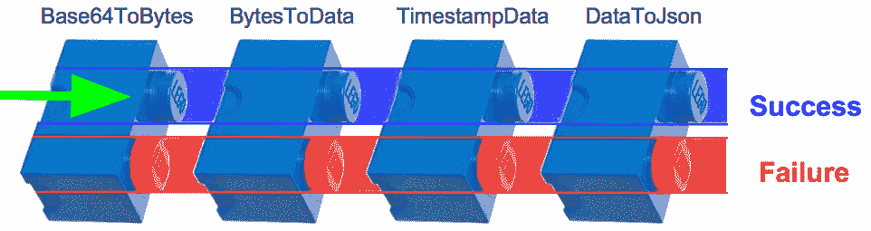

我们通过使用我们的输入`lineBase64`调用`Get`函数来初始化我们的步骤变量。这启动了我们的工作流程：

```go
func ProcessCar(lineBase64 string) (err error, carJson string) {
   step := Get(lineBase64)
   step = Next(step, Base64ToBytes)
   step = Next(step, BytesToData)
   step = Next(step, TimestampData)
   step = Next(step, DataToJson)
   json, err := step(nil)
   if err != nil {
      Error.Error(err)
   } else {
      carJson = json.(string)
   }
   return
}
```

让我们在`monad.go`中查找`Get`函数的实现：

`src/workflow/monad.go`

```go
package workflow

type Data interface{}
```

这就是空接口！小心海盗！


这个海盗是对的。在我们的示例中，我们确实在我们的函数工具箱中使用了反射。例如，为了获取传递给`ioutil.Readfile`函数的文件名，我们必须将我们的文件名参数从空的`interace{}`数据向下转换为字符串。

这是来自`src/workflow/toolbox.go`的片段：

```go
func Base64ToBytes(d Data) Monad {
   dString := d.(string)
   return func(e error) (Data, error) {
      return base64.StdEncoding.DecodeString(dString)
   }
}
```

如果 Go 支持泛型，我们就不需要这样做了。我们只需要稍微修改我们的代码以接受通用数据类型。因此，上述的`ReadFile`函数将看起来像这样：

```go
func Base64ToBytes(<T>) Monad {
   return func(e error) (Data, error) {
      return base64.StdEncoding.DecodeString(T)
   }
}
```

这大约少了 30%的代码，并且它将运行得更快，因为类型转换是一个相对昂贵的操作。在这种情况下，如果 Go 支持泛型，编译器将在编译后的`ReadFile`函数中创建一个字符串形状的空间，我们可以将我们的字符串传递进去。

在这种情况下，如果 Go 支持泛型，我们将需要写大约 30%的代码，并且我们的代码将是类型安全且非常快速的。

很容易理解为什么这么多程序员对这个话题大惊小怪。

如果反射的运行时成本太高，那么我们可以利用元编程工具，比如`clipperhouse/gen`来生成处理反射所需的重复样板代码。 （如果我们走这条类型安全的路线，并且比较支持类型安全、无反射代码所需的代码与如果 Go 支持泛型我们需要编写的代码，我们可能会发现我们需要维护的代码量大约少 80%。）

在你开始考虑跳上 Haskell 或 Java 的泛型车队之前，考虑一下 Go 的优点：简单、性能、并发支持等等。使用工具生成类型安全的代码非常容易，当 Go 有一天（手指交叉）支持泛型时，我们应该能够相当容易地删除我们生成的样板代码，并简单地使用泛型。

这是我们的`Monad`类型。它是一个接受`error`并返回转换后的`Data`和`error`的函数：

```go
type Monad func(error) (Data, error)
```

我们能猜到`Monad`的工作方式吗？也许如果它遇到错误，它会快速失败并传递错误，否则它将继续处理并传递数据以及 nil 的错误？

听起来有点像`Continuation Passing Style`（`CPS`）编程，但它是如何工作的呢？还记得在第四章*，Go 中的 SOLID 设计*中，我们学到了 Monad 是紫色的吗？

我们看到了这样的函数组合：

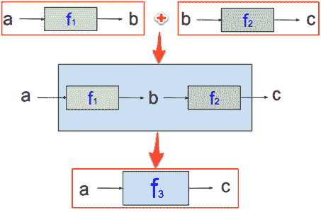

我们学到了为了成为一个 Monad，我们需要我们的函数接受**a**并返回一个这样的函数：

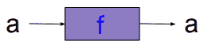

这将给我们关联性：

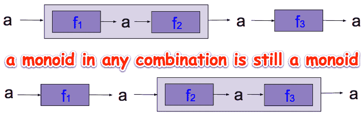

我们将调用`Get`方法，将我们的数据提升到纯 FP 的世界中。它接受数据并返回一个`Monad`。请注意，我们的`Data`，`d`是柯里化的：

```go
func Get(d Data) Monad {
   return func(e error) (Data, error) {
      return d, e
   }
}
```

这是我们将数据放入 monad 链中的第一个蓝色框的地方：

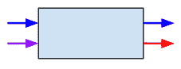

在初始化我们的步骤之后，我们调用我们的第一个数据转换函数`Base64ToBytes`（在`workflow/process_car_steps.go`中）：

```go
step := Get(lineBase64)
```

让我们跳回到`monad.go`并查看`Next`函数的实现：

```go
func Next(m Monad, f func(Data) Monad) Monad {
   return func(e error) (Data, error) {
      newData, newError := m(e)
      if newError != nil {
         return nil, newError
      }
      return f(newData)(newError)
   }
}
```

`Next`函数接受一个 monad 和一个返回 monad 的函数，并返回一个 monad。

就是这样。这就是我们如何得到接受 a 并返回 a 的紫色 Monad。


我们`Next`函数中的第一行看起来很熟悉：

```go
return func(e error) (Data, error) {
```

这是因为这一行与我们的 Get 方法中的第一行完全相同。在接下来的一行中，我们调用我们的 monad，将我们的错误作为其参数传递，并获得转换后的数据`newData`，以及返回的`newError`值：

```go
newData, newError := m(e)
```

在这里，我们的堆栈填满了`workflow.Next` monad 函数。我们的调用堆栈看起来像这样：

```go
workflow.Next (Base64ToBytes)
workflow.Next (BytesToData)
workflow.Next (TimestampData)
workflow.Next (DataToJson)
workflow.ProcessCar
main.main
```

这是我们连接步骤并跳回到`Get`以获取我们的数据（在返回语句中）的地方：

```go
func Get(d Data) Monad {
   return func(e error) (Data, error) {
      return d, e
   }
}
```

如果我们是电工，我们会关闭电源，连接房子里的灯，然后打开电源，看看我们的接线是否正确。

一旦执行从`return d, e`语句返回，我们就会进入`if newError != nil`错误检查块：

```go
func Next(m Monad, f func(Data) Monad) Monad {
   return func(e error) (Data, error) {
      newData, newError := m(e)
      if newError != nil {
         return nil, newError
      }
      return f(newData)(newError)
   }
}
```

如果发生错误，那么我们为数据和`newError`返回 nil；直到我们的执行在 monad 链的末尾输出错误之前，所有后续的错误检查都将传递相同的`newError`。

如果没有发生错误，则执行最后的返回：`return f(newData)(newError)`。这是什么？以前见过这样的函数调用吗？

```go
someFunction(val1)(val2)
```

这种语言结构被称为 Y-组合子。在深入讨论 Go 中 Y-组合子实现的细节之前，让我们思考一下它是什么以及它的起源，即λ演算。

### λ演算

λ演算从计算的角度定义了函数是什么。它由三个东西组成：

+   变量（x、y、z 等）

+   创建函数的一种方式（使用“\”符号）

+   应用函数的一种方式（替换）

其他所有内容都是根据编码这三个东西来定义的。

在第七章中，我们定义了一个函数，其中**f**是函数名，**x**是输入值，结果是整个表达式**f(x)**：


如果*f(x) = x + 2*，那么我们知道每次输入值三时，输出值总是五。因此，函数就像黑匣子，我们输入值，得到不同的值。既没有内部隐藏的数据，也没有副作用。

然而，在λ演算中，我们使用匿名的未命名函数。我们如何在λ演算中表示*f(x) = x + 2*？

在λ演算中构建函数的方式是使用表达式，如下图所示：

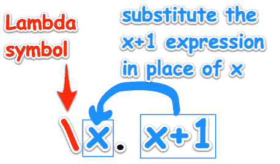

`\x`后面的句点只是一个将我们的函数签名（其参数 x）与其主体（在我们的例子中为`x+2`）分开的标记。

在下面的例子中，`3`是输入参数：

```go
(\x. x+2) 3
```

结果是`5`。

在数学课上，我们习惯于这样写函数应用：f(3)。在λ演算中，我们说（f 3）。

函数应用是从左边开始的，所以 `(f a b c) = (((f a) b) c)`。

当一个函数被应用时，我们只是用我们的参数替换 x 在我们的主体中，计算，比如`x+2`，就会被执行。让我们再试一个接受两个参数的函数：

```go
(\x.\y. (x+y)/2) 3 5
```

这返回一个参数函数，也返回一个参数函数，然后返回结果：

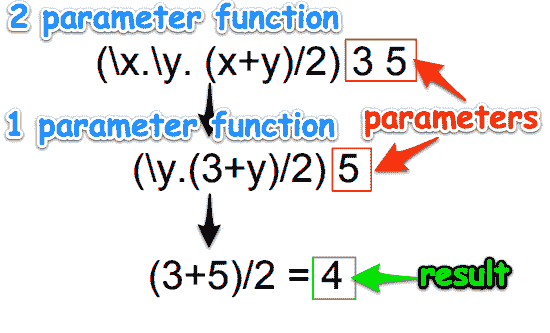

我们刚刚做的叫做**柯里化**，多参数函数实际上只是接受一个参数并返回函数的高阶函数。

我们之前使用的数字（2、3、5）和运算符（+、/）不是 Lambda 演算的一部分。我们只是用它们来编码计算。

Lambda 演算没有数据类型，但我们可以通过使用函数来表示数据类型。让我们创建布尔数据类型：

| **布尔函数** | **描述** |
| --- | --- |
| `true := \x.\y.x` | `true` 函数是一个接受两个参数（x 和 y）并返回第一个参数（x）的函数。 |
| `false := \x.\y.y​` | `false` 函数是一个接受两个参数（x 和 y）并返回第二个参数（y）的函数。 |

让我们定义逻辑非函数，not：

| **布尔表达式** | **描述** |
| --- | --- |
| (\b. b false true ) true | lambda b b 应用于 false 和 true 返回 true |
| (\b. b true false ) false | lambda b b 应用于 true 和 false 返回 false |

我们已经看到斐波那契函数是递归的：

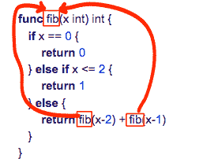

我们定义了`fib`函数是基于自身的。这使得`fib`函数是递归的。

让我们从用 Lambda 演算定义一个 for 循环开始。

也许我们可以形成一个表达式 a，它会调用自身，也就是将函数应用于自身。那会是什么样子呢？

```go
forLoop := (\x.x x) (\x.x x)
```

让我们看看它是如何工作的：

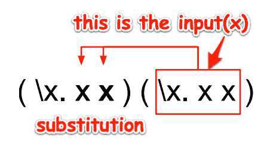

`\x.x x` 接受输入`x`并将`x`应用于自身。我们的函数以`x`作为输入，并生成`x`的两个副本。这就是自我应用。

递归就是关于用自身来定义某物。

让我们看看当我们执行两次递归时会是什么样子：

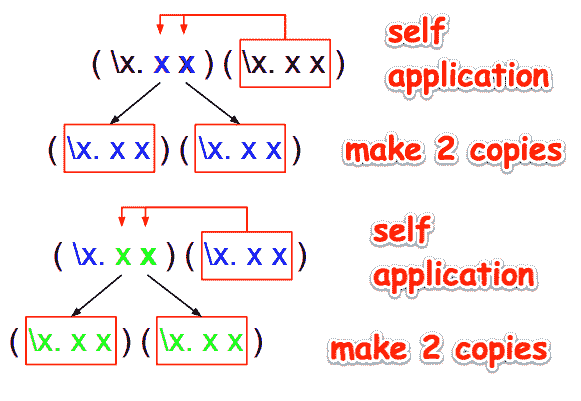

我们可以看到这个过程如何无限地继续下去。这就是我们如何使用 Lambda 演算来编码 for 循环行为。

现在我们知道如何编码一个 for 循环，那么如何编码递归呢？

让我们定义一个通用的递归函数如下：

```go
recursive f = f(recursive f)
```

这读作，递归的`f`等于`f`应用于递归的`f`。

当我们运行这个函数时，它将重复应用`f`，我们会得到： `f(f(f(...)))`。以下是 Y-组合器：

```go
Y = \f.(\x.f(x x)) (\x.f(x x)) 
```

它不是递归的，但它编码了递归。这就是我们如何在不支持递归的语言中实现递归的方式。

准备好看如何在 Go 中实现 Y-组合器了吗？

但是等等，还有更多。

让我们停下来思考 Y-组合器在生物工程中可以用在哪里。递归基因组函数可以使用 Y-组合器进行建模。Lambda 演算实际上是实用的证据在哪里？看镜子里：


有关*递归基因组函数-佩里奥尼兹原理*的更多信息，请参见[`www.junkdna.com/recursivegenomefunction/`](http://www.junkdna.com/recursivegenomefunction/)。

你知道吗，你的基因可以被测序，检测出异常，表明你对某些疾病的易感性，比如帕金森病？你越早知道，预防措施就能越早采取。

参见[`en.wikipedia.org/wiki/Disease_gene_identification`](https://en.wikipedia.org/wiki/Disease_gene_identification)。

Lambda 演算（提供递归）和单子（控制操作的组合）深深地编织在生活的结构中。当我们睡觉时会发生什么？你是否曾经长时间工作来解决问题，但没有成功，只是在第二天早上醒来时想到了解决方案？你知道吗，当我们睡眠不足时，我们更容易患病约 25%？你认为是什么导致了导致癌细胞生长的 DNA 突变？休息时间（睡眠）有什么特别之处，使我们的身体能够正确地组合？

当我们遵循基本规则时，我们会茁壮成长。

“早睡早起使人健康、富有和聪明。”

- 本杰明·富兰克林

## Y-Combinator

Y-Combinator 是编程中最美丽的想法之一。这段代码展示了函数式编程的简单思想是多么强大。Y-Combinator 是一个高阶函数。它接受一个参数，这个参数是一个不是递归的函数。它返回一个递归的函数的副本。它要求我们的语言支持一级函数和函数命名或匿名。Go 支持所有这些。

### Y-Combinator 中的 Y

你是否想知道 Y-Combinator 中的 Y 来自哪里？

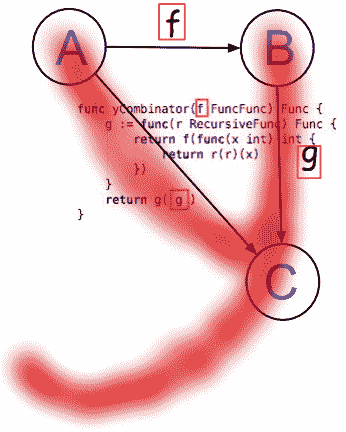

看看**A**和**B**和**C**如何连接起来形成“y”的顶部部分？

### Y-Combinator 的工作原理

下面的图表说明了 Y-Combinator 的工作原理：

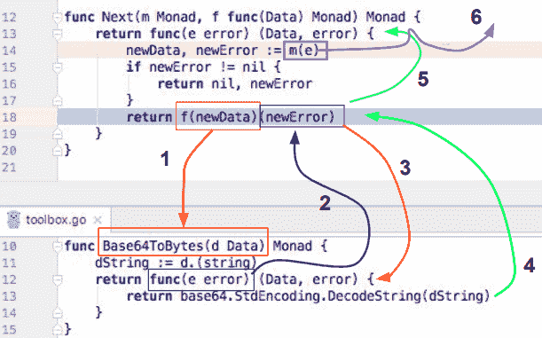

以下是连接 Y-Combinator 的步骤：

1.  `f(newData)`调用`Base64ToByes`并使用`base64`编码的文本。`dString`被降级为字符串。

1.  `return func(e error) (Data, error) {`语句被执行，并将执行返回到`Next`函数中的返回语句。

1.  此时，`f(newData)`本身是一个函数，它的`newError`参数被填充，现在可以执行。

1.  运行时执行返回到`Base64ToBytes`中的`return func(e error) (Data, error)`行，并进入其代码块，这是将`base64`字符串解码为常规字符串的返回语句。

1.  执行再次返回到`Next`，在最后的返回行。这是递归发生的地方。它调用自身，传递错误值。

1.  在*第 14 行*，我们调用下一个单子。这是继续传递发生的地方。

我们编写了一个使用一个绑定变量的递归函数，只使用一个变量的函数和没有赋值。Y-Combinator 执行了将匿名内部函数(`func(e error) (Data, error) {`)与最初传递给`Next`的函数(`f`)的参数名(`newError`)关联起来的魔术。

既然我们知道了`toolbox.go`中一个可重用函数的工作原理，我们就不需要再去了解其他函数了。它们都是以相同的方式工作。我们只需通过工作流程的每一行进行`Next`步骤，直到我们走出另一端。如果在任何可重用函数中遇到错误，我们只需将问题推迟到下一步。

这使得处理错误变得简单和容易。错误只需要在流程的最后一步处理，只需在一个地方处理。简单。

#### 词法工作流解决方案

这是我们整个`ProcessCar`工作流程：

```go
func ProcessCar(lineBase64 string) (err error, carJson string) {
   step := Get(lineBase64)
   step = Next(step, Base64ToBytes)
   step = Next(step, BytesToData)
   step = Next(step, TimestampData)
   step = Next(step, DataToJson)
   json, err := step(nil)
   if err != nil {
      Error.Error(err)
   } else {
      carJson = json.(string)
   }
   return
}
```

这对于清晰度来说如何？每一步接着下一步，错误处理在最后。

这种符合 Go 惯用法的单子工作流解决方案需要一个标签，因为我首先想到了它，它的名字是词法工作流。这是我们如何在 Go 中对不纯组件进行单子组合的方式。Lex 意味着**法律**，因为它控制和支配我们的工作流，所以这个名字很合适。（它有我的名字纯属巧合！）

### 我们的 ProcessCar 方法是否符合 Go 代码的惯用法？

让我们从不符合惯用法的地方开始。

#### 不符合惯用法的部分

在我们的处理管道的末尾之前，没有`err != nil`的错误检查。这是有意设计的。

使用单子管道的好处如下：

+   使我们能够清晰地表达业务逻辑，而不受干扰

+   消除每个操作代码行后的`err != nil`错误检查

+   为管道处理提供结构

+   对我们工作流中的所有`Next`步骤进行排序

+   为插入可重用组件提供框架

#### 成语化的部分

我们在管道的末尾有一个典型的`if err != nil`错误检查：

```go
if err != nil {
   Error.Error(err)
} else {
   carJson = json.(string)
}
```

这是我们应该执行错误检查的地方，所以进行错误检查是很自然的。

我们可以选择实现一个`Either`单子来将我们的响应包装在一个可能看起来像这样的结构中：

```go
type Either struct {
   Value interface{}
   Error error
}
```

我们可以包含一个求和或联合类型，它只会返回`Success()`或`Failure()`：

```go
type SuccessOrFailure interface {
   Success() bool
   Failure() bool
}
```

然后我们需要创建另一个接口来将我们的`Either`转换为`Success`或`Failure`。它可能看起来像这样：

```go
type Either interface {
   SuccessOrFailure
   Succeeded() StringOption
   Failed() ErrorOption
}
```

但我们将不再追求这些单子错误处理技术。Go 成语化的错误检查非常适合我们的目的（处理此工作流的错误），而且它不会增加额外的接口层或其他外部依赖的复杂性（我们将在本章末讨论）。

## 另一个工作流选项

假设我们有一个文本文件，看起来像这样：

```go
4-purely-functional/ch10-monads/02_error_checker/alphabet.txt
ABCDEFGHIJKLMNOP
```

这段代码将读取三组两个字符：

```go
func main() {
    file, err := os.Open("alphabet.txt")
    if err != nil {
        log.Fatal(err)
    }

    byteSlice := make([]byte, 2)
    numBytesRead, err := io.ReadFull(file, byteSlice)
    if err != nil {
        log.Fatal(err)
    }
    logInfo(numBytesRead, byteSlice)

    byteSlice = make([]byte, 2)
    numBytesRead, err = io.ReadFull(file, byteSlice)
    if err != nil {
        log.Fatal(err)
    }
    logInfo(numBytesRead, byteSlice)

    byteSlice = make([]byte, 2)
    numBytesRead, err = io.ReadFull(file, byteSlice)
    if err != nil {
        log.Fatal(err)
    }
    logInfo(numBytesRead, byteSlice)

```

我们可以通过定义一个带有错误字段和`io.Reader`字段的结构来改进我们的代码：

```go
type twoByteReader struct {
    err      error
    reader io.Reader
}
```

你可能还记得第三章中的*使用高阶函数*，`io.Reader`接口只需要一个方法，read。所以，我们实现了它并添加了`logInfo`调用：

```go
func (tbr *twoByteReader) read() (numBytesRead int, byteSlice []byte)  {
    if tbr.err != nil {
        return
 }
    byteSlice = make([]byte, 2)
    numBytesRead, tbr.err = io.ReadFull(tbr.reader, byteSlice)
    logInfo(numBytesRead, byteSlice)
    return
}
```

现在，我们打印三组两个字节的代码如下：

```go
    tbr := &twoByteReader{reader: file}
    byteSlice = make([]byte, 2)
    tbr.read()
    tbr.read()
    tbr.read()
}
```

好多了！但这更像是一个实用函数而不是工作流解决方案。它简化了我们的代码，并减少了`if err != nil`块的数量。

然而，在我们的工作流的每一步中，如果可能的话，我们需要创建一个单独的实用函数，并且每个函数都有自己的`if err != nil`块。

将其与我们的单子工作流管道进行比较，只需要一个`if err != nil`块。

## 业务用例场景

单子工作流为业务用例场景提供了解决方案。如果我们与一个团队合作，该团队使用用例场景实现应用程序功能或管理任务，单子工作流管道中的步骤可能直接对应于我们任务的需求。使用这个工作流可能简化测试以及开发。

这是一个需要五个步骤的例子：

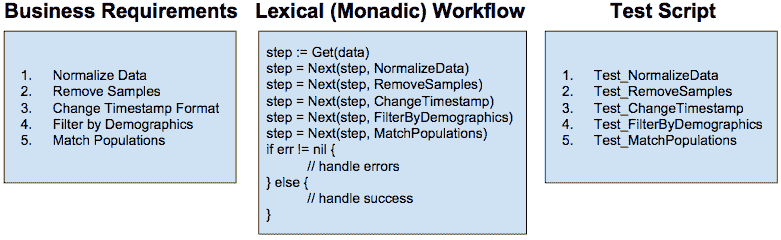

每个需求直接映射到工作流步骤（以及测试）。

如果我们通过最后一步没有错误，那么我们将把我们的数据转换为字符串。它将包含 JSON 并且看起来像这样：

```go
{
  "car": {
    "vin": "348543985AZDD",
    "make": "Lexus",
    "model": "IS 250",
    "options": {
      "option_1": "Stick Shift",
      "option_2": "Moon Roof",
      "option_3": "Leather"
 }
  },
  "timestamp": "20171030205535"
}
```

## 重新审视 Y-组合子

让我们看另一个 Go 中的 Y-组合子示例，以改善我们对该主题的理解。还记得第一章中的`Fibonacci`函数，*Go 中的纯函数式编程*吗？它看起来像这样：

```go
func fib(x int) int {
    if x == 0 {
        return 0
 } else if x <= 2 {
        return 1
 } else {
        return fib(x-2) + fib(x-1)
    }
}
```

如果它传递了`0`，`1`或`2`，它只会返回一个值（`0`或`1`）。否则，它将调用自身（递归）并返回这样的两个函数--`fib(x-2) + fib(x-1)`。由于值不断减少两个或一个，处理最终将完成，届时累积的值将被求和。

以下图表说明了这种递归处理。橙色和红色框突出显示只需要执行一次的函数。引用完整性允许我们存储这些函数的值。后续执行只需要查找存储的值，而不是重新执行函数：

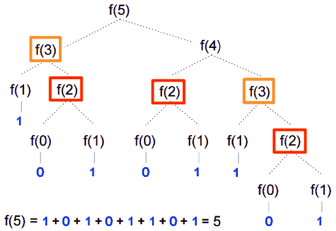

我们在`main.go`中定义了三种函数类型，如下所示：

+   `Func`：一个简单的函数，接受一个整数并返回一个整数

+   `FuncFunc`：一个接受`Func`类型的函数并返回`Func`类型的函数

+   `RecursiveFunc`：一个接受`RecursiveFunc`函数并返回`Func`类型的函数

```go
//4-purely-functional/ch10-monads/03_y_combinator/main.go

package main

import "fmt"

type Func func(int) int
type FuncFunc func(Func) Func
type RecursiveFunc func (RecursiveFunc) Func
```

让我们看看当我们初始化`yCombo`变量时会发生什么：

```go
yCombo := yCombinator(fibFuncFunc)
```

调用`yCombinator`函数并使用递归 lambda 表达式初始化我们的`g`变量。

让我们更仔细地看一下当我们初始化`yCombo`变量时发生的连接：

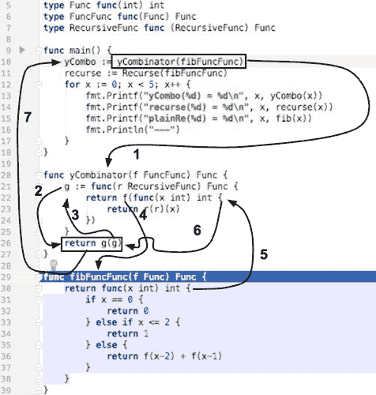

将其与初始化基本递归变量所需的最小连接进行比较：

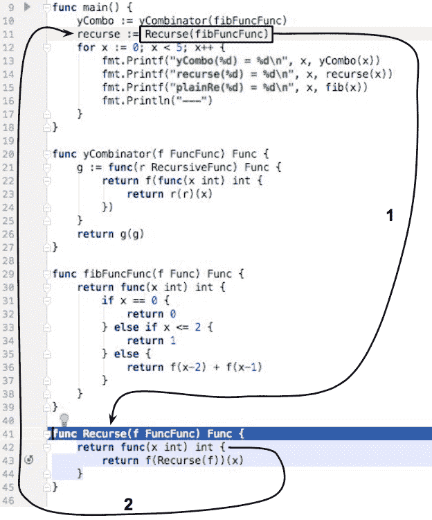

当我们在*第 13 行*和*第 14 行*评估我们的 Lambda 表达式时，执行路径看起来几乎相反。稍微宽一点的红线是`yCombo`函数评估表达式所需的两个步骤。细一点的黑线是评估常规递归函数所需的八（加一）步：

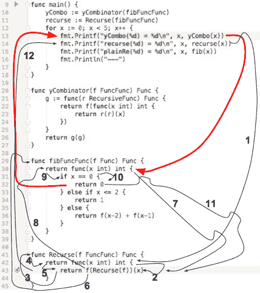

这些执行模式表明了主要的差异。`yCombinator`（lambda 表达式）保留状态并且只引用参数（`x`）。相比之下，常规递归函数在到达`Recurse`函数后保留了`x`的状态（*第 2 步*）。当`Recurse`到达*第 6 步*（*第 43 行*）时，`x`的值是从*第 42 行*提供的（留在*第 2 步*）。

由于`yCombinator`（lambda 表达式）已经预先连接，当需要评估 lambda 表达式（*第 13 行*）时，只需要两个步骤。与评估常规递归函数（`Recurse`）需要的十二个步骤相比。

由于递归在我们的 lambda 表达式实现中是必要的，现在是强调 Go 编译器支持**尾调用优化**（**TCO**）的好时机。第三章，*使用高阶函数*，提到 TCO 通过使递归中的最后一次调用成为函数本身来避免创建新的堆栈。

### 什么是尾递归？

递归是指一个函数调用自身。尾递归是指递归调用是函数的最后一行。例如，我们的`fib`函数的最后一行调用自身两次：

```go
func fib(x int) int {
    if x == 0 {
        return 0
 } else if x <= 2 {
        return 1
 } else {
        return fib(x-2) + fib(x-1)
    }
}
```

在这种情况下，没有必要保留状态。在函数中没有其他代码需要执行，我们也不关心在到达返回语句之前分配的任何变量的任何值。

如果我们的返回语句出现在函数的中间，Go 运行时需要记住我们函数的地址以便返回，并且需要存储函数局部变量的值，以便在递归调用完成并返回以恢复执行时使用。

我们目前的问题是，Go 对所有递归调用都一视同仁。即使尾递归不需要返回地址或访问任何其他函数局部变量的值，Go 也会执行。

如果 Go 进行了尾调用优化，那么它将不会在堆栈上分配额外的空间，而是直接从尾调用执行`GOTO`语句到自身。这将提高性能并节省堆栈空间。

为什么不优化尾调用？一个原因是插入`GOTO`语句可能会使调试堆栈帧信息更加困难。

你上次调试堆栈帧是什么时候？我相信系统程序员整天都在调试堆栈帧，但我们大多数人不会。可以肯定地假设我们都关心性能。也许一个权衡是允许函数式程序员在尾调用上方添加一个注释，指示编译器为我们执行 TCO？

没有尾递归优化，我们需要注意递归深度，因为在 Go 中，每一层递归都意味着 Go 运行时需要在堆栈上存储另一层信息。

如果我们遍历二叉树，我们的递归算法可能是**O(log n)**，这意味着我们可能不会遇到运行时性能问题。

然而，如果我们的递归深度是**O(n)**，这可能会导致堆栈出现问题。应该避免超过这个深度。

### 大 O 符号

大 O 符号经常用于表示算法的相对复杂性。

它用于指示算法的顺序。例如，如果我们有三种算法，一个是 O(n)，一个是 O(n log n)，一个是 O(n2)，那么不同 n 的时间是：

| **n** | **O(n)** | **O(n log n)** | **O(n2)** |
| --- | --- | --- | --- |
| 10 | 10 | 33 | 100 |
| 100 | 100 | 664 | 10000 |
| 500 | 500 | 4483 | 250000 |
| 1000 | 1000 | 9966 | 1000000 |
| 5000 | 5000 | 61438 | 25000000 |

假设我们的操作单位是每秒一次。表中的第一行告诉我们，执行 10 次操作对于**O(n)**算法需要 10 秒，对于**O(n2)**算法需要大约 1.5 分钟。最后一行告诉我们，执行 5000 次操作对于**O(n)**算法需要 1.4 小时，对于**O(n2)**算法需要大约四分之三年。数量级很重要。

这与尾递归有什么关系？递归函数调用使我们的堆栈线性增长**O(n)**。因此，缺乏 TCO 可能不会使我们的应用程序崩溃，但肯定会减慢它们的速度。执行大于**O(n)**数量级的计算将是非常困难的。

换句话说，当我们使用递归函数调用时，我们可能会很快耗尽堆栈空间。TCO 可以重新组织/优化我们的代码，使我们的程序使用恒定的堆栈空间，这将防止我们的堆栈变得过大，并减少堆栈错误。

TCO 的好处包括：

+   改进的执行速度，因为不需要堆栈推送和弹出。

+   递归函数深度不再是一个限制

+   堆栈溢出运行时错误将不是一个问题

支持 TCO 的语言有：

+   Common Lisp

+   JavaScript（ECMAScript 6.0）

+   Lua

+   Python

+   Scheme

+   Racket

+   Tcl

+   Kotlin

+   Elixir

+   Perl

+   Scala

Haskell 在哪里？Haskell 执行的优化优于尾调用消除。Haskell 使用*guarded*递归。这是一个懒惰的运行时系统，除非必须，否则不会评估一个 thunk。

有几个原因不包括它。启用 TCO 后，调用将不再清晰地划分，使得调试堆栈帧更加困难。TCO 会如何影响延迟语句？

如果 Go 支持一个注释（比如`//@tco`），允许我们为特定的函数调用打开 TCO，会怎么样？

有关 Go 和 TCO 的更多信息，请参见附录中的*如何提出更改 Go*部分。

#### 国际化（I18N）包

还记得本章开头我们看了单子工作流，并看到我们如何将发生在任何步骤中的所有错误推送到错误管道，并等到最后处理它们吗？

当我们处理错误时，我们可能需要做的一件事是将错误消息本地化为负责阅读它们的个人的语言。

这个示例应用程序探讨了如何使用`go-i18n`库来实现这一点。

Go 包**go-i18n**（[`github.com/nicksnyder/go-i18n`](https://github.com/nicksnyder/go-i18n)）提供了一个命令（[`github.com/nicksnyder/go-i18n#goi18n-command`](https://github.com/nicksnyder/go-i18n#goi18n-command)），可以帮助您将 Go 程序翻译成多种语言。它支持**Unicode 通用区域设置数据存储库**（**CLDR**）中的所有 200 多种语言的复数字符串（[`cldr.unicode.org/index/cldr-spec/plural-rules`](http://cldr.unicode.org/index/cldr-spec/plural-rules)）[`www.unicode.org/cldr/charts/28/supplemental/language_plural_rules.html`](http://www.unicode.org/cldr/charts/28/supplemental/language_plural_rules.html)。

在`main.go`中，我们导入了`github.com/nicksnyder/go-i18n/i18n`库以及 Go 标准库中的 text/template 库：

```go
package main

import (
"os"
 "text/template"
 "github.com/nicksnyder/go-i18n/i18n"
 "fmt"
)
```

在这里，我们使用`funcMap`函数初始化了`"T"`键，并给它赋予了`i18n.TranslateFunc`的值：

```go
var funcMap = map[string]interface{}{
"T": i18n.IdentityTfunc,
}
```

接下来，我们定义我们的模板：

```go
var tmplIllegalBase64Data = template.Must(template.New("").Funcs(funcMap).Parse(`
{{T "illegal_base64_data" .}}
`))
var tmplUnexpectedEndOfJson= template.Must(template.New("").Funcs(funcMap).Parse(`
{{T "unexpected_end_of_json_input"}}
`))
var tmplJsonUnsupportedValue = template.Must(template.New("").Funcs(funcMap).Parse(`
{{T "json_unsupported_value" .}}
`))
```

我们定义它们对应的函数：

```go
func illegalBase64(T i18n.TranslateFunc, bytePos string) {
   tmplIllegalBase64Data.Execute(os.Stdout, map[string]interface{}{
      "BytePos":    bytePos,
   })
}
func unexpectedEndOfJson(T i18n.TranslateFunc) {
   tmplUnexpectedEndOfJson.Execute(os.Stdout, map[string]interface{}{
   })
}
func jsonUnsupportedValue(T i18n.TranslateFunc, bytePos string) {
   tmplJsonUnsupportedValue.Execute(os.Stdout, map[string]interface{}{
      "Val":    bytePos,
   })
}
```

请注意，如果我们的错误消息接受参数，那么我们在`Execute`函数的主体中定义它们。例如，`illegalBase64`定义了`BytePos`。下面是它可能的输出方式：

```go
illegal base64 data at input byte 136
```

在我们的主函数中，我们加载我们的翻译文件。在这个示例应用程序中，我们将展示对英语和德语的支持：

```go
func main() {
   i18n.MustLoadTranslationFile("en-us.all.json")
   i18n.MustLoadTranslationFile("de-de.all.json")
```

接下来，我们遍历我们两种语言的列表，`en-US`和`de-DE`，为每种语言打印出三条消息：

```go
for _, locale := range []string{"en-US", "de-DE"} {
   fmt.Println("\nERROR MESSAGES FOR", locale)
   T, _ := i18n.Tfunc(locale)
   tmplIllegalBase64Data.Funcs(map[string]interface{}{
      "T": T,
   })
   tmplUnexpectedEndOfJson.Funcs(map[string]interface{}{
      "T": T,
   })
   tmplJsonUnsupportedValue.Funcs(map[string]interface{}{
      "T": T,
   })

    illegalBase64(T, "136")
    unexpectedEndOfJson(T)
    jsonUnsupportedValue(T, "+Inf")
  }
}

```

这是我们告诉`i18n`要使用哪个翻译的地方：

```go
T, _ := i18n.Tfunc(locale)
```

接下来是三行，我们将我们的 en-US 翻译函数分配给`tmplIllegalBase64Data`变量的`"T"`键：

```go
tmplIllegalBase64Data.Funcs(map[string]interface{}{
   "T": T,
})
```

当它被评估时，`text/template/template.go`中的`Funcs`方法被执行并传递给我们的`funcMap`变量。

这就是`Funcs`的样子（我的在`/usr/local/Cellar/go/1.9/libexec/src/text/template/template.go`中）：

```go
func (t *Template) Funcs(funcMap FuncMap) *Template {
   t.init()
   t.muFuncs.Lock()
   defer t.muFuncs.Unlock()
   addValueFuncs(t.execFuncs, funcMap)
   addFuncs(t.parseFuncs, funcMap)
   return t
}
```

请注意，由于`Func`是`*Template`的一个方法并返回`*Template`，因此`Func`可以被链接。

在范围循环结束时，我们调用我们的错误消息打印函数：

```go
illegalBase64(T, "136")
unexpectedEndOfJson(T)
jsonUnsupportedValue(T, "+Inf")
```

输出如下：

```go
ERROR MESSAGES FOR en-US
illegal base64 data at input byte 136
unexpected end of JSON input
json: unsupported value: +Inf

ERROR MESSAGES FOR de-DE
ungültige base64-Daten am Eingangsbyte 136
unerwartetes Ende der JSON-Eingabe
json: nicht unterstützter Wert: +Inf
```

英文翻译文件`4-purely-functional/ch10-monads/04_i18n/en-us.all.json`的内容如下：

```go
{
  "illegal_base64_data": {
    "other": "illegal base64 data at input byte {{.BytePos}}"
 },
  "json_unsupported_value": {
    "other": "json: unsupported value: {{.Val}}"
 },
  "unexpected_end_of_json_input": {
    "other": "unexpected end of JSON input"
 }
}
```

德文翻译文件`4-purely-functional/ch10-monads/04_i18n/de-de.all.json`的内容如下：

```go
{
  "illegal_base64_data": {
    "other": "ungültige base64-Daten am Eingangsbyte {{.BytePos}}"
 },
  "json_unsupported_value": {
    "other": "json: nicht unterstützter Wert: {{.Val}}"
 },
  "unexpected_end_of_json_input": {
    "other": "unerwartetes Ende der JSON-Eingabe"
 }
}

```

我使用了 Google 翻译。只需在左窗格（英语）中输入句子，并在右窗格的下拉菜单中选择要翻译的语言（德语）。

我们可以使用 Google 翻译将句子翻译成其他语言：

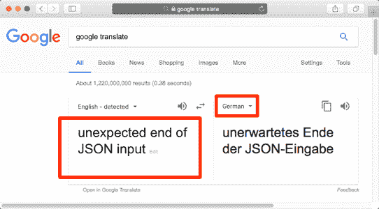

假设您正在为本书的每个 Go 项目中包含的 init 脚本，您应该在 shell 中加载并准备使用`get-go-binary` Bash 函数。

以下是初始化项目和安装 i18n 的工作流程：

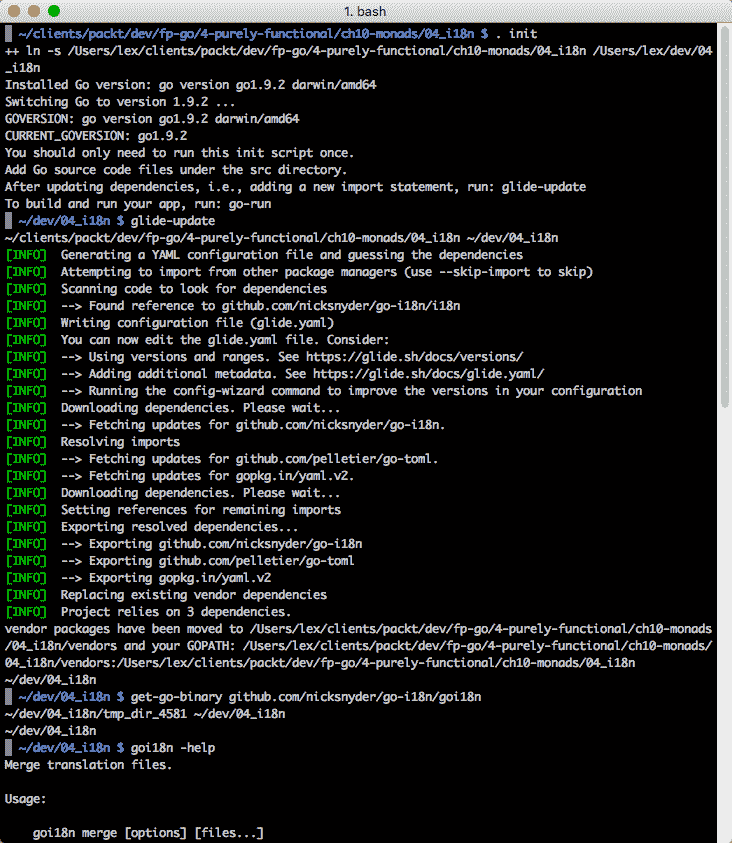

i18n 网站描述了我们可以使用的工作流程，如果我们要将我们的文件发送到翻译服务。

## 类型类

类型类允许我们在类型上定义行为。

如第三章中所讨论的*使用高阶函数*，类型类为我们的类型系统增加了一个额外的层次。

我们通过以下方式实现这一点：

1.  使用 Go 接口定义行为（父类型类）

1.  声明一个新类型（基本类型类）来包装基本类型

1.  在我们的新类型类上实现行为

让我们看看我们的`Equals`类型类实现。

父类定义：

```go
//4-purely-functional/ch11-monads/05_typeclasss/src/typeclass/equals.go
package typeclass

import (
   "strconv"
)
type Equals interface {
   Equals(Equals) bool
}
```

Equals 是我们的父类型类。所有基类必须实现`Equals`方法。

### 基类定义

我们将定义两个基本类型，`Int`和`String`。

#### Int 基类

Int 的`Equals`方法将检查其他类型是否相等，使用我们认为合适的逻辑：

```go
type Int int

func (i Int) Equals(e Equals) bool {
   intVal := int(i)
   switch x := e.(type) {
   case Int:
      return intVal == int(x)
   case String:
      convertedInt, err := strconv.Atoi(string(x))
      if err != nil {
         return false
 }
      return intVal == convertedInt
   default:
      return false
 }
}
```

#### String 基类

就像`Int`类一样，但是用于字符串：

```go
type String string

func (s String) Equals(e Equals) bool {
   stringVal := string(s)
   switch x := e.(type) {
   case String:
      return stringVal == string(x)
   case Int:
      return stringVal == strconv.Itoa(int(x))
   default:
      return false
 }
}
```

#### 我们的 main.go 文件

我们首先导入我们的类型类代码（位于`src`目录中，我们在其中存储所有项目本地包）：

```go
package main

import (
    "typeclass"
 "fmt"
)

func main() {
    int42 := typeclass.Int(42)
    str42 := typeclass.String("42")
    fmt.Println("str42.Equals(int42):", str42.Equals(int42))
```

输出如下：

```go
str42.Equals(int42): true
```

#### Sum 父类型类

让我们创建另一个类型类来对值进行求和：

```go
4-purely-functional/ch10-monads/05_typeclasss/src/typeclass/sum.go
package typeclass

type Sum interface {
   Sum(Sum) int64
}
```

Sum 是我们的父类型类。所有基本类型类必须实现`Sum`方法。

#### Sum 基类

这是我们的基类：

```go
type Int32 int32
type Int64 int64
type Float32 float32
type IntSlice []int
```

我们可以从我们的类型定义中看到，我们将能够对这些基本类型中的任意两个进行求和。

这是`Int32`的`Sum`实现：

```go
func (i Int32) Sum(s Sum) int64 {
   it := int64(i)
   switch x := s.(type) {
   case Int64:
      return it + int64(x)
   case Int32:
      return it + int64(x)
   case Float32:
      return it + int64(x)
   case IntSlice:
      sum := int64(0)
      for _, num := range x {
         sum += int64(num)
      }
      return it + sum
   default:
      return 0
 }
}
```

请注意，如果我们要将`Int32`添加到的值不在接受的类型列表中，则返回零。

另一个选择是实现一个结果类型，就像 Haskell 的 Either 类型。这是一个最近被拒绝的 Golang 规范添加。详情请参见[`github.com/golang/go/issues/19991`](https://github.com/golang/go/issues/19991)。

`Int64`和`Float64`的 Sum 实现类似：

```go
func (i Int64) Sum(s Sum) int64 {
   it := int64(i)
   switch x := s.(type) {
   case Int64:
      return it + int64(x)
   case Int32:
      return it + int64(x)
   case Float32:
      return it + int64(x)
   case IntSlice:
      sum := int64(0)
      for _, num := range x {
         sum += int64(num)
      }
      return it + sum
   default:
      return 0
 }
}

func (i Float32) Sum(s Sum) int64 {
   it := int64(i)
   switch x := s.(type) {
   case Int64:
      return it + int64(x)
   case Int32:
      return it + int64(x)
   case Float32:
      return it + int64(x)
   case IntSlice:
      sum := int64(0)
      for _, num := range x {
         sum += int64(num)
      }
      return it + sum
   default:
      return 0
 }
}
```

在我们的 int 切片实现中，我们为我们希望添加到我们的 int 切片中的每种类型实现了一个范围迭代：

```go
func (i IntSlice) Sum(s Sum) int64 {
   it := i
   switch x := s.(type) {
   case Int64:
      sum := int64(0)
      for _, num := range it {
         sum += int64(num)
      }
      return int64(x) + sum
   case Int32:
      sum := int64(0)
      for _, num := range it {
         sum += int64(num)
      }
      return int64(x) + sum
   case Float32:
      sum := int64(0)
      for _, num := range it {
         sum += int64(num)
      }
      return int64(x) + sum
   case IntSlice:
      sum := int64(0)
      for _, num := range it {
         sum += int64(num)
      }
      for _, num := range x {
         sum += int64(num)
      }
      return sum
   default:
      return 0
 }
}
```

在这里，我们练习我们的`Sum`类型类：

```go
    int64One := typeclass.Int64(1)
    int64Two := typeclass.Int64(2)
    fmt.Println("int64Two.Sum(int64One):", int64Two.Sum(int64One))

    int32One := typeclass.Int32(1)
    fmt.Println("int32One.Sum(int64One):", int32One.Sum(int64One))

    float32Five := typeclass.Float32(5)
    fmt.Println("int32One.Sum(int64One):", float32Five.Sum(int64One))

    int64Slice123 := typeclass.IntSlice([]int{1, 2, 3})
    int64Slice234 := typeclass.IntSlice([]int{2, 3, 4})
    fmt.Println("int64Slice123.Sum(int64Slice234):", int64Slice123.Sum(int64Slice234))
}
```

输出如下：

```go
int64Two.Sum(int64One): 3
int32One.Sum(int64One): 2
int32One.Sum(int64One): 6
int64Slice123.Sum(int64Slice234): 15
```

## 泛型重访

在最后一章中，我们讨论了一些通用的好处：

+   类型安全

+   消除了编写重复的样板代码的需要

+   为不同类型重用和共享代码

+   强制在不同类型之间保持一致的 API

+   优化通用代码所花费的时间影响更大

+   不需要重新实现难以正确的算法

+   能够指定域约束

给定以下类型定义：

```go
type Car struct {
   Make, Model string
   Price Dollars
}
type Truck struct {
   Make, Model string
   BedSize int
   Price Dollars
}
price := func (c T) Dollars {
   return c.Price
}
```

而不是写这两个：

```go
type CarSlice []Car
func (rcv CarSlice) SumDollars(fn func(Car) Dollars) (result Dollars) {
   for _, v := range rcv {
      result += fn(v)
   }
   return
}

type TruckSlice []Truck
func (rcv TruckSlice) SumDollars(fn func(Truck) Dollars) (result Dollars) {
   for _, v := range rcv {
      result += fn(v)
   }
   return
}
```

我们可以按如下方式打印价格总和：

```go
fmt.Println("Car Prices:", cars.SumDollars(price))
fmt.Println("Truck Prices:", trucks.SumDollars(price))
```

如果 Go 支持通用，我们可以只写一次。它会看起来像这样：

```go
func (rcv []T) SumDollars(fn func(T) Dollars) (result Dollars) {
   for _, v := range rcv {
      result += fn(v)
   }
   return
}
```

我们可以按如下方式打印价格总和：

```go
fmt.Println("Car Prices:", cars.SumDollars(<Car>))
fmt.Println("Truck Prices:", trucks.SumDollars(<Truck>))
```

协变和逆变（[`www.ibm.com/developerworks/library/j-jtp01255/index.html`](https://www.ibm.com/developerworks/library/j-jtp01255/index.html)）指的是使用比最初指定的更不具体或更具体的类型的能力。协变和逆变的通用类型参数在分配和使用通用类型时提供了更大的灵活性。

考虑到示例代码，通用代码有什么不好的地方？

Go 的快速编译速度部分原因是增量编译。增量编译对于通用代码是不可能的，因为具体类型只知道通用函数在运行时被使用的位置，而不知道它的定义位置。

不计入将通用实现到 Go 编译器中将是非常复杂的，无论是从语义还是实现的角度来看，以下是从开发者角度考虑将通用添加到 Go 的一些缺点：

+   通用算法往往会积累特性（影响代码质量）。

+   优化通用算法很困难。

+   调试通用代码很困难。

+   错误处理的复杂性。

+   使用复杂性：协变、逆变、擦除。

+   减慢编译时间（或运行时间）。

+   通用/现有非通用代码的不兼容性。

第四和第七个缺点是最令人担忧的。

首先，让我们更好地理解错误处理的复杂性是什么意思。`Maybe`、`Either`和`Option`能解决空指针错误吗？

为了使纯 FP 单子错误处理起作用，我们应用中引用的所有包都需要返回一个单子错误类型，比如 Either。（要么成功，要么失败，但不会返回 nil。）

当然，这将消除对以下普遍错误检查的需要：

```go
if err != nil {
 return nil, err
}
```

但是，现在我们需要改变处理错误的方式，使用新的语言扩展，比如`Maybe`单子、`Either`、`Option`、`Nothing`、`Just`等。（有关一些代码示例，请参见`2-design-patterns/ch04-solid/02_maybe`。）这是另一层复杂性。

此外，我们如何将这种新的错误处理范式集成到现有应用中？如果我们正在创建一个新应用，但希望使用任何标准库包或任何尚未转换为使用通用兼容错误处理的包，我们会写一个适配层吗？这是另一层复杂性。

通用化的影响将是显著的。Go 标准库中有多少百分比需要改变？

我们是否用集合类型替换普遍的切片？这会对现有代码产生多大影响？

通用支持会如何影响并发？

如果 Go 失去类型擦除并实现具体化以添加对通用参数的显式类型注释，性能会受到什么影响？

### Golang 的影响

需要修改的最小语言构造集包括：

+   类型断言

+   类型开关

+   范围语句

+   函数调用

它们都具有深远的影响，最后一个影响深远而广泛。

整个类型系统可能需要彻底改变。

#### 个人观点

在写这本书之前，我认为通用的好处远远超过了它的缺点。写这本书迫使我真正思考这个问题。

我考虑了利弊以及替代方案，比如使用元编程和代码生成工具（见最后一章中的 clipperhouse/gen 工具）。

我考虑了 Monad 错误处理的工作原理，以及它与 Go 的`return successValue, err error`处理习惯（以及它与 Unix 的`stdout`/`stderr`相似之处）。我找到了一种方法，可以在 Go 中使用纯 FP（Monad）的最重要特性，同时保持 Go 的错误处理习惯。

在 Go 中使用词法（Monad）工作流解决方案的好处是：

+   类型安全

+   不需要空接口/拆箱/向下转型/反射

+   表达力强，易于理解的工作流代码

+   `Get(data)`然后`Next(step)`，直到完成

+   大部分成语化的错误处理都在一个地方（在最后）

+   直接反映业务需求

+   允许我们使用可重用组件轻松地组合新的工作流程（参见`toolbox.go`）

+   设计为水平扩展进行优化

+   不对外部包有任何要求

+   不需要额外的 Monad 错误处理逻辑

由于这个解决方案使用了 lambda 表达式，所以存在递归，而由于 Go 目前不提供尾递归优化，所以会有性能损失，但递归被限制在控制工作流程上。

负担在于我必须手动创建重复的代码或生成通用代码（使用类似 clipperhouse/gen 的工具），以避免使用空的`interface{}`和反射的性能损失。

我得出结论，泛型是编译时间、运行时间和我的时间之间的权衡。考虑到向 Go 添加泛型的风险和劣势，我可以多做一些工作。

“简单和优雅不受欢迎，因为它们需要努力和纪律才能实现，并且需要教育才能被欣赏。”

- Edsger Dijkstra

## 总结

在 Go 中进行函数式编程是一种范式转变，是一种根本不同的编写软件的方式。就像我们可以用命令式的图灵机或者 Lambda 演算来得到我们想要的结果一样，我们可以选择用 Go 的惯用方式命令式编码，也可以选择使用 FP 编程风格声明式编码。

我们从轻松的 FP 简介开始我们的旅程。我们学会了如何编写像`Map`、`Filter`和`Sort`这样的中间函数，以及像`Reduce`和`Join`这样的终端函数，来转换集合。我们看到了如何使用 Gleam 和 Itertool 等工具，并使用 Go 例程和 Go 通道实现了惰性评估。

我们思考了 FP 的特点，并通过函数组合、闭包和高阶函数的示例进行了实践。

我们研究了软件设计的命令式功能和纯功能风格（后来混合了这两种风格）。我们学会了 Go 中的 Reader/Writer 接口如何实现单一责任原则。面向对象编程让我们对纯 FP 的简单（和诚实）有了欣赏。（FP 合同不会撒谎。）我们揭示了函数组合的秘密：Monad 链式延续。

我们学会了`Map`和`Reduce`的工作原理。随着不断涌现的图表增强了我们对 FP 价值的认识，我们被抛回到了使用函数的命令式编程世界。

鸭子类型、嵌入、装饰器、策略和管道模式、控制反转、依赖注入、使用通道控制并发程序中事件流的方法……我们甚至学会了如何使用分层应用架构避免循环依赖。我们学会了柯里化和部分应用之间的区别，以及如何实现函数参数来改进我们的 API。

范畴论以前所未见的方式呈现：使用了 100 多张图片，17 张信息表和代码示例，以及简洁明了的文字。我们带领你了解了函数式编程的历史，并学习了范畴论、逻辑和类型理论之间的深刻联系。我们了解到我们在小学、初中和高中学到的数学是适用于函数式编程的。（也许这甚至激励了某人给他们的老数学老师写一封感谢信？）

在对范畴论有了扎实的理解之后，我们踏上了纯函数式编程的旅程，学习了如何使用函子在不同世界之间进行映射。我们构建了一些幺半群，并学会了如何编写一个 reduce 函数。我们还学会了如何使用泛型代码生成工具来解决样板问题。

凭借对纯函数式和命令式函数式编程的知识，我们深入了解了单子的世界。我们学习了关于 Lambda 演算以及 Y-组合子的工作原理，以及如何使用它来控制工作流。

我们实现了词法工作流解决方案，利用 Y-组合子来控制一系列不纯操作。我们目睹了我们的数据在一步步转换的过程中。我们看到了`Success`和`Failure`管道的工作原理，以及如何使用惯用的 Go 技术在管道的末尾处理所有错误。我们对向 Go 添加泛型的利弊有了更好的理解。

### 从这里去哪里

以下是一些想法：

+   寻找使用词法工作流解决方案来控制数据转换工作流的地方

+   构建一个可重复使用的组件集，放入你的工具箱，可以在我们的工作流中使用

+   在 Go 中构建你自己的类型类、单子和纯函数式组件

+   支持添加 TCO 到 Go 的请求（请参阅[附录](https://cdp.packtpub.com/learning_functional_programming_in_go/wp-admin/post.php?post=7&action=edit)，*其他信息和操作指南*）

我希望你在这本书中找到的信息对你今天和明天构建的东西有用，并且它能激励你继续改进这些想法，以便我们都能不断构建更好的应用程序。

“言而无信，不如实际行动。”

- Linus Torvalds
