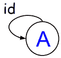

# 第十一章：适用的范畴论

在幼儿园，我们学会了如何读时间。在高级数学中，我们学会了如何抽象一个 12 小时的时钟，并称之为单子。


在小学，我们学习了几何、逻辑推理和函数。

在高中，我们学习了代数、线性和二次方程。我们忙于按部就班地解决问题的细枝末节，以至于看不出任何用处。

在这里查看 K-12 教育中使用的学习材料：[`www.ixl.com/math/kindergarten/match-analog-clocks-and-times`](https://www.ixl.com/math/kindergarten/match-analog-clocks-and-times)。

快进到我们的日常工作。为了显得聪明，我们经常问，“它会扩展吗？”无论*它*是什么。

想知道阅读时间和水平缩放有什么关系吗？它们之间有深刻的联系。我们将在本章中找出答案。

我们在本章的目标是做到以下几点：

+   掌握范畴论的工作原理

+   欣赏范畴论、逻辑和类型理论之间的深刻联系

+   了解在 lambda 表达式的上下文中绑定、柯里化和应用的含义

+   了解同态的不同类别以及如何使用它们

+   学会从范畴论中使用组合技术

+   了解接口驱动开发的含义

+   看到知识驱动系统的价值

+   应用我们对范畴论的理解来构建更好的应用程序

## 我们的目标

到本章结束时，我们将看到我们在学校上学的数学课的价值。我们将了解到我们在高中数学课上学到的东西在水平扩展我们的软件解决方案时是如何应用的。

以下图表暗示了**范畴论**、函数式编程和逻辑是等价的：


嗯？

我以为范畴论是关于一组对象和连接它们的箭头，而*证明论*是关于使用逻辑来证明某事。我们都知道函数式编程是关于软件的。这三件事怎么可能相关？

这似乎和我们在学校上的所有那些数学课一样有用，对吧？

你的悲观是可以理解的。请以开放的心态继续并保持坐姿。数学、逻辑和计算。它们只是解决同样问题的三种不同方式。

范畴论、证明论和函数式编程如何是一回事？（以及为什么要关心？）

“科学家从解决难题中获得满足感。这是关于探索，而不是圣杯。”

-艾萨克·阿西莫夫

### 分解它

让我们分解每个部分，以便更好地掌握我们问题的广度：


如果**为什么**是构建应用程序的动机，那么**如何**描述了我们的应用程序如何更好，而**什么**是我们的最终产品/应用程序。

**如何**与我们作为人类的推理方式有关。这是范畴论的领域。

**什么**涉及到它是什么。这是数学和计算的领域。我们将使用代数来帮助定义**什么**。后来，我们会看到我们在代数中的工作直接可转移到函数式编程。

### 代数和未知数

代数是数学的一个分支，与算术非常相似。它使用数学的四个主要运算：加法、减法、乘法和除法（+，-，/，*）。代数还引入了一个新元素：未知数。在数学中，未知数在等式的右侧。记得数学问题，比如*2 + 3*。在我们对操作数（2 和 3）进行数学运算之前，答案是未知的。在代数中，我们使用符号代替未知的占位符。一个代数方程将是*2 + 3 = x*。这是一个代数方程，说明等号两边是等价的。操作数 2 和 3 是已知的，而*x*是未知的。


代数的目标是通过确定未知符号的值来解决方程：


记得我们的数学老师接下来会做什么吗？


他们会交换符号和数字，让问题对我们更加困难！然后，他们会给我们更多更复杂的方程，就像这样：


他们强迫我们执行多个步骤来简化我们的问题。由于两边必须保持相等，我们可以使用一个天平来可视化问题：


我们是如何解决更复杂的问题的？答案：通过将其分解成更容易处理的小部分，如下图所示：


代数，不像在现实世界中，依赖于规则才能正常工作。以下是一些规则：

+   **规则 1：** 代数方程中的变量*x*不能在同一时间的同一个方程中代表两个不同的值

例如，如果我们有方程*x + x = 6*，那么以下是正确的：1 + 5 = 6；然而，由于*x*不能在同一个方程中代表两个不同的值，唯一适用于*x*的值是 3（使用 1 和 5 作为*x*会违反*规则 1*）。

+   **规则 2：** 如果我们希望两个变量代表两个不同的值，我们必须使用两个不同的符号。例如，*x + y = 6*。

+   **规则 3：** 当同一个变量符号在同一个方程中多次使用时，它代表相同的值。

+   **规则 4：** 默认操作是乘法。2 * x 等同于 2x。因此，如果没有运算符，我们可以假设我们正在处理默认操作，即乘法。

+   **规则 5：** 括号可以用来分组项。如果我们看到 3(2)，那就等同于 3*(2)，也等同于 3*2。所有三组项的结果都等于 6（而不是 32）。


我们现在的工作是将这个问题分解成更小的步骤，并找出*x*的值是多少。（提示：你以前见过它。）

+   **规则 6：** 不同的符号可以在同一个方程中代表相同的值，但不一定要这样。

正如我们所看到的，*x*和*y*有相同的值，但只在第二个 if 语句中。随着*x*的值变化（从 0 到 1 到 2），*y*的值也会变化（从 2 到 1 到 0）。这就是为什么符号*x*和*y*被称为**变量**的主要原因。它们可以变化。

在图灵语言中处理变量的方式与 Lambda 演算（纯函数式编程）语言非常不同。

在像 C 这样的图灵语言中，变量*x*的值存储在运行 C 程序的计算机内存中的特定位置。它可以是全局变量，这意味着其他运行的程序可以访问和改变（也称为*变异*）它的值：


在像 Haskell 这样的纯函数语言中，值永远不会被存储。新值可以被创建并传递到执行链中。

### 代数的现实应用

曾经想过这些方程有什么好处吗？

在试图模拟现实世界中的事物时，它们可能是有用的。让我们来看一些代数方程并绘制它们的解。绘制方程就像使用方程的结果（函数的输出）来绘制可以用于说明和/或预测现实生活中事物的线条和曲线。

#### 线性方程和需求定律

线性方程可以用来描述具有直线斜率的事物：


需求定律规定，产品价格上涨时，对该产品的需求将减少。这是因为人们自然而然地避免购买会迫使他们放弃更重要的东西的产品。图表表明需求曲线是向下倾斜的。价格越低，销售的产品就越多。

建筑师使用线性方程确定屋顶线的斜率，谷歌地图使用线性方程告诉你旅行需要多长时间。

我们对于像*f(x) = 3x + 2*这样的线性方程函数了解多少？

对于每个输入*x*，我们只得到一个结果。这就是为什么如果我们输入每个可能的数字（作为值*x*），我们得到一条线！这就是为什么在几何中很难实现垂直线的原因。

#### 我们周围到处都是二次方程

像以下这样的方程被称为线性方程：

*y = x + 2*

这是因为所有变量的幂都是 1。

给定**x**值为-**4**到**2**，我们可以轻松计算**y**值，如下所示：


如果我们输入每个可能的*x*值（包括小数，如 0.1、0.11、0.12 等），我们会得到一条直线。我们可以说*定义域*是所有可能的*x*值的集合，*值域*是所有可能的*y*值的集合。请注意，任何非垂直或非水平线都是一个定义域和值域都包含所有实数的函数。

很容易看出我们之前的*f(x)*函数只是从一组数字到另一组数字的映射。

当我们使用大于 2 的指数时，方程被称为二次方程。这里有一个例子：

*y = x² + 1*

#### 线性和二次函数的函数组合

让我们将我们的 *f(x) = x² + 1* 二次方程与我们的 *g(x) = x + 2* 线性方程表进行组合。我们可以通过以下方式组合我们的两个函数：*y = f(g(x))*。我们会说*y*等于*f-compose-g of x*或*y = f o g*，其中 o 是我们的组合运算符。它的工作原理是我们为*x*分配一个值，然后我们将该值代入*g*，计算 g(x)，然后将结果代入*f*。

我们将**1**输入到**g**，并将其表示为**g(1)**。我们将**g(1)**输入到**f**，得到**f(g(1))**。


让我们通过用从**1**到**g(1)**映射的值**3**替换**g(1)**来使其工作：


用**3**替换**g(1)**，我们得到以下结果：


当我们将**3**输入到**g**时，我们评估*x² + 1*或*3² + 1*表达式，结果等于**10**：


所以，*f(g(1))* 等于 **10**。

如果我们颠倒函数的嵌套，比如**g(f(1))**，我们会得到相同的答案吗？

*f(1) = x2 + 1 = 1 + 1 = 2*

*g(2) = 4*

我们从前面的线性方程表中得到了*f(2)=4*。

由于*g(f(1)) = 10*和*f(g(1)) = 4*，我们知道以不同顺序组合相同的函数可能会得到不同的结果。

我们还看到，当我们组合时，我们要么用表中对应/映射的值替换函数/值，要么评估函数表达式并用该值替换。我们已经看到我们函数的引用完整性特征允许我们缓存其值。因此，当函数第一次被评估后，当我们组合函数时，我们所做的就是一堆值替换。

"如果 A 等于成功，那么公式就是 A 等于 X 加 Y 和 Z，其中 X 是工作，Y 是玩耍，Z 是保持嘴巴闭上。"

- 阿尔伯特·爱因斯坦

#### 更多二次方程的例子

以下所有都是二次的吗？


在[`www.desmos.com/calculator`](https://www.desmos.com/calculator)上在线绘制你自己的方程

##### 黄金比例

让我们再看一个迷人的二次方程。希腊人认为，具有最美的比例的矩形形状是大矩形和小矩形具有相同比例的形状。

这被称为*黄金矩形*。方程*x² + x = 1*的解为*x = 1.61803398875*，我们将其缩写为*x = 1.61*。

希腊人并不是唯一认为黄金比例是完美的人。


当我们仔细观察时，我们会在商业中看到黄金比例：


还记得斐波那契数列及其与第一章中递归的关系吗？`0, 1, 1, 2, 3, 5, 8, 13, 21, 34, 55, 89`。在这个序列中，每一项都是前两项的和。如果我们仔细观察，我们会在自然界中看到这个序列。例如，百合有 3 片花瓣，毛茛有 5 片，万寿菊有 13 片，紫苑有 21 片。大多数雏菊有 34、55 或 89 片花瓣。


向日葵头部的种子从中心向外辐射，分为两组交织的螺旋，一组顺时针旋转，另一组逆时针旋转。通常有 34 条顺时针螺旋和 55 条逆时针螺旋。

我们越了解数学、编程、艺术和科学之间的关系，越能找到我们周围工作的大师建筑师的证据。

我们越了解我们周围系统的工作方式，我们就会看到越多的模式。稍后，当我们更仔细地研究范畴论时，我们将学习分解（将问题分解成小而可理解的部分）和组合（将这些部分重新组合）的重要模式。FP 允许我们将一个整体应用程序分解为一组可以根据需要以不同配置组装的乐高积木，并且我们可以以易于理解的声明方式进行操作。

考虑到不可变性和引用透明性的保证，操作发生的时间就不那么重要了。这简化了编写并发解决方案的组合复杂性。这也允许通过并行性无害地提高性能，并且在时间甚至没有完全定义的分布式系统中也是如此。

### 代数的基本定律

学习这些代数的基本定律。我们很快会再次看到它们！


稍后，您将了解到函数组合具有以下特点：

+   它是结合的

+   通常不是可交换的

+   它通过*(g+h) ∘ f = g ∘ f+h ∘ f (g + h) ∘ f = g ∘ f + h ∘ f*进行分配

+   通常不是通过*f ∘ (g + h) = f ∘ g + f ∘ h*进行分配

### 数学中的对应关系

范畴论尽可能抽象地呈现数学，并去除所有非必要的属性，为所有数学提供了一个框架。

还记得你的数学课吗？以下是一些课程：

| 数学分支 | 描述 |
| --- | --- |
| 代数 | 代数使用定律描述其元素之间的关系，例如，结合性、交换性质。代数有不同类型，如线性、李、交换和抽象。在代数中，我们经常用字母替换方程中的数字。例如，*1 + 2 = 3*的形式变成了*x + y = z*。布尔代数是代数的另一种类型，其中变量是真值（真和假），而不是数字。 |
| 几何 | 几何研究空间中形状和位置的属性。它提供了用于确定诸如圆的周长(*c = 2πr*)和确定各种形状的面积的公式。 |
| 逻辑 | 逻辑提供数学推理的规则。布尔代数是数学逻辑的一种形式。 |
| 数值分析 | 数值分析提供了用于近似解决数学问题的算法。它通常利用计算能力快速接近可能无法手动解决的真实解决方案。 |
| 微积分 | 微积分是对分析中证明的结果的应用。 |

数学是数据结构的研究：形状、数字、群、集合等等。我们研究它们的结构、行为以及它们如何相互作用。

Curry、Howard 和 Lambek 发现所有数学分支实际上都是相同的东西！他们意识到在一定抽象层次上，所有数学理论的结构都是相同的。我们可以将我们的逻辑结构变形成范畴类，并且我们可以将该结构变形成类型理论。宇宙中的所有态射，因此所有活动，都可以用范畴论来描述。

例如，当我们考虑电磁场中的光子粒子，飞行中的足球，以及弹跳的 C（音符），它们似乎没有太多共同之处，直到我们提供上下文。从波动理论的角度来看，它们都是同一个问题。现在，改变或者转换到向心力的上下文；同样，它们都是同一个问题，只是在不同的上下文中。当我们抽象掉所有非必要的细节，剩下的就是数学结构。

以这种方式使用抽象的优势在于，我们开始看到以前隐藏在视野之外的事物之间的联系。我们可以创造和使用工具，使我们能够以不同的方式对问题集进行上下文化。我们拥有范畴论的全部力量来启迪我们的道路。了解这些概念的软件工程师更有能力进行数据分析。学会应用函数式编程概念的软件工程师构建更可靠的解决方案，可以在其云原生集群中横向扩展到多个核心和多个计算实例。很容易看出，函数式编程引起了这么多关注，对吧？

## 证明理论

证明理论是数学的一个分支，我们在其中做出假设并应用逻辑来证明某些事情。例如，如果 a 和 b 可以被证明为真，则 a 为真，b 也为真。

### 逻辑连接词

以下表格按优先顺序描述了逻辑连接词：

| **符号** | **数学名称** | **英文名称** | **Go 运算符** | **示例** | **含义** |
| --- | --- | --- | --- | --- | --- |
| ¬   | 否定 | NOT | ! | ¬a | 非 a |
| ∧ | 合取 | 与 | && | a ∧ b | a 和 b |
| ⊕ | 排他性析取 | 异或（XOR） | NA | a ⊕ b | 要么 a 要么 b（但不能同时） |
| ∨ | 析取 | 或 | &#124;&#124; | a ∨ b | a 或 b |
| ∀ | 全称量化 | ∀ x: A(x) 表示对所有 x，A(x)为真 | NA | ∀a:A | 类型 A 的所有值 a |
| ∃ | 存在量化 | ∃ x: A(x) 表示至少存在一个 x 使得 A(x)为真 | NA | ∃a:A | 存在类型 A 的某个值 a |
| ⇒ | 材料蕴涵 | 蕴含 | NA | a ⇒ b | 如果 a 则 b |
| ⇔ | 材料等价 | 当且仅当 a 和 b 都为假，或者 a 和 b 都为真时，a ⇔ b 为真 | NA | a ⇔ b | a 当且仅当 b |
| **≡** | 定义为 | a ≡ b 表示 a 被定义为 b 的另一个名称 | NA | a ≡ b | a 在逻辑上等价于 b |
| ⊢ | 推导 | a ⊢ b 表示 a 可以从 b 推导出 | NA | a ⊢ b | a 可以从 b 推导出 |

NA = 不适用，即在 Go 中没有这个符号。

还有其他逻辑符号，但这些是一些更重要的符号。

在软件中，我们通过组合这些符号和其他术语如变量来运用逻辑来证明某些事情是否为真。

以下是使用量化符号的示例：

`f: A ⇒ B` 意味着 `∀a:A∃b:B` 使得 `b = f(b)`

换句话说，存在从*A*到*B*的函数，对于类型*A*的所有值*a*，都存在类型*B*的某个值*b*，使得*b = f(a)*。

#### 逻辑不一致性

以下函数签名表示具有逻辑不一致性的函数：

```go
def factorial(i int) int
```

问题在于阶乘未定义为负整数。

##### 部分函数

如果我们的函数在我们的域中的所有值上未定义/一致，那么它被称为部分函数（与全函数相对）。如果我们的函数不一致，那么我们就有可能在运行时遇到意外错误。

解决这个问题的两种主要方法：

+   我们可以通过将我们的域的大小减小到仅为正整数来解决这个不一致

+   我们可以使用失败单子，如验证或分歧，来捕捉出错的事情

### 真值表

真值表包含命题的解释。解释是命题值的计算：

| a | b | ¬a | ¬b | a ∧ b | a ∨ b | a ⊕ b | a → b | a ↔ b |
| --- | --- | --- | --- | --- | --- | --- | --- | --- |
| T | T | F | F | T | T | F | T | T |
| T | F | F | T | F | T | T | F | F |
| F | T | T | F | F | T | F | T | F |
| F | F | T | T | F | F | F | T | T |

正确陈述的相反是错误陈述。深刻真理的相反可能是另一个深刻真理。

- 尼尔斯·玻尔

#### 条件命题

以下命题表达了相同的意思：

+   *如果 a，则 b*

+   *a 蕴含 b*

+   *a → b*

+   *a ⇒ b*

变量*a*是假设，*b*是结论。结论总是真的，除非*a*为真且*b*为假。对此的一种思考方式是：“如果猪会飞，那么……”在这样一个显然错误的陈述之后，你得出的任何结论都是真的。然而，如果*a*和*b*都为真，那么显然从*a*到*b*的过程将是真的。然而，如果*a*为真且*b*为假，那么当从*a*到*b*时，我们将得到一个假值。

#### 逻辑等价

现在，我们可以使用我们的真值表来确定复合命题的结果。由于*¬a ∨ b*和*a → b*具有相同的真值，它们被认为是逻辑等价的，并且我们用*¬a ∨ b ≡ a → b*等式来表示。

| a | b | ¬a | ¬a ∨ b | a → b |
| --- | --- | --- | --- | --- |
| T | T | F | T | T |
| T | F | F | F | F |
| F | T | T | T | T |
| F | F | T | T | T |

一个逻辑等价的陈述可能是，“*如果珍妮坐在她的办公桌前，那么她会在家*。”这是一个逻辑陈述。一个逻辑等价的陈述可能是，“*如果珍妮不在家，那么她就不会坐在她的办公桌前*。”

我们通过提出假设及其结论来创建逻辑等价。前面的假设是：“*如果珍妮坐在她的办公桌前*”，结论是“*她会在家*。”我们确定每个的真值并比较它们的真值（真或假）。

#### 条件命题的逆

让我们使用真值表来证明`(a → b)∧(b → a) ≡ a ↔ b`等式：

| a | b | a → b | b → a | (a → b)∧(b → a) | a ↔ b |
| --- | --- | --- | --- | --- | --- |
| T | T | T | T | T | T |
| T | F | F | T | F | F |
| F | T | T | T | F | F |
| F | F | T | T | T | T |

换句话说，双条件命题*(a ↔ b)*等价于条件命题*(a → b)*及其逆命题*(b → a)*的合取。

##### 顺序很重要

记住这个陈述：“*如果珍妮坐在她的办公桌前，那么她会在家？*”

它的逆命题将是，“*如果珍妮在家，那么她会坐在她的办公桌前*。”逆命题是通过交换假设和结论而创建的。逆命题如何改变句子的逻辑？（*珍妮可能在家，但不在她的办公桌前吗？*）同样的词以不同的顺序可以改变结果的真值。

同样，条件的逆也可以改变逻辑。例如，考虑“*如果珍妮坐在她的办公桌前，那么她会在家*”的否定形式，即“*如果珍妮不坐在她的办公桌前，那么她就不会在家*。”（珍妮可能在家，但不在她的办公桌前吗？）

看看我们如何使用真值表来组合陈述并确定其结果的真值？

## 柯里-霍华德同构

柯里-霍华德同构说类型是命题，程序是它们的证明。命题是一个断言（陈述性语句），它要么是真的，要么是假的（但不能两者都是）。

### 命题的例子

考虑以下命题的例子：

+   方程 2 * 3 = 5

+   如果外面在下暴风雨，那么我会乘 Uber 去上课；否则，我会步行，如果天晴，那么我会骑自行车：

| **变量** | **子句** |
| --- | --- |
| a | *外面在下暴风雨* |
| b | *我乘 Uber 去上课* |
| c | *我步行* |
| d | *天晴* |
| e | *我骑自行车* |

以下是**书面逻辑版本**：

* a 意味着 b 和((非 a)意味着(c 和(d 意味着 e)))*

以下是**逻辑符号版本**：

*(a ⇒ b) ∧ (¬a ⇒  (c ∧ (d⇒  e)))*

### 非命题

以下是非命题的例子：

+   *x = 5*（这不是真理的断言，而是一个赋值）

+   *x + y = 5*（不足以成为断言的信息，答案取决于缺少的数据）

命题可以使用连接词（和，或不）组合术语。

### Lambda 演算

阿隆佐·丘奇将形式逻辑，称为**无类型的 Lambda 演算**，引入了计算机科学，其中包括替换，抽象和应用。让我们记住这些术语，并在本章后面实现 Go 中的 lambda 表达式时使用它们。

#### 为什么如此正式？

我们为什么关心遵守逻辑（和代数）方程的形式主义和规则？

“具有形式主义的讽刺是，形式主义的约束是解放我们成为最好的自己。”

##### 协议的重要性

尊敬长者，说“是的，夫人”和“是的，先生”不仅仅是社交礼仪。这被称为*遵循协议*。这有助于我们以一致的方式进行交流。遵循礼仪有助于我们适当地行事。练习文明美德的例子包括以下内容：

+   诚实

+   保持自我控制

+   对待他人的善良

当我们通过为彼此服务的例子来领导，以透明和善良的方式来防范贪婪和其他形式的邪恶时，我们可以自由地与他人交往，这样就不太可能冒犯他人。

我们的领导人的冒犯性语言和不当行为如何影响我们社会的力量？对执法人员表现出公然的不尊重有什么好处？

当每个人都理解有礼貌和表现谨慎的慷慨的重要性时，我们生活在一个强大的社会体系中，我们都有机会蓬勃发展。当我们将这个概念转移到我们的软件开发工作中时，我们最终会得到更好的解决方案。我们实施这个系统的方式是通过逻辑。如果我们的系统在逻辑上是合理的，那么它们将可靠地帮助我们实现我们的目标。

## 函数式编程的历史事件

函数式编程的历史是非常迷人的。函数式编程语言是基于一个优雅而简单的数学基础，Lambda 演算。

“要理解一门科学，有必要了解它的历史。”

- 奥古斯特·孔特

让我们看看导致 Lambda 演算的发现。

### 乔治·布尔（1815-1864）


逻辑来自古希腊人，如亚里士多德和欧几里德。在布尔之前，逻辑实际上是用希腊语表达的。布尔是第一个将逻辑翻译成代数符号的人：

+   *真=1*

+   *假=0*

+   *和=乘积（AxB）*

+   *或=和（A+B）*

### 奥古斯都·德·摩根（1806-1871）


德·摩根定律规定，所有逻辑运算都可以用*和*，*或*和*非*来表示。此外，所有逻辑运算也可以用*和*和*非*，或者只用*或*和*非*来表示：

*a ∧ b = ¬ ( (¬ a) ∨ (¬ b) )*

*a ∨ b = ¬ ( (¬ a) ∧ (¬ b) )*

第一个方程说，如果且仅当*a*和*b*中至少有一个为假时，*a*和*b*都为真。第二个方程说，如果且仅当*a*和*b*都为假时，*a*或*b*至少有一个为真。

### 弗里德里希·路德维希·戈特洛布·弗雷格（1848-1925）


弗雷格是一位德国数学家，被许多人认为是分析哲学之父。他研究了逻辑中函数的使用，并且是第一个使用柯里化的人。弗雷格发明了公理谓词逻辑。公理是我们接受为真的陈述/命题；它们是如此不言自明，以至于没有其他推理可以使其更清楚。它们是简单的真理。

#### 假言推理

命题逻辑的以下规则称为**假言推理**：


1.  如果树还在电线上，那么我们就没有电了

1.  树还在电线上

1.  我们没有权力

### 查尔斯·路德维奇·道奇森（1832-1898）


查尔斯·道森（笔名：刘易斯·卡罗尔）创作了几本书，他通过操纵逻辑剥离了直觉和任何先入之见，即使看起来像胡说八道。让我们来看看他的小说《爱丽丝梦游仙境》中的文学胡说。道森经常通过操纵语言创造一个全新的世界，违背常识。故事在理性和胡说之间保持平衡，即使有时看起来完全不合逻辑。例如，当爱丽丝在《镜中世界》中穿行时，她发现了一本用看似难以理解的语言写成的书：

那是个炫目的时刻，滑溜的土狸

Did gyre and gimble in the wabe:All mimsy were the borogoves,

And the mome raths outgrabe.

“当心贾伯沃克，我的孩子！

咬人的下颚，抓人的爪！当心朱布朱布鸟，避开

那可怕的班德斯纳奇！”

在《镜中世界》中，爱丽丝试图跟上红皇后的脚步；尽管不断奔跑，她仍停留在原地。爱丽丝评论道：

在我们国家，”爱丽丝说，还有点气喘吁吁，“通常情况下，如果你像我们一样一直跑得很快很久，你最终会到达另一个地方。”

红皇后的比赛经常用来说明这些深层概念：

+   时间旅行

+   在不断膨胀的可观测宇宙边缘附近的星系对光的相对论效应

+   我们在 IT 行业的努力是为了采用新技术，以便跟上我们的竞争对手（尽管多年后回顾时，我们意识到我们实际上并没有改进我们的系统，我们只是有时改变了技术，有时对我们不利）

我们稍后将看一下名为**Fantasy Land**的 FP 库，这很可能是从《爱丽丝梦游仙境》等作品中找到的胡说逻辑得名的。

### 阿尔弗雷德·怀特海德和伯特兰·罗素（1903）


在罗素写给弗雷格的一封信中，提出了*理发师悖论*，发现了弗雷格逻辑的问题：

假设一个镇上的理发师给每个人都剃须，除了那些给自己剃须的人。我们可以推断出两件事：

+   如果一个人不给自己剃须，理发师会给他/她剃须

+   如果一个人给自己剃须，理发师就不会给他/她剃须

悖论是：*理发师不能剃须*。

第一句话说，如果理发师不给自己剃须，那么理发师会给自己剃须。然而，第二句话直接否认了第一句话。

罗素和怀特海德合作证明/解决了理发师悖论，并证明了数学是一个形式化的逻辑框架。1912 年，他们傲慢地出版了一部名为《数学原理》的作品（这与艾萨克·牛顿用来命名他的包括运动定律、形成古典力学基础、普遍引力定律和开普勒行星运动定律的作品的名字相同）。

罗素和怀特海德的工作被证明是不切实际的（其中包括一个 450 页的证明，证明*1+1=2*）。讽刺的是，逻辑替换在他们的《数学原理》中并没有形式化。（我们将在看λ演算时看看逻辑替换是什么意思。）

### 莫西斯·肖恩芬克尔（1889-1942）


肖恩芬克尔是一位于 1924 年左右发明组合逻辑的俄罗斯数学家。组合子是一个高阶函数，它仅使用函数应用和先前定义的组合子来从其参数定义结果。这种替换技术将多个函数参数减少为单个参数，并且后来被称为柯里化，以纪念 Haskell Curry。

以下表格解释了肖恩芬克尔组合子：

| **定义** | **缩写词-德语** | **函数类型** |
| --- | --- | --- |
| λx。x | I- Identitatsfunktion | 身份 |
| 兰布达演算的λx，y。x | K- Konstanzfunktion | 常数 |
| λx，y，z。xz(yz) | S- Verschmelzungsfunktion | 合并 |
| λx，y，z。xzy | T- Vertauschungsfunktion | 交换 |
| λx，y，z。x(yz) | Z- Zusammensetzungsfunktion | 组合 |

### 哈斯克尔·柯里-1927 年


Haskell Curry 于 1927 年引入了组合逻辑，消除了变量的使用。它基于组合子。组合子是一个高阶函数，它使用函数应用和先前定义的组合子从其参数产生结果。阿隆佐·丘奇后来设计了一个类似的形式主义称为**λ演算**，其中λ表达式代表功能抽象被一组有限的组合子替换。有关详细信息，请参见本章后面的*λ演算*部分。

### 格哈德·根岑（1936 年）


1936 年，一位名叫格哈德·根岑的德国数学家提供了证明，一阶算术（加法和乘法）是一致的，使用原始递归算术。根岑使用序言演算，这是一个条件性重言式（一系列真实陈述），根据推理的规则和程序（[`en.wikipedia.org/wiki/Inference`](https://en.wikipedia.org/wiki/Inference)）进行论证，其中有零个或多个断言。请注意，序言演算与自然演绎非常相似，后者由一个或多个断言组成。

### 阿隆佐·丘奇（1930 年，1940 年）


丘奇阅读了《数学原理》并决定对其进行改进。丘奇应用了形式化数学逻辑到计算机科学中，使用函数抽象和应用来使用变量绑定和替换。 1930 年，丘奇发布了λ演算的第一个版本，这构成了他所谓的*有效可计算函数*的基础。

1935 年，克利恩和罗瑟证明了它在逻辑上是不一致的。丘奇迅速回应，推出了一个改进版本，名为*简单类型的λ演算*，它通过定义高阶逻辑的语法来解决了非终止程序的问题，但不包括递归函数。后来，在 1940 年，丘奇发明了λ演算，它仅由函数组成，不涉及像字符串和数字这样的具体值。它只使用函数。

函数可以接受函数并返回函数。 Haskell Curry 打算将λ演算作为数学的基础。您需要某种形式的递归类型才能在其中编写任何有趣的程序。 Haskell Curry 与组合逻辑的工作是函数式编程语言的基础。

### 艾伦·图灵（1950 年）


阿隆佐·丘奇发表λ演算的同时，艾伦·图灵引入了图灵机，可以执行任何计算任务，也就是说，任何λ演算可以计算的任务。 图灵完备性是一种能力的抽象陈述，而不是用于实现该能力的特定语言特性的规定。实现图灵完备性的特性可能会有很大不同；Fortran 系统将使用循环结构或可能甚至使用`goto`语句来实现重复。像 Haskell 和 Prolog 这样的纯函数语言使用递归。

### 麦克莱恩和艾伦伯格（1945 年）


Saunders Mac Lane（左）和 Samuel Eilenberg（右）在 1945 年发表了题为*A general theory of natural equivalences*的论文，介绍了范畴、函子和自然变换的概念。在他们的代数拓扑学研究中，他们给出了对象、映射和映射的组合的明确定义，目的是理解保持数学结构的过程。

### 约翰·麦卡锡（1950）


接下来是约翰·麦卡锡，他发表了论文*Recursive functions of symbolic expressions and their computation by machine, Part I*（[`dl.acm.org/citation.cfm?id=367199`](http://dl.acm.org/citation.cfm?id=367199)）。1958 年，他的一名学生根据麦卡锡的教导编写了一个解释器，这成为了一种基于纯数学的编程语言 Lisp。Lisp 是第一种函数式语言。基于类型系统的第一批流行的计算机语言是 Fortran 和 Cobol，它们出现在 1950 年代。

### Curry-Howard-Lambek Correspondence（1969）


**Curry, Howard, and Lambek**（**CHL**）发现了范畴论中的对象、逻辑中的命题和编程语言中的类型之间的一一对应关系。

CHL 研究了自然推导规则和带类型的 Lambda 演算的类型，并发现它们是相同的。


如果我们去掉上表中的红色术语，它们是相同的。因此，Church 的λ类型与 Gentzen 的逻辑公式一一对应。类型检查与证明检查是相同的。

+   逻辑包括**和**、**或**和**蕴涵**结构

+   编程具有数据记录和函数结构

+   范畴论具有箭头，这些箭头是函数（也可以是数据）

举个例子来说明它们的关系，逻辑中的命题可以是真或假。同样，类型可以是有人居住的或者没有。真命题是有人居住的。空类型是假的。如果我们能产生一个类型的元素，那么我们就证明了我们的命题。

CHL 意识到笛卡尔闭范畴、直觉命题逻辑和简单类型的λ演算本质上是相同的东西。

让我们来看一下对应表：

| **范畴论** | **逻辑理论** | **类型理论/λ演算** |
| --- | --- | --- |
| 对象 | 命题 | 类型 |
| 源 | 证明 | 函数 |
| 源之间的等价  | 证明之间的等价 | Lambda 演算术语之间的 Beta-eta 等价 |

这三个研究领域都是独立地从不同的角度得出了相同的发现，但它们在每种情况下描述的数学结构本质上是相同的。

### Roger Godement（1958）


1958 年，Roger Godement 写了一本关于层理论的书，首次引入了单子的概念。层是捕捉流形的局部数据的对象，但在这样做的同时，允许人们看到空间的整体性质。什么是流形？它是一个几何对象，例如地球。从你所站立或行走的地方看，它看起来好像永远都在延伸。然而，如果你绕地球走足够多次，你会意识到它是一个球体。Godement 所谓的**标准构造**后来被 Saunders Mac Lane 称为**单子**，这个名字一直沿用至今。


### Moggi, Wadler, Jones（1991）

  

1991 年，Eugenio Moggi 写了《计算概念和单子》，其中介绍了计算的范畴语义概念，以便理解新编程语言中的特性。语言经常添加新特性来解决特定问题，但这些特性很少以正式的方式进行仔细规定。为了理解用这些语言编写的程序，我们需要一个框架来帮助我们理解信息如何在我们的应用程序中流动。

Moggi 描述了一个范畴 C 和一个具有对象*A*的内态函子*f*。

+   *A*是*C*中的一种类型，其中成员是类型*A*的值

+   *f*应用于*A*并返回另一个*A*

令人惊讶的是我们用如此少的东西走了这么远。少真的就是更多！

Philip Wadler 和 Simon Peyton Jones 等人开始使用单子，并且它渗透到了 Haskell 语言中。现在，单子是其标准库的一部分。单子的用途包括以下内容：

+   链接/连接/组合函数

+   处理输入

+   处理副作用

+   异步/并发处理

+   日志记录

+   错误处理

### Gibbons, Oliveira (2006)


Gibbons 和 Oliveira 探索了一种 FP 解决 OOP 迭代器模式的方法。他们使用了命令式迭代模式，并观察到数据是逐个元素映射的，并且可以返回相同形状的对象，即转换后的元素列表。

他们拿了 Kernighan 和 Ritchie 的命令式 wordcount 程序（以下是 C#代码）并使用遍历操作符和 applicative functor 技术创建了另一种实现：

```go
public static int[] wc<char> (IEnumerable<char> coll) {
    int nl = 0, nw = 0, nc = 0;
    bool state = false;
    foreach(char c in coll) {
        ++nc;
        if(c == '\n') ++nl;
        if (c == ' ' || c == '\n' || c == '\t') {
            state = false;
        } else if (state == false) {
            state = true;
            ++nw;
        }
    }
    int[] res = {nc, nw, nl};
    return res;
}
```

这是 Go 中的一个迭代示例：


鉴于不同的遍历执行不同的功能：

| **函数** **映射元素** **创建状态** **依赖于状态的映射** **状态依赖于元素** |
| --- |
| `collect` X X X  |
| `disperse` X X X  |
| `measure` X X  |
| `traverse` X X X X |
| `reduce`  X X  |
| `reduceConst`  X  |
| `map` X  |

计算以这种形式进行（K 是计算的类型，T 是数据类型）：`K[T]`

以下 FP 计算的性质：

| **计算** **描述** **新计算** **使用计算** **Functor map** |
| --- |
| `Option[T]` 0 | | 1 element Some(t) Some(3) change value |
| `List[T]` >= 0 elements List(t) List(1, 2, 3) change values |
| `Future[T]` perform later future(t) future(sum) change later |
| `State[S, T]` 依赖于状态 state(s => (s,t)) state(s => (s, s+2)) change t[x] |
| `IO[T]` 外部影响 IO(t) IO(putStr("hi")) modify action |

从这个 applicative 开始：`f(a, b) ==> f(K[a], K[b])`，带有这个 pointed `f(a:A, b:B):C  ==> fk: K[A => B => C]`，并且使用柯里化：

```go
K[A => B => C] <*>
K[A] <*> K[B]
K[B => C] <*> K[B] == K[C]

```

然后，在 K 内应用**f**到**a**和**b**：`K(**f**) <*> K**(a**) <*> K(**b)**`

我们可以使用 applicative composition 来将函数与 Traversables 组合，并展示迭代器上的变换是 applicative 的。

这就是大局。有关详细信息，请阅读他们的论文：[`www.cs.ox.ac.uk/jeremy.gibbons/publications/iterator.pdf`](https://www.cs.ox.ac.uk/jeremy.gibbons/publications/iterator.pdf)。

### FP 的历史简介

在 1930 年代，出现了两种解决计算问题的非常不同的方法。第一种思想支持者是 Alonzo Church。（Church 在 1929 年左右开发了 Lambda 演算。）Church 说设计应该是自顶向下的，而不是自底向上的。他说我们应该从将所有计算视为数学函数的评估开始，然后去除抽象以向机器级操作迈进。通过组合来控制复杂性的能力可以说是主要关注点（绝对不是性能）。从这种思路产生的语言包括 ML、Lisp、SmallTalk、Erlang、Clojure 和 Haskell。

另一个计算解决方案来自 Alan Turing（Church 的前学生，约 1937 年左右开发了图灵机）。图灵说软件设计应首先考虑软件将在其上运行的硬件。稍后，可以根据需要进行抽象以实现所需的结果。性能是他们的首要关注点。从这种思路产生的语言包括 Fortran、C、C++、C#、Pascal 和 Java。

Lambda 演算和图灵机都是图灵完备的。图灵完备机器基本上是一台通用计算机（具有 if、then、else、分支逻辑和循环结构，如 for 或 while 循环以及读写数据的方法），可以帮助我们解决问题。Church 证明了可以使用 Lambda 演算实现图灵机。

Lambda 警告说，基于可能过时的硬件锁定软件设计的脆弱性。直到最近，自下而上的方法才获胜。随着多核计算机和分布式处理环境的最近出现，Lambda 演算正在获得越来越多的支持。

最近，基于图灵的语言已经开始采用自上而下的方法。例如，我们开始在 Java 7 中看到 FP 特征。越来越多的 FP 特性被添加到每个后续版本中。我们还看到 FP 构造被添加到 Python、C++、C#、PHP 等语言中。

今天最重要的问题是什么？原始性能，还是控制复杂性的能力？像往常一样，这取决于情况，但考虑到行业转向云计算环境，与第三方库甚至公司内部其他部门集成的需求不断增加，似乎函数式编程不仅仅是流行，而且正在取代其他编程方式。

#### 从这里去哪里

随着在分布式云环境中并发运行应用程序的需求增加，构建和维护这些解决方案的需求也将增加。我们知道纯 FP 可以扩展，但我们如何使用 FP 来提高整体性能并控制其复杂性呢？

知识就是力量。不断学习。并应用你所知道的来建设更美好的未来。

函数式编程资源：

[`www.cambridge.org/core/journals/journal-of-functional-programming/`](https://www.cambridge.org/core/journals/journal-of-functional-programming/)

查看今天的 FP 巨头：

+   [`scholar.google.com/citations?view_op=search_authors&hl=en&mauthors=label:functional_programming`](https://scholar.google.com/citations?view_op=search_authors&hl=en&mauthors=label:functional_programming)

+   [`learnyouahaskell.com/`](http://learnyouahaskell.com/)

+   [`learnyousomeerlang.com/`](http://learnyousomeerlang.com/)

## 编程语言类别

在这里，我们可以看到四种编程语言的类别。两个主要的类别是命令式和声明式。在声明式语言中编程时，我们告诉计算机我们想要什么。例如，在下面的声明式代码中，我们告诉计算机我们想要找到一辆`Highlander`汽车。

### 一个声明式的例子

以下是一个声明式编程语言的例子：

```go
car, err := myCars.Find("Highlander")
```

与命令式语言相比，其中所有代码都必须进行`for`循环的繁文缛节。

### 一个命令式的例子

以下是一个命令式编程语言的例子：

```go
func (cars *Cars) Find(model string) (*Car, error) {
  for _, car := range *cars {
     if car.Model == model {
        return &car, nil
     }
  }
  return nil, errors.New("car not found")
}
```

### 一个面向对象的例子

**面向对象的程序**（**OOP**）由支持与对象相关的操作的有状态对象组成，称为**方法**，其实现和内部结构是隐藏的。这意味着您可以发展或替换对象的内部而不必更改该对象的客户端。这也意味着隐藏数据的更改可能会在您不知情的情况下发生，正如我们所见，这可能是一件坏事。OOP 还包括继承的概念，其中新对象可以基于其层次结构中更高的另一个对象的状态和实现，这可能导致您的程序变得僵化且更难更改。这是一个`Car`对象及其`Add`方法：

```go
type Car struct {
  Model string
}

func (cars *Cars) Add(car Car) {
  myCars = append(myCars, car)
}
```

### 四种编程范式的维恩图

请注意，Go 支持这三种编程风格。最初，*惯用*的 Go 编程风格指导我们使用 for 循环进行编码。这开始发生改变。同样，Java 最初是面向对象和命令式编码风格的混合体。Java 在 2004 年支持了泛型，以为集合提供类型安全性并消除了类型转换的需要。8 年后，Java 增加了对 lambda 表达式的支持。JDK 的`java.util.stream`包利用 FP 语言特性，以声明式和并行处理友好的方式对数据结构（如集合和数组）进行聚合操作。


### 五代语言

另一种对编程语言进行分组的方法是按照它们的*代数*。

第一代（1GL）语言只包含 1 和 0，它们代表电子开关的开和关位置。1GL 机器语言对人类来说很难理解。

汇编语言（2GL）允许编程人员使用单词来表示操作和操作数，例如，CMP 表示比较 AX 寄存器中的数据和数字 99。结果存储在 EFLAGS 寄存器中，并被跳转（JL）命令使用。2GL 是特定于特定处理器系列的，也就是说，它们是机器相关的。

3GL 是一种更高级的语言，大多数不依赖于特定的机器。例如，Go 是一种 3GL。Go 比 2GL 抽象更多的细节，并允许我们使用更熟悉的符号进行编程。Go 提供了花括号`{ }`来表示代码块，控制结构如 if、switch 和 range 以及其他抽象，比如函数和接口。

4GL 语言是声明式的。它们允许我们声明我们想要计算的内容，而不是告诉计算机如何做。这是另一种更高级的抽象。例如，在 SQL 中，我们可以写`SELECT * FROM USERS`，这表示，给我`USERS`表中的所有列和所有数据行。我们不必包括任何循环、顺序、解析或其他细节，我们只是说我们想要什么。

5GL 语言允许我们使用英语等人类语言进行编程。它们通常建立在 Lisp 之上，并模拟学习、推理、视觉和交流等类人的特质。


### Forth 语言

让我们来看看 Forth 语言。它是命令式的，但包含了关键的 FP 方面，比如抽象、替换和链接函数。我们可以打开一个 Forth 控制台，开始输入命令并得到结果。与其隐藏运行时将使用堆栈来推送和弹出运算符和操作数的事实，不如将其内置到语言中。没有匿名函数。Forth 使用*单词*来充当命名函数。单词可以引用其他单词，这提供了一种非常优雅的抽象形式。Forth 中的常见堆栈操作可以处理堆栈上的前两个或三个值，并且可以改变事物的顺序或复制事物。

让我们看一个例子：


我们使用冒号开头定义函数名/单词。注释用括号括起来。`( x -- x-squared )`表示我们的函数/单词将从堆栈中取出一个输入（x）并返回该值的平方。我们定义了第二个单词，它从堆栈中取出顶部两个值并返回一个结果。为了测试，我们输入`3 squared .`，"."表示评估这个表达式。结果是 9（3 被复制并相乘）。接下来，我们输入`2 3  sumOfSquares negate .`，这将 2 和 3 推入堆栈，执行 squared（因为 3 在顶部，所以返回 9），交换 3 和 9 并运行 square，然后取下一个值（2）并评估"+"，它取出堆栈上的两个值（9 和 4）。我们链接内置单词以获得结果：-13。

如果您使用的是 Mac，则可以使用`brew install forth`来安装 Forth。有关详细信息和更多 Forth 参考，请访问：[`github.com/lawrencewoodman/awesome-forth`](https://github.com/lawrencewoodman/awesome-forth)

与 FP 语言不同，Forth 是无类型的。此外，Forth 直接使用堆栈上的值而不是传递参数。Forth 是一种占用空间小的编译语言，通常用于嵌入式编程应用，例如 NASA 的航天器。我们可能不会考虑 Forth 用于企业系统开发，因为它缺乏类型安全性。

### LINQ 语言

大多数语言都是多范式的，这意味着根据我们的编码风格，我们可以在同一个程序中使用声明式、面向对象和命令式特性。知道何时使用哪种风格更多的是一种艺术而不是科学。我们学得越多，我们就越能够做出正确的设计选择，而且我们在开发过程中越早做出选择就越好。最后一点，看看从命令式/声明式 FoxPro 到面向对象 Visual FoxPro 的虚线？这是微软消灭竞争对手；FoxPro 曾经是一种设计良好的多范式语言。FoxPro 的过程语言使用了**语言集成查询**（**LINQ**）进行扩展。LINQ 添加了类似于 SQL 的查询表达式到 FoxPro 语言中。例如，scatter 和 gather 命令与预先制作的上下文一起用于操作数据库表：

```go
select User
scatter memvar
select Customer
gather memvar
```

这些**第四代语言**（**4GL**）的特性提高了开发人员的生产力和代码一致性。

### 类型系统

当我们看到*type*这个词时，我们会想到什么？数据类型？比如整数、字符串、日期，或者包含多个不同数据类型字段的复合类型（Go 中的 struct）。

它们有什么好处？当我们编译程序时，强类型语言编译器可以捕捉可能导致运行时错误或更糟糕的不正确结果的错误，这些错误不会使程序崩溃。例如，JavaScript 使用类型强制转换在运行时动态更改变量的数据类型。语句*MyBalance + 100.00*将等于*MyBalance100.00*，这可能不是我们真正想要的，可能会导致在线银行客户抱怨他们的余额不平衡。JavaScript 和 Ruby 等弱类型语言需要比强类型语言替代方案更严格的测试。类型系统不仅可以在运行程序之前检测程序中的错误，从而提高代码质量，还可以帮助 IDE 提供有用的代码导航功能。

## Lambda 演算

Lambda 演算是一种用于使用变量绑定、抽象和函数应用来表达计算的逻辑系统。我们可以定义匿名函数并应用这些函数。如果没有递归，Lambda 演算将受到限制。源自 Lambda 演算的纯函数式编程语言包括 LISP、Haskell 和 ML。

### Lambda 表达式

Lambda 表达式是由一组术语组成的函数接口的实例。这些术语可以是像*x*、*y*和*z*这样的变量。这些不是可变的变量，而是值或其他 lambda 术语的占位符。x 内部的变量应用于它绑定的任何内容。λ抽象定义为*λ x.t*。

例如，如果我们有方程`f(x) = x²`，并用 5 替换 x，我们有*f(5) = 52*。

当函数*f*应用于*x*时，我们得到*x²*。在我们的例子中，函数*f*应用于参数 5，我们得到*52*。

我们可以为了简洁起见消除括号，我们有术语*f*应用于另一个术语 5：`f 5 = 52`。

当我们抽象时，我们去除我们不需要的信息：*Lambda of x where x² is applied to 5*：`(λx.x²) 5 = 52`。

我们可以在 5 的位置使用一个不是常量或变量的术语。*Lambda of x where x² is applied to lambda of y + 1*：`(λx.x²) (λy.y + 1) = λy.(y + 1)²`。

现在，我们有了一个新函数。我们将一个函数传递给一个函数，并得到一个函数。

由于 lambda 表达式是函数接口的一个实例，当我们将我们的代码写成数据时，我们实际上是用代码生成代码。

当我们只需要使用一个函数一次时，通常更方便的是不给函数命名。在这种情况下，它将是一个匿名函数。匿名函数的另一个名称是*lambda 表达式*。为什么要创建一个新的本地函数，然后引用命名函数，当我们可以简单地使用 lambda 表达式呢？

#### 匿名函数示例和类型推断

首先，让我们看看我们所说的*匿名函数*是什么意思。


Go 中的函数文字要求我们声明其类型（在我们之前的示例中为`int`）。在像 Haskell 甚至 Java 8 及以上这样的纯函数式语言中，这些语言的编译器能够推断 lambda 表达式的类型，而无需我们内联声明它。这些编译器在运行时需要最少的信息来推断表达式的类型。如果编译器看到一个带有参数 5 和“+”运算符的表达式，具有类型推断的语言将不需要我们明确指示我们正在处理整数。

在这里查看 Java 8 中 lambda 表达式类型推断的示例：[`www.youtube.com/watch?v=a8jvxBbswp4`](https://www.youtube.com/watch?v=a8jvxBbswp4)。

#### Lambda 表达式成分

λ 表达式是一个带参数的未命名代码块。

λ 表达式由三部分组成：

+   一个代码块 *x + 2*

+   参数 *x*

+   自由变量的值（未在代码块内定义） *5*

Lambda 演算使用以下三个概念来描述如何执行一个计算单元：

+   抽象（定义一个*函数*）

+   绑定（定义一个*变量*）

+   应用（执行一个*函数*）

未绑定的变量称为*自由变量*。通过执行单步缩减来实现计算：

1.  Alpha 缩减

1.  Beta 缩减

1.  Eta 缩减

考虑以下未类型化的 Lambda 演算语句：

`(λx.xx)(λx.xx)`

lambda 符号（名称来源）“λ”绑定名称。在示例中，第一个括号捕获了绑定名称 x 的语句。第二个括号作为参数。在 beta-缩减期间，当我们应用函数时，参数绑定到名称 x。这只是替换。

感到困惑？这是可以理解的，因为我们在描述代码的功能时使用了希腊语和英语的混合。让我们看一些执行这些步骤以澄清的 Go 代码：

有关如何执行 Lambda 演算缩减步骤的更详细描述，请参阅*Lambda 演算缩减步骤*帖子：[`stackoverflow.com/questions/34140819/lambda-calculus-reduction-steps`](https://stackoverflow.com/questions/34140819/lambda-calculus-reduction-steps)

现在我们已经解释了一些形式化的内容，让我们看看它在实践中意味着什么。

##### 可视化 lambda 表达式

这是我们评估 lambda 表达式时发生的情况：


让我们描述一下我们的可视化。

首先，我们将我们的函数定义为 *a + b* 的*抽象*操作。此操作需要两个值，a 和 b。其次，当我们执行 *add2 := add(2)* 时，我们将值 2 绑定到变量 a。 （*a* 在技术上是一个变量，但我们将其视为常量。记得吗？函数式编程不允许变异。）由于我们的内部匿名函数关闭了 a，a 变量的值存储在我们的闭包结构的上下文中，并在以后使用时仍然可用于应用 *b* 并最终评估我们的 *a + b* 表达式。

我们定义我们的 add 函数为*lambda*类型，即接受 int 并返回 int 的函数。（请注意，与我们需要两个值的抽象 add 操作不同，我们所有的函数都只接受一个参数并返回一个值。）我们的闭包结构的输出返回一个表示函数定义 f(b) = 2 + b 的表达式。

当我们执行*three := add2(1)*时，我们调用我们的闭包，其中*three*是一个 lambda，也就是一个接受输入函数的函数。该输入函数接受一个 int，也就是我们例子中的 1。1 绑定到未绑定的终端*b*。现在我们知道我们所有的变量都被绑定了，也就是说它们都有值，我们可以计算我们的表达式*2 + 1*并返回结果*3*：


以下是输出：

```go
Pass 1 to to add2 expression to get: 3
Pass 2 to to add2 expression to get: 4
```

在*步骤 1*中，我们定义了我们的`add`函数。`add`函数接受类型为`int`的参数`a`，并返回类型为 lambda 的匿名函数。

在*步骤 2*中，我们调用我们的 lambda 函数并传递整数 2。2 被接受为参数 a。我们可以说在这一步中部分调用了 add，并且存储在 a 中的值 2 被柯里化。我们返回的是一个*闭包*，也就是一个*封闭*变量 a 的函数。

在*步骤 3*中，我们将自由变量 1 传递给我们的`add2` lambda 函数。这就是魔法发生的地方。`add2`是一个包含柯里化值 2 的函数变量。当我们将 1 传递给该 lambda 时，它将 1 分配给自由参数，然后将其分配给内部的匿名应用函数的*b*参数，其中我们的*a + b*表达式被计算并返回。

很酷，对吧？Go 允许我们直接实现 lambda 表达式。也许这种 lambda 闭包应用功能将来会成为 Go 标准库的一部分。这里的代码不多，但理解它然后实现它是具有挑战性的。然而，现在我们有了它，我们可以重用我们的`add2`函数并像变量一样传递它。一个包含上下文数据和逻辑的变量。甜！

尽管我们的例子很基础，但考虑一下我们现在在我们的工具库中拥有的所有自然可扩展的重用和组合能力！

##### Lambda 演算就像巧克力牛奶

闭包就像小玻璃杯，巧克力糖浆就像我们的柯里化变量*a*。每个部分装满巧克力糖浆的小玻璃杯就像我们放在一边等待牛奶的部分调用 lambda 表达式。


当我们加入好的牛奶并搅拌时，就像传递 1 并执行 2 + 1。结果（即 3）是一种美味的巧克力牛奶。对于我们的乳糖不耐受的朋友，我们可以拿一杯巧克力糖浆（部分调用的带有柯里化巧克力糖浆的函数）并加入杏仁奶。对于我们疯狂的乳糖不耐受的叔叔，我们可以拿另一杯柯里化的巧克力糖浆并加入大麻奶。看，Lambda 演算毕竟不那么令人困惑；它很美味！

#### 其他语言中的 Lambda 示例

让我们在其他几种语言中看看相同的`add2` lambda 函数：

##### JavaScript

由于 JavaScript 是一种弱类型语言，我们不需要指定*a*和*b*变量的类型为整数：

```go
var add = function (a) {
  return function (b) {
      return a + b;
  };
};
add2 = add(2);
```

##### JavaScript（ES6）

ES6 提供了箭头函数（也称为*fat arrow*函数），提供了更简洁的语法来编写函数表达式。Fat arrows 表示一个匿名函数，并允许我们不输入关键字`function`和`return`：

```go
const add = a => b => a + b;
add2 = add(2);
```

#### Ruby

让我们研究一下 Ruby 中的 lambda 表达式；这是非常有见地的。

Ruby 让我们以两种方式定义匿名的 lambda 函数。一种使用`lambda`关键字：

```go
add = lambda {|a, b| a + b}
```

另一个使用了刺痛符号：

```go
add = -> a, b{a + b}
```

在 IRB 控制台中，我们可以这样调用 lambda 表达式：

```go
>> add.call(2, 1)
=> 3
```

我们可以用 Ruby lambda 做很多事情。Ruby lambda 是一种特殊的闭包。像 Ruby 块和 procs 一样，Ruby lambda 就像可以传递的代码片段。

我们在现实世界的应用程序中经常在哪里看到 Ruby 与 lambda 一起使用？曾经使用过 Rails 吗？Ruby on Rails 是一个 Web 应用程序框架，具有名为`ActiveRecord`的**对象关系映射**（**ORM**）库。类型为`ActiveRecord::Base`的 Ruby 类映射到数据库表。我们称这些 Ruby 类为模型。它们有一个名为`scope`的方法，用于从其关联的表中检索行。我们可以使用 lambda 定义一个作用域，如下所示：

```go
class Make < ApplicationRecord
end

class Car < ApplicationRecord
    belongs_to :make
    scope :by_make, -> (id) { where(:make_id => id) }
end
```

考虑对我们的表进行种子填充，如下所示：

```go
Make.create({name: 'Lexus'})
 Make.create({name: 'Honda'})
 Car.create({make_id: 1, model: 'IS250'})
 Car.create({make_id: 2, model: 'Accord'})
 Car.create({make_id: 2, model: 'Highlander'})
```

我们可以使用我们的`by_make`作用域来检索只包含 Honda 汽车的记录，如下所示：

```go
>> ar.by_make(2)
Car Load (1.2ms) SELECT "cars".* FROM "cars" WHERE "cars"."make_id" = $1
+----+---------+------------+
| id | make_id | model      |
+----+---------+------------+
| 2  | 2       | Accord     |
| 3  | 2       | Highlander |
+----+---------+------------+
```

在前面的例子中，我们能够传递 Honda（2）的关键`id`值，这个值被`scope`方法传递给 lambda 函数。

为了充分利用 Ruby 中 lambda 表达式的全部功能，我们需要对我们的函数进行柯里化。例如，要像在 JavaScript 示例中那样使用一个参数调用我们的`add`函数，我们添加`curry`方法来创建我们匿名 lambda 函数的词法作用域。然后，我们将其存储在名为`add2`的变量中：

```go
add2 = add.curry.call(2)
```

lambda 提供了一个闭包，即一个匿名的、一等公民的文字函数，我们将其存储为变量`add`。柯里化为访问在创建 lambda 的作用域中的其他变量添加了特殊能力。

我们可以通过执行其调用方法来调用`add2`变量中的 lambda 表达式：

```go
>> add2.call(1)
=> 3
```

看看对匿名函数的以下调用：

```go
>> add.call(2, 1)
```

那么立即显而易见的是，这个调用与柯里化函数的调用有什么不同？

```go
>> add2.call(1)
```

柯里化函数接受一个参数。

为什么使用柯里化而不是具有多个参数的常规函数？

A：您可以向*常规*函数传递多少个参数？

在这种情况下，它被严格设置为两个。但是，如果我们使用柯里化，我们可以轻松地添加更多而不破坏我们的接口。这是我们组合工具箱中的一个强大工具。我们可以轻松地用更容易重用的函数替换我们的函数调用链中的部分。

因此，我们了解到 lambda 表达式是一个柯里化的匿名函数。我们刚刚看到了这两个概念（匿名和柯里化函数）在 Ruby 中是如何定义和访问的。在其他语言中，例如 Go，虽然语法不同，但概念是相同的。

## FP 对类型系统的重要性

类型系统的目的是通过定义程序中不同函数之间的接口并验证这些函数可以可靠连接来减少错误。类型可以是简单的字符串、整数和布尔值，也可以是具有嵌入字段和接口的复杂数据结构。类型可以在编译时或运行时进行检查。

Lambda 演算最初是无类型的，但 Alonzo Church 发现，尽管它更具表现力，但会导致不一致性。因此，Church 引入了一个有类型的版本来简化计算。我们出于类似的原因使用类型系统，即改进确定性并帮助防止错误。

由于在 FP 中函数是一种数据类型，我们需要为类型系统定义我们的函数类型。

类型系统还可以提高我们程序的运行时性能。Go 是一种静态编译语言，因此数据类型在编译时是已知的。这使得类型擦除成为可能。因此，Go 不必要求我们的程序携带显式的类型注释。与支持泛型的语言形成对比。泛型采用一种称为实体化的过程，允许程序员传递泛型数据类型，以及显式的类型注释，以便需要知道其类型的调用函数可以使泛型数据成为一等公民，即将其转换为程序识别的实际数据类型。

实体化的增加了复杂性，使用泛型会导致性能下降，这与 Go 的核心原则简单性和性能相矛盾。

### 静态与动态类型

在 Go 和其他静态类型的语言（如 C、C++、Java 和 Scala）中，编译器将在编译时捕获类型不匹配。相比之下，动态类型的语言（如 Ruby、SmallTalk 和 Python）在运行时捕获这些类型错误，并更多地依赖错误处理来防止程序崩溃。

在静态但动态类型的语言中，我们可以很容易地编写一个函数定义，而不提及数据类型，就像这样：

```go
def add(a, b)
    a+b
end
```

当我们传递正确的数据时，这很有效：

```go
>> add(1,2)
=> 3
```

然而，当我们传递兼容的类型时，会发生运行时异常：

```go
>> add(1,Time.now)
TypeError: Time can't be coerced into Integer
```

### 类型推断

类型推断是根据表达式的使用方式确定适当类型的过程。

Go 可以确定以下示例中变量 a 的类型是`int`：

```go
var a = 5
a := 5
```

Go 在许多情况下正确推断数据类型，例如这里：

```go
a := 1.8
b := math.Floor(a + 1)
fmt.Println("b:", reflect.TypeOf(b))
```

以下是输出：

```go
b: float64
```

然而，由于 Go 没有完全实现 Hindley-Milner 类型系统，Go 未能推断出此示例中`b`的类型：

```go
a := 1
b := math.Floor(a + 1.8)
println(b)
```

Go 不是推断`b`的类型是 float64，而是报告以下编译错误：

```go
constant 1.8 truncated to integer
cannot use a + 1.8 (type int) as type float64 in argument to math.Floor
```

尽管 Go 的类型系统实现并不完美，但可以理解为什么它没有完全实现 HM 类型系统。HM 支持多态函数。Go 既不支持泛型函数，也不支持多态函数，也不支持参数多态。但是，可以使用`interface{}`来实现 Go 中的多态列表操作。我们可以将其存储在`interface{}`的切片中，即`[]interface{}`，并在列表上使用常规切片操作（追加、复制、移位等）。当我们稍后从切片中检索它们时，我们需要将项目转换为其适当的类型。

### Haskell

函数式编程在很大程度上因 Haskell（以 Haskell Curry 命名）而流行，这是一种由一群熟悉范畴论的学者设计的编程语言。由于 Haskell 语法如此清晰，并且与原始形式逻辑符号紧密对齐，我们可能会在以下文本中看到一些例子，以帮助表达范畴论概念。

Haskell 中的情况与 Go 有些不同。例如，Haskell 变量是不可变的，也就是说，它们不允许更改。我们只将它们用作表达式的绑定。

我强烈推荐学习 Haskell。这是一种很棒的纯函数式编程语言。以下是一些帮助你入门的好资源：

+   [`www.happylearnhaskelltutorial.com/`](http://www.happylearnhaskelltutorial.com/)

+   [`learnyouahaskell.com/chapters`](http://learnyouahaskell.com/chapters)

+   [`haskellbook.com/`](http://haskellbook.com/)

+   [`wiki.haskell.org/Tutorials`](https://wiki.haskell.org/Tutorials)

在 Haskell 中，我们不实现算法中的步骤。相反，我们声明我们的函数做什么。考虑以下例子：

+   一系列数字的总和是零加上所有数字的总和

+   一系列数字的乘积是一个乘以所有数字的乘积

+   一个数字的阶乘是从 1 到该数字的所有数字的乘积

+   我们的新列表是在我们原始数字列表中的所有数字上加 2 的结果

在 Haskell 中，我们的函数只能计算一个值并返回它。这个特性实现了引用完整性。如果一个函数以相同的参数被调用多次，它保证每次都返回相同的结果。这使得编译器能够推断我们程序的行为并提高其性能。这个特性还允许我们将函数组合在一起构建更复杂的函数。

Haskell 消除了非必要的语法和代码仪式。

学习一点 Haskell 将有助于我们打开心智，接触我们将在第十章中涵盖的新的函数式编程范式，*Monoids, and Type Classes, and Generics*。

#### Haskell 中的类型类

Haskell 是强类型的，并完全支持 HM 类型系统。Haskell 在我们通常认为的类型之上有一个额外的层次。回想一下，类型定义了存储在该类型变量中的数据的结构（`string`，`int`，用户定义的结构等）。类型类允许我们更具体地指定数据的结构以及其行为。

类型类定义了操作的集合。特定对象可能是类的实例，并且将具有与每个操作对应的方法。类型类可以按层次结构排列，形成超类和子类的概念，并允许继承操作/方法。默认方法也可以与操作关联。

类型类不是对象；没有内部可变状态。类型类是类型安全的；任何尝试将方法应用于其类型不在所需类中的值的尝试都将在编译时检测到。换句话说，方法不是在运行时*查找*，而只是作为高阶函数传递。

与接口声明类似，类型类声明定义了使用对象的协议，而不是定义对象本身。例如，如果类型是由另一种类型参数化的实例，则类型是 Functor 类的实例，其中其值可以使用 fmap 函数进行修改。

在这里查看 Haskell 的类型类层次结构，我们可以看到 Monad 是 Monoid，也是 Applicative。因此，我们知道 Monad 继承了两者的操作。


因此，我们不需要将 int 类型添加到参数签名中，我们仍然可以获得类型安全功能，以在编译时捕获错误。以下定义了一个将 2 添加的 lambda 函数：

```go
(\a -> a + 2)
```

在接下来的内容中，我们在 Haskell REPL 控制台中，可以交互式输入 Haskell 命令：


λ字符允许我们定义一个执行 curry 操作的匿名函数。我们将我们的 lambda 函数传递给 map，这是一个高阶函数。Map 将原始列表中的每个元素转换为一个新列表，该列表是将列表中的每个项加 2 得到的结果。

## 域、共域和态射

如果我们仔细观察，我们可以在周围找到有序对的数据。让我们看一下莱昂内尔·梅西的一些统计数据。以下表格显示了梅西连续 10 年进球数：


我们说域是**集合 A:** `{2007, 2007, 2007, 2010, 2011, 2012, 2013, 2014, 2015, 2016}`，范围（或共域）是**集合 B:** `{5, 6, 7, 8, 10}`，有序对是`{(2007,10), (2008, 6), (2008, 8), (2010, 5), (2011, 8), (2012, 5), (2013, 5), (2014, 7), (2015, 6), (2016, 10)}`。

每年都映射到进球数。

如果年份 x 和 y 是通过调用名为*f*的函数计算得出的，我们可以通过调用 f(x)来得到 y。例如，*f(2010) = 5*和*f(2016) = 10*。


以下关系是否有意义？

梅西如何能在同一年进球数分别为 6、7 和 10？这是毫无意义的，对吧？（对！）

我们可以说*{(2007, 6), (2007, 7), (2007, 10)}*的关系，由我们的箭头定义，不是一个函数，因为它包含具有相同*x*值的有序对。

## 集合论符号

在继续类别理论之前，让我们熟悉一下集合论的符号：

| **符号** | **符号名称** | **含义/定义** | **示例** |
| --- | --- | --- | --- |
| { } | 集合 | 对象的集合（也称为元素） | *A = {5,6,7,8},**B = {5,8,10}* |
| &#124; | 如此 | 以便 | *A = {x &#124; x ∈**ℝ, x<0}* |
| A∩B | 交集 | 属于集合 A 和集合 B 的对象 | *A ∩ B = {5,8}* |
| A∪B | 并集 | 属于集合 A 或集合 B 的对象 | *A ∪ B = {5,6,7,8,10}* |
| A⊆B | 子集 | A 是 B 的子集。集合 A 包含在集合 B 中 | *{5,8,10} ⊆ {5,8,10}* |
| A⊂B | 真子集 | A 是 B 的子集，但 A 不等于 B | *{5,8} ⊂ {**5,8,10}* |
| A⊄B | 非子集 | 集合 A 不是集合 B 的子集 | *{8,15} ⊄ {8,10,25}* |
| a∈A | 元素属于 | 集合成员 | *A ={5,10,15}, 5 ∈ A* |
| x∉A | 不属于 | 不是集合成员 | *A ={5,10,15}, 2 ∉ A* |
| (a,b) | 有序对 | 2 个元素的集合 |  |
| A×B | 笛卡尔积 | A 和 B 的所有有序对的集合 |  |
| &#124;A&#124; | 基数 | 集合 A 的元素数量 | *A ={5,10,15}, &#124;A&#124;=3* |
| Ø | 空集 | Ø = {} | *A = Ø* |
| ↦ | 映射到 | f: a ↦ b 表示函数 f 将元素 a 映射到元素 b | *f: a ↦ f(a)* |
| U | 全集 | 所有可能值的集合 |  |
| ℕ[o] | 自然数/整数集（含零） | ℕ[o] = {0, 1, 2, 3, ...} | *0 ∈ ℕ[o]* |
| ℕ[1] | 自然数/整数集（不含零） | ℕ[1] = {1, 2, 3, 4, ...} | *5 ∈ ℕ[1]* |
| ℤ | 整数集 | ℤ = {... -2, -1, 0, 1, 2, ..} | *-5 ∈ ℤ* |
| ℝ | 实数集 | ℝ= {x &#124; -∞ < x <∞} | *5.166667 ∈ ℝ* |

在集合论中，我们看集合中的元素。例如，集合**A**可能有 2 个元素：`{5, 6}`，集合**B**可能有 3 个元素：`{7, 8, 10}`。笛卡尔积包含每个元素的所有可能组合：`{(5, 7), (5, 8), (5, 10), (6, 7), (6, 8), (6, 10)}`。

在范畴论中，我们不再看集合中的元素，我们只看集合之间的关系。换句话说，我们只看箭头。

## 范畴论

范畴论是数学的一个分支，处理的是结构，而不是细节。它处理使程序可组合的结构类型。

范畴论是数学的一个分支，类似于集合论。一个基本的范畴的例子是集合的范畴，其中对象是集合，箭头是从一个集合到另一个集合的函数。范畴的对象通常是集合，箭头通常是函数。任何形式化数学概念的方式，使其满足对象和箭头行为的基本条件的方式都是有效的范畴。

我找不到一个易于理解的学习范畴论的资源。大多数资源都是针对数学家的。虽然我在大学里上了很多高级数学课程，但我不是一名从业数学家。虽然理解逻辑和数学形式主义很重要（我们将涵盖足够的内容以便交谈），但我真正想要的是一些我能理解的东西。我想要实用的信息。我想知道，我怎样才能在 Go 中实现这个 Lambda 演算？我怎样才能使用这些 lambda 构建更好的可扩展软件？我怎样才能分解细节，并从更小、更简单的部分组合出更好的应用程序？我能否利用这些新的知识更好地设计我的大数据/数据分析项目？我希望这一章对你有所帮助。

### 函数的代数

范畴论是函数的抽象代数。事实上，Lambda 演算是一种用于指定、操作和计算函数的演算。Lambda 演算与范畴论之间有着深刻的联系。我们从 Lambda 演算的逻辑、语法角度和从范畴论的更代数、几何角度看到了同样的东西。

#### 抽象函数

抽象函数是任何可以以函数方式读取的过程、表达式或赋值。这是抽象函数的抽象代数。

我们将研究集合理论中的函数，以便得出范畴论的基本原理。

我们将研究集合上的函数。给定的集合是**A**、**B**和**C**。以及一个从***A***到**B**的函数*f*：

*f: A -> B *

#### 函数的官方定义

函数是 A 和 B 的笛卡尔积的子集，这是*AxB* (*A cross B*)的关系：

*f 等于或是 AxB 的子集*

这里，f 是对的子集。

对于所有的 A，存在一个唯一的 B（*b:B*），使得子集*<a,b>*是该关系 f 的一个关系：

*<a,b> ∈  f*

#### 函数的直观定义

更直观地，我们会把函数 f 看作：*取集合 A 的一个元素并返回集合 B 的一个元素*。

#### 集合的函数组合

函数组合是指我们取一个函数的输出（*f: A → B*）并将其用作另一个函数（*g: B → C*）的输入。通过结合律，我们知道如果*A → B → C*，那么这是真的：*A → C*。（我们可以从 A 到 B 到 C，或者我们可以直接从 A 到 C。）


##### 使用旅行费用的组合操作示例

在下面的组合表中，我们输入了从美国到欧洲旅行的预算：


如果我们从美国去欧洲，我们使用**f**箭头（函数）将美元转换为欧元。如果我们从欧洲去墨西哥，我们使用 g 箭头将欧元转换为比索。这里，函数 f 的输出是函数**g**的输入；这称为函数组合。

如果我们决定不去欧洲往返旅行，而是直接从美国去墨西哥，我们使用 gof 箭头。无论如何，`f($) → g(€)  → ₱` 或 `f(g($)) → ₱` ，我们仍然应该得到相同数量的比索！


### 一个范畴

类别由其对象和连接对象的箭头以及所有组合定义。

对于每两个箭头（f 和 g），我们必须定义它们的组合（**g** o **f**）。

范畴理论的元素/数据包括：

+   **范畴**/**集合**：是对象的分组

+   **对象**：点/点/没有属性没有结构的原始

+   **态射**：（箭头）在两个对象/元素之间的东西

我们用大写字母（如 A、B、C 等）表示对象。我们用小写字母（如 f、g、h 等）表示箭头。

箭头有起点和终点。箭头起点的对象在定义域；箭头终点的对象在值域（也称为**余值域**）。

#### 范畴公理

对于每个 f，我们有一个从 f 的定义域到**f**的余值域的箭头：

*f: dom(f) → cod(f)*

对于每个 A，我们有一个从 A 到 A 的恒等箭头：

*1A: A → A*

对于每一对可组合的*A → B → C*，我们有一个从*A → C*的组合操作。

#### 范畴定律

以下是范畴定律：

+   **结合律**：*h o (g o f) = (h o g) o f*

+   **恒等**：*f o 1A = f  = f o 1B*

+   **单位**：每个复合等于它自己

我们稍后将更仔细地研究这些定律。

#### 更多规则

以下是适用于范畴的一些规则：

+   对象之间可以有零个或多个箭头。

+   任何对象的定义域中不能有多于一个箭头。记得吗？x 值不能重复。

+   我们可以把所有的组合放在一个组合表中（我们如何组合态射）。

+   不同的组合将给出不同的范畴。

+   对象和箭头没有结构和信息；组合有信息。

+   范畴理论是基于更一般的概念。

+   对象和态射的 s 值。对象概括类型，态射概括函数。

+   范畴不考虑时间。

+   对象之间也有一种特殊关系。

当涉及编程和计算机时，时间很重要。例如，如果我们研究足球在飞行中的运动，球在三维（x，y，z）空间中随时间移动。如果我们希望知道球随时间的确切位置，我们需要在计算中考虑时间。

#### 更多例子

以下是一些例子，以帮助更好地理解什么是一个范畴，成为一个范畴意味着什么，需要什么东西，以及必须遵守什么规则。

##### 无效的范畴

在这里，我们有两个有效的范畴。第一个是汽车的范畴。对象包括汽车本身、汽车的型号名称和汽车的年龄。我们展示了两个恒等态射。一个箭头从汽车指向自身（升级一辆车后它是另一辆车）。另一个箭头从整数对象指向自身（“++”运算符表示将当前值加一）。我们省略了从型号名称指向自身的箭头，但它是存在的（名字就是名字）：=


为什么这是无效的？看起来像是组合，但真的吗？

下一个例子应该更明显一些。（有趣，但显然不是一个范畴。）


有一个从收藏夹页面（A）到 Reddit 主页上的链接（B），还有一个从那里到图片（C），但没有从收藏夹页面（A）到图片（C）的链接。

## 态射

态射是范畴中一个对象（我们的例子中的 A、B、C）到另一个对象的箭头。从 A 到 B（或从 B 到 C，或从 A 到 C）可能有不止一个箭头。箭头也可以从任何对象指向自身；这被称为恒等态射。


+   f:A→B 语句是从 A 到 B 的态射（f）

+   Hom(A,B)是从 A 到 B 的所有箭头的集合

+   Hom(A,B)也被称为 A 到 B 的 Hom-Set

+   idA:A→A 是从 A 到 A 的态射

### 态射的行为

让我们看看我们可以用态射做些什么。我们可以组合它们并运行恒等态射来验证对象的身份。

#### 组合操作

以下是我们的基本组合操作。


组合操作是*g o f,* *g after f*将参数 x（来自**A**）应用到 g 应用到 f 应用到*x*上：*(g o f)(x) = g(f(x))。*

如果对于所有*x*，*f(g(x)) = g(f(x))*，那么我们可以说**f**和**g**在组合下是可交换的。

然而，这并不典型。函数组合通常不是可交换的。

让我们举个例子。还记得我们在本章前面将*f(x) = x + 2*和*g(x) = x2 + 1*组合在一起吗？我们解出了*g(f(1)) = 10*，但*f(g(1))*呢？那也等于 10 吗？现在让我们看一下：

*g(1) = 1² + 1 = 2*和*f(2) = 4*

所以，不，我们的函数 f 和 g 不是可结合的：*g(f(1)) != f(g(1))*。

#### 恒等操作

我们的范畴的恒等律说 A 的恒等态射是 A。



每个对象都有一个指向自身的态射。

当我们有多个对象时，我们用下标来表示我们正在谈论哪个 ID，例如**idA**。


这个图说的是*f o idA  = f*。

换句话说，**idA**之后的**f**的态射与**f**的态射相同。这里有一个具体的例子：


自然数 3 的恒等态射是一个将任何数乘以


有一个对称的恒等态射：*idA o g = g  *

### 结合律

在下面的图中，我们看到我们可以通过*g o f*组合从 A 到 C。

从**C**，我们可以使用**h**箭头到达**D**，我们可以写成*ho(gof)*。

注意这与**h(f(g))**相同。这种表示法似乎比使用组合操作更直观，但它们的意思是一样的。


从下面的图中，我们看到**ho(gof)**和**(hog)of**是相同的。

因此，我们的范畴遵守结合律。下一个图是组合的结合性的另一个例证：


这个图说的是，如果从 A→B→C→D 存在箭头，那么如果我们从 A 开始，我们可以使用函数的组合来通过选择红色路径**ho(gof)**或绿色路径**(hog)of**来捷径到达集合。

结合性有助于我们管理复杂性。它是组合的基础。

#### 只关注态射

在范畴论中，我们只有对象和它们之间的箭头。

我们可以通过将函数应用于参数来组合函数以获得结果。然后，我们将另一个函数应用于结果，依此类推，直到我们回到起点。

我们将所有的组合放在一个表中，并且只关注态射。正是态射为我们的应用程序定义了接口。重要的是对象如何连接/映射。

##### 基于接口的开发

范畴论的一个概念是，当我们开发软件时，我们的设计应该只关注接口，即箭头/态射。我们已经在本书中反复看到了组合的主题。从莫扎特的作品到线性和二次函数的函数组合，以及后来的有限状态机。我们已经看到了解决复杂问题的方法是将其分解为可理解的部分。然后，我们可以从我们的部件工具箱中取出部件并组合出优雅、可靠的解决方案。我们设计我们的**应用程序编程接口**（**API**）来连接我们的部件，并且可以利用并发编程构造和并发感知框架来安排这些部件如何一起工作以达到我们想要的结果。

设计架构，命名组件，记录细节。清晰比聪明更好。不要通过共享内存进行通信；通过通信共享内存。通道编排；互斥串行化。接口越大，抽象越弱。

有关更多 Go 格言，请访问：[`www.youtube.com/watch?v=PAAkCSZUG1c`](https://www.youtube.com/watch?v=PAAkCSZUG1c)，以及有关*并发不等于并行*，请访问：[`www.youtube.com/watch?v=cN_DpYBzKso`](https://www.youtube.com/watch?v=cN_DpYBzKso)。

### 更多态射

下面的示例显示了两个恒等态射和从 A 到 B 的态射。


如果我们取 A 和任何 f 到 B 和**A (1A)**上的恒等物，则在 A 上的恒等物之后的复合 f (**f** o **1A**)等于 f。

这是另一种看待它的方式：


如果我们取**A**和任何**f**，并且我们取**A**上的恒等物，那么这个复合**f**在**A**上的恒等物之后等于**f**。

这是从 A 到 B 的态射 f：


这里有一个具体的例子：


恒等公理表明，如果有一个从**A**的恒等物到**B**的箭头 f，以及一个从**B**的恒等物到**B**的箭头 f，那么从**A**到**B**的箭头就是相同的箭头**f**。


结合性公理表明箭头的组合是可结合的，这又是说图表是可交换的另一种方式。


因此，对于所有的箭头，𝑓 ∶ 𝑎 → 𝑏, 𝑔 ∶ 𝑏 → 𝑐, 和 h ∶ 𝑐 → 𝑑, *h* ∘ 𝑔 ∘ 𝑓 表示 *h* ∘ (𝑔 ∘ 𝑓)。

并且它遵循这个真理：h∘(𝑔∘𝑓) = h∘𝑔∘𝑓 = (h∘𝑔)∘𝑓。

### 范畴论回顾

范畴论是关于组合函数的。

*A, B, C  = 类型 = 代数/数学结构（同态）*

请注意，我们不再关心集合中的对象/元素（只关注箭头）。

*f = 函数 = 在对象之间移动并保持代数结构的箭头*

**f**变量是一个接受类型 A 的参数的函数，例如可以返回类型 B 的对象。

**恒等箭头** (**idA**) 从 A 到 A 并且什么也不做。**f;g**（1 箭头之后的*组合*）是一个接受类型 A 和 B 的参数并返回 C 的函数。

*idA;f  = f; idB  = f*

有三种组合两个事物的方式：*(f;g);h = f;(g;h)*。

*C (范畴 C) = 集合* 范畴中从 A 到 C 的所有箭头在 C 中。

### 更多对应

还记得我们在第六章中关于基于流的编程讨论中提到的过滤器类型（读取、拆分、转换、合并和写入）吗？让我们看看基于流的编程如何与范畴理论、逻辑和类型相关联。

+   逻辑有和、或和蕴涵操作

+   编程中有数据记录和函数操作

+   基于流的编程有合并、拆分和转换操作

！[](img/dd10fefd-97eb-44ef-9062-69e8a396270c.png)

范畴理论中的箭头是函数（也可以是数据）。

就像逻辑中的命题可以是真或假一样，类型可以是有人居住的或没有。真命题是有人居住的。空类型是假的。如果我们可以产生一个类型的元素，那么我们已经证明了我们的命题。

### 态射表

以下表格总结了我们的基本操作，以及我们的初始和终端状态：

！[](img/edad6217-bd3b-4f71-8daf-7d1a34def666.png)

#### 态射示例

*a → b*语句表示，如果我们向函数提供元素 a，那么我们的函数将产生元素 b。逻辑蕴涵也是一样的：如果 a 为真，则 b 为真。

如果我们有一个函数类型*a ⇒ b*并将其与*a*的元素配对，我们得到*b*的元素。

#### Modens ponens

在拉丁语中，modens ponens 的意思是“肯定的方式”。

##### 类型理论版本

*((a ⇒ b), a) → b*表示如果我们有函数（a ⇒ b）和参数 a，它将产生 b。

##### 逻辑版本

如果我们知道 b 是由 a 得出的，并且 a 为真，那么你可以证明 b。

*a ⇒ b ∧ a → b*

这也被称为 Modens ponens，也是一种蕴涵。

#### 逻辑和类型理论之间的对应关系

你看到逻辑和类型理论之间的一一对应了吗？

加上范畴理论的对应关系，我们得到了 Curry Howard Lambek 对应。

#### 笛卡尔闭范畴

笛卡尔闭范畴，其中任意两个元素都有积存在，任意两个元素都有指数存在，是逻辑和类型理论的模型。

尽管许多范畴都有积和和，但只有少数有映射对象。这样的范畴被称为笛卡尔闭范畴。

λ演算、逻辑和笛卡尔闭范畴之间有着深刻的联系。

**笛卡尔闭范畴**（CCC）是一个具有小词汇量和相关法则的抽象：

*范畴*部分意味着我们有一个*态射*的概念，每个态射都有一个定义域和值域对象。有一个恒等态射和一个关联的组合运算符。

*笛卡尔*部分意味着我们有积，带有投影函数和一个操作符（在 Haskell 中为`fst`或`snd`）将两个函数组合成一个产生对的函数

*闭*部分意味着我们有一种通过对象表示态射的方法，称为*指数*。

对应的操作是 curry 和 apply。这些指数对象是头等函数。

Lambda 表达式可以系统地转换为 CCC 词汇。

*CCC*是一个对于积和指数都是闭的范畴。

这是关于对象的积和和的样子：

```go
a × (b + c) = a × b + a × c
(b + c) × a = b × a + c × a
```

看看以下分配律的对应关系？

*(a ∨ b) ∧ c = (a ∧c) ∨ (b ∧ c)*

CCC 中的对象代表语言的类型，例如字符串、整数和浮点数。态射代表可计算的函数，例如，length(string)。指数对象允许我们将可计算的函数作为其他函数的输入考虑。

Joachim Lambek 发现，简单类型λ演算（STLC）的模型恰好是笛卡尔闭范畴（CCCs）。

Java 中的通用类型机制是基于 Lambda 演算起源的通用类型系统。事实上，Java 使用基于 CCC 的 Hindley-Milner Lambda 演算类型推断。

当我们在后面的章节中讨论 Mondads 时，我们将重新讨论 CCCs 的主题。

#### 单元类型

元组是一个有序且不可变的项目列表。您可以根据其位置选择一个元素。

单位类型确切地有一个值。它也被称为身份。乘法的单位是 1，加法的单位是 0，字符串连接的单位是空字符串。

作为 int 类型的元组定义的类型可以包含多少个值？无限（-∞，…，0，1，2... ∞）。

作为空元组定义的类型可以包含多少个值？一个。在 Haskell 中，*unit*也表示为`()`。

单位类型的值在于，您可以在我们可能返回 nil（或 null）的地方使用它。当我们不关心值是什么时，我们返回一个单位。我们不返回 nil，我们返回一个值；单位值。所有函数都返回值；不再有空指针异常！现在，我们可以链接函数，而不必担心中间的函数会抛出空指针异常并使我们的程序崩溃。

## 同态

这是一个描述同态关系不同类别之间关系的文氏图：


| **缩写** | **描述** |
| --- | --- |
| Mono | 单态集（单射） |
| Epi | 满射集（满射） |
| Iso | 同构集（双射） |
| Auto | 自同构集（双射和自同态） |

同态是集合 A（定义域）和集合 B（余域或值域）之间的对应关系，以便 A 中的每个对象确定 B 中的唯一对象，并且 B 中的每个对象都有一个从 A 指向它的箭头/函数/态射。

如果对 A 和 B 定义了操作，例如加法和乘法，则它们必须对应。也就是说，*a * b*必须对应于*f(a) * f(b)*。

### 同态保持对应关系

对应关系必须如下：

+   **单值**：态射至少是一个偏函数

+   满射：A 中的每个 a 至少有一个 B 中的 f(a)

同态是一种比较两个群的结构相似性的方法。它是两个群之间保持它们的结构的函数。假设我们有两个群，G 和 H。G 和 H 有不同的群操作。我们也假设 G 有群操作☆，H 有群操作（心）。假设在 G 中有任意两个元素 a，b∈G。我们还有一个将 G 映射到 H 的函数 f：G→H。元素 a，b 和 c 被映射到 H 中的元素。变量 a 映射到 f(a)，b 映射到 f(b)，c 映射到 f(c)：

+   *f：a ↦ f(a)*

+   *f：b ↦ f(b)*

+   *f：c ↦ f(c)*

同态的目的是找到两个群之间的结构相似性。

因此，如果在 G 中，a ☆ b = c，那么我们喜欢 f(a)（心）f(b) = f(c)在群 H 中。

a ☆ b = c ⇒ f(a)（心）f(b) = f(c)并且由于 a ☆ b = c，我们可以替换以获得同态的定义：

f(a)（心）f(b) = f(a ☆ b)

有一种方法来比较两个群。

让我们看一个例子。G 是一个实数（ℝ）的群，具有加法（+）和单位运算符 0，H 是一个实数（ℝ）的群，具有乘法（*）和单位运算符 1。

我们可以定义将 G 的元素映射到 H 的同态，将元素 a 映射到 ea。

f：G ↦ H

a ↦ ea

让我们通过验证 f(a + b) = f(a) * f(b)来确保这是一个同态。

根据上面给出的 f 的定义，这表示：

*ea + b = ea * ea*

这是真的。这是指数的规则。所以，f 是一个同态。

### 同态加密

同态加密允许在不知道相应明文的情况下对密文执行操作：

`EncryptFcn(a) (heart) EncryptFcn(b) = EncryptFcn(a ☆ b)`

#### 同态加密的一个例子

Alice 从一个不受信任的来源下载了她喜欢的音乐片段，并希望用它来找到歌曲的名称。

Bob 有歌曲识别能力，可以为 Alice 识别歌曲。


问题是，Alice 和 Bob 彼此不信任。

Alice 担心如果她把她的音乐片段给 Bob，Bob 可能会把她交给当局。Bob 可以把他的音乐目录给 Alice，但担心她可能会把它卖给他的竞争对手。

解决方案是 Alice 加密她的音乐片段并将其发送给 Bob。Bob 可以找到加密结果并将其发送回 Alice 进行解密。

##### 教训

通过使用密码学和范畴论，我们可以进行复杂的协作操作，而不会泄露私人信息。

### 同构

有时，群不仅仅是相似的。如果它们是相同的，它们就是同构的。同构由两个希腊词组成，意思是相等和形式。在数学中，同构是两个群（结构或集合）之间的完美一对一，双射映射。群 A 中的每个对象都直接映射到群 B 中的一个对象。


在同构中，A 中的每个对象都映射到 B 中的一个对象。态射也是单射的，因为 A 中没有两个对象映射到 B 中的同一个对象。因此，如果 A 中的对象是 x、y 和 z，则以下情况是不可能的：`f(x) = f(y), f(x) = f(z), f(y) = f(z`。我们发现的唯一映射是`x -> f(x), y -> f(y)`和`z -> f(z)`，这三个值都不相同。


这个态射也是满射的，因为共域 B 中的每个对象至少有一个从定义域 A 的映射。此外，由于我们在 A 和 B 中的每个对象之间有一一对应的关系。我们可以看到我们既有满射又有单射；这也被称为双射。

#### 单射态射

单射态射是指 A 中的每个对象都映射到 B 中的不同对象。不允许映射到 B 中的相同对象。


#### 满射态射

满射态射是指共域 B 中的每个对象都与定义域 A 中的一个态射相连。换句话说，B 中的每个对象都具有 f(x)的值，其中 x 在 A 中。这种映射被称为“多对一”，因为从 A 到 B 中的单个对象有多个映射。


#### 自同态

如果对象在同一个集合中，则态射被称为自同态。换句话说，态射映射回自身。这种情况的一个例子是自然数（正整数）的定义域 A，由加法和乘法运算组成的态射，以及由自然数组成的范围 B。另一个例子是 12 小时模拟时钟上的 1 到 12 数字的集合。

#### 半群同态

半群是具有可交换操作的集合。任何两个正整数相加的结果仍然是一个正整数；因此，加法对自然数是一个可交换的属性。

另一个例子是具有单位态射的幺半群，它充当单位算子。例如，自然数和乘法态射的集合，其单位态射是 mutliplyByOne 函数，或者自然数和加法态射的集合，其单位态射是 addZero 函数。


#### 半群同态代数

考虑到我们有半群(A, *)和(B, +)以及一个函数 f: A => B。那么如果`f(x) + f(y) = f(x*y)`，则 f 是一个半群同态。

请注意，“+”是范围 B 中的操作，“*”是定义域 A 中的操作。

因此，半群同态是两个半群之间保持半群运算的映射。

### 同态表

以下表格包含与同态的 Venn 图相对应的同态的类别。

A → A

| **态射** | **描述** | **图表** | **例子** |
| --- | --- | --- | --- |
| Epi- | 满射“到” |  A → B ⇉ C |  |
| **单**- | 单射“1 对 1” |  C ⇉ A → B |  |

| **同构**- | 双射“到”和“1 对 1” 双射 = 单射 + 满射

域中的每个元素都将有一个对应的范围中的元素（也称为“余域”）。 |  A ⇄ B | G 和 H 之间的同构。有序对：f(a) = 1, f(b) = 6,... f(j) = 7 |

| **自同**- | 从一个结构到它自身。自同态是一个定义域等于范围的同态。 |  A → A | 相同的像素，重新排列。 |
| --- | --- | --- | --- |
| **自动**- | 双射态射是一个同时也是同构的态射；与自身同构。自同态 = 双射 + 同态 |  |

#### 车祸类比

我们从不同的角度观察相同的结构/思想（分解、组合、转换等）。无论是从数学/代数/几何、逻辑/语法、Lambda 演算或基于流的角度来看，它都是相同的东西。我们只是用不同的符号表达相同的概念。这有点像询问四个不同的人在车祸发生后立即看到了什么。他们都看到了同样的事情，但表达方式不同。考虑所有的观点可以带来更多的清晰度和更好的理解。

## 可组合的并发性

函数式编程不仅仅是关于组合函数和代数数据结构--它使并发可组合--这在其他编程范式中几乎是不可能的。

我们如何将我们对态射的学习应用于创建高度并发的处理模型？假设我们从一个单一的二进制可执行文件开始。

如果我们只关注系统中的态射，也就是输入和输出的接口，会怎样？

考虑到我们已经给出了以下内容：

+   输入和输出可以通过同构映射

+   状态存在于我们对象的分组中

+   态射是无状态的

## 有限状态机

我们可以假设我们系统的有限状态机（FSM）存在于我们的分组中吗？（其中 FSM 会像我们之前看到的 A 和 B 分组一样。）

让我们想象将我们的 FSM 系统系统地分解为最小可能的组件。

从我们的上下文组件 C 开始，通过观察行为/态射并应用 Schreier 细化定理以及我们对同构的了解，我们是否可以系统地将一个大的 FSM 分解成具有等效行为的最小可能的 FSM 分组？


这是第一个分解：


这是第二个分解：


我们一直在并行地连接我们的组件；我们也可以（解）组合它们串行地：


现在我们有了构成我们系统的完整的 FSM 集合，我们已经用我们系统的构建块填满了我们的工具箱。现在，我们可以通过重新连接我们的简单组件并将它们适配到一个分布式的、基于微服务的环境中来重建我们的系统。一旦我们测试了我们的新配置，我们就可以部署我们的构建块并对它们进行水平扩展。


这种力量和灵活性是有代价的。为了充分利用我们的组件，我们必须构建一个框架来将它们粘合在一起并安排工作的顺序。我们需要考虑以下问题：

+   接口的兼容性

+   确定如何分割我们的工作

+   调度态射

+   管理资源

# 图数据库示例

假设我们刚被聘用为当地大学构建图数据库解决方案。首先，我们应该构建信息模型。它可能看起来像这样：


每门课程都有一个教练和许多学生。

一个教练可以教多门课程。

一个顾问可以有多个学生，但一个学生只能有一个顾问。

一个学生可能有多个导师，一个导师可能帮助多个学生。


我们有五组对象：

| 集合 | 描述 |
| --- | --- |
| 教练 | 教练 |
| 课程 | 课程 |
| 关联 | 学生 |
| 导师 | 导师 |
| 顾问 | 顾问 |

我们实际的数据库模式可能看起来像这样：


## 利用数学和范畴论来获得理解

让我们来看看我们能够与足球相关的东西！

我们如何知道球在空中从梅西的脚到球门的位置？

请注意，由于球的旋转和空气压力的不平衡，在空中，球可能左右弯曲，上下急剧下降。

在这里看梅西的弯曲进球：

+   [`www.youtube.com/embed/CmSwaK6RsB4?start=11&end=15M`](https://www.youtube.com/embed/CmSwaK6RsB4?start=11&end=15M)

+   [`www.youtube.com/watch?v=rNlGmhFSkxw`](https://www.youtube.com/watch?v=rNlGmhFSkxw)

假设我们有一个尺寸为 50 码 X100 码的小型足球场和一个高 8 英尺的球网。球门的高度是 z 维度：


如果太阳正好在头顶上，并在球场上投下影子，那么我们可以知道 x，y 坐标。如果我们还可以测量球移动时的高度，那么我们就知道 z 坐标。结合这两个信息，我们就可以知道球在三维空间中的位置。


下图表示如果我们知道 A 和 B，那么我们也知道 C。

在范畴论中，这被称为两组箭头 f 和 g 的乘积<f,g>。


假设 first 从 AxB 中提取 A，second 从 AxB 中提取 B，h = <f,g>，我们可以说`<f,g>; first = f`和`<f,g>; second = g.`

因此，我们有一个交换图。换句话说，我们有两条路径<f,g>从 C 到 AxB 和 first 到 A 等于 f，它从 C 到 A，反之亦然。

普遍性条件表示从 C 到 AxB 的唯一方法是对 C 应用<f,g>。

这个图表表示任何箭头<f,g>都与 f 和 g 箭头一一对应。

集合(C,A) x (C,B)的笛卡尔积等于集合(C, AxB)。

在逻辑中，这意味着如果 A 为真且 B 为真，则我们知道 A 和 B 为真。因此，乘积是逻辑连接。

表中描述了恒等函数。它表示 AxB 的恒等函数是 AxB。虽然这看起来很简单，但很重要。恒等函数也被称为单位，我们已经讨论过它与类型的关系，并且在关于单子的章节中会再次遇到。

我们在小学学过乘法的以下定律：

| 法律 | 例子 |
| --- | --- |
| 恒等 | A x 1 = A and 1 x A = A |
| 结合律 | A x (B x C) = (AxB) x C |
| 交换律 | A x B = B x A |
| 分配律 | A x (B + C) = (A x B) + (A x C) |

下图描述了范畴论中乘积的恒等律。它表示 AxB 的恒等性是<first, second>的箭头对：


下图描述了求和运算：


它表示有两种方法来构建和，使用 inLeft 或 inRight。

在代码中，我们需要一个 case 语句或一个 if/then 语句来获得结果。

方括号中的[f,g]表示结果是 f 或 g。

如果我们要有真正的总和或真正的乘积，我们的态射必须终止。

我们的图表还表示，从 A+B 到 C 的箭头与从 A 到 C 配对的箭头和从 B 到 C 的箭头是同构的；或者正式地说，(A,C) x (B,C) = (A+B, C)

因此，如果我们知道 A 或我们知道 B，我们就有 C 的证明。（这也被称为析取。）


集合论方程是`A ∪ (B∩C) = (A∪B) ∩ (A∪C)`

有关分配律的更多信息，请访问：[`ncatlab.org/nlab/show/distributive+law`](https://ncatlab.org/nlab/show/distributive+law)。

### 用于构建λ表达式的指数定律

用于构建λ表达式的指数定律如下：


#### 表格图例

Gamma (Γ)代表环境，即与一堆类型配对的自由变量。我们为自由变量（例如，在上下文中类型为 A 的 x，类型为 B 的 y 等）和它们的类型赋予名称。

Turnstile (⊢) a ⊢ b 意味着 a 可以从 b 中证明。

术语(M)代表我们在编程语言中编写的表达式。

我们展示类型 A 和 B。

#### 对于右上角的定律...

考虑 f 代表语义（上面）和 curry(f)，我们将 f 和 g 配对，得到 A 到 B 与 a 的范畴应用，指数给出了蕴含 A ⇒ B。

对于左下角的定律：

我们如何知道 A 蕴含 B？通过假设 A，我们可以证明 B，我们知道 A 蕴含 B。

如果我们知道 A 蕴含 B，并且我们知道 A，那么我们可以得出 B。

这也被称为假言推理。

### 求和和乘积

当我们比较求和和乘积的图表时，我们能看到什么？

如果我们翻转箭头，那么它们将是相同的！

这被称为**对偶**。我们说对偶的*co*是我们开始的东西。

逻辑中的否定是对偶的一个例子。

范畴论笑话：

在汽车类别中的态射是什么？AUTO morphisms

一个牧师、一个拉比和一个自同构走进一家酒吧...“我认为我们应该一对一地交谈”，“我们不能...他发现了我们。”

范畴数学家如何称呼椰子？

#### 同构方程

我们已经学习了以下同构方程：

+   *(C,A) x (C,B) = (C, AxB)*

+   *(A,C) x (C,B) = (A+B, C)*

+   *(C x A,B) = (C, [A⇒B])*

在第一个方程中，从 C 到 AxB 有什么意义？

A：我们有一对箭头，一个箭头从 C 指向 A，一个箭头从 C 指向 B。

类似的对于 2 和 3。

如果 C 是一个有 C 个对象的有限集，A 是一个有 A 个事物的有限集，那么从 C 到 A 有多少种方式？

答案：有 A X C 种不同的方法可以从 C 到 A

从 n 个变量到 2 的函数有多少个？

答案：2^n

你能看到范畴同构方程和我们在高中学到的指数定律之间的直接对应关系吗？


## 求和、乘积、指数和类型的乐趣

这是有牛、老虎和大象的总和：


这是有牛、老虎和大象的乘积：


这是有牛、老虎和大象的指数：


如果我们有一个 getCow 方法，它将返回 DressedCows，如果我们有 3 种类型的 DressedCows，那么如果我们调用 getCow，它可以返回 3¹个可能的 DressedCows。

请注意，没有参数的函数是 Units。Unit 是一个携带没有信息的单例类型。在第九章中，*Functors, Monoids, and Generics*，我们将看到在构建 12 小时时钟函子和编写 reduce 函数时，Units 是如何有用的。Unit 是我们的恒等态射。


代数结构的代数观察让我们找到匹配的结构。

一旦我们确定了同构，我们就有了优化内存使用、性能或数据增强的方法。

证明我们的代码允许我们使用它。

证明我们的代码不允许错误。

这样，类型是函数式编程的一个基本部分。


我们的总和与乘积同构。左边的老虎和右边的老虎彼此*对偶*。大象和足球也是如此。老虎的对偶被称为余老虎。同样，总和被称为余积。


下面显示了一个单态射。**f**是*单调*：


下面显示了一个满态射。**f**是*史诗*的：


以下图表显示单态射与满态射是对偶的。


如果我们从老虎到大象再到老虎不丢失数据：


同样，我们从大象到老虎再到大象也不会丢失数据：


然后，我们的态射是同构的。

代数数据结构在我们移动、映射和转换数据时给了我们确定性，我们不会丢失数据。

了解我们的数据结构在工作流程中是如何保留的至关重要。

函数式编程为我们带来了我们需要的数据完整性以及我们需要帮助管理复杂性的组合。

当奥比去买铁碗的票时，他输入了订单数据...


当他点击提交按钮时，数据从一个端点流向另一个端点。随着数据的流动，它可能以某种方式进行转换，但数据的结构保持不变：


同构保证数据完整性（没有数据丢失）。计算使用数据类型来映射态射。接口定义（使用数据类型）允许我们连接函数。不可变数据结构可以利用记忆化，改进并发性，并减少内存使用。在 Go 中使用 FP 可以帮助我们简化开发过程。我们不再需要担心整个数据/接口不兼容问题的分类。

使用 FP 和 Go 的好处包括更好的：

+   性能

+   数据可靠性

+   组件重用

+   复杂性管理

+   资源利用

## 大数据、知识驱动的开发和数据可视化

大数据意味着有大量的数据。当有大量的数据时，很难找到含义。范畴论帮助我们去除不重要的细节，并看到那些等待被发现的有意义的信息。

### 数据可视化

我们如何将我们学到的应用到现实世界中？

组合听起来很棒，但我们如何从这里开始：


和一个 I/O Monad：


变得有用。

我们可以从服务器日志中读取数据，并集成一个图形用户界面（GUI），以呈现用户可以查看并从中获得理解的方式呈现的演示。


如果我们的数据有对应的模式呢？

我们能将数据的呈现推广到不同的布局吗？例如，电子表格程序允许用户基于相同的行和列显示不同类型的图表（饼图、条形图等）。如果我们可以做到这一点，那么以下是可行的：


从实际的角度来看，我们日志文件中的数据可能会进入具有行和列的表格，就像电子表格一样。从类别的角度来看，我们可以说我们的模式是对象实例和它们的属性的笛卡尔积：模式=实例 x 属性。

然后我们可以合并我们的图表得到这个：


现在，如果我们想要允许用户输入查询以获得对其领域的工作知识，我们可以得到以下的图表：


这里显示的类别定义了一个良好的可视化过程；如果箭头、对象和数据准确无误，那么图表就会通行无阻。我们可以确信我们获得的知识是可靠的。


知识驱动的系统可以决定成功与失败之间的差异。我们所谓的干草堆可能是每一次互动，每一个身体语言/面部表情的姿态，所说的话，信守/违背的承诺等等。如果我们的关键绩效指标是我们关系的健康，一个基于知识的系统可以筛选出细枝末节，并突出那个重要的一句话，“*我希望你停下工作，迎接我的到来*”。

有时，我们需要从正确的数据集开始。如果我们的目标是找到下一个建造购物中心的绝佳位置，我们可以收集两个数据集，一个是所有手机通话记录，另一个是人口统计数据。虽然这两组数据都有大量的数据，但如果我们构建我们的系统以设计规则来找到可行的真相，结合手机通话记录和人口统计数据以及收入统计数据的地理位置信息，我们的系统可以揭示出最理想的投资地点。

你可能会想，“*我可以用我的命令式语言做到这一点*”。也许，但它是否可扩展呢？

## 摘要

在本章中，您了解了我们需要了解的范畴论知识，以便危险。我们一起走过历史，了解了函数式编程如何成为今天的样子。我们看了逻辑命题和证明，集合、对象和箭头以及 Lambda 演算。我们分享了范畴论、逻辑和 Lambda 演算之间的对应之处的惊奇。您还看到了如何将所学应用于现实场景（如足球的飞行和与不信任的合作伙伴做生意）。最后，我们深入了解了如何设计基于知识的系统，从大数据中获取价值。

在下一章中，我们将更深入地了解纯函数式编程。我们将看到如何利用范畴论和类类型来抽象细节，以获得新的见解。我们将研究函子，以及稍微更强大和更有用的函子称为应用函子。我们还将学习如何使用单子和幺半群控制副作用的世界。
