# 第十二章：其他信息和操作指南

本附录有四个部分：

+   如何构建和运行 Go 项目

+   如何提出对 Go 的更改

+   FP 资源

+   Minggatu-Catalan 数

## 如何构建和运行 Go 项目

有各种方法可以构建和运行 Go 应用程序。在本节中，我将向您展示我用来构建本书示例 Go 项目的方法。

### TL;DR

使用`cd`命令转到您的项目根目录。运行一次`. init`。

准备运行您的应用程序了吗？您更改了（非标准库）导入语句吗？如果是这样，请运行`glide-update`。

要运行您的应用程序，请执行`go-run`。

### 开发工作流程

我们的开发工作流程如下：

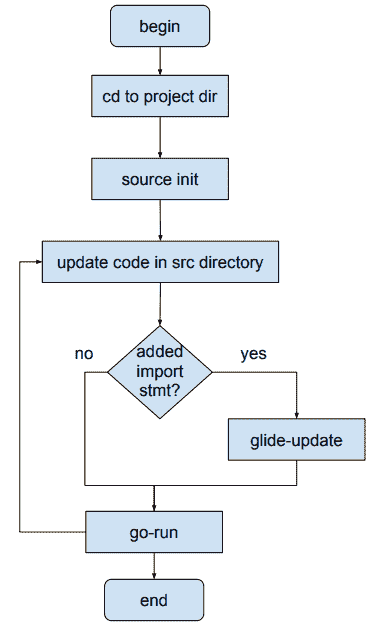

我们将`cd`到我们的项目源代码根目录，并运行`init`。然后，我们更新代码，运行`glide-update`和`go-run`命令，并重复直到完成。请注意，如果我们只添加了来自 Go 标准库的包的导入，我们将不需要运行`glide-update`命令，尽管运行`glide-update`命令也不会有害。

### Dot init 的功能和好处

*dot init*解决方案将执行以下操作：

1.  在您的`MY_DEV_DIR`目录中创建一个指向此项目根目录的链接。

1.  验证您是否正在运行正确的 Go 版本。

1.  验证您是否有一个`src`目录（如果没有，它将创建一个）。

1.  简化对项目本地包的引用。

1.  验证您是否有一个`toml`配置文件（如果将`USES_TOML_CONFIG_YN`设置为 yes）。

1.  为您的方便创建别名。

1.  验证您是否已安装 glide。

在*步骤 1*中，有一个地方可以方便地前往`MY_DEV_DIR`，例如`~/myprojects`，以查看我曾经工作过的所有项目。我可以按日期排序，并轻松删除不活跃项目的链接。

使用*步骤 2*来避免干扰 GOPATH、GOROOT 或 GOBIN。

如*步骤 3*中所解释的，`src`目录是我们放置项目本地包源文件的地方。我们的项目根目录中还有一个文件（通常命名为`main.go`），其中包含主包中的`main()`函数。

执行*步骤 4*，这样我们就不再需要包含项目本地包的完整 GitHub 存储库路径了！

我们不再使用`".github.comlearn-fp-go/2-design-patterns/ch05-decoration/02_decorator/decorator"`，而是简单地使用`". decorator"`。请注意，如果您真的不想使用*dot init*，您需要浏览源代码，并用完整的存储库路径引用替换所有简单的项目本地包引用，并移动代码。您可能还需要将代码移出项目本地包的`src`目录，这样它就不会与全局 GOPATH 的`src`目录冲突。

在*步骤 5*中，`toml`配置文件（[`github.com/BurntSushi/toml`](https://github.com/BurntSushi/toml)）是默认的配置文件解决方案。`.init`文件会自动包含`toml`配置文件运行时标志（只要您在`init`脚本中设置了这个：`USES_TOML_CONFIG_YN=yes`）。

#### 可用的别名

以下是可用的别名命令：

```go
alias go-test='go test ./... 2>&1 | grep -v "$(basename $(pwd))\t\[no test files"'
</span>alias go-test-bench='go test -bench=. ./... 2>&1 | grep -v "$(basename $(pwd))\t\[no test files"'
alias glide-ignore-project-dirs="printf \"ignore:\n$(find ./src -maxdepth 1 -type d | tail -n +2 | sed 's|./src\/||' | sed -e 's/^/- \.\//')\n\""
alias mvglide='mkdir -p vendors && mv vendor/ vendors/src/ && export GOPATH=$(pwd)/vendors:$(pwd);echo "vendor packages have been moved to $(pwd)/vendors and your GOPATH: $GOPATH"'
alias glide-update='if [ ! -z $(readlink `pwd`) ]; then export LINKED=true && pushd "$(readlink `pwd`)"; fi;rm -rf {vendor,vendors};rm glide.*;export GOPATH=$(pwd):$(pwd)/vendors && export GOBIN=$(pwd)/bin && glide init --non-interactive && glide-ignore-project-dirs >> glide.yaml && glide up && mvglide && if [ $LINKED==true ]; then popd;fi'
alias prune-project="(rm -rf bin pkg vendors;rm glide.lock;rm -rf ./src/mypackage;sed -i -e '/mypackage/ s/^#*/\/\//' main.go) 2>/dev/null"
alias show-path='echo $PATH | tr ":" "\n"'
alias prune-path='export PATH="$(echo $PATH | tr ":" "\n" | uniq | grep -v "$(dirname $ORIG_DIR)" | tr "\n" ":")"; if [[ "$PATH" =~ ':'$ ]]; then export PATH="${PATH::-1}";fi'
alias find-imports='find . -type f -name "*.go" -exec grep -A3 "import" {} \; -exec echo {} \; -exec echo --- \;'
alias go-fmt='set -x;goimports -w main.go src/*;{ set +x; } 2>/dev/null'
```

总之，`dot init`将允许您使用一个命令（`glide-update`）更新您的依赖关系，并使用另一个命令（`go-run`）编译和运行您的应用程序。您只需确保 init 脚本存在于您的项目根目录中，并运行一次`. init`。`.init`初始化减少了您需要编写和维护的代码，并尽可能简单地构建和运行您的 Go 应用程序。

#### 可用的函数

以下是可用的函数：

```go
tdml() {
   if [ -z $1 ]; then LEVEL=2; else LEVEL=$1;fi
 tree -C -d -L $LEVEL
}
get-go-binary() {
    GO_BINARY_URL="$1"
 if [ -z $GO_BINARY_URL ]; then
 echo "Missing GO_BINARY_URL. Usage: get-go-binary <GO_BINARY_URL> Example: get-go-binary github.com/nicksnyder/go-i18n/goi18n"
 return
 fi
 TMP_DIR="tmp_dir_$RANDOM"; mkdir "$TMP_DIR"; pushd "$TMP_DIR"; export GOPATH="$(pwd)"; go get -u $GO_BINARY_URL; popd; rm -rf "$TMP_DIR"
}
```

### 使用 goenv 的动机

如果您始终使用最新版本的 Go，或者在非 Macintosh 计算机上进行开发工作，您可以跳过本节。

如果我们需要支持多个 go 运行时，我们将把我们的 Go 项目代码放在不同的目录中。为了帮助我们管理我们的 go 运行时环境，让我们看一下一个名为`goenv`的小型实用脚本和我们项目根目录中的 init 脚本。

本节假设您使用的是 Mac 电脑。使用`goenv`来管理您的 Go 运行时环境；访问：[`github.com/l3x/goenv`](https://github.com/l3x/goenv)。有关`go`命令的更多信息，请访问：[`golang.org/cmd/go`](https://golang.org/cmd/go)

### 使用 init 脚本的动机

`init`脚本及其提供的别名命令只有一个目的：

*使构建和运行我们的 Go 应用程序变得简单。*

管理依赖关系（第三方包）可能很麻烦。导入语句可能对我们的本地源文件来说太长了。始终保持我们的`GOPATH`，`GOBIN`，`PATH`等等是一件麻烦的事情。

我创建了 init 脚本来简化构建和运行本书中示例应用的过程。我发现它非常有用，所以我也在其他项目中使用它。希望它对你也有用。

### 管理 Go 依赖的方法

有超过十种方法来管理 Go 的依赖关系。我们可以使用本节中将讨论的工具来实现。

#### go get 工具

当我开始使用 Go 进行开发时，我使用了`go get`工具。以下是它的帮助信息中的一部分：

```go
go get --help
...When checking out or updating a package, get looks for a branch or tag that matches the locally installed version of Go. The most important rule is that if the local installation is running version "go1", get
searches for a branch or tag named "go1". If no such version exists it retrieves the default branch of the package...
```

我很快就了解到它会获取所有包的最新版本。这不是我想要的。

我正在寻找更像 Ruby 的**Gemfile**或**npm**包管理器的东西，我可以指定每个包的特定版本，并创建一个`.lock`文件来防止每次运行构建工具时都发生变化。

#### Godep 工具

我曾经使用 Godep。它运行得很好，但使用起来很麻烦。

Godep 在我的项目的根目录的 Godeps 目录中创建了一个`Godeps.json`文件。然后，Godep 将所有第三方包的副本创建到了我的项目根目录的 Godeps 目录中。我通常会将这些第三方包与我的其他代码一起检入版本控制。

Godep 需要进行一些我认为古怪的步骤。例如，要更新项目的依赖关系，您必须通过`go get -u github.com/another-thirdparty/package`命令在您的`GOPATH`中更新它，然后通过`godep save github.com/another-thirdparty/package`命令将其从我的`$GOPATH`复制到我的项目的 Godeps 目录中。

在我看来，使用`$GOPATH`修改依赖关系是古怪的。同时使用不同版本的依赖关系修改多个项目的依赖关系更加古怪（古怪==更多用户错误）。

我喜欢简单，不喜欢古怪。

#### Go 中的 Vendoring

Go 中的 Vendoring 是在 Go 1.5 中引入的。它允许 Go 应用程序不仅从`$GOPATH/src`获取依赖项，还可以从项目根目录下名为 vendor 的子文件夹中获取依赖项。以前，您必须将第三方包保存在全局共享的`$GOPATH`路径中。现在，您可以将依赖项放入项目的 vendor 文件夹中。

我仍在寻找一种方法来固定每个包的版本，或者指定一个`MAJOR.MINOR`版本，并让我的包管理器获取最新的`MAJOR.MINOR.PATCH`版本。

更多信息，请访问[`docs.google.com/document/d/1Bz5-UB7g2uPBdOx-rw5t9MxJwkfpx90cqG9AFL0JAYo/edit`](https://docs.google.com/document/d/1Bz5-UB7g2uPBdOx-rw5t9MxJwkfpx90cqG9AFL0JAYo/edit)

#### Glide-现代包管理器

我发现了 Glide，并欣赏它的功能以及它正在积极开发/改进的事实。它让我想起了 Ruby 的 Gem 包管理。这很棒，但仍然有很多要记住。

Glide 参考

+   [`github.com/Masterminds/glide`](https://github.com/Masterminds/glide)

+   [`glide.sh/`](https://glide.sh/)

+   [`glide.readthedocs.io/en/latest/getting-started/`](https://glide.readthedocs.io/en/latest/getting-started/)

+   [`glide.readthedocs.io/en/latest/commands/`](https://glide.readthedocs.io/en/latest/commands/)

我只想运行一个命令来构建我的代码，运行一个命令来运行我的代码。我想要简单的东西，所以我创建了 init 脚本及其别名命令来包装 Glide 的功能。

我发现`init`，`glide-update`和`go-run`一系列命令非常容易使用。希望您也是如此。当您用它构建非常大的项目时，最初可能需要处理导入/依赖错误，就像任何依赖管理工具一样，但我发现 Glide 是最好的。因此，在本附录中，您看到的是一组简单的构建和运行命令，它是基于功能齐全的构建工具 Glide 构建的。

### 每个点 init 步骤的详细信息

首先，使用`cd`命令将项目目录切换到我们的源代码。让我们看看`01_dependency-rule-good`源代码。这恰好是来自第七章 *Functional Parameters*的第一个代码项目。接下来，让我们运行`goenv info`，它将告诉我们关于我们的 Go 环境的信息。

#### cd 命令到项目根目录

在使用**dot init**之前，您可能会看到`GOROOT`，`GOPATH`和`GOBIN`的无效设置：

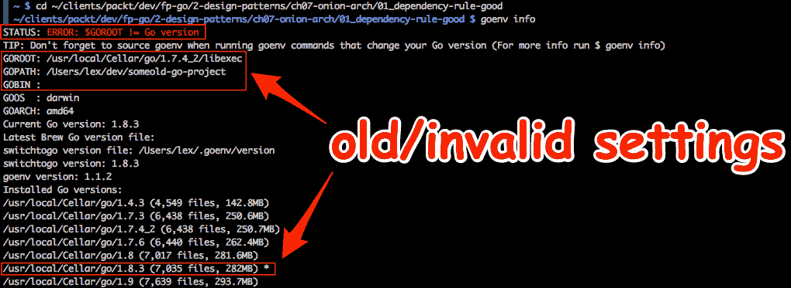

在上述屏幕截图的输出的最后一行上的*表示我们的 Go 版本设置为版本 1.8.3。请注意，运行`go version`返回`go1.9 darwin/amd64`，这是我们的书出版时最新的 Go 版本。

我们看到我们的`GOPATH`没有正确设置，并且我们安装了三个 Go 版本。

##### 使用 homebrew 安装 Go

在 Mac 上，我们可以使用 homebrew 来安装和管理我们的 Go 安装：

```go
brew search go
```

运行上述命令可能会返回如下结果：

`go`

`go@1.4`

`go@1.5`

`go@1.6`

`go@1.7`

`go@1.8`

检查指示哪些 Go 版本已安装。要安装 go 版本 1.5，可以运行`brew install go@1.5`。要安装最新版本的 go（当前为 1.9），请运行`brew install go`。

#### 检查初始目录结构和文件

让我们检查我们的初始目录结构和文件：

```go
  ~/clients/packt/dev/fp-go/2-design-patterns/ch07-onion-arch/01_dependency-rule-good $ tree -C -d -L 2; find . -type f
.
└── src
    ├── packagea
    └── packageb

3 directories
./.bash_exports
./config.toml
./glide.yaml
./init
./main.go
./src/packagea/featurea.go
./src/packageb/featureb.go
```

#### init 脚本内容

在运行我们的`init`脚本之前，让我们看看我们的 init 脚本的内容：

```go
#!/bin/bash
# Author : Lex Sheehan
# Purpose: This script initializes a go project with glide dependency management
# For details see: https://www.amazon.com/Learning-Functional-Programming-Lex-Sheehan-ebook/dp/B0725B8MYW
# License: MIT, 2017 Lex Sheehan LLC
MY_DEV_DIR=~/dev
CURRENT_GO_VERSION=1.9.2
USES_TOML_CONFIG_YN=no
LOCAL_BIN_DIR=/usr/local/bin/
# ---------------------------------------------------------------
# Verify variables above are correct. Do not modify lines below.
if [ -L "$(pwd)" ]; then
 echo "You must be in the real project directory to run this init script. You are currently in a linked directory"
 echo "Running: ln -l \"$(pwd)\""
 ls -l "$(pwd)"
 return
fi
CURRENT_GOVERSION="go$CURRENT_GO_VERSION"
ORIG_DIR="$( cd "$( dirname "${BASH_SOURCE[0]}" )" && pwd )"
DEV_DIR="$MY_DEV_DIR/$(basename $ORIG_DIR)"
PROJECT_DIR_LINK="$MY_DEV_DIR/$(basename $ORIG_DIR)"
if [ -L "$PROJECT_DIR_LINK" ]; then
 rm "$PROJECT_DIR_LINK"
fi
if [ ! -d "$MY_DEV_DIR" ]; then
 mkdir "$MY_DEV_DIR"
fi
# Create link to project directory in MY_DEV_DIR
set -x
ln -s "$ORIG_DIR" "$PROJECT_DIR_LINK"
{ set +x; } 2>/dev/null
cd "$PROJECT_DIR_LINK"
export GOPATH=$ORIG_DIR
export GOBIN=$ORIG_DIR/bin
if [ -e "$GOBIN" ]; then
 rm "$GOBIN/*" 2>/dev/null
else
 mkdir "$GOBIN"
fi
#[ $(which "$(basename $(pwd))") ] && { echo "An executable named $(basename $(pwd)) found on path here: $(which $(basename $(pwd))). Continue anyway? (yes/no)"; read CONTINUE_YN; if [[ "$CONTINUE_YN" =~ ^(yes|y)$ ]]; then echo 'Okay, but when you run go-run it may run the pre-existing binary.'; else echo "You might want to rename this project directory ($(basename $(pwd))) to a name that does not match a pre-existing binary name."; return; fi; } 2>/dev/null
APP_NAME=$(basename $(pwd))
GOVERSION=$(go version)
echo "Installed Go version: $GOVERSION"
if [[ $(type goenv) ]]; then
 # Attempt to automatically set desired/current go version. This requires goenv.
 . goenv "$CURRENT_GO_VERSION"
 echo "GOVERSION: $GOVERSION"
 echo "CURRENT_GOVERSION: $CURRENT_GOVERSION"
 if [ -z "$GOVERSION" ] || [[ "$(echo $GOVERSION | awk '{print $3}')" != "$CURRENT_GOVERSION" ]]; then
 echo "Expected Go version $CURRENT_GOVERSION to be installed"
 return
 fi
else
 if [ -z "$GOVERSION" ] || [[ "$(echo $GOVERSION | awk '{print $3}')" != "$CURRENT_GOVERSION" ]]; then
 echo "Expected Go version $CURRENT_GOVERSION to be installed. Consider using github.com/l3x/goenv to manage your go runtimes."
 return
 fi
fi
command -v goimports >/dev/null 2>&1 || { echo >&2 "Missing goimports. For details, see: https://github.com/bradfitz/goimports"; return; }
command -v glide >/dev/null 2>&1 || { echo >&2 "Missing glide. For details, see: https://github.com/Masterminds/glide"; return; }
if [ ! -e ./src ]; then
 mkdir src
fi

if [ ! -e ./src/mypackage/ ]; then
 mkdir ./src/mypackage
fi

if [ ! -e ./src/mypackage/myname.go ]; then
 cat > ./src/mypackage/myname.go <<TEXT
package mypackage

func MyName() string { return "Alice" }
TEXT
fi

if [ ! -e ./main.go ]; then
 cat > ./main.go <<TEXT
package main

import (
 "mypackage"
)

func main() {
 println("hello from main.go")
 println(mypackage.MyName() + " says hi from mypackage")
}
TEXT
fi

if [ ! -e ./.gitignore ]; then
 cat > ./.gitignore <<TEXT
# Binaries for programs and plugins
*.exe
*.dll
*.so
*.dylib

# Test binary, build with `go test -c`
*.test

# Output of the go coverage tool, specifically when used with LiteIDE
*.out

# Project-local glide cache, RE: https://github.com/Masterminds/glide/issues/736
.glide/

# Temporary backup file created by sed in prune-project alias
main.go-e
TEXT
fi

if [ "${PATH/$GOBIN}" == "$PATH" ] ; then
 export PATH=$PATH:$GOBIN
fi

if [[ "$USES_TOML_CONFIG_YN" =~ ^(yes|y)$ ]]; then
 if [ ! -e ./config.toml ]; then
 echo You were missing the config.toml configuration file... Creating bare config.toml file ...
        echo -e "# Runtime environment\napp_env = \"development\"" > config.toml
 fi
 ls -l config.toml
    alias go-run="go install && $APP_NAME -config ./config.toml"
else
 alias go-run="go install && $APP_NAME"
fi
alias go-test='go test ./... 2>&1 | grep -v "$(basename $(pwd))\t\[no test files"'
alias go-test-bench='go test -bench=. ./... 2>&1 | grep -v "$(basename $(pwd))\t\[no test files"'
alias glide-ignore-project-dirs="printf \"ignore:\n$(find ./src -maxdepth 1 -type d | tail -n +2 | sed 's|./src\/||' | sed -e 's/^/- \.\//')\n\""
alias mvglide='mkdir -p vendors && mv vendor/ vendors/src/ && export GOPATH=$(pwd)/vendors:$(pwd);echo "vendor packages have been moved to $(pwd)/vendors and your GOPATH: $GOPATH"'
alias glide-update='if [ ! -z $(readlink `pwd`) ]; then export LINKED=true && pushd "$(readlink `pwd`)"; fi;rm -rf {vendor,vendors};rm glide.*;export GOPATH=$(pwd):$(pwd)/vendors && export GOBIN=$(pwd)/bin && glide init --non-interactive && glide-ignore-project-dirs >> glide.yaml && glide up && mvglide && if [ $LINKED==true ]; then popd;fi'
alias prune-project="(rm -rf bin pkg vendors;rm glide.lock;rm -rf ./src/mypackage;sed -i -e '/mypackage/ s/^#*/\/\//' main.go) 2>/dev/null"
alias show-path='echo $PATH | tr ":" "\n"'
alias prune-path='export PATH="$(echo $PATH | tr ":" "\n" | uniq | grep -v "$(dirname $ORIG_DIR)" | tr "\n" ":")"; if [[ "$PATH" =~ ':'$ ]]; then export PATH="${PATH::-1}";fi'
alias find-imports='find . -type f -name "*.go" -exec grep -A3 "import" {} \; -exec echo {} \; -exec echo --- \;'
alias go-fmt='set -x;goimports -w main.go src/*;{ set +x; } 2>/dev/null'
tdml() {
   if [ -z $1 ]; then LEVEL=2; else LEVEL=$1;fi
 tree -C -d -L $LEVEL
}
get-go-binary() {
    GO_BINARY_URL="$1"
 if [ -z $GO_BINARY_URL ]; then
 echo "Missing GO_BINARY_URL. Usage: get-go-binary <GO_BINARY_URL> Example: get-go-binary github.com/nicksnyder/go-i18n/goi18n"
 return
 fi
 TMP_DIR="tmp_dir_$RANDOM"; mkdir "$TMP_DIR"; pushd "$TMP_DIR"; export GOPATH="$(pwd)"; go get -u $GO_BINARY_URL; popd; rm -rf "$TMP_DIR"
}
echo You should only need to run this init script once.
echo Add Go source code files under the src directory.
echo After updating dependencies, i.e., adding a new import statement, run:  glide-update
echo To build and run your app, run:  go-run
```

我们只需要验证上述虚线的变量是否正确：

```go
MY_DEV_DIR=~/dev
CURRENT_GO_VERSION=1.9.2
USES_TOML_CONFIG_YN=no
LOCAL_BIN_DIR=/usr/local/bin/
```

如果我们不改变任何东西，脚本将使用 go 版本 1.9 工作，并且如果`~/dev`目录不存在，它将创建一个。

#### 运行 init 脚本

为了让我们的项目准备好开发，在我们的终端中，只需运行`. init`。

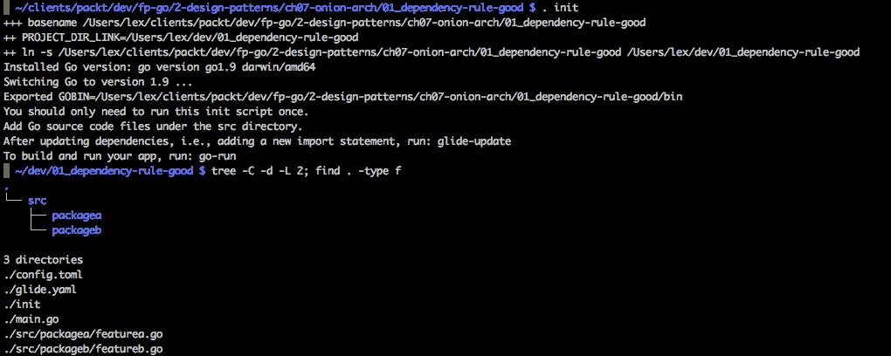

请注意，`source`和"."做同样的事情；它们在当前 shell 环境的上下文中运行以下命令。

请注意我们当前的目录路径更短。我们在一个新链接的目录中。这是`MY_DEV_DIR`中的一个链接文件。运行此脚本的一个好处或副作用是，我们可以去`MY_DEV_DIR`看看我们最近工作过的项目。在我们的终端中显示我们的完整当前目录路径时，这也很好（假设我们显示我们的 shell 提示符中的完整当前目录路径）。

#### 重新检查初始目录结构和文件

我们还运行了 tree 命令来查看我们的项目目录，并运行了 file 命令来查看我们的文件。

init 脚本创建的唯一新文件是`PROJECT_DIR_LINK`（在此示例中为`/home/lex/dev/01_dependency-rule-good`）。

#### goenv 显示了更新的内容

那个 init 脚本一定为我们做了其他事情，对吧？让我们再次运行我们的 goenv info 命令，看看它还做了什么：

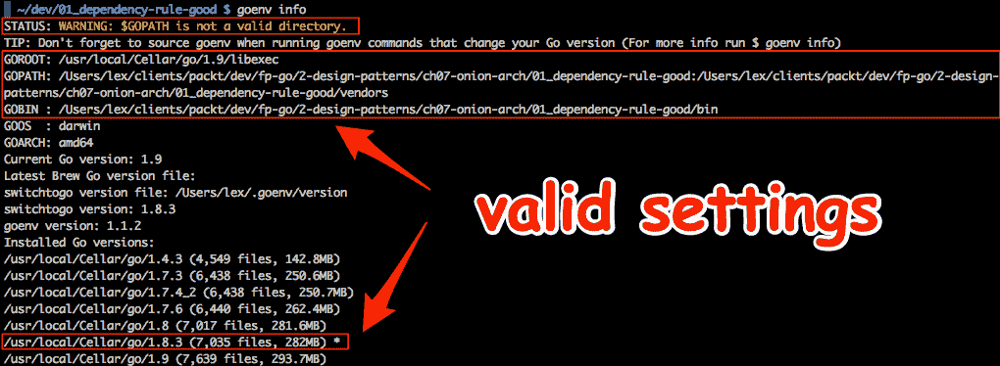

我们收到警告，因为`GOPATH`实际上是一个路径。（如果`GOPATH`不是单个目录，则大多数其他供应商解决方案将无法正常工作。）我们的`GOPATH`的构造方式与我们的`PATH`环境变量相同。它由路径组成，由冒号字符分隔。

我们的`GOPATH`由两个值组成：`src`路径（带有我们的项目源文件）和 vendors 路径（带有我们的第三方依赖源文件）。

#### 运行 glide-update 以获取第三方依赖文件

在我们向 src 目录添加文件并有一些导入语句之后，在运行我们的 Go 应用程序之前，让我们确保 Go 具有构建我们应用程序所需的所有依赖项的源文件。

每当我们更新任何导入语句（并在运行应用程序之前），我们都运行`glide-update`。

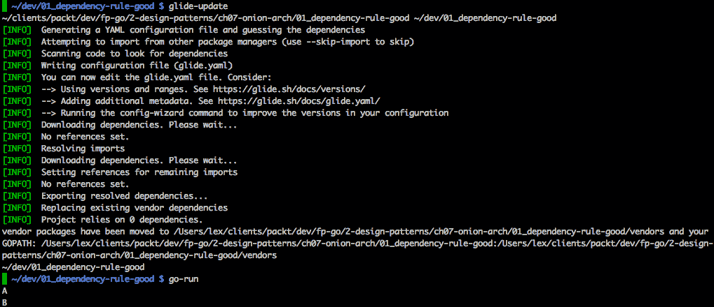

我们可以通过输入`go-run`来运行我们的 Go 应用程序。这将编译我们的应用程序（将二进制文件放入我们的`GOBIN`目录）并运行它。我们的应用程序输出两行字符**A**和**B**。

运行`glide-update`将创建典型的`vendor`目录，并迅速将其重命名为 vendors（这进一步表明这不是标准的 glide 安装）。我们不必成为 glide 专家就能让 glide 管理我们的依赖项。每当我们更新依赖项（并更改导入语句），我们只需运行`glide-update`别名，所有依赖项的代码都将进入 vendors 目录，我们的`GOPATH`在编译时会知道在那里查找。还要注意，如果您使用需要输入`GOROOT`、`GOBIN`和`GOPATH`的高级 IDE，您只需运行`goenv-info`来查看我们项目的正确设置是什么。

如果`glide-update`报告任何错误，就由我们来解决。

### 添加标准库导入

我们将在`packagea`的导入语句中添加`fmt`包：

```go
package packagea

import (
   b "packageb"
 "fmt"
)

func Atask() {
   fmt.Println("A")
   b.Btask()
}
```

我们将在`packageb`的导入语句中添加日志包：

```go
package packageb

import (
   "log"
)

func Btask() {
   log.Println("B")
}
```

添加我们的导入后，我们初始化源：

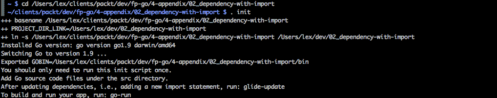

接下来，我们更新我们的依赖项：

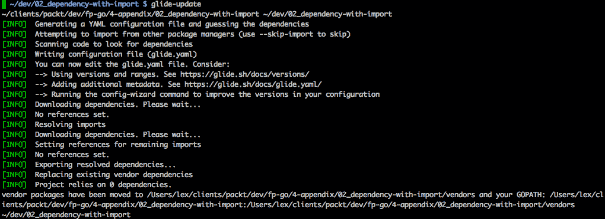

现在，我们可以运行我们的应用程序：

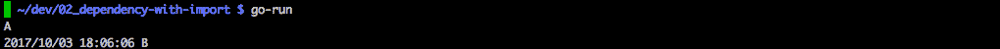

唯一的区别是`log.Println`命令添加了时间戳。我们看到它起作用了，但依赖关系呢？现在 vendor 目录中有一些文件吗？

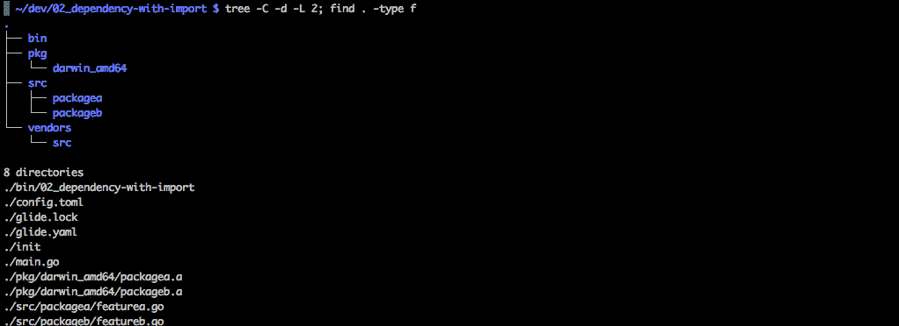

不。仍然没有文件。为什么？

这是因为`fmt`和`log`都来自 Go 的标准库。

#### Go 标准库

Go 标准库是一组增强和扩展语言的核心包。

通过*core*，我们的意思是每次编译我们的 Go 应用程序，我们都会得到那个 pkg 目录，并且它将填满 Go 标准库包。

Go 标准库包具有以下功能：

+   它们不会增加额外的开销

+   它们保证始终存在

+   它们保证始终向后兼容（不会在发布周期之间中断）

使用 Go 标准库中的包将使我们的代码更易于管理和更可靠。

示例包括以下内容：

+   `log`

+   `fmt`

+   `encoding/json`

+   `database/sql/driver`

+   `net/http`

有关 Go 标准库的详细信息，请参阅：[`golang.org/pkg/`](https://golang.org/pkg/)

### 添加第三方导入

在这个例子中，我们将导入一个简单的第三方实用程序包`go-goodies/go_utils`。我在 2015 年创建了`go-goodies/go_utils`（当时我还在学习这门语言）。我很久没有修改代码了，所以我可以回头看看我学到了多少。它应该仍然正常工作，但在许多情况下，有更好的方法来完成任务。您已经被警告了，请不要评判。

#### 导入语句引用 go_utils

让我们添加第三个导入，`u "github.com/go-goodies/go_utils"`。

请注意，我们在`Atask`函数中使用前缀`u`来引用`PadLeft`函数：

```go
package packagea

import (
   b "packageb"
 "fmt"
 u "github.com/go-goodies/go_utils"
)

func Atask() {
   fmt.Println(u.PadLeft("A", 3))
   b.Btask()
}
```

我们可以在我们的源文件上使用`grep`命令查找`import`语句：

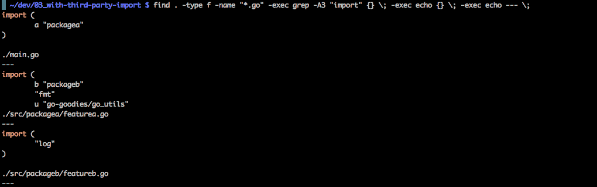

由于我们更新了一个导入语句，我们需要在运行应用程序之前运行`glide-update`：

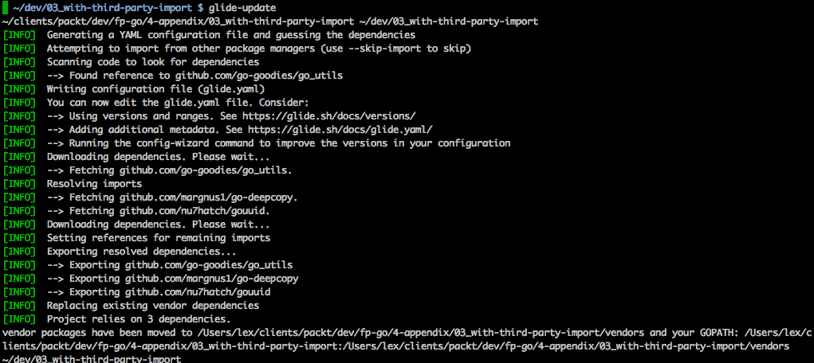

这一次，我们可以看到`glide-update`将第三方（`go_utils`）文件拉入了 vendor 目录：

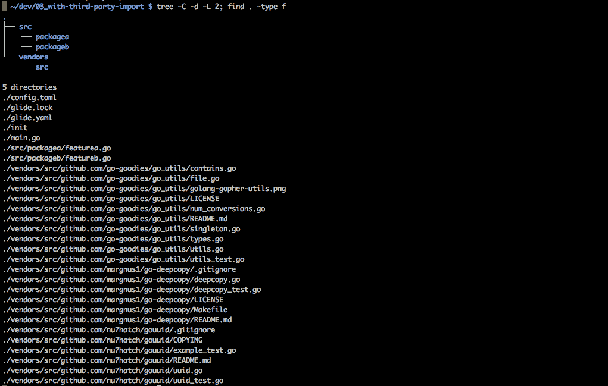

我们可以看到`go-goodies/go_utils`引用了以下第三方包：

+   [`github.com/margnus1/go-deepcopy`](http://github.com/margnus1/go-deepcopy)

+   [`github.com/nu7hatch/gouuid`](http://github.com/nu7hatch/gouuid)

当我们运行我们的应用程序时，我们可以看到使用`PadLeft`函数的效果：


您可以放心地使用 init 脚本和它提供的别名，它们不会影响您的源文件（好吧，除了 prune-project 会注释掉`./main.go`中引用`mypackage`的行）。它们修改的文件包括软链接的目录文件在您的`~/dev`目录和`bin`、`pkg`和 vendors 目录中。

## 开发工作流程摘要

如何管理依赖项、构建、运行和部署应用程序是个人偏好的问题。让团队中的所有开发人员以相同的方式构建应用程序通常是个好主意。本节分享的技术演示了我为本书构建演示应用程序的方式。我保持了简单。然而，事实是，我很少像为本书那样孤立地构建应用程序。几乎每次，我都会在我的`开发/测试/部署`工作流程中使用 Docker。请注意，本书不涉及 Docker 的使用。

### 故障排除 dot init

这就是我解决转换 Chapter 4，*Go 中的 SOLID 设计*，到点 init 技术时出现的构建错误。

首先，我使用`cd`命令将项目的根目录（`project`是 Chapter 4，*Go 中的 SOLID 设计*，源代码）指向：

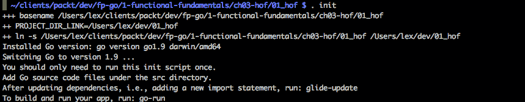

接下来，我运行了`glide-update`，告诉 Glide 将依赖项放在 vendors 目录中：

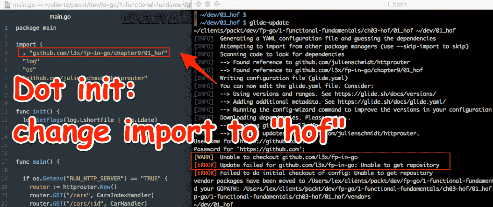

但是，这失败了，因为`import`语句是错误的：

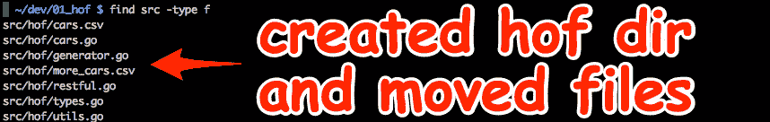

现在导入的样子是这样的：

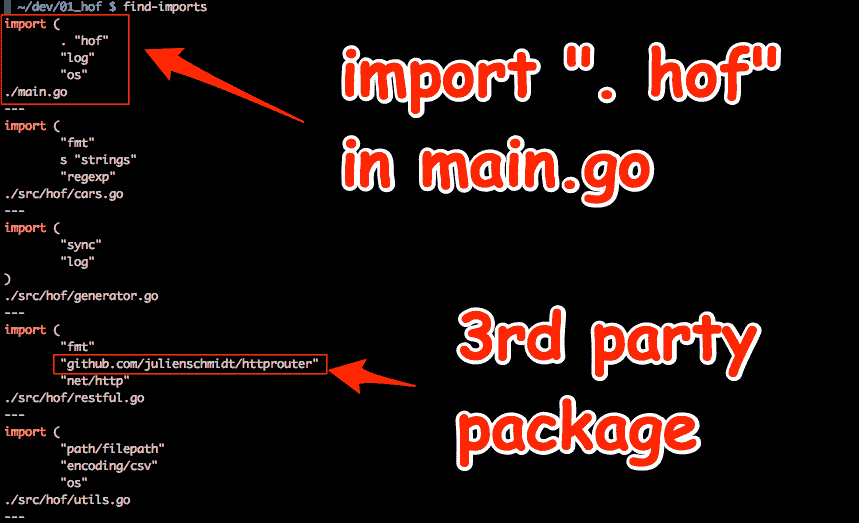

告诉 Glide 将第三方包放在 vendors 目录中。

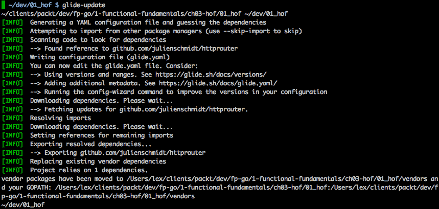

编译和运行：

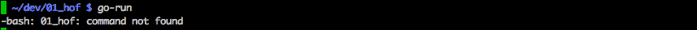

糟糕！`.init`找不到二进制文件。

别担心，只需`cd`回到原始项目根目录并重新源 init：

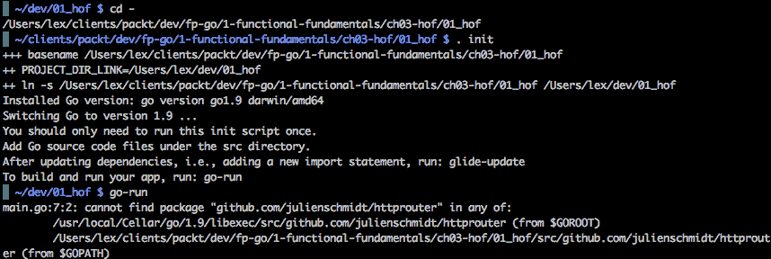

如果运行`go-run`时看到*command not found*，只需重新运行`init`、`glide-update`和`go-run`。

还有更多问题！

哦，对了。我忘了阅读 init 的消息，并且没有运行`glide-update`。我们接下来要做的就是这个：

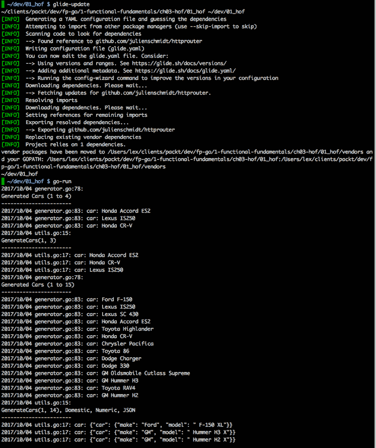

成功！

当我们尝试运行测试时可能会发生什么？

当我们`cd`到我们的`02_fib`示例应用程序中并输入`go test -bench=. ./...`时，可能会遇到一些错误：

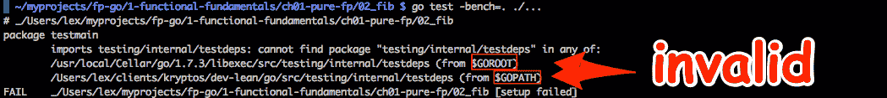

如果我们的`GOROOT`和/或`GOPATH`设置为无效值，就会发生这种情况。

这里有两个明显的错误。环境变量`GOROOT`和`GOPATH`都是无效的。

我们通过输入`brew info go|grep Cellar|grep -v export`在 Mac 电脑上找到`GOROOT`的路径：

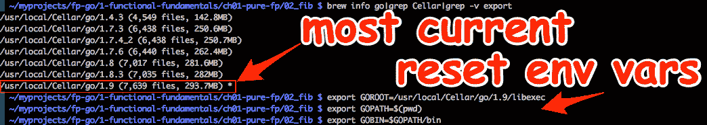

我们碰巧知道我们需要将`libexec`目录添加到返回结果的路径中，以设置我们的`GOPATH`。我们将`GOPATH`设置为当前应用程序的根目录，也就是当前目录。我们还设置了`GOBIN`路径，告诉 Go 在编译源代码时存储可执行文件的位置。

由于在本章中我们不需要处理任何第三方包，因此我们不需要处理依赖管理。有十多种 Go 依赖管理工具可用。在后续章节中，我们将使用 Glide（[`github.com/Masterminds/glide`](https://github.com/Masterminds/glide)）进行包管理，并使用一个非常轻量级的包装器 dot init 来进一步简化我们的构建和运行过程。详情请参见附录。

请注意，点初始化消除了这类错误的可能性。

这对于一个旨在简化事情的工具来说是大量的信息。没错，但几乎每次，你需要知道的都在*TL;DR*部分。

## 如何提出对 Go 的更改

我确信在 Go 中不支持泛型（即使在 Go 2.0 中也不支持），正如摘要中提到的，我对此没有意见。

然而，如果 Go 支持，我们将从中获益最大的功能是**尾递归优化**（**TCO**）。

### 第一步 - 搜索规范

Go 是否已经支持了 TCO？是时候找出来了。

首先，我查看了 Go 语言规范中有关 TCO 功能的任何提及（[`golang.org/ref/spec`](https://golang.org/ref/spec)）。

我没有找到关于 TCO 的任何信息。

### 第二步 - 谷歌搜索

接下来，我进行了必要的谷歌搜索，并找到了这个：

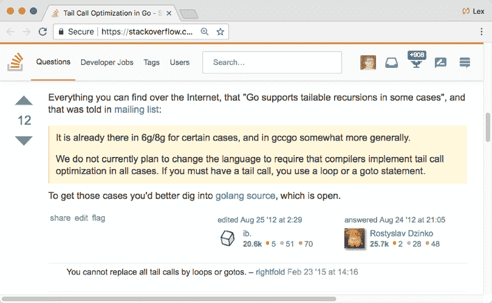

### Golang 官方变更提案流程

然后，我了解了提出对 Go 进行更改的流程（[`github.com/golang/proposal/`](https://github.com/golang/proposal/)）。

#### 搜索现有问题

以下是流程。

首先，访问[`github.com/golang/go/issues`](https://github.com/golang/go/issues)，并搜索您希望添加到 Go 中的语言功能，例如，输入`tail call optimization`，如下面的屏幕截图所示：

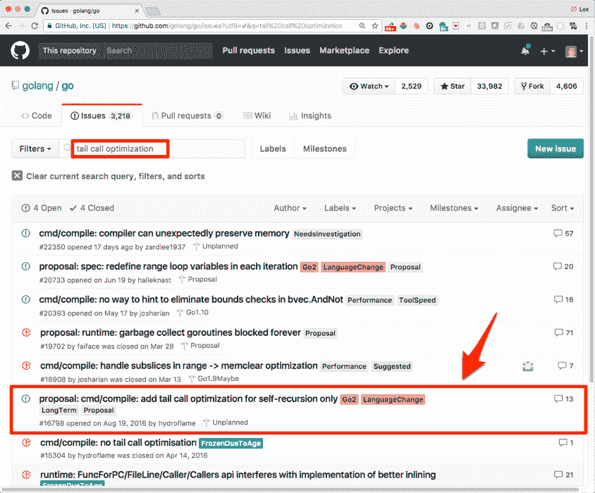

#### 阅读现有提案

我点击了带有 13 条评论的行，以查看详情：

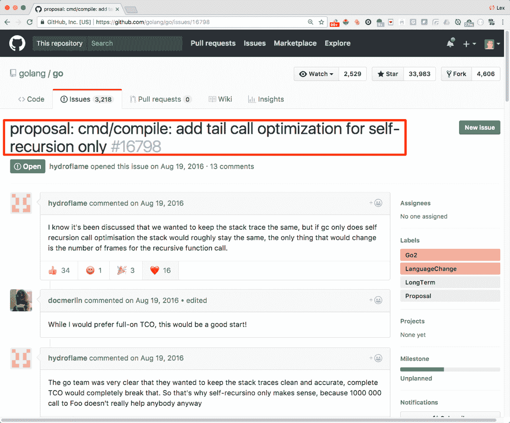

这是一个可以显著改进我们递归函数调用的功能，例如 Y-Combinator。

还记得我们在第一章中运行`SumRecursive`函数的基准测试结果吗？它比命令式版本慢了大约三倍。缺乏 TCO 是使用 FP 在 Go 上通常不推荐的最重要原因。将 TCO 添加到 Go 编译器功能列表中将解决这个问题。这就是为什么这个影响较小、回报较高的功能如此重要。

还有其他提案在初始帖子中包含了更多信息，这是呈现我们想法的更好方式。然而，当我们阅读后续评论时，细节变得更加明显。当我阅读以下评论时，我确信这个提案得到了我的支持：

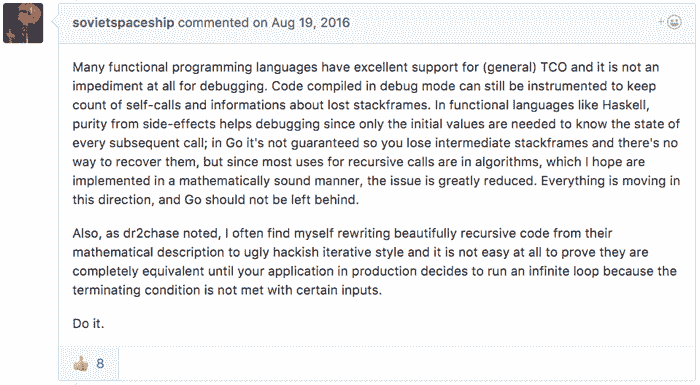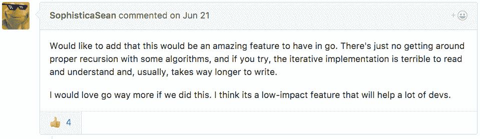

我认为分享我心目中的`@tco`注释的示例可能会更引起人们对这个提案的关注。但是距离我的书出版还有一个月。我现在就输入以下评论并说，“*等待我的书获得所有的荣耀细节*。”还是等待？管他呢，我要去做。

#### 向现有 TCO 提案添加评论

您可以在[`github.com/golang/go/issues/16798`](https://github.com/golang/go/issues/16798)上阅读评论。

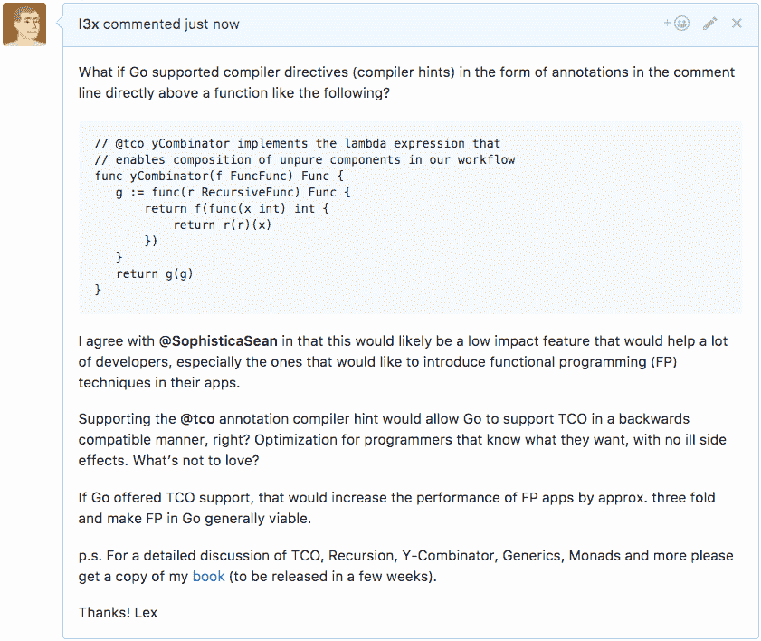

现在，我想知道我的请求是否值得为编译器指令提出单独的提案？例如，*提案：以注释注释的形式添加编译器提示*。

我们将保留该评论，并看看会发生什么。

评论变成了一个新的提案（[`github.com/golang/go/issues/22624`](https://github.com/golang/go/issues/22624)）。

随着这本书的出版，这个讨论还在继续。

### 创建新提案

如果我没有找到这个现有的提案，我会这样做。转到[`github.com/golang/go/issues/new`](https://github.com/golang/go/issues/new)创建一个问题：

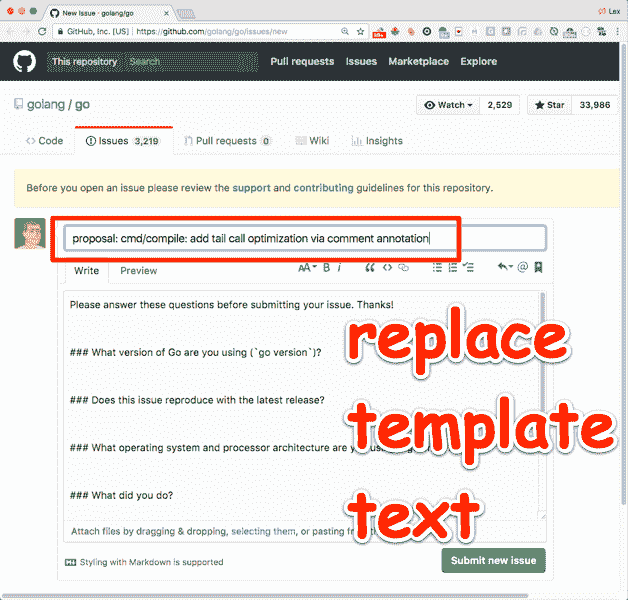

假设在撰写提案后，如果从问题中变得明显，我未能在提案消息中清晰定义提案，那么我可以创建一个设计文档来帮助澄清请求。

### 创建设计文档

我会在这里[`github.com/golang/proposal/`](https://github.com/golang/proposal/)点击“创建新文件”按钮，将其保存为`design/NNNN-tco-annotation.md`，其中`NNNN`是 GitHub 问题编号，`tco-annotation`是其简称。例如，`15292-generics.md` ([`github.com/golang/proposal/blob/master/design/15292-generics.md`](https://github.com/golang/proposal/blob/master/design/15292-generics.md))。

设计文档应遵循以下设计模板格式：[`github.com/golang/proposal/blob/master/design/TEMPLATE.md`](https://github.com/golang/proposal/blob/master/design/TEMPLATE.md)。

### 发送电子邮件通知 golang-dev 组

保存设计文档后，我会在`golang-dev`邮件组中发布一个新主题，如下所示：

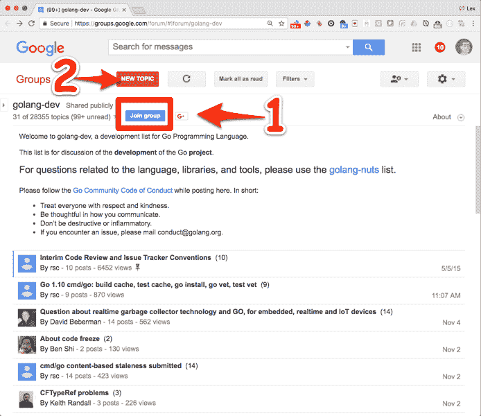

### 一个示例提案

以下是一个写得很好的提案的通知电子邮件的示例：

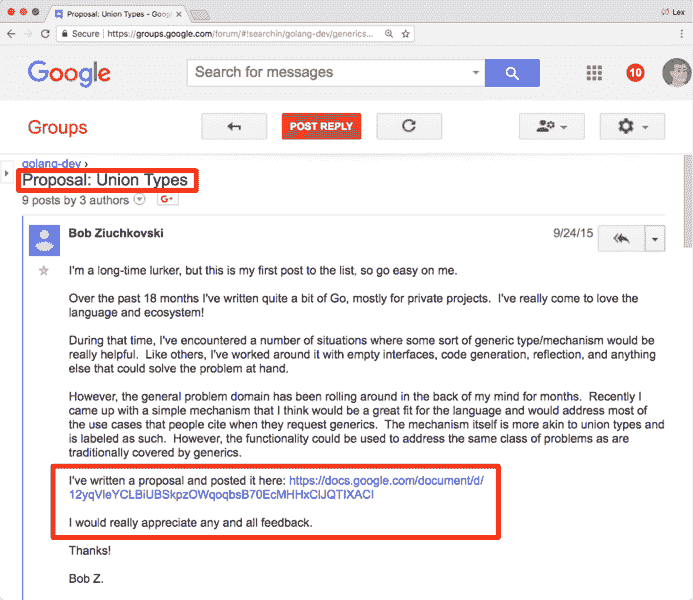

### 监控提案直到解决方案达成

我会监视我的收件箱，查看有关提案的新消息，以检查是否需要添加澄清。一旦对设计文档的评论和修订结束，将就提案进行最后讨论，然后它将被接受或拒绝。

## FP 资源

我不会在这里编译一个对 Go 开发人员感兴趣的函数式编程资源列表，我会创建一个可以随时间更新的 github 存储库：

[`github.com/l3x/fp-resources`](https://github.com/l3x/fp-resources)

如果您知道任何缺失的链接，请随时提交拉取请求，以便我可以更新信息供所有人查看。

## Minggatu - Catalan 数


发现 Catalan 数通常归因于 1844 年的 Eugene Catalan，尽管它实际上是由中国数学家 Minggatu（1730）在 100 多年前最初发现的。

第 n 个 Catalan 数可以用以下方程表示：

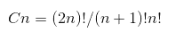

当 n = 0, 1, 2, 3, 4, 5, 6 时，前几个 Catalan 数分别为 1, 1, 2, 5, 14, 42, 132。

Catalan 数是许多计数和计算机科学解决方案中出现的一系列数字。

我解释这个概念最简单的方法是回答，你可以用 n 个上升和 n 个下降的笔画形成多少个*山峰*，这些山峰都在原始线上方？

变量 C[n]是包含 n 对匹配/\字符的山峰数量：

```go
                                /\
           /\    /\ /\   /\    /  \
/\/\/\, /\/  \, /  \/\, /  \, /    \
```

让我们使用文本定界符（开放和关闭括号）来表示容器。

Catalan 数是一个基本的包含概念，经常用于辅助基于组合逻辑的新软件和硬件架构的概念化和设计。

变量 C[n]是包含 n 对匹配括号的表达式的数量：

```go
()()(), ()(()), (())(), (()()), ((()))
```

与λ演算的联系在于，匹配括号的组合逻辑足够表达递归函数，我们知道从对 Y-组合子的研究中，递归函数是基本的。

为了更好地理解，可以考虑在大多数编程语言中，代码在解释器或编译器内部使用**抽象语法树**（**AST**）来表示。 AST 将代码块分解为最小的部分，使得转换、分析或执行代码变得容易：

```go
if b !=0 {
   result := a/b
} else {
   result := NaN
}
return result
```

以下 AST 图表代表了前面的代码块：

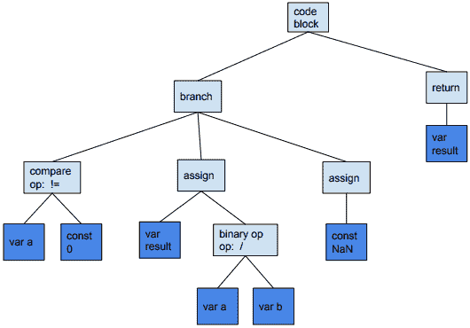

在 LISP 中，代码块看起来是这样的：

```go
(if (b != 0) ( / a b) (NaN) )
```

我们使用括号来表示 AST。一个开括号“（”表示向树的下一级，而一个闭括号“）”表示向树的上一级。

我们可以用其他方式来表示代码中的树结构。

### 解释和行动呼吁

尽管这些信息直接适用于函数式编程，并且对函数式编程的历史有意义，但它没有被放在*函数式编程的历史*中，因为发现日期与直接导致阿隆佐·邱奇发明/发现λ演算的事件顺序不一致。

这表明人们经常思考的方向是相似的，但由于缺乏沟通/合作，没有人知道，也没有人从彼此的工作中受益。

今天，我们既不受距离的限制，也不受飞机、火车或汽车的限制，而是受人性的限制。

我相信，如果由软件工程师和数学家决定，我们会平等并迅速地分享。我们渴望分享我们所学到的和创造的（以及爱），但是企业所有者和政府（受贪婪和权力驱使）却堵住了我们的嘴。

我想要感谢像明嘎图这样的世界伟人，并敦促我的工程师同行，无论来自哪个国家，加入努力，用我们对科学的热爱和激情来取代对权力的欲望。

**f(x)**是纯粹的。人性可以是不纯的。

λ演算（参见上一章的 Y-Combinator 和 DNA 双螺旋部分）是证明我们（中国人、俄罗斯人、韩国人、印度人、非洲人、阿拉伯人、美国人等）更相似而不是不同的经验性证据。

我们都是平等的。让我们用爱取代权力的欲望，用爱的力量。让我们把分歧放在一边，尽可能合作，创造一个更美好的世界。

和平，

Lex
