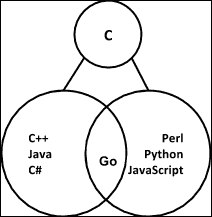
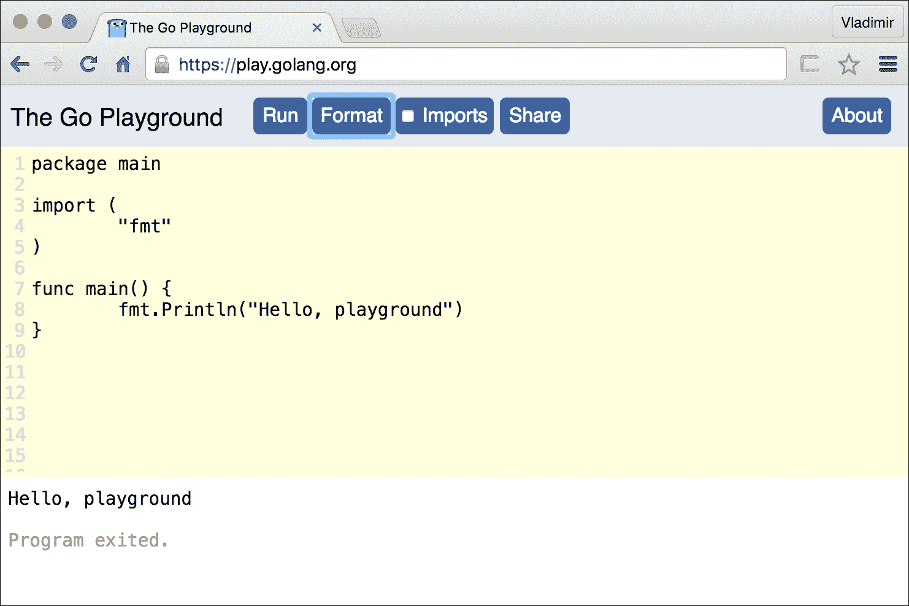
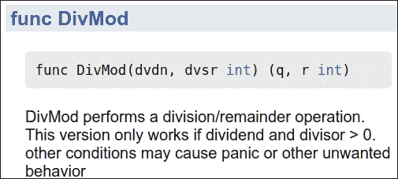

# 第一章。Go 的第一步

在本书的第一章中，您将介绍 Go 并了解使该语言成为受欢迎的特点。本章的开头部分介绍了 Go 编程语言背后的动机。然而，如果您感到不耐烦，可以跳到其他主题并学习如何编写您的第一个 Go 程序。最后，“Go 简介”部分提供了对该语言特性的高级摘要。

本章涵盖以下主题：

+   Go 编程语言

+   使用 Go

+   安装 Go

+   您的第一个 Go 程序

+   Go 简介

# Go 编程语言

自从贝尔实验室的*Dennis Ritchie*在 1970 年代初发明了 C 语言以来，计算机行业已经产生了许多流行的语言，它们直接基于（或借鉴了）C 语言的语法。通常被称为 C 语言家族的语言，它们可以分为两个广泛的演变分支。在一个分支中，派生语言如 C++、C#和 Java 已经发展出采用了强类型系统、面向对象和使用编译二进制的特点。然而，这些语言往往具有较慢的构建部署周期，程序员被迫采用复杂的面向对象类型系统来获得运行时安全性和执行速度：



在另一个演变的语言分支中，有诸如 Perl、Python 和 JavaScript 等语言，它们被描述为动态语言，因为它们缺乏类型安全形式，使用轻量级脚本语法，并且代码解释而非编译。动态语言已成为 Web 和云规模开发的首选工具，速度和部署便利性被重视胜过运行时安全性。然而，动态语言的解释性质意味着它们通常运行速度比编译语言慢。此外，运行时缺乏类型安全意味着系统的正确性随着应用程序的增长而变得不稳定。

Go 是由*Robert Griesemer*、*Rob Pike*和*Ken Thomson*于 2007 年在 Google 创建的系统语言，用于处理应用程序开发的需求。Go 的设计者们希望在创建一种新语言的同时，减轻前述语言的问题，使其简单、安全、一致和可预测。正如 Rob Pike 所说：

> *“Go 试图将静态类型语言的安全性和性能与动态类型解释语言的表现力和便利性相结合。”*

Go 从之前的不同语言中借鉴了一些想法，包括：

+   简化但简洁的语法，有趣且易于使用

+   一种更像动态语言的系统类型

+   支持面向对象编程

+   静态类型用于编译和运行时安全

+   编译为本机二进制以实现快速运行时执行

+   几乎零编译时间，更像解释型语言

+   一种简单的并发习语，以利用多核、多芯片机器

+   用于安全和自动内存管理的垃圾收集器

本章的其余部分将带您走过一系列入门步骤，让您预览该语言并开始构建和运行您的第一个 Go 程序。这是本书其余章节中详细讨论的主题的前奏。如果您已经对 Go 有基本的了解，可以跳到其他章节。欢迎您跳到其他章节。

# 使用 Go

在我们首先安装和运行 Go 工具之前，让我们先来看看**Go Playground**。语言的创建者提供了一种简单的方式来熟悉语言，而无需安装任何工具。Go Playground 是一个基于 Web 的工具，可从[`play.golang.org/`](https://play.golang.org/)访问，它使用编辑器的比喻，让开发人员可以直接在 Web 浏览器窗口中编写代码来测试他们的 Go 技能。Playground 让用户能够在 Google 的远程服务器上编译和运行他们的代码，并立即获得结果，如下面的截图所示：



编辑器很基础，因为它旨在作为学习工具和与他人分享代码的方式。Playground 包括实用功能，如行号和格式化，以确保您的代码在超过几行时仍然可读。由于这是一个消耗实际计算资源的免费服务，Google 可以理解地对 Playground 可以做什么施加一些限制：

+   你的代码将消耗的内存量受到限制

+   长时间运行的程序将被终止

+   文件访问是通过内存文件系统模拟的。

+   网络访问仅模拟对回环接口的访问

## 无需 IDE

除了 Go Playground，有什么其他方法可以编写 Go 代码呢？编写 Go 并不需要一个花哨的**集成开发环境**（**IDE**）。事实上，您可以使用捆绑在您的操作系统中的喜爱的纯文本编辑器开始编写简单的 Go 程序。但是，大多数主要文本编辑器（和完整的 IDE）都有针对 Go 的插件，如 Atom、Vim、Emacs、Microsoft Code、IntelliJ 等。可以在[`github.com/golang/go/wiki/IDEsAndTextEditorPlugins`](https://github.com/golang/go/wiki/IDEsAndTextEditorPlugins)找到完整的编辑器和 IDE 插件列表。

## 安装 Go

要在本地计算机上开始使用 Go 进行编程，您需要在计算机上安装**Go 工具链**。目前，Go 已准备好在以下主要操作系统平台上安装：

+   Linux

+   FreeBSD Unix

+   Mac OSX

+   Windows

官方安装包都适用于 32 位和 64 位的基于英特尔的架构。还有官方的二进制发布版本适用于 ARM 架构。随着 Go 的流行，未来肯定会提供更多的二进制发行选择。

让我们跳过详细的安装说明，因为当您阅读此文时，这些说明肯定会发生变化。相反，您可以访问[`golang.org/doc/install`](http://golang.org/doc/install)并按照针对您特定平台的说明进行操作。完成后，请确保在继续使用以下命令之前测试您的安装是否正常：

```go
$> go version
go version go1.6.1 linux/amd64

```

前面的命令应该打印出版本号、目标操作系统以及安装了 Go 及其工具的机器架构。如果您没有得到类似于前面命令的输出，请确保将 Go 二进制文件的路径添加到您的操作系统的执行`PATH`环境变量中。

在开始编写自己的代码之前，请确保已正确设置了`GOPATH`。这是一个本地目录，您在使用 Go 工具链时保存 Go 源文件和编译后的构件的地方。请按照[`golang.org/doc/install#testing`](https://golang.org/doc/install#testing)中的说明设置您的 GOPATH。

## 源代码示例

本书中提供的编程示例都可以在 GitHub 源代码存储库上找到。在那里，你将找到所有按章节分组的源文件，存储在存储库中的[`github.com/vladimirvivien/learning-go/`](https://github.com/vladimirvivien/learning-go/)。为了节省读者一些按键次数，示例使用了一个缩短的 URL，以`golang.fyi`开头，直接指向 GitHub 中的相应文件。

或者，你可以通过下载和解压（或克隆）本地存储库来跟随。在你的`GOPATH`中创建一个目录结构，使得源文件的根目录位于`$GOPATH/src/github.com/vladimirvivien/learning-go/`。

# 你的第一个 Go 程序

在你的本地机器上成功安装了 Go 工具之后，你现在可以准备编写和执行你的第一个 Go 程序了。为此，只需打开你喜欢的文本编辑器，输入下面代码中显示的简单的 Hello World 程序：

```go
package main
import "fmt"
func main() { 
  fmt.Println("Hello, World!")
} 

```

golang.fyi/ch01/helloworld.go

将源代码保存在名为`helloworld.go`的文件中，放在你的 GOPATH 的任何位置。然后使用以下 Go 命令来编译和运行程序：

```go
$> go run helloworld.go 
Hello, World!

```

如果一切顺利，你应该在屏幕上看到消息**Hello, World!**的输出。恭喜，你刚刚编写并执行了你的第一个 Go 程序。现在，让我们以高层次来探索 Go 语言的属性和特性。

# Go 简介

按设计，Go 具有简单的语法。它的设计者希望创建一种清晰、简洁、一致的语言，减少语法上的惊喜。阅读 Go 代码时，要记住这句口号：*你看到的就是它的样子*。Go 避免了巧妙而简洁的编码风格，而更倾向于清晰易读的代码，正如下面的程序所示：

```go
// This program prints molecular information for known metalloids 
// including atomic number, mass, and atom count found 
// in 100 grams of each element using the mole unit. 
// See http://en.wikipedia.org/wiki/Mole_(unit) 
package main 

import "fmt" 

const avogadro float64 = 6.0221413e+23 
const grams = 100.0 

type amu float64 

func (mass amu) float() float64 { 
  return float64(mass) 
} 

type metalloid struct { 
  name   string 
  number int32 
  weight amu 
} 

var metalloids = []metalloid{ 
  metalloid{"Boron", 5, 10.81}, 
  metalloid{"Silicon", 14, 28.085}, 
  metalloid{"Germanium", 32, 74.63}, 
  metalloid{"Arsenic", 33, 74.921}, 
  metalloid{"Antimony", 51, 121.760}, 
  metalloid{"Tellerium", 52, 127.60}, 
  metalloid{"Polonium", 84, 209.0}, 
} 

// finds # of moles 
func moles(mass amu) float64 { 
  return float64(mass) / grams 
} 

// returns # of atoms moles 
func atoms(moles float64) float64 { 
  return moles * avogadro 
} 

// return column headers 
func headers() string { 
  return fmt.Sprintf( 
    "%-10s %-10s %-10s Atoms in %.2f Grams\n", 
    "Element", "Number", "AMU", grams, 
  ) 
} 

func main() { 
  fmt.Print(headers()) 

    for _, m := range metalloids { 
      fmt.Printf( 
    "%-10s %-10d %-10.3f %e\n", 
      m.name, m.number, m.weight.float(), atoms(moles(m.weight)), 
      ) 
    } 
}

```

golang.fyi/ch01/metalloids.go

当代码被执行时，它将给出以下输出：

```go
$> go run metalloids.go 
Element    Number     AMU        Atoms in 100.00 Grams 
Boron      5          10.810     6.509935e+22 
Silicon    14         28.085     1.691318e+23 
Germanium  32         74.630     4.494324e+23 
Arsenic    33         74.921     4.511848e+23 
Antimony   51         121.760    7.332559e+23 
Tellerium  52         127.600    7.684252e+23 
Polonium   84         209.000    1.258628e+24

```

如果你以前从未见过 Go，你可能不理解前一个程序中使用的语法和习惯用法的一些细节。然而，当你阅读代码时，你很有可能能够跟上逻辑并形成程序流的心智模型。这就是 Go 简单之美的所在，也是为什么有这么多程序员使用它的原因。如果你完全迷失了，不用担心，后续章节将涵盖语言的所有方面，让你上手。

## 函数

Go 程序由函数组成，函数是语言中最小的可调用代码单元。在 Go 中，函数是有类型的实体，可以是命名的（如前面的示例所示），也可以被赋值给一个变量作为值：

```go
// a simple Go function 
func moles(mass amu) float64 { 
    return float64(mass) / grams 
} 

```

关于 Go 函数的另一个有趣特性是它们能够返回多个值作为调用的结果。例如，前面的函数可以重写为返回`error`类型的值，以及计算出的`float64`值：

```go
func moles(mass amu) (float64, error) { 
    if mass < 0 { 
        return 0, error.New("invalid mass") 
    } 
    return (float64(mass) / grams), nil 
}
```

前面的代码使用了 Go 函数的多返回能力来返回质量和错误值。你将在整本书中遇到这种习惯用法，作为向函数的调用者正确地传递错误的一种方式。在第五章 *Go 中的函数*中将进一步讨论多返回值函数。

## 包

包含 Go 函数的源文件可以进一步组织成称为包的目录结构。包是逻辑模块，用于在 Go 中共享代码作为库。你可以创建自己的本地包，或者使用 Go 提供的工具自动从源代码存储库中拉取和使用远程包。你将在第六章 *Go 包和程序*中学到更多关于 Go 包的知识。

## 工作空间

Go 遵循简单的代码布局约定，可靠地组织源代码包并管理其依赖关系。您的本地 Go 源代码存储在工作区中，这是一个包含源代码和运行时工件的目录约定。这使得 Go 工具可以自动找到、构建和安装已编译的二进制文件。此外，Go 工具依赖于`workspace`设置来从远程存储库（如 Git、Mercurial 和 Subversion）中拉取源代码包，并满足其依赖关系。

## 强类型

Go 中的所有值都是静态类型的。但是，该语言提供了一个简单但富有表现力的类型系统，可以具有动态语言的感觉。例如，类型可以像下面的代码片段中那样被安全地推断出来：

```go
const grams = 100.0 

```

正如您所期望的，常量克会被 Go 类型系统分配一个数值类型，准确地说是`float64`。这不仅适用于常量，而且任何变量都可以使用声明和赋值的简写形式，就像下面的示例中所示的那样：

```go
package main  
import "fmt"  
func main() { 
  var name = "Metalloids" 
  var triple = [3]int{5,14,84} 
  elements := []string{"Boron","Silicon", "Polonium"} 
  isMetal := false 
  fmt.Println(name, triple, elements, isMetal) 

} 

```

请注意，在前面的代码片段中，变量没有明确分配类型。相反，类型系统根据赋值中的文字值为每个变量分配类型。第二章*Go 语言基础*和第四章*数据类型*更详细地介绍了 Go 类型。

## 复合类型

除了简单值的类型之外，Go 还支持复合类型，如`array`、`slice`和`map`。这些类型旨在存储指定类型的索引元素的值。例如，前面显示的`metalloid`示例使用了一个`slice`，它是一个可变大小的数组。变量`metalloid`被声明为一个`slice`，用于存储类型为`metalloid`的集合。该代码使用文字语法来组合声明和赋值一个`slice`类型的`metalloid`：

```go
var metalloids = []metalloid{ 
    metalloid{"Boron", 5, 10.81}, 
    metalloid{"Silicon", 14, 28.085}, 
    metalloid{"Germanium", 32, 74.63}, 
    metalloid{"Arsenic", 33, 74.921}, 
    metalloid{"Antimony", 51, 121.760}, 
    metalloid{"Tellerium", 52, 127.60}, 
    metalloid{"Polonium", 84, 209.0}, 
} 

```

Go 还支持`struct`类型，它是一个存储名为字段的命名元素的复合类型，如下面的代码所示：

```go
func main() { 
  planet := struct { 
      name string 
      diameter int  
  }{"earth", 12742} 
} 

```

前面的示例使用文字语法声明了`struct{name string; diameter int}`，其值为`{"earth", 12742}`。您可以在第七章*复合类型*中了解有关复合类型的所有信息。

## 命名类型

正如讨论的那样，Go 提供了一组健全的内置类型，包括简单类型和复合类型。Go 程序员还可以根据现有基础类型定义新的命名类型，就像在前面的示例中从`metalloid`中提取的代码片段所示的那样：

```go
type amu float64 

type metalloid struct { 
  name string 
  number int32 
  weight amu 
} 

```

前面的代码片段显示了两个命名类型的定义，一个称为`amu`，它使用`float64`类型作为其基础类型。另一方面，类型`metalloid`使用`struct`复合类型作为其基础类型，允许它在索引数据结构中存储值。您可以在第四章*数据类型*中了解更多关于声明新命名类型的信息。

## 方法和对象

Go 并不是传统意义上的面向对象语言。Go 类型不使用类层次结构来模拟世界，这与其他面向对象的语言不同。但是，Go 可以支持基于对象的开发习惯，允许数据接收行为。这是通过将函数（称为方法）附加到命名类型来实现的。

从 metalloid 示例中提取的以下代码片段显示了类型`amu`接收了一个名为`float()`的方法，该方法返回`float64`值作为质量：

```go
type amu float64 

func (mass amu) float() float64 { 
    return float64(mass) 
} 

```

这个概念的强大之处在第八章*方法、接口和对象*中得到了详细探讨。

## 接口

Go 支持程序接口的概念。但是，正如您将在第八章，“方法、接口和对象”中看到的，Go 接口本身是一种类型，它聚合了一组可以将能力投射到其他类型值上的方法。忠实于其简单的本质，实现 Go 接口不需要使用关键字显式声明接口。相反，类型系统通过附加到类型的方法隐式解析实现的接口。

例如，Go 包括名为`Stringer`的内置接口，定义如下：

```go
type Stringer interface { 
    String() string 
} 

```

任何具有附加`String()`方法的类型都会自动实现`Stringer`接口。因此，修改前一个程序中类型`metalloid`的定义，以附加`String()`方法将自动实现`Stringer`接口：

```go
type metalloid struct { 
    name string 
    number int32 
    weight amu 
} 
func (m metalloid) String() string { 
  return fmt.Sprintf( 
    "%-10s %-10d %-10.3f %e", 
    m.name, m.number, m.weight.float(), atoms(moles(m.weight)), 
  ) 
}  

```

golang.fyi/ch01/metalloids2.go

`String()`方法返回表示`metalloid`值的预格式化字符串。标准库包`fmt`中的`Print()`函数将自动调用方法`String()`，如果其参数实现了`stringer`。因此，我们可以利用这一点将`metalloid`值打印如下：

```go
func main() { 
  fmt.Print(headers()) 
  for _, m := range metalloids { 
    fmt.Print(m, "\n") 
  } 
} 

```

再次参考第八章，“方法、接口和对象”，对接口主题进行深入讨论。

## 并发和通道

将 Go 推向当前采用水平的主要特性之一是其固有支持简单并发习语。该语言使用一种称为`goroutine`的并发单元，它允许程序员使用独立和高度并发的代码结构化程序。

正如您将在以下示例中看到的，Go 还依赖于一种称为通道的构造，用于独立运行的`goroutine`之间的通信和协调。这种方法避免了通过共享内存进行线程通信的危险和（有时脆弱的）传统方法。相反，Go 通过使用通道促进了通过通信共享的方法。下面的示例说明了使用`goroutine`和通道作为处理和通信原语：

```go
// Calculates sum of all multiple of 3 and 5 less than MAX value. 
// See https://projecteuler.net/problem=1 
package main 

import ( 
  "fmt" 
) 

const MAX = 1000 

func main() { 
  work := make(chan int, MAX) 
  result := make(chan int) 

  // 1\. Create channel of multiples of 3 and 5 
  // concurrently using goroutine 
  go func(){ 
    for i := 1; i < MAX; i++ { 
      if (i % 3) == 0 || (i % 5) == 0 { 
        work <- i // push for work 
      } 
    } 
    close(work)  
  }() 

  // 2\. Concurrently sum up work and put result 
  //    in channel result  
  go func(){ 
    r := 0 
    for i := range work { 
      r = r + i 
    } 
    result <- r 
  }() 

  // 3\. Wait for result, then print 
  fmt.Println("Total:", <- result) 
} 

```

golang.fyi/ch01/euler1.go

前面示例中的代码将要做的工作分成了两个并发运行的`goroutine`（使用`go`关键字声明），如代码注释所示。每个`goroutine`都独立运行，并使用 Go 通道`work`和`result`来通信和协调计算最终结果。再次强调，如果这段代码一点也不清楚，放心，整个第九章，“并发”都专门讨论了并发。

## 内存管理和安全性

与其他编译和静态类型语言（如 C 和 C++）类似，Go 允许开发人员直接影响内存分配和布局。例如，当开发人员创建字节的`slice`（类似`array`）时，这些字节在机器的底层物理内存中有直接的表示。此外，Go 借用指针的概念来表示存储值的内存地址，使得 Go 程序可以支持通过值和引用传递函数参数。

Go 在内存管理周围设定了高度主观的安全屏障，几乎没有可配置的参数。Go 使用运行时垃圾收集器自动处理内存分配和释放的繁琐工作。指针算术在运行时不被允许；因此，开发人员不能通过增加或减少基本内存地址来遍历内存块。

## 快速编译

Go 的另一个吸引力是对中等规模项目的毫秒级构建时间。这得益于诸如简单的语法、无冲突的语法和严格的标识符解析等功能，这些功能禁止未使用的声明资源，如导入的包或变量。此外，构建系统使用依赖树中最近的源节点中存储的传递性信息来解析包。这再次使得代码-编译-运行周期更像是动态语言而不是编译语言。

## 测试和代码覆盖

虽然其他语言通常依赖于第三方工具进行测试，但 Go 包括专门用于自动化测试、基准测试和代码覆盖的内置 API 和工具。与 Go 中的其他功能类似，测试工具使用简单的约定自动检查和检测代码中找到的测试函数。

以下函数是欧几里德除法算法的简单实现，返回正整数的商和余数值（作为变量`q`和`r`）：

```go
func DivMod(dvdn, dvsr int) (q, r int) { 
  r = dvdn 
  for r >= dvsr { 
    q += 1 
    r = r - dvsr 
  } 
  return 
} 

```

golang.fyi/ch01/testexample/divide.go

在单独的源文件中，我们可以编写一个测试函数，通过使用 Go 测试 API 检查被测试函数返回的余数值来验证算法，如下面的代码所示：

```go
package testexample 
import "testing" 
func TestDivide(t *testing.T) { 
  dvnd := 40 
    for dvsor := 1; dvsor < dvnd; dvsor++ { 
      q, r := DivMod(dvnd, dvsor) 
  if (dvnd % dvsor) != r { 
    t.Fatalf("%d/%d q=%d, r=%d, bad remainder.", dvnd, dvsor, q, r) 
    } 
  } 
}  

```

golang.fyi/ch01/testexample/divide_test.go

要运行测试源代码，只需按照以下示例运行 Go 的测试工具：

```go
$> go test . 
ok   github.com/vladimirvivien/learning-go/ch01/testexample  0.003s

```

测试工具报告测试结果的摘要，指示已测试的包及其通过/失败的结果。Go 工具链配备了许多其他功能，旨在帮助程序员创建可测试的代码，包括：

+   在测试期间自动检测代码以收集覆盖统计信息

+   生成覆盖代码和测试路径的 HTML 报告

+   一个基准 API，允许开发人员从测试中收集性能指标

+   具有有价值的指标的基准报告，用于检测性能问题

您可以在第十二章*代码测试*中了解有关测试及其相关工具的所有信息。

## 文档

文档在 Go 中是一流的组件。可以说，该语言的流行部分原因是其广泛的文档（参见[`golang.org/pkg`](http://golang.org/pkg)）。Go 配备了 Godoc 工具，可以轻松地从源代码中直接嵌入的注释文本中提取文档。例如，要为上一节中的函数编写文档，我们只需在`DivMod`函数上方直接添加注释行，如下例所示：

```go
// DivMod performs a Eucledan division producing a quotient and remainder. 
// This version only works if dividend and divisor > 0\. 
func DivMod(dvdn, dvsr int) (q, r int) { 
... 
}
```

Go 文档工具可以自动提取和创建 HTML 格式的页面。例如，以下命令将在`localhost 端口 6000`上启动 Godoc 工具作为服务器：

```go
$> godoc -http=":6001"

```

然后，您可以直接从 Web 浏览器访问代码的文档。例如，以下图显示了位于`http://localhost:6001/pkg/github.com/vladimirvivien/learning-go/ch01/testexample/`的先前函数的生成文档片段：



## 一个广泛的库

在其短暂的存在中，Go 迅速发展了一套高质量的 API 集合，作为其标准库的一部分，这些 API 与其他流行和更成熟的语言相媲美。以下列出了一些核心 API 的列表，当然这并不是详尽无遗的：

+   完全支持具有搜索和替换功能的正则表达式

+   用于读写字节的强大 IO 原语

+   完全支持网络编程，包括套接字、TCP/UDP、IPv4 和 IPv6

+   用于编写生产就绪的 HTTP 服务和客户端的 API

+   支持传统的同步原语（互斥锁、原子等）

+   具有 HTML 支持的通用模板框架

+   支持 JSON/XML 序列化

+   具有多种传输格式的 RPC

+   存档和压缩算法的 API：`tar`，`zip`/`gzip`，`zlib`等

+   大多数主要算法和哈希函数的加密支持

+   访问操作系统级别的进程、环境信息、信号等等

## Go 工具链

在我们结束本章之前，应该强调 Go 的一个方面，那就是它的工具集。虽然本章的前几节已经提到了一些工具，但其他工具在这里列出以供您了解：

+   `fmt`：重新格式化源代码以符合标准

+   `vet`：报告源代码构造的不当使用

+   `lint`：另一个源代码工具，报告 flagrant 风格违规

+   `goimports`：分析和修复源代码中的包导入引用

+   `godoc`：生成和组织源代码文档

+   `generate`：从存储在源代码中的指令生成 Go 源代码

+   `get`：远程检索和安装包及其依赖项

+   `build`：编译指定包及其依赖项中的代码

+   `run`：提供编译和运行您的 Go 程序的便利

+   `test`：执行单元测试，并支持基准和覆盖率报告

+   `oracle` 静态分析工具：查询源代码结构和元素

+   `cgo`：生成用于 Go 和 C 之间互操作性的源代码

# 总结

在其相对较短的存在期内，Go 已经赢得了许多重视简单性的采用者的心。正如您从本章的前几节中所看到的，很容易开始编写您的第一个 Go 程序。

本章还向读者介绍了 Go 最重要特性的高级摘要，包括其简化的语法、对并发性的强调以及使 Go 成为软件工程师首选的工具，为数据中心计算时代创建系统。正如您所想象的那样，这只是即将到来的一小部分。

在接下来的章节中，本书将继续详细探讨使 Go 成为一个很棒的学习语言的语法元素和语言概念。让我们开始吧！
