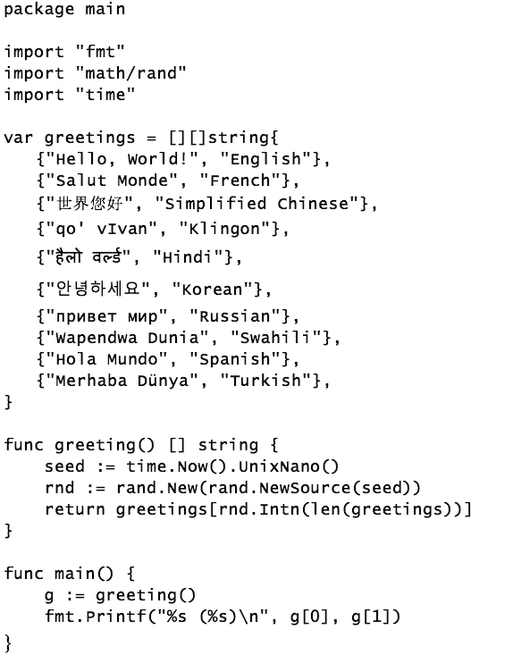
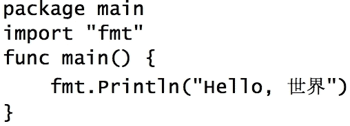
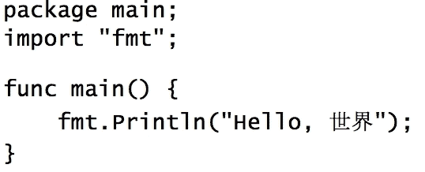
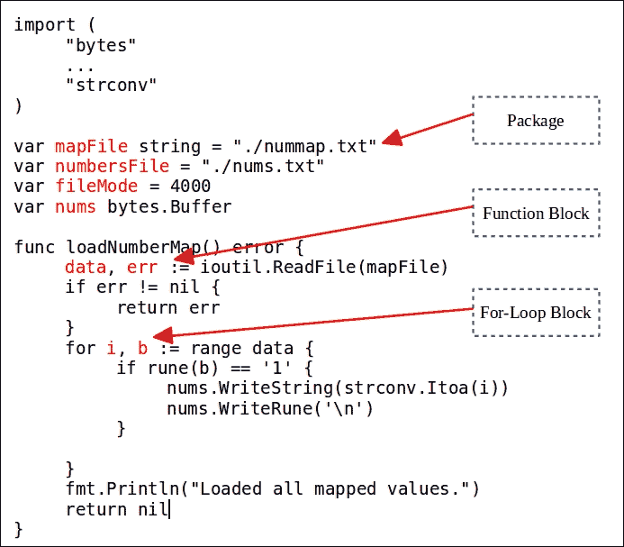

# 第二章：Go 语言基础

在前一章中，我们确定了使 Go 成为一个用于创建现代系统程序的优秀语言的基本特征。在本章中，我们将深入探讨语言的语法，以探索其组件和特性。

我们将涵盖以下主题：

+   Go 源文件

+   标识符

+   变量

+   常量

+   运算符

# Go 源文件

我们在第一章中看到了一些 Go 程序的例子。在本节中，我们将研究 Go 源文件。让我们考虑以下源代码文件（它以不同的语言打印了`"Hello World"`问候）：



golang.fyi/ch02/helloworld2.go

一个典型的 Go 源文件，比如前面列出的那个，可以分为三个主要部分，如下所示：

+   **包声明**：

```go
      //1 Package Clause 
      package main 

```

+   **导入声明**：

```go
      //2 Import Declaration 
      import "fmt" 
      import "math/rand" 
      import "time" 

```

+   **源代码主体**：

```go
      //3 Source Body 
      var greetings = [][]string{ 
        {"Hello, World!","English"}, 
        ... 
      } 

      func greeting() [] string { 
        ... 
      } 

      func main() { 
        ... 
      } 

```

**包**声明指示了这个源文件所属的包的名称（参见第六章，Go *包和程序*中对包组织的详细讨论）。**导入**声明列出了源代码希望使用的任何外部包。Go 编译器严格执行包声明的使用。在你的源文件中包含一个未使用的包被认为是一个错误（编译）。源文件的最后部分被认为是源文件的主体。在这里你声明变量、常量、类型和函数。

所有的 Go 源文件都必须以`.go`后缀结尾。一般来说，你可以随意命名一个 Go 源文件。与 Java 不同，例如，Go 文件名和其内容中声明的类型之间没有直接关联。然而，将文件命名为与其内容相关的名称被认为是一个良好的做法。

在我们更详细地探讨 Go 的语法之前，了解语言的一些基本结构元素是很重要的。虽然其中一些元素在语法上被固定在语言中，但其他一些只是简单的习惯和约定，你应该了解这些以使你对 Go 的介绍简单而愉快。

## 可选的分号

你可能已经注意到，Go 不需要分号作为语句分隔符。这是从其他更轻量级和解释性语言中借鉴来的特点。以下两个程序在功能上是等价的。第一个程序使用了典型的 Go，并省略了分号：



程序的第二个版本，如下所示，使用了多余的分号来显式终止其语句。虽然编译器可能会感谢你的帮助，但这在 Go 中并不是惯用法：



尽管 Go 中的分号是可选的，但 Go 的正式语法仍要求它们作为语句终止符。因此，Go 编译器会在以下以以下结尾的源代码行末尾插入分号：

+   一个标识符

+   字符串、布尔、数字或复数的文字值

+   控制流指令，比如 break、continue 或 return

+   一个闭括号，比如`)`、`}`或`]`

+   增量`++`或减量`--`运算符

由于这些规则，编译器强制执行严格的语法形式，这严重影响了 Go 中源代码的风格。例如，所有的代码块必须以与其前一个语句相同行的开放大括号`{`开始。否则，编译器可能会在破坏代码的位置插入分号，如下面的`if`语句所示：

```go
func main() { 
    if "a" == "a" 
    { 
      fmt.Println("Hello, World!") 
    } 
} 

```

将大括号移到下一行会导致编译器过早地插入分号，这将导致以下语法错误：

```go
$> ... missing condition in if statement ... 

```

这是因为编译器在 `if` 语句之后插入了分号（`if "a"=="a";`），使用了本节讨论的分号插入规则。您可以通过在 `if` 条件语句之后手动插入分号来验证这一点；您将得到相同的错误。这是一个很好的过渡到下一节的地方，讨论代码块中的尾随逗号。

## 多行

将表达式分解为多行必须遵循前一节讨论的分号规则。主要是，在多行表达式中，每一行必须以一个标记结尾，以防止过早插入分号，如下表所示。应该注意的是，表中具有无效表达式的行将无法编译：

| **表达式** | **有效** |
| --- | --- |

|

```go
lonStr := "Hello World! " +
"How are you?"

```

| 是的，`+` 运算符阻止了过早插入分号。 |
| --- |

|

```go
lonStr := "Hello World! "
+ "How are you?"

```

| 不，第一行后会插入一个分号，语义上会断开这一行。 |
| --- |

|

```go
fmt.Printf("[%s] %d %d %v",
str,
num1,
num2,
nameMap)

```

| 是的，逗号正确地断开了表达式。 |
| --- |

|

```go
fmt.Printf("[%s] %d %d %v",
str,
num1,
num2,
nameMap)

```

| 是的，编译器只在最后一行后插入了一个分号。 |
| --- |

|

```go
weekDays := []string{
"Mon", "Tue",
"Wed", "Thr",
"Fri"
}

```

| 不，`Fri` 行导致了过早插入分号。 |
| --- |

|

```go
weekDays2 := []string{
"Mon", "Tue",
"Wed", "Thr",
"Fri",
}

```

| 是的，`Fri` 行包含了一个尾随逗号，这导致编译器在下一行插入了一个分号。 |
| --- |
| `weekDays1 := []string{``"Mon", "Tue",``"Wed", "Thr",``"Fri"}` | 是的，在闭括号后的那一行会插入分号。 |

您可能会想为什么 Go 编译器要求开发人员提供换行提示来指示语句的结束。当然，Go 的设计者本可以设计一个复杂的算法来自动解决这个问题。是的，他们可以。然而，通过保持语法简单和可预测，编译器能够快速解析和编译 Go 源代码。

### 注意

Go 工具链包括 gofmt 工具，可以用于一致地应用正确的格式规则到您的源代码。还有 `govet` 工具，它通过分析代码元素的结构问题，可以更深入地分析您的代码。

# Go 标识符

Go 标识符用于命名程序元素，包括包、变量、函数和类型。以下总结了 Go 中标识符的一些属性：

+   标识符支持 Unicode 字符集

+   标识符的第一个位置必须是字母或下划线

+   惯用的 Go 喜欢混合大小写（驼峰命名）

+   包级别的标识符必须在给定包中是唯一的

+   标识符必须在代码块（函数、控制语句）内是唯一的

## 空白标识符

Go 编译器对于变量或包的声明标识符的使用特别严格。基本规则是：*你声明了它，你必须使用它*。如果您尝试编译带有未使用的标识符（如变量或命名包）的代码，编译器将不会满意并且编译失败。

Go 允许您使用空白标识符（表示为 `_`（下划线）字符）关闭此行为。使用空白标识符的任何声明或赋值都不绑定到任何值，并且在编译时会被忽略。空白标识符通常用于以下两个上下文中，如下一小节中所列出的。

## 消除包导入

当包声明之前有一个下划线时，编译器允许声明该包而不需要进一步引用：

```go
import "fmt" 
import "path/filepath" 
import _ "log" 

```

在前面的代码片段中，包 `log` 将在代码中没有进一步引用的情况下被消除。这在开发新代码时可能是一个方便的功能，开发人员可能希望尝试新的想法，而不必不断地注释或删除声明。尽管具有空白标识符的包不绑定到任何引用，但 Go 运行时仍会初始化它。第六章，*Go 包和程序*，讨论了包初始化的生命周期。

## 消除不需要的函数结果

当 Go 函数调用返回多个值时，返回列表中的每个值都必须分配给一个变量标识符。然而，在某些情况下，可能希望消除返回列表中不需要的结果，同时保留其他结果，如下所示：

```go
_, execFile := filepath.Split("/opt/data/bigdata.txt")
```

先前对函数`filepath.Split("/opt/data/bigdata.txt")`的调用接受一个路径并返回两个值：第一个是父路径（`/opt/data`），第二个是文件名（`bigdata.txt`）。第一个值被分配给空白标识符，因此未绑定到命名标识符，这导致编译器忽略它。在未来的讨论中，我们将探讨这种习惯用法在其他上下文中的其他用途，比如错误处理和`for`循环。

## 内置标识符

Go 带有许多内置标识符。它们属于不同的类别，包括类型、值和内置函数。

### 类型

以下标识符用于 Go 的内置类型：

| **类别** | **标识符** |
| --- | --- |
| 数字 | `byte`，`int`，`int8`，`int16`，`int32`，`int64`，`rune`，`uint`，`uint8`，`uint16`，`uint32`，`uint64`，`float32`，`float64`，`complex64`，`complex128`，`uintptr` |
| 字符串 | `string` |
| 布尔 | `bool` |
| 错误 | `error` |

### 值

这些标识符具有预分配的值：

| **类别** | **标识符** |
| --- | --- |
| 布尔常量 | `true`，`false` |
| 常量计数器 | `iota` |
| 未初始化值 | `nil` |

### 函数

以下函数作为 Go 的内置预声明标识符的一部分可用：

| **类别** | **标识符** |
| --- | --- |
| 初始化 | `make()`，`new()` |
| 集合 | `append()`，`cap()`，`copy()`，`delete()` |
| 复数 | `complex()`，`imag()`，`real()` |
| 错误处理 | `panic()`，`recover()` |

# Go 变量

Go 是一种严格类型的语言，这意味着所有变量都是绑定到值和类型的命名元素。正如你将看到的，它的语法的简单性和灵活性使得在 Go 中声明和初始化变量更像是一种动态类型的语言。

## 变量声明

在 Go 中使用变量之前，必须使用命名标识符声明它以便在代码中将来引用。在 Go 中变量声明的长格式遵循以下格式：

```go
*var <identifier list> <type>*

```

`var`关键字用于声明一个或多个变量标识符，后面跟着变量的类型。以下源代码片段显示了一个缩写程序，其中声明了几个变量，这些变量在`main()`函数之外声明：

```go
package main 

import "fmt" 

var name, desc string 
var radius int32 
var mass float64 
var active bool 
var satellites []string 

func main() { 
  name = "Sun" 
  desc = "Star" 
  radius = 685800 
  mass = 1.989E+30 
  active = true 
  satellites = []string{ 
    "Mercury", 
    "Venus", 
    "Earth", 
    "Mars", 
    "Jupiter", 
    "Saturn", 
    "Uranus", 
    "Neptune", 
  } 
  fmt.Println(name) 
  fmt.Println(desc) 
  fmt.Println("Radius (km)", radius) 
  fmt.Println("Mass (kg)", mass) 
  fmt.Println("Satellites", satellites) 
} 

```

golang.fyi/ch02/vardec1.go

## 零值

先前的源代码显示了使用各种类型声明变量的几个示例。然后在`main()`函数内为变量赋值。乍一看，这些声明的变量在声明时似乎没有被赋值。这将与我们先前的断言相矛盾，即所有 Go 变量都绑定到类型和值。

我们如何声明一个变量而不将值绑定到它？在变量声明期间，如果没有提供值，Go 将自动将默认值（或零值）绑定到变量以进行适当的内存初始化（我们稍后将看到如何在一个表达式中进行声明和初始化）。

以下表格显示了 Go 类型及其默认零值：

| **类型** | **零值** |
| --- | --- |
| `string` | `""`（空字符串） |
| 数字 - 整数：`byte`，`int`，`int8`，`int16`，`int32`，`int64`，`rune`，`uint`，`uint8`，`uint16`，`uint32`，`uint64`，`uintptr` | 0 |
| 数字 - 浮点数：`float32`，`float64` | 0.0 |
| `bool` | false |
| `Array` | 每个索引位置都有一个与数组元素类型相对应的零值。 |
| `Struct` | 一个空的`struct`，每个成员都具有其相应的零值。 |
| 其他类型：接口、函数、通道、切片、映射和指针 | nil |

## 初始化声明

如前所述，Go 还支持使用以下格式将变量声明和初始化组合为一个表达式：

*var <标识符列表> <类型> = <值列表或初始化表达式>*

这种声明格式具有以下特性：

+   等号左侧提供的标识符列表（后跟类型）

+   右侧有匹配的逗号分隔值列表

+   赋值按标识符和值的相应顺序进行

+   初始化表达式必须产生匹配的值列表

以下是声明和初始化组合的简化示例：

```go
var name, desc string = "Earth", "Planet" 
var radius int32 = 6378 
var mass float64 = 5.972E+24 
var active bool = true 
var satellites = []string{ 
  "Moon", 
} 

```

golang.fyi/ch02/vardec2.go

## 省略变量类型

到目前为止，我们已经讨论了 Go 的变量声明和初始化的长格式。为了使语言更接近其动态类型的表亲，可以省略类型规范，如下所示：

*var <标识符列表> = <值列表或初始化表达式>*

在编译期间，编译器根据等号右侧的赋值或初始化表达式推断变量的类型，如下例所示。

```go
var name, desc = "Mars", "Planet" 
var radius = 6755 
var mass = 641693000000000.0 
var active = true 
var satellites = []string{ 
  "Phobos", 
  "Deimos", 
} 

```

golang.fyi/ch02/vardec3.go

如前所述，当变量被赋值时，必须同时接收一个类型和该值。当省略变量的类型时，类型信息是从分配的值或表达式的返回值中推断出来的。以下表格显示了给定文字值时推断出的类型：

| **文字值** | **推断类型** |
| --- | --- |
| 双引号或单引号（原始）文本：`"火星行星"``"所有行星都围绕太阳运转。"` | `string` |
| 整数：`-76`0`1244``1840` | `int` |
| 小数：`-0.25``4.0``3.1e4``7e-12` | `float64` |
| 复数：`-5.0i``3i``(0+4i)` | `complex128` |
| 布尔值：`true``false` | `bool` |
| 数组值：`[2]int{-76, 8080}` | 在文字值中定义的`数组`类型。在这种情况下是：`[2]int` |
| 映射值：`map[string]int{``  "Sun": 685800,``  "Earth": 6378,``  "Mars": 3396,``}` | 在文字值中定义的映射类型。在这种情况下是：`map[string]int` |
| 切片值：`[]int{-76, 0, 1244, 1840}` | 在文字值中定义的`切片`类型：`[]int` |
| 结构值：`struct{``  name string``  diameter int}``{``  "Mars", 3396,``}` | 在文字值中定义的`结构`类型。在这种情况下，类型是：`struct{name string; diameter int}` |
| 函数值：`var sqr = func (v int)   int {``  return v * v``}` | 在函数定义文字中定义的函数类型。在这种情况下，变量`sqr`的类型将是：`func (v int) int` |

## 短变量声明

Go 可以进一步减少变量声明语法，使用*短变量声明*格式。在这种格式中，声明不再使用 var 关键字和类型规范，而是使用赋值运算符`:=`（冒号等于），如下所示：

*<标识符列表> := <值列表或初始化表达式>*

这是一个简单而清晰的习惯用语，在 Go 中声明变量时通常使用。以下代码示例显示了短变量声明的用法：

```go
func main() { 
    name := "Neptune" 
    desc := "Planet" 
    radius := 24764 
    mass := 1.024e26 
    active := true 
    satellites := []string{ 
         "Naiad", "Thalassa", "Despina", "Galatea", "Larissa", 
     "S/2004 N 1", "Proteus", "Triton", "Nereid", "Halimede", 
         "Sao", "Laomedeia", "Neso", "Psamathe", 
    } 
... 
} 

```

golang.fyi/ch02/vardec4.go

请注意，关键字`var`和变量类型在声明中被省略。短变量声明使用了先前讨论的相同机制来推断变量的类型。

## 短变量声明的限制

为了方便起见，变量声明的简短形式确实带有一些限制，您应该注意以避免混淆：

+   首先，它只能在函数块内使用

+   赋值运算符`:=`，声明变量并赋值

+   `:=`不能用于更新先前声明的变量

+   变量的更新必须使用等号

尽管这些限制可能有其根源于 Go 语法的简单性的理由，但它们通常被视为对语言新手的一个困惑来源。例如，冒号等号运算符不能与包级别的变量赋值一起使用。学习 Go 的开发人员可能会发现使用赋值运算符来更新变量是一种诱人的方式，但这将导致编译错误。

## 变量作用域和可见性

Go 使用基于代码块的词法作用域来确定包内变量的可见性。根据变量声明的位置在源文本中，将确定其作用域。一般规则是，变量只能在声明它的块内访问，并对所有嵌套的子块可见。

以下截图说明了在源文本中声明的几个变量的作用域（`package`，`function`，`for`循环和`if...else`块）：



golang.fyi/ch02/makenums.go

如前所述，变量的可见性是自上而下的。包范围的变量，如`mapFile`和`numbersFile`，对包中的所有其他元素都是全局可见的。向下移动作用域梯级，函数块变量，如`data`和`err`，对函数中的所有元素以及包括子块在内的所有元素都是可见的。内部`for`循环块中的变量`i`和`b`只在该块内可见。一旦循环结束，`i`和`b`就会超出作用域。

### 注意

对于 Go 的新手来说，包范围变量的可见性是一个令人困惑的问题。当一个变量在包级别（在函数或方法块之外）声明时，它对整个包都是全局可见的，而不仅仅是变量声明的源文件。这意味着包范围的变量标识符只能在组成包的文件组中声明一次，这一点对于刚开始使用 Go 的开发人员可能并不明显。有关包组织的详细信息，请参阅第六章，“Go 包和程序”。

## 变量声明块

Go 的语法允许将顶级变量的声明组合到块中，以提高可读性和代码组织性。以下示例展示了使用变量声明块重写先前示例的方式：

```go
var ( 
  name string = "Earth" 
  desc string = "Planet" 
  radius int32 = 6378 
  mass float64 = 5.972E+24 
  active bool = true 
  satellites []string   
) 

```

golang.fyi/ch02/vardec5.go

# Go 常量

在 Go 中，常量是具有文字表示的值，例如文本字符串，布尔值或数字。常量的值是静态的，不能在初始赋值后更改。尽管它们所代表的概念很简单，但常量具有一些有趣的属性，使它们在处理数值时特别有用。

## 常量文字

常量是可以用语言中的文本文字表示的值。常量最有趣的一个属性是它们的文字表示可以被视为有类型或无类型的值。与变量不同，常量可以以无类型值的形式存储在内存空间中。没有类型约束，例如，数值常量值可以以极高的精度存储。

以下是可以在 Go 中表示的有效常量文字值的示例：

```go
"Mastering Go" 
'G' 
false 
111009 
2.71828 
94314483457513374347558557572455574926671352 1e+500 
5.0i 

```

## 有类型的常量

Go 常量值可以使用常量声明绑定到命名标识符。与变量声明类似，Go 使用`const`关键字来指示常量的声明。但是，与变量不同，声明必须包括要绑定到标识符的文字值，如下所示：

*const <标识符列表> 类型 = <值列表或初始化表达式>*

常量不能有任何需要运行时解析的依赖关系。编译器必须能够在编译时解析常量的值。这意味着所有常量必须声明并用值文字（或导致常量值的表达式）初始化。

以下代码片段显示了一些已声明的有类型常量：

```go
const a1, a2 string = "Mastering", "Go" 
const b rune = 'G' 
const c bool = false 
const d int32 = 111009 
const e float32 = 2.71828 
const f float64 = math.Pi * 2.0e+3 
const g complex64 = 5.0i 
const h time.Duration = 4 * time.Second 

```

golang.fyi/ch02/const.go

请注意在前面的源代码片段中，每个声明的常量标识符都明确给出了一个类型。正如您所期望的那样，这意味着常量标识符只能在与其类型兼容的上下文中使用。然而，下一节将解释当常量声明中省略类型时，这是如何工作的。

## 无类型常量

当无类型常量时，常量声明如下：

*const <标识符列表> = <值列表或初始化表达式>*

与以前一样，关键字`const`用于声明一系列标识符作为常量以及它们的相应的边界值。然而，在这种格式中，类型规范在声明中被省略。作为一个无类型实体，常量只是内存中的一块字节，没有任何类型精度限制。以下显示了一些无类型常量的示例声明：

```go
const i = "G is" + " for Go " 
const j = 'V' 
const k1, k2 = true, !k1 
const l = 111*100000 + 9 
const m1 = math.Pi / 3.141592 
const m2 = 1.414213562373095048801688724209698078569671875376... 
const m3 = m2 * m2 
const m4 = m3 * 1.0e+400 
const n = -5.0i * 3 
const o = time.Millisecond * 5 

```

golang.fyi/ch02/const.go

从前面的代码片段中，无类型常量`m2`被分配了一个长的十进制值（截断以适应打印页面，因为它还有另外 17 位数字）。常量`m4`被分配了一个更大的数字`m3 x 1.0e+400`。生成常量的整个值存储在内存中，没有任何精度损失。这对于对精度要求很高的计算感兴趣的开发人员来说可能是一个非常有用的工具。

## 分配无类型常量

无类型常量值在分配给变量、用作函数参数或作为分配给变量的表达式的一部分之前是有限的。在像 Go 这样的强类型语言中，这意味着可能需要进行一些类型调整，以确保存储在常量中的值可以正确地分配给目标变量。使用无类型常量的一个优点是，类型系统放宽了对类型检查的严格应用。无类型常量可以被分配给不同但兼容的不同精度的类型，而不会引起编译器的任何投诉，如下例所示：

```go
const m2 = 1.414213562373095048801688724209698078569671875376... 
var u1 float32 = m2 
var u2 float64 = m2 
u3 := m2 

```

前面的代码片段显示了无类型常量`m2`被分配给两个不同浮点精度的变量`u1`和`u2`，以及一个无类型变量`u3`。这是可能的，因为常量`m2`被存储为一个原始的无类型值，因此可以分配给与其表示兼容的任何变量（一个浮点数）。

虽然类型系统将容纳`m2`分配给不同精度的变量，但所得到的分配将被调整以适应变量类型，如下所示：

```go
u1 = 1.4142135      //float32 
u2 = 1.4142135623730951   //float64 

```

那么变量`u3`呢，它本身是一个无类型变量？由于`u3`没有指定类型，它将依赖于常量值的类型推断来接收类型分配。回想一下之前在*省略变量类型*部分的讨论，常量文字根据它们的文本表示映射到基本的 Go 类型。由于常量`m2`表示一个十进制值，编译器将推断其默认为`float64`，这将自动分配给变量`u3`，如下所示：

```go
U3 = 1.4142135623730951  //float64 

```

正如您所看到的，Go 对无类型原始常量文字的处理通过自动应用一些简单但有效的类型推断规则，增加了语言的可用性，而不会牺牲类型安全性。与其他语言不同，开发人员不必在值文字中明确指定类型或执行某种类型转换来使其工作。

## 常量声明块

正如您可能已经猜到的那样，常量声明可以组织为代码块以增加可读性。前面的示例可以重写如下：

```go
const ( 
  a1, a2 string        = "Mastering", "Go" 
  b      rune          = 'G' 
  c      bool          = false 
  d      int32         = 111009 
  e      float32       = 2.71828 
  f      float64       = math.Pi * 2.0e+3 
  g      complex64     = 5.0i 
  h      time.Duration = 4 * time.Second 
... 
) 

```

golang.fyi/ch02/const2.go

## 常量枚举

常量的一个有趣用法是创建枚举值。使用声明块格式（在前面的部分中显示），您可以轻松地创建数字递增的枚举整数值。只需将预先声明的常量值`iota`分配给声明块中的常量标识符，如下面的代码示例所示：

```go
const ( 
  StarHyperGiant = iota 
  StarSuperGiant 
  StarBrightGiant 
  StarGiant 
  StarSubGiant 
  StarDwarf 
  StarSubDwarf 
  StarWhiteDwarf 
  StarRedDwarf 
  StarBrownDwarf 
) 

```

golang.fyi/ch02/enum0.go

然后编译器会自动执行以下操作：

+   将块中的每个成员声明为无类型整数常量值

+   用值 0 初始化`iota`

+   将`iota`或零分配给第一个常量成员（`StarHyperGiant`）

+   每个后续常量都被分配一个增加了一的`int`值

因此，以前的常量列表将被分配一个从零到九的值序列。每当`const`出现为声明块时，它将计数器重置为零。在下面的代码片段中，每组常量都分别从零到四进行枚举：

```go
const ( 
  StarHyperGiant = iota 
  StarSuperGiant 
  StarBrightGiant 
  StarGiant 
  StarSubGiant 
) 
const ( 
  StarDwarf = iota 
  StarSubDwarf 
  StarWhiteDwarf 
  StarRedDwarf 
  StarBrownDwarf 
) 

```

golang.fyi/ch02/enum1.go

## 覆盖默认枚举类型

默认情况下，枚举常量被声明为无类型整数值。但是，您可以通过为枚举常量提供显式数字类型来覆盖枚举值的默认类型，如下面的代码示例所示：

```go
const ( 
  StarDwarf byte = iota 
  StarSubDwarf 
  StarWhiteDwarf 
  StarRedDwarf 
  StarBrownDwarf 
) 

```

您可以指定可以表示整数或浮点值的任何数字类型。例如，在前面的代码示例中，每个常量将被声明为类型`byte`。

## 在表达式中使用 iota

当`iota`出现在表达式中时，相同的机制会按预期工作。编译器将对每个递增的`iota`值应用表达式。以下示例将偶数分配给常量声明块的枚举成员：

```go
const ( 
  StarHyperGiant = 2.0*iota 
  StarSuperGiant 
  StarBrightGiant 
  StarGiant 
  StarSubGiant 
) 

```

golang.fyi/ch02/enum2.go

正如您所期望的那样，前面的示例为每个枚举常量分配了一个偶数值，从 0 开始，如下面的输出所示：

```go
 StarHyperGiant = 0    [float64]
    StarSuperGiant = 2    [float64]
    StarBrightGiant = 4   [float64]
    StarGiant = 6         [float64]
    StarSubGiant = 8      [float64] 

```

## 跳过枚举值

在使用枚举常量时，您可能希望丢弃不应成为枚举一部分的某些值。这可以通过将 iota 分配给枚举中所需位置的空白标识符来实现。例如，以下内容跳过了值 0 和`64`：

```go
_              = iota    // value 0 
StarHyperGiant = 1 << iota 
StarSuperGiant 
StarBrightGiant 
StarGiant 
StarSubGiant 
_          // value 64 
StarDwarf 
StarSubDwarf 
StarWhiteDwarf 
StarRedDwarf 
StarBrownDwarf 

```

golang.fyi/ch02/enum3.go

由于我们跳过了`iota`位置`0`，第一个分配的常量值位于位置`1`。这导致表达式`1 << iota`解析为`1 << 1 = 2`。在第六个位置也是同样的情况，表达式`1 << iota`返回`64`。该值将被跳过，不会被分配给任何常量，如下面的输出所示：

```go
 StarHyperGiant = 2
    StarSuperGiant = 4
    StarBrightGiant = 8
    StarGiant = 16
    StarSubGiant = 32
    StarDwarf = 128
    StarSubDwarf = 256
    StarWhiteDwarf = 512
    StarRedDwarf = 1024
    StarBrownDwarf = 2048 

```

# Go 运算符

忠实于其简单的本质，Go 中的运算符确切地执行您所期望的操作，主要是允许操作数组合成表达式。与 C++或 Scala 中发现的运算符重载不同，Go 运算符没有隐藏的意外行为。这是设计者故意做出的决定，以保持语言的语义简单和可预测。

本节探讨了您在开始使用 Go 时会遇到的最常见的运算符。其他运算符将在本书的其他章节中介绍。

## 算术运算符

以下表总结了 Go 中支持的算术运算符。

| **运算符** | **操作** | **兼容类型** |
| --- | --- | --- |
| `*`，`/`，`-` | 乘法，除法和减法 | 整数，浮点数和复数 |
| `%` | 余数 | 整数 |
| 加法 | 整数，浮点数，复数和字符串（连接） |

请注意，加法运算符`+`可以应用于字符串，例如表达式`var i = "G is" + " for Go"`。这两个字符串操作数被连接以创建一个新的字符串，该字符串被分配给变量`i`。

## 增量和减量运算符

与其他类似 C 的语言一样，Go 支持`++`（增量）和`--`（减量）运算符。当应用时，这些运算符分别增加或减少操作数的值。以下是一个使用减量运算符以相反顺序遍历字符串 s 中的字母的函数示例：

```go
func reverse(s string) { 
  for i := len(s) - 1; i >= 0; { 
    fmt.Print(string(s[i])) 
    i-- 
  } 
} 

```

重要的是要注意，增量和减量运算符是语句，而不是表达式，如下面的示例所示：

```go
nextChar := i++       // syntax error 
fmt.Println("Current char", i--)   // syntax error 
nextChar++        // OK 

```

在前面的示例中，值得注意的是增量和减量语句只支持后缀表示法。以下代码段不会编译，因为有语句-`i`：

```go
for i := len(s) - 1; i >= 0; { 
  fmt.Print(string(s[i])) 
  --i   //syntax error 
} 

```

## Go 赋值运算符

| **运算符** | **描述** |
| --- | --- |
| `=` | 简单赋值按预期工作。它使用右侧的值更新左侧的操作数。 |
| `:=` | 冒号等号运算符声明一个新变量，左侧操作数，并将其赋值为右侧操作数的值（和类型）。 |
| `+=`, `-=`, `*=`, `/=`, `%=` | 使用左操作数和右操作数应用指定的操作，并将结果存储在左操作数中。例如，`a *= 8`意味着`a = a * 8`。 |

## 位运算符

Go 包括对操作值的最基本形式的完全支持。以下总结了 Go 支持的位运算符：

| **运算符** | **描述** |
| --- | --- |
| `&` | 位与 |
| `&#124;` | 位或 |
| `a ^ b` | 位异或 |
| `&^` | 位清空 |
| `^a` | 一元位补码 |
| `<<` | 左移 |
| 右移 |

在移位操作中，右操作数必须是无符号整数或能够转换为无符号值。当左操作数是无类型常量值时，编译器必须能够从其值中推导出有符号整数类型，否则将无法通过编译。

Go 中的移位运算符也支持算术和逻辑移位。如果左操作数是无符号的，Go 会自动应用逻辑移位，而如果它是有符号的，Go 将应用算术移位。

## 逻辑运算符

以下是关于布尔值的 Go 逻辑操作的列表：

| **运算符** | **操作** |
| --- | --- |
| `&&` | 逻辑与 |
| `&#124;&#124;` | 逻辑或 |
| `!` | 逻辑非 |

## 比较运算符

所有 Go 类型都可以进行相等性测试，包括基本类型和复合类型。然而，只有字符串、整数和浮点值可以使用排序运算符进行比较，如下表所总结的：

| **运算符** | **操作** | **支持的类型** |
| --- | --- | --- |
| `==` | 相等 | 字符串、数字、布尔、接口、指针和结构类型 |
| `!=` | 不等 | 字符串、数字、布尔、接口、指针和结构类型 |
| `<`, `<=`, `>`, `>=` | 排序运算符 | 字符串、整数和浮点数 |

## 运算符优先级

由于 Go 的运算符比 C 或 Java 等语言中的运算符要少，因此其运算符优先级规则要简单得多。以下表格列出了 Go 的运算符优先级，从最高开始：

| **操作** | **优先级** |
| --- | --- |
| 乘法 | `*`, `/`, `%`, `<<`, `>>`, `&`, `&^` |
| 加法 | `+`, `-`, `&#124;`, `^` |
| 比较 | `==`, `!=`, `<`, `<=`, `>`, `>=` |
| 逻辑与 | `&&` |
| 逻辑或 | `&#124;&#124;` |

# 总结

本章涵盖了 Go 语言的基本构造的许多内容。它从 Go 源代码文本文件的结构开始，并逐步介绍了变量标识符、声明和初始化。本章还广泛介绍了 Go 常量、常量声明和运算符。

此时，您可能会对语言及其语法的如此多的基本信息感到有些不知所措。好消息是，您不必了解所有这些细节才能有效地使用该语言。在接下来的章节中，我们将继续探讨关于 Go 的一些更有趣的部分，包括数据类型、函数和包。
