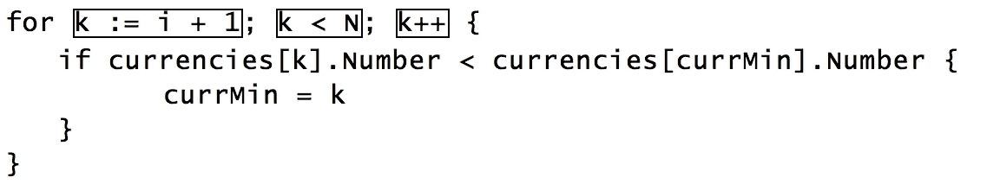

# 第三章。Go 控制流

Go 从 C 语言家族中借用了几种控制流语法。它支持所有预期的控制结构，包括 if...else、switch、for 循环，甚至 goto。然而，明显缺少的是 while 或 do...while 语句。本章中的以下主题将讨论 Go 的控制流元素，其中一些您可能已经熟悉，而其他一些则带来了其他语言中没有的一组新功能：

+   if 语句

+   switch 语句

+   类型 Switch

+   for 语句

# if 语句

在 Go 中，if 语句从其他类似 C 的语言中借用了其基本结构形式。当跟随 if 关键字的布尔表达式求值为 true 时，该语句有条件地执行代码块，如下面简化的程序所示，该程序显示有关世界货币的信息：

```go
import "fmt" 

type Currency struct { 
  Name    string 
  Country string 
  Number  int 
} 

var CAD = Currency{ 
    Name: "Canadian Dollar",  
    Country: "Canada",  
    Number: 124} 

var FJD = Currency{ 
    Name: "Fiji Dollar",  
    Country: "Fiji",  
    Number: 242} 

var JMD = Currency{ 
    Name: "Jamaican Dollar",  
    Country: "Jamaica",  
    Number: 388} 

var USD = Currency{ 
    Name: "US Dollar",  
    Country: "USA",  
    Number: 840} 

func main() { 
  num0 := 242 
  if num0 > 100 || num0 < 900 { 
    fmt.Println("Currency: ", num0) 
    printCurr(num0) 
  } else { 
    fmt.Println("Currency unknown") 
  } 

  if num1 := 388; num1 > 100 || num1 < 900 { 
    fmt.Println("Currency:", num1) 
    printCurr(num1) 
  } 
} 

func printCurr(number int) { 
  if CAD.Number == number { 
    fmt.Printf("Found: %+v\n", CAD) 
  } else if FJD.Number == number { 
    fmt.Printf("Found: %+v\n", FJD) 
  } else if JMD.Number == number { 
    fmt.Printf("Found: %+v\n", JMD) 
  } else if USD.Number == number { 
    fmt.Printf("Found: %+v\n", USD) 
  } else { 
    fmt.Println("No currency found with number", number) 
  } 
} 

```

golang.fyi/ch03/ifstmt.go

Go 中的 if 语句看起来与其他语言相似。但是，它摒弃了一些语法规则，同时强制执行了一些新规则：

+   在测试表达式周围的括号是不必要的。虽然以下 if 语句将编译，但这不是惯用法：

```go
      if (num0 > 100 || num0 < 900) { 
        fmt.Println("Currency: ", num0) 
        printCurr(num0) 
      } 

```

+   使用以下代替：

```go
      if num0 > 100 || num0 < 900 { 
        fmt.Println("Currency: ", num0) 
        printCurr(num0) 
      } 

```

+   代码块的大括号始终是必需的。以下代码片段将无法编译：

```go
      if num0 > 100 || num0 < 900 printCurr(num0) 

```

+   然而，这将编译通过：

```go
      if num0 > 100 || num0 < 900 {printCurr(num0)} 

```

+   然而，惯用的、更清晰的编写 if 语句的方式是使用多行（无论语句块有多简单）。以下代码片段将无问题地编译通过：

```go
      if num0 > 100 || num0 < 900 {printCurr(num0)} 

```

+   然而，语句的首选惯用布局是使用多行，如下所示：

```go
      if num0 > 100 || num0 < 900 { 
        printCurr(num0) 
      }
```

+   if 语句可以包括一个可选的 else 块，当 if 块中的表达式求值为 false 时执行。else 块中的代码必须使用多行用大括号括起来，如下面的代码片段所示：

```go
      if num0 > 100 || num0 < 900 { 
        fmt.Println("Currency: ", num0) 
        printCurr(num0) 
      } else { 
        fmt.Println("Currency unknown") 
      } 

```

+   else 关键字后面可以紧接着另一个 if 语句，形成 if...else...if 链，就像前面列出的源代码中的 printCurr()函数中使用的那样：

```go
      if CAD.Number == number { 
        fmt.Printf("Found: %+v\n", CAD) 
      } else if FJD.Number == number { 
        fmt.Printf("Found: %+v\n", FJD) 
      } 

```

if...else...if 语句链可以根据需要增加，并且可以通过可选的 else 语句来终止，以表达所有其他未经测试的条件。同样，这是在 printCurr()函数中完成的，该函数使用 if...else...if 块测试四个条件。最后，它包括一个 else 语句块来捕获任何其他未经测试的条件：

```go
func printCurr(number int) { 
  if CAD.Number == number { 
    fmt.Printf("Found: %+v\n", CAD) 
  } else if FJD.Number == number { 
    fmt.Printf("Found: %+v\n", FJD) 
  } else if JMD.Number == number { 
    fmt.Printf("Found: %+v\n", JMD) 
  } else if USD.Number == number { 
    fmt.Printf("Found: %+v\n", USD) 
  } else { 
    fmt.Println("No currency found with number", number) 
  } 
}
```

然而，在 Go 中，编写这样深层 if...else...if 代码块的惯用且更清晰的方式是使用无表达式的 switch 语句。这将在*Switch 语句*部分中介绍。

## if 语句初始化

if 语句支持复合语法，其中被测试的表达式前面有一个初始化语句。在运行时，初始化在评估测试表达式之前执行，如前面列出的程序中所示：

```go
if num1 := 388; num1 > 100 || num1 < 900 { 
  fmt.Println("Currency:", num1) 
  printCurr(num1) 
}  

```

初始化语句遵循正常的变量声明和初始化规则。初始化变量的作用域绑定到 if 语句块，超出该范围后就无法访问。这是 Go 中常用的习惯用法，并且在本章中涵盖的其他流程控制结构中也得到支持。

# Switch 语句

Go 还支持类似于 C 或 Java 等其他语言中的 switch 语句。Go 中的 switch 语句通过评估 case 子句中的值或表达式来实现多路分支，如下面简化的源代码所示：

```go
import "fmt" 

type Curr struct { 
  Currency string 
  Name     string 
  Country  string 
  Number   int 
} 

var currencies = []Curr{ 
  Curr{"DZD", "Algerian Dinar", "Algeria", 12}, 
  Curr{"AUD", "Australian Dollar", "Australia", 36}, 
  Curr{"EUR", "Euro", "Belgium", 978}, 
  Curr{"CLP", "Chilean Peso", "Chile", 152}, 
  Curr{"EUR", "Euro", "Greece", 978}, 
  Curr{"HTG", "Gourde", "Haiti", 332}, 
  ... 
} 

func isDollar(curr Curr) bool { 
  var bool result 
  switch curr { 
  default: 
    result = false 
  case Curr{"AUD", "Australian Dollar", "Australia", 36}: 
    result = true 
  case Curr{"HKD", "Hong Kong Dollar", "Hong Koong", 344}: 
    result = true 
  case Curr{"USD", "US Dollar", "United States", 840}: 
    result = true 
  } 
  return result 
} 
func isDollar2(curr Curr) bool { 
  dollars := []Curr{currencies[2], currencies[6], currencies[9]} 
  switch curr { 
  default: 
    return false 
  case dollars[0]: 
    fallthrough 
  case dollars[1]: 
    fallthrough 
  case dollars[2]: 
    return true 
  } 
  return false 
} 

func isEuro(curr Curr) bool { 
  switch curr { 
  case currencies[2], currencies[4], currencies[10]: 
    return true 
  default: 
    return false 
  } 
} 

func main() { 
  curr := Curr{"EUR", "Euro", "Italy", 978} 
  if isDollar(curr) { 
    fmt.Printf("%+v is Dollar currency\n", curr) 
  } else if isEuro(curr) { 
    fmt.Printf("%+v is Euro currency\n", curr) 
  } else { 
    fmt.Println("Currency is not Dollar or Euro") 
  } 
  dol := Curr{"HKD", "Hong Kong Dollar", "Hong Koong", 344} 
  if isDollar2(dol) { 
    fmt.Println("Dollar currency found:", dol) 
  } 
} 

```

golang.fyi/ch03/switchstmt.go

Go 中的 switch 语句具有一些有趣的属性和规则，使其易于使用和理解：

+   从语义上讲，Go 的 switch 语句可以在两个上下文中使用：

+   表达式 switch 语句

+   类型 switch 语句

+   break 语句可以用于提前跳出 switch 代码块。

+   当没有其他 case 表达式评估为匹配时，`switch`语句可以包括一个默认 case。只能有一个默认 case，并且可以放置在 switch 块的任何位置。

## 使用表达式开关

表达式开关是灵活的，可以在程序控制流需要遵循多个路径的许多上下文中使用。表达式开关支持许多属性，如下面的要点所述：

+   表达式开关可以测试任何类型的值。例如，以下代码片段（来自前面的程序清单）测试了类型为`struct`的变量`Curr`：

```go
      func isDollar(curr Curr) bool { 
        var bool result 
        switch curr { 
          default: 
          result = false 
          case Curr{"AUD", "Australian Dollar", "Australia", 36}: 
          result = true 
          case Curr{"HKD", "Hong Kong Dollar", "Hong Koong", 344}: 
          result = true 
          case Curr{"USD", "US Dollar", "United States", 840}: 
          result = true 
        } 
        return result 
      } 
```

+   `case`子句中的表达式从左到右、从上到下进行评估，直到找到与`switch`表达式相等的值（或表达式）为止。

+   遇到与`switch`表达式匹配的第一个 case 时，程序将执行`case`块的语句，然后立即退出`switch`块。与其他语言不同，Go 的`case`语句不需要使用`break`来避免下一个 case 的穿透（参见*Fallthrough cases*部分）。例如，调用`isDollar(Curr{"HKD", "Hong Kong Dollar", "Hong Kong", 344})`将匹配前面函数中的第二个`case`语句。代码将将结果设置为`true`并立即退出`switch`代码块。

+   `Case`子句可以有多个值（或表达式），用逗号分隔，它们之间隐含着逻辑`OR`运算符。例如，在以下片段中，`switch`表达式`curr`被测试与值`currencies[2]`、`currencies[4]`或`currencies[10]`，使用一个 case 子句，直到找到匹配：

```go
      func isEuro(curr Curr) bool { 
        switch curr { 
          case currencies[2], currencies[4], currencies[10]: 
          return true 
          default: 
          return false 
        } 
      } 

```

+   `switch`语句是在 Go 中编写复杂条件语句的更清晰和首选的惯用方法。当前面的片段与使用`if`语句进行相同比较时，这一点是明显的：

```go
      func isEuro(curr Curr) bool { 
        if curr == currencies[2] || curr == currencies[4],  
        curr == currencies[10]{ 
        return true 
      }else{ 
        return false 
      } 
    } 

```

## 穿透案例

在 Go 的`case`子句中没有自动的*穿透*，就像 C 或 Java 的`switch`语句中一样。回想一下，一个`switch`块在执行完第一个匹配的 case 后会退出。代码必须明确地将`fallthrough`关键字放在`case`块的最后一个语句，以强制执行流程穿透到连续的`case`块。以下代码片段显示了一个`switch`语句，其中每个 case 块都有一个`fallthrough`：

```go
func isDollar2(curr Curr) bool { 
  switch curr { 
  case Curr{"AUD", "Australian Dollar", "Australia", 36}: 
    fallthrough 
  case Curr{"HKD", "Hong Kong Dollar", "Hong Kong", 344}: 
    fallthrough 
  case Curr{"USD", "US Dollar", "United States", 840}: 
    return true 
  default: 
    return false 
  } 
} 

```

golang.fyi/ch03/switchstmt.go

当匹配到一个 case 时，`fallthrough`语句会级联到连续`case`块的第一个语句。因此，如果`curr = Curr{"AUD", "Australian Dollar", "Australia", 36}`，第一个 case 将被匹配。然后流程级联到第二个 case 块的第一个语句，这也是一个`fallthrough`语句。这导致第三个 case 块的第一个语句执行返回`true`。这在功能上等同于以下片段：

```go
switch curr {  
case Curr{"AUD", "Australian Dollar", "Australia", 36},  
     Curr{"HKD", "Hong Kong Dollar", "Hong Kong", 344},  
     Curr{"USD", "US Dollar", "United States", 840}:  
  return true 
default: 
   return false 
}  

```

## 无表达式的开关

Go 支持一种不指定表达式的`switch`语句形式。在这种格式中，每个`case`表达式必须评估为布尔值`true`。以下简化的源代码示例说明了无表达式`switch`语句的用法，如`find()`函数中所列。该函数循环遍历`Curr`值的切片，以根据传入的`struct`函数中的字段值搜索匹配项：

```go
import ( 
  "fmt" 
  "strings" 
) 
type Curr struct { 
  Currency string 
  Name     string 
  Country  string 
  Number   int 
} 

var currencies = []Curr{ 
  Curr{"DZD", "Algerian Dinar", "Algeria", 12}, 
  Curr{"AUD", "Australian Dollar", "Australia", 36}, 
  Curr{"EUR", "Euro", "Belgium", 978}, 
  Curr{"CLP", "Chilean Peso", "Chile", 152}, 
  ... 
} 

func find(name string) { 
  for i := 0; i < 10; i++ { 
    c := currencies[i] 
    switch { 
    case strings.Contains(c.Currency, name), 
      strings.Contains(c.Name, name), 
      strings.Contains(c.Country, name): 
      fmt.Println("Found", c) 
    } 
  } 
} 

```

golang.fyi/ch03/switchstmt2.go

请注意，在前面的示例中，函数`find()`中的`switch`语句不包括表达式。每个`case`表达式用逗号分隔，并且必须被评估为布尔值，每个之间隐含着`OR`运算符。前面的`switch`语句等同于以下使用`if`语句实现相同逻辑：

```go
func find(name string) { 
  for I := 0; i < 10; i++ { 
    c := currencies[i] 
    if strings.Contains(c.Currency, name) || 
      strings.Contains(c.Name, name) || 
      strings.Contains(c.Country, name){ 
      fmt.Println""Foun"", c) 
    } 
  } 
} 

```

## 开关初始化器

`switch`关键字后面可以紧跟一个简单的初始化语句，在其中可以声明和初始化`switch`代码块中的局部变量。这种方便的语法使用分号在初始化语句和`switch`表达式之间声明变量，这些变量可以出现在`switch`代码块的任何位置。以下代码示例显示了如何通过初始化两个变量`name`和`curr`来完成这个操作：

```go
func assertEuro(c Curr) bool {  
  switch name, curr := "Euro", "EUR"; {  
  case c.Name == name:  
    return true  
  case c.Currency == curr:  
    return true 
  }  
  return false  
} 

```

golang.fyi/ch03/switchstmt2.go

前面的代码片段使用了一个没有表达式的`switch`语句和一个初始化程序。注意分号表示初始化语句和`switch`表达式区域之间的分隔。然而，在这个例子中，`switch`表达式是空的。

## 类型开关

考虑到 Go 对强类型的支持，也许不足为奇的是，该语言支持查询类型信息的能力。类型`switch`是一种语句，它使用 Go 接口类型来比较值（或表达式）的底层类型信息。关于接口类型和类型断言的详细讨论超出了本节的范围。你可以在第八章*方法、接口和对象*中找到更多关于这个主题的细节。

尽管如此，为了完整起见，这里提供了关于类型开关的简短讨论。目前，你只需要知道的是，Go 提供了类型`interface{}`或空接口作为一个超类型，它由类型系统中的所有其他类型实现。当一个值被赋予类型`interface{}`时，可以使用类型`switch`来查询关于其底层类型的信息，如下面的代码片段中的函数`findAny()`所示：

```go
func find(name string) { 
  for i := 0; i < 10; i++ { 
    c := currencies[i] 
    switch { 
    case strings.Contains(c.Currency, name), 
      strings.Contains(c.Name, name), 
      strings.Contains(c.Country, name): 
      fmt.Println("Found", c) 
    } 
  } 
}  

func findNumber(num int) { 
  for _, curr := range currencies { 
    if curr.Number == num { 
      fmt.Println("Found", curr) 
    } 
  } 
}  

func findAny(val interface{}) {  
  switch i := val.(type) {  
  case int:  
    findNumber(i)  
  case string:  
    find(i)  
  default:  
    fmt.Printf("Unable to search with type %T\n", val)  
  }  
} 

func main() { 
findAny("Peso") 
  findAny(404) 
  findAny(978) 
  findAny(false) 
} 

```

golang.fyi/ch03/switchstmt2.go

函数`findAny()`以`interface{}`作为其参数。类型`switch`用于使用类型断言表达式确定变量`val`的底层类型和值：

```go
switch i := val.(type) 

```

请注意在前面的类型断言表达式中使用了关键字`type`。每个 case 子句将根据从`val.(type)`查询到的类型信息进行测试。变量`i`将被赋予底层类型的实际值，并用于调用具有相应值的函数。默认块被调用来防范对参数`val`分配的任何意外类型。然后，函数`findAny`可以使用不同类型的值进行调用，如下面的代码片段所示：

```go
findAny("Peso")  
findAny(404)  
findAny(978)  
findAny(false)  

```

# for 语句

作为与 C 家族相关的语言，Go 也支持`for`循环风格的控制结构。然而，正如你现在可能已经预料到的那样，Go 的`for`语句工作方式有趣地不同而简单。Go 中的`for`语句支持四种不同的习语，如下表所总结的：

| **For 语句** | **用法** |
| --- | --- |

条件为|用于语义上替代`while`和`do...while`循环：

```go
for x < 10 { 
... 
}

```

|

| 无限循环 | 可以省略条件表达式创建无限循环：

```go
for {
...
}
```

|

| 传统的 | 这是 C 家族`for`循环的传统形式，包括初始化、测试和更新子句：

```go
for x:=0; x < 10; x++ {
...
}
```

|

| For 范围 | 用于遍历表示存储在数组、字符串（rune 数组）、切片、映射和通道中的项目集合的表达式：

```go
for i, val := range values {
...
}
```

|

请注意，与 Go 中的所有其他控制语句一样，`for`语句不使用括号括住它们的表达式。循环代码块的所有语句必须用大括号括起来，否则编译器会产生错误。

## 对于条件

`for`条件使用了一个在其他语言中等价于`while`循环的构造。它使用关键字`for`，后面跟着一个布尔表达式，允许循环在评估为 true 时继续进行。以下是这种形式的`for`循环的缩写源代码清单示例：

```go
type Curr struct {  
  Currency string  
  Name     string  
  Country  string  
  Number   int  
}  
var currencies = []Curr{  
  Curr{"KES", "Kenyan Shilling", "Kenya", 404},  
  Curr{"AUD", "Australian Dollar", "Australia", 36},  
... 
} 

func listCurrs(howlong int) {  
  i := 0  
  for i < len(currencies) {  
    fmt.Println(currencies[i])  
    i++  
  }  
} 

```

golang.fyi/ch03/forstmt.go

在函数`listCurrs()`中，`for`语句循环迭代，只要条件表达式`i < len(currencencies)`返回`true`。必须小心确保`i`的值在每次迭代中都得到更新，以避免创建意外的无限循环。

## 无限循环

当`for`语句中省略布尔表达式时，循环将无限运行，如下例所示：

```go
for { 
  // statements here 
} 

```

这相当于在其他语言（如 C 或 Java）中找到的`for(;;)`或`while(true)`。

## 传统的 for 语句

Go 还支持传统形式的`for`语句，其中包括初始化语句、条件表达式和更新语句，所有这些都由分号分隔。这是传统上在其他类 C 语言中找到的语句形式。以下源代码片段说明了在函数`sortByNumber`中使用传统的 for 语句：

```go
type Curr struct {  
  Currency string  
  Name     string  
  Country  string  
  Number   int  
}  

var currencies = []Curr{  
  Curr{"KES", "Kenyan Shilling", "Kenya", 404},  
  Curr{"AUD", "Australian Dollar", "Australia", 36},  
... 
} 

func sortByNumber() {  
  N := len(currencies)  
  for i := 0; i < N-1; i++ {  
     currMin := i  
     for k := i + 1; k < N; k++ {  
    if currencies[k].Number < currencies[currMin].Number {  
         currMin = k  
    }  
     }  
     // swap  
     if currMin != i {  
        temp := currencies[i]  
    currencies[i] = currencies[currMin]  
    currencies[currMin] = temp  
     } 
  }  
} 

```

golang.fyi/ch03/forstmt.go

前面的例子实现了一个选择排序，它通过比较每个`struct`值的`Number`字段来对`slice` currencies 进行排序。`for`语句的不同部分使用以下代码片段进行了突出显示（来自前面的函数）：



事实证明，传统的`for`语句是迄今为止讨论的循环形式的超集，如下表所总结的那样：

| **For 语句** | **描述** |
| --- | --- |

|

```go
k:=initialize()
for ; k < 10; 
++{
...
}
```

| 初始化语句被省略。变量`k`在`for`语句之外被初始化。然而，惯用的方式是用`for`语句初始化你的变量。 |
| --- |

|

```go
for k:=0; k < 10;{
...
}
```

| 这里省略了`update`语句（在最后的分号之后）。开发人员必须在其他地方提供更新逻辑，否则会产生无限循环。 |
| --- |

|

```go
for ; k < 10;{
...
}
```

| 这相当于`for`条件形式（前面讨论过的）`for k < 10 { ... }`。再次强调，变量`k`预期在循环之前声明。必须小心更新`k`，否则会产生无限循环。 |
| --- |

|

```go
for k:=0; ;k++{
...
}
```

| 这里省略了条件表达式。与之前一样，如果在循环中没有引入适当的终止逻辑，这将评估为`true`，将产生无限循环。 |
| --- |

|

```go
for ; ;{ ... }
```

| 这相当于形式`for{ ... }`，会产生无限循环。 |
| --- |

在`for`循环中的初始化和`update`语句是常规的 Go 语句。因此，它们可以用于初始化和更新多个变量，这是 Go 支持的。为了说明这一点，下一个例子在语句子句中同时初始化和更新两个变量`w1`和`w2`：

```go
import ( 
  "fmt" 
  "math/rand" 
) 

var list1 = []string{ 
"break", "lake", "go",  
"right", "strong",  
"kite", "hello"}  

var list2 = []string{ 
"fix", "river", "stop",  
"left", "weak", "flight",  
"bye"}  

func main() {  
  rand.Seed(31)  
  for w1, w2:= nextPair();  
  w1 != "go" && w2 != "stop";  
  w1, w2 = nextPair() {  

    fmt.Printf("Word Pair -> [%s, %s]\n", w1, w2)  
  }  
}  

func nextPair() (w1, w2 string) {  
  pos := rand.Intn(len(list1))  
  return list1[pos], list2[pos]  
} 

```

golang.fyi/ch03/forstmt2.go

初始化语句通过调用函数`nextPair()`初始化变量`w1`和`w2`。条件使用一个复合逻辑表达式，只要它被评估为 true，循环就会继续运行。最后，变量`w1`和`w2`通过调用`nextPair()`在每次循环迭代中都会被更新。

## for range

最后，`for`语句支持使用关键字`range`的另一种形式，用于迭代求值为数组、切片、映射、字符串或通道的表达式。for-range 循环具有以下通用形式：

*for [<identifier-list> :=] range <expression> { ... }*

根据`range`表达式产生的类型，每次迭代可能会产生多达两个变量，如下表所总结的那样：

| **Range 表达式** | **Range 变量** |
| --- | --- |

| 循环遍历数组或切片：

```go
for i, v := range []V{1,2,3} {
...
}
```

| range 产生两个值，其中`i`是循环索引，`v`是集合中的值`v[i]`。有关数组和切片的进一步讨论在第七章中有所涵盖，*复合类型*。 |
| --- |

| 循环遍历字符串值：

```go
for i, v := range "Hello" {
...
}
```

| `range`产生两个值，其中`i`是字符串中字节的索引，`v`是在`v[i]`处返回的 UTF-8 编码字节的值作为 rune。有关字符串类型的进一步讨论在第四章中有所涵盖，*数据类型*。 |
| --- |

| 循环地图：

```go
for k, v := range map[K]V {
...
}
```

| `range`产生两个值，其中`k`被赋予类型为`K`的地图键的值，`v`被存储在类型为`V`的`map[k]`中。有关地图的进一步讨论在第七章中有所涵盖，*复合类型*。 |
| --- |

| 循环通道值：

```go
var ch chan T
for c := range ch {
...
}
```

| 有关通道的充分讨论在第九章中有所涵盖，*并发*。通道是一个能够接收和发出值的双向导管。`for...range`语句将从通道接收到的每个值分配给变量`c`，每次迭代。 |
| --- |

您应该知道，每次迭代发出的值都是源中存储的原始项目的副本。例如，在以下程序中，循环完成后，切片中的值不会被更新：

```go
import "fmt" 

func main() { 
  vals := []int{4, 2, 6} 
  for _, v := range vals { 
    v-- 
  } 
  fmt.Println(vals) 
} 

```

要使用`for...range`循环更新原始值，使用索引表达式访问原始值，如下所示。

```go
func main() { 
  vals := []int{4, 2, 6} 
  for i, v := range vals { 
    vals[i] = v - 1 
  } 
  fmt.Println(vals) 
} 

```

在前面的示例中，值`i`用于切片索引表达式`vals[i]`来更新存储在切片中的原始值。如果您只需要访问数组、切片或字符串（或地图的键）的索引值，则可以省略迭代值（赋值中的第二个变量）。例如，在以下示例中，`for...range`语句只在每次迭代中发出当前索引值：

```go
func printCurrencies() { 
  for i := range currencies { 
    fmt.Printf("%d: %v\n", i, currencies[i]) 
  } 
} 

```

golang.fyi/ch03/for-range-stmt.go

最后，有些情况下，您可能对迭代生成的任何值都不感兴趣，而是对迭代机制本身感兴趣。引入了 for 语句的下一形式（截至 Go 的 1.4 版本）来表达不带任何变量声明的 for 范围，如下面的代码片段所示：

```go
func main() { 
  for range []int{1,1,1,1} { 
    fmt.Println("Looping") 
  } 
}  

```

前面的代码将在标准输出上打印四次`"Looping"`。当范围表达式在通道上时，这种形式的`for...range`循环有时会被使用。它用于简单地通知通道中存在值。

# `break`，`continue`和`goto`语句

Go 支持一组专门设计用于突然退出运行中的代码块的语句，例如`switch`和`for`语句，并将控制转移到代码的不同部分。所有三个语句都可以接受一个标签标识符，该标识符指定了代码中要转移控制的目标位置。

## 标签标识符

在深入本节的核心之前，值得看一下这些语句使用的标签。在 Go 中声明标签需要一个标识符，后面跟着一个冒号，如下面的代码片段所示：

```go
DoSearch: 

```

给标签命名是一种风格问题。但是，应该遵循前一章中介绍的标识符命名指南。标签必须包含在函数内。与变量类似，如果声明了标签，则必须在代码中引用它，否则 Go 编译器将不允许未使用的标签在代码中悬挂。

## `break`语句

与其他类似 C 的语言一样，Go 的`break`语句终止并退出最内层的包围`switch`或`for`语句代码块，并将控制转移到运行程序的其他部分。`break`语句可以接受一个可选的标签标识符，指定在包围函数中程序流将恢复的标记位置。以下是要记住`break`语句标签的一些属性：

+   标签必须在与`break`语句所在的运行函数内声明

+   声明的标签必须紧随着包围控制语句（`for`循环或`switch`语句）的位置，其中`break`被嵌套

如果`break`语句后面跟着一个标签，控制将被转移到标签所在的位置，而不是紧接着标记块后面的语句。如果没有提供标签，`break`语句会突然退出并将控制转移到其封闭的`for`语句（或`switch`语句）块后面的下一个语句。

以下代码是一个过度夸张的线性搜索，用于说明`break`语句的工作原理。它进行单词搜索，并在找到单词的第一个实例后退出切片：

```go
import ( 
  "fmt" 
) 

var words = [][]string{  
  {"break", "lake", "go", "right", "strong", "kite", "hello"},  
  {"fix", "river", "stop", "left", "weak", "flight", "bye"},  
  {"fix", "lake", "slow", "middle", "sturdy", "high", "hello"},  
}  

func search(w string) {  
DoSearch:  
  for i := 0; i < len(words); i++ {  
    for k := 0; k < len(words[i]); k++ {  
      if words[i][k] == w {  
        fmt.Println("Found", w)  
        break DoSearch  
      }  
    }  
  }  
}  

```

golang.fyi/ch03/breakstmt.go

在前面的代码片段中，`break DoSearch`语句实质上将退出最内层的`for`循环，并导致执行流在最外层的带标签的`for`语句之后继续，这个例子中，将简单地结束程序。

## 继续语句

`continue`语句导致控制流立即终止封闭的`for`循环的当前迭代，并跳转到下一次迭代。`continue`语句也可以带有可选的标签。标签具有与`break`语句类似的属性：

+   标签必须在`continue`语句所在的运行函数内声明

+   声明的标签必须紧随着一个封闭的`for`循环语句，在其中`continue`语句被嵌套

当`continue`语句在`for`语句块内部到达时，`for`循环将被突然终止，并且控制将被转移到最外层的带标签的`for`循环块以进行继续。如果未指定标签，`continue`语句将简单地将控制转移到其封闭的`for`循环块的开始，以进行下一次迭代的继续。

为了说明，让我们重新访问单词搜索的先前示例。这个版本使用了`continue`语句，导致搜索在切片中找到搜索词的多个实例：

```go
func search(w string) {  
DoSearch:  
  for i := 0; i < len(words); i++ {  
    for k := 0; k < len(words[i]); k++ {  
      if words[i][k] == w {  
        fmt.Println("Found", w)  
        continue DoSearch  
      }  
    }  
  }  
} 

```

golang.fyi/ch03/breakstmt2.go

`continue DoSearch`语句导致最内层循环的当前迭代停止，并将控制转移到带标签的外部循环，导致它继续下一次迭代。

## goto 语句

`goto`语句更灵活，因为它允许将流控制转移到函数内定义目标标签的任意位置。`goto`语句会突然转移控制到`goto`语句引用的标签。以下是 Go 中`goto`语句在一个简单但功能性示例中的示例：

```go
import "fmt" 

func main() {  
  var a string 
Start:  
  for {  
    switch {  
    case a < "aaa":  
      goto A  
    case a >= "aaa" && a < "aaabbb":  
      goto B  
    case a == "aaabbb":  
      break Start  
    }  
  A:  
    a += "a"  
    continue Start  
  B:  
    a += "b"  
    continue Start  
  }  
fmt.Println(a) 
} 

```

golang.fyi/ch03/gotostmt.go

该代码使用`goto`语句跳转到`main()`函数的不同部分。请注意，`goto`语句可以定位到代码中任何地方定义的标签。在这种情况下，代码中留下了多余使用`Start:`标签的部分，这在这种情况下是不必要的（因为没有标签的`continue`会产生相同的效果）。以下是在使用`goto`语句时提供一些指导的内容：

+   除非实现的逻辑只能使用`goto`分支，否则应避免使用`goto`语句。这是因为过度使用`goto`语句会使代码更难以理解和调试。

+   尽可能将`goto`语句及其目标标签放在同一个封闭的代码块中。

+   避免在`goto`语句将流程跳过新变量声明或导致它们被重新声明的地方放置标签。

+   Go 允许您从内部跳转到外部封闭的代码块。

+   如果尝试跳转到对等或封闭的代码块，这将是一个编译错误。

# 摘要

本章介绍了 Go 语言中控制流的机制，包括`if`、`switch`和`for`语句。虽然 Go 的流程控制结构看起来简单易用，但它们功能强大，实现了现代语言所期望的所有分支原语。读者通过丰富的细节和示例介绍了每个概念，以确保主题的清晰度。下一章将继续介绍 Go 基础知识，向读者介绍 Go 类型系统。
