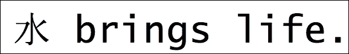

# 第四章：- 第四章：数据类型

- Go 是一种强类型语言，这意味着存储（或产生）值的任何语言元素都与其关联一个类型。在本章中，读者将了解类型系统的特性，因为他们将探索语言支持的常见数据类型，如下所述：

+   - Go 类型

+   - 数值类型

+   - 布尔类型

+   - 指针

+   - 类型声明

+   - 类型转换

# - Go 类型

- 为了帮助启动关于类型的讨论，让我们来看看可用的类型。Go 实现了一个简单的类型系统，为程序员提供了直接控制内存分配和布局的能力。当程序声明一个变量时，必须发生两件事：

+   - 变量必须接收一个类型

+   - 变量也将绑定到一个值（即使没有分配任何值）

- 这使得类型系统能够分配存储已声明值所需的字节数。已声明变量的内存布局直接映射到它们声明的类型。没有类型装箱或自动类型转换发生。分配的空间实际上就是在内存中保留的空间。

- 为了证明这一事实，以下程序使用一个名为 `unsafe` 的特殊包来规避类型系统，并提取已声明变量的内存大小信息。重要的是要注意，这纯粹是为了说明，因为大多数程序通常不常使用 `unsafe` 包。

```go
package main 
import ( 
   "fmt" 
   "unsafe" 
) 

var ( 
   a uint8   = 72 
   b int32   = 240 
   c uint64  = 1234564321 
   d float32 = 12432345.232 
   e int64   = -1233453443434 
   f float64 = -1.43555622362467 
   g int16   = 32000 
   h [5]rune = [5]rune{'O', 'n', 'T', 'o', 'p'} 
) 

func main() { 
   fmt.Printf("a = %v [%T, %d bits]\n", a, a, unsafe.Sizeof(a)*8) 
   fmt.Printf("b = %v [%T, %d bits]\n", b, b, unsafe.Sizeof(b)*8) 
   fmt.Printf("c = %v [%T, %d bits]\n", c, c, unsafe.Sizeof(c)*8) 
   fmt.Printf("d = %v [%T, %d bits]\n", d, d, unsafe.Sizeof(d)*8) 
   fmt.Printf("e = %v [%T, %d bits]\n", e, e, unsafe.Sizeof(e)*8) 
   fmt.Printf("f = %v [%T, %d bits]\n", f, f, unsafe.Sizeof(f)*8) 
   fmt.Printf("g = %v [%T, %d bits]\n", g, g, unsafe.Sizeof(g)*8) 
   fmt.Printf("h = %v [%T, %d bits]\n", h, h, unsafe.Sizeof(h)*8) 
} 

```

- golang.fyi/ch04/alloc.go

- 当程序执行时，它会打印出每个已声明变量消耗的内存量（以位为单位）：

```go
$>go run alloc.go
a = 72 [uint8, 8 bits]
b = 240 [int32, 32 bits]
c = 1234564321 [uint64, 64 bits]
d = 1.2432345e+07 [float32, 32 bits]
e = -1233453443434 [int64, 64 bits]
f = -1.43555622362467 [float64, 64 bits]
g = 32000 [int16, 16 bits]
h = [79 110 84 111 112] [[5]int32, 160 bits]

```

- 从前面的输出中，我们可以看到变量 `a`（类型为 `uint8`）将使用 8 位（或 1 字节）存储，变量 `b` 将使用 32 位（或 4 字节）存储，依此类推。通过影响内存消耗的能力以及 Go 对指针类型的支持，程序员能够强力控制内存在其程序中的分配和消耗。

- 本章将介绍下表中列出的类型。它们包括基本类型，如数值、布尔和字符串：

| - **类型** | **描述** |
| --- | --- |
| - `string` | 用于存储文本值的类型。 |
| - `rune` | 用于表示字符的整数类型（int32）。 |
| - `byte`, `int`, `int8`, `int16`, `int32`, `int64`, `rune`, `uint`, `uint8`, `uint16`, `uint32`, `uint64`, `uintptr` | 用于存储整数值的类型。 |
| - `float32`, `float64` | 用于存储浮点十进制值的类型。 |
| - `complex64`, `complex128` | 可以表示具有实部和虚部的复数的类型。 |
| - `bool` | 用于布尔值的类型。 |
| - `*T`，指向类型 T 的指针 | 代表存储类型为 T 的值的内存地址的类型。 |

- Go 支持的其余类型，如下表中列出的类型，包括复合类型、接口、函数和通道。它们将在专门讨论它们的章节中进行介绍。

| - **类型** | **描述** |
| --- | --- |
| - 数组 `[n]T` | 由类型 `T` 的元素组成的具有固定大小 `n` 的有序集合。 |
| - 切片`[]T` | 由类型 `T` 的元素组成的未指定大小的有序集合。 |
| - `struct{}` | 结构是由称为字段的元素组成的复合类型（类似于对象）。 |
| - `map[K]T` | 由任意类型 `K` 的键索引的类型为 `T` 的元素的无序序列。 |
| - `interface{}` | 一组命名的函数声明，定义了其他类型可以实现的一组操作。 |
| - `func (T) R` | 代表具有给定参数类型 `T` 和返回类型 `R` 的所有函数的类型。 |
| - `chan T` | 用于内部通信通道的类型，用于发送或接收类型为 `T` 的值。 |

# - 数值类型

Go 的数字类型包括对从 8 位到 64 位的各种大小的整数和小数值的支持。 每种数字类型在内存中都有自己的布局，并且被类型系统视为独特的。 为了强制执行这一点，并且避免在不同平台上移植 Go 时出现任何混淆，数字类型的名称反映了其大小要求。 例如，类型`*int16*`表示使用 16 位进行内部存储的整数类型。 这意味着在赋值、表达式和操作中跨类型边界时，必须明确地转换数值。

以下程序并不是非常实用，因为所有值都被分配给了空白标识符。 但是，它展示了 Go 中支持的所有数字数据类型。

```go
package main 
import ( 
   "math" 
   "unsafe" 
) 

var _ int8 = 12 
var _ int16 = -400 
var _ int32 = 12022 
var _ int64 = 1 << 33 
var _ int = 3 + 1415 

var _ uint8 = 18 
var _ uint16 = 44 
var _ uint32 = 133121 
var i uint64 = 23113233 
var _ uint = 7542 
var _ byte = 255 
var _ uintptr = unsafe.Sizeof(i) 

var _ float32 = 0.5772156649 
var _ float64 = math.Pi 

var _ complex64 = 3.5 + 2i 
var _ complex128 = -5.0i 

func main() { 
   fmt.Println("all types declared!") 
} 

```

golang.fyi/ch04/nums.go

## 无符号整数类型

以下表格列出了 Go 中可以表示无符号整数及其存储要求的所有可用类型：

| **类型** | **大小** | **描述** |
| --- | --- | --- |
| `uint8` | 无符号 8 位 | 范围 0-255 |
| `uint16` | 无符号 16 位 | 范围 0-65535 |
| `uint32` | 无符号 32 位 | 范围 0-4294967295 |
| `uint64` | 无符号 64 位 | 范围 0-18446744073709551615 |
| `uint` | 实现特定 | 预先声明的类型，旨在表示 32 位或 64 位整数。 截至 Go 的 1.x 版本，`uint`表示 32 位无符号整数。 |
| `byte` | 无符号 8 位 | `unit8`类型的别名。 |
| `uintptr` | 无符号 | 一种设计用于存储底层机器体系结构的指针（内存地址）的无符号整数类型。 |

## 有符号整数类型

以下表格列出了 Go 中可以表示有符号整数及其存储要求的所有可用类型：

| **类型** | **大小** | **描述** |
| --- | --- | --- |
| `int8` | 有符号 8 位 | 范围-128 - 127 |
| `int16` | 有符号 16 位 | 范围-32768 - 32767 |
| `int32` | 有符号 32 位 | 范围-2147483648 - 2147483647 |
| `int64` | 有符号 64 位 | 范围-9223372036854775808 - 9223372036854775807 |
| `int` | 实现特定 | 预先声明的类型，旨在表示 32 位或 64 位整数。 截至 Go 的 1.x 版本，`int`表示 32 位有符号整数。 |

## 浮点类型

Go 支持以下类型来表示使用 IEEE 标准的十进制值：

| **类型** | **大小** | **描述** |
| --- | --- | --- |
| `float32` | 有符号 32 位 | 单精度浮点值的 IEEE-754 标准表示。 |
| `float64` | 有符号 64 位 | 双精度浮点值的 IEEE-754 标准表示。 |

## 复数类型

Go 还支持表示具有虚部和实部的复数，如下表所示：

| **类型** | **大小** | **描述** |
| --- | --- | --- |
| `complex64` | float32 | 以`float32`值存储的实部和虚部表示复数。 |
| `complex128` | float64 | 以`float64`值存储的实部和虚部表示复数。 |

## 数字文字

Go 支持使用数字序列和符号以及小数点的组合来自然表示整数值（如前面的例子所示）。 可选地，Go 整数文字也可以表示十六进制和八进制数字，如下面的程序所示：

```go
package main 
import "fmt" 

func main() { 
   vals := []int{ 
       1024, 
       0x0FF1CE, 
       0x8BADF00D, 
       0xBEEF, 
       0777, 
   } 
   for _, i := range vals { 
         if i == 0xBEEF { 
               fmt.Printf("Got %d\n", i) 
               break 
         } 
   } 
} 

```

golang.fyi/ch04/intslit.go

十六进制值以`0x`或（`0X`）前缀开头，而八进制值以前面示例中显示的数字 0 开头。 浮点值可以使用十进制和指数表示法表示，如下面的示例所示：

```go
package main 

import "fmt" 

func main() { 
   p := 3.1415926535 
   e := .5772156649 
   x := 7.2E-5 
   y := 1.616199e-35 
   z := .416833e32 

   fmt.Println(p, e, x, y, z) 
} 

```

golang.fyi/ch04/floats.go

前面的程序展示了 Go 中浮点文字的几种表示。 数字可以包括一个可选的指数部分，该部分由数字末尾的`e`（或`E`）表示。 例如，代码中的`1.616199e-35`表示数值 1.616199 x 10^(-35)。 最后，Go 支持用于表示复数的文字，如下面的示例所示：

```go
package main 
import "fmt" 

func main() { 
   a := -3.5 + 2i 
   fmt.Printf("%v\n", a) 
   fmt.Printf("%+g, %+g\n", real(a), imag(a)) 
} 

```

golang.fyi/ch04/complex.go

在上一个示例中，变量`a`被分配了一个具有实部和虚部的复数。虚部文字是一个浮点数，后面跟着字母`i`。请注意，Go 还提供了两个内置函数，`real()`和`imag()`，分别用于将复数分解为其实部和虚部。

# 布尔类型

在 Go 中，布尔二进制值使用`bool`类型存储。虽然`bool`类型的变量存储为 1 字节值，但它并不是数值的别名。Go 提供了两个预声明的文字，`true`和`false`，用于表示布尔值，如下例所示：

```go
package main 
import "fmt" 

func main() { 
   var readyToGo bool = false 
   if !readyToGo { 
       fmt.Println("Come on") 
   } else { 
       fmt.Println("Let's go!") 
   } 
} 

```

golang.fyi/ch04/bool.go

# 符文和字符串类型

为了开始我们关于`rune`和`string`类型的讨论，需要一些背景知识。Go 可以将其源代码中的字符和字符串文字常量视为 Unicode。这是一个全球标准，其目标是通过为每个字符分配一个数值（称为代码点）来记录已知书写系统的符号。

默认情况下，Go 本身支持 UTF-8，这是一种有效的编码和存储 Unicode 数值的方式。这就是继续这个主题所需的所有背景。不会讨论更多细节，因为这超出了本书的范围。 

## 符文

那么，`rune`类型与 Unicode 有什么关系呢？`rune`是`int32`类型的别名。它专门用于存储以 UTF-8 编码的 Unicode 整数值。让我们在下面的程序中看一些`rune`文字：

！符文

golang.fyi/ch04/rune.go

上一个程序中的每个变量都存储一个 Unicode 字符作为`rune`值。在 Go 中，`rune`可以被指定为由单引号括起来的字符串文字常量。文字可以是以下之一：

+   可打印字符（如变量`char1`、`char2`和`char3`所示）

+   用反斜杠转义的单个字符，用于不可打印的控制值，如制表符、换行符、换行符等

+   `\u`后直接跟 Unicode 值（`\u0369`）

+   `\x`后跟两个十六进制数字

+   反斜杠后跟三个八进制数字（`\045`）

无论单引号内的`rune`文字值如何，编译器都会编译并分配一个整数值，如上一个变量的打印输出所示：

```go
$>go run runes.go
8
9
10
632
2438
35486
873
250
37 

```

## 字符串

在 Go 中，字符串被实现为不可变字节值的切片。一旦将字符串值分配给变量，该字符串的值就不会改变。通常，字符串值被表示为双引号括起来的常量文字，如下例所示：

！字符串

golang.fyi/ch04/string.go

上一个片段显示了变量`txt`被分配了一个包含七个字符的字符串文字，其中包括两个嵌入的中文字符。正如前面提到的，Go 编译器会自动将字符串文字值解释为 Unicode 字符，并使用 UTF-8 对其进行编码。这意味着在底层，每个文字字符都被存储为`rune`，并且可能需要多于一个字节的存储空间来存储每个可见字符。事实上，当程序执行时，它打印出`txt`的长度为`11`，而不是预期的字符串的七个字符，这考虑到了用于中文符号的额外字节。

## 解释和原始字符串文字

以下片段（来自上一个示例）包括分配给变量`txt2`和`txt3`的两个字符串文字。正如你所看到的，这两个文字具有完全相同的内容，然而，编译器会对它们进行不同的处理：

```go
var ( 
   txt2 = "\u6C34\x20brings\x20\x6c\x69\x66\x65." 
   txt3 = ` 
   \u6C34\x20 
   brings\x20 
   \x6c\x69\x66\x65\. 
   ` 
) 

```

golang.fyi/ch04/string.go

变量`txt2`分配的文字值用双引号括起来。这被称为解释字符串。解释字符串可以包含普通的可打印字符，也可以包含反斜杠转义值，这些值被解析并解释为`rune`文字。因此，当打印`txt2`时，转义值被翻译为以下字符串：



在解释字符串中，每个符号对应一个转义值或可打印符号，如下表所总结的：

|  | **<space>** | **带来** | **<space>** | **生命** | . |
| --- | --- | --- | --- | --- | --- |
| \u6C34 | \x20 | 带来 | \x20 | \x6c\x69\x66\x65 | . |

另一方面，变量`txt3`分配的文字值被反引号字符`` ` ``包围。这在Go中创建了所谓的原始字符串。原始字符串值未被解释，其中转义序列被忽略，所有有效字符都按照它们在文本中出现的方式进行编码。

打印`txt3`变量时，将产生以下输出：

```go

\u6C34\x20 brings\x20\x6c\x69\x66\x65。

```

注意，打印的字符串包含所有反斜杠转义值，就像它们出现在原始字符串文本中一样。未解释的字符串文本是在不破坏语法的情况下将大型多行文本内容嵌入源代码主体中的一种有效方式。

# 指针

在 Go 中，当一段数据存储在内存中时，可以直接访问该数据的值，也可以使用指针来引用存储数据位置的内存地址。与其他 C 家族语言一样，Go 中的指针提供了一种间接的方式，让程序员可以更高效地处理数据，而不必每次需要时都复制实际数据值。

然而，与 C 不同，Go 运行时在运行时管理指针的控制。程序员不能将任意整数值添加到指针中生成新的指针地址（一种称为指针算术的做法）。一旦一个指针引用了内存区域，该区域中的数据将保持可访问状态，直到不再有任何指针变量引用。在那时，未引用的值将变得可供垃圾收集。

## 指针类型

类似于 C/C++，Go 使用`*`运算符指定类型为指针。以下代码片段显示了几个具有不同底层类型的指针：

```go

package main
import "fmt"
var valPtr *float32
var countPtr *int
var person *struct {
   name string
   age  int
}
var matrix *[1024]int
var row []*int64
func main() {
   fmt.Println(valPtr, countPtr, person, matrix, row)
}

```

[golang.fyi/ch04/pointers.go](https://golang.fyi/ch04/pointers.go)

给定类型`T`的变量，Go 使用表达式`*T`作为其指针类型。类型系统将`T`和`*T`视为不同且不可互换。指针的零值，当它不指向任何内容时，是地址 0，表示为*常数* nil。

## 地址运算符

指针值只能分配给它们声明类型的地址。在 Go 中，一种方法是使用地址运算符`&`（和号）获取变量的地址值，如下例所示：

```go

package main
import "fmt"
func main() {
   var a int = 1024
   var aptr *int = &a
   fmt.Printf("a=%v\n", a)
   fmt.Printf("aptr=%v\n", aptr)
}

```

[golang.fyi/ch04/pointers.go](https://golang.fyi/ch04/pointers.go)

变量`aptr`，指针类型为`*int`，使用表达式`&a`进行初始化，并将变量`a`的地址值分配给它，如下所示：

```go

var a int = 1024
var aptr *int = &a

```

虽然变量`a`存储实际值，我们说`aptr`指向`a`。以下显示了程序输出，其中变量`a`的值和其内存位置被分配给`aptr`：

```go

a=1024
aptr=0xc208000150

```

分配的地址值将始终相同（始终指向`a`），无论在代码中何处访问`aptr`。值得注意的是，Go 不允许在数字、字符串和布尔类型的文本常量中使用地址运算符。因此，以下代码不会编译：

```go

var aptr *int = &1024
fmt.Printf("a ptr1 = %v\n", aptr)

```

然而，有一个语法例外情况，当用文本常量初始化结构体和数组等复合类型时。以下程序说明了这样的情况：

```go

package main
import "fmt"
func main() {
   structPtr := &struct{ x, y int }{44, 55}
   pairPtr := &[2]string{"A", "B"}
   fmt.Printf("struct=%#v, type=%T\n", structPtr, structPtr)
   fmt.Printf("pairPtr=%#v, type=%T\n", pairPtr, pairPtr)
}

```

[golang.fyi/ch04/address2.go](https://golang.fyi/ch04/address2.go)

在前面的代码片段中，地址运算符直接与复合字面量`&struct{ x, y int }{44, 55}`和`&[2]string{"A", "B"}`一起使用，返回指针类型`*struct { x int; y int }`和`*[2]string`。这是一种语法糖，消除了将值分配给变量，然后检索其分配地址的中间步骤。

## new()函数

使用内置函数*new(<type>)*也可以用来初始化指针值。它首先为指定类型的零值分配适当的内存。然后函数返回新创建值的地址。下面的程序使用`new()`函数初始化变量`intptr`和`p`：

```go

package main

import "fmt"
func main() {
   intptr := new(int)
   *intptr = 44
   p := new(struct{ first, last string })
   p.first = "Samuel"
   p.last = "Pierre"
   fmt.Printf("Value %d, type %T\n", *intptr, intptr)
   fmt.Printf("Person %+v\n", p)
}

```

golang.fyi/ch04/newptr.go

变量`intptr`初始化为`*int`，`p`初始化为`*struct{first, last string}`。一旦初始化，两个值在代码中稍后会相应更新。当实际值在初始化时不可用时，您可以使用`new()`函数以零值初始化指针变量。

## 指针间接引用 - 访问引用的值

如果你只有地址，你可以通过将`*`运算符应用到指针值本身（或解引用）来访问它指向的值。以下程序在函数`double()`和`cap()`中演示了这一理念：

```go

package main
import (
   "fmt"
   "strings"
)
func main() {
   a := 3
   double(&a)
   fmt.Println(a)
   p := &struct{ first, last string }{"Max", "Planck"}
   cap(p)
   fmt.Println(p)
}
func double(x *int) {
   *x = *x * 2
}
func cap(p *struct{ first, last string }) {
   p.first = strings.ToUpper(p.first)
   p.last = strings.ToUpper(p.last)
}

```

golang.fyi/ch04/derefptr.go

在前面的代码中，在函数`double()`中，表达式`*x = *x * 2`可以分解如下以了解其工作原理：

| **表达式** | **步骤** |
| --- | --- |

```go

*x * 2

```

| `x`是`*int`类型的原始表达式。 |
| --- |

```go

*(*x) * 2

```

| 通过对地址值应用`*`进行指针解引用。 |
| --- |

```go

3 * 2 = 6

```

| `*(*x) = 3`的解引用值。 |
| --- |

```go

*(*x) = 6

```

| 此表达式的右侧解引用了`x`的值。它被更新为结果 6。 |
| --- |

在函数`cap()`中，使用类似的方法来访问和更新类型为`struct{first, last string}`的复合变量`p`中的字段。然而，处理复合类型时，这种习惯用法更加宽容。不需要写`*p.first`来访问指针的字段值。我们可以去掉`*`，直接使用`p.first = strings.ToUpper(p.first)`。

# 类型声明

在 Go 语言中，可以将类型绑定到标识符以创建一个新的命名类型，可以在需要该类型的任何地方引用和使用它。声明类型的通用格式如下：

*type <名称标识符> <基础类型名称>*

类型声明以关键字`type`开始，后跟*名称标识符*和现有*基础类型*的名称。基础类型可以是内置命名类型，如数字类型之一，布尔值，或字符串类型，如下面的类型声明片段所示：

```go

type truth bool
type quart float64
type gallon float64
type node string

```

### 注意

类型声明也可以使用复合*类型字面值*作为其基础类型。复合类型包括数组、切片、映射和结构体。本节侧重于非复合类型。有关复合类型的更多详细信息，请参阅第七章*复合类型*。

以下示例说明了命名类型在其最基本形式中的工作方式。示例中的代码将温度值转换。每个温度单位都由一个声明类型表示，包括`fahrenheit`、`celsius`和`kelvin`。

```go

package main
import "fmt"
type fahrenheit float64
type celsius float64
type kelvin float64
func fharToCel(f fahrenheit) celsius {
   return celsius((f - 32) * 5 / 9)
}
func fharToKel(f fahrenheit) celsius {
   return celsius((f-32)*5/9 + 273.15)
}
func celToFahr(c celsius) fahrenheit {
   return fahrenheit(c*5/9 + 32)
}
func celToKel(c celsius) kelvin {
   return kelvin(c + 273.15)
}
func main() {
   var c celsius = 32.0
   f := fahrenheit(122)
   fmt.Printf("%.2f \u00b0C = %.2f \u00b0K\n", c, celToKel(c))
   fmt.Printf("%.2f \u00b0F = %.2f \u00b0C\n", f, fharToCel(f))
}

```

golang.fyi/ch04/typedef.go

在上述代码片段中，新声明的类型都基于基础的内置数值类型`float64`。一旦新类型已声明，它可以被赋值给变量，并像其基础类型一样参与表达式。新声明的类型将具有相同的零值，并且可以与其基础类型进行相互转换。

# 类型转换

通常情况下，Go 认为每种类型都是不同的。这意味着在正常情况下，不同类型的值在赋值、函数参数和表达式上下文中不可互换。这对于内置类型和声明的类型都适用。例如，以下代码会因类型不匹配而导致构建错误：

```go

package main
import "fmt"
type signal int
func main() {
   var count int32
   var actual int
   var test int64 = actual + count
   var sig signal
   var event int = sig
   fmt.Println(test)
   fmt.Println(event)
}

```

golang.fyi/ch04/type_conv.go

表达式`actual + count`会导致构建时错误，因为两个变量的类型不同。即使变量`actual`和`count`都是数值类型，并且`int32`和`int`具有相同的内存表示，编译器仍然会拒绝这个表达式。

声明的命名类型及其基础类型也是如此。编译器将拒绝赋值`var event int = sig`，因为类型`signal`被视为与类型`int`不同。即使`signal`使用`int`作为其基础类型，这也是正确的。

要跨越类型边界，Go 支持一种类型转换表达式，用于将一个类型的值转换为另一个类型。类型转换使用以下格式进行：

*<目标类型>(<值或表达式>)*

以下代码片段通过将变量转换为适当的类型来修复先前的示例：

```go

type signal int
func main() {
   var count int32
   var actual int
   var test int32 = int32(actual) + count
   var sig signal
   var event int = int(sig)
}

```

golang.fyi/ch04/type_conv2.go

请注意，在上述代码中，赋值表达式`var test int32 = int32(actual) + count`将变量`actual`转换为相应的类型，以匹配表达式的其余部分。类似地，表达式`var event int = int(sig)`将变量`sig`转换为匹配赋值中的目标类型`int`。

转换表达式通过显式更改封闭值的类型来满足赋值。显然，并非所有类型都可以互相转换。以下表总结了类型转换适合和允许的常见情况： 

| **描述** | **代码** |
| --- | --- |
| 目标类型和转换值都是简单的数值类型。 |

```go

var i int
var i2 int32 = int32(i)
var re float64 = float64(i +   int(i2))

```

| 目标类型和转换值都是复数数值类型。 |
| --- |

```go

var cn64 complex64
var cn128 complex128 =   complex128(cn64)

```

| 目标类型和转换值具有相同的基础类型。 |
| --- |

```go

type signal int
var sig signal
var event int = int(sig)

```

| 目标类型是字符串，转换值是有效的整数类型。 |
| --- |

```go

a := string(72)
b := string(int32(101))
c := string(rune(108))

```

| 目标类型是字符串，转换值是字节片、int32 或符文。 |
| --- |

```go

msg0 := string([]byte{'H','i'})
msg1 := string([]rune{'Y','o','u','!'})

```

| 目标类型是字节、int32 或符文值的片，转换值是一个字符串。 |
| --- |


```go

data0 := []byte("Hello")
data0 := []int32("World!")

```

此外，当目标类型和转换值是引用相同类型的指针时，转换规则也适用。除了上表中的这些情况外，Go 类型不能被显式转换。任何尝试这样做都将导致编译错误。

# 总结

本章向读者介绍了 Go 类型系统。本章以类型概述开篇，深入全面地探讨了基本内置类型，如数字、布尔、字符串和指针类型。讨论继续暴露读者对其他重要主题，如命名类型定义。本章以类型转换的机制结束。在接下来的章节中，您将有机会了解其他类型，如复合类型、函数类型和接口类型。
