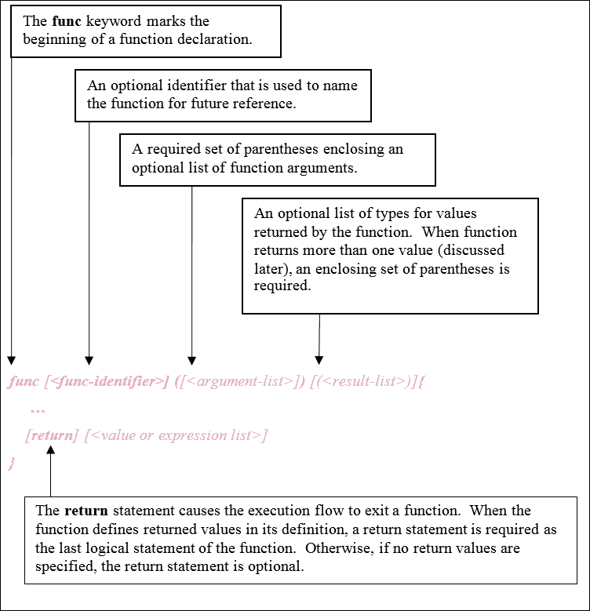
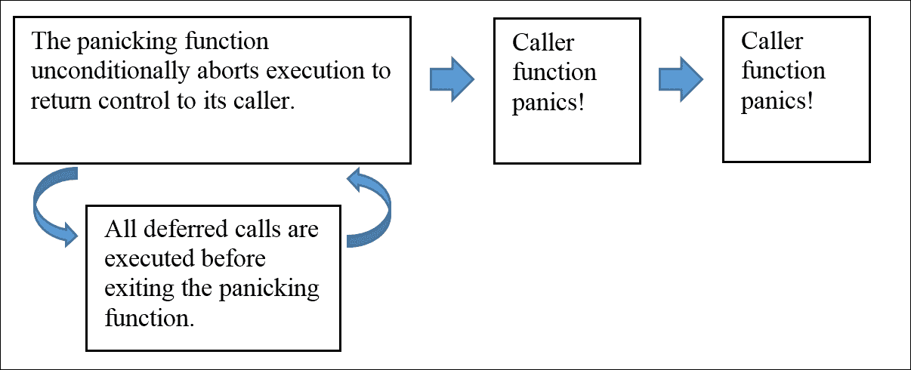

# 第五章。Go 中的函数

Go 的语法*绝活*之一是通过支持高阶函数，就像在 Python 或 Ruby 等动态语言中一样。正如我们将在本章中看到的，函数也是一个具有值的类型实体，可以赋值给变量。在本章中，我们将探讨 Go 中的函数，涵盖以下主题：

+   Go 函数

+   传递参数值

+   匿名函数和闭包

+   高阶函数

+   错误信号处理

+   延迟函数调用

+   函数恐慌和恢复

# Go 函数

在 Go 中，函数是第一类的、有类型的编程元素。声明的函数文字始终具有类型和值（定义的函数本身），并且可以选择地绑定到命名标识符。因为函数可以被用作数据，它们可以被分配给变量或作为其他函数的参数传递。

## 函数声明

在 Go 中声明函数的一般形式如下图所示。这种规范形式用于声明命名和匿名函数。



在 Go 中，最常见的函数定义形式包括函数文字中的函数分配标识符。为了说明这一点，下表显示了几个程序的源代码，其中定义了具有不同参数和返回类型组合的命名函数。

| **代码** | **描述** |
| --- | --- |

|

```go
package main import (
  "fmt"
  "math"
)func printPi() {
  fmt.Printf("printPi()
    %v\n", math.Pi)
} func main() {
  printPi() }               ("fmt" "math" ) func
printPi() {
  fmt.Printf("printPi()
    %v\n", math.Pi)
}
func main() { printPi() }
```

golang.fyi/ch05/func0.go | 一个名为`printPi`的函数。它不接受参数，也不返回任何值。请注意，当没有要返回的内容时，`return`语句是可选的。|

|

```go
package main   
import "fmt"   

func avogadro() float64 {   
   return 6.02214129e23   
}   

func main() {   
   fmt.Printf("avogadro()
   = %e 1/mol\n",   
   avogadro())   
}   

```

golang.fyi/ch05/func1.go | 一个名为`avogadro`的函数。它不接受参数，但返回一个`float64`类型的值。请注意，当返回值在函数签名中声明时，`return`语句是必需的。|

|

```go
package main   
import "fmt"    
func fib(n int) {   
  fmt.Printf("fib(%d):
    [", n)
  var p0, p1 uint64 = 0,
    1   
  fmt.Printf("%d %d ",
    p0, p1)   
  for i := 2; i <= n; i++
  {   
    p0, p1 = p1, p0+p1
    fmt.Printf("%d ",p1)
  }   
  fmt.Println("]")   
}   
func main() {   
  fib(41)   
}
```

golang.fyi/ch05/func2.go | 这定义了`fib`函数。它接受类型为`int`的参数`n`，并打印出最多`n`的斐波那契数列。同样，没有要返回的内容，因此省略了`return`语句。|

|

```go
package main   
import (   
  "fmt"   
  "math"   
)    
func isPrime(n int) bool {   
  lim :=
  int(math.Sqrt
  (float64(n)))
  for p := 2; p <= lim;
  p++ {
    if (n % p) == 0 {   
      return false   
    }  }   
  return true   
}   
func main() {   
  prime := 37
  fmt.Printf
  ("isPrime(%d)  =
  %v\n", prime,
  isPrime(prime))
}
```

golang.fyi/ch05/func3.go | 最后一个示例定义了`isPrime`函数。它接受一个`int`类型的参数，并返回一个`bool`类型的值。由于函数声明要返回一个`bool`类型的值，因此执行流程中的最后一个逻辑语句必须是一个`return`语句，返回声明类型的值。|

### 注意

**函数签名**

指定的参数类型、结果类型和这些类型声明的顺序被称为函数的签名。这是另一个帮助识别函数的独特特征。两个函数可能具有相同数量的参数和结果值；然而，如果这些元素的顺序不同，那么这些函数就具有不同的签名。

## 函数类型

通常，函数文字中声明的名称标识符用于使用调用表达式调用函数，其中函数标识符后面跟着参数列表。这是我们迄今为止在整本书中看到的，并且在下面的示例中调用`fib`函数中有所说明：

```go
func main() { 
   fib(41) 
} 

```

然而，当函数的标识符出现时，没有括号，它被视为一个具有类型和值的常规变量，如下面的程序所示：

```go
package main 
import "fmt" 

func add(op0 int, op1 int) int { 
   return op0 + op1 
} 

func sub(op0, op1 int) int { 
   return op0 - op1 
} 

func main() { 
   var opAdd func(int, int) int = add 
   opSub := sub 
   fmt.Printf("op0(12,44)=%d\n", opAdd(12, 44)) 
   fmt.Printf("sub(99,13)=%d\n", opSub(99, 13)) 
}  

```

golang.fyi/ch05/functype.go

函数的类型由其签名确定。当具有相同数量的参数、相同类型和相同顺序的参数时，函数被认为是相同类型的。在前面的示例中，`opAdd`变量被声明为`func (int, int) int`类型。这与声明的`add`和`sub`函数相同。因此，`opAdd`变量被赋予`add`函数变量。这允许像调用`add`函数一样调用`opAdd`。

对于`opAdd`变量也是同样的操作。它被赋予了由函数标识符`add`和类型`func(int, int)`表示的值。因此，`opAdd(3,5)`调用了第一个函数，返回了加法的结果。

## 可变参数

函数的最后一个参数可以通过在参数类型之前添加省略号(`…`)来声明为**可变参数**（**可变长度参数**）。这表示在调用函数时可以传递零个或多个该类型的值。

以下示例实现了两个接受可变参数的函数。第一个函数计算传入值的平均值，第二个函数对传入的数字进行求和：

```go
package main 
import "fmt" 

func avg(nums ...float64) float64 { 
   n := len(nums) 
   t := 0.0 
   for _, v := range nums { 
         t += v 
   } 
   return t / float64(n) 
} 

func sum(nums ...float64) float64 { 
   var sum float64 
   for _, v := range nums { 
         sum += v 
   } 
   return sum 
} 

func main() { 
   fmt.Printf("avg([1, 2.5, 3.75]) =%.2f\n", avg(1, 2.5, 3.75)) 
   points := []float64{9, 4, 3.7, 7.1, 7.9, 9.2, 10} 
   fmt.Printf("sum(%v) = %.2f\n", points, sum(points...)) 
} 

```

golang.fyi/ch05/funcvariadic.go

编译器在前述两个函数中将可变参数解析为`[]float64`类型的切片。然后可以使用切片表达式来访问参数值，就像前面的例子中所示。要调用具有可变参数的函数，只需提供一个逗号分隔的值列表，与指定类型匹配，如下面的代码片段所示：

```go
fmt.Printf("avg([1, 2.5, 3.75]) =%.2f\n", avg(1, 2.5, 3.75)))  

```

当没有提供参数时，函数接收到一个空切片。敏锐的读者可能会想，“是否可以将现有值的切片作为可变参数传递进去？”幸运的是，Go 提供了一个简单的习语来处理这种情况。让我们来看下面代码片段中对`sum`函数的调用：

```go
points := []float64{9, 4, 3.7, 7.1, 7.9, 9.2, 10} 
fmt.Printf("sum(%v) = %f\n", points, sum(points...))  

```

声明了一个浮点数值的切片，并将其存储在变量`points`中。通过在`sum(points...)`函数调用中的参数中添加省略号，可以将切片作为可变参数传递。

## 函数结果参数

Go 函数可以定义返回一个或多个结果值。到目前为止，在本书中，我们遇到的大多数函数都被定义为返回单个结果值。一般来说，一个函数能够返回一个由逗号分隔的不同类型的结果值列表（参见前一节，*函数声明*）。

为了说明这个概念，让我们来看下面的简单程序，它定义了一个实现欧几里得除法算法的函数（参见[`en.wikipedia.org/wiki/Division_algorithm`](http://en.wikipedia.org/wiki/Division_algorithm)）。`div`函数返回商和余数作为其结果：

```go
package main 
import "fmt" 

func div(op0, op1 int) (int, int) { 
   r := op0 
   q := 0 
   for r >= op1 { 
         q++ 
         r = r - op1 
   } 
   return q, r 
} 

func main() { 
   q, r := div(71, 5) 
   fmt.Printf("div(71,5) -> q = %d, r = %d\n", q, r) 
} 

```

golang.fyi/ch05/funcret0.go

`**return**`关键字后面跟着与函数签名中声明的结果匹配的结果值的数量。在前面的例子中，`div`函数的签名指定了两个`int`值作为结果值返回。在内部，函数定义了`int`变量`p`和`r`，它们在函数完成时作为结果值返回。这些返回的值必须与函数签名中定义的类型匹配，否则会出现编译错误。

具有多个结果值的函数必须在适当的上下文中调用：

+   它们必须分别分配给相同类型的标识符列表

+   它们只能包含在期望相同数量的返回值的表达式中

这在下面的源代码片段中有所说明：

```go
q, r := div(71, 5) 
fmt.Printf("div(71,5) -> q = %d, r = %d\n", q, r) 

```

### 命名结果参数

一般来说，函数签名的结果列表可以使用变量标识符及其类型来指定。使用命名标识符时，它们被传递给函数作为常规声明的变量，并且可以根据需要访问和修改。在遇到`return`语句时，将返回最后分配的结果值。这在下面的源代码片段中有所说明，它是对前一个程序的重写：

```go
func div(dvdn, dvsr int) (q, r int) { 
   r = dvdn 
   for r >= dvsr { 
         q++ 
         r = r - dvsr 
   } 
   return 
} 

```

golang.fyi/ch05/funcret1.go

请注意`return`语句是裸的；它省略了所有标识符。如前所述，`q`和`r`中分配的值将返回给调用者。为了可读性、一致性或风格，您可以选择不使用裸`return`语句。可以像以前一样将标识符的名称与`return`语句（例如`return q, r`）结合使用是完全合法的。

# 传递参数值

在 Go 中，所有传递给函数的参数都是按值传递的。这意味着在被调用的函数内部创建了传递值的本地副本。没有固有的按引用传递参数值的概念。以下代码通过修改`dbl`函数内的传递参数`val`的值来说明这种机制：

```go
package main 
import ( 
   "fmt" 
   "math" 
) 

func dbl(val float64) { 
   val = 2 * val // update param 
   fmt.Printf("dbl()=%.5f\n", val) 
} 

func main() { 
   p := math.Pi 
   fmt.Printf("before dbl() p = %.5f\n", p) 
   dbl(p) 
   fmt.Printf("after dbl() p = %.5f\n", p) 
} 

```

golang.fyi/ch05/funcpassbyval.go

当程序运行时，它产生以下输出，记录了传递给`dbl`函数之前`p`变量的状态。更新是在`dbl`函数内部对传递参数变量进行本地更新的，最后是在调用`dbl`函数之后的`p`变量的值：

```go
$> go run funcpassbyval.go
before dbl() p = 3.14159
dbl()=6.28319
after dbl() p = 3.14159

```

前面的输出显示，分配给变量`p`的原始值保持不变，即使它被传递给一个似乎在内部更新其值的函数。这是因为`dbl`函数中的`val`参数接收传递参数的本地副本。

## 实现按引用传递

虽然按值传递在许多情况下是合适的，但重要的是要注意，Go 可以使用指针参数值实现按引用传递的语义。这允许被调用的函数超出其词法范围并更改指针参数引用的位置存储的值，就像在以下示例中的`half`函数中所做的那样：

```go
package main 
import "fmt" 

func half(val *float64) { 
   fmt.Printf("call half(%f)\n", *val) 
   *val = *val / 2 
} 

func main() { 
   num := 2.807770 
   fmt.Printf("num=%f\n", num) 
   half(&num) 
   fmt.Printf("half(num)=%f\n", num) 
} 

```

golang.fyi/ch05/funcpassbyref.go

在前面的例子中，在`main()`中对`half(&num)`函数的调用会直接更新其`num`参数引用的原始值。因此，当代码执行时，它显示了`num`的原始值以及调用`half`函数后的值：

```go
$> go run funcpassbyref.go
num=2.807770
call half(2.807770)
half(num)=1.403885

```

正如前面所述，Go 函数参数是按值传递的。即使函数以指针值作为参数，这也是正确的。Go 仍然创建并传递指针值的本地副本。在前面的例子中，`half`函数接收通过`val`参数传递的指针值的副本。代码使用指针操作符（`*`）来取消引用和就地操作`val`引用的值。当`half`函数退出并超出范围时，通过调用`main`函数可以访问其更改。

## 匿名函数和闭包

函数可以被写成没有命名标识符的文字。这些被称为匿名函数，可以被分配给一个变量，以便稍后调用，就像下面的例子所示：

```go
package main 
import "fmt" 

var ( 
   mul = func(op0, op1 int) int { 
         return op0 * op1 
   } 

   sqr = func(val int) int { 
         return mul(val, val) 
   } 
) 

func main() { 
   fmt.Printf("mul(25,7) = %d\n", mul(25, 7)) 
   fmt.Printf("sqr(13) = %d\n", sqr(13)) 
}  

```

golang.fyi/ch05/funcs.go

前面的程序显示了两个匿名函数声明并绑定到`mul`和`sqr`变量。在这两种情况下，函数都接受参数并返回一个值。稍后在`main()`中，变量被用来调用与它们绑定的函数代码。

## 调用匿名函数文字

值得注意的是，匿名函数不一定要绑定到标识符。函数文字可以在现场评估为返回函数结果的表达式。通过在括号中结束函数文字的方式，传递参数值的列表，如下面的程序所示：

```go
package main 
import "fmt" 

func main() { 
   fmt.Printf( 
         "94 (°F) = %.2f (°C)\n", 
         func(f float64) float64 { 
               return (f - 32.0) * (5.0 / 9.0) 
         }(94), 
   ) 
} 

```

golang.fyi/ch05/funcs.go

文字格式不仅定义了匿名函数，还调用了它。例如，在以下片段（来自前面的程序）中，匿名函数文字被嵌套为`fmt.Printf()`的参数。函数本身被定义为接受一个参数并返回`float64`类型的值。

```go
fmt.Printf( 
   "94 (°F) = %.2f (°C)\n", 
   func(f float64) float64 { 
         return (f - 32.0) * (5.0 / 9.0) 
   }(94), 
) 

```

由于函数文字以括号括起的参数列表结束，因此该函数被调用为表达式。

## 闭包

Go 函数文字是闭包。这意味着它们在封闭的代码块之外声明的非局部变量具有词法可见性。以下示例说明了这一事实：

```go
package main 
import ( 
   "fmt" 
   "math" 
) 

func main() { 
   for i := 0.0; i < 360.0; i += 45.0 { 
         rad := func() float64 { 
               return i * math.Pi / 180 
         }() 
         fmt.Printf("%.2f Deg = %.2f Rad\n", i, rad) 
   } 
} 

```

github.com/vladimirvivien/learning-go/ch05/funcs.go

在上一个程序中，函数文字代码块`func() float64 {return deg * math.Pi / 180}()`被定义为将度数转换为弧度的表达式。在每次循环迭代时，闭包在封闭的函数文字和外部非局部变量`i`之间形成。这提供了一种更简单的习语，其中函数自然地访问非局部值，而不需要诸如指针之类的其他手段。

### 注意

在 Go 中，词法闭包的值可以在创建闭包的外部函数已经超出范围之后仍然保持与它们的闭包绑定。垃圾收集器将在这些闭合值变得无限制时处理清理工作。

# 高阶函数

我们已经确定 Go 函数是绑定到类型的值。因此，Go 函数可以接受另一个函数作为参数，并且还可以返回一个函数作为结果值，这应该不足为奇。这描述了一个被称为高阶函数的概念，这是从数学中采用的概念。虽然诸如`struct`之类的类型让程序员抽象数据，但高阶函数提供了一种机制，用于封装和抽象可以组合在一起形成更复杂行为的行为。

为了使这个概念更清晰，让我们来看一下下面的程序，它使用了一个高阶函数`apply`来做三件事。它接受一个整数切片和一个函数作为参数。它将指定的函数应用于切片中的每个元素。最后，`apply`函数还返回一个函数作为其结果：

```go
package main 
import "fmt" 

func apply(nums []int, f func(int) int) func() { 
   for i, v := range nums { 
         nums[i] = f(v) 
   } 
   return func() { 
         fmt.Println(nums) 
   } 
} 

func main() { 
   nums := []int{4, 32, 11, 77, 556, 3, 19, 88, 422} 
   result := apply(nums, func(i int) int { 
         return i / 2 
   }) 
   result() 
} 

```

golang.fyi/ch05/funchighorder.go

在程序中，`apply`函数被调用，并使用匿名函数对切片中的每个元素进行减半，如下面的代码段所示：

```go
nums := []int{4, 32, 11, 77, 556, 3, 19, 88, 422} 
result := apply(nums, func(i int) int { 
   return i / 2 
}) 
result() 

```

作为高阶函数，`apply`抽象了可以由任何类型为`func(i int) int`的函数提供的转换逻辑，如下所示。由于`apply`函数返回一个函数，因此变量`result`可以像前面的代码段中所示那样被调用。

当您探索本书和 Go 语言时，您将继续遇到高阶函数的使用。这是一种在标准库中广泛使用的习语。您还将发现高阶函数在一些并发模式中被用于分发工作负载（参见第九章，“并发性”）。

# 错误信号和处理

在这一点上，让我们来看看如何在进行函数调用时惯用地发出和处理错误。如果您曾经使用过 Python、Java 或 C#等语言，您可能熟悉在不良状态出现时通过抛出异常来中断执行代码流的做法。

正如我们将在本节中探讨的，Go 对错误信号和错误处理采用了简化的方法，这使得程序员需要在调用函数返回后立即处理可能的错误。Go 不鼓励通过在执行程序中不加区别地中断执行来短路执行程序，并希望异常能够在调用堆栈的更高位置得到适当处理的概念。在 Go 中，信号错误的传统方式是在函数执行过程中出现问题时返回`error`类型的值。因此，让我们更仔细地看看这是如何完成的。

## 错误信号

为了更好地理解前面段落中所描述的内容，让我们从一个例子开始。以下源代码实现了一个变位词程序，如 Jon Bentley 的流行书籍《编程珠玑》（第二版）中的第 2 列所述。该代码读取一个字典文件（`dict.txt`），并将所有具有相同变位词的单词分组。如果代码不太容易理解，请参阅[golang.fyi/ch05/anagram1.go](http://learning.golang.fyi/ch05/anagram1.go)以获取程序各部分如何工作的注释解释。

```go
package main 

import ( 
   "bufio" 
   "bytes" 
   "fmt" 
   "os" 
   "errors" 
) 

// sorts letters in a word (i.e. "morning" -> "gimnnor") 
func sortRunes(str string) string { 
   runes := bytes.Runes([]byte(str)) 
   var temp rune 
   for i := 0; i < len(runes); i++ { 
         for j := i + 1; j < len(runes); j++ { 
               if runes[j] < runes[i] { 
                     temp = runes[i] 
                     runes[i], runes[j] = runes[j], temp 
               } 

         } 
   } 
   return string(runes) 
} 

// load loads content of file fname into memory as []string 
func load(fname string) ([]string, error) { 
   if fname == "" { 
         return nil, errors.New( 
               "Dictionary file name cannot be empty.")  
   } 

   file, err := os.Open(fname) 
   if err != nil { 
         return nil, err 
   } 
   defer file.Close() 

   var lines []string 
   scanner := bufio.NewScanner(file) 
   scanner.Split(bufio.ScanLines) 
   for scanner.Scan() { 
         lines = append(lines, scanner.Text()) 
   } 
   return lines, scanner.Err() 
} 

func main() { 
   words, err := load("dict.txt")       
   if err != nil { 
         fmt.Println("Unable to load file:", err) 
         os.Exit(1) 
   } 

      anagrams := make(map[string][]string) 
   for _, word := range words { 
         wordSig := sortRunes(word) 
         anagrams[wordSig] = append(anagrams[wordSig], word) 
   } 

   for k, v := range anagrams { 
         fmt.Println(k, "->", v) 
   } 
} 

```

golang.fyiy/ch05/anagram1.go

同样，如果您想要更详细的解释前面的程序，请查看之前提供的链接。这里的重点是前面程序中使用的错误信号。作为惯例，Go 代码使用内置类型`error`来表示在函数执行过程中发生错误。因此，函数必须返回一个`error`类型的值，以指示给其调用者发生了错误。这在前面示例中的`load`函数的以下片段中有所说明：

```go
func load(fname string) ([]string, error) { 
   if fname == "" { 
       return nil, errors.New( 
         "Dictionary file name cannot be empty.")  
   } 

   file, err := os.Open(fname) 
   if err != nil { 
         return nil, err 
   } 
   ... 
} 

```

请注意，`load`函数返回多个结果参数。一个是预期值，本例中为`[]string`，另一个是错误值。惯用的 Go 规定程序员应该返回一个非 nil 值作为`error`类型的结果，以指示在函数执行过程中发生了异常情况。在前面的片段中，`load`函数在两种可能的情况下向其调用者发出错误发生的信号：

+   当预期的文件名（`fname`）为空时

+   当调用`os.Open()`失败时（例如，权限错误，或其他情况）

在第一种情况下，当未提供文件名时，代码使用`errors.New()`返回一个`error`类型的值来退出函数。在第二种情况下，`os.Open`函数返回一个代表文件的指针，并将错误分配给`file`和`err`变量。如果`err`不是`nil`（表示生成了错误），则`load`函数的执行会过早终止，并将`err`的值返回给调用函数处理调用堆栈中更高的位置。

### 注意

当为具有多个结果参数的函数返回错误时，习惯上会返回其他（非错误类型）参数的零值。在这个例子中，对于类型为`[]string`的结果，返回了`nil`值。虽然这并非必需，但它简化了错误处理，并避免了对函数调用者造成任何困惑。

## 错误处理

如前所述，在函数执行过程中，只需返回一个非 nil 值，类型为`error`，即可简单地表示错误状态的发生。调用者可以选择处理`error`或将其`return`以供调用堆栈上进一步评估，就像在`load`函数中所做的那样。这种习惯强制错误向上传播，直到某个地方处理它们。下一个片段展示了`load`函数生成的错误在`main`函数中是如何处理的：

```go
func main() { 
   words, err := load("dict.txt") 
   if err != nil { 
         fmt.Println("Unable to load file:", err) 
         os.Exit(1) 
   } 
   ... 
} 

```

由于`main`函数是调用堆栈中最顶层的调用者，它通过终止整个程序来处理错误。

这就是 Go 中错误处理的机制。语言强制程序员始终测试每个返回`error`类型值的函数调用是否处于错误状态。`if…not…nil error`处理习惯可能对一些人来说过于冗长，特别是如果你来自一个具有正式异常机制的语言。然而，这里的好处在于程序可以构建一个健壮的执行流程，程序员总是知道错误可能来自哪里，并适当地处理它们。

## 错误类型

`error`类型是一个内置接口，因此必须在使用之前实现。幸运的是，Go 标准库提供了准备好的实现。我们已经使用了来自`errors`包的一个实现：

```go
errors.New("Dictionary file name cannot be empty.")  

```

您还可以使用`fmt.Errorf`函数创建参数化的错误值，如下面的代码片段所示：

```go
func load(fname string) ([]string, error) { 
   if fname == "" { 
         return nil, errors.New( 
             "Dictionary file name cannot be emtpy.") 
   } 

   file, err := os.Open(fname) 
   if err != nil { 
         return nil, fmt.Errorf( 
             "Unable to open file %s: %s", fname, err) 
   } 
   ... 
} 

```

golang.fyi/ch05/anagram2.go

将错误值分配给高级变量，以便根据需要在整个程序中重复使用，也是惯用的做法。以下摘录自[`golang.org/src/os/error.go`](http://golang.org/src/os/error.go)显示了与 OS 文件操作相关的可重用错误的声明：

```go
var ( 
   ErrInvalid    = errors.New("invalid argument") 
   ErrPermission = errors.New("permission denied") 
   ErrExist      = errors.New("file already exists") 
   ErrNotExist   = errors.New("file does not exist") 
) 

```

[`golang.org/src/os/error.go`](http://golang.org/src/os/error.go)

您还可以创建自己的`error`接口实现来创建自定义错误。这个主题在第七章中重新讨论，*方法，接口和对象*，在这本书中讨论了扩展类型的概念。

# 推迟函数调用

Go 支持推迟函数调用的概念。在函数调用之前放置关键字`defer`会有一个有趣的效果，将函数推入内部堆栈，延迟其执行直到封闭函数返回之前。为了更好地解释这一点，让我们从以下简单的程序开始，它演示了`defer`的用法：

```go
package main 
import "fmt" 

func do(steps ...string) { 
   defer fmt.Println("All done!") 
   for _, s := range steps { 
         defer fmt.Println(s) 
   } 

   fmt.Println("Starting") 
} 

func main() { 
   do( 
         "Find key", 
         "Aplly break", 
         "Put key in ignition", 
         "Start car", 
   ) 
} 

```

golang.fyi/ch05/defer1.go

前面的示例定义了`do`函数，该函数接受可变参数`steps`。该函数使用`defer fmt.Println("All done!")`推迟语句。接下来，函数循环遍历切片`steps`，并推迟每个元素的输出，使用`defer fmt.Println(s)`。函数`do`中的最后一个语句是一个非延迟调用`fmt.Println("Starting")`。当程序执行时，请注意打印的字符串值的顺序，如下面的输出所示：

```go
$> go run defer1.go
Starting
Start car
Put key in ignition
Aplly break
Find key
All done!

```

有几个事实可以解释打印顺序的反向顺序。首先，回想一下，延迟函数在其封闭函数返回之前执行。因此，第一个打印的值是由最后一个非延迟方法调用生成的。接下来，如前所述，延迟语句被推入堆栈。因此，延迟调用使用后进先出的顺序执行。这就是为什么输出中的最后一个字符串值是`"All done!"`。

## 使用 defer

`defer`关键字通过延迟函数调用修改程序的执行流程。这一特性的惯用用法之一是进行资源清理。由于 defer 总是在封闭函数返回时执行，因此它是一个很好的地方来附加清理代码，比如：

+   关闭打开的文件

+   释放网络资源

+   关闭 Go 通道

+   提交数据库事务

+   等等

为了说明，让我们回到之前的变位词示例。下面的代码片段显示了在加载文件后使用 defer 关闭文件的代码版本。`load`函数在返回之前调用`file.Close()`：

```go
func load(fname string) ([]string, error) { 
... 
   file, err := os.Open(fname) 
   if err != nil { 
         return nil, err 
   } 
   defer file.Close() 
... 
} 

```

golang.fyi/ch05/anagram2.go

打开-推迟-关闭资源的模式在 Go 中被广泛使用。在打开或创建资源后立即放置延迟意图的做法使得代码读起来更自然，并减少了资源泄漏的可能性。

# 函数 panic 和恢复

在本章的前面提到，Go 没有其他语言提供的传统异常机制。尽管如此，在 Go 中，有一种称为函数 panic 的突然退出执行函数的方法。相反，当程序处于 panic 状态时，Go 提供了一种恢复并重新控制执行流程的方法。

## 函数 panic

在执行过程中，函数可能因为以下任何一个原因而 panic：

+   显式调用**panic**内置函数

+   使用由于异常状态而引发 panic 的源代码包

+   访问 nil 值或超出数组范围的元素

+   并发死锁

当函数 panic 时，它会中止并执行其延迟调用。然后它的调用者 panic，导致如下图所示的连锁反应：



panic 序列一直沿着调用堆栈一直到达`main`函数并且程序退出（崩溃）。以下源代码片段显示了一个版本的 anagram 程序，如果尝试创建一个输出 anagram 文件时已经存在，则会导致显式 panic。这是为了导致`write`函数在出现文件错误时引发 panic：

```go
package main 
... 
func write(fname string, anagrams map[string][]string) { 
   file, err := os.OpenFile( 
         fname,  
         os.O_WRONLY+os.O_CREATE+os.O_EXCL,  
         0644, 
   ) 
   if err != nil { 
         msg := fmt.Sprintf( 
               "Unable to create output file: %v", err, 
         ) 
         panic(msg) 
   } 
   ... 
} 

func main() { 
   words, err := load("dict.txt") 
   if err != nil { 
         fmt.Println("Unable to load file:", err) 
         os.Exit(1) 
   } 
   anagrams := mapWords(words) 
   write("out.txt", anagrams) 
} 

```

golang.fyi/ch05/anagram2.go

在上面的片段中，如果`os.OpenFile()`方法出错，`write`函数调用`panic`函数。当程序调用`main`函数时，如果工作目录中已经存在输出文件，程序将会引发 panic 并像下面的堆栈跟踪所示一样崩溃，指示导致崩溃的调用序列：

```go
> go run anagram2.go 
panic: Unable to create output file: open out.txt: file exists
goroutine 1 [running]:
main.write(0x4e7b30, 0x7, 0xc2080382a0)
/Go/src/github.com/vladimirvivien/learning-go/ch05/anagram2.go:72 +0x1a3 
main.main()
Go/src/github.com/vladimirvivien/learning-go/ch05/anagram2.go:103 +0x1e9
exit status 2

```

## 函数 panic 恢复

当一个函数引发 panic 时，正如前面所解释的，它可能会导致整个程序崩溃。根据您的需求，这可能是期望的结果。然而，可以在 panic 序列开始后重新获得控制。为此，Go 提供了名为`recover`的内置函数。

recover 与 panic 协同工作。对 recover 函数的调用会返回作为参数传递给 panic 的值。以下代码展示了如何从前面的示例中引入的 panic 调用中恢复。在这个版本中，write 函数被移动到`makeAnagram()`中以提高清晰度。当从`makeAnagram()`调用`write`函数并且无法打开文件时，它会引发 panic。然而，现在添加了额外的代码来进行恢复：

```go
package main 
... 
func write(fname string, anagrams map[string][]string) { 
   file, err := os.OpenFile( 
         fname,  
         os.O_WRONLY+os.O_CREATE+os.O_EXCL,  
         0644, 
   ) 
   if err != nil { 
         msg := fmt.Sprintf( 
               "Unable to create output file: %v", err, 
         ) 
         panic(msg) 
   } 
   ... 
} 

func makeAnagrams(words []string, fname string) { 
   defer func() { 
         if r := recover(); r != nil { 
               fmt.Println("Failed to make anagram:", r) 
         } 
   }() 

   anagrams := mapWords(words) 
   write(fname, anagrams) 
} 
func main() { 
   words, err := load("") 
   if err != nil { 
         fmt.Println("Unable to load file:", err) 
         os.Exit(1) 
   } 
   makeAnagrams(words, "") 
} 

```

golang.fyi/ch05/anagram3.go

为了能够从一个展开的 panic 序列中恢复，代码必须对 recover 函数进行延迟调用。在前面的代码中，这是在`makeAnagrams`函数中通过将`recover()`包装在一个匿名函数文字中完成的，如下面的片段所示：

```go
defer func() { 
   if r := recover(); r != nil { 
         fmt.Println("Failed to make anagram:", r) 
   } 
}() 

```

当执行延迟的`recover`函数时，程序有机会重新获得控制并阻止 panic 导致程序崩溃。如果`recover()`返回`nil`，这意味着当前没有 panic 在调用堆栈上展开，或者 panic 已经在下游处理过了。

因此，现在当程序执行时，不会崩溃并显示堆栈跟踪，而是会恢复并优雅地显示问题，如下面的输出所示：

```go
> go run anagram3.go
Failed to make anagram: Unable to open output file for creation: open out.txt: file exists

```

### 注意

您可能想知道为什么我们在测试`recover`函数返回的值时使用`nil`，而在调用`panic`时传递了一个字符串。这是因为 panic 和 recover 都采用了空接口类型。正如您将了解的那样，空接口类型是一个通用类型，具有表示 Go 类型系统中的任何类型的能力。在第七章*方法、接口和对象*中关于接口的讨论中，我们将更多地了解空接口。

# 总结

本章向读者介绍了 Go 函数的探索。它从命名函数声明的概述开始，然后讨论了函数参数。本章深入讨论了函数类型和函数值。本章的最后部分讨论了错误处理、panic 和恢复的语义。下一章将继续讨论函数；然而，它是在 Go 包的上下文中进行的。它解释了包作为 Go 函数（和其他代码元素）的逻辑分组形成可共享和可调用的代码模块的角色。
