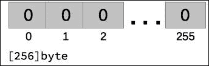
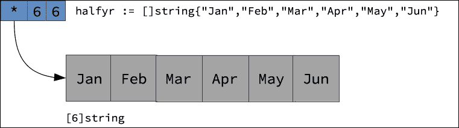
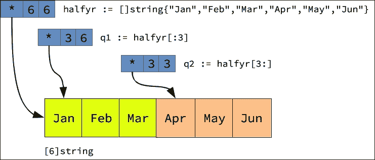

# 第七章。复合类型

在之前的章节中，您可能已经在一些示例代码中看到了复合类型（如数组、切片、映射和结构体）的使用。尽管对这些类型的早期接触可能让您感到好奇，但请放心，在本章中，您将有机会了解所有这些复合类型。本章继续了第四章*数据类型*中开始的内容，讨论了以下主题：

+   数组类型

+   切片类型

+   映射类型

+   结构类型

# 数组类型

正如您在其他语言中所看到的那样，Go 数组是用于存储相同类型的序列化值的容器，这些值是按数字索引的。以下代码片段显示了分配了数组类型的变量的示例：

```go
var val [100]int 
var days [7]string 
var truth [256]bool 
var histogram [5]map[string]int 

```

golang.fyi/ch07/arrtypes.go

请注意，前面示例中分配给每个变量的类型是使用以下类型格式指定的：

*[<长度>]<元素类型>*

数组的类型定义由其长度组成，用括号括起来，后跟其存储元素的类型。例如，`days`变量被分配了类型`[7]string`。这是一个重要的区别，因为 Go 的类型系统认为存储相同类型元素但长度不同的两个数组是不同类型。以下代码说明了这种情况：

```go
var days [7]string 
var weekdays [5]string 

```

尽管这两个变量都是具有`string`类型元素的数组，但类型系统将`days`和`weekdays`变量视为不同类型。

### 注意

在本章的后面，您将看到如何使用切片类型而不是数组来缓解这种类型限制。

数组类型可以定义为多维的。这是通过将一维数组类型的定义组合和嵌套来实现的，如下面的代码片段所示：

```go
var board [4][2]int
var matrix [2][2][2][2] byte
```

golang.fyi/ch07/arrtypes.go

Go 没有单独的多维数组类型。具有多个维度的数组由相互嵌套的一维数组组成。下一节将介绍如何初始化单维和多维数组。

## 数组初始化

当数组变量没有明确初始化时，所有元素将被分配为元素声明类型的零值。数组可以使用复合文字值进行初始化，其一般格式如下：

*<数组类型>{<逗号分隔的元素值列表>}*

数组的文字值由数组类型定义（在前一节中讨论）组成，后跟一组逗号分隔的值，用大括号括起来，如下面的代码片段所示，其中显示了声明和初始化了几个数组：

```go
var val [100]int = [100]int{44,72,12,55,64,1,4,90,13,54}
var days [7]string = [7]string{
  "Monday",
  "Tuesday",
  "Wednesday",
  "Thursday",
  "Friday",
  "Saturday",
  "Sunday",
}
var truth = [256]bool{true}
var histogram = [5]map[string]int {
  map[string]int{"A":12,"B":1, "D":15},
  map[string]int{"man":1344,"women":844, "children":577,...},
}
```

golang.fyi/ch07/arrinit.go

文字值中的元素数量必须小于或等于数组类型中声明的大小。如果定义的数组是多维的，可以通过将每个维度嵌套在另一个括号的括号中，使用文字值进行初始化，如下面的示例代码片段所示：

```go
var board = [4][2]int{ 
   {33, 23}, 
   {62, 2}, 
   {23, 4}, 
   {51, 88}, 
} 
var matrix = [2][2][2][2]byte{ 
   {{{4, 4}, {3, 5}}, {{55, 12}, {22, 4}}}, 
   {{{2, 2}, {7, 9}}, {{43, 0}, {88, 7}}}, 
} 

```

golang.fyi/ch07/arrinit.go

以下代码片段显示了指定数组文字的另外两种方式。在初始化期间，数组的长度可以被省略并用省略号替换。以下将类型`[5]string`分配给变量`weekdays`：

```go
var weekdays = [...]string{ 
   "Monday", 
   "Tuesday", 
   "Wednesday", 
   "Thursday", 
   "Friday",    
}  

```

数组的文字值也可以被索引。如果您只想初始化某些数组元素，同时允许其他元素以它们的自然零值进行初始化，这将非常有用。以下指定了位置 0、`2`、`4`、`6`、`8`的元素的初始值。其余元素将被分配为空字符串：

```go
var msg = [12]rune{0: 'H', 2: 'E', 4: 'L', 6: 'O', 8: '!'} 

```

## 声明命名数组类型

数组的类型可能会变得难以重用。对于每个声明，需要重复声明，这可能会出错。处理这种习惯用法的方法是使用类型声明别名数组类型。为了说明这是如何工作的，以下代码片段声明了一个新的命名类型`matrix`，使用多维数组作为其基础类型：

```go
type matrix [2][2][2][2]byte 

func main() { 
   var mat1 matrix 
   mat1 = initMat() 
   fmt.Println(mat1) 
} 

func initMat() matrix { 
   return matrix{ 
         {{{4, 4}, {3, 5}}, {{55, 12}, {22, 4}}}, 
         {{{2, 2}, {7, 9}}, {{43, 0}, {88, 7}}}, 
   } 
} 

```

golang.fyi/ch07/arrtype_dec.go

声明的命名类型`matrix`可以在使用其基础数组类型的所有上下文中使用。这允许使用简化的语法，促进复杂数组类型的重用。

## 使用数组

数组是静态实体，一旦使用指定的长度声明，就无法增长或缩小。当程序需要分配预定义大小的连续内存块时，数组是一个很好的选择。当声明数组类型的变量时，它已经准备好在没有任何进一步分配语义的情况下使用。

因此，`image`变量的以下声明将分配一个由 256 个相邻的`int`值组成的内存块，并用零初始化，如下图所示：

```go
var image [256]byte
```



与 C 和 Java 类似，Go 使用方括号索引表达式来访问存储在数组变量中的值。这是通过指定变量标识符，后跟方括号括起来的元素的索引来完成的，如下面的代码示例所示：

```go
p := [5]int{122,6,23,44,6} 
p[4] = 82 
fmt.Println(p[0]) 

```

前面的代码更新了数组中的第五个元素，并打印了数组中的第一个元素。

## 数组长度和容量

内置的`len`函数返回数组类型的声明长度。内置的`cap`函数可以用于返回数组的容量。例如，在以下源代码片段中，类型为`[7]string`的数组`seven`将返回`7`作为其长度和容量：

```go
func main() { 
   seven := [7]string{"grumpy", "sleepy", "bashful"} 
   fmt.Println(len(seven), cap(seven)) 
} 

```

对于数组，`cap()`函数始终返回与`len()`相同的值。这是因为数组值的最大容量是其声明的长度。容量函数更适合与切片类型一起使用（稍后在本章中讨论）。

## 数组遍历

数组遍历可以使用传统的`for`语句或更符合习惯的`for…range`语句。以下代码片段显示了使用`for`语句进行数组遍历，以在`init()`中使用随机数初始化数组，并使用`for`范围语句实现`max()`函数：

```go
const size = 1000 
var nums [size]int 

func init() { 
   rand.Seed(time.Now().UnixNano()) 
   for i := 0; i < size; i++ { 
         nums[i] = rand.Intn(10000) 
   } 
} 

func max(nums [size]int) int { 
   temp := nums[0] 
   for _, val := range nums { 
         if val > temp { 
               temp = val 
         } 
   } 
   return temp 
} 

```

golang.fyi/ch07/arrmax_iter.go

在传统的`for`语句中，循环的索引变量`i`用于使用索引表达式`num[i]`访问数组的值。在`for…range`语句中，在`max`函数中，迭代的值存储在`val`变量中，每次循环都会忽略索引（分配给空白标识符）。如果您不了解*for*语句的工作原理，请参阅第三章，*Go 控制流*，详细解释 Go 中循环的机制。

## 数组作为参数

数组值被视为单个单元。数组变量不是指向内存中的位置的指针，而是表示包含数组元素的整个内存块。当重新分配数组变量或将其作为函数参数传递时，这意味着创建数组值的新副本。

这可能会对程序的内存消耗产生不良的副作用。一个解决方法是使用指针类型来引用数组值。在以下示例中，声明了一个命名类型`numbers`，表示数组类型`[1024 * 1024]]int`。函数`initialize()`和`max()`不直接接受数组值作为参数，而是接受`*numbers`类型的指针，如下面的源代码片段所示：

```go
type numbers [1024 * 1024]int 
func initialize(nums *numbers) { 
   rand.Seed(time.Now().UnixNano()) 
   for i := 0; i < size; i++ { 
         nums[i] = rand.Intn(10000) 
   } 
} 
func max(nums *numbers) int { 
   temp := nums[0] 
   for _, val := range nums { 
         if val > temp { 
               temp = val 
         } 
   } 
   return temp 
} 
func main() { 
   var nums *numbers = new(numbers) 
   initialize(nums) 
} 

```

golang.fyi/ch07/arrptr.go

前面的代码使用内置函数`new(numbers)`来初始化数组元素为它们的零值，并在`main()`中获取指向该数组的指针。因此，当调用`initialize`和`max`函数时，它们将接收到数组的地址（其副本），而不是整个大小为 100K 的数组。

在改变主题之前，应该注意到复合文字数组值可以使用地址运算符`&`初始化并返回数组的指针，如下例所示。在代码片段中，复合文字`&galaxies{...}`返回指针`*galaxies`，并用指定的元素值初始化：

```go
type galaxies [14]string 
func main() { 
   namedGalaxies = &galaxies{ 
         "Andromeda", 
         "Black Eye", 
         "Bode's", 
          ...   
   } 
   printGalaxies(namedGalaxies) 
} 

```

golang.fyi/ch07/arraddr.go

数组类型是 Go 中的低级存储构造。例如，数组通常用作存储原语的基础，其中有严格的内存分配要求以最小化空间消耗。然而，在更常见的情况下，切片，下一节中介绍的，通常被用作处理序列化索引集合的更成语化的方式。

# 切片类型

切片类型通常用作 Go 中索引数据的成语构造。切片比数组更灵活，具有许多更有趣的特性。切片本身是一种具有类似数组语义的复合类型。实际上，切片使用数组作为其底层数据存储机制。切片类型的一般形式如下所示：

*[ ]<element_type>*

切片和数组类型之间一个明显的区别是在类型声明中省略了大小，如下面的例子所示：

```go
var ( 
    image []byte      
    ids []string 
    vector []float64 
    months []string 
    q1 []string 
    histogram []map[string]int // slice of map (see map later) 
) 

```

golang.fyi/ch07/slicetypes.go

切片类型中缺少的大小属性表示以下内容：

+   与数组不同，切片的大小是不固定的

+   切片类型表示指定元素类型的所有集合

这意味着切片在理论上可以无限增长（尽管在实践中这并不是真的，因为切片由底层有界数组支持）。给定元素类型的切片被认为是相同类型，而不管其底层大小如何。这消除了数组中大小决定类型的限制。

例如，以下变量`months`和`q1`具有相同的`[]string`类型，并且将编译没有问题：

```go
var ( 
    months []string 
    q1 []string 
) 
func print(strs []string){ ... } 
func main() { 
   print(months) 
   print(q1) 
} 

```

golang.fyi/ch07/slicetypes.go

与数组类似，切片类型可以嵌套以创建多维切片，如下面的代码片段所示。每个维度可以独立地具有自己的大小，并且必须单独初始化：

```go
var( 
    board [][]int 
    graph [][][][]int 
) 

```

## 切片初始化

切片在类型系统中表示为一个值（下一节将探讨切片的内部表示）。然而，与数组类型不同，未初始化的切片具有*nil*的零值，这意味着任何尝试访问未初始化切片的元素都会导致程序恐慌。

初始化切片的最简单方法之一是使用以下格式的复合文字值（类似于数组）：

*<slice_type>{<comma-separated list of element values>}*

切片的文字值由切片类型和一组逗号分隔的值组成，这些值被分配给切片的元素，并用大括号括起来。以下代码片段说明了用复合文字值初始化的几个切片变量：

```go
var ( 
    ids []string = []string{"fe225", "ac144", "3b12c"} 
    vector = []float64{12.4, 44, 126, 2, 11.5}  
    months = []string { 
         "Jan", "Feb", "Mar", "Apr", 
         "May", "Jun", "Jul", "Aug", 
         "Sep", "Oct", "Nov", "Dec", 
    } 
    // slice of map type (maps are covered later) 
    tables = []map[string][]int { 
         { 
               "age":{53, 13, 5, 55, 45, 62, 34, 7}, 
               "pay":{124, 66, 777, 531, 933, 231}, 
         }, 
    } 
    graph  = [][][][]int{ 
         {{{44}, {3, 5}}, {{55, 12, 3}, {22, 4}}}, 
         {{{22, 12, 9, 19}, {7, 9}}, {{43, 0, 44, 12}, {7}}},     
    } 
) 

```

golang.fyi/ch07/sliceinit.go

如前所述，切片的复合文字值使用与数组类似的形式表示。但是，文字中提供的元素数量不受固定大小的限制。这意味着文字可以根据需要很大。尽管如此，Go 在幕后创建和管理一个适当大小的数组来存储文字中表达的值。

## 切片表示

之前提到切片值使用基础数组来存储数据。实际上，*切片*这个名称是指数组中的数据段的引用。在内部，切片由以下三个属性表示：

| **属性** | **描述** |
| --- | --- |
| a *指针* | 指针是存储在基础数组中的切片的第一个元素的地址。当切片值未初始化时，其指针值为 nil，表示它尚未指向数组。Go 使用指针作为切片本身的零值。未初始化的切片将返回 nil 作为其零值。但是，切片值在类型系统中不被视为引用值。这意味着某些函数可以应用于 nil 切片，而其他函数将导致恐慌。一旦创建了切片，指针就不会改变。要指向不同的起始点，必须创建一个新的切片。 |
| a *长度* | 长度表示可以从第一个元素开始访问的连续元素的数量。它是一个动态值，可以增长到切片的容量（见下文）。切片的长度始终小于或等于其容量。尝试访问超出切片长度的元素，而不进行调整大小，将导致恐慌。即使容量大于长度，这也是真的。 |
| a *容量* | 切片的容量是可以从其第一个元素开始存储的最大元素数量。切片的容量受基础数组的长度限制。 |

因此，当初始化以下变量`halfyr`时如下所示：

```go
halfyr := []string{"Jan","Feb","Mar","Apr","May","Jun"}
```

它将存储在类型为`[6]string`的数组中，具有指向第一个元素的指针，长度和容量为`6`，如下图形式地表示：



## 切片

另一种创建切片值的方法是通过对现有数组或另一个切片值（或指向这些值的指针）进行切片。Go 提供了一种索引格式，使得表达切片操作变得容易，如下所示：

*<切片或数组值>[<低索引>:<高索引>]*

切片表达式使用[`:`]运算符来指定切片段的低和高边界索引，用冒号分隔。

+   *低*值是切片段开始的从零开始的索引

+   *高*值是段停止的第*n*个元素偏移量

下表显示了通过重新切片以下值的切片表达式的示例：`halfyr := []string{"Jan","Feb","Mar","Apr","May","Jun"}`。

| **表达式** | **描述** |
| --- | --- |
| `all := halfyr[:]` | 省略表达式中的低和高索引相当于以下操作：`all := halfyr[0 : 6]`这将产生一个新的切片段，与原始切片相等，从索引位置 0 开始，停在偏移位置`6`：`["Jan","Feb","Mar","Apr","May","Jun"]` |
| `q1 := halfyr[:3]` | 这里的切片表达式省略了低索引值，并指定了长度为`3`的切片段。它返回新的切片，`["Jan","Feb","Mar"]`。 |
| `q2 := halfyr[3:]` | 这将通过指定起始索引位置为`3`并省略高边界索引值（默认为`6`）创建一个新的切片段，其中包含最后三个元素。 |
| `mapr := halfyr[2:4]` | 为了消除对切片表达式的任何困惑，这个例子展示了如何创建一个包含月份`"Mar"`和`"Apr"`的新切片。这将返回一个值为`["Mar","Apr"]`的切片。 |

## 切片切片

对现有切片或数组值进行切片操作不会创建新的基础数组。新的切片会创建指向基础数组的新指针位置。例如，以下代码显示了将切片值`halfyr`切片成两个额外切片的操作：

```go
var ( 
    halfyr = []string{ 
         "Jan", "Feb", "Mar", 
         "Apr", "May", "Jun", 
    } 

    q1 = halfyr[:3] 
    q2 = halfyr[3:] 
) 

```

golang.fyi/ch07/slice_reslice.go

支持数组可能有许多投影其数据的切片。以下图示说明了在前面的代码中切片可能如何在视觉上表示：



请注意，切片`q1`和`q2`都指向同一基础数组中的不同元素。切片`q1`的初始长度为`3`，容量为`6`。这意味着`q1`可以调整大小，最多达到`6`个元素。然而，切片`q2`的大小为`3`，容量为`3`，不能超出其初始大小（切片调整大小将在后面介绍）。

## 切片数组

如前所述，数组也可以直接进行切片。在这种情况下，提供的数组值将成为基础数组。使用提供的数组将计算切片的容量和长度。以下源代码片段显示了对名为 months 的现有数组值进行切片：

```go
var ( 
    months [12]string = [12]string{ 
         "Jan", "Feb", "Mar", "Apr", "May", "Jun", 
         "Jul", "Aug", "Sep", "Oct", "Nov", "Dec", 
    } 

    halfyr = months[:6] 
    q1 = halfyr[:3] 
    q2 = halfyr[3:6] 
    q3 = months[6:9] 
    q4 = months[9:] 
) 

```

golang.fyi/ch07/slice_reslice_arr.go

## 具有容量的切片表达式

最后，Go 的切片表达式支持更长的形式，其中包括切片的最大容量，如下所示：

*<slice_or_array_value>[<low_index>:<high_index>:max]*

*max*属性指定要用作新切片的最大容量的索引值。该值可以小于或等于基础数组的实际容量。以下示例对包含最大值的数组进行切片：

```go
var ( 
    months [12]string = [12]string{ 
         "Jan", "Feb", "Mar", "Apr", "May", "Jun", 
         "Jul", "Aug", "Sep", "Oct", "Nov", "Dec", 
    } 
    summer1 = months[6:9:9] 
) 

```

golang.fyi/ch07/slice_reslice_arr.go

前面的代码片段创建了一个新的切片值`summer1`，大小为`3`（从索引位置`6`到`9`）。最大索引设置为位置`9`，这意味着切片的容量为`3`。如果未指定最大值，则最大容量将自动设置为基础数组的最后一个位置，与以前一样。

## 创建切片

切片可以在运行时使用内置函数`make`进行初始化。此函数创建一个新的切片值，并使用元素类型的零值初始化其元素。未初始化的切片具有零值 nil，表示它不指向基础数组。如果没有显式初始化，使用复合文字值或使用`make()`函数，尝试访问切片的元素将导致恐慌。以下代码片段重新使用`make()`函数初始化切片的示例：

```go
func main() { 
   months := make([]string, 6) 
   ... 
} 

```

golang.fyi/ch07/slicemake.go

`make()`函数以切片的类型作为参数进行初始化，并为切片设置初始大小。然后返回一个切片值。在前面的代码片段中，`make()`执行以下操作：

+   创建类型为`[6]string`的基础数组

+   创建长度和容量为`6`的切片值

+   返回切片值（而不是指针）

使用`make()`函数初始化后，访问合法的索引位置将返回切片元素的零值，而不会导致程序恐慌。`make()`函数可以接受一个可选的第三个参数，指定切片的最大容量，如下例所示：

```go
func main() { 
   months := make([]string, 6, 12)  
   ... 
} 

```

golang.fyi/ch07/slicemake2.go

前面的代码片段将使用初始长度为`6`和最大容量为`12`的切片值初始化`months`变量。

## 使用切片

切片值最简单的操作是访问其元素。正如前面提到的，切片使用索引表示法来访问其元素，类似于数组。以下示例访问索引位置 0 的元素并更新为`15`：

```go
func main () { 
   h := []float64{12.5, 18.4, 7.0} 
   h[0] = 15 
   fmt.Println(h[0]) 
   ... 
} 

```

golang.fyi/ch07/slice_use.go

程序运行时，使用索引表达式`h[0]`打印更新后的值。请注意，仅使用索引号的切片表达式，例如`h[0]`，将返回该位置的项目的值。然而，如果表达式包括冒号，比如`h[2:]`或`h[:6]`，该表达式将返回一个新的切片。

切片遍历可以使用传统的`for`语句，也可以使用更符合惯例的`for…range`语句，如下面的代码片段所示：

```go
func scale(factor float64, vector []float64) []float64 { 
   for i := range vector { 
         vector[i] *= factor 
   } 
   return vector 
} 

func contains(val float64, numbers []float64) bool { 
   for _, num := range numbers { 
         if num == val { 
               return true 
         } 
   } 
   return false 
} 

```

golang.fyi/ch07/slice_loop.go

在上面的代码片段中，函数`scale`使用索引变量`i`直接更新切片`factor`中的值，而函数`contains`使用存储在`num`中的迭代产生的值来访问切片元素。如果您需要关于`for…range`语句的更多细节，请参阅第三章*Go 控制流*。

## 切片作为参数

当函数接收切片作为其参数时，该切片的内部指针将指向切片的基础数组。因此，在函数内部对切片的所有更新都将被函数的调用者看到。例如，在下面的代码片段中，对`vector`参数的所有更改都将被`scale`函数的调用者看到：

```go
func scale(factor float64, vector []float64) { 
   for i := range vector { 
         vector[i] *= factor 
   } 
} 

```

golang.fyi/ch07/slice_loop.go

## 长度和容量

Go 提供了两个内置函数来查询切片的长度和容量属性。给定一个切片，可以使用`len`和`cap`函数分别查询其长度和最大容量，如下例所示：

```go
func main() { 
    var vector []float64 
    fmt.Println(len(vector)) // prints 0, no panic 
    h := make([]float64, 4, 10) 
    fmt.Println(len(h), ",", cap(h)) 
} 

```

请记住，切片是一个值（而不是指针），其零值为 nil。因此，代码能够查询未初始化切片的长度（和容量），而不会在运行时引发恐慌。

## 向切片添加元素

切片类型的一个不可或缺的特性是它们的动态增长能力。默认情况下，切片具有静态长度和容量。任何尝试访问超出该限制的索引都将引发恐慌。Go 提供了内置的可变参数函数`append`，用于动态向指定的切片添加新值，根据需要增加其长度和容量。以下代码片段显示了如何实现这一点：

```go
func main() { 
   months := make([]string, 3, 3) 
   months = append(months, "Jan", "Feb", "March",  
    "Apr", "May", "June") 
   months = append(months, []string{"Jul", "Aug", "Sep"}...) 
   months = append(months, "Oct", "Nov", "Dec") 
   fmt.Println(len(months), cap(months), months) 
} 

```

golang.fyi/ch07/slice_append.go

上面的代码片段以大小和容量为`3`的切片开始。`append`函数用于动态向切片添加新值，超出其初始大小和容量。在内部，`append`将尝试将附加的值适应目标切片。如果切片尚未初始化或容量不足，`append`将分配一个新的基础数组，以存储更新后的切片的值。

## 复制切片

请记住，分配或切片现有切片值只是创建一个指向相同基础数组结构的新切片值。Go 提供了`copy`函数，它返回切片的深层副本以及一个新的基础数组。以下代码片段显示了一个`clone()`函数，它创建一个数字切片的新副本：

```go
func clone(v []float64) (result []float64) { 
   result = make([]float64, len(v), cap(v)) 
   copy(result, v) 
   return 
} 

```

golang.fyi/ch07/slice_use.go

在上面的代码片段中，`copy`函数将`v`切片的内容复制到`result`中。源切片和目标切片必须具有相同的大小和相同的类型，否则复制操作将失败。

## 字符串作为切片

在内部，字符串类型是使用指向 rune 的基础数组的复合值实现的切片。这使得字符串类型能够像切片一样进行惯用处理。例如，以下代码片段使用索引表达式从给定的字符串值中提取字符串切片：

```go
func main() { 
   msg := "Bobsayshelloworld!" 
   fmt.Println( 
         msg[:3], msg[3:7], msg[7:12],  
         msg[12:17], msg[len(msg)-1:], 
   ) 
} 

```

golang.fyi/ch07/slice_string.go

对字符串的切片表达式将返回一个指向其基础 rune 数组的新字符串值。可以将字符串值转换为字节切片（或 rune 切片），如下面的函数片段所示，该函数对给定字符串的字符进行排序：

```go
func sort(str string) string { 
   bytes := []byte(str) 
   var temp byte 
   for i := range bytes { 
         for j := i + 1; j < len(bytes); j++ { 
               if bytes[j] < bytes[i] { 
                     temp = bytes[i] 
                     bytes[i], bytes[j] = bytes[j], temp 
               } 
         } 
   } 
   return string(bytes) 
} 

```

golang.fyi/ch07/slice_string.go

上面的代码显示了将字节切片显式转换为字符串值。请注意，可以使用索引表达式访问每个字符。

# 映射类型

Go 映射是一种复合类型，用作存储相同类型的无序元素的容器，由任意键值索引。以下代码片段显示了使用各种键类型声明的各种映射变量：

```go
var ( 
    legends map[int]string 
    histogram map[string]int 
    calibration map[float64]bool 
    matrix map[[2][2]int]bool    // map with array key type 
    table map[string][]string    // map of string slices 

   // map (with struct key) of map of string 
   log map[struct{name string}]map[string]string 
) 

```

golang.fyi/ch07/maptypes.go

上面的代码片段显示了几个变量声明为不同类型的映射，具有各种键类型。一般来说，映射类型的指定如下：

*map[<键类型>]<元素类型>*

*键*指定了将用于索引映射存储元素的值的类型。与数组和切片不同，映射键可以是任何类型，而不仅仅是`int`。然而，映射键必须是可比较的类型，包括数字、字符串、布尔、指针、数组、结构和接口类型（参见第四章*，数据类型*，讨论可比较类型）。

## 映射初始化

与切片类似，映射管理一个底层数据结构，对其用户来说是不透明的，用于存储其值。未初始化的映射也具有零值为 nil。尝试向未初始化的映射中插入值将导致程序恐慌。然而，与切片不同的是，可以从 nil 映射中访问元素，这将返回元素的零值。

与其他复合类型一样，映射可以使用以下形式的复合文字值进行初始化：

*<map 类型>{<逗号分隔的键:值对列表>}*

以下代码片段显示了使用映射复合文字进行变量初始化：

```go
var ( 
   histogram map[string]int = map[string]int{ 
         "Jan":100, "Feb":445, "Mar":514, "Apr":233, 
         "May":321, "Jun":644, "Jul":113, "Aug":734, 
         "Sep":553, "Oct":344, "Nov":831, "Dec":312,  
   } 

   table = map[string][]int { 
         "Men":[]int{32, 55, 12, 55, 42, 53}, 
         "Women":[]int{44, 42, 23, 41, 65, 44}, 
   } 
) 

```

golang.fyi/ch07/mapinit.go

如前面的例子所示，使用以冒号分隔的键值对指定了文本映射的值。每个键和值对的类型必须与映射中声明的元素的类型匹配。

## 创建映射

与切片类似，映射值也可以使用*make*函数进行初始化。使用 make 函数初始化底层存储，允许数据被插入到映射中，如下简短的代码片段所示：

```go
func main() { 
   hist := make(map[int]string) 
   hist["Jan"] = 100 
   hist["Feb"] = 445 
   hist["Mar"] = 514 
... 
} 

```

golang.fyi/ch07/maptypes.go

`make`函数以映射的类型作为参数，并返回一个初始化的映射。在前面的例子中，`make`函数将初始化一个类型为`map[int]string`的映射。`make`函数还可以选择接受第二个参数来指定映射的容量。然而，映射将根据需要继续增长，忽略指定的初始容量。

## 使用映射

与切片和数组一样，索引表达式用于访问和更新映射中存储的元素。要设置或更新`map`元素，请使用索引表达式，在赋值的左侧，指定要更新的元素的键。以下代码片段显示了使用值`100`更新具有`"Jan"`键的元素：

```go
hist := make(map[int]string) 
hist["Jan"] = 100 

```

使用索引表达式访问具有给定键的元素，该表达式放置在赋值的右侧，如下例所示，在这个例子中，使用`"Mar"`键索引的值被赋给了`val`变量：

```go
val := hist["Mar"] 

```

之前提到访问不存在的键将返回该元素的零值。例如，如果映射中不存在具有键`"Mar"`的元素，则前面的代码将返回 0。可以想象，这可能是一个问题。你怎么知道你得到的是实际值还是零值？幸运的是，Go 提供了一种明确测试元素缺失的方法，通过在索引表达式的结果中返回一个可选的布尔值，如下代码片段所示：

```go
func save(store map[string]int, key string, value int) { 
   val, ok := store[key] 
   if !ok { 
         store[key] = value 
   }else{ 
         panic(fmt.Sprintf("Slot %d taken", val)) 
   } 
} 

```

golang.fyi/ch07/map_use.go

在前面的代码片段中，函数在更新值之前测试键的存在。称为*逗号-ok*习语，存储在`ok`变量中的布尔值在实际未找到值时设置为 false。这允许代码区分键的缺失和元素的零值。

## 映射遍历

`for…range`循环语句可以用来遍历映射值的内容。`range`表达式在每次迭代中发出键和元素值。以下代码片段显示了对映射`hist`的遍历：

```go
for key, val := range hist { 
   adjVal := int(float64(val) * 0.100) 
   fmt.Printf("%s (%d):", key, val) 
   for i := 0; i < adjVal; i++ { 
         fmt.Print(".") 
   } 
   fmt.Println() 
} 

```

golang.fyi/ch07/map_use.go

每次迭代都会返回一个键及其关联的元素值。然而，迭代顺序并不保证。内部映射迭代器可能会在程序的每次运行中以不同的顺序遍历映射。为了保持可预测的遍历顺序，保留（或生成）键的副本在一个单独的结构中，比如一个切片。在遍历过程中，使用键的切片以可预测的方式进行遍历。

### 注意

您应该知道，在迭代期间对发出的值进行的更新将会丢失。而是使用索引表达式，比如`hist[key]`来在迭代期间更新元素。有关`for…range`循环的详细信息，请参阅第三章*Go 控制流*，对 Go`for`循环进行彻底的解释。

## 映射函数

除了之前讨论的`make`函数，映射类型还支持以下表中讨论的两个附加函数：

| **函数** | **描述** |
| --- | --- |

| len(map) | 与其他复合类型一样，内置的`len()`函数返回映射中条目的数量。例如，以下内容将打印**3**：

```go
h := map[int]bool{3:true, 7:false, 9:false}   
fmt.Println(len(h))   

```

对于未初始化的映射，`len`函数将返回零。|

| delete(map, key) | 内置的`delete`函数从给定的映射中删除与提供的键关联的元素。以下代码片段将打印**2**：

```go
h := map[int]bool{3:true, 7:false, 9:false}   
delete(h,7)   
fmt.Println(len(h))   

```

|

### 作为参数的映射

因为映射维护了一个指向其后备存储结构的内部指针，所以在调用函数内对映射参数的所有更新将在函数返回后被调用者看到。下面的示例显示了调用`remove`函数来改变映射内容。传递的变量`hist`将在`remove`函数返回后反映出这一变化：

```go
func main() { 
   hist := make(map[string]int) 
   hist["Jun"] = 644 
   hist["Jul"] = 113 
   remove(hit, "Jun") 
   len(hist) // returns 1 
} 
func remove(store map[string]int, key string) error { 
   _, ok := store[key] 
   if !ok { 
         return fmt.Errorf("Key not found") 
   } 
   delete(store, key) 
   return nil 
} 

```

golang.fyi/ch07/map_use.go

# 结构体类型

本章讨论的最后一种类型是 Go 的`struct`。它是一种复合类型，用作其他命名类型（称为字段）的容器。以下代码片段显示了几个声明为结构体的变量：

```go
var( 
   empty struct{} 
   car struct{make, model string} 
   currency struct{name, country string; code int} 
   node struct{ 
         edges []string 
         weight int 
   } 
   person struct{ 
         name string 
         address struct{ 
               street string 
               city, state string 
               postal string 
         } 
   } 
) 

```

golang.fyi/ch07/structtypes.go

请注意，结构体类型具有以下一般格式：

*struct{<field declaration set>}*

`struct`类型是通过指定关键字`struct`后跟在花括号内的一组字段声明来构造的。在其最常见的形式中，字段是一个具有分配类型的唯一标识符，遵循 Go 的变量声明约定，如前面的代码片段所示（`struct`也支持匿名字段，稍后讨论）。

重要的是要理解`struct`的类型定义包括其声明的所有字段。例如，person 变量的类型（见前面的代码片段）是声明`struct { name string; address struct { street string; city string; state string; postal string }}`中的所有字段。因此，任何需要该类型的变量或表达式都必须重复这个长声明。我们将在后面看到，通过使用`struct`的命名类型来减轻这个问题。

## 访问结构字段

结构体使用*选择器表达式*（或点表示法）来访问字段中存储的值。例如，以下内容将打印出先前代码片段中的 person 结构变量的`name`字段的值：

```go
fmt.Pritnln(person.name)
```

选择器可以链接以访问嵌套在结构体内部的字段。以下代码片段将打印出`person`变量的嵌套地址值的街道和城市：

```go
fmt.Pritnln(person.address.street)
fmt.Pritnln(person.address.city)
```

## 结构初始化

与数组类似，结构体是纯值，没有额外的底层存储结构。未初始化的结构体的字段被分配它们各自的零值。这意味着未初始化的结构体不需要进一步分配，可以直接使用。

尽管如此，结构体变量可以使用以下形式的复合字面量进行显式初始化：

*<struct_type>{<positional or named field values>}*

结构的复合文字值可以通过它们各自位置指定的一组字段值进行初始化。使用这种方法，必须提供所有字段值，以匹配它们各自声明的类型，如下面的片段所示：

```go
var( 
   currency = struct{ 
         name, country string 
         code int 
   }{ 
         "USD", "United States",  
         840, 
   } 
... 
) 

```

golang.fyi/ch07/structinit.go

在以前的结构文字中，提供了`struct`的所有字段值，与其声明的字段类型匹配。或者，可以使用字段索引及其关联值指定`struct`的复合文字值。与以前一样，索引（字段名称）及其值由冒号分隔，如下面的片段所示：

```go
var( 
   car = struct{make, model string}{make:"Ford", model:"F150"} 
   node = struct{ 
         edges []string 
         weight int 
   }{ 
         edges: []string{"north", "south", "west"}, 
   } 
... 
) 

```

golang.fyi/ch07/structinit.go

正如您所看到的，当提供索引及其值时，结构文字的字段值可以被选择性地指定。例如，在初始化`node`变量时，`edge`字段被初始化，而`weight`被省略。

## 声明命名结构类型

尝试重用结构类型可能会变得难以控制。例如，每次需要时都必须编写`struct { name string; address struct { street string; city string; state string; postal string }}`来表示结构类型，这样做不会扩展，容易出错，并且会让 Go 开发人员感到不快。幸运的是，修复这个问题的正确习惯是使用命名类型，如下面的源代码片段所示：

```go
type person struct { 
   name    string 
   address address 
} 

type address struct { 
   street      string 
   city, state string 
   postal      string 
} 

func makePerson() person { 
   addr := address{ 
         city: "Goville", 
         state: "Go", 
         postal: "12345", 
   } 
   return person{ 
         name: "vladimir vivien", 
         address: addr, 
   } 
} 

```

golang.fyi/ch07/structtype_dec.go

前面的示例将结构类型定义绑定到标识符`person`和`address`。这允许在不需要携带类型定义的长形式的情况下，在不同的上下文中重用结构类型。您可以参考第四章，*数据类型*，了解更多有关命名类型的信息。

## 匿名字段

以前的结构类型定义涉及使用命名字段。但是，还可以定义仅具有其类型的字段，省略标识符。这称为匿名字段。它的效果是将类型直接嵌入结构中。

这个概念在下面的代码片段中得到了演示。`diameter`和`name`两种类型都作为`planet`类型的`anonymous`字段嵌入：

```go
type diameter int 

type name struct { 
   long   string 
   short  string 
   symbol rune 
} 

type planet struct { 
   diameter 
   name 
   desc string 
} 

func main() { 
   earth := planet{ 
         diameter: 7926, 
         name: name{ 
               long:   "Earth", 
               short:  "E", 
               symbol: '\u2641', 
         }, 
         desc: "Third rock from the Sun", 
   } 
   ... 
} 

```

golang.fyi/ch07/struct_embed.go

前面片段中的`main`函数展示了如何访问和更新匿名字段，就像在`planet`结构中所做的那样。请注意，嵌入类型的名称成为结构的复合文字值中的字段标识符。

为了简化字段名称解析，Go 在使用匿名字段时遵循以下规则：

+   类型的名称成为字段的名称

+   匿名字段的名称可能与其他字段名称冲突

+   仅使用导入类型的未限定（省略包）类型名称

在直接使用选择器表达式访问嵌入结构的字段时，这些规则也适用，就像下面的代码片段中所示的那样。请注意，嵌入类型的名称被解析为字段名称：

```go
func main(){ 
   jupiter := planet{} 
   jupiter.diameter = 88846 
   jupiter.name.long = "Jupiter" 
   jupiter.name.short = "J" 
   jupiter.name.symbol = '\u2643' 
   jupiter.desc = "A ball of gas" 
   ... 
} 

```

golang.fyi/ch07/struct_embed.go

### 提升的字段

嵌入结构的字段可以*提升*到其封闭类型。提升的字段出现在选择器表达式中，而不带有它们类型的限定名称，如下面的示例所示：

```go
func main() {
...
saturn := planet{}
saturn.diameter = 120536
saturn.long = "Saturn"
saturn.short = "S"
saturn.symbol = '\u2644'
saturn.desc = "Slow mover"
...
}
```

golang.fyi/ch07/struct_embed.go

在前面的片段中，通过省略选择器表达式中的`name`，突出显示的字段是从嵌入类型`name`中提升的。字段`long`，`short`和`symbol`的值来自嵌入类型`name`。同样，只有在提升不会导致任何标识符冲突时才会起作用。在有歧义的情况下，可以使用完全限定的选择器表达式。

## 结构作为参数

请记住，结构变量存储实际值。这意味着每当重新分配或作为函数参数传递`struct`变量时，都会创建结构值的新副本。例如，在调用`updateName()`之后，以下内容将不会更新名称的值：

```go
type person struct { 
   name    string 
   title string       
} 
func updateName(p person, name string) { 
   p.name = name 
}  

func main() { 
   p := person{} 
   p.name = "uknown" 
   ... 
   updateName(p, "Vladimir Vivien") 
} 

```

golang.fyi/ch07/struct_ptr.go

这可以通过将指针传递给 person 类型的 struct 值来解决，如下面的代码片段所示：

```go
type person struct { 
   name    string 
   title string 
} 

func updateName(p *person, name string) { 
   p.name = name 
} 

func main() { 
   p := new(person) 
   p.name = "uknown" 
   ... 
   updateName(p, "Vladimir Vivien") 
} 

```

golang.fyi/ch07/struct_ptr2.go

在这个版本中，变量`p`声明为`*person`，并使用内置的`new()`函数进行初始化。在`updateName()`返回后，其更改将被调用函数看到。

## 字段标签

关于结构的最后一个主题与字段标签有关。在定义`struct`类型时，可以在每个字段声明中添加可选的`string`值。字符串的值是任意的，它可以作为提示，供使用反射消费标签的工具或其他 API 使用。

以下显示了 Person 和 Address 结构的定义，它们带有 JSON 注释，可以被 Go 的 JSON 编码器和解码器解释（在标准库中找到）：

```go
type Person struct { 
   Name    string `json:"person_name"` 
   Title   string `json:"person_title"` 
   Address `json:"person_address_obj"` 
} 

type Address struct { 
   Street string `json:"person_addr_street"` 
   City   string `json:"person_city"` 
   State  string `json:"person_state"` 
   Postal string `json:"person_postal_code"` 
} 
func main() { 
   p := Person{ 
         Name: "Vladimir Vivien", 
         Title : "Author", 
         ... 
   } 
   ... 
   b, _ := json.Marshal(p) 
   fmt.Println(string(b)) 
} 

```

golang.fyi/ch07/struct_ptr2.go

请注意，标签被表示为原始字符串值（包裹在一对``中）。标签在正常的代码执行中被忽略。但是，它们可以使用 Go 的反射 API 收集，就像 JSON 库所做的那样。当本书讨论输入和输出流时，您将在第十章中遇到更多关于这个主题的内容，*Go 中的数据 IO*。

# 摘要

本章涵盖了 Go 中找到的每种复合类型，以提供对它们特性的深入覆盖。本章以数组类型的覆盖开篇，读者学习了如何声明、初始化和使用数组值。接下来，读者学习了关于切片类型的所有内容，特别是声明、初始化和使用切片索引表达式来创建新的或重新切片现有切片的实际示例。本章涵盖了映射类型，其中包括有关映射初始化、访问、更新和遍历的信息。最后，本章提供了有关结构类型的定义、初始化和使用的信息。

不用说，这可能是本书中最长的章节之一。然而，这里涵盖的信息将在书中继续探讨新主题时被证明是非常宝贵的。下一章将介绍使用 Go 支持对象式习语的想法，使用方法和接口。
