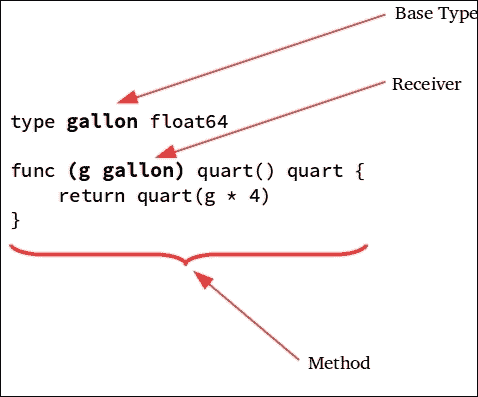
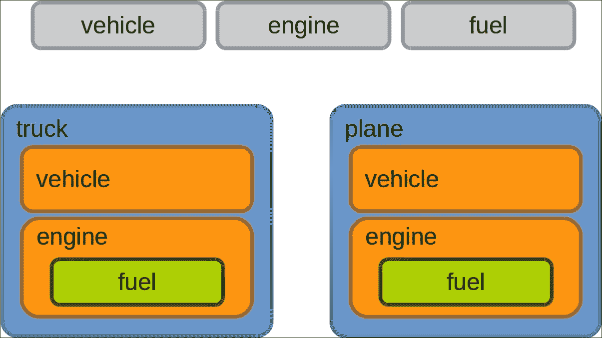
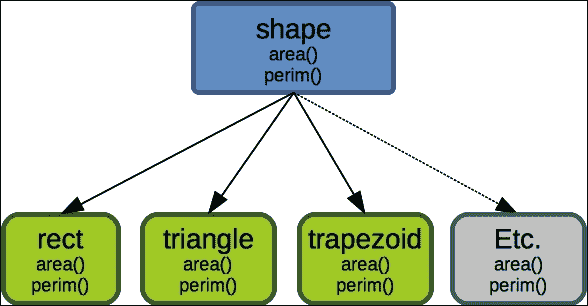
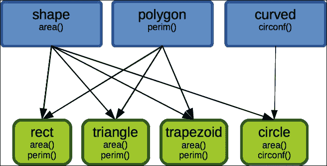
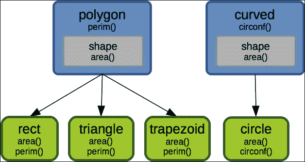

# 第八章：方法、接口和对象

使用您目前的技能，您可以编写一个使用到目前为止涵盖的基本概念的有效的 Go 程序。正如您将在本章中看到的，Go 类型系统可以支持超出简单函数的习语。虽然 Go 的设计者并不打算创建一个具有深层类层次结构的面向对象的语言，但该语言完全能够支持类型组合，具有高级特性来表达复杂对象结构的创建，如下面的主题所涵盖的那样：

+   Go 方法

+   Go 中的对象

+   接口类型

+   类型断言

# Go 方法

可以将 Go 函数定义为仅限于特定类型的范围。当函数范围限定为类型或附加到类型时，它被称为*方法*。方法的定义与任何其他 Go 函数一样。但是，它的定义包括*方法接收器*，它是放置在方法名称之前的额外参数，用于指定方法附加到的主机类型。

为了更好地说明这个概念，以下图示了定义方法涉及的不同部分。它显示了`quart`方法附加到“类型加仑”基于接收器参数“g 加仑”的接收器：



如前所述，方法具有类型的范围。因此，它只能通过已声明的值（具体或指针）使用*点表示法*来访问。以下程序显示了如何使用此表示法访问已声明的方法`quart`：

```go
package main 
import "fmt" 

type gallon float64 

func (g gallon) quart() float64 { 
   return float64(g * 4) 
} 
func main(){ 
    gal := gallon(5) 
    fmt.Println(gal.quart()) 
} 

```

golang.fyi/ch08/method_basic.go

在前面的示例中，`gal`变量被初始化为`gallon`类型。因此，可以使用`gal.quart()`访问`quart`方法。

在运行时，接收器参数提供对方法的基本类型分配的值的访问。在示例中，`quart`方法接收`g`参数，该参数传递了声明类型的值的副本。因此，当`gal`变量初始化为值`5`时，调用`gal.quart()`会将接收器参数`g`设置为`5`。因此，接下来将打印出值`20`：

```go
func main(){ 
    gal := gallon(5) 
    fmt.Println(gal.quart()) 
} 

```

重要的是要注意，方法接收器的基本类型不能是指针（也不能是接口）。例如，以下内容将无法编译：

```go
type gallon *float64    
func (g gallon) quart() float64 {
  return float64(g * 4)
}

```

以下显示了实现更通用的液体体积转换程序的源代码的较长版本。每种容积类型都接收其各自的方法，以公开与该类型相关的行为：

```go
package main 
import "fmt" 

type ounce float64 
func (o ounce) cup() cup { 
   return cup(o * 0.1250) 
} 

type cup float64 
func (c cup) quart() quart { 
   return quart(c * 0.25) 
} 
func (c cup) ounce() ounce { 
   return ounce(c * 8.0) 
} 

type quart float64 
func (q quart) gallon() gallon { 
   return gallon(q * 0.25) 
} 
func (q quart) cup() cup { 
   return cup(q * 4.0) 
} 

type gallon float64 
func (g gallon) quart() quart { 
   return quart(g * 4) 
} 

func main() { 
    gal := gallon(5) 
    fmt.Printf("%.2f gallons = %.2f quarts\n", gal, gal.quart()) 
    ozs := gal.quart().cup().ounce() 
    fmt.Printf("%.2f gallons = %.2f ounces\n", gal, ozs) 
} 

```

github.com/vladimirvivien/learning-go/ch08/methods.go

例如，将`5`加仑转换为盎司可以通过在给定值上调用适当的转换方法来完成，如下所示：

```go
gal := gallon(5) 
ozs := gal.quart().cup().ounce() 

```

整个实现使用了一个简单但有效的典型结构来表示数据类型和行为。阅读代码，它清晰地表达了其预期含义，而不依赖于繁重的类结构。

### 注意

**方法集**

通过接收器参数附加到类型的方法数量被称为类型的*方法集*。这包括具体和指针值接收器。方法集的概念在确定类型相等性、接口实现和*空接口*的空方法集的支持方面非常重要（本章中都有讨论）。

## 值和指针接收器

到目前为止，逃脱讨论的方法的一个方面是接收器是普通函数参数。因此，它们遵循 Go 函数的传值机制。这意味着调用的方法会得到从声明类型中的原始值的副本。

接收器参数可以作为基本类型的值或指针传递。例如，以下程序显示了两种方法，`half`和`double`；两者都直接更新其各自的方法接收器参数`g`的值：

```go
package main
import "fmt" 
type gallon float64 
func (g gallon) quart() float64 { 
  return float64(g * 4) 
} 
func (g gallon) half() { 
  g = gallon(g * 0.5) 
} 
func (g *gallon) double() { 
  *g = gallon(*g * 2) 
} 
func main() { 
  var gal gallon = 5 
  gal.half() 
  fmt.Println(gal) 
  gal.double() 
  fmt.Println(gal) 
} 

```

golang.fyi/ch08/receiver_ptr.go

在`half`方法中，代码使用`g = gallon(g * 0.5)`更新接收器参数。正如您所期望的那样，这不会更新原始声明的值，而是存储在`g`参数中的副本。因此，当在`main`中调用`gal.half()`时，原始值保持不变，以下内容将打印`5`：

```go
func main() { 
   var gal gallon = 5 
   gal.half() 
   fmt.Println(gal) 
} 

```

与常规函数参数类似，使用指针作为接收器参数来引用其基础值的参数允许代码对原始值进行解引用以更新它。这在以下代码片段中的`double`方法中得到了突出显示。它使用了`*gallon`类型的方法接收器，该接收器使用`*g = gallon(*g * 2)`进行更新。因此，当在`main`中调用以下内容时，它将打印出**10**的值：

```go
func main() { 
   var gal gallon = 5 
   gal.double() 
   fmt.Println(gal) 
} 

```

指针接收器参数在 Go 中被广泛使用。这是因为它们可以表达类似对象的原语，可以携带状态和行为。正如下一节所示，指针接收器以及其他类型特性是在 Go 中创建对象的基础。

# Go 中的对象

前几节的冗长介绍材料是为了引出讨论 Go 中的对象。已经提到 Go 并不是设计成传统的面向对象语言。Go 中没有定义对象或类关键字。那么，为什么我们要讨论 Go 中的对象呢？事实证明，Go 完全支持对象习语和面向对象编程实践，而不需要其他面向对象语言中复杂的继承结构。

让我们在下表中回顾一些通常归因于面向对象语言的原始特性。

| **对象特性** | **Go** | **评论** |
| --- | --- | --- |
| 对象：存储状态并公开行为的数据类型 | 是 | 在 Go 中，所有类型都可以实现这一点。没有称为类或对象的特殊类型来做到这一点。任何类型都可以接收一组方法来定义其行为，尽管`struct`类型最接近其他语言中通常称为对象的内容。 |
| 组合 | 是 | 使用诸如`struct`或`interface`（稍后讨论）的类型，可以通过组合创建对象并表达它们的多态关系。 |
| 通过接口进行子类型化 | 是 | 定义一组其他类型可以实现的行为（方法）的类型。稍后您将看到它是如何用于实现对象子类型化的。 |
| 模块化和封装 | 是 | Go 在其核心支持物理和逻辑模块化，包括包和可扩展的类型系统，以及代码元素的可见性。 |
| 类型继承 | 否 | Go 不支持通过继承实现多态性。新声明的命名类型不会继承其基础类型的所有属性，并且在类型系统中会被不同对待。因此，通过类型谱系实现继承在其他语言中很难实现。 |
| 类 | 无 | Go 中没有作为对象基础的类类型概念。Go 中的任何数据类型都可以用作对象。 |

正如前面的表所示，Go 支持通常归因于面向对象编程的大多数概念。本章的其余部分涵盖了如何将 Go 用作面向对象编程语言的主题和示例。

## 结构体作为对象

几乎所有的 Go 类型都可以通过存储状态和公开能够访问和修改这些状态的方法来扮演对象的角色。然而，`struct`类型提供了传统上归因于其他语言中对象的所有特性，例如：

+   能够承载方法

+   能够通过组合进行扩展

+   能够被子类型化（借助 Go 的`interface`类型）

本章的其余部分将基于使用`struct`类型来讨论对象。

## 对象组合

让我们从以下简单的示例开始，演示`struct`类型如何作为一个可以实现多态组合的对象。以下源代码片段实现了一个典型的结构，模拟了包括`fuel, engine`, `vehicle`, `truck`和`plane`在内的机动交通组件：

```go
type fuel int 
const ( 
    GASOLINE fuel = iota 
    BIO 
    ELECTRIC 
    JET 
) 
type vehicle struct { 
    make string 
    model string 
} 

type engine struct { 
   fuel fuel 
   thrust int 
} 
func (e *engine) start() { 
   fmt.Println ("Engine started.") 
} 

type truck struct { 
   vehicle 
   engine 
   axels int 
   wheels int 
   class int 
} 
func (t *truck) drive() { 
   fmt.Printf("Truck %s %s, on the go!\n", t.make, t.model)           
} 

type plane struct { 
   vehicle 
   engine 
   engineCount int 
   fixedWings bool 
   maxAltitude int 
} 
func (p *plane) fly() { 
   fmt.Printf( 
          "Aircraft %s %s clear for takeoff!\n", 
          p.make, p.model, 
       ) 
} 

```

golang.fyi/ch08/structobj.go

在前面的代码片段中声明的组件及其关系在下图中进行了说明，以可视化类型映射及其组成：



Go 使用*组合优于继承*原则，通过`struct`类型支持的类型嵌入机制实现多态性。在 Go 中，没有通过类型继承支持多态性。请记住，每种类型都是独立的，被认为与所有其他类型都不同。实际上，上面的模型中的语义略有问题。类型`truck`和`plane`被显示为由`vehicle`类型组成（或拥有），这听起来不正确。相反，正确的，或者至少更正确的表示应该是显示类型`truck`和`plane`*是*通过子类型关系`vehicle`。在本章的后面，我们将看到如何使用`interface`类型来实现这一点。

## 字段和方法提升

现在在前面的部分中已经建立了对象，让我们花一些时间讨论结构体内部字段、方法和嵌入类型的可见性。以下源代码片段显示了前面示例的延续。它声明并初始化了一个类型为`truck`的变量`t`和一个类型为`plane`的变量`p`。前者使用结构字面量进行初始化，后者使用点符号进行更新：

```go
func main() { 
   t := &truck { 
         vehicle:vehicle{"Ford", "F750"}, 
         engine:engine{GASOLINE+BIO,700}, 
         axels:2, 
         wheels:6, 
         class:3,     
   } 
   t.start() 
   t.drive() 

   p := &plane{} 
   p.make = "HondaJet" 
   p.model = "HA-420" 
   p.fuel = JET 
   p.thrust = 2050 
   p.engineCount = 2 
   p.fixedWings = true 
   p.maxAltitude = 43000 
   p.start() 
   p.fly() 

} 

```

golang.fyi/ch08/structobj.go

在前面的代码片段中，一个更有趣的细节是`struct`类型嵌入机制如何在使用点符号访问时提升字段和方法。例如，以下字段（`make`, `mode`, `fuel`, 和 `thrust`）都声明在`plane`类型内部嵌入的类型中：

```go
p.make = "HondaJet" 
p.model = "HA-420" 
p.fuel = JET 
p.thrust = 2050 

```

前面的字段是从它们的嵌入类型中提升出来的。当访问它们时，就好像它们是`plane`类型的成员一样，但实际上它们分别来自`vehicle`和`engine`类型。为了避免歧义，字段的名称可以被限定，如下所示：

```go
p.vehicle.make = "HondaJet" 
p.vehicle.model = "HA-420" 
p.engine.fuel = JET 
p.engine.thrust = 2050 

```

方法也可以以类似的方式提升。例如，在前面的代码中，我们看到了方法`t.start()`和`p.start()`被调用。然而，类型`truck`和`plane`都不是名为`start()`的方法的接收者。就像之前的程序中所示的那样，`start()`方法是为`engine`类型定义的。由于`engine`类型被嵌入到`truck`和`plane`类型中，`start()`方法在范围上被提升到这些封闭类型中，因此可以访问。

## 构造函数

由于 Go 不支持类，因此没有构造函数的概念。然而，在 Go 中你会遇到的一个常规习语是使用工厂函数来创建和初始化类型的值。以下代码片段显示了前面示例的一部分，已更新为使用构造函数来创建`plane`和`truck`类型的新值：

```go
type truck struct { 
   vehicle 
   engine 
   axels int 
   wheels int 
   class int 
} 
func newTruck(mk, mdl string) *truck { 
   return &truck {vehicle:vehicle{mk, mdl}} 
} 

type plane struct { 
   vehicle 
   engine 
   engineCount int 
   fixedWings bool 
   maxAltitude int 
}   
func newPlane(mk, mdl string) *plane { 
   p := &plane{} 
   p.make = mk 
   p.model = mdl 
   return p 
} 

```

golang.fyi/ch08/structobj2.go

尽管不是必需的，但提供一个函数来帮助初始化复合值，比如一个结构体，会增加代码的可用性。它提供了一个地方来封装可重复的初始化逻辑，可以强制执行验证要求。在前面的例子中，构造函数`newTruck`和`newPlane`都传递了制造和型号信息来创建和初始化它们各自的值。

# 接口类型

当您与已经使用 Go 一段时间的人交谈时，他们几乎总是将接口列为他们最喜欢的语言特性之一。Go 中的接口概念，类似于 Java 等其他语言，是一组方法，用作描述行为的模板。然而，Go 接口是由`interface{}`文字指定的类型，用于列出满足接口的一组方法。以下示例显示了将`shape`变量声明为接口：

```go
var shape interface { 
    area() float64 
    perim() float64 
} 

```

在先前的代码片段中，`shape`变量被声明并分配了一个未命名类型，`interface{area()float64; perim()float64}`。使用未命名的`interface`文字类型声明变量并不是很实用。使用惯用的 Go 方式，几乎总是将`interface`类型声明为命名的`type`。可以重写先前的代码片段以使用命名的接口类型，如以下示例所示：

```go
type shape interface { 
   area() float64 
   perim() float64 
} 
var s shape 

```

## 实现接口

Go 中接口的有趣之处在于它们是如何实现和最终使用的。实现 Go 接口是隐式完成的。不需要单独的元素或关键字来指示实现的意图。任何定义了`interface`类型的方法集的类型都会自动满足其实现。

以下源代码显示了`rect`类型作为`shape`接口类型的实现。`rect`类型被定义为具有接收器方法`area`和`perim`的`struct`。这一事实自动使`rect`成为`shape`的实现：

```go
type shape interface { 
   area() float64 
   perim() float64 
} 

type rect struct { 
   name string 
   length, height float64 
} 

func (r *rect) area() float64 { 
   return r.length * r.height 
} 

func (r *rect) perim() float64 { 
   return 2*r.length + 2*r.height 
} 

```

golang.fyi/ch08/interface_impl.go

## 使用 Go 接口进行子类型化

在讨论对象时，曾提到 Go 在构建对象时更青睐组合（*具有*）关系。虽然如此，Go 也可以使用接口通过子类型化来表达对象之间的“是一个”关系。在我们先前的示例中，可以认为`rect`类型（以及实现`area`和`perim`方法的任何其他类型）可以被视为`shape`的子类型，如下图所示：



正如您可能期望的那样，`shape`的任何子类型都可以参与表达式或作为函数（或方法）参数传递，其中期望`shape`类型。在以下代码片段中，先前定义的`rect`和`triangle`类型都能够传递给`shapeInfo(shape)`函数，以返回包含形状计算的`string`值：

```go
type triangle struct { 
   name string 
   a, b, c float64 
} 

func (t *triangle) area() float64 { 
   return 0.5*(t.a * t.b) 
} 

func (t *triangle) perim() float64 { 
   return t.a + t.b + math.Sqrt((t.a*t.a) + (t.b*t.b)) 
} 

func (t *triangle) String() string { 
   return fmt.Sprintf( 
         "%s[sides: a=%.2f b=%.2f c=%.2f]", 
         t.name, t.a, t.b, t.c, 
   ) 
} 
func shapeInfo(s shape) string { 
   return fmt.Sprintf( 
         "Area = %.2f, Perim = %.2f", 
         s.area(), s.perim(), 
   ) 
} 

func main() { 
   r := &      rect{"Square", 4.0, 4.0} 
   fmt.Println(r, "=>", shapeInfo(r)) 

   t := &      triangle{"Right Triangle", 1,2,3} 
   fmt.Println(t, "=>", shapeInfo(t)) 
} 

```

golang.fyi/ch08/interface_impl.go

## 实现多个接口

接口的隐式机制允许任何命名类型同时满足多个接口类型。这只需让给定类型的方法集与要实现的每个`interface`类型的方法相交即可实现。让我们重新实现先前的代码以展示如何实现这一点。引入了两个新接口，`polygon`和`curved`，以更好地捕获和分类形状的信息和行为，如以下代码片段所示：

```go
type shape interface { 
   area() float64 
} 

type polygon interface { 
   perim() 
} 

type curved interface { 
   circonf() 
} 
type rect struct {...} 
func (r *rect) area() float64 { 
   return r.length * r.height 
} 
func (r *rect) perim() float64 { 
   return 2*r.length + 2*r.height 
} 

type triangle struct {...} 
func (t *triangle) area() float64 { 
   return 0.5*(t.a * t.b) 
} 
func (t *triangle) perim() float64 { 
   return t.a + t.b + math.Sqrt((t.a*t.a) + (t.b*t.b)) 
} 

type circle struct { ... } 
func (c *circle) area() float64 { 
   return math.Pi * (c.rad*c.rad) 
} 
func (c *circle) circonf() float64 { 
   return 2 * math.Pi * c.rad 
} 

```

golang.fyi/ch08/interface_impl2.go

先前的源代码片段显示了类型如何通过简单声明满足接口的方法集来自动满足多个接口。如下图所示：



## 接口嵌入

`interface`类型的另一个有趣方面是它支持类型嵌入（类似于`struct`类型）。这使您可以以最大程度地重用类型的方式来构造您的类型。继续使用形状示例，以下代码片段通过将形状嵌入到其他两种类型中，重新组织并将先前的接口数量从三个减少到两个：

```go
type shape interface { 
   area() float64 
} 

type polygon interface { 
   shape 
   perim() 
} 

type curved interface { 
   shape 
   circonf() 
} 

```

golang.fyi/ch08/interface_impl3.go

以下插图显示了如何组合接口类型，以便*是一个*关系仍然满足代码组件之间的关系：



在嵌入接口类型时，封闭类型将继承嵌入类型的方法集。如果嵌入类型导致方法签名冲突，编译器将发出警告。嵌入成为一个至关重要的特性，特别是当代码应用类型检查时。它允许类型汇总类型信息，从而减少不必要的断言步骤（类型断言稍后讨论）。

## 空接口类型

`interface{}` 类型，或空 `interface` 类型，是具有空方法集的 `interface` 类型的文字表示。根据我们迄今为止的讨论，可以推断出 *所有类型都实现了空接口*，因为所有类型都可以具有零个或多个成员的方法集。

当一个变量被赋予 `interface{}` 类型时，编译器会放松其构建时的类型检查。然而，该变量仍然携带可以在运行时查询的类型信息。下面的代码说明了这是如何工作的：

```go
func main() { 
   var anyType interface{} 
   anyType = 77.0 
   anyType = "I am a string now" 
   fmt.Println(anyType) 

   printAnyType("The car is slow") 
   m := map[string] string{"ID":"12345", "name":"Kerry"} 
   printAnyType(m) 
   printAnyType(1253443455) 
} 

func printAnyType(val interface{}) { 
   fmt.Println(val) 
} 

```

golang.fyi/ch08/interface_empty.go

在前面的代码中，`anyType` 变量被声明为 `interface{}` 类型。它能够被赋予不同类型的值，而不会受到编译器的投诉：

```go
anyType = 77.0 
anyType = "I am a string now" 

```

`printAnyType()` 函数以 `interface{}` 类型的参数。这意味着该函数可以传递任何有效类型的值，如下所示：

```go
printAnyType("The car is slow") 
m := map[string] string{"ID":"12345", "name":"Kerry"} 
printAnyType(m) 
printAnyType(1253443455) 

```

空接口对于 Go 语言的习惯用法至关重要。将类型检查延迟到运行时使得语言更具动态性，而不完全牺牲强类型。Go 语言提供了诸如类型断言（下文介绍）的机制，以在运行时查询接口所携带的类型信息。

# 类型断言

当将接口（空或其他）分配给变量时，它携带可以在运行时查询的类型信息。类型断言是 Go 语言中可用的一种机制，用于将变量（`interface` 类型）习惯上缩小到存储在变量中的具体类型和值。下面的示例使用类型断言在 `eat` 函数中选择要在 `eat` 函数中选择的 `food` 类型：

```go
type food interface { 
   eat() 
} 

type veggie string 
func (v veggie) eat() { 
   fmt.Println("Eating", v) 
} 

type meat string 
func (m meat) eat() { 
   fmt.Println("Eating tasty", m) 
} 

func eat(f food) { 
   veg, ok := f.(veggie) 
   if ok { 
         if veg == "okra" { 
               fmt.Println("Yuk! not eating ", veg) 
         }else{ 
               veg.eat() 
         } 

         return 
   } 

   mt, ok := f.(meat) 
   if ok { 
         if mt == "beef" { 
               fmt.Println("Yuk! not eating ", mt) 
         }else{ 
               mt.eat() 
         } 
         return 
   } 

   fmt.Println("Not eating whatever that is: ", f) 
} 

```

golang.fyi/interface_assert.go

`eat` 函数以 `food` 接口类型作为参数。代码展示了如何使用习惯用法的 Go 语言来使用断言提取存储在 `f` 接口参数中的静态类型和值。类型断言表达式的一般形式如下所示：

*<interface_variable>.(具体类型名称)*

表达式以接口类型的变量开头。然后跟着一个点和括号括起来的具体断言的类型。类型断言表达式可以返回两个值：一个是具体值（从接口中提取），第二个是一个布尔值，指示断言的成功，如下所示：

*value, boolean := <interface_variable>.(具体类型名称)*

这是在下面的代码片段中显示的断言形式（从之前的示例中提取），用于将 `f` 参数缩小到特定类型的 `food`。如果断言的类型是 `meat`，则代码将继续测试 `mt` 变量的值：

```go
mt, ok := f.(meat) 
if ok { 
   if mt == "beef" { 
         fmt.Println("Yuk! not eating ", mt) 
   }else{ 
         mt.eat() 
   } 
   return 
} 

```

类型断言表达式也可以只返回值，如下所示：

*value := <interface_variable>**.**(具体类型名称)*

这种形式的断言是有风险的，因为如果接口变量中存储的值不是所断言的类型，运行时将导致程序崩溃。只有在有其他保障可以防止或优雅地处理崩溃时才使用这种形式。

最后，当您的代码需要多个断言来在运行时测试多种类型时，更好的断言习惯是使用类型 `switch` 语句。它使用 `switch` 语句语义来使用 case 子句从接口值中查询静态类型信息。前面与食品相关的示例中的 `eat` 函数可以更新为使用类型 `switch` 而不是 `if` 语句，如下面的代码片段所示：

```go
func eat(f food) { 
   swtich morsel := f.(type){ 
   case veggie: 
         if morsel == "okra" { 
               fmt.Println("Yuk! not eating ", mosel) 
         }else{ 
               mosel.eat() 
         } 
   case meat: 
         if morsel == "beef" { 
               fmt.Println("Yuk! not eating ", mosel) 
         }else{ 
               mosel.eat() 
         }            
   default: 
         fmt.Println("Not eating whatever that is: ", f) 
   } 
} 

```

golang.fyi/interface_assert2.go

请注意，代码的可读性大大提高。它可以支持任意数量的情况，并且清晰地布局，具有视觉线索，使人们能够轻松推理。`switch`类型还通过简单指定一个默认情况来消除了恐慌问题，该默认情况可以处理在情况子句中没有明确处理的任何类型。

# 总结

本章试图以广泛且在某种程度上全面的视角来介绍几个重要主题，包括在 Go 中的方法、接口和对象。本章首先介绍了如何使用接收器参数将方法附加到类型。接下来介绍了对象以及如何在 Go 中创建符合惯例的基于对象的编程。最后，本章全面概述了接口类型以及它在支持 Go 中对象语义方面的应用。下一章将引导读者了解 Go 中最基本的概念之一，这也是 Go 在开发者中引起轰动的原因：并发！
