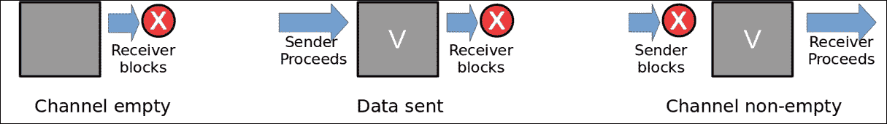
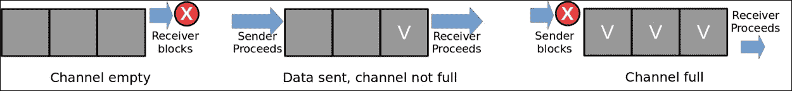

# 第九章。并发性

并发被认为是 Go 最吸引人的特性之一。语言的采用者沉迷于使用其原语来表达正确的并发实现的简单性，而不会出现通常伴随此类努力的陷阱。本章涵盖了理解和创建并发 Go 程序的必要主题，包括以下内容：

+   Goroutines

+   通道

+   编写并发程序

+   sync 包

+   检测竞争条件

+   Go 中的并行性

# Goroutines

如果您在其他语言中工作过，比如 Java 或 C/C++，您可能熟悉并发的概念。这是程序能够独立运行两个或多个执行路径的能力。通常通过直接向程序员公开线程原语来创建和管理并发来实现这一点。

Go 有自己的并发原语，称为*goroutine*，它允许程序启动一个函数（例程）以独立于其调用函数执行。Goroutines 是轻量级的执行上下文，它们在少量 OS 支持的线程中进行多路复用，并由 Go 的运行时调度程序进行调度。这使它们可以在不需要真正的内核线程的开销要求的情况下轻松创建。因此，Go 程序可以启动数千（甚至数十万）个 goroutine，对性能和资源降级的影响很小。

## go 语句

使用`go`语句启动 goroutines 如下所示：

*go <function or expression>*

使用`go`关键字后跟要安排执行的函数创建 goroutine。指定的函数可以是现有函数、匿名函数或调用函数的表达式。以下代码片段显示了 goroutines 的使用示例：

```go
func main() { 
   go count(10, 50, 10) 
   go count(60, 100, 10) 
   go count(110, 200, 20) 
} 
func count(start, stop, delta int) { 
   for i := start; i <= stop; i += delta { 
         fmt.Println(i) 
   } 
} 

```

golang.fyi/ch09/goroutine0.go

在前面的代码示例中，当在`main`函数中遇到`go count()`语句时，它会在独立的执行上下文中启动`count`函数。`main`和`count`函数将同时执行。作为副作用，`main`将在任何`count`函数有机会向控制台打印任何内容之前完成。

在本章的后面，我们将看到如何在 goroutines 之间以惯用方式处理同步。现在，让我们使用`fmt.Scanln()`来阻塞并等待键盘输入，如下示例所示。在这个版本中，同时运行的函数有机会在等待键盘输入时完成：

```go
func main() { 
   go count(10, 30, 10) 
   go count(40, 60, 10) 
   go count(70, 120, 20) 
   fmt.Scanln() // blocks for kb input 
} 

```

golang.fyi/ch09/goroutine1.go

Goroutines 也可以直接在`go`语句中定义为函数文字，如下面代码片段中所示的示例的更新版本：

```go
func main() { 
   go count(10, 30, 10) 
   go func() { 
         count(40, 60, 10) 
   }() 
   ... 
}  

```

golang.fyi/ch09/goroutine2.go

函数文字提供了一个方便的习语，允许程序员直接在`go`语句的位置组装逻辑。当使用带有函数文字的`go`语句时，它被视为具有对非局部变量的词法访问权限的常规闭包，如下例所示：

```go
func main() { 
   start := 0 
   stop := 50 
   step := 5 
   go func() { 
         count(start, stop, step) 
   }() 
} 

```

golang.fyi/ch09/goroutine3.go

在前面的代码中，goroutine 能够访问和使用变量`start`、`stop`和`step`。只要在闭包中捕获的变量在 goroutine 启动后不会发生更改，这是安全的。如果这些值在闭包之外更新，可能会导致竞争条件，从而导致 goroutine 在计划运行时读取意外值。

以下片段显示了一个示例，其中 goroutine 闭包捕获了循环中的变量`j`：

```go
func main() { 
   starts := []int{10,40,70,100} 
   for _, j := range starts{ 
         go func() { 
               count(j, j+20, 10) 
         }() 
   } 
} 

```

golang.fyi/ch09/goroutine4.go

由于`j`在每次迭代中都会更新，所以不可能确定闭包将读取什么值。在大多数情况下，goroutine 闭包将在执行时看到`j`的最后更新值。可以通过在 goroutine 的函数文字中将变量作为参数传递来轻松解决这个问题，如下所示：

```go
func main() { 
   starts := []int{10,40,70,100} 
   for _, j := range starts{ 
         go func(s int) { 
               count(s, s+20, 10) 
         }(j) 
   } 
} 

```

golang.fyi/ch09/goroutine5.go

每次循环迭代时调用的 goroutine 闭包通过函数参数接收`j`变量的副本。这将创建`j`值的本地副本，并在调度运行 goroutine 时使用正确的值。

## Goroutine 调度

总的来说，所有的 goroutine 都是独立运行的，如下图所示。创建 goroutine 的函数不会等待它返回，除非有阻塞条件，它会继续执行自己的执行流。本章后面将介绍协调 goroutine 的同步习语：


Go 的运行时调度程序使用一种协作调度形式来调度 goroutine。默认情况下，调度程序将允许运行的 goroutine 执行完成。但是，如果发生以下事件之一，调度程序将自动让出执行权给另一个 goroutine：

+   在执行 goroutine 中遇到`go`语句

+   遇到通道操作（通道稍后会介绍）

+   遇到阻塞的系统调用（例如文件或网络 IO）

+   在垃圾回收周期完成后

调度程序将调度排队的 goroutine，准备在运行的 goroutine 中遇到前面的事件之一时进入执行。重要的是要指出，调度程序不保证 goroutine 的执行顺序。例如，当执行以下代码片段时，输出将以任意顺序打印每次运行：

```go
func main() { 
   go count(10, 30, 10) 
   go count(40, 60, 10) 
   go count(70, 120, 20) 
   fmt.Scanln() // blocks for kb input 
} 
func count(start, stop, delta int) { 
   for i := start; i <= stop; i += delta { 
         fmt.Println(i) 
   } 
} 

```

golang.fyi/ch09/goroutine1.go

以下显示了前一个程序的可能输出：

```go
10
70
90
110
40
50
60
20
30

```

# 通道

谈论并发时，一个自然的关注点是数据的安全性和并发执行代码之间的同步。如果您在诸如 Java 或 C/C++等语言中进行并发编程，您可能熟悉确保运行线程可以安全访问共享内存值以实现线程之间通信和同步所需的有时脆弱的协调。

这是 Go 与其 C 血统不同的地方之一。Go 不是通过使用共享内存位置让并发代码进行通信，而是使用通道作为运行的 goroutine 之间通信和共享数据的通道。博客文章*Effective Go*（[`golang.org/doc/effective_go.html`](https://golang.org/doc/effective_go.html)）将这个概念简化为以下口号：

*不要通过共享内存进行通信；相反，通过通信共享内存。*

### 注意

通道的概念源于著名计算机科学家 C.A. Hoare 的**通信顺序进程**（**CSP**）工作，用于使用通信原语对并发进行建模。正如本节将讨论的那样，通道提供了在运行的 goroutine 之间同步和安全地通信数据的手段。

本节讨论了 Go 通道类型，并深入了解了其特性。稍后，您将学习如何使用通道来创建并发程序。

## 通道类型

通道类型声明了一个通道，其中只能通过通道发送或接收给定元素类型的值。`chan`关键字用于指定通道类型，如以下声明格式所示：

*chan <element type>*

以下代码片段声明了一个双向通道类型`chan int`，分配给变量`ch`，用于通信整数值：

```go
func main() { 
   var ch chan int 
   ... 
} 

```

在本章后面，我们将学习如何使用通道在运行程序的并发部分之间发送数据。

### 发送和接收操作

Go 使用`<-`（箭头）运算符来指示通道内的数据移动。以下表总结了如何从通道发送或接收数据：

| **示例** | **操作** | **描述** |
| --- | --- | --- |
| `intCh <- 12` | 发送 | 当箭头放置在值、变量或表达式的左侧时，表示向指向的通道进行发送操作。在这个例子中，`12`被发送到`intCh`通道中。 |
| `value := <- intCh` | 接收 | 当`<-`操作符放置在通道的左侧时，表示从通道接收操作。`value`变量被赋予从`intCh`通道接收到的值。 |

未初始化的通道具有*nil*零值，并且必须使用内置的*make*函数进行初始化。正如将在接下来的章节中讨论的那样，通道可以根据指定的容量初始化为无缓冲或带缓冲。每种类型的通道都有不同的特性，在不同的并发构造中得到利用。

## 无缓冲通道

当`make`函数在没有容量参数的情况下被调用时，它会返回一个双向*无缓冲*通道。以下代码片段展示了创建类型为`chan int`的无缓冲通道：

```go
func main() { 
   ch := make(chan int) // unbuffered channel 
   ... 
} 

```

无缓冲通道的特性如下图所示：



在前面的图中（从左到右），显示了无缓冲通道的工作原理：

+   如果通道为空，接收方会阻塞，直到有数据

+   发送方只能向空通道发送数据，并且会阻塞，直到下一个接收操作

+   当通道有数据时，接收方可以继续接收数据。

向无缓冲通道发送数据，如果操作没有包装在 goroutine 中，很容易导致*死锁*。以下代码在向通道发送`12`后将会阻塞：

```go
func main() { 
   ch := make(chan int) 
   ch <- 12 // blocks   
   fmt.Println(<-ch) 
} 

```

golang.fyi/ch09/chan-unbuff0.go

当运行前面的程序时，将得到以下结果：

```go
$> go run chan-unbuff0.go
fatal error: all goroutines are asleep - deadlock!

```

请记住，向无缓冲通道发送数据时，发送方会立即阻塞。这意味着任何后续的语句，例如接收通道的操作，都将无法到达，导致死锁。以下代码展示了向无缓冲通道发送数据的正确方式：

```go
func main() { 
   ch := make(chan int) 
   go func() { ch <- 12 }() 
   fmt.Println(<-ch) 
} 

```

golang.fyi/ch09/chan-unbuff1.go

请注意，发送操作被包装在一个匿名函数中，作为一个单独的 goroutine 调用。这允许`main`函数在不阻塞的情况下进行接收操作。正如您将在后面看到的，无缓冲通道的这种阻塞特性被广泛用作 goroutine 之间的同步和协调习语。

## 带缓冲通道

当`make`函数使用容量参数时，它会返回一个双向*带缓冲*通道，如下面的代码片段所示：

```go
func main 
   ch := make(chan int, 3) // buffered channel  
} 

```

前面的代码将创建一个容量为`3`的带缓冲通道。带缓冲通道作为先进先出的阻塞队列进行操作，如下图所示：



在前面的图中所示的带缓冲通道具有以下特性：

+   当通道为空时，接收方会阻塞，直到至少有一个元素

+   只要通道未达到容量，发送方就会成功

+   当通道达到容量时，发送方会阻塞，直到至少接收到一个元素

使用带缓冲的通道，可以在同一个 goroutine 中发送和接收值而不会导致死锁。以下是使用容量为`4`的带缓冲通道进行发送和接收的示例：

```go
func main() { 
   ch := make(chan int, 4) 
   ch <- 2 
   ch <- 4 
   ch <- 6 
   ch <- 8 

   fmt.Println(<-ch) 
   fmt.Println(<-ch) 
   fmt.Println(<-ch) 
   fmt.Println(<-ch) 

} 

```

golang.fyi/ch09/chan0.go

在前面的示例中，该代码能够将值`2`、`4`、`6`和`8`发送到`ch`通道，而不会出现阻塞的风险。四个`fmt.Println(<-ch)`语句用于依次接收通道中的值。然而，如果在第一个接收操作之前添加第五个发送操作，代码将会出现死锁，如下面的代码片段所示：

```go
func main() { 
   ch := make(chan int, 4) 
   ch <- 2 
   ch <- 4 
   ch <- 6 
   ch <- 8 
   ch <- 10  
   fmt.Println(<-ch) 
   ... 
} 

```

在本章的后面，您将会了解更多关于使用通道进行通信的惯用且安全的方法。

## 单向通道

在声明时，通道类型还可以包括单向操作符（再次使用 `<-` 箭头）来指示通道是只发送还是只接收的，如下表所示：

| **声明** | **操作** |
| --- | --- |

| `<-` *chan <element type>* | 声明一个只接收的通道，如后面所示。

```go
var inCh chan<- int
```

|

| *chan* `<-`*<element type>* | 声明一个只发送的通道，如后面所示。

```go
var outCh <-chan int
```

|

下面的代码片段显示了函数 `makeEvenNums`，它具有一个类型为 `chan <- int` 的只发送通道参数：

```go
func main() { 
   ch := make(chan int, 10) 
   makeEvenNums(4, ch) 

   fmt.Println(<-ch) 
   fmt.Println(<-ch) 
   fmt.Println(<-ch) 
   fmt.Println(<-ch) 
} 

func makeEvenNums(count int, in chan<- int) { 
   for i := 0; i < count; i++ { 
         in <- 2 * i 
   } 
} 

```

golang.fyi/ch09/chan1.go

由于通道的方向性已经在类型中确定，访问违规将在编译时被检测到。因此，在上一个示例中，`in` 通道只能用于接收操作。

双向通道可以显式或自动地转换为单向通道。例如，当从 `main()` 调用 `makeEvenNums()` 时，它接收双向通道 `ch` 作为参数。编译器会自动将通道转换为适当的类型。

## 通道长度和容量

`len` 和 `cap` 函数可以分别用于返回通道的长度和容量。`len` 函数返回接收者读取通道之前通道中排队的元素的当前数量。例如，以下代码片段将打印 **2**：

```go
func main() { 
   ch := make(chan int, 4) 
   ch <- 2 
   ch <- 2 
   fmt.Println(len(ch)) 
} 

```

`cap` 函数返回通道类型的声明容量，与长度不同，容量在通道的整个生命周期中保持不变。

### 注意

非缓冲通道的长度和容量均为零。

## 关闭通道

一旦通道初始化，它就准备好进行发送和接收操作。通道将保持在打开状态，直到使用内置的 *close* 函数强制关闭，如下例所示：

```go
func main() { 
   ch := make(chan int, 4) 
   ch <- 2 
   ch <- 4 
   close(ch) 
   // ch <- 6 // panic, send on closed channel 

   fmt.Println(<-ch) 
   fmt.Println(<-ch) 
   fmt.Println(<-ch) // closed, returns zero value for element 

} 

```

golang.fyi/ch09/chan2.go

一旦通道关闭，它具有以下属性：

+   后续的发送操作将导致程序恐慌

+   接收操作永远不会阻塞（无论是缓冲还是非缓冲）

+   所有接收操作都返回通道元素类型的零值

在上面的片段中，`ch` 通道在两次发送操作后关闭。如注释中所示，第三次发送操作将导致恐慌，因为通道已关闭。在接收端，代码在通道关闭之前获取了两个元素。第三次接收操作返回 `0`，即通道元素的零值。

Go 提供了接收操作的长形式，它返回从通道读取的值，后面跟着一个布尔值，指示通道的关闭状态。这可以用于正确处理从关闭通道中的零值，如下例所示：

```go
func main() { 
   ch := make(chan int, 4) 
   ch <- 2 
   ch <- 4 
   close(ch) 

   for i := 0; i < 4; i++ { 
         if val, opened := <-ch; opened { 
               fmt.Println(val) 
         } else { 
               fmt.Println("Channel closed!") 
         } 
   } 
} 

```

golang.fyi/ch09/chan3.go

# 编写并发程序

到目前为止，关于 goroutines 和通道的讨论一直故意分开，以确保每个主题都得到适当的覆盖。然而，当它们结合起来创建并发程序时，通道和 goroutines 的真正力量才得以实现，正如本节所介绍的。

## 同步

通道的主要用途之一是在运行的 goroutines 之间进行同步。为了说明这个用例，让我们来看一下下面的代码，它实现了一个单词直方图。该程序从 `data` 切片中读取单词，然后在一个单独的 goroutine 中收集每个单词的出现次数：

```go
func main() { 
   data := []string{ 
         "The yellow fish swims slowly in the water", 
         "The brown dog barks loudly after a drink ...", 
         "The dark bird bird of prey lands on a small ...", 
   } 

   histogram := make(map[string]int) 
   done := make(chan bool) 

   // splits and count words 
   go func() { 
         for _, line := range data { 
               words := strings.Split(line, " ") 
               for _, word := range words { 
                     word = strings.ToLower(word) 
                     histogram[word]++ 
               } 
         } 
         done <- true 
   }() 

   if <-done { 
         for k, v := range histogram { 
               fmt.Printf("%s\t(%d)\n", k, v) 
         } 
   } 
} 

```

golang.fyi/ch09/pattern0.go

在上一个示例中的代码中，使用 `done := make(chan bool)` 创建了一个通道，该通道将用于同步程序中运行的两个 goroutines。`main` 函数启动了一个次要的 goroutine，它执行单词计数，然后继续执行，直到在 `<-done` 表达式处阻塞，导致它等待。

与此同时，次要的 goroutine 运行直到完成其循环。然后，它向 `done` 通道发送一个值，使用 `done <- true`，导致被阻塞的 `main` 例程变得不再阻塞，并继续执行。

### 注意

前面的代码存在一个可能导致竞争条件的错误。在本章后面将介绍修正方法。

在前一个示例中，代码分配并实际发送了一个布尔值，用于同步。经过进一步检查，可以清楚地看到通道中的值是无关紧要的，我们只是希望它发出信号。因此，我们可以将同步习语进一步简化为一个俗语形式，如下面的代码片段所示：

```go
func main() { 
... 
   histogram := make(map[string]int) 
   done := make(chan struct{}) 

   // splits and count 
   go func() { 
         defer close(done) // closes channel upon fn return 
         for _, line := range data { 
               words := strings.Split(line, " ") 
               for _, word := range words { 
                     word = strings.ToLower(word) 
                     histogram[word]++ 
               } 
         } 
   }() 

   <-done // blocks until closed 

   for k, v := range histogram { 
         fmt.Printf("%s\t(%d)\n", k, v) 
   } 
} 

```

golang.fyi/ch09/pattern1.go

这个代码版本通过以下方式实现了 goroutine 同步：

+   done 通道，声明为类型`chan struct{}`

+   主 goroutine 在接收表达式`<-done`处阻塞

+   当 done 通道关闭时，所有接收方都能成功接收，而不会阻塞。

尽管信令是使用不同的结构完成的，但这个代码版本等同于第一个版本（`pattern0.go`）。空的`struct{}`类型不存储任何值，严格用于信令。这个代码版本关闭了`done`通道（而不是发送一个值）。这样做的效果是允许主 goroutine 解除阻塞并继续执行。

## 数据流

通道的一个自然用途是从一个 goroutine 流式传输数据到另一个。这种模式在 Go 代码中非常常见，为了使其工作，必须完成以下工作：

+   不断在通道上发送数据

+   不断接收来自该通道的传入数据

+   发出流的结束信号，以便接收方可以停止

正如你将看到的，所有这些都可以使用一个单一的通道完成。以下代码片段是前一个示例的重写。它展示了如何使用单一通道从一个 goroutine 流式传输数据到另一个。同一个通道也被用作信令设备来指示流的结束：

```go
func main(){ 
... 
   histogram := make(map[string]int) 
   wordsCh := make(chan string) 

   // splits lines and sends words to channel 
   go func() { 
         defer close(wordsCh) // close channel when done 
         for _, line := range data { 
               words := strings.Split(line, " ") 
               for _, word := range words { 
                     word = strings.ToLower(word) 
                     wordsCh <- word 
               } 
         } 
   }() 

   // process word stream and count words 
   // loop until wordsCh is closed 
   for { 
         word, opened := <-wordsCh 
         if !opened { 
               break 
         } 
         histogram[word]++ 
   } 

   for k, v := range histogram { 
         fmt.Printf("%s\t(%d)\n", k, v) 
   } 
} 

```

golang.fyi/ch09/pattern2.go

这个代码版本与以前一样生成了单词直方图，但引入了不同的方法。这是通过下表中显示的代码部分实现的：

| **代码** | **描述** |
| --- | --- |

|

```go
wordsCh := make(chan string)   

```

| 数据流使用的通道。 |
| --- |

|

```go
wordsCh <- word   

```

| 发送 goroutine 循环遍历文本行并逐个发送单词。然后它会阻塞，直到单词被接收（主）goroutine 接收到。 |
| --- |

|

```go
defer close(wordsCh)   

```

| 当单词不断被接收（见后文）时，发送 goroutine 在完成时关闭通道。这将是接收方应该停止的信号。 |
| --- |

|

```go
for {   
  word, opened := <-wordsCh   
  if !opened {   
    break   
  }   
  histogram[word]++   
}   

```

| 这是接收方的代码。它被放在一个循环中，因为它不知道要预期多少数据。在每次循环迭代中，代码执行以下操作：

+   从通道中拉取数据

+   检查通道的开放状态

+   如果关闭了，就跳出循环

+   否则记录直方图

|

## 使用`for…range`接收数据

前一个模式在 Go 中非常常见，这种习语已经内置到语言中，以`for…range`语句的形式存在：

*for <elemem> := range <channel>{...}*

在每次迭代中，这个`for…range`语句将阻塞，直到它从指定的通道接收到传入的数据，就像下面的代码片段所示：

```go
func main(){                           
... 
   go func() { 
         defer close(wordsCh) 
         for _, line := range data { 
               words := strings.Split(line, " ") 
               for _, word := range words { 
                     word = strings.ToLower(word) 
                     wordsCh <- word 
               } 
         } 
   }() 

   for word := range wordsCh { 
         histogram[word]++ 
   } 
... 
} 

```

golang.fyi/ch09/pattern3.go

前面的代码展示了使用`for-range`语句的更新版本，`for word := range wordsCh`。它会连续地从`wordsCh`通道接收到值。当通道被关闭（来自 goroutine），循环会自动中断。

### 注意

始终记得关闭通道，以便接收方得到适当的信号。否则，程序可能会陷入死锁，导致恐慌。

## 生成器函数

通道和 goroutine 提供了一种自然的基础，用于使用生成器函数实现一种生产者/生产者模式。在这种方法中，一个 goroutine 被包装在一个函数中，该函数生成通过函数返回的通道发送的值。消费者 goroutine 接收这些值，因为它们被生成。

单词直方图已经更新为使用这种模式，如下面的代码片段所示：

```go
func main() { 
   data := []string{"The yellow fish swims...", ...} 
   histogram := make(map[string]int) 

   words := words(data) // returns handle to data channel 
   for word := range words { 
         histogram[word]++ 
   } 
... 
} 

// generator function that produces data 
func words(data []string) <-chan string { 
   out := make(chan string) 
   go func() { 
         defer close(out) // closes channel upon fn return 
         for _, line := range data { 
               words := strings.Split(line, " ") 
               for _, word := range words { 
                     word = strings.ToLower(word) 
                     out <- word 
               } 
         } 
   }() 
   return out 
} 

```

golang.fyi/ch09/pattern4.go

在这个例子中，生成器函数声明为`func words(data []string) <-chan string`，返回一个只接收字符串元素的通道。消费者函数，在这种情况下是`main()`，接收生成器函数发出的数据，并使用`for…range`循环进行处理。

## 从多个通道选择

有时，并发程序需要同时处理多个通道的发送和接收操作。为了方便这样的努力，Go 语言支持`select`语句，它可以在多个发送和接收操作之间进行选择：

*select {*

*case <send_ or_receive_expression>:*

*default:*

*}*

`case`语句类似于`switch`语句，具有`case`子句。但是，`select`语句会选择成功的发送或接收情况之一。如果两个或更多通信情况恰好在同一时间准备就绪，将随机选择一个。当没有其他情况成功时，默认情况总是被选择。

以下代码片段更新了直方图代码，以说明`select`语句的使用。生成器函数`words`在两个通道`out`之间进行选择，以前发送数据的通道，以及作为参数传递的新通道`stopCh`，用于检测停止发送数据的中断信号：

```go
func main() { 
... 
   histogram := make(map[string]int) 
   stopCh := make(chan struct{}) // used to signal stop 

   words := words(stopCh, data) // returns handle to channel 
   for word := range words { 
         if histogram["the"] == 3 { 
               close(stopCh) 
         } 
         histogram[word]++ 
   } 
... 
} 

func words(stopCh chan struct{}, data []string) <-chan string { 
   out := make(chan string) 
   go func() { 
         defer close(out) // closes channel upon fn return 
         for _, line := range data { 
               words := strings.Split(line, " ") 
               for _, word := range words { 
                     word = strings.ToLower(word) 
                     select { 
                     case out <- word: 
                     case <-stopCh: // succeeds first when close 
                         return 
                     } 
               } 
         } 
   }() 
   return out 
} 

```

golang.fyi/ch09/pattern5.go

在前面的代码片段中，`words`生成器函数将选择成功的第一个通信操作：`out <- word`或`<-stopCh`。只要`main()`中的消费者代码继续从`out`通道接收数据，发送操作就会首先成功。但是请注意，当`main()`中的代码遇到第三个`"the"`实例时，它会关闭`stopCh`通道。当这种情况发生时，它将导致选择语句中的接收情况首先进行，从而导致 goroutine 返回。

## 通道超时

Go 并发中常见的一种习语是使用之前介绍的`select`语句来实现超时。这通过使用`select`语句在给定的时间段内等待通道操作成功来实现，使用`time`包的 API（[`golang.org/pkg/time/`](https://golang.org/pkg/time/)）。

以下代码片段显示了一个单词直方图示例的版本，如果程序计算和打印单词的时间超过 200 微秒，则会超时：

```go
func main() { 
   data := []string{...} 
   histogram := make(map[string]int) 
   done := make(chan struct{}) 

   go func() { 
         defer close(done) 
         words := words(data) // returns handle to channel 
         for word := range words { 
               histogram[word]++ 
         } 
         for k, v := range histogram { 
               fmt.Printf("%s\t(%d)\n", k, v) 
         } 
   }() 

   select { 
   case <-done: 
         fmt.Println("Done counting words!!!!") 
   case <-time.After(200 * time.Microsecond): 
         fmt.Println("Sorry, took too long to count.") 
   } 
} 
func words(data []string) <-chan string {...} 

```

golang.fyi/ch09/pattern6.go

这个直方图示例的版本引入了`done`通道，用于在处理完成时发出信号。在`select`语句中，接收操作`case``<-done:`会阻塞，直到 goroutine 关闭`done`通道。同样在`select`语句中，`time.After()`函数返回一个通道，该通道将在指定的持续时间后关闭。如果在`done`关闭之前经过了 200 微秒，那么来自`time.After()`的通道将首先关闭，导致超时情况首先成功。

# sync 包

有时，使用传统方法访问共享值比使用通道更简单和更合适。*sync*包（[`golang.org/pkg/sync/`](https://golang.org/pkg/sync/)）提供了几种同步原语，包括互斥锁和同步屏障，用于安全访问共享值，如本节所讨论的。

## 使用互斥锁进行同步

互斥锁允许通过导致 goroutine 阻塞和等待直到锁被释放来串行访问共享资源。以下示例说明了具有`Service`类型的典型代码场景，必须在准备好使用之前启动。服务启动后，代码会更新内部布尔变量`started`，以存储其当前状态：

```go
type Service struct { 
   started bool 
   stpCh   chan struct{} 
   mutex   sync.Mutex 
} 
func (s *Service) Start() { 
   s.stpCh = make(chan struct{}) 
   go func() { 
         s.mutex.Lock() 
         s.started = true 
         s.mutex.Unlock() 
         <-s.stpCh // wait to be closed. 
   }() 
} 
func (s *Service) Stop() { 
   s.mutex.Lock() 
   defer s.mutex.Unlock() 
   if s.started { 
         s.started = false 
         close(s.stpCh) 
   } 
} 
func main() { 
   s := &Service{} 
   s.Start() 
   time.Sleep(time.Second) // do some work 
   s.Stop() 
} 

```

golang.fyi/ch09/sync2.go

前面的代码片段使用了类型为`sync.Mutex`的变量`mutex`来同步访问共享变量`started`。为了使其有效工作，所有争议的区域，在这些区域中`started`变量被更新，必须使用相同的锁，连续调用`mutex.Lock()`和`mutex.Unlock()`，如代码所示。

你经常会遇到的一种习惯用法是直接在结构体中嵌入`sync.Mutex`类型，如下面的代码片段所示。这样做的效果是将`Lock()`和`Unlock()`方法作为结构体本身的一部分：

```go
type Service struct { 
   ... 
   sync.Mutex 
} 

func (s *Service) Start() { 
   s.stpCh = make(chan struct{}) 
   go func() { 
         s.Lock() 
         s.started = true 
         s.Unlock() 
         <-s.stpCh // wait to be closed. 
   }() 
} 

func (s *Service) Stop() { 
   s.Lock() 
   defer s.Unlock() 
   ... 
} 

```

golang.fyi/ch09/sync3.go

`sync`包还提供了 RWMutex（读写互斥锁），可以在有一个写入者更新共享资源的情况下使用，同时可能有多个读取者。写入者会像以前一样使用完全锁定来更新资源。然而，读取者在读取共享资源时使用`RLock()`/`RUnlock()`方法对其进行只读锁定。RWMutex 类型在下一节*同步访问复合值*中使用。

## 同步访问复合值

前面的章节讨论了在共享对简单值的访问时的并发安全性。在共享对复合类型值的访问时，必须应用相同程度的小心，比如映射和切片，因为 Go 语言没有提供这些类型的并发安全版本，如下面的例子所示：

```go
type Service struct { 
   started bool 
   stpCh   chan struct{} 
   mutex   sync.RWMutex 
   cache   map[int]string 
} 

func (s *Service) Start() { 
   ... 
   go func() { 
         s.mutex.Lock() 
         s.started = true 
         s.cache[1] = "Hello World" 
         ... 
         s.mutex.Unlock() 
         <-s.stpCh // wait to be closed. 
   }() 
} 
... 
func (s *Service) Serve(id int) { 
   s.mutex.RLock() 
   msg := s.cache[id] 
   s.mutex.RUnlock() 
   if msg != "" { 
         fmt.Println(msg) 
   } else { 
         fmt.Println("Hello, goodbye!") 
   } 
} 

```

golang.fyi/ch09/sync4.go

前面的代码使用了`sync.RWMutex`变量（参见前面的章节，*使用 Mutex Locks 进行同步*）来管理访问`cache`映射变量时的锁。代码将对`cache`变量的更新操作包装在一对方法调用`mutex.Lock()`和`mutex.Unlock()`中。然而，当从`cache`变量中读取值时，使用`mutex.RLock()`和`mutex.RUnlock()`方法来提供并发安全性。

## 使用 sync.WaitGroup 进行并发障碍

有时在使用 goroutine 时，您可能需要创建一个同步障碍，希望在继续之前等待所有正在运行的 goroutine 完成。`sync.WaitGroup`类型就是为这种情况设计的，允许多个 goroutine 在代码中的特定点会合。使用 WaitGroup 需要三件事：

+   通过 Add 方法设置组中的参与者数量

+   每个 goroutine 调用 Done 方法来表示完成

+   使用 Wait 方法阻塞，直到所有 goroutine 完成

WaitGroup 经常被用来实现工作分配模式。下面的代码片段演示了工作分配，计算`3`和`5`的倍数的和，直到`MAX`。代码使用`WaitGroup`变量`wg`创建并发障碍，等待两个 goroutine 计算数字的部分和，然后在所有 goroutine 完成后收集结果：

```go
const MAX = 1000 

func main() { 
   values := make(chan int, MAX) 
   result := make(chan int, 2) 
   var wg sync.WaitGroup 
   wg.Add(2) 
   go func() { // gen multiple of 3 & 5 values 
         for i := 1; i < MAX; i++ { 
               if (i%3) == 0 || (i%5) == 0 { 
                     values <- i // push downstream 
               } 
         } 
         close(values) 
   }() 

   work := func() { // work unit, calc partial result 
         defer wg.Done() 
         r := 0 
         for i := range values { 
               r += i 
         } 
         result <- r 
   } 

   // distribute work to two goroutines 
   go work() 
   go work() 

   wg.Wait()                    // wait for both groutines 
   total := <-result + <-result // gather partial results 
   fmt.Println("Total:", total) 
} 

```

golang.fyi/ch09/sync5.go

在前面的代码中，方法调用`wg.Add(2)`配置了`WaitGroup`变量`wg`，因为工作在两个 goroutine 之间分配。`work`函数调用`defer wg.Done()`在每次完成时将 WaitGroup 计数器减一。

最后，`wg.Wait()`方法调用会阻塞，直到其内部计数器达到零。如前所述，当两个 goroutine 的`work`运行函数都成功完成时，这将发生。当发生这种情况时，程序将解除阻塞并收集部分结果。重要的是要记住，如果内部计数器永远不达到零，`wg.Wait()`将无限期地阻塞。

# 检测竞争条件

使用带有竞争条件的并发代码进行调试可能是耗时且令人沮丧的。当竞争条件发生时，通常是不一致的，并且显示很少或没有可辨认的模式。幸运的是，自从 1.1 版本以来，Go 已经将竞争检测器作为其命令行工具链的一部分。在构建、测试、安装或运行 Go 源代码时，只需添加`-race`命令标志即可启用代码的竞争检测器。

例如，当使用`-race`标志执行源文件`golang.fyi/ch09/sync1.go`（一个带有竞争条件的代码）时，编译器的输出显示了导致竞争条件的冒犯性 goroutine 位置，如下面的输出所示：

```go
$> go run -race sync1.go 
================== 
WARNING: DATA RACE 
Read by main goroutine: 
  main.main() 
/github.com/vladimirvivien/learning-go/ch09/sync1.go:28 +0x8c 

Previous write by goroutine 5: 
  main.(*Service).Start.func1() 
/github.com/vladimirvivien/learning-go/ch09/sync1.go:13 +0x2e 

Goroutine 5 (running) created at: 
  main.(*Service).Start() 
/github.com/vladimirvivien/learning-go/ch09/sync1.go:15 +0x99 
  main.main() 
/github.com/vladimirvivien/learning-go/ch09/sync1.go:26 +0x6c 
================== 
Found 1 data race(s) 
exit status 66 

```

竞争检测器列出了共享值的并发访问的行号。它列出了*读取*操作，然后是可能同时发生*写入*操作的位置。即使在经过充分测试的代码中，代码中的竞争条件也可能被忽略，直到它随机地显现出来。如果您正在编写并发代码，强烈建议您将竞争检测器作为测试套件的一部分集成进去。

# Go 中的并行性

到目前为止，本章的讨论重点是同步并发程序。正如本章前面提到的，Go 运行时调度器会自动在可用的 OS 管理线程上多路复用和调度 goroutine。这意味着可以并行化的并发程序可以利用底层处理器核心，几乎不需要配置。例如，以下代码通过启动`workers`数量的 goroutine 来清晰地分隔其工作单元（计算 3 和 5 的倍数的和）：

```go
const MAX = 1000 
const workers = 2 

func main() { 
   values := make(chan int) 
   result := make(chan int, workers) 
   var wg sync.WaitGroup 

   go func() { // gen multiple of 3 & 5 values 
         for i := 1; i < MAX; i++ { 
               if (i%3) == 0 || (i%5) == 0 { 
                     values <- i // push downstream 
               } 
         } 
         close(values) 
   }() 

   work := func() { // work unit, calc partial result 
         defer wg.Done() 
         r := 0 
         for i := range values { 
               r += i 
         } 
         result <- r 
   } 

   //launch workers 
   wg.Add(workers) 
   for i := 0; i < workers; i++ { 
         go work() 
   } 

   wg.Wait() // wait for all groutines 
   close(result) 
   total := 0 
   // gather partial results 
   for pr := range result { 
         total += pr 
   } 
   fmt.Println("Total:", total) 
} 

```

golang.fyi/ch09/sync6.go

在多核机器上执行时，上述代码将自动并行启动每个 goroutine，使用`go work()`。默认情况下，Go 运行时调度器将为调度创建一定数量的 OS 支持的线程，该数量等于 CPU 核心数。这个数量由运行时值*GOMAXPROCS*确定。

GOMAXPROCS 值可以被显式更改以影响可用于调度的线程数。该值可以使用相同名称的命令行环境变量进行更改。GOMAXPROCS 也可以在*runtime*包的`GOMAXPROCS()`函数中进行更新（[`golang.org/pkg/runtime`](https://golang.org/pkg/runtime)）。任何一种方法都允许程序员微调将参与调度 goroutine 的线程数。

# 总结

并发在任何语言中都可能是一个复杂的话题。本章介绍了主要内容，以指导读者如何在 Go 语言中使用并发原语。本章的第一部分概述了 goroutine 的关键属性，包括*go*语句的创建和使用。接下来，本章介绍了 Go 运行时调度器的机制，以及用于在运行的 goroutine 之间进行通信的通道的概念。最后，用户被介绍了几种使用 goroutine、通道和 sync 包中的同步原语创建并发程序的并发模式。

接下来，您将介绍在 Go 中进行数据输入和输出的标准 API。
