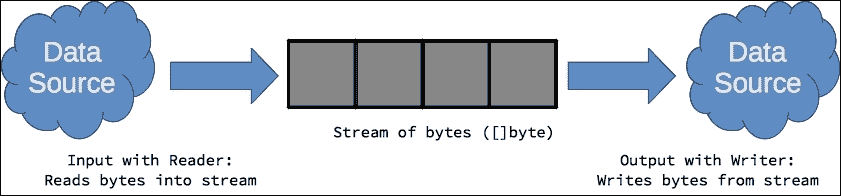

# 第十章：Go 中的数据 IO

本书的前几章主要关注基础知识。在本章和以后的章节中，读者将介绍 Go 标准库提供的一些强大 API。本章详细讨论了如何使用标准库及其各自的包的 API 输入、处理、转换和输出数据的主题：

+   使用读取器和写入器的 IO

+   io.Reader 接口

+   io.Writer 接口

+   使用 io 包

+   使用文件

+   使用 fmt 进行格式化 IO

+   缓冲 IO

+   内存 IO

+   编码和解码数据

# 使用读取器和写入器的 IO

与其他语言类似，如 Java，Go 将数据输入和输出建模为从源到目标的流。数据资源，如文件、网络连接，甚至一些内存对象，都可以被建模为字节流，从中可以读取或写入数据，如下图所示：



数据流表示为可以访问以进行读取或写入的**字节切片**（**[]byte**）。正如我们将在本章中探讨的，`*io*`包提供了`io.Reader`接口来实现从源到字节流的数据传输和读取的代码。相反，`io.Writer`接口让实现者创建从提供的字节流中读取数据并将其作为输出写入到目标资源的代码。这两个接口在 Go 中被广泛使用，作为表达 IO 操作的标准习语。这使得可以在不同实现和上下文中交换读取器和写入器，并获得可预测的结果。

# io.Reader 接口

如下列表所示，`io.Reader`接口很简单。它由一个方法`Read([]byte)(int, error)`组成，旨在让程序员实现从任意源读取数据，并将其传输到提供的字节切片中。

```go
type Reader interface { 
        Read(p []byte) (n int, err error) 
} 

```

`Read`方法返回传输到提供的切片中的总字节数和错误值（如果有必要）。作为指导，`io.Reader`的实现应在读取器没有更多数据传输到流`p`中时返回`io.EOF`的错误值。以下显示了类型`alphaReader`，这是`io.Reader`的一个简单实现，它从其字符串源中过滤掉非字母字符：

```go
type alphaReader string 

func (a alphaReader) Read(p []byte) (int, error) { 
   count := 0 
   for i := 0; i < len(a); i++ { 
         if (a[i] >= 'A' && a[i] <= 'Z') || 
               (a[i] >= 'a' && a[i] <= 'z') { 
               p[i] = a[i] 
         } 
         count++ 
   } 
   return count, io.EOF 
} 

func main() { 
   str := alphaReader("Hello! Where is the sun?") 
   io.Copy(os.Stdout, &str) 
   fmt.Println() 
} 

```

golang.fyi/ch10/reader0.go

由于`alphaReader`类型的值实现了`io.Reader`接口，它们可以在需要读取器的任何地方参与，如在对`io.Copy(os.Stdout, &str)`的调用中所示。这将`alphaReader`变量发出的字节流复制到写入器接口`os.Stdout`（稍后介绍）。

## 链接读取器

标准库中很可能已经有一个可以重用的读取器，因此常见的做法是包装现有的读取器，并使用其流作为新实现的源。以下代码片段显示了`alphaReader`的更新版本。这次，它以`io.Reader`作为其源，如下所示：

```go
type alphaReader struct { 
   src io.Reader 
} 

func NewAlphaReader(source io.Reader) *alphaReader { 
   return &alphaReader{source} 
} 

func (a *alphaReader) Read(p []byte) (int, error) { 
   if len(p) == 0 { 
         return 0, nil 
   } 
   count, err := a.src.Read(p) // p has now source data 
   if err != nil { 
         return count, err 
   } 
   for i := 0; i < len(p); i++ { 
         if (p[i] >= 'A' && p[i] <= 'Z') || 
               (p[i] >= 'a' && p[i] <= 'z') { 
               continue 
         } else { 
               p[i] = 0 
         } 
   } 
   return count, io.EOF 
} 

func main() { 
   str := strings.NewReader("Hello! Where is the sun?") 
   alpha := NewAlphaReader(str) 
   io.Copy(os.Stdout, alpha) 
   fmt.Println() 
} 

```

golang.fyi/ch10/reader1.go

此版本代码的主要变化是`alphaReader`类型现在是一个嵌入了`io.Reader`值的结构。当调用`alphaReader.Read()`时，它会调用包装的读取器，如`a.src.Read(p)`，这将把源数据注入到字节切片`p`中。然后该方法循环遍历`p`并对数据应用过滤器。现在，要使用`alphaReader`，必须首先提供一个现有的读取器，这由`NewAlphaReader()`构造函数来实现。

这种方法的优点一开始可能并不明显。然而，通过使用`io.Reader`作为底层数据源，`alphaReader`类型能够从任何读取器实现中读取。例如，以下代码片段显示了如何将`alphaReader`类型与`os.File`结合使用，以过滤文件中的非字母字符（Go 源代码本身）：

```go
... 
func main() { 
   file, _ := os.Open("./reader2.go") 
   alpha := NewAlphaReader(file) 
   io.Copy(os.Stdout, alpha) 
   fmt.Println() 
} 

```

golang.fyi/ch10/reader2.go

# io.Writer 接口

`io.Writer`接口，如下代码所示，与其读取器对应的接口一样简单：

```go
type Writer interface { 
   Write(p []byte) (n int, err error) 
} 

```

该接口要求实现一个单一方法，即`Write(p []byte)(c int, e error)`，该方法从提供的流`p`中复制数据并将该数据*写入*到诸如内存结构、标准输出、文件、网络连接或任何 Go 标准库提供的`io.Writer`实现等汇聚资源。`Write`方法返回从`p`中复制的字节数，然后是遇到的`error`值。

以下代码片段显示了`channelWriter`类型的实现，它是一个将其流分解并序列化为连续字节发送到 Go 通道的写入器：

```go
type channelWriter struct { 
   Channel chan byte 
} 

func NewChannelWriter() *channelWriter { 
   return &channelWriter{ 
         Channel: make(chan byte, 1024), 
   } 
} 

func (c *channelWriter) Write(p []byte) (int, error) { 
   if len(p) == 0 { 
         return 0, nil 
   } 

   go func() { 
         defer close(c.Channel) // when done 
         for _, b := range p { 
               c.Channel <- b 
         } 
   }() 

   return len(p), nil 
} 

```

golang.fyi/ch10/writer1.go

`Write`方法使用 goroutine 从`p`中复制每个字节，并将其发送到`c.Channel`。完成后，goroutine 关闭通道，以便在何时停止从通道中消耗时通知消费者。作为实现约定，写入器不应修改切片`p`或保留它。发生错误时，写入器应返回已处理的当前字节数和错误。

使用`channelWriter`类型很简单。您可以直接调用`Write()`方法，或者更常见的是，使用 API 中的其他 IO 原语与`channelWriter`一起使用。例如，以下代码片段使用`fmt.Fprint`函数将`"Stream me!"`字符串序列化为一系列字节，并使用`channelWriter`将其发送到通道：

```go
func main() { 
   cw := NewChannelWriter() 
   go func() { 
         fmt.Fprint(cw, "Stream me!") 
   }() 

   for c := range cw.Channel { 
         fmt.Printf("%c\n", c) 
   } 
} 

```

golang.fyi/ch10/writer1.go

在前面的代码片段中，通过`for…range`语句连续打印序列化的字节，排队在通道中。以下代码片段显示了另一个示例，其中文件的内容使用相同的`channelWriter`序列化到通道上。在此实现中，使用`io.File`值和`io.Copy`函数来源数据，而不是使用`fmt.Fprint`函数：

```go
func main() { 
   cw := NewChannelWriter() 
   file, err := os.Open("./writer2.go") 
   if err != nil { 
         fmt.Println("Error reading file:", err) 
         os.Exit(1) 
   } 
   _, err = io.Copy(cw, file) 
   if err != nil { 
         fmt.Println("Error copying:", err) 
         os.Exit(1) 
   } 

   // consume channel 
   for c := range cw.Channel { 
         fmt.Printf("%c\n", c) 
   } 
} 

```

golang.fyi/ch10/writer2.go.

# 使用 io 包

IO 的明显起点是，嗯，`io`包（[`golang.org/pkg/io`](https://golang.org/pkg/io)）。正如我们已经看到的，`io`包定义了输入和输出原语，如`io.Reader`和`io.Writer`接口。以下表格总结了`io`包中可用的其他函数和类型，这些函数和类型有助于流式 IO 操作。

| **功能** | **描述** |
| --- | --- |

| `io.Copy()` | `io.Copy`函数（以及其变体`io.CopyBuffer`和`io.CopyN`）使得从任意`io.Reader`源复制数据到同样任意的`io.Writer`汇聚变得容易，如下代码片段所示：

```go
data := strings.NewReader("Write   me down.")   
file, _ := os.Create("./iocopy.data")   
io.Copy(file, data)   

```

golang.fyi/ch10/iocopy.go |

| `PipeReader PipeWriter` | `io`包包括*PipeReader*和*PipeWriter*类型，将 IO 操作建模为内存管道。数据被写入管道的`io.Writer`，并且可以独立地从管道的`io.Reader`读取。以下简略代码片段说明了一个简单的管道，将字符串写入写入器`pw`。然后，数据通过读取器`pr`消耗，并复制到文件中：

```go
file, _ := os.Create("./iopipe.data")   
pr, pw := io.Pipe()    
go func() {   
    fmt.Fprint(pw, "Pipe   streaming")   
    pw.Close()   
}()   

wait := make(chan struct{})   
go func() {   
    io.Copy(file, pr)   
    pr.Close()   
    close(wait)   
}()   
<-wait //wait for pr to finish   

```

golang.fyi/ch10/iopipe.go 请注意，管道写入器将阻塞，直到读取器完全消耗管道内容或遇到错误。因此，读取器和写入器都应包装在 goroutine 中，以避免死锁。|

| `io.TeeReader()` | 与`io.Copy`函数类似，`io.TeeReader`将内容从读取器传输到写入器。但是，该函数还通过返回的`io.Reader`发出复制的字节（未更改）。TeeReader 非常适用于组合多步 IO 流处理。以下简略代码片段首先使用`TeeReader`计算文件内容的 SHA-1 哈希。然后，结果读取器`data`被流式传输到 gzip 写入器`zip`：

```go
fin, _ := os.Open("./ioteerdr.go")   
defer fin.Close()   
fout, _ := os.Create("./teereader.gz")   
defer fout.Close()   

zip := gzip.NewWriter(fout)   
defer zip.Close()   
sha := sha1.New()   
data := io.TeeReader(fin, sha)    
io.Copy(zip, data)   

fmt.Printf("SHA1 hash %x\n",   sha.Sum(nil))   

```

golang.fyi/ch10/ioteerdr0.go 如果我们想要计算 SHA-1 和 MD5，可以更新代码以嵌套两个 `TeeReader` 值，如下面的代码片段所示：

```go
sha := sha1.New()   
md := md5.New()   
data := io.TeeReader(
  io.TeeReader(fin, md), sha,   
)    
io.Copy(zip, data)   

```

golang.fyi/ch10/ioteerdr1.go |

| `io.WriteString()` | `io.WriteString` 函数将字符串的内容写入指定的写入器。以下代码将字符串的内容写入文件：

```go
fout, err := os.Create("./iowritestr.data")   
if err != nil {   
    fmt.Println(err)   
    os.Exit(1)   
}   
defer fout.Close()   
io.WriteString(fout, "Hello   there!\n")   

```

golang.fyi/ch10/iowritestr.go |

| `io.LimitedReader` | 正如其名称所示，`io.LimitedReader` 结构是一个从指定的 `io.Reader` 中仅读取 *N* 个字节的读取器。以下代码段将打印字符串的前 19 个字节：

```go
str := strings.NewReader("The   quick brown " +       
    "fox jumps over the lazy   dog")   
limited :=   &io.LimitedReader{R: str, N: 19}   
io.Copy(os.Stdout, limited)   

```

golang.fyi/ch10/iolimitedrdr.go

```go
$> go run iolimitedrd.go   
The quick brown fox   

```

|

| `io.SectionReader` | `io.SectionReader` 类型通过指定索引（从零开始）来实现 seek 和 skip 原语，指示从哪里开始读取和偏移值，指示要读取的字节数，如下面的代码片段所示：

```go
str := strings.NewReader("The   quick brown"+   
    "fox jumps over the lazy   dog")   
section := io.NewSectionReader(str,   19, 23)   
io.Copy(os.Stdout, section)   

```

golang.fyi/ch10/iosectionrdr.go 这个例子将打印 `jumps over the lazy dog`。

| 包 `io/ioutil` | `io/ioutil` 子包实现了一小部分函数，提供了 IO 原语的实用快捷方式，如文件读取、目录列表、临时目录创建和文件写入。 |
| --- | --- |

# 处理文件

`os` 包 ([`golang.org/pkg/os/`](https://golang.org/pkg/os/)) 暴露了 `os.File` 类型，它表示系统上的文件句柄。`os.File` 类型实现了几个 IO 原语，包括 `io.Reader` 和 `io.Writer` 接口，允许使用标准的流式 IO API 处理文件内容。

## 创建和打开文件

`os.Create` 函数创建具有指定路径的新文件。如果文件已经存在，`os.Create` 将覆盖它。另一方面，`os.Open` 函数打开现有文件进行读取。

以下源代码片段打开现有文件并使用 `io.Copy` 函数创建其内容的副本。一个常见且推荐的做法是在文件上调用 `Close` 方法的延迟调用。这确保了在函数退出时对 OS 资源的优雅释放：

```go
func main() { 
   f1, err := os.Open("./file0.go") 
   if err != nil { 
         fmt.Println("Unable to open file:", err) 
         os.Exit(1) 
   } 
   defer f1.Close() 

   f2, err := os.Create("./file0.bkp") 
   if err != nil { 
         fmt.Println("Unable to create file:", err) 
         os.Exit(1) 
   } 
   defer f2.Close() 

   n, err := io.Copy(f2, f1) 
   if err != nil { 
         fmt.Println("Failed to copy:", err) 
         os.Exit(1) 
   } 

   fmt.Printf("Copied %d bytes from %s to %s\n",  
       n, f1.Name(), f2.Name()) 
} 

```

golang.fyi/ch10/file0.go

## 函数 os.OpenFile

`os.OpenFile` 函数提供了通用的低级功能，用于创建新文件或以细粒度控制文件的行为和权限打开现有文件。然而，通常使用 `os.Open` 和 `os.Create` 函数，因为它们提供了比 `os.OpenFile` 函数更简单的抽象。

`os.OpenFile` 函数有三个参数。第一个是文件的路径，第二个参数是一个掩码位字段值，用于指示操作的行为（例如，只读、读写、截断等），最后一个参数是文件的 posix 兼容权限值。

以下缩写的源代码片段重新实现了之前的文件复制代码。然而，这次它使用 `os.FileOpen` 函数来演示它的工作原理：

```go
func main() { 
   f1, err := os.OpenFile("./file0.go", os.O_RDONLY, 0666) 
   if err != nil {...} 
   defer f1.Close() 

   f2, err := os.OpenFile("./file0.bkp", os.O_WRONLY, 0666) 
   if err != nil {...} 
   defer f2.Close() 

   n, err := io.Copy(f2, f1) 
   if err != nil {...} 

   fmt.Printf("Copied %d bytes from %s to %s\n",  
      n, f1.Name(), f2.Name()) 
} 

```

golang.fyi/ch10/file1.go

### 注意

如果您已经有一个对操作系统文件描述符的引用，还可以使用 `os.NewFile` 函数在程序中创建文件句柄。`os.NewFile` 函数很少使用，因为文件通常是使用前面讨论过的文件函数进行初始化的。

## 文件写入和读取

我们已经看到如何使用 `os.Copy` 函数将数据移入或移出文件。然而，有时需要完全控制写入或读取文件数据的逻辑。例如，以下代码片段使用 `os.File` 变量 `fout` 的 `WriteString` 方法创建文本文件：

```go
func main() { 
   rows := []string{ 
         "The quick brown fox", 
         "jumps over the lazy dog", 
   } 

   fout, err := os.Create("./filewrite.data") 
   if err != nil { 
         fmt.Println(err) 
         os.Exit(1) 
   } 
   defer fout.Close() 

   for _, row := range rows { 
         fout.WriteString(row) 
   } 
} 

```

golang.fyi/ch10/filewrite0.go

然而，如果您的数据源不是文本，可以直接将原始字节写入文件，如下面的源代码片段所示：

```go
func main() { 
   data := [][]byte{ 
         []byte("The quick brown fox\n"), 
         []byte("jumps over the lazy dog\n"), 
   } 
   fout, err := os.Create("./filewrite.data") 
   if err != nil { ... } 
   defer fout.Close() 

   for _, out := range data { 
         fout.Write(out) 
   } 
} 

```

golang.fyi/ch10/filewrite0.go

作为`io.Reader`，可以直接使用*Read*方法从`io.File`类型读取。这样可以访问文件的内容，将其作为原始的字节片流。以下代码片段将文件`../ch0r/dict.txt`的内容作为原始字节读取，并分配给切片`p`，每次最多 1024 字节：

```go
func main() { 
   fin, err := os.Open("../ch05/dict.txt") 
   if err != nil { 
         fmt.Println(err) 
         os.Exit(1) 
   } 
   defer fin.Close() 
   p := make([]byte, 1024) 
   for { 
         n, err := fin.Read(p) 
         if err == io.EOF { 
               break 
         } 
         fmt.Print(string(p[:n])) 
   } 
} 

```

golang.fyi/ch10/fileread.go

## 标准输入、输出和错误

`os`包包括三个预声明变量，`os.Stdin`、`os.Stdout`和`os.Stderr`，它们分别表示操作系统的标准输入、输出和错误的文件句柄。以下代码片段读取文件`f1`，并使用`os.Copy`函数将其内容写入`io.Stdout`，即标准输出（标准输入稍后介绍）：

```go
func main() { 
   f1, err := os.Open("./file0.go") 
   if err != nil { 
         fmt.Println("Unable to open file:", err) 
         os.Exit(1) 
   } 
   defer f1.Close() 

   n, err := io.Copy(os.Stdout, f1) 
   if err != nil { 
         fmt.Println("Failed to copy:", err) 
         os.Exit(1) 
   } 

   fmt.Printf("Copied %d bytes from %s \n", n, f1.Name()) 
} 

```

golang.fyi/ch10/osstd.go

# 使用`fmt`进行格式化 IO

用于 IO 的最常用的包之一是`fmt`（[`golang.org/pkg/fmt`](https://golang.org/pkg/fmt)）。它带有一系列函数，用于格式化输入和输出。`fmt`包最常见的用法是写入标准输出和从标准输入读取。本节还突出了使`fmt`成为 IO 工具的其他函数。

## 向`io.Writer`接口打印

`fmt`包提供了几个函数，用于将文本数据写入任意`io.Writer`的实现。`fmt.Fprint`和`fmt.Fprintln`函数使用默认格式写入文本，而`fmt.Fprintf`支持格式说明符。以下代码片段使用`fmt.Fprintf`函数将`metalloid`数据的列格式化列表写入指定的文本文件：

```go
type metalloid struct { 
   name   string 
   number int32 
   weight float64 
} 

func main() { 
   var metalloids = []metalloid{ 
         {"Boron", 5, 10.81}, 
         ... 
         {"Polonium", 84, 209.0}, 
   } 
   file, _ := os.Create("./metalloids.txt") 
   defer file.Close() 

   for _, m := range metalloids { 
         fmt.Fprintf( 
               file, 
               "%-10s %-10d %-10.3f\n", 
               m.name, m.number, m.weight, 
         ) 
   } 
} 

```

golang.fyi/ch10/fmtfprint0.go

在先前的示例中，`fmt.Fprintf`函数使用格式说明符将格式化文本写入`io.File`变量`file`。`fmt.Fprintf`函数支持大量格式说明符，其正确处理超出了本文的范围。请参阅在线文档，了解这些说明符的完整覆盖范围。

## 打印到标准输出

`fmt.Print`、`fmt.Printf`和`fmt.Println`具有与先前`Fprint`系列函数完全相同的特性。但是，它们不是向任意的`io.Writer`写入文本，而是将文本写入标准输出文件句柄`os.Stdout`（请参阅前面介绍的*标准输出、输入和错误*部分）。

以下是更新后的代码片段，显示了先前示例的更新版本，它将 metalloid 的列表写入标准输出而不是常规文件。请注意，除了使用`fmt.Printf`而不是`fmt.Fprintf`函数之外，它与相同的代码：

```go
type metalloid struct { ... } 
func main() { 
   var metalloids = []metalloid{ 
         {"Boron", 5, 10.81}, 
         ... 
         {"Polonium", 84, 209.0}, 
   } 

   for _, m := range metalloids { 
         fmt.Printf( 
               "%-10s %-10d %-10.3f\n", 
               m.name, m.number, m.weight, 
         ) 
   } 
} 

```

golang.fyi/ch10/fmtprint0.go

## 从`io.Reader`读取

`fmt`包还支持从`io.Reader`接口格式化读取文本数据。`fmt.Fscan`和`fmt.Fscanln`函数可用于将多个值（以空格分隔）读入指定的参数。`fmt.Fscanf`函数支持格式说明符，用于从`io.Reader`实现中解析数据输入。

以下是使用函数`fmt.Fscanf`对包含行星数据的以空格分隔的文件（`planets.txt`）进行格式化输入的缩写代码片段：

```go
func main() { 
   var name, hasRing string 
   var diam, moons int 

   // read data 
   data, err := os.Open("./planets.txt") 
   if err != nil { 
         fmt.Println("Unable to open planet data:", err) 
         return 
   } 
   defer data.Close() 

   for { 
         _, err := fmt.Fscanf( 
               data, 
               "%s %d %d %s\n", 
               &name, &diam, &moons, &hasRing, 
         ) 
         if err != nil { 
               if err == io.EOF { 
                     break 
               } else { 
                     fmt.Println("Scan error:", err) 
                     return 
               } 
         } 
         fmt.Printf( 
               "%-10s %-10d %-6d %-6s\n", 
               name, diam, moons, hasRing, 
         ) 
   } 

```

golang.fyi/ch10/fmtfscan0.go

该代码从`io.File`变量`data`读取，直到遇到表示文件结束的`io.EOF`错误。它读取的每行文本都使用格式说明符`"%s %d %d %s\n"`进行解析，该格式与文件中存储的记录的以空格分隔的布局匹配。然后，将每个解析的标记分配给其相应的变量`name`、`diam`、`moons`和`hasRing`，并使用`fm.Printf`函数将其打印到标准输出。

## 从标准输入读取

不是从任意的`io.Reader`读取，而是使用`fmt.Scan`、`fmt.Scanf`和`fmt.Scanln`从标准输入文件句柄`os.Stdin`读取数据。以下代码片段显示了从控制台读取文本输入的简单程序：

```go
func main() { 
   var choice int 
   fmt.Println("A square is what?") 
   fmt.Print("Enter 1=quadrilateral 2=rectagonal:") 

   n, err := fmt.Scanf("%d", &choice) 
   if n != 1 || err != nil { 
         fmt.Println("Follow directions!") 
         return 
   } 
   if choice == 1 { 
         fmt.Println("You are correct!") 
   } else { 
         fmt.Println("Wrong, Google it.") 
   } 
} 

```

golang.fyi/ch10/fmtscan1.go

在前面的程序中，`fmt.Scanf`函数使用格式说明符`"%d"`从标准输入中读取整数值。如果读取的值与指定的格式不完全匹配，该函数将抛出错误。例如，以下显示了当读取字符`D`而不是整数时会发生什么：

```go
$> go run fmtscan1.go
A square is what?
Enter 1=quadrilateral 2=rectagonal: D
Follow directions!

```

# 缓冲 IO

到目前为止，大多数 IO 操作都是无缓冲的。这意味着每个读取和写入操作都可能受到底层操作系统处理 IO 请求的延迟的负面影响。另一方面，缓冲操作通过在 IO 操作期间在内部存储器中缓冲数据来减少延迟。`bufio`包（[`golang.org/pkg/bufio`](https://golang.org/pkg/bufio)/）提供了用于缓冲读写 IO 操作的函数。

## 缓冲写入器和读取器

`bufio`包提供了几个函数，使用`io.Writer`接口对 IO 流进行缓冲写入。以下代码片段创建一个文本文件，并使用缓冲 IO 进行写入：

```go
func main() { 
   rows := []string{ 
         "The quick brown fox", 
         "jumps over the lazy dog", 
   } 

   fout, err := os.Create("./filewrite.data") 
   writer := bufio.NewWriter(fout) 
   if err != nil { 
         fmt.Println(err) 
         os.Exit(1) 
   } 
   defer fout.Close() 

   for _, row := range rows { 
         writer.WriteString(row) 
   } 
   writer.Flush() 
} 

```

golang.fyi/ch10/bufwrite0.go

通常，`bufio`包中的构造函数通过包装现有的`io.Writer`来创建缓冲写入器。例如，前面的代码使用`bufio.NewWriter`函数通过包装 io.File 变量`fout`创建了一个缓冲写入器。

要影响内部缓冲区的大小，可以使用构造函数`bufio.NewWriterSize(w io.Writer, n int)`来指定内部缓冲区的大小。`bufio.Writer`类型还提供了`Write`和`WriteByte`方法用于写入原始字节，以及`WriteRune`方法用于写入 Unicode 编码字符。

通过调用构造函数*bufio.NewReader*简单地对缓冲流进行读取，以包装现有的`io.Reader`。以下代码片段通过包装`file`变量作为其底层源创建了一个`bufio.Reader`变量`reader`：

```go
func main() { 
   file, err := os.Open("./bufread0.go") 
   if err != nil { 
         fmt.Println("Unable to open file:", err) 
         return 
   } 
   defer file.Close() 

   reader := bufio.NewReader(file) 
   for { 
         line, err := reader.ReadString('\n') 
         if err != nil { 
               if err == io.EOF { 
                     break 
               } else { 
                     fmt.Println("Error reading:, err") 
                     return 
               } 
         } 
         fmt.Print(line) 
   } 
} 

```

golang`.fyi/ch10/bufread0.go`

前面的代码使用`reader.ReadString`方法使用`'\n'`字符作为内容分隔符读取文本文件。要影响内部缓冲区的大小，可以使用构造函数`bufio.NewReaderSize(w io.Reader, n int)`来指定内部缓冲区的大小。`bufio.Reader`类型还提供了*Read*、*ReadByte*和*ReadBytes*方法用于从流中读取原始字节，以及*ReadRune*方法用于读取 Unicode 编码字符。

## 扫描缓冲区

`bufio`包还提供了用于从`io.Reader`源扫描和标记缓冲输入数据的原语。`bufio.Scanner`类型使用*Split*方法扫描输入数据以定义标记化策略。以下代码片段显示了对行星示例（之前的示例）的重新实现。这次，代码使用`bufio.Scanner`（而不是`fmt.Fscan`函数）来扫描文本文件的内容，使用`bufio.ScanLines`函数：

```go
func main() { 
   file, err := os.Open("./planets.txt") 
   if err != nil { 
         fmt.Println("Unable to open file:", err) 
         return 
   } 
   defer file.Close() 

   fmt.Printf( 
         "%-10s %-10s %-6s %-6s\n", 
         "Planet", "Diameter", "Moons", "Ring?", 
   ) 
   scanner := bufio.NewScanner(file) 
   scanner.Split(bufio.ScanLines) 
   for scanner.Scan() { 
         fields := strings.Split(scanner.Text(), " ") 
         fmt.Printf( 
               "%-10s %-10s %-6s %-6s\n", 
               fields[0], fields[1], fields[2], fields[3], 
         ) 
   } 
} 

```

golang.fyi/ch10/bufscan0.go

使用`bufio.Scanner`有四个步骤，如前面的示例所示：

+   首先，使用`bufio.NewScanner(io.Reader)`创建一个扫描器

+   调用`scanner.Split`方法来配置内容的标记化方式

+   使用`scanner.Scan`方法遍历生成的标记

+   使用`scanner.Text`方法读取标记化数据

该代码使用预定义的函数`bufio.ScanLines`来使用行分隔符解析缓冲内容。`bufio`包提供了几个预定义的分隔函数，包括*ScanBytes*用于将每个字节作为标记扫描，*ScanRunes*用于扫描 UTF-8 编码的标记，以及*ScanWords*用于将每个以空格分隔的单词作为标记扫描。

# 内存 IO

`bytes`包提供了常见的原语，用于在内存中存储的字节块上进行流式 IO，由`bytes.Buffer`类型表示。由于`bytes.Buffer`类型实现了`io.Reader`和`io.Writer`接口，因此它是将数据流入或流出内存的流式 IO 原语的绝佳选择。

以下代码片段将几个字符串值存储在`byte.Buffer`变量`book`中，然后将缓冲区流式传输到`os.Stdout`：

```go
func main() { 
   var books bytes.Buffer 
   books.WriteString("The Great Gatsby") 
   books.WriteString("1984") 
   books.WriteString("A Tale of Two Cities") 
   books.WriteString("Les Miserables") 
   books.WriteString("The Call of the Wild") 

   books.WriteTo(os.Stdout) 
} 

```

golang.fyi/ch10/bytesbuf0.go

同样的示例很容易更新，以将内容流式传输到常规文件，如下面的简短代码片段所示：

```go
func main() { 
   var books bytes.Buffer 
   books.WriteString("The Great Gatsby\n") 
   books.WriteString("1984\n") 
   books.WriteString("A Take of Two Cities\n") 
   books.WriteString("Les Miserables\n") 
   books.WriteString("The Call of the Wild\n") 

   file, err := os.Create("./books.txt") 
   if err != nil { 
         fmt.Println("Unable to create file:", err) 
         return 
   } 
   defer file.Close() 
   books.WriteTo(file) 
} 

```

golang.fyi/ch10/bytesbuf1.go

# 编码和解码数据

Go 中 IO 的另一个常见方面是对数据进行编码，从一种表示形式转换为另一种表示形式，因为它正在被流式传输。标准库中的编码器和解码器，位于*encoding*包中（[`golang.org/pkg/encoding/`](https://golang.org/pkg/encoding/)），使用`io.Reader`和`io.Writer`接口来利用 IO 原语作为在编码和解码过程中流式传输数据的一种方式。

Go 支持多种编码格式，用于各种目的，包括数据转换、数据压缩和数据加密。本章将重点介绍使用*Gob*和*JSON*格式进行数据转换的编码和解码。在第十一章中，*编写网络程序*，我们将探讨使用编码器将数据转换为客户端和服务器通信的**远程过程调用**（**RPC**）。

## 使用 gob 进行二进制编码

`gob`包（[*https://golang.org/pkg/encoding/gob*](https://golang.org/pkg/encoding/gob)）提供了一种编码格式，可用于将复杂的 Go 数据类型转换为二进制数据。Gob 是自描述的，这意味着每个编码的数据项都附带有类型描述。编码过程涉及将 gob 编码的数据流式传输到 io.Writer，以便将其写入资源以供将来使用。

以下代码片段显示了一个示例代码，将变量`books`（一个包含嵌套值的`Book`类型的切片）编码为`gob`格式。编码器将其生成的二进制数据写入到一个 os.Writer 实例，本例中是`*os.File`类型的变量`file`：

```go
type Name struct { 
   First, Last string 
} 

type Book struct { 
   Title       string 
   PageCount   int 
   ISBN        string 
   Authors     []Name 
   Publisher   string 
   PublishDate time.Time 
} 

func main() { 
   books := []Book{ 
         Book{ 
               Title:       "Leaning Go", 
               PageCount:   375, 
               ISBN:        "9781784395438", 
               Authors:     []Name{{"Vladimir", "Vivien"}}, 
               Publisher:   "Packt", 
               PublishDate: time.Date( 
                     2016, time.July, 
                     0, 0, 0, 0, 0, time.UTC, 
               ), 
         }, 
         Book{ 
               Title:       "The Go Programming Language", 
               PageCount:   380, 
               ISBN:        "9780134190440", 
               Authors:     []Name{ 
                     {"Alan", "Donavan"}, 
                     {"Brian", "Kernighan"}, 
               }, 
               Publisher:   "Addison-Wesley", 
               PublishDate: time.Date( 
                     2015, time.October, 
                     26, 0, 0, 0, 0, time.UTC, 
               ), 
         }, 
         ... 
   } 

   // serialize data structure to file 
   file, err := os.Create("book.dat") 
   if err != nil { 
         fmt.Println(err) 
         return 
   } 
   enc := gob.NewEncoder(file) 
   if err := enc.Encode(books); err != nil { 
         fmt.Println(err) 
   } 
} 

```

golang.fyi/ch10/gob0.go

尽管前面的示例很长，但它主要是由分配给变量`books`的嵌套数据结构的定义组成。最后的半打行或更多行是编码发生的地方。gob 编码器是通过`enc := gob.NewEncoder(file)`创建的。通过简单调用`enc.Encode(books)`来对数据进行编码，这将将编码的数据流式传输到提供的文件。

解码过程通过使用`io.Reader`流式传输 gob 编码的二进制数据，并自动将其重构为强类型的 Go 值来进行反向操作。以下代码片段解码了在上一个示例中编码并存储在`books.data`文件中的 gob 数据。解码器从`io.Reader`读取数据，在本例中是`*os.File`类型的变量`file`：

```go
type Name struct { 
   First, Last string 
} 

type Book struct { 
   Title       string 
   PageCount   int 
   ISBN        string 
   Authors     []Name 
   Publisher   string 
   PublishDate time.Time 
} 

func main() { 
   file, err := os.Open("book.dat") 
   if err != nil { 
         fmt.Println(err) 
         return 
   } 

   var books []Book 
   dec := gob.NewDecoder(file) 
   if err := dec.Decode(&books); err != nil { 
         fmt.Println(err) 
         return 
   } 
} 

```

golang.fyi/ch10/gob1.go

解码以前编码的 gob 数据是通过使用`dec := gob.NewDecoder(file)`创建解码器来完成的。下一步是声明将存储解码数据的变量。在我们的示例中，`books`变量，类型为`[]Book`，被声明为解码数据的目标。实际解码是通过调用`dec.Decode(&books)`来完成的。请注意，`Decode()`方法将其目标变量的地址作为参数。一旦解码完成，`books`变量将包含从文件流式传输的重构数据结构。

### 注意

截至目前，gob 编码器和解码器 API 仅在 Go 编程语言中可用。这意味着以 gob 编码的数据只能被 Go 程序使用。

## 将数据编码为 JSON

编码包还带有一个*json*编码器子包（[`golang.org/pkg/encoding/json/`](https://golang.org/pkg/encoding/json/)），用于支持 JSON 格式的数据。这极大地扩展了 Go 程序可以交换复杂数据结构的语言数量。JSON 编码与 gob 包的编码器和解码器类似。不同之处在于生成的数据采用明文 JSON 编码格式，而不是二进制。以下代码更新了前一个示例，将数据编码为 JSON：

```go
type Name struct { 
   First, Last string 
} 

type Book struct { 
   Title       string 
   PageCount   int 
   ISBN        string 
   Authors     []Name 
   Publisher   string 
   PublishDate time.Time 
} 

func main() { 
   books := []Book{ 
         Book{ 
               Title:       "Leaning Go", 
               PageCount:   375, 
               ISBN:        "9781784395438", 
               Authors:     []Name{{"Vladimir", "Vivien"}}, 
               Publisher:   "Packt", 
               PublishDate: time.Date( 
                     2016, time.July, 
                     0, 0, 0, 0, 0, time.UTC), 
         }, 
         ... 
   } 

   file, err := os.Create("book.dat") 
   if err != nil { 
         fmt.Println(err) 
         return 
   } 
   enc := json.NewEncoder(file) 
   if err := enc.Encode(books); err != nil { 
         fmt.Println(err) 
   } 
} 

```

golang.fyi/ch10/json0.go

代码与之前完全相同。它使用分配给`books`变量的相同嵌套结构的切片。唯一的区别是创建了一个编码器`enc := json.NewEncoder(file)`，它创建一个 JSON 编码器，将`file`变量作为其`io.Writer`目标。当执行`enc.Encode(books)`时，变量`books`的内容将被序列化为 JSON，显示在以下代码中（格式化以便阅读）：

```go
[ 
 {
 "Title":"Leaning Go",
 "PageCount":375,
 "ISBN":"9781784395438",
 "Authors":[{"First":"Vladimir","Last":"Vivien"}],
 "Publisher":"Packt",
 "PublishDate":"2016-06-30T00:00:00Z"
 },
 {
 "Title":"The Go Programming Language",
 "PageCount":380,
 "ISBN":"9780134190440",
 "Authors":[
 {"First":"Alan","Last":"Donavan"},
                      {"First":"Brian","Last":"Kernighan"}
 ],
 "Publisher":"Addison-Wesley",
 "PublishDate":"2015-10-26T00:00:00Z"
 },
 ...
]

```

文件 books.dat（格式化）

默认情况下，生成的 JSON 编码内容使用结构字段的名称作为 JSON 对象键的名称。这种行为可以使用结构标签来控制（参见*使用结构标签控制 JSON 映射*部分）。

在 Go 中使用 JSON 解码器从`io.Reader`流式传输其源来消耗 JSON 编码的数据。以下代码片段解码了在前一个示例中生成的 JSON 编码数据，存储在文件`book.dat`中。请注意，数据结构（未在以下代码中显示）与之前相同：

```go
func main() { 
   file, err := os.Open("book.dat") 
   if err != nil { 
         fmt.Println(err) 
         return 
   } 

   var books []Book 
   dec := json.NewDecoder(file) 
   if err := dec.Decode(&books); err != nil { 
         fmt.Println(err) 
         return 
   } 
} 

```

golang.fyi/ch10/json1.go

books.dat 文件中的数据存储为 JSON 对象的数组。因此，代码必须声明一个能够存储嵌套结构值的索引集合的变量。在前一个示例中，类型为`[]Book`的`books`变量被声明为解码数据的目标。实际解码是通过调用`dec.Decode(&books)`来完成的。请注意，`Decode()`方法将其目标变量的地址作为参数。一旦解码完成，`books`变量将包含从文件流式传输的重构数据结构。

## 使用结构标签控制 JSON 映射

默认情况下，结构字段的名称用作生成的 JSON 对象的键。这可以使用`struct`类型标签来控制，以指定在编码和解码数据时如何映射 JSON 对象键名称。例如，以下代码片段声明了带有`json:`标签前缀的结构字段，以指定如何对对象键进行编码和解码：

```go
type Book struct { 
   Title       string      `json:"book_title"` 
   PageCount   int         `json:"pages,string"` 
   ISBN        string      `json:"-"` 
   Authors     []Name      `json:"auths,omniempty"` 
   Publisher   string      `json:",omniempty"` 
   PublishDate time.Time   `json:"pub_date"` 
} 

```

golang.fyi/ch10/json2.go

标签及其含义总结如下表：

| 标签 | 描述 |
| --- | --- |
| `Title string `json:"book_title"`` | 将`Title`结构字段映射到 JSON 对象键`"book_title"`。 |
| `PageCount int `json:"pages,string"`` | 将`PageCount`结构字段映射到 JSON 对象键`"pages"`，并将值输出为字符串而不是数字。 |
| `ISBN string `json:"-"`` | 破折号导致在编码和解码过程中跳过`ISBN`字段。 |
| `Authors []Name `json:"auths,omniempty"`` | 将`Authors`字段映射到 JSON 对象键`"auths"`。注释`omniempty`导致如果其值为 nil，则省略该字段。 |
| `Publisher string `json:",omniempty"`` | 将结构字段名`Publisher`映射为 JSON 对象键名。注释`omniempty`导致字段在为空时被省略。 |
| `PublishDate time.Time `json:"pub_date"`` | 将字段名`PublishDate`映射到 JSON 对象键`"pub_date"`。 |

当编码前一个结构时，在`books.dat`文件中生成以下 JSON 输出（格式化以便阅读）：

```go
... 
{ 
   "book_title":"The Go Programming Language", 
   "pages":"380", 
   "auths":[ 
         {"First":"Alan","Last":"Donavan"}, 
         {"First":"Brian","Last":"Kernighan"} 
   ], 
   "Publisher":"Addison-Wesley", 
   "pub_date":"2015-10-26T00:00:00Z" 
} 
... 

```

请注意，JSON 对象键的标题与`struct`标签中指定的相同。对象键`"pages"`（映射到结构字段`PageCount`）被编码为字符串。最后，结构字段“ISBN”被省略，如在`struct`标签中注释的那样。

## 自定义编码和解码

JSON 包使用两个接口，“Marshaler”和“Unmarshaler”，分别用于编码和解码事件。当编码器遇到一个类型实现了`json.Marshaler`的值时，它将值的序列化委托给`MarshalJSON`方法，在 Marshaller 接口中定义。以下是一个缩写的代码片段，其中类型`Name`更新为实现`json.Marshaller`的示例：

```go
type Name struct { 
   First, Last string 
} 
func (n *Name) MarshalJSON() ([]byte, error) { 
   return []byte( 
         fmt.Sprintf(""%s, %s"", n.Last, n.First) 
   ), nil 
} 

type Book struct { 
   Title       string 
   PageCount   int 
   ISBN        string 
   Authors     []Name 
   Publisher   string 
   PublishDate time.Time 
} 
func main(){ 
   books := []Book{ 
         Book{ 
               Title:       "Leaning Go", 
               PageCount:   375, 
               ISBN:        "9781784395438", 
               Authors:     []Name{{"Vladimir", "Vivien"}}, 
               Publisher:   "Packt", 
               PublishDate: time.Date( 
                     2016, time.July, 
                     0, 0, 0, 0, 0, time.UTC), 
         }, 
         ... 
   } 
   ... 
   enc := json.NewEncoder(file) 
   if err := enc.Encode(books); err != nil { 
         fmt.Println(err) 
   } 
} 

```

golang.fyi/ch10/json3.go

在前面的例子中，`Name`类型的值被序列化为 JSON 字符串（而不是之前的对象）。序列化由方法`Name.MarshallJSON`处理，该方法返回一个包含姓和名用逗号分隔的字节数组。前面的代码生成以下 JSON 输出：

```go
 [
 ...
 {
                "Title":"Leaning Go",
                "PageCount":375,
                "ISBN":"9781784395438",
                "Authors":["Vivien, Vladimir"],
                "Publisher":"Packt",
                "PublishDate":"2016-06-30T00:00:00Z"
          },
          ...
    ] 

```

对于反向操作，当解码器遇到映射到实现`json.Unmarshaler`的类型的 JSON 文本时，它将解码委托给类型的`UnmarshalJSON`方法。例如，以下是实现`json.Unmarshaler`以处理`Name`类型的 JSON 输出的缩写代码片段：

```go
type Name struct { 
   First, Last string 
} 

func (n *Name) UnmarshalJSON(data []byte) error { 
   var name string 
   err := json.Unmarshal(data, &name) 
   if err != nil { 
         fmt.Println(err) 
         return err 
   } 
   parts := strings.Split(name, ", ") 
   n.Last, n.First = parts[0], parts[1] 
   return nil 
} 

```

golang.fyi/ch10/json4.go

`Name`类型是`json.Unmarshaler`的实现。当解码器遇到具有键`"Authors"`的 JSON 对象时，它使用方法`Name.Unmarshaler`从 JSON 字符串重新构建 Go 结构`Name`类型。

### 注意

Go 标准库提供了其他编码器（此处未涵盖），包括`base32`、`bas364`、`binary`、`csv`、`hex`、`xml`、`gzip`和众多加密格式编码器。

# 摘要

本章提供了 Go 数据输入和输出习惯用法的高层视图，以及实现 IO 原语的包。本章首先介绍了 Go 中基于流的 IO 的基础知识，包括`io.Reader`和`io.Writer`接口。读者将了解`io.Reader`和`io.Writer`的实现策略和示例。

本章继续介绍支持流式 IO 机制的包、类型和函数，包括处理文件、格式化 IO、缓冲和内存 IO。本章的最后部分涵盖了在数据流传输过程中转换数据的编码器和解码器。在下一章中，当讨论转向使用 IO 通过网络进行通信的程序时，IO 主题将进一步展开。
