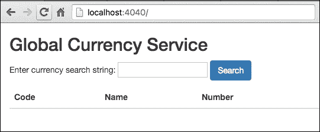

# 第十一章：编写网络服务

作为系统语言，Go 流行的原因之一是它固有的支持创建网络程序。标准库提供了从低级套接字原语到更高级服务抽象（如 HTTP 和 RPC）的 API。本章探讨了创建连接应用程序的基本主题，包括以下内容：

+   网络包

+   TCP API 服务器

+   HTTP 包

+   JSON API 服务器

# 网络包

Go 中所有网络程序的起点是*net*包（[`golang.org/pkg/net`](https://golang.org/pkg/net)）。它提供了丰富的 API 来处理低级网络原语以及应用级协议，如 HTTP。网络的每个逻辑组件都由 Go 类型表示，包括硬件接口、网络、数据包、地址、协议和连接。此外，每种类型都公开了大量方法，使得 Go 成为支持 IPv4 和 IPv6 的最完整的网络编程标准库之一。

无论是创建客户端还是服务器程序，Go 程序员至少需要以下部分涵盖的网络原语。这些原语作为函数和类型提供，以便客户端连接到远程服务和服务器处理传入请求。

## 寻址

在进行网络编程时，基本原语之一是*地址*。`net`包的类型和函数使用字符串文字表示地址，例如`"127.0.0.1"`。地址还可以包括由冒号分隔的服务端口，例如`"74.125.21.113:80"`。`net`包中的函数和方法还支持 IPv6 地址的字符串文字表示，例如`"::1"`或`"[2607:f8b0:4002:c06::65]:80"`，用于带有服务端口 80 的地址。

## net.Conn 类型

`net.Conn`接口表示在网络上建立的两个节点之间的通用连接。它实现了`io.Reader`和`io.Writer`接口，允许连接的节点使用流式 IO 原语交换数据。`net`包提供了`net.Conn`接口的网络协议特定实现，如*IPConn*、*UDPConn*和*TCPConn*。每个实现都公开了特定于其各自网络和协议的附加方法。然而，正如我们将在本章中看到的，net.Conn 中定义的默认方法集对于大多数用途都是足够的。

## 拨号连接

客户端程序使用`net.Dial`函数连接到网络上的主机服务，该函数具有以下签名：

```go
func Dial(network, address string) (Conn, error) 

```

该函数接受两个参数，其中第一个参数*network*指定连接的网络协议，可以是：

+   `tcp`，`tcp4`，`tcp6`：`tcp`默认为`tcp4`

+   `udp`，`udp4`，`udp6`：`udp`默认为`udp4`

+   `ip`，`ip4`，`ip6`：`ip`默认为`ip4`

+   `unix`，`unixgram`，`unixpacket`：用于 Unix 域套接字

`net.Dial`函数的后一个参数指定要连接的主机地址的字符串值。如前所述，地址可以提供为 IPv4 或 IPv6 地址。`net.Dial`函数返回与指定网络参数匹配的`net.Conn`接口的实现。

例如，以下代码片段拨号到主机地址的`"tcp"`网络，[www.gutenberg.org:80](http://gutenberg.org/)，返回`*net.TCPConn`类型的 TCP 连接。简写代码使用 TCP 连接发出`"HTTP GET"`请求，以从 Project Gutenberg 的网站（[`gutenberg.org/`](http://gutenberg.org/)）检索文学经典《贝奥武夫》的完整文本。然后将原始和未解析的 HTTP 响应写入本地文件`beowulf.txt`：

```go
func main() { 
   host, port := "www.gutenberg.org", "80" 
   addr := net.JoinHostPort(host, port) 
   httpRequest:="GET  /cache/epub/16328/pg16328.txt HTTP/1.1\n" + 
         "Host: " + host + "\n\n" 

   conn, err := net.Dial("tcp", addr) 
   if err != nil { 
         fmt.Println(err) 
         return 
   } 
   defer conn.Close() 

   if _, err = conn.Write([]byte(httpRequest)); err != nil { 
         fmt.Println(err) 
         return 
   } 

   file, err := os.Create("beowulf.txt") 
   if err != nil { 
         fmt.Println(err) 
         return 
   } 
   defer file.Close() 

   io.Copy(file, conn) 
   fmt.Println("Text copied to file", file.Name()) 
}

```

golang.fyi/ch11/dial0.go

因为`net.Conn`类型实现了`io.Reader`和`io.Writer`，它可以用于使用流式 IO 语义发送数据和接收数据。在前面的例子中，`conn.Write([]byte(httpRequest))`将 HTTP 请求发送到服务器。主机返回的响应从`conn`变量复制到`file`变量，使用`io.Copy(file, conn)`。

### 注意

请注意，前面的例子说明了如何使用原始 TCP 连接到 HTTP 服务器。Go 标准库提供了一个专门设计用于 HTTP 编程的单独包，它抽象了低级协议细节（在本章后面介绍）。

`net`包还提供了网络特定的拨号函数，如`DialUDP`，`DiapTCP`或`DialIP`，每个函数返回其相应的连接实现。在大多数情况下，`net.Dial`函数和`net.Conn`接口提供了连接和管理远程主机连接的足够能力。

## 监听传入的连接

创建服务程序时，首先要做的一步是宣布服务将用于监听来自网络的传入请求的端口。这是通过调用`net.Listen`函数来完成的，该函数具有以下签名：

```go
func Listen(network, laddr string) (net.Listener, error) 

```

它需要两个参数，第一个参数指定了一个协议，有效的值为`"tcp"`, `"tcp4"`, `"tcp6"`, `"unix"`, 或 `"unixpacket"`。

第二个参数是服务的本地主机地址。本地地址可以不带 IP 地址指定，如`":4040"`。省略主机的 IP 地址意味着服务绑定到主机上安装的所有网络卡接口。作为替代，服务可以绑定到主机上特定的网络硬件接口，通过在网络上指定其 IP 地址，即`"10.20.130.240:4040"`。

对`net.Listen`函数的成功调用返回一个`net.Listener`类型的值（或者如果失败，则返回一个非 nil 的错误）。`net.Listener`接口公开了用于管理传入客户端连接的生命周期的方法。根据`network`参数的值（`"tcp"`, `"tcp4"`, `"tcp6"`等），`net.Listen`将返回`net.TCPListener`或`net.UnixListener`，它们都是`net.Listener`接口的具体实现。

## 接受客户端连接

`net.Listener`接口使用*Accept*方法无限期地阻塞，直到从客户端接收到一个新的连接。下面的简化代码片段显示了一个简单的服务器，它向每个客户端连接返回字符串"Nice to meet you!"，然后立即断开连接：

```go
func main() { 
   listener, err := net.Listen("tcp", ":4040") 
   if err != nil { 
         fmt.Println(err) 
         return 
   } 
   defer listener.Close() 

   for { 
         conn, err := listener.Accept() 
         if err != nil { 
               fmt.Println(err) 
               return 
         } 
         conn.Write([]byte("Nice to meet you!")) 
         conn.Close() 
   } 
} 

```

golang.fyi/ch11/listen0.go

在代码中，`listener.Accept`方法返回一个`net.Conn`类型的值，用于处理服务器和客户端之间的数据交换（或者如果失败，则返回一个非 nil 的`error`）。`conn.Write([]byte("Nice to meet you!"))`方法调用用于向客户端写入响应。当服务器程序正在运行时，可以使用*telnet*客户端进行测试，如下面的输出所示：

```go
$> go run listen0.go & 
[1] 83884 

$> telnet 127.0.0.1 4040 
Trying 127.0.0.1... 
Connected to localhost. 
Escape character is '^]'. 
Nice to meet you! Connection closed by foreign host.

```

为了确保服务器程序继续运行并处理后续的客户端连接，`Accept`方法的调用被包裹在一个无限的 for 循环中。一旦连接关闭，循环重新开始等待下一个客户端连接。还要注意，当服务器进程关闭时，最好调用`Listener.Close()`关闭监听器。

### 注意

敏锐的读者可能会注意到，这个简单的服务器无法扩展，因为它一次无法处理多个客户端请求。在下一节中，我们将看到创建可扩展服务器的技术。

# 一个 TCP API 服务器

到目前为止，本章已经涵盖了创建客户端和服务程序所需的最小网络组件。本章的其余部分将讨论实现*货币信息*服务的服务器的不同版本。该服务在每个请求中返回 ISO 4217 货币信息。目的是展示使用不同应用级协议创建网络服务及其客户端的影响。

之前我们介绍了一个非常简单的服务器，以演示设置网络服务所需的必要步骤。本节通过创建一个能够处理许多并发连接的 TCP 服务器，深入探讨了网络编程。本节中呈现的服务器代码具有以下设计目标：

+   使用原始 TCP 在客户端和服务器之间进行通信

+   开发一个简单的基于文本的协议，通过 TCP 进行通信

+   客户端可以使用文本命令查询全球货币信息

+   使用 goroutine 处理每个连接以处理连接并发

+   保持连接直到客户端断开连接

以下是服务器代码的简化版本列表。该程序使用`curr`包（在[`github.com/vladimirvivien/learning-go/ch11/curr0`](https://github.com/vladimirvivien/learning-go/ch11/curr0)找到），这里不讨论，用于将货币数据从本地 CSV 文件加载到切片`currencies`中。

成功连接到客户端后，服务器使用简单的文本协议解析传入的客户端命令，格式为*GET <currency-filter-value>*，其中*<currency-filter-value>*指定用于搜索货币信息的字符串值：

```go
import ( 
   "net" 
   ... 
   curr "https://github.com/vladimirvivien/learning-go/ch11/curr0" 
) 

var currencies = curr.Load("./data.csv") 

func main() { 
   ln, _ := net.Listen("tcp", ":4040") 
   defer ln.Close() 

   // connection loop 
   for { 
         conn, err := ln.Accept() 
         if err != nil { 
               fmt.Println(err) 
               conn.Close() 
               continue 
         }      
         go handleConnection(conn) 
   } 
} 

// handle client connection 
func handleConnection(conn net.Conn) { 
   defer conn.Close() 

   // loop to stay connected with client 
   for { 
         cmdLine := make([]byte, (1024 * 4)) 
         n, err := conn.Read(cmdLine) 
         if n == 0 || err != nil { 
               return 
         } 
         cmd, param := parseCommand(string(cmdLine[0:n])) 
         if cmd == "" { 
               continue 
         } 

         // execute command 
         switch strings.ToUpper(cmd) { 
         case "GET": 
               result := curr.Find(currencies, param) 
               // stream result to client 
               for _, cur := range result { 
                     _, err := fmt.Fprintf( 
                           conn, 
                           "%s %s %s %s\n", 
                           cur.Name, cur.Code, 
                           cur.Number, cur.Country, 
                     ) 
                     if err != nil { 
                           return 
                     } 
                     // reset deadline while writing, 
                     // closes conn if client is gone 
                     conn.SetWriteDeadline( 
                           time.Now().Add(time.Second * 5)) 
               } 
               // reset read deadline for next read 
               conn.SetReadDeadline( 
                     time.Now().Add(time.Second * 300)) 

         default: 
               conn.Write([]byte("Invalid command\n")) 
         } 
   } 
} 

func parseCommand(cmdLine string) (cmd, param string) { 
   parts := strings.Split(cmdLine, " ") 
   if len(parts) != 2 { 
         return "", "" 
   } 
   cmd = strings.TrimSpace(parts[0]) 
   param = strings.TrimSpace(parts[1]) 
   return 
} 

```

golang.fyi/ch11/tcpserv0.go

与上一节介绍的简单服务器不同，这个服务器能够同时为多个客户端连接提供服务。在接受新连接时，使用`ln.Accept()`委托新客户端连接的处理给一个 goroutine，使用`go handleConnection(conn)`。连接循环立即继续，并等待下一个客户端连接。

`handleConnection`函数管理与连接的客户端的服务器通信。它首先读取并解析来自客户端的字节片段，将其转换为命令字符串，使用`cmd, param := parseCommand(string(cmdLine[0:n]))`。接下来，代码使用`switch`语句测试命令。如果`cmd`等于`"GET"`，则代码使用`curr.Find(currencies, param)`搜索切片`currencies`以匹配`param`的值。最后，它使用`fmt.Fprintf(conn, "%s %s %s %s\n", cur.Name, cur.Code, cur.Number, cur.Country)`将搜索结果流式传输到客户端的连接。

服务器支持的简单文本协议不包括任何会话控制或控制消息。因此，代码使用`conn.SetWriteDeadline`方法来确保与客户端的连接不会在长时间内不必要地挂起。该方法在向客户端流出响应的循环中调用。它设置了一个 5 秒的截止期限，以确保客户端始终准备好在该时间内接收下一块字节，否则它会超时连接。

## 使用 telnet 连接到 TCP 服务器

因为之前介绍的货币服务器使用了简单的基于文本的协议，所以可以使用 telnet 客户端进行测试，假设服务器代码已经编译并运行（并监听在端口`4040`上）。以下是 telnet 会话查询服务器货币信息的输出：

```go
$> telnet localhost 4040
Trying ::1...
Connected to localhost.
Escape character is '^]'.
GET Gourde
Gourde HTG 332 HAITI
GET USD
US Dollar USD 840 AMERICAN SAMOA
US Dollar USD 840 BONAIRE, SINT EUSTATIUS AND SABA
US Dollar USD 840 GUAM
US Dollar USD 840 HAITI
US Dollar USD 840 MARSHALL ISLANDS (THE)
US Dollar USD 840 UNITED STATES OF AMERICA (THE)
...
get india
Indian Rupee INR 356 BHUTAN
US Dollar USD 840 BRITISH INDIAN OCEAN TERRITORY (THE)
Indian Rupee INR 356 INDIA

```

如您所见，您可以使用`get`命令查询服务器，后面跟随一个过滤参数，如前面所述。telnet 客户端将原始文本发送到服务器，服务器解析后以原始文本作为响应发送回来。您可以打开多个 telnet 会话与服务器连接，并且所有请求都在各自的 goroutine 中同时处理。

## 使用 Go 连接到 TCP 服务器

可以使用 Go 编写一个简单的 TCP 客户端来连接 TCP 服务器。客户端从控制台的标准输入中捕获命令，并将其发送到服务器，如下面的代码片段所示：

```go
var host, port = "127.0.0.1", "4040" 
var addr = net.JoinHostPort(host, port) 
const prompt = "curr" 
const buffLen = 1024 

func main() { 
   conn, err := net.Dial("tcp", addr) 
   if err != nil { 
         fmt.Println(err) 
         return 
   } 
   defer conn.Close() 
   var cmd, param string 
   // repl - interactive shell for client 
   for { 
         fmt.Print(prompt, "> ") 
         _, err = fmt.Scanf("%s %s", &cmd, &param) 
         if err != nil { 
               fmt.Println("Usage: GET <search string or *>") 
               continue 
         } 
         // send command line 
         cmdLine := fmt.Sprintf("%s %s", cmd, param) 
         if n, err := conn.Write([]byte(cmdLine)); 
         n == 0 || err != nil { 
               fmt.Println(err) 
               return 
         } 

         // stream and display response 
         conn.SetReadDeadline( 
               time.Now().Add(time.Second * 5)) 
         for { 
               buff := make([]byte, buffLen) 
               n, err := conn.Read(buff) 
               if err != nil { break } 
               fmt.Print(string(buff[0:n])) 
               conn.SetReadDeadline( 
                     time.Now().Add(time.Millisecond * 700)) 
         } 
   } 
} 

```

golang.fyi/ch11/tcpclient0.go

Go 客户端的源代码遵循与之前客户端示例中相同的模式。代码的第一部分使用`net.Dial()`拨号到服务器。一旦获得连接，代码设置了一个事件循环来捕获标准输入中的文本命令，解析它，并将其作为请求发送到服务器。

设置了一个嵌套循环来处理从服务器接收的响应（参见代码注释）。它不断将传入的字节流到`buff`变量中，使用`conn.Read(buff)`。这将一直持续，直到`Read`方法遇到错误。以下列出了客户端执行时产生的示例输出：

```go
$> Connected to Global Currency Service
curr> get pound
Egyptian Pound EGP 818 EGYPT
Gibraltar Pound GIP 292 GIBRALTAR
Sudanese Pound SDG 938 SUDAN (THE)
...
Syrian Pound SYP 760 SYRIAN ARAB REPUBLIC
Pound Sterling GBP 826 UNITED KINGDOM OF GREAT BRITAIN (THE)
curr>

```

从服务器流式传输传入的字节的更好方法是使用缓冲 IO，就像下面的代码片段中所做的那样。在更新的代码中，`conbuf`变量，类型为`bufio.Buffer`，用于使用`conbuf.ReadString`方法读取和拆分从服务器传入的流：

```go
         conbuf := bufio.NewReaderSize(conn, 1024) 
         for { 
               str, err := conbuf.ReadString('\n') 
               if err != nil { 
                     break 
               } 
               fmt.Print(str) 
               conn.SetReadDeadline( 
                     time.Now().Add(time.Millisecond * 700)) 
         } 

```

golang.fyi/ch11/tcpclient1.go

正如您所看到的，直接在原始 TCP 之上编写网络服务会产生一些成本。虽然原始 TCP 使程序员完全控制应用程序级协议，但它也要求程序员仔细处理所有数据处理，这可能容易出错。除非绝对必要实现自定义协议，否则更好的方法是利用现有和经过验证的协议来实现服务器程序。本章的其余部分将继续探讨这个主题，使用基于 HTTP 的服务作为应用级协议。

# HTTP 包

由于其重要性和普遍性，HTTP 是 Go 中直接实现的少数协议之一。`net/http`包（[`golang.org/pkg/net/http/`](https://golang.org/pkg/net/http/)）提供了实现 HTTP 客户端和 HTTP 服务器的代码。本节探讨了使用`net/http`包创建 HTTP 客户端和服务器的基础知识。稍后，我们将把注意力转回使用 HTTP 构建货币服务的版本。

## http.Client 类型

`http.Client`结构表示一个 HTTP 客户端，用于创建 HTTP 请求并从服务器检索响应。以下说明了如何使用`http.Client`类型的`client`变量从 Project Gutenberg 网站的[`gutenberg.org/cache/epub/16328/pg16328.txt`](http://gutenberg.org/cache/epub/16328/pg16328.txt)检索 Beowulf 的文本内容，并将其内容打印到标准输出：

```go
func main() { 
   client := http.Client{} 
   resp, err := client.Get( 
         " http://gutenberg.org/cache/epub/16328/pg16328.txt") 
   if err != nil { 
         fmt.Println(err) 
         return 
   } 
   defer resp.Body.Close() 
   io.Copy(os.Stdout, resp.Body) 
} 

```

golang.fyi/ch11/httpclient1.go

前面的示例使用`client.Get`方法使用 HTTP 协议的`GET`方法从远程服务器检索内容。`GET`方法是`Client`类型提供的几种方便方法之一，用于与 HTTP 服务器交互，如下表所总结的。请注意，所有这些方法都返回`*http.Response`类型的值（稍后讨论），以处理 HTTP 服务器返回的响应。

| **方法** | **描述** |
| --- | --- |

| `Client.Get` | 正如前面讨论的，`Get`是一个方便的方法，用于向服务器发出 HTTP `GET`方法，以从服务器检索由`url`参数指定的资源：

```go
Get(url string,   
) (resp *http.Response, err   error)     

```

|

| `Client.Post` | `Post`方法是一个方便的方法，用于向服务器发出 HTTP `POST`方法，以将`body`参数指定的内容发送到`url`参数指定的服务器：

```go
Post(   
  url string,    
  bodyType string,    
  body io.Reader,   
) (resp *http.Response, err error)   

```

|

| `Client.PostForm` | `PostForm`方法是一个方便的方法，使用 HTTP `POST`方法将表单`data`作为映射的键/值对发送到服务器：

```go
PostForm(   
  url string,    
  data url.Values,   
) (resp *http.Response, err error)   

```

|

| `Client.Head` | `Head`方法是一个方便的方法，用于向由`url`参数指定的远程服务器发出 HTTP 方法`HEAD`：

```go
Head(url string,   
)(resp *http.Response, err error)   

```

|

| `Client.Do` | 该方法概括了与远程 HTTP 服务器的请求和响应交互。它在内部被表中列出的方法包装。*处理客户端请求和响应*部分讨论了如何使用该方法与服务器通信。 |
| --- | --- |

应该注意的是，HTTP 包使用内部的`http.Client`变量，设计为将前述方法作为包函数进一步方便地进行镜像。它们包括`http.Get`、`*http.Post*`、`http.PostForm`和`http.Head`。以下代码片段显示了前面的示例，使用`http.Get`而不是`http.Client`的方法：

```go
func main() { 
   resp, err := http.Get( 
       "http://gutenberg.org/cache/epub/16328/pg16328.txt") 
   if err != nil { 
         fmt.Println(err) 
         return 
   } 
   defer resp.Body.Close() 
   io.Copy(os.Stdout, resp.Body) 
} 

```

golang.fyi/ch11/httpclient1a.go

## 配置客户端

除了与远程服务器通信的方法之外，`http.Client`类型还公开了其他属性，可用于修改和控制客户端的行为。例如，以下源代码片段使用`Client`类型的`Timeout`属性将超时设置为 21 秒，以处理客户端请求的完成：

```go
func main() { 
   client := &http.Client{ 
         Timeout: 21 * time.Second 
   } 
   resp, err := client.Get( 
         "http://tools.ietf.org/rfc/rfc7540.txt") 
   if err != nil { 
         fmt.Println(err) 
         return 
   } 
   defer resp.Body.Close() 
   io.Copy(os.Stdout, resp.Body) 
} 

```

golang.fyi/ch11/httpclient2.go

`Client`类型的`Transport`字段提供了进一步控制客户端设置的手段。例如，以下代码片段创建了一个禁用连续 HTTP 请求之间连接重用的客户端，使用了`DisableKeepAlive`字段。该代码还使用`Dial`函数来进一步精细控制底层客户端使用的 HTTP 连接，将其超时值设置为 30 秒：

```go
func main() { 
   client := &http.Client{ 
         Transport: &http.Transport{ 
               DisableKeepAlives: true, 
               Dial: (&net.Dialer{ 
                  Timeout:   30 * time.Second, 
               }).Dial, 
         }, 
   } 
... 
} 

```

## 处理客户端请求和响应

可以使用`http.NewRequest`函数显式创建一个`http.Request`值。请求值可用于配置 HTTP 设置，添加头部并指定请求的内容主体。以下源代码片段使用`http.Request`类型创建一个新请求，该请求用于指定发送到服务器的头部：

```go
func main() { 
   client := &http.Client{} 
   req, err := http.NewRequest( 
         "GET", "http://tools.ietf.org/rfc/rfc7540.txt", nil, 
   ) 
   req.Header.Add("Accept", "text/plain") 
   req.Header.Add("User-Agent", "SampleClient/1.0") 

   resp, err := client.Do(req) 
   if err != nil { 
         fmt.Println(err) 
         return 
   } 
   defer resp.Body.Close() 
   io.Copy(os.Stdout, resp.Body) 
} 

```

golang.fyi/ch11/httpclient3.go

`http.NewRequest` 函数具有以下签名：

```go
func NewRequest(method, uStr string, body io.Reader) (*http.Request, error) 

```

它以一个字符串作为第一个参数，该字符串指定了 HTTP 方法。下一个参数指定了目标 URL。最后一个参数是一个`io.Reader`，用于指定请求的内容（如果请求没有内容，则设置为 nil）。该函数返回一个指向`http.Request`结构值的指针（如果发生错误，则返回非 nil 的`error`）。一旦请求值被创建，代码就可以使用`Header`字段向请求添加 HTTP 头，以便发送到服务器。

一旦请求准备好（如前面源代码片段所示），就可以使用`http.Client`类型的*Do*方法将其发送到服务器，该方法具有以下签名：

```go
Do(req *http.Request) (*http.Response, error) 

```

该方法接受一个指向`http.Request`值的指针，如前一节所述。然后返回一个指向`http.Response`值的指针，或者如果请求失败则返回一个错误。在前面的源代码中，使用`resp, err := client.Do(req)`将请求发送到服务器，并将响应分配给`resp`变量。

服务器的响应封装在`http.Response`结构中，其中包含几个字段来描述响应，包括 HTTP 响应状态、内容长度、头部和响应体。响应体作为`http.Response.Body`字段公开，实现了`io.Reader`，可以使用流式 IO 原语来消耗响应内容。

`Body`字段还实现了`*io.Closer*`，允许关闭 IO 资源。前面的源代码使用`defer resp.Body.Close()`来关闭与响应体关联的 IO 资源。当服务器预期返回非 nil 主体时，这是一个推荐的习惯用法。

## 一个简单的 HTTP 服务器

HTTP 包提供了两个主要组件来接受 HTTP 请求和提供响应：

+   `http.Handler` 接口

+   `http.Server`类型

`http.Server`类型使用`http.Handler`接口类型，如下列表所示，用于接收请求和服务器响应：

```go
type Handler interface { 
        ServeHTTP(ResponseWriter, *Request) 
} 

```

任何实现`http.Handler`的类型都可以注册（下面会解释）为有效的处理程序。Go `http.Server`类型用于创建一个新的服务器。它是一个结构体，其值可以被配置，至少包括服务的 TCP 地址和一个将响应传入请求的处理程序。以下代码片段显示了一个简单的 HTTP 服务器，将`msg`类型定义为注册的处理程序来处理传入的客户端请求：

```go
type msg string 

func (m msg) ServeHTTP( 
   resp http.ResponseWriter, req *http.Request) { 
   resp.Header().Add("Content-Type", "text/html") 
   resp.WriteHeader(http.StatusOK) 
   fmt.Fprint(resp, m) 
} 

func main() { 
   msgHandler := msg("Hello from high above!") 
   server := http.Server{Addr: ":4040", Handler: msgHandler} 
   server.ListenAndServe() 
} 

```

golang.fyi/ch11/httpserv0.go

在前面的代码中，`msg`类型使用字符串作为其基础类型，实现了`ServeHTTP()`方法，使其成为有效的 HTTP 处理程序。它的`ServeHTTP`方法使用响应参数`resp`来打印响应头`"200 OK"`和`"Content-Type: text/html"`。该方法还使用`fmt.Fprint(resp, m)`将字符串值`m`写入响应变量，然后发送回客户端。

在代码中，变量`server`被初始化为`http.Server{Addr: ":4040", Handler: msgHandler}`。这意味着服务器将在端口`4040`上监听所有网络接口，并将使用变量`msgHandler`作为其`http.Handler`实现。一旦初始化，服务器就会使用`server.ListenAndServe()`方法调用来启动，该方法用于阻塞并监听传入的请求。

除了`Addr`和`Handler`之外，`http.Server`结构还公开了几个额外的字段，可以用来控制 HTTP 服务的不同方面，例如连接、超时值、标头大小和 TLS 配置。例如，以下代码片段显示了一个更新后的示例，其中指定了服务器的读取和写入超时：

```go
type msg string 
func (m msg) ServeHTTP( 
   resp http.ResponseWriter, req *http.Request) { 
   resp.Header().Add("Content-Type", "text/html") 
   resp.WriteHeader(http.StatusOK) 
   fmt.Fprint(resp, m) 
} 
func main() { 
   msgHandler := msg("Hello from high above!") 
   server := http.Server{ 
         Addr:         ":4040", 
         Handler:      msgHandler, 
         ReadTimeout:  time.Second * 5, 
         WriteTimeout: time.Second * 3, 
   } 
   server.ListenAndServe() 
} 

```

golang.fyi/ch11/httpserv1.go

### 默认服务器

值得注意的是，HTTP 包包括一个默认服务器，可以在不需要配置服务器的简单情况下使用。以下简化的代码片段启动了一个简单的服务器，而无需显式创建服务器变量：

```go
type msg string 

func (m msg) ServeHTTP( 
    resp http.ResponseWriter, req *http.Request) { 
   resp.Header().Add("Content-Type", "text/html") 
   resp.WriteHeader(http.StatusOK) 
   fmt.Fprint(resp, m) 
} 

   func main() { 
   msgHandler := msg("Hello from high above!") 
   http.ListenAndServe(":4040", msgHandler) 
} 

```

golang.fyi/ch11/httpserv2.go

在代码中，使用`http.ListenAndServe(":4040", msgHandler)`函数来启动一个服务器，该服务器被声明为 HTTP 包中的一个变量。服务器配置为使用本地地址`":4040"`和处理程序`msgHandler`（与之前一样）来处理所有传入的请求。

## 使用 http.ServeMux 路由请求

在上一节介绍的`http.Handler`实现并不复杂。无论请求中发送了什么 URL 路径，它都会向客户端发送相同的响应。这并不是很有用。在大多数情况下，您希望将请求 URL 的每个路径映射到不同的响应。

幸运的是，HTTP 包带有`http.ServeMux`类型，它可以根据 URL 模式复用传入的请求。当`http.ServeMux`处理程序接收到与 URL 路径关联的请求时，它会分派一个映射到该 URL 的函数。以下简化的代码片段显示了`http.ServeMux`变量`mux`配置为处理两个 URL 路径`"/hello"`和`"/goodbye"`：

```go
func main() { 
   mux := http.NewServeMux() 
   hello := func(resp http.ResponseWriter, req *http.Request) { 
         resp.Header().Add("Content-Type", "text/html") 
         resp.WriteHeader(http.StatusOK) 
         fmt.Fprint(resp, "Hello from Above!") 
   } 

   goodbye := func(resp http.ResponseWriter, req *http.Request) { 
         resp.Header().Add("Content-Type", "text/html") 
         resp.WriteHeader(http.StatusOK) 
         fmt.Fprint(resp, "Goodbye, it's been real!") 
   } 

   mux.HandleFunc("/hello", hello) 
   mux.HandleFunc("/goodbye", goodbye) 

   http.ListenAndServe(":4040", mux) 
} 

```

golang.fyi/ch11/httpserv3.go

该代码声明了两个分配给变量`hello`和`goodbye`的函数。每个函数分别映射到路径`"/hello"`和`"/goodbye"`，使用`mux.HandleFunc("/hello", hello)`和`mux.HandleFunc("/goodbye", goodbye)`方法调用。当服务器启动时，使用`http.ListenAndServe(":4040", mux)`，其处理程序将将请求`"http://localhost:4040/hello"`路由到`hello`函数，并将路径为`"http://localhost:4040/goodbye"`的请求路由到`goodbye`函数。

### 默认的 ServeMux

值得指出的是，HTTP 包在内部提供了一个默认的 ServeMux。当使用时，不需要显式声明 ServeMux 变量。相反，代码使用包函数`http.HandleFunc`将路径映射到处理程序函数，如下面的代码片段所示：

```go
func main() { 
   hello := func(resp http.ResponseWriter, req *http.Request) { 
   ... 
   } 

   goodbye := func(resp http.ResponseWriter, req *http.Request) { 
   ... 
   } 

   http.HandleFunc("/hello", hello) 
   http.HandleFunc("/goodbye", goodbye) 

   http.ListenAndServe(":4040", nil) 
}

```

golang.fyi/ch11/httpserv4.go

要启动服务器，代码调用`http.ListenAndServe(":4040", nil)`，其中 ServerMux 参数设置为`nil`。这意味着服务器将默认使用预声明的 http.ServeMux 包实例来处理传入的请求。

# 一个 JSON API 服务器

有了上一节的信息，可以使用 HTTP 包在 HTTP 上创建服务。早些时候，我们讨论了使用原始 TCP 直接创建服务的危险，当时我们为全球货币服务创建了一个服务器。在本节中，我们将探讨如何使用 HTTP 作为底层协议为相同的服务创建 API 服务器。新的基于 HTTP 的服务具有以下设计目标：

+   使用 HTTP 作为传输协议

+   使用 JSON 进行客户端和服务器之间的结构化通信

+   客户端使用 JSON 格式的请求查询服务器的货币信息

+   服务器使用 JSON 格式的响应

以下显示了实现新服务所涉及的代码。这次，服务器将使用`curr1`包（参见[github.com/vladimirvivien/learning-go/ch11/curr1](https://github.com/vladimirvivien/learning-go%20/ch11/curr1)）从本地 CSV 文件加载和查询 ISO 4217 货币数据。

curr1 包中的代码定义了两种类型，`CurrencyRequest`和`Currency`，分别用于表示客户端请求和服务器返回的货币数据，如下所示：

```go
type Currency struct { 
   Code    string `json:"currency_code"` 
   Name    string `json:"currency_name"` 
   Number  string `json:"currency_number"` 
   Country string `json:"currency_country"` 
} 

type CurrencyRequest struct { 
   Get   string `json:"get"` 
   Limit int    `json:limit` 
} 

```

golang.fyi/ch11/curr1/currency.go

请注意，上述显示的结构类型带有标签，描述了每个字段的 JSON 属性。这些信息由 JSON 编码器用于编码 JSON 对象的键名（有关编码的详细信息，请参见第十章，“Go 中的数据 IO”）。以下代码的其余部分定义了设置服务器和处理传入请求的函数：

```go
import ( 
   "encoding/json" 
   "fmt" 
   "net/http" 

   " github.com/vladimirvivien/learning-go/ch11/curr1" 
) 
var currencies = curr1.Load("./data.csv") 

func currs(resp http.ResponseWriter, req *http.Request) { 
   var currRequest curr1.CurrencyRequest 
   dec := json.NewDecoder(req.Body) 
   if err := dec.Decode(&currRequest); err != nil { 
         resp.WriteHeader(http.StatusBadRequest) 
         fmt.Println(err) 
         return 
   } 

   result := curr1.Find(currencies, currRequest.Get) 
   enc := json.NewEncoder(resp) 
   if err := enc.Encode(&result); err != nil { 
         fmt.Println(err) 
         resp.WriteHeader(http.StatusInternalServerError) 
         return 
   } 
} 

func main() { 
   mux := http.NewServeMux() 
   mux.HandleFunc("/currency", get) 

   if err := http.ListenAndServe(":4040", mux); err != nil { 
         fmt.Println(err) 
   } 
} 

```

golang.fyi/ch11/jsonserv0.go

由于我们正在利用 HTTP 作为服务的传输协议，可以看到代码现在比之前使用纯 TCP 的实现要小得多。`currs`函数实现了处理传入请求的处理程序。它设置了一个解码器，用于将传入的 JSON 编码请求解码为`curr1.CurrencyRequest`类型的值，如下面的代码片段所示：

```go
var currRequest curr1.CurrencyRequest 
dec := json.NewDecoder(req.Body) 
if err := dec.Decode(&currRequest); err != nil { ... } 

```

接下来，该函数通过调用`curr1.Find(currencies, currRequest.Get)`执行货币搜索，该函数返回分配给`result`变量的`[]Currency`切片。然后，代码创建一个编码器，将`result`编码为 JSON 有效载荷，如下面的代码片段所示：

```go
result := curr1.Find(currencies, currRequest.Get) 
enc := json.NewEncoder(resp) 
if err := enc.Encode(&result); err != nil { ... } 

```

最后，处理程序函数在`main`函数中通过调用`mux.HandleFunc("/currency", currs)`映射到`"/currency"`路径。当服务器收到该路径的请求时，它会自动执行`currs`函数。

## 使用 cURL 测试 API 服务器

由于服务器是通过 HTTP 实现的，因此可以使用支持 HTTP 的任何客户端工具轻松测试。例如，以下显示了如何使用`cURL`命令行工具（[`curl.haxx.se/`](http://curl.haxx.se/)）连接到 API 端点并检索有关`Euro`的货币信息：

```go
$> curl -X POST -d '{"get":"Euro"}' http://localhost:4040/currency 
[ 
... 
  { 
    "currency_code": "EUR", 
    "currency_name": "Euro", 
    "currency_number": "978", 
    "currency_country": "BELGIUM" 
  }, 
  { 
    "currency_code": "EUR", 
    "currency_name": "Euro", 
    "currency_number": "978", 
    "currency_country": "FINLAND" 
  }, 
  { 
    "currency_code": "EUR", 
    "currency_name": "Euro", 
    "currency_number": "978", 
    "currency_country": "FRANCE" 
  }, 
... 
] 

```

`cURL`命令使用`-X POST -d '{"get":"Euro"}'`参数向服务器发布 JSON 格式的请求对象。服务器的输出（格式化以便阅读）由前述货币项目的 JSON 数组组成。

## Go 中的 API 服务器客户端

HTTP 客户端也可以在 Go 中构建，以最小的努力来消耗服务。如下面的代码片段所示，客户端代码使用`http.Client`类型与服务器通信。它还使用`encoding/json`子包来解码传入的数据（请注意，客户端还使用了之前显示的`curr1`包，其中包含与服务器通信所需的类型）：

```go
import ( 
   "bytes" 
   "encoding/json" 
   "fmt" 
   "net/http" 

   " github.com/vladimirvivien/learning-go/ch11/curr1" 
) 

func main() { 
   var param string 
   fmt.Print("Currency> ") 
   _, err := fmt.Scanf("%s", &param) 

   buf := new(bytes.Buffer) 
   currRequest := &curr1.CurrencyRequest{Get: param} 
   err = json.NewEncoder(buf).Encode(currRequest) 
   if err != nil { 
         fmt.Println(err) 
         return 
   } 

   // send request 
   client := &http.Client{} 
   req, err := http.NewRequest( 
         "POST", "http://127.0.0.1:4040/currency", buf) 
   if err != nil { 
         fmt.Println(err) 
         return 
   } 

   resp, err := client.Do(req) 
   if err != nil { 
         fmt.Println(err) 
         return 
   } 
   defer resp.Body.Close() 

   // decode response 
   var currencies []curr1.Currency 
   err = json.NewDecoder(resp.Body).Decode(&currencies) 
   if err != nil { 
         fmt.Println(err) 
         return 
   } 
   fmt.Println(currencies) 
} 

```

golang.fyi/ch11/jsonclient0.go

在前面的代码中，创建了一个 HTTP 客户端以将 JSON 编码的请求值发送为`currRequest := &curr1.CurrencyRequest{Get: param}`，其中`param`是要检索的货币字符串。服务器的响应是表示 JSON 编码对象数组的有效负载（请参见*使用 cURL 测试 API 服务器*部分中的 JSON 数组）。然后代码使用 JSON 解码器`json.NewDecoder(resp.Body).Decode(&currencies)`将响应体中的有效负载解码为切片`[]curr1.Currency`。

## JavaScript API 服务器客户端

到目前为止，我们已经看到了如何使用`cURL`命令行工具和本机 Go 客户端使用 API 服务。本节展示了使用 HTTP 实现网络服务的多功能性，通过展示基于 Web 的 JavaScript 客户端。在这种方法中，客户端是一个基于 Web 的 GUI，使用现代 HTML、CSS 和 JavaScript 创建一个与 API 服务器交互的界面。

首先，服务器代码更新为添加一个处理程序，以提供在浏览器上呈现 GUI 的静态 HTML 文件。以下是示例代码：

```go
// serves HTML gui 
func gui(resp http.ResponseWriter, req *http.Request) { 
   file, err := os.Open("./currency.html") 
   if err != nil { 
         resp.WriteHeader(http.StatusInternalServerError) 
         fmt.Println(err) 
         return 
   } 
   io.Copy(resp, file) 
} 

func main() { 
   mux := http.NewServeMux() 
   mux.HandleFunc("/", gui) 
   mux.HandleFunc("/currency", currs) 

   if err := http.ListenAndServe(":4040", mux); err != nil { 
         fmt.Println(err) 
   } 
} 

```

golang.fyi/ch11/jsonserv1.go

前面的代码片段显示了`gui`处理程序函数的声明，负责提供用于为客户端呈现 GUI 的静态 HTML 文件。然后将根 URL 路径映射到该函数，使用`mux.HandleFunc("/", gui)`。因此，除了`"/currency"`路径（托管 API 端点），`"/"`路径将返回以下截图中显示的网页：



下一个 HTML 页面（[golang.fyi/ch11/currency.html](http://learning.golang.fyi/ch11/currency.html)）负责显示货币搜索结果。它使用 JavaScritpt 函数以及`jQuery.js`库（此处未涵盖）来将 JSON 编码的请求发送到后端 Go 服务，如下所示的缩写 HTML 和 JavaScript 片段：

```go
<body> 
<div class="container"> 
  <h2>Global Currency Service</h2> 
  <p>Enter currency search string: <input id="in"> 
     <button type="button" class="btn btn-primary" onclick="doRequest()">Search</button> 
  </p>             
  <table id="tbl" class="table table-striped"> 
    <thead> 
      <tr> 
           <th>Code</th> 
           <th>Name</th> 
           <th>Number</th> 
           <th>Country</th> 
      </tr> 
    </thead> 
    <tbody/> 
  </table> 
</div> 

<script> 
 var tbl = document.getElementById("tbl"); 
   function addRow(code, name, number, country) { 
         var rowCount = tbl.rows.length; 
         var row = tbl.insertRow(rowCount); 
         row.insertCell(0).innerHTML = code; 
         row.insertCell(1).innerHTML = name; 
         row.insertCell(2).innerHTML = number; 
         row.insertCell(3).innerHTML = country; 
   } 

    function doRequest() { 
   param = document.getElementById("in").value 
        $.ajax('/currency', { 
            method: 'PUT', 
               contentType: 'application/json', 
               processData: false, 
               data: JSON.stringify({get:param}) 
         }).then( 
         function success(currencies) { 
               currs = JSON.parse(currencies) 
               for (i=0; i < currs.length; i++) { 
                     addRow( 
                           currs[i].currency_code, 
                           currs[i].currency_name, 
                           currs[i].currency_number, 
                           currs[i].currency_country 
                     ); 
               } 

         }); 
   } 
</script> 

```

golang.fyi/ch11/currency.html

对于本示例中 HTML 和 JavaScript 代码的逐行分析超出了本书的范围；然而，值得指出的是，JavaScript 的`doRequest`函数是客户端和服务器之间交互发生的地方。它使用 jQuery 的`$.ajax`函数构建一个带有`PUT`方法的 HTTP 请求，并指定一个 JSON 编码的货币请求对象`JSON.stringify({get:param})`发送到服务器。`then`方法接受回调函数`success(currencies)`，处理来自服务器的响应并在 HTML 表格中显示。

当在 GUI 的文本框中提供搜索值时，页面会动态地在表格中显示其结果，如下截图所示：


# 摘要

本章节总结了关于在 Go 中创建网络服务的几个重要概念。它从 Go 的`net`包开始，包括`net.Conn`类型用于在网络节点之间创建连接，`net.Dial`函数用于连接到远程服务，以及`net.Listen`函数用于处理来自客户端的传入连接。本章继续涵盖了客户端和服务器程序的不同实现，并展示了直接在原始 TCP 上创建自定义协议与使用现有协议（如带有 JSON 数据格式的 HTTP）的影响。

下一章采取了不同的方向。它探讨了在 Go 中可用的包、类型、函数和工具，以便进行源代码测试。
