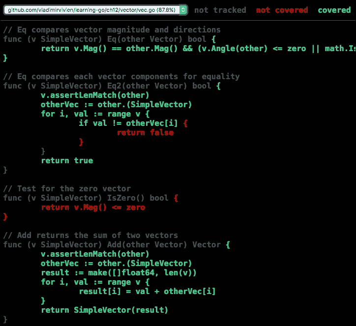

# 第十二章：代码测试

测试是现代软件开发实践的关键仪式。Go 通过提供 API 和命令行工具，将测试直接融入开发周期，无缝创建和集成自动化测试代码。在这里，我们将介绍 Go 测试套件，包括以下内容：

+   Go 测试工具

+   编写 Go 测试

+   HTTP 测试

+   测试覆盖率

+   代码基准

# Go 测试工具

在编写任何测试代码之前，让我们先讨论一下 Go 中自动化测试的工具。与`go build`命令类似，`go test`命令旨在编译和执行指定包中的测试源文件，如下命令所示：

```go
$> go test .

```

上述命令将执行当前包中的所有测试函数。尽管看起来很简单，但上述命令完成了几个复杂的步骤，包括：

+   编译当前包中找到的所有测试文件

+   从测试文件生成一个带有仪器的二进制文件

+   执行代码中的测试函数

当`go test`命令针对多个包时，测试工具将生成多个测试二进制文件，这些二进制文件将独立执行和测试，如下所示：

```go
$> go test ./... 

```

## 测试文件名称

测试命令使用导入路径标准（请参阅第六章，*Go 包和程序*）来指定要测试的包。在指定的包内，测试工具将编译所有具有`*_test.go`名称模式的文件。例如，假设我们有一个项目，在名为`vec.go`的文件中有一个简单的数学向量类型的实现，那么它的测试文件的合理名称将是`vec_test.go`。

## 测试组织

传统上，测试文件保存在与被测试的代码相同的包（目录）中。这是因为不需要将测试文件分开，因为它们被排除在编译的程序二进制文件之外。以下显示了典型 Go 包的目录布局，本例中是标准库中的`fmt`包。它显示了包的所有测试文件与常规源代码在同一目录中：

```go
$>tree go/src/fmt/
├── doc.go
├── export_test.go
├── fmt_test.go
├── format.go
├── norace_test.go
├── print.go
├── race_test.go
├── scan.go
├── scan_test.go
└── stringer_test.go

```

除了拥有更简单的项目结构外，将文件放在一起使测试函数完全可见被测试的包。这有助于访问和验证否则对测试代码不透明的包元素。当您的函数放在与要测试的代码不同的包中时，它们将失去对代码的非导出元素的访问权限。

# 编写 Go 测试

Go 测试文件只是一组具有以下签名的函数：

*func Test<Name>(*testing.T)*

在这里，*<Name>*是一个反映测试目的的任意名称。测试函数旨在执行源代码的特定功能单元（或单元测试）。

在编写测试函数之前，让我们回顾一下将要测试的代码。以下源代码片段显示了一个简单的数学向量的实现，具有`Add`、`Sub`和`Scale`方法（请参阅[`github.com/vladimirvivien/learning-go/ch12/vector/vec.go`](https://github.com/vladimirvivien/learning-go/ch12/vector/vec.go)上列出的完整源代码）。请注意，每个方法都实现了特定的行为作为功能单元，这将使测试变得容易：

```go
type Vector interface { 
    Add(other Vector) Vector 
    Sub(other Vector) Vector 
    Scale(factor float64) 
    ... 
} 

func New(elems ...float64) SimpleVector { 
    return SimpleVector(elems) 
} 

type SimpleVector []float64 

func (v SimpleVector) Add(other Vector) Vector { 
   v.assertLenMatch(other) 
   otherVec := other.(SimpleVector) 
   result := make([]float64, len(v)) 
   for i, val := range v { 
         result[i] = val + otherVec[i] 
   } 
   return SimpleVector(result) 
} 

func (v SimpleVector) Sub(other Vector) Vector { 
   v.assertLenMatch(other) 
   otherVec := other.(SimpleVector) 
   result := make([]float64, len(v)) 
   for i, val := range v { 
         result[i] = val - otherVec[i] 
   } 
   return SimpleVector(result) 
} 

func (v SimpleVector) Scale(scale float64) { 
   for i := range v { 
         v[i] = v[i] * scale 
   } 
} 
... 

```

golang.fyi/ch12/vector/vec.go

## 测试函数

文件`vec_test.go`中的测试源代码定义了一系列函数，通过独立测试其每个方法来执行`SimpleVector`类型（请参见前一节）的行为：

```go
import "testing" 

func TestVectorAdd(t *testing.T) { 
   v1 := New(8.218, -9.341) 
   v2 := New(-1.129, 2.111) 
   v3 := v1.Add(v2) 
   expect := New( 
       v1[0]+v2[0], 
       v1[1]+v2[1], 
   ) 

   if !v3.Eq(expect) { 
       t.Logf("Addition failed, expecting %s, got %s",  
          expect, v3) 
       t.Fail() 
   } 
   t.Log(v1, "+", v2, v3) 
} 

func TestVectorSub(t *testing.T) { 
   v1 := New(7.119, 8.215) 
   v2 := New(-8.223, 0.878) 
   v3 := v1.Sub(v2) 
   expect := New( 
       v1[0]-v2[0], 
       v1[1]-v2[1], 
   ) 
   if !v3.Eq(expect) { 
       t.Log("Subtraction failed, expecting %s, got %s",  
           expect, v3) 
           t.Fail() 
   } 
   t.Log(v1, "-", v2, "=", v3) 
} 

func TestVectorScale(t *testing.T) { 
   v := New(1.671, -1.012, -0.318) 
   v.Scale(7.41) 
   expect := New( 
       7.41*1.671, 
       7.41*-1.012, 
       7.41*-0.318, 
   ) 
   if !v.Eq(expect) { 
       t.Logf("Scalar mul failed, expecting %s, got %s",  
           expect, v) 
       t.Fail() 
   } 
   t.Log("1.671,-1.012, -0.318 Scale", 7.41, "=", v) 
} 

```

golang.fyi/ch12/vector/vec_test.go

如前面的代码所示，所有测试源代码必须导入`"testing"`包。这是因为每个测试函数都接收一个类型为`*testing.T`的参数。正如本章中进一步讨论的那样，这允许测试函数与 Go 测试运行时进行交互。

至关重要的是要意识到每个测试函数都应该是幂等的，并且不依赖于任何先前保存或共享的状态。 在前面的源代码片段中，每个测试函数都作为独立的代码片段执行。 您的测试函数不应该假设执行的顺序，因为 Go 测试运行时不会做出这样的保证。

测试函数的源代码通常设置了一个预期值，该值是根据对被测试代码的了解而预先确定的。 然后将该值与被测试代码返回的计算值进行比较。 例如，当添加两个向量时，我们可以使用向量加法规则计算预期结果，如下面的代码片段所示：

```go
v1 := New(8.218, -9.341) 
v2 := New(-1.129, 2.111) 
v3 := v1.Add(v2) 
expect := New( 
    v1[0]+v2[0], 
    v1[1]+v2[1], 
) 

```

在前面的源代码片段中，使用两个简单的向量值`v1`和`v2`计算预期值，并存储在变量`expect`中。 另一方面，变量`v3`存储了向量的实际值，由被测试代码计算得出。 这使我们可以测试实际值与预期值，如下所示：

```go
if !v3.Eq(expect) { 
    t.Log("Addition failed, expecting %s, got %s", expect, v3) 
    t.Fail() 
} 

```

在前面的源代码片段中，如果测试的条件是`false`，那么测试就失败了。 代码使用`t.Fail()`来表示测试函数的失败。 关于信号失败的讨论将在报告失败部分详细讨论。

## 运行测试

如本章的介绍部分所述，使用`go test`命令行工具执行测试函数。 例如，如果我们在包向量中运行以下命令，它将自动运行该包的所有测试函数：

```go
$> cd vector
$> go test .
ok    github.com/vladimirvivien/learning-go/ch12/vector     0.001s

```

还可以通过指定子包（或使用包通配符“./…”指定所有包）来执行测试，如下所示：

```go
$> cd $GOPATH/src/github.com/vladimirvivien/learning-go/ch12/
$> go test ./vector
ok    github.com/vladimirvivien/learning-go/ch12/vector     0.005s

```

### 过滤执行的测试

在开发大量测试函数时，通常希望在调试阶段专注于一个函数（或一组函数）。 Go 测试命令行工具支持`-run`标志，该标志指定一个正则表达式，只执行其名称与指定表达式匹配的函数。 以下命令将只执行测试函数`TestVectorAdd`：

```go
$> go test -run=VectorAdd -v
=== RUN   TestVectorAdd
--- PASS: TestVectorAdd (0.00s)
PASS
ok    github.com/vladimirvivien/learning-go/ch12/vector     0.025s

```

使用`-v`标志确认只执行了一个测试函数`TestVectorAdd`。 例如，以下示例执行所有以`VectorA.*$`结尾或匹配函数名`TestVectorMag`的测试函数，同时忽略其他所有内容：

```go
> go test -run="VectorA.*$|TestVectorMag" -v
=== RUN   TestVectorAdd
--- PASS: TestVectorAdd (0.00s)
=== RUN   TestVectorMag
--- PASS: TestVectorMag (0.00s)
=== RUN   TestVectorAngle
--- PASS: TestVectorAngle (0.00s)
PASS
ok    github.com/vladimirvivien/learning-go/ch12/vector     0.043s

```

## 测试日志

在编写新的或调试现有的测试函数时，将信息打印到标准输出通常是有帮助的。 类型`testing.T`提供了两种日志记录方法：`Log`使用默认格式化程序，`Logf`使用格式化动词（如在`fmt`包中定义）。 例如，向量示例中的以下测试函数片段显示了使用`t.Logf("Vector = %v; Unit vector = %v\n", v, expect)`记录信息的代码：

```go
func TestVectorUnit(t *testing.T) { 
   v := New(5.581, -2.136) 
   mag := v.Mag() 
   expect := New((1/mag)*v[0], (1/mag)*v[1]) 
   if !v.Unit().Eq(expect) { 
       t.Logf("Vector Unit failed, expecting %s, got %s",  
           expect, v.Unit()) 
       t.Fail() 
   } 
   t.Logf("Vector = %v; Unit vector = %v\n", v, expect) 
}  

```

golang.fyi/ch12/vector/vec_test.go

如前所述，除非有测试失败，否则 Go 测试工具会以最小的输出运行测试。 但是，当提供详细标志`*-v*`时，该工具将输出测试日志。 例如，在包向量中运行以下命令将静音所有日志记录语句：

```go
> go test -run=VectorUnit
PASS
ok    github.com/vladimirvivien/learning-go/ch12/vector     0.005s

```

当提供了详细标志`-v`，如下命令所示，测试运行时会打印日志的输出，如下所示：

```go
$> go test -run=VectorUnit -v
=== RUN   TestVectorUnit
--- PASS: TestVectorUnit (0.00s)
vec_test.go:100: Vector = [5.581,-2.136]; Unit vector =
[0.9339352140866403,-0.35744232526233]
PASS
ok    github.com/vladimirvivien/learning-go/ch12/vector     0.001s

```

## 报告失败

默认情况下，如果测试函数正常运行并返回而没有发生 panic，Go 测试运行时将认为测试是成功的。 例如，以下测试函数是错误的，因为其预期值没有正确计算。 但是，测试运行时将始终报告它通过，因为它不包括任何报告失败的代码：

```go
func TestVectorDotProd(t *testing.T) { 
    v1 := New(7.887, 4.138).(SimpleVector) 
    v2 := New(-8.802, 6.776).(SimpleVector) 
    actual := v1.DotProd(v2) 
    expect := v1[0]*v2[0] - v1[1]*v2[1] 
    if actual != expect { 
        t.Logf("DotPoduct failed, expecting %d, got %d",  
          expect, actual) 
    } 
} 

```

golang.fyi/ch12/vec_test.go

这种误报的情况可能会被忽视，特别是在关闭了详细标志的情况下，最大程度地减少了任何视觉线索表明它已经损坏：

```go
$> go test -run=VectorDot
PASS
ok    github.com/vladimirvivien/learning-go/ch12/vector     0.001s

```

修复前面的测试的一种方法是使用 `testing.T` 类型的 `Fail` 方法来表示失败，如下面的代码片段所示：

```go
func TestVectorDotProd(t *testing.T) { 
... 
    if actual != expect { 
        t.Logf("DotPoduct failed, expecting %d, got %d",  
          expect, actual) 
        t.Fail() 
    } 
} 

```

因此，当执行测试时，它会正确报告它是有问题的，如下面的输出所示：

```go
$> go test -run=VectorDot
--- FAIL: TestVectorDotProd (0.00s)
vec_test.go:109: DotPoduct failed, expecting -97.460462, got -41.382286
FAIL
exit status 1
FAIL  github.com/vladimirvivien/learning-go/ch12/vector     0.002s

```

重要的是要理解，`Fail` 方法只报告失败，不会终止测试函数的执行。另一方面，当在失败条件下实际上需要退出函数时，测试 API 提供了 `FailNow` 方法，它表示失败并退出当前正在执行的测试函数。

`testing.T` 类型提供了方便的 `Logf` 和 `Errorf` 方法，结合了日志记录和失败报告。例如，以下代码片段使用了 `Errorf` 方法，它相当于调用 `Logf` 和 `Fail` 方法：

```go
func TestVectorMag(t *testing.T) { 
    v := New(-0.221, 7.437) 
    expected := math.Sqrt(v[0]*v[0] + v[1]*v[1]) 
    if v.Mag() != expected { 
   t.Errorf("Magnitude failed, execpted %d, got %d",  
        expected, v.Mag()) 
    } 
} 

```

golang.fyi/ch12/vector/vec.go

`testing.T` 类型还提供了 `Fatal` 和 `Formatf` 方法，用于将消息记录和测试函数的立即终止结合在一起。

## 跳过测试

有时由于一些因素，如环境限制、资源可用性或不合适的环境设置，有必要跳过测试函数。测试 API 可以使用 `testing.T` 类型的 `SkipNow` 方法来跳过测试函数。以下源代码片段只有在设置了名为 `RUN_ANGLE` 的任意操作系统环境变量时才会运行测试函数。否则，它将跳过测试：

```go
func TestVectorAngle(t *testing.T) { 
   if os.Getenv("RUN_ANGLE") == "" { 
         t.Skipf("Env variable RUN_ANGLE not set, skipping:") 
   } 
   v1 := New(3.183, -7.627) 
   v2 := New(-2.668, 5.319) 
   actual := v1.Angle(v2) 
   expect := math.Acos(v1.DotProd(v2) / (v1.Mag() * v2.Mag())) 
   if actual != expect { 
         t.Logf("Vector angle failed, expecting %d, got %d", 
            expect, actual) 
         t.Fail() 
   } 
   t.Log("Angle between", v1, "and", v2, "=", actual) 
} 

```

请注意，代码使用了 `Skipf` 方法，这是 `testing.T` 类型的 `SkipNow` 和 `Logf` 方法的组合。当测试在没有环境变量的情况下执行时，输出如下：

```go
$> go test -run=Angle -v
=== RUN   TestVectorAngle
--- SKIP: TestVectorAngle (0.00s)
 vec_test.go:128: Env variable RUN_ANGLE not set, skipping:
PASS
ok    github.com/vladimirvivien/learning-go/ch12/vector     0.006s 

```

当提供环境变量时，如下面的 Linux/Unix 命令所示，测试会按预期执行（请参考您的操作系统如何设置环境变量）：

```go
> RUN_ANGLE=1 go test -run=Angle -v
=== RUN   TestVectorAngle
--- PASS: TestVectorAngle (0.00s)
 vec_test.go:138: Angle between [3.183,-7.627] and [-2.668,5.319] = 3.0720263098372476
PASS
ok    github.com/vladimirvivien/learning-go/ch12/vector     0.005s

```

## 表驱动测试

在 Go 中经常遇到的一种技术是使用表驱动测试。这是指一组输入和期望的输出存储在一个数据结构中，然后用于循环执行不同的测试场景。例如，在下面的测试函数中，`cases` 变量的类型为 `[]struct{vec SimpleVector; expected float64}`，用于存储多个矢量值及其预期的大小值，以测试矢量方法 `Mag`：

```go
func TestVectorMag(t *testing.T) { 
   cases := []struct{ 
         vec SimpleVector 
         expected float64 

   }{ 
       {New(1.2, 3.4), math.Sqrt(1.2*1.2 + 3.4*3.4)}, 
       {New(-0.21, 7.47), math.Sqrt(-0.21*-0.21 + 7.47*7.47)}, 
       {New(1.43, -5.40), math.Sqrt(1.43*1.43 + -5.40*-5.40)}, 
       {New(-2.07, -9.0), math.Sqrt(-2.07*-2.07 + -9.0*-9.0)}, 
   } 
   for _, c := range cases { 
       mag := c.vec.Mag() 
       if mag != c.expected { 
         t.Errorf("Magnitude failed, execpted %d, got %d",  
              c.expected, mag) 
       } 
   } 
} 

```

golang.fyi/ch12/vector/vec.go

在循环的每次迭代中，代码都会测试 `Mag` 方法计算出的值与预期值。使用这种方法，我们可以测试多种输入组合及其相应的输出，就像前面的代码所做的那样。这种技术可以根据需要扩展，以包括更多的参数。例如，可以使用一个名称字段来为每个案例命名，在测试案例数量较多时非常有用。或者，更加花哨的是，可以在测试案例结构中包含一个函数字段，用于指定每个相应案例使用的自定义逻辑。

# HTTP 测试

在第十一章中，*编写网络服务*，我们看到 Go 提供了一流的 API 来使用 HTTP 构建客户端和服务器程序。`net/http/httptest` 子包是 Go 标准库的一部分，它便于对 HTTP 服务器和客户端代码进行测试自动化，正如本节所讨论的那样。

为了探索这个领域，我们将实现一个简单的 API 服务，该服务将矢量操作（在前面的章节中介绍）作为 HTTP 端点暴露出来。例如，以下源代码片段部分显示了构成服务器的方法（完整列表请参见 [`github.com/vladimirvivien/learning-go/ch12/service/serv.go`](https://github.com/vladimirvivien/learning-go/ch12/service/serv.go)）：

```go
package main 

import ( 
   "encoding/json" 
   "fmt" 
   "net/http" 

   "github.com/vladimirvivien/learning-go/ch12/vector" 
) 
func add(resp http.ResponseWriter, req *http.Request) { 
   var params []vector.SimpleVector 
   if err := json.NewDecoder(req.Body).Decode(&params);  
       err != nil { 
         resp.WriteHeader(http.StatusBadRequest) 
         fmt.Fprintf(resp, "Unable to parse request: %s\n", err) 
         return 
   } 
   if len(params) != 2 { 
         resp.WriteHeader(http.StatusBadRequest) 
         fmt.Fprintf(resp, "Expected 2 or more vectors") 
         return 
   } 
   result := params[0].Add(params[1]) 
   if err := json.NewEncoder(resp).Encode(&result); err != nil { 
         resp.WriteHeader(http.StatusInternalServerError) 
         fmt.Fprintf(resp, err.Error()) 
         return 
   } 
} 
... 
func main() { 
   mux := http.NewServeMux() 
   mux.HandleFunc("/vec/add", add) 
   mux.HandleFunc("/vec/sub", sub) 
   mux.HandleFunc("/vec/dotprod", dotProd) 
   mux.HandleFunc("/vec/mag", mag) 
   mux.HandleFunc("/vec/unit", unit) 

   if err := http.ListenAndServe(":4040", mux); err != nil { 
         fmt.Println(err) 
   } 
} 

```

golang.fyi/ch12/service/serv.go

每个函数（`add`、`sub`、`dotprod`、`mag`和`unit`）都实现了`http.Handler`接口。这些函数用于处理来自客户端的 HTTP 请求，以计算`vector`包中的相应操作。请求和响应都使用 JSON 格式进行格式化，以简化操作。

## 测试 HTTP 服务器代码

编写 HTTP 服务器代码时，您无疑会遇到需要以稳健且可重复的方式测试代码的需求，而无需设置一些脆弱的代码来模拟端到端测试。`httptest.ResponseRecorder`类型专门设计用于通过检查测试函数中对`http.ResponseWriter`的状态更改来提供单元测试功能。例如，以下代码片段使用`httptest.ResponseRecorder`来测试服务器的`add`方法：

```go
import ( 
   "net/http" 
   "net/http/httptest" 
   "strconv" 
   "strings" 
   "testing" 

   "github.com/vladimirvivien/learning-go/ch12/vector" 
) 

func TestVectorAdd(t *testing.T) { 
   reqBody := "[[1,2],[3,4]]" 
   req, err := http.NewRequest( 
        "POST", "http://0.0.0.0/", strings.NewReader(reqBody)) 
   if err != nil { 
         t.Fatal(err) 
   } 
   actual := vector.New(1, 2).Add(vector.New(3, 4)) 
   w := httptest.NewRecorder() 
   add(w, req) 
   if actual.String() != strings.TrimSpace(w.Body.String()) { 
         t.Fatalf("Expecting actual %s, got %s",  
             actual.String(), w.Body.String(), 
         ) 
   } 
} 

```

代码使用`reg, err := http.NewRequest("POST", "http://0.0.0.0/", strings.NewReader(reqBody))`创建一个新的`*http.Request`值，其中包括`"POST"`方法、一个虚假的 URL 和一个请求主体`reqBody`，编码为 JSON 数组。代码中后来使用`w := httptest.NewRecorder()`创建一个`httputil.ResponseRecorder`值，用于调用`add(w, req)`函数以及创建的请求。在执行`add`函数期间记录在`w`中的值与存储在`atual`中的预期值进行比较，`if actual.String() != strings.TrimSpace(w.Body.String()){...}`。

## 测试 HTTP 客户端代码

为 HTTP 客户端创建测试代码更为复杂，因为实际上需要运行服务器进行适当的测试。幸运的是，`httptest`包提供了类型`httptest.Server`，可以以编程方式创建服务器，以测试客户端请求并向客户端发送模拟响应。

为了举例说明，让我们考虑以下代码，它部分展示了早些时候介绍的向矢量服务器实现 HTTP 客户端的代码（请参阅完整的代码清单[`github.com/vladimirvivien/learning-go/ch12/client/client.go`](https://github.com/vladimirvivien/learning-go/ch12/client/client.go)）。`add`方法将类型为`vector.SimpleVector`的参数`vec0`和`vec2`编码为 JSON 对象，然后使用`c.client.Do(req)`将其发送到服务器。响应从 JSON 数组解码为类型为`vector.SimpleVector`的变量`result`：

```go
type vecClient struct { 
    svcAddr string 
    client *http.Client 
} 
func (c *vecClient) add( 
   vec0, vec1 vector.SimpleVector) (vector.SimpleVector, error) { 
   uri := c.svcAddr + "/vec/add" 

   // encode params 
   var body bytes.Buffer 
    params := []vector.SimpleVector{vec0, vec1} 
   if err := json.NewEncoder(&body).Encode(&params); err != nil { 
         return []float64{}, err 
   } 
   req, err := http.NewRequest("POST", uri, &body) 
   if err != nil { 
        return []float64{}, err 
   } 

   // send request 
   resp, err := c.client.Do(req) 
   if err != nil { 
       return []float64{}, err 
   } 
   defer resp.Body.Close() 

   // handle response 
   var result vector.SimpleVector 
   if err := json.NewDecoder(resp.Body). 
        Decode(&result); err != nil { 
        return []float64{}, err 
    } 
    return result, nil 
} 

```

golang.fyi/ch12/client/client.go

我们可以使用类型`httptest.Server`创建用于测试客户端发送的请求并将数据返回给客户端代码以进行进一步检查的代码。函数`httptest.NewServer`接受类型为`http.Handler`的值，其中封装了服务器的测试逻辑。然后该函数返回一个新的运行中的 HTTP 服务器，准备在系统选择的端口上提供服务。

以下测试函数显示了如何使用`httptest.Server`来执行先前介绍的客户端代码中的`add`方法。请注意，创建服务器时，代码使用了类型`http.HandlerFunc`，这是一个适配器，它接受函数值以生成`http.Handler`。这种便利性使我们能够跳过创建一个单独的类型来实现新的`http.Handler`：

```go
import( 
    "net/http" 
    "net/http/httptest" 
    ... 
) 
func TestClientAdd(t *testing.T) { 
   server := httptest.NewServer(http.HandlerFunc( 
         func(resp http.ResponseWriter, req *http.Request) { 
             // test incoming request path 
             if req.URL.Path != "/vec/add" { 
                 t.Errorf("unexpected request path %s",  
                    req.URL.Path) 
                   return 
               } 
               // test incoming params 
               body, _ := ioutil.ReadAll(req.Body) 
               params := strings.TrimSpace(string(body)) 
               if params != "[[1,2],[3,4]]" { 
                     t.Errorf("unexpected params '%v'", params) 
                     return 
               } 
               // send result 
               result := vector.New(1, 2).Add(vector.New(3, 4)) 
               err := json.NewEncoder(resp).Encode(&result) 
               if err != nil { 
                     t.Fatal(err) 
                     return 
               } 
         }, 
   )) 
   defer server.Close() 
   client := newVecClient(server.URL) 
   expected := vector.New(1, 2).Add(vector.New(3, 4)) 
   result, err := client.add(vector.New(1, 2), vector.New(3, 4)) 
   if err != nil { 
         t.Fatal(err) 
   } 
   if !result.Eq(expected) { 
         t.Errorf("Expecting %s, got %s", expected, result) 
   } 
} 

```

golang.fyi/ch12/client/client_test.go

测试函数首先设置`server`及其处理函数。在`http.HandlerFunc`的函数内部，代码首先确保客户端请求了`"/vec/add"`的正确路径。接下来，代码检查来自客户端的请求主体，确保 JSON 格式正确，并且对于添加操作是有效的参数。最后，处理程序函数将期望的结果编码为 JSON，并将其作为响应发送给客户端。

代码使用系统生成的`server`地址创建一个新的`client`，并使用`newVecClient(server.URL)`。方法调用`client.add(vector.New(1, 2), vector.New(3, 4))`发送一个请求到测试服务器，计算其参数列表中两个值的向量加法。如前所示，测试服务器仅模拟真实服务器代码，并返回计算的向量值。检查`result`与`expected`值以确保`add`方法的正常工作。

# 测试覆盖率

在编写测试时，了解实际代码有多少被测试覆盖通常很重要。这个数字是测试逻辑对源代码的渗透程度的指示。无论您是否同意，在许多软件开发实践中，测试覆盖率都是一个关键指标，因为它衡量了代码测试的程度。

幸运的是，Go 测试工具自带了一个内置的覆盖工具。使用`-cover`标志运行 Go 测试命令会为原始源代码添加覆盖逻辑。然后运行生成的测试二进制文件，提供包的整体覆盖率概要，如下所示：

```go
$> go test -cover
PASS
coverage: 87.8% of statements
ok    github.com/vladimirvivien/learning-go/ch12/vector     0.028s

```

结果显示了一个覆盖率为`87.8%`的经过充分测试的代码。我们可以使用测试工具提取有关已测试代码部分的更多详细信息。为此，我们使用`-coverprofile`标志将覆盖率指标记录到文件中，如下所示：

```go
$> go test -coverprofile=cover.out

```

## 覆盖工具

保存覆盖数据后，可以使用`go tool cover`命令以文本制表格式表格的形式呈现。以下显示了先前生成的覆盖文件中每个测试函数的覆盖指标的部分输出：

```go
$> go tool cover -func=cover.out
...
learning-go/ch12/vector/vec.go:52:  Eq          100.0%
learning-go/ch12/vector/vec.go:57:  Eq2         83.3%
learning-go/ch12/vector/vec.go:74:  Add         100.0%
learning-go/ch12/vector/vec.go:85:  Sub         100.0%
learning-go/ch12/vector/vec.go:96:  Scale       100.0%
...

```

`cover`工具可以将覆盖率指标叠加在实际代码上，提供视觉辅助，显示代码的覆盖（和未覆盖）部分。使用`-html`标志生成使用先前收集的覆盖数据的 HTML 页面：

```go
 $> go tool cover -html=cover.out

```

该命令打开已安装的默认 Web 浏览器，并显示覆盖数据，如下截图所示：



前面的截图只显示了生成的 HTML 页面的一部分。它显示覆盖的代码为绿色，未覆盖的代码为红色。其他任何内容显示为灰色。

# 代码基准

基准测试的目的是衡量代码的性能。Go 测试命令行工具支持自动生成和测量基准指标。与单元测试类似，测试工具使用基准函数来指定要测量的代码部分。基准函数使用以下函数命名模式和签名：

*func Benchmark<Name>(*testing.B)*

基准函数的名称应以*benchmark*开头，并接受类型为`*testing.B`的指针值。以下显示了一个基准`SimpleVector`类型的`Add`方法的函数（之前介绍过）：

```go
import ( 
    "math/rand" 
    "testing" 
    "time" 
) 
... 
func BenchmarkVectorAdd(b *testing.B) { 
   r := rand.New(rand.NewSource(time.Now().UnixNano())) 
   for i := 0; i < b.N; i++ { 
         v1 := New(r.Float64(), r.Float64()) 
         v2 := New(r.Float64(), r.Float64()) 
         v1.Add(v2) 
   } 
} 

```

golang.fyi/ch12/vector/vec_bench_test.go

Go 的测试运行时通过将指针`*testing.B`注入为参数来调用基准函数。该值定义了与基准框架交互的方法，如日志记录、失败信号和其他类似于类型`testing.T`的功能。类型`testing.B`还提供了额外的基准特定元素，包括整数字段`N`。它旨在是基准函数应使用的迭代次数的数量。

被基准测试的代码应放在一个由`N`限定的`for`循环中，如前面的示例所示。为了使基准有效，每次循环迭代的输入大小不应有变化。例如，在前面的基准测试中，每次迭代始终使用大小为`2`的向量（虽然向量的实际值是随机的）。

## 运行基准

除非测试命令行工具接收到 `-bench` 标志，否则不会执行基准测试函数。以下命令在当前包中运行所有基准测试函数：

```go
$> go test -bench=.
PASS
BenchmarkVectorAdd-2           2000000           761 ns/op
BenchmarkVectorSub-2           2000000           788 ns/op
BenchmarkVectorScale-2         5000000           269 ns/op
BenchmarkVectorMag-2           5000000           243 ns/op
BenchmarkVectorUnit-2          3000000           507 ns/op
BenchmarkVectorDotProd-2       3000000           549 ns/op
BenchmarkVectorAngle-2         2000000           659 ns/op
ok    github.com/vladimirvivien/learning-go/ch12/vector     14.123s

```

在剖析基准测试结果之前，让我们了解先前发出的命令。`go test -bench=.` 命令首先执行包中的所有测试函数，然后执行所有基准测试函数（您可以通过在命令中添加 `-v` 标志来验证这一点）。

与 `-run` 标志类似，`-bench` 标志指定了一个正则表达式，用于选择要执行的基准测试函数。`-bench=.` 标志匹配所有基准测试函数的名称，就像前面的示例中所示的那样。然而，以下示例只运行包含其名称中包含模式 `"VectorA"` 的基准测试函数。这包括 `BenchmarkVectroAngle()` 和 `BenchmarkVectorAngle()` 函数：

```go
$> go test -bench="VectorA"
PASS
BenchmarkVectorAdd-2     2000000           764 ns/op
BenchmarkVectorAngle-2   2000000           665 ns/op
ok    github.com/vladimirvivien/learning-go/ch12/vector     4.396s

```

## 跳过测试函数

如前所述，当执行基准测试时，测试工具还将运行所有测试函数。这可能是不希望的，特别是如果您的包中有大量测试。在基准测试执行期间跳过测试函数的一个简单方法是将 `-run` 标志设置为与没有测试函数匹配的值，如下所示：

```go
> go test -bench=. -run=NONE -v
PASS
BenchmarkVectorAdd-2           2000000           791 ns/op
BenchmarkVectorSub-2           2000000           777 ns/op
...
BenchmarkVectorAngle-2         2000000           653 ns/op
ok    github.com/vladimirvivien/learning-go/ch12/vector     14.069s

```

前面的命令只执行基准测试函数，如部分冗长输出所示。`-run` 标志的值是完全任意的，可以设置为任何值，使其跳过执行测试函数。

## 基准测试报告

与测试不同，基准测试报告始终是冗长的，并显示了几列度量标准，如下所示：

```go
$> go test -run=NONE -bench="Add|Sub|Scale"
PASS
BenchmarkVectorAdd-2     2000000           800 ns/op
BenchmarkVectorSub-2     2000000           798 ns/op
BenchmarkVectorScale-2   5000000           266 ns/op
ok    github.com/vladimirvivien/learning-go/ch12/vector     6.473s

```

第一列包含基准测试函数的名称，每个名称都以一个反映 *GOMAXPROCS* 值的数字作为后缀，可以使用 `-cpu` 标志在测试时设置（用于并行运行基准测试）。

下一列显示了每个基准测试循环的迭代次数。例如，在前面的报告中，前两个基准测试函数循环了 200 万次，而最后一个基准测试函数迭代了 500 万次。报告的最后一列显示了执行测试函数所需的平均时间。例如，对 `Scale` 方法的 500 万次调用在基准测试函数 `BenchmarkVectorScale` 中平均需要 266 纳秒才能完成。

## 调整 N

默认情况下，测试框架会逐渐调整 `N` 的大小，以便在 *一秒* 的时间内获得稳定和有意义的度量标准。您不能直接更改 `N`。但是，您可以使用 `-benchtime` 标志指定基准测试运行时间，从而影响基准测试期间的迭代次数。例如，以下示例运行基准测试 `5` 秒：

```go
> go test -run=Bench -bench="Add|Sub|Scale" -benchtime 5s
PASS
BenchmarkVectorAdd-2    10000000           784 ns/op
BenchmarkVectorSub-2    10000000           810 ns/op
BenchmarkVectorScale-2  30000000           265 ns/op
ok    github.com/vladimirvivien/learning-go/ch12/vector     25.877s

```

请注意，即使每个基准测试的迭代次数有很大的跳跃（每个基准测试的迭代次数增加了五倍或更多），每个基准测试函数的平均性能时间仍然保持相当一致。这些信息为您的代码的性能提供了宝贵的见解。这是观察代码或负载变化对性能的影响的好方法，如下一节所讨论的。

## 比较基准测试

基准测试代码的另一个有用方面是比较实现类似功能的不同算法的性能。使用性能基准测试来运行算法将表明哪种实现可能更具计算和内存效率。

例如，如果两个向量的大小和方向相同（或它们之间的角度值为零），则它们被认为是相等的。我们可以使用以下源代码片段来实现这个定义：

```go
const zero = 1.0e-7  
... 
func (v SimpleVector) Eq(other Vector) bool { 
   ang := v.Angle(other) 
   if math.IsNaN(ang) { 
         return v.Mag() == other.Mag() 
   } 
   return v.Mag() == other.Mag() && ang <= zero 
} 

```

golang.fyi/ch12/vector/vec.go

当对前述方法进行基准测试时，将得到以下结果。它的 300 万次迭代平均需要半毫秒才能运行：

```go
$> go test -run=Bench -bench=Equal1
PASS
BenchmarkVectorEqual1-2  3000000           454 ns/op
ok    github.com/vladimirvivien/learning-go/ch12/vector     1.849s

```

基准结果并不差，特别是与我们之前看到的其他基准方法相比。然而，假设我们想要改进`Eq`方法的性能（也许因为它是程序的关键部分）。我们可以使用`-benchmem`标志来获取有关基准测试的额外信息：

```go
$> go test -run=bench -bench=Equal1 -benchmem
PASS
BenchmarkVectorEqual1-2  3000000 474 ns/op  48 B/op  2 allocs/op

```

`-benchmem`标志会导致测试工具显示两个额外的列，提供内存分配指标，如前面的输出所示。我们看到`Eq`方法总共分配了 48 字节，每个操作调用两次分配。

这并没有告诉我们太多，直到我们有其他东西可以进行比较。幸运的是，我们还有另一种相等算法可以尝试。它基于这样一个事实，即如果两个向量具有相同数量的元素，并且每个元素相等，那么它们也是相等的。这个定义可以通过遍历向量并比较其元素来实现，就像在下面的代码中所做的那样：

```go
func (v SimpleVector) Eq2(other Vector) bool { 
   v.assertLenMatch(other) 
   otherVec := other.(SimpleVector) 
   for i, val := range v { 
         if val != otherVec[i] { 
               return false 
         } 
   } 
   return true 
} 

```

golang.fyi/ch12/vector/vec.go

现在让我们对`Eq`和`Eq2`相等方法进行基准测试，看看哪个性能更好，就像下面所做的那样：

```go
$> go test -run=bench -bench=Equal -benchmem
PASS
BenchmarkVectorEqual1-2   3000000   447 ns/op   48 B/op   2 allocs/op
BenchmarkVectorEqual2-2   5000000   265 ns/op   32 B/op   1 allocs/op

```

根据基准报告，方法`Eq2`是这两种相等方法中性能更好的。它的运行时间大约是原始方法的一半，分配的内存要少得多。由于两个基准测试使用类似的输入数据，我们可以自信地说第二种方法比第一种更好。

### 注意

根据 Go 版本和机器大小和架构，这些基准数字会有所不同。然而，结果总是会显示 Eq2 方法的性能更好。

这次讨论只是对比基准的皮毛。例如，先前的基准测试使用相同大小的输入。有时观察性能随输入大小变化的变化是有用的。我们可以比较相等方法的性能配置文件，比如当输入大小从 3、10、20 或 30 个元素变化时。如果算法对大小敏感，扩展基准测试使用这些属性将揭示任何瓶颈。

# 总结

本章介绍了在 Go 中编写测试的实践的广泛介绍。它讨论了几个关键主题，包括使用`go test`工具来编译和执行自动化测试。读者学会了如何编写测试函数来确保他们的代码得到适当的测试和覆盖。本章还讨论了测试 HTTP 客户端和服务器的主题。最后，本章介绍了使用内置的 Go 工具自动化、分析和衡量代码性能的基准测试主题。
