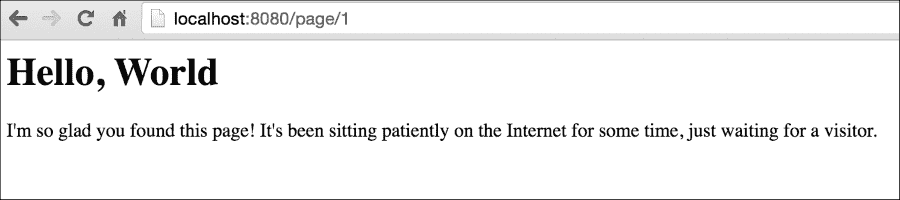
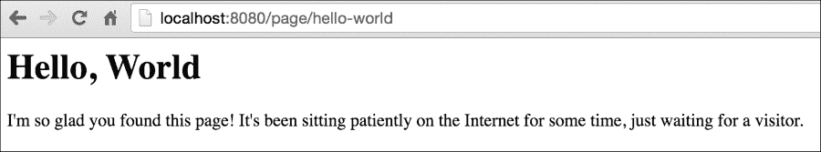
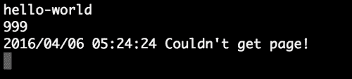
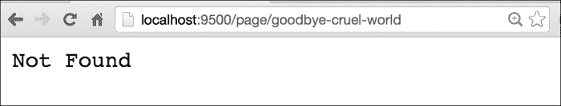

# 第三章：连接到数据

在上一章中，我们探讨了如何获取 URL 并将其转换为 Web 应用程序中的不同页面。这样做，我们构建了动态的 URL，并从我们（非常简单的）`net/http`处理程序中获得了动态响应。

通过从 Gorilla 工具包实现扩展的 mux 路由器，我们扩展了内置路由器的功能，允许使用正则表达式，从而使我们的应用程序具有更大的灵活性。

这是一些最流行的 Web 服务器的固有特性。例如，Apache 和 Nginx 都提供了在路由中利用正则表达式的方法，与常见解决方案保持一致应该是我们功能的最低基线。

但这只是构建具有多样功能的强大 Web 应用程序的一个重要的步骤。要进一步发展，我们需要考虑引入数据。

我们在上一章的示例中依赖于从静态文件中抓取的硬编码内容，这显然是过时的，不可扩展的。在 Web 的 CGI 早期，任何需要更新网站的人都需要重新制作静态文件，或者解释服务器端包含的过时性。

但幸运的是，Web 在 20 世纪 90 年代后期变得非常动态，数据库开始统治世界。虽然 API、微服务和 NoSQL 在某些地方取代了这种架构，但它仍然是 Web 工作的基础。

因此，话不多说，让我们获取一些动态数据。

在本章中，我们将涵盖以下主题：

+   连接到数据库

+   使用 GUID 创建更美观的 URL

+   处理 404 错误

# 连接到数据库

在访问数据库方面，Go 的 SQL 接口提供了一种非常简单可靠的方式来连接具有驱动程序的各种数据库服务器。

在这一点上，大多数大名鼎鼎的数据库都已经涵盖了——MySQL、Postgres、SQLite、MSSQL 等等都有由 Go 提供的`database/sql`接口提供的维护良好的驱动程序。

Go 处理这一点的最好之处在于通过标准化的 SQL 接口，您不必学习自定义的 Go 库来与数据库交互。这并不排除需要了解数据库的 SQL 实现或其他功能的细微差别，但它确实消除了一个潜在的困惑领域。

在继续之前，您需要确保通过`go get`命令安装了您选择的数据库的库和驱动程序。

Go 项目维护了所有当前 SQL 驱动程序的 Wiki，这是寻找适配器的一个很好的起始参考点，网址为[`github.com/golang/go/wiki/SQLDrivers`](https://github.com/golang/go/wiki/SQLDrivers)

### 注意

注意：在本书的各种示例中，我们使用 MySQL 和 Postgres，但请使用最适合您的解决方案。在任何 Nix、Windows 或 OS X 机器上安装 MySQL 和 Postgres 都相当基本。

MySQL 可以从[`www.mysql.com/`](https://www.mysql.com/)下载，虽然 Google 列出了一些驱动程序，但我们推荐使用 Go-MySQL-Driver。虽然您也可以选择 Go 项目推荐的替代方案，但 Go-MySQL-Driver 非常干净且经过了充分测试。您可以在[`github.com/go-sql-driver/mysql/`](https://github.com/go-sql-driver/mysql/)获取它。对于 Postgres，可以从[`www.postgresql.org/`](http://www.postgresql.org/)下载二进制文件或包管理器命令。这里选择的 Postgres 驱动是`pq`，可以通过`go get`安装，网址为[github.com/lib/pq](http://github.com/lib/pq)

## 创建 MySQL 数据库

您可以选择设计任何您想要的应用程序，但在这些示例中，我们将看一个非常简单的博客概念。

我们的目标是在数据库中尽可能少地拥有博客条目，以便能够通过 GUID 直接从数据库中调用它们，并在特定请求的博客条目不存在时显示错误。

为了做到这一点，我们将创建一个包含我们页面的 MySQL 数据库。这些页面将具有内部自动递增的数字 ID，一个文本全局唯一标识符或 GUID，以及一些关于博客条目本身的元数据。

为了简单起见，我们将创建一个标题`page_title`，正文文本`page_content`和一个 Unix 时间戳`page_date`。您可以随意使用 MySQL 的内置日期字段之一；使用整数字段存储时间戳只是一种偏好，并且可以允许在查询中进行一些更复杂的比较。

以下是在 MySQL 控制台（或 GUI 应用程序）中创建数据库`cms`和必需表`pages`的 SQL：

```go
CREATE TABLE `pages` (
  `id` int(11) unsigned NOT NULL AUTO_INCREMENT,
  `page_guid` varchar(256) NOT NULL DEFAULT '',
  `page_title` varchar(256) DEFAULT NULL,
  `page_content` mediumtext,
  `page_date` timestamp NOT NULL DEFAULT CURRENT_TIMESTAMP ON UPDATE CURRENT_TIMESTAMP,
  PRIMARY KEY (`id`),
  UNIQUE KEY `page_guid` (`page_guid`)
) ENGINE=InnoDB AUTO_INCREMENT=2 DEFAULT CHARSET=latin1;
```

### 注意

如前所述，您可以通过任意数量的接口执行此查询。要连接到 MySQL，请选择您的数据库并尝试这些查询，您可以在[`dev.mysql.com/doc/refman/5.7/en/connecting.html`](http://dev.mysql.com/doc/refman/5.7/en/connecting.html)上查看命令行文档。

注意`page_guid`上的`UNIQUE KEY`。这非常重要，因为如果我们允许重复的 GUID，那么我们就有问题了。全局唯一键的概念是它不能存在于其他地方，而且由于我们将依赖它进行 URL 解析，因此我们希望确保每个 GUID 只有一个条目。

您可能已经注意到，这是一个非常基本的博客数据库内容类型。我们有一个自动递增的 ID 值，一个标题，一个日期和页面内容，没有太多其他事情发生。

虽然不多，但足以演示在 Go 中利用数据库接口动态页面。

只是为了确保`pages`表中有一些数据，请添加以下查询以填充一些数据：

```go
INSERT INTO `pages` (`id`, `page_guid`, `page_title`, `page_content`, `page_date`) VALUES (NULL, 'hello-world', 'Hello, World', 'I\'m so glad you found this page!  It\'s been sitting patiently on the Internet for some time, just waiting for a visitor.', CURRENT_TIMESTAMP);
```

这将给我们一些开始的东西。

现在我们有了结构和一些虚拟数据，让我们看看如何连接到 MySQL，检索数据，并根据 URL 请求和 Gorilla 的 mux 模式动态提供数据。

要开始，让我们创建一个连接所需的外壳：

```go
package main

import (
  "database/sql"
  "fmt"
  _ "github.com/go-sql-driver/mysql"
  "log"
)
```

我们正在导入 MySQL 驱动程序包，以实现所谓的*副作用*。通常情况下，这意味着该包是与另一个包相辅相成，并提供各种不需要特别引用的接口。

您可以通过下划线`_`语法来注意到这一点，该语法位于包的导入之前。您可能已经熟悉这种忽略方法返回值的快速而粗糙的方法。例如，`x，_：= something()`允许您忽略第二个返回值。

当开发人员计划使用库但尚未使用时，通常会这样使用。通过这种方式在包名前加下划线，可以使导入声明保持而不会导致编译器错误。虽然这是不被赞同的，但在前面的方法中使用下划线或空白标识符来产生副作用是相当常见且通常可接受的。

不过，这一切都取决于您使用标识符的方式和原因：

```go
const (
  DBHost  = "127.0.0.1"
  DBPort  = ":3306"
  DBUser  = "root"
  DBPass  = "password!"
  DBDbase = "cms"
)
```

当然，确保用与您的安装相关的内容替换这些值：

```go
var database *sql.DB
```

通过将数据库连接引用保持为全局变量，我们可以避免大量重复的代码。为了清晰起见，我们将在代码中相当高的位置定义它。没有什么可以阻止您将其变为常量，但我们将其保留为可变的，以便在必要时具有未来的灵活性，例如向单个应用程序添加多个数据库：

```go
type Page struct {
  Title   string
  Content string
  Date    string
}
```

当然，这个`struct`与我们的数据库模式非常相似，`Title`，`Content`和`Date`表示我们表中的非 ID 值。正如我们稍后在本章中看到的（以及在下一章中看到的），在一个设计良好的结构中描述我们的数据有助于利用 Go 的模板函数。在这一点上，请确保您的结构字段是可导出的或公共的，方法是保持它们的大小写正确。任何小写字段都不会被导出，因此在模板中不可用。我们稍后会详细讨论这一点：

```go
func main() {
  dbConn := fmt.Sprintf("%s:%s@tcp(%s)/%s", DBUser, DBPass, DBHost, DBDbase)
  db, err := sql.Open("mysql", dbConn)
  if err != nil {
    log.Println("Couldn't connect!")
    log.Println(err.Error)
  }
  database = db
}
```

正如我们之前提到的，这在很大程度上是搭架子。我们在这里要做的就是确保我们能够连接到我们的数据库。如果您遇到错误，请检查您的连接以及`Couldn't connect`后的日志条目输出。

如果幸运的话，您能够连接到这个脚本，我们可以继续创建一个通用路由，并从我们的数据库中输出该特定请求的 GUID 的相关数据。

为此，我们需要重新实现 Gorilla，创建一个单一路由，然后实现一个处理程序，生成一些非常简单的输出，与我们在数据库中的内容相匹配。

让我们看看我们需要进行的修改和添加，以便实现这一点：

```go
package main

import (
  "database/sql"
  "fmt"
  _ "github.com/go-sql-driver/mysql"
  "github.com/gorilla/mux"
  "log"
  "net/http"
)
```

这里的重大变化是我们重新引入了 Gorilla 和`net/http`到项目中。显然，我们需要这些来提供页面：

```go
const (
  DBHost  = "127.0.0.1"
  DBPort  = ":3306"
  DBUser  = "root"
  DBPass  = "password!"
  DBDbase = "cms"
  PORT    = ":8080"
)
```

我们添加了一个`PORT`常量，它指的是我们的 HTTP 服务器端口。

请注意，如果您的主机是`localhost`/`127.0.0.1`，则不需要指定`DBPort`，但我们已经在常量部分保留了这一行。我们在 MySQL 连接中不使用主机：

```go
var database *sql.DB

type Page struct {
  Title   string
  Content string
  Date    string
}

func ServePage(w http.ResponseWriter, r *http.Request) {
  vars := mux.Vars(r)
  pageID := vars["id"]
  thisPage := Page{}
  fmt.Println(pageID)
  err := database.QueryRow("SELECT page_title,page_content,page_date FROM pages WHERE id=?", pageID).Scan(&thisPage.Title, &thisPage.Content, &thisPage.Date)
  if err != nil {

    log.Println("Couldn't get page: +pageID")
    log.Println(err.Error)
  }
  html := `<html><head><title>` + thisPage.Title + `</title></head><body><h1>` + thisPage.Title + `</h1><div>` + thisPage.Content + `</div></body></html>`
  fmt.Fprintln(w, html)
}
```

`ServePage`是一个函数，它从`mux.Vars`中获取一个`id`并查询我们的数据库以获取博客条目的 ID。我们在查询方式上有一些微妙之处值得注意；消除 SQL 注入漏洞的最简单方法是使用预处理语句，比如`Query`、`QueryRow`或`Prepare`。利用其中任何一个，并包含一个可变的要注入到预处理语句中的变量，可以消除手工构建查询的固有风险。

`Scan`方法然后获取查询结果并将其转换为一个结构体；您需要确保结构体与查询中请求字段的顺序和数量匹配。在这种情况下，我们将`page_title`、`page_content`和`page_date`映射到`Page`结构体的`Title`、`Content`和`Date`：

```go
func main() {
  dbConn := fmt.Sprintf("%s:%s@/%s", DBUser, DBPass, DBDbase)
  fmt.Println(dbConn)
  db, err := sql.Open("mysql", dbConn)
  if err != nil {
    log.Println("Couldn't connect to"+DBDbase)
    log.Println(err.Error)
  }
  database = db

  routes := mux.NewRouter()
  routes.HandleFunc("/page/{id:[0-9]+}", ServePage)
  http.Handle("/", routes)
  http.ListenAndServe(PORT, nil)

}
```

请注意我们的正则表达式：它只是数字，由一个或多个数字组成，这些数字将成为我们处理程序中可访问的`id`变量。

还记得我们谈到使用内置的 GUID 吗？我们马上就会谈到这个，但现在让我们看一下`local` `host:8080/page/1`的输出：



在前面的示例中，我们可以看到我们在数据库中的博客条目。这很好，但显然在很多方面还是不够的。

# 使用 GUID 创建更美观的 URL

在本章的前面，我们谈到使用 GUID 作为所有请求的 URL 标识符。相反，我们首先让步于数字，因此自动递增表中的列。这是为了简单起见，但将其切换为字母数字 GUID 是微不足道的。

我们需要做的就是切换我们的正则表达式，并在我们的`ServePage`处理程序中更改我们的 SQL 查询结果。

如果我们只改变我们的正则表达式，我们上一个 URL 的页面仍然可以工作：

```go
routes.HandleFunc("/page/{id:[0-9a-zA\\-]+}", ServePage)
```

当然，页面仍然会通过我们的处理程序。为了消除任何歧义，让我们为路由分配一个`guid`变量：

```go
routes.HandleFunc("/page/{guid:[0-9a-zA\\-]+}", ServePage)
```

在那之后，我们改变了我们的调用和 SQL：

```go
func ServePage(w http.ResponseWriter, r *http.Request) {
  vars := mux.Vars(r)
  pageGUID := vars["guid"]
  thisPage := Page{}
  fmt.Println(pageGUID)
  err := database.QueryRow("SELECT page_title,page_content,page_date FROM pages WHERE page_guid=?", pageGUID).Scan(&thisPage.Title, &thisPage.Content, &thisPage.Date)
```

在这样做之后，通过`/pages/hello-world` URL 访问我们的页面将导致与通过`/pages/1`访问它时得到的相同页面内容。唯一的真正优势是外观上更美观，它创建了一个更易读的 URL，对搜索引擎可能更有用：



# 处理 404s

我们前面的代码中一个非常明显的问题是，它没有处理请求无效 ID（或 GUID）的情况。

目前，对`/page/999`的请求将只会导致用户看到一个空白页面，而在后台会显示**无法获取页面！**的消息，如下面的屏幕截图所示：



通过传递适当的错误来解决这个问题是非常简单的。在上一章中，我们探讨了自定义的`404`页面，您当然可以在这里实现其中一个，但最简单的方法是当找不到帖子时只返回一个 HTTP 状态代码，并允许浏览器处理呈现。

在我们之前的代码中，我们有一个错误处理程序，除了将问题返回到我们的日志文件之外，没有做太多事情。让我们把它变得更具体：

```go
  err := database.QueryRow("SELECT page_title,page_content,page_date FROM pages WHERE page_guid=?", pageGUID).Scan(&thisPage.Title, &thisPage.Content, &thisPage.Date)
  if err != nil {
    http.Error(w, http.StatusText(404), http.StatusNotFound)
    log.Println("Couldn't get page!")
  }
```

您将在以下屏幕截图中看到输出。再次强调，将这个页面替换为自定义的`404`页面是微不足道的，但现在我们要确保通过校验它们来处理无效的请求：



提供良好的错误消息有助于提高开发人员和其他用户的可用性。此外，对于 SEO 也有好处，因此使用 HTTP 标准中定义的 HTTP 状态代码是有意义的。

# 摘要

在本章中，我们已经从简单地显示内容转向了以可持续和可维护的方式使用数据库维护内容。虽然这使我们能够轻松显示动态数据，但这只是实现完全功能的应用程序的核心步骤。

我们已经学习了如何创建数据库，然后从中检索数据并将其注入到路由中，同时保持我们的查询参数经过清理，以防止 SQL 注入。

我们还考虑了潜在的坏请求，比如无效的 GUID，对于任何在我们的数据库中不存在的请求的 GUID，我们返回*404 Not Found*状态。我们还查看了通过 ID 和字母数字 GUID 请求数据。

然而，这只是我们应用程序的开始。

在第四章中，*使用模板*，我们将使用从 MySQL（和 Postgres）中获取的数据，并应用一些 Go 模板语言，以便在前端上更灵活地使用它们。

到了那一章的结束，我们将拥有一个允许直接从我们的应用程序创建和删除页面的应用程序。
