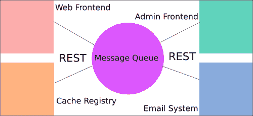

# 第七章：微服务和通信

我们的应用现在开始变得更加真实。在上一章中，我们为它们添加了一些 API 和客户端界面。

在过去几年中，微服务变得非常热门，主要是因为它们减少了非常大或单片应用的开发和支持负担。通过拆分这些单片应用，微服务实现了更加敏捷和并发的开发。它们可以让不同团队在不用太担心冲突、向后兼容性问题或者干扰应用的其他部分的情况下，分别处理应用的不同部分。

在本章中，我们将介绍微服务，并探讨 Go 语言如何在其中发挥作用，以实现它们甚至驱动它们的核心机制。

总结一下，我们将涵盖以下方面：

+   微服务方法介绍

+   利用微服务的利弊

+   理解微服务的核心

+   微服务之间的通信

+   将消息发送到网络

+   从另一个服务中读取

# 微服务方法介绍

如果你还没有遇到过微服务这个术语，或者没有深入探讨过它的含义，我们可以很快地揭开它的神秘面纱。微服务本质上是一个整体应用的独立功能，被拆分并通过一些通用的协议变得可访问。

通常情况下，微服务方法被用来拆分非常庞大的单片应用。

想象一下 2000 年代中期的标准 Web 应用。当需要新功能时，比如给新用户发送电子邮件的功能，它会直接添加到代码库中，并与应用的其他部分集成。

随着应用的增长，必要的测试覆盖范围也在增加。因此，关键错误的潜在可能性也在增加。在这种情况下，一个关键错误不仅会导致该组件（比如电子邮件系统）崩溃，还会导致整个应用崩溃。

这可能是一场噩梦，追踪、修补和重新部署，这正是微服务旨在解决的问题。

如果应用的电子邮件部分被分离到自己的应用中，它就具有了一定程度的隔离和保护，这样找到问题就容易得多。这也意味着整个堆栈不会因为有人在整个应用的一个小部分引入了关键错误而崩溃，如下图所示：



考虑以下基本的示例架构，一个应用被拆分成四个独立的概念，它们在微服务框架中代表着自己的应用。

曾经，每个部分都存在于自己的应用中；现在它们被拆分成更小、更易管理的系统。应用之间的通信通过使用 REST API 端点的消息队列进行。

# 利用微服务的利弊

如果微服务在这一点上看起来像灵丹妙药，我们也应该注意到，这种方法并非没有自己的问题。是否值得进行权衡取决于整体组织方法。

正如前面提到的，稳定性和错误检测对于微服务来说是一个重大的生产级胜利。但如果考虑到应用不会崩溃的另一面，这也可能意味着问题会隐藏得比原本更长时间。整个站点崩溃是很难忽视的，但除非有非常健壮的日志记录，否则可能需要几个小时才能意识到电子邮件没有发送。

但微服务还有其他很大的优势。首先，利用外部标准通信协议（比如 REST）意味着你不会被锁定在单一语言中。

例如，如果你的应用程序的某个部分在 Node 中的编写比在 Go 中更好，你可以这样做，而不必重写整个应用程序。这是开发人员经常会面临的诱惑：重写整个应用程序，因为引入了新的和闪亮的语言应用程序或功能。好吧，微服务可以安全地实现这种行为——它允许开发人员或一组开发人员尝试某些东西，而无需深入到他们希望编写的特定功能之外。

这也带来了一个潜在的负面情景——因为应用程序组件是解耦的，所以围绕它们的机构知识也可以是解耦的。很少有开发人员可能了解足够多以使服务运行良好。团队中的其他成员可能缺乏语言知识，无法介入并修复关键错误。

最后一个，但很重要的考虑是，微服务架构通常意味着默认情况下是分布式环境。这导致我们面临的最大的即时警告是，这种情况几乎总是意味着最终一致性是游戏的名字。

由于每条消息都必须依赖于多个外部服务，因此您需要经历多层延迟才能使更改生效。

# 理解微服务的核心

你可能会想到一件事，当你考虑这个系统来设计协调工作的不和谐服务时：通信平台是什么？为了回答这个问题，我们会说有一个简单的答案和一个更复杂的答案。

简单的答案是 REST。这是一个好消息，因为您很可能对 REST 非常熟悉，或者至少从第五章中了解了一些内容，*RESTful API 的前端集成*。在那里，我们描述了利用 RESTful、无状态协议进行 API 通信的基础，并实现 HTTP 动词作为操作。

这让我们得出了更复杂的答案：在一个大型或复杂的应用程序中，并非所有内容都可以仅仅依靠 REST 来运行。有些事情需要状态，或者至少需要一定程度的持久一致性。

对于后者的问题，大多数微服务架构都以消息队列作为信息共享和传播的平台。消息队列充当一个通道，接收来自一个服务的 REST 请求，并将其保存，直到另一个服务检索请求进行进一步处理。

# 微服务之间的通信

有许多微服务之间进行通信的方法，正如前面提到的；REST 端点为消息提供了一个很好的着陆点。您可能还记得前面的图表，显示消息队列作为服务之间的中央通道。这是处理消息传递的最常见方式之一，我们将使用 RabbitMQ 来演示这一点。

在这种情况下，我们将展示当新用户注册到我们的 RabbitMQ 安装中的电子邮件队列以便传递消息时，这些消息将被电子邮件微服务接收。

### 注意

您可以在这里阅读有关 RabbitMQ 的更多信息，它使用**高级消息队列协议**（**AMQP**）：[`www.rabbitmq.com/`](https://www.rabbitmq.com/)。

要为 Go 安装 AMQP 客户端，我们建议使用 Sean Treadway 的 AMQP 包。您可以使用`go get`命令安装它。您可以在[github.com/streadway/amqp](http://github.com/streadway/amqp)上获取它

# 将消息发送到网络

有很多使用 RabbitMQ 的方法。例如，一种方法允许多个工作者完成相同的工作，作为在可用资源之间分配工作的方法。

毫无疑问，随着系统的增长，很可能会发现对该方法的使用。但在我们的小例子中，我们希望根据特定通道对任务进行分离。当然，这与 Go 的并发通道不相似，所以在阅读这种方法时请记住这一点。

但是要解释这种方法，我们可能有单独的交换机来路由我们的消息。在我们的示例中，我们可能有一个日志队列，其中来自所有服务的消息被聚合到一个单一的日志位置，或者一个缓存过期方法，当它们从数据库中删除时，从内存中删除缓存项。

在这个例子中，我们将实现一个电子邮件队列，可以从任何其他服务接收消息，并使用其内容发送电子邮件。这将使所有电子邮件功能都在核心和支持服务之外。

回想一下，在第五章中，*与 RESTful API 集成的前端*，我们添加了注册和登录方法。我们在这里最感兴趣的是`RegisterPOST()`，在这里我们允许用户注册我们的网站，然后评论我们的帖子。

新注册用户收到电子邮件并不罕见，无论是用于确认身份还是用于简单的欢迎消息。我们将在这里做后者，但添加确认是微不足道的；只是生成一个密钥，通过电子邮件发送，然后在链接被点击后启用用户。

由于我们使用了外部包，我们需要做的第一件事是导入它。

这是我们的做法：

```go
import (
  "bufio"
  "crypto/rand"
  "crypto/sha1"
  "database/sql"
  "encoding/base64"
  "encoding/json"
  "fmt"
  _ "github.com/go-sql-driver/mysql"
  "github.com/gorilla/mux"
  "github.com/gorilla/sessions"
  "github.com/streadway/amqp"
  "html/template"
  "io"
  "log"
  "net/http"
  "regexp"
  "text/template"
  "time"
)
```

请注意，这里我们包含了`text/template`，这并不是严格必要的，因为我们有`html/template`，但我们在这里注意到，以防您希望在单独的进程中使用它。我们还包括了`bufio`，我们将在同一模板处理过程中使用它。

为了发送电子邮件，有一个消息和一个电子邮件的标题将是有帮助的，所以让我们声明这些。在生产环境中，我们可能会有一个单独的语言文件，但在这一点上我们没有其他东西可以展示：

```go
var WelcomeTitle = "You've successfully registered!"
var WelcomeEmail = "Welcome to our CMS, {{Email}}!  We're glad you could join us."
```

这些只是我们在成功注册时需要利用的电子邮件变量。

由于我们正在将消息发送到线上，并将一些应用程序逻辑的责任委托给另一个服务，所以现在我们只需要确保我们的消息已被 RabbitMQ 接收。

接下来，我们需要连接到队列，我们可以通过引用或重新连接每条消息来传递。通常，您会希望将连接保持在队列中很长时间，但在测试时，您可能选择重新连接和关闭每次连接。

为了这样做，我们将把我们的 MQ 主机信息添加到我们的常量中：

```go
const (
  DBHost  = "127.0.0.1"
  DBPort  = ":3306"
  DBUser  = "root"
  DBPass  = ""
  DBDbase = "cms"
  PORT    = ":8080"
  MQHost  = "127.0.0.1"
  MQPort  = ":5672"
)
```

当我们创建一个连接时，我们将使用一种相对熟悉的`TCP Dial()`方法，它返回一个 MQ 连接。这是我们用于连接的函数：

```go
func MQConnect() (*amqp.Connection, *amqp.Channel, error) {
  url := "amqp://" + MQHost + MQPort
  conn, err := amqp.Dial(url)
  if err != nil {
    return nil, nil, err
  }
  channel, err := conn.Channel()
  if err != nil {
    return nil, nil, err
  }
  if _, err := channel.QueueDeclare("", false, true, false, false, nil); err != nil {
    return nil, nil, err
  }
  return conn, channel, nil
}
```

我们可以选择通过引用传递连接，或者将其作为全局连接，并考虑所有适用的注意事项。

### 提示

您可以在[`www.rabbitmq.com/heartbeats.html`](https://www.rabbitmq.com/heartbeats.html)了解更多关于 RabbitMQ 连接和检测中断连接的信息

从技术上讲，任何生产者（在本例中是我们的应用程序）都不会将消息推送到队列，而是将它们推送到交换机。RabbitMQ 允许您使用`rabbitmqctl` `list_exchanges`命令找到交换机（而不是`list_queues`）。在这里，我们使用一个空的交换机，这是完全有效的。队列和交换机之间的区别并不是微不足道的；后者负责定义围绕消息的规则，以便传递到一个或多个队列。

在我们的`RegisterPOST()`中，当成功注册时，让我们发送一个 JSON 编码的消息。我们需要一个非常简单的`struct`来维护我们需要的数据：

```go
type RegistrationData struct {
  Email   string `json:"email"`
  Message string `json:"message"`
}
```

现在，如果且仅如果注册过程成功，我们将创建一个新的`RegistrationData struct`：

```go
  res, err := database.Exec("INSERT INTO users SET user_name=?, user_guid=?, user_email=?, user_password=?", name, guid, email, password)

  if err != nil {
    fmt.Fprintln(w, err.Error)
  } else {
    Email := RegistrationData{Email: email, Message: ""}
    message, err := template.New("email").Parse(WelcomeEmail)
    var mbuf bytes.Buffer
    message.Execute(&mbuf, Email)
    MQPublish(json.Marshal(mbuf.String()))
    http.Redirect(w, r, "/page/"+pageGUID, 301)
  }
```

最后，我们需要实际发送我们的数据的函数`MQPublish()`：

```go
func MQPublish(message []byte) {
  err = channel.Publish(
    "email", // exchange
    "",      // routing key
    false,   // mandatory
    false,   // immediate
    amqp.Publishing{
      ContentType: "text/plain",
      Body:        []byte(message),
    })
}
```

# 从另一个服务中读取

现在我们已经在我们的应用程序中向消息队列发送了一条消息，让我们使用另一个微服务来从队列的另一端取出它。

为了展示微服务设计的灵活性，我们的次要服务将是一个连接到消息队列并监听电子邮件队列消息的 Python 脚本。当它找到一条消息时，它将解析消息并发送电子邮件。可选地，它可以将状态消息发布回队列或记录下来，但目前我们不会走这条路：

```go
import pika
import json
import smtplib
from email.mime.text import MIMEText

connection = pika.BlockingConnection(pika.ConnectionParameters( host='localhost'))
channel = connection.channel()
channel.queue_declare(queue='email')

print ' [*] Waiting for messages. To exit press CTRL+C'

def callback(ch, method, properties, body):
    print " [x] Received %r" % (body,)
    parsed = json.loads(body)
    msg = MIMEText()
    msg['From'] = 'Me'
    msg['To'] = parsed['email']
    msg['Subject'] = parsed['message']
    s = smtplib.SMTP('localhost')
    s.sendmail('Me', parsed['email'], msg.as_string())
    s.quit()

channel.basic_consume(callback,
                      queue='email',
                      no_ack=True)

channel.start_consuming()
```

# 总结

在本章中，我们试图通过利用微服务来将应用程序分解为不同的责任领域。在这个例子中，我们将我们应用程序的电子邮件方面委托给了另一个用 Python 编写的服务。

我们这样做是为了利用微服务或互连的较小应用作为可调用的网络化功能的概念。这种理念最近驱动着网络的很大一部分，并具有无数的好处和缺点。

通过这样做，我们实现了一个消息队列，它作为我们通信系统的支柱，允许每个组件以可靠和可重复的方式与其他组件交流。在这种情况下，我们使用了一个 Python 应用程序来读取消息，这些消息是从我们的 Go 应用程序通过 RabbitMQ 发送的，并且处理了那些电子邮件数据。

在第八章*日志和测试*中，我们将专注于日志记录和测试，这可以用来扩展微服务的概念，以便我们可以从错误中恢复，并了解在过程中可能出现问题的地方。
