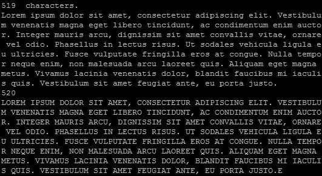
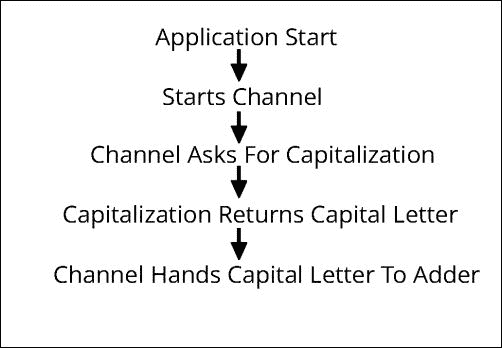

# 第一章。Go 中并发的介绍

虽然 Go 既是一个很好的通用语言，也是一个低级系统语言，但它的主要优势之一是内置的并发模型和工具。许多其他语言都有第三方库（或扩展），但固有的并发性是现代语言独有的，也是 Go 设计的核心特性。

尽管毫无疑问，Go 在并发方面表现出色——正如我们将在本书中看到的那样——但它具有许多其他语言所缺乏的一套强大的工具来测试和构建并发、并行和分布式代码。

足够谈论 Go 的奇妙并发特性和工具了，让我们开始吧。

# 介绍 goroutines

处理并发的主要方法是通过 goroutine。诚然，我们的第一段并发代码（在前言中提到）并没有做太多事情，只是简单地输出交替的“hello”和“world”，直到整个任务完成。

以下是该代码：

```go
package main

import (
  "fmt"
  "time"
)

type Job struct {
  i int
  max int
  text string
}

func outputText(j *Job) {
  for j.i < j.max {
    time.Sleep(1 * time.Millisecond)
    fmt.Println(j.text)
    j.i++
  }
}

func main() {
  hello := new(Job)
  world := new(Job)

  hello.text = "hello"
  hello.i = 0
  hello.max = 3

  world.text = "world"
  world.i = 0
  world.max = 5

  go outputText(hello)
  outputText(world)

}
```

### 提示

**下载示例代码**

您可以从您在[`www. packtpub.com`](http://www.%20packtpub.com)的帐户中购买的所有 Packt 图书的示例代码文件。如果您在其他地方购买了这本书，您可以访问[`www.packtpub.com/support`](http://www.packtpub.com/support)并注册，以便将文件直接发送到您的邮箱。

但是，如果你回想一下我们为祖母筹划惊喜派对的现实例子，这正是事情通常必须用有限或有限的资源来管理的方式。这种异步行为对于某些应用程序的平稳运行至关重要，尽管我们的例子基本上是在真空中运行的。

您可能已经注意到我们早期例子中的一个怪癖：尽管我们首先在`hello`结构上调用了`outputText()`函数，但我们的输出始于`world`结构的文本值。为什么呢？

作为异步的，当调用 goroutine 时，它会等待阻塞代码完成后再开始并发。您可以通过在下面的代码中用 goroutine 替换`world`结构上的`outputText()`函数调用来测试这一点：

```go
  go outputText(hello)
  go outputText(world)
```

如果你运行这个，你将得不到任何输出，因为主函数结束了，而异步 goroutines 正在运行。有几种方法可以阻止这种情况，在主函数执行完毕并退出程序之前看到输出。经典的方法只是在执行之前要求用户输入，允许您直接控制应用程序何时结束。您还可以在主函数的末尾放置一个无限循环，如下所示：

```go
for {}
```

更好的是，Go 还有一个内置的机制，即`sync`包中的`WaitGroup`类型。

如果您在代码中添加一个`WaitGroup`结构，它可以延迟主函数的执行，直到所有 goroutines 完成。简单来说，它允许您设置所需的迭代次数，以便在允许应用程序继续之前从 goroutines 获得完成的响应。让我们在下一节中看一下对我们“Hello World”应用程序的微小修改。

## 一个耐心的 goroutine

从这里开始，我们将实现一个`WaitGroup`结构，以确保我们的 goroutines 在继续应用程序之前完全运行。在这种情况下，当我们说“patient”时，这与我们在先前的例子中看到的 goroutines 在父方法之外运行的方式形成对比。在下面的代码中，我们将实现我们的第一个`Waitgroup`结构：

```go
package main

import (
  "fmt"
  "sync"
  "time"
)

type Job struct {
  i int
  max int
  text string
}

func outputText(j *Job, goGroup *sync.WaitGroup) {
  for j.i < j.max {
    time.Sleep(1 * time.Millisecond)
    fmt.Println(j.text)
    j.i++
  }
  goGroup.Done()
}

func main() {

  goGroup := new(sync.WaitGroup)
  fmt.Println("Starting")

  hello := new(Job)
  hello.text = "hello"
  hello.i = 0
  hello.max = 2

  world := new(Job)
  world.text = "world"
  world.i = 0
  world.max = 2

  go outputText(hello, goGroup)
  go outputText(world, goGroup)

  goGroup.Add(2)
  goGroup.Wait()

}
```

让我们来看看以下代码的变化：

```go
  goGroup := new(sync.WaitGroup)
```

在这里，我们声明了一个名为`goGroup`的`WaitGroup`结构。这个变量将接收我们的 goroutine 函数在允许程序退出之前完成*x*次的通知。以下是在`WaitGroup`中发送这种期望的一个例子：

```go
  goGroup.Add(2)
```

`Add()`方法指定了`goGroup`在满足等待之前应该接收多少个`Done`消息。在这里，我们指定了`2`，因为我们有两个异步运行的函数。如果你有三个 goroutine 成员，但仍然调用了两个，你可能会看到第三个的输出。如果你向`goGroup`添加了一个大于两的值，例如`goGroup.Add(3)`，那么`WaitGroup`将永远等待并发死锁。

考虑到这一点，你不应该手动设置需要等待的 goroutines 的数量；最好是在范围内进行计算或明确处理。这就是我们告诉`WaitGroup`等待的方式：

```go
  goGroup.Wait()
```

现在，我们等待。这段代码会因为和`goGroup.Add(3)`一样的原因而失败；`goGroup`结构体从未接收到我们的 goroutines 完成的消息。所以，让我们按照下面的代码片段来做：

```go
func outputText(j *Job, goGroup *sync.WaitGroup) {
  for j.i < j.max {
    time.Sleep(1 * time.Millisecond)
    fmt.Println(j.text)
    j.i++
  }
  goGroup.Done()
}
```

我们只对前言中的`outputText()`函数进行了两处更改。首先，我们在第二个函数参数中添加了一个指向我们的`goGroup`的指针。然后，在所有迭代完成后，我们告诉`goGroup`它们都完成了。

# 实现 defer 控制机制

在这里，我们应该花点时间来谈谈 defer。Go 有一个优雅的 defer 控制机制的实现。如果你在其他语言中使用了 defer（或者类似功能），这会看起来很熟悉——这是一种有用的方式，可以延迟执行语句，直到函数的其余部分完成。

在大多数情况下，这只是一种语法糖，允许你将相关操作放在一起，即使它们不会一起执行。如果你曾经写过类似以下伪代码的东西，你会知道我的意思：

```go
x = file.open('test.txt')
int longFunction() {
…
}
x.close();
```

你可能知道由于代码之间的大“距离”而导致的痛苦。在 Go 中，你实际上可以编写类似以下的代码：

```go
package main

import(
"os"
)

func main() {

  file, _ := os.Create("/defer.txt")

  defer file.Close()

  for {

    break

  }

}
```

这并没有任何实际的功能优势，除了使代码更清晰、更易读，但这本身就是一个很大的优点。延迟调用是按照它们定义的顺序的相反顺序执行的，或者说是后进先出。你还应该注意，任何通过引用传递的数据可能处于意外的状态。

例如，参考以下代码片段：

```go
func main() {

  aValue := new(int)

  defer fmt.Println(*aValue)

  for i := 0; i < 100; i++ {
    *aValue++
  }

}
```

这将返回`0`，而不是`100`，因为这是整数的默认值。

### 注意

*Defer*不同于其他语言中的*deferred*（或者 future/promises）。我们将在第二章中讨论 Go 的实现和 future 和 promise 的替代方案，*理解并发模型*。

## 使用 Go 的调度程序

在其他语言中，许多并发和并行应用程序的软线程和硬线程的管理是在操作系统级别处理的。这被认为是固有的低效和昂贵，因为操作系统负责上下文切换，处理多个进程。当应用程序或进程可以管理自己的线程和调度时，它会导致更快的运行时间。授予我们应用程序和 Go 调度程序的线程具有较少的操作系统属性，需要考虑上下文切换，从而减少了开销。

如果你仔细想想，这是不言自明的——你需要处理的东西越多，管理所有的球就越慢。Go 通过使用自己的调度程序消除了这种机制的自然低效性。

这实际上只有一个怪癖，你会很早就学到：如果你从不让出主线程，你的 goroutines 会以意想不到的方式执行（或者根本不执行）。

另一种看待这个问题的方式是，goroutine 必须在并发有效并开始之前被阻塞。让我们修改我们的示例，并包括一些文件 I/O 记录来演示这个怪癖，如下面的代码所示：

```go
package main

import (
  "fmt"
  "time"
  "io/ioutil"
)

type Job struct {
  i int
  max int
  text string
}

func outputText(j *Job) {
  fileName := j.text + ".txt"
  fileContents := ""
  for j.i < j.max {
    time.Sleep(1 * time.Millisecond)
    fileContents += j.text
    fmt.Println(j.text)
    j.i++
  }
  err := ioutil.WriteFile(fileName, []byte(fileContents), 0644)
  if (err != nil) {
    panic("Something went awry")
  }

}

func main() {

  hello := new(Job)
  hello.text = "hello"
  hello.i = 0
  hello.max = 3

  world := new(Job)
  world.text = "world"
  world.i = 0
  world.max = 5

  go outputText(hello)
  go outputText(world)

}
```

从理论上讲，改变的只是我们现在使用文件操作将每个操作记录到不同的文件中（在这种情况下是`hello.txt`和`world.txt`）。然而，如果你运行这个程序，不会创建任何文件。

在我们的最后一个例子中，我们使用了`sync.WaitSync`结构来强制主线程延迟执行，直到异步任务完成。虽然这样可以工作（而且优雅），但它并没有真正解释*为什么*我们的异步任务失败。如前所述，您还可以利用阻塞代码来防止主线程在其异步任务完成之前完成。

由于 Go 调度器管理上下文切换，每个 goroutine 必须将控制权让回主线程，以安排所有这些异步任务。有两种方法可以手动完成这个过程。一种方法，也可能是理想的方法，是`WaitGroup`结构。另一种是 runtime 包中的`GoSched()`函数。

`GoSched()`函数暂时让出处理器，然后返回到当前的 goroutine。考虑以下代码作为一个例子：

```go
package main

import(
  "runtime"
  "fmt"
)

func showNumber(num int) {
  fmt.Println(num)
}

func main() {
  iterations := 10

  for i := 0; i<=iterations; i++ {

    go showNumber(i)

  }
  //runtime.Gosched()
  fmt.Println("Goodbye!")

}
```

在`runtime.Gosched()`被注释掉并且在`"runtime"`之前的下划线被移除的情况下运行这段代码，你将只会看到`Goodbye!`。这是因为在`main()`函数结束之前，没有保证有多少 goroutines 会完成。

正如我们之前学到的，您可以在结束应用程序的执行之前显式等待有限数量的 goroutines。但是，`Gosched()`允许（在大多数情况下）具有相同的基本功能。删除`runtime.Gosched()`之前的注释，您应该在`Goodbye!`之前打印出 0 到 10。

只是为了好玩，尝试在多核服务器上运行此代码，并使用`runtime.GOMAXPROCS()`修改您的最大处理器，如下所示：

```go
func main() {

  runtime.GOMAXPROCS(2)
```

此外，将您的`runtime.Gosched()`推到绝对末尾，以便所有 goroutines 在`main`结束之前有机会运行。

得到了一些意外的东西？这并不意外！您可能会得到完全混乱的 goroutines 执行，如下面的截图所示：


虽然没有必要完全演示如何在多个核心上处理 goroutines 可能会很棘手，但这是展示为什么在它们之间进行通信（和 Go 调度器）很重要的最简单的方法之一。

您可以使用`GOMAXPROCS > 1`来调试这个，并在您的 goroutine 调用周围加上时间戳显示，如下所示：

```go
  tstamp := strconv.FormatInt(time.Now().UnixNano(), 10)
  fmt.Println(num, tstamp)
```

### 注意

记得在这里导入`time`和`strconv`父包。

这也是一个很好的地方来看并发并将其与并行执行进行比较。首先，在`showNumber()`函数中添加一秒的延迟，如下面的代码片段所示：

```go
func showNumber(num int) {
  tstamp := strconv.FormatInt(time.Now().UnixNano(), 10)
  fmt.Println(num,tstamp)
  time.Sleep(time.Millisecond * 10)
}
```

然后，在`showNumber()`函数之前删除 goroutine 调用，并使用`GOMAXPROCS(0)`，如下面的代码片段所示：

```go
  runtime.GOMAXPROCS(0)
  iterations := 10

  for i := 0; i<=iterations; i++ {
    showNumber(i)
  }
```

正如预期的那样，您会得到 0-10 之间的数字，它们之间有 10 毫秒的延迟，然后输出`Goodbye!`。这是直接的串行计算。

接下来，让我们将`GOMAXPROCS`保持为零以使用单个线程，但是恢复 goroutine 如下：

```go
go showNumber(i)
```

这与之前的过程相同，只是一切都会在相同的时间范围内执行，展示了执行的并发性质。现在，继续将您的`GOMAXPROCS`更改为两个并再次运行。如前所述，只有一个（或可能两个）时间戳，但顺序已经改变，因为一切都在同时运行。

Goroutines 不一定是基于线程的，但它们感觉像是。当 Go 代码被编译时，goroutines 会在可用的线程上进行多路复用。这正是为什么 Go 的调度器需要知道什么正在运行，什么需要在应用程序生命周期结束之前完成等等的原因。如果代码有两个线程可用，那就会使用两个线程。

## 使用系统变量

那么如果您想知道您的代码有多少个线程可用呢？

Go 有一个从 runtime 包函数`GOMAXPROCS`返回的环境变量。要找出可用的内容，您可以编写一个类似以下代码的快速应用程序：

```go
package main

import (
  "fmt"
  "runtime"
)

func listThreads() int {

  threads := runtime.GOMAXPROCS(0)
  return threads
}

func main() {
  runtime.GOMAXPROCS(2)
  fmt.Printf("%d thread(s) available to Go.", listThreads())

}
```

在这个上进行简单的 Go 构建将产生以下输出：

```go
2 thread(s) available to Go.

```

传递给`GOMAXPROCS`的`0`参数（或没有参数）意味着没有进行更改。你可以在那里放入另一个数字，但正如你所想象的那样，它只会返回 Go 实际可用的内容。你不能超过可用的核心，但你可以限制你的应用程序使用少于可用的核心。

`GOMAXPROCS()`调用本身返回一个整数，表示*之前*可用的处理器数量。在这种情况下，我们首先将其设置为两，然后设置为零（没有更改），返回两。

值得注意的是，增加`GOMAXPROCS`有时可能会*降低*应用程序的性能。

在更大的应用程序和操作系统中存在上下文切换的惩罚，增加使用的线程数量意味着 goroutines 可以在多个线程之间共享，并且 goroutines 的轻量级优势可能会被牺牲。

如果你有一个多核系统，你可以很容易地使用 Go 的内部基准测试功能来测试这一点。我们将在第五章*锁、阻塞和更好的通道*和第七章*性能和可伸缩性*中更仔细地研究这个功能。

runtime 包还有一些其他非常有用的环境变量返回函数，比如`NumCPU`、`NumGoroutine`、`CPUProfile`和`BlockProfile`。这些不仅方便调试，也有助于了解如何最好地利用资源。这个包还与 reflect 包很好地配合，reflect 包处理元编程和程序自我分析。我们将在第九章*Go 中的日志记录和测试并发*和第十章*高级并发和最佳实践*中更详细地讨论这一点。

# 理解 goroutines 与 coroutines

在这一点上，你可能会想，“啊，goroutines，我知道这些就是 coroutines。”嗯，是和不是。

coroutine 是一种协作式任务控制机制，但从其最简单的意义上讲，coroutine 并不是并发的。虽然 coroutines 和 goroutines 的使用方式类似，但 Go 对并发的关注提供了远不止状态控制和产出。在我们迄今为止看到的例子中，我们有可以称之为*愚蠢*的 goroutines。虽然它们在同一时间和地址空间中运行，但两者之间没有真正的通信。如果你看看其他语言中的 coroutines，你可能会发现它们通常并不一定是并发的或异步的，而是基于步骤的。它们会向`main()`和彼此产出，但两个 coroutine 之间可能并不一定会进行通信，而是依赖于一个集中的、明确编写的数据管理系统。

### 注意

**原始 coroutine**

coroutines 最初是由 Melvin Conway 为 COBOL 描述的。在他的论文《可分离转换图编译器的设计》中，他建议 coroutine 的目的是将程序分解为子任务，并允许它们独立运行，仅共享少量数据。

Goroutines 有时可能会违反 Conway 的 coroutines 的基本原则。例如，Conway 建议只应该有一个单向的执行路径；换句话说，A 后面是 B，然后是 C，然后是 D，依此类推，其中每个代表 coroutine 中的一个应用程序块。我们知道 goroutines 可以并行运行，并且可以以看似任意的顺序执行（至少没有方向）。到目前为止，我们的 goroutines 也没有共享任何信息；它们只是以共享的模式执行。

# 实现通道

到目前为止，我们已经涉足了能够做很多事情但不能有效地相互通信的并发进程。换句话说，如果你有两个进程占用相同的处理时间并共享相同的内存和数据，你必须知道哪个进程在哪个位置作为更大任务的一部分。

例如，一个应用程序必须循环遍历 Lorem Ipsum 的一个段落，并将每个字母大写，然后将结果写入文件。当然，我们实际上不需要一个并发应用程序来做这个事情（事实上，几乎任何处理字符串的语言都具有这个固有功能），但这是一个快速演示孤立 goroutine 潜在限制的方法。不久，我们将把这个原始示例转化为更实用的东西，但现在，这是我们大写示例的开始：

```go
package main

import (
  "fmt"
  "runtime"
  "strings"
)
var loremIpsum string
var finalIpsum string
var letterSentChan chan string

func deliverToFinal(letter string, finalIpsum *string) {
  *finalIpsum += letter
}

func capitalize(current *int, length int, letters []byte, 
  finalIpsum *string) {
  for *current < length {
    thisLetter := strings.ToUpper(string(letters[*current]))

    deliverToFinal(thisLetter, finalIpsum)
    *current++
  }
}

func main() {

  runtime.GOMAXPROCS(2)

  index := new(int)
  *index = 0
  loremIpsum = "Lorem ipsum dolor sit amet, consectetur adipiscing 
  elit. Vestibulum venenatis magna eget libero tincidunt, ac 
  condimentum enim auctor. Integer mauris arcu, dignissim sit amet 
  convallis vitae, ornare vel odio. Phasellus in lectus risus. Ut 
  sodales vehicula ligula eu ultricies. Fusce vulputate fringilla 
  eros at congue. Nulla tempor neque enim, non malesuada arcu 
  laoreet quis. Aliquam eget magna metus. Vivamus lacinia 
  venenatis dolor, blandit faucibus mi iaculis quis. Vestibulum 
  sit amet feugiat ante, eu porta justo."

  letters := []byte(loremIpsum)
  length := len(letters)

  go capitalize(index, length, letters, &finalIpsum)
  go func() {
    go capitalize(index, length, letters, &finalIpsum)
  }()

  fmt.Println(length, " characters.")
  fmt.Println(loremIpsum)
  fmt.Println(*index)
  fmt.Println(finalIpsum)

}
```

如果我们在这里以某种程度的并行性运行，但我们的 goroutine 之间没有通信，我们最终会得到一团糟的文本，如下面的截图所示：



由于 Go 中并发调度的不可预测性，可能需要多次迭代才能获得这个确切的输出。事实上，你可能永远也得不到确切的输出。

显然这样行不通。那么我们应该如何最好地构建这个应用程序呢？这里缺少的是同步，但我们也可以用更好的设计模式。

这是另一种将这个问题分解成片段的方法。与其让两个进程并行处理相同的事情，这充满了风险，不如让一个进程从`loremIpsum`字符串中取一个字母并将其大写，然后将其传递给另一个进程将其添加到我们的`finalIpsum`字符串中。

你可以把这想象成两个人坐在两张桌子前，每个人手上都有一叠信件。A 负责拿一封信并将其大写。然后他把信传给 B，然后 B 把它添加到`finalIpsum`堆栈中。为了做到这一点，我们将在我们的代码中实现一个通道，这个应用程序的任务是接收文本（在这种情况下是亚伯拉罕·林肯的葛底斯堡演说的第一行）并将每个字母大写。

## 基于通道的字母大写工厂排序

让我们以最后一个例子为例，通过尝试大写亚伯拉罕·林肯的葛底斯堡演说序言，来做一些（略微）更有意义的事情，同时减轻 Go 中并发的不可预测影响，如下面的代码所示：

```go
package main

import(
  "fmt"
  "sync"
  "runtime"
  "strings"
)

var initialString string
var finalString string

var stringLength int

func addToFinalStack(letterChannel chan string, wg 
  *sync.WaitGroup) {
  letter := <-letterChannel
  finalString += letter
  wg.Done()
}

func capitalize(letterChannel chan string, currentLetter string, 
  wg *sync.WaitGroup) {

  thisLetter := strings.ToUpper(currentLetter)
  wg.Done()
  letterChannel <- thisLetter  
}

func main() {

  runtime.GOMAXPROCS(2)
  var wg sync.WaitGroup

  initialString = "Four score and seven years ago our fathers 
  brought forth on this continent, a new nation, conceived in 
  Liberty, and dedicated to the proposition that all men are 
  created equal."
  initialBytes := []byte(initialString)

  var letterChannel chan string = make(chan string)

  stringLength = len(initialBytes)

  for i := 0; i < stringLength; i++ {
    wg.Add(2)

    go capitalize(letterChannel, string(initialBytes[i]), &wg)
    go addToFinalStack(letterChannel, &wg)

    wg.Wait()
  }

  fmt.Println(finalString)

}
```

你会注意到，我们甚至将这提升到了一个双核处理过程，并得到了以下输出：

```go
go run alpha-channel.go
FOUR SCORE AND SEVEN YEARS AGO OUR FATHERS BROUGHT FORTH ON THIS 
 CONTINENT, A NEW NATION, CONCEIVED IN LIBERTY, AND DEDICATED TO THE 
 PROPOSITION THAT ALL MEN ARE CREATED EQUAL.

```

输出正如我们所预期的那样。值得重申的是，这个例子是极端的过度，但我们很快将把这个功能转化为一个可用的实际应用程序。

所以这里发生了什么？首先，我们重新实现了`sync.WaitGroup`结构，以允许我们所有的并发代码在保持主线程活动的同时执行，如下面的代码片段所示：

```go
var wg sync.WaitGroup
...
for i := 0; i < stringLength; i++ {
  wg.Add(2)

  go capitalize(letterChannel, string(initialBytes[i]), &wg)
  go addToFinalStack(letterChannel, &wg)

  wg.Wait()
}
```

我们允许每个 goroutine 告诉`WaitGroup`结构我们已经完成了这一步。由于我们有两个 goroutine，我们将两个`Add()`方法排入`WaitGroup`结构的队列。每个 goroutine 负责宣布自己已经完成。

接下来，我们创建了我们的第一个通道。我们用以下代码行实例化一个通道：

```go
  var letterChannel chan string = make(chan string)
```

这告诉 Go 我们有一个通道，将向各种程序/ goroutine 发送和接收字符串。这本质上是所有 goroutine 的管理者。它还负责向 goroutine 发送和接收数据，并管理执行顺序。正如我们之前提到的，通道具有在内部上下文切换和无需依赖多线程的能力，使它们能够快速运行。

这个功能有内置的限制。如果你设计非并发或阻塞的代码，你将有效地从 goroutine 中移除并发。我们很快会更多地讨论这个问题。

我们通过`letterChannel`运行两个单独的 goroutine：`capitalize()`和`addToFinalStack()`。第一个简单地从构建的字节数组中获取一个字节并将其大写。然后，它将字节返回到通道，如下一行代码所示：

```go
letterChannel <- thisLetter
```

所有通过通道的通信都是以这种方式进行的。`<-`符号在语法上告诉我们数据将被发送回通道。从来不需要对这些数据做任何处理，但最重要的是要知道通道可以阻塞，至少在每个线程中，直到它接收到数据。您可以通过创建一个通道，然后对其不做任何有价值的事情来测试这一点，如下面的代码片段所示：

```go
package main

func doNothing()(string) {

  return "nothing"
}

func main() {

  var channel chan string = make(chan string)
  channel <- doNothing()

}
```

由于没有沿着通道发送任何东西，也没有实例化 goroutine，这导致了死锁。您可以通过创建一个 goroutine 并将通道带入全局空间来轻松解决这个问题，方法是在`main()`之外创建它。

### 注意

为了清晰起见，我们的示例在这里使用了局部范围的通道。尽可能保持这些全局范围，可以消除很多不必要的东西，特别是如果您有很多 goroutine，因为通道的引用可能会使您的代码变得混乱。

对于我们的整个示例，您可以将其视为下图所示：



## 清理我们的 goroutine

您可能想知道为什么在使用通道时需要`WaitGroup`结构。毕竟，我们不是说过通道会被阻塞，直到它接收到数据吗？这是真的，但它需要另一段语法。

空或未初始化的通道将始终被阻塞。我们将在第七章*性能和可伸缩性*和第十章*高级并发和最佳实践*中讨论这种情况的潜在用途和陷阱。

您可以通过在`make`命令的第二个选项中指定通道缓冲区来决定通道如何阻塞应用程序。

### 缓冲或非缓冲通道

默认情况下，通道是非缓冲的，这意味着如果有一个准备接收的通道，它们将接受任何发送到它们的东西。这也意味着每个通道调用都会阻塞应用程序的执行。通过提供一个缓冲区，只有在发送了许多返回时，通道才会阻塞应用程序。

缓冲通道是同步的。为了保证异步性能，您需要通过提供缓冲区长度来进行实验。我们将在下一章中探讨确保我们的执行符合预期的方法。

### 注意

Go 的通道系统是基于**通信顺序进程**（**CSP**）的，这是一种设计并发模式和多处理的正式语言。当人们描述 goroutine 和通道时，您可能会单独遇到 CSP。

## 使用 select 语句

```go
switch, familiar to Go users and common among other languages:
```

```go
switch {

  case 'x':

  case 'y':

}
```

```go
select statement:
```

```go
select {

  case <- channelA:

  case <- channelB:

}
```

在`switch`语句中，右侧表达式表示一个值；在`select`中，它表示对通道的接收操作。`select`语句将阻塞应用程序，直到有一些信息通过通道发送。如果从未发送任何内容，应用程序将死锁，并且您将收到相应的错误。

如果两个接收操作同时发送（或者满足两个情况），Go 将以不可预测的方式对它们进行评估。

那么，这有什么用呢？让我们看一下字母大写应用程序的主函数的修改版本：

```go
package main

import(
  "fmt"  
  "strings"
)

var initialString string
var initialBytes []byte
var stringLength int
var finalString string
var lettersProcessed int
var applicationStatus bool
var wg sync.WaitGroup

func getLetters(gQ chan string) {

  for i := range initialBytes {
    gQ <- string(initialBytes[i])  

  }

}

func capitalizeLetters(gQ chan string, sQ chan string) {

  for {
    if lettersProcessed >= stringLength {
      applicationStatus = false
      break
    }
    select {
      case letter := <- gQ:
        capitalLetter := strings.ToUpper(letter)
        finalString += capitalLetter
        lettersProcessed++
    }
  }
}

func main() {

  applicationStatus = true;

  getQueue := make(chan string)
  stackQueue := make(chan string)

  initialString = "Four score and seven years ago our fathers brought forth on this continent, a new nation, conceived in Liberty, and dedicated to the proposition that all men are created equal."
  initialBytes = []byte(initialString)
  stringLength = len(initialString)
  lettersProcessed = 0

  fmt.Println("Let's start capitalizing")

  go getLetters(getQueue)
  capitalizeLetters(getQueue,stackQueue)

  close(getQueue)
  close(stackQueue)

  for {

    if applicationStatus == false {
      fmt.Println("Done")
      fmt.Println(finalString)
      break
    }

  }
}
```

这里的主要区别是我们现在有一个通道，它在两个并发运行的函数`getLetters`和`capitalizeLetters`之间监听数据。在底部，您将看到一个`for{}`循环，它会一直保持主动状态，直到`applicationStatus`变量设置为`false`。在下面的代码中，我们将每个字节作为字符串通过 Go 通道传递：

```go
func getLetters(gQ chan string) {

  for i := range initialBytes {
    gQ <- string(initialBytes[i])  

  }

}
```

`getLetters`函数是我们的主要 goroutine，它从构建自 Lincoln's 行的字节数组中获取单个字母。当函数迭代每个字节时，它通过`getQueue`通道发送该字母。

在接收端，我们有`capitalizeLetters`，它接收每个字母并将其大写，然后附加到我们的`finalString`变量上。让我们来看一下这个：

```go
func capitalizeLetters(gQ chan string, sQ chan string) {

  for {
    if lettersProcessed >= stringLength {
      applicationStatus = false
      break
    }
    select {
      case letter := <- gQ:
        capitalLetter := strings.ToUpper(letter)
        finalString += capitalLetter
        lettersProcessed++
    }
  }
}
```

关闭所有通道是至关重要的，否则我们的应用程序将陷入死锁。如果我们在这里永远不打破`for`循环，我们的通道将一直等待从并发进程接收，并且程序将陷入死锁。我们手动检查是否已将所有字母大写，然后才打破循环。

# 闭包和 goroutines

您可能已经注意到 Lorem Ipsum 中的匿名 goroutine：

```go
  go func() {
    go capitalize(index, length, letters, &finalIpsum)
  }()
```

虽然这并不总是理想的，但有很多地方内联函数最适合创建 goroutine。

描述这个最简单的方法是说一个函数不够大或重要，不值得拥有一个命名函数，但事实上，这更多的是关于可读性。如果您在其他语言中使用过 lambda 表达式，这可能不需要太多解释，但请尽量将这些保留给快速的内联函数。

在早期的示例中，闭包主要作为调用`select`语句的包装器或创建匿名 goroutines 来提供`select`语句。

由于函数在 Go 中是一等公民，因此不仅可以直接在代码中使用内联或匿名函数，还可以将它们传递给其他函数并从其他函数返回。

以下是一个示例，它将函数的结果作为返回值传递，使返回的函数之外的状态坚定。在这种情况下，我们将一个函数作为变量返回，并在返回的函数上迭代初始值。初始参数将接受一个字符串，每次调用返回的函数时都会根据单词长度进行修剪。

```go
import(
  "fmt"
  "strings"
)

func shortenString(message string) func() string {

  return func() string {
    messageSlice := strings.Split(message," ")
    wordLength := len(messageSlice)
    if wordLength < 1 {
      return "Nothingn Left!"
    }else {
      messageSlice = messageSlice[:(wordLength-1)]
      message = strings.Join(messageSlice, " ")
      return message
    }
  }
}

func main() {

  myString := shortenString("Welcome to concurrency in Go! ...")

  fmt.Println(myString())
  fmt.Println(myString())  
  fmt.Println(myString())  
  fmt.Println(myString())  
  fmt.Println(myString())  
  fmt.Println(myString())
}
```

一旦初始化并返回，我们设置消息变量，并且返回方法的每次运行都会迭代该值。这种功能允许我们避免在返回值上多次运行函数或不必要地循环，而可以使用闭包来处理这个问题，如上所示。

# 使用 goroutines 和通道构建网络爬虫

让我们拿这个几乎没什么用的大写应用程序，做一些实际的事情。在这里，我们的目标是构建一个基本的爬虫。这样做，我们将完成以下任务：

+   读取五个 URL

+   读取这些 URL 并将内容保存到字符串中

+   当所有 URL 都被扫描和读取时，将该字符串写入文件

这些类型的应用程序每天都在编写，并且它们是最能从并发和非阻塞代码中受益的应用程序之一。

可能不用说，但这并不是一个特别优雅的网络爬虫。首先，它只知道一些起始点——我们提供的五个 URL。此外，它既不是递归的，也不是线程安全的，就数据完整性而言。

也就是说，以下代码有效，并演示了我们如何使用通道和`select`语句：

```go
package main

import(
  "fmt"
  "io/ioutil"
  "net/http"
  "time"
)

var applicationStatus bool
var urls []string
var urlsProcessed int
var foundUrls []string
var fullText string
var totalURLCount int
var wg sync.WaitGroup

var v1 int
```

首先，我们有我们最基本的全局变量，我们将用它们来表示应用程序状态。`applicationStatus`变量告诉我们我们的爬虫进程已经开始，`urls`是我们的简单字符串 URL 的切片。其余的是成语数据存储变量和/或应用程序流程机制。以下代码片段是我们读取 URL 并将它们传递到通道的函数：

```go
func readURLs(statusChannel chan int, textChannel chan string) {

  time.Sleep(time.Millisecond * 1)
  fmt.Println("Grabbing", len(urls), "urls")
  for i := 0; i < totalURLCount; i++ {

    fmt.Println("Url", i, urls[i])
    resp, _ := http.Get(urls[i])
    text, err := ioutil.ReadAll(resp.Body)

    textChannel <- string(text)

    if err != nil {
      fmt.Println("No HTML body")
    }

    statusChannel <- 0

  }

}
```

`readURLs`函数假定`statusChannel`和`textChannel`用于通信，并循环遍历`urls`变量切片，在`textChannel`上返回文本，并在`statusChannel`上返回一个简单的 ping。接下来，让我们看一下将抓取的文本附加到完整文本的函数：

```go
func addToScrapedText(textChannel chan string, processChannel chan bool) {

  for {
    select {
    case pC := <-processChannel:
      if pC == true {
        // hang on
      }
      if pC == false {

        close(textChannel)
        close(processChannel)
      }
    case tC := <-textChannel:
      fullText += tC

    }

  }

}
```

我们使用`addToScrapedText`函数来累积处理过的文本并将其添加到主文本字符串中。当我们在`processChannel`上收到关闭信号时，我们也关闭了我们的两个主要通道。让我们看一下`evaluateStatus()`函数：

```go
func evaluateStatus(statusChannel chan int, textChannel chan string, processChannel chan bool) {

  for {
    select {
    case status := <-statusChannel:

      fmt.Print(urlsProcessed, totalURLCount)
      urlsProcessed++
      if status == 0 {

        fmt.Println("Got url")

      }
      if status == 1 {

        close(statusChannel)
      }
      if urlsProcessed == totalURLCount {
        fmt.Println("Read all top-level URLs")
        processChannel <- false
        applicationStatus = false

      }
    }

  }
}
```

在这个时刻，`evaluateStatus`函数所做的就是确定应用程序的整体范围内发生了什么。当我们通过这个通道发送一个`0`（我们前面提到的 ping）时，我们会增加我们的`urlsProcessed`变量。当我们发送一个`1`时，这是一个消息，我们可以关闭通道。最后，让我们看一下`main`函数：

```go
func main() {
  applicationStatus = true
  statusChannel := make(chan int)
  textChannel := make(chan string)
  processChannel := make(chan bool)
  totalURLCount = 0

  urls = append(urls, "http://www.mastergoco.com/index1.html")
  urls = append(urls, "http://www.mastergoco.com/index2.html")
  urls = append(urls, "http://www.mastergoco.com/index3.html")
  urls = append(urls, "http://www.mastergoco.com/index4.html")
  urls = append(urls, "http://www.mastergoco.com/index5.html")

  fmt.Println("Starting spider")

  urlsProcessed = 0
  totalURLCount = len(urls)

  go evaluateStatus(statusChannel, textChannel, processChannel)

  go readURLs(statusChannel, textChannel)

  go addToScrapedText(textChannel, processChannel)

  for {
    if applicationStatus == false {
      fmt.Println(fullText)
      fmt.Println("Done!")
      break
    }
    select {
    case sC := <-statusChannel:
      fmt.Println("Message on StatusChannel", sC)

    }
  }

}
```

这是我们上一个函数的基本推断，即大写函数。然而，这里的每个部分都负责读取 URL 或将其相应内容附加到较大的变量中。

在下面的代码中，我们创建了一种主循环，让您知道在`statusChannel`上何时抓取了一个 URL：

```go
  for {
    if applicationStatus == false {
      fmt.Println(fullText)
      fmt.Println("Done!")
      break
    }
    select {
      case sC := <- statusChannel:
        fmt.Println("Message on StatusChannel",sC)

    }
  }
```

通常，您会看到这被包装在`go func()`中，作为`WaitGroup`结构的一部分，或者根本没有包装（取决于您需要的反馈类型）。

在这种情况下，控制流是`evaluateStatus`，它作为一个通道监视器，让我们知道数据何时穿过每个通道，并在执行结束时结束。`readURLs`函数立即开始读取我们的 URL，提取底层数据并将其传递给`textChannel`。此时，我们的`addToScrapedText`函数接收每个发送的 HTML 文件并将其附加到`fullText`变量中。当`evaluateStatus`确定所有 URL 已被读取时，它将`applicationStatus`设置为`false`。此时，`main()`底部的无限循环退出。

如前所述，爬虫不能比这更基础，但是看到 goroutines 如何在一起工作的真实例子将为我们在接下来的章节中更安全和更复杂的例子做好准备。

# 总结

在本章中，我们学习了如何从简单的 goroutines 和实例化通道扩展到 goroutines 的基本功能，并允许并发进程内的跨通道、双向通信。我们看了一些创建阻塞代码的新方法，以防止我们的主进程在 goroutines 之前结束。最后，我们学习了使用 select 语句来开发反应式通道，除非沿着通道发送数据，否则它们是静默的。

在我们基本的网络蜘蛛示例中，我们将这些概念结合在一起，创建了一个安全、轻量级的过程，可以从一系列 URL 中提取所有链接，通过 HTTP 获取内容并存储结果响应。

在下一章中，我们将深入了解 Go 的内部调度如何管理并发，并开始使用通道来真正利用 Go 中并发的力量、节俭和速度。
