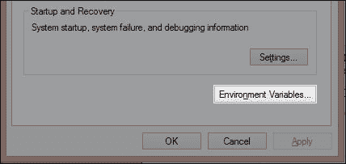
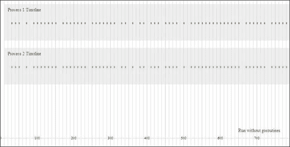
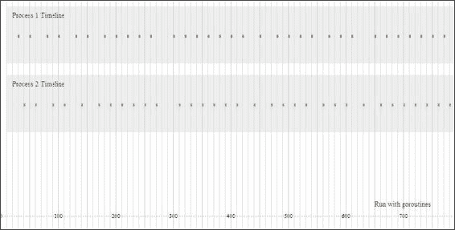
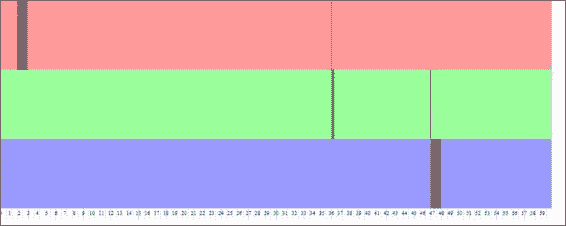
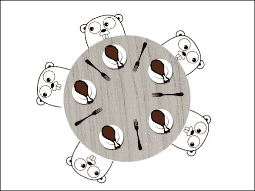

# 第二章：理解并发模型

现在我们已经了解了 Go 的能力以及如何测试一些并发模型，我们需要更深入地了解 Go 最强大的功能，以了解如何最好地利用各种并发工具和模型。

我们玩了一些一般和基本的 goroutines，看看我们如何运行并发进程，但在我们开始通道之间的通信之前，我们需要看看 Go 是如何管理并发调度的。

# 理解 goroutines 的工作方式

到这一点，你应该对 goroutines 做了很好的了解，但值得理解的是它们在 Go 中是如何内部工作的。Go 使用协作调度处理并发，正如我们在前一章中提到的，这在某种程度上严重依赖于某种形式的阻塞代码。

协作调度的最常见替代方案是抢占式调度，其中每个子进程被授予一段时间来完成，然后它的执行被暂停以进行下一个。

没有某种形式的让回到主线程，执行就会遇到问题。这是因为 Go 使用单个进程，作为 goroutines 乐队的指挥。每个子进程负责宣布自己的完成。与其他并发模型相比，其中一些允许直接命名通信，这可能构成一个难点，特别是如果你以前没有使用过通道。

你可能会看到这些事实存在死锁的潜在可能性。在本章中，我们将讨论 Go 的设计允许我们管理这一点的方式，以及在应用程序中解决问题的方法。

# 同步与异步 goroutines

理解并发模型有时是程序员的早期痛点，不仅仅是对于 Go，还有其他使用不同模型的语言。部分原因是由于在*黑盒*中操作（取决于你的终端偏好）；开发人员必须依赖于日志记录或数据一致性错误来辨别异步和/或多核定时问题。

由于同步和异步或并发和非并发任务的概念有时可能有点抽象，我们将在这里尝试以一种视觉方式来演示到目前为止我们所涵盖的所有概念。

当然，有许多方法来处理反馈和日志记录。你可以写入文件`console/terminal/stdout…`，其中大部分本质上是线性的。在日志文件中没有简洁的方式来表示并发。鉴于这一点，以及我们处理着一个专注于服务器的新兴语言，让我们采取不同的角度。

我们将创建一个可视化反馈，显示进程在时间轴上的开始和停止。

## 设计 Web 服务器计划

为了展示不同的方法，我们将创建一个简单的 Web 服务器，循环执行三个微不足道的任务，并在 X 秒时间轴上输出它们的执行标记。我们将使用一个名为`svgo`的第三方库和 Go 的内置`http`包来实现这一点。

首先，让我们通过`go get`获取`svgo`库：

```go
go get github.com/ajstarks/svgo

```

如果你尝试通过`go get`命令安装一个包，并且收到关于未设置`$GOPATH`的错误，那么你需要设置该环境变量。`GOPATH`是 Go 将查找已安装的导入包的位置。

在 Linux（或 Mac）中设置这个，输入以下 bash（或终端）：

```go
export GOPATH=/usr/yourpathhere

```

这条路由取决于你，所以选择一个你最舒适的地方来存储你的 Go 包。

为了确保它是全局可访问的，请将它安装在你的 Go 二进制文件安装的位置。

在 Windows 上，你可以右键单击**我的电脑**，然后导航到**属性** | **高级系统设置** | **环境变量...**，如下面的截图所示：



在这里，您需要创建一个名为`GOPATH`的新变量。与 Linux 和 Mac 的说明一样，这可以是您的 Go 语言根目录，也可以是完全不同的地方。在本例中，我们使用了`C:\Go`，如下截图所示：


### 注意

请注意，在执行这些步骤后，您可能需要重新打开终端、命令提示符或 bash 会话，以便值被视为有效。在*nix 系统上，您可以登录和注销以启动此操作。

现在我们已经安装了 gosvg，我们可以直观地演示异步和同步进程并排以及多个处理器的外观。

### 注意

**更多库**

为什么使用 SVG？当然，我们不需要使用 SVG 和 Web 服务器，如果您更愿意看到生成的图像并单独打开它，还有其他替代方法可以做到这一点。Go 还有一些其他可用的图形库，如下所示：

+   **draw2d**：顾名思义，这是一个用于进行矢量风格和光栅图形的二维绘图库，可以在[`code.google.com/p/draw2d/`](https://code.google.com/p/draw2d/)找到。

+   **graphics-go**：这个项目涉及 Go 团队的一些成员。它的范围相当有限。您可以在[`code.google.com/p/graphics-go/`](https://code.google.com/p/graphics-go/)找到更多信息。

+   **go:ngine**：这是为 Go 设计的少数 OpenGL 实现之一。对于这个项目来说可能有些过度，但如果您发现自己需要一个三维图形库，可以从[`go-ngine.com/`](http://go-ngine.com/)开始。

+   **Go-SDL**：另一种可能过度的方法，这是一个实现了出色的多媒体库 SDL 的项目。您可以在[`github.com/banthar/Go-SDL`](https://github.com/banthar/Go-SDL)找到更多信息。

还有一些强大的 GUI 工具包可用，但由于它们是作为系统语言设计的，这并不是 Go 的长处。

# 可视化并发

我们对可视化并发的第一次尝试将有两个简单的 goroutines 在循环中运行`drawPoint`函数，循环 100 次。运行后，您可以访问`localhost:1900/visualize`，看看并发 goroutines 的样子。

如果您在端口 1900 上遇到问题（无论是防火墙还是端口冲突），请随意在`main()`函数的第 99 行更改该值。如果您的系统无法解析 localhost，则可能还需要通过`127.0.0.1`访问它。

请注意，我们没有使用`WaitGroup`或任何其他东西来管理 goroutines 的结束，因为我们只想看到我们的代码运行的可视化表示。您也可以使用特定的阻塞代码或`runtime.Gosched()`来处理这个问题，如下所示：

```go
package main

import (
    "github.com/ajstarks/svgo"
    "net/http"
    "fmt"
    "log"
    "time"
    "strconv"
)

var width = 800
var height = 400
var startTime = time.Now().UnixNano()

func drawPoint(osvg *svg.SVG, pnt int, process int) {
  sec := time.Now().UnixNano()
  diff := ( int64(sec) - int64(startTime) ) / 100000

  pointLocation := 0

  pointLocation = int(diff)
  pointLocationV := 0
  color := "#000000"
  switch {
    case process == 1:
      pointLocationV = 60
      color = "#cc6666"
    default:
      pointLocationV = 180
      color = "#66cc66"

  }

  osvg.Rect(pointLocation,pointLocationV,3,5,"fill:"+color+";stroke:
  none;")
  time.Sleep(150 * time.Millisecond)
}

func visualize(rw http.ResponseWriter, req *http.Request) {
  startTime = time.Now().UnixNano()
  fmt.Println("Request to /visualize")
  rw.Header().Set("Content-Type", "image/svg+xml")

  outputSVG := svg.New(rw)

  outputSVG.Start(width, height)
  outputSVG.Rect(10, 10, 780, 100, "fill:#eeeeee;stroke:none")
  outputSVG.Text(20, 30, "Process 1 Timeline", "text-
    anchor:start;font-size:12px;fill:#333333")
  outputSVG.Rect(10, 130, 780, 100, "fill:#eeeeee;stroke:none")    
  outputSVG.Text(20, 150, "Process 2 Timeline", "text-
    anchor:start;font-size:12px;fill:#333333")  

  for i:= 0; i < 801; i++ {
    timeText := strconv.FormatInt(int64(i),10)
    if i % 100 == 0 {
      outputSVG.Text(i,380,timeText,"text-anchor:middle;font-
        size:10px;fill:#000000")      
    }else if i % 4 == 0 {
      outputSVG.Circle(i,377,1,"fill:#cccccc;stroke:none")  
    }

    if i % 10 == 0 {
      outputSVG.Rect(i,0,1,400,"fill:#dddddd")
    }
    if i % 50 == 0 {
      outputSVG.Rect(i,0,1,400,"fill:#cccccc")
    }

  }

  for i := 0; i < 100; i++ {
    go drawPoint(outputSVG,i,1)
    drawPoint(outputSVG,i,2)    
  }

  outputSVG.Text(650, 360, "Run without goroutines", "text-
    anchor:start;font-size:12px;fill:#333333")      
  outputSVG.End()
}

func main() {
  http.Handle("/visualize", http.HandlerFunc(visualize))

    err := http.ListenAndServe(":1900", nil)
    if err != nil {
        log.Fatal("ListenAndServe:", err)
    }  

}
```

当您访问`localhost:1900/visualize`时，您应该看到类似以下截图的内容：



正如您所看到的，一切肯定是同时运行的——我们短暂休眠的 goroutines 在同一时刻命中时间轴。通过简单地强制 goroutines 以串行方式运行，您将看到这种行为的可预测变化。如下所示，删除第 73 行的 goroutine 调用：

```go
    drawPoint(outputSVG,i,1)
    drawPoint(outputSVG,i,2)  
```

为了保持我们的演示清晰，将第 77 行更改为指示没有 goroutines，如下所示：

```go
outputSVG.Text(650, 360, "Run with goroutines", "text-
  anchor:start;font-size:12px;fill:#333333")  
```

如果我们停止服务器并使用`go run`重新启动，我们应该看到类似以下截图的内容：



现在，每个进程在开始之前都会等待前一个进程完成。如果您在同步数据、通道和进程的同步方面遇到问题，您实际上可以向任何应用程序添加这种反馈。

如果我们愿意，我们可以添加一些通道，并显示它们之间的通信。稍后，我们将设计一个自我诊断服务器，实时提供有关服务器、请求和通道状态的分析。

如果我们重新启动 goroutine 并增加最大可用处理器，我们将看到类似于以下截图的内容，这与我们的第一个截图并不完全相同：


显然，您的里程数会根据服务器速度、处理器数量等而有所不同。但在这种情况下，我们的更改导致了两个具有间歇性休眠的进程的更快总执行时间。这应该不足为奇，因为我们基本上有两倍的带宽可用来完成这两个任务。

# RSS 的实际应用

让我们以**Rich Site Summary** / **Really Simple Syndication** (**RSS**)的概念为基础，并注入一些真正的潜在延迟，以确定我们在哪里可以最好地利用 goroutines 来加快执行速度并防止阻塞代码。将真实生活中可能阻塞应用程序元素引入您的代码的一种常见方式是使用涉及网络传输的内容。

这也是一个很好的地方，可以查看超时和关闭通道，以确保我们的程序不会在某些操作花费太长时间时崩溃。

为了满足这两个要求，我们将构建一个非常基本的 RSS 阅读器，它将简单地解析并获取五个 RSS 源的内容。我们将读取每一个源以及每个源上提供的链接，然后我们将通过 HTTP 生成一个 SVG 报告。

### 注意

显然，这是一个最适合作为后台任务的应用程序——您会注意到每个请求可能需要很长时间。但是，为了以图形方式表示与并发和无并发的真实生活过程，它将起作用，特别是对于单个最终用户。我们还将将我们的步骤记录到标准输出中，所以一定要查看您的控制台。

在这个例子中，我们将再次使用第三方库，尽管完全可以使用 Go 的内置 XML 包来解析 RSS。鉴于 XML 的开放性和 RSS 的特定性，我们将绕过它们，使用 Jim Teeuwen 的`go-pkg-rss`，可以通过以下`go get`命令获取：

```go
go get github.com/jteeuwen/go-pkg-rss

```

虽然这个包专门用作 Google Reader 产品的替代品，这意味着它会在一组来源中对新内容进行基于间隔的轮询，但它也有一个相当整洁的 RSS 阅读实现。虽然还有一些其他的 RSS 解析库，但是请随意尝试。

## 带自我诊断功能的 RSS 阅读器

让我们回顾一下我们迄今为止学到的东西，并利用它来同时获取和解析一组 RSS 源，同时在内部 Web 浏览器中返回有关该过程的一些可视化反馈，如下所示的代码：

```go
package main

import(
  "github.com/ajstarks/svgo"
  rss "github.com/jteeuwen/go-pkg-rss"    
  "net/http"
  "log"
  "fmt"
  "strconv"
  "time"
  "os"
  "sync"
  "runtime"
)

type Feed struct {
  url string
  status int
  itemCount int
  complete bool
  itemsComplete bool
  index int
}
```

这是我们源的整体结构的基础：我们有一个代表源位置的`url`变量，一个表示它是否已启动的`status`变量，以及一个表示它是否已完成的`complete`布尔变量。下一个部分是一个单独的`FeedItem`；以下是它的布局方式：

```go
type FeedItem struct {
  feedIndex int
  complete bool
  url string
}
```

与此同时，我们不会对单个项做太多处理；在这一点上，我们只是维护一个 URL，无论它是完整的还是`FeedItem`结构体的索引。

```go
var feeds []Feed
var height int
var width int
var colors []string
var startTime int64
var timeout int
var feedSpace int

var wg sync.WaitGroup

func grabFeed(feed *Feed, feedChan chan bool, osvg *svg.SVG) {

  startGrab := time.Now().Unix()
  startGrabSeconds := startGrab - startTime

  fmt.Println("Grabbing feed",feed.url," 
    at",startGrabSeconds,"second mark")

  if feed.status == 0 {
    fmt.Println("Feed not yet read")
    feed.status = 1

    startX := int(startGrabSeconds * 33);
    startY := feedSpace * (feed.index)

    fmt.Println(startY)
    wg.Add(1)

    rssFeed := rss.New(timeout, true, channelHandler, 
      itemsHandler);

    if err := rssFeed.Fetch(feed.url, nil); err != nil {
      fmt.Fprintf(os.Stderr, "[e] %s: %s", feed.url, err)
      return
    } else {

      endSec := time.Now().Unix()    
      endX := int( (endSec - startGrab) )
      if endX == 0 {
        endX = 1
      }
      fmt.Println("Read feed in",endX,"seconds")
      osvg.Rect(startX,startY,endX,feedSpace,"fill: 
        #000000;opacity:.4")
      wg.Wait()

      endGrab := time.Now().Unix()
      endGrabSeconds := endGrab - startTime
      feedEndX := int(endGrabSeconds * 33);      

      osvg.Rect(feedEndX,startY,1,feedSpace,"fill:#ff0000;opacity:.9")

      feedChan <- true
    }

  }else if feed.status == 1{
    fmt.Println("Feed already in progress")
  }

}
```

`grabFeed()`方法直接控制抓取任何单个源的流程。它还通过`WaitGroup`结构绕过了潜在的并发重复。接下来，让我们看看`itemsHandler`函数：

```go
func channelHandler(feed *rss.Feed, newchannels []*rss.Channel) {

}

func itemsHandler(feed *rss.Feed, ch *rss.Channel, newitems []*rss.Item) {

  fmt.Println("Found",len(newitems),"items in",feed.Url)

  for i := range newitems {
    url := *newitems[i].Guid
    fmt.Println(url)

  }

  wg.Done()
}
```

`itemsHandler`函数目前并没有做太多事情，除了实例化一个新的`FeedItem`结构体——在现实世界中，我们会将这作为下一步，并检索这些项本身的值。我们的下一步是查看抓取单个 feed 并标记每个 feed 所花费的时间的过程，如下所示：

```go
func getRSS(rw http.ResponseWriter, req *http.Request) {
  startTime = time.Now().Unix()  
  rw.Header().Set("Content-Type", "image/svg+xml")
  outputSVG := svg.New(rw)
  outputSVG.Start(width, height)

  feedSpace = (height-20) / len(feeds)

  for i:= 0; i < 30000; i++ {
    timeText := strconv.FormatInt(int64(i/10),10)
    if i % 1000 == 0 {
      outputSVG.Text(i/30,390,timeText,"text-anchor:middle;font-
        size:10px;fill:#000000")      
    }else if i % 4 == 0 {
      outputSVG.Circle(i,377,1,"fill:#cccccc;stroke:none")  
    }

    if i % 10 == 0 {
      outputSVG.Rect(i,0,1,400,"fill:#dddddd")
    }
    if i % 50 == 0 {
      outputSVG.Rect(i,0,1,400,"fill:#cccccc")
    }

  }

  feedChan := make(chan bool, 3)

  for i := range feeds {

    outputSVG.Rect(0, (i*feedSpace), width, feedSpace, 
      "fill:"+colors[i]+";stroke:none;")
    feeds[i].status = 0
    go grabFeed(&feeds[i], feedChan, outputSVG)
    <- feedChan
  }

  outputSVG.End()
}
```

在这里，我们获取 RSS 源并在我们的 SVG 上标记我们的检索和读取事件的状态。我们的`main()`函数主要处理源的设置，如下所示：

```go
func main() {

  runtime.GOMAXPROCS(2)

  timeout = 1000

  width = 1000
  height = 400

  feeds = append(feeds, Feed{index: 0, url: 
    "https://groups.google.com/forum/feed/golang-
    nuts/msgs/rss_v2_0.xml?num=50", status: 0, itemCount: 0, 
    complete: false, itemsComplete: false})
  feeds = append(feeds, Feed{index: 1, url: 
    "http://www.reddit.com/r/golang/.rss", status: 0, itemCount: 
    0, complete: false, itemsComplete: false})
  feeds = append(feeds, Feed{index: 2, url: 
    "https://groups.google.com/forum/feed/golang-
    dev/msgs/rss_v2_0.xml?num=50", status: 0, itemCount: 0, 
    complete: false, itemsComplete: false })
```

这是我们的`FeedItem`结构体的切片：

```go
  colors = append(colors,"#ff9999")
  colors = append(colors,"#99ff99")
  colors = append(colors,"#9999ff")  
```

在打印版本中，这些颜色可能并不特别有用，但在您的系统上测试它将允许您区分应用程序内部的事件。我们需要一个 HTTP 路由作为终点；以下是我们将如何设置它：

```go
  http.Handle("/getrss", http.HandlerFunc(getRSS))
    err := http.ListenAndServe(":1900", nil)
    if err != nil {
        log.Fatal("ListenAndServe:", err)
    }  
}
```

运行时，您应该看到 RSS feed 检索和解析的开始和持续时间，然后是一条细线，表示该 feed 已被解析并且所有项已被读取。

三个块中的每一个都表达了处理每个 feed 的全部时间，展示了这个版本的非并发执行，如下面的屏幕截图所示：



请注意，我们对 feed 项并没有做任何有趣的事情，我们只是读取 URL。下一步将是通过 HTTP 获取这些项，如下面的代码片段所示：

```go
  url := *newitems[i].Guid
      response, _, err := http.Get(url)
      if err != nil {

      }
```

通过这个例子，我们在每一步都停下来向 SVG 提供某种反馈，告诉它发生了某种事件。我们的通道在这里是有缓冲的，我们明确声明它必须在完成阻塞之前接收三条布尔消息，如下面的代码片段所示：

```go
  feedChan := make(chan bool, 3)

  for i := range feeds {

    outputSVG.Rect(0, (i*feedSpace), width, feedSpace, 
      "fill:"+colors[i]+";stroke:none;")
    feeds[i].status = 0
    go grabFeed(&feeds[i], feedChan, outputSVG)
    <- feedChan
  }

  outputSVG.End()
```

通过在我们的通道调用中给出`3`作为第二个参数，我们告诉 Go 这个通道必须在继续应用程序之前接收三个响应。不过，您应该谨慎使用这个功能，特别是在明确设置事物时。如果其中一个 goroutine 从未通过通道发送布尔值会怎么样？应用程序会崩溃。

请注意，我们在这里还增加了我们的时间轴，从 800 毫秒增加到 60 秒，以便检索所有的 feeds。请记住，如果我们的脚本超过 60 秒，那么超过这个时间的所有操作都将发生在这个可视时间轴表示之外。

通过在读取 feeds 时实现`WaitGroup`结构，我们对应用程序施加了一些串行化和同步。第二个 feed 将在第一个 feed 完成检索所有 URL 之前不会开始。您可能会看到这可能会引入一些错误：

```go
    wg.Add(1)
    rssFeed := rss.New(timeout, true, channelHandler, 
      itemsHandler);
    …
    wg.Wait()
```

这告诉我们的应用程序要等到我们从`itemsHandler()`函数中设置`Done()`命令为止。

那么如果我们完全删除`WaitGroups`会发生什么？考虑到抓取 feed 项的调用是异步的，我们可能看不到所有的 RSS 调用的状态；相反，我们可能只看到一个或两个 feeds，或者根本没有 feed。

## 强加超时

那么如果在我们的时间轴内没有运行任何东西会发生什么？正如您所期望的那样，我们将得到三个没有任何活动的条形图。重要的是要考虑如何终止那些没有按我们期望的方式运行的进程。在这种情况下，最好的方法是超时。`http`包中的`Get`方法并不原生支持超时，因此如果您想要防止这些请求永无止境地进行并杀死您的应用程序，您将不得不自己编写`rssFeed.Fetch`（和底层的`http.Get()`）实现。我们稍后会深入探讨这一点；与此同时，看一下核心`http`包中可用的`Transport`结构，网址为[`golang.org/pkg/net/http/#Transport`](http://golang.org/pkg/net/http/#Transport)。

# 关于 CSP 的一点说明

我们在上一章中简要介绍了 CSP，但在 Go 的并发模型操作方式的背景下，值得更深入地探讨一下。

CSP 在 20 世纪 70 年代末和 80 年代初通过 Tony Hoare 爵士的工作发展起来，至今仍在不断发展中。Go 的实现在很大程度上基于 CSP，但它既不完全遵循初始描述中设定的所有规则和惯例，也不遵循其自那时以来的发展。

Go 与真正的 CSP 不同的一种方式是，根据其定义，Go 中的一个进程只会继续存在，只要存在一个准备好从该进程接收的通道。 我们已经遇到了一些由于监听通道没有接收任何内容而导致的死锁。 反之亦然；死锁也可能是由于通道继续而没有发送任何内容，使其接收通道无限期挂起。

这种行为是 Go 调度程序的典型特征，当您最初使用通道时，它确实只会在您处理通道时造成问题。

### 注意

霍尔的原始作品现在可以从许多机构（大部分）免费获得。 您可以免费阅读，引用，复制和重新分发它（但不能用于商业用途）。 如果您想阅读整个内容，可以在[`www.cs.ucf.edu/courses/cop4020/sum2009/CSP-hoare.pdf`](http://www.cs.ucf.edu/courses/cop4020/sum2009/CSP-hoare.pdf)上获取。

完整的书本本身也可以在[`www.usingcsp.com/cspbook.pdf`](http://www.usingcsp.com/cspbook.pdf)上获得。

截至本出版之时，霍尔正在微软担任研究员。

根据应用程序设计者的说法，Go 实现 CSP 概念的目标是专注于简单性-除非您真的想要或需要，否则您不必担心线程或互斥量。

## 餐桌哲学家问题

您可能已经听说过餐桌哲学家问题，这描述了并发编程旨在解决的问题类型。 餐桌哲学家问题是由伟大的 Edsger Dijkstra 提出的。 问题的关键在于资源-五位哲学家坐在一张桌子旁，有五盘食物和五把叉子，每个人只有在他有两把叉子（一把在左边，另一把在右边）时才能吃饭。 可视化表示如下：



在任一侧只有一把叉子时，任何给定的哲学家只有在双手都拿着叉子时才能吃饭，并且在完成后必须将两者都放回桌子上。 思想是协调餐点，以便所有哲学家都可以永远吃饭而不会挨饿-任何时刻都必须有两位哲学家能够吃饭，而且不能有死锁。 他们是哲学家，因为当他们不吃饭时，他们在思考。 在编程类比中，您可以将其视为等待通道或睡眠进程。

Go 使用 goroutines 相当简洁地处理了这个问题。 给定五位哲学家（例如在一个单独的结构中），您可以让这五位哲学家在思考、在叉子放下时接收通知、抓住叉子、用叉子就餐和放下叉子之间交替。

接收到叉子放下的通知作为监听通道，就餐和思考是独立的过程，放下叉子则是沿通道的公告。

我们可以在以下伪 Go 代码中可视化这个概念：

```go
type Philosopher struct {
  leftHand bool
  rightHand bool
  status int
  name string
}

func main() {

  philosophers := [...]Philospher{"Kant", "Turing", 
    "Descartes","Kierkegaard","Wittgenstein"}

  evaluate := func() {
    for {

      select {
        case <- forkUp:
          // philosophers think!
        case <- forkDown:
          // next philospher eats in round robin
      }

    }

  }

}
```

这个例子被留得非常抽象和非操作性，以便您有机会尝试解决它。 我们将在下一章中为此构建一个功能性解决方案，因此请确保稍后比较您的解决方案。

有数百种处理此问题的方法，我们将看看一些替代方案以及它们在 Go 本身内部如何能够或不能够很好地发挥作用。

# Go 和演员模型

如果您是 Erlang 或 Scala 用户，那么演员模型可能是您非常熟悉的。 CSP 和演员模型之间的区别微不足道但很重要。 使用 CSP，如果另一个通道正在监听并准备好接收消息，那么来自一个通道的消息只能完全发送。 演员模型并不一定需要准备好的通道才能发送。 实际上，它强调直接通信，而不是依赖通道的导管。

这两种系统都可能是不确定的，这在我们之前的 Go/CSP 示例中已经看到了。CSP 和 goroutines 都是匿名的，传输由通道而不是源和目的地指定。在演员模型的伪代码中可视化这一点的简单方法如下：

```go
a = new Actor
b = new Actor
a -> b("message")
```

在 CSP 中，它是这样的：

```go
a = new Actor
b = new Actor
c = new Channel
a -> c("sending something")
b <- c("receiving something")
```

它们都通过稍微不同的方式提供了相同的基本功能。

# 面向对象

当你使用 Go 时，你会注意到一个核心特征经常被提倡，用户可能觉得是错误的。你会听到 Go 不是一种面向对象的语言，然而你有可以有方法的结构体，这些方法反过来又可以有方法，你可以与任何实例进行通信。通道本身可能感觉像原始的对象接口，能够从给定的数据元素中设置和接收值。

Go 的消息传递实现确实是面向对象编程的核心概念。具有接口的结构本质上就像类，Go 支持多态性（尽管不支持参数多态性）。然而，许多使用该语言的人（以及设计它的人）强调它并不是面向对象的。那么是什么原因呢？

这个定义的很大程度上取决于你问的是谁。有些人认为 Go 缺乏面向对象编程的必要特征，而其他人认为它满足了这些特征。最重要的是要记住，你并不受 Go 设计的限制。在*真正*的面向对象语言中可以做的任何事情在 Go 中都可以轻松处理。

## 演示 Go 中简单的多态性

如前所述，如果你期望多态性类似于面向对象编程，这可能不代表一种语法类比。然而，使用接口作为类绑定多态方法的抽象同样干净，并且在许多方面更加明确和可读。让我们看一个 Go 中多态性的非常简单的实现：

```go
type intInterface struct {

}

type stringInterface struct {

}

func (number intInterface) Add (a int, b int) int {
  return a + b;
}

func (text stringInterface) Add (a string, b string) string {
  return a + b
}

func main() {

  number := new (intInterface)
    fmt.Println( number.Add(1,2) )

  text := new (stringInterface)
    fmt.Println( text.Add("this old man"," he played one"))

}
```

正如你所看到的，我们使用接口（或其 Go 模拟）来消除方法的歧义。例如，你不能像在 Java 中那样使用泛型。然而，这归结为最终只是一种风格问题。你既不应该觉得这令人畏惧，也不会给你的代码带来任何混乱或歧义。

# 使用并发

尚未提到的是，我们应该意识到，并发并不总是对应用程序有益的。并没有真正的经验之谈，而且并发很少会给应用程序带来问题；但是如果你真的考虑整个应用程序，不是所有的应用程序都需要并发进程。

那么什么效果最好呢？正如我们在之前的例子中看到的，任何引入潜在延迟或 I/O 阻塞的东西，比如网络调用、磁盘读取、第三方应用程序（主要是数据库）和分布式系统，都可以从并发中受益。如果你有能力在未确定的时间表上进行工作，那么并发策略可以提高应用程序的速度和可靠性。

这里的教训是你不应该感到被迫将并发加入到一个真正不需要它的应用程序中。具有进程间依赖关系（或缺乏阻塞和外部依赖关系）的程序可能很少或根本不会从实现并发结构中获益。

# 管理线程

到目前为止，你可能已经注意到，在 Go 中，线程管理并不是程序员最关心的问题。这是有意设计的。Goroutines 并不绑定到 Go 内部调度程序处理的特定线程或线程。然而，这并不意味着你既不能访问线程，也不能控制单个线程的操作。正如你所知，你已经可以告诉 Go 你有多少线程（或希望使用）通过使用`GOMAXPROCS`。我们也知道，使用这个可能会引入与数据一致性和执行顺序相关的异步问题。

在这一点上，线程的主要问题不是它们如何被访问或利用，而是如何正确地控制执行流程，以确保你的数据是可预测的和同步的。

# 使用 sync 和互斥锁来锁定数据

你可能在前面的例子中遇到的一个问题是原子数据的概念。毕竟，如果你在多个 goroutines 和可能的处理器之间处理变量和结构，你如何确保你的数据在它们之间是安全的？如果这些进程并行运行，协调数据访问有时可能会有问题。

Go 在其`sync`包中提供了大量工具来处理这些类型的问题。你如何优雅地处理它们在很大程度上取决于你的方法，但在这个领域你不应该不得不重新发明轮子。

我们已经看过`WaitGroup`结构，它提供了一种简单的方法，告诉主线程暂停，直到下一个通知说等待的进程已经完成了它应该做的事情。

Go 还提供了对互斥锁的直接抽象。称某物为直接抽象可能看起来矛盾，但事实上你并没有访问 Go 的调度程序，只是一个真正互斥锁的近似。

我们可以使用互斥锁来锁定和解锁数据，并保证数据的原子性。在许多情况下，这可能是不必要的；有很多时候，执行顺序并不影响底层数据的一致性。然而，当我们对这个值有顾虑时，能够显式地调用锁是很有帮助的。让我们看下面的例子：

```go
package main

import(
  "fmt"
  "sync"
)

func main() {
  current := 0
  iterations := 100
  wg := new (sync.WaitGroup);

  for i := 0; i < iterations; i++ {
    wg.Add(1)

    go func() {
      current++
      fmt.Println(current)
      wg.Done()
    }()
    wg.Wait()
  }

}
```

毫不奇怪，在你的终端中提供了 0 到 99 的列表。如果我们将`WaitGroup`更改为知道将调用 100 个`Done()`实例，并将我们的阻塞代码放在循环的末尾，会发生什么？

为了演示为什么以及如何最好地利用`waitGroups`作为并发控制机制的一个简单命题，让我们做一个简单的数字迭代器并查看结果。我们还将看看如何直接调用互斥锁可以增强这种功能，如下所示：

```go
func main() {
  runtime.GOMAXPROCS(2)
  current := 0
  iterations := 100
  wg := new (sync.WaitGroup);
  wg.Add(iterations)
  for i := 0; i < iterations; i++ {
    go func() {
      current++
      fmt.Println(current)
      wg.Done()
    }()

  }
  wg.Wait()

}
```

现在，我们的执行顺序突然错了。你可能会看到类似以下的输出：

```go
95
96
98
99
100
3
4

```

我们有能力随时锁定和解锁当前命令；然而，这不会改变底层的执行顺序，它只会阻止对变量的读取和/或写入，直到调用解锁为止。

让我们尝试使用`mutex`锁定我们输出的变量，如下所示：

```go
  for i := 0; i < iterations; i++ {
    go func() {
      mutex.Lock()
      fmt.Println(current)
      current++
      mutex.Unlock()
      fmt.Println(current)
      wg.Done()
    }()

  }
```

你可能已经看到，在并发应用程序中，互斥控制机制如何重要，以确保数据的完整性。我们将在第四章*应用程序中的数据完整性*中更多地了解互斥锁和锁定和解锁过程。

# 总结

在本章中，我们试图通过给出一些可视化的实时反馈，来消除 Go 并发模式和模型的一些模糊性，包括一个基本的 RSS 聚合器和阅读器。我们研究了餐桌哲学家问题，并探讨了如何使用 Go 并发主题来整洁而简洁地解决问题。我们比较了 CSP 和 actor 模型的相似之处以及它们的不同之处。

在下一章中，我们将把这些概念应用到开发应用程序中维护并发性的过程中。
