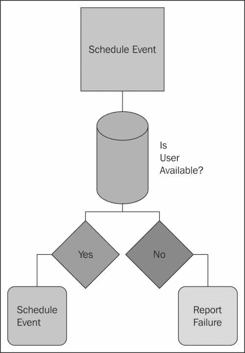
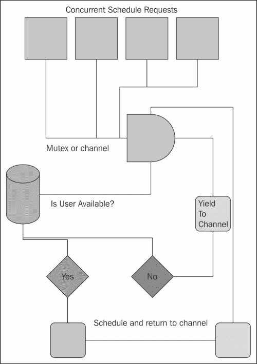
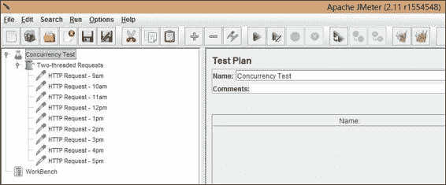
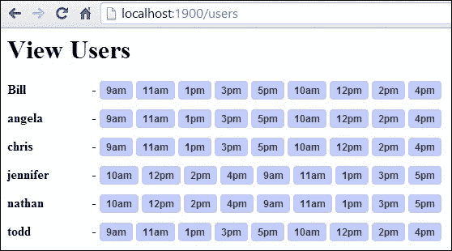
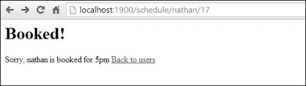

# 第三章：制定并发策略

在上一章中，我们看到了 Go 依赖的并发模型，以使开发人员的生活更轻松。我们还看到了并行性和并发性的可视化表示。这些帮助我们理解串行、并发和并行应用程序之间的差异和重叠。

然而，任何并发应用程序中最关键的部分不是并发本身，而是并发进程之间的通信和协调。

在本章中，我们将着重考虑创建一个应用程序的计划，该计划严重考虑了进程之间的通信，以及缺乏协调可能导致一致性方面的重大问题。我们将探讨如何在纸上可视化我们的并发策略，以便更好地预见潜在问题。

# 应用复杂并发的效率

在设计应用程序时，我们经常放弃复杂的模式，选择简单性，假设简单的系统通常是最快和最有效的。似乎只有逻辑上，机器的移动部分越少，效率就会比移动部分更多的机器更高。

这里的悖论是，对并发的应用，增加冗余和更多的可移动部分通常会导致更高效的应用。如果我们认为并发方案（如 goroutines）是无限可扩展的资源，那么使用更多的资源应该总是会带来某种形式的效率收益。这不仅适用于并行并发，也适用于单核并发。

如果你发现自己设计的应用程序利用并发，却牺牲了效率、速度和一致性，你应该问问自己这个应用程序是否真的需要并发。

当我们谈论效率时，我们不仅仅是在处理速度。效率还应该考虑 CPU 和内存开销以及确保数据一致性的成本。

例如，如果一个应用程序在一定程度上受益于并发，但需要一个复杂和/或计算昂贵的过程来保证数据一致性，那么重新评估整个策略是值得的。

保持数据的可靠性和最新性应该是最重要的；虽然不可靠的数据可能并不总是会产生灾难性的影响，但它肯定会损害你的应用程序的可靠性。

# 使用竞争检测识别竞争条件

如果你曾经编写过一个依赖于函数或方法的确切时间和顺序来创建期望输出的应用程序，你对竞争条件已经非常熟悉了。

这些在处理并发时特别常见，当引入并行时更加常见。在前几章中，我们确实遇到了一些问题，特别是在我们的递增数字函数中。

竞争条件最常用的教育示例是银行账户。假设你从 1000 美元开始，尝试进行 200 笔 5 美元的交易。每笔交易都需要查询账户的当前余额。如果通过，交易将获批准，从余额中扣除 5 美元。如果失败，交易将被拒绝，余额保持不变。

这一切都很好，直到查询在并发事务中的某个时刻发生（在大多数情况下是在另一个线程中）。例如，一个线程在另一个线程正在移除 5 美元但尚未完成的过程中询问“你的账户里有 5 美元吗？”这样，你最终可能会得到一个本应该被拒绝的交易。

追踪竞争条件的原因可能是一个巨大的头痛。在 Go 的 1.1 版本中，Google 引入了一种竞争检测工具，可以帮助你找到潜在的问题。

让我们以一个具有竞争条件的多线程应用程序的非常基本的例子为例，看看 Golang 如何帮助我们调试它。在这个例子中，我们将建立一个银行账户，初始金额为 1000 美元，进行 100 笔随机金额在 0 到 25 美元之间的交易。

每个交易将在自己的 goroutine 中运行，如下所示：

```go
package main

import(
  "fmt"
  "time"
  "sync"
  "runtime"
  "math/rand"
)  

var balance int
var transactionNo int

func main() {
  rand.Seed(time.Now().Unix())
  runtime.GOMAXPROCS(2)
  var wg sync.WaitGroup

  tranChan := make(chan bool)

  balance = 1000
  transactionNo = 0
  fmt.Println("Starting balance: $",balance)

  wg.Add(1)
  for i := 0; i < 100; i++ {
    go func(ii int, trChan chan(bool)) {
      transactionAmount := rand.Intn(25)
      transaction(transactionAmount)
      if (ii == 99) {
        trChan <- true
      }

    }(i,tranChan)
  }

  go transaction(0)
  select {

    case <- tranChan:
      fmt.Println("Transactions finished")
      wg.Done()

  }

  wg.Wait()
  close(tranChan)
  fmt.Println("Final balance: $",balance)
}

func transaction(amt int) (bool) {

  approved := false  
  if (balance-amt) < 0 {
    approved = false
  }else {
    approved = true
    balance = balance - amt
  }

  approvedText := "declined"
  if (approved == true) {
    approvedText = "approved"
  }else {

  }
  transactionNo = transactionNo + 1
  fmt.Println(transactionNo,"Transaction for $",amt,approvedText)
  fmt.Println("\tRemaining balance $",balance)
  return approved
}
```

根据您的环境（以及是否启用多个处理器），您可能会发现先前的 goroutine 成功地操作了$0 或更多的最终余额。另一方面，您可能最终只会得到超出交易时余额的交易，导致负余额。

那么我们怎么知道呢？

对于大多数应用程序和语言来说，这个过程通常涉及大量的运行、重新运行和日志记录。竞态条件往往会导致令人望而生畏和费力的调试过程。Google 知道这一点，并为我们提供了一个竞态条件检测工具。要测试这一点，只需在测试、构建或运行应用程序时使用`-race`标志，如下所示：

```go
go run -race race-test.go

```

当在先前的代码上运行时，Go 将执行应用程序，然后报告任何可能的竞态条件，如下所示：

```go
>> Final balance: $0
>> Found 2 data race(s)

```

在这里，Go 告诉我们数据存在两种潜在的竞态条件。它并没有告诉我们这些一定会导致数据一致性问题，但如果您遇到这样的问题，这可能会给您一些线索。

如果您查看输出的顶部，您将得到有关导致竞态条件的详细说明。在这个例子中，详细信息如下：

```go
==================
WARNING: DATA RACE
Write by goroutine 5: main.transaction()   /var/go/race.go:75 +0xbd 
 main.func┬╖001()   /var/go/race.go:31 +0x44

Previous write by goroutine 4: main.transaction() 
 /var/go/race.go:75 +0xbd main.func┬╖001()   /var/go/race.go:31 
 +0x44

Goroutine 5 (running) created at: main.main()   /var/go/race.go:36 
 +0x21c

Goroutine 4 (finished) created at: main.main()   /var/go/race.go:36 
 +0x21c

```

我们可以得到详细的、完整的跟踪，了解我们的潜在竞态条件存在的位置。相当有帮助，对吧？

竞态检测器保证不会产生错误的阳性结果，因此您可以将结果视为您的代码中存在潜在问题的有力证据。这里强调潜在性，因为竞态条件在正常情况下很容易被忽略——一个应用程序可能在几天、几个月甚至几年内都能正常工作，然后才会出现竞态条件。

### 提示

我们已经提到了日志记录，如果您对 Go 的核心语言不是非常熟悉，您的想法可能会有很多方向——stdout、文件日志等等。到目前为止，我们一直使用 stdout，但您可以使用标准库来处理这些日志记录。Go 的 log 包允许您按照以下方式写入 io 或 stdout：

```go
  messageOutput := os.Stdout
  logOut := log.New(messageOutput,"Message: ",log.
  Ldate|log.Ltime|log.Llongfile);
  logOut.Println("This is a message from the 
  application!")
```

这将产生以下输出：

```go
Message: 2014/01/21 20:59:11 /var/go/log.go:12: This is a message from the application!

```

那么，log 包相对于自己编写的优势在哪里呢？除了标准化之外，这个包在输出方面也是同步的。

那么现在呢？嗯，有几种选择。您可以利用通道来确保数据的完整性，使用缓冲通道，或者您可以使用`sync.Mutex`结构来锁定您的数据。

## 使用互斥

通常，互斥被认为是在应用程序中实现同步的一种低级和最为人熟知的方法——您应该能够在通道之间的通信中解决数据一致性。然而，在某些情况下，您需要真正地在处理数据时阻止读/写。

在 CPU 级别，互斥表示在寄存器之间交换二进制整数值以获取和释放锁。当然，我们将处理更高级别的东西。

我们已经熟悉了 sync 包，因为我们使用了`WaitGroup`结构，但该包还包含了条件变量`struct Cond`和`Once`，它们将执行一次操作，以及互斥锁`RWMutex`和`Mutex`。正如`RWMutex`的名称所暗示的那样，它对多个读取者和/或写入者进行锁定和解锁；本章后面和第五章中还有更多内容，*锁、块和更好的通道*。

正如包名所暗示的那样，所有这些都赋予您防止可能被任意数量的 goroutines 和/或线程访问的数据发生竞态条件的能力。使用此包中的任何方法都不能确保数据和结构的原子性，但它确实为您提供了有效管理原子性的工具。让我们看看我们可以在并发的、线程安全的应用程序中巩固我们的账户余额的一些方法。

如前所述，我们可以在通道级别协调数据更改，无论该通道是缓冲还是非缓冲。让我们将逻辑和数据操作卸载到通道，并查看`-race`标志呈现了什么。

如果我们修改我们的主循环，如下面的代码所示，以利用通道接收的消息来管理余额值，我们将避免竞态条件：

```go
package main

import(
  "fmt"
  "time"
  "sync"
  "runtime"
  "math/rand"
)  

var balance int
var transactionNo int

func main() {
  rand.Seed(time.Now().Unix())
  runtime.GOMAXPROCS(2)
  var wg sync.WaitGroup
  balanceChan := make(chan int)
  tranChan := make(chan bool)

  balance = 1000
  transactionNo = 0
  fmt.Println("Starting balance: $",balance)

  wg.Add(1)
  for i:= 0; i<100; i++ {

    go func(ii int) {

      transactionAmount := rand.Intn(25)
      balanceChan <- transactionAmount

      if ii == 99 {
        fmt.Println("Should be quittin time")
        tranChan <- true
        close(balanceChan)
        wg.Done()
      }

    }(i)

  }

  go transaction(0)

    breakPoint := false
    for {
      if breakPoint == true {
        break
      }
      select {
        case amt:= <- balanceChan:
          fmt.Println("Transaction for $",amt)
          if (balance - amt) < 0 {
            fmt.Println("Transaction failed!")
          }else {
            balance = balance - amt
            fmt.Println("Transaction succeeded")
          }
          fmt.Println("Balance now $",balance)

        case status := <- tranChan:
          if status == true {
            fmt.Println("Done")
            breakPoint = true
            close(tranChan)

          }
      }
    }

  wg.Wait()

  fmt.Println("Final balance: $",balance)
}

func transaction(amt int) (bool) {

  approved := false  
  if (balance-amt) < 0 {
    approved = false
  }else {
    approved = true
    balance = balance - amt
  }

  approvedText := "declined"
  if (approved == true) {
    approvedText = "approved"
  }else {

  }
  transactionNo = transactionNo + 1
  fmt.Println(transactionNo,"Transaction for $",amt,approvedText)
  fmt.Println("\tRemaining balance $",balance)
  return approved
}
```

这一次，我们让通道完全管理数据。让我们看看我们在做什么：

```go
transactionAmount := rand.Intn(25)
balanceChan <- transactionAmount
```

这仍然会生成 0 到 25 之间的随机整数，但我们不是将其传递给函数，而是通过通道传递数据。通道允许您整洁地控制数据的所有权。然后我们看到选择/监听器，它在很大程度上与本章前面定义的`transaction()`函数相似：

```go
case amt:= <- balanceChan:
fmt.Println("Transaction for $",amt)
if (balance - amt) < 0 {
  fmt.Println("Transaction failed!")
}else {
  balance = balance - amt
  fmt.Println("Transaction succeeded")
}
fmt.Println("Balance now $",balance)
```

为了测试我们是否避免了竞态条件，我们可以再次使用`-race`标志运行`go run`，并且不会收到警告。

通道可以被视为处理同步`dataUse Sync.Mutex()`的官方方式。

如前所述，拥有内置的竞态检测器是大多数语言的开发人员无法享受的奢侈品，拥有它使我们能够测试方法并获得实时反馈。

我们注意到，使用显式互斥锁不鼓励使用 goroutines 的通道。这并不总是完全正确，因为每件事都有正确的时间和地点，互斥锁也不例外。值得注意的是，互斥锁在 Go 中是由通道内部实现的。正如之前提到的，您可以使用显式通道来处理读取和写入，并在它们之间搬移数据。

然而，这并不意味着显式锁没有用处。一个具有许多读取和很少写入的应用程序可能会受益于显式锁定写入；这并不一定意味着读取将是脏读取，但可能会导致更快和/或更多并发的执行。

为了演示起见，让我们使用显式锁来消除我们的竞态条件。我们的`-race`标志告诉我们它在哪里遇到读/写竞态条件，如下所示：

```go
Read by goroutine 5: main.transaction()   /var/go/race.go:62 +0x46

```

前一行只是我们从竞态检测报告中得到的几行中的一行。如果我们查看代码中的第 62 行，我们会找到对`balance`的引用。我们还会找到对`transactionNo`的引用，我们的第二个竞态条件。解决这两个问题最简单的方法是在`transaction`函数的内容周围放置一个互斥锁，因为这是修改`balance`和`transactionNo`变量的函数。`transaction`函数如下所示：

```go
func transaction(amt int) (bool) {
  mutex.Lock()

  approved := false
  if (balance-amt) < 0 {
    approved = false
  }else {
    approved = true
    balance = balance - amt
  }

  approvedText := "declined"
  if (approved == true) {
    approvedText = "approved"
  }else {

  }
  transactionNo = transactionNo + 1
  fmt.Println(transactionNo,"Transaction for $",amt,approvedText)
  fmt.Println("\tRemaining balance $",balance)

  mutex.Unlock()
  return approved
}
```

我们还需要在应用程序顶部将`mutex`定义为全局变量，如下所示：

```go
var mutex sync.Mutex
```

如果我们现在使用`-race`标志运行我们的应用程序，我们将不会收到警告。

`mutex`变量在实际目的上是`WaitGroup`结构的替代品，它作为条件同步机制。这也是通道操作的方式——沿通道移动的数据在 goroutines 之间是受限和隔离的。通过将 goroutine 状态绑定到`WaitGroup`，通道可以有效地作为先进先出工具工作；然后通过低级互斥锁为通道上跨通道访问的数据提供安全性。

另一个值得注意的事情是通道的多功能性——我们有能力在一系列 goroutines 之间共享通道以接收和/或发送数据，并且作为一等公民，我们可以在函数中传递它们。

## 探索超时

我们还可以使用通道显式在指定的时间后终止它们。如果决定手动处理互斥锁，这将是一个更复杂的操作。

通过通道终止长时间运行的例程的能力非常有帮助；考虑一个依赖网络的操作，不仅应该受限于短时间段，而且也不允许长时间运行。换句话说，你想给这个过程几秒钟来完成；但如果它运行超过一分钟，我们的应用程序应该知道出了什么问题，以至于停止尝试在该通道上监听或发送。以下代码演示了在`select`调用中使用超时通道：

```go
func main() {

  ourCh := make(chan string,1)

  go func() {

  }()

  select {
    case <-time.After(10 * time.Second):
      fmt.Println("Enough's enough")
      close(ourCh)
  }

}
```

如果我们运行前面的简单应用程序，我们会看到我们的 goroutine 将被允许在 10 秒钟后什么都不做，之后我们实施一个超时保障，让我们退出。

你可以把这看作在网络应用程序中特别有用；即使在阻塞和依赖线程的服务器时代，像这样的超时也被实施以防止单个行为不端的请求或进程阻塞整个服务器。这正是我们稍后将更详细讨论的经典网络服务器问题的基础。

### 一致性的重要性

在我们的示例中，我们将构建一个事件调度程序。如果我们可以参加会议，并且我们收到两个并发的会议邀请请求，如果存在竞争条件，我们将被重复预订。或者，两个 goroutine 之间的锁定数据可能会导致两个请求都被拒绝，或者导致实际死锁。

我们希望保证任何可用性请求都是一致的——既不应该出现重复预订，也不应该错误地阻止事件请求（因为两个并发或并行例程同时锁定数据）。

# 同步我们的并发操作

同步一词字面上指的是时间存在-事情同时发生。因此，同步性最恰当的演示似乎将涉及时间本身。

当我们考虑时间如何影响我们时，通常涉及安排、截止日期和协调。回到前言中的初步示例，如果有人想要计划他们祖母的生日派对，以下类型的安排任务可以采取多种形式：

+   必须在某个时间之前完成的事情（实际派对）

+   直到另一个任务完成后才能完成的事情（在购买装饰品之前放置装饰品）

+   可以按任何特定顺序完成的事情而不会影响结果（打扫房子）

+   可以按任何顺序完成但可能会影响结果的事情（在弄清楚你祖母最喜欢的蛋糕之前买蛋糕）

有了这些想法，我们将尝试通过设计一个预约日历来处理一些基本的人类安排，该日历可以处理任意数量的人，每个人在上午 9 点到下午 5 点之间有一个小时的时间段。

# 这个项目-多用户预约日历

当你决定写一个程序时，你会做什么？

如果你和很多人一样，你会考虑这个程序；也许你和团队会起草一份规范或需求文档，然后你就开始编码。有时，会有一张图表示应用程序的工作方式的某种类似物。

很多时候，确定应用程序的架构和内部工作方式的最佳方法是拿起铅笔和纸，直观地表示程序的工作方式。对于许多线性或串行应用程序来说，这通常是一个不必要的步骤，因为事情将以可预测的方式进行，不需要在应用程序逻辑内部进行任何特定的协调（尽管协调第三方软件可能会受益于规范）。

你可能熟悉类似以下图表的一些逻辑：



这里的逻辑是有道理的。如果您还记得我们的前言，当人类绘制流程时，我们倾向于将它们串行化。从视觉上看，从第一步到第二步，有限数量的流程是容易理解的。

然而，在设计并发应用程序时，至少要考虑无数的并发请求、流程和逻辑，以确保我们的应用程序最终达到我们想要的位置，并获得我们期望的数据和结果。

在上一个例子中，我们完全忽略了“用户是否可用”的可能失败或报告旧或错误数据的可能性。如果我们发现这些问题，是否更有意义去解决它们，或者应该预见它们作为控制流的一部分？向模型添加复杂性可以帮助我们减少未来数据完整性问题的几率。

让我们再次进行可视化，考虑到可用性轮询器将请求用户的可用性与任何给定的时间/用户对。

## 可视化并发模式

正如我们已经讨论过的，我们希望创建一个应用程序应该如何运行的基本蓝图。在这里，我们将实现一些控制流，这与用户活动有关，以帮助我们决定我们需要包含哪些功能。以下图表说明了控制流可能是什么样子：



在之前的图表中，我们预见到数据可以使用并发和并行流程共享，以找到故障点。如果我们以这种图形方式设计并发应用程序，我们就不太可能在以后发现竞争条件。

虽然我们谈到了 Go 如何帮助您在应用程序完成运行后找到这些问题，但我们理想的开发工作流程是尝试在开始时解决这些问题。

## 开发我们的服务器需求

现在我们已经有了调度过程应该如何工作的想法，我们需要确定应用程序将需要的组件。在这种情况下，组件如下：

+   Web 服务器处理程序

+   输出的模板

+   用于确定日期和时间的系统

### Web 服务器

在我们之前章节的可视化并发示例中，我们使用了 Go 的内置`http`包，我们在这里也会这样做。有许多出色的框架可以实现这一点，但它们主要是扩展核心 Go 功能，而不是重新发明轮子。以下是其中一些功能，从轻到重列出：

+   Web.go：[`webgo.io/`](http://webgo.io/)

Web.go 非常轻量级和精简，并提供了一些在`net`/`http`包中不可用的路由功能。

+   大猩猩：[`www.gorillatoolkit.org/`](http://www.gorillatoolkit.org/)

Gorilla 是一个瑞士军刀，用于增强`net`/`http`包。它并不特别沉重，而且速度快，实用，非常干净。

+   Revel：[`robfig.github.io/revel/`](http://robfig.github.io/revel/)

Revel 是这三者中最沉重的，但它专注于直观的代码、缓存和性能。如果您需要一个成熟的、将面临大量流量的东西，可以考虑它。

在第六章中，*C10K – A Non-blocking Web Server in Go*，我们将自己开发一个旨在实现极高性能的 Web 服务器和框架。

#### 大猩猩工具包

对于这个应用程序，我们将部分使用 Gorilla Web 工具包。 Gorilla 是一个相当成熟的 Web 服务器平台，在这里本地实现了我们的一些需求，即能够在 URL 路由中包含正则表达式的能力。（注意：Web.Go 还扩展了部分功能。）Go 的内部 HTTP 路由处理程序相当简单；当然您可以扩展这个，但在这里我们将走一条经过磨练和可靠的捷径。

我们将仅使用这个包来方便 URL 路由，但 Gorilla Web Toolkit 还包括处理 cookies、会话和请求变量的包。我们将在第六章中更详细地研究这个包，*C10K – 一个 Go 中的非阻塞 Web 服务器*。

### 使用模板

由于 Go 被设计为一种系统语言，而系统语言通常涉及创建服务器和客户端，因此我们在创建 Web 服务器时非常注重使其成为一个功能齐全的替代方案。

任何处理过“网络语言”的人都会知道，除此之外你还需要一个框架，理想情况下是一个处理网络呈现层的框架。虽然如果你接手这样的项目，你可能会寻找或构建自己的框架，但 Go 使得模板方面的事情非常容易。

模板包有两种类型：`text`和`http`。虽然它们都服务于不同的端点，但相同的属性——提供动态性和灵活性——适用于呈现层，而不仅仅是应用层。

### 提示

`text`模板包用于一般纯文本文档，而`http`模板包用于生成 HTML 和相关文档。

这些模板范式在今天太常见了；如果你看一下`http`/`template`包，你会发现它与 Mustache 有很强的相似之处，Mustache 是更受欢迎的变体之一。虽然 Go 中有一个 Mustache 端口，但在模板包中默认处理了所有这些。

### 注意

有关 Mustache 的更多信息，请访问[`mustache.github.io/`](http://mustache.github.io/)。

Mustache 的一个潜在优势是它在其他语言中也是可用的。如果你曾经感到有必要将应用逻辑转移到另一种语言（或将现有模板转移到 Go 中），使用 Mustache 可能是有利的。也就是说，你牺牲了 Go 模板的许多扩展功能，即从编译包中取出 Go 代码并将其直接移入模板控制结构的能力。虽然 Mustache（及其变体）有控制流，但它们可能不会与 Go 的模板系统相匹配。看下面的例子：

```go
<ul>
{{range .Users}}
<li>A User </li>
{{end}}
</ul>
```

鉴于对 Go 逻辑结构的熟悉程度，保持它们在我们的模板语言中保持一致是有意义的。

### 注意

我们不会在这个帖子中展示所有具体的模板，但我们会展示输出。如果你想浏览它们，它们可以在[mastergoco.com/chapters/3/templates](http://mastergoco.com/chapters/3/templates)上找到。

### 时间

我们在这里没有做太多的数学运算；时间将被分成小时块，每个小时块将被设置为占用或可用。目前，Go 中没有太多外部的`date`/`time`包。我们没有进行任何复杂的日期数学运算，但这并不重要，因为即使我们需要，Go 的`time`包也应该足够。

实际上，由于我们从上午 9 点到下午 5 点有文字的时间段，我们只需将它们设置为 9-17 的 24 小时时间值，并调用一个函数将它们转换为语言日期。

## 端点

我们将想要识别 REST 端点（通过`GET`请求）并简要描述它们的工作原理。你可以将它们看作是模型-视图-控制器架构中的模块或方法。以下是我们将使用的端点模式列表：

+   `entrypoint/register/{name}`：这是我们将要去的地方，添加一个名字到用户列表中。如果用户存在，它将失败。

+   `entrypoint/viewusers`：在这里，我们将展示一个用户列表，包括他们的时间段，可用和占用。

+   `entrypoint/schedule/{name}/{time}`：这将初始化一个预约的尝试。

每个都将有一个相应的模板，报告预期动作的状态。

## 自定义结构

我们将处理用户和响应（网页），所以我们需要两个结构来表示每个。一个结构如下：

```go
type User struct {
  Name string
  email string
  times[int] bool
}
```

另一个结构如下：

```go
type Page struct {
  Title string
  Body string
}
```

我们将尽量保持页面尽可能简单。我们将在代码中生成大部分 HTML，而不是进行大量的迭代循环。

我们的请求端点将与我们之前的架构相关联，使用以下代码：

```go
func users(w http.ResponseWriter, r *http.Request) {
}
func register(w http.ResponseWriter, r *http.Request) {
}
func schedule(w http.ResponseWriter, r *http.Request) {
}
```

# 多用户预约日历

在本节中，我们将快速查看我们的样本预约日历应用程序，该应用程序试图控制特定元素的一致性，以避免明显的竞争条件。以下是完整的代码，包括路由和模板：

```go
package main

import(
  "net/http"
  "html/template"
  "fmt"
  "github.com/gorilla/mux"
  "sync"
  "strconv"
)

type User struct {
  Name string
  Times map[int] bool
  DateHTML template.HTML
}

type Page struct {
  Title string
  Body template.HTML
  Users map[string] User
}

var usersInit map[string] bool
var userIndex int
var validTimes []int
var mutex sync.Mutex
var Users map[string]User
var templates = template.Must(template.New("template").ParseFiles("view_users.html", "register.html"))

func register(w http.ResponseWriter, r *http.Request){
  fmt.Println("Request to /register")
  params := mux.Vars(r)
  name := params["name"]

  if _,ok := Users[name]; ok {
    t,_ := template.ParseFiles("generic.txt")
    page := &Page{ Title: "User already exists", Body: 
      template.HTML("User " + name + " already exists")}
    t.Execute(w, page)
  }  else {
          newUser := User { Name: name }
          initUser(&newUser)
          Users[name] = newUser
          t,_ := template.ParseFiles("generic.txt")
          page := &Page{ Title: "User created!", Body: 
            template.HTML("You have created user "+name)}
          t.Execute(w, page)
    }

}

func dismissData(st1 int, st2 bool) {

// Does nothing in particular for now other than avoid Go compiler 
  errors
}

func formatTime(hour int) string {
  hourText := hour
  ampm := "am"
  if (hour > 11) {
    ampm = "pm"
  }
  if (hour > 12) {
    hourText = hour - 12;
  }
fmt.Println(ampm)
  outputString := strconv.FormatInt(int64(hourText),10) + ampm

  return outputString
}

func (u User) FormatAvailableTimes() template.HTML { HTML := "" 
  HTML += "<b>"+u.Name+"</b> - "

  for k,v := range u.Times { dismissData(k,v)

    if (u.Times[k] == true) { formattedTime := formatTime(k) HTML 
      += "<a href='/schedule/"+u.Name+"/"+strconv.FormatInt(int64(k),10)+"' class='button'>"+formattedTime+"</a> "

    } else {

    }

 } return template.HTML(HTML)
}

func users(w http.ResponseWriter, r *http.Request) {
  fmt.Println("Request to /users")

  t,_ := template.ParseFiles("users.txt")
  page := &Page{ Title: "View Users", Users: Users}
  t.Execute(w, page)
}

func schedule(w http.ResponseWriter, r *http.Request) {
  fmt.Println("Request to /schedule")
  params := mux.Vars(r)
  name := params["name"]
  time := params["hour"]
  timeVal,_ := strconv.ParseInt( time, 10, 0 )
  intTimeVal := int(timeVal)

  createURL := "/register/"+name

  if _,ok := Users[name]; ok {
    if Users[name].Times[intTimeVal] == true {
      mutex.Lock()
      Users[name].Times[intTimeVal] = false
      mutex.Unlock()
      fmt.Println("User exists, variable should be modified")
      t,_ := template.ParseFiles("generic.txt")
      page := &Page{ Title: "Successfully Scheduled!", Body: 
        template.HTML("This appointment has been scheduled. <a 
          href='/users'>Back to users</a>")}

      t.Execute(w, page)

    }  else {
            fmt.Println("User exists, spot is taken!")
            t,_ := template.ParseFiles("generic.txt")
            page := &Page{ Title: "Booked!", Body: 
              template.HTML("Sorry, "+name+" is booked for 
              "+time+" <a href='/users'>Back to users</a>")}
      t.Execute(w, page)

    }

  }  else {
          fmt.Println("User does not exist")
          t,_ := template.ParseFiles("generic.txt")
          page := &Page{ Title: "User Does Not Exist!", Body: 
            template.HTML( "Sorry, that user does not exist. Click 
              <a href='"+createURL+"'>here</a> to create it. <a 
                href='/users'>Back to users</a>")}
    t.Execute(w, page)
  }
  fmt.Println(name,time)
}

func defaultPage(w http.ResponseWriter, r *http.Request) {

}

func initUser(user *User) {

  user.Times = make(map[int] bool)
  for i := 9; i < 18; i ++ {
    user.Times[i] = true
  }

}

func main() {
  Users = make(map[string] User)
  userIndex = 0
  bill := User {Name: "Bill"  }
  initUser(&bill)
  Users["Bill"] = bill
  userIndex++

  r := mux.NewRouter()  r.HandleFunc("/", defaultPage)
    r.HandleFunc("/users", users)  
      r.HandleFunc("/register/{name:[A-Za-z]+}", register)
        r.HandleFunc("/schedule/{name:[A-Za-z]+}/{hour:[0-9]+}", 
          schedule)     http.Handle("/", r)

  err := http.ListenAndServe(":1900", nil)  if err != nil {    // 
    log.Fatal("ListenAndServe:", err)    }

}
```

请注意，我们用一个名为 Bill 的用户种子化了我们的应用程序。如果您尝试访问`/register/bill|bill@example.com`，应用程序将报告该用户已存在。

由于我们通过渠道控制了最敏感的数据，我们避免了任何竞争条件。我们可以通过几种方式来测试这一点。第一种最简单的方法是记录成功预约的数量，并以 Bill 作为默认用户运行。

然后我们可以对该操作运行并发负载测试器。有许多这样的测试器可用，包括 Apache 的 ab 和 Siege。为了我们的目的，我们将使用 JMeter，主要是因为它允许我们同时对多个 URL 进行测试。

### 提示

虽然我们并不一定使用 JMeter 进行负载测试（而是用它来运行并发测试），但负载测试工具可以是发现应用程序中尚不存在的规模的瓶颈的非常有价值的方式。

例如，如果您构建了一个具有阻塞元素并且每天有 5,000-10,000 个请求的 Web 应用程序，您可能不会注意到它。但是在每天 500 万-1000 万次请求时，它可能导致应用程序崩溃。

在网络服务器的黎明时代，情况就是这样；服务器扩展到某一天，突然间，它们无法再扩展。负载/压力测试工具允许您模拟流量，以更好地检测这些问题和低效。

鉴于我们有一个用户和一天八个小时，我们应该在脚本结束时最多有八个成功的预约。当然，如果您访问`/register`端点，您将看到比您添加的用户多八倍的用户。以下截图显示了我们在 JMeter 中的基准测试计划：



当您运行应用程序时，请注意您的控制台；在我们的负载测试结束时，我们应该会看到以下消息：

```go
Total registered appointments: 8

```

如果我们按照本章中最初的图形模拟表示设计我们的应用程序（存在竞争条件），那么我们可能会注册比实际存在的预约要多得多。

通过隔离潜在的竞争条件，我们保证数据一致性，并确保没有人在等待与其他人预约时间冲突的预约。以下截图是我们呈现的所有用户及其可用预约时间的列表：



上一个截图是我们的初始视图，显示了可用用户及其可用的时间段。通过为用户选择一个时间段，我们将尝试为其预约该特定时间。我们将从下午 5 点开始尝试 Nathan。

以下截图显示了当我们尝试与一个可用用户安排时会发生什么：


然而，如果我们再次尝试预约（甚至同时），我们将收到一个悲伤的消息，即 Nathan 无法在下午 5 点见我们，如下面的截图所示：



有了这个，我们有了一个允许创建新用户、安排和阻止重复预约的多用户日历应用程序。

让我们来看看这个应用程序中一些有趣的新点。

首先，您会注意到我们在大部分应用程序中使用了一个名为`generic.txt`的模板。这并不复杂，只有一个页面标题和每个处理程序填写的正文。然而，在`/users`端点上，我们使用`users.txt`如下：

```go
<html>
<head>
  <meta http-equiv="Content-Type" content="text/html; charset=utf-
    8"> 
  <title>{{.Title}}</title>
</head>
<body>

<h1>{{.Title}}</h1>

{{range .Users}}
<div class="user-row">

  {{.FormatAvailableTimes}}

</div>
{{end}}

</body>
</html>
```

我们在模板中提到了基于范围的功能，但是`{{.FormatAvailableTimes}}`是如何工作的呢？在任何给定的上下文中，我们可以有特定于类型的函数，以比模板词法分析器严格可用的更复杂的方式处理数据。

在这种情况下，`User`结构体被传递到以下代码行：

```go
func (u User) FormatAvailableTimes() template.HTML {
```

然后，这行代码执行一些条件分析，并返回一些时间转换的字符串。

在这个例子中，您可以使用一个通道来控制`User.times`的流程，或者像我们这样使用一个显式的互斥锁。除非绝对必要，我们不希望限制所有锁，因此只有在确定请求已经通过必要的测试来修改任何给定用户/时间对的状态时，我们才调用`Lock()`函数。下面的代码显示了我们在互斥锁中设置用户的可用性的地方：

```go
if _,ok := Users[name]; ok {
  if Users[name].Times[intTimeVal] == true {
    mutex.Lock()
    Users[name].Times[intTimeVal] = false
    mutex.Unlock()
```

外部评估检查是否存在具有该名称（键）的用户。第二次评估检查时间可用性是否存在（true）。如果是，我们锁定变量，将其设置为`false`，然后继续输出渲染。

没有`Lock()`函数，许多并发连接可能会损害数据的一致性，并导致用户在特定小时内有多个预约。

# 风格注意事项

请注意，尽管我们更喜欢大多数变量使用驼峰命名法，但在结构体中有一些大写变量。这是一个重要的 Go 约定，值得一提：任何以大写字母开头的结构体变量都是**公共的**。任何以小写字母开头的变量都是**私有的**。

如果您尝试在模板文件中输出私有（或不存在的）变量，模板渲染将失败。

# 关于不可变性的说明

请注意，尽可能避免在模板文件中使用字符串类型进行比较操作，特别是在多线程环境中。在前面的例子中，我们使用整数和布尔值来决定任何给定用户的可用性。在某些语言中，您可能会感到有能力将时间值分配给字符串以便使用。在大多数情况下，这是可以的，即使在 Go 中也是如此；但是假设我们有一个无限可扩展的共享日历应用程序，如果我们以这种方式使用字符串，就会引入内存问题的风险。

在 Go 中，字符串类型是唯一的不可变类型；如果您最终将值分配和重新分配给字符串，这是值得注意的。假设在将字符串转换为副本后释放内存，这不是问题。然而，在 Go（以及其他几种语言）中，完全有可能保留原始值在内存中。我们可以使用以下示例进行测试：

```go
func main() {

  testString := "Watch your top / resource monitor"
  for i:= 0; i < 1000; i++ {

    testString = string(i)

  }
  doNothing(testString)  

  time.Sleep(10 * time.Second)

}
```

在 Ubuntu 中运行时，这大约需要 1.0 MB 的内存；其中一些无疑是开销，但这是一个有用的参考点。让我们稍微加大一点——虽然有 1,000 个相对较小的指针不会产生太大影响——使用以下代码行：

```go
for i:= 0; i < 100000000; i++ {
```

现在，经过 1 亿次内存分配，您可以看到对内存的影响（此时字符串本身比初始值更长并不会占据全部影响）。垃圾回收也会在这里发生，这会影响 CPU。在我们的初始测试中，CPU 和内存都会飙升。如果我们将其替换为整数或布尔值分配，我们会得到更小的印记。

这并不是一个真实的场景，但在并发环境中，垃圾回收必须发生，以便我们可以评估我们的逻辑的属性和类型，这是值得注意的。

根据您当前的 Go 版本、您的机器等情况，这两种情况可能都能够以高效方式运行。虽然这可能看起来不错，但是我们的并发策略规划的一部分应该包括我们的应用程序将在输入、输出、物理资源或所有这些方面扩展的可能性。现在能够很好地工作并不意味着不值得实施效率，以避免在 100 倍规模时引起性能问题。

如果你遇到一个地方，那里一个字符串是合乎逻辑的，但你想要或者可以从可变类型中受益，考虑使用字节切片。

常量当然也是不可变的，但鉴于常量变量的暗含目的，你应该已经知道这一点。可变的常量变量毕竟是一个矛盾。

# 总结

本章希望引导您在深入研究之前探索规划和绘制并发应用程序的方法。通过简要介绍竞争条件和数据一致性，我们试图突出预期设计的重要性。同时，我们利用了一些工具来识别这些问题，如果它们发生的话。

创建一个具有并发进程的健壮脚本流程图将帮助你在创建之前找到可能的陷阱，并且它将让你更好地了解你的应用程序应该如何（以及何时）根据逻辑和数据做出决策。

在下一章中，我们将研究数据一致性问题，并探讨高级通道通信选项，以避免不必要且经常昂贵的缓解功能、互斥锁和外部进程。
