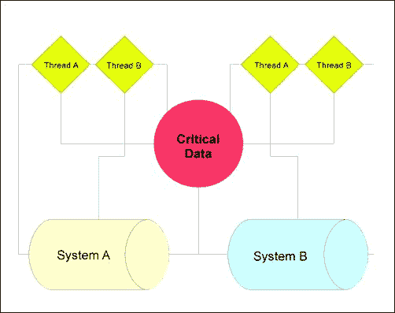
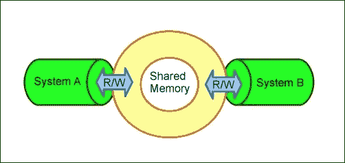
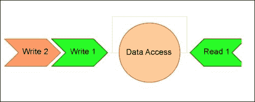
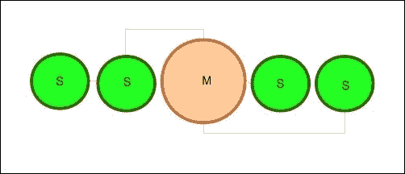
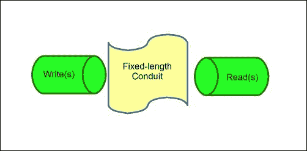
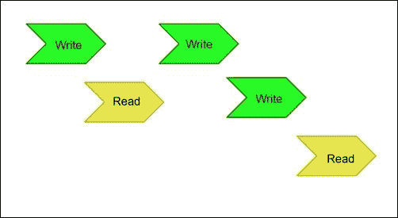

# 第四章 应用程序中的数据完整性

到目前为止，您应该已经熟悉了 Go 核心中提供的模型和工具，以提供大部分无竞争的并发。

现在我们可以轻松创建 goroutines 和通道，管理通道之间的基本通信，协调数据而不会出现竞争条件，并在出现这些条件时检测到。

然而，我们既不能管理更大的分布式系统，也不能处理潜在的较低级别的一致性问题。我们使用了基本和简单的互斥锁，但我们将要看一种更复杂和富有表现力的处理互斥排他的方法。

在本章结束时，您应该能够将上一章中的并发模式扩展到使用其他语言的多种并发模型和系统构建分布式系统。我们还将从高层次上看一些一致性模型，您可以利用这些模型来进一步表达您的单源和分布式应用程序的预编码策略。

# 深入了解互斥锁和同步

在第二章*理解并发模型*中，我们介绍了`sync.mutex`以及如何在代码中调用互斥锁，但在考虑包和互斥锁类型时还有一些微妙之处。

在理想的世界中，您应该能够仅使用 goroutines 来维护应用程序中的同步。实际上，这可能最好被描述为 Go 中的规范方法，尽管`sync`包提供了一些其他实用程序，包括互斥锁。

在可能的情况下，我们将坚持使用 goroutines 和通道来管理一致性，但互斥锁确实提供了一种更传统和细粒度的方法来锁定和访问数据。如果您曾经管理过另一种并发语言（或语言内的包），很可能您已经使用过互斥锁或类似的东西。在接下来的章节中，我们将探讨如何扩展和利用互斥锁，以便更多地发挥其作用。

如果我们查看`sync`包，我们会看到有几种不同的互斥锁结构。

第一个是`sync.mutex`，我们已经探讨过了，但另一个是`RWMutex`。`RWMutex`结构提供了多读单写锁。如果您希望允许对资源进行读取，但在尝试写入时提供类似互斥锁的锁定，这些锁可能很有用。当您期望函数或子进程频繁读取但很少写入时，它们可以最好地利用，但仍然不能承受脏读。

让我们看一个例子，每隔 10 秒更新一次日期/时间（获取锁定），然后每隔两秒输出当前值，如下面的代码所示：

```go
package main

import (
  "fmt"
  "sync"
  "time"
)

type TimeStruct struct {
  totalChanges int
  currentTime time.Time
  rwLock sync.RWMutex
}

var TimeElement TimeStruct

func updateTime() {
  TimeElement.rwLock.Lock()
  defer TimeElement.rwLock.Unlock()
  TimeElement.currentTime = time.Now()
  TimeElement.totalChanges++
}

func main() {

  var wg sync.WaitGroup

  TimeElement.totalChanges = 0
  TimeElement.currentTime = time.Now()
  timer := time.NewTicker(1 * time.Second)
  writeTimer := time.NewTicker(10 * time.Second)
  endTimer := make(chan bool)

  wg.Add(1)
  go func() {

    for {
      select {
      case <-timer.C:
        fmt.Println(TimeElement.totalChanges, 
          TimeElement.currentTime.String())
      case <-writeTimer.C:
        updateTime()
      case <-endTimer:
        timer.Stop()
        return
      }

    }

  }()

  wg.Wait()
  fmt.Println(TimeElement.currentTime.String())
}
```

### 注意

我们没有在`WaitGroup`结构上显式运行`Done()`，因此这将永久运行。

在`RWMutex`上执行锁定/解锁的两种不同方法：

+   `Lock()`: 这将阻止变量进行读取和写入，直到调用`Unlock()`方法

+   `happenedRlock()`: 这将仅为读取锁定绑定变量

第二种方法是我们用于此示例的方法，因为我们希望模拟真实世界的锁定。净效果是`interval`函数输出当前时间，然后在`rwLock`释放对`currentTime`变量的读取锁之前返回一个脏读。`Sleep()`方法仅用于给我们时间来观察锁定的运动。`RWLock`结构可以被多个读取者或单个写入者获取。

# goroutines 的成本

当你使用 goroutines 时，你可能会到达一个点，你会产生几十甚至几百个 goroutines，并且会想知道这是否会很昂贵。如果你之前的并发和/或并行编程经验主要是基于线程的，这是特别真实的。通常认为，维护线程及其各自的堆栈可能会导致程序性能问题。这有几个原因，如下所示：

+   为线程的创建需要内存

+   在操作系统级别进行上下文切换比进程内上下文切换更复杂和昂贵

+   很多时候，一个线程被创建用于处理本来可以以其他方式处理的非常小的进程

正因为这些原因，许多现代并发语言实现了类似 goroutines 的东西（C#使用 async 和 await 机制，Python 有 greenlets/green threads 等），这些机制使用小规模的上下文切换来模拟线程。

然而，值得知道的是，虽然 goroutines 是（或者可以是）廉价的，比操作系统线程更便宜，但它们并不是免费的。在大规模（也许是巨大规模）下，即使是廉价和轻量级的 goroutines 也会影响性能。这在我们开始研究分布式系统时尤为重要，因为这些系统通常规模更大，速度更快。

直接运行函数和在 goroutine 中运行函数之间的差异当然是可以忽略的。然而，要记住 Go 的文档中指出：

*在同一个地址空间中创建数十万个 goroutines 是实际可行的。*

考虑到每个 goroutine 使用几千字节的堆栈，现代环境中，很容易看出这可能被视为一个不重要的因素。然而，当你开始谈论成千上万（或者百万）个 goroutines 在运行时，它可能会影响任何给定子进程或函数的性能。你可以通过将函数包装在任意数量的 goroutines 中并对平均执行时间和——更重要的是——内存使用进行基准测试来测试这一点。每个 goroutine 大约占用 5KB 的内存，你可能会发现内存可能成为一个因素，特别是在低 RAM 的机器或实例上。如果你有一个在高性能机器上运行的应用程序，想象一下它在一个或多个低功率机器上达到临界点。考虑以下例子：

```go
for i:= 0; i < 1000000000; i++ {
  go someFunction()
}
```

即使 goroutine 的开销很小，但是当有 1 亿个或者——就像我们这里有的——10 亿个 goroutines 在运行时会发生什么？

正如以往一样，在一个利用多个核心的环境中进行这样的操作实际上可能会增加应用程序的开销，因为涉及到操作系统线程和随后的上下文切换的成本。

这些问题几乎总是在应用程序开始扩展之前是看不见的。在你的机器上运行是一回事，但在一个分布式系统中运行，尤其是在低功率应用服务器上运行，就是另一回事了。

性能和数据一致性之间的关系很重要，特别是当你开始使用大量的 goroutines 进行互斥、锁定或通道通信时。

当处理外部、更持久的内存来源时，这就成为一个更大的问题。

# 处理文件

文件是数据一致性问题的一个很好的例子，比如竞争条件可能导致更加持久和灾难性的问题。让我们看一个可能不断尝试更新文件的代码片段，看看我们可能会遇到竞争条件的地方，这反过来可能会导致更大的问题，比如应用程序失败或数据一致性丢失：

```go
package main

import(
  "fmt"
  "io/ioutil"
  "strconv"
  "sync"
)

func writeFile(i int) {

  rwLock.RLock();
  ioutil.WriteFile("test.txt", 
    []byte(strconv.FormatInt(int64(i),10)), 0x777)
  rwLock.RUnlock();

  writer<-true

}

var writer chan bool
var rwLock sync.RWMutex

func main() {

  writer = make(chan bool)

  for i:=0;i<10;i++ {
    go writeFile(i)
  }

  <-writer
  fmt.Println("Done!")
}
```

涉及文件操作的代码很容易出现这种潜在问题，因为错误通常*不是短暂的*，并且可能永远被固定在时间中。

如果我们的 goroutines 在某个关键点阻塞，或者应用程序在中途失败，我们可能会得到一个文件中包含无效数据的结果。在这种情况下，我们只是在一些数字中进行迭代，但您也可以将这种情况应用到涉及数据库或数据存储写入的情况——存在永久性的坏数据而不是临时的坏数据的潜在可能。

这不是仅通过通道或互斥来解决的问题；相反，它需要在每一步进行某种理智检查，以确保数据在执行的每一步中都在您和应用程序期望的位置。任何涉及`io.Writer`的操作都依赖于原语，Go 的文档明确指出我们不应该假设它们对并行执行是安全的。在这种情况下，我们已经在互斥体中包装了文件写入。

# 降低实现 C

在过去的十年或二十年中，语言设计中最有趣的发展之一是希望通过 API 实现低级语言和语言特性。Java 允许您纯粹在外部进行这样的操作，而 Python 提供了一个 C 库，用于在这两种语言之间进行交互。值得一提的是，这样做的原因各不相同——其中包括将 Go 的并发特性作为对遗留 C 代码的包装——您可能需要处理与引入非托管代码到垃圾收集应用程序相关的一些内存管理。

Go 采取了混合方法，允许您通过导入调用 C 接口，这需要一个前端编译器，比如 GCC：

```go
import "C"
```

那么我们为什么要这样做呢？

在你的项目中直接实现 C 有一些好的和坏的原因。一个好的原因可能是直接访问内联汇编，这在 C 中可以做到，但在 Go 中不能直接做到。一个坏的原因可能是任何一个在 Golang 本身中有解决方案的原因。

公平地说，即使是一个坏的原因，如果您构建应用程序可靠，也不是坏事，但它确实给可能使用您的代码的其他人增加了额外的复杂性。如果 Go 能满足技术和性能要求，最好在单个项目中使用单一语言。

C++的创造者 Bjarne Stroustrup 有一句著名的关于 C 和 C++的引语：

*C 使得自己开枪变得容易；C++使得更难，但当你这样做时，它会把你的整条腿都炸掉。*

开玩笑的时候（Stroustrup 有大量这样的笑话和引语），基本的推理是 C 的复杂性经常阻止人们意外地做出灾难性的事情。

正如 Stroustrup 所说，C 使犯大错变得容易，但由于语言设计，后果通常比高级语言要小。处理安全和稳定性问题很容易在任何低级语言中引入。

通过简化语言，C++提供了使低级操作更容易进行的抽象。您可以看到这可能如何应用于在 Go 中直接使用 C，鉴于后者语法上的甜美和程序员友好性。

也就是说，使用 C 可以突出显示关于内存、指针、死锁和一致性的潜在陷阱，所以我们将以一个简单的例子来说明：

```go
package main

// #include <stdio.h>
// #include <string.h>
//  int string_length (char* str) {
//    return strlen(str);
//  }
import "C"
import "fmt"
func main() {
  v := C.CString("Don't Forget My Memory Is Not Visible To Go!")
  x := C.string_length(v)
  fmt.Println("A C function has determined your string 
    is",x,"characters in length")
}
```

## 在 cgo 中触及内存

从前面的例子中最重要的收获是要记住，每当您进入或退出 C 时，您都需要手动管理内存（或者至少比仅使用 Go 更直接地管理）。如果您曾经在 C（或 C++）中工作过，您就会知道没有自动垃圾收集，所以如果您请求内存空间，您也必须释放它。从 Go 调用 C 并不排除这一点。

## cgo 的结构

将 C 导入 Go 将使您走上一个语法侧路，正如您可能在前面的代码中注意到的。最显眼的不同之处是在您的应用程序中实际实现 C 代码。

任何位于`import "C"`指令上方的代码（在注释中阻止 Go 编译器失败）将被解释为 C 代码。以下是一个在我们的 Go 代码上方声明的 C 函数的示例：

```go
/*
  int addition(int a, int b) {
    return a + b;
  }
```

请记住，Go 不会验证这一点，因此如果您在 C 代码中出现错误，可能会导致静默失败。

另一个相关的警告是记住您的语法。虽然 Go 和 C 有很多语法上的重叠，但如果少了一个花括号或一个分号，您很可能会发现自己处于其中一个静默失败的情况。或者，如果您在应用程序的 C 部分工作，然后回到 Go，您肯定会发现自己需要在循环表达式中加上括号，并在行尾加上分号。

还要记住，您经常需要处理 C 和 Go 之间没有一对一对应的类型转换。例如，C 没有内置的字符串类型（当然，您可以包含其他类型的库），因此您可能需要在字符串和 char 数组之间进行转换。同样，`int`和`int64`可能需要一些非隐式转换，而且在编译这些代码时，您可能无法获得您期望的调试反馈。

## 另一种方式

在 Go 中使用 C 显然是一个潜在的强大工具，用于代码迁移，实现低级代码，并吸引其他开发人员，但反过来呢？就像您可以从 Go 中调用 C 一样，您也可以在嵌入的 C 中将 Go 函数作为外部函数调用。

最终目标是能够在同一个应用程序中与 C 和 Go 一起工作。到目前为止，处理这个问题最简单的方法是使用 gccgo，它是 GCC 的前端。这与内置的 Go 编译器不同；当然，可以在 C 和 Go 之间来回切换，但使用 gccgo 可以使这个过程更简单。

**gopart.go**

以下是交互的 Go 部分的代码，C 部分将作为外部函数调用：

```go
package main

func MyGoFunction(num C.int) int {

  squared := num * num
  fmt.Println(num,"squared is",squared)
  return squared
}
```

**cpart.c**

现在是 C 部分的时间，我们在下面的代码片段中调用我们的 Go 应用程序的导出函数`MyGoFunction`。

```go
#include <stdio.h>

extern int square_it(int) __asm__ ("cross.main.MyGoFunction")

int main() {

  int output = square_it(5)
  printf("Output: %d",output)
  return 0;
}
```

**Makefile**

与直接在 Go 中使用 C 不同，目前，对反向操作需要使用 C 编译的 makefile。以下是一个您可以使用的示例，用于从之前的简单示例中获取可执行文件：

```go
all: main

main: cpart.o cpart.c
    gcc cpart.o cpart.c -o main

gopart.o: gopart.go
    gccgo -c gopart.go -o gopart.o -fgo-prefix=cross

clean:
    rm -f main *.o
```

在这里运行 makefile 应该会生成一个可执行文件，该文件调用了 C 中的函数。

然而，更根本的是，cgo 允许您直接将函数定义为 C 的外部函数：

```go
package output

import "C"

//export MyGoFunction
func MyGoFunction(num int) int {

  squared := num * num
  return squared
}
```

接下来，您需要直接使用`cgo`工具为 C 生成头文件，如下面的代码行所示：

```go
go tool cgo goback.go
```

此时，Go 函数可以在您的 C 应用程序中使用：

```go
#include <stdio.h>
#include "_obj/_cgo_export.h"

extern int MyGoFunction(int num);

int main() {

  int result = MyGoFunction(5);
  printf("Output: %d",result);
  return 0;

}
```

请注意，如果导出一个包含多个返回值的 Go 函数，它将在 C 中作为结构体而不是函数可用，因为 C 不提供从函数返回多个变量的功能。

此时，您可能意识到这种功能的真正力量是直接从现有的 C（甚至 C++）应用程序中与 Go 应用程序进行接口交互的能力。

虽然不一定是真正的 API，但现在您可以将 Go 应用程序视为 C 应用程序中的链接库，反之亦然。

关于使用`//export`指令的一个警告：如果这样做，您的 C 代码必须引用这些作为 extern 声明的函数。如您所知，当 C 应用程序需要从另一个链接的 C 文件中调用函数时，会使用 extern。

当以这种方式构建我们的 Go 代码时，cgo 会生成头文件`_cgo_export.h`，就像您之前看到的那样。如果您想查看该代码，它可以帮助您了解 Go 如何将编译的应用程序转换为 C 头文件以供此类用途使用：

```go
/* Created by cgo - DO NOT EDIT. */
#include "_cgo_export.h"

extern void crosscall2(void (*fn)(void *, int), void *, int);

extern void _cgoexp_d133c8d0d35b_MyGoFunction(void *, int);

GoInt64 MyGoFunction(GoInt p0)
{
  struct {
    GoInt p0;
    GoInt64 r0;
  } __attribute__((packed)) a;
  a.p0 = p0;
  crosscall2(_cgoexp_d133c8d0d35b_MyGoFunction, &a, 16);
  return a.r0;
}
```

你可能也会遇到一个罕见的情况，即 C 代码不完全符合你的期望，你无法诱使编译器产生你期望的结果。在这种情况下，你可以在编译 C 应用程序之前自由修改头文件，尽管会有“请勿编辑”的警告。

### 进一步降低 - 在 Go 中进行汇编

如果你可以用 C 射击自己的脚，用 C++炸掉自己的腿，那么想象一下你在 Go 中使用汇编可以做些什么。

在 Go 中直接使用汇编是不可能的，但是由于 Go 直接提供对 C 的访问，而 C 提供了调用内联汇编的能力，你可以间接地在 Go 中使用它。

但同样，仅仅因为某件事是可能的，并不意味着应该这样做——如果你发现自己需要在 Go 中使用汇编，你应该考虑直接使用汇编，并通过 API 连接。

在使用汇编语言（首先是在 C 中，然后是在 Go 中）时，你可能会遇到许多障碍，其中之一就是缺乏可移植性。编写内联 C 是一回事——你的代码应该在处理器指令集和操作系统之间相对可移植——但是汇编显然需要很多具体性。

尽管如此，当你考虑是否需要在 Go 应用程序中直接使用 C 或汇编时，最好还是有自毁的选择，无论你选择射击与否。在考虑是否需要 C 或汇编直接在你的 Go 应用程序中时，一定要非常小心。如果你可以通过 API 或进程间通道在不协调的进程之间进行通信，总是首选这种方式。

在 Go 中（或独立使用或在 C 中）使用汇编的一个非常明显的缺点是，你失去了 Go 提供的交叉编译能力，因此你必须为每个目标 CPU 架构修改你的代码。因此，使用 Go 在 C 中的唯一实际时机是当你的应用程序应该在单个平台上运行时。

这是一个 ASM-in-C-in-Go 应用程序的示例。请记住，我们没有包含 ASM 代码，因为它因处理器类型而异。在以下的`__asm__`部分尝试一些样板汇编：

```go
package main

/*
#include <stdio.h>

void asmCall() {

__asm__( "" );
    printf("I come from a %s","C function with embedded asm\n");

}
*/
import "C"

func main() {

    C.asmCall()

}
```

如果没有其他办法，即使你对汇编和 C 本身都不熟悉，这可能也会为你提供一个深入研究 ASM 的途径。你认为 C 和 Go 越高级，你可能会看到这一点越实际。

对于大多数用途来说，Go（当然还有 C）的层次足够低，可以在不使用汇编的情况下解决任何性能问题。值得再次注意的是，当你调用 C 应用程序时，虽然你失去了对 Go 中内存和指针的一些直接控制，但是在调用汇编时，这个警告适用十倍。Go 提供的所有这些巧妙的工具可能无法可靠地工作，或者根本无法工作。如果你考虑 Go 竞争检测器，可以考虑以下应用程序：

```go
package main

/*
int increment(int i) {
  i++;
  return i;
}
*/
import "C"
import "fmt"

var myNumber int

func main() {
  fmt.Println(myNumber)

  for i:=0;i<100;i++ {
    myNumber = int( C.increment(C.int(myNumber)) )
    fmt.Println(myNumber)
  }

}
```

你可以看到，在 Go 和 C 之间抛来抛去指针可能会让你在程序没有得到你期望的结果时一筹莫展。

请记住，在这里使用 goroutines 与 cgo 有一个有点独特且可能意想不到的地方；它们默认被视为阻塞。这并不是说你不能在 C 中管理并发，但这不会默认发生。相反，Go 可能会启动另一个系统线程。你可以通过利用运行时函数`runtime.LockOSThread()`在一定程度上管理这一点。使用`LockOSThread`告诉 Go 特定的 goroutine 应该留在当前线程中，直到调用`runtime.UnlockOSThread()`之前，没有其他并发的 goroutine 可以使用这个线程。

这取决于直接调用 C 或 C 库的必要性；一些库将愉快地作为新线程被创建，而另一些可能会导致段错误。

### 注意

在你的 Go 代码中，另一个有用的运行时调用是`NumGcoCall()`。它返回当前进程所做的 cgo 调用次数。如果你需要锁定和解锁线程，你也可以使用它来构建一个内部队列报告，以检测和防止死锁。

这并不排除如果您选择在 goroutines 中混合使用 Go 和 C 时可能会发生竞争条件的可能性。

当然，C 本身有一些可用的竞争检测工具。Go 的竞争检测器本身是基于`ThreadSanitizer`库的。毋庸置疑，您可能不希望在单个项目中使用几个完成相同任务的工具。

# 分布式 Go

到目前为止，我们已经谈了很多关于在单个机器内管理数据的内容，尽管有一个或多个核心。这已经足够复杂了。防止竞争条件和死锁本来就很困难，但是当您引入更多的机器（虚拟或真实）时会发生什么？

首先应该想到的是，您可以放弃 Go 提供的许多固有工具，而且在很大程度上是真的。您可以基本上保证 Go 可以处理其自己的、单一的 goroutines 和通道内的数据的内部锁定和解锁，但是如果有一个或多个额外的应用程序实例在运行呢？考虑以下模型：



在这里，我们看到这两个进程中的任何一个线程都可能在任何给定时间点从我们的**关键数据**中读取或写入。考虑到这一点，存在协调对该数据的访问的需要。

在非常高的层面上，有两种直接的策略来处理这个问题，分布式锁或一致性哈希表（一致性哈希）。

第一种策略是互斥的扩展，只是我们没有直接和共享访问相同的地址空间，所以我们需要创建一个抽象。换句话说，我们的工作是设计一个对所有可用的外部实体可见的锁机制。

第二种策略是一种专门设计用于缓存和缓存验证/失效的模式，但它在这里也具有相关性，因为您可以使用它来管理数据在更全局的地址空间中的位置。

然而，当涉及确保这些系统之间的一致性时，我们需要比这种一般的高层方法更深入。

将这个模型一分为二就变得容易了：通道将处理数据和数据结构的并发流动，而在它们不处理的地方，您可以使用互斥锁或低级原子性来添加额外的保障。

然而，看向右边。现在你有另一个 VM/实例或机器试图处理相同的数据。我们如何确保我们不会遇到读者/写者问题？

# 一些常见的一致性模型

幸运的是，我们有一些非核心的 Go 解决方案和策略，可以帮助我们提高控制数据一致性的能力。

让我们简要地看一下我们可以使用的一些一致性模型来管理分布式系统中的数据。

## 分布式共享内存

**分布式共享内存**（**DSM**）系统本身并不固有地防止竞争条件，因为它只是一种多个系统共享实际或分区内存的方法。

实质上，您可以想象两个具有 1GB 内存的系统，每个系统将 500MB 分配给一个可由每个系统访问和写入的共享内存空间。脏读是可能的，竞争条件也是可能的，除非明确设计。以下图表示了两个系统如何使用共享内存进行协调的视觉表示：



我们很快将看一下 DSM 的一个著名但简单的例子，并使用 Go 可用的库进行测试。

## 先进先出 - PRAM

**流水线 RAM**（**PRAM**）一致性是一种先进先出的方法，其中数据可以按照排队写入的顺序读取。这意味着任何给定的、独立的进程读取的写入可能是不同的。以下图表示了这个概念：



## 看看主从模型

主从一致性模型与我们即将看到的领导者/追随者模型类似，只是主服务器管理数据和广播的所有操作，而不是从追随者接收写操作。在这种情况下，复制是从主服务器到从服务器传输数据更改的主要方法。在下图中，您将找到一个具有主服务器和四个从服务器的主从模型的表示：



虽然我们可以简单地在 Go 中复制这个模型，但我们有更优雅的解决方案可供选择。

## 生产者-消费者问题

在经典的生产者-消费者问题中，生产者将数据块写入到传送带/缓冲区，而消费者读取数据块。问题出现在缓冲区满时：如果生产者添加到堆栈，读取的数据将不是您想要的。为了避免这种情况，我们使用了带有等待和信号的通道。这个模型看起来有点像下面的图：



如果您正在寻找 Go 中的信号量实现，那么并没有显式使用信号量。但是，想想这里的语言——具有等待和信号的固定大小通道；听起来像是一个缓冲通道。事实上，通过在 Go 中提供一个缓冲通道，您为这里的传送带提供了一个明确的长度；通道机制为您提供了等待和信号的通信。这已经纳入了 Go 的并发模型中。让我们快速看一下下面的代码中所示的生产者-消费者模型。

```go
package main

import(
  "fmt"
)

var comm = make(chan bool)
var done = make(chan bool)

func producer() {
  for i:=0; i< 10; i++ {
    comm <- true
  }
  done <- true
}
func consumer() {
  for {
    communication := <-comm
    fmt.Println("Communication from producer 
      received!",communication)
  }
}

func main() {
  go producer()
  go consumer()
  <- done
  fmt.Println("All Done!")
}
```

## 查看领导者-追随者模型

在领导者/追随者模型中，写操作从单一源广播到任何追随者。写操作可以通过任意数量的追随者传递，也可以限制在单个追随者。任何完成的写操作然后被广播到追随者。这可以在以下图中进行可视化表示：


我们在 Go 中也可以看到一个通道的类比。我们可以利用一个单一通道来处理对其他追随者的广播。

## 原子一致性/互斥

我们已经非常详细地研究了原子一致性。它确保任何不是在基本上同时创建和使用的东西都需要串行化，以确保最强形式的一致性。如果一个值或数据集不是原子性的，我们总是可以使用互斥锁来强制对该数据进行线性化。

串行或顺序一致性本质上是强大的，但也可能导致性能问题和并发性的降低。

原子一致性通常被认为是确保一致性的最强形式。

## 发布一致性

发布一致性模型是一种 DSM 变体，可以延迟写操作的修改，直到第一次从读者那里获取。这被称为延迟发布一致性。我们可以在以下序列化模型中可视化延迟发布一致性：



这个模型以及急切的发布一致性模型都需要在满足某些条件时宣布发布（正如其名称所示）。在急切模型中，该条件要求写操作将以一致的方式被所有读取进程读取。

在 Go 中，存在替代方案，但如果您有兴趣尝试，也有相关的软件包。

# 使用 memcached

如果您不熟悉 memcache(d)，它是一种管理分布式系统中数据的美妙而显而易见的方式。Go 的内置通道和 goroutines 非常适合管理单台机器进程中的通信和数据完整性，但它们都不是为分布式系统而设计的。

正如其名称所示，Memcached 允许在多个实例或机器之间共享内存数据。最初，memcached 旨在存储数据以便快速检索。这对于具有高周转率的系统（如 Web 应用程序）缓存数据很有用，但也是一种轻松地在多个服务器之间共享数据和利用共享锁机制的好方法。

在我们之前的模型中，memcached 属于 DSM。所有可用和调用的实例在各自的内存中共享一个公共的镜像内存空间。

值得指出的是，memcached 中确实存在竞争条件，你仍然需要一种处理的方法。Memcached 提供了一种在分布式系统中共享数据的方法，但并不保证数据的原子性。相反，memcached 采用以下两种方法之一来使缓存数据失效：

+   数据被明确分配了一个最大年龄（之后，它将从堆栈中删除）

+   或者由于新数据使用了所有可用内存而导致数据从堆栈中被推出

值得注意的是，memcache(d) 中的存储显然是短暂的，而且不具有容错能力，因此它只能在不会导致关键应用程序故障的情况下使用。

在满足这两个条件之一的时候，数据会消失，对该数据的下一次调用将失败，这意味着需要重新生成数据。当然，你可以使用一些复杂的锁生成方法来使 memcached 以一致的方式运行，尽管这不是 memcached 本身的标准内置功能。让我们通过使用 Brad Fitz 的 gomemcache 接口 ([`github.com/bradfitz/gomemcache`](https://github.com/bradfitz/gomemcache)) 在 Go 中快速看一下 memcached 的一个例子：

```go
package main

import (
  "github.com/bradfitz/gomemcache/memcache"
  "fmt"
)

func main() {
     mC := memcache.New("10.0.0.1:11211", "10.0.0.2:11211", 
       "10.0.0.3:11211", "10.0.0.4:11211")
     mC.Set(&memcache.Item{Key: "data", Value: []byte("30") })

     dataItem, err := mc.Get("data")
}
```

正如你可能从前面的例子中注意到的，如果任何这些 memcached 客户端同时写入共享内存，仍然可能存在竞争条件。

关键数据可以存在于任何已连接并同时运行 memcached 的客户端中。

任何客户端也可以在任何时候取消或覆盖数据。

与许多实现不同，你可以通过 memcached 设置一些更复杂的类型，比如结构体，假设它们已经被序列化。这个警告意味着我们在直接共享数据方面受到了一定的限制。显然，我们无法使用指针作为内存位置会因客户端而异。

处理数据一致性的一种方法是设计一个主从系统，其中只有一个节点负责写入，而其他客户端通过键的存在来监听更改。

我们可以利用之前提到的任何其他模型来严格管理这些数据的锁，尽管这可能会变得特别复杂。在下一章中，我们将探讨一些构建分布式互斥系统的方法，但现在，我们简要地看一下另一种选择。

## 电路

最近出现的一个处理分布式并发的第三方库是 Petar Maymounkov 的 Go' circuit。Go' circuit 试图通过为一个或多个远程 goroutine 分配通道来促进分布式协程。

Go' circuit 最酷的部分是，只需包含该包就可以使你的应用程序准备好监听和操作远程 goroutine，并处理与它们相关联的通道。

Go' circuit 在 Tumblr 中使用，这证明它作为一个大规模和相对成熟的解决方案平台具有一定的可行性。

### 注意

Go' circuit 可以在 [`github.com/gocircuit/circuit`](https://github.com/gocircuit/circuit) 找到。

安装 Go' circuit 并不简单——你不能简单地运行 `go get`，它需要 Apache Zookeeper 并且需要从头构建工具包。

一旦完成，就可以相对简单地让两台机器（或者在本地运行时的两个进程）运行 Go 代码来共享一个通道。这个系统中的每个齿轮都属于发送者或监听者类别，就像 goroutines 一样。鉴于我们在这里谈论的是网络资源，语法与一些微小的修改是熟悉的：

```go
homeChannel := make(chan bool)

circuit.Spawn("etphonehome.example.com",func() {
  homeChannel <- true
})

for {
  select {
    case response := <- homeChannel:
      fmt.Print("E.T. has phoned home with:",response)

  }
}
```

您可以看到，这可能会使不同机器之间共享相同数据的通信变得更加清晰，而我们主要使用 memcached 作为网络内存锁定系统。在这里，我们直接处理原生的 Go 代码；我们有能力像在通道中一样使用电路，而不必担心引入新的数据管理或原子性问题。事实上，电路本身就是建立在一个 goroutine 之上的。

当然，这也引入了一些额外的管理问题，主要是关于了解远程机器的情况，它们是否活跃，更新机器的状态等等。这些问题最适合由 Apache Zookeeper 这样的套件来处理分布式资源的协调。值得注意的是，您应该能够从远程机器向主机产生一些反馈：电路通过无密码 SSH 运行。

这也意味着您可能需要确保用户权限被锁定，并且符合您可能已经制定的安全策略。

### 注意

您可以在[`zookeeper.apache.org/`](http://zookeeper.apache.org/)找到 Apache Zookeeper。

# 总结

现在，我们已经掌握了一些方法和模型，不仅可以管理单个或多线程系统中的本地数据，还可以管理分布式系统，您应该开始感到对保护并发和并行进程中数据的有效性相当自信。

我们已经研究了读和读/写锁的两种互斥形式，并开始将其应用于分布式系统，以防止在多个网络系统中出现阻塞和竞争条件。

在下一章中，我们将更深入地探讨这些排除和数据一致性概念，构建非阻塞的网络应用程序，并学习如何处理超时并深入研究通道的并行性。

我们还将更深入地研究 sync 和 OS 包，特别是查看`sync.atomic`操作。
