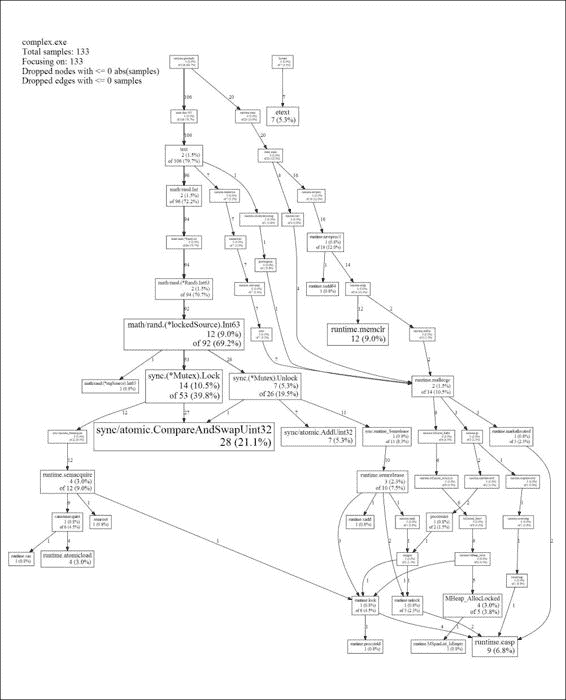
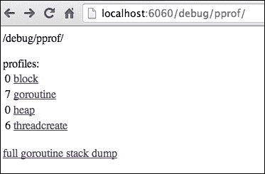

# 第五章。锁，块和更好的通道

现在我们开始对安全和一致地利用 goroutines 有了很好的把握，是时候更深入地了解是什么导致了代码的阻塞和死锁。让我们也探索一下`sync`包，并深入一些分析和分析。

到目前为止，我们已经构建了一些相对基本的 goroutines 和互补的通道，但现在我们需要在 goroutines 之间利用一些更复杂的通信通道。为了做到这一点，我们将实现更多的自定义数据类型，并直接应用它们到通道中。

我们还没有看过 Go 的一些用于同步和分析的低级工具，因此我们将探索`sync.atomic`，这是一个包，它与`sync.Mutex`一起允许更细粒度地控制状态。

最后，我们将深入研究 pprof，这是 Go 提供的一个神奇的工具，它让我们分析我们的二进制文件，以获取有关我们的 goroutines、线程、整体堆和阻塞概况的详细信息。

凭借一些新的工具和方法来测试和分析我们的代码，我们将准备好生成一个强大的，高度可扩展的 Web 服务器，可以安全快速地处理任何数量的流量。

# 了解 Go 中的阻塞方法

到目前为止，通过我们的探索和示例，我们已经遇到了一些阻塞代码的片段，有意的和无意的。在这一点上，看看我们可以引入（或无意中成为）阻塞代码的各种方式是明智的。

通过观察 Go 代码被阻塞的各种方式，我们也可以更好地准备调试并发在我们的应用程序中未按预期运行的情况。

## 阻塞方法 1-一个监听，等待的通道

阻塞代码的最具并发性的方法是通过让一个串行通道监听一个或多个 goroutines。到目前为止，我们已经看到了几次，但基本概念如下代码片段所示：

```go
func thinkAboutKeys() {
  for {
    fmt.Println("Still Thinking")
    time.Sleep(1 * time.Second)
  }
}

func main() {
  fmt.Println("Where did I leave my keys?")

  blockChannel := make(chan int)
  go thinkAboutKeys()

  <-blockChannel

  fmt.Println("OK I found them!")
}
```

尽管我们所有的循环代码都是并发的，但我们正在等待一个信号，以便我们的`blockChannel`继续线性执行。当然，我们可以通过发送通道来看到这一点，从而继续代码执行，如下面的代码片段所示：

```go
func thinkAboutKeys(bC chan int) {
  i := 0
  max := 10
  for {
    if i >= max {
      bC <- 1
    }
    fmt.Println("Still Thinking")
    time.Sleep(1 * time.Second)
    i++
  }
}
```

在这里，我们修改了我们的 goroutine 函数，以接受我们的阻塞通道，并在达到最大值时向其发送结束消息。这些机制对于长时间运行的进程非常重要，因为我们可能需要知道何时以及如何终止它们。

### 通过通道发送更多的数据类型

Go 使用通道（结构和函数）作为一流公民，为我们提供了许多有趣的执行方式，或者至少尝试新的通道之间通信方式的方法。

一个这样的例子是创建一个通过函数本身处理翻译的通道，而不是通过标准语法直接进行通信，通道执行其函数。您甚至可以在单个函数中对它们进行迭代的函数的切片/数组上执行此操作。

#### 创建一个函数通道

到目前为止，我们几乎完全是在单一数据类型和单一值通道中工作。因此，让我们尝试通过通道发送一个函数。有了一流的通道，我们不需要抽象来做到这一点；我们可以直接通过通道发送几乎任何东西，如下面的代码片段所示：

```go
func abstractListener(fxChan chan func() string ) {

  fxChan <- func() string {

    return "Sent!"
  }
}

func main() {

  fxChan := make (chan func() string)
  defer close(fxChan)
  go abstractListener(fxChan)
  select {
    case rfx := <- fxChan:
    msg := rfx()
    fmt.Println(msg)      
    fmt.Println("Received!")

  }

}
```

这就像一个回调函数。然而，它也是本质上不同的，因为它不仅是在函数执行后调用的方法，而且还作为函数之间的通信方式。

请记住，通常有替代方法可以通过通道传递函数，因此这可能是一个非常特定于用例而不是一般实践的东西。

由于通道的类型可以是几乎任何可用类型，这种功能性打开了一系列可能令人困惑的抽象。作为通道类型的结构或接口是相当不言自明的，因为您可以对其定义的任何属性做出与应用程序相关的决策。

让我们在下一节中看一个使用接口的例子。

#### 使用接口通道

与我们的函数通道一样，能够通过通道传递接口（这是一种补充的数据类型）可能非常有用。让我们看一个通过接口发送的例子：

```go
type Messenger interface {
  Relay() string
}

type Message struct {
  status string
}

func (m Message) Relay() string {
  return m.status
}

func alertMessages(v chan Messenger, i int) {
  m := new(Message)
  m.status = "Done with " + strconv.FormatInt(int64(i),10)
  v <- m
}

func main () {

  msg := make(chan Messenger)

  for i:= 0; i < 10; i++ {
    go alertMessages(msg,i)
  }

  select {
    case message := <-msg:
      fmt.Println (message.Relay())
  }
  <- msg
}
```

这是如何利用接口作为通道的一个非常基本的例子；在前面的例子中，接口本身在很大程度上是装饰性的。实际上，我们通过接口的通道传递新创建的消息类型，而不是直接与接口交互。

#### 使用结构体、接口和更复杂的通道

为我们的通道创建一个自定义类型，可以让我们决定我们的通道内部通信的方式，同时让 Go 决定上下文切换和幕后调度。

最终，这主要是一个设计考虑。在前面的例子中，我们使用单独的通道来处理特定的通信片段，而不是使用一个通道来传递大量的数据。然而，您可能还会发现使用单个通道来处理 goroutines 和其他通道之间的大量通信是有利的。

决定是否将通道分隔为单独的通信片段或通信包的主要考虑因素取决于每个通道的总体可变性。

例如，如果您总是想要发送一个计数器以及一个函数或字符串，并且它们在数据一致性方面总是成对出现，这样的方法可能是有意义的。如果其中任何组件在途中失去同步，保持每个片段独立更合乎逻辑。

### 注

**Go 中的映射**

如前所述，Go 中的映射就像其他地方的哈希表，与切片或数组密切相关。

在上一个例子中，我们正在检查用户名/密钥是否已经存在；为此，Go 提供了一个简单的方法。当尝试检索一个不存在的键的哈希时，会返回一个零值，如下面的代码所示：

```go
if Users[user.name] {
  fmt.Fprintln(conn, "Unfortunately, that username is in use!");
}
```

这使得对映射及其键进行语法上的简单和清晰的测试。

Go 中映射的最佳特性之一是能够使用任何可比较类型作为键，包括字符串、整数、布尔值以及任何仅由这些类型组成的映射、结构体、切片或通道。

这种一对多的通道可以作为主从或广播-订阅模型。我们将有一个通道监听消息并将其路由到适当的用户，以及一个通道监听广播消息并将其排队到所有用户。

为了最好地演示这一点，我们将创建一个简单的多用户聊天系统，允许 Twitter 风格的`@user`通信与单个用户，具有向所有用户广播标准消息的能力，并创建一个可以被所有用户阅读的通用广播聊天记录。这两者都将是简单的自定义类型结构体通道，因此我们可以区分各种通信片段。

### 注

**Go 中的结构体**

作为一种一流、匿名和可扩展的类型，结构体是最多才和有用的数据结构之一。它很容易创建类似于数据库和数据存储的模拟，虽然我们不愿称它们为对象，但它们确实可以被视为对象。

就结构体在函数中的使用而言，一个经验法则是，如果结构体特别复杂，应该通过引用而不是值来传递。澄清的两点如下：

+   引用在引号中是因为（这是 Go 的 FAQ 所验证的）从技术上讲，Go 中的一切都是按值传递的。这意味着虽然指针的引用仍然存在，但在过程的某个步骤中，值被复制了。

+   “特别复杂”是可以理解的，所以个人判断可能会起作用。然而，我们可以认为一个简单的结构体最多有五个方法或属性。

你可以把这个想象成一个帮助台系统，虽然在当今，我们不太可能为这样的事情创建一个命令行界面，但是避开 Web 部分让我们忽略了所有与 Go 不相关的客户端代码。

你当然可以拿这样的例子并将其推广到利用一些前端库进行 Web 的异步功能（比如`backbone.js`或`socket.io`）。

为了实现这一点，我们需要创建一个客户端和一个服务器应用程序，并尽量保持每个应用程序尽可能简单。你可以清楚简单地扩展这个功能，包括任何你认为合适的功能，比如进行 Git 评论和更新网站。

我们将从服务器开始，这将是最复杂的部分。客户端应用程序将主要通过套接字接收消息，因此大部分的读取和路由逻辑对于客户端来说是不可见的。

### net 包 - 一个带有接口通道的聊天服务器

在这里，我们需要引入一个相关的包，这个包将被需要来处理我们应用程序的大部分通信。我们在 SVG 输出生成示例中稍微涉及了一下`net`包，以展示并发性 - `net`/`http`只是更广泛、更复杂和更功能丰富的包的一小部分。

我们将使用的基本组件将是 TCP 监听器（服务器）和 TCP 拨号器（客户端）。让我们来看看这些基本设置。

**服务器**

在 TCP 端口上监听不能更简单。只需启动`net.Listen()`方法并处理错误，如下面的代码所示：

```go
  listener, err := net.Listen("tcp", ":9000")
  if err != nil {
    fmt.Println ("Could not start server!")
  }
```

如果启动服务器时出现错误，请检查防火墙或修改端口 - 可能有某些东西正在使用您系统上的端口 9000。

就像这样简单，我们的客户端/拨号器端也是一样简单的。

**客户端**

在这种情况下，我们在 localhost 上运行所有内容，如下面的代码所示。然而，在实际应用中，我们可能会在这里使用一个内部网地址：

```go
  conn, err := net.Dial("tcp","127.0.0.1:9000")
  if err != nil {
    fmt.Println("Could not connect to server!")
  }
```

在这个应用程序中，我们演示了处理未知长度的字节缓冲区的两种不同方法。第一种是使用`strings.TrimRight()`来修剪字符串的相当粗糙的方法。这种方法允许您定义您不感兴趣的字符作为输入的一部分，如下面的代码所示。大多数情况下，这是我们可以假设是缓冲区长度的未使用部分的空白字符。

```go
sendMessage := []byte(cM.name + ": " + 
  strings.TrimRight(string(buf)," \t\r\n"))
```

以这种方式处理字符串通常既不优雅又不可靠。如果我们在这里得到了意料之外的东西会发生什么？字符串将是缓冲区的长度，在这种情况下是 140 个字节。

我们处理这个的另一种方式是直接使用缓冲区的末尾。在这种情况下，我们将`n`变量分配给`conn.Read()`函数，然后可以将其用作字符串到缓冲区转换中的缓冲区长度，如下面的代码所示：

```go
messBuff := make([]byte,1024)
n, err := conn.Read(messBuff)
if err != nil {

}
message := string(messBuff[:n])
```

在这里，我们正在接收消息缓冲区的前`n`个字节。

这更加可靠和高效，但你肯定会遇到文本摄入案例，你会想要删除某些字符以创建更清洁的输入。

这个应用程序中的每个连接都是一个结构，每个用户也是如此。当他们加入时，我们通过将他们推送到`Users`切片来跟踪我们的用户。

所选的用户名是一个命令行参数，如下所示：

```go
./chat-client nathan
chat-client.exe nathan

```

我们不检查以确保只有一个用户使用该名称，因此可能需要该逻辑，特别是如果包含敏感信息的直接消息。

#### 处理直接消息

大多数情况下，这个聊天客户端是一个简单的回声服务器，但正如前面提到的，我们还包括了通过调用 Twitter 风格的`@`语法来进行非全局广播消息的功能。

我们主要通过正则表达式来处理这个问题，如果消息匹配`@user`，那么只有该用户会看到消息；否则，消息将广播给所有人。这有点不够优雅，因为直接消息的发送者如果用户名与用户的预期名称不匹配，将看不到自己的直接消息。

为了做到这一点，我们在广播之前将每条消息都通过`evalMessageRecipient（）`函数。由于这依赖于用户输入来创建正则表达式（以用户名的形式），请注意我们应该使用`regexp.QuoteMeta（）`方法来转义这些内容，以防止正则表达式失败。

让我们首先检查一下我们的聊天服务器，它负责维护所有连接并将它们传递给 goroutine 来监听和接收，如下所示：

```go
chat-server.go
package main

import
(
  "fmt"
  "strings"
  "net"
  "strconv"
  "regexp"
)

var connectionCount int
var messagePool chan(string)

const (
  INPUT_BUFFER_LENGTH = 140
)
```

我们使用了最大字符缓冲区。这将限制我们的聊天消息不超过 140 个字符。让我们看看我们的`User`结构，以了解有关加入用户的信息，如下所示：

```go
type User struct {
  Name string
  ID int
  Initiated bool
```

initiated 变量告诉我们，在连接和公告之后，`User`已连接。让我们检查以下代码，以了解我们如何监听已登录用户的通道：

```go
  UChannel chan []byte
  Connection *net.Conn
}
The User struct contains all of the information we will maintain 
  for each connection. Keep in mind here we don't do any sanity 
  checking to make sure a user doesn't exist – this doesn't 
  necessarily pose a problem in an example, but a real chat client 
  would benefit from a response should a user name already be 
  in use.

func (u *User) Listen() {
  fmt.Println("Listening for",u.Name)
  for {
    select {
      case msg := <- u.UChannel:
        fmt.Println("Sending new message to",u.Name)
        fmt.Fprintln(*u.Connection,string(msg))

    }
  }
}
```

这是我们服务器的核心：每个“用户”都有自己的“Listen（）”方法，该方法维护`User`结构的通道并在其间发送和接收消息。简单地说，每个用户都有自己的并发通道。让我们看一下以下代码中的`ConnectionManager`结构和创建服务器的“Initiate（）”函数：

```go
type ConnectionManager struct {
  name      string
  initiated bool
}

func Initiate() *ConnectionManager {
  cM := &ConnectionManager{
    name:      "Chat Server 1.0",
    initiated: false,
  }

  return cM
}
```

我们的`ConnectionManager`结构只初始化一次。这设置了一些相对装饰的属性，其中一些可以在请求或聊天登录时返回。我们将检查`evalMessageRecipient`函数，该函数试图粗略地确定任何发送的消息的预期接收者，如下所示：

```go
func evalMessageRecipient(msg []byte, uName string) bool {
  eval := true
  expression := "@"
  re, err := regexp.MatchString(expression, string(msg))
  if err != nil {
    fmt.Println("Error:", err)
  }
  if re == true {
    eval = false
    pmExpression := "@" + uName
    pmRe, pmErr := regexp.MatchString(pmExpression, string(msg))
    if pmErr != nil {
      fmt.Println("Regex error", err)
    }
    if pmRe == true {
      eval = true
    }
  }
  return eval
}
```

这是我们的路由器，它从字符串中获取`@`部分，并用它来检测一个预期的接收者，以便隐藏不被公开。如果用户不存在或已离开聊天室，我们不会返回错误。

### 注意

使用`regexp`包的正则表达式格式依赖于`re2`语法，该语法在[`code.google.com/p/re2/wiki/Syntax`](https://code.google.com/p/re2/wiki/Syntax)中有描述。

让我们看一下`ConnectionManager`结构的“Listen（）”方法的代码：

```go
func (cM *ConnectionManager) Listen(listener net.Listener) {
  fmt.Println(cM.name, "Started")
  for {

    conn, err := listener.Accept()
    if err != nil {
      fmt.Println("Connection error", err)
    }
    connectionCount++
    fmt.Println(conn.RemoteAddr(), "connected")
    user := User{Name: "anonymous", ID: 0, Initiated: false}
    Users = append(Users, &user)
    for _, u := range Users {
      fmt.Println("User online", u.Name)
    }
    fmt.Println(connectionCount, "connections active")
    go cM.messageReady(conn, &user)
  }
}

func (cM *ConnectionManager) messageReady(conn net.Conn, user 
  *User) {
  uChan := make(chan []byte)

  for {

    buf := make([]byte, INPUT_BUFFER_LENGTH)
    n, err := conn.Read(buf)
    if err != nil {
      conn.Close()
      conn = nil
    }
    if n == 0 {
      conn.Close()
      conn = nil
    }
    fmt.Println(n, "character message from user", user.Name)
    if user.Initiated == false {
      fmt.Println("New User is", string(buf))
      user.Initiated = true
      user.UChannel = uChan
      user.Name = string(buf[:n])
      user.Connection = &conn
      go user.Listen()

      minusYouCount := strconv.FormatInt(int64(connectionCount-1), 
        10)
      conn.Write([]byte("Welcome to the chat, " + user.Name + ", 
        there are " + minusYouCount + " other users"))

    } else {

      sendMessage := []byte(user.Name + ": " + 
        strings.TrimRight(string(buf), " \t\r\n"))

      for _, u := range Users {
        if evalMessageRecipient(sendMessage, u.Name) == true {
          u.UChannel <- sendMessage
        }

      }

    }

  }
}geReady (per connectionManager) function instantiates new 
  connections into a User struct, utilizing first sent message as 
  the user's name.

var Users []*User
This is our unbuffered array (or slice) of user structs.
func main() {
  connectionCount = 0
  serverClosed := make(chan bool)

  listener, err := net.Listen("tcp", ":9000")
  if err != nil {
    fmt.Println ("Could not start server!",err)
  }

  connManage := Initiate()  
  go connManage.Listen(listener)

  <-serverClosed
}
```

正如预期的那样，`main（）`主要处理连接和错误，并使用`serverClosed`通道保持我们的服务器开放和非阻塞。

我们可以采用许多方法来改进消息路由的方式。第一种方法是调用绑定到用户名的映射（或哈希表）。如果映射的键存在，我们可以返回一些错误功能，如果用户已经存在，如下面的代码片段所示：

```go
type User struct {
  name string
}
var Users map[string] *User

func main() {
  Users := make(map[string] *User)
}
```

## 检查我们的客户端

我们的客户端应用程序相对简单，主要是因为我们不太关心阻塞代码。

虽然我们有两个并发操作（等待消息和等待用户输入以发送消息），但这比我们的服务器要简单得多，后者需要同时监听每个创建的用户并分发发送的消息。

现在让我们将我们的聊天客户端与我们的聊天服务器进行比较。显然，客户端对连接和用户的整体维护要少得多，因此我们不需要使用那么多的通道。让我们看看我们的聊天客户端的代码：

```go
chat-client.go
package main

import
(
  "fmt"
  "net"
  "os"
  "bufio"
  "strings"
)
type Message struct {
  message string
  user string
}

var recvBuffer [140]byte

func listen(conn net.Conn) {
  for {

      messBuff := make([]byte,1024)
      n, err := conn.Read(messBuff)
      if err != nil {
        fmt.Println("Read error",err)
      }
      message := string(messBuff[:n])
      message = message[0:]

      fmt.Println(strings.TrimSpace(message))
      fmt.Print("> ")
  }

}

func talk(conn net.Conn, mS chan Message) {

      for {
      command := bufio.NewReader(os.Stdin)
        fmt.Print("> ")        
                line, err := command.ReadString('\n')

                line = strings.TrimRight(line, " \t\r\n")
        _, err = conn.Write([]byte(line))                       
                if err != nil {
                        conn.Close()
                        break

                }
      doNothing(command)  
        }  

}

func doNothing(bf *bufio.Reader) {
  // A temporary placeholder to address io reader usage

}
func main() {

  messageServer := make(chan Message)

  userName := os.Args[1]

  fmt.Println("Connecting to host as",userName)

  clientClosed := make(chan bool)

  conn, err := net.Dial("tcp","127.0.0.1:9000")
  if err != nil {
    fmt.Println("Could not connect to server!")
  }
  conn.Write([]byte(userName))
  introBuff := make([]byte,1024)    
  n, err := conn.Read(introBuff)
  if err != nil {

  }
  message := string(introBuff[:n])  
  fmt.Println(message)

  go talk(conn,messageServer)
  go listen(conn)

  <- clientClosed
}
```

## 阻塞方法 2-循环中的 select 语句

您是否已经注意到`select`语句本身会阻塞？从根本上讲，`select`语句与开放的监听通道没有什么不同；它只是包装在条件代码中。

`<- myChannel`通道的操作方式与以下代码片段相同：

```go
select {
  case mc := <- myChannel:
    // do something
}
```

开放的监听通道只要没有 goroutine 在睡眠，就不会造成死锁。您会发现这种情况发生在那些正在监听但永远不会接收任何东西的通道上，这是另一种基本上在等待的方法。

这些对于长时间运行的应用程序是有用的快捷方式，你希望保持其活动状态，但你可能不一定需要沿着通道发送任何东西。

# 清理 goroutines

任何等待和/或接收的通道都会导致死锁。幸运的是，Go 在识别这些方面相当擅长，当运行或构建应用程序时，你几乎肯定会陷入恐慌。

到目前为止，我们的许多示例都利用了立即和清晰地将相似的代码组合在一起的延迟`close()`方法，这些代码应该在不同的时间点执行。

尽管垃圾回收处理了大部分的清理工作，但我们大部分时间需要确保关闭通道，以确保我们没有一个等待接收和/或等待发送的进程，两者同时等待对方。幸运的是，我们将无法编译任何具有可检测死锁条件的程序，但我们也需要管理关闭等待的通道。

到目前为止，相当多的示例都以一个通用的整数或布尔通道结束，它只是等待——这几乎完全是为了通道的阻塞效果，这样可以在应用程序仍在运行时演示并发代码的效果和输出。在许多情况下，这种通用通道是不必要的语法垃圾，如下面的代码所示：

```go
<-youMayNotNeedToDoThis
close(youmayNotNeedToDoThis)
```

没有赋值发生的事实是一个很好的指示，表明这是这种语法垃圾的一个例子。如果我们改为包括一个赋值，前面的代码将改为以下代码：

```go
v := <-youMayNotNeedToDoThis
```

这可能表明该值是有用的，而不仅仅是任意的阻塞代码。

## 阻塞方法 3 – 网络连接和读取

如果你在没有启动服务器的情况下运行我们之前的聊天服务器客户端的代码，你会注意到`Dial`函数会阻塞任何后续的 goroutine。我们可以通过在连接上施加比正常更长的超时，或者在登录后简单地关闭客户端应用程序来测试这一点，因为我们没有实现关闭 TCP 连接的方法。

由于我们用于连接的网络读取器是缓冲的，所以在通过 TCP 等待数据时，我们将始终具有阻塞机制。

# 创建通道的通道

管理并发和状态的首选和授权方式是完全通过通道进行。

我们已经演示了一些更复杂类型的通道，但我们还没有看到可能成为令人生畏但强大的实现的东西：通道的通道。这起初可能听起来像一些难以管理的虫洞，但在某些情况下，我们希望一个并发动作生成更多的并发动作；因此，我们的 goroutines 应该能够产生自己的。

一如既往，你通过设计来管理这一切，而实际的代码可能只是一个美学副产品。这种方式构建应用程序应该会使你的代码大部分时间更加简洁和清晰。

让我们重新访问之前的一个 RSS 订阅阅读器的示例，以演示我们如何管理这一点，如下面的代码所示：

```go
package main

import (
 "fmt"
)

type master chan Item

var feedChannel chan master
var done chan bool

type Item struct {
 Url  string
 Data []byte
}
type Feed struct {
 Url   string
 Name  string
 Items []Item
}

var Feeds []Feed

func process(feedChannel *chan master, done *chan bool) {
 for _, i := range Feeds {
  fmt.Println("feed", i)
  item := Item{}
  item.Url = i.Url
  itemChannel := make(chan Item)
  *feedChannel <- itemChannel
  itemChannel <- item
 }
 *done <- true
}
func processItem(url string) {
 // deal with individual feed items here
 fmt.Println("Got url", url)
}

func main() {
 done := make(chan bool)
 Feeds = []Feed{Feed{Name: "New York Times", Url: "http://rss.nytimes.com/services/xml/rss/nyt/HomePage.xml"},
  Feed{Name: "Wall Street Journal", Url: "http://feeds.wsjonline.com/wsj/xml/rss/3_7011.xml"}}
 feedChannel := make(chan master)
 go func(done chan bool, feedChannel chan master) {
  for {
   select {
   case fc := <-feedChannel:
    select {
    case item := <-fc:
     processItem(item.Url)
    }
   default:
   }
  }
 }(done, feedChannel)
 go process(&feedChannel, &done)
 <-done
 fmt.Println("Done!")
}
```

在这里，我们将`feedChannel`管理为一个自定义结构，它本身是我们`Item`类型的通道。这使我们能够完全依赖通道进行同步，通过类似信号量的构造处理。

如果我们想看看另一种处理低级同步的方法，`sync.atomic`提供了一些简单的迭代模式，允许你直接在内存中管理同步。

根据 Go 的文档，这些操作需要非常小心，并且容易出现数据一致性错误，但如果你需要直接操作内存，这就是做到这一点的方法。当我们谈论高级并发特性时，我们将直接使用这个包。

# Pprof – 又一个令人敬畏的工具

就在你以为你已经看到了 Go 令人惊叹的工具集的全部范围时，总会有一个更多的实用程序，一旦你意识到它的存在，你会想知道你以前是如何生存下来的。

Go 格式非常适合清理您的代码；`-race`标志对于检测可能的竞争条件至关重要，但是还存在一个更健壮的、更实用的工具，用于分析您的最终应用程序，那就是 pprof。

Google 最初创建 pprof 来分析 C++应用程序的循环结构和内存分配（以及相关类型）。

如果您认为性能问题没有被 Go 运行时提供的测试工具发现，这将非常有用。这也是生成任何应用程序中数据结构的可视化表示的绝佳方式。

其中一些功能也作为 Go 测试包及其基准测试工具的一部分存在-我们将在第七章中更多地探讨这一点，*性能和可伸缩性*。

使 pprof 运行时版本起作用需要先进行一些设置。我们需要包括`runtime.pprof`包和`flag`包，它允许命令行解析（在这种情况下，用于 pprof 的输出）。

如果我们拿我们的聊天服务器代码来说，我们可以添加几行代码，使应用程序准备好进行性能分析。

让我们确保我们将这两个包与其他包一起包含。我们可以使用下划线语法来告诉编译器我们只对包的副作用感兴趣（这意味着我们获得包的初始化函数和全局变量），如下面的代码所示：

```go
import
(
  "fmt"
...
  _ "runtime/pprof"
)
```

这告诉我们的应用程序生成一个 CPU 分析器（如果不存在），在执行开始时开始分析，并在应用程序成功退出时推迟分析的结束。

有了这个，我们可以使用`cpuprofile`标志运行我们的二进制文件，告诉程序生成一个配置文件，如下所示：

```go
./chat-server -cpuprofile=chat.prof
```

为了多样化（并任意地利用更多资源），我们将暂时放弃聊天服务器，并在退出之前创建一个循环生成大量的 goroutines。这应该给我们一个比简单而长期的聊天服务器更激动人心的性能分析数据演示，尽管我们会简要地回到那个话题：

这是我们的示例代码，它生成了更详细和有趣的性能分析数据：

```go
package main

import (
  "flag"
  "fmt"
  "math/rand"
  "os"
  "runtime"
  "runtime/pprof"
)

const ITERATIONS = 99999
const STRINGLENGTH = 300

var profile = flag.String("cpuprofile", "", "output pprof data to 
  file")

func generateString(length int, seed *rand.Rand, chHater chan 
  string) string {
  bytes := make([]byte, length)
  for i := 0; i < length; i++ {
    bytes[i] = byte(rand.Int())
  }
  chHater <- string(bytes[:length])
  return string(bytes[:length])
}

func generateChannel() <-chan int {
  ch := make(chan int)
  return ch
}

func main() {

  goodbye := make(chan bool, ITERATIONS)
  channelThatHatesLetters := make(chan string)

  runtime.GOMAXPROCS(2)
  flag.Parse()
  if *profile != "" {
    flag, err := os.Create(*profile)
    if err != nil {
      fmt.Println("Could not create profile", err)
    }
    pprof.StartCPUProfile(flag)
    defer pprof.StopCPUProfile()

  }
  seed := rand.New(rand.NewSource(19))

  initString := ""

  for i := 0; i < ITERATIONS; i++ {
    go func() {
      initString = generateString(STRINGLENGTH, seed, 
        channelThatHatesLetters)
      goodbye <- true
    }()

  }
  select {
  case <-channelThatHatesLetters:

  }
  <-goodbye

  fmt.Println(initString)

}
```

当我们从中生成一个配置文件时，我们可以运行以下命令：

```go
go tool pprof chat-server chat-server.prof 

```

这将启动 pprof 应用程序本身。这给了我们一些命令，报告静态生成的文件，如下所示：

+   `topN`：这显示配置文件中的前*N*个样本，其中*N*表示您想要查看的显式数字。

+   `web`：这将创建数据的可视化，将其导出为 SVG，并在 Web 浏览器中打开。要获得 SVG 输出，您还需要安装 Graphviz（[`www.graphviz.org/`](http://www.graphviz.org/)）。

### 注意

您还可以直接运行 pprof 并使用一些标志以多种格式输出，或者启动浏览器，如下所示：

+   `--text`：这将生成文本报告

+   `--web`：这将生成 SVG 并在浏览器中打开

+   `--gv`：这将生成 Ghostview 后置文件

+   `--pdf`：这将生成 PDF 输出

+   `--SVG`：这将生成 SVG 输出

+   `--gif`：这将生成 GIF 输出

命令行结果将足够说明问题，但是以描述性的、可视化的方式呈现应用程序的阻塞配置文件尤其有趣，如下图所示。当您在 pprof 工具中时，只需输入`web`，浏览器将以 SVG 形式显示 CPU 分析的详细信息。 



这里的想法不是关于文本，而是关于复杂性

哇，我们突然对程序如何利用 CPU 时间消耗以及我们的应用程序执行、循环和退出的一般视图有了深入了解。

典型的 Go 风格，pprof 工具也存在于`net`/`http`包中，尽管它更注重数据而不是可视化。这意味着，您可以将结果直接输出到 Web 进行分析，而不仅仅是处理命令行工具。

与命令行工具一样，您将看到块、goroutine、堆和线程配置文件，以及通过 localhost 直接查看完整堆栈轮廓，如下面的屏幕截图所示：



要生成此服务器，您只需在应用程序中包含几行关键代码，构建它，然后运行它。在本例中，我们已经在我们的聊天服务器应用程序中包含了代码，这使我们可以在原本只能在命令行中使用的应用程序中获得 Web 视图。

确保包括`net`/`http`和`log`包。您还需要`http`/`pprof`包。代码片段如下：

```go
import(_(_ 
  "net/http/pprof"
  "log"
  "net/http"
)
```

然后只需在应用程序的某个地方包含此代码，最好是在`main()`函数的顶部附近，如下所示：

```go
  go func() {
    log.Println(http.ListenAndServe("localhost:6060", nil))
  }()
```

与往常一样，端口完全是个人偏好的问题。

然后，您可以在`localhost:6060`找到许多配置工具，包括以下内容：

+   所有工具都可以在`http://localhost:6060/debug/pprof/`找到

+   阻塞配置文件可以在`http://localhost:6060/debug/pprof/block?debug=1`找到

+   所有 goroutine 的配置文件可以在`http://localhost:6060/debug/pprof/goroutine?debug=1`找到

+   堆的详细配置文件可以在`http://localhost:6060/debug/pprof/heap?debug=1`找到

+   线程创建的配置文件可以在`http://localhost:6060/debug/pprof/threadcreate?debug=1`找到

除了阻塞配置文件外，您还可以通过线程创建配置文件找到并发策略中的低效性。如果发现创建的线程数量异常，可以尝试调整同步结构和运行时参数以优化。

请记住，使用 pprof 这种方式也会包括一些分析和配置文件，这些可以归因于`http`或`pprof`包，而不是您的核心代码。您会发现某些明显不属于您应用程序的行；例如，我们的聊天服务器的线程创建分析包括一些显著的行，如下所示：

```go
#       0x7765e         net/http.HandlerFunc.ServeHTTP+0x3e     /usr/local/go/src/pkg/net/http/server.go:1149
#       0x7896d         net/http.(*ServeMux).ServeHTTP+0x11d /usr/local/go/src/pkg/net/http/server.go:1416
```

考虑到我们在这个迭代中明确避免通过 HTTP 或网络套接字传递我们的聊天应用程序，这应该是相当明显的。

除此之外，还有更明显的迹象，如下所示：

```go
#       0x139541        runtime/pprof.writeHeap+0x731           /usr/local/go/src/pkg/runtime/pprof/pprof.go:447
#       0x137aa2        runtime/pprof.(*Profile).WriteTo+0xb2   /usr/local/go/src/pkg/runtime/pprof/pprof.go:229
#       0x9f55f         net/http/pprof.handler.ServeHTTP+0x23f  /usr/local/go/src/pkg/net/http/pprof/pprof.go:165
#       0x9f6a5         net/http/pprof.Index+0x135              /usr/local/go/src/pkg/net/http/pprof/pprof.go:177
```

我们永远无法从最终编译的二进制文件中减少一些系统和 Go 核心机制，如下所示：

```go
#       0x18d96 runtime.starttheworld+0x126 
  /usr/local/go/src/pkg/runtime/proc.c:451
```

### 注意

十六进制值表示运行时函数在内存中的地址。

### 提示

对于 Windows 用户：在*nix 环境中使用 pprof 非常简单，但在 Windows 下可能需要一些更费力的调整。具体来说，您可能需要一个类似 Cygwin 的 bash 替代工具。您可能还需要对 pprof 本身（实际上是一个 Perl 脚本）进行一些必要的调整。对于 64 位 Windows 用户，请确保安装 ActivePerl，并使用 Perl 的 64 位版本直接执行 pprof Perl 脚本。

在发布时，在 64 位 OSX 上也存在一些问题。

# 处理死锁和错误

每当在代码编译时遇到死锁错误时，您将看到熟悉的一串半加密的错误，解释了哪个 goroutine 被留下来处理问题。

但请记住，您始终可以使用 Go 的内置 panic 来触发自己的 panic，这对于构建自己的错误捕获保障以确保数据一致性和理想操作非常有用。代码如下：

```go
package main

import
(
  "os"
)

func main() {
  panic("Oh No, we forgot to write a program!")
  os.Exit(1)
}
```

这可以在任何您希望向开发人员或最终用户提供详细退出信息的地方使用。

# 总结

在探索了一些检查 Go 代码阻塞和死锁的新方法之后，我们现在还有一些工具可供使用，用于检查 CPU 配置文件和资源使用情况。

希望到这一点，你可以用简单的 goroutines 和通道构建一些复杂的并发系统，一直到结构体、接口和其他通道的复用通道。

到目前为止，我们已经构建了一些功能上比较完善的应用程序，但接下来我们将利用我们所做的一切来构建一个可用的 Web 服务器，解决一个经典问题，并可用于设计内部网络、文件存储系统等。

在下一章中，我们将把我们在本章中所做的关于可扩展通道的工作应用到解决互联网所面临的最古老的挑战之一：同时为 10,000（或更多）个连接提供服务。
