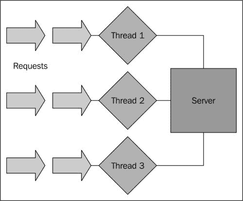
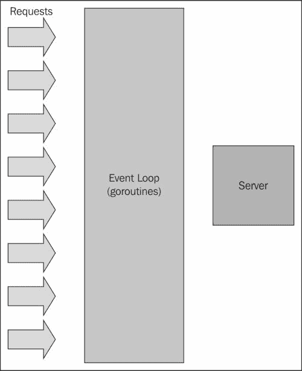
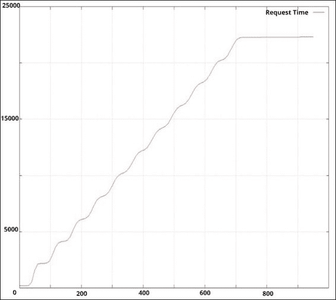
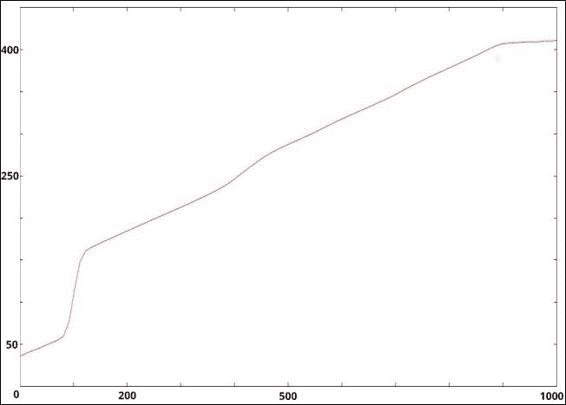
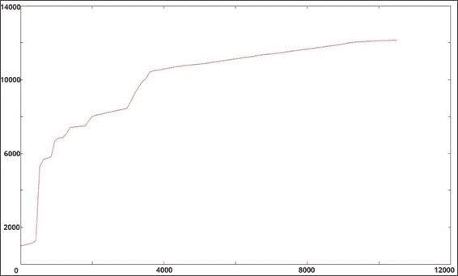
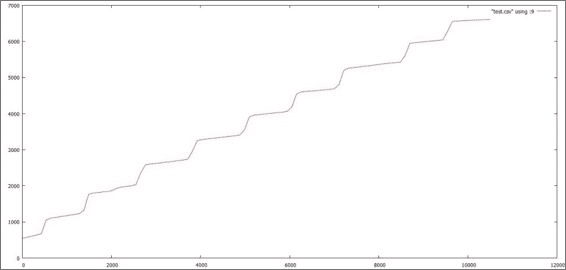
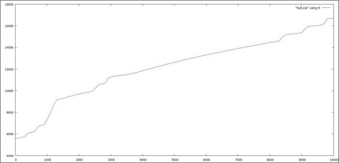

# 第六章。在 Go 中创建一个非阻塞 Web 服务器

到目前为止，我们已经构建了一些可用的应用程序；我们可以从中开始，并跃入到日常使用的真实系统中。通过这样做，我们能够展示 Go 并发语法和方法中涉及的基本和中级模式。

然而，现在是时候解决一个真实世界的问题了——这个问题困扰了开发人员（以及他们的经理和副总裁）在 Web 的早期历史中很长一段时间。

通过解决这个问题，我们将能够开发一个高性能的 Web 服务器，可以处理大量的实时活跃流量。

多年来，解决这个问题的唯一方法是向问题投入硬件或侵入式缓存系统；因此，用编程方法解决它应该会激发任何程序员的兴趣。

我们将使用到目前为止学到的每一种技术和语言构造，但我们将以比以前更有条理和有意识的方式来做。到目前为止，我们所探讨的一切都将发挥作用，包括以下几点：

+   创建我们并发应用的可视化表示

+   利用 goroutine 来处理请求，以实现可扩展性

+   构建健壮的通道来管理 goroutine 之间的通信和管理它们的循环

+   使用性能分析和基准测试工具（JMeter、ab）来检查我们的事件循环的实际工作方式

+   在必要时设置超时和并发控制，以确保数据和请求的一致性

# 攻克 C10K 问题

C10K 问题的起源根植于串行、阻塞式编程，这使得它成为展示并发编程优势的理想选择，特别是在 Go 语言中。

这个问题的提出者是开发者丹·凯格尔，他曾经问过：

| *是时候让 Web 服务器同时处理一万个客户端了，你不觉得吗？毕竟，现在的网络是一个很大的地方。* | |
| --- | --- |
| --*丹·凯格尔（[`www.kegel.com/c10k.html`](http://www.kegel.com/c10k.html）* |

当他在 1999 年提出这个问题时，对于许多服务器管理员和工程师来说，为 10,000 个并发访问者提供服务是需要通过硬件解决的问题。在常见硬件上，单个服务器能够处理这种类型的 CPU 和网络带宽而不会崩溃的想法对大多数人来说似乎是陌生的。

他提出的解决方案的关键在于生成非阻塞代码。当然，在 1999 年，并发模式和库并不普遍。C++通过一些第三方库和后来通过 Boost 和 C++11 提供的最早的多线程语法的前身，有一些轮询和排队选项。

在接下来的几年里，针对这个问题的解决方案开始涌现，涵盖了各种语言、编程设计和一般方法。在撰写本书时，C10K 问题并非没有解决方案，但它仍然是一个非常适合在高性能 Go 中进行真实世界挑战的平台。

任何性能和可伸缩性问题最终都将受限于底层硬件，因此，结果可能因人而异。在 486 处理器和 500MB RAM 上实现 10,000 个并发连接肯定比在堆满内存和多核的 Linux 服务器上实现更具挑战性。

值得注意的是，一个简单的回显服务器显然能够承担比返回更多数据并接受更复杂请求、会话等的功能性 Web 服务器更多的核心，正如我们将在这里处理的那样。

## 服务器在 10,000 个并发连接时失败

正如你可能还记得的，当我们在第三章中讨论并发策略时，我们谈到了一些关于 Apache 及其负载均衡工具的内容。

当 Web 诞生并且互联网商业化时，互动水平相当低。如果你是一个老手，你可能还记得从 NNTP/IRC 等的转变以及 Web 的极其原始的情况。

为了解决[页面请求]→[HTTP 响应]的基本命题，20 世纪 90 年代早期对 Web 服务器的要求相当宽松。忽略所有的错误响应、头部读取和设置以及其他基本功能（但与输入输出机制无关），早期服务器的本质相当简单，至少与现代 Web 服务器相比是如此。

### 注意

第一个 Web 服务器是由 Web 之父蒂姆·伯纳斯-李开发的。

由 CERN（例如 WWW/HTTP 本身）开发的 CERN httpd 处理了许多你今天在 Web 服务器中所期望的事情——在代码中搜索，你会发现很多注释，这些注释会让你想起 HTTP 协议的核心基本上没有改变。与大多数技术不同，HTTP 的寿命非常长。

1990 年用 C 语言编写的服务器无法利用 Erlang 等语言中可用的许多并发策略。坦率地说，这样做可能是不必要的——大多数的 Web 流量都是基本的文件检索和协议问题。Web 服务器的核心问题不是处理流量，而是处理协议本身的规则。

你仍然可以访问原始的 CERN httpd 网站，并从[`www.w3.org/Daemon/`](http://www.w3.org/Daemon/)下载源代码。我强烈建议你这样做，既可以作为历史课程，也可以看看最早的 Web 服务器是如何解决最早的问题的。

然而，1990 年的 Web 和首次提出 C10K 问题时的 Web 是两个非常不同的环境。

到 1999 年，大多数网站都有一定程度的由第三方软件、CGI、数据库等提供的次要或第三级延迟，所有这些都进一步复杂化了问题。同时并发地提供 10,000 个平面文件的概念本身就是一个挑战，但是如果通过在 Perl 脚本的基础上运行它们来访问 MySQL 数据库而没有任何缓存层，这个挑战就会立即加剧。

到了 20 世纪 90 年代中期，Apache Web 服务器已经占据主导地位，并在很大程度上控制了市场（到 2009 年，它成为第一个为超过 1 亿个网站提供服务的服务器软件）。

Apache 的方法深深扎根于互联网的早期。在推出时，连接最初是先进先出处理的。很快，每个连接都被分配了一个线程池中的线程。Apache 服务器存在两个问题。它们如下：

+   阻塞连接可能导致多米诺效应，其中一个或多个慢速解析的连接可能会导致无法访问

+   Apache 对可以利用的线程/工作者数量有严格的限制，与硬件约束无关

至少从回顾的角度来看，这里很容易看到机会。一个利用 actors（Erlang）、agents（Clojure）或 goroutines（Go）的并发服务器似乎完全符合要求。并发本身并不能解决 C10k 问题，但它绝对提供了一种促进解决的方法。

今天解决 C10K 问题的最显著和可见的例子是 Nginx，它是使用并发模式开发的，到 2002 年在 C 语言中广泛可用，用于解决 C10K 问题。如今，Nginx 代表着世界上第二或第三大的 Web 服务器，这取决于来源。

## 使用并发攻击 C10K

处理大量并发请求的两种主要方法。第一种方法涉及为每个连接分配线程。这就是 Apache（和其他一些服务器）所做的。

一方面，为连接分配一个线程是有很多道理的——它是隔离的，可以通过应用程序和内核的上下文切换进行控制，并且可以随着硬件的增加而扩展。

对于 Linux 服务器来说，这是一个问题——大多数 Web 都是在 Linux 服务器上运行的，每个分配的线程默认保留 8 MB 的内存用于其堆栈。这可以（也应该）重新定义，但这会导致需要大量的内存来处理单个服务器的开销，即使将默认堆栈大小设置为 1 MB，我们也需要至少 10 GB 的内存来处理开销。

这是一个极端的例子，由于几个原因，这不太可能成为一个真正的问题：首先，因为您可以规定每个线程可用的最大资源量，其次，因为您可以很容易地在几台服务器和实例之间进行负载平衡，而不是增加 10 GB 到 80 GB 的 RAM。

即使在一个线程服务器环境中，我们基本上也受到可能导致性能下降（甚至崩溃）的问题的限制。

首先，让我们看一个连接绑定到线程的服务器（如下图所示），并想象一下这如何导致阻塞，最终导致崩溃：



这显然是我们要避免的。任何 I/O、网络或外部进程都可能导致一些减速，从而引发我们所说的雪崩效应，使我们可用的线程被占用（或积压），而传入的请求开始堆积起来。

在这种模型中，我们可以生成更多的线程，但正如前面提到的，这里也存在潜在的风险，甚至这也无法减轻潜在的问题。

## 采取另一种方法

为了创建一个可以处理 10,000 个并发连接的网络服务器，我们显然会利用我们的 goroutine/channel 机制，将一个事件循环放在我们的内容交付前面，以保持新通道不断回收或创建。

在这个例子中，我们假设我们正在为一个快速扩张的公司构建企业网站和基础设施。为了做到这一点，我们需要能够提供静态和动态内容。

我们希望引入动态内容的原因不仅仅是为了演示的目的——我们想挑战自己，展示即使在次要进程干扰的情况下，也能展示 10,000 个真正的并发连接。

与往常一样，我们将尝试将我们的并发策略直接映射到 goroutines 和通道。在许多其他语言和应用程序中，这与事件循环直接类似，我们将以此方式处理。在我们的循环中，我们将管理可用的 goroutines，过期或重用已完成的 goroutines，并在必要时生成新的 goroutines。

在这个示例可视化中，我们展示了一个事件循环（和相应的 goroutines）如何使我们能够扩展我们的连接，而不需要使用太多*硬*资源，比如 CPU 线程或 RAM：



对我们来说，这里最重要的一步是管理事件循环。我们希望创建一个开放的、无限循环来管理我们的 goroutines 和各自的通道的创建和过期。

作为这一过程的一部分，我们还希望对所发生的情况进行一些内部记录，既用于基准测试，也用于调试我们的应用程序。

# 构建我们的 C10K 网络服务器

我们的网络服务器将负责处理请求，路由它们，并提供平面文件或针对几种不同数据源解析模板的动态文件。

正如前面提到的，如果我们只提供平面文件并消除大部分处理和网络延迟，那么处理 10,000 个并发连接将会更容易。

我们的目标是尽可能接近真实世界的情景——很少有网站在一个静态的服务器上运行。大多数网站和应用程序都利用数据库、CDN（内容交付网络）、动态和未缓存的模板解析等。我们需要尽可能地复制它们。

为了简单起见，我们将按类型分隔我们的内容，并通过 URL 路由进行过滤，如下所示：

+   `/static/[request]`：这将直接提供`request.html`

+   `/template/[request]`：这将在通过 Go 解析后提供`request.tpl`

+   `/dynamic/[request][number]`：这也将提供`request.tpl`并对其进行数据库源记录的解析

通过这样做，我们应该能够更好地混合可能阻碍大量用户同时服务能力的 HTTP 请求类型，特别是在阻塞的 Web 服务器环境中。

我们将利用`html/template`包进行解析——我们之前简要地看过语法，深入了解并不一定是本书的目标。但是，如果您打算将这个示例转化为您在环境中使用的内容，或者对构建框架感兴趣，您应该研究一下。

### 提示

您可以在[`golang.org/pkg/html/template/`](http://golang.org/pkg/html/template/)找到 Go 出色的库，用于生成安全的数据驱动模板。

所谓安全，我们主要是指接受数据并将其直接移入模板，而不必担心大量恶意软件和跨站脚本背后的注入问题。

对于数据库源，我们将在这里使用 MySQL，但如果您更熟悉其他数据库，可以随意尝试。与`html/template`包一样，我们不打算花费太多时间来概述 MySQL 和/或其变体。

## 针对阻塞 Web 服务器的基准测试

首先，公平地对阻塞 Web 服务器进行一些起始基准测试，以便我们可以衡量并发与非并发架构的影响。

对于我们的起始基准测试，我们将放弃任何框架，而选择我们的老朋友 Apache。

为了完整起见，我们将使用一台 Intel i5 3GHz 的机器，配备 8GB 的 RAM。虽然我们将在 Ubuntu、Windows 和 OS X 上对我们的最终产品进行基准测试，但我们将以 Ubuntu 为例。

我们的本地域将在`/static`中有三个普通的 HTML 文件，每个文件都被裁剪为 80KB。由于我们不使用框架，我们不需要担心原始动态请求，而只需要关注静态和动态请求，以及数据源请求。

对于所有示例，我们将使用一个名为`master`的 MySQL 数据库，其中包含一个名为`articles`的表，其中将包含 10,000 个重复条目。我们的结构如下：

```go
CREATE TABLE articles (
  article_id INT NOT NULL AUTO_INCREMENT,
  article_title VARCHAR(128) NOT NULL,
  article_text VARCHAR(128) NOT NULL,
  PRIMARY KEY (article_id)
)
```

通过顺序范围从 0 到 10,000 的 ID 索引，我们将能够生成随机数请求，但目前，我们只想看看 Apache 在这台机器上提供静态页面时能得到什么样的基本响应。

对于这个测试，我们将使用 Apache 的 ab 工具，然后使用 gnuplot 来顺序映射请求时间作为并发请求和页面的数量；我们也将为我们的最终产品做同样的测试，但我们还将使用一些其他基准测试工具来获得更好的细节。

### 注意

Apache 的 AB 随 Apache Web 服务器本身提供。您可以在[`httpd.apache.org/docs/2.2/programs/ab.html`](http://httpd.apache.org/docs/2.2/programs/ab.html)了解更多信息。

您可以从[`httpd.apache.org/download.cgi`](http://httpd.apache.org/download.cgi)下载它的 Linux、Windows、OS X 等版本。

gnuplot 实用程序也适用于相同的操作系统，网址是[`www.gnuplot.info/`](http://www.gnuplot.info/)。

所以，让我们看看我们是如何做到的。看一下下面的图表：



哎呀！差距太大了。我们可以调整 Apache 中可用的连接（以及相应的线程/工作者），但这并不是我们的目标。大多数情况下，我们想知道开箱即用的 Apache 服务器会发生什么。在这些基准测试中，我们开始在大约 800 个并发连接时丢弃或拒绝连接。

更令人担忧的是，随着这些请求开始堆积，我们看到一些请求超过 20 秒甚至更长时间。当这种情况发生在阻塞服务器中时，每个请求都会排队；在其后排队的请求也会类似地排队，整个系统开始崩溃。

即使我们无法处理 10,000 个并发连接，仍然有很大的改进空间。虽然单个服务器的容量不再是我们期望设计为 Web 服务器环境的方式，但能够尽可能地从该服务器中挤取性能，基本上是我们并发、事件驱动方法的目标。

## 处理请求

在早期的章节中，我们使用 Gorilla 处理 URL 路由，这是一个紧凑但功能丰富的框架。Gorilla 工具包确实使这变得更容易，但我们也应该知道如何拦截功能以强加我们自己的自定义处理程序。

这是一个简单的 Web 路由器，我们在其中使用自定义的`http.Server`结构处理和指导请求，如下面的代码所示：

```go
var routes []string

type customRouter struct {

}

func (customRouter) ServeHTTP(rw http.ResponseWriter, r 
  *http.Request) {

  fmt.Println(r.URL.Path);
}

func main() {

  var cr customRouter;

  server := &http.Server {
      Addr: ":9000",
      Handler:cr,
      ReadTimeout: 10 * time.Second,
      WriteTimeout: 10 * time.Second,
      MaxHeaderBytes: 1 << 20,
  }

  server.ListenAndServe()
}
```

在这里，我们不是使用内置的 URL 路由 muxer 和分发器，而是创建了一个自定义服务器和自定义处理程序类型来接受 URL 并路由请求。这使我们在处理 URL 时更加强大。

在这种情况下，我们创建了一个名为`customRouter`的基本空结构，并将其传递给我们的自定义服务器创建调用。

我们可以向我们的`customRouter`类型添加更多元素，但是对于这个简单的示例，我们实际上不需要这样做。我们所需要做的就是能够访问 URL 并将它们传递给处理程序函数。我们将有三个：一个用于静态内容，一个用于动态内容，一个用于来自数据库的动态内容。

不过，在我们走得太远之前，我们应该看看我们用 Go 编写的绝对基本的 HTTP 服务器在面对我们向 Apache 发送的相同流量时会做些什么。

老派的意思是服务器只会接受请求并传递静态的平面文件。您可以使用自定义路由器来做到这一点，就像我们之前做的那样，接受请求，打开文件，然后提供它们，但是 Go 提供了一种更简单的方式来处理`http.FileServer`方法中的基本任务。

因此，为了获得 Go 服务器的最基本性能与 Apache 的基准，我们将利用一个简单的 FileServer，并将其与`test.html`页面进行测试（其中包含与 Apache 相同的 80 KB 文件）。

### 注意

由于我们的目标是提高提供平面和动态页面的性能，因此测试套件的实际规格有些不重要。我们期望，尽管度量标准在不同环境中不会匹配，但我们应该看到类似的轨迹。也就是说，我们应该提供这些测试所使用的环境；在这种情况下，我们使用了一台配备 1.4 GHz i5 处理器和 4 GB 内存的 MacBook Air。

首先，我们将使用 Apache 的最佳性能，它具有 850 个并发连接和 900 个总请求。



与 Apache 相比，结果确实令人鼓舞。我们的两个测试系统都没有进行太多调整（Apache 安装和 Go 中的基本 FileServer），但 Go 的 FileServer 可以处理 1,000 个并发连接，而没有任何问题，最慢的时钟速度为 411 毫秒。

### 提示

在过去的五年中，Apache 在并发性和性能选项方面取得了很大进展，但要达到这一点需要进行一些调整和测试。这个实验的目的并不是贬低经过充分测试和建立的世界第一 Web 服务器 Apache，而是要将其与我们在 Go 中所能做的进行比较。

为了真正了解我们在 Go 中可以实现的基准，让我们看看 Go 的 FileServer 是否可以在单个普通机器上轻松处理 10,000 个连接：

```go
ab -n 10500 -c 10000 -g test.csv http://localhost:8080/a.html
```

我们将得到以下输出：



成功！Go 的 FileServer 本身将轻松处理 10,000 个并发连接，提供平面的静态内容。

当然，这不是这个特定项目的目标——我们将实现诸如模板解析和数据库访问等真实世界的障碍，但这本身就应该向您展示 Go 为需要处理大量基本网络流量的响应服务器提供的起点。

## 路由请求

因此，让我们退一步，再次看看如何通过传统的 Web 服务器路由我们的流量，不仅包括静态内容，还包括动态内容。

我们将创建三个函数，用于从我们的`customRouter:serveStatic():: read`函数中路由流量并提供一个平面文件`serveRendered():`，解析模板以显示`serveDynamic():`，连接到 MySQL，将数据应用于结构，并解析模板。

为了接受我们的请求并重新路由，我们将更改`customRouter`结构的`ServeHTTP`方法来处理三个正则表达式。

为了简洁和清晰起见，我们只会返回我们三种可能请求的数据。其他任何内容都将被忽略。

在现实世界的场景中，我们可以采取这种方法，积极主动地拒绝我们认为无效的请求连接。这将包括蜘蛛和恶意机器人和进程，它们作为非用户并没有真正价值。

# 提供页面

首先是我们的静态页面。虽然我们之前以成语方式处理了这个问题，但是使用`http.ServeFile`函数可以重写我们的请求，更好地处理特定的 404 错误页面等，如下面的代码所示：

```go
  path := r.URL.Path;

  staticPatternString := "static/(.*)"
  templatePatternString := "template/(.*)"
  dynamicPatternString := "dynamic/(.*)"

  staticPattern := regexp.MustCompile(staticPatternString)
  templatePattern := regexp.MustCompile(templatePatternString)
  dynamicDBPattern := regexp.MustCompile(dynamicPatternString)

  if staticPattern.MatchString(path) {
    page := staticPath + staticPattern.ReplaceAllString(path, 
     "${1}") + ".html"

    http.ServeFile(rw, r, page)
  }
```

在这里，我们只需将所有以`/static/(.*)`开头的请求与`.html`扩展名匹配。在我们的情况下，我们已经将我们的测试文件（80 KB 示例文件）命名为`test.html`，因此所有对它的请求将转到`/static/test`。

我们在这之前加上了`staticPath`，这是一个在代码中定义的常量。在我们的情况下，它是`/var/www/`，但您可能需要根据需要进行修改。

因此，让我们看看引入一些正则表达式所带来的开销，如下图所示：



怎么样？不仅没有额外的开销，而且似乎`FileServer`功能本身比单独的`FileServe()`调用更重，更慢。为什么呢？除了其他原因，不显式调用文件以打开和提供会导致额外的操作系统调用，这可能会随着请求的增加而成倍增加，从而损害并发性能。

### 提示

**有时候是小事情**

除了严格地提供平面页面之外，我们实际上还在每个请求中执行另一个任务，使用以下代码行：

```go
fmt.Println(r.URL.Path)
```

尽管这最终可能不会对您的最终性能产生影响，但我们应该注意避免不必要的日志记录或相关活动，这可能会给看似微不足道的性能障碍带来更大的问题。

## 解析我们的模板

在我们的下一个阶段，我们将衡量读取和解析模板的影响。为了有效地匹配以前的测试，我们将采用我们的 HTML 静态文件，并对其施加一些变量。

如果您还记得，我们的目标是尽可能模仿真实世界的场景。真实的 Web 服务器肯定会处理大量的静态文件服务，但是今天，动态调用构成了绝大部分的网络流量。

我们的数据结构将类似于最简单的数据表，而没有实际数据库的访问权限：

```go
type WebPage struct {
  Title string
  Contents string
}
```

我们希望采用这种形式的任何数据，并使用模板呈现它。请记住，Go 通过大写（公共）或小写（私有）值的语法糖来创建公共或私有变量的概念。

如果您发现模板无法渲染，但控制台没有明确的错误提示，请检查您的变量命名。从 HTML（或文本）模板调用的私有值将导致渲染在该点停止。

现在，我们将获取这些数据，并将其应用于以`/(.*)`开头的 URL 的模板。我们可以确实使用正则表达式的通配部分做一些更有用的事情，所以让我们使用以下代码将其作为标题的一部分：

```go
  } else if templatePattern.MatchString(path) {

    urlVar := templatePattern.ReplaceAllString(path, "${1}")
    page := WebPage{ Title: "This is our URL: "+urlVar, Contents: 
      "Enjoy our content" }
    tmp, _ := template.ParseFiles(staticPath+"template.html")
    tmp.Execute(rw,page)

  }
```

访问`localhost:9000/template/hello`应该呈现一个主体为以下代码的模板：

```go
<h1>{{.Title}}</h1>
<p>{{.Contents}}</p>
```

我们将得到以下输出：


关于模板的一点需要注意的是，它们不是编译的；它们保持动态。也就是说，如果您创建了一个可渲染的模板并启动了服务器，那么模板可以被修改，结果会反映出来。

这是一个潜在的性能因素。让我们再次运行我们的基准测试，将模板渲染作为我们应用程序及其架构的附加复杂性：


天啊！发生了什么？我们从轻松处理 10,000 个并发请求到几乎无法处理 200 个。

公平地说，我们引入了一个故意设置的绊脚石，在任何给定 CMS 的设计中并不罕见。

您会注意到我们在每个请求上调用`template.ParseFiles（）`方法。这是一种看似廉价的调用，但当您开始堆叠请求时，它确实会增加起来。

然后，将文件操作移出请求处理程序可能是有意义的，但我们需要做的不仅仅是这些——为了消除开销和阻塞调用，我们需要为请求设置一个内部缓存。

最重要的是，如果您希望保持服务器的非阻塞、快速和响应性，所有模板的创建和解析都应该发生在实际请求处理程序之外。这里是另一种方法：

```go
var customHTML string
var customTemplate template.Template
var page WebPage
var templateSet bool

func main() {
  var cr customRouter;
  fileName := staticPath + "template.html"
  cH,_ := ioutil.ReadFile(fileName)
  customHTML = string(cH[:])

  page := WebPage{ Title: "This is our URL: ", Contents: "Enjoy 
    our content" }
  cT,_ := template.New("Hey").Parse(customHTML)
  customTemplate = *cT
```

尽管我们在请求之前使用了`Parse（）`函数，但我们仍然可以使用`Execute（）`方法修改我们特定于 URL 的变量，这与`Parse（）`没有相同的开销。

当我们将这个移出`customRouter`结构的`ServeHTTP（）`方法时，我们又回到了正常状态。这是我们将会得到的这些更改的响应：


## 外部依赖

最后，我们需要解决我们最大的潜在瓶颈，即数据库。正如前面提到的，我们将通过生成 1 到 10,000 之间的随机整数来模拟随机流量，以指定我们想要的文章。

随机化不仅在前端有用——我们将要绕过 MySQL 内部的任何查询缓存，以限制非服务器优化。

### 连接到 MySQL

我们可以通过原生 Go 路由到自定义连接到 MySQL，但通常情况下，有一些第三方包可以使这个过程变得不那么痛苦。鉴于这里的数据库（以及相关库）是主要练习的第三方，我们不会太关心这里的细节。

两个成熟的 MySQL 驱动程序库如下：

+   Go-MySQL-Driver（[`github.com/go-sql-driver/mysql`](https://github.com/go-sql-driver/mysql)）

+   **MyMySQL**（[`github.com/ziutek/mymysql`](https://github.com/ziutek/mymysql)）

在这个例子中，我们将使用 Go-MySQL-Driver。我们将使用以下命令快速安装它：

```go
go get github.com/go-sql-driver/mysql

```

这两个都实现了 Go 中核心的 SQL 数据库连接包，提供了一种标准化的方法来连接到 SQL 源并遍历行。

一个注意事项是，如果你以前从未在 Go 中使用过 SQL 包，但在其他语言中使用过——通常在其他语言中，“Open（）”方法的概念意味着打开连接。在 Go 中，这只是为数据库创建结构和相关实现方法。这意味着仅仅在`sql.database`上调用`Open（）`可能不会给出相关的连接错误，比如用户名/密码问题等。

这种方法的一个优势（或者根据您的观点而定的劣势）是，连接到数据库可能不会在向 Web 服务器发送请求之间保持打开状态。在整体方案中，打开和重新打开连接的影响微乎其微。

由于我们正在利用伪随机文章请求，我们将构建一个 MySQL 附属函数来通过 ID 获取文章，如下面的代码所示：

```go
func getArticle(id int) WebPage {
  Database,err := sql.Open("mysql", "test:test@/master")
  if err != nil {
    fmt.Println("DB error!!!")
  }

  var articleTitle string
  sqlQ := Database.QueryRow("SELECT article_title from articles 
    where article_id=? LIMIT 1", 1).Scan(&articleTitle)
  switch {
    case sqlQ == sql.ErrNoRows:
      fmt.Printf("No rows!")
    case sqlQ != nil:
      fmt.Println(sqlQ)
    default:

  }

  wp := WebPage{}
  wp.Title = articleTitle
  return wp

}
```

然后我们将直接从我们的`ServeHTTP()`方法中调用该函数，如下面的代码所示：

```go
  }else if dynamicDBPattern.MatchString(path) {
    rand.Seed(9)
    id := rand.Intn(10000)
    page = getArticle(id)
    customTemplate.Execute(rw,page)
  }
```

我们在这里做得怎么样？看一下下面的图表：


毫无疑问，速度较慢，但我们成功承受了全部 10,000 个并发请求，完全来自未缓存的 MySQL 调用。

鉴于我们无法通过默认安装的 Apache 达到 1,000 个并发请求，这绝非易事。

# 多线程和利用多个核心

您可能想知道在调用额外的处理器核心时性能会如何变化——正如前面提到的，这有时会产生意想不到的效果。

在这种情况下，我们应该期望我们的动态请求和静态请求的性能都会有所提高。任何时候，操作系统中的上下文切换成本可能会超过额外核心的性能优势，我们都会看到矛盾的性能下降。在这种情况下，我们没有看到这种效果，而是看到了一个相对类似的线，如下图所示：



# 探索我们的 Web 服务器

我们的最终 Web 服务器能够在即使是最适度的硬件上，很好地处理静态、模板渲染和动态内容，符合 10,000 个并发连接的目标。

这段代码——就像本书中的代码一样——可以被视为一个起点，如果投入生产，就需要进行改进。这个服务器缺乏任何形式的错误处理，但可以在没有任何问题的情况下有效地处理有效的请求。让我们看一下以下服务器的代码：

```go
package main

import
(
"net/http"
"html/template"
"time"
"regexp"
"fmt"
"io/ioutil"
"database/sql"
"log"
"runtime"
_ "github.com/go-sql-driver/mysql"
)
```

我们这里的大部分导入都是相当标准的，但请注意 MySQL 行，它仅仅因为其副作用而被调用作为数据库/SQL 驱动程序：

```go
const staticPath string = "static/"
```

相对的`static/`路径是我们将查找任何文件请求的地方——正如前面提到的，这并不会进行额外的错误处理，但`net/http`包本身会在请求不存在的文件时返回 404 错误：

```go
type WebPage struct {

  Title string
  Contents string
  Connection *sql.DB

}
```

我们的`WebPage`类型表示模板渲染之前的最终输出页面。它可以填充静态内容，也可以由数据源填充，如下面的代码所示：

```go
type customRouter struct {

}

func serveDynamic() {

}

func serveRendered() {

}

func serveStatic() {

}
```

如果您选择扩展 Web 应用程序，请使用这些方法——这样可以使代码更清晰，并删除`ServeHTTP`部分中的大量不必要的内容，如下面的代码所示：

```go
func (customRouter) ServeHTTP(rw http.ResponseWriter, r 
  *http.Request) {
  path := r.URL.Path;

  staticPatternString := "static/(.*)"
  templatePatternString := "template/(.*)"
  dynamicPatternString := "dynamic/(.*)"

  staticPattern := regexp.MustCompile(staticPatternString)
  templatePattern := regexp.MustCompile(templatePatternString)
  dynamicDBPattern := regexp.MustCompile(dynamicPatternString)

  if staticPattern.MatchString(path) {
     serveStatic()
    page := staticPath + staticPattern.ReplaceAllString(path, 
      "${1}") + ".html"
    http.ServeFile(rw, r, page)
  }else if templatePattern.MatchString(path) {

    serveRendered()
    urlVar := templatePattern.ReplaceAllString(path, "${1}")

    page.Title = "This is our URL: " + urlVar
    customTemplate.Execute(rw,page)

  }else if dynamicDBPattern.MatchString(path) {

    serveDynamic()
    page = getArticle(1)
    customTemplate.Execute(rw,page)
  }

}
```

我们所有的路由都是基于正则表达式模式匹配的。有很多方法可以做到这一点，但`regexp`给了我们很大的灵活性。唯一需要考虑简化的时候是，如果您有很多潜在的模式，可能会导致性能损失——这意味着成千上万。流行的 Web 服务器 Nginx 和 Apache 处理他们的可配置路由大部分都是通过正则表达式，所以这是相当安全的领域：

```go
func gobble(s []byte) {

}
```

Go 对于未使用的变量非常挑剔，虽然这并不总是最佳实践，但在某些时候，您会得到一个不对数据进行特定处理但能让编译器满意的函数。对于生产环境，这并不是您想要处理此类数据的方式。

```go
var customHTML string
var customTemplate template.Template
var page WebPage
var templateSet bool
var Database sql.DB

func getArticle(id int) WebPage {
  Database,err := sql.Open("mysql", "test:test@/master")
  if err != nil {
    fmt.Println("DB error!")
  }

  var articleTitle string
  sqlQ := Database.QueryRow("SELECT article_title from articles 
    WHERE article_id=? LIMIT 1", id).Scan(&articleTitle)
  switch {
    case sqlQ == sql.ErrNoRows:
      fmt.Printf("No rows!")
    case sqlQ != nil:
      fmt.Println(sqlQ)
    default:

  }

  wp := WebPage{}
  wp.Title = articleTitle
  return wp

}
```

我们的`getArticle`函数演示了您如何在非常基本的级别上与`database/sql`包进行交互。在这里，我们打开一个连接，并使用`QueryRow()`函数查询一行。还有`Query`命令，通常也是一个`SELECT`命令，但可能返回多行。

```go
func main() {

  runtime.GOMAXPROCS(4)

  var cr customRouter;

  fileName := staticPath + "template.html"
  cH,_ := ioutil.ReadFile(fileName)
  customHTML = string(cH[:])

  page := WebPage{ Title: "This is our URL: ", Contents: "Enjoy 
    our content" }
  cT,_ := template.New("Hey").Parse(customHTML)
  customTemplate = *cT

  gobble(cH)
  log.Println(page)
  fmt.Println(customTemplate)

  server := &http.Server {
      Addr: ":9000",
      Handler:cr,
      ReadTimeout: 10 * time.Second,
      WriteTimeout: 10 * time.Second,
      MaxHeaderBytes: 1 << 20,
  }

  server.ListenAndServe()

}
```

我们的主函数设置服务器，构建默认的`WebPage`和`customRouter`，并开始在端口`9000`上监听。

## 超时并继续

在我们的服务器中，我们没有专注于持续连接的缓解概念。我们之所以不太担心它，是因为我们能够通过利用 Go 语言强大的内置并发特性，在所有三种方法中都能够轻松达到 10,000 个并发连接。

特别是在使用第三方或外部应用程序和服务时，重要的是要知道我们可以并且应该准备在连接中放弃（如果我们的应用程序设计允许的话）。

注意自定义服务器实现和两个特定属性：`ReadTimeout`和`WriteTimeout`。这使我们能够精确处理这种用例。

在我们的示例中，这被设置为一个荒谬地高的 10 秒。要接收、处理和发送一个请求，最多需要 20 秒的时间。在 Web 世界中，这是一个漫长的时间，有可能使我们的应用瘫痪。那么，我们的 C10K 在每端都设置为 1 秒会是什么样子呢？让我们看一下下面的图表：


在这里，我们几乎在最高并发请求的尾部节省了将近 5 秒的时间，几乎可以肯定是以完整响应为代价。

决定保持运行缓慢连接的时间长度是由你来决定的，但这是保持服务器迅速响应的武器库中的另一个工具。

当你决定终止连接时，总会有一个权衡——太早会导致大量关于不响应或容易出错的服务器的投诉；太晚则无法以编程方式处理连接量。这是需要质量保证和硬数据的考虑之一。

# 总结

C10K 问题今天看起来可能已经过时了，但是呼吁行动是在并发语言和应用程序设计迅速扩展之前主要采用的系统应用的方法的症状。

仅仅 15 年前，这似乎是全球系统和服务器开发人员面临的一个几乎无法克服的问题；现在，通过对服务器设计进行轻微调整和考虑就能够解决。

Go 语言使得实现这一点变得容易（只需付出一点努力），但是达到 10,000（甚至是 100,000 或 1,000,000）并发连接只是一半的战斗。当问题出现时，我们必须知道该怎么做，如何在服务器中寻求最大性能和响应能力，并且如何构建我们的外部依赖，使其不会造成障碍。

在我们的下一章中，我们将通过测试一些分布式计算模式并最大限度地利用内存管理来进一步提高并发应用的性能。
