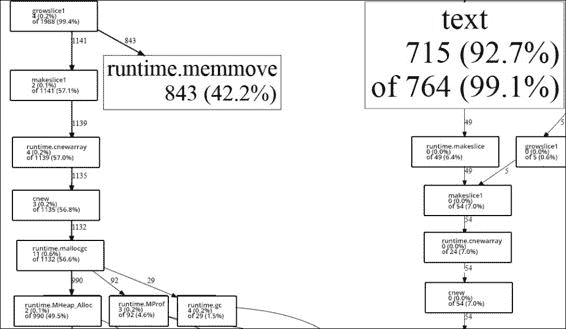
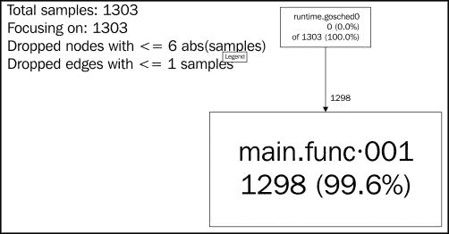
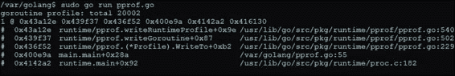
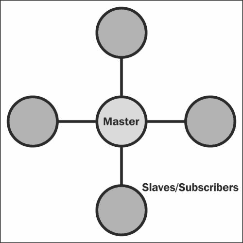
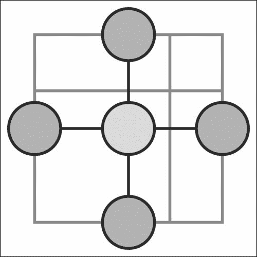
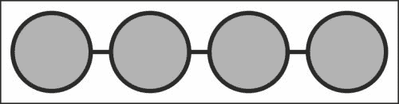
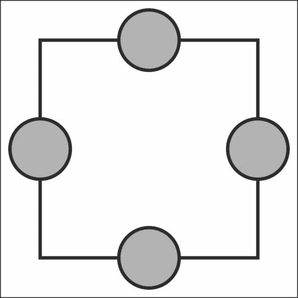

# 第七章。性能和可扩展性

只需几百行代码就可以在 Go 中构建一个高性能的 Web 服务器，您应该非常清楚，并发 Go 为我们提供了出色的性能和稳定性工具。

我们在第六章中的示例，*C10K – A Non-blocking Web Server in Go*，也展示了如何在我们的代码中任意或无意地引入阻塞代码会引入严重的瓶颈，并迅速破坏扩展或扩展应用程序的计划。

在本章中，我们将看一些方法，可以更好地准备我们的并发应用程序，确保它能够持续扩展，并且能够在范围、设计和/或容量上进行扩展。

我们将更深入地扩展**pprof**，这是我们在之前章节中简要介绍的 CPU 分析工具，作为阐明我们的 Go 代码是如何编译的，并找出可能的意外瓶颈的方法。

然后我们将扩展到分布式 Go，以及提供一些性能增强的并行计算概念到我们的应用程序中的方法。我们还将看看谷歌应用引擎，以及如何利用它来确保您的基于 Go 的应用程序能够扩展到世界上最可靠的托管基础设施之一。

最后，我们将研究内存利用、保留以及谷歌的垃圾收集器的工作方式（有时也会出现问题）。我们将深入研究如何使用内存缓存来保持数据一致性，以及如何与分布式计算结合，最终也会看到这与分布式计算的关系。

# Go 的高性能

到目前为止，我们已经讨论了一些工具，可以帮助我们发现减速、泄漏和低效的循环。

Go 的编译器和内置的死锁检测器阻止了我们在其他语言中常见且难以检测的错误。

我们基于特定并发模式的时间基准测试，可以帮助我们使用不同的方法设计我们的应用程序，以提高整体执行速度和性能。

## 深入了解 pprof

pprof 工具首次出现在第五章中，*Locks, Blocks, and Better Channels*，如果它仍然感觉有点神秘，那是完全可以理解的。pprof 向您显示的是一个**调用图**，我们可以使用它来帮助识别循环或堆上的昂贵调用的问题。这些包括内存泄漏和可以进行优化的处理器密集型方法。

展示这种工作原理的最好方法之一是构建一些不起作用的东西。或者至少是一些不按照应该的方式工作的东西。

您可能会认为具有垃圾收集的语言可能对这些类型的内存问题免疫，但总是有方法可以隐藏导致内存泄漏的错误。如果 GC 找不到它，有时自己找到它可能会非常痛苦，导致大量——通常是无效的——调试。

公平地说，什么构成内存泄漏有时在计算机科学成员和专家之间存在争议。如果程序不断消耗内存，根据技术定义，如果应用程序本身可以重新访问任何给定的指针，则可能不会泄漏内存。但当你有一个程序在消耗内存后崩溃时，这基本上是无关紧要的，就像大象在自助餐厅消耗内存一样。

在垃圾收集的语言中创建内存泄漏的基本前提是隐藏分配的内存，事实上，在任何可以直接访问和利用内存的语言中，都提供了引入泄漏的机制。

我们将在本章后面再次回顾一些关于垃圾收集和 Go 实现的内容。

那么像 pprof 这样的工具如何帮助呢？非常简单地说，它向您展示了**您的内存和 CPU 利用情况**。

让我们首先设计一个非常明显的 CPU 占用如下，看看 pprof 如何为我们突出显示这一点：

```go
package main

import (
"os"
"flag"
"fmt"
"runtime/pprof"
)

const TESTLENGTH = 100000
type CPUHog struct {
  longByte []byte
}

func makeLongByte() []byte {
  longByte := make([]byte,TESTLENGTH)

  for i:= 0; i < TESTLENGTH; i++ {
    longByte[i] = byte(i)
  }
  return longByte
}

var profile = flag.String("cpuprofile", "", "output pprof data to 
  file")

func main() {
  var CPUHogs []CPUHog

  flag.Parse()
    if *profile != "" {
      flag,err := os.Create(*profile)
      if err != nil {
        fmt.Println("Could not create profile",err)
      }
      pprof.StartCPUProfile(flag)
      defer pprof.StopCPUProfile()

    }

  for i := 0; i < TESTLENGTH; i++ {
    hog := CPUHog{}
    hog.longByte = makeLongByte()
    _ = append(CPUHogs,hog)
  }
}
```

上述代码的输出如下图所示：


在这种情况下，我们知道我们的堆栈资源分配去了哪里，因为我们故意引入了循环（以及其中的循环）。

想象一下，我们并没有故意这样做，而是不得不找出资源占用。在这种情况下，pprof 使这变得非常容易，向我们展示了创建和内存分配的简单字符串构成了我们大部分样本。

我们可以稍微修改一下，看看 pprof 输出的变化。为了分配更多的内存，看看我们是否可以改变 pprof 的输出，我们可能会考虑使用更重的类型和更多的内存。

最简单的方法是创建一个新类型的切片，其中包括大量这些较重的类型，如 int64。我们很幸运有 Go：在这方面，我们不容易出现常见的 C 问题，比如缓冲区溢出和内存保护和管理，但是当我们无法故意破坏内存管理系统时，调试就会变得有点棘手。

### 提示

**unsafe 包**

尽管提供了内置的内存保护，但 Go 还提供了另一个有趣的工具：**unsafe**包。根据 Go 的文档：

*包 unsafe 包含绕过 Go 程序类型安全性的操作。*

这可能看起来是一个奇怪的库要包括——确实，虽然许多低级语言允许您自毁，但提供一个分离的语言是相当不寻常的。

在本章的后面，我们将研究`unsafe.Pointer`，它允许您读写任意内存分配的位。这显然是非常危险的（或者有用和邪恶的，这取决于您的目标）功能，您通常会尽量避免在任何开发语言中使用，但它确实允许我们调试和更好地理解我们的程序和 Go 垃圾收集器。

为了增加我们的内存使用量，让我们将我们的字符串分配切换如下，用于随机类型分配，特别是用于我们的新结构`MemoryHog`：

```go
type MemoryHog struct {
  a,b,c,d,e,f,g int64
  h,i,j,k,l,m,n float64
  longByte []byte
}
```

显然，没有什么能阻止我们将其扩展为一组荒谬地大的切片，大量的 int64 数组等等。但我们的主要目标仅仅是改变 pprof 的输出，以便我们可以识别调用图样本中的移动以及它对我们的堆栈/堆配置文件的影响。

我们的任意昂贵的代码如下：

```go
type MemoryHog struct {
  a,b,c,d,e,f,g int64
  h,i,j,k,l,m,n float64
  longByte []byte
}

func makeMemoryHog() []MemoryHog {

  memoryHogs := make([]MemoryHog,TESTLENGTH)

  for i:= 0; i < TESTLENGTH; i++ {
    m := MemoryHog{}
    _ = append(memoryHogs,m)
  }

  return memoryHogs
}

var profile = flag.String("cpuprofile", "", "output pprof data to 
  file")

func main() {
  var CPUHogs []CPUHog

  flag.Parse()
    if *profile != "" {
      flag,err := os.Create(*profile)
      if err != nil {
        fmt.Println("Could not create profile",err)
      }
      pprof.StartCPUProfile(flag)
      defer pprof.StopCPUProfile()

    }

  for i := 0; i < TESTLENGTH; i++ {
    hog := CPUHog{}
    hog.mHog = makeMemoryHog()
    _ = append(CPUHogs,hog)
  }
}
```

有了这个，我们的 CPU 消耗保持大致相同（由于循环机制基本保持不变），但我们的内存分配增加了——毫不奇怪——大约 900%。你可能不会精确复制这些结果，但是一个小改变导致资源分配的重大差异的一般趋势是可以重现的。请注意，内存利用报告可以使用 pprof 进行，但这不是我们在这里所做的；这里的内存利用观察发生在 pprof 之外。

如果我们采取之前建议的极端方法——为我们的结构创建荒谬地大的属性——我们可以进一步进行，但让我们看看这对我们的 CPU 配置文件执行的总体影响。影响如下图所示：



在左侧，我们有我们的新分配方法，它调用我们更大的结构，而不是一组字符串。在右侧，我们有我们的初始应用程序。

相当戏剧性的波动，你觉得呢？虽然这两个程序在设计上都没有错，但我们可以轻松地切换我们的方法，看看资源去哪里，以及我们如何减少它们的消耗。

## 并行性和并发对 I/O pprof 的影响

当使用 pprof 时，您可能会很快遇到一个问题，那就是当您编写的脚本或应用程序特别依赖于高效的运行时性能时。当您的程序执行速度过快以至于无法正确进行性能分析时，这种情况最常见。

一个相关的问题涉及到需要连接进行性能分析的网络应用程序；在这种情况下，您可以在程序内部或外部模拟流量，以便进行正确的性能分析。

我们可以通过使用 goroutines 复制类似于前面示例的方式来轻松演示这一点：

```go
const TESTLENGTH = 20000

type DataType struct {
  a,b,c,d,e,f,g int64
  longByte []byte  
}

func (dt DataType) init() {

}

var profile = flag.String("cpuprofile", "", "output pprof data to 
  file")

func main() {

  flag.Parse()
    if *profile != "" {
      flag,err := os.Create(*profile)
      if err != nil {
        fmt.Println("Could not create profile",err)
      }
      pprof.StartCPUProfile(flag)
      defer pprof.StopCPUProfile()
    }
  var wg sync.WaitGroup

  numCPU := runtime.NumCPU()
  runtime.GOMAXPROCS(numCPU)

  wg.Add(TESTLENGTH)

  for i := 0; i < TESTLENGTH; i++ {
    go func() {
      for y := 0; y < TESTLENGTH; y++ {
        dT := DataType{}
        dT.init()
      }
      wg.Done()
    }()
  }

  wg.Wait()

  fmt.Println("Complete.")
}
```

以下图显示了前面代码的 pprof 输出：



这并不是那么具有信息量，是吗？

如果我们想要获得有关 goroutines 堆栈跟踪的更有价值的信息，Go——像往常一样——提供了一些额外的功能。

在运行时包中，有一个函数和一个方法，允许我们访问和利用 goroutines 的堆栈跟踪：

+   `runtime.Lookup`：此函数根据名称返回一个性能分析

+   `runtime.WriteTo`：此方法将快照发送到 I/O 写入器

如果我们在程序中添加以下行，我们将无法在`pprof` Go 工具中看到输出，但我们可以在控制台中获得对我们的 goroutines 的详细分析。

```go
pprof.Lookup("goroutine").WriteTo(os.Stdout, 1)
```

前一行代码给出了一些抽象 goroutine 内存位置信息和包细节，看起来会像下面的截图：



但更快的获得这个输出的方法是利用`http`/`pprof`工具，它通过一个单独的服务器保持我们应用程序的结果处于活动状态。我们在这里使用了端口 6000，如下面的代码所示，但您可以根据需要进行修改：

```go
  go func() {
    log.Println(http.ListenAndServe("localhost:6000", nil))
  }()
```

虽然您无法获得 goroutine 堆栈调用的 SVG 输出，但您可以通过访问`http://localhost:6060/debug/pprof/goroutine?debug=1`在浏览器中实时查看。

# 使用 App Engine

虽然并非适用于每个项目，但 Google 的 App Engine 可以在并发应用程序方面提供可扩展性，而无需进行 VM 配置、重启、监控等繁琐操作。

App Engine 与亚马逊网络服务、DigitalOcean 等并没有完全不同，唯一的区别在于您不需要必须参与直接服务器设置和维护的细节。它们都提供了一个单一的地方来获取和利用虚拟计算资源来运行您的应用程序。

相反，它可以成为谷歌架构中更抽象的环境，用于在多种语言中托管和运行您的代码，包括——毫不奇怪的——Go 语言本身。

大型应用程序将会产生费用，但 Google 提供了一个免费的层次，具有合理的试验和小型应用程序的配额。

与可扩展性相关的好处有两个：您无需像在 AWS 或 DigitalOcean 场景中那样负责确保实例的正常运行时间。除了谷歌之外，还有谁不仅拥有支持任何你可以投入其中的架构，而且还拥有 Go 核心本身的最快更新速度？

当然，这里有一些明显的限制与优势相一致，包括您的核心应用程序将仅通过`http`可用（尽管它将可以访问到其他许多服务）。

### 提示

要将应用程序部署到 App Engine，您需要 Go 的 SDK，适用于 Mac OS X、Linux 和 Windows，网址为[`developers.google.com/appengine/downloads#Google_App_Engine_SDK_for_Go`](https://developers.google.com/appengine/downloads#Google_App_Engine_SDK_for_Go)。

安装了 SDK 后，您需要对代码进行一些微小的更改，最值得注意的一点是，在大多数情况下，您的 Go 工具命令将被`goapp`替代，它负责在本地提供您的应用程序，然后部署它。

# 分布式 Go

我们确实涵盖了很多关于并发和并行 Go 的内容，但对于开发人员和系统架构师来说，最大的基础设施挑战之一与协作计算有关。

我们之前提到的一些应用程序和设计从并行扩展到分布式计算。

Memcache(d)是一种内存缓存，可以用作多个系统之间的队列。

我们在第四章中提出的主从和生产者-消费者模型与 Go 中的单机编程相比更多地涉及分布式计算，后者在并发方面具有成语特色。这些模型是许多语言中典型的并发模型，但也可以扩展到帮助我们设计分布式系统，利用不仅是许多核心和丰富的资源，还有冗余。

分布式计算的基本原则是将任何给定应用程序的各种负担分享、分散和最佳吸收到许多系统中。这不仅可以提高总体性能，还可以为系统本身提供一定程度的冗余。

这一切都是有一定成本的，具体如下：

+   网络延迟的潜在可能性

+   导致通信和应用程序执行减速

+   设计和维护上的复杂性整体增加

+   分布式路线上各个节点存在安全问题的潜在可能性

+   由于带宽考虑可能增加成本

这一切都是为了简单地说，虽然构建分布式系统可以为利用并发性和确保数据一致性的大型应用程序提供巨大的好处，但这并不意味着它适用于每个示例。

## 拓扑类型

分布式计算认识到分布式设计的一系列逻辑拓扑结构。拓扑结构是一个恰当的比喻，因为所涉及系统的位置和逻辑通常可以代表物理拓扑。

并非所有被接受的拓扑结构都适用于 Go。当我们使用 Go 设计并发分布式应用程序时，通常会依赖于一些更简单的设计，具体如下。

### 类型 1-星形

星形拓扑结构（或至少是这种特定形式），类似于我们之前概述的主从或生产者-消费者模型。

数据传递的主要方法涉及使用主服务器作为消息传递通道；换句话说，所有请求和命令都由单个实例协调，该实例使用某种路由方法传递消息。以下图显示了星形拓扑结构：



我们实际上可以非常快速地为此设计一个基于 goroutine 的系统。以下代码仅为主服务器（或分布式目的地）的代码，缺乏任何安全考虑，但显示了我们如何将网络调用转换为 goroutines：

```go
package main

import
(
  "fmt"
  "net"

)
```

我们的标准基本库定义如下：

```go
type Subscriber struct {
  Address net.Addr
  Connection net.Conn
  do chan Task  
}

type Task struct {
  name string
}
```

这是我们将在这里使用的两种自定义类型。`Subscriber`类型是任何进入战场的分布式助手，`Task`类型代表任何给定的可分发任务。我们在这里没有定义它，因为这不是演示的主要目标，但你可以通过在 TCP 连接上通信标准化命令来做任何事情。`Subscriber`类型定义如下：

```go
var SubscriberCount int
var Subscribers []Subscriber
var CurrentSubscriber int
var taskChannel chan Task

func (sb Subscriber) awaitTask() {
  select {
    case t := <-sb.do:
      fmt.Println(t.name,"assigned")

  }
}

func serverListen (listener net.Listener) {
  for {
    conn,_ := listener.Accept()

    SubscriberCount++

    subscriber := Subscriber{ Address: conn.RemoteAddr(), 
      Connection: conn }
    subscriber.do = make(chan Task)
    subscriber.awaitTask()
    _ = append(Subscribers,subscriber)

  }
}

func doTask() {
  for {
    select {
      case task := <-taskChannel:
        fmt.Println(task.name,"invoked")
        Subscribers[CurrentSubscriber].do <- task
        if (CurrentSubscriber+1) > SubscriberCount {
          CurrentSubscriber = 0
        }else {
          CurrentSubscriber++
        }
    }

  }
}

func main() {

  destinationStatus := make(chan int)

  SubscriberCount = 0
  CurrentSubscriber = 0

  taskChannel = make(chan Task)

  listener, err := net.Listen("tcp", ":9000")
  if err != nil {
    fmt.Println ("Could not start server!",err)
  }
  go serverListen(listener)  
  go doTask()

  <-destinationStatus
}
```

这实质上将每个连接视为一个新的`Subscriber`，它根据其索引获得自己的通道。然后，主服务器使用以下非常基本的轮询方法迭代现有的`Subscriber`连接：

```go
if (CurrentSubscriber+1) > SubscriberCount {
  CurrentSubscriber = 0
}else {
  CurrentSubscriber++
}
```

如前所述，这缺乏任何安全模型，这意味着对端口 9000 的任何连接都将成为`Subscriber`，并且可以接收分配给它的网络消息（并且可能还可以调用新消息）。但您可能已经注意到一个更大的遗漏：这个分布式应用程序什么也没做。实际上，这只是一个用于分配和管理订阅者的模型。现在，它没有任何行动路径，但我们将在本章后面更改这一点。

### 类型 2-网格

网格与星型非常相似，但有一个主要区别：每个节点不仅可以通过主节点进行通信，还可以直接与其他节点进行通信。这也被称为**完全图**。以下图显示了网格拓扑结构：



出于实际目的，主服务器仍然必须处理分配并将连接传递回各个节点。

实际上，通过对我们之前的服务器代码进行以下简单修改，添加这个并不特别困难：

```go
func serverListen (listener net.Listener) {
  for {
    conn,_ := listener.Accept()

    SubscriberCount++

    subscriber := Subscriber{ Address: conn.RemoteAddr(), 
      Connection: conn }
    subscriber.awaitTask()
    _ = append(Subscribers,subscriber)
    broadcast()
  }
}
```

然后，我们添加以下对应的`broadcast`函数，将所有可用的连接共享给所有其他连接：

```go
func broadcast() {
  for i:= range Subscribers {
    for j:= range Subscribers {
      Subscribers[i].Connection.Write
        ([]byte("Subscriber:",Subscriber[j].Address))  
    }
  }
}
```

### 发布和订阅模型

在前面的两种拓扑结构中，我们复制了一个由中央/主服务器处理交付的发布和订阅模型。与单系统并发模式不同，我们缺乏直接在不同计算机之间使用通道的能力（除非我们使用像 Go 的 Circuit 这样的东西，如第四章中所述的那样，*应用程序中的数据完整性*）。

没有直接的编程访问来发送和接收实际命令，我们依赖某种形式的 API。在前面的例子中，没有实际发送或执行的任务，但我们该如何做呢？

显然，要创建可以形式化为非代码传输的任务，我们需要一种 API 形式。我们可以通过两种方式之一来实现这一点：命令序列化，理想情况下通过 JSON 直接传输，以及代码执行。

由于我们将始终处理编译后的代码，因此命令序列化选项可能看起来似乎无法包含 Go 代码本身。这并不完全正确，但是在任何语言中传递完整代码都是安全问题的重要问题。

但让我们看看通过 API 以任务的方式发送数据的两种方法，即通过从 URL 切片中删除一个 URL 以进行检索。我们首先需要在我们的`main`函数中初始化该数组，如下面的代码所示：

```go
type URL struct {
  URI string
  Status int
  Assigned Subscriber
  SubscriberID int
}
```

我们数组中的每个 URL 都将包括 URI、其状态和分配给它的订阅者地址。我们将状态点规范为 0 表示未分配，1 表示已分配并等待，2 表示已分配并完成。

还记得我们的`CurrentSubscriber`迭代器吗？它代表了下一个轮询分配，将为我们的`URL`结构的`SubscriberID`值提供值。

接下来，我们将创建一个任意的 URL 数组，代表我们在这里的整体工作。可能需要一些怀疑来假设检索四个 URL 需要任何分布式系统；实际上，这将通过网络传输引入显著的减速。我们之前在纯粹的单系统并发应用程序中处理过这个问题：

```go
  URLs = []URL{ {Status:0,URL:"http://golang.org/"}, 
    {Status:0,URL:"http://play.golang.org/"}, 
      {Status:0,URL:"http://golang.org/doc/"}, 
        {Status:0,URL:"http://blog.golang.org/"} }
```

### 序列化数据

在 API 的第一个选项中，我们将以 JSON 格式发送和接收序列化数据。我们的主服务器将负责规范其命令和相关数据。在这种情况下，我们希望传输一些内容：要做什么（在这种情况下是检索）与相关数据，当完成时响应应该是什么，以及如何处理错误。

我们可以用自定义结构表示如下：

```go
type Assignment struct {
  command string
  data string
  successResponse string
  errorResponse string
}
...
  asmnt := Assignment{command:"process",
    url:"http://www.golang.org",successResponse:"success",
      errorResponse:"error"}
  json, _ := json.Marshal(asmnt )
  send(string(json))
```

### 远程代码执行

远程代码执行选项并不一定与命令序列化分开，而是结构化和解释格式化响应的替代方案，有效载荷可以是将通过系统命令运行的代码。

例如，任何语言的代码都可以通过网络传递，并且可以从另一种语言的 shell 或 syscall 库中执行，就像以下 Python 示例一样：

```go
from subprocess import call
call([remoteCode])
```

这种方法的缺点很多：它引入了严重的安全问题，并使您几乎无法在客户端内部进行错误检测。

优点是您不需要为响应制定特定的格式和解释器，以及潜在的速度改进。您还可以将响应代码卸载到任意数量的语言的另一个外部进程中。

在大多数情况下，命令的序列化远比远程代码执行选项更可取。

### 其他拓扑

存在许多更复杂的拓扑类型，作为消息队列的一部分更难管理。

以下图表显示了总线拓扑：



总线拓扑网络是一个单向传输系统。对于我们的目的来说，它既不特别有用，也不容易管理，因为每个添加的节点都需要宣布其可用性，接受监听器责任，并准备在新节点加入时放弃该责任。

总线的优势在于快速扩展性。但是，这也带来了严重的缺点：缺乏冗余和单点故障。

即使使用更复杂的拓扑，系统中始终会存在一些可能丢失宝贵齿轮的问题；在这种模块化冗余级别上，将需要一些额外的步骤来实现始终可用的系统，包括自动双重或三重节点复制和故障转移。这比我们在这里讨论的要多一些，但重要的是要注意，无论如何都会存在风险，尽管在总线等拓扑中更容易受到影响。

以下图表显示了环形拓扑：



环形拓扑看起来与我们的网状拓扑类似，但缺少主节点。它基本上需要与总线一样的通信过程（宣布和监听）。请注意一个重要的区别：通信不是在单个监听器之间进行，而是可以在没有主节点的情况下在任何节点之间进行。

这意味着所有节点都必须同时监听并宣布它们的存在给其他节点。

### 消息传递接口

还有一个稍微更正式的版本，称为消息传递接口，它是我们之前构建的更正式的版本。MPI 是从上世纪 90 年代初的学术界诞生的，作为分布式通信的标准。

最初是为 FORTRAN 和 C 而编写的，它仍然是一个协议，因此它基本上与语言无关。

MPI 允许管理高于我们能够为资源管理系统构建的基本拓扑，包括不仅是线性和环形拓扑，还有常见的总线拓扑。

在大多数情况下，MPI 被科学界使用；它是一种高度并发和类似的方法，用于构建大规模分布式系统。点对点操作更严格地定义了错误处理、重试和动态生成进程。

我们之前的基本示例没有为处理器设置优先级，这是 MPI 的核心效果之一。

Go 没有官方的 MPI 实现，但由于 C 和 C++都有官方实现，因此完全可以通过它们进行接口操作。

### 注意

还有一个由 Marcus Thierfelder 用 Go 编写的简单而不完整的绑定，您可以进行实验。它可以在[`github.com/marcusthierfelder/mpi`](https://github.com/marcusthierfelder/mpi)上找到。

您可以从[`www.open-mpi.org/`](http://www.open-mpi.org/)了解更多关于 OpenMPI 的信息并进行安装。

您也可以在[`www.mpich.org/`](http://www.mpich.org/)上阅读更多关于 MPI 和 MPICH 实现的信息。

# 一些有用的库

毫无疑问，Go 语言提供了一些最好的辅助工具，适用于任何编译语言。在许多系统上编译成本地代码，死锁检测，pprof，fmt 等工具不仅可以帮助你构建高性能的应用程序，还可以测试和格式化它们。

这并没有阻止社区开发其他工具，用于调试或帮助并发和/或分布式代码。我们将看看一些很棒的工具，可能值得包含在你的应用程序中，特别是如果它非常显眼或性能关键。

## Nitro 性能分析器

你现在可能已经很清楚，Go 的 pprof 非常强大和有用，尽管不太用户友好。

如果你已经喜欢 pprof，甚至如果你觉得它很繁琐和令人困惑，你可能会更喜欢 Nitro 性能分析器。来自 spf13 的 Steve Francia，Nitro 性能分析器可以让你更清晰地分析你的应用程序及其功能和步骤，同时提供更可用的备选功能的 A/B 测试。

### 提示

在[`spf13.com/project/nitro`](http://spf13.com/project/nitro)上阅读更多关于 Nitro 性能分析器的信息。

你可以通过[github.com/spf13/nitro](http://github.com/spf13/nitro)获取它。

与 pprof 一样，Nitro 会自动将标志注入到你的应用程序中，并且你会在结果中看到它们。

与 pprof 不同，你的应用程序不需要编译就可以从中获取性能分析。相反，你只需在`go run`命令后附加`-stepAnalysis`。

## Heka

Heka 是一个数据管道工具，可用于收集、分析和分发原始数据。Heka 来自 Mozilla，它更像是一个独立的应用程序，而不是一个库，但在获取、分析和分发诸如服务器日志文件之类的数据时，Heka 可以证明自己是有价值的。

Heka 也是用 Go 语言编写的，所以一定要查看源代码，看看 Mozilla 如何在实时数据分析中利用并发和 Go 语言。

### 提示

你可以访问 Heka 主页[`heka-docs.readthedocs.org/en/latest/`](http://heka-docs.readthedocs.org/en/latest/)和 Heka 源页[`github.com/mozilla-services/heka`](https://github.com/mozilla-services/heka)。

## GoFlow

最后，还有 GoFlow，这是一个基于流的编程范式工具，可以将你的应用程序分成不同的组件，每个组件都可以绑定到端口、通道、网络或进程。

虽然 GoFlow 本身不是一个性能工具，但对于一些应用程序来说，GoFlow 可能是扩展并发的合适方法。

### 提示

访问 GoFlow[`github.com/trustmaster/goflow`](https://github.com/trustmaster/goflow)。

# 内存保留

在撰写本文时，Go 1.2.2 的编译器使用了一个天真的标记/清除垃圾收集器，它为对象分配引用等级，并在它们不再使用时清除它们。这值得注意的只是为了指出它被广泛认为是一个相对较差的垃圾收集系统。

那么为什么 Go 要使用它呢？随着 Go 的发展，语言特性和编译速度在很大程度上优先于垃圾收集。虽然 Go 的长期发展时间轴，目前来看，这就是我们的现状。然而，这种权衡是很好的：正如你现在所知道的，编译 Go 代码比编译 C 或 C++代码快得多。目前的垃圾收集系统已经足够好了。但你可以做一些事情来增强和实验垃圾收集系统。

## Go 中的垃圾收集

要了解垃圾收集器在任何时候如何管理堆栈，可以查看`runtime.MemProfileRecord`对象，它跟踪当前活动堆栈跟踪中的对象。

在必要时，你可以调用性能记录，然后利用它来获取一些有趣的数据：

+   `InUseBytes()`: 这个方法根据内存配置文件当前使用的字节数

+   `InUseObjects()`:该方法返回正在使用的活动对象的数量

+   `Stack()`:该方法返回完整的堆栈跟踪

您可以将以下代码放入应用程序的重循环中，以查看所有这些内容：

```go
      var mem runtime.MemProfileRecord
      obj := mem.InUseObjects();
      bytes := mem.InUseBytes();
      stack := mem.Stack();
      fmt.Println(i,obj,bytes)
```

# 总结

现在我们可以构建一些非常高性能的应用程序，然后利用一些 Go 内置工具和第三方包，以在单个实例应用程序以及跨多个分布式系统中寻求最佳性能。

在下一章中，我们将把所有内容整合起来，设计并构建一个并发服务器应用程序，它可以快速独立地工作，并且可以轻松地在性能和范围上进行扩展。
