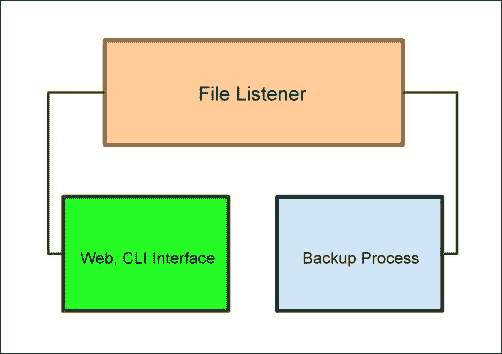
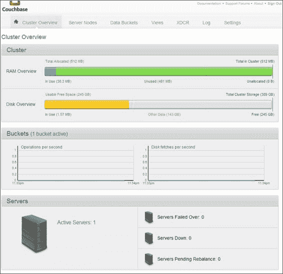
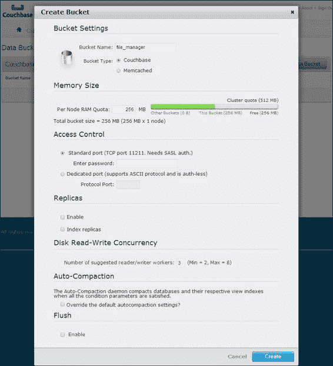
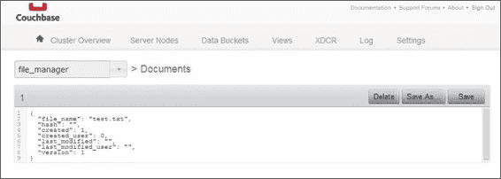
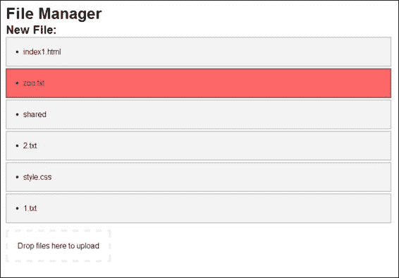
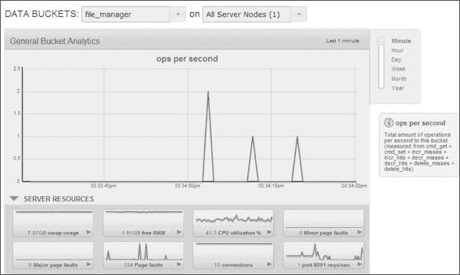

# 第八章。并发应用程序架构

到目前为止，我们已经设计了一些并发程序的小部分，主要是在一个单一的部分中保持并发性。但我们还没有把所有东西联系起来，构建出更强大、更复杂、从管理员的角度来看更具挑战性的东西。

简单的聊天应用程序和 Web 服务器都很好。然而，最终您将需要更多的复杂性，并需要外部软件来满足所有更高级的要求。

在这种情况下，我们将构建一些由几个不协调的服务满足的东西：一个带有修订控制的文件管理器，提供 Web 和 Shell 访问。像 Dropbox 和 Google Drive 这样的服务允许用户在同行之间保留和共享文件。另一方面，GitHub 及其类似的服务允许使用类似的平台，但具有关键的修订控制的额外好处。

许多组织面临以下共享和分发选项的问题：

+   对存储库、存储空间或文件数量的限制

+   如果服务中断，可能导致无法访问

+   安全问题，特别是涉及敏感信息

简单的共享应用程序，如 Dropbox 和 Google Drive，在没有大量修订控制选项的情况下存储数据。GitHub 是一个出色的协作修订控制和分发系统，但伴随着许多成本，开发人员的错误可能导致严重的安全漏洞。

我们将结合版本控制的目标（以及 GitHub 的理想）与 Dropbox/Google Drive 的简单性和开放性。这种类型的应用程序将作为内部网络替代品非常完美——完全隔离并且可通过自定义身份验证访问，不一定依赖于云服务。将所有内容保留在内部消除了任何网络安全问题的潜在可能，并允许管理员设计符合其组织需求的永久备份解决方案。

组织内的文件共享将允许从命令行进行分叉、备份、文件锁定和修订控制，同时也可以通过简单的 Web 界面进行。

# 设计我们的并发应用程序

在设计并发应用程序时，我们将有三个在单独进程中运行的组件。文件监听器将被警报以对指定位置的文件进行更改。Web-CLI 界面将允许用户增加或修改文件，并且备份过程将绑定到监听器，以提供新文件更改的自动副本。考虑到这一点，这三个过程将看起来有点像下图所示的样子：



我们的文件监听器进程将执行以下三项任务：

+   密切关注任何文件更改

+   向我们的 Web/CLI 服务器和备份过程进行广播

+   维护我们的数据库/数据存储中任何给定文件的状态

备份过程将接受文件监听器(#2)的任何广播，并以迭代设计创建备份文件。

我们的通用服务器（Web 和 CLI）将报告有关个别文件的详细信息，并允许使用可定制的语法进行前后版本控制。该应用程序的这一部分还必须在提交新文件或请求修订时向文件监听器进行广播。

# 确定我们的需求

我们的架构设计过程中最关键的一步是真正关注我们需要实现的功能、包和技术。对于我们的文件管理和修订控制应用程序，有一些关键点将突出显示：

+   允许文件上传、下载和修订的 Web 界面。

+   允许我们回滚更改并直接修改文件的命令行界面。

+   一个文件系统监听器，用于查找对共享位置所做的更改。

+   一个具有强大的 Go 关联性的数据存储系统，允许我们以基本一致的方式维护有关文件和用户的信息。该系统还将维护用户记录。

+   一个维护和循环更改文件日志的并发日志系统。

我们允许以下三种不同的方式与整个应用程序进行交互，这在某种程度上使事情变得复杂：

+   通过需要用户和登录的 Web。这也允许我们的用户访问和修改文件，即使他们可能在某个地方没有连接到共享驱动器。

+   通过命令行。这是过时的，但对于用户遍历文件系统，特别是不在 GUI 中的高级用户来说，它也是非常有价值的。

+   通过自身改变的文件系统。这是共享驱动机制，我们假设任何有权访问的用户都将对任何文件进行有效修改。

为了处理所有这些，我们可以确定一些关键的技术如下：

+   一个用于管理文件系统修订的数据库或数据存储。在选择事务性、ACID 兼容的 SQL 和 NoSQL 中的快速文档存储时，权衡通常是性能与一致性之间的权衡。然而，由于我们的大部分锁定机制将存在于应用程序中，复制锁定（即使在行级别）将增加潜在的缓慢和不需要的混乱。因此，我们将利用 NoSQL 解决方案。

+   这个解决方案需要很好地处理并发。

+   我们将使用一个 Web 界面，它引入了强大而干净的路由/多路复用，并与 Go 的强大内置模板系统很好地配合。

+   一个文件系统通知库，允许我们监视文件的更改以及备份修订。

我们发现或构建的任何解决方案都需要高度并发和非阻塞。我们要确保不允许对文件进行同时更改，包括对我们内部修订的更改。

考虑到所有这些，让我们逐个识别我们的部分，并决定它们在我们的应用程序中的作用。

我们还将提出一些备选方案，这些选项可以在不损害功能或核心要求的情况下进行交换。这将允许在平台或偏好使我们的主要选项不可取的情况下具有一定的灵活性。每当我们设计一个应用程序时，了解其他可能的选择是个好主意，以防软件（或其使用条款）发生变化，或者在未来的规模上不再满意使用。

让我们从我们的数据存储开始。

# 在 Go 中使用 NoSQL 作为数据存储

使用 NoSQL 的最大让步之一显然是在进行 CRUD 操作（创建、读取、更新和删除）时缺乏标准化。SQL 自 1986 年以来一直是标准化的，并且在许多数据库中非常严密——从 MySQL 到 SQL Server，从微软和甲骨文一直到 PostgreSQL。

### 注意

您可以在[`nosql-database.org/`](http://nosql-database.org/)上阅读更多关于 NoSQL 和各种 NoSQL 平台的信息。

Martin Fowler 在他的书《NoSQL Distilled》中也写了一篇关于这个概念和一些用例的流行介绍，网址为[`martinfowler.com/books/nosql.html`](http://martinfowler.com/books/nosql.html)。

根据 NoSQL 平台的不同，您还可能失去 ACID 兼容性和耐久性。这意味着您的数据不是 100%安全——如果服务器崩溃，如果读取过时或不存在的数据等，可能会有事务丢失。后者被称为脏读。

所有这些都值得注意，因为它适用于我们的应用程序，特别是在并发性方面，因为我们在前几章中已经谈到了其中一个潜在的第三方瓶颈。

对于我们在 Go 中的文件共享应用程序，我们将利用 NoSQL 来存储有关文件的元数据以及修改/交互这些文件的用户。

在选择 NoSQL 数据存储时，我们有很多选择，几乎所有主要的数据存储都在 Go 中有库或接口。虽然我们在这里选择了 Couchbase，但我们也会简要讨论一些其他主要的竞争对手以及每个的优点。

以下各节中的代码片段也应该让你对如何在不太焦虑的情况下将 Couchbase 替换为其他任何一个有一些想法。虽然我们不会深入研究其中任何一个，但为了确保易于交换，用于维护文件和修改信息的代码将尽可能通用。

## MongoDB

MongoDB 是最受欢迎的 NoSQL 平台之一。它是在 2009 年编写的，也是最成熟的平台之一，但也带来了一些权衡，这使得它在近年来有些失宠。

即便如此，Mongo 以可靠的方式完成了它的任务，并且速度非常快。使用索引，就像大多数数据库和数据存储一样，极大地提高了读取的查询速度。

Mongo 还允许对读取、写入和一致性的保证进行非常精细的控制。你可以将其视为对支持语法脏读的任何语言和/或引擎的非常模糊的类比。

最重要的是，Mongo 在 Go 中很容易支持并发，并且隐式地设计用于分布式系统。

### 注意

Mongo 的最大 Go 接口是`mgo`，可以在以下网址找到：[`godoc.org/labix.org/v2/mgo`](http://godoc.org/labix.org/v2/mgo)。

如果你想在 Go 中尝试 Mongo，将数据存储记录注入自定义结构是一个相对简单的过程。以下是一个快速而简单的例子：

```go
import
(
    "labix.org/v2/mgo"
    "labix.org/v2/mgo/bson"
)

type User struct {
  name string
}

func main() {
  servers, err := mgo.Dial("localhost")
  defer servers.Close()
  data := servers.DB("test").C("users")
  result := User{}
  err = c.Find(bson.M{"name": "John"}).One(&result)
}
```

与其他 NoSQL 解决方案相比，Mongo 的一个缺点是它默认没有任何 GUI。这意味着我们要么需要绑定另一个应用程序或 Web 服务，要么坚持使用命令行来管理其数据存储。对于许多应用程序来说，这并不是什么大问题，但我们希望尽可能地将这个项目分隔和局部化，以限制故障点。

Mongo 在容错性和数据丢失方面也有点名声不佳，但这同样适用于许多 NoSQL 解决方案。此外，这在很多方面是一个快速数据存储的特性——因此，灾难恢复往往是以速度和性能为代价的。

可以说这是对 Mongo 及其同行的一种普遍夸大的批评。Mongo 会出现问题吗？当然会。管理的基于 Oracle 的系统也会出现问题吗？当然会。在这个领域减轻大规模故障更多地是系统管理员的责任，而不是软件本身，后者只能提供设计这样的应急计划所需的工具。

尽管如此，我们希望有一个快速和高可用的管理界面，因此 Mongo 不符合我们的要求，但如果这些要求不那么受重视，它可以很容易地插入到这个解决方案中。

## Redis

Redis 是另一个键/值数据存储，最近成为了总使用量和受欢迎程度方面的第一名。在理想的 Redis 世界中，整个数据集都保存在内存中。鉴于许多数据集的大小，这并不总是可能的；然而，结合 Redis 的能力来摒弃持久性，当在并发应用程序中使用时，这可能会产生一些非常高性能的结果。

Redis 的另一个有用的特性是它可以固有地保存不同的数据结构。虽然你可以通过在 Mongo（和其他数据存储）中取消编组 JSON 对象/数组来对这些数据进行抽象，但 Redis 可以处理集合、字符串、数组和哈希。

在 Go 中，有两个主要被接受的 Redis 库：

+   **Radix**：这是一个极简主义的客户端，简洁、快速而简单。要安装 Radix，请运行以下命令：

```go
go get github.com/fzzy/radix/redis

```

+   **Redigo**：这更加强大，稍微复杂一些，但提供了许多更复杂的功能，我们可能在这个项目中不需要。要安装 Redigo，请运行以下命令：

```go
go get github.com/garyburd/redigo/redis

```

现在我们将看一个快速的例子，使用 Redigo 从 Redis 的`Users`数据存储中获取用户的名称：

```go
package main

import
(
    "fmt"
    "github.com/garyburd/redigo/redis"
)

func main() {

  connection,_ := dial()
  defer connection.Close()

  data, err := redis.Values(connection.Do("SORT", "Users", "BY", "User:*->name", 
    "GET", "User:*->name"))

  if (err) {
    fmt.Println("Error getting values", err)
  }

  for i:= range data {
    var Uname string
    data,err := redis.Scan(data, &Uname)
    if (err) {
      fmt.Println("Error getting value",err)
    }else {
      fmt.Println("Name Uname")
    }
  }
}
```

在审查这一点时，您可能会注意到一些非程序访问语法，例如以下内容：

```go
  data, err := redis.Values(connection.Do("SORT", "Users", "BY", "User:*->name", 
    "GET", "User:*->name"))
```

这确实是为什么 Go 中的 Redis 不会成为我们这个项目的选择之一的原因之一——这两个库都提供了对某些功能的几乎 API 级别的访问，还提供了一些更详细的内置功能，用于直接交互。`Do`命令直接将查询传递给 Redis，如果需要使用库，这是可以的，但在整体上是一个不太优雅的解决方案。

这两个库都非常好地与 Go 的并发特性配合，您在通过它们之一进行非阻塞网络调用到 Redis 时不会遇到任何问题。

值得注意的是，Redis 仅支持 Windows 的实验性构建，因此这主要用于*nix 平台。现有的端口来自 Microsoft，可以在[`github.com/MSOpenTech/redis`](https://github.com/MSOpenTech/redis)找到。

## Tiedot

如果您已经大量使用 NoSQL，那么前面提到的引擎对您来说可能都很熟悉。Redis、Couch、Mongo 等在这个相对年轻的技术中都是虚拟的支柱。

另一方面，Tiedot 可能不太熟悉。我们在这里包括它，只是因为文档存储本身是直接用 Go 编写的。文档操作主要通过 Web 界面处理，它是一个像其他几种 NoSQL 解决方案一样的 JSON 文档存储。

由于文档访问和处理是通过 HTTP 进行的，所以工作流程有点违反直觉，如下所示：


由于这引入了潜在的延迟或故障点，这使得它不是我们这里的理想解决方案。请记住，这也是之前提到的一些其他解决方案的特点，但由于 Tiedot 是用 Go 编写的，因此连接到它并使用包读取/修改数据将会更容易。在撰写本书时，这是不存在的。

与 CouchDB 等基于 HTTP 或 REST 的替代方案不同，Tiedot 依赖于 URL 端点来指示操作，而不是 HTTP 方法。

您可以在以下代码中看到我们如何通过标准库处理类似的事情：

```go
package main

import
(
  "fmt"
  "json"
  "http"
)

type Collection struct {
  Name string
}
```

简单地说，这是您希望通过数据选择、查询等方式引入到 Go 应用程序中的任何记录的数据结构。您在我们之前使用 SQL 服务器本身时看到了这一点，这并没有什么不同：

```go
func main() {

  Col := Collection{
    Name: ''
  }

  data, err := http.Get("http://localhost:8080/all")
  if (err != nil) {
    fmt.Println("Error accessing tiedot")
  }
  collections,_ = json.Unmarshal(data,&Col)
}
```

尽管不像许多同行那样健壮、强大或可扩展，Tiedot 肯定值得玩耍，或者更好的是，值得贡献。

### 注意

您可以在[`github.com/HouzuoGuo/tiedot`](https://github.com/HouzuoGuo/tiedot)找到 Tiedot。

## CouchDB

Apache 孵化器的 CouchDB 是 NoSQL 大数据中的另一个重要角色。作为一个 JSON 文档存储，CouchDB 在数据存储方法方面提供了很大的灵活性。

CouchDB 支持 ACID 语义，并且可以同时执行，这在某种程度上提供了很大的性能优势。在我们的应用程序中，对 ACID 一致性的依赖性是相对灵活的。从设计上讲，它将是容错和可恢复的，但对于许多人来说，即使是可恢复的数据丢失的可能性仍然被认为是灾难性的。

与 CouchDB 的接口是通过 HTTP 进行的，这意味着不需要直接实现或 Go SQL 数据库钩子来使用它。有趣的是，CouchDB 使用 HTTP 头语法来操作数据，如下所示：

+   **GET**：这代表读取操作

+   **PUT**：这代表创建操作

+   **DELETE**：这代表删除和更新操作

当然，这些最初是在 HTTP 1.1 中的标头方法，但是 Web 的很多部分都集中在 GET/POST 上，这些方法往往会在混乱中失去。

Couch 还配备了一个方便的 Web 界面进行管理。当 CouchDB 运行时，您可以在`http://localhost:5984/_utils/`访问它，如下面的截图所示：


也就是说，有一些包装器为一些更复杂和高级的功能提供了一定程度的抽象。

## Cassandra

Cassandra，作为 Apache 基金会的另一个项目，技术上并不是一个 NoSQL 解决方案，而是一个集群（或可集群化）的数据库管理平台。

与许多 NoSQL 应用程序一样，Cassandra 的传统查询方法存在一些限制，例如，通常不支持子查询和连接。

我们在这里提到它主要是因为它专注于分布式计算以及以编程方式调整数据一致性或性能的能力。Couchbase 同样也表达了很多这些内容，但 Cassandra 更加专注于分布式数据存储。

然而，Cassandra 支持一部分 SQL，这将使它对于那些涉足过 MySQL、PostgreSQL 或类似数据库的开发人员来说更加熟悉。Cassandra 对高并发集成的内置处理在很多方面使其对 Go 来说是理想的，尽管对于这个项目来说有些过度。

与 Cassandra 进行接口的最值得注意的库是 gocql，它专注于速度和与 Cassandra 连接的清晰性。如果您选择使用 Cassandra 而不是 Couchbase（或其他 NoSQL），您会发现许多方法可以简单地替换。

以下是连接到集群并编写简单查询的示例：

```go
package main

import
(
    "github.com/gocql/gocql"
    "log"
)

func main() {

  cass := gocql.NewCluster("127.0.0.1")
  cass.Keyspace = "filemaster"
  cass.Consistency = gocql.LocalQuorum

  session, _ := cass.CreateSession()
  defer session.Close()

  var fileTime int;

  if err := session.Query(`SELECT file_modified_time FROM filemaster 
  WHERE filename = ? LIMIT 1`, "test.txt").Consistency(gocql.One).Scan(&fileTime); err != nil {
    log.Fatal(err)
  }
  fmt.Println("Last modified",fileTime)
}
```

如果您计划快速扩展此应用程序、广泛分发它，或者对 SQL 比数据存储/JSON 访问更熟悉，那么 Cassandra 可能是一个理想的解决方案。

对于我们的目的来说，SQL 不是必需的，我们更看重速度，包括耐久性在内。

## Couchbase

Couchbase 是该领域的一个相对新手，但它是由 CouchDB 和 memcached 的开发人员构建的。它是用 Erlang 编写的，与我们期望从我们的许多 Go 应用程序中获得的并发性、速度和非阻塞行为有许多相同的关注点。

Couchbase 还支持我们在前几章中讨论的许多其他功能，包括易于分发的安装、可调的 ACID 兼容性和低资源消耗。

Couchbase 的一个缺点是它在一些资源较低的机器或虚拟机上运行效果不佳（或根本无法运行）。确实，64 位安装至少需要 4GB 内存和四个核心，所以不要指望在小型、中小型实例或旧硬件上启动它。

虽然这里（或其他地方）提出的大多数 NoSQL 解决方案通常比它们的 SQL 对应方案具有性能优势，但 Couchbase 在 NoSQL 领域中表现得非常出色。

Couchbase，如 CouchDB 一样，配备了一个基于 Web 的图形界面，简化了设置和维护的过程。在设置中，您可以使用的高级功能包括基本存储引擎（Couchbase 或 memcached）、自动备份过程（副本）和读写并发级别。

除了配置和管理工具，它还在 Web 仪表板中提供了一些实时监控，如下面的截图所示：



虽然不能完全替代完整的服务器管理（当服务器宕机时，你没有洞察力会发生什么），但知道你的资源究竟去了哪里，而不需要命令行方法或外部工具，这非常有帮助。

Couchbase 中的术语略有不同，就像在许多这些解决方案中一样。对稍微将 NoSQL 与古板的旧 SQL 解决方案分开的渴望会不时地显现出来。

在 Couchbase 中，数据库是一个数据存储桶，记录是文档。然而，视图，作为一个旧的事务性 SQL 标准，为表格带来了一些熟悉的东西。这里的重点是，视图允许您使用简单的 JavaScript 创建更复杂的查询，在某些情况下，可以复制否则难以实现的功能，如连接、联合和分页。

在 Couchbase 中创建的每个视图都成为一个 HTTP 访问点。因此，您命名为`select_all_files`的视图将可以通过 URL 访问，例如`http://localhost:8092/file_manager/_design/select_all_files/_view/Select%20All%20Files?connection_timeout=60000&limit=10&skip=0`。

最值得注意的 Couchbase 接口库是 Go Couchbase，如果没有其他选择，它可能会让您免受在代码中进行 HTTP 调用以访问 CouchDB 的冗余之苦。

### 注意

Go Couchbase 可以在[`github.com/couchbaselabs/go-couchbase`](https://github.com/couchbaselabs/go-couchbase)找到。

Go Couchbase 通过 Go 抽象简单而强大地与 Couchbase 进行接口交互。以下代码以精简的方式连接并获取有关各种数据池的信息，感觉自然而简单：

```go
package main

import
(
  "fmt"
  "github.com/couchbaselabs/go-couchbase"
)

func main() {

    conn, err := couchbase.Connect("http://localhost:8091")
    if err != nil {
      fmt.Println("Error:",err)
    }
    for _, pn := range conn.Info.Pools {
        fmt.Printf("Found pool:  %s -> %s\n", pn.Name, pn.URI)
    }
}
```

## 设置我们的数据存储

安装 Couchbase 后，默认情况下可以通过 localhost 和端口 8091 访问其管理面板。

您将有机会设置管理员、其他 IP 连接（如果加入集群）和一般数据存储设计。

之后，您需要设置一个存储桶，这是我们用来存储有关单个文件的所有信息的地方。以下是存储桶设置的界面：



在我们的示例中，我们正在使用单台机器，因此不支持副本（在数据库术语中也称为复制）。我们将其命名为`file_manager`，但这显然可以称为任何有意义的东西。

我们还将保持数据使用量相当低——当我们存储文件操作并记录较旧的操作时，没有必要使用超过 256MB 的内存。换句话说，我们并不一定关心将`test.txt`的修改历史永远保存在内存中。

我们还将使用 Couchbase 作为存储引擎等效，尽管您可以在 memcache(d)之间来回切换而几乎没有注意到的变化。

让我们首先创建一个种子文档：稍后我们将删除的文档，但它将代表我们的数据存储架构。我们可以使用任意的 JSON 结构化对象创建此文档，如下面的屏幕截图所示：



由于存储在此数据存储中的所有内容都应为有效的 JSON，因此我们可以混合和匹配字符串、整数、布尔值、数组和对象。这为我们提供了一些在使用数据时的灵活性。以下是一个示例文档：

```go
{
  "file_name": "test.txt",
  "hash": "",
  "created": 1,
  "created_user": 0,
  "last_modified": "",
  "last_modified_user": "",
  "revisions": [],
  "version": 1
}
```

# 监视文件系统更改

在选择 NoSQL 选项时，我们可以选择各种各样的解决方案。但是当涉及到监视文件系统更改的应用程序时，情况就不一样了。虽然 Linux 版本在 inotify 中有一个相当不错的内置解决方案，但这限制了应用程序的可移植性。

因此，Chris Howey 的 fsnotify 中存在一个处理这个问题的跨平台库非常有帮助。

Fsnotify 在 Linux、OSX 和 Windows 上运行，并允许我们检测任何给定目录中的文件何时被创建、删除、修改或重命名，这对我们的目的来说已经足够了。

实现 fsnotify 也非常容易。最重要的是，它都是非阻塞的，因此，如果我们将监听器放在 goroutine 后面，我们可以将其作为主服务器应用程序代码的一部分运行。

以下代码显示了一个简单的目录监听器：

```go
package main

import (
    "github.com/howeyc/fsnotify""fmt"
  "log""
)

func main() {

    scriptDone := make(chan bool)
    dirSpy, err := fsnotify.NewWatcher()
    if err != nil {
        log.Fatal(err)
    }

    go func() {
        for {
            select {
            case fileChange := <-dirSpy.Event:
                log.Println("Something happened to a file:", 
                  fileChange)
            case err := <-dirSpy.Error:
                log.Println("Error with fsnotify:", err)
            }
        }
    }()

    err = dirSpy.Watch("/mnt/sharedir")
    if err != nil {
      fmt.Println(err)
    }

    <-scriptDone

    dirSpy.Close()
}
```

# 管理日志文件

与许多开发人员工具箱中的基本功能一样，Go 提供了一个相当完整的内置日志记录解决方案。它处理许多基本功能，例如创建时间戳标记的日志项并保存到磁盘或控制台。

基本包遗漏的一件事是内置格式化和日志轮换，这是我们的文件管理器应用程序的关键要求。

请记住，我们的应用程序的关键要求包括能够在并发环境中无缝工作，并且在需要时能够准备好扩展到分布式网络。这就是 fine **log4go**应用程序派上用场的地方。Log4go 允许将日志记录到文件、控制台和内存，并且内在地处理日志轮换。

### 注意

Log4go 可以在[`code.google.com/p/log4go/`](https://code.google.com/p/log4go/)找到。

要安装 Log4go，请运行以下命令：

```go
go get code.google.com/p/log4go

```

创建一个处理警告、通知、调试信息和关键错误的日志文件很简单，并且将日志轮换附加到其中同样简单，如下面的代码所示：

```go
package main

import
(
  logger "code.google.com/p/log4go"
)
func main() {
  logMech := make(logger.Logger);
  logMech.AddFilter("stdout", logger.DEBUG, 
    logger.NewConsoleLogWriter())

  fileLog := logger.NewFileLogWriter("log_manager.log", false)
  fileLog.SetFormat("[%D %T] [%L] (%S) %M")
  fileLog.SetRotate(true)
  fileLog.SetRotateSize(256)
  fileLog.SetRotateLines(20)
  fileLog.SetRotateDaily(true)
  logMech.AddFilter("file", logger.FINE, fileLog)

  logMech.Trace("Received message: %s)", "All is well")
  logMech.Info("Message received: ", "debug!")
  logMech.Error("Oh no!","Something Broke")
}
```

# 处理配置文件

在处理配置文件和解析它们时，您有很多选择，从简单到复杂。

当然，我们可以简单地将所需内容存储为 JSON，但是该格式对于人类来说有点棘手——它需要转义字符等，这使其容易出现错误。

相反，我们将使用 gcfg 中的标准`ini config`文件库来简化事务，该库处理`gitconfig`文件和传统的旧式`.ini`格式，如下面的代码片段所示：

```go
[revisions]
count = 2
revisionsuffix = .rev
lockfiles = false

[logs]
rotatelength = 86400

[alarms]
emails = sysadmin@example.com,ceo@example.com
```

### 注意

您可以在[`code.google.com/p/gcfg/`](https://code.google.com/p/gcfg/)找到 gcfg。

基本上，该库获取配置文件的值并将其推送到 Go 中的结构体中。我们将如何做到这一点的示例如下：

```go
package main

import
(
  "fmt"
  "code.google.com/p/gcfg"
)

type Configuration struct {
  Revisions struct {
    Count int
    Revisionsuffix string
    Lockfiles bool
  }
  Logs struct {
    Rotatelength int
  }
  Alarms struct {
    Emails string
  }
}

func main() {
  configFile := Configuration{}
  err := gcfg.ReadFileInto(&configFile, "example.ini")
  if err != nil {
    fmt.Println("Error",err)
  }
  fmt.Println("Rotation duration:",configFile.Logs.Rotatelength)
}
```

# 检测文件更改

现在我们需要专注于我们的文件监听器。您可能还记得，这是应用程序的一部分，它将接受来自我们的 Web 服务器和备份应用程序的客户端连接，并通知文件的任何更改。

这部分的基本流程如下：

1.  在 goroutine 中监听文件的更改。

1.  在 goroutine 中接受连接并添加到池中。

1.  如果检测到任何更改，则向整个池通知它们。

所有三个操作同时发生，第一个和第三个操作可以在池中没有任何连接的情况下发生，尽管我们假设总会有一个连接始终与我们的 Web 服务器和备份应用程序保持连接。

文件监听器将扮演的另一个关键角色是在首次加载时分析目录并将其与我们在 Couchbase 中的数据存储进行协调。由于 Go Couchbase 库处理获取、更新和添加操作，我们不需要任何自定义视图。在下面的代码中，我们将检查文件监听器进程，并展示如何监听文件夹的更改：

```go
package main

import
(
  "fmt"
  "github.com/howeyc/fsnotify"
  "net"
  "time"
  "io"  
  "io/ioutil"
  "github.com/couchbaselabs/go-couchbase"
  "crypto/md5"
  "encoding/hex"
  "encoding/json"  
  "strings"

)

var listenFolder = "mnt/sharedir"

type Client struct {
  ID int
  Connection *net.Conn  
}
```

在这里，我们声明了我们的共享文件夹以及一个连接的`Client`结构。在这个应用程序中，`Client`可以是 Web 监听器或备份监听器，并且我们将使用以下 JSON 编码结构单向传递消息：

```go
type File struct {
  Hash string "json:hash"
  Name string "json:file_name"
  Created int64 "json:created"
  CreatedUser  int "json:created_user"
  LastModified int64 "json:last_modified"
  LastModifiedUser int "json:last_modified_user"
  Revisions int "json:revisions"
  Version int "json:version"
}
```

如果这看起来很熟悉，那可能是因为这也是我们最初设置的示例文档格式。

### 注意

如果您对之前表达的语法糖不熟悉，这些被称为结构标签。标签只是可以应用于结构字段的附加元数据，以便通过`reflect`包进行键/值查找。在这种情况下，它们用于将我们的结构字段映射到 JSON 字段。

让我们首先看一下我们的整体`Message struct`：

```go
type Message struct {
  Hash string "json:hash"
  Action string "json:action"
  Location string "json:location"  
  Name string "json:name"
  Version int "json:version"
}
```

我们将我们的文件分成一个消息，用于通知我们的其他两个进程发生了更改：

```go
func generateHash(name string) string {

  hash := md5.New()
  io.WriteString(hash,name)
  hashString := hex.EncodeToString(hash.Sum(nil))

  return hashString
}
```

这是一种相对不可靠的方法，用于生成文件的哈希引用，如果文件名更改，它将失败。但是，它允许我们跟踪创建、删除或修改的文件。

## 向客户端发送更改

这是发送到所有现有连接的广播消息。我们传递我们的 JSON 编码的`Message`结构，其中包含当前版本、当前位置和用于参考的哈希。然后我们的其他服务器将相应地做出反应：

```go
func alertServers(hash string, name string, action string, location string, version int) {

  msg := Message{Hash:hash,Action:action,Location:location,Name:name,Version:version}
  msgJSON,_ := json.Marshal(msg)

  fmt.Println(string(msgJSON))

  for i := range Clients {
    fmt.Println("Sending to clients")
    fmt.Fprintln(*Clients[i].Connection,string(msgJSON))
  }
}
```

我们的备份服务器将在备份文件夹中创建带有`.[VERSION]`扩展名的文件副本。

我们的 Web 服务器将通过 Web 界面简单地通知用户文件已更改：

```go
func startServer(listener net.Listener) {
  for {  
    conn,err := listener.Accept()
    if err != nil {

    }
    currentClient := Client{ ID: 1, Connection: &conn}
    Clients = append(Clients,currentClient)
      for i:= range Clients {
        fmt.Println("Client",Clients[i].ID)
      }    
  }  

}
```

这段代码看起来熟悉吗？我们几乎完全复制了我们的聊天服务器`Client`处理程序并将其几乎完整地带到这里：

```go
func removeFile(name string, bucket *couchbase.Bucket) {
  bucket.Delete(generateHash(name))
}
```

`removeFile`函数只做一件事，那就是从我们的 Couchbase 数据存储中删除文件。由于它是反应性的，我们不需要在文件服务器端做任何事情，因为文件已经被删除。此外，没有必要删除任何备份，因为这使我们能够恢复。接下来，让我们看一下我们的更新现有文件的函数：

```go
func updateExistingFile(name string, bucket *couchbase.Bucket) int {
  fmt.Println(name,"updated")
  hashString := generateHash(name)

  thisFile := Files[hashString]
  thisFile.Hash = hashString
  thisFile.Name = name
  thisFile.Version = thisFile.Version + 1
  thisFile.LastModified = time.Now().Unix()
  Files[hashString] = thisFile
  bucket.Set(hashString,0,Files[hashString])
  return thisFile.Version
}
```

这个函数本质上是用新值覆盖 Couchbase 中的任何值，复制现有的`File`结构并更改`LastModified`日期：

```go
func evalFile(event *fsnotify.FileEvent, bucket *couchbase.Bucket) {
  fmt.Println(event.Name,"changed")
  create := event.IsCreate()
  fileComponents := strings.Split(event.Name,"\\")
  fileComponentSize := len(fileComponents)
  trueFileName := fileComponents[fileComponentSize-1]
  hashString := generateHash(trueFileName)

  if create == true {
    updateFile(trueFileName,bucket)
    alertServers(hashString,event.Name,"CREATE",event.Name,0)
  }
  delete := event.IsDelete()
  if delete == true {
    removeFile(trueFileName,bucket)
    alertServers(hashString,event.Name,"DELETE",event.Name,0)    
  }
  modify := event.IsModify()
  if modify == true {
    newVersion := updateExistingFile(trueFileName,bucket)
    fmt.Println(newVersion)
    alertServers(hashString,trueFileName,"MODIFY",event.Name,newVersion)
  }
  rename := event.IsRename()
  if rename == true {

  }
}
```

在这里，我们对我们监视目录中文件系统的任何更改做出反应。我们不会对重命名做出反应，但您也可以处理这些情况。以下是我们处理一般`updateFile`函数的方法：

```go
func updateFile(name string, bucket *couchbase.Bucket) {
  thisFile := File{}
  hashString := generateHash(name)

  thisFile.Hash = hashString
  thisFile.Name = name
  thisFile.Created = time.Now().Unix()
  thisFile.CreatedUser = 0
  thisFile.LastModified = time.Now().Unix()
  thisFile.LastModifiedUser = 0
  thisFile.Revisions = 0
  thisFile.Version = 1

  Files[hashString] = thisFile

  checkFile := File{}
  err := bucket.Get(hashString,&checkFile)
  if err != nil {
    fmt.Println("New File Added",name)
    bucket.Set(hashString,0,thisFile)
  }
}
```

## 检查与 Couchbase 的记录

在检查现有记录与 Couchbase 相对时，我们检查 Couchbase 存储桶中是否存在哈希。如果不存在，我们就创建它。如果存在，我们就什么都不做。为了更可靠地处理关闭，我们还应该将现有记录纳入我们的应用程序。执行此操作的代码如下：

```go
var Clients []Client
var Files map[string] File

func main() {
  Files = make(map[string]File)
  endScript := make(chan bool)

  couchbaseClient, err := couchbase.Connect("http://localhost:8091/")
    if err != nil {
      fmt.Println("Error connecting to Couchbase", err)
    }
  pool, err := couchbaseClient.GetPool("default")
    if err != nil {
      fmt.Println("Error getting pool",err)
    }
  bucket, err := pool.GetBucket("file_manager")
    if err != nil {
      fmt.Println("Error getting bucket",err)
    }  

  files, _ := ioutil.ReadDir(listenFolder)
  for _, file := range files {
    updateFile(file.Name(),bucket)
  }

    dirSpy, err := fsnotify.NewWatcher()
    defer dirSpy.Close()

  listener, err := net.Listen("tcp", ":9000")
  if err != nil {
    fmt.Println ("Could not start server!",err)
  }

  go func() {
        for {
            select {
            case ev := <-dirSpy.Event:
                evalFile(ev,bucket)
            case err := <-dirSpy.Error:
                fmt.Println("error:", err)
            }
        }
    }()
    err = dirSpy.Watch(listenFolder)  
  startServer(listener)

  <-endScript
}
```

最后，`main()`处理设置我们的连接和 goroutines，包括文件监视器、TCP 服务器和连接到 Couchbase。

现在，让我们看一下整个过程中的另一个步骤，我们将自动创建我们修改后的文件的备份。

# 备份我们的文件

由于我们可以说是在网络上发送我们的命令，因此我们的备份过程需要在该网络上侦听并响应任何更改。鉴于修改将通过本地主机发送，我们在网络和文件方面应该有最小的延迟。

我们还将返回一些关于文件发生了什么的信息，尽管在这一点上我们对这些信息并没有做太多处理。这段代码如下：

```go
package main

import
(
  "fmt"
  "net"
  "io"
  "os"
  "strconv"
  "encoding/json"
)

var backupFolder = "mnt/backup/"
```

请注意，我们有一个专门用于备份的文件夹，在这种情况下是在 Windows 机器上。如果我们不小心使用相同的目录，我们就有无限复制和备份文件的风险。在下面的代码片段中，我们将看一下`Message`结构本身和`backup`函数，这是应用程序的这一部分的核心：

```go
type Message struct {
  Hash string "json:hash"
  Action string "json:action"
  Location string "json:location"
  Name string "json:name"  
  Version int "json:version"
}

func backup (location string, name string, version int) {

  newFileName := backupFolder + name + "." + 
    strconv.FormatInt(int64(version),10)
  fmt.Println(newFileName)
  org,_ := os.Open(location)
  defer org.Close()
  cpy,_ := os.Create(newFileName)
  defer cpy.Close()
  io.Copy(cpy,org)
}
```

这是我们的基本文件操作。Go 语言没有一步复制函数；相反，您需要创建一个文件，然后使用`io.Copy`将另一个文件的内容复制到其中：

```go
func listen(conn net.Conn) {
  for {

      messBuff := make([]byte,1024)
    n, err := conn.Read(messBuff)
    if err != nil {

    }

    resultMessage := Message{}
    json.Unmarshal(messBuff[:n],&resultMessage)

    if resultMessage.Action == "MODIFY" {
      fmt.Println("Back up file",resultMessage.Location)
      newVersion := resultMessage.Version + 1
      backup(resultMessage.Location,resultMessage.Name,newVersion)
    }

  }

}
```

这段代码几乎与我们的聊天客户端的`listen()`函数一字不差，只是我们获取了流式 JSON 数据的内容，对其进行解组，并将其转换为`Message{}`结构，然后是`File{}`结构。最后，让我们看一下`main`函数和 TCP 初始化：

```go
func main() {
  endBackup := make(chan bool)
  conn, err := net.Dial("tcp","127.0.0.1:9000")
  if err != nil {
    fmt.Println("Could not connect to File Listener!")
  }
  go listen(conn)

  <- endBackup
}
```

# 设计我们的 Web 界面

为了与文件系统交互，我们需要一个接口，显示所有当前文件的版本、最后修改时间和更改的警报，并允许拖放创建/替换文件。

获取文件列表将很简单，因为我们将直接从我们的`file_manager` Couchbase 存储桶中获取它们。更改将通过我们的文件管理器进程通过 TCP 发送，这将触发 API 调用，为我们的 Web 用户显示文件的更改。

我们在这里使用的一些方法是备份过程中使用的方法的副本，并且肯定可以从一些整合中受益；但以下是 Web 服务器的代码，它允许上传并显示更改的通知：

```go
package main

import
(
  "net"
  "net/http"
  "html/template"
  "log"
  "io"
  "os"
  "io/ioutil"
  "github.com/couchbaselabs/go-couchbase"
  "time"  
  "fmt"
  "crypto/md5"
  "encoding/hex"
  "encoding/json"
)

type File struct {
  Hash string "json:hash"
  Name string "json:file_name"
  Created int64 "json:created"
  CreatedUser  int "json:created_user"
  LastModified int64 "json:last_modified"
  LastModifiedUser int "json:last_modified_user"
  Revisions int "json:revisions"
  Version int "json:version"
}
```

例如，这是我们在文件监听器和备份过程中使用的相同的`File`结构：

```go
type Page struct {
  Title string
  Files map[string] File
}
```

我们的`Page`结构表示通用的 Web 数据，这些数据被转换为我们网页模板的相应变量：

```go
type ItemWrapper struct {

  Items []File
  CurrentTime int64
  PreviousTime int64

}

type Message struct {
  Hash string "json:hash"
  Action string "json:action"
  Location string "json:location"
  Name string "json:name"  
  Version int "json:version"
}
```

我们的`md5`哈希方法在这个应用程序中也是一样的。 值得注意的是，我们从文件监听器接收到信号时，会派生一个`lastChecked`变量，该变量是 Unix 风格的时间戳。 我们使用这个变量来与客户端文件更改进行比较，以便知道是否在 Web 上提醒用户。 现在让我们来看看 Web 界面的`updateFile`函数：

```go
func updateFile(name string, bucket *couchbase.Bucket) {
  thisFile := File{}
  hashString := generateHash(name)

  thisFile.Hash = hashString
  thisFile.Name = name
  thisFile.Created = time.Now().Unix()
  thisFile.CreatedUser = 0
  thisFile.LastModified = time.Now().Unix()
  thisFile.LastModifiedUser = 0
  thisFile.Revisions = 0
  thisFile.Version = 1

  Files[hashString] = thisFile

  checkFile := File{}
  err := bucket.Get(hashString,&checkFile)
  if err != nil {
    fmt.Println("New File Added",name)
    bucket.Set(hashString,0,thisFile)
  }else {
    Files[hashString] = checkFile
  }
}
```

这与我们备份过程中的函数相同，只是不是创建一个重复的文件，而是简单地覆盖我们的内部`File`结构，以便在下次调用`/api`时表示其更新的`LastModified`值。 和我们上一个例子一样，让我们来看看`listen()`函数：

```go
func listen(conn net.Conn) {
  for {

      messBuff := make([]byte,1024)
    n, err := conn.Read(messBuff)
    if err != nil {

    }
    message := string(messBuff[:n])
    message = message[0:]

    resultMessage := Message{}
    json.Unmarshal(messBuff[:n],&resultMessage)

    updateHash := resultMessage.Hash
    tmp := Files[updateHash]
    tmp.LastModified = time.Now().Unix()
    Files[updateHash] = tmp
  }

}
```

在这里，我们读取消息，解组并将其设置为其哈希映射的键。 如果文件不存在，这将创建一个文件，如果存在，则更新我们当前的文件。 接下来，我们将看看`main()`函数，它设置了我们的应用程序和 Web 服务器：

```go
func main() {
  lastChecked := time.Now().Unix()
  Files = make(map[string]File)
  fileChange = make(chan File)
  couchbaseClient, err := couchbase.Connect("http://localhost:8091/")
    if err != nil {
      fmt.Println("Error connecting to Couchbase", err)
    }
  pool, err := couchbaseClient.GetPool("default")
    if err != nil {
      fmt.Println("Error getting pool",err)
    }
  bucket, err := pool.GetBucket("file_manager")
    if err != nil {
      fmt.Println("Error getting bucket",err)
    }    

  files, _ := ioutil.ReadDir(listenFolder)
  for _, file := range files {
    updateFile(file.Name(),bucket)
  }

  conn, err := net.Dial("tcp","127.0.0.1:9000")
  if err != nil {
    fmt.Println("Could not connect to File Listener!")
  }
  go listen(conn)

  http.HandleFunc("/api", func(w http.ResponseWriter, r 
    *http.Request) {
    apiOutput := ItemWrapper{}
    apiOutput.PreviousTime = lastChecked
    lastChecked = time.Now().Unix()
    apiOutput.CurrentTime = lastChecked

    for i:= range Files {
      apiOutput.Items = append(apiOutput.Items,Files[i])
    }
    output,_ := json.Marshal(apiOutput)
    fmt.Fprintln(w,string(output))

  })
  http.HandleFunc("/", func(w http.ResponseWriter, r 
    *http.Request) {
    output := Page{Files:Files,Title:"File Manager"}
    tmp, _ := template.ParseFiles("ch8_html.html")
    tmp.Execute(w, output)
  })
  http.HandleFunc("/upload", func(w http.ResponseWriter, r 
    *http.Request) {
    err := r.ParseMultipartForm(10000000)
    if err != nil {
      return
    }
    form := r.MultipartForm

    files := form.File["file"]
    for i, _ := range files {
      newFileName := listenFolder + files[i].Filename
      org,_:= files[i].Open()
      defer org.Close()
      cpy,_ := os.Create(newFileName)
      defer cpy.Close()
      io.Copy(cpy,org)
    }
  })  

  log.Fatal(http.ListenAndServe(":8080",nil))

}
```

在我们的 Web 服务器组件中，`main()`负责设置与文件监听器和 Couchbase 的连接，并创建一个 Web 服务器（带有相关路由）。

如果您通过将文件拖放到**拖放文件到此处上传**框中上传文件，几秒钟后，您将看到文件在 Web 界面中被标记为已更改，如下面的屏幕截图所示：



我们没有包括 Web 界面客户端的代码； 但关键点是通过 API 检索。 我们使用了一个名为`Dropzone.js`的 JavaScript 库，它允许拖放上传，并使用 jQuery 进行 API 访问。

# 恢复文件的历史记录-命令行

我们想要添加到这个应用程序套件中的最后一个组件是一个命令行文件修订过程。 我们可以将这个过程保持相当简单，因为我们知道文件的位置，备份的位置以及如何用后者替换前者。 与以前一样，我们有一些全局配置变量和我们的`generateHash()`函数的复制：

```go
var liveFolder = "/mnt/sharedir "
var backupFolder = "/mnt/backup

func generateHash(name string) string {

  hash := md5.New()
  io.WriteString(hash,name)
  hashString := hex.EncodeToString(hash.Sum(nil))

  return hashString
}

func main() {
  revision := flag.Int("r",0,"Number of versions back")
  fileName := flag.String("f","","File Name")
  flag.Parse()

  if *fileName == "" {

    fmt.Println("Provide a file name to use!")
    os.Exit(0)
  }

  couchbaseClient, err := couchbase.Connect("http://localhost:8091/")
    if err != nil {
      fmt.Println("Error connecting to Couchbase", err)
    }
  pool, err := couchbaseClient.GetPool("default")
    if err != nil {
      fmt.Println("Error getting pool",err)
    }
  bucket, err := pool.GetBucket("file_manager")
    if err != nil {
      fmt.Println("Error getting bucket",err)
    }  

  hashString := generateHash(*fileName)
  checkFile := File{}    
  bucketerr := bucket.Get(hashString,&checkFile)
  if bucketerr != nil {

  }else {
    backupLocation := backupFolder + checkFile.Name + "." + strconv.FormatInt(int64(checkFile.Version-*revision),10)
    newLocation := liveFolder + checkFile.Name
    fmt.Println(backupLocation)
    org,_ := os.Open(backupLocation)
      defer org.Close()
    cpy,_ := os.Create(newLocation)
      defer cpy.Close()
    io.Copy(cpy,org)
    fmt.Println("Revision complete")
  }

}
```

这个应用程序最多接受两个参数：

+   `-f`：这表示文件名

+   `-r`：这表示要恢复的版本数

请注意，这本身会创建一个新版本，因此需要将-2 变为-3，然后为-6，以此类推，以便连续递归备份。

例如，如果您希望将`example.txt`还原为三个版本之前，您可以使用以下命令：

```go
fileversion -f example.txt -r -3

```

## 在守护程序和服务中使用 Go

关于运行这部分应用程序的一点说明——理想情况下，您希望将这些应用程序保持为活动的、可重启的服务，而不是独立的、手动执行的后台进程。 这样做将允许您保持应用程序的活动状态，并从外部或服务器进程管理其生命周期。

这种应用程序套件最适合在 Linux 框（或框）上，并使用像 daemontools 或 Ubuntu 内置的 Upstart 服务这样的守护程序管理器进行管理。 这样做的原因是，任何长期的停机时间都可能导致数据丢失和不一致。 即使在内存中存储文件数据细节（Couchbase 和 memcached）也会对数据丢失构成漏洞。

# 检查我们服务器的健康状况

有许多种方法可以检查一般服务器的健康状况，我们在这里处于一个良好的位置，而无需构建我们自己的系统，这在很大程度上要归功于 Couchbase 本身。 如果您访问 Couchbase Web 管理界面，在您的集群、服务器和存储桶视图下，单击任何一个都会显示一些实时统计信息，如下面的屏幕截图所示：



如果您希望将这些区域包含在应用程序中，以使您的日志记录和错误处理更全面，这些区域也可以通过 REST 访问。

# 总结

我们现在拥有一个从头到尾高度并发的应用程序套件，涉及多个第三方库，并通过记录和灾难恢复来减轻潜在的故障。

到这一点，你应该没有问题构建一个以 Go 语言为重点，专注于维护并发性、可靠性和性能的复杂软件包。我们的文件监控应用程序可以很容易地修改以执行更多操作，使用替代服务，或者扩展到一个强大的分布式环境。

在下一章中，我们将更仔细地测试我们的并发性和吞吐量，探讨 panic 和 recover 的价值，以及在 Go 语言中以安全并发的方式处理记录重要信息和错误。
